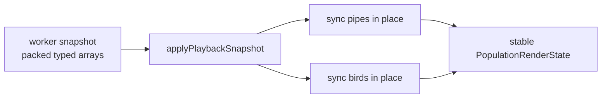

# browser-entry/playback/snapshot

Snapshot synchronization helpers for playback.

The worker streams packed typed-array snapshots, while the browser renderer
wants stable mutable arrays of pipes and birds. This module performs that
translation in place so playback can stay fast and allocation-light.

The design goal is stable browser-side state with minimal churn: allocate
when the population grows, then mutate in place for the steady-state render loop.

Snapshot flow:


Minimal example:
```ts
applyPlaybackSnapshot(renderState, payload.snapshot);
```

## browser-entry/playback/snapshot/playback.snapshot.services.ts

### applyPlaybackSnapshot

```ts
applyPlaybackSnapshot(
  renderState: PopulationRenderState,
  snapshot: EvolutionPlaybackStepSnapshot,
): void
```

Applies worker snapshot data to the mutable playback render state.

This is the top-level hydration step for one frame: copy scalar frame fields,
then synchronize packed pipe and bird arrays into reusable browser-side
objects.

Parameters:
- `renderState` - - Mutable render state mirror used by the browser.
- `snapshot` - - Worker playback snapshot for the current render tick.

Returns: Nothing.

### syncPlaybackSnapshotBirds

```ts
syncPlaybackSnapshotBirds(
  renderState: PopulationRenderState,
  snapshot: EvolutionPlaybackStepSnapshot,
): void
```

Synchronizes packed bird snapshot fields into the reusable render-state bird array.

This mirrors the pipe strategy: keep a stable array shape when possible and
update fields in place from the packed worker buffers.

Parameters:
- `renderState` - - Mutable render state mirror used by the browser.
- `snapshot` - - Packed worker playback snapshot for the current render tick.

Returns: Nothing.

### syncPlaybackSnapshotPipes

```ts
syncPlaybackSnapshotPipes(
  renderState: PopulationRenderState,
  snapshot: EvolutionPlaybackStepSnapshot,
): void
```

Synchronizes packed pipe snapshot fields into the reusable render-state pipe array.

Instead of recreating pipe objects every frame, the browser grows the array as
needed and then mutates the existing records in place.

Parameters:
- `renderState` - - Mutable render state mirror used by the browser.
- `snapshot` - - Packed worker playback snapshot for the current render tick.

Returns: Nothing.

## browser-entry/playback/snapshot/playback.snapshot.summary.utils.ts

Small summary helpers derived from hydrated playback render state.

Once a packed snapshot has been synchronized into the browser render state,
these helpers compute simple aggregate values needed by the HUD and playback
reporting flow.

### resolveLeaderFramesSurvived

```ts
resolveLeaderFramesSurvived(
  renderState: PopulationRenderState,
): number
```

Resolves the maximum survived-frame count in the current render state.

This is the "leader frames survived" view of the current frame: the best raw
frame count among all birds currently represented in the render state.

Parameters:
- `renderState` - - Current render state.

Returns: Maximum frames survived by any bird.
