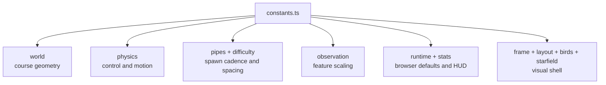

# constants

Legacy Flappy constants barrel.

Constants are now organized into small, category-focused modules
(`constants.*.ts`). This file remains as a compatibility export surface so
existing imports continue to work while callers migrate gradually.

Educational note:
Treat this file as the folder map, not the best place to memorize individual
values. The category modules below are where the real stories live: world
geometry, physics, pipes, observation, runtime defaults, rendering chrome,
network visualization, and browser HUD behavior.

A useful way to read this folder is to ask one question first: "what kind of
knob am I trying to change?"

- If the bird feels wrong, start with physics.
- If the course feels unfair or too easy, start with pipes and difficulty.
- If the policy sees the wrong world, start with observation.
- If the browser demo feels noisy or cramped, start with runtime, layout, and stats.
- If the network panel is hard to read, start with network-view and palette.

Quick import example:
```ts
import {
  FLAPPY_GRAVITY_PX_PER_FRAME2,
  FLAPPY_CONTROL_SUBSTEPS_PER_FRAME,
} from './constants/constants';
```

Constant-family map:


## constants/constants.ts

### DEFAULT_CONTAINER_ID

Default host container id for the browser demo mount point.

### FLAPPY_BIRD_AURA_ALPHA

Opacity used for the extra Radiant-style aura around each bird.

This is intentionally subtle: it should read as a soft bloom that lifts the
bird off the background, without turning the bird into a big glowing blob.

### FLAPPY_BIRD_AURA_BLUR_MULTIPLIER

Blur multiplier used for the Radiant-style bird aura plate.

### FLAPPY_BIRD_AURA_EXPAND_PX

Pixel expansion used for the Radiant-style bird aura plate.

### FLAPPY_BIRD_BODY_GLOW_BLUR_PX

Base neon blur radius used for bird body glow.

### FLAPPY_BIRD_CHAMPION_EXTRA_GLOW_BLUR_PX

Additional blur radius applied to the champion red body glow.

This keeps the champion body bloom aligned with the same neon blur
intensity used by the pipe outline glow, so the leader reads with
comparable visual weight.

### FLAPPY_BIRD_HEIGHT_PX

Bird collision height (diameter, pixels).

### FLAPPY_BIRD_RADIUS_PX

Bird collision radius (pixels).

### FLAPPY_BIRD_VIEWPORT_X_RATIO

Horizontal viewport anchor for the bird.

A value of `0.33` places the bird roughly one-third from the left, leaving
more forward screen space for incoming pipes.

### FLAPPY_BIRD_X_PX

Fixed horizontal position of the bird (pixels).

A fixed x-anchor turns the task into primarily vertical control while pipes
move left, making policy behavior easier to visualize and debug.

### FLAPPY_BOX_MIN_COLUMNS

Minimum safe columns for box-drawing helper output.

### FLAPPY_BOX_MIN_ROWS

Minimum safe rows for box-drawing helper output.

### FLAPPY_BROWSER_ELITISM_COUNT

Default elitism count for browser playback worker initialization.

With a five-bird browser flock, preserving one elite keeps elitism at 20%
while still leaving most of the population available for visible variation.

### FLAPPY_BROWSER_POPULATION_SIZE

Default population size for browser playback worker initialization.

The browser default stays intentionally small so the interactive demo remains
responsive and each generation is easy to inspect during playback.

### FLAPPY_BROWSER_SUCCESS_DOWNSHIFT_ELITISM_COUNT

Reduced browser elitism count paired with the post-success population downshift.

Two elites keep a small continuity shelf while still leaving most of the
reduced flock available for visible variation.

### FLAPPY_BROWSER_SUCCESS_DOWNSHIFT_POPULATION_SIZE

Reduced browser population size used after a live run has already hit the success bar.

The downshift keeps later browser generations cheaper once an architecture is
already demonstrating stable pipe-clearing behavior.

### FLAPPY_BROWSER_SUCCESS_PIPE_TARGET

Pipe-count milestone that marks a browser run as "good enough" to downshift.

Once a generation clears this bar, future browser generations can shrink to a
lighter flock without losing the core demonstration that the selected
architecture is already solving pipes in the live demo.

### FLAPPY_CENTER_BLUE_RAMP

Neutral-center blue ramp for near-zero diverging tiers.

### FLAPPY_CHAMPION_TRAIL_MAX_POINTS

Maximum number of trail points retained for the champion-only short trail.

### FLAPPY_CONTROL_SUBSTEPS_PER_FRAME

Number of policy decision substeps executed inside each logical frame.

Values > 1 give agents finer temporal control in tight scenarios by allowing
multiple react-and-integrate passes before the frame counter advances.

This is one of the main levers that keeps high-speed play numerically stable
without forcing the visible frame rate to explode.

### FLAPPY_DEFAULT_RNG_SEED

Deterministic default RNG seed shared by browser runtime and trainer flows.

Reusing one canonical seed makes debugging and README examples more
repeatable.

### FLAPPY_DIFFICULTY_RAMP_PIPES

Pipe-pass count needed to reach maximum adaptive difficulty.

After this point, spacing does not tighten further, so proficient agents can
sustain long runs without additional spacing compression.

### FLAPPY_EMULATION_SPEED_MULTIPLIER

Emulation speed multiplier for browser playback (1.5 => 50% faster).

### FLAPPY_ENABLE_RUNTIME_INSTRUMENTATION

Enables runtime telemetry counters used for profiling diagnostics.

Keep disabled during normal demo runs to avoid instrumentation overhead and
to preserve a cleaner educational rendering path.

### FLAPPY_FITNESS_ALIGNMENT_WEIGHT_PER_FRAME

Per-frame reward weight for staying vertically aligned with the next gap.

Increased to make gap alignment a primary per-frame signal so that birds
tracking the ideal center path score noticeably higher than drifting birds.

### FLAPPY_FITNESS_APPROACH_PROGRESS_WEIGHT

Reward scale for reducing distance to the next pipe between consecutive frames.

### FLAPPY_FITNESS_BONUS_PER_PIPE

Fitness bonus added per pipe successfully passed.

### FLAPPY_FITNESS_CENTERING_PROGRESS_WEIGHT

Reward scale for reducing vertical error to the next gap center.

### FLAPPY_FITNESS_CLEARANCE_WEIGHT_PER_FRAME

Per-frame reward weight for keeping the bird inside next-gap clearance.

Increased to make clearance (gap-width-normalized position) the primary
per-frame centering signal. This strongly rewards birds that stay near
the gap center and penalizes those that drift to the edges.

### FLAPPY_FITNESS_EARLY_DEATH_FRAME_THRESHOLD

Minimum frames survived before the early-death penalty is waived.

Set below the ~104-frame natural-fall time so that untrained birds falling
straight to the floor are not catastrophically penalized before NEAT can
explore better policies. Monotonic strategies that die unusually quickly
(ceiling rockets or instant drops) still trigger the penalty.

Previous value of 120 was above the natural-fall time, which crushed NARX
signal to near-zero on early generations. Lowering to 80 lets the density
shaping guide evolution without the early-death gate blocking the signal.

### FLAPPY_FITNESS_EARLY_DEATH_PENALTY_MULTIPLIER

Fitness multiplier applied when a bird dies before the early-death threshold.

Set below 1 so extremely short-lived monotonic deaths score lower than any
reasonable centering strategy. A value of 0.4 (vs the prior 0.1) keeps the
penalty meaningful while preserving enough signal for NEAT to distinguish
between bad and worse short-lived strategies.

### FLAPPY_FITNESS_GAP_CENTERING_QUALITY_WEIGHT_PER_FRAME

Per-frame reward weight for gap-width-normalized centering quality.

This term uses the normalizedNextGapClearance feature, which is proportional
to how well-centered the bird is relative to the current gap size rather than
absolute world height. This is the dominant centering signal — a bird that
stays at gap center earns full reward regardless of gap size, while one near
the edges earns near zero.

### FLAPPY_FITNESS_STABLE_VELOCITY_WEIGHT_PER_FRAME

Per-frame reward weight for maintaining controllable vertical velocity.

Increased to penalize monotonic-direction behavior (always rising or always
falling) more aggressively. Birds with wild or one-directional velocity
profiles score lower than those with controlled flight.

### FLAPPY_FITNESS_SURVIVAL_WEIGHT

Fraction of raw frame-survival reward kept in total fitness.

Lower values reduce the incentive to merely stay alive and increase pressure
to center on gaps and pass pipes cleanly.

### FLAPPY_FITNESS_TERMINAL_ALIGNMENT_BONUS_WEIGHT

Terminal bonus based on final alignment with the next gap center.

### FLAPPY_FITNESS_TERMINAL_PROGRESS_BONUS_WEIGHT

Terminal bonus based on final progress toward the next pipe.

### FLAPPY_FLAP_THRESHOLD

Normalized decision threshold used for scalar output flap policies.

### FLAPPY_FLAP_VELOCITY_PX_PER_FRAME

Instantaneous upward velocity applied on flap (pixels/frame).

Reduced so each flap produces a smaller hop, improving precision when
threading tighter gaps.

### FLAPPY_FRAME_GLYPH_ROW_HEIGHT_PX

Glyph-row height used for box-drawing rows (pixels).

### FLAPPY_FRAME_MIN_COLUMNS

Minimum glyph columns to keep frame readable on narrow widths.

### FLAPPY_FRAME_MIN_GLYPH_WIDTH_PX

Minimum measured glyph width fallback (pixels).

### FLAPPY_FRAME_MONOSPACE_FONT

Reusable monospaced HUD font for glyph-based frame rendering.

### FLAPPY_FRAME_RESERVED_COLUMNS

Reserved columns to keep right edge in bounds during metrics fit.

### FLAPPY_GENERATION_PREVIEW_HOLD_DURATION_MS

Time a generation presentation card stays fully visible before fading out (milliseconds).

### FLAPPY_GLYPH_BOTTOM_LEFT

Glyph character for bottom-left box corner.

### FLAPPY_GLYPH_BOTTOM_RIGHT

Glyph character for bottom-right box corner.

### FLAPPY_GLYPH_HORIZONTAL

Glyph character for horizontal box segment.

### FLAPPY_GLYPH_SPACE

Glyph character for interior spacing.

### FLAPPY_GLYPH_TOP_LEFT

Glyph character for top-left box corner.

### FLAPPY_GLYPH_TOP_RIGHT

Glyph character for top-right box corner.

### FLAPPY_GLYPH_VERTICAL

Glyph character for vertical box segment.

### FLAPPY_GRAVITY_PX_PER_FRAME2

Gravity acceleration applied each frame (pixels/frame²).

Slightly increased so birds settle faster after each flap and can make
finer vertical corrections around narrow targets.

### FLAPPY_HALF

Canonical half multiplier for centering and gap math.

### FLAPPY_HEADER_CANVAS_HEIGHT_PX

Header canvas fixed height (pixels).

### FLAPPY_HEADER_TITLE_TEXT

Title rendered inside the standalone header box.

### FLAPPY_HUD_INITIALIZING_TEXT

Initial status text displayed before evolution starts.

### FLAPPY_HUD_OFF_TEXT

Shared HUD value when a metric is intentionally disabled.

### FLAPPY_HUD_PLACEHOLDER_TEXT

Shared HUD value for metrics that are not available yet.

### FLAPPY_HUD_UPDATE_INTERVAL_FRAMES

Update HUD counters every N simulation frames to reduce DOM churn.

The value trades freshness for stability. Updating every frame would make the
numbers twitchier and force more frequent DOM work on the main thread.

### FLAPPY_HUD_UPDATES_WINDOW_MS

HUD sliding-window size used when computing updates-per-second metric.

### FLAPPY_HUD_UPDATES_WINDOW_SECONDS

HUD updates window duration in seconds for per-second conversion.

### FLAPPY_HUD_ZERO_DECIMAL_TEXT

Shared HUD value for decimal zero fields.

### FLAPPY_HUD_ZERO_TEXT

Shared HUD value for integer zero fields.

### FLAPPY_INSTRUMENTATION_STATS_KEYS

Stats keys that are hidden when runtime instrumentation is disabled.

### FLAPPY_LIGHT_NEON_RAMP

Light neon ramp used for high-contrast negative scales.

### FLAPPY_MAX_DIFFICULTY_EDGE_TO_EDGE_PIPE_SPACING_PX

Actual edge-to-edge spacing produced at peak adaptive difficulty.

The recovery target above is a lower bound, but the runtime cadence is
ultimately quantized by whole frames. This value is the real rendered pipe
spacing once the minimum spawn interval has been rounded to an integer.

### FLAPPY_MAX_DIFFICULTY_PIPE_PITCH_PX

Full pipe-to-pipe pitch produced at peak adaptive difficulty.

This is the distance from one pipe's leading edge to the next pipe's leading
edge at the hardest steady-state cadence. It is the periodicity the ground
grid must match if each spawned pipe should land on the same grid phase.

### FLAPPY_MAX_FALL_SPEED_PX_PER_FRAME

Maximum downward speed clamp (pixels/frame).

This cap limits runaway fall acceleration and keeps trajectories learnable.

### FLAPPY_MAX_FRAMES_PER_EPISODE

Episode terminates after this many frames even if still alive.

This prevents extremely long outlier episodes from dominating generation
runtime and keeps evolution throughput predictable.

### FLAPPY_MEMORY_ACTION_WINDOW_STEPS

Size of the legacy action-history buffer.

This stays at zero so no controller receives hand-authored action memory on
top of its learned state.

### FLAPPY_MEMORY_CORE_FEATURE_COUNT

Number of compact current-frame observation features fed into Flappy policies.

The nine channels are split into three semantic groups:

**Bird state (2):** normalized height and vertical velocity — the controller's
body-state check before any pipe geometry matters.

**Next gap (4):** distance to the pipe exit, signed vertical offset from the
gap center, normalized top and bottom boundaries of the safe corridor.

**Look-ahead (3):** signed distance to the pipe *entrance* (goes negative
while the bird is traversing the pipe body, giving a clear in-pipe signal),
signed gap clearance (how centered the bird currently is inside the opening),
and signed vertical offset from the *second* upcoming gap center (gives
the network a reason to plan ahead instead of staying level).

### FLAPPY_MEMORY_STACKED_FRAME_COUNT

Effective controller frame count kept in the external observation window.

All Flappy architectures now consume only the current normalized frame so
recurrent profiles are not double-fed with both built-in state and a
hand-authored temporal stack.

### FLAPPY_MIN_CLEARANCE_MARGIN_PX

Small geometric buffer so "barely possible" remains physically solvable.

### FLAPPY_MIN_EDGE_TO_EDGE_PIPE_SPACING_PX

Minimum edge-to-edge spacing needed to recover between consecutive pipes.

Derived from bird size + expected control drop budget + a small margin.

### FLAPPY_MIN_PIPE_RECOVERY_FRAMES

Hard floor on time between pipes at max speed so controllers can recover.

This prevents endgame spacing from becoming too tight for realistic policy
reaction and vertical correction.

### FLAPPY_MINOR_GC_WINDOW_MS

Sliding-window size used when computing minor GC events per minute.

### FLAPPY_MONOSPACE_FONT_FAMILY

Shared monospace font stack used by all HUD and visualization text.

### FLAPPY_NEON_BIRD_PALETTE

Neon bird palette for per-agent render color assignment.

### FLAPPY_NEON_PALETTE

TRON-like neon palette matching asciiMaze style.

### FLAPPY_NETWORK_HEADER_TEXT_COLOR

Header text color for architecture label in visualization.

### FLAPPY_NETWORK_HIDDEN_LAYER_SIZES

Hidden-layer sizes used to seed initial Flappy policy architectures.

Using at least two hidden layers improves representational flexibility for
precise vertical control near narrow, fast-changing pipe targets.

### FLAPPY_NETWORK_HIDDEN_NODE_STROKE_COLOR

Hidden-node stroke color.

### FLAPPY_NETWORK_INPUT_SIZE

Number of observation features fed into each Flappy policy network.

### FLAPPY_NETWORK_LEGEND_BIAS_TITLE_COLOR

Legend section title color for node bias rows.

### FLAPPY_NETWORK_LEGEND_CONNECTION_TITLE_COLOR

Legend section title color for connection weight rows.

### FLAPPY_NETWORK_LEGEND_HEADER_COLOR

Legend header color.

### FLAPPY_NETWORK_LEGEND_ROW_TEXT_COLOR

Legend row text color.

### FLAPPY_NETWORK_NODE_LABEL_FILL_COLOR

Dark fill color used for node bias labels.

### FLAPPY_NETWORK_OUTPUT_NODE_GLOW_COLOR

Output-node glow color.

### FLAPPY_NETWORK_OUTPUT_NODE_STROKE_COLOR

Output-node stroke color.

### FLAPPY_NETWORK_OUTPUT_SIZE

Number of output action scores emitted by each Flappy policy network.

### FLAPPY_NON_CHAMPION_BODY_GLOW_BLUR_PX

Glow blur radius used for simplified non-champion bird bodies.

### FLAPPY_NON_CHAMPION_OPACITY

Opacity used for non-champion bird fills and trails.

### FLAPPY_NORMALIZATION_EPSILON

Small epsilon divisor guard for world/physics normalization.

Prevents division by near-zero values when view-dependent scales are very
small, keeping feature values numerically stable.

If you want a quick refresher on why feature scaling matters, the Wikipedia
article on "feature scaling" is a useful background reference.

### FLAPPY_PIPE_COLLISION_ENTRANCE_EXPAND_PX

Effective gap-rim expansion used for pipe collision checks (pixels).

Includes the visual entrance gap and half the outline stroke so collision
matches the visible outer line around the gap opening.

### FLAPPY_PIPE_COLLISION_SIDE_EXPAND_PX

Effective side expansion used for pipe collision checks (pixels).

Includes the visual side gap and half the outline stroke so collision
matches the visible outer line thickness.

### FLAPPY_PIPE_ENTRY_RIM_INSET_PX

Inset used for the pipe entrance rim line measured from the gap-facing edge.

### FLAPPY_PIPE_GAP_CENTER_MAX_DELTA_PX

Maximum allowed vertical jump between consecutive pipe gap centers (pixels).

This reduces abrupt zig-zag transitions that are often unrecoverable once
spacing tightens at higher difficulty.

### FLAPPY_PIPE_GAP_CENTER_MAX_Y_PX

Maximum allowed gap center height (pixels).

### FLAPPY_PIPE_GAP_CENTER_MIN_Y_PX

Minimum allowed gap center height (pixels).

### FLAPPY_PIPE_GAP_EDGE_MARGIN_RATIO

Minimum fraction of world height that must remain as solid pipe above and
below the gap opening.

At the world height of 512 px this resolves to ≈26 px of visible pipe cap on
each side, which prevents the opening from clipping into or touching the
canvas edge — especially important when the initial wide gap is active.

### FLAPPY_PIPE_GAP_MIN_PX

Minimum pipe gap used at peak adaptive difficulty.

### FLAPPY_PIPE_GAP_PX

Vertical opening size of each pipe gap (pixels).

This is the nominal baseline gap before adaptive difficulty narrows it.

### FLAPPY_PIPE_GAP_RANDOM_JITTER_PX

Random jitter range applied to each spawned pipe gap (pixels).

### FLAPPY_PIPE_GAP_SHRINK_PER_PIPE_PX

Per-pipe gap shrink step toward the current hardest target gap (pixels).

### FLAPPY_PIPE_GAP_START_MULTIPLIER

Initial spawn gap multiplier relative to the current hardest gap target.

A larger multiplier makes the very first pipes noticeably easier and produces
a more visible difficulty gradient as the gap narrows toward its target.
The value is 20 % wider than the original 2.15 baseline.

### FLAPPY_PIPE_OUTLINE_CYAN_GLOW_BLUR_PX

Blur radius used for the cyan pipe outline glow (pixels).

### FLAPPY_PIPE_OUTLINE_CYAN_GLOW_COLOR

Cyan neon glow used for pipe outline shadow.

This intentionally matches the asciiMaze `neonCyan` ANSI color (`\x1b[38;5;87m`)
which maps to xterm color 87 ~= rgb(95, 255, 255) / hex `#5fffff`.

### FLAPPY_PIPE_OUTLINE_ENTRANCE_GAP_PX

Visual gap between the pipe body and its outline at the pipe entrance rim (pixels).

### FLAPPY_PIPE_OUTLINE_GLOW_ALPHA

Opacity used for the soft pipe glow stroke pass.

### FLAPPY_PIPE_OUTLINE_GLOW_STROKE_WIDTH_PX

Stroke width used for the soft pipe glow stroke pass (pixels).

### FLAPPY_PIPE_OUTLINE_SIDE_GAP_PX

Visual gap between the pipe body and its outline on the sides (pixels).

### FLAPPY_PIPE_OUTLINE_STROKE_WIDTH_PX

Stroke width used for the pipe outline (pixels).

### FLAPPY_PIPE_SPAWN_INTERVAL_FRAMES

Frames between spawning new pipes.

Together with pipe speed, this controls horizontal pacing and how much time a
policy has to recover between obstacles.

### FLAPPY_PIPE_SPAWN_INTERVAL_MIN_FRAMES

Minimum spawn interval used at peak adaptive difficulty.

### FLAPPY_PIPE_SPAWN_INTERVAL_SHRINK_PER_PIPE_FRAMES

Per-pipe spawn-interval shrink step toward the current hardest interval target (frames).

### FLAPPY_PIPE_SPAWN_INTERVAL_START_MULTIPLIER

Initial spawn-interval multiplier relative to the current hardest interval target.

### FLAPPY_PIPE_SPEED_MAX_PX_PER_FRAME

Maximum pipe speed used at peak adaptive difficulty.

### FLAPPY_PIPE_SPEED_PX_PER_FRAME

Pipe horizontal speed (pixels/frame).

Higher values shrink reaction time, which makes the same gap geometry much
harder even before the adaptive curriculum starts tightening gaps.

### FLAPPY_PIPE_WIDTH_PX

Pipe width (pixels).

### FLAPPY_REGULAR_NEON_RAMP

Regular neon ramp used for strong positive/baseline scales.

### FLAPPY_SCREEN_PADDING_PX

Screen-edge padding between viewport border and demo frame.

### FLAPPY_STARFIELD_CANVAS_CONTEXT_ID

Canvas rendering context identifier used for starfield tile generation.

### FLAPPY_STARFIELD_COMPOSITE_SOURCE_OVER

Composite mode used for normal starfield canvas drawing passes.

### FLAPPY_STARFIELD_CYAN_FILL_STYLE

Fill color used for cyan stars and glow dots in the generated tile.

### FLAPPY_STARFIELD_FAR_SCROLL_RATIO

Horizontal scroll ratio for the farthest parallax layer.

### FLAPPY_STARFIELD_FULL_ALPHA

Default fully opaque alpha restored after tile generation.

### FLAPPY_STARFIELD_INCLUSIVE_RANGE_OFFSET

Inclusive range offset used when converting size bounds into random spans.

### FLAPPY_STARFIELD_LAYER_SPECS

Declarative layer specs for the default starfield parallax bands.

Keeping the layer recipe in data form makes it easier to swap the lower
segment to a different parallax family without changing the tile builder.

### FLAPPY_STARFIELD_MID_SCROLL_RATIO

Horizontal scroll ratio for the middle parallax layer.

### FLAPPY_STARFIELD_MIN_DIMENSION_PX

Minimum positive dimension allowed for generated starfield canvases.

### FLAPPY_STARFIELD_NEAR_SCROLL_RATIO

Horizontal scroll ratio for the nearest parallax layer.

### FLAPPY_STARFIELD_NO_BLUR_PX

Blur reset value used after the star glow pass.

### FLAPPY_STARFIELD_ORIGIN_PX

Zero pixel origin used for starfield canvas clears and draws.

### FLAPPY_STARFIELD_TILE_HEIGHT_PX

Height of one repeated starfield tile (pixels).

### FLAPPY_STARFIELD_TILE_WIDTH_PX

Width of one repeated starfield tile (pixels).

### FLAPPY_STARFIELD_TRANSPARENT_SHADOW_COLOR

Transparent shadow reset value used after glow drawing.

### FLAPPY_STARFIELD_UNSIGNED_NORMALIZATION_DIVISOR

Divisor that normalizes unsigned 32-bit RNG state into the unit interval.

### FLAPPY_STARFIELD_XORSHIFT_LEFT_SHIFT_FINAL

Final left-shift used by the xorshift32 random transition.

### FLAPPY_STARFIELD_XORSHIFT_LEFT_SHIFT_PRIMARY

Primary left-shift used by the xorshift32 random transition.

### FLAPPY_STARFIELD_XORSHIFT_RIGHT_SHIFT

Middle right-shift used by the xorshift32 random transition.

### FLAPPY_STARTUP_PREVIEW_FADE_DURATION_MS

Fade duration used for both startup legend fade-in and fade-out (milliseconds).

### FLAPPY_STARTUP_PREVIEW_FRAME_DURATION_MS

Approximate preview frame duration used to drive deterministic background motion.

### FLAPPY_STARTUP_PREVIEW_LEGEND_FONT_SIZE_RATIO

Responsive font-size ratio applied to the smaller startup-preview canvas dimension.

### FLAPPY_STARTUP_PREVIEW_LEGEND_FONT_WEIGHT

Font weight used by the centered startup loading legend.

### FLAPPY_STARTUP_PREVIEW_LEGEND_MAX_FONT_SIZE_PX

Maximum startup-preview legend font size (pixels).

### FLAPPY_STARTUP_PREVIEW_LEGEND_MIN_FONT_SIZE_PX

Minimum readable startup-preview legend font size (pixels).

### FLAPPY_STARTUP_PREVIEW_LEGEND_TEXT

Centered startup legend shown while the first browser generation is initializing.

### FLAPPY_STATS_ARCHITECTURE_KEYS

Stats keys whose values should render multi-line architecture content.

### FLAPPY_STATS_KEYS

Ordered keys for the runtime stats table in rendered top-to-bottom order.

### FLAPPY_STATS_ROWS

Ordered row descriptors rendered into the runtime stats table.

### FLAPPY_STATS_SECTION_KEYS

Stats keys rendered as section headers rather than key/value rows.

### FLAPPY_STATUS_EVOLVING_TEXT

Runtime status text shown between playback episodes.

### FLAPPY_STATUS_PLAYING_TEXT

Runtime status text shown while a generation playback is running.

### FLAPPY_TARGET_FLAP_INTERVAL_FRAMES

Target control cadence used for endgame reachability calculations.

A smaller value means the policy is expected to correct more frequently
(effectively "jumping more often"), which supports narrower endgame gaps.

The value is used analytically when estimating whether a late recovery is
still plausible, not as the direct execution cadence of the simulation loop.

### FLAPPY_TIER_ABOVE_COLOR

Fallback color when a value exceeds all configured tiers.

### FLAPPY_TITLE_BOX_MARGIN_COLUMNS

Total side margin columns reserved around centered title box.

### FLAPPY_TITLE_BOX_MIN_HALF_SPAN

Minimum half-span when clamping centered title extents.

### FLAPPY_TITLE_BOX_MIN_OUTER_GAP_COLUMNS

Minimum columns between title box and outer rails.

### FLAPPY_TITLE_BOX_MIN_WIDTH

Minimum box width when building standalone title frame.

### FLAPPY_TITLE_BOX_WIDTH_RATIO

Preferred title width relative to available frame width.

### FLAPPY_TRAIL_EDGE_FADE_DISTANCE_PX

Distance from world edge over which trails fade to transparent (pixels).

### FLAPPY_TRAIL_LINE_WIDTH_PX

Stroke width used for per-bird trail line rendering.

### FLAPPY_TRAIL_MAX_POINTS

Maximum number of trail points retained per bird trail polyline.

### FLAPPY_TRAIL_MIN_HORIZONTAL_SEGMENT_PX

Minimum horizontal segment length used by stepped trail rendering.

### FLAPPY_TRAIL_MIN_VERTICAL_SEGMENT_PX

Minimum vertical segment length used by stepped trail rendering.

### FLAPPY_TRAIL_OPACITY_FACTOR

Fraction of parent bird opacity used for drawing trails.

For example, `0.5` means a bird at 20% opacity gets a 10% opacity trail.

### FLAPPY_UI_CANVAS_INSET_SHADOW

Thin inset shadow used on canvases for subtle neon depth.

### FLAPPY_UI_CONTENT_COLUMN_TOP_PADDING_PX

Top padding for the vertical content column hosting canvases and stats.

### FLAPPY_UI_DOUBLE_PANEL_BORDER

Shared double-line border style matching title-box aesthetics.

### FLAPPY_UI_NETWORK_CANVAS_BACKGROUND

Inner canvas clear color for the network visualization area.

### FLAPPY_UI_NETWORK_HOST_BACKGROUND

Host panel background color behind the network visualization canvas.

### FLAPPY_UI_NETWORK_HOST_FIXED_HEIGHT_PX

Fixed network panel height used by responsive browser layout.

### FLAPPY_UI_NETWORK_HOST_INITIAL_HEIGHT_PX

Initial network panel height before topology-driven resizing runs.

### FLAPPY_UI_NETWORK_HOST_INSET_PX

Inner host padding subtracted from measured network canvas dimensions.

### FLAPPY_UI_OUTER_FRAME_BACKGROUND

Outer frame background color for the browser demo host.

### FLAPPY_UI_OUTER_FRAME_MIN_SIDE_PADDING_PX

Side padding fallback for the outer frame when viewport is very narrow.

### FLAPPY_UI_OUTER_FRAME_SIDE_PADDING_OFFSET_PX

Side padding offset applied to shared screen padding for frame layout.

### FLAPPY_UI_SPLIT_BRIDGE_COLOR

Vertical split guide color between stats and network panes.

### FLAPPY_UI_STATS_ROW_BORDER

Border style for regular stats rows.

### FLAPPY_UI_STATS_SECTION_BORDER

Border style for stats section headers.

### FLAPPY_UI_UNIFIED_INSET_SHADOW

Shared inset glow shadow used by neon HUD panels.

### FLAPPY_VIEWPORT_MIN_NETWORK_HEIGHT_BUDGET_PX

Minimum network panel height budget for responsive viewport sizing.

### FLAPPY_VIEWPORT_MINIMUM_SIMULATION_HEIGHT_PX

Minimum simulation canvas height floor in responsive viewport sizing.

### FLAPPY_VIEWPORT_MINIMUM_SIMULATION_HEIGHT_RATIO

Minimum simulation height ratio relative to window height.

### FLAPPY_VIEWPORT_MINIMUM_STATS_HEIGHT_PX

Minimum stats panel height used by responsive viewport sizing.

### FLAPPY_VIEWPORT_MOBILE_MINIMAL_UI_BREAKPOINT_PX

Width breakpoint below which only title + main simulation canvas are shown.

In this minimal mobile layout, stats and network-visualization panels are
hidden to maximize readable gameplay area.

### FLAPPY_VIEWPORT_NETWORK_ONLY_BREAKPOINT_PX

Width breakpoint below which stats pane is hidden and network gets full width.

### FLAPPY_VIEWPORT_NETWORK_OVERLAY_HIDDEN_BREAKPOINT_PX

Width breakpoint below which network legend and architecture text are hidden.

### FLAPPY_VIEWPORT_SIMULATION_BOTTOM_MARGIN_PX

Additional bottom margin reserved during simulation canvas sizing.

### FLAPPY_VIEWPORT_VERTICAL_LAYOUT_GUTTER_PX

Vertical layout gutter between stats panel and simulation canvas.

### FLAPPY_WORLD_HEIGHT_PX

Height of the simulated world (pixels).

### FLAPPY_WORLD_WIDTH_PX

Width of the simulated world (pixels).

## constants/constants.world.ts

Flappy world and episode-shape constants.

This module groups stable geometry and run-budget values that define the
simulation envelope. Keeping these together makes it easier to reason about
how large the world is, where the bird is anchored, and when an episode ends.

### FLAPPY_BIRD_HEIGHT_PX

Bird collision height (diameter, pixels).

### FLAPPY_BIRD_RADIUS_PX

Bird collision radius (pixels).

### FLAPPY_BIRD_X_PX

Fixed horizontal position of the bird (pixels).

A fixed x-anchor turns the task into primarily vertical control while pipes
move left, making policy behavior easier to visualize and debug.

### FLAPPY_ENABLE_RUNTIME_INSTRUMENTATION

Enables runtime telemetry counters used for profiling diagnostics.

Keep disabled during normal demo runs to avoid instrumentation overhead and
to preserve a cleaner educational rendering path.

### FLAPPY_MAX_FRAMES_PER_EPISODE

Episode terminates after this many frames even if still alive.

This prevents extremely long outlier episodes from dominating generation
runtime and keeps evolution throughput predictable.

### FLAPPY_WORLD_HEIGHT_PX

Height of the simulated world (pixels).

### FLAPPY_WORLD_WIDTH_PX

Width of the simulated world (pixels).

## constants/constants.physics.ts

Flappy physics and control-cadence constants.

Values in this module shape how quickly the bird falls, how strongly a flap
responds, and how often a policy can react inside each visible frame.

Small changes here have outsized behavioral impact because they reshape the
control problem the policy is trying to solve.

### FLAPPY_CONTROL_SUBSTEPS_PER_FRAME

Number of policy decision substeps executed inside each logical frame.

Values > 1 give agents finer temporal control in tight scenarios by allowing
multiple react-and-integrate passes before the frame counter advances.

This is one of the main levers that keeps high-speed play numerically stable
without forcing the visible frame rate to explode.

### FLAPPY_FLAP_VELOCITY_PX_PER_FRAME

Instantaneous upward velocity applied on flap (pixels/frame).

Reduced so each flap produces a smaller hop, improving precision when
threading tighter gaps.

### FLAPPY_GRAVITY_PX_PER_FRAME2

Gravity acceleration applied each frame (pixels/frame²).

Slightly increased so birds settle faster after each flap and can make
finer vertical corrections around narrow targets.

### FLAPPY_MAX_FALL_SPEED_PX_PER_FRAME

Maximum downward speed clamp (pixels/frame).

This cap limits runaway fall acceleration and keeps trajectories learnable.

### FLAPPY_TARGET_FLAP_INTERVAL_FRAMES

Target control cadence used for endgame reachability calculations.

A smaller value means the policy is expected to correct more frequently
(effectively "jumping more often"), which supports narrower endgame gaps.

The value is used analytically when estimating whether a late recovery is
still plausible, not as the direct execution cadence of the simulation loop.

## constants/constants.pipes.ts

Pipe geometry and baseline pacing constants.

These values describe the canonical pipe body size, opening geometry, visual
outline offsets, and default leftward movement cadence.

Educational note:
Pipe constants do double duty: some values describe actual gameplay geometry,
while others are chosen so the visible pipe outline and the collision envelope
feel aligned to a human viewer.

### FLAPPY_PIPE_COLLISION_ENTRANCE_EXPAND_PX

Effective gap-rim expansion used for pipe collision checks (pixels).

Includes the visual entrance gap and half the outline stroke so collision
matches the visible outer line around the gap opening.

### FLAPPY_PIPE_COLLISION_SIDE_EXPAND_PX

Effective side expansion used for pipe collision checks (pixels).

Includes the visual side gap and half the outline stroke so collision
matches the visible outer line thickness.

### FLAPPY_PIPE_GAP_CENTER_MAX_Y_PX

Maximum allowed gap center height (pixels).

### FLAPPY_PIPE_GAP_CENTER_MIN_Y_PX

Minimum allowed gap center height (pixels).

### FLAPPY_PIPE_GAP_EDGE_MARGIN_RATIO

Minimum fraction of world height that must remain as solid pipe above and
below the gap opening.

At the world height of 512 px this resolves to ≈26 px of visible pipe cap on
each side, which prevents the opening from clipping into or touching the
canvas edge — especially important when the initial wide gap is active.

### FLAPPY_PIPE_GAP_PX

Vertical opening size of each pipe gap (pixels).

This is the nominal baseline gap before adaptive difficulty narrows it.

### FLAPPY_PIPE_OUTLINE_ENTRANCE_GAP_PX

Visual gap between the pipe body and its outline at the pipe entrance rim (pixels).

### FLAPPY_PIPE_OUTLINE_SIDE_GAP_PX

Visual gap between the pipe body and its outline on the sides (pixels).

### FLAPPY_PIPE_OUTLINE_STROKE_WIDTH_PX

Stroke width used for the pipe outline (pixels).

### FLAPPY_PIPE_SPAWN_INTERVAL_FRAMES

Frames between spawning new pipes.

Together with pipe speed, this controls horizontal pacing and how much time a
policy has to recover between obstacles.

### FLAPPY_PIPE_SPEED_PX_PER_FRAME

Pipe horizontal speed (pixels/frame).

Higher values shrink reaction time, which makes the same gap geometry much
harder even before the adaptive curriculum starts tightening gaps.

### FLAPPY_PIPE_WIDTH_PX

Pipe width (pixels).

## constants/constants.difficulty.ts

Adaptive-difficulty constants for Flappy runs.

This module defines how spacing, speed, and gap variability tighten as
agents become more capable. Keeping it separate helps tune curriculum
behavior without mixing with core physics or rendering.

### FLAPPY_DIFFICULTY_RAMP_PIPES

Pipe-pass count needed to reach maximum adaptive difficulty.

After this point, spacing does not tighten further, so proficient agents can
sustain long runs without additional spacing compression.

### FLAPPY_MAX_DIFFICULTY_EDGE_TO_EDGE_PIPE_SPACING_PX

Actual edge-to-edge spacing produced at peak adaptive difficulty.

The recovery target above is a lower bound, but the runtime cadence is
ultimately quantized by whole frames. This value is the real rendered pipe
spacing once the minimum spawn interval has been rounded to an integer.

### FLAPPY_MAX_DIFFICULTY_PIPE_PITCH_PX

Full pipe-to-pipe pitch produced at peak adaptive difficulty.

This is the distance from one pipe's leading edge to the next pipe's leading
edge at the hardest steady-state cadence. It is the periodicity the ground
grid must match if each spawned pipe should land on the same grid phase.

### FLAPPY_MIN_CLEARANCE_MARGIN_PX

Small geometric buffer so "barely possible" remains physically solvable.

### FLAPPY_MIN_EDGE_TO_EDGE_PIPE_SPACING_PX

Minimum edge-to-edge spacing needed to recover between consecutive pipes.

Derived from bird size + expected control drop budget + a small margin.

### FLAPPY_MIN_PIPE_RECOVERY_FRAMES

Hard floor on time between pipes at max speed so controllers can recover.

This prevents endgame spacing from becoming too tight for realistic policy
reaction and vertical correction.

### FLAPPY_PIPE_GAP_CENTER_MAX_DELTA_PX

Maximum allowed vertical jump between consecutive pipe gap centers (pixels).

This reduces abrupt zig-zag transitions that are often unrecoverable once
spacing tightens at higher difficulty.

### FLAPPY_PIPE_GAP_MIN_PX

Minimum pipe gap used at peak adaptive difficulty.

### FLAPPY_PIPE_GAP_RANDOM_JITTER_PX

Random jitter range applied to each spawned pipe gap (pixels).

### FLAPPY_PIPE_GAP_SHRINK_PER_PIPE_PX

Per-pipe gap shrink step toward the current hardest target gap (pixels).

### FLAPPY_PIPE_GAP_START_MULTIPLIER

Initial spawn gap multiplier relative to the current hardest gap target.

A larger multiplier makes the very first pipes noticeably easier and produces
a more visible difficulty gradient as the gap narrows toward its target.
The value is 20 % wider than the original 2.15 baseline.

### FLAPPY_PIPE_SPAWN_INTERVAL_MIN_FRAMES

Minimum spawn interval used at peak adaptive difficulty.

### FLAPPY_PIPE_SPAWN_INTERVAL_SHRINK_PER_PIPE_FRAMES

Per-pipe spawn-interval shrink step toward the current hardest interval target (frames).

### FLAPPY_PIPE_SPAWN_INTERVAL_START_MULTIPLIER

Initial spawn-interval multiplier relative to the current hardest interval target.

### FLAPPY_PIPE_SPEED_MAX_PX_PER_FRAME

Maximum pipe speed used at peak adaptive difficulty.

## constants/constants.observation.ts

Shared observation-normalization constants.

These values are used by both browser playback and headless environment
simulation when building normalized feature vectors.

Keeping normalization constants shared is important because even tiny drift in
feature scaling would make trainer, worker, and browser policies "see"
different worlds.

### FLAPPY_NORMALIZATION_EPSILON

Small epsilon divisor guard for world/physics normalization.

Prevents division by near-zero values when view-dependent scales are very
small, keeping feature values numerically stable.

If you want a quick refresher on why feature scaling matters, the Wikipedia
article on "feature scaling" is a useful background reference.

## constants/constants.network.ts

Flappy policy-network and temporal memory constants.

This module defines observation window shape and initial architecture sizing
used when seeding agents for evolution.

### FLAPPY_MEMORY_ACTION_WINDOW_STEPS

Size of the legacy action-history buffer.

This stays at zero so no controller receives hand-authored action memory on
top of its learned state.

### FLAPPY_MEMORY_CORE_FEATURE_COUNT

Number of compact current-frame observation features fed into Flappy policies.

The nine channels are split into three semantic groups:

**Bird state (2):** normalized height and vertical velocity — the controller's
body-state check before any pipe geometry matters.

**Next gap (4):** distance to the pipe exit, signed vertical offset from the
gap center, normalized top and bottom boundaries of the safe corridor.

**Look-ahead (3):** signed distance to the pipe *entrance* (goes negative
while the bird is traversing the pipe body, giving a clear in-pipe signal),
signed gap clearance (how centered the bird currently is inside the opening),
and signed vertical offset from the *second* upcoming gap center (gives
the network a reason to plan ahead instead of staying level).

### FLAPPY_MEMORY_STACKED_FRAME_COUNT

Effective controller frame count kept in the external observation window.

All Flappy architectures now consume only the current normalized frame so
recurrent profiles are not double-fed with both built-in state and a
hand-authored temporal stack.

### FLAPPY_NETWORK_HIDDEN_LAYER_SIZES

Hidden-layer sizes used to seed initial Flappy policy architectures.

Using at least two hidden layers improves representational flexibility for
precise vertical control near narrow, fast-changing pipe targets.

### FLAPPY_NETWORK_INPUT_SIZE

Number of observation features fed into each Flappy policy network.

### FLAPPY_NETWORK_OUTPUT_SIZE

Number of output action scores emitted by each Flappy policy network.

## constants/constants.fitness.ts

Flappy reward-shaping constants.

These values tune the learning signal seen by evolution. Separating them from
world/physics constants keeps behavior tuning explicit and easier to teach.

Design philosophy: centering quality is the primary signal. An agent that
stays aligned with the next gap center — measured against the gap width, not
absolute world height — earns more signal per frame than one that merely
survives. Survival and pipe-passing remain important, but centering dominates
the dense-shaping channel so the population does not converge on passive or
erratic drift strategies.

### FLAPPY_FITNESS_ALIGNMENT_WEIGHT_PER_FRAME

Per-frame reward weight for staying vertically aligned with the next gap.

Increased to make gap alignment a primary per-frame signal so that birds
tracking the ideal center path score noticeably higher than drifting birds.

### FLAPPY_FITNESS_APPROACH_PROGRESS_WEIGHT

Reward scale for reducing distance to the next pipe between consecutive frames.

### FLAPPY_FITNESS_BONUS_PER_PIPE

Fitness bonus added per pipe successfully passed.

### FLAPPY_FITNESS_CENTERING_PROGRESS_WEIGHT

Reward scale for reducing vertical error to the next gap center.

### FLAPPY_FITNESS_CLEARANCE_WEIGHT_PER_FRAME

Per-frame reward weight for keeping the bird inside next-gap clearance.

Increased to make clearance (gap-width-normalized position) the primary
per-frame centering signal. This strongly rewards birds that stay near
the gap center and penalizes those that drift to the edges.

### FLAPPY_FITNESS_EARLY_DEATH_FRAME_THRESHOLD

Minimum frames survived before the early-death penalty is waived.

Set below the ~104-frame natural-fall time so that untrained birds falling
straight to the floor are not catastrophically penalized before NEAT can
explore better policies. Monotonic strategies that die unusually quickly
(ceiling rockets or instant drops) still trigger the penalty.

Previous value of 120 was above the natural-fall time, which crushed NARX
signal to near-zero on early generations. Lowering to 80 lets the density
shaping guide evolution without the early-death gate blocking the signal.

### FLAPPY_FITNESS_EARLY_DEATH_PENALTY_MULTIPLIER

Fitness multiplier applied when a bird dies before the early-death threshold.

Set below 1 so extremely short-lived monotonic deaths score lower than any
reasonable centering strategy. A value of 0.4 (vs the prior 0.1) keeps the
penalty meaningful while preserving enough signal for NEAT to distinguish
between bad and worse short-lived strategies.

### FLAPPY_FITNESS_GAP_CENTERING_QUALITY_WEIGHT_PER_FRAME

Per-frame reward weight for gap-width-normalized centering quality.

This term uses the normalizedNextGapClearance feature, which is proportional
to how well-centered the bird is relative to the current gap size rather than
absolute world height. This is the dominant centering signal — a bird that
stays at gap center earns full reward regardless of gap size, while one near
the edges earns near zero.

### FLAPPY_FITNESS_STABLE_VELOCITY_WEIGHT_PER_FRAME

Per-frame reward weight for maintaining controllable vertical velocity.

Increased to penalize monotonic-direction behavior (always rising or always
falling) more aggressively. Birds with wild or one-directional velocity
profiles score lower than those with controlled flight.

### FLAPPY_FITNESS_SURVIVAL_WEIGHT

Fraction of raw frame-survival reward kept in total fitness.

Lower values reduce the incentive to merely stay alive and increase pressure
to center on gaps and pass pipes cleanly.

### FLAPPY_FITNESS_TERMINAL_ALIGNMENT_BONUS_WEIGHT

Terminal bonus based on final alignment with the next gap center.

### FLAPPY_FITNESS_TERMINAL_PROGRESS_BONUS_WEIGHT

Terminal bonus based on final progress toward the next pipe.

## constants/constants.runtime.ts

Browser runtime and telemetry constants for the Flappy demo.

These values control startup defaults, emulation cadence, and common
placeholder/status values rendered by the UI.

This module is less about game physics and more about operator experience:
what the browser shows while loading, how frequently HUD numbers refresh, and
which defaults the demo uses when bootstrapping the worker.

### DEFAULT_CONTAINER_ID

Default host container id for the browser demo mount point.

### FLAPPY_BROWSER_ELITISM_COUNT

Default elitism count for browser playback worker initialization.

With a five-bird browser flock, preserving one elite keeps elitism at 20%
while still leaving most of the population available for visible variation.

### FLAPPY_BROWSER_POPULATION_SIZE

Default population size for browser playback worker initialization.

The browser default stays intentionally small so the interactive demo remains
responsive and each generation is easy to inspect during playback.

### FLAPPY_BROWSER_SUCCESS_DOWNSHIFT_ELITISM_COUNT

Reduced browser elitism count paired with the post-success population downshift.

Two elites keep a small continuity shelf while still leaving most of the
reduced flock available for visible variation.

### FLAPPY_BROWSER_SUCCESS_DOWNSHIFT_POPULATION_SIZE

Reduced browser population size used after a live run has already hit the success bar.

The downshift keeps later browser generations cheaper once an architecture is
already demonstrating stable pipe-clearing behavior.

### FLAPPY_BROWSER_SUCCESS_PIPE_TARGET

Pipe-count milestone that marks a browser run as "good enough" to downshift.

Once a generation clears this bar, future browser generations can shrink to a
lighter flock without losing the core demonstration that the selected
architecture is already solving pipes in the live demo.

### FLAPPY_DEFAULT_RNG_SEED

Deterministic default RNG seed shared by browser runtime and trainer flows.

Reusing one canonical seed makes debugging and README examples more
repeatable.

### FLAPPY_EMULATION_SPEED_MULTIPLIER

Emulation speed multiplier for browser playback (1.5 => 50% faster).

### FLAPPY_FLAP_THRESHOLD

Normalized decision threshold used for scalar output flap policies.

### FLAPPY_GENERATION_PREVIEW_HOLD_DURATION_MS

Time a generation presentation card stays fully visible before fading out (milliseconds).

### FLAPPY_HALF

Canonical half multiplier for centering and gap math.

### FLAPPY_HUD_INITIALIZING_TEXT

Initial status text displayed before evolution starts.

### FLAPPY_HUD_OFF_TEXT

Shared HUD value when a metric is intentionally disabled.

### FLAPPY_HUD_PLACEHOLDER_TEXT

Shared HUD value for metrics that are not available yet.

### FLAPPY_HUD_UPDATE_INTERVAL_FRAMES

Update HUD counters every N simulation frames to reduce DOM churn.

The value trades freshness for stability. Updating every frame would make the
numbers twitchier and force more frequent DOM work on the main thread.

### FLAPPY_HUD_UPDATES_WINDOW_MS

HUD sliding-window size used when computing updates-per-second metric.

### FLAPPY_HUD_UPDATES_WINDOW_SECONDS

HUD updates window duration in seconds for per-second conversion.

### FLAPPY_HUD_ZERO_DECIMAL_TEXT

Shared HUD value for decimal zero fields.

### FLAPPY_HUD_ZERO_TEXT

Shared HUD value for integer zero fields.

### FLAPPY_MINOR_GC_WINDOW_MS

Sliding-window size used when computing minor GC events per minute.

### FLAPPY_NORMALIZATION_EPSILON

Small epsilon divisor guard for world/physics normalization.

### FLAPPY_STARTUP_PREVIEW_FADE_DURATION_MS

Fade duration used for both startup legend fade-in and fade-out (milliseconds).

### FLAPPY_STARTUP_PREVIEW_FRAME_DURATION_MS

Approximate preview frame duration used to drive deterministic background motion.

### FLAPPY_STARTUP_PREVIEW_LEGEND_FONT_SIZE_RATIO

Responsive font-size ratio applied to the smaller startup-preview canvas dimension.

### FLAPPY_STARTUP_PREVIEW_LEGEND_FONT_WEIGHT

Font weight used by the centered startup loading legend.

### FLAPPY_STARTUP_PREVIEW_LEGEND_MAX_FONT_SIZE_PX

Maximum startup-preview legend font size (pixels).

### FLAPPY_STARTUP_PREVIEW_LEGEND_MIN_FONT_SIZE_PX

Minimum readable startup-preview legend font size (pixels).

### FLAPPY_STARTUP_PREVIEW_LEGEND_TEXT

Centered startup legend shown while the first browser generation is initializing.

### FLAPPY_STATUS_EVOLVING_TEXT

Runtime status text shown between playback episodes.

### FLAPPY_STATUS_PLAYING_TEXT

Runtime status text shown while a generation playback is running.

## constants/constants.layout.ts

Browser UI layout and responsive-viewport constants.

This module contains spacing, panel sizing, and breakpoint values used to
keep the demo readable from compact to wide viewports.

### FLAPPY_BIRD_VIEWPORT_X_RATIO

Horizontal viewport anchor for the bird.

A value of `0.33` places the bird roughly one-third from the left, leaving
more forward screen space for incoming pipes.

### FLAPPY_SCREEN_PADDING_PX

Screen-edge padding between viewport border and demo frame.

### FLAPPY_UI_CANVAS_INSET_SHADOW

Thin inset shadow used on canvases for subtle neon depth.

### FLAPPY_UI_CONTENT_COLUMN_TOP_PADDING_PX

Top padding for the vertical content column hosting canvases and stats.

### FLAPPY_UI_DOUBLE_PANEL_BORDER

Shared double-line border style matching title-box aesthetics.

### FLAPPY_UI_NETWORK_CANVAS_BACKGROUND

Inner canvas clear color for the network visualization area.

### FLAPPY_UI_NETWORK_HOST_BACKGROUND

Host panel background color behind the network visualization canvas.

### FLAPPY_UI_NETWORK_HOST_FIXED_HEIGHT_PX

Fixed network panel height used by responsive browser layout.

### FLAPPY_UI_NETWORK_HOST_INITIAL_HEIGHT_PX

Initial network panel height before topology-driven resizing runs.

### FLAPPY_UI_NETWORK_HOST_INSET_PX

Inner host padding subtracted from measured network canvas dimensions.

### FLAPPY_UI_OUTER_FRAME_BACKGROUND

Outer frame background color for the browser demo host.

### FLAPPY_UI_OUTER_FRAME_MIN_SIDE_PADDING_PX

Side padding fallback for the outer frame when viewport is very narrow.

### FLAPPY_UI_OUTER_FRAME_SIDE_PADDING_OFFSET_PX

Side padding offset applied to shared screen padding for frame layout.

### FLAPPY_UI_SPLIT_BRIDGE_COLOR

Vertical split guide color between stats and network panes.

### FLAPPY_UI_UNIFIED_INSET_SHADOW

Shared inset glow shadow used by neon HUD panels.

### FLAPPY_VIEWPORT_MIN_NETWORK_HEIGHT_BUDGET_PX

Minimum network panel height budget for responsive viewport sizing.

### FLAPPY_VIEWPORT_MINIMUM_SIMULATION_HEIGHT_PX

Minimum simulation canvas height floor in responsive viewport sizing.

### FLAPPY_VIEWPORT_MINIMUM_SIMULATION_HEIGHT_RATIO

Minimum simulation height ratio relative to window height.

### FLAPPY_VIEWPORT_MINIMUM_STATS_HEIGHT_PX

Minimum stats panel height used by responsive viewport sizing.

### FLAPPY_VIEWPORT_MOBILE_MINIMAL_UI_BREAKPOINT_PX

Width breakpoint below which only title + main simulation canvas are shown.

In this minimal mobile layout, stats and network-visualization panels are
hidden to maximize readable gameplay area.

### FLAPPY_VIEWPORT_NETWORK_ONLY_BREAKPOINT_PX

Width breakpoint below which stats pane is hidden and network gets full width.

### FLAPPY_VIEWPORT_NETWORK_OVERLAY_HIDDEN_BREAKPOINT_PX

Width breakpoint below which network legend and architecture text are hidden.

### FLAPPY_VIEWPORT_SIMULATION_BOTTOM_MARGIN_PX

Additional bottom margin reserved during simulation canvas sizing.

### FLAPPY_VIEWPORT_VERTICAL_LAYOUT_GUTTER_PX

Vertical layout gutter between stats panel and simulation canvas.

## constants/constants.stats.ts

Browser HUD stats table constants.

This module defines the teaching layout for the browser HUD: a live
current-run block, a generation-summary block fed by worker-side aggregates,
and an optional instrumentation block for runtime diagnostics.

### FLAPPY_INSTRUMENTATION_STATS_KEYS

Stats keys that are hidden when runtime instrumentation is disabled.

### FLAPPY_NETWORK_LEGEND_HEADER_COLOR

Legend header color.

### FLAPPY_STATS_ARCHITECTURE_KEYS

Stats keys whose values should render multi-line architecture content.

### FLAPPY_STATS_KEYS

Ordered keys for the runtime stats table in rendered top-to-bottom order.

### FLAPPY_STATS_ROWS

Ordered row descriptors rendered into the runtime stats table.

### FLAPPY_STATS_SECTION_KEYS

Stats keys rendered as section headers rather than key/value rows.

### FLAPPY_UI_STATS_ROW_BORDER

Border style for regular stats rows.

### FLAPPY_UI_STATS_SECTION_BORDER

Border style for stats section headers.

## constants/constants.frame.ts

Glyph frame and text-layout constants for browser HUD rendering.

These values keep the box-drawing title/header and text frame deterministic
across browsers with slightly different font metrics.

### FLAPPY_BOX_MIN_COLUMNS

Minimum safe columns for box-drawing helper output.

### FLAPPY_BOX_MIN_ROWS

Minimum safe rows for box-drawing helper output.

### FLAPPY_FRAME_GLYPH_ROW_HEIGHT_PX

Glyph-row height used for box-drawing rows (pixels).

### FLAPPY_FRAME_MIN_COLUMNS

Minimum glyph columns to keep frame readable on narrow widths.

### FLAPPY_FRAME_MIN_GLYPH_WIDTH_PX

Minimum measured glyph width fallback (pixels).

### FLAPPY_FRAME_MONOSPACE_FONT

Reusable monospaced HUD font for glyph-based frame rendering.

### FLAPPY_FRAME_RESERVED_COLUMNS

Reserved columns to keep right edge in bounds during metrics fit.

### FLAPPY_GLYPH_BOTTOM_LEFT

Glyph character for bottom-left box corner.

### FLAPPY_GLYPH_BOTTOM_RIGHT

Glyph character for bottom-right box corner.

### FLAPPY_GLYPH_HORIZONTAL

Glyph character for horizontal box segment.

### FLAPPY_GLYPH_SPACE

Glyph character for interior spacing.

### FLAPPY_GLYPH_TOP_LEFT

Glyph character for top-left box corner.

### FLAPPY_GLYPH_TOP_RIGHT

Glyph character for top-right box corner.

### FLAPPY_GLYPH_VERTICAL

Glyph character for vertical box segment.

### FLAPPY_HEADER_CANVAS_HEIGHT_PX

Header canvas fixed height (pixels).

### FLAPPY_HEADER_TITLE_TEXT

Title rendered inside the standalone header box.

### FLAPPY_MONOSPACE_FONT_FAMILY

Shared monospace font stack used by all HUD and visualization text.

### FLAPPY_TITLE_BOX_MARGIN_COLUMNS

Total side margin columns reserved around centered title box.

### FLAPPY_TITLE_BOX_MIN_HALF_SPAN

Minimum half-span when clamping centered title extents.

### FLAPPY_TITLE_BOX_MIN_OUTER_GAP_COLUMNS

Minimum columns between title box and outer rails.

### FLAPPY_TITLE_BOX_MIN_WIDTH

Minimum box width when building standalone title frame.

### FLAPPY_TITLE_BOX_WIDTH_RATIO

Preferred title width relative to available frame width.

## constants/constants.rendering.ts

Shared rendering-policy constants.

These values are consumed by browser playback drawing but intentionally live
in shared Flappy constants to keep legacy imports stable during migration.

### FLAPPY_TRAIL_OPACITY_FACTOR

Fraction of parent bird opacity used for drawing trails.

For example, `0.5` means a bird at 20% opacity gets a 10% opacity trail.

## constants/constants.birds.ts

Bird, trail, and champion-highlight rendering constants.

This module centralizes all per-bird visual treatments so appearance tuning
stays decoupled from simulation and UI layout logic.

### FLAPPY_BIRD_AURA_ALPHA

Opacity used for the extra Radiant-style aura around each bird.

This is intentionally subtle: it should read as a soft bloom that lifts the
bird off the background, without turning the bird into a big glowing blob.

### FLAPPY_BIRD_AURA_BLUR_MULTIPLIER

Blur multiplier used for the Radiant-style bird aura plate.

### FLAPPY_BIRD_AURA_EXPAND_PX

Pixel expansion used for the Radiant-style bird aura plate.

### FLAPPY_BIRD_BODY_GLOW_BLUR_PX

Base neon blur radius used for bird body glow.

### FLAPPY_BIRD_CHAMPION_EXTRA_GLOW_BLUR_PX

Additional blur radius applied to the champion red body glow.

This keeps the champion body bloom aligned with the same neon blur
intensity used by the pipe outline glow, so the leader reads with
comparable visual weight.

### FLAPPY_CHAMPION_TRAIL_MAX_POINTS

Maximum number of trail points retained for the champion-only short trail.

### FLAPPY_NON_CHAMPION_BODY_GLOW_BLUR_PX

Glow blur radius used for simplified non-champion bird bodies.

### FLAPPY_NON_CHAMPION_OPACITY

Opacity used for non-champion bird fills and trails.

### FLAPPY_TRAIL_EDGE_FADE_DISTANCE_PX

Distance from world edge over which trails fade to transparent (pixels).

### FLAPPY_TRAIL_LINE_WIDTH_PX

Stroke width used for per-bird trail line rendering.

### FLAPPY_TRAIL_MAX_POINTS

Maximum number of trail points retained per bird trail polyline.

### FLAPPY_TRAIL_MIN_HORIZONTAL_SEGMENT_PX

Minimum horizontal segment length used by stepped trail rendering.

### FLAPPY_TRAIL_MIN_VERTICAL_SEGMENT_PX

Minimum vertical segment length used by stepped trail rendering.

## constants/constants.pipe-render.ts

Browser-only pipe rendering constants.

This module bridges simulation pipe geometry with visual glow/outline passes
used by the canvas renderer.

### FLAPPY_PIPE_ENTRY_RIM_INSET_PX

Inset used for the pipe entrance rim line measured from the gap-facing edge.

### FLAPPY_PIPE_OUTLINE_CYAN_GLOW_BLUR_PX

Blur radius used for the cyan pipe outline glow (pixels).

### FLAPPY_PIPE_OUTLINE_CYAN_GLOW_COLOR

Cyan neon glow used for pipe outline shadow.

This intentionally matches the asciiMaze `neonCyan` ANSI color (`\x1b[38;5;87m`)
which maps to xterm color 87 ~= rgb(95, 255, 255) / hex `#5fffff`.

### FLAPPY_PIPE_OUTLINE_ENTRANCE_GAP_PX

Visual gap between the pipe body and its outline at the pipe entrance rim (pixels).

### FLAPPY_PIPE_OUTLINE_GLOW_ALPHA

Opacity used for the soft pipe glow stroke pass.

### FLAPPY_PIPE_OUTLINE_GLOW_STROKE_WIDTH_PX

Stroke width used for the soft pipe glow stroke pass (pixels).

### FLAPPY_PIPE_OUTLINE_SIDE_GAP_PX

Visual gap between the pipe body and its outline on the sides (pixels).

### FLAPPY_PIPE_OUTLINE_STROKE_WIDTH_PX

Stroke width used for the pipe outline (pixels).

## constants/constants.starfield.ts

Parallax starfield rendering constants.

These values tune tile sizing, cyan star tint, and per-layer scroll ratios
for the Radiant-style background drawn behind the gameplay world.

### FLAPPY_STARFIELD_CANVAS_CONTEXT_ID

Canvas rendering context identifier used for starfield tile generation.

### FLAPPY_STARFIELD_COMPOSITE_SOURCE_OVER

Composite mode used for normal starfield canvas drawing passes.

### FLAPPY_STARFIELD_CYAN_FILL_STYLE

Fill color used for cyan stars and glow dots in the generated tile.

### FLAPPY_STARFIELD_FAR_SCROLL_RATIO

Horizontal scroll ratio for the farthest parallax layer.

### FLAPPY_STARFIELD_FULL_ALPHA

Default fully opaque alpha restored after tile generation.

### FLAPPY_STARFIELD_INCLUSIVE_RANGE_OFFSET

Inclusive range offset used when converting size bounds into random spans.

### FLAPPY_STARFIELD_LAYER_SPECS

Declarative layer specs for the default starfield parallax bands.

Keeping the layer recipe in data form makes it easier to swap the lower
segment to a different parallax family without changing the tile builder.

### FLAPPY_STARFIELD_MID_SCROLL_RATIO

Horizontal scroll ratio for the middle parallax layer.

### FLAPPY_STARFIELD_MIN_DIMENSION_PX

Minimum positive dimension allowed for generated starfield canvases.

### FLAPPY_STARFIELD_NEAR_SCROLL_RATIO

Horizontal scroll ratio for the nearest parallax layer.

### FLAPPY_STARFIELD_NO_BLUR_PX

Blur reset value used after the star glow pass.

### FLAPPY_STARFIELD_ORIGIN_PX

Zero pixel origin used for starfield canvas clears and draws.

### FLAPPY_STARFIELD_TILE_HEIGHT_PX

Height of one repeated starfield tile (pixels).

### FLAPPY_STARFIELD_TILE_WIDTH_PX

Width of one repeated starfield tile (pixels).

### FLAPPY_STARFIELD_TRANSPARENT_SHADOW_COLOR

Transparent shadow reset value used after glow drawing.

### FLAPPY_STARFIELD_UNSIGNED_NORMALIZATION_DIVISOR

Divisor that normalizes unsigned 32-bit RNG state into the unit interval.

### FLAPPY_STARFIELD_XORSHIFT_LEFT_SHIFT_FINAL

Final left-shift used by the xorshift32 random transition.

### FLAPPY_STARFIELD_XORSHIFT_LEFT_SHIFT_PRIMARY

Primary left-shift used by the xorshift32 random transition.

### FLAPPY_STARFIELD_XORSHIFT_RIGHT_SHIFT

Middle right-shift used by the xorshift32 random transition.

## constants/constants.palette.ts

Browser visual palette constants for the Flappy demo.

This module centralizes theme colors and diverging ramps so visual tuning is
easy to find and consistent across HUD, birds, pipes, and network overlays.

### FLAPPY_CENTER_BLUE_RAMP

Neutral-center blue ramp for near-zero diverging tiers.

### FLAPPY_LIGHT_NEON_RAMP

Light neon ramp used for high-contrast negative scales.

### FLAPPY_NEON_BIRD_PALETTE

Neon bird palette for per-agent render color assignment.

### FLAPPY_NEON_PALETTE

TRON-like neon palette matching asciiMaze style.

### FLAPPY_NETWORK_HEADER_TEXT_COLOR

Header text color for architecture label in visualization.

### FLAPPY_NETWORK_HIDDEN_NODE_STROKE_COLOR

Hidden-node stroke color.

### FLAPPY_NETWORK_LEGEND_BIAS_TITLE_COLOR

Legend section title color for node bias rows.

### FLAPPY_NETWORK_LEGEND_CONNECTION_TITLE_COLOR

Legend section title color for connection weight rows.

### FLAPPY_NETWORK_LEGEND_ROW_TEXT_COLOR

Legend row text color.

### FLAPPY_NETWORK_NODE_LABEL_FILL_COLOR

Dark fill color used for node bias labels.

### FLAPPY_NETWORK_OUTPUT_NODE_GLOW_COLOR

Output-node glow color.

### FLAPPY_NETWORK_OUTPUT_NODE_STROKE_COLOR

Output-node stroke color.

### FLAPPY_REGULAR_NEON_RAMP

Regular neon ramp used for strong positive/baseline scales.

### FLAPPY_TIER_ABOVE_COLOR

Fallback color when a value exceeds all configured tiers.
