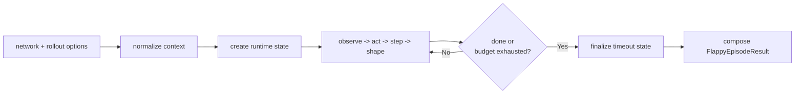

# evaluation/rollout

Rollout orchestration module.

This file will host the internal rollout orchestration entry while the
public evaluation-level service remains a stable compatibility facade.

Educational note:
A rollout is one deterministic episode for one policy under one seed. This
module keeps that lifecycle readable: normalize inputs, create runtime state,
simulate until termination, then fold the result into a public episode report.

That lifecycle matters because the trainer depends on rollouts being both
repeatable and interpretable. A rollout is not only "did the bird crash?"
It is the bridge between one seeded control problem and one scored episode
that can be compared fairly with other genomes.

Rollout pipeline:


## evaluation/rollout/evaluation.rollout.service.ts

### rolloutEpisode

```ts
rolloutEpisode(
  network: FlappyNetworkLike,
  rolloutOptions: FlappyRolloutOptions,
): FlappyEpisodeResult
```

Roll out an episode and return details.

Parameters:
- `network` - Genome/network to evaluate.
- `rolloutOptions` - Optional rollout controls.

Returns: Episode result details.

Example:

```ts
const result = rolloutEpisode(network, {
  seed: 123,
  normalizeFitness: true,
  maxFrames: 2_000,
});

console.log(result.fitness, result.doneReason);
```

## evaluation/rollout/evaluation.rollout.services.ts

Rollout runtime services.

This file owns the mechanics of running an episode once a caller has decided
to do a rollout: normalize the options, create the seeded runtime, loop over
frames, and stop early when continued simulation is no longer informative.

The companion utils file owns reward shaping and result composition. This file
owns the episode heartbeat itself.

Minimal usage sketch:
```ts
const rolloutEpisodeContext = resolveRolloutEpisodeContext(network, {
  seed: 123,
  enableEarlyTermination: true,
});
const rolloutEpisodeRuntimeState = createRolloutEpisodeRuntimeState(
  rolloutEpisodeContext,
);
runRolloutEpisodeLoop(
  network,
  rolloutEpisodeContext,
  rolloutEpisodeRuntimeState,
);
finalizeRolloutEpisodeState(
  rolloutEpisodeContext,
  rolloutEpisodeRuntimeState,
);
```

### applyRolloutEarlyTerminationIfNeeded

```ts
applyRolloutEarlyTerminationIfNeeded(
  rolloutEpisodeContext: RolloutEpisodeContext,
  rolloutEpisodeRuntimeState: RolloutEpisodeRuntimeState,
  currentObservationFeatures: SharedObservationFeatures,
): void
```

Applies the optional early-termination heuristic for unrecoverable starts.

Educational note:
Early termination is an evaluation-speed heuristic, not a gameplay rule. It
exists to stop obviously doomed warmup trajectories from consuming excessive
rollout budget.

Parameters:
- `rolloutEpisodeContext` - Normalized rollout configuration.
- `rolloutEpisodeRuntimeState` - Mutable runtime state.
- `currentObservationFeatures` - Post-step observation features.

Returns: Nothing.

### createRolloutEpisodeRuntimeState

```ts
createRolloutEpisodeRuntimeState(
  rolloutEpisodeContext: RolloutEpisodeContext,
): RolloutEpisodeRuntimeState
```

Creates mutable runtime state for one rollout episode.

The runtime state carries the seeded RNG, the mutable environment, the
temporal observation memory, and the shaping counters accumulated during the
episode.

Parameters:
- `rolloutEpisodeContext` - Normalized rollout configuration.

Returns: Mutable runtime state.

### finalizeRolloutEpisodeState

```ts
finalizeRolloutEpisodeState(
  rolloutEpisodeContext: RolloutEpisodeContext,
  rolloutEpisodeRuntimeState: RolloutEpisodeRuntimeState,
): void
```

Finalizes episode state after the main rollout loop exits.

Timeouts are applied here instead of inside the loop body so natural episode
endings stay distinct from budget exhaustion.

Parameters:
- `rolloutEpisodeContext` - Normalized rollout configuration.
- `rolloutEpisodeRuntimeState` - Mutable runtime state.

Returns: Nothing.

### resolveRolloutEpisodeContext

```ts
resolveRolloutEpisodeContext(
  network: FlappyNetworkLike,
  rolloutOptions: FlappyRolloutOptions,
): RolloutEpisodeContext
```

Resolves normalized rollout configuration from user options.

This is the rollout safety boundary: caller-provided values are clamped into
deterministic, execution-safe ranges before the main loop touches them.

Parameters:
- `network` - Genome/network to evaluate.
- `rolloutOptions` - Optional rollout controls.

Returns: Normalized rollout configuration.

### resolveRolloutFrameFlapDecision

```ts
resolveRolloutFrameFlapDecision(
  network: FlappyNetworkLike,
  rolloutEpisodeContext: RolloutEpisodeContext,
  rolloutEpisodeRuntimeState: RolloutEpisodeRuntimeState,
): boolean
```

Resolves the flap decision for one control substep and commits memory state.

The temporal memory is updated immediately after the decision so subsequent
substeps can see short-term action history without needing recurrent state.

Parameters:
- `network` - Genome/network to evaluate.
- `rolloutEpisodeContext` - Normalized rollout configuration.
- `rolloutEpisodeRuntimeState` - Mutable runtime state.

Returns: Whether the bird should flap.

### runRolloutEpisodeFrame

```ts
runRolloutEpisodeFrame(
  network: FlappyNetworkLike,
  rolloutEpisodeContext: RolloutEpisodeContext,
  rolloutEpisodeRuntimeState: RolloutEpisodeRuntimeState,
): void
```

Runs one rollout frame including control, shaping, and early termination.

Educational note:
Each frame follows a compact pipeline: observe, act, step the environment,
accumulate shaping reward, then optionally prune the trajectory.

Parameters:
- `network` - Genome/network to evaluate.
- `rolloutEpisodeContext` - Normalized rollout configuration.
- `rolloutEpisodeRuntimeState` - Mutable runtime state.

Returns: Nothing.

### runRolloutEpisodeLoop

```ts
runRolloutEpisodeLoop(
  network: FlappyNetworkLike,
  rolloutEpisodeContext: RolloutEpisodeContext,
  rolloutEpisodeRuntimeState: RolloutEpisodeRuntimeState,
): void
```

Runs the main rollout loop until termination or frame-budget exhaustion.

This is the episode heartbeat: keep stepping while the bird is alive and the
rollout still has budget left.

Parameters:
- `network` - Genome/network to evaluate.
- `rolloutEpisodeContext` - Normalized rollout configuration.
- `rolloutEpisodeRuntimeState` - Mutable runtime state.

Returns: Nothing.

## evaluation/rollout/evaluation.rollout.utils.ts

Rollout shaping and result helpers.

This file interprets an episode after the runtime services have determined
what happened. In other words: services produce the trajectory, utils assign
meaning to that trajectory.

Educational note:
The rollout subsystem separates simulation from scoring on purpose. The
services file determines what happened; this file determines how that episode
should be interpreted as fitness.

### composeNormalizedFitness

```ts
composeNormalizedFitness(
  framesValue: number,
  pipesPassedValue: number,
  denseShapingValue: number,
  terminalShapingValue: number,
  maxFramesValue: number,
  pipeProgressTarget: number | undefined,
): number
```

Normalize and cap fitness channels so no single reward term dominates.

Educational note:
Channel normalization is a pragmatic way to keep the objective balanced across
episodes of different lengths and levels of progress.

Parameters:
- `framesValue` - Frames survived for the episode.
- `pipesPassedValue` - Pipes passed during the episode.
- `denseShapingValue` - Accumulated dense shaping reward.
- `terminalShapingValue` - Terminal shaping reward.
- `maxFramesValue` - Frame budget used for the episode.
- `pipeProgressTarget` - Optional target used to normalize pipe progress.

Returns: Normalized composite fitness.

### composeRolloutEpisodeResult

```ts
composeRolloutEpisodeResult(
  rolloutEpisodeContext: RolloutEpisodeContext,
  rolloutEpisodeRuntimeState: RolloutEpisodeRuntimeState,
): FlappyEpisodeResult
```

Composes the final rollout result from the terminal game state.

This is the final fold step for rollout execution: internal counters and
shaping channels become the public `FlappyEpisodeResult` consumed by training
and reporting.

Parameters:
- `rolloutEpisodeContext` - Normalized rollout configuration.
- `rolloutEpisodeRuntimeState` - Mutable runtime state.

Returns: Episode result details.

### computeDenseShapingReward

```ts
computeDenseShapingReward(
  previousFeatures: SharedObservationFeatures,
  currentFeatures: SharedObservationFeatures,
): number
```

Computes dense reward shaping from consecutive observations.

Dense shaping rewards incremental improvement throughout an episode instead of
paying out only at the end, which gives evolution a more informative signal.

Parameters:
- `previousFeatures` - Observation before stepping the environment.
- `currentFeatures` - Observation after stepping the environment.

Returns: Per-step shaped reward.

### computeTerminalShapingFitness

```ts
computeTerminalShapingFitness(
  episodeState: FlappyGameState,
  difficultyScale: number,
): number
```

Adds small terminal bonuses from final progress/alignment signals.

Terminal bonuses refine the final ranking, but they are intentionally smaller
than the main survival and pipe-progress channels.

Parameters:
- `episodeState` - Final rollout state.
- `difficultyScale` - Active rollout difficulty scale.

Returns: Terminal shaping reward.

### isBirdLikelyUnrecoverable

```ts
isBirdLikelyUnrecoverable(
  observationFeatures: SharedObservationFeatures,
): boolean
```

Detects trajectories that are usually irrecoverable in early warmup.

The heuristic focuses on obvious early failures, where spending more rollout
budget is least informative.

Parameters:
- `observationFeatures` - Post-step observation features.

Returns: Whether the current trajectory appears unrecoverable.

### resolveDenseShapingRewardComponents

```ts
resolveDenseShapingRewardComponents(
  previousFeatures: SharedObservationFeatures,
  currentFeatures: SharedObservationFeatures,
): DenseShapingRewardComponents
```

Resolves every dense-shaping reward component from consecutive observations.

If you want background reading, the Wikipedia article on "reward shaping" is
a good high-level companion concept for why these components exist.

Parameters:
- `previousFeatures` - Observation before stepping the environment.
- `currentFeatures` - Observation after stepping the environment.

Returns: Dense-shaping reward components.

### resolveRolloutFitnessBreakdown

```ts
resolveRolloutFitnessBreakdown(
  rolloutEpisodeContext: RolloutEpisodeContext,
  rolloutEpisodeRuntimeState: RolloutEpisodeRuntimeState,
  framesSurvived: number,
  pipesPassed: number,
): RolloutFitnessBreakdown
```

Resolves the raw fitness channels from the final episode state.

Separating raw channels from final composition makes reward rebalancing much
easier to reason about.

Parameters:
- `rolloutEpisodeContext` - Normalized rollout configuration.
- `rolloutEpisodeRuntimeState` - Mutable runtime state.
- `framesSurvived` - Final frame count.
- `pipesPassed` - Final pipe-pass count.

Returns: Fitness-channel breakdown.

### resolveUnnormalizedRolloutFitness

```ts
resolveUnnormalizedRolloutFitness(
  rolloutFitnessBreakdown: RolloutFitnessBreakdown,
): number
```

Resolves raw fitness by summing every fitness channel.

This is the legacy unnormalized objective. The normalized path below caps
channels so no single term dominates the whole score.

Parameters:
- `rolloutFitnessBreakdown` - Fitness-channel breakdown.

Returns: Raw unnormalized fitness.

## evaluation/rollout/evaluation.rollout.types.ts

Rollout-internal type contracts.

These runtime-only types are the private vocabulary of one rollout episode.
They keep the public evaluation API compact while still giving the rollout
loop explicit names for the data it carries between phases.

Read them as three layers:

- `RolloutEpisodeContext`: immutable, normalized configuration.
- `RolloutEpisodeRuntimeState`: mutable execution state.
- fitness and shaping types: named reward channels used during folding.

### DenseShapingRewardComponents

Per-frame dense shaping channels resolved from consecutive observations.

The shaping system rewards more than survival: it also tracks approach,
centering, clearance, and stable motion.

### RolloutEpisodeContext

Immutable rollout options normalized into execution-safe ranges.

Every field here is ready for direct use inside the episode loop.

### RolloutEpisodeRuntimeState

Mutable runtime state accumulated while one rollout episode executes.

This is the mutable side of the rollout: world state, RNG, temporal memory,
and the counters accumulated during execution.

### RolloutFitnessBreakdown

Fitness-channel breakdown used to compose the public episode result.

Named channels make reward design easier to audit than a single opaque number.

## evaluation/rollout/evaluation.rollout.constants.ts

Rollout-local constants.

These constants are the small semantic anchors that keep the rollout code
readable: default ids, minimum clamps, zero baselines, and explicit done
reasons.

Naming these sentinels explicitly keeps rollout code easier to read than a
sea of raw `0`, `1`, and string literals.

### FLAPPY_ROLLOUT_DEFAULT_GENOME_ID

Default genome id used when a network does not expose one.

### FLAPPY_ROLLOUT_DONE_REASON_COLLISION

Rollout done reason used by heuristic early termination.

### FLAPPY_ROLLOUT_DONE_REASON_TIMEOUT

Rollout done reason used when the episode exhausts its frame budget.

### FLAPPY_ROLLOUT_MIN_EARLY_TERMINATION_CONSECUTIVE_FRAMES

Minimum unrecoverable-frame streak required for early termination.

### FLAPPY_ROLLOUT_MIN_EARLY_TERMINATION_GRACE_FRAMES

Minimum grace period allowed before early termination can activate.

### FLAPPY_ROLLOUT_MIN_MAX_FRAMES

Minimum positive frame-like scalar used by rollout normalization.

### FLAPPY_ROLLOUT_ZERO_FITNESS

Shared zero baseline used across rollout fitness and counters.

This acts as the semantic baseline for both shaping accumulation and several
rollout guard conditions.
