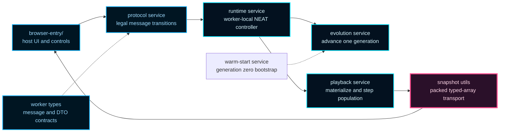

# flappy-evolution-worker

Off-thread evolution and playback authority for the Flappy Bird browser demo.

This worker boundary exists to keep the browser honest. The main thread owns
explanation, HUD rendering, and network inspection, while the worker owns the
hot path: evolving generations, materializing playback state, advancing the
simulation, and packaging compact snapshots back to the host.

That separation is doing two jobs at once. It protects the browser from
heavy simulation work, and it turns responsibility into something a reader
can see directly because every cross-thread handoff must become an explicit
typed message.

Read this folder as the protocol chapter between the browser host and the
deterministic runtime that actually evolves and replays the flock. The
important design question is not merely "how do Web Workers run code?" It is
"which side should own each piece of truth when evolution, playback, and
inspection all need the same population?"

In this example, the answer is deliberate:

- the host owns controls, HUD state, and network visualization,
- the worker owns generation requests, playback stepping, and winner
  selection,
- packed snapshots are the narrow bridge between those two worlds.

## What This Folder Is Trying To Teach

The worker chapter is organized around four reader questions:

1. How does the browser request evolution work without becoming the
   simulation authority?
2. How does one evolved population become a replayable playback session?
3. Why are snapshots packed into typed arrays instead of posted as nested
   render objects?
4. Where should you read next when the protocol is clear but one runtime step
   still feels opaque?

## Core Worker Map



Read the diagram left to right. The host is allowed to request work, but it
never takes ownership of the worker's mutable simulation state. The worker
can then optimize for determinism and throughput while the browser optimizes
for explanation.

## Choose Your Route

- Start with `flappy-evolution-worker.ts` if you want the high-level message
  lifecycle.
- Read `flappy-evolution-worker.protocol.service.ts` next if you want the
  legal sequencing rules.
- Read `flappy-evolution-worker.runtime.service.ts` if you want the worker's
  NEAT runtime setup.
- Read `flappy-evolution-worker.playback.service.ts` and
  `flappy-evolution-worker.simulation.frame.service.ts` if you want the hot
  playback path.
- Read `flappy-evolution-worker.snapshot.utils.ts` if you want the typed-array
  transport story.

Minimal host-side sketch:

```ts
worker.postMessage({
  type: 'init',
  payload: { populationSize: 50, elitismCount: 10, rngSeed: 12345 },
});
worker.postMessage({ type: 'request-generation' });
worker.postMessage({
  type: 'start-playback',
  payload: { visibleWorldWidthPx: 1280, visibleWorldHeightPx: 720 },
});
worker.postMessage({
  type: 'request-playback-step',
  payload: {
    requestId: 1,
    simulationSteps: 2,
    visibleWorldWidthPx: 1280,
    visibleWorldHeightPx: 720,
  },
});
```

If you want background reading before the symbol shelf, the MDN Web Workers
guide is the fastest practical reference for why this example pushes both
evolution and playback off the main thread.

## flappy-evolution-worker/flappy-evolution-worker.ts

### beginWorkerGenerationRequest

```ts
beginWorkerGenerationRequest(
  workerMutableRuntimeState: WorkerMutableRuntimeState,
): void
```

Begins one asynchronous generation request and captures failures.

This is intentionally fire-and-forget from the protocol perspective. The
actual completion signal is the later `generation-ready` or `error` message
posted back to the host.

Parameters:
- `workerMutableRuntimeState` - Mutable worker runtime state.

Returns: Nothing.

### beginWorkerInitialization

```ts
beginWorkerInitialization(
  workerMutableRuntimeState: WorkerMutableRuntimeState,
  initPayload: { architectureProfileId?: ExampleArchitectureProfileId | undefined; populationSize: number; elitismCount: number; rngSeed: number; },
): void
```

Begins worker initialization and captures asynchronous failures.

The worker retains the initialization promise so later generation requests can
await setup completion instead of racing against it.

Parameters:
- `workerMutableRuntimeState` - Mutable worker runtime state.
- `initPayload` - Initialization payload.

Returns: Nothing.

### beginWorkerPlayback

```ts
beginWorkerPlayback(
  workerMutableRuntimeState: WorkerMutableRuntimeState,
  payload: { visibleWorldWidthPx: number; visibleWorldHeightPx: number; },
): void
```

Begins a new playback session from the current evolved population.

A playback session is a deterministic simulation snapshot seeded from the
current population. Each new session resets playback RNG and world state so
the host can replay generations cleanly.

Parameters:
- `workerMutableRuntimeState` - Mutable worker runtime state.
- `payload` - Playback start payload.

Returns: Nothing.

### createWorkerMessageHandler

```ts
createWorkerMessageHandler(
  workerMutableRuntimeState: WorkerMutableRuntimeState,
): (event: MessageEvent<WorkerRequestMessage>) => void
```

Creates the top-level worker message handler.

The returned function is intentionally thin. All protocol decisions are
delegated to the router service so the worker entrypoint stays readable as a
high-level orchestration module.

Parameters:
- `workerMutableRuntimeState` - Mutable worker runtime state.

Returns: Worker message handler.

Example:

```ts
self.onmessage = createWorkerMessageHandler(workerMutableRuntimeState);
```

### createWorkerMutableRuntimeState

```ts
createWorkerMutableRuntimeState(): WorkerMutableRuntimeState
```

Creates the mutable worker runtime state container.

Educational note:
The worker keeps one small mutable state bag instead of scattering globals.
That makes the protocol flow easier to explain and lets the entrypoint pass a
single dependency object through the orchestration helpers.

Returns: Mutable worker runtime state.

### createWorkerProtocolHandlers

```ts
createWorkerProtocolHandlers(
  workerMutableRuntimeState: WorkerMutableRuntimeState,
): { markStopped: () => void; beginInitialization: (payload: { architectureProfileId?: ExampleArchitectureProfileId | undefined; populationSize: number; elitismCount: number; rngSeed: number; }) => void; beginGenerationRequest: () => void; hasPopulation: () => boolean; startPlayback: (payload: { visibleWorldWidthPx: number; visibleWorldHeightPx: number; }) => void; hasPlaybackState: () => boolean; processPlaybackStep: (payload: { requestId: number; simulationSteps: number; visibleWorldWidthPx: number; visibleWorldHeightPx: number; }) => void; postWorkerMessage: typeof postWorkerMessage; }
```

Creates protocol handlers bound to the mutable worker runtime state.

This helper is the bridge between the pure protocol router and the impure
worker runtime. Each callback closes over the same mutable state bag so the
protocol layer can remain small and declarative.

Parameters:
- `workerMutableRuntimeState` - Mutable worker runtime state.

Returns: Protocol handler bundle.

### evolveAndPublishGeneration

```ts
evolveAndPublishGeneration(
  workerMutableRuntimeState: WorkerMutableRuntimeState,
): Promise<void>
```

Evolves one generation and publishes the best-network summary message.

Educational note:
This method is the orchestration seam between evolutionary search and
browser rendering: it runs evolution, snapshots the population, and emits
a compact payload for UI state updates.

Returns: Promise resolved after generation payload is posted.

### initializeRuntime

```ts
initializeRuntime(
  workerMutableRuntimeState: WorkerMutableRuntimeState,
  initPayload: { architectureProfileId?: ExampleArchitectureProfileId | undefined; populationSize: number; elitismCount: number; rngSeed: number; },
): Promise<void>
```

Initializes the worker-local NEAT runtime used by browser evolution playback.

Educational note:
The runtime is configured once with deterministic RNG state and a lightweight
early-termination fitness rollout. Keeping this setup centralized helps ensure
reproducibility between runs and keeps host<->worker contracts simple.

This function only prepares the evolutionary controller. It does not start
playback and it does not evolve a generation yet; those remain separate
protocol steps so the host can control them explicitly.

Parameters:
- `initPayload` - Initialization values from the browser host.

Returns: Promise resolved when runtime setup is complete.

### postWorkerMessage

```ts
postWorkerMessage(
  workerMessage: WorkerResponseMessage,
  transferList: Transferable[] | undefined,
): void
```

Posts a typed message from worker to host.

This is the narrowest possible transport helper: all message construction is
done elsewhere so the README can point to one stable worker-to-host boundary.

Parameters:
- `workerMessage` - Outbound worker response payload.
- `transferList` - Optional transferable buffers moved with the payload.

Returns: Nothing.

### processWorkerPlaybackStepRequest

```ts
processWorkerPlaybackStepRequest(
  workerMutableRuntimeState: WorkerMutableRuntimeState,
  playbackStepPayload: { requestId: number; simulationSteps: number; visibleWorldWidthPx: number; visibleWorldHeightPx: number; },
): void
```

Advances playback by a host-requested number of simulation steps.

Educational note:
The browser host can request multiple simulation steps per RAF to trade visual
smoothness against throughput. This function keeps that loop deterministic and
emits one compact snapshot payload per request.

Importantly, the worker remains authoritative for deciding when the run is
over and which bird should be treated as the playback winner.

Parameters:
- `playbackStepPayload` - Host-selected simulation-step budget and viewport.

Returns: Nothing.

## flappy-evolution-worker/flappy-evolution-worker.types.ts

### SerializedNetwork

Loose JSON-compatible network payload used by worker messages.

The worker never posts live `Network` instances back to the browser host.
Instead it sends the result of `network.toJSON()` so the payload stays
structured-clone safe and easy to inspect in devtools.

### WorkerErrorMessage

Worker error response message.

Errors are normalized into a display-safe string so the host UI can surface
failures without depending on worker-specific exception classes.

### WorkerFrameBirdSnapshot

Render-only bird snapshot DTO posted to host.

This shape is useful conceptually, but the current transport uses the packed
typed-array variant for lower allocation and transfer cost.

### WorkerFramePipeSnapshot

Render-only pipe snapshot DTO posted to host.

Like `WorkerFrameBirdSnapshot`, this documents the logical payload shape even
though the worker currently sends the packed transport form.

### WorkerGenerationReadyMessage

Worker generation-ready response message.

The browser host uses this message to refresh HUD state and optionally render
the current best network visualization.

### WorkerHeuristicObservationFeatures

Structured features used by heuristic generation-0 teacher policy.

The warm-start service reuses the same high-level observation semantics as the
real policy inference path, which keeps the heuristic teacher aligned with the
features evolved networks will later see.

### WorkerInitMessage

Worker init request message.

This is the first message the host should send. It seeds deterministic RNG
state and configures the worker-local NEAT runtime.

### WorkerPackedPlaybackBirdSnapshot

Packed typed-array payload for playback bird snapshot transport.

The host can reconstruct renderer-friendly bird views from these arrays while
the worker keeps the authoritative mutable simulation objects private.

### WorkerPackedPlaybackPipeSnapshot

Packed typed-array payload for playback pipe snapshot transport.

Packing the per-pipe fields into column-oriented typed arrays makes the
browser/worker boundary cheaper than sending large arrays of object literals
on every animation frame.

### WorkerPlaybackFrameSnapshot

Full frame snapshot payload posted to host.

Educational note:
`packed-v1` is a transport contract, not a rendering primitive. The versioned
format string gives the browser host a stable way to decode snapshots even if
the worker later gains additional packed fields or alternate transport modes.

Example:

```ts
const message = {
  type: 'playback-step',
  payload: {
    requestId: 7,
    snapshot,
    done: false,
  },
};
```

### WorkerPlaybackState

Mutable simulation state stored between worker playback requests.

A `start-playback` message creates this state once, and each
`request-playback-step` message advances it by a host-selected number of
simulation steps.

### WorkerPlaybackStepMessage

Worker playback-step response message.

The message carries the packed frame snapshot plus optional instrumentation
and end-of-run summary statistics when the whole simulated population has
been eliminated.

The split between per-frame snapshot data and end-of-run summary fields keeps
the hot path compact while still giving the host enough telemetry to update
HUD metrics when a playback session completes.

### WorkerPopulationBird

Mutable bird state tracked by the worker playback simulation.

Educational note:
Each bird keeps both physics state and policy state. The observation-memory
field lets feed-forward networks approximate short-term temporal memory by
carrying previous observation features between simulation steps.

### WorkerPopulationPipe

Mutable pipe state tracked by the worker playback simulation.

These objects exist only inside the worker runtime. The host later receives a
packed snapshot derived from them rather than these live mutable records.

### WorkerRequestGenerationMessage

Worker request asking to evolve one generation.

The worker responds with `generation-ready` once the NEAT runtime finishes
one evolution pass.

### WorkerRequestMessage

Union of inbound worker request messages.

Reading this union top-to-bottom is the quickest way to understand the worker
protocol: initialize, evolve, start playback, step playback, then stop.

### WorkerRequestPlaybackStepMessage

Worker request asking to advance playback by N simulation steps.

The host typically sends this once per animation frame and chooses
`simulationSteps` based on how much simulation throughput it wants relative to
rendering smoothness.

### WorkerResponseMessage

Union of outbound worker response messages.

Together with `WorkerRequestMessage`, this forms the full host/worker
protocol contract for the demo.

### WorkerStartPlaybackMessage

Worker request asking to initialize playback state.

This materializes the mutable world state for the current evolved population.
After this message succeeds, the host can begin issuing playback-step
requests.

### WorkerStopMessage

Worker stop request message.

This is a cooperative shutdown signal. Long-running worker flows can observe
the stopped flag and fail fast instead of continuing work the UI no longer
cares about.

## flappy-evolution-worker/flappy-evolution-worker.runtime.service.ts

### createInitializedWorkerRuntime

```ts
createInitializedWorkerRuntime(
  initPayload: { architectureProfileId?: ExampleArchitectureProfileId | undefined; populationSize: number; elitismCount: number; rngSeed: number; },
): default
```

Creates and configures the worker-local NEAT runtime used by browser evolution playback.

Educational note:
The browser worker reuses the same core NeatapticTS runtime as the Node-side
trainer, but trims configuration down to the pieces needed for an interactive
example: deterministic seeding, feed-forward mutation policy, and a fitness
function that favors quick browser-visible iteration.

The resulting runtime is both the evolution engine and the source of the
population that later playback requests visualize.

For background reading, the Wikipedia article on "Neuroevolution of
augmenting topologies" is a useful overview of the family of ideas this demo
is exercising, even though the repository implements its own detailed runtime
behavior and modern extensions.

Parameters:
- `initPayload` - Initialization values from the browser host.

Returns: Initialized NEAT runtime.

Example:

```ts
const neatRuntime = createInitializedWorkerRuntime({
  populationSize: 50,
  elitismCount: 10,
  rngSeed: 12345,
});
```

## flappy-evolution-worker/flappy-evolution-worker.protocol.service.ts

### routeWorkerProtocolMessage

```ts
routeWorkerProtocolMessage(
  workerMessage: WorkerRequestMessage,
  handlers: WorkerProtocolHandlers,
): void
```

Routes one inbound worker request message to the corresponding runtime action.

Educational note:
This router is the protocol gatekeeper for the worker. It enforces the two
important sequencing rules in the demo:
- playback requires a previously evolved population,
- playback stepping requires an active playback session.

In practice this acts like a tiny finite-state machine. If you want a quick
conceptual refresher, the Wikipedia article on "finite-state machine" maps
well onto the worker's init -> evolve -> start playback -> step playback flow.

Parameters:
- `workerMessage` - Inbound worker request payload.
- `handlers` - Runtime action callbacks and state probes.

Returns: Nothing.

Example:

```ts
routeWorkerProtocolMessage(
  { type: 'request-generation' },
  workerProtocolHandlers,
);
```

### WorkerProtocolHandlers

Callback bundle used by worker protocol routing.

Each callback corresponds to one legal transition in the worker message
protocol. Keeping the router dependent on this narrow interface makes the
protocol easy to read in generated docs and easy to test independently from
the worker-global `self.onmessage` hook.

## flappy-evolution-worker/flappy-evolution-worker.evolution.service.ts

### evolveAndBuildGenerationReadyMessage

```ts
evolveAndBuildGenerationReadyMessage(
  options: WorkerEvolutionServiceOptions,
): Promise<WorkerGenerationReadyMessage>
```

Evolves one generation and creates the compact generation-ready response payload.

Educational note:
The worker does not stream the whole population back to the UI after each
evolution step. Instead it emits a compact summary containing the generation
index, best fitness, and a serializable best-network snapshot for inspection.

Parameters:
- `options` - Evolution dependencies and runtime state accessors.

Returns: Generation-ready worker response payload.

Example:

```ts
const generationMessage = await evolveAndBuildGenerationReadyMessage({
  initializationPromise,
  neatRuntime,
  isStopped: () => false,
  warmStartGenerationZeroIfNeeded,
  setCurrentPopulation,
});
```

### WorkerEvolutionServiceOptions

Dependencies required to evolve one generation and prepare host payload output.

Educational note:
This interface isolates the evolution step from the worker entrypoint. That
makes the README easier to follow: the entrypoint owns protocol orchestration,
while this service owns one well-defined "run generation -> publish summary"
slice of behavior.

## flappy-evolution-worker/flappy-evolution-worker.playback.service.ts

### beginWorkerPlaybackSession

```ts
beginWorkerPlaybackSession(
  options: { currentPopulation: default[]; payload: { visibleWorldWidthPx: number; visibleWorldHeightPx: number; }; createPopulationRenderState: (networks: default[], rng: FlappyRng, initialVisibleWorldWidthPx: number, initialVisibleWorldHeightPx: number) => WorkerPlaybackState; },
): { currentPlaybackState: WorkerPlaybackState; currentPlaybackRng: FlappyRng; playbackWinnerIndex: number; }
```

Creates a fresh worker playback session state from the current evolved population.

Educational note:
Evolution and playback are intentionally separated. Evolution produces a new
population, then playback freezes that population into a deterministic
simulation state that the host can step frame-by-frame for rendering.

Parameters:
- `currentPopulation` - Current evolved population.
- `payload` - Playback start viewport payload.
- `createPopulationRenderState` - Callback that builds initial simulation state.

Returns: Playback runtime state and deterministic RNG.

Example:

```ts
const session = beginWorkerPlaybackSession({
  currentPopulation,
  payload: { visibleWorldWidthPx: 1280, visibleWorldHeightPx: 720 },
  createPopulationRenderState,
});
```

### processWorkerPlaybackStep

```ts
processWorkerPlaybackStep(
  options: { playbackStepPayload: { requestId: number; simulationSteps: number; visibleWorldWidthPx: number; visibleWorldHeightPx: number; }; currentPlaybackState: WorkerPlaybackState; currentPlaybackRng: FlappyRng; currentPopulation: default[]; neatRuntime: default | undefined; stepPopulationFrame: (renderState: WorkerPlaybackState, rng: FlappyRng, difficultyProfile: SharedDifficultyProfile) => number; createPlaybackSnapshot: (playbackState: WorkerPlaybackState) => WorkerPlaybackFrameSnapshot; resolvePlaybackSnapshotTransferList: (snapshot: WorkerPlaybackFrameSnapshot) => Transferable[]; postWorkerMessage: (workerMessage: WorkerResponseMessage, transferList?: Transferable[] | undefined) => void; },
): { currentPlaybackState: WorkerPlaybackState | undefined; currentPlaybackRng: FlappyRng | undefined; currentPopulation: default[]; playbackWinnerIndex: number; }
```

Processes one worker playback-step request including completion/finalization logic.

Educational note:
One playback request may advance multiple simulation steps. This lets the
host trade visual smoothness against throughput while keeping the worker in
control of simulation correctness, winner selection, and packed snapshot
publishing.

Parameters:
- `options` - Playback step dependencies and mutable runtime state.

Returns: Updated playback runtime state after processing this step.

## flappy-evolution-worker/flappy-evolution-worker.snapshot.utils.ts

### createWorkerPlaybackSnapshot

```ts
createWorkerPlaybackSnapshot(
  playbackState: WorkerPlaybackState,
): WorkerPlaybackFrameSnapshot
```

Creates a serializable snapshot of current playback state.

Workers should send only structured-clone-safe payloads. This helper strips
runtime-only references (e.g., network instances, sets) and keeps only
renderer-relevant fields.

Educational note:
The snapshot is intentionally column-oriented. By packing values into typed
arrays, the worker can transfer large bird populations to the host with much
lower overhead than a per-frame array of nested objects.

This is a small example of a structure-of-arrays transport layout. If that
pattern is unfamiliar, the Wikipedia article on "AoS and SoA" is a good short
reference for why packed columns are often friendlier to hot-path data
movement than arrays of rich objects.

Parameters:
- `playbackState` - Current mutable playback state.

Returns: Immutable frame snapshot for the host.

### resolveWorkerPlaybackSnapshotTransferList

```ts
resolveWorkerPlaybackSnapshotTransferList(
  snapshot: WorkerPlaybackFrameSnapshot,
): Transferable[]
```

Resolves transferable buffers for one packed playback snapshot.

The returned buffers should be passed as the second argument to
`postMessage(...)` so ownership moves to the host thread instead of copying
the typed-array contents.

That ownership transfer is a large part of why the worker can stream full
population snapshots without forcing the main thread to pay unnecessary copy
costs every frame.

Parameters:
- `snapshot` - Packed playback snapshot posted back to the browser host.

Returns: Transfer list used to move typed-array buffers without copying.

## flappy-evolution-worker/flappy-evolution-worker.simulation.types.ts

### WorkerPlaybackFrameContext

Shared mutable inputs for one worker playback frame simulation pass.

Educational note:
The frame service computes several derived geometry values once per logical
frame and threads them through the substep helpers in this context object.
That keeps the top-level simulation flow declarative while avoiding repeated
argument sprawl across helper calls.

## flappy-evolution-worker/flappy-evolution-worker.simulation.utils.ts

### createWorkerPopulationRenderState

```ts
createWorkerPopulationRenderState(
  networks: default[],
  rng: RngLike,
  initialVisibleWorldWidthPx: number,
  initialVisibleWorldHeightPx: number,
): WorkerPlaybackState
```

Creates initial playback state for a population of networks.

Educational note:
This is the ownership boundary for worker playback initialization. The frame
simulation service mutates the returned state on every step, but only this
helper decides how a fresh population is placed into the world at time zero.

Parameters:
- `networks` - Population to visualize.
- `rng` - Deterministic random source.
- `initialVisibleWorldWidthPx` - Initial viewport width from host.
- `initialVisibleWorldHeightPx` - Initial viewport height from host.

Returns: Fresh mutable playback state.

Example:

```ts
const playbackState = createWorkerPopulationRenderState(
  currentPopulation,
  rng,
  1280,
  720,
);
```

## flappy-evolution-worker/flappy-evolution-worker.simulation.frame.service.ts

### advanceBirdPhysics

```ts
advanceBirdPhysics(
  frameContext: WorkerPlaybackFrameContext,
): void
```

Integrates bird velocity and vertical motion for one control substep.

Parameters:
- `frameContext` - Shared frame context for this logical frame.

Returns: Nothing.

### advancePipes

```ts
advancePipes(
  frameContext: WorkerPlaybackFrameContext,
): void
```

Advances all visible pipes and culls those that have left the camera window.

Parameters:
- `frameContext` - Shared frame context for this logical frame.

Returns: Nothing.

### commitPassedPipeProgress

```ts
commitPassedPipeProgress(
  bird: WorkerPopulationBird,
  pipe: WorkerPopulationPipe,
): void
```

Commits one passed-pipe progress increment for a bird when eligible.

Parameters:
- `bird` - Mutable bird state.
- `pipe` - Pipe candidate to mark as passed.

Returns: Nothing.

### incrementLivingBirdFrameCounters

```ts
incrementLivingBirdFrameCounters(
  renderState: WorkerPlaybackState,
): void
```

Increments survival counters for birds that remain active at frame start.

Parameters:
- `renderState` - Mutable playback state.

Returns: Nothing.

### resolveBirdCollisionAgainstPipe

```ts
resolveBirdCollisionAgainstPipe(
  bird: WorkerPopulationBird,
  pipe: WorkerPopulationPipe,
  frameContext: WorkerPlaybackFrameContext,
): boolean
```

Resolves whether a bird collides with one pipe corridor during this substep.

Parameters:
- `bird` - Mutable bird state.
- `pipe` - Pipe candidate to test.
- `frameContext` - Shared frame context for this logical frame.

Returns: `true` when the bird overlaps the pipe body instead of the gap.

### resolveBirdControlActions

```ts
resolveBirdControlActions(
  frameContext: WorkerPlaybackFrameContext,
): number
```

Runs policy evaluation and commits the resulting observation memory updates.

Parameters:
- `frameContext` - Shared frame context for this logical frame.

Returns: Number of activation calls performed in the substep.

### resolveBirdOutOfBounds

```ts
resolveBirdOutOfBounds(
  bird: WorkerPopulationBird,
  visibleWorldHeightPx: number,
): boolean
```

Resolves whether a bird has exceeded the vertical play area.

Parameters:
- `bird` - Mutable bird state.
- `visibleWorldHeightPx` - Current visible world height.

Returns: `true` when the bird is outside the vertical bounds.

### resolveBirdTerminationAndProgress

```ts
resolveBirdTerminationAndProgress(
  frameContext: WorkerPlaybackFrameContext,
): void
```

Resolves bird deaths and passed-pipe progress after motion is applied.

Parameters:
- `frameContext` - Shared frame context for this logical frame.

Returns: Nothing.

### resolveCameraLeftXPx

```ts
resolveCameraLeftXPx(
  visibleWorldWidthPx: number,
): number
```

Resolves the current left-edge of the visible world in world-space pixels.

Parameters:
- `visibleWorldWidthPx` - Current visible world width.

Returns: Left edge x-position in world coordinates.

### runWorkerPopulationControlSubstep

```ts
runWorkerPopulationControlSubstep(
  frameContext: WorkerPlaybackFrameContext,
): number
```

Advances one control substep of the worker playback simulation.

Parameters:
- `frameContext` - Shared frame context for this logical frame.

Returns: Number of activation calls performed in the substep.

### spawnPipeIfNeeded

```ts
spawnPipeIfNeeded(
  frameContext: WorkerPlaybackFrameContext,
): void
```

Spawns a new pipe when the substep budget crosses the spawn boundary.

Parameters:
- `frameContext` - Shared frame context for this logical frame.

Returns: Nothing.

### stepWorkerPopulationFrame

```ts
stepWorkerPopulationFrame(
  renderState: WorkerPlaybackState,
  rng: RngLike,
  difficultyProfile: SharedDifficultyProfile,
): number
```

Advances the whole population simulation by one logical frame.

Educational note:
One logical frame is internally split into smaller control substeps so the
worker can make flap decisions, apply gravity, move pipes, spawn new pipes,
and resolve collisions with better numerical stability than a single large
integration jump.

This function is the main simulation ownership boundary for the folder.
The companion `simulation.utils` file creates initial state; this service is
responsible for mutating that state over time.

Parameters:
- `renderState` - Mutable simulation state.
- `rng` - Deterministic random source for spawn variation.
- `difficultyProfile` - Active dynamic difficulty profile.

Returns: Number of policy activation calls made in this frame.

## flappy-evolution-worker/flappy-evolution-worker.warm-start.service.ts

### applyTemplateWeightsWithNoise

```ts
applyTemplateWeightsWithNoise(
  genome: default,
  template: default,
  rng: FlappyRng,
  noise: { weightStdDev: number; biasStdDev: number; },
): void
```

Copies template parameters into a genome and injects small Gaussian noise.

Educational note:
The template network gives generation 0 a shared prior, while the noise terms
restore diversity so the population is still worth evolving.

Parameters:
- `genome` - Target genome to mutate in-place.
- `template` - Trained template source network.
- `rng` - Deterministic random source for noise sampling.
- `noise` - Standard deviations for weight and bias perturbations.

Returns: Nothing.

### buildHeuristicPretrainSet

```ts
buildHeuristicPretrainSet(
  rng: FlappyRng,
  sampleCount: number,
): { input: number[]; output: number[]; }[]
```

Builds synthetic supervised samples for generation-0 behavior cloning.

Educational note:
These samples are not recorded gameplay traces. They are synthetic states
generated from the same observation pipeline used during real playback so the
teacher labels and the evolved policy inputs stay in the same feature space.

Parameters:
- `rng` - Deterministic random source.
- `sampleCount` - Requested number of synthetic samples.

Returns: Supervised dataset of input/output pairs.

### buildWarmStartRolloutSeedBatch

```ts
buildWarmStartRolloutSeedBatch(
  rng: FlappyRng,
  seedCount: number,
): number[]
```

Builds the deterministic shared rollout seed batch used during warm-start refinement.

Parameters:
- `rng` - Deterministic random source.
- `seedCount` - Requested seed count.

Returns: Shared rollout seed batch.

### evaluateWarmStartTemplateAcrossRollouts

```ts
evaluateWarmStartTemplateAcrossRollouts(
  templateNetwork: default,
  sharedRolloutSeeds: readonly number[],
): FlappySeedBatchEvaluation
```

Evaluates one warm-start template across the shared rollout seed batch.

Parameters:
- `templateNetwork` - Candidate template to score.
- `sharedRolloutSeeds` - Shared rollout seeds used for stable comparison.

Returns: Aggregate shared-seed evaluation.

### interpolateValue

```ts
interpolateValue(
  startValue: number,
  endValue: number,
  ratio: number,
): number
```

Linearly interpolates between two scalar values.

Parameters:
- `startValue` - Value at ratio `0`.
- `endValue` - Value at ratio `1`.
- `ratio` - Interpolation ratio.

Returns: Interpolated value.

### isWarmStartEvaluationBetter

```ts
isWarmStartEvaluationBetter(
  candidateEvaluation: FlappySeedBatchEvaluation,
  bestEvaluation: FlappySeedBatchEvaluation,
): boolean
```

Resolves whether the candidate batch evaluation beats the current best one.

Robust fitness is the primary signal. Mean pipe progress and mean frame
survival act as deterministic tie-breakers so upgrades remain stable when the
robust score is identical.

Parameters:
- `candidateEvaluation` - Newly scored candidate aggregate.
- `bestEvaluation` - Current best aggregate.

Returns: True when the candidate should replace the incumbent template.

### optimizeWarmStartTemplateNetwork

```ts
optimizeWarmStartTemplateNetwork(
  templateNetwork: default,
  workerInitSeed: number,
): default
```

Refines the generation-0 template against real Flappy rollouts.

The warm-start teacher gets the template out of pure-random territory, but it
still only imitates a simple flap heuristic. This refinement pass keeps the
topology fixed and searches the parameter surface directly against actual
rollout fitness so the first visible generation starts closer to competent
control.

Parameters:
- `templateNetwork` - Heuristic-pretrained template network.
- `workerInitSeed` - Deterministic worker seed.

Returns: Best rollout-refined template found within the bounded budget.

### perturbNetworkParametersInPlace

```ts
perturbNetworkParametersInPlace(
  network: default,
  rng: FlappyRng,
  noise: { weightStdDev: number; biasStdDev: number; },
): void
```

Applies additive Gaussian noise to an existing network in-place.

Unlike the later population seeding copy step, this helper perturbs the
candidate template directly so the rollout optimizer can evaluate one local
parameter move at a time while keeping the topology unchanged.

Parameters:
- `network` - Candidate template to perturb.
- `rng` - Deterministic random source.
- `noise` - Standard deviations for weight and bias perturbations.

Returns: Nothing.

### resolveHeuristicTeacherFlapDecision

```ts
resolveHeuristicTeacherFlapDecision(
  features: SharedObservationFeatures,
): boolean
```

Heuristic teacher policy used to label synthetic pretraining samples.

The rule intentionally stays simple and interpretable: flap when the bird is
meaningfully below the next gap center, not already rising fast, and either
close to the gap entry or in an urgent approach state.

Parameters:
- `features` - Structured observation features for one synthetic state.

Returns: True when the teacher says to flap.

### resolveWarmStartAnnealRatio

```ts
resolveWarmStartAnnealRatio(
  optimizationStepIndex: number,
  totalOptimizationSteps: number,
): number
```

Resolves the annealing ratio for rollout-guided warm-start refinement.

Parameters:
- `optimizationStepIndex` - Zero-based optimization step index.
- `totalOptimizationSteps` - Total number of optimization steps.

Returns: Clamped ratio in the inclusive range [0, 1].

### sampleGaussian

```ts
sampleGaussian(
  rng: FlappyRng,
): number
```

Samples one standard-normal value using the Box-Muller transform.

If you are unfamiliar with the transform, the Wikipedia article on
"Box-Muller transform" is a useful short background read. The worker uses it
here because it is deterministic, dependency-light, and good enough for small
noise injection during warm-start diversification.

Parameters:
- `rng` - Deterministic random source.

Returns: One approximately standard-normal random value.

### warmStartWorkerGenerationZeroIfNeeded

```ts
warmStartWorkerGenerationZeroIfNeeded(
  neatController: default,
  warmStartState: WorkerWarmStartState,
  dependencies: WorkerWarmStartDependencies,
): Promise<void>
```

Applies a one-time generation-0 warm-start to improve initial demo quality.

Educational note:
The worker entry should stay protocol-first. This service owns the short
supervised bootstrap pass that nudges generation 0 away from pure noise while
preserving the later NEAT-driven search loop.

Conceptually this is a lightweight behavior-cloning pass. If you want more
background, the Wikipedia article on "imitation learning" is a helpful bridge
between the heuristic teacher used here and the later evolutionary search.

Parameters:
- `neatController` - Initialized NEAT runtime.
- `warmStartState` - Mutable warm-start lifecycle state.

Returns: Promise resolved when warm-start evaluation finishes.

Example:

```ts
await warmStartWorkerGenerationZeroIfNeeded(neatRuntime, {
  workerInitSeed: 123,
  generationZeroWarmStartApplied: false,
});
```

### WorkerWarmStartDependencies

Dependency bag for generation-0 warm-start orchestration.

The production path uses the real heuristic dataset builder and rollout-guided
template refinement. Tests can override these seams to keep assertions small
and deterministic.

### WorkerWarmStartState

State carried between generation requests for one worker runtime.

The warm-start service is intentionally one-shot. These fields let the worker
remember whether generation 0 has already been bootstrapped and which initial
RNG seed should be reused for deterministic synthetic sample generation.

## flappy-evolution-worker/flappy-evolution-worker.errors.ts

### createWorkerErrorMessage

```ts
createWorkerErrorMessage(
  message: string,
): WorkerErrorMessage
```

Creates a typed worker error response payload from a message string.

Parameters:
- `message` - Error message text.

Returns: Worker error response message.

Example:

```ts
postWorkerMessage(
  createWorkerErrorMessage('Playback step requested before playback start.'),
);
```

### createWorkerErrorMessageFromUnknown

```ts
createWorkerErrorMessageFromUnknown(
  error: unknown,
): WorkerErrorMessage
```

Creates a typed worker error response payload from an unknown thrown value.

This helper keeps the protocol boundary narrow: worker internals can use
regular exceptions, while the browser host still receives one predictable
`WorkerErrorMessage` shape.

Parameters:
- `error` - Unknown thrown value.

Returns: Worker error response message.

### FLAPPY_WORKER_INIT_FAILED_ERROR_MESSAGE

Worker error emitted when runtime initialization fails unexpectedly.

This message is intentionally stable so the browser host can show a readable
error without leaking internal exception shapes into the UI contract.

### FLAPPY_WORKER_PLAYBACK_START_REQUIRES_GENERATION_ERROR_MESSAGE

Worker error emitted when playback start is requested before evolution output exists.

Playback is defined over an already-evolved population snapshot. The host must
request at least one generation before asking the worker to start playback.

### FLAPPY_WORKER_PLAYBACK_STEP_REQUIRES_START_ERROR_MESSAGE

Worker error emitted when playback stepping is requested before playback start.

The protocol is stateful: `start-playback` materializes the mutable playback
state that later `request-playback-step` messages advance.

### resolveWorkerUnknownErrorMessage

```ts
resolveWorkerUnknownErrorMessage(
  error: unknown,
): string
```

Resolves unknown error-like values into display-safe worker error messages.

Educational note:
Browser workers can throw anything, including strings or arbitrary objects.
Normalizing that value here gives the rest of the protocol a simple
`string`-only error surface.

Parameters:
- `error` - Unknown error value thrown by worker logic.

Returns: Normalized error message string.

## flappy-evolution-worker/flappy-evolution-worker.constants.ts

Synthetic sample count used for generation-0 warm-start pretraining.

Educational note:
The warm-start service briefly trains a template network on a heuristic
teacher before the first NEAT generation is evolved. This value controls how
many synthetic state/action examples are generated for that bootstrap pass.
Larger values usually make the teacher signal more stable, but they also
increase startup latency inside the worker.

### FLAPPY_WORKER_GEN0_PRETRAIN_BATCH_SIZE

Batch size for generation-0 warm-start pretraining.

Smaller batches inject a bit more stochasticity into the bootstrap fit,
while still keeping the pass cheap enough for a browser worker.

### FLAPPY_WORKER_GEN0_PRETRAIN_BIAS_NOISE_STDDEV

Gaussian standard deviation used for post-pretrain node-bias diversification.

Bias noise is slightly smaller than weight noise so the warm-start remains a
prior, not a rigid clone of the teacher-fitted template.

### FLAPPY_WORKER_GEN0_PRETRAIN_ITERATIONS

Optimizer iteration budget for generation-0 warm-start pretraining.

The goal is not to fully solve Flappy Bird with supervised learning. The
worker only needs a short nudge away from completely random action logits so
the first browser-visible generation looks less chaotic.

### FLAPPY_WORKER_GEN0_PRETRAIN_RATE

Learning rate for generation-0 warm-start pretraining.

This is intentionally moderate: the template network should learn a simple
corridor-following prior without overfitting the heuristic teacher.

### FLAPPY_WORKER_GEN0_PRETRAIN_ROLLOUT_BIAS_STDDEV_END

Final node-bias noise scale for rollout-guided template refinement.

### FLAPPY_WORKER_GEN0_PRETRAIN_ROLLOUT_BIAS_STDDEV_START

Initial node-bias noise scale for rollout-guided template refinement.

### FLAPPY_WORKER_GEN0_PRETRAIN_ROLLOUT_OPTIMIZATION_STEPS

Hill-climb step budget used by rollout-guided generation-0 template refinement.

Each step perturbs the current best template, evaluates it on the shared
rollout seed batch, and keeps the candidate only when it improves robust
fitness. The budget stays intentionally small so worker startup remains fast.

### FLAPPY_WORKER_GEN0_PRETRAIN_ROLLOUT_SEED_COUNT

Shared-seed batch size used by rollout-guided generation-0 template refinement.

After the heuristic teacher fit, the worker evaluates the fixed topology on a
few real Flappy rollouts so the warm-start prior is pushed toward trajectories
that actually survive the environment instead of only matching the synthetic
teacher labels.

### FLAPPY_WORKER_GEN0_PRETRAIN_ROLLOUT_WEIGHT_STDDEV_END

Final connection-weight noise scale for rollout-guided template refinement.

### FLAPPY_WORKER_GEN0_PRETRAIN_ROLLOUT_WEIGHT_STDDEV_START

Initial connection-weight noise scale for rollout-guided template refinement.

Early optimization steps search broadly, then later steps cool toward the
smaller end scale below for finer local refinement.

### FLAPPY_WORKER_GEN0_PRETRAIN_SAMPLE_COUNT

Synthetic sample count used for generation-0 warm-start pretraining.

Educational note:
The warm-start service briefly trains a template network on a heuristic
teacher before the first NEAT generation is evolved. This value controls how
many synthetic state/action examples are generated for that bootstrap pass.
Larger values usually make the teacher signal more stable, but they also
increase startup latency inside the worker.

### FLAPPY_WORKER_GEN0_PRETRAIN_VISIBLE_WORLD_WIDTH_PX

Visible world width used when generating synthetic warm-start samples.

This should roughly match the browser playback framing so the generated
observation vectors look like the states the policy will later see during
real worker playback.

### FLAPPY_WORKER_GEN0_PRETRAIN_WEIGHT_NOISE_STDDEV

Gaussian standard deviation used for post-pretrain connection-weight diversification.

After the template network is trained once, each genome receives a noisy copy
of its weights. That keeps generation 0 visually coherent while preserving
enough diversity for NEAT to search meaningfully.
