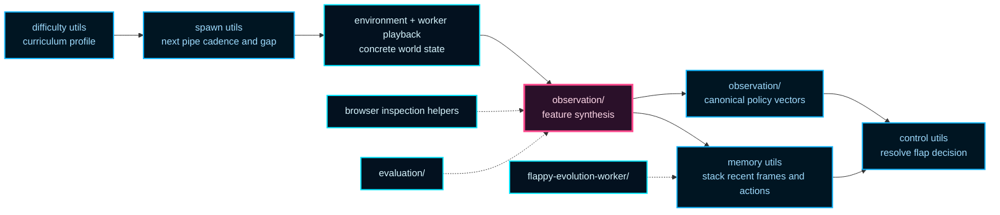

# simulation-shared

Shared simulation vocabulary reused across environment, evaluation, worker,
and browser-adjacent helpers.

This boundary exists so the example can share observation semantics and
deterministic spawn logic without letting every runtime invent its own near-
duplicate types. The payoff is consistency: when a policy sees a gap, or when
a helper estimates urgency, those meanings stay aligned across the whole
example.

This is the common language layer for the control problem. It does not own
full simulation stepping, scoring, or rendering. It owns the smaller
contracts those larger boundaries must agree on: difficulty profiles, pipe
geometry, observation features, temporal memory, and action decoding.

That shared vocabulary is what keeps the demo honest across runtimes. The
environment can advance the world, the evaluation layer can score policies,
the worker can stream playback, and browser helpers can inspect decisions
without silently redefining what "next gap" or "urgent correction" means.

## What This Folder Is Trying To Teach

Read this chapter if you want to answer three practical questions:

1. Which geometric signals does the policy actually see?
2. How does the example add short-horizon memory without requiring recurrent
   networks?
3. How do difficulty, spawn, observation, and control helpers stay reusable
   across Node training and browser playback?

## Shared Vocabulary Map



The key teaching point is that the policy does not read pixels. It reads a
curated state representation: gap geometry, velocity, urgency, and a short
action-conditioned memory trail. That makes the control problem easier to
inspect and keeps training, evaluation, and playback aligned around the same
semantics.

## Choose Your Route

- Start with `simulation-shared.types.ts` if you want the stable nouns of the
  subsystem.
- Read `simulation-shared.difficulty.utils.ts` and
  `simulation-shared.spawn.utils.ts` if you want the curriculum and course
  generation rules.
- Read [simulation-shared/observation/README.md](./observation/README.md) if
  you want the feature-engineering story in more detail.
- Read `simulation-shared.memory.utils.ts` if you want the frame-stacking and
  recent-action channels.
- Read `simulation-shared.control.utils.ts` if you want the final step from
  network outputs to `flap` versus `no flap`.

Example sketch:

```ts
const difficultyProfile = resolveAdaptiveDifficultyProfile(pipesPassed, 1);
const features = resolveObservationFeatures({
  birdYPx,
  velocityYPxPerFrame,
  pipes,
  visibleWorldWidthPx,
  difficultyProfile,
  activeSpawnIntervalFrames: difficultyProfile.pipeSpawnIntervalFrames,
});
const networkInput = resolveTemporalObservationVector(
  features,
  observationMemoryState,
);
const didFlap = resolveFlapDecision(network.activate(networkInput));
```

If you want background reading, Wikipedia contributors on feature
engineering, curriculum learning, and frame stacking are useful bridges, but
this folder is where those ideas become concrete contracts for the Flappy
Bird example.

## simulation-shared/simulation-shared.types.ts

### SharedDifficultyProfile

Shared runtime difficulty profile used by browser and environment simulators.

By projecting difficulty into one plain object, the example can keep
curriculum logic independent from rendering, evaluation, and worker runtime
concerns.

### SharedObservationFeatures

Structured observation features for network input.

Educational note:
These features make the policy input interpretable. The example does not feed
raw pixels into NEAT; it feeds geometric signals such as distance to the next
pipe, corridor clearance, and urgency of recovering to the gap center.

### SharedObservationInput

Input shape for observation-feature synthesis.

This object is the raw world snapshot from which normalized features are
derived. It intentionally separates world geometry from the later feature
projection step.

### SharedObservationMemoryState

Mutable temporal memory attached to one policy-controlled bird.

The memory stores recent core observation frames and recent action history,
allowing feedforward policies to consume short-term context without adding
recurrent connections.

If you want background reading, the Wikipedia article on "frame stacking"
captures the basic idea of giving a feed-forward policy a short motion trail
instead of full recurrent state.

### SharedPipeLike

Common pipe shape consumed by observation helpers.

This is the narrowest useful pipe contract for feature synthesis: horizontal
position plus the vertical gap geometry seen by the bird.

### SharedRngLike

Minimal deterministic random contract used by shared spawn helpers.

The shared layer keeps its RNG contract intentionally small so the same spawn
helpers can work with both Node-side and browser-side deterministic sources.

## simulation-shared/simulation-shared.constants.ts

Default curriculum scale used when callers do not provide one.

A value of `1` means full adaptive difficulty behavior is enabled.

### FLAPPY_SHARED_DEFAULT_DIFFICULTY_SCALE

Default curriculum scale used when callers do not provide one.

A value of `1` means full adaptive difficulty behavior is enabled.

### FLAPPY_SHARED_DEFAULT_NORMALIZATION_EPSILON

Small positive epsilon used to guard divisions in normalized timing features.

The epsilon avoids unstable divide-by-zero behavior when distances or speeds
collapse toward zero during normalization.

## simulation-shared/simulation-shared.math.utils.ts

Clamps a numeric value to the inclusive `[min, max]` interval.

### clamp

```ts
clamp(
  value: number,
  min: number,
  max: number,
): number
```

Internal clamp primitive.

Parameters:
- `value` - - Candidate value.
- `min` - - Inclusive lower bound.
- `max` - - Inclusive upper bound.

Returns: Clamped value.

### clamp01

```ts
clamp01(
  value: number,
): number
```

Clamps a numeric value to the inclusive `[0, 1]` interval.

Parameters:
- `value` - - Candidate value.

Returns: Value clamped between 0 and 1.

### clampValue

```ts
clampValue(
  value: number,
  min: number,
  max: number,
): number
```

Clamps a numeric value to the inclusive `[min, max]` interval.

Parameters:
- `value` - - Candidate value.
- `min` - - Inclusive lower bound.
- `max` - - Inclusive upper bound.

Returns: Clamped value.

### interpolateValue

```ts
interpolateValue(
  startValue: number,
  endValue: number,
  progress: number,
): number
```

Linear interpolation helper.

Parameters:
- `startValue` - - Start value at progress `0`.
- `endValue` - - End value at progress `1`.
- `progress` - - Normalized interpolation progress.

Returns: Interpolated value.

## simulation-shared/simulation-shared.difficulty.utils.ts

### resolveAdaptiveDifficultyProfile

```ts
resolveAdaptiveDifficultyProfile(
  pipesPassed: number,
  difficultyScale: number,
): SharedDifficultyProfile
```

Resolves adaptive difficulty profile from passed-pipe progress.

Educational note:
Difficulty is ramped as a smooth profile rather than as a sequence of hard
level jumps. That keeps the task readable for humans and less noisy for
evolution.

The idea is closely related to curriculum learning: easier versions of the
task dominate early, then the example interpolates toward the harder target
settings as progress increases.

Parameters:
- `pipesPassed` - - Number of passed pipes.
- `difficultyScale` - - Curriculum scale in `[0, 1]`.

Returns: Active difficulty profile.

## simulation-shared/simulation-shared.spawn.utils.ts

### resolveNextSpawnGapCenterY

```ts
resolveNextSpawnGapCenterY(
  previousGapCenterYPx: number,
  rng: SharedRngLike,
  maximumGapCenterYPx: number,
): number
```

Resolves next gap center with bounded per-pipe delta.

Educational note:
Consecutive gaps are deliberately constrained to avoid unfair zig-zag jumps.
The environment should still be challenging, but it should not demand an
impossible vertical correction from one pipe to the next.

Parameters:
- `previousGapCenterYPx` - - Previous spawn gap center.
- `rng` - - Deterministic RNG.
- `maximumGapCenterYPx` - - Optional inclusive upper bound for smaller viewports.

Returns: Next gap center y-position.

### resolveNextSpawnGapSize

```ts
resolveNextSpawnGapSize(
  previousSpawnGapPx: number | undefined,
  difficultyProfile: SharedDifficultyProfile,
  rng: SharedRngLike,
): number
```

Resolves next spawn gap size using progressive shrink and jitter.

The gap starts wider than the current hardest target, then shrinks toward the
active difficulty profile with a small amount of deterministic jitter so runs
do not feel mechanically repetitive.

Parameters:
- `previousSpawnGapPx` - - Previous spawn gap size.
- `difficultyProfile` - - Active difficulty profile.
- `rng` - - Deterministic RNG.

Returns: Next spawn gap size.

### resolveNextSpawnIntervalFrames

```ts
resolveNextSpawnIntervalFrames(
  previousSpawnIntervalFrames: number | undefined,
  difficultyProfile: SharedDifficultyProfile,
): number
```

Resolves next spawn interval using progressive shrink.

This mirrors the gap-size logic: early pipes are spaced more generously, then
spacing contracts toward the current difficulty target as the episode settles
into its harder rhythm.

Parameters:
- `previousSpawnIntervalFrames` - - Previous spawn interval.
- `difficultyProfile` - - Active difficulty profile.

Returns: Next spawn interval in frames.

### sampleGapCenterY

```ts
sampleGapCenterY(
  rng: SharedRngLike,
  maximumGapCenterYPx: number,
): number
```

Samples a random gap center y-position.

The sampled center is bounded so the resulting pipe gap always remains inside
the visible play area.

Parameters:
- `rng` - - Deterministic RNG.
- `maximumGapCenterYPx` - - Optional inclusive upper bound for smaller viewports.

Returns: Sampled y-position.

## simulation-shared/simulation-shared.observation.utils.ts

Shared observation compatibility façade.

The observation implementation now lives under `simulation-shared/observation/`
so feature synthesis and vector projection can evolve behind a focused module
boundary. This file stays as the stable import path for existing callers.

That split keeps the high-level import path simple while allowing the
observation subsystem to grow into its own documented folder.

### resolveCoreObservationVectorFromFeatures

```ts
resolveCoreObservationVectorFromFeatures(
  features: SharedObservationFeatures,
): number[]
```

Resolves the compact core vector used for temporal stacking.

The core intentionally keeps directly observed kinematic and geometric
channels while dropping derived one-step predictors that become redundant
once short-term temporal memory is available.

This is the representation used when the example wants a short history of raw
observation slices. The idea is similar to frame stacking in reinforcement
learning: a feed-forward policy can recover some sense of motion by looking
at several recent compact frames at once.

The Wikipedia article on "frame stacking" is a useful conceptual reference.

Parameters:
- `features` - - Structured observation features.

Returns: Core per-frame vector.

Example:

```ts
const coreFrame = resolveCoreObservationVectorFromFeatures(features);
observationMemoryState.previousCoreFrames.push(coreFrame);
```

### resolveObservationFeatures

```ts
resolveObservationFeatures(
  input: SharedObservationInput,
): SharedObservationFeatures
```

Builds the shared normalized observation feature set consumed by policies.

Educational note:
This helper stays focused on semantic feature assembly only. Projection into
the canonical network vectors now lives in the neighboring vector module so
observation policy and network-shape concerns can evolve independently.

The features deliberately mix three kinds of signal:
1. Current state, such as bird height and vertical velocity.
2. Near-term geometry, such as gap bounds and upcoming-pipe distances.
3. Simple forward-looking control hints, such as urgency and one-flap
   reachability.

This is a compact example of feature engineering for control. Instead of
asking NEAT to rediscover basic geometry from raw sensory input, the example
hands the network semantically meaningful signals and lets evolution focus on
policy search.

For broader context, the Wikipedia article on "feature engineering" is a
good companion reference.

Parameters:
- `input` - - Observation input bundle.

Returns: Structured observation features.

Example:

```ts
const features = resolveObservationFeatures({
  birdYPx: 120,
  velocityYPxPerFrame: 2,
  pipes,
  visibleWorldWidthPx: 640,
  difficultyProfile,
  activeSpawnIntervalFrames: 90,
});

if (features.normalizedEntryUrgency > 0.8) {
  // The bird is misaligned and running out of time to recover.
}
```

### resolveObservationVectorFromFeatures

```ts
resolveObservationVectorFromFeatures(
  features: SharedObservationFeatures,
): number[]
```

Converts observation features to the canonical 12-value network input vector.

Educational note:
This module owns the network-shape projection so feature semantics can change
independently from how the policy input is ordered.

The 12-value vector is the compact feed-forward policy input used by the main
evaluation and training flow. Its ordering is stable on purpose: once a
network topology has evolved against one input layout, silent channel
reshuffles would invalidate learned behavior.

Parameters:
- `features` - - Structured feature object.

Returns: Ordered feature vector.

Example:

```ts
const features = resolveObservationFeatures(input);
const networkInput = resolveObservationVectorFromFeatures(features);
```

### resolveUpcomingPipes

```ts
resolveUpcomingPipes(
  pipes: SharedPipeLike[],
  birdCenterXPx: number,
  birdRadiusPx: number,
  pipeWidthPx: number,
): [SharedPipeLike | undefined, SharedPipeLike | undefined]
```

Resolves the next two upcoming pipes in front of the bird.

The observation pipeline only cares about the immediate near future, because
Flappy Bird decisions are dominated by the next gap and the transition after
it. Looking further ahead adds noise faster than it adds useful control
signal.

Parameters:
- `pipes` - - Current pipe list.
- `birdCenterXPx` - - Bird center x-position.
- `birdRadiusPx` - - Bird radius.
- `pipeWidthPx` - - Pipe width.

Returns: Tuple of first and second upcoming pipes.

Example:

```ts
const [nextPipe, secondPipe] = resolveUpcomingPipes(pipes);
```

## simulation-shared/simulation-shared.control.utils.ts

Resolves flap/no-flap decision from network outputs.

Educational note:
The shared control layer accepts both two-output competitive policies
(`no flap` vs `flap`) and simpler single-output thresholded policies. That
flexibility makes the helper reusable across experiments without forcing every
caller to reshape its outputs first.

### resolveFlapDecision

```ts
resolveFlapDecision(
  rawOutputs: unknown,
  flapThreshold: number,
): boolean
```

Resolves flap/no-flap decision from network outputs.

Educational note:
The shared control layer accepts both two-output competitive policies
(`no flap` vs `flap`) and simpler single-output thresholded policies. That
flexibility makes the helper reusable across experiments without forcing every
caller to reshape its outputs first.

Parameters:
- `rawOutputs` - - Activation output payload.
- `flapThreshold` - - Scalar threshold for single-output policies.

Returns: True when flap should trigger.

## simulation-shared/simulation-shared.memory.utils.ts

### commitSharedObservationMemoryStep

```ts
commitSharedObservationMemoryStep(
  observationMemoryState: SharedObservationMemoryState,
  features: SharedObservationFeatures,
  didFlap: boolean,
): void
```

Commits one observation-action step into temporal memory.

The memory update happens after the decision is made so the next step can see
both the recent observation context and the action history that produced the
current trajectory.

Parameters:
- `observationMemoryState` - - Mutable temporal memory for the active bird.
- `features` - - Structured observation features used for the decision.
- `didFlap` - - Decision taken at this step.

Returns: Nothing.

### createSharedObservationMemoryState

```ts
createSharedObservationMemoryState(): SharedObservationMemoryState
```

Creates an empty temporal observation memory state.

Returns: Fresh mutable memory buffers for one bird/controller.

Example:

```ts
const memoryState = createSharedObservationMemoryState();
```

### resolvePreviousCoreFramesWithPadding

```ts
resolvePreviousCoreFramesWithPadding(
  observationMemoryState: SharedObservationMemoryState,
): number[][]
```

Resolves previous core frames (newest-first) with deterministic zero padding.

Zero padding keeps the policy input width stable during the first few frames
of an episode before enough history has accumulated.

Parameters:
- `observationMemoryState` - - Mutable temporal memory for the active bird.

Returns: Previous core frame list with fixed target length.

### resolveTemporalObservationVector

```ts
resolveTemporalObservationVector(
  features: SharedObservationFeatures,
  observationMemoryState: SharedObservationMemoryState,
): number[]
```

Builds the temporal policy input vector (stacked observation + action memory).

Educational note:
This helper turns an interpretable feature object into the exact flat vector a
feed-forward network consumes. That is why the output layout is documented so
explicitly: changing the order would change the meaning of every trained
weight in the policy.

Output layout:
1) current core observation frame
2) previous core frames (newest to oldest) with zero padding
3) last-action channel
4) recent flap-rate channel over a fixed window

Parameters:
- `features` - - Structured observation features for the current decision step.
- `observationMemoryState` - - Mutable temporal memory for the active bird.

Returns: Ordered temporal input vector for policy activation.

### resolveZeroCoreObservationFrame

```ts
resolveZeroCoreObservationFrame(): number[]
```

Builds a zero-valued core frame with canonical length.

Returns: Zero core frame.

## simulation-shared/simulation-shared.statistics.utils.ts

### compareNumbersAscending

```ts
compareNumbersAscending(
  leftValue: number,
  rightValue: number,
): number
```

Compares two numeric values in ascending order.

Parameters:
- `leftValue` - - Left numeric value.
- `rightValue` - - Right numeric value.

Returns: Comparator delta for `Array.prototype.toSorted`.

### computeMean

```ts
computeMean(
  values: readonly number[],
): number
```

Computes arithmetic mean for numeric samples.

Parameters:
- `values` - - Numeric samples.

Returns: Arithmetic mean.

### computePercentile

```ts
computePercentile(
  values: readonly number[],
  percentile: number,
): number
```

Computes percentile value via linear interpolation between nearest ranks.

Percentiles are useful in the trainer because they reveal whether strong
performance is broad across the population or concentrated in a single outlier.

Parameters:
- `values` - - Numeric samples.
- `percentile` - - Percentile in [0, 1].

Returns: Percentile value, or `Number.NaN` when `values` is empty.

### computePopulationStandardDeviation

```ts
computePopulationStandardDeviation(
  values: readonly number[],
  meanValue: number,
): number
```

Computes population standard deviation.

This uses population variance rather than sample variance because the trainer
is summarizing the whole evolved population for that generation, not estimating
a larger hidden distribution from a subsample.

Parameters:
- `values` - - Numeric samples.
- `meanValue` - - Precomputed mean.

Returns: Population standard deviation.

## simulation-shared/simulation-shared.errors.ts

Prefix used when formatting unexpected shared-simulation errors.

A stable prefix makes logs easier to scan when multiple Flappy subsystems are
emitting diagnostics.

### FLAPPY_SHARED_SIMULATION_ERROR_PREFIX

Prefix used when formatting unexpected shared-simulation errors.

A stable prefix makes logs easier to scan when multiple Flappy subsystems are
emitting diagnostics.

### formatSharedSimulationErrorMessage

```ts
formatSharedSimulationErrorMessage(
  error: unknown,
): string
```

Formats unknown shared-simulation errors for stable logs.

Shared utilities are used from several runtime contexts, so this helper keeps
the error surface human-readable even when the thrown value is not an
`Error` instance.

Parameters:
- `error` - - Unknown error value.

Returns: Readable error message.
