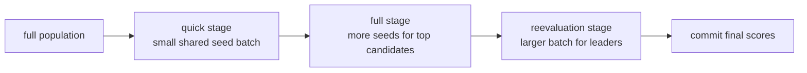

# trainer/evaluation

Staged population-evaluation service for the Flappy trainer.

This module owns the trainer's ranking funnel: everyone gets a cheap shared-
seed screen, fewer genomes advance to the costlier full pass, and the best
candidates are reevaluated on a broader seed set before scores are committed.

The point is not only speed. The point is to spend rollout budget where it
improves ranking confidence the most.

Stage funnel:


## trainer/evaluation/trainer.evaluation.service.types.ts

### PopulationAggregateScoringContext

Aggregate scoring context shared while computing frame-primary scores.

The context precomputes population-wide reference values so per-genome scoring
can stay simple and deterministic.

### PopulationStageEvaluationRequest

Candidate-stage request used by the staged population evaluator.

Keeping this internal contract narrow lets the orchestration service choose
a candidate budget without coupling the execution helpers to generation-plan
details.

This shape is intentionally stage-agnostic: quick, full, and reevaluation can
all use the same execution helper by changing only candidate count, seed set,
and rollout budget.

## trainer/evaluation/trainer.evaluation.service.ts

### commitPopulationScores

```ts
commitPopulationScores(
  population: readonly FlappyTrainerNetwork[],
  provisionalScoresByGenome: ReadonlyMap<FlappyTrainerNetwork, number>,
): void
```

Commits provisional scores to genome score fields.

Provisional scores are kept in a map during staging so each phase can refresh
them without mutating the genomes too early. This helper performs the final
write-back once staged evaluation is complete.

Parameters:
- `population` - - Current population.
- `provisionalScoresByGenome` - - Final provisional score map.

Returns: Nothing.

### evaluatePopulationFullStage

```ts
evaluatePopulationFullStage(
  population: readonly FlappyTrainerNetwork[],
  generationEvaluationPlan: FlappyGenerationEvaluationPlan,
  aggregateByGenome: Map<FlappyTrainerNetwork, FlappySeedBatchEvaluation>,
  provisionalScoresByGenome: Map<FlappyTrainerNetwork, number>,
  elitismCount: number,
): void
```

Executes the full evaluation stage over the top provisional candidates.

This is the middle-cost stage in the ranking ladder: not every genome
survives into it, but the survivors receive a more trustworthy estimate than
the quick screen alone can provide.

Parameters:
- `population` - - Current population.
- `generationEvaluationPlan` - - Per-generation staged evaluation plan.
- `aggregateByGenome` - - Mutable aggregate cache keyed by genome.
- `provisionalScoresByGenome` - - Mutable provisional score map.
- `elitismCount` - - Configured elitism count.

Returns: Nothing.

### evaluatePopulationQuickStage

```ts
evaluatePopulationQuickStage(
  population: readonly FlappyTrainerNetwork[],
  generationEvaluationPlan: FlappyGenerationEvaluationPlan,
  aggregateByGenome: Map<FlappyTrainerNetwork, FlappySeedBatchEvaluation>,
  provisionalScoresByGenome: Map<FlappyTrainerNetwork, number>,
): void
```

Executes the quick evaluation stage over the full population.

Educational note:
The quick stage is a cheap screening pass. Every genome is tested on the same
small shared seed batch so the trainer can discard obviously weak candidates
before spending more rollout budget on them.

Parameters:
- `population` - - Current population.
- `generationEvaluationPlan` - - Per-generation staged evaluation plan.
- `aggregateByGenome` - - Mutable aggregate cache keyed by genome.
- `provisionalScoresByGenome` - - Mutable provisional score map.

Returns: Nothing.

Example:

```ts
evaluatePopulationQuickStage(
  population,
  generationEvaluationPlan,
  aggregateByGenome,
  provisionalScoresByGenome,
);
```

### evaluatePopulationReevaluationStage

```ts
evaluatePopulationReevaluationStage(
  population: readonly FlappyTrainerNetwork[],
  generationEvaluationPlan: FlappyGenerationEvaluationPlan,
  aggregateByGenome: Map<FlappyTrainerNetwork, FlappySeedBatchEvaluation>,
  provisionalScoresByGenome: Map<FlappyTrainerNetwork, number>,
  elitismCount: number,
): void
```

Executes the large-seed reevaluation stage over top candidates.

Educational note:
Reevaluation is the trainer's anti-luck pass. The best provisional genomes
are tested again on a larger shared seed batch so leaderboard positions are
less sensitive to a fortunate early sample.

Parameters:
- `population` - - Current population.
- `generationEvaluationPlan` - - Per-generation staged evaluation plan.
- `aggregateByGenome` - - Mutable aggregate cache keyed by genome.
- `provisionalScoresByGenome` - - Mutable provisional score map.
- `elitismCount` - - Configured elitism count.

Returns: Nothing.

### resolveFullPassCandidateCount

```ts
resolveFullPassCandidateCount(
  populationSize: number,
  elitismCount: number,
): number
```

Resolves how many genomes should advance to the full-pass stage.

The trainer uses the larger of two budgets so the full stage stays large
enough to preserve competitive diversity while still shrinking meaningfully
relative to the full population.

Parameters:
- `populationSize` - - Population size.
- `elitismCount` - - Configured elitism count.

Returns: Full-pass candidate count.

## trainer/evaluation/trainer.evaluation.service.services.ts

### evaluatePopulationSelectedCandidateStage

```ts
evaluatePopulationSelectedCandidateStage(
  population: readonly FlappyTrainerNetwork[],
  populationStageEvaluationRequest: PopulationStageEvaluationRequest,
  aggregateByGenome: Map<FlappyTrainerNetwork, FlappySeedBatchEvaluation>,
  provisionalScoresByGenome: Map<FlappyTrainerNetwork, number>,
): void
```

Evaluates a selected candidate subset for a population stage.

Educational note:
This helper is the workhorse behind the full and reevaluation stages. It
turns a stage request into three steps: pick candidates, evaluate them across
shared seeds, then refresh the provisional ranking for the whole population.

Parameters:
- `population` - - Current population.
- `populationStageEvaluationRequest` - - Candidate-stage evaluation request.
- `aggregateByGenome` - - Mutable aggregate cache keyed by genome.
- `provisionalScoresByGenome` - - Mutable provisional score map.

Returns: Nothing.

### evaluateSpecificGenomesAcrossSeeds

```ts
evaluateSpecificGenomesAcrossSeeds(
  genomes: readonly FlappyTrainerNetwork[],
  sharedSeeds: readonly number[],
  rolloutOptions: FlappyRolloutOptions,
  aggregateByGenome: Map<FlappyTrainerNetwork, FlappySeedBatchEvaluation>,
): void
```

Evaluates a specific genome subset across shared seeds.

Shared seeds are the fairness mechanism in this trainer. Every selected genome
sees the same randomized episode batch for the stage, so comparisons are much
less noisy than per-genome private seed sampling.

For background reading, the Wikipedia article on "control variates" is a good
intuition pump for why holding part of the randomness fixed can reduce
variance when comparing alternatives.

Parameters:
- `genomes` - - Genomes selected for evaluation.
- `sharedSeeds` - - Shared deterministic seeds.
- `rolloutOptions` - - Rollout options for this stage.
- `aggregateByGenome` - - Mutable aggregate cache keyed by genome.

Returns: Nothing.

## trainer/evaluation/trainer.evaluation.service.constants.ts

Fallback score assigned to genomes that have not yet been evaluated.

Using negative infinity guarantees unevaluated genomes lose any ranking tie
against genomes that already have real aggregate results.

### FLAPPY_TRAINER_MIN_PIPE_PROGRESS

Minimum pipe-progress baseline used when no aggregates are available.

This keeps early-stage aggregate scoring well-defined even before any genome
has established meaningful pipe progress.

### FLAPPY_TRAINER_NEGATIVE_INFINITY_SCORE

Fallback score assigned to genomes that have not yet been evaluated.

Using negative infinity guarantees unevaluated genomes lose any ranking tie
against genomes that already have real aggregate results.

## trainer/evaluation/trainer.evaluation.service.utils.ts

### assignFramePrimaryScores

```ts
assignFramePrimaryScores(
  population: readonly FlappyTrainerNetwork[],
  aggregateByGenome: ReadonlyMap<FlappyTrainerNetwork, FlappySeedBatchEvaluation>,
  provisionalScoresByGenome: Map<FlappyTrainerNetwork, number>,
): void
```

Assigns refreshed frame-primary scores to the current population.

Educational note:
The trainer does not rank genomes purely by one raw metric. It combines pipe
progress, survival, and stability into a provisional score so early-stage
selection remains robust when several genomes are close in quality.

Parameters:
- `population` - - Current population.
- `aggregateByGenome` - - Aggregate cache keyed by genome.
- `provisionalScoresByGenome` - - Mutable provisional score map.

Returns: Nothing.

### collectAggregateValues

```ts
collectAggregateValues(
  population: readonly FlappyTrainerNetwork[],
  aggregateByGenome: ReadonlyMap<FlappyTrainerNetwork, FlappySeedBatchEvaluation>,
): FlappySeedBatchEvaluation[]
```

Collects all currently available aggregate values.

Only genomes with completed aggregate results are included. That lets the
scoring helpers distinguish between genuinely weak genomes and genomes that
simply have not yet reached a later stage.

Parameters:
- `population` - - Current population.
- `aggregateByGenome` - - Aggregate cache keyed by genome.

Returns: Collected aggregate values.

### resolveMaximumMeanPipesPassed

```ts
resolveMaximumMeanPipesPassed(
  aggregateValues: readonly FlappySeedBatchEvaluation[],
): number
```

Resolves the leading mean pipe-progress value across available aggregates.

Mean pipe progress acts as the leading indicator for the frame-primary score:
if a genome is far behind the current pipe leader, it falls back to a simpler
progress-first score.

Parameters:
- `aggregateValues` - - Aggregate values currently available.

Returns: Highest mean pipe-progress value.

### resolvePopulationAggregateScoringContext

```ts
resolvePopulationAggregateScoringContext(
  population: readonly FlappyTrainerNetwork[],
  aggregateByGenome: ReadonlyMap<FlappyTrainerNetwork, FlappySeedBatchEvaluation>,
): PopulationAggregateScoringContext
```

Resolves the aggregate scoring context used by frame-primary scoring.

This precomputation step keeps the per-genome scoring loop lean and avoids
recomputing population-wide maxima for every genome.

Parameters:
- `population` - - Current population.
- `aggregateByGenome` - - Aggregate cache keyed by genome.

Returns: Aggregate scoring context.

### scoreAggregateFramePrimary

```ts
scoreAggregateFramePrimary(
  aggregate: FlappySeedBatchEvaluation,
  maximumMeanPipesPassed: number,
): number
```

Scores one aggregate using the frame-primary heuristic.

Educational note:
The heuristic intentionally mixes progress and stability. A genome that passes
many pipes but has wildly inconsistent fitness across seeds is treated more
cautiously than a similarly strong but steadier genome.

Parameters:
- `aggregate` - - Aggregate evaluation result.
- `maximumMeanPipesPassed` - - Best mean pipe progress in the population.

Returns: Provisional score.
