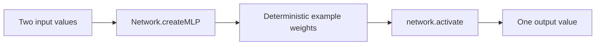

# Hello Network (NeatapticTS)

This folder is the smallest intended starting point in the examples learning path. It does one job: build one tiny multilayer perceptron through the public `Network` facade, run one inference pass, and show the shape of the result without pulling in evolution, browser hosting, workers, or training loops.

The point is not to impress you with a hard task. The point is to make the first contact with the library feel concrete in under a minute.



## What This Example Teaches

- how to build one small feed-forward network with `Network.createMLP(...)`,
- how to run the public `activate(...)` inference surface,
- how to inspect the resulting architecture through explicit input, hidden, and output counts.

This folder intentionally pins a deterministic weight and bias layout after construction so every run tells the same story. Later examples can reintroduce random initialization, evolution, and recurrent state once the basic activation path is familiar.

## Run The Example

From the repo root:

```bash
npm run example:hello-network
```

That command runs `examples/helloNetwork/run.ts` through `tsx`. The tested walkthrough logic still lives in `index.ts`; `run.ts` is only the tiny console wrapper that prints the same deterministic summary from the repo-local TypeScript source.

Expected output shape:

- architecture: `2 -> [3] -> 1`
- topology intent: `feed-forward`
- output value: one deterministic scalar near `0.58307`

## Minimal Public API Shape

```ts
import { Network } from '@reicek/neataptic-ts';

const network = Network.createMLP(2, [3], 1);
const outputValues = network.activate([0.25, 0.75]);

console.log(outputValues[0]);
```

The in-repo example adds one small deterministic parameter pass after construction so the walkthrough stays reproducible. That keeps the first example readable while still using the same public network surface that larger examples use later.