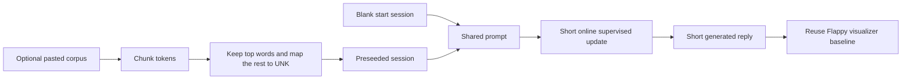

# NEATchat

This folder defines a deliberately small chatbot example built around the repo's recurrent sequence builders. The goal is not web-scale text generation. The goal is to show how a builder-created recurrent network can accept short token streams, carry state through one reply, learn from short supervised corrections, and stay inspectable through the same visualizer baseline used by Flappy Bird.

## Scale boundary

NEATchat is a toy sequence-learning demo, not a transformer-scale language
model, assistant framework, or broad semantic reasoner.

"Any language" in this example means any token stream the small tokenizer can
encode. It does not mean broad factual mastery, long-context reasoning, or
world-knowledge coverage.

The practical vocabulary tradeoff is explicit: larger `topWordLimit` usually
improves lexical coverage, but it also increases runtime and memory pressure
during retained-vocabulary preparation and training.

## Live runtime vs preview scaffolding

The published flagship page intentionally separates what is live runtime from
what is contract-preview scaffolding:

- live runtime: tokenization, optional bounded pretraining preview, live
  exchange updates, session export/import, on-page A/B metric reporting, and
  the browser-visible corpus preview report,
- contract-preview scaffolding: staged delivery framing and explanatory copy
  that describes the boundary and upcoming slices, plus the documented
  visualizer handoff that is not yet embedded as an inline panel on this page.

This split is intentional so users can inspect real behavior without being led
to expect web-scale model capability.



## What this example teaches

- how a tiny LSTM-first sequence builder can serve as the seed network for a chat-shaped demo without overstating scale,
- how optional copy-paste pretraining can stay bounded through chunked ingestion, a top-word cap, and a stable UNK path,
- how blank-start and preseeded behavior can be compared in one session through a simple A or B loop,
- how the network-inspection surface should reuse the Flappy Bird host and network-view boundary before NEATchat-specific rendering is introduced.

## Run the contract preview

From the repo root:

```bash
npx tsx examples/neatChat/run.ts
```

The current Node runner prints the public contract in plain language so you can verify the input format, reset policy, expected output, pretraining defaults, browser publication seam, and visualizer reuse seam before the heavier interactive layers are added.

For a published browser view of the same boundary, open [index.html](./index.html). After `npm run docs`, the example is also available from the flagship section of `docs/examples/index.html` so users can inspect the visible chat shell and staged progress without depending on Node.

## Minimal public API shape

```ts
import {
  createNeatChatExampleContract,
  createNeatChatSeedNetwork,
} from './index';

const exampleContract = createNeatChatExampleContract();
const seedNetwork = createNeatChatSeedNetwork({ vocabularySize: 64 });

console.log(exampleContract.defaultArchitectureFamily); // lstm
console.log(seedNetwork.summary.effectiveVocabularySize); // 68
```

## Input format

Each teaching example is encoded as one short token stream:

- `BOS`
- user tokens
- `TURN_BREAK`
- assistant tokens
- `EOS`

Terms outside the retained top-frequency vocabulary map to `UNK`. That keeps blank-start and preseeded runs on the same discrete token surface, which matters for fair A or B comparisons and for later browser metrics.

## Reset behavior

The example treats blank-start and preseeded variants as separate fresh sessions for the same prompt. Before replaying a prompt for a comparison pass, the recurrent network should reset with `clear()`. State only carries forward inside one response-generation window or one short online update window. This keeps the comparison honest: differences should come from vocabulary seeding and supervised updates, not from stale recurrent carryover leaking between variants.

## Expected output

Blank-start responses should begin terse, unstable, and heavy on fallback behavior because the model has almost no lexical prior. Preseeded responses should reuse retained vocabulary sooner, reduce early `UNK` churn, and score better on lightweight checks such as held-out next-token accuracy, repetition rate, and response-length stability. The point is not polished conversation quality. The point is to make the learning delta visible.

The browser-hosted Step 1 page is intentionally explicit that it renders a truthful contract preview rather than pretending the later online-learning loop already exists. That keeps the published demo useful during development while preserving honest expectations.

## Optional pretraining contract

The first public contract keeps pretraining bounded and inspectable:

- default `topWordLimit`: `3000`
- recommended experiment range: `300-5000`
- default ingestion chunk size: `256` tokens
- stable unknown-token path: `UNK`
- required corpus report fields: character count, total tokens, unique terms, retained terms, and retained-token coverage percent

Those fields make it obvious when a pasted corpus is too noisy, too small, or too aggressively capped to teach anything useful.

## Visualizer baseline

The first NEATchat visualization surface should reuse the existing Flappy Bird network-inspection boundary instead of inventing a second renderer:

- host owner: [../flappy_bird/browser-entry/host/host.ts](../flappy_bird/browser-entry/host/host.ts)
- frame resolver: [../flappy_bird/browser-entry/network-view/network-view.ts](../flappy_bird/browser-entry/network-view/network-view.ts)
- draw layer: [../flappy_bird/browser-entry/visualization/visualization.draw.service.ts](../flappy_bird/browser-entry/visualization/visualization.draw.service.ts)

That reuse rule keeps hover state, redraw ownership, and topology layout semantics consistent across demos while the chat loop is still being shaped.

The current flagship page does not yet embed that network inspector inline. For now the visualizer seam is a documented contract and source-level reuse boundary, while the live browser page focuses on the chat loop, corpus preview, snapshots, and A/B evaluation.

## References

- Recurrent neural network, Wikipedia: https://en.wikipedia.org/wiki/Recurrent_neural_network
- Long short-term memory, Wikipedia: https://en.wikipedia.org/wiki/Long_short-term_memory
- Sepp Hochreiter and Jürgen Schmidhuber, Long Short-Term Memory: https://www.bioinf.jku.at/publications/older/2604.pdf