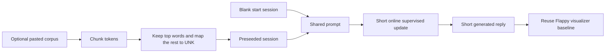
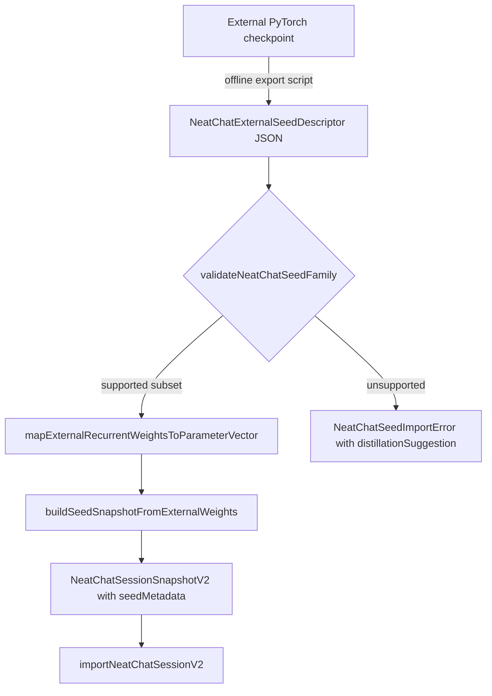
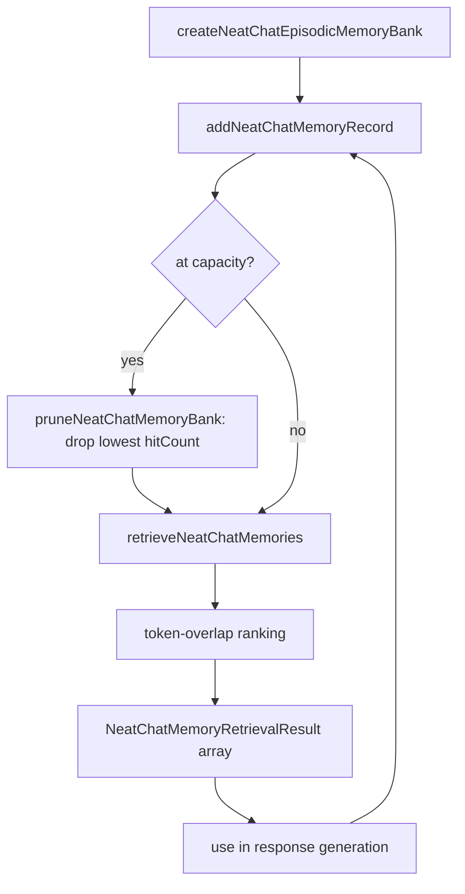
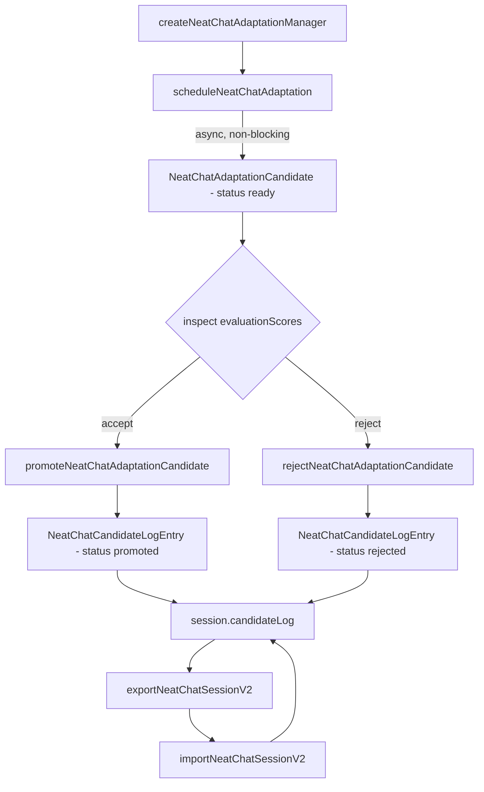
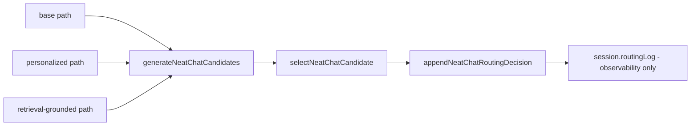
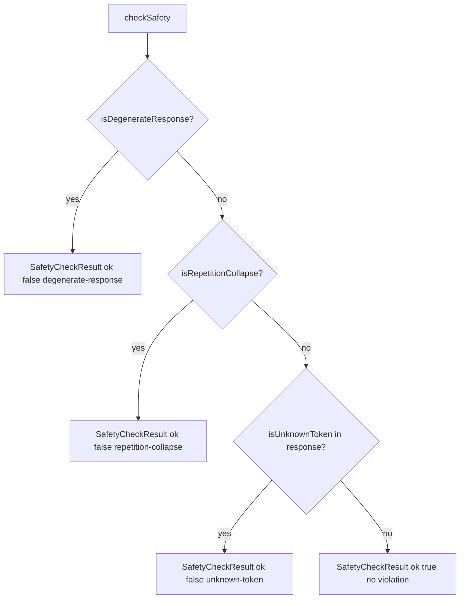

# NEATchat

This folder defines a deliberately small chatbot example built around the repo's recurrent sequence builders. The goal is not web-scale text generation. The goal is to show how a builder-created recurrent network can accept short token streams, carry state through one reply, learn from short supervised corrections, and stay inspectable through the same visualizer baseline used by Flappy Bird.

## Scale boundary

NEATchat is a toy sequence-learning demo, not a transformer-scale language
model, assistant framework, or broad semantic reasoner.

"Any language" in this example means any token stream the small tokenizer can
encode. It does not mean broad factual mastery, long-context reasoning, or
world-knowledge coverage.

The practical vocabulary tradeoff is explicit: larger `topWordLimit` usually
improves lexical coverage, but it also increases runtime and memory pressure
during retained-vocabulary preparation and training.

## Live runtime vs preview scaffolding

The published flagship page intentionally separates what is live runtime from
what is contract-preview scaffolding:

- live runtime: tokenization, optional bounded pretraining preview, live
  exchange updates with safety-screened candidate selection and a bounded
  vocab-filtered fallback floor, session export/import, on-page A/B metric
  reporting, and the browser-visible corpus preview report,
- contract-preview scaffolding: staged delivery framing and explanatory copy
  that describes the boundary and upcoming slices, plus the documented
  visualizer handoff that is not yet embedded as an inline panel on this page.

This split is intentional so users can inspect real behavior without being led
to expect web-scale model capability.



## What this example teaches

- how a tiny LSTM-first sequence builder can serve as the seed network for a chat-shaped demo without overstating scale,
- how optional copy-paste pretraining can stay bounded through chunked ingestion, a top-word cap, and a stable UNK path,
- how blank-start and preseeded behavior can be compared in one session through a simple A or B loop,
- how the network-inspection surface should reuse the Flappy Bird host and network-view boundary before NEATchat-specific rendering is introduced.

## Run the contract preview

From the repo root:

```bash
npx tsx examples/neatChat/run.ts
```

The current Node runner prints the public contract in plain language so you can verify the input format, reset policy, expected output, pretraining defaults, browser publication seam, and visualizer reuse seam before the heavier interactive layers are added.

For a published browser view of the same boundary, open [index.html](./index.html). After `npm run docs`, the example is also available from the flagship section of `docs/examples/index.html` so users can inspect the visible chat shell and staged progress without depending on Node.

## Minimal public API shape

```ts
import {
  createNeatChatExampleContract,
  createNeatChatSeedNetwork,
} from './index';

const exampleContract = createNeatChatExampleContract();
const seedNetwork = createNeatChatSeedNetwork({ vocabularySize: 64 });

console.log(exampleContract.defaultArchitectureFamily); // lstm
console.log(seedNetwork.summary.effectiveVocabularySize); // 68
```

## Input format

Each teaching example is encoded as one short token stream:

- `BOS`
- user tokens
- `TURN_BREAK`
- assistant tokens
- `EOS`

Terms outside the retained top-frequency vocabulary map to `UNK`. That keeps blank-start and preseeded runs on the same discrete token surface, which matters for fair A or B comparisons and for later browser metrics.

## Reset behavior

The example treats blank-start and preseeded variants as separate fresh sessions for the same prompt. Before replaying a prompt for a comparison pass, the recurrent network should reset with `clear()`. State only carries forward inside one response-generation window or one short online update window. This keeps the comparison honest: differences should come from vocabulary seeding and supervised updates, not from stale recurrent carryover leaking between variants.

## Expected output

Blank-start responses should begin terse, unstable, and heavy on fallback behavior because the model has almost no lexical prior. Preseeded responses should reuse retained vocabulary sooner, reduce early `UNK` churn, and score better on lightweight checks such as held-out next-token accuracy, repetition rate, and response-length stability. The point is not polished conversation quality. The point is to make the learning delta visible.

The browser-hosted Step 1 page is intentionally explicit that it renders a truthful contract preview rather than pretending the later online-learning loop already exists. That keeps the published demo useful during development while preserving honest expectations.

## Optional pretraining contract

The first public contract keeps pretraining bounded and inspectable:

- default `topWordLimit`: `3000`
- recommended experiment range: `300-5000`
- default ingestion chunk size: `256` tokens
- stable unknown-token path: `UNK`
- required corpus report fields: character count, total tokens, unique terms, retained terms, and retained-token coverage percent

Those fields make it obvious when a pasted corpus is too noisy, too small, or too aggressively capped to teach anything useful.

## Visualizer baseline

The first NEATchat visualization surface should reuse the existing Flappy Bird network-inspection boundary instead of inventing a second renderer:

- host owner: [../flappy_bird/browser-entry/host/host.ts](../flappy_bird/browser-entry/host/host.ts)
- frame resolver: [../flappy_bird/browser-entry/network-view/network-view.ts](../flappy_bird/browser-entry/network-view/network-view.ts)
- draw layer: [../flappy_bird/browser-entry/visualization/visualization.draw.service.ts](../flappy_bird/browser-entry/visualization/visualization.draw.service.ts)

That reuse rule keeps hover state, redraw ownership, and topology layout semantics consistent across demos while the chat loop is still being shaped.

The current flagship page does not yet embed that network inspector inline. For now the visualizer seam is a documented contract and source-level reuse boundary, while the live browser page focuses on the chat loop, corpus preview, snapshots, and A/B evaluation.

## References

- Recurrent neural network, Wikipedia: https://en.wikipedia.org/wiki/Recurrent_neural_network
- Long short-term memory, Wikipedia: https://en.wikipedia.org/wiki/Long_short-term_memory
- Sepp Hochreiter and Jürgen Schmidhuber, Long Short-Term Memory: https://www.bioinf.jku.at/publications/older/2604.pdf
- Gated recurrent unit, Wikipedia: https://en.wikipedia.org/wiki/Gated_recurrent_unit
- Kyunghyun Cho, Bart van Merrienboer, Caglar Gulcehre, Dzmitry Bahdanau, Fethi Bougares, Holger Schwenk, and Yoshua Bengio, Learning Phrase Representations using RNN Encoder-Decoder for Statistical Machine Translation (2014): https://arxiv.org/abs/1406.1078

## External seed import

NEATchat supports offline import of compatible recurrent checkpoints through a non-ONNX
parameter-vector conversion bridge. The supported subset is deliberately narrow: single-layer
GRU or LSTM models with one-hot input and output, bounded vocabulary, and weights exported in
PyTorch gate-row order. Bidirectional, multi-layer, attention, embedding-only, and
layer-normalization models fall outside the supported subset.

The conversion flow runs entirely offline and does not require a live Python runtime at
evaluation time:



### Supported direct-import subset

| Constraint | Supported range |
|---|---|
| `family` | `'gru'` or `'lstm'` only |
| `vocabSize` | 300–3000 |
| `hiddenSize` | 8–128 |
| `layers` | exactly one layer |
| IO shape | unembedded one-hot (input dim == output dim == vocabSize) |
| Activations | sigmoid and tanh only |
| Excluded | bidirectional, multi-layer, attention, embedding, positional encoding, layer norm |

### Known approximations

Importing from a PyTorch checkpoint is an approximation, not a lossless round-trip.
The following structural differences are documented and expected:

**GRU**: the `h_t` output node uses sigmoid rather than the standard passthrough blend
`(1 - z_t) * n_t + z_t * h_{t-1}`. The `previousOutput → output` gated paths carry
learnable weights rather than fixed unit weights. These are NeatapticTS topology choices;
they do not affect the update-gate or reset-gate weight mapping.

**LSTM**: NeatapticTS LSTM does not wire `outputBlock` back to gate groups.
There is no `weight_hh` equivalent; only `weight_ih` and combined gate biases
(`biasIh + biasHh`) are directly mappable. Peephole connections are present in the
native topology but absent from standard PyTorch LSTM; they are set to zero.

### Minimal API example

```ts
import {
  validateNeatChatSeedFamily,
  buildSeedSnapshotFromExternalWeights,
  importNeatChatSessionV2,
  NeatChatSeedImportError,
} from './index';

// Step 1: validate before conversion.
validateNeatChatSeedFamily(descriptor);

// Step 2: convert the external checkpoint into a native v2 snapshot.
const snapshot = buildSeedSnapshotFromExternalWeights(descriptor);
console.log(snapshot.extensions.neatchat.seedMetadata?.conversionSource);
// 'external-parameter-vector'

// Step 3: load the snapshot as a live NEATchat session.
const session = importNeatChatSessionV2(snapshot);
```

When dimensions or operators are incompatible, `buildSeedSnapshotFromExternalWeights` throws
a `NeatChatSeedImportError` with `code: 'UNSUPPORTED_OPERATOR'` and a
`distillationSuggestion` directing callers to train a native builder network on a
representative corpus instead.

## Memory bank

The episodic memory bank is a bounded, key-value store of user-specific facts that
persists across exchanges within one session. Unlike the recurrent hidden state — which
carries short-term context implicitly through the network — episodic records are
explicitly keyed, retrievable by prompt-token overlap, and survive session export and
re-import. This makes the bank a form of lightweight retrieval-augmented generation:
the system can surface a relevant past fact and condition the reply on it without
re-training.



### Usage example

```ts
import {
  createNeatChatSession,
  createNeatChatEpisodicMemoryBank,
  addNeatChatMemoryRecord,
  retrieveNeatChatMemories,
  exportNeatChatSessionV2,
  importNeatChatSessionV2,
} from './index';

// Step 1: create a session — it includes an empty episodic memory bank.
let session = createNeatChatSession({
  corpusRetainedTerms: ['user', 'name', 'Alice'],
});

// Step 2: store a user-specific fact in the memory bank.
session = {
  ...session,
  memoryBank: addNeatChatMemoryRecord(session.memoryBank, {
    key: 'user name',
    value: 'Alice',
  }),
};

// Step 3: retrieve relevant memories before generating a reply.
const memories = retrieveNeatChatMemories(session, 'what is the user name', {
  maxResults: 3,
});
console.log(memories[0]?.record.value); // 'Alice'

// Step 4: checkpoint round-trip — the memory bank is included in v2 snapshots.
const snapshot = exportNeatChatSessionV2(session);
const restored = importNeatChatSessionV2(snapshot);
console.log(restored.memoryBank.records.length); // 1
```

### Memory tier boundaries

NEATchat separates memory into three tiers with distinct persistence and retrieval semantics:

- **Short-term memory** — the recurrent hidden state carried implicitly by the network
  weights during one exchange window. Already present in all sessions.
- **Episodic memory** — this explicit memory bank. User-specific facts keyed by short
  labels, retrieved by prompt-token overlap, and checkpointed with the session snapshot.
- **Semantic memory** — compact summaries distilled from long interaction histories.
  Deferred to a future workstream.

## Background adaptation (experimental)

> **Status: experimental — main-thread only.** `scheduleNeatChatAdaptation`
> defers fine-tuning to the microtask queue via `queueMicrotask`. No real
> worker-thread backend is present yet. The contract is forward-compatible with
> a worker backend but runs on the visible thread in its current form. Explicit
> promotion or rejection is always required — the base network is never silently
> mutated.

The adaptation layer decouples visible chat from slow update loops. A detached
fine-tune pass runs asynchronously against a frozen snapshot of the session
network, producing a `NeatChatAdaptationCandidate` with lightweight evaluation
scores. The caller inspects those scores and explicitly decides to promote or
reject the candidate — the base network is never silently mutated.



Key invariants:

- **Frozen base model**: `scheduleNeatChatAdaptation` reads from `session.network`
  but never mutates it. The live network stays frozen while the adaptation job runs.
- **Explicit promotion only**: no candidate is automatically accepted. Callers must
  inspect `evaluationScores` and call `promoteNeatChatAdaptationCandidate` explicitly.
- **Promotion clones the network**: `promoteNeatChatAdaptationCandidate` returns a new
  session with a cloned network initialized from the candidate's trained weights.
  The original network is unaffected.
- **Durable log**: `session.candidateLog` records every `'promoted'` and `'rejected'`
  event with a timestamp, evaluation scores, and the exchange count. The log survives
  `exportNeatChatSessionV2` / `importNeatChatSessionV2` round-trips.

### Full adaptation lifecycle example

```ts
import {
  createNeatChatSession,
  createNeatChatAdaptationManager,
  scheduleNeatChatAdaptation,
  promoteNeatChatAdaptationCandidate,
  rejectNeatChatAdaptationCandidate,
  exportNeatChatSessionV2,
  importNeatChatSessionV2,
} from './index';

// Step 1: create a session and an adaptation manager.
let session = createNeatChatSession({ corpusRetainedTerms: ['hello', 'world'] });
let manager = createNeatChatAdaptationManager(session);

// Step 2: schedule one non-blocking adaptation pass.
manager = await scheduleNeatChatAdaptation(manager, session, {
  learningRate: 0.05,
  maxExchanges: 10,
});

// Step 3: inspect the pending candidate before deciding.
const candidate = manager.pendingCandidates[0];
console.log(candidate.evaluationScores);
// e.g. { heldOutAccuracy: 0.71, repetitionRate: 0.03 }

// Step 4a: promote if scores are satisfactory.
const promoted = promoteNeatChatAdaptationCandidate(manager, session, 0);
session = promoted.session;
manager = promoted.manager;
console.log(session.candidateLog.at(-1)?.status); // 'promoted'

// — or —

// Step 4b: reject if scores fall short.
manager = rejectNeatChatAdaptationCandidate(manager, 0);
console.log(manager.candidateLog.at(-1)?.status); // 'rejected'

// Step 5: export — session.candidateLog is included in v2 snapshots.
const snapshot = exportNeatChatSessionV2(session);
const restored = importNeatChatSessionV2(snapshot);
console.log(restored.candidateLog.length); // preserved across round-trip
```

## Hybrid routing (experimental — observability only)

> **Status: experimental — observability only.** Routing compares candidates
> from multiple paths but does not promote weights. The routing log is a
> read-only record for inspection and regression attribution; it is never used
> as a training signal.

When a session has a pending adaptation candidate and retrieved memories,
`generateNeatChatCandidates` produces up to three candidates — one per routing
path — before `selectNeatChatCandidate` picks the highest-scoring reply.
`appendNeatChatRoutingDecision` records the outcome in `session.routingLog`
for later inspection and failure attribution.



Routing paths:

| Path | Source | Condition |
|---|---|---|
| `base` | live session network | always present |
| `personalized` | newest pending adaptation candidate | when `pendingCandidates` is non-empty |
| `retrieval-grounded` | live network, prompt grounded on recalled memory | when retrieved memories are available |

### Failure attribution

`attributeToFailureBucket` in the evaluation harness reads `session.routingLog`
to classify a scored regression as `'routing'` when the winning path differed
from the base path. This is the primary mechanism for distinguishing
routing-layer regressions from base-seed or retrieval regressions.

## Evaluation harness

> **Status: stable (W6 addition).** Regression metrics, failure-bucket
> attribution, and score helpers are covered at 100% and run as part of the
> owner-local test suite.

`runNeatChatRegressionSuite` evaluates a held-out corpus slice through the
session and returns a `RegressionSuiteResult` with per-metric means and a
bucket breakdown. Each entry is scored across five metrics and attributed to
one `FailureBucket` when a regression is found.

### Baseline scores (shipped default seed)

| Metric | Baseline score |
|---|---|
| `heldOutNextTokenAccuracy` | 12.29 |
| `repetitionRate` | 0 (no repeated bigrams) |
| `responseLengthStability` | 1 (length matches expected) |

These are the regression gate values used to validate any promoted seed or
adaptation candidate against the known baseline.

### Metrics

| `EvaluationMetric` | Direction | Description |
|---|---|---|
| `next-token-accuracy` | higher is better | Per-position token match against held-out expected output |
| `factual-consistency` | higher is better | Token-overlap score against memory-bank fact records |
| `repetition-rate` | lower is better | Fraction of repeated bigrams in the response |
| `response-length-stability` | higher is better | Proximity of actual token count to expected count |
| `unknown-handling` | higher is better | Whether OOV tokens are handled gracefully without runtime errors |

### Failure buckets

| `FailureBucket` | Description |
|---|---|
| `base-seed` | Regression likely tied to pretrained seed weights |
| `retrieval` | Regression correlated with episodic memory retrieval |
| `routing` | Regression tied to multi-path routing selection |
| `memory-compression` | Regression after memory-bank pruning dropped needed records |
| `background-adaptation` | Regression observed after a promoted candidate changed weights |
| `unattributed` | Harness could not narrow to a single subsystem |

### Minimal API example

```ts
import {
  runNeatChatRegressionSuite,
  scoreNextTokenAccuracy,
} from './index';

const result = runNeatChatRegressionSuite(session, {
  heldOutCorpus: [{ input: 'hello', expected: 'world' }],
});
console.log(result.perMetricMeans['next-token-accuracy']); // e.g. 0.12
console.log(result.totalRegressions); // count of below-baseline entries
```

## Safety gate

> **Status: stable (W6 addition).** `checkSafety` is covered at 100% and
> all current baseline outputs pass `ok: true`.

`checkSafety` classifies three failure modes in priority order:

1. **Degenerate response** — zero or one non-whitespace tokens. Checked first.
2. **Repetition collapse** — more than 50% of bigrams in the response are
   repeated. Checked second.
3. **Unknown token** — the response contains a token absent from the session
   vocabulary. Checked last.

When none of the above apply, `checkSafety` returns `{ ok: true, violation: null }`.



### Minimal API example

```ts
import { checkSafety } from './index';

const result = checkSafety(session, 'hello world');
console.log(result.ok);        // true for normal responses
console.log(result.violation); // null when no violation is detected
```

## Scale limitations

| Limitation | Detail |
|---|---|
| One-hot vocabulary | Tokens are discrete one-hot vectors, not learned embeddings |
| Context window cap | Each exchange sees a short fixed-length token window; long histories are truncated |
| No transformer parity | LSTM/GRU/NARX builder only; no self-attention, positional encoding, or multi-head behavior |
| Seed-import eligibility | Only single-layer GRU or LSTM with one-hot IO, vocab 300-3000, sigmoid/tanh activations |
| No automatic weight promotion | Background adaptation candidates require explicit `promoteNeatChatAdaptationCandidate` |
| No worker-thread backend | Background adaptation runs on the main thread via `queueMicrotask` |
