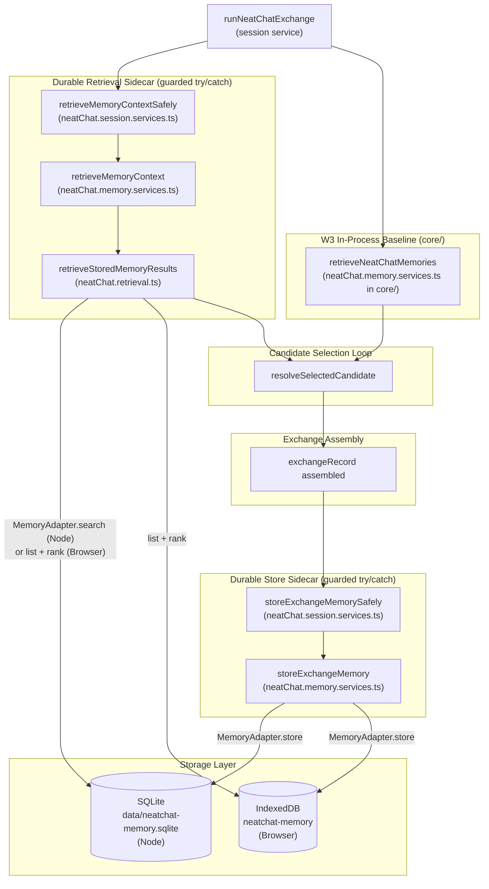

# NeatChat Durable Memory

Durable, queryable local memory storage for the NeatChat demo. Persists conversation
history across sessions using SQLite (Node) or IndexedDB (browser) and retrieves relevant
context with a local BM25 + token-overlap ranking engine.

---

## Memory model overview

NeatChat uses two cooperating memory tiers. This module adds the **durable tier only**;
the session tier is already delivered and frozen under `examples/neatChat/core/`.

| Tier             | Storage                                    | Scope                    | Retention                      |
| ---------------- | ------------------------------------------ | ------------------------ | ------------------------------ |
| **Session**      | In-process (W3 baseline in `core/`)        | Current session only     | Cleared on session reset       |
| **Durable**      | SQLite (Node) / IndexedDB (browser)        | Persists across sessions | Pruned by LRU cap (1 000 max)  |

The two tiers cooperate during a live exchange:

1. **Before candidate selection** — the durable retrieval sidecar ranks stored context for
   the current query and supplies it alongside the W3 in-process recall results.
2. **After exchange assembly** — the completed exchange is written to durable storage so
   future sessions can benefit from it.

Both sidecar calls are wrapped in a guarded `try/catch`. If the durable store is
unavailable, the exchange continues using only the W3 in-process path.

---

## How this differs from the W3 in-process baseline (`core/`)

The W3 baseline (`examples/neatChat/core/neatChat.memory.services.ts`) is an **in-process
episodic memory bank** backed by a plain JavaScript `Map`. Its contents live only for the
duration of a single session run.

This module (`examples/neatChat/memory/`) adds a **durable tier** that survives process
restarts and browser page reloads. It also replaces token-overlap-only ranking with a
proper BM25 retrieval engine (SQLite FTS5 in Node; a local in-memory scorer in the
browser). The two systems share no code paths and have no symbol-name overlap; both may
run simultaneously.

---

## How this differs from the Repo Cortex

The [Repo Cortex](../../data/semantic-index.sqlite) indexes **NeatapticTS library
documentation, skills, agents, and plans** for developer AI tooling. Its data and query
surface are entirely separate.

This module indexes **NeatChat's own conversation history** for conversational quality
improvement. The two systems share no database files:

| System          | Database file                     | Purpose                          |
| --------------- | --------------------------------- | -------------------------------- |
| Repo Cortex     | `data/semantic-index.sqlite`      | Developer tooling (library docs) |
| NeatChat memory | `data/neatchat-memory.sqlite`     | Conversation history (demo)      |

NeatChat memory must be **self-contained**: it must run in both Node and browser without
the Repo Cortex being present or having been indexed.

---

## Data-flow diagram



---

## Module files

| File                              | Role                                                                    |
| --------------------------------- | ----------------------------------------------------------------------- |
| `neatChat.memory.types.ts`        | `StoredMemoryEntry`, `MemoryQuery`, `MemoryResult`, `MemoryAdapter`     |
| `neatChat.memory.constants.ts`    | `MAX_DURABLE_ENTRIES`, BM25 params, `DEFAULT_DB_PATH`, IDB names        |
| `neatChat.memory.fts.ts`          | `sanitizeFtsQuery` — local FTS5 sanitizer (no Repo Cortex dependency)   |
| `neatChat.memory.db.ts`           | `SqliteMemoryAdapter` — Node SQLite + FTS5 adapter                      |
| `neatChat.memory.idb.ts`          | `IdbMemoryAdapter` — browser raw IndexedDB adapter                      |
| `neatChat.retrieval.ts`           | `retrieveStoredMemoryResults`, `rankMemoryEntries` — BM25 ranking       |
| `neatChat.memory.services.ts`     | `storeExchangeMemory`, `retrieveMemoryContext`, `pruneMemory`, `exportMemory` |

---

## SQLite schema (Node runtime)

The Node adapter creates the schema on first open, so no migration step is required.

```sql
-- One row per stored conversation fact or exchange summary
CREATE TABLE IF NOT EXISTS memory_entries (
  entry_id    INTEGER PRIMARY KEY,
  session_id  TEXT NOT NULL,
  entry_type  TEXT NOT NULL,    -- 'exchange' | 'association' | 'correction'
  content     TEXT NOT NULL,    -- stored text or JSON payload
  tokens      TEXT,             -- space-separated normalized token list
  score       REAL DEFAULT 1.0, -- reinforcement weight (higher = more relevant)
  created_at  INTEGER NOT NULL, -- unix ms
  last_used   INTEGER NOT NULL  -- unix ms — LRU pruning key
);

-- FTS5 virtual table backed by memory_entries (content table pattern)
CREATE VIRTUAL TABLE IF NOT EXISTS memory_fts USING fts5(
  content,
  tokens,
  content='memory_entries',
  content_rowid='entry_id',
  tokenize='porter unicode61'
);

-- Three sync triggers keep memory_fts aligned with memory_entries
CREATE TRIGGER IF NOT EXISTS memory_fts_ai AFTER INSERT ON memory_entries BEGIN
  INSERT INTO memory_fts(rowid, content, tokens) VALUES (new.entry_id, new.content, new.tokens);
END;

CREATE TRIGGER IF NOT EXISTS memory_fts_ad AFTER DELETE ON memory_entries BEGIN
  INSERT INTO memory_fts(memory_fts, rowid, content, tokens)
    VALUES ('delete', old.entry_id, old.content, old.tokens);
END;

CREATE TRIGGER IF NOT EXISTS memory_fts_au AFTER UPDATE ON memory_entries BEGIN
  INSERT INTO memory_fts(memory_fts, rowid, content, tokens)
    VALUES ('delete', old.entry_id, old.content, old.tokens);
  INSERT INTO memory_fts(rowid, content, tokens) VALUES (new.entry_id, new.content, new.tokens);
END;
```

### Why FTS5 content-table triggers?

FTS5 content tables do not update automatically on `UPDATE` or `DELETE` on the backing
table. The three triggers (`memory_fts_ai`, `memory_fts_ad`, `memory_fts_au`) ensure the
virtual table stays synchronized with `memory_entries`.  
See [SQLite FTS5 — External Content Tables](https://www.sqlite.org/fts5.html#external_content_tables).

---

## IndexedDB schema (browser runtime)

The browser adapter uses the **raw IndexedDB API** — no Dexie.js dependency. This keeps
the bundle addition at zero bytes for the browser path (the corpus cap of 1 000 entries
is well within raw IDB's practical complexity threshold).

**Object store:** `neatchat_memory` (database: `neatchat-memory`, version 1)

| Field        | IDB role                        | Notes                              |
| ------------ | ------------------------------- | ---------------------------------- |
| `entryId`    | Auto-increment key path         | Set by `autoIncrement: true`       |
| `sessionId`  | Index (`sessionId`, non-unique) | Used for session-scoped list       |
| `lastUsed`   | Index (`lastUsed`, non-unique)  | Used for LRU ordering              |
| `entryType`  | Index (`entryType`, non-unique) | Used for type-based filtering      |
| `content`    | Stored field                    | Full text payload                  |
| `tokens`     | Stored field (string array)     | Pre-tokenized terms for BM25       |
| `score`      | Stored field                    | Reinforcement weight               |
| `createdAt`  | Stored field                    | Epoch ms                           |

The IDB schema mirrors the SQLite schema field-for-field so adapter tests can switch
between the two without changing assertion shapes.

---

## BM25 retrieval

### Formula

NeatChat memory uses [Okapi BM25](https://en.wikipedia.org/wiki/Okapi_BM25) for ranked
retrieval. For a query token $q$ and document $d$:

$$
\text{BM25}(q, d) = \text{IDF}(q) \cdot \frac{f(q, d) \cdot (k_1 + 1)}{f(q, d) + k_1 \left(1 - b + b \cdot \frac{|d|}{\overline{dl}}\right)}
$$

Where:
- $f(q, d)$ — term frequency of $q$ in document $d$
- $|d|$ — document length (token count)
- $\overline{dl}$ — average document length across the corpus
- $k_1 = 1.2$ (`MEMORY_BM25_K1`) — term-frequency saturation parameter
- $b = 0.75$ (`MEMORY_BM25_B`) — length-normalization parameter
- $\text{IDF}(q) = \ln\!\left(1 + \frac{N - n_q + 0.5}{n_q + 0.5}\right)$ — inverse document frequency

The final `relevanceScore` combines BM25 with a token-overlap count to favour entries
that share exact query terms even when BM25 ranking is close.

### Node path (SQLite FTS5)

The `SqliteMemoryAdapter.search()` method delegates ranking to SQLite's built-in
`bm25()` auxiliary function, which applies the same Okapi BM25 formula over the FTS5
index. Results are ordered by ascending `bm25_score` (FTS5 returns negative scores;
lower = more relevant) with `last_used DESC` as a tiebreaker. The returned raw score is
normalized to `[0, 1]` via `1 / (1 + |bm25_score|)` before combining with `overlapScore`.

### Browser path (local in-memory scorer)

Because there is no server-side FTS5 in the browser, `IdbMemoryAdapter` does not
implement the optional `search()` method. The retrieval engine falls back to loading the
capped corpus (≤ 1 000 entries) from IndexedDB via `list()` and scoring every entry
locally using the `rankMemoryEntries` function in `neatChat.retrieval.ts`. This is
sufficient for the demo corpus size without adding any new dependency (~30 KB gzipped
saved versus MiniSearch).

### FTS sanitization requirement

User-controlled input passed directly to SQLite FTS5 can produce syntax errors if it
contains FTS5 operators (`"`, `(`, `)`, `*`, `^`, `-`, `OR`, `AND`, `NOT`). The
`sanitizeFtsQuery` function in `neatChat.memory.fts.ts` strips non-letter/non-digit
characters before any FTS5 query is executed:

```ts
import { sanitizeFtsQuery } from './neatChat.memory.fts';

const safe = sanitizeFtsQuery('hello (world)* "test"'); // → 'hello world test'
```

This sanitizer is **local to this module** and must not be imported from
`scripts/semantic-index/`. Both the SQLite and browser retrieval paths call it before
scoring.

---

## MemoryAdapter injection pattern

The `MemoryAdapter` interface in `neatChat.memory.types.ts` decouples storage from
business logic. Two real adapters ship with this module:

| Adapter               | Runtime  | Dependency       |
| --------------------- | -------- | ---------------- |
| `SqliteMemoryAdapter` | Node     | `better-sqlite3` |
| `IdbMemoryAdapter`    | Browser  | none (raw IDB)   |

Tests inject a tiny in-memory adapter that satisfies the same interface without touching
the filesystem or adding `fake-indexeddb`:

```ts
import type { MemoryAdapter, StoredMemoryEntry } from './neatChat.memory.types';

function createTestAdapter(): MemoryAdapter {
  const store = new Map<string, StoredMemoryEntry>();
  let nextId = 1;

  return {
    async store(entry) {
      const entryId = String(nextId++);
      store.set(entryId, { ...entry, entryId });
      return entryId;
    },
    async list(sessionId) {
      return [...store.values()].filter((e) => e.sessionId === sessionId);
    },
    async remove(entryIds) {
      let removed = 0;
      for (const id of entryIds) {
        if (store.delete(id)) removed++;
      }
      return removed;
    },
  };
}
```

The optional `search()` and `close()` methods may be omitted; the retrieval engine falls
back to the local BM25 scorer when `search` is absent.

---

## LRU pruning policy

When the total number of durable entries for a session exceeds `MAX_DURABLE_ENTRIES`
(default: `1_000`), `pruneMemory` removes the oldest entries by `last_used` ascending
until the count returns to the cap.

```ts
import { pruneMemory } from './neatChat.memory.services';

const removedCount = await pruneMemory({ adapter, sessionId: 'session-1' });
```

The cap is configurable via the `maxEntries` option on `PruneMemoryOptions`:

```ts
await pruneMemory({ adapter, sessionId: 'session-1', maxEntries: 500 });
```

Pruning is a session-scoped operation: entries for other sessions are never touched.

---

## Default DB path and override

The Node adapter defaults to `data/neatchat-memory.sqlite`, controlled by the
`DEFAULT_DB_PATH` constant. To use a different path (for tests or alternate runtimes),
pass `databasePath` to the constructor:

```ts
import { SqliteMemoryAdapter } from './neatChat.memory.db';

// Production (default path)
const adapter = new SqliteMemoryAdapter();

// Test-scoped in-memory SQLite database (no filesystem writes)
const testAdapter = new SqliteMemoryAdapter({ databasePath: ':memory:' });
```

The browser adapter defaults to the IndexedDB database named `neatchat-memory` and object
store `neatchat_memory`. Both names are configurable via `CreateIdbMemoryAdapterOptions`.

---

## Clearing or exporting the memory DB (debugging)

### Export a session snapshot

Use `exportMemory` to retrieve a stable, created-at-ordered snapshot of all durable
entries for a session:

```ts
import { exportMemory } from './neatChat.memory.services';

const snapshot = await exportMemory({ adapter, sessionId: 'session-1' });
console.log(JSON.stringify(snapshot, null, 2));
```

The result is suitable for logging, diffing across sessions, or feeding into offline
analysis tools.

### Clear all entries for a session

Use `pruneMemory` with `maxEntries: 0` to remove every durable entry for one session:

```ts
import { pruneMemory } from './neatChat.memory.services';

const removedCount = await pruneMemory({
  adapter,
  sessionId: 'session-1',
  maxEntries: 0,
});
console.log(`Removed ${removedCount} entries.`);
```

### Delete the SQLite database file (Node)

```sh
rm data/neatchat-memory.sqlite
```

The adapter will recreate the schema automatically on the next open. The database is
distinct from `data/semantic-index.sqlite` (Repo Cortex), so deleting one does not
affect the other.

### Clear IndexedDB (browser)

Open DevTools → Application → IndexedDB → `neatchat-memory` → right-click the database
and choose **Delete database**. Alternatively, use the programmatic close hook before
deletion:

```ts
await adapter.close(); // releases the IDBDatabase handle
indexedDB.deleteDatabase('neatchat-memory');
```

---

## Usage example

```ts
import { SqliteMemoryAdapter } from './neatChat.memory.db';
import {
  storeExchangeMemory,
  retrieveMemoryContext,
  pruneMemory,
} from './neatChat.memory.services';

const adapter = new SqliteMemoryAdapter({ databasePath: ':memory:' });

// Store a completed exchange
await storeExchangeMemory({
  adapter,
  sessionId: 'session-abc',
  userMessage: 'What activation functions work best for NEAT?',
  response: 'Sigmoid and tanh are common defaults; ReLU can destabilize recurrent nets.',
});

// Retrieve ranked context before the next candidate selection
const context = await retrieveMemoryContext({
  adapter,
  sessionId: 'session-abc',
  query: 'activation function NEAT sigmoid',
  maxResults: 3,
});

// Prune to cap after many exchanges
await pruneMemory({ adapter, sessionId: 'session-abc' });

// Clean up
await adapter.close?.();
```

---

## References

- [Okapi BM25 — Wikipedia](https://en.wikipedia.org/wiki/Okapi_BM25)
- [SQLite FTS5 — External Content Tables](https://www.sqlite.org/fts5.html#external_content_tables)
- [better-sqlite3](https://github.com/WiseLibs/better-sqlite3)
- [IndexedDB API — MDN](https://developer.mozilla.org/en-US/docs/Web/API/IndexedDB_API)
