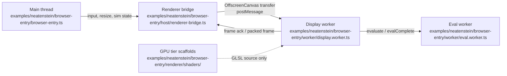

# Neatenstein: How CPU, GPU, and WebWorker Processing Is Split

This document explains the execution split inside the `examples/neatenstein` demo — a first-person neon raycaster built on NeatapticTS. The demo runs the visible game loop, renderer, and neuroevolution across three execution targets: the browser's main thread, a dedicated display WebWorker, and (reserved) GPU compute paths. The focus here is the example code itself: which work runs where, how the threads hand data back and forth, and which acceleration techniques are actually present.

## Runtime overview



The main thread owns input, HUD overlays, window resize handling, and the animation-frame scheduler. The display worker owns the deterministic simulation, enemy AI, raycaster, and all canvas rendering. A second eval worker owns the CPU-heavy NEAT population evaluation. The GPU tier exists as constants and shader source strings but is **not compiled or dispatched** at runtime.

## Three-way processing split

### 1. Main thread: input, HUD, resize, and orchestration

`examples/neatenstein/browser-entry/browser-entry.ts` is the host entrypoint. It:

- Detects whether `HTMLCanvasElement.prototype.transferControlToOffscreen` exists (`bootstrap.utils.ts`, `supportsWorkerOffscreenCanvas`) and chooses the render tier: `worker` when available, otherwise `cpu`.
- Sizes the canvas backing store to a fixed 480 px height with a width proportional to the CSS box aspect ratio (`canvas-dimensions.utils.ts`, `NEATENSTEIN_FIXED_RENDER_HEIGHT`).
- Creates the renderer bridge (`host/renderer-bridge.ts`), wires the status bar / mugshot / wave announcement overlays, and attaches the input router.
- Runs a `requestAnimationFrame` loop that ships a render-state snapshot to the worker every frame and updates the HUD from the worker's returned frame data.

The main thread **does not** run the game simulation or raycast. It only advances a `simTick` counter, builds a `NeatensteinRenderState`, and forwards it.

### 2. WebWorker / OffscreenCanvas tier (the default path)

When OffscreenCanvas transfer is supported, the bridge calls `canvas.transferControlToOffscreen()` and passes the `OffscreenCanvas` to the worker in the `init` message transfer list (`host/renderer-bridge.ts`, lines 172–184). The worker then:

- Receives the transferred canvas in `worker/display.worker.message-handler.utils.ts` (`handleInitMessage`, line 113).
- Synchronizes the canvas backing store with the host-provided dimensions (`worker/display.worker.canvas.utils.ts`, `syncWorkerCanvasSize`).
- Runs the full raycaster and scene graph each frame in `worker/display.worker.ts` (`buildAndPostFrame`, worker tier branch, lines 232–340):
  - clears the canvas,
  - paints walls/floor/ceiling (`worker/display.worker.render.utils.ts`, `paintWorkerTierWalls`),
  - paints enemy sprites (`paintWorkerTierSprites`),
  - paints overlays, pulses, bolts, and the gun overlay (`updateAndPaintWorkerOverlays`),
  - commits the 2D context and posts a lightweight `WORKER_MSG_FRAME` acknowledgement back to the host.

Because the canvas lives in the worker, the browser auto-displays the 2D context contents at task end. The worker deliberately avoids `transferToImageBitmap()` on a transferred OffscreenCanvas because it would clear the backing store and the host cannot redraw it (`display.worker.ts`, lines 307–311).

### 3. CPU fallback tier (packed frame, host canvas retained)

If OffscreenCanvas transfer is unavailable, the entry point falls back to `RENDER_TIER_CPU`, draws a status message on the host canvas (`browser-entry.ts`, line 135–139; `bootstrap.utils.ts`, `drawCanvasStatus`), and keeps the visible canvas on the main thread. In this mode the display worker still runs the simulation and raycaster, but instead of drawing to a canvas it builds a packed `NeatensteinRenderFrame` and posts it back:

- `worker/display.worker.ts`, lines 341–372, builds a `NeatensteinRenderFrame` with `buildNeatensteinRenderFrame` and fills it via `renderPackedTierColumns` (wall distances / sides / z-buffer) and `fillPackedFrameFields` (player vitals, bolts, gun state, etc.).
- The frame's typed-array `ArrayBuffer`s are transferred with `resolveNeatensteinRenderFrameTransferList` (`renderer/frame.ts`, lines 106–117), so the host receives them as zero-copy payloads.
- The host bridge delivers the packed frame to `setFrameConsumer` (`host/renderer-bridge.ts`, lines 303–305 and 348–350). The browser entry uses the consumer only for HUD updates (`browser-entry.ts`, lines 185–231); the current code does **not** include a host-side world-rendering blit for this path.

### 4. GPU tier (reserved, not yet active)

`examples/neatenstein/browser-entry/constants.ts` defines `NEATENSTEIN_GPU_COLUMN_COUNT = 640` and `RENDER_TIER_GPU`. `worker/display.worker.canvas.utils.ts` maps the GPU tier to the higher column count in `resolvePackedColumnCount`. However, the GPU path currently uses the **same packed-frame code as the CPU path** (`display.worker.ts`, lines 341–372). The shader modules in `examples/neatenstein/browser-entry/renderer/shaders/` (`wall-dda.ts`, `floor-caster.ts`, `camera-uniform.ts`) export GLSL ES 3.00 source strings as forward-looking scaffolds for a future WebGL2/WebGPU tier; they are not compiled or dispatched at runtime.

## How the split is orchestrated

### Worker spawn and initialization

The bridge creates a classic `Worker` from `neatenstein.worker.js` (`host/renderer-bridge.ts`, line 158). It queues the latest render state and input snapshot until the worker posts `WORKER_MSG_INITIALIZED` (lines 248–253, 280–286, 319–322). This prevents message flooding during worker startup.

### Transferable OffscreenCanvas

For the worker tier, the host transfers the canvas control in the `init` message:

```ts
offscreen = canvas.transferControlToOffscreen();
transferList.push(offscreen);
worker.postMessage({ type: WORKER_MSG_INIT, ..., canvas: offscreen }, transferList);
```

See `host/renderer-bridge.ts`, lines 172–184 and 371–386. After transfer, the host canvas context is no longer available, which is why the fallback bitmap consumer uses a no-op `drawImage` context if a bitmap ever arrives (lines 338–345).

### Sim-state and input forwarding

On every animation frame the host posts:

- `WORKER_MSG_SIM_STATE` with the latest `NeatensteinRenderState` (canvas dimensions, camera pose, sim tick, hive density, human mode, etc.) — `host/renderer-bridge.ts`, lines 191–193.
- `NEATENSTEIN_INPUT_MESSAGE_TYPE` with the unthrottled input snapshot — lines 210–215.

The worker merges input into `pendingTickInput` (`worker/display.worker.message-handler.utils.ts`, `handleInputMessage`) and runs one simulation step before rendering.

### Worker-paced `requestAnimationFrame` with backpressure

The render loop in `browser-entry.ts` does **not** blindly schedule `requestAnimationFrame` at a fixed display rate. Instead:

- `bridge.postSimState(renderState)` marks the worker as busy.
- The bridge queues only the latest deferred state while the worker is busy (`host/renderer-bridge.ts`, lines 255–261).
- When the worker acknowledges a frame (`WORKER_MSG_FRAME`), the bridge either flushes a pending state immediately or calls the host's `onFrameReady` callback (lines 352–367).
- The host schedules the next `requestAnimationFrame` only inside that callback (`browser-entry.ts`, lines 425–430).

This keeps the loop paced by the worker's actual render capacity rather than the display refresh rate, which avoids main-thread jank on slower machines.

### Packed frame zero-copy transport

For CPU/GPU tiers, the worker posts the frame with a `Transferable` list:

```ts
self.postMessage(
  { type: WORKER_MSG_FRAME, frame },
  resolveNeatensteinRenderFrameTransferList(frame),
);
```

(`worker/display.worker.ts`, lines 368–371). `resolveNeatensteinRenderFrameTransferList` returns the underlying `ArrayBuffer`s for `wallDistances`, `wallSides`, `zBuffer`, `enemyScreenX`, `enemyScale`, and `projectileScreenX` (`renderer/frame.ts`, lines 109–116), so the host receives the data without a structured clone copy.

### Dedicated eval worker for NEAT evaluation

Neuroevolution is the most CPU-expensive part of the demo. To keep the render loop smooth, the display worker spawns a second worker lazily from its own bundle URL (`worker/display.worker.eval-delegation.utils.ts`, `resolveEvalWorkerUrl` and `getOrCreateEvalWorker`). The eval worker:

- Receives `{ type: 'evaluate', seed, generation, enemySnapshot, humanMode }`.
- Lazy-loads the `Neat` constructor from `neataptic` (`worker/eval.worker.ts`, lines 145–149).
- Runs episode-based fitness evaluation with `runFitnessEpisode` (lines 86–137), calls `neatPop.evaluate()` and `neatPop.evolve()` (lines 212–213), and runs the arms-race generation (`runArmsRaceGeneration`, lines 222–229).
- Serializes the champion via `Network.toJSON()` and posts it back (`worker/eval.worker.ts`, lines 232–238).
- The display worker deserializes it with `Network.fromJSON` (`display.worker.eval-delegation.utils.ts`, `handleEvalComplete`, lines 60–62).

This offloads the 500–2000 ms generation stalls off the render thread.

### Resize handling

When the visible canvas CSS box changes, `canvas-dimensions.utils.ts` recomputes the fixed-480 px backing-store size. For the worker tier the new dimensions are forwarded through `bridge.resize()` to the worker (`host/renderer-bridge.ts`, `postResizeMessage`); for the CPU tier the host updates its own canvas backing store directly (`canvas-dimensions.utils.ts`, `updateRendererSize`). The worker stores any pending resize until `handleInitMessage` applies it (`worker/display.worker.message-handler.utils.ts`, lines 106–124).

### Merging results back

The display worker mutates simulation state in place during a tick but returns a shallow-cloned `GameState` at the boundary (`worker/display.worker.sim.utils.ts`, lines 516–527). The render state is then turned into a frame payload. For the worker tier, the frame payload is only vitals and metadata; for CPU/GPU tiers, the payload is the full packed SoA frame. The host's `setFrameConsumer` merges these vitals into the status bar, mugshot, and wave announcement overlays.

## Acceleration techniques actually present

| Technique | Where it lives | What it does |
|-----------|---------------|--------------|
| **OffscreenCanvas transfer** | `host/renderer-bridge.ts` lines 172–184; `worker/display.worker.ts` lines 232–340 | Lets the worker render directly to the screen buffer; no per-frame bitmap copy or main-thread canvas work. |
| **Worker-paced rAF + one-in-flight backpressure** | `browser-entry.ts` lines 425–430; `host/renderer-bridge.ts` lines 255–261, 352–367 | Schedules the next frame only after the worker acks; drops stale states instead of flooding the worker queue. |
| **Transferable packed frame** | `renderer/frame.ts` lines 106–117; `worker/display.worker.ts` lines 368–371 | Moves SoA typed-array buffers to the host with zero-copy `Transferable` semantics. |
| **Dedicated eval worker** | `worker/display.worker.eval-delegation.utils.ts`; `worker/eval.worker.ts` | Runs NEAT population evaluation / arms-race off the render loop; champion crosses the boundary as JSON. |
| **Persistent wall framebuffer** | `worker/display.worker.render.utils.ts` lines 1017–1046 | Allocates the wall `Uint8ClampedArray` once and reuses it across frames instead of allocating per frame. |
| **Single `putImageData` frame flush** | `worker/display.worker.render.utils.ts` lines 89, 387–390; `renderer/walls.ts`; `renderer/sprites.ts` | Walls, ceiling, floor, and sprites write into the same persistent buffer and flush with one `putImageData` per frame. |
| **Procedural floor/ceiling seeding** | `worker/display.worker.render.utils.ts` lines 179–191 | Fills the framebuffer procedurally without calling `getImageData`, avoiding a per-frame ~1.2 MB allocation. |
| **Half-resolution decimation + MSAA resolve** | `worker/display.worker.render.utils.ts` lines 199–205, 251–301 | Interpolates wall color on odd columns and averages adjacent columns to clean seams while keeping the z-buffer cast at every column. |
| **Tier-specific fixed column counts** | `constants.ts` lines 18–25; `worker/display.worker.canvas.utils.ts` lines 67–72; `host/resize.ts` lines 39–42 | Worker uses backing-store width; CPU uses 320 columns; GPU reserved at 640 columns. Keeps projection math stable and throughput predictable. |
| **Pooled enemy-update contexts** | `shared/enemy-controller.ts` lines 89–136, 236–288 | 16 preallocated context slots are reset in place; no fresh context object is allocated per enemy per tick. |
| **Cached BFS distance map** | `shared/enemy-controller.ts` lines 469–476 | Reuses a single cached distance map across ticks instead of allocating ~57 KB per tick. |
| **Single-pass Set de-rez pruning** | `worker/display.worker.sim.utils.ts` lines 417–478 | Tracks de-rez completion in a `Set` and compacts enemy arrays in place, avoiding repeated filter allocations. |
| **Shallow GameState clone at boundary** | `worker/display.worker.sim.utils.ts` lines 516–527 | Mutates state in place during the tick, then returns one shallow snapshot so the host sees a stable view. |
| **Pooled MLP activation buffers** | `harness/enemy-mlp.ts` lines 208–264 (`activateMlpPooled`) | Two ping-pong `Float32Array`s are reused for enemy MLP forward passes instead of allocating a new array per layer per enemy. |
| **SAB-backed inference pool scaffolding** | `shared/enemy-controller.parallel.utils.ts` lines 23–162 | Creates a `SharedArrayBuffer`-backed pool of 16 weight slots (or standalone arrays if SAB is unavailable). |
| **Deterministic inference barrier** | `shared/enemy-controller.parallel.utils.ts` lines 253–335 | Tags results with `(simTick, enemyIndex)` and applies them in index order, so future parallel workers cannot desynchronize the simulation. |
| **Lazy eval-worker and lazy `Neat` import** | `worker/display.worker.eval-delegation.utils.ts` lines 86–104; `worker/eval.worker.ts` lines 145–149 | The eval worker and the `neataptic` constructor are loaded only when a generation evaluation is needed. |
| **Fixed 480 px backing-store height** | `canvas-dimensions.utils.ts` line 18 | Stabilizes projection math; CSS scales the buffer to the viewport. |

### What the current code does *not* do

Being precise about the gaps is as important as documenting the active optimizations:

- **GPU compute is not running.** The `RENDER_TIER_GPU` constant and the GLSL source scaffolds exist only to keep the CPU and future GPU algorithms aligned. There is no WebGL2/WebGPU context creation, shader compilation, or compute dispatch in the live demo.
- **CPU fallback does not blit the world view.** The packed `NeatensteinRenderFrame` is produced and its vitals feed the HUD, but the current host entry does not draw the raycast columns to the visible canvas; it only draws the fallback status message.
- **Audio engine is not wired into the live entry.** `browser-entry/audio.ts` exports a procedural Web Audio engine, but `browser-entry.ts` does not import or instantiate it.
- **Enemy inference is currently inline.** `shared/enemy-controller.parallel.utils.ts` has the SAB/channel/inline strategy resolution and barrier machinery, but `worker/display.worker.sim.utils.ts` (`runSimStepParallel`, lines 654–691) dispatches no separate inference workers; enemy MLP activations happen synchronously inside the display worker via `harness/enemy-mlp.ts`.

## Recommended reading

- `examples/neatenstein/README.md` — high-level thesis and architecture diagram.
- `examples/neatenstein/browser-entry/browser-entry.ts` — host loop and tier selection.
- `examples/neatenstein/browser-entry/host/renderer-bridge.ts` — worker spawn, transfer, backpressure.
- `examples/neatenstein/browser-entry/worker/display.worker.ts` — worker render and tier branch.
- `examples/neatenstein/browser-entry/worker/display.worker.sim.utils.ts` — simulation step.
- `examples/neatenstein/browser-entry/worker/eval.worker.ts` — dedicated NEAT evaluation.
- `examples/neatenstein/browser-entry/shared/enemy-controller.parallel.utils.ts` — SAB pool and deterministic barrier.
- `examples/neatenstein/browser-entry/renderer/frame.ts` — transferable SoA frame format.
