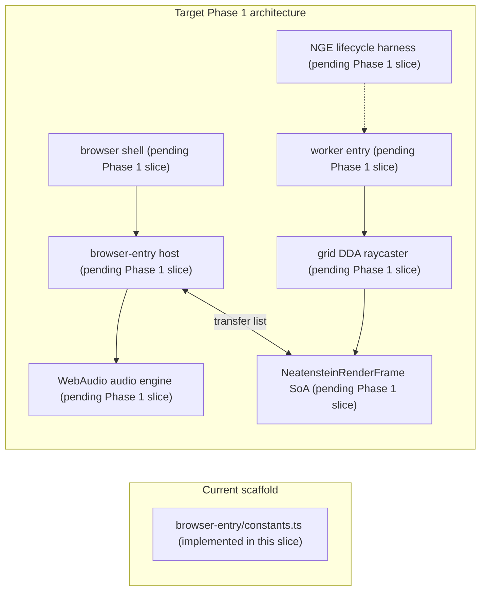

# Neatenstein (NeatapticTS)

> **Thesis:** _Train your own killer — then survive it._

This example is a first-person neon raycasting demo built on top of NeatapticTS.
It pairs a human player against networks that evolve from the player's own
deaths, making the learning process visible, audible, and playable. The demo is
a teaching system, not a game product: the real subject is how neuroevolution,
reproducible simulation, and worker-backed rendering can be composed into one
browser runtime.

## What This Folder Is Trying To Teach

This example is organized around three reader questions:

1. How do you connect NGE lifecycle evolution to a real-time control task
   where the same agent both teaches and is attacked by what it taught?
2. How do you keep a 60fps renderer deterministic, tier-aware, and
   worker-offloadable without leaking rendering authority into the library core?
3. How do you reuse the repo's existing visualizer patterns (Flappy ground grid,
   worker frame snapshots, neon palette) instead of inventing a parallel demo stack?

This folder will answer these questions across Phase 1 slices; the current slice
establishes the shared constants and this discovery anchor.

## Choose Your Route

| If you want to...                            | Start here                                                                                                                          |
| -------------------------------------------- | ----------------------------------------------------------------------------------------------------------------------------------- |
| Run the browser demo                         | _Pending_ — host/worker entry points land in later Phase 1 slices; build with `node scripts/build-neatenstein.mjs` once they exist. |
| Read the renderer constants and tier presets | [browser-entry/constants.ts](browser-entry/constants.ts)                                                                            |
| Understand the raycaster and frame protocol  | [browser-entry/renderer/](browser-entry/renderer/) (test stubs only — implementation lands in a later slice)                        |
| Tune the NGE lifecycle or enemy co-evolution | the NGE core plan at `plans/completed/NEAT_Genesis_EvoDevo.md`                                                                      |

## What Exists in This Slice

The only implemented source file in this slice is
[`browser-entry/constants.ts`](browser-entry/constants.ts). It defines the
shared renderer constants and tier presets that later slices will consume.

Every other path referenced here — the host entry, the worker entry, the
raycaster, the frame protocol, the audio engine, and the NGE harness — is a
forward reference to a later Phase 1 slice and does not yet contain runnable
implementation.

## Run The Example

### Build the bundles

From the repo root:

```bash
node scripts/build-neatenstein.mjs
```

Once the host/worker entry files land, this script will produce a host bundle
and a worker bundle. Today it logs that the entries are not yet implemented and
exits cleanly.

### Status

> Browser demo entry points (`index.html`, host bundle, and worker bundle) land in
> later Phase 1 slices. This README is the visualizer discovery anchor; it does
> not yet produce a runnable page. Run `node scripts/build-neatenstein.mjs` once the
> host/worker entry files exist.

## The Core Idea In One Glance



The host owns audio and input. The worker owns simulation, NGE inference, and
rendering. The two communicate through a versioned, zero-copy render frame that
uses typed arrays and a transfer list.
