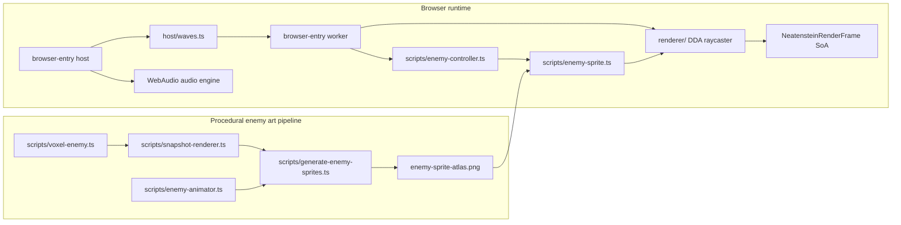

# Neatenstein (NeatapticTS)

> **Thesis:** _Train your own killer — then survive it._

This example is a first-person neon raycasting demo built on top of NeatapticTS.
It pairs a human player against networks that evolve from the player's own
deaths, making the learning process visible, audible, and playable. The demo is
a teaching system, not a game product: the real subject is how neuroevolution,
reproducible simulation, and worker-backed rendering can be composed into one
browser runtime.

## What This Folder Is Trying To Teach

This example is organized around three reader questions:

1. How do you connect NGE lifecycle evolution to a real-time control task
   where the same agent both teaches and is attacked by what it taught?
2. How do you keep a 60fps renderer deterministic, tier-aware, and
   worker-offloadable without leaking rendering authority into the library core?
3. How do you reuse the repo's existing visualizer patterns (Flappy ground grid,
   worker frame snapshots, neon palette) instead of inventing a parallel demo stack?

## Choose Your Route

| If you want to...                            | Start here                                                                                                                                                                                                                                                 |
| -------------------------------------------- | ---------------------------------------------------------------------------------------------------------------------------------------------------------------------------------------------------------------------------------------------------------- |
| Run the browser demo                         | Build with `node scripts/build-neatenstein.mjs`, then open `examples/neatenstein/index.html` in a browser.                                                                                                                                                 |
| Read the renderer constants and tier presets | [browser-entry/constants.ts](browser-entry/constants.ts)                                                                                                                                                                                                   |
| Explore the procedural enemy art pipeline    | [scripts/voxel-enemy.ts](scripts/voxel-enemy.ts), [scripts/snapshot-renderer.ts](scripts/snapshot-renderer.ts), [scripts/enemy-animator.ts](scripts/enemy-animator.ts), [scripts/generate-enemy-sprites.ts](scripts/generate-enemy-sprites.ts)             |
| Wire enemies into the live renderer          | [scripts/enemy-controller.ts](scripts/enemy-controller.ts), [scripts/enemy-sprite.ts](scripts/enemy-sprite.ts), [browser-entry/host/waves.ts](browser-entry/host/waves.ts), [browser-entry/host/renderer-bridge.ts](browser-entry/host/renderer-bridge.ts) |
| Understand the raycaster and frame protocol  | [browser-entry/renderer/](browser-entry/renderer/)                                                                                                                                                                                                         |
| Explore the NGE enemy-population harness     | [browser-entry/harness/enemy-population.ts](browser-entry/harness/enemy-population.ts), [browser-entry/harness/enemy-mlp.ts](browser-entry/harness/enemy-mlp.ts), [browser-entry/harness/fitness.ts](browser-entry/harness/fitness.ts)                     |
| Tune NGE lifecycle or enemy co-evolution     | [browser-entry/harness/](browser-entry/harness/) and the NGA core in `src/`                                                                                                                                                                                |

## What Exists in This Folder

- `browser-entry/` — host shell, worker entry, shared constants, the grid DDA
  raycaster, the audio stub, the deterministic game-state harness, and the
  renderer bridge that forwards state to the worker.
- `scripts/` — the procedural enemy art pipeline and runtime enemy behavior:
  voxel descriptor, orthographic snapshot renderer, deterministic frame animator,
  PNG sprite-sheet/reference-snapshot generator, enemy AI controller, and CPU
  billboard sprite renderer. Generated assets are written to
  `examples/neatenstein/generated/`.
- `index.html` — the demo page that loads the built host bundle.

## Run The Example

### Build the bundles

From the repo root:

```bash
node scripts/build-neatenstein.mjs
```

This produces `docs/assets/neatenstein.bundle.js` and
`docs/assets/neatenstein.worker.esm.js`. Open `examples/neatenstein/index.html`
in a browser to load the demo.

## The Core Idea In One Glance



The host owns audio, input, and wave transitions. The worker owns simulation,
NGE inference, enemy AI, and rendering. The two communicate through a versioned,
zero-copy render frame that uses typed arrays and a transfer list. Enemy
sprites are generated procedurally from a compact voxel descriptor and then
projected as camera-facing billboards inside the worker.
