# Racing Curriculum (NeatapticTS)

This folder is the repository's lesson in **competitive coevolution under tight
runtime boundaries**. It asks a harder systems question than the other flagship
demos: how do you evolve two populations at once, keep their evaluation fair,
run the simulation off the main thread, and stream the result back to the
browser fast enough to render?

The racing benchmark runs two independent NEAT populations — Team A and Team B
— that never share a gene pool. A Team A candidate is scored by racing it
against a **frozen snapshot** of Team B, and vice versa. Because the opponent
snapshot is held constant for an entire generation, neither side chases a
moving target inside a single evaluation pass. That freeze-and-rotate pattern
is the standard coevolution stabilization trick; see
[Coevolution (Wikipedia)](https://en.wikipedia.org/wiki/Coevolution) for the
conceptual background.

The second hard boundary is **host/worker authority**. The browser host owns DOM,
canvas, HUD, and user interaction. The worker owns environment state,
controller inference, population containers, opponent snapshots, and packed
frame production. The contract between them is a typed, forward-only finite-state
machine. The host requests steps; the worker advances the world and returns
compact typed-array snapshots. See [Web Workers (MDN)](https://developer.mozilla.org/en-US/docs/Web/API/Web_Workers_API)
for the execution model and [Transferable objects (MDN)](https://developer.mozilla.org/en-US/docs/Web/API/Web_Workers_API/Transferring_objects)
for the zero-copy transfer contract.

This example is intentionally split into small, teachable boundaries:
environment simulation, track generation, controller design, renderer, worker
protocol, coevolution container, race-pack construction, and opponent snapshot
policy. Each boundary owns one slice of the problem so the reader can change
one policy without misunderstanding the rest of the system.

If Flappy Bird is a fast control-systems lesson and ASCII Maze is a compact
decision-making lesson, Racing Curriculum is the runtime-authority and
coevolution lesson.

## The Core Idea In One Glance

The architectural rule is simple: the worker owns simulation truth, the host
owns presentation, and both populations are evaluated against frozen snapshots
of the other side.

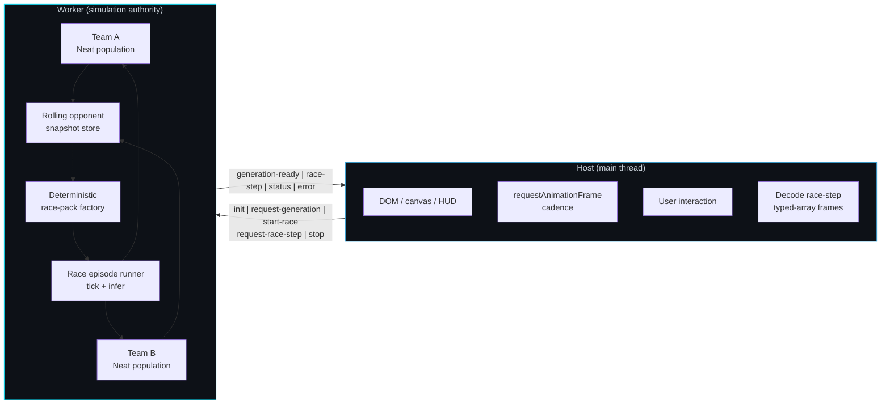

Read the diagram as two connected stories:

- inside the worker, two populations feed a frozen snapshot pool that drives a
  deterministic race-pack and episode runner;
- across the thread boundary, the host only requests work and renders the
  snapshots it receives back.

That split is the key to understanding why this folder teaches more than a
single-population racing demo could.

## Why This Example Holds Up Under Coevolution

| Concept                     | Why it matters here                                                                                                                                 |
| --------------------------- | --------------------------------------------------------------------------------------------------------------------------------------------------- |
| Two independent populations | Team A and Team B cannot share species or fitness history, or the coevolution dynamic collapses into ordinary single-population optimization.       |
| Frozen opponent snapshots   | Holding the opponent constant during one generation makes fitness comparisons fair and prevents an unstable arms race inside the evaluation window. |
| Deterministic race packs    | Identical seed + snapshot always produce identical starting conditions, so comparative fitness claims are not confounded by random track placement. |
| Zero-copy transfer lists    | Streaming packed typed arrays keeps the worker→host channel cheap enough for 60 Hz rendering without copying large state objects.                   |
| Forward-only protocol FSM   | Strict phase-gated messages keep the host from accidentally driving simulation ticks or sending commands at the wrong lifecycle moment.             |

## Choose Your Route

Different readers arrive with different questions. Use the route that matches
yours.

| If you want to...                          | Start here                                                                                                                                             | Then read                                                                                                                                                                                                                |
| ------------------------------------------ | ------------------------------------------------------------------------------------------------------------------------------------------------------ | ------------------------------------------------------------------------------------------------------------------------------------------------------------------------------------------------------------------------ |
| Understand the coevolution contract        | [docs/coevolution-contract.md](https://github.com/reicek/NeatapticTS/blob/main/examples/racing_curriculum/docs/coevolution-contract.md)                | [workers/simulation-worker/README.md](./workers/simulation-worker/README.md)                                                                                                                                             |
| Wire or read the host/worker protocol      | [workers/simulation-worker/simulation-worker.evolution.types.ts](./workers/simulation-worker/simulation-worker.evolution.types.ts)                     | [workers/simulation-worker/simulation-worker.evolution.protocol.service.ts](./workers/simulation-worker/simulation-worker.evolution.protocol.service.ts)                                                                 |
| Add a real NEAT population loop            | [workers/simulation-worker/simulation-worker.coevolution.service.ts](./workers/simulation-worker/simulation-worker.coevolution.service.ts)             | [docs/coevolution-contract.md](https://github.com/reicek/NeatapticTS/blob/main/examples/racing_curriculum/docs/coevolution-contract.md)                                                                                  |
| Understand opponent snapshot policy        | [workers/simulation-worker/simulation-worker.opponent-snapshot.service.ts](./workers/simulation-worker/simulation-worker.opponent-snapshot.service.ts) | [docs/coevolution-contract.md](https://github.com/reicek/NeatapticTS/blob/main/examples/racing_curriculum/docs/coevolution-contract.md)                                                                                  |
| Build or inspect a deterministic race pack | [workers/simulation-worker/simulation-worker.race-pack.service.ts](./workers/simulation-worker/simulation-worker.race-pack.service.ts)                 | [workers/simulation-worker/simulation-worker.snapshot.utils.ts](./workers/simulation-worker/simulation-worker.snapshot.utils.ts)                                                                                         |
| Understand the browser host                | [browser-entry/browser-entry.ts](./browser-entry/browser-entry.ts)                                                                                     | [browser-entry/host/host.ts](./browser-entry/host/host.ts)                                                                                                                                                               |
| Run the browser demo                       | [index.html](./index.html)                                                                                                                             | [browser-entry/browser-entry.ts](./browser-entry/browser-entry.ts)                                                                                                                                                       |
| See the whole example as a system          | this README                                                                                                                                            | [docs/coevolution-contract.md](https://github.com/reicek/NeatapticTS/blob/main/examples/racing_curriculum/docs/coevolution-contract.md) and [workers/simulation-worker/README.md](./workers/simulation-worker/README.md) |

## Run The Example

From the repo root:

### Build the browser bundle

```bash
npm run build:racing-curriculum
```

This produces `docs/assets/racing-curriculum.bundle.js`.

### Refresh docs and copied example assets

```bash
npm run docs
```

Then open `docs/examples/racing_curriculum/index.html` from a local server, or
run `npm run start:local-server` and navigate to the example path.

Important browser note:

- `index.html` is a lightweight shell that loads the prebuilt bundle from `docs/assets`.
- the real host orchestration source lives in [browser-entry/browser-entry.ts](./browser-entry/browser-entry.ts).
- after browser-code changes, run `npm run build:racing-curriculum` or `npm run docs` before expecting the hosted page to reflect them.

Node engine requirement in this repo is `>=22`.

## Tier 1 / Tier 2 shared racing baseline

Before the controller contract matters, the curriculum pins down a shared
visual and spatial baseline. Every Tier 1 and Tier 2 race uses the same
two-car grid, the same color code, the same lane assignment, the same
alternating pit ownership, and the same track-boundary enforcement. Keeping
these rules explicit prevents the two populations from drifting apart on
layout assumptions before they ever compete on driving skill.

### Team colors and guide lines

Each car gets its own color and its own dedicated guide line:

- **Team 0 is blue.** Car bodies are drawn with `#0000ff` and the guide line is
  rendered in `rgb(0,0,255)`.
- **Team 1 is red.** Car bodies are drawn with `#ff0000` and the guide line is
  rendered in `rgb(255,0,0)`.

The exported constants
[`TEAM_BLUE_INDEX`](./browser-entry/browser-entry.ts) and
[`TEAM_RED_INDEX`](./browser-entry/browser-entry.ts) make this mapping public:

```ts
export const TEAM_BLUE_INDEX = 0; // inner lane
export const TEAM_RED_INDEX = 1; // outer lane
```

The host builds a fresh guide line for every car with
[`buildGuidingLineForTeam`](./renderer/racing.renderer.ts). The optional
`lateralOffsetWorld` argument is derived from the car's team: Team 0 (blue)
uses the inner-lane centerline and Team 1 (red) uses the outer-lane
centerline. Because each line is reconstructed from the same deterministic
`TrackSpec` that produced the race pack, the visual lane marker and the
physical start position agree for every seed, and every car in a multi-car
pack gets its own lane-aligned overlay. The lines are not part of the
zero-copy worker frame; they are pure host-side visualizations.

Elsewhere in this README, "Team A" refers to Team 0 (blue) and "Team B"
refers to Team 1 (red).

### Blue-inner / red-outer lane assignment

The starting grid is deterministic: Team 0 (blue) always begins on the
inner-lane centerline, and Team 1 (red) always begins on the outer-lane
centerline. This is enforced when the race pack is created in
[`browser-entry.ts`](./browser-entry/browser-entry.ts) and mirrored in
`buildGuidingLineForTeam`, so the visual lane marker and the physical start
position agree for every seed.

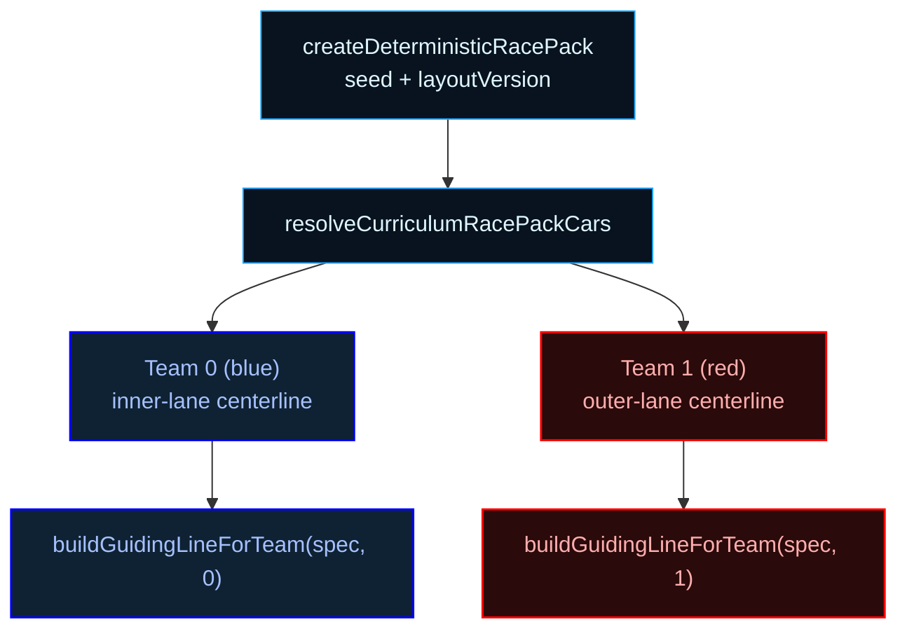

Read the diagram as a single invariant chain: the same seed that builds the
track also fixes the two-car grid, and the same geometry that places the cars
also places their guide lines.

### Tire-mark trails

Each car leaves a short fading trail behind its rear axle. The renderer
samples a trail point every `TIRE_MARK_SAMPLE_INTERVAL_TICKS = 3` simulation
ticks, evicts points older than `TIRE_MARK_MAX_AGE_TICKS = 260` ticks, and
draws the remaining segments with team color at a peak alpha of
`COLOR_TIRE_MARK_MAX_ALPHA = 0.3`. Marks are grouped by team, so all blue
cars share one continuous trail and all red cars share another. The trail is
render state owned by the host: it does not travel through the worker frame,
so its length and density can be tuned without touching the simulation.

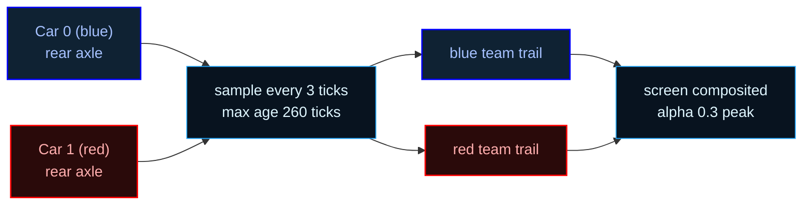

### Alternating pit ownership

Six pit boxes are generated at fixed lap-progress anchors:

```ts
const ALTERNATING_PIT_PROGRESS_SAMPLES = [
  0.083333, 0.25, 0.416667, 0.583333, 0.75, 0.916667,
];
```

Ownership alternates around the lap, producing the order `[0, 1, 0, 1, 0, 1]`.
Because the side selector also alternates, each team ends up with pits on both
the inner and outer sides of the track. A car may only enter a pit box that
belongs to its own team; a four-tick stop restores all four tire channels to
full health.

### Track-boundary wall enforcement

Every environment step ends with `clampCarToTrackBounds` in
[`environment.step.service.ts`](./environment/environment.step.service.ts). The
car's position is projected onto the nearest spline centerline; if its signed
lateral offset exceeds `[-halfWidth, halfWidth]`, it is pushed back onto the
drivable ribbon. This keeps cars from shortcutting or leaving the track, and
it applies to every tier that reuses the same environment stepping path.

### Physics contracts

The same environment step also enforces three hard rules that every tier
inherits:

- **Off-track penalty.** If `clampCarToTrackBounds` changes a car's position,
  the step assigns `OFF_TRACK_CLAMP_REWARD = -1` to that car's `reward` field.
- **Wrong-direction penalty.** `detectWrongDirection` measures the car's
  displacement against the forward tangent of its nearest spline sample. A
  negative dot product means the car moved backwards, so the step assigns
  `WRONG_DIRECTION_REWARD = -1`. Stationary cars are never flagged.
- **Car-vs-car pushing.** After clamping, `separateCars` enforces a minimum
  center-to-center distance of `CAR_MIN_CENTER_SEPARATION = 1` world unit
  between every pair of cars, pushing overlapping centers apart along the line
  connecting them.

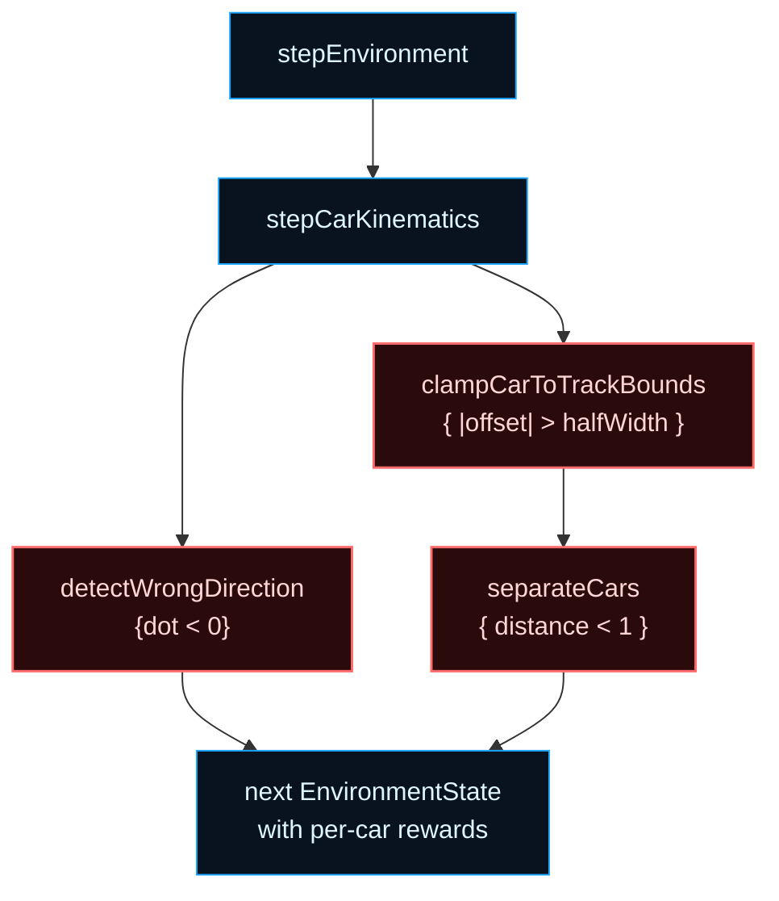

The order matters: wrong-direction is detected on the raw displacement before
clamping, the off-track clamp is applied next, and overlapping cars are
pushed apart before pit entry is resolved. This keeps the geometry penalties
independent and deterministic for every tier that shares `stepEnvironment`.

### Launching the browser demo

The same contract exercised by the worker tests can be launched directly in
the browser:

```ts
import { start } from './browser-entry/browser-entry';

const handle = await start('racing-curriculum-output');
// The demo runs at the active tier (Tier 1 by default).
// Call handle.stop() when you want to shut down the demo.
```

`start` builds the host shell, generates the tier-aware track, creates the
starting grid with the blue-inner / red-outer rule, and begins the animation
loop. The worker seam is initialized in parallel so the host can hand
physics stepping off to the worker without changing the public entry point.

## Tier 1 single-agent usage contract

Tier 1 is the narrowest rung of the racing ladder: one car per team, no radio,
no pit stops, fresh tires only, and a simple medium track. It exists to answer
the most basic curriculum question: can a single NEAT controller learn to drive
a closed circuit at all? By keeping both teams to a single agent, the first
learning problem is freed from teammate coordination, tire budgets, and pit
strategy.

The race surface is a 1v1 coevolutionary duel. Team A and Team B each evolve
one controller; during a generation, every Team A candidate is evaluated against
a frozen snapshot of Team B, and vice versa. The deterministic race pack
guarantees that the same seed and the same opponent snapshot always produce the
same starting frame, so fitness comparisons are fair and episodes are replayable.
For the coevolution background, see
[docs/coevolution-contract.md](docs/coevolution-contract.md).

The Tier 1 controller contract is intentionally small:

- **Observation vector:** 70 normalized channels.
  - 20 scalar channels describing the car state and immediate driving context.
  - 40 channels for five look-ahead track segments.
  - 10 recurrent memory-trace channels.
- **Action vector:** 2 channels — throttle and steer.
- **Guidance:** a faint optimal-line overlay is rendered as a curriculum scaffold,
  but the controller is free to ignore it. Tier 2 turns the overlay off entirely.

The host renders one guiding line per car so the viewer can see each agent's
intended lane: Team 0 (blue) on the inner lane and Team 1 (red) on the outer
lane. These lines are generated with `buildGuidingLineForTeam` and are not
part of the zero-copy transfer list; they are reconstructed locally from the
same deterministic track geometry.

### Tier 1 runtime story


### Running a Tier 1 episode from code

The same contract used by the browser demo can be exercised directly:

```ts
import {
  createDeterministicRacePack,
  createRaceEpisodeRunner,
} from './workers/simulation-worker/simulation-worker.race-pack.service';
import { buildGuidingLineForTeam } from './renderer/racing.renderer';
import { generateTrack } from './track/track.generator';

const seed = 42;
const snapshot = {
  snapshotId: 'tier1-demo',
  generation: 0,
  networkPayloads: [],
};

// 1. Build a packed starting frame for the host renderer.
const pack = createDeterministicRacePack(seed, snapshot);

// 2. Two minimal controllers: one output = throttle [0, 1].
const networks = [
  { activate: () => [0.75] }, // team A: steady pace
  { activate: () => [1.0] }, // team B: full throttle
];

// 3. Create the runnable episode.
const runner = createRaceEpisodeRunner(seed, snapshot, networks);

// 4. Step physics and inference until one car finishes a lap or time expires.
while (!runner.frame.done && runner.frame.tick < 300) {
  runner.tick();
}

// 5. Read comparative fitness and build a transferable worker message.
console.log('Team A fitness:', runner.computeFitness(0));
console.log('Team B fitness:', runner.computeFitness(1));
const { frame, transferList } = runner.createRaceStepMessage();
// worker.postMessage({ type: 'race-step', frame }, transferList);

// 6. Build per-team guiding lines for the host renderer.
const trackSpec = generateTrack({
  seed,
  layoutVersion: 1,
  sizeBucket: 'medium',
});
const teamALine = buildGuidingLineForTeam(trackSpec, 0);
const teamBLine = buildGuidingLineForTeam(trackSpec, 1);
```

In this snippet:

- `createDeterministicRacePack` builds the shared initial frame.
- `createRaceEpisodeRunner` creates the runnable episode; each network receives
  `[carX, carY, carHeading, progress01, tick]` on every `tick()` and should
  return at least one output for throttle.
- `computeFitness` returns a lap-time or progress-based score.
- `createRaceStepMessage` produces the transferable frame a worker would stream
  to the host.
- `buildGuidingLineForTeam` gives the host renderer a dedicated lane marker per
  team.

This is the full Tier 1 surface: two single-agent controllers, a deterministic
track, a frozen opponent snapshot slot, and a renderable guiding line.
Everything else in the curriculum is layered on top of this contract.

> **Note on the two controller seams.** The snippet above uses the worker
> race-pack runner, which is a minimal proof-of-concept seam: it feeds each
> network a raw five-dimensional state vector and consumes only a throttle output.
> The browser host's `createNgeController` seam (used in the live demo and in
> the Tier 2 example below) consumes the full 70-channel normalized observation
> vector and produces both throttle and steer. Both count as "Tier 1" because the
> pack layout and the learning goal are the same; only the inference wrapper differs.

## Tier 2 1v1 self-radio usage contract

Tier 2 keeps the one-car-per-team grid from Tier 1 but turns on the first
radio seam. The learning question is no longer "can the car drive?" but
"can the network learn to write and read a compact self-summary of its own
state?". By forcing the controller to emit seven extra values that are
fed back into the next observation vector, Tier 2 introduces the shortest
possible recurrent communication loop without yet adding teammate
coordination, tire wear, or pit strategy.

### Tier 2 pack layout

The Tier 2 race pack is still a two-car 1v1 grid:

```ts
const TIER_TWO_TEAM_LAYOUT = [0, 1]; // Team 0 (blue), Team 1 (red)
```

Team 0 (blue) starts on the inward side of the inner-lane centerline and
Team 1 (red) starts on the outward side, exactly as in Tier 1. The visual difference is
that the optimal-line overlay is now completely off: the network must
self-navigate using only the observation vector and its own radio memory.

### Tier 2 controller network

The Tier 2 controller is a 77-input / 9-output MLP:

```ts
const network = createDeterministicRacingControllerNetwork(2);
// network.input === 77
// network.output === 9
```

The 77 inputs are the 70-channel Tier 1 base plus the seven-channel
self-radio tail; the corresponding 9 outputs are chosen inside the same
factory. The hidden layer size stays small (`[4]`) so the example remains
cheap to run in the browser.

### Tier 2 observation vector

- **77 channels total.**
- `[0..69]` — the same 70-channel Tier 1 base used by the solo controller:
  - 20 scalar driving-state channels.
  - 40 channels for five look-ahead track segments.
  - 10 recurrent memory-trace channels.
- `[70..76]` — seven self-radio channels written by the controller on the
  previous tick and read back without re-normalization.

On the very first tick the radio tail is zero-filled; afterwards it carries
the network's own self-monitoring payload.

### Tier 2 action vector

The controller network emits **9 channels**:

- `output[0]` → throttle, clamped to `[-1, 1]`.
- `output[1]` → steer, clamped to `[-1, 1]`.
- `outputs[2..8]` → seven self-radio write channels, clamped to `[-1, 1]`
  and stored in the per-car self-radio seam.

`createNgeController` performs the split automatically when `tier: 2` is
passed: it writes the radio tail after inference, and the next tick's
observation assembler reads it back into indices `[70..76]`.

### Default self-radio payload

The seven radio channels are populated from the environment state before the
network sees them, then overwritten by the network's own radio-write head.
The default self-monitoring payload (used when the network has not yet
written) is:

| Index | Signal                      | Normalization                        |
| ----- | --------------------------- | ------------------------------------ |
| 70    | forward speed               | `forwardSpeedWorld / 108`            |
| 71    | lateral speed               | `lateralSpeedWorld / 54`             |
| 72    | total speed                 | `speedWorld / 108`                   |
| 73    | yaw rate                    | `yawRateRadiansPerSecond / 1`        |
| 74    | slip angle                  | `slipAngleRadians / (π / 2)`         |
| 75    | lap progress                | `progress01 * 2 - 1`                 |
| 76    | optimal-line lateral offset | `optimalLineLateralOffsetWorld / 18` |

Each value is clamped to `[-1, 1]`. Once the controller runs, the network's
radio-write outputs replace this payload, so the learned semantics are
entirely emergent. The curriculum only enforces the byte layout; the
controller decides what the seven channels mean.

### Tier 2 feedback loop

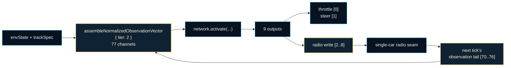

### Activating Tier 2

The browser demo runs Tier 1 by default. The constant that selects it is in
[`browser-entry/browser-entry.ts`](./browser-entry/browser-entry.ts):

```ts
const ACTIVE_CURRICULUM_TIER = 1;
```

Set it to `2` for the self-radio Tier 2 contract, or to `3` for the
four-car fallback pack. Changing this constant rebuilds the race
pack, the observation vector width, and the controller output head.

### Running a Tier 2 controller from code

The same contract used by the live browser demo can be exercised directly:

```ts
import {
  createNgeController,
  createSingleCarRadioChannel,
} from './controller/nge.controller';
import { assembleNormalizedObservationVector } from './controller/observation.assembler';
import { generateTrack } from './track/track.generator';

const trackSpec = generateTrack({
  seed: 42,
  layoutVersion: 1,
  sizeBucket: 'medium',
});

// Tier 2 self-radio seam: seven channels written by the controller
// and read back as the observation tail on the next tick.
const radioChannel = createSingleCarRadioChannel(7);

const network = {
  activate: (inputs: readonly number[] | Float32Array) => {
    // 77 inputs = 70 base channels + 7 self-radio channels
    console.assert(inputs.length === 77);
    // 9 outputs = throttle + steer + 7 self-radio write channels
    return [0.75, 0.1, 0.5, -0.2, 0.3, 0, 0, 0, 0];
  },
};

const controller = createNgeController(network, {
  tier: 2,
  radioChannel,
});

const envState = { tick: 0, carX: 0, carY: 0, carHeading: 0 };
const result = controller.computeControlWithEvidence(envState, trackSpec);

// Next tick: the seven radio writes reappear as observation indices [70..76].
const nextObservation = assembleNormalizedObservationVector(
  { ...envState, radioField: Float32Array.from(radioChannel.readSelf()) },
  trackSpec,
  { tier: 2 },
);

console.log(result.control); // { throttle: 0.75, steer: 0.1 }
console.log(nextObservation.length); // 77
console.log(Array.from(nextObservation.slice(70, 77))); // radio feedback
```

In this snippet:

- `createSingleCarRadioChannel(7)` creates the self-radio seam that stores
  the seven-channel payload between ticks.
- `createNgeController(network, { tier: 2, radioChannel })` wraps the network
  so the 77-channel observation is assembled, inference is run, the radio
  tail is written, and throttle/steer are returned.
- The second `assembleNormalizedObservationVector` call shows what the next
  tick will feed back into the network: the seven written values occupy
  indices `[70..76]`.

This is the full Tier 2 surface: a 1v1 pack, a 77-channel observation
with a self-radio tail, a 9-output network, and a one-tick delayed feedback
loop that the controller can learn to exploit.

## Tier 3 fallback four-car pack

Tier 3 is not a full curriculum stage in the current demo, but the promotion
path needs a safe fallback shape so that advancing from Tier 1/Tier 2 does not
collapse the race to a single car. When the active tier resolves to `3`,
`resolveCurriculumRacePackLayout` returns `TIER_THREE_TEAM_LAYOUT`:

```ts
const TIER_THREE_TEAM_LAYOUT = [0, 0, 1, 1]; // two blue, two red
```

The four slots map to four cars on the starting grid: Team 0 (blue) fills the
inner-lane slots and Team 1 (red) fills the outer-lane slots. The same
blue-inner / red-outer rule used for Tier 1 and Tier 2 is extended so that each
team's two cars are placed along the same lane centerline, one behind the other,
and each car gets its own lane-aligned guide line.

A tier promotion after `LAP_COMPLETIONS_REQUIRED_FOR_TIER_ADVANCE = 3` completed
laps moves the demo to the next curriculum tier, so the Tier 3 fallback is the
first shape a driver sees after mastering the two-car baseline.

```ts
import { generateTrack } from './track/track.generator';
import { buildGuidingLineForTeam } from './renderer/racing.renderer';

const trackSpec = generateTrack({
  seed: 42,
  layoutVersion: 1,
  sizeBucket: 'medium',
});

// Tier 3 pack shape: two blue inner, two red outer.
const tierThreeLayout = [0, 0, 1, 1];
for (const teamIndex of tierThreeLayout) {
  // Each car gets a lane-aligned guide line colored by team.
  buildGuidingLineForTeam(trackSpec, teamIndex);
}
```

## Tier 4 2v2 tires-and-pits contract

Tier 4 is the first rung where the cars face a **resource budget**. The 2v2
grid from Tier 3 stays in place — two blue cars, two red cars — but every car
now carries four tires that degrade as it drives, and each team owns a pit
lane where a car can stop for four ticks to restore all four tire channels to
full health. The learning question shifts from "can the teammates coordinate
via radio?" to "can the network learn to balance raw speed against tire
preservation and decide when a pit stop pays off?"

The strategic tension is entirely about **time cost**, not slot scarcity.
Each team has three pit slots (six total), so finding an open bay is never the
hard part. The hard part is that a four-tick stop costs 7.2 world units of
track distance at full speed (4 ticks × 108 units/sec × 1/60 sec/tick) —
enough for an opponent to gain a corner — and the car must physically reach
its own team's pit entrance corridor to trigger the stop. The network has to
discover that pitting too early wastes time and pitting too late risks losing
so much grip that the car can no longer maintain racing speed.

### Tier 4 pack layout

The team layout is identical to Tier 3:

```ts
const TIER_THREE_TEAM_LAYOUT = [0, 0, 1, 1]; // two blue, two red
```

The coevolution container resolves the controller input dimension based on the
active tier. Tier 4 produces a 95-input / 9-output controller network:

```ts
const TIER_FOUR_CONTROLLER_INPUT_SIZE = 95;  // 91 Tier 3 + 4 tire health
const TIER_THREE_CONTROLLER_OUTPUT_SIZE = 9;  // 2 control + 7 radio-write
```

### Tier 4 observation vector

The Tier 4 observation is the 91-channel Tier 3 vector with a four-channel
tire-health suffix appended, producing **95 channels**:

| Range      | Channels | Content                                                            |
| ---------- | -------- | ------------------------------------------------------------------ |
| `[0..69]`  | 70       | Tier 1 driving baseline (20 scalar + 40 look-ahead + 10 memory)   |
| `[70..90]` | 21       | Three teammate-radio slots (3 × 7 channels); unused slots zero-pad |
| `[91..94]` | 4        | Own-car tire health `[frontLeft, frontRight, rearLeft, rearRight]` |

The first 91 channels are byte-for-byte identical to Tier 3, so any
controller weights trained at Tier 3 transfer directly — the only new
sensory delta is the four tire channels at the tail. Each tire channel is
clamped to `[0, 1]`, where `1.0` means a fresh tire and `0.0` means a
completely worn tire.

The observation reflects the **pre-physics, pre-decay** state: the tire
channels capture current health *before* this tick's degradation is applied.
That ordering lets the controller observe how worn its tires are and decide
whether to push hard or lift off before the wear happens, not after.

### Tire degradation model

Each car carries a `tireState` tuple `[FL, FR, RL, RR]`, initialized to
`[1.0, 1.0, 1.0, 1.0]` at episode start. Every tick, the
`decayTireState` function in
[`environment/environment.step.service.ts`](./environment/environment.step.service.ts)
applies the pinned Tier 4 degradation formula:

```
baseDecay = |lateralForce|      * 0.00012
          + |longitudinalForce| * 0.00006
          + |speed|             * 0.000006
```

Each tire then multiplies the base wear by a degradation-acceleration factor
so already-damaged tires wear *faster* than fresh tires under the same load:

```
degradationAcceleration = 1 + (1 - tireHealth) * 0.5
nextTireHealth          = tireHealth - baseDecay * degradationAcceleration
```

The final value is clamped to the closed `[0.0, 1.0]` interval. The
acceleration factor creates a compounding effect: a tire at `0.5` health
decays 25% faster than a fresh tire, and a tire at `0.2` health decays 40%
faster. This is what makes tire management a real optimization problem rather
than a linear countdown.

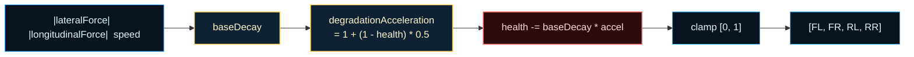

### Grip multiplier

Tire health does not just degrade — it actively reduces the car's
performance. After tire decay is applied, the race-pack runner computes a
grip multiplier from the mean tire health and scales forward progress:

```
meanTireHealth = (FL + FR + RL + RR) / 4
gripMultiplier = sqrt(meanTireHealth)
forwardStep    = throttle * gripMultiplier * maxSpeed * timestep
```

The square root means grip falls off quickly at first and then levels out: a
car with half-worn tires (`mean = 0.5`) retains about 71% of its forward
speed, while a car with severely worn tires (`mean = 0.25`) retains only 50%.
This is the mechanism that makes pit stops worth considering — a car on
fresh tires after a stop can dramatically out-pace a competitor on worn
tires, potentially recovering the time lost during the four-tick stop.

### Pit lifecycle

Each team owns three pit slots (six total), generated at fixed lap-progress
anchors around the track. The pit lifecycle is a simple deterministic
state machine:

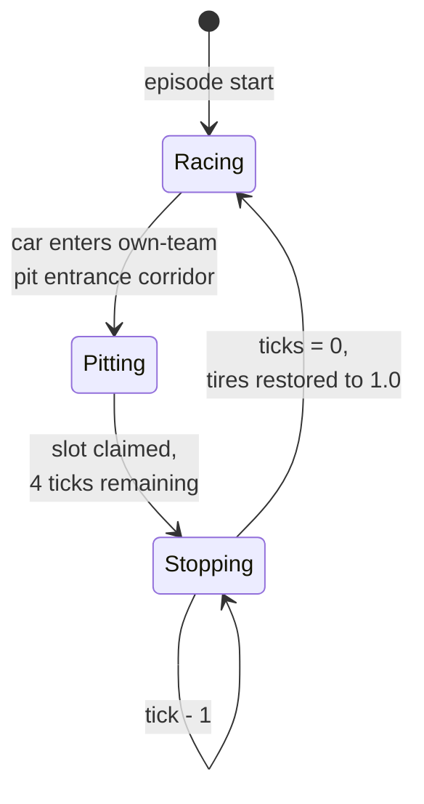

The lifecycle has four hard rules:

1. **Own-team entry only.** A car can only enter a pit box whose `teamIndex`
   matches its own. Team A cars cannot use Team B's pit and vice versa. This
   is enforced in `resolvePitEntries` by checking
   `box.teamIndex === carTeam`.
2. **Fixed four-tick stop.** When a car enters its team's pit entrance
   corridor, it claims a slot and a four-tick countdown begins
   (`PIT_STOP_TICKS = 4`). The car cannot advance during those ticks.
3. **Full tire restoration on release.** When the countdown reaches zero,
   all four tire channels are reset to `1.0` (fresh tires) and the car is
   released back into the race.
4. **Pit-entrance blocking is emergent.** No special blocking logic exists.
   Cars are physical objects: the `separateCars` collision resolver enforces
   a minimum center-to-center distance between every pair of cars. A car
   parked in a pit entrance corridor naturally impedes other cars that try
   to pass through the same space.

### Pit status representation

The packed render frame carries a compact `pitStatus` typed array that tracks
at most one pitting car per team:

```ts
pitStatus: Uint8Array([teamA_car, teamA_ticks, teamB_car, teamB_ticks])
```

- **Car slots** (`[0]` and `[2]`): the car index currently in that team's
  pit, or `255` when no car is pitting.
- **Tick slots** (`[1]` and `[3]`): remaining stop ticks, counting down from
  `4` to `0`.

The `255` sentinel means "no car in this team's pit." The compact
four-element representation is sufficient for the 2v2 pack because only one
car per team can be pitting at any given tick in the race-pack runner. The
environment-level pit occupancy shelf (`PitOccupancyState`) uses the full
six-slot layout (three per team) with `PitOccupancyRecord` entries containing
`occupyingCarIndex` and `remainingStopTicks`; the packed frame projects that
shelf into the compact form for zero-copy transfer to the host.

The `pitStatus` field is only present when the pack has four or more cars
(`agentCount >= 4`), so Tier 1 and Tier 2 frames omit it entirely.

### Tier 4 feedback loop

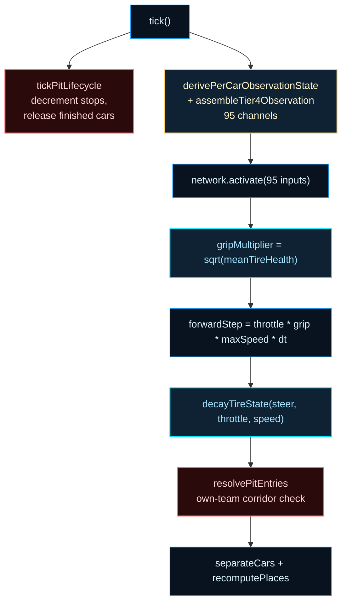

Read the diagram as a single tick's execution order: the pit lifecycle ticks
first (so released cars are free to move), then each car observes the
95-channel vector, runs inference, has its forward progress scaled by the
grip multiplier, suffers tire decay, and finally pit entries are resolved
after all car updates.

### Running a Tier 4 episode from code

The same race-pack runner used by Tier 1 and Tier 2 produces the Tier 4
contract when four controller networks are supplied:

```ts
import {
  createDeterministicRacePack,
  createRaceEpisodeRunner,
} from './workers/simulation-worker/simulation-worker.race-pack.service';
import { createCoevolutionContainer } from './workers/simulation-worker/simulation-worker.coevolution.service';

// 1. Allocate the 2v2 coevolution container with Tier 4 input sizing.
const container = createCoevolutionContainer({
  populationSize: 50,
  rngSeed: 42,
  tier: 4, // resolves to 95-input / 9-output controller networks
});

// 2. Extract the four car genomes (two per team).
const genomes = container.getCarGenomes();
// genomes[0].teamId === 0 (blue), genomes[1].teamId === 0 (blue)
// genomes[2].teamId === 1 (red),  genomes[3].teamId === 1 (red)

// 3. Create the runnable episode with all four controllers.
const snapshot = { snapshotId: 'tier4-demo', generation: 0, networkPayloads: [] };
const runner = createRaceEpisodeRunner(42, snapshot, genomes.map(g => g));

// 4. Step the episode. Each tick: pit lifecycle → observation → inference
//    → grip-scaled movement → tire decay → pit entry resolution.
while (!runner.frame.done && runner.frame.tick < 1800) {
  runner.tick();
}

// 5. Read the packed frame including tire state and pit status.
console.log('Tire health (car 0):', runner.frame.tireState.slice(0, 4));
console.log('Pit status:', runner.frame.pitStatus); // Uint8Array(4)
```

In this snippet:

- `createCoevolutionContainer({ tier: 4 })` allocates four independent
  genomes with 95-input networks. The tier selector resolves the input
  dimension: Tier 3 gets 91 inputs, Tier 4 gets 95.
- `createRaceEpisodeRunner` produces the four-car episode. Each `tick()`
  runs the full Tier 4 loop: pit lifecycle, 95-channel observation,
  inference, grip-scaled forward progress, tire decay, and pit entry
  resolution.
- `runner.frame.tireState` is a `Float32Array` of length `agentCount * 4`
  (FL, FR, RL, RR per car), initialized to `1.0` and decaying over the
  episode.
- `runner.frame.pitStatus` is a `Uint8Array(4)` present only when
  `agentCount >= 4`; `255` in a car slot means that team's pit is empty.

This is the full Tier 4 surface: a 2v2 pack with tire degradation, a grip
multiplier that makes worn tires costly, a deterministic pit lifecycle with
own-team-only entry and four-tick stops, and a 95-channel observation that
exposes per-corner tire health to the controller. Everything the network
needs to discover pit strategy is in the observation and the physics — no
explicit pit command is emitted by the controller.

## Tier 5 3v3 full-team contract

Tier 5 is the first rung with a **full three-car team on each side** — six
cars total. The learning question shifts from "can two teammates coordinate
via radio?" to "can a three-car team specialize into distinct roles —
**queen**, **blocker**, **pacer** — through experience alone?" A two-car team
has only one possible division of labor (lead and support); a three-car team
opens a richer strategic space where one car can fight for the lead while the
other two sacrifice their own finishes to impede the opposing team's queen.

Tier 5 reuses the **95-channel observation** and **9-output controller** from
Tier 4. There are no new sensory channels and no new output channels. The
difference is **radio population**, not vector shape: Tier 4 only filled one
of the three teammate-radio rows (the second teammate) and zero-padded the
rest, while Tier 5 fully populates all three rows because every car has two
teammates plus itself in the shared radio slab. This is competitive
coevolution at full team scale — two independently evolving populations
racing against each other, each trying to discover a team strategy that beats
the other.

### Tier 5 pack layout

The team layout grows from four cars to six:

```ts
const TIER_FIVE_TEAM_LAYOUT = [0, 0, 0, 1, 1, 1]; // three blue, three red
const TIER_FIVE_CAR_COUNT = 6;
```

The coevolution container resolves the controller input dimension based on
the active tier. Tier 5 produces the same 95-input / 9-output controller
network as Tier 4 — the vector shape is identical, only the number of
genomes allocated doubles from four to six:

```ts
const TIER_FIVE_CONTROLLER_INPUT_SIZE = 95;   // same as Tier 4
const TIER_FIVE_CONTROLLER_OUTPUT_SIZE = 9;   // 2 control + 7 radio-write
```

### Tier 5 observation vector

The Tier 5 observation is **byte-stable with Tier 4** — the same 95 channels
in the same order. No channels are added, removed, or reordered:

| Range      | Channels | Content                                                                                   |
| ---------- | -------- | ----------------------------------------------------------------------------------------- |
| `[0..69]`  | 70       | Tier 1 driving baseline (20 scalar + 40 look-ahead + 10 memory)                          |
| `[70..90]` | 21       | Three teammate-radio slots (3 × 7 channels); Tier 5 fully populates all three rows        |
| `[91..94]` | 4        | Own-car tire health `[frontLeft, frontRight, rearLeft, rearRight]`                        |

The critical distinction is in the radio block. The 21 radio channels
(`[70..90]`) are **already part of the 95** — Tier 5 does not add them. In
Tier 3 and Tier 4, only one teammate-radio row carried non-zero data (the
single teammate), and the remaining two rows were zero-padded. In Tier 5,
all three radio rows carry non-zero data because each car has two teammates
plus a self-broadcast slot. A controller network trained at Tier 4 will
produce valid (but under-informed) output at Tier 5 — the extra radio rows
that were previously silent are now populated, and the network must learn to
use them.

### Team radio protocol

The radio field is a **42-float shared slab** — 6 cars × 7 channels per car.
Each car reads its 3 same-team rows × 7 channels = 21 channels and writes
1 row of 7 channels into the slab. In a 3v3 pack, all three teammate-radio
rows carry non-zero data for every car.

The **self-broadcast** mechanism is what distinguishes Tier 5 from Tier 4.
For a 3-car team, the focal car's own state is included as a self-broadcast
slot so all 3 radio rows carry non-zero data. In contrast, 2-car teams
(Tier 3/4) only fill 1 teammate row and zero-pad the remaining rows — the
focal car's own state is already in the driving baseline (`[0..69]`), so
self-broadcast is redundant at smaller team sizes. At Tier 5, the
self-broadcast row gives each car an explicit, normalized view of its own
state alongside its teammates', making the full team state visible in the
radio block.

The 7 channels per slot are:

```
[posX, posY, headingSin, speed, relOffsetX, relOffsetY, relHeadingSin]
```

All values are normalized to `[-1, 1]`. The `relOffset` and `relHeading`
fields are relative to the focal car's own position and heading, so a
teammate directly ahead has `relOffsetY ≈ +1` and a teammate directly behind
has `relOffsetY ≈ -1`.

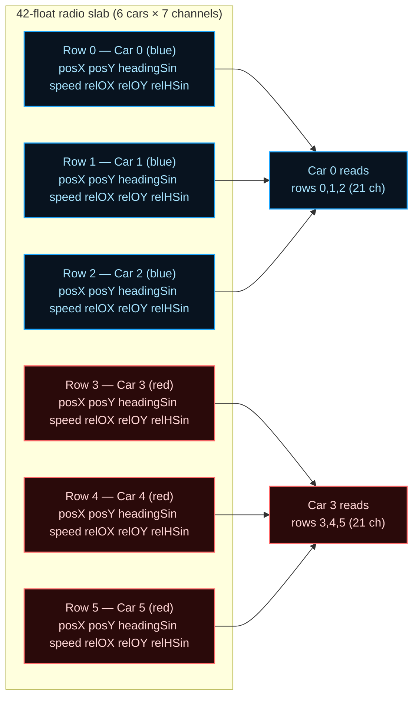

Read the diagram as: the 42-float slab is shared across all six cars. Each
car reads only the three rows belonging to its own team (blue reads rows
0–2, red reads rows 3–5) and writes its own single row into the slab. The
self-broadcast row means a car always sees its own state echoed in the
radio block — useful when the controller needs to compare its own speed and
heading against its teammates' without cross-referencing the driving
baseline.

### Role-divergence observables

Tier 5 introduces **observability-only metrics** that quantify how each
car's individual performance relates to its team's outcome. These metrics
do **not** change fitness or reproduction — they are pure observability,
computed after each race by `computeRoleDivergenceMetrics` in
[`simulation-worker.role-divergence.service.ts`](./workers/simulation-worker/simulation-worker.role-divergence.service.ts).
They exist so that experimenters can measure whether a population is
spontaneously developing role specialization without any explicit reward
for it.

Two metrics are tracked per car:

- **`blockerDelta`**: the leave-one-out contribution to the team's
  best-finishing position. Computed as
  `teamBestWithCar - teamBestWithoutCar`. A non-zero value means the car
  *is* the team's best finisher (the queen) — removing it would worsen the
  team's best position. A zero value means removing the car does not change
  the team's best position, which is the expected signature of a blocker or
  pacer: their contribution is tactical, not positional.
- **`inferredRole`**: a heuristic classification based on within-team
  finishing rank and team outcome:

| Within-team rank | Team outcome | `inferredRole` |
| ---------------- | ------------ | -------------- |
| Best (lowest)    | any          | `queen`        |
| Worst (highest)  | win or tie   | `blocker`      |
| Worst (highest)  | loss         | `undifferentiated` |
| Mid-range        | any          | `pacer`        |

The `queen` is the car with the best (lowest) individual finishing position
on its team. The `blocker` is the worst finisher on a team that won or tied
— the interpretation is that the car sacrificed its own result to impede
the opposing team. The `pacer` is the car in the middle. The
`undifferentiated` label covers the worst finisher on a losing team, where
the sacrifice interpretation does not hold: the car finished last and the
team lost, so no clear tactical role can be inferred.

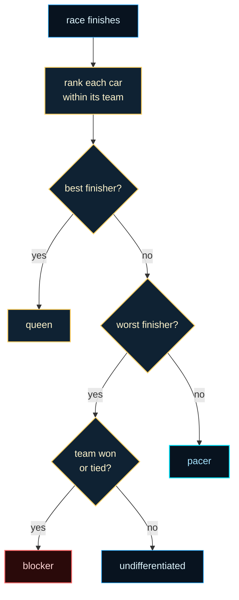

### Queen selection

Tier 5 adds **queen selection**: after each race, the best-finishing car on
each team is selected as the queen, and the remaining team cars become
drones. The queen is the car with the lowest (best) individual finishing
position on its team. This selection is the foundation for polyandric
reproduction, where the queen's genome serves as the template and the
drones contribute genetic material.

Queen selection is implemented by `selectQueenPerTeam` in
[`simulation-worker.coevolution.service.ts`](./workers/simulation-worker/simulation-worker.coevolution.service.ts).
It takes the per-car finishing positions and team assignments and returns
the queen car index for each team.

In the current harness, queen selection is **implemented and
observability-only** — it identifies the queen and records the result, but
does not yet drive reproduction. The actual polyandric reproduction call
that would use the queen's genome as a template and the drones as
contributors is deferred until upstream NGE primitive integration is
complete (see the next subsection).

### Polyandric reproduction (deferred)

Polyandry — where one queen mates with multiple drones — is a mating system
borrowed from biology (see [Polyandry (Wikipedia)](https://en.wikipedia.org/wiki/Polyandry)).
In the racing curriculum it is applied to neuroevolution: the queen's genome
serves as the reproductive template and the drones contribute genetic material,
analogous to the biological pattern but adapted to evolutionary computation.

The NGE core primitive `reproducePolyandric` is available in
[`src/neat/nge-evolution/neat.nge-evolution.reproduction.ts`](../../src/neat/nge-evolution/neat.nge-evolution.reproduction.ts),
and `NgeReproductionPolicy` supports `mode: 'polyandric'` with all required
fields (`polyandricDroneCount`, `polyandricDroneContributionFraction`, and
related parameters). The reproduction function builds one offspring from a
queen DNA template plus optional drone donors, blending genetic material
according to the configured contribution fraction.

However, the **racing benchmark wiring is not yet active**. No racing
worker code calls `reproducePolyandric` at this time. Queen selection is
implemented and runs after each race; the reproduction call that would
consume the queen and drone genomes to produce the next generation is
deferred. Tests for polyandric reproduction in the racing harness are
skipped pending this integration.

The current support status is:

- ✅ `reproducePolyandric` primitive exists in the NGE core.
- ✅ `NgeReproductionPolicy` with `mode: 'polyandric'` is fully specified.
- ✅ `selectQueenPerTeam` identifies queens after each race.
- ✅ `computeRoleDivergenceMetrics` classifies roles for observability.
- ❌ No racing worker code calls `reproducePolyandric` yet.
- ⏸️ Polyandric reproduction tests are skipped pending integration.

No timeline is promised for the remaining wiring. The deferred boundary is
narrow and well-defined: connect `selectQueenPerTeam` output to
`reproducePolyandric` in the coevolution service's generation step.

### Pit status representation (6-car)

The 6-car pack uses an expanded `pitStatus` layout with **stride 3 per
team** instead of the stride-2 layout used by Tier 4:

```ts
pitStatus: Uint8Array([
  teamA_car, teamA_ticks, teamA_waiting,
  teamB_car, teamB_ticks, teamB_waiting,
])
```

- **Car slots** (`[0]` and `[3]`): the car index currently in that team's
  pit, or `255` when no car is pitting.
- **Tick slots** (`[1]` and `[4]`): remaining stop ticks, counting down from
  `4` to `0`.
- **Waiting slots** (`[2]` and `[5]`): reserved for future multi-car pit
  queuing. In the current harness these are always `0` — only one car per
  team can occupy the pit at a time, matching the Tier 4 constraint. The
  slots exist so that a future expansion to queued pit entry can use the
  same frame layout without a breaking change.

The renderer and race-pack runner use a **layout-aware stride**:
`pitStatus.length >= 6 ? 3 : 2`. This means Tier 1–4 frames (4-element
`pitStatus`) continue to use stride 2, while Tier 5 frames (6-element
`pitStatus`) use stride 3. The `pitStatus` field is present whenever
`agentCount >= 4`, so Tier 5 frames always include it.

### Running a Tier 5 episode from code

The same race-pack runner used by Tier 4 produces the Tier 5 contract when
six controller networks are supplied:

```ts
import {
  createDeterministicRacePack,
  createRaceEpisodeRunner,
} from './workers/simulation-worker/simulation-worker.race-pack.service';
import { createCoevolutionContainer } from './workers/simulation-worker/simulation-worker.coevolution.service';
import { computeRoleDivergenceMetrics } from './workers/simulation-worker/simulation-worker.role-divergence.service';

// 1. Allocate the 3v3 coevolution container with Tier 5 input sizing.
const container = createCoevolutionContainer({
  populationSize: 50,
  rngSeed: 42,
  tier: 5, // resolves to 95-input / 9-output controller networks, 6 cars
});

// 2. Extract the six car genomes (three per team).
const genomes = container.getCarGenomes();
// genomes.length === 6 (three blue, three red)
// genomes[0..2].teamId === 0 (blue), genomes[3..5].teamId === 1 (red)

// 3. Create the runnable episode with all six controllers.
const snapshot = { snapshotId: 'tier5-demo', generation: 0, networkPayloads: [] };
const runner = createRaceEpisodeRunner(42, snapshot, genomes.map(g => g));

// 4. Step the episode. Each tick: pit lifecycle (6-element stride)
//    → observation → inference → grip-scaled movement → tire decay
//    → pit entry resolution (6-element stride).
while (!runner.frame.done && runner.frame.tick < 1800) {
  runner.tick();
}

// 5. Read the packed frame including tire state, pit status, and
//    role-divergence observables.
console.log('Tire health (car 0):', runner.frame.tireState.slice(0, 4));
console.log('Pit status:', runner.frame.pitStatus); // Uint8Array(6), stride 3

// 6. Compute role-divergence metrics after the race finishes.
const finishingPositions = Array.from(runner.frame.place);
const teamIds = [0, 0, 0, 1, 1, 1] as const;
const teamScores = [10, 8]; // Team A scored higher (won)
const roleMetrics = computeRoleDivergenceMetrics(
  finishingPositions,
  teamIds,
  teamScores,
);
// roleMetrics[0].inferredRole === 'queen'   (best Team A finisher)
// roleMetrics[1].inferredRole === 'pacer'   (mid Team A finisher)
// roleMetrics[2].inferredRole === 'blocker' (worst Team A finisher, won/tied)
```

In this snippet:

- `createCoevolutionContainer({ tier: 5 })` allocates six independent
  genomes with 95-input networks. The tier selector resolves the input
  dimension: Tier 4 and Tier 5 both get 95 inputs; the difference is the
  number of genomes (4 vs 6) and the fully-populated radio slab.
- `createRaceEpisodeRunner` produces the six-car episode. Each `tick()`
  runs the full Tier 5 loop: pit lifecycle with 6-element stride,
  95-channel observation with all three radio rows populated, inference,
  grip-scaled forward progress, tire decay, and pit entry resolution.
- `runner.frame.tireState` is a `Float32Array` of length `agentCount * 4`
  (FL, FR, RL, RR per car), initialized to `1.0` and decaying over the
  episode.
- `runner.frame.pitStatus` is a `Uint8Array(6)` with stride 3 per team;
  `255` in a car slot means that team's pit is empty.
- `computeRoleDivergenceMetrics` returns one `RoleDivergenceMetric` per car
  with `blockerDelta` and `inferredRole` fields. These are observability
  only — they do not feed back into fitness or reproduction.

### Tier 5 feedback loop

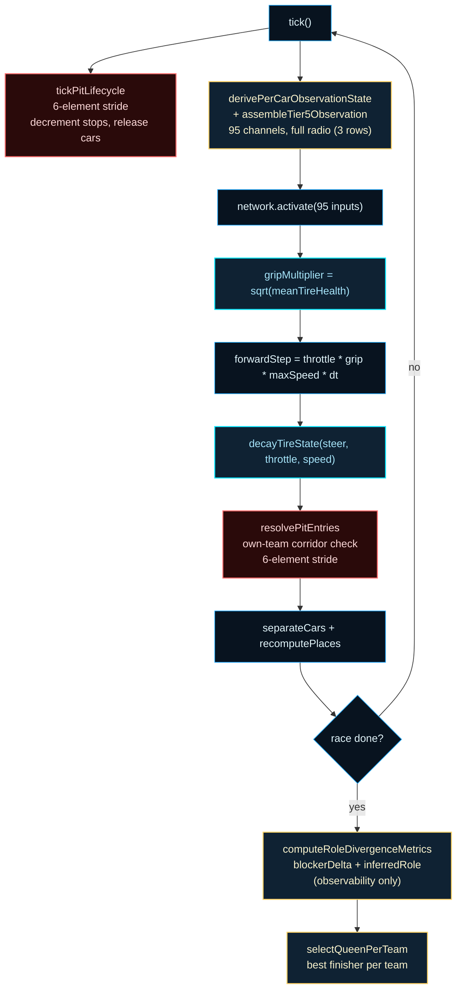

Read the diagram as a single tick's execution order: the pit lifecycle
ticks first with the 6-element stride (so released cars are free to move),
then each car observes the 95-channel vector with all three radio rows
populated, runs inference, has its forward progress scaled by the grip
multiplier, suffers tire decay, and pit entries are resolved with the
6-element stride after all car updates. When the race finishes, the
post-race block runs: `computeRoleDivergenceMetrics` classifies each car's
role for observability, and `selectQueenPerTeam` identifies the queen on
each team — the foundation for polyandric reproduction, which is deferred
but whose selection step is already in place.

This is the full Tier 5 surface: a 3v3 pack with six cars, a 42-float
shared radio slab where every car reads three same-team rows (including
self-broadcast), the same 95-channel observation and 9-output controller as
Tier 4, role-divergence observables that quantify spontaneous
specialization, queen selection that identifies the best finisher per team,
and an expanded 6-element pit status with stride 3 per team. The
polyandric reproduction primitive exists in the NGE core but is not yet
wired into the racing harness — queen selection is implemented, and the
reproduction call is deferred.

## What Each Boundary Protects

### `workers/simulation-worker/`: simulation authority

The worker owns environment state, controller inference, Team A/B population
containers, rolling opponent snapshots, and packed frame production. It is the
runtime core of the benchmark. The host sends typed protocol messages; the
worker answers with `generation-ready` or `race-step` payloads.

### The coevolution contract

[`docs/coevolution-contract.md`](https://github.com/reicek/NeatapticTS/blob/main/examples/racing_curriculum/docs/coevolution-contract.md)
is the canonical reference for the two-population evaluation policy, the
host↔worker message contract, the generation lifecycle, and the extension points.
Read it before modifying any worker service.

### `browser-entry/`: the browser host

The browser entry boundary assembles host elements, canvas rendering, telemetry
panels, and the physics-only worker seam. It does not own the evolution
algorithm. The worker-authoritative protocol is fully typed on both sides, so
the host can advance simulation ticks locally or hand the same work off to the
worker without changing the message contract.

### `environment/`: the racing world

The environment owns car state, physics stepping, tire wear, collision rules,
and the observation vector that feeds each controller. It stays independent of
both rendering and evolution so the same world rules can run in tests, the
worker, or the host.

### `track/`: track generation and sampling

Track generation produces a `TrackSpec` from a seed and viewport; the spline
utilities sample centerline positions and headings for the observation vector.
Keeping geometry separate from environment simulation lets the curriculum vary
track complexity without changing the car model.

### `controller/`: the driving policy

The controller boundary turns environment observations into control outputs
(steer, throttle, brake). It is the place where recurrent or gated controllers
can be swapped in without touching the environment or renderer.

## Two Execution Stories

The same example tells two different runtime stories depending on where you
enter.

### Coevolution story

1. `createCoevolutionContainer` allocates Team A and Team B population handles.
2. The rolling opponent snapshot store freezes a snapshot at generation start.
3. `createDeterministicRacePack` builds a replayable initial frame from the
   snapshot.
4. `createRaceEpisodeRunner` ticks the episode and runs one controller inference
   per car per tick.
5. `resolveTeamFitness` turns finish positions into a team fitness score.
6. Eventually the generation loop selects and evolves both populations.

### Host story

1. `index.html` loads the prebuilt bundle.
2. `browser-entry.ts` exposes the stable browser shell.
3. `host/host.ts` wires DOM regions, canvas sizing, and viewport layout.
4. The host may step the environment locally; the typed worker protocol
   provides the boundary for handing stepping, inference, and evolution
   off to the worker without redesigning the host surface.

The important teaching point is that the host is a consumer of the worker's
output, not a hidden owner of the simulation truth.

## The Most Important Design Bets

Several design choices explain why this folder is shaped the way it is.

### Coevolution only works if the opponent is frozen during evaluation

If the opponent changed while a candidate was being scored, the score would not
compare candidates on the same landscape. The generation barrier and generation
boundary in the snapshot store exist to prevent that mistake.

### Determinism is a fairness requirement, not a nicety

A race pack must produce the same starting conditions for the same inputs.
Without that guarantee, a better Team A score might come from a better starting
position rather than a better controller.

### Authority boundaries survive implementation gaps

The worker-authoritative protocol is fully typed, so host and worker services
can be designed around the intended contract rather than around the seam
currently active.

### Visualization depends on compact snapshots

The renderer reads the same `RacingRenderFrame` packed layout that the worker
would stream. Keeping the snapshot small and typed-array based means the
rendering loop stays cheap even when the simulation is complex.

## References

- Stanley, K. O. & Miikkulainen, R. (2002). _Evolving Neural Networks through
  Augmenting Topologies_. Evolutionary Computation, 10(2), 99–127, 2002.
  ([Wikipedia overview](https://en.wikipedia.org/wiki/Neuroevolution_of_augmenting_topologies))
- Wikipedia contributors. _Coevolution_. Wikipedia.
  https://en.wikipedia.org/wiki/Coevolution (CC BY-SA 4.0).
- Wikipedia contributors. _Finite-state machine_. Wikipedia.
  https://en.wikipedia.org/wiki/Finite-state_machine (CC BY-SA 4.0).
- MDN Web Docs. _Transferable objects_. MDN.
  https://developer.mozilla.org/en-US/docs/Web/API/Web_Workers_API/Transferring_objects
  (licensed under CC BY-SA 2.5 / MIT for code).

## Recommended Reading Order

1. [docs/coevolution-contract.md](https://github.com/reicek/NeatapticTS/blob/main/examples/racing_curriculum/docs/coevolution-contract.md) — the coevolution and protocol contract.
2. [workers/simulation-worker/README.md](./workers/simulation-worker/README.md) — the worker authority boundary.
3. [workers/simulation-worker/simulation-worker.coevolution.service.ts](./workers/simulation-worker/simulation-worker.coevolution.service.ts) — Team A/B container and fitness resolver.
4. [workers/simulation-worker/simulation-worker.opponent-snapshot.service.ts](./workers/simulation-worker/simulation-worker.opponent-snapshot.service.ts) — snapshot barrier and sampling.
5. [workers/simulation-worker/simulation-worker.race-pack.service.ts](./workers/simulation-worker/simulation-worker.race-pack.service.ts) — deterministic packs and transfer lists.
6. [workers/simulation-worker/simulation-worker.evolution.protocol.service.ts](./workers/simulation-worker/simulation-worker.evolution.protocol.service.ts) — protocol FSM router.
7. [browser-entry/browser-entry.ts](./browser-entry/browser-entry.ts) — the current browser host and worker seam.
