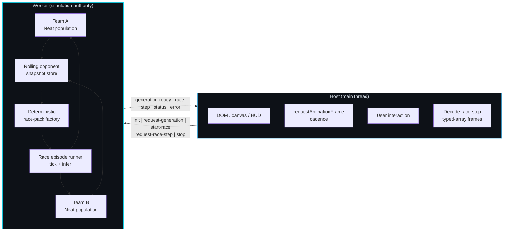
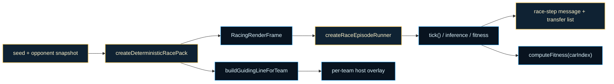

# Racing Curriculum (NeatapticTS)

This folder is the repository's lesson in **competitive coevolution under tight
runtime boundaries**.  It asks a harder systems question than the other flagship
demos: how do you evolve two populations at once, keep their evaluation fair,
run the simulation off the main thread, and stream the result back to the
browser fast enough to render?

The racing benchmark runs two independent NEAT populations — Team A and Team B
— that never share a gene pool.  A Team A candidate is scored by racing it
against a **frozen snapshot** of Team B, and vice versa.  Because the opponent
snapshot is held constant for an entire generation, neither side chases a
moving target inside a single evaluation pass.  That freeze-and-rotate pattern
is the standard coevolution stabilization trick; see
[Coevolution (Wikipedia)](https://en.wikipedia.org/wiki/Coevolution) for the
conceptual background.

The second hard boundary is **host/worker authority**.  The browser host owns DOM,
canvas, HUD, and user interaction.  The worker owns environment state,
controller inference, population containers, opponent snapshots, and packed
frame production.  The contract between them is a typed, forward-only finite-state
machine.  The host requests steps; the worker advances the world and returns
compact typed-array snapshots.  See [Web Workers (MDN)](https://developer.mozilla.org/en-US/docs/Web/API/Web_Workers_API)
for the execution model and [Transferable objects (MDN)](https://developer.mozilla.org/en-US/docs/Web/API/Web_Workers_API/Transferring_objects)
for the zero-copy transfer contract.

This example is intentionally split into small, teachable boundaries:
environment simulation, track generation, controller design, renderer, worker
protocol, coevolution container, race-pack construction, and opponent snapshot
policy.  Each boundary owns one slice of the problem so the reader can change
one policy without misunderstanding the rest of the system.

If Flappy Bird is a fast control-systems lesson and ASCII Maze is a compact
decision-making lesson, Racing Curriculum is the runtime-authority and
coevolution lesson.

## The Core Idea In One Glance

The architectural rule is simple: the worker owns simulation truth, the host
owns presentation, and both populations are evaluated against frozen snapshots
of the other side.



Read the diagram as two connected stories:

- inside the worker, two populations feed a frozen snapshot pool that drives a
  deterministic race-pack and episode runner;
- across the thread boundary, the host only requests work and renders the
  snapshots it receives back.

That split is the key to understanding why this folder teaches more than a
single-population racing demo could.

## Why This Example Holds Up Under Coevolution

| Concept | Why it matters here |
| --- | --- |
| Two independent populations | Team A and Team B cannot share species or fitness history, or the coevolution dynamic collapses into ordinary single-population optimization. |
| Frozen opponent snapshots | Holding the opponent constant during one generation makes fitness comparisons fair and prevents an unstable arms race inside the evaluation window. |
| Deterministic race packs | Identical seed + snapshot always produce identical starting conditions, so comparative fitness claims are not confounded by random track placement. |
| Zero-copy transfer lists | Streaming packed typed arrays keeps the worker→host channel cheap enough for 60 Hz rendering without copying large state objects. |
| Forward-only protocol FSM | Strict phase-gated messages keep the host from accidentally driving simulation ticks or sending commands at the wrong lifecycle moment. |

## Choose Your Route

Different readers arrive with different questions. Use the route that matches
yours.

| If you want to... | Start here | Then read |
| --- | --- | --- |
| Understand the coevolution contract | [docs/coevolution-contract.md](https://github.com/reicek/NeatapticTS/blob/main/examples/racing_curriculum/docs/coevolution-contract.md) | [workers/simulation-worker/README.md](./workers/simulation-worker/README.md) |
| Wire or read the host/worker protocol | [workers/simulation-worker/simulation-worker.evolution.types.ts](./workers/simulation-worker/simulation-worker.evolution.types.ts) | [workers/simulation-worker/simulation-worker.evolution.protocol.service.ts](./workers/simulation-worker/simulation-worker.evolution.protocol.service.ts) |
| Add a real NEAT population loop | [workers/simulation-worker/simulation-worker.coevolution.service.ts](./workers/simulation-worker/simulation-worker.coevolution.service.ts) | [docs/coevolution-contract.md](https://github.com/reicek/NeatapticTS/blob/main/examples/racing_curriculum/docs/coevolution-contract.md) |
| Understand opponent snapshot policy | [workers/simulation-worker/simulation-worker.opponent-snapshot.service.ts](./workers/simulation-worker/simulation-worker.opponent-snapshot.service.ts) | [docs/coevolution-contract.md](https://github.com/reicek/NeatapticTS/blob/main/examples/racing_curriculum/docs/coevolution-contract.md) |
| Build or inspect a deterministic race pack | [workers/simulation-worker/simulation-worker.race-pack.service.ts](./workers/simulation-worker/simulation-worker.race-pack.service.ts) | [workers/simulation-worker/simulation-worker.snapshot.utils.ts](./workers/simulation-worker/simulation-worker.snapshot.utils.ts) |
| Understand the browser host | [browser-entry/browser-entry.ts](./browser-entry/browser-entry.ts) | [browser-entry/host/host.ts](./browser-entry/host/host.ts) |
| Run the browser demo | [index.html](./index.html) | [browser-entry/browser-entry.ts](./browser-entry/browser-entry.ts) |
| See the whole example as a system | this README | [docs/coevolution-contract.md](https://github.com/reicek/NeatapticTS/blob/main/examples/racing_curriculum/docs/coevolution-contract.md) and [workers/simulation-worker/README.md](./workers/simulation-worker/README.md) |

## Run The Example

From the repo root:

### Build the browser bundle

```bash
npm run build:racing-curriculum
```

This produces `docs/assets/racing-curriculum.bundle.js`.

### Refresh docs and copied example assets

```bash
npm run docs
```

Then open `docs/examples/racing_curriculum/index.html` from a local server, or
run `npm run start:local-server` and navigate to the example path.

Important browser note:

- `index.html` is a lightweight shell that loads the prebuilt bundle from `docs/assets`.
- the real host orchestration source lives in [browser-entry/browser-entry.ts](./browser-entry/browser-entry.ts).
- after browser-code changes, run `npm run build:racing-curriculum` or `npm run docs` before expecting the hosted page to reflect them.

Node engine requirement in this repo is `>=22`.

## Tier 1 single-agent usage contract

Tier 1 is the narrowest rung of the racing ladder: one car per team, no radio,
no pit stops, fresh tires only, and a simple medium track.  It exists to answer
the most basic curriculum question: can a single NEAT controller learn to drive
a closed circuit at all?  By keeping both teams to a single agent, the first
learning problem is freed from teammate coordination, tire budgets, and pit
strategy.

The race surface is a 1v1 coevolutionary duel.  Team A and Team B each evolve
one controller; during a generation, every Team A candidate is evaluated against
a frozen snapshot of Team B, and vice versa.  The deterministic race pack
guarantees that the same seed and the same opponent snapshot always produce the
same starting frame, so fitness comparisons are fair and episodes are replayable.
For the coevolution background, see
[docs/coevolution-contract.md](docs/coevolution-contract.md).

The Tier 1 controller contract is intentionally small:

- **Observation vector:** 70 normalized channels.
  - 20 scalar channels describing the car state and immediate driving context.
  - 40 channels for five look-ahead track segments.
  - 10 recurrent memory-trace channels.
- **Action vector:** 2 channels — throttle and steer.
- **Guidance:** a faint optimal-line overlay is rendered as a curriculum scaffold,
  but the controller is free to ignore it.  Tier 2 turns the overlay off entirely.

The host renders two per-team guiding lines so the viewer can see each agent's
intended lane: Team A in cyan and Team B in magenta.  These lines are generated
with `buildGuidingLineForTeam` and are not part of the zero-copy transfer list;
they are reconstructed locally from the same deterministic track geometry.

### Tier 1 runtime story



### Running a Tier 1 episode from code

The same contract used by the browser demo can be exercised directly:

```ts
import {
  createDeterministicRacePack,
  createRaceEpisodeRunner,
} from './workers/simulation-worker/simulation-worker.race-pack.service';
import { buildGuidingLineForTeam } from './renderer/racing.renderer';
import { generateTrack } from './track/track.generator';

const seed = 42;
const snapshot = {
  snapshotId: 'tier1-demo',
  generation: 0,
  networkPayloads: [],
};

// 1. Build a packed starting frame for the host renderer.
const pack = createDeterministicRacePack(seed, snapshot);

// 2. Two minimal controllers: one output = throttle [0, 1].
const networks = [
  { activate: () => [0.75] }, // team A: steady pace
  { activate: () => [1.0] },  // team B: full throttle
];

// 3. Create the runnable episode.
const runner = createRaceEpisodeRunner(seed, snapshot, networks);

// 4. Step physics and inference until one car finishes a lap or time expires.
while (!runner.frame.done && runner.frame.tick < 300) {
  runner.tick();
}

// 5. Read comparative fitness and build a transferable worker message.
console.log('Team A fitness:', runner.computeFitness(0));
console.log('Team B fitness:', runner.computeFitness(1));
const { frame, transferList } = runner.createRaceStepMessage();
// worker.postMessage({ type: 'race-step', frame }, transferList);

// 6. Build per-team guiding lines for the host renderer.
const trackSpec = generateTrack({ seed, layoutVersion: 1, sizeBucket: 'medium' });
const teamALine = buildGuidingLineForTeam(trackSpec, 0);
const teamBLine = buildGuidingLineForTeam(trackSpec, 1);
```

In this snippet:

- `createDeterministicRacePack` builds the shared initial frame.
- `createRaceEpisodeRunner` creates the runnable episode; each network receives
  `[carX, carY, carHeading, progress01, tick]` on every `tick()` and should
  return at least one output for throttle.
- `computeFitness` returns a lap-time or progress-based score.
- `createRaceStepMessage` produces the transferable frame a worker would stream
  to the host.
- `buildGuidingLineForTeam` gives the host renderer a dedicated lane marker per
  team.

This is the full Tier 1 surface: two single-agent controllers, a deterministic
track, a frozen opponent snapshot slot, and a renderable guiding line.
Everything else in the curriculum is layered on top of this contract.

## What Each Boundary Protects

### `workers/simulation-worker/`: simulation authority

The worker owns environment state, controller inference, Team A/B population
containers, rolling opponent snapshots, and packed frame production.  It is the
runtime core of the benchmark.  The host sends typed protocol messages; the
worker answers with `generation-ready` or `race-step` payloads.

### The coevolution contract

[`docs/coevolution-contract.md`](https://github.com/reicek/NeatapticTS/blob/main/examples/racing_curriculum/docs/coevolution-contract.md)
is the canonical reference for the two-population evaluation policy, the
host↔worker message contract, the generation lifecycle, and the extension points.
Read it before modifying any worker service.

### `browser-entry/`: the browser host

The browser entry boundary assembles host elements, canvas rendering, telemetry
panels, and the physics-only worker seam.  It does not own the evolution
algorithm.  The worker-authoritative protocol is fully typed on both sides, so
the host can advance simulation ticks locally today and later hand the same
work off to the worker without changing the message contract.

### `environment/`: the racing world

The environment owns car state, physics stepping, tire wear, collision rules,
and the observation vector that feeds each controller.  It stays independent of
both rendering and evolution so the same world rules can run in tests, the
worker, or the host.

### `track/`: track generation and sampling

Track generation produces a `TrackSpec` from a seed and viewport; the spline
utilities sample centerline positions and headings for the observation vector.
Keeping geometry separate from environment simulation lets the curriculum vary
track complexity without changing the car model.

### `controller/`: the driving policy

The controller boundary turns environment observations into control outputs
(steer, throttle, brake).  It is the place where recurrent or gated controllers
can be swapped in without touching the environment or renderer.

## Two Execution Stories

The same example tells two different runtime stories depending on where you
enter.

### Coevolution story

1. `createCoevolutionContainer` allocates Team A and Team B population handles.
2. The rolling opponent snapshot store freezes a snapshot at generation start.
3. `createDeterministicRacePack` builds a replayable initial frame from the
   snapshot.
4. `createRaceEpisodeRunner` ticks the episode and runs one controller inference
   per car per tick.
5. `resolveTeamFitness` turns finish positions into a team fitness score.
6. Eventually the generation loop selects and evolves both populations.

### Host story

1. `index.html` loads the prebuilt bundle.
2. `browser-entry.ts` exposes the stable browser shell.
3. `host/host.ts` wires DOM regions, canvas sizing, and viewport layout.
4. The host currently steps the environment locally; the typed worker protocol
   provides the boundary for later handing stepping, inference, and evolution
   off to the worker without redesigning the host surface.

The important teaching point is that the host is a consumer of the worker's
output, not a hidden owner of the simulation truth.

## The Most Important Design Bets

Several design choices explain why this folder is shaped the way it is.

### Coevolution only works if the opponent is frozen during evaluation

If the opponent changed while a candidate was being scored, the score would not
compare candidates on the same landscape.  The generation barrier and generation
boundary in the snapshot store exist to prevent that mistake.

### Determinism is a fairness requirement, not a nicety

A race pack must produce the same starting conditions for the same inputs.
Without that guarantee, a better Team A score might come from a better starting
position rather than a better controller.

### Authority boundaries survive implementation gaps

The worker-authoritative protocol is fully typed before it is fully wired.  That
lets the host and worker services be designed around the intended contract,
rather than around whatever seam happens to be running today.

### Visualization depends on compact snapshots

The renderer reads the same `RacingRenderFrame` packed layout that the worker
would stream.  Keeping the snapshot small and typed-array based means the
rendering loop stays cheap even when the simulation is complex.

## References

- Stanley, K. O. & Miikkulainen, R. (2002). *Evolving Neural Networks through
  Augmenting Topologies*. Neural Computation, 10(1), 99–127.
  ([Wikipedia overview](https://en.wikipedia.org/wiki/Neuroevolution_of_augmenting_topologies))
- Wikipedia contributors. *Coevolution*. Wikipedia.
  https://en.wikipedia.org/wiki/Coevolution (CC BY-SA 4.0).
- Wikipedia contributors. *Finite-state machine*. Wikipedia.
  https://en.wikipedia.org/wiki/Finite-state_machine (CC BY-SA 4.0).
- MDN Web Docs. *Transferable objects*. MDN.
  https://developer.mozilla.org/en-US/docs/Web/API/Web_Workers_API/Transferring_objects
  (licensed under CC BY-SA 2.5 / MIT for code).

## Recommended Reading Order

1. [docs/coevolution-contract.md](https://github.com/reicek/NeatapticTS/blob/main/examples/racing_curriculum/docs/coevolution-contract.md) — the coevolution and protocol contract.
2. [workers/simulation-worker/README.md](./workers/simulation-worker/README.md) — the worker authority boundary.
3. [workers/simulation-worker/simulation-worker.coevolution.service.ts](./workers/simulation-worker/simulation-worker.coevolution.service.ts) — Team A/B container and fitness resolver.
4. [workers/simulation-worker/simulation-worker.opponent-snapshot.service.ts](./workers/simulation-worker/simulation-worker.opponent-snapshot.service.ts) — snapshot barrier and sampling.
5. [workers/simulation-worker/simulation-worker.race-pack.service.ts](./workers/simulation-worker/simulation-worker.race-pack.service.ts) — deterministic packs and transfer lists.
6. [workers/simulation-worker/simulation-worker.evolution.protocol.service.ts](./workers/simulation-worker/simulation-worker.evolution.protocol.service.ts) — protocol FSM router.
7. [browser-entry/browser-entry.ts](./browser-entry/browser-entry.ts) — the current browser host and worker seam.
