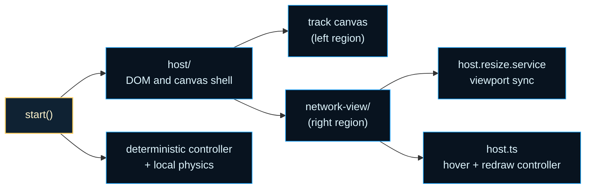
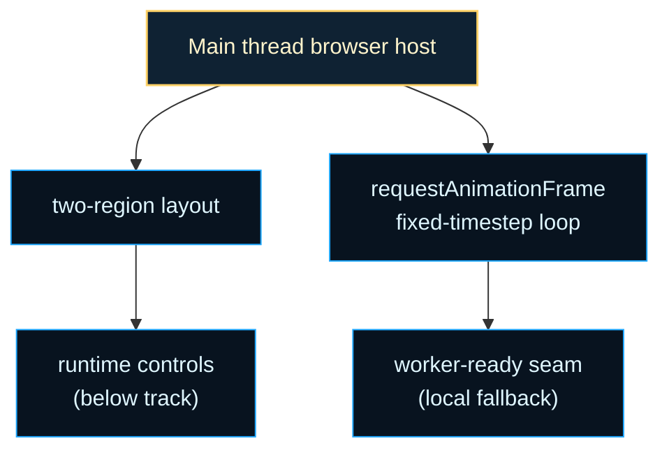

# browser-entry

Racing curriculum browser shell.

This folder is the browser-side presentation layer for the racing curriculum.
It builds a two-region DOM host — track canvas on the left and a focused
controller network view on the right — and runs the rendering and control
loop. Runtime controls live below the track, inside the canvas region. The
host owns only DOM regions and drawing; simulation stepping and controller
inference are driven by local services that mirror the worker-authoritative
protocol defined in
{@link ../workers/simulation-worker/simulation-worker.evolution.types.ts}.

The layout intentionally mirrors the Flappy Bird parity shape: a left canvas
region, a right sidebar network-visualizer region, and no separate bottom
visualizer strip. The right sidebar routes through the shared Flappy network
visualizer via the racing adapter in `network-view/`; the host owns hover
state, resolved-frame caching, and `installRacingNetworkResize` viewport sync.

Read this boundary as the browser-side answer to one practical question:
how do you inspect a learned racing controller in the browser without letting
DOM concerns leak into physics or evolution? The answer is a thin host that
owns stable regions and rendering, while the controller and simulation state
are passed in as plain data.





For the browser execution model, see
[Web Workers (MDN)](https://developer.mozilla.org/en-US/docs/Web/API/Web_Workers_API)
and
[Transferable objects (MDN)](https://developer.mozilla.org/en-US/docs/Web/API/Web_Workers_API/Transferring_objects).
For the fixed-timestep game-loop pattern, see
[Fix Your Timestep! (Gaffer On Games)](https://gafferongames.com/post/fix_your_timestep/).

Example:

```ts
import { start } from './browser-entry/browser-entry';

const handle = await start('racing-curriculum-output');
// Later: handle.stop();
```

## browser-entry/browser-entry.ts

### createCurriculumEnvironmentState

```ts
createCurriculumEnvironmentState(
  trackSpec: TrackSpec,
  curriculumTier: CurriculumTier,
): EnvironmentState
```

Creates the tier-aware starting environment state for the browser shell.

Parameters:

- `trackSpec` - Frozen track specification for the current tier.
- `curriculumTier` - Active curriculum tier.

Returns: Environment state seeded with the tier-appropriate packed roster.

### createCurriculumEpisodeState

```ts
createCurriculumEpisodeState(
  curriculumTier: CurriculumTier,
  trackViewport: TrackGenerationViewport | undefined,
): CurriculumEpisodeState
```

Creates the tier-aware track and environment state used by the browser shell.

Parameters:

- `curriculumTier` - Active curriculum tier.
- `trackViewport` - Optional canvas-aware viewport used for track shaping.

Returns: Frozen track spec plus the matching environment roster for that tier.

### createDeterministicRacingControllerNetwork

```ts
createDeterministicRacingControllerNetwork(
  observationTier: SupportedObservationTier,
): default
```

Creates a small deterministic public network that drives the solo browser harness.

Returns: Deterministically parameterized controller network.

### CurriculumTeamIndex

Team index for the browser-local race pack grid.

### CurriculumTier

Curriculum tier contract from the racing plan ladder.

### RacingCurriculumRunHandle

Public run handle for the racing curriculum browser shell.

Returned by `start(...)`. Use `stop()` to cancel the animation loop; await
`done` to observe clean teardown.

### RacingCurriculumStartOptions

Options accepted by {@link start} to override the default curriculum tier.

The browser harness defaults to Tier 1 (two-car 1v1 pack). Callers that need
a higher-tier pack — for example Tier 3 (four-car 2v2) — pass `{ tier: 3 }`
so the host builds the correct roster, controller map, and observation tier
before the animation loop begins.

### resolveCurriculumTierFromOptions

```ts
resolveCurriculumTierFromOptions(
  options: RacingCurriculumStartOptions | undefined,
): CurriculumTier
```

Resolve the curriculum tier from caller-provided start options.

Falls back to {@link DEFAULT_CURRICULUM_TIER} when the caller omits `tier`
or passes a value outside the valid `CurriculumTier` range.

Parameters:

- `options` - Caller options passed to {@link start} .

Returns: The validated curriculum tier to launch.

### resolveNetworkHudStatus

```ts
resolveNetworkHudStatus(
  adaptationEnabled: boolean,
  recentTrend: string,
): string
```

Resolves the short status label shown in the network panel HUD strip.

Parameters:

- `adaptationEnabled` - Whether runtime adaptation is currently active.
- `recentTrend` - Latest improvement trend telemetry value.

Returns: Uppercase status label.

### resolveTierPromotionFromLapCount

```ts
resolveTierPromotionFromLapCount(
  currentTier: CurriculumTier,
  completedLaps: number,
): { nextTier: CurriculumTier; didAdvance: boolean; remainingLaps: number; }
```

Applies the racing-curriculum fallback promotion rule:
advance one tier whenever the winner completes at least three laps.

Parameters:

- `currentTier` - Active curriculum tier.
- `completedLaps` - Completed laps within the current tier race window.

Returns: Promotion decision with next tier and remaining lap carry.

### resolveTrackSizeBucketForCurriculumTier

```ts
resolveTrackSizeBucketForCurriculumTier(
  curriculumTier: CurriculumTier,
): TrackSizeBucket
```

Resolves the course width bucket for a curriculum tier.

Tier 4 and above use the large course so the multi-agent pack has enough
lateral room to read clearly in the browser demo.

Parameters:

- `curriculumTier` - Active curriculum tier.

Returns: Track size bucket for the tier.

### stabilizeCurriculumTierTireGrip

```ts
stabilizeCurriculumTierTireGrip(
  envState: EnvironmentState,
  curriculumTier: CurriculumTier,
): EnvironmentState
```

Returns the stepped environment state without forcing tire-health overrides.

The browser shell now keeps live tire wear untouched so renderer corner colors
can reflect the active simulation for every curriculum tier.

Parameters:

- `envState` - Newly stepped environment state.
- `curriculumTier` - Active curriculum tier.

Returns: Unmodified stepped environment state.

### start

```ts
start(
  container: string | HTMLElement,
  options: RacingCurriculumStartOptions | undefined,
): Promise<RacingCurriculumRunHandle>
```

Starts the Tier 0 racing curriculum browser demo.

Sets up the two-region layout created by {@link createRacingHost} — a track
canvas on the left and a focused-controller network view on the right —
generates a deterministic track, and launches a `requestAnimationFrame`
animation loop with fixed-timestep physics driven by a deterministic NGE
controller network.

Runtime controls live below the track, inside the canvas region. The network
sidebar stays in sync with the viewport through
{@link installRacingNetworkResize} and is redrawn from the shared
{@link drawRacingNetworkVisualization} racing adapter.

Parameters:

- `container` - Host element or element id.
- `options` - Optional launch configuration; `tier` overrides the default
  curriculum tier so callers can start directly at Tier 3 (four-car 2v2) or
  higher without waiting for auto-promotion.

Returns: Lightweight run handle.

Examples:

```ts
const handle = await start('racing-curriculum-output');
// Later: handle.stop();
```

```ts
const handle = await start(document.getElementById('racing-output')!);
console.log(handle.isRunning);
handle.stop();
await handle.done;
```

```ts
// Launch directly at Tier 3 (four-car 2v2 pack).
const handle = await start(host, { tier: 3 });
handle.stop();
```

### SupportedObservationTier

Observation tier supported by the owner-local controller seam.

### TEAM_BLUE_INDEX

Team slot index reserved for the blue (inner-lane) team.
Exported so renderer and observation contracts can agree on the red/blue
baseline without magic numbers.

### TEAM_RED_INDEX

Team slot index reserved for the red (outer-lane) team.
Exported alongside {@link TEAM_BLUE_INDEX} to keep Tier 1/Tier 2 color and
lane assignments explicit and deterministic.

### TelemetryPanelNodes

Live-updating text node references for the telemetry panel.

### TrackSizeBucket

Track bucket used by the tier-aware browser track generator.
