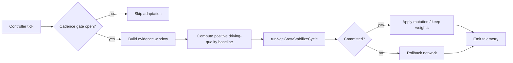

# controller

Racing-curriculum runtime adaptation engine.

Sequences one NGE grow-stabilize cycle per controller tick. It converts
composite driving-quality signals into scalar scores, decides whether the
controller network should grow new structure or stabilize existing weights,
and routes the resulting mutations back to the live network.

The engine is deliberately decoupled from the simulation worker so the same
adaptation policy can run in the browser host, in a worker, or in unit tests.
All demo-specific knowledge lives here; the core `runNgeGrowStabilizeCycle`
only sees plain numeric score history and a mutable network.

## Score-space invariant

The grow-stabilize cycle commits a weight variant only when
`bestVariantScore > baselineScore + threshold`. That inequality is only
meaningful when both scores share the same units and direction. The default
variant scorer returns negative mean-squared-error against a target vector,
while the racing baseline is a positive driving-quality score. This engine
therefore injects a racing-specific `VariantScorer` that collapses the
2-D controller output `[throttle, steering]` to a scalar and returns a
positive quality score in the same space as the baseline.



## Background reading

- NEAT and topology-evolving neuroevolution:
  K. O. Stanley and R. Miikkulainen, "Evolving Neural Networks through
  Augmenting Topologies," *Evolutionary Computation*, vol. 10, no. 2,
  pp. 99-127, 2002.
  [NEAT publications](https://nn.cs.utexas.edu/?neat-papers)
- Growth/stabilization as an explore–exploit tradeoff:
  [Wikipedia — Exploration–exploitation dilemma](https://en.wikipedia.org/wiki/Exploration%E2%80%93exploitation_dilemma)
- Mean squared error:
  [Wikipedia — Mean squared error](https://en.wikipedia.org/wiki/Mean_squared_error)

## controller/nge.controller.ts

### clampControlValue

```ts
clampControlValue(
  value: number,
): number
```

Clamps controller outputs into the accepted environment range.

Parameters:
- `value` - Raw controller output.

Returns: Value clamped to [-1, 1].

### createNgeController

```ts
createNgeController(
  network: RacingControllerNetwork,
  options: NgeControllerOptions,
): NgeController
```

Creates the owner-local NGE controller wrapper around the public `activate(...)`
inference surface.

Parameters:
- `network` - Public network object that exposes `activate(...)`.
- `options` - Optional tier and radio-channel overrides.

Returns: Stateful controller that maps network outputs to throttle and steer.

### createSingleCarRadioChannel

```ts
createSingleCarRadioChannel(
  radioDim: number,
): SingleCarRadioChannel
```

Creates the owner-local single-car radio seam used by Tier 2 self-monitoring.

Parameters:
- `radioDim` - Number of channels retained in the radio buffer.

Returns: Read/write self-monitoring radio channel.

### NgeController

Public controller surface consumed by the browser harness.

### NgeControllerOptions

Runtime options for the owner-local NGE controller seam.

All fields are optional. Tier 1 is the default; providing `radioChannel`
and `radioDim` enables the degenerate single-car self-monitoring path used
by Tier 2.

### NgeControllerTickEvidence

Tier-guide evidence sampled from one controller tick.

### NgeControllerTickResult

Controller tick result including control and adaptation evidence.

### normalizeControllerOutputs

```ts
normalizeControllerOutputs(
  controllerOutputs: number | readonly number[],
): readonly number[]
```

Normalizes raw network outputs into a flat, finite array.

Tier 1 expects at least two control outputs; Tier 2 expects nine outputs
(throttle, steer, plus seven self-radio write channels). The array is
clamped to finite values so downstream splitting stays safe regardless of
network width.

Parameters:
- `controllerOutputs` - Raw network output.

Returns: Finite controller output vector.

### prepareObservationState

```ts
prepareObservationState(
  envState: RacingObservationState,
  controllerTier: ObservationTier,
  radioChannel: SingleCarRadioChannel,
): RacingObservationState
```

Enriches the environment snapshot with the current self-radio field when Tier 2
is active.

Parameters:
- `envState` - Current environment snapshot.
- `controllerTier` - Active controller tier.
- `radioChannel` - Single-car self-monitoring seam.

Returns: Observation-ready environment snapshot.

### RacingControllerNetwork

Public network surface required by the owner-local NGE controller seam.

### resolveGuidanceAlphaForTier

```ts
resolveGuidanceAlphaForTier(
  tier: 0 | 1 | 2,
): number
```

Resolves the optimal-line overlay alpha for each curriculum tier.

- `0` — full overlay (alpha 1.0); used for the scripted baseline before NGE
  control is active.
- `1` — faint overlay (alpha 0.35); keeps a subtle optimal-line hint while
  the solo NGE driver learns.
- `2` — overlay off (alpha 0); the network must self-navigate without the
  hint once the radio seam is live.

Parameters:
- `tier` - Curriculum tier index (0 = scripted baseline, 1 = solo NGE, 2 = radio-augmented).

Returns: Overlay alpha in [0, 1].

### resolveSelfMonitoringPayload

```ts
resolveSelfMonitoringPayload(
  envState: RacingObservationState,
): Float32Array<ArrayBufferLike>
```

Builds the seven-channel self-monitoring payload consumed by the Tier 2 radio seam.

Parameters:
- `envState` - Current environment snapshot.

Returns: Ordered seven-channel self-monitoring payload.

### resolveTickEvidence

```ts
resolveTickEvidence(
  observationVector: Float32Array<ArrayBufferLike>,
): NgeControllerTickEvidence
```

Extracts Tier 1 center-guide evidence channels from one normalized observation vector.

Parameters:
- `observationVector` - Active normalized observation vector.

Returns: Lateral error, heading alignment, and combined guidance-need signal.

### SingleCarRadioChannel

Mutable self-radio seam used by Tier 2 single-car self-monitoring.

## controller/runtime.adaptation.ts

### buildCandidateScoreWindow

```ts
buildCandidateScoreWindow(
  network: default,
  evidenceWindow: readonly (number | RacingQualitySignal)[],
): number[]
```

Build a fresh candidate score window from the post-mutation network's
forward-pass outputs.

Unlike the shared {@link RuntimeAdaptationTickInput.scoreHistory} (which
represents historical driving quality and is identical for both baseline
and candidate evaluations), this window is derived by activating the
post-mutation network on sample observations from the evidence window and
converting each output vector into a scalar quality score.  This ensures
the candidate score reflects the actual behavioral impact of the structural
mutation, not historical performance.

Each output vector is reduced to a scalar by taking the mean of its
absolute activation values.  A mutation that disrupts driving behavior
produces different activation magnitudes, yielding a different candidate
score window and therefore a different candidate score — even when the
historical scoreHistory is unchanged.

Parameters:
- `network` - Post-mutation candidate network to evaluate.
- `evidenceWindow` - Filtered rolling score history used to derive
sample observations for the forward passes.

Returns: Array of scalar quality scores, one per sample observation.

### buildGrowthBudget

```ts
buildGrowthBudget(
  network: default,
  limits: RuntimeAdaptationLimits,
): NgeGrowthBudget
```

Build a growth budget from the runtime limits and live network.

Parameters:
- `network` - Live controller network.
- `limits` - Runtime adaptation limits.

Returns: NGE growth budget for the lifecycle apply phase.

### buildModuleMetricsSnapshot

```ts
buildModuleMetricsSnapshot(
  network: default,
  evidenceWindow: readonly (number | RacingQualitySignal)[],
): NgeModuleMetricsSnapshot
```

Build a module metrics snapshot from the runtime evidence window.

Parameters:
- `network` - Live controller network.
- `evidenceWindow` - Filtered rolling score history.

Returns: NGE module metrics for the lifecycle focus scorer.

### buildPruneBudget

```ts
buildPruneBudget(
  network: default,
): NgePruneBudget
```

Build a prune budget from the live network.

Parameters:
- `network` - Live controller network.

Returns: NGE prune budget for the lifecycle apply phase.

### collectForwardPassOutputs

```ts
collectForwardPassOutputs(
  network: default,
  scoreHistory: readonly (number | RacingQualitySignal)[],
): number[][]
```

Collects forward-pass outputs from the network by activating it on sample
observations drawn from the score history.  For numeric entries the scalar
is repeated to fill the input vector; for composite signals the five
signal fields are tiled or truncated to the input size.

Parameters:
- `network` - Candidate network to activate.
- `scoreHistory` - Rolling score window used to derive observations.

Returns: Array of output vectors, one per sample observation.

### createPerCarAdaptationEngines

```ts
createPerCarAdaptationEngines(
  carCount: number,
  options: RuntimeAdaptationEngineOptions,
): Map<number, RuntimeAdaptationEngine>
```

Creates one independent runtime adaptation engine per car index.

Each car in a multi-car racing simulation maintains its own adaptation
state, cooldowns, and cadence boundaries.  This factory creates a
`Map<number, RuntimeAdaptationEngine>` keyed by car index (0 to
`carCount - 1`) where every engine has fully independent closure-scoped
state — no shared mutable state across cars.

Parameters:
- `carCount` - Number of cars to create engines for.
- `options` - Optional engine options applied identically to every car's engine.

Returns: Map keyed by car index of independent adaptation engines.

Example:

```ts
const engines = createPerCarAdaptationEngines(3, {
  limits: { mutationCooldownTicks: 100 },
});
const car0Engine = engines.get(0); // independent state
const car1Engine = engines.get(1); // independent state
```

### createRuntimeAdaptationEngine

```ts
createRuntimeAdaptationEngine(
  options: RuntimeAdaptationEngineOptions,
): RuntimeAdaptationEngine
```

Creates a reusable per-tick adaptation engine for racing runtime loops.

The engine sequences one NGE grow-stabilize cycle per tick. It enforces a
configurable cadence policy so adaptation attempts do not fire on every tick,
applies a rollback cooldown after rejected candidates, and respects a
growth throttle that slows structural mutation as the network grows. The
growth-phase commit decision trusts the grow-stabilize cycle's own commit
flag, while the engine adds safety-limit checks and an unconditional
first-growth path so a brand-new network cannot stall.

When an `accelerationConfig` is supplied, variant counts are forwarded to the
grow-stabilize cycle's parallel evaluator. The stabilization phase caps the
evaluated variant count to `NGE_GROW_STABILIZE_STABILIZATION_VARIANT_COUNT`
(32 by default) regardless of the acceleration configuration, while the
growth-phase variant count follows the acceleration configuration's stage
limits.

A racing-specific `VariantScorer` is injected into the grow-stabilize
cycle as `scoreFn` so the stabilization baseline and variant scores share the
same positive driving-quality score space. Without that alignment, the commit
inequality `bestScore > baselineScore + threshold` compares incommensurate
values (for example, negative MSE against a positive quality score) and
stabilization commits cannot occur.

Parameters:
- `options` - Optional cadence, bounds, evaluation policy, and
acceleration configuration.

Returns: Stateful runtime adaptation engine.

### detectScoreWindowOscillation

```ts
detectScoreWindowOscillation(
  scores: readonly (number | RacingQualitySignal)[],
): number
```

Detects score-window oscillation from a window of scalar scores or quality
signals.  The series is considered oscillating when the number of direction
changes (peaks or troughs) exceeds a length-scaled threshold.

Parameters:
- `scores` - Recent scores in chronological order.

Returns: Oscillation metric in [0, 1]; 0 means stable scores and values near
1 indicate strong up/down reward swings.

### detectSteeringOscillation

```ts
detectSteeringOscillation(
  angles: readonly number[],
): number
```

Detects steering oscillation from a window of steering angles.  A series is
considered oscillating when the number of sign changes exceeds a small,
length-scaled threshold and the mean steering magnitude is above a deadband,
which catches aggressive zig-zags without penalizing gentle corrections or
legitimate S-curves through chicanes.

Parameters:
- `angles` - Recent steering outputs in chronological order.

Returns: Oscillation metric in [0, 1]; 0 means smooth steering and values
near 1 indicate strong back-and-forth swings.

### evaluateRacingTrendScore

```ts
evaluateRacingTrendScore(
  network: default,
  scoreHistory: readonly (number | RacingQualitySignal)[],
): number
```

Racing-specific trend evaluator that consumes a composite driving-quality
signal and accounts for network complexity via a forward pass.

Each history entry is either a legacy numeric score or a
{@link RacingQualitySignal} that carries track progress, forward speed,
heading alignment, off-track penalty, and an optional physics reward.
The composite quality is folded into the same trend/mean combination used
by the default rolling-window evaluator.

The complexity bonus is computed from the variance of forward-pass outputs
across sample observations drawn from the score history.  A behaviorally-
neutral mutation (e.g. a disconnected dead-weight node) produces identical
forward-pass outputs and therefore zero variance, yielding no complexity
bonus — the evaluator correctly rejects it.  The bonus is additionally
gated on a non-negative driving-quality trend so that structural growth is
only rewarded when the car is not getting worse.

Parameters:
- `network` - Candidate network whose forward pass determines behavioral
complexity.
- `scoreHistory` - Rolling score window of numeric scores or composite
driving-quality signals.

Returns: Trend/mean score with performance-gated complexity bonus.

### evaluateRollingScoreWindow

```ts
evaluateRollingScoreWindow(
  network: default,
  scoreHistory: readonly number[],
): number
```

Lightweight default evaluator for rolling score history windows.

Parameters:
- `network` - Candidate network.
- `scoreHistory` - Rolling score window.

Returns: Combined trend/complexity score.

### RACING_COMPLEXITY_WEIGHT

Weight applied to network complexity (nodes + connections) in the racing
trend evaluator.  A small positive weight ensures the candidate (post-morph)
network scores slightly higher than the baseline (pre-morph) network when
structural mutations add capacity, allowing growth mutations to pass the
improvement threshold.  The weight is kept small so the driving-quality
trend remains the dominant signal.

### RACING_OSCILLATION_COMMIT_THRESHOLD

Oscillation gate for the growth-commit threshold boost.  The small additive
{@link RACING_OSCILLATION_IMPROVEMENT_THRESHOLD_BOOST} is only applied when
the maximum of steering and score-window oscillation exceeds this value;
below the gate the threshold is left unchanged.  This is a gate, not a
multiplier.

### RACING_OSCILLATION_IMPROVEMENT_THRESHOLD_BOOST

Small additive boost added to the growth commit threshold when the
oscillation metric is above {@link RACING_OSCILLATION_COMMIT_THRESHOLD}.  It
is not multiplied by the metric; it is a fixed nudge that makes structural
commits slightly harder during unstable reward windows without creating a
death spiral for young networks.

### RACING_OSCILLATION_MIN_MEAN_STEERING

Minimum mean absolute steering magnitude required for steering oscillation
to contribute to the oscillation metric.  Gentle corrections below this
deadband are treated as smooth steering, so legitimate S-curves through
chicanes are not penalized the same as aggressive zig-zags.

### RACING_OSCILLATION_MIN_NEURONS

Minimum live neuron count at which oscillation penalties and the growth-commit
threshold boost are applied.  Newborn and baby networks (< 200 neurons)
naturally oscillate while learning to steer, so the adaptation loop must not
penalize them until they reach the child tier.

### RACING_OSCILLATION_PENALTY_WEIGHT

Weight applied to steering- and score-window oscillation penalties in the
racing trend evaluator.  A positive weight penalizes wild steering swings and
reward oscillation, steering evolution toward smooth, consistent driving
behavior.

### RACING_VARIANT_SCORER

```ts
RACING_VARIANT_SCORER(
  outputs: readonly number[][],
  target: readonly number[],
): number
```

Racing-specific variant scorer for the NGE grow-stabilize cycle.

This is a {@link VariantScorer}-compatible wrapper around
{@link scoreRacingVariant}.  Because the variant-scorer contract only passes
`outputs` and `target`, the wrapper uses a default neuron count of
`Number.POSITIVE_INFINITY` so direct callers continue to apply the
oscillation penalty.  The runtime engine calls {@link scoreRacingVariant}
directly with the live candidate size to tier-gate young networks.

Parameters:
- `outputs` - Stack of network output vectors, one per input sample.
- `target` - Scalar target value for each sample (unused).

Returns: Positive racing-trend quality score (higher is better).

Example:

```ts
const outputs = [
  [0.5, -0.1], // throttle, steering
  [0.6, 0.0],
];
const score = RACING_VARIANT_SCORER(outputs, [0]);
// score is a positive driving-quality proxy; higher is better
```

## Background reading

- NEAT and topology-evolving neuroevolution:
  K. O. Stanley and R. Miikkulainen, "Evolving Neural Networks through
  Augmenting Topologies," *Evolutionary Computation*, vol. 10, no. 2,
  pp. 99-127, 2002.
  [NEAT publications](https://nn.cs.utexas.edu/?neat-papers)
- Growth/stabilization as an explore–exploit tradeoff:
  [Wikipedia — Exploration–exploitation dilemma](https://en.wikipedia.org/wiki/Exploration%E2%80%93exploitation_dilemma)

### RacingQualitySignal

Composite driving-quality signal used by the racing trend evaluator.

Encapsulates the four per-tick telemetry components that together describe
how well the car is driving: spline-track progress, forward speed, heading
alignment with the track, and an off-track penalty.  The composite replaces
the older heading-alignment-only scalar.

### reduceOutputToScalar

```ts
reduceOutputToScalar(
  outputVector: readonly number[],
): number
```

Reduce a multi-dimensional controller output vector to a scalar driving
quality proxy by averaging the absolute activation magnitudes.

This matches the reduction used by {@link buildCandidateScoreWindow} so that
the racing variant scorer and the rolling candidate scores live in the same
units.

Parameters:
- `outputVector` - Raw network output vector (e.g. `[throttle, steering]`).

Returns: Scalar proxy in the same units as the racing trend score.

### resolveAdaptiveHysteresis

```ts
resolveAdaptiveHysteresis(
  nodeCount: number,
): number
```

Resolve the adaptive hysteresis window count based on the live network
node count. Smaller networks use a lower threshold (2 consecutive
positive-quality windows) to accelerate early growth, while larger
networks require more sustained evidence (5 windows) before committing
to further structural expansion.

Parameters:
- `nodeCount` - Current total node count in the live network.

Returns: Hysteresis window count: 2 for ≤ 200 nodes, 3 for ≤ 500, 5 for > 500.

Example:

```ts
const hysteresis = resolveAdaptiveHysteresis(150);
console.log(hysteresis); // 2
```

### resolveBehavioralComplexity

```ts
resolveBehavioralComplexity(
  outputs: readonly number[][],
): number
```

Compute behavioral complexity as the total variance of forward-pass outputs
across sample observations.  If all samples produce identical outputs (e.g.
a dead-weight mutation that does not change the forward pass), the variance
is zero and the complexity bonus is correctly zero.

Parameters:
- `outputs` - Array of output vectors, one per sample observation.

Returns: Total variance across all output dimensions.

### resolveObservationVector

```ts
resolveObservationVector(
  entry: number | RacingQualitySignal,
  inputSize: number,
): number[]
```

Build an observation vector of the given size from a single score history
entry.  Numeric entries are repeated to fill the input; composite signals
tile their five fields (or truncate) to match the network input dimension.

Parameters:
- `entry` - Numeric score or composite driving-quality signal.
- `inputSize` - Number of input nodes in the candidate network.

Returns: Input vector suitable for `network.activate`.

### resolveOscillationThresholdBoost

```ts
resolveOscillationThresholdBoost(
  oscillationMetric: number,
  neuronCount: number,
): number
```

Resolves the oscillation-driven additive boost for the growth-commit
improvement threshold.  The boost is only returned when the network has
reached the child tier (200+ neurons) and the oscillation metric is above the
commit gate; otherwise it returns zero so young or smooth networks are not
saddled with an extra growth bar.

Parameters:
- `oscillationMetric` - Maximum of steering and score-window oscillation.
- `neuronCount` - Live neuron count of the candidate network.

Returns: Additive threshold boost (0 or
 *    {@link RACING_OSCILLATION_IMPROVEMENT_THRESHOLD_BOOST} ).

### resolveSampleIndices

```ts
resolveSampleIndices(
  historyLength: number,
  maxSamples: number,
): number[]
```

Resolve evenly-spaced sample indices from the score history.

Parameters:
- `historyLength` - Total number of entries in the history.
- `maxSamples` - Maximum number of samples to select.

Returns: Array of indices into the score history.

### RuntimeAdaptationCadenceMode

Cadence modes supported by the runtime adaptation engine.

### RuntimeAdaptationCadenceOptions

Cadence policy configuration for per-tick adaptation checks.

### RuntimeAdaptationEngine

Stateful runtime adaptation engine surface used by browser or worker loops.

### RuntimeAdaptationEngineOptions

Engine options used by the racing runtime adaptation POC.

### RuntimeAdaptationLimits

Hard bounds and cooldown controls for one adaptation step.

### RuntimeAdaptationOperation

Candidate mutation operations supported by the runtime adaptation engine.

### RuntimeAdaptationTelemetry

Adaptation telemetry emitted on every adaptation attempt.

### RuntimeAdaptationTickInput

Per-tick input contract for adaptation checks.

### RuntimeNetworkSizeSnapshot

Per-step network size snapshot used by adaptation telemetry.

### scoreRacingVariant

```ts
scoreRacingVariant(
  outputs: readonly number[][],
  _target: readonly number[],
  neuronCount: number,
): number
```

Internal racing variant scorer with an explicit neuron-count gate.

The network emits a 2-D controller vector (`[throttle, steering]`), but the
grow-stabilize evaluator expects the baseline and variant scores to share the
same positive driving-quality score space. This scorer mirrors the
{@link evaluateRacingTrendScore} baseline computation: it collapses each
output row with {@link reduceOutputToScalar}, then combines the mean trend
of the resulting scalar window with a behavioral-complexity bonus (gated on a
non-negative trend). Higher scores mean better driving quality, so a variant
can win the commit decision when it genuinely outperforms the baseline.

The `target` argument mirrors the {@link VariantScorer} contract but is
intentionally not used here; the score is derived from the candidate
network's own forward-pass outputs so that it lives in the same space as
the pre-mutation baseline.

Parameters:
- `outputs` - Stack of network output vectors, one per input sample.
- `_target` - Scalar target value for each sample (unused).
- `neuronCount` - Live neuron count used to tier-gate the oscillation
 *   penalty.  Penalty is skipped below
 *    {@link RACING_OSCILLATION_MIN_NEURONS} .

Returns: Positive racing-trend quality score (higher is better).

### toDrivingQuality

```ts
toDrivingQuality(
  entry: number | RacingQualitySignal,
): number
```

Convert one history entry into a scalar driving-quality score.

Legacy numeric entries pass through unchanged so existing callers and the
default engine can keep using raw score windows.  Composite signals are
weighted so that better progress, speed, and alignment increase the score,
while a larger off-track penalty decreases it.

Parameters:
- `entry` - Numeric score or composite driving-quality signal.

Returns: Scalar quality value for trend/mean scoring.

## controller/scripted.controller.ts

Deterministic scripted waypoint-following controller and runtime adaptation
integration for the Tier 0 racing curriculum demo.

`computeScriptedControl` is the baseline deterministic lane: it maintains a
target waypoint index that advances around the closed-loop track as the car
approaches each endpoint, uses a proportional heading-error term for
steering, and holds throttle at a fixed constant. The controller folder also
hosts `runtime.adaptation.ts`, which provides the per-car NGE grow-stabilize
adaptation engine that mutates controller networks within an episode.

The scripted controller is intentionally simple and deterministic. It remains
useful as a baseline reference lane for regression comparisons against
NGE-backed controller behavior while preserving the same `computeScriptedControl`
integration seam.

### computeScriptedControl

```ts
computeScriptedControl(
  envState: EnvironmentState,
  trackSpec: TrackSpec,
  controllerState: ScriptedControllerState,
): CarControlOutput
```

Produces a control output that steers the car toward its next track waypoint.

Algorithm:
1. Check whether the car is within `WAYPOINT_ADVANCE_RADIUS_WORLD` of the
   current lane-center spline target — if so, advance to the next segment.
2. Compute the heading error from the car's current heading to the angle
   toward the lane-centered spline target.
3. Apply a proportional gain and clamp to [-1, 1] for the steer output.
4. Return constant throttle + computed steer.

Mutates `controllerState.targetSegmentIndex` in place.

Parameters:
- `envState` - Current physics state.
- `trackSpec` - Frozen track geometry.
- `controllerState` - Mutable controller state (target index advances in place).

Returns: Control signals for the next simulation step.

Example:

```ts
const output = computeScriptedControl(envState, trackSpec, controllerState);
const nextState = stepEnvironment(envState, output);
```

### createScriptedControllerState

```ts
createScriptedControllerState(): ScriptedControllerState
```

Creates a fresh scripted controller state targeting the first segment.

Returns: Fresh controller state with `targetSegmentIndex` at 0.

Example:

```ts
const ctrl = createScriptedControllerState();
const output = computeScriptedControl(envState, spec, ctrl);
```

### ScriptedControllerState

Persistent state for the scripted waypoint-following controller.

The `targetSegmentIndex` advances monotonically (modulo segment count) as the
car reaches successive waypoints around the closed loop.

### wrapAngleToMinusPiPi

```ts
wrapAngleToMinusPiPi(
  angleRadians: number,
): number
```

Wraps an angle in radians to the range [-π, π].

Parameters:
- `angleRadians` - Raw angle in radians (any value).

Returns: Equivalent angle in [-π, π].

## controller/observation.assembler.ts

### appendOwnTireState

```ts
appendOwnTireState(
  baseVector: Float32Array<ArrayBufferLike>,
  tireState: TireStateTuple,
): Float32Array<ArrayBufferLike>
```

Appends the querying car's tire-health tuple to a base observation vector.

Parameters:
- `baseVector` - Base observation vector.
- `tireState` - Four-channel tire-health tuple ordered by wheel corner.

Returns: Observation vector with the tire-health tail appended.

### appendPitStrategyState

```ts
appendPitStrategyState(
  baseVector: Float32Array<ArrayBufferLike>,
  pitStrategy: PitStrategyState,
): Float32Array<ArrayBufferLike>
```

Appends the querying car's pit/strategy state as an 8-channel tail.

The channels are ordered and map to offsets `[95..102]` of the Tier 4/5
observation vector:
  0. `pitDistanceToEntrance01` — distance to pit entrance, normalized to `[0, 1]`
  1. `pitOccupancyStatus` — pit-box occupancy for the car's team (`0` empty, `1` occupied)
  2. `lapsSincePit` — laps since the car's last pit stop, normalized to `[0, 1]`
  3. `teammatePitStatus` — team pit box occupied by any team member, including the
     querying car itself when it is pitting (`0` free, `1` occupied)
  4. `tireDegradationRate` — tire degradation rate, normalized to `[0, 1]`
  5. `estimatedLapsBeforeFailure` — estimated laps before tire failure, normalized to `[0, 1]`
  6. `reservedPitContext1` — reserved expansion channel
  7. `reservedPitContext2` — reserved expansion channel

Any missing field is treated as zero so the vector length stays stable even
when the race-pack service has not populated pit/strategy data yet.

Parameters:
- `baseVector` - Base observation vector (usually already tire-aware).
- `pitStrategy` - Pit/strategy state computed by the race-pack service.

Returns: Observation vector with the 8-channel pit/strategy tail appended.

### assembleNormalizedObservationVector

```ts
assembleNormalizedObservationVector(
  envState: RacingObservationState,
  trackSpec: TrackSpec,
  options: ObservationAssemblerOptions,
): Float32Array<ArrayBufferLike>
```

Builds the flat normalized observation vector used by the racing NGE controller.

The Tier 1 base vector contains 70 channels:
1. Twenty scalar channels describing the car and immediate driving context.
2. Forty channels describing five look-ahead track segments.
3. Ten recurrent memory-trace channels.

Tier 2 reuses the Tier 1 base and appends the seven self-radio channels at the
tail without re-normalizing them. Tier 3 reuses the same base and appends three
seven-channel teammate-radio slots. Tier 4 and 5 both keep the 103-channel tail
shape that appends the querying car's four tire channels plus eight pit/strategy
channels.

Parameters:
- `envState` - Current environment snapshot plus optional Tier 1–5 fields.
- `trackSpec` - Frozen track geometry used to derive look-ahead features.
- `options` - Tier selector that decides which radio, tire, or pit tail is appended.

Returns: Normalized Tier 1 vector (70 channels), Tier 2 vector (77 channels), Tier 3 vector (91 channels), or Tier 4/5 vector (103 channels).

### assembleTier3Observation

```ts
assembleTier3Observation(
  envState: EnvironmentState & ObservationExtensions & PitStrategyState & { teammateRadioSlots?: readonly (readonly number[] | Float32Array<ArrayBufferLike>)[] | undefined; },
  trackSpec: TrackSpec,
): Float32Array<ArrayBufferLike>
```

Builds the Tier 3 observation vector with a fixed teammate-radio extension.

The layout stays stable so controller weights can treat teammate radio rows
as a predictable suffix: `[0..69]` is the Tier 1 driving baseline,
`[70..76]` is teammate slot 0, `[77..83]` is teammate slot 1, and
`[84..90]` is teammate slot 2. `envState.teammateRadioSlots` feeds those
slots directly.

Missing slots are zero-padded. In a 2v2 race pack at most two teammate
rows are populated, so the unused tail remains silent rather than
fabricating extra agents.

Parameters:
- `envState` - Current environment snapshot plus optional teammate radio rows.
- `trackSpec` - Frozen track geometry used to derive look-ahead features.

Returns: Ninety-one-channel Tier 3 observation vector.

Example:

```ts
const observation = assembleTier3Observation(
  {
    ...envState,
    teammateRadioSlots: [
      Float32Array.from([1, 0, 0, 0, 0, 0, 0]),
      Float32Array.from([0, 1, 0, 0, 0, 0, 0]),
    ],
  },
  trackSpec,
);

observation.length; // 91
observation.slice(84, 91); // zero-padded in 2v2
```

### assembleTier4Observation

```ts
assembleTier4Observation(
  envState: RacingObservationState,
  trackSpec: TrackSpec,
): Float32Array<ArrayBufferLike>
```

Builds the Tier 4 observation vector by appending own-car tire health and
pit/strategy state.

The first 91 channels are byte-for-byte identical to Tier 3. The new suffix
occupies `[91..94]` and stores `[frontLeft, frontRight, rearLeft, rearRight]`,
followed by 8 pit/strategy channels at `[95..102]`. That keeps every pre-existing
Tier 3 feature aligned while exposing only the querying car's tire and strategy
state as the new Tier 4 sensory delta.

Parameters:
- `envState` - Current environment snapshot plus optional Tier 4 tire and pit/strategy state.
- `trackSpec` - Frozen track geometry used to derive look-ahead features.

Returns: 103-channel Tier 4 observation vector.

Example:

```ts
const observation = assembleTier4Observation(
  { ...envState, tireState: [1, 0.9, 0.8, 0.7] },
  trackSpec,
);

observation.length; // 103
observation.slice(91, 95); // Float32Array [1, 0.9, 0.8, 0.7]
observation.slice(95, 103); // 8 pit/strategy channels
```

### assembleTier5Observation

```ts
assembleTier5Observation(
  envState: RacingObservationState,
  trackSpec: TrackSpec,
): Float32Array<ArrayBufferLike>
```

Builds the Tier 5 observation vector with the canonical 103-channel 3v3 layout.

Channel layout:
- `[0..69]` — 70-channel base observation containing pose, speed, track geometry,
  and recurrent memory trace.
- `[70..90]` — team radio (`3 × 7 = 21` channels). In 3v3 all three rows can be
  populated; smaller packs keep any missing row zero-padded.
- `[91..94]` — own-car tire state `[frontLeft, frontRight, rearLeft, rearRight]`.
- `[95..102]` — 8 pit/strategy channels.

Tier 5 is byte-stable with Tier 4: both tiers emit the same 103 floats in the
same order. The difference is radio population, not vector shape.

Parameters:
- `envState` - Current environment snapshot plus optional Tier 5 teammate radio rows, tire state, and pit/strategy state.
- `trackSpec` - Frozen track geometry used to derive look-ahead features.

Returns: 103-channel Tier 5 observation vector with the stable Tier 4 byte layout.

Example:

```ts
const observation = assembleTier5Observation(
  {
    ...envState,
    teammateRadioSlots: [
      Float32Array.from([1, 0, 0, 0, 0, 0, 0]),
      Float32Array.from([0, 1, 0, 0, 0, 0, 0]),
      Float32Array.from([0, 0, 1, 0, 0, 0, 0]),
    ],
    tireState: [1, 0.9, 0.8, 0.7],
  },
  trackSpec,
);

observation.length; // TOTAL_TIER4_INPUT_SIZE
observation.slice(
  TIER_ONE_CHANNEL_COUNT,
  TIER_ONE_CHANNEL_COUNT + TIER_THREE_TEAMMATE_RADIO_CHANNEL_COUNT,
); // three teammate radio rows
observation.slice(
  TIER_ONE_CHANNEL_COUNT + TIER_THREE_TEAMMATE_RADIO_CHANNEL_COUNT,
  TIER_ONE_CHANNEL_COUNT +
    TIER_THREE_TEAMMATE_RADIO_CHANNEL_COUNT +
    TIRE_CHANNEL_COUNT,
); // own-car tire channels
observation.slice(
  TIER_ONE_CHANNEL_COUNT +
    TIER_THREE_TEAMMATE_RADIO_CHANNEL_COUNT +
    TIRE_CHANNEL_COUNT,
); // 8 pit/strategy channels
```

### assembleTier6Observation

```ts
assembleTier6Observation(
  envState: EnvironmentState & ObservationExtensions & PitStrategyState & { opponentPerceptionSlots?: readonly (readonly number[] | Float32Array<ArrayBufferLike>)[] | undefined; },
  trackSpec: TrackSpec,
): Float32Array<ArrayBufferLike>
```

Builds the Tier 6 observation vector with the 124-channel opponent-perception layout.

Channel layout:
- `[0..69]` — 70-channel base observation containing pose, speed, track geometry,
  and recurrent memory trace.
- `[70..90]` — team radio (`3 × 7 = 21` channels).
- `[91..94]` — own-car tire state `[frontLeft, frontRight, rearLeft, rearRight]`.
- `[95..102]` — 8 pit/strategy channels.
- `[103..123]` — 21 opponent-perception channels (`3 × 7` ego-relative slots).

Tier 6 is byte-stable with Tier 4/5 for the first 103 channels. The 21-channel
opponent tail is appended after the pit/strategy suffix.

Parameters:
- `envState` - Current environment snapshot plus Tier 6 opponent perception slots.
- `trackSpec` - Frozen track geometry used to derive look-ahead features.

Returns: 124-channel Tier 6 observation vector.

Example:

```ts
const observation = assembleTier6Observation(
  {
    ...envState,
    teammateRadioSlots: [
      Float32Array.from([1, 0, 0, 0, 0, 0, 0]),
      Float32Array.from([0, 1, 0, 0, 0, 0, 0]),
      Float32Array.from([0, 0, 1, 0, 0, 0, 0]),
    ],
    opponentPerceptionSlots: [
      Float32Array.from([0.5, 0, 0, 1, 0, 0, 0.25]),
    ],
  },
  trackSpec,
);

observation.length; // TIER6_TOTAL_INPUT_SIZE
observation.slice(103, 110); // opponent slot 0
```

### buildOpponentPerceptionSlots

```ts
buildOpponentPerceptionSlots(
  cars: readonly CarState[],
  focalCarIndex: number,
  focalCar: CarState,
): readonly (readonly number[] | Float32Array<ArrayBufferLike>)[]
```

Builds the opponent-perception slots for a focal car from the multi-car roster.

Opponents are taken from all cars that are not the focal car and that are not
on the same team as the focal car, preserving deterministic roster order.
Missing slots are zero-padded by leaving them empty; the caller is expected
to fill unused slots with zeros.

Parameters:
- `cars` - Ordered car roster from the environment state.
- `focalCarIndex` - Index of the focal car.
- `focalCar` - Focal car state used as the body-frame origin.

Returns: Array of up to three 7-channel opponent slots.

### buildOpponentSlot

```ts
buildOpponentSlot(
  focalCar: CarState,
  opponentCar: CarState,
): Float32Array<ArrayBufferLike>
```

Encodes one opponent's state into a 7-channel ego-relative slot.

Channel layout:
  0. `relForwardEgo` — forward distance in the focal car's body frame,
     normalized by {@link TRACK_POSITION_WORLD_SCALE}.
  1. `relLeftEgo` — left distance in the focal car's body frame,
     normalized by {@link TRACK_POSITION_WORLD_SCALE}.
  2. `sinHeadingDeltaEgo` — sine of the opponent heading minus the focal heading.
  3. `cosHeadingDeltaEgo` — cosine of the opponent heading minus the focal heading.
  4. `relSpeedForwardEgo` — relative forward speed along the focal car's forward
     axis, normalized by {@link SPEED_WORLD_SCALE}.
  5. `relSpeedLateralEgo` — relative lateral speed along the focal car's left
     axis, normalized by {@link LATERAL_SPEED_WORLD_SCALE}.
  6. `directDistance` — Euclidean distance between the two cars, normalized by
     {@link DISTANCE_WORLD_SCALE}.

Parameters:
- `focalCar` - Focal car state that defines the body-frame origin.
- `opponentCar` - Opponent car state to encode.

Returns: Seven-channel Float32Array with normalized ego-relative state.

### buildTeammateRadioSlots

```ts
buildTeammateRadioSlots(
  cars: readonly CarState[],
  focalCarIndex: number,
  focalTeamIndex: 0 | 1,
  focalCarX: number,
  focalCarY: number,
  focalCarHeading: number,
): readonly (readonly number[] | Float32Array<ArrayBufferLike>)[]
```

Builds the teammate radio slots for a focal car from the multi-car roster.

Each slot encodes seven channels: teammate position x/y (normalized),
teammate heading (sin), teammate speed (normalized, 0 when unavailable),
relative offset x/y (normalized), and relative heading difference (sin).

In a 2v2 layout only one teammate exists, so slot 0 is populated and
slots 1–2 are zero-padded.

Parameters:
- `cars` - Ordered car roster from the environment state.
- `focalCarIndex` - Index of the focal car.
- `focalTeamIndex` - Team index of the focal car.
- `focalCarX` - Focal car X position in world units.
- `focalCarY` - Focal car Y position in world units.
- `focalCarHeading` - Focal car heading in radians.

Returns: Array of three 7-channel slots (populated or zero-padded).

### buildTeammateSlot

```ts
buildTeammateSlot(
  teammate: CarState,
  focalCarX: number,
  focalCarY: number,
  focalCarHeading: number,
): Float32Array<ArrayBufferLike>
```

Encodes one teammate's state into a 7-channel radio slot.

Channel layout: [posX, posY, headingSin, speed, relOffsetX, relOffsetY, relHeadingSin].
Position channels are normalized by {@link TRACK_POSITION_WORLD_SCALE}, speed by
{@link SPEED_WORLD_SCALE}, and all channels stay within [-1, 1].

Parameters:
- `teammate` - The teammate car state to encode.
- `focalCarX` - Focal car X position in world units.
- `focalCarY` - Focal car Y position in world units.
- `focalCarHeading` - Focal car heading in radians.

Returns: Seven-channel Float32Array with normalized teammate state.

### clamp01

```ts
clamp01(
  value: number,
): number
```

Clamps a probability-like scalar to [0, 1].

Parameters:
- `value` - Source scalar.

Returns: Value clamped to [0, 1].

### clampNormalizedValue

```ts
clampNormalizedValue(
  value: number,
): number
```

Clamps any scalar into the controller's accepted normalized range.

Parameters:
- `value` - Source scalar.

Returns: Value clamped to [-1, 1].

### collectLookAheadChannels

```ts
collectLookAheadChannels(
  observationContext: ObservationContext,
): Float32Array<ArrayBufferLike>
```

Collects the 40 look-ahead segment channels used for track anticipation.

Parameters:
- `observationContext` - Resolved controller context.

Returns: Forty normalized channels describing five upcoming segments.

### collectMemoryTraceChannels

```ts
collectMemoryTraceChannels(
  observationContext: ObservationContext,
): Float32Array<ArrayBufferLike>
```

Collects the 10-channel recurrent memory trace.

Parameters:
- `observationContext` - Resolved controller context.

Returns: Ten normalized recurrent channels.

### collectScalarChannels

```ts
collectScalarChannels(
  observationContext: ObservationContext,
): Float32Array<ArrayBufferLike>
```

Collects the 20 scalar channels that describe the current car state.

Parameters:
- `observationContext` - Resolved controller context.

Returns: Twenty normalized scalar channels.

### createObservationContext

```ts
createObservationContext(
  envState: RacingObservationState,
  trackSpec: TrackSpec,
): ObservationContext
```

Creates the resolved controller context used by the assembler helpers.

Parameters:
- `envState` - Current environment snapshot.
- `trackSpec` - Frozen track geometry.

Returns: Stable context containing derived state and the closest segment index.

### createTier3ObservationOptions

```ts
createTier3ObservationOptions(): { readonly tier: 3; }
```

Creates the reusable `{ tier: 3 }` selector for the 91-channel observation layout.

Use this helper when a caller wants the teammate-aware Tier 3 vector without
re-allocating the options object by hand.

Returns: Immutable Tier 3 observation options object.

### createTier4ObservationOptions

```ts
createTier4ObservationOptions(): { readonly tier: 4; }
```

Creates the reusable `{ tier: 4 }` selector for the 103-channel observation layout.

Use this helper when callers need the canonical Tier 4 pack shape without
re-allocating the options object by hand.

Returns: Immutable Tier 4 observation options object.

### createTier5ObservationOptions

```ts
createTier5ObservationOptions(): { readonly tier: 5; }
```

Creates the reusable `{ tier: 5 }` selector for the 103-channel Tier 5 layout.

Pass this helper to `assembleNormalizedObservationVector` when the caller wants
the byte-stable Tier 4/5 observation shape while allowing all three teammate-radio
rows to be populated in a six-car 3v3 pack.

Returns: Immutable Tier 5 observation options object.

Example:

```ts
const options = createTier5ObservationOptions();
const observation = assembleNormalizedObservationVector(envState, trackSpec, options);

options.tier; // 5
observation.length; // TOTAL_TIER4_INPUT_SIZE
```

### createTier6ObservationOptions

```ts
createTier6ObservationOptions(): { readonly tier: 6; }
```

Creates the reusable `{ tier: 6 }` selector for the 124-channel Tier 6 layout.

Returns: Immutable Tier 6 observation options object.

### derivePerCarObservationState

```ts
derivePerCarObservationState(
  envState: RacingObservationState,
  carIndex: number,
): RacingObservationState
```

Derives a per-car observation state from a multi-car environment snapshot.

This helper copies the selected car's pose, team index, and tire state into a
new observation state object while preserving all other environment fields
(track sample, boundary distances, memory trace, etc.). The existing
`assembleNormalizedObservationVector` can then be called unchanged; the
team-aware optimal-line offset will automatically follow the selected car's
team because `teamIndex` is taken from the car rather than the top-level state.

Parameters:
- `envState` - Current multi-car environment snapshot plus observation extensions.
- `carIndex` - Index of the car to observe within `envState.cars`.

Returns: Observation state scoped to the requested car.

Example:

```ts
const blueState = derivePerCarObservationState(envState, 0);
const blueVector = assembleNormalizedObservationVector(
  blueState,
  trackSpec,
  { tier: 1 },
);
```

### findClosestSplineSampleIndex

```ts
findClosestSplineSampleIndex(
  envState: RacingObservationState,
  trackSpec: TrackSpec,
): number
```

Finds the shared spline sample whose lane-center point is closest to the car.

Parameters:
- `envState` - Current environment snapshot.
- `trackSpec` - Frozen track geometry.

Returns: Index of the nearest spline sample.

### normalizeProbability

```ts
normalizeProbability(
  probabilityValue: number,
): number
```

Converts a probability-style scalar in [0, 1] to the controller's symmetric
[-1, 1] range.

Parameters:
- `probabilityValue` - Probability-like scalar.

Returns: Symmetric normalized value.

### normalizeSignedValue

```ts
normalizeSignedValue(
  value: number,
  scale: number,
): number
```

Converts a signed scalar into the normalized [-1, 1] range.

Parameters:
- `value` - Signed source scalar.
- `scale` - Absolute scale corresponding to magnitude 1.

Returns: Clamped normalized value.

### normalizeUnsignedValue

```ts
normalizeUnsignedValue(
  value: number,
  scale: number,
): number
```

Converts an unsigned scalar into the normalized [0, 1] range while keeping the
result inside the controller's accepted bounds.

Parameters:
- `value` - Unsigned source scalar.
- `scale` - Maximum reference scale for value 1.

Returns: Normalized value in [0, 1].

### ObservationAssemblerOptions

Options that select which suffix is appended to the 70-channel driving base.

`tier` decides whether callers receive only the base observation, the seven-channel
self-radio tail, the 21-channel teammate-radio tail, the four-channel own-tire
suffix, the 8-channel pit/strategy suffix that keeps Tier 4 and Tier 5
byte-stable at 103 channels, or the 21-channel opponent-perception suffix that
produces the Tier 6 124-channel vector.

### ObservationExtensions

Additional Tier 1–3 sensory fields layered on top of the base environment state.

### ObservationTier

Tier selector for the owner-local observation seam.

- `1` — 70-channel base vector (20 scalar + 40 look-ahead + 10 memory-trace).
- `2` — Tier 1 plus the seven-channel self-radio tail for a 77-channel vector.
- `3` — Tier 1 plus three teammate-radio slots for a 91-channel vector; smaller
  packs keep any missing slot zero-padded.
- `4` — Tier 3 plus own-car tire health at `[91..94]` ordered as
  `[frontLeft, frontRight, rearLeft, rearRight]`, then 8 pit/strategy channels
  at `[95..102]`, producing 103 channels.
- `5` — The same 103-channel byte layout as Tier 4, but the 3v3 six-car seam can
  fully populate all three teammate-radio rows before the tire/pit tail is appended.
- `6` — 103-channel Tier 4/5 base plus 21 opponent-perception channels
  (3 opponent slots × 7 ego-relative channels) for a 124-channel vector.

### RacingObservationState

Concrete environment shape consumed by the Tier 1–3 controller seam.

### resolveBoundaryBalance

```ts
resolveBoundaryBalance(
  boundaryDistanceLeftWorld: number,
  boundaryDistanceRightWorld: number,
): number
```

Computes the signed left-versus-right balance used by the controller to judge
how centered the car is within the lane.

Parameters:
- `boundaryDistanceLeftWorld` - Distance from the car to the left boundary.
- `boundaryDistanceRightWorld` - Distance from the car to the right boundary.

Returns: Symmetric balance in [-1, 1].

### resolveLookAheadSplineSample

```ts
resolveLookAheadSplineSample(
  trackSpec: TrackSpec,
  closestSplineSampleIndex: number,
  lookAheadOffset: number,
): SplineSample
```

Resolves one look-ahead spline sample by wrapping around the closed loop.

Parameters:
- `trackSpec` - Frozen track geometry.
- `closestSplineSampleIndex` - Nearest spline sample index for the car.
- `lookAheadOffset` - Positive offset from the nearest segment.

Returns: Spline sample to encode into the observation vector.

### resolveMemoryTrace

```ts
resolveMemoryTrace(
  memoryTrace: readonly number[] | undefined,
): readonly number[]
```

Resolves the recurrent memory trace while preserving a fixed width.

Parameters:
- `memoryTrace` - Incoming recurrent trace values, if any.

Returns: Ten-value trace ready for normalization.

### resolveObservationState

```ts
resolveObservationState(
  envState: RacingObservationState,
  trackSpec: TrackSpec,
  closestSplineSampleIndex: number,
): ResolvedObservationState
```

Resolves all optional Tier 1–2 observation fields, deriving safe defaults when
the live environment has not produced them yet.

Parameters:
- `envState` - Current environment snapshot.
- `trackSpec` - Frozen track geometry.
- `closestSegmentIndex` - Segment nearest to the car position.

Returns: Complete observation state ready for normalization.

### resolveRadioTail

```ts
resolveRadioTail(
  radioField: Float32Array<ArrayBufferLike>,
): Float32Array<ArrayBufferLike>
```

Resolves the raw Tier 2 radio tail without applying any additional normalization.

Parameters:
- `radioField` - Current self-radio buffer.

Returns: Seven-channel radio tail in the original order.

### resolveTrackBounds

```ts
resolveTrackBounds(
  trackSpec: TrackSpec,
): TrackBounds
```

Resolves the track bounds used to normalize car position channels.

Parameters:
- `trackSpec` - Frozen track geometry.

Returns: Bounding box plus center point.

### TIER6_TOTAL_INPUT_SIZE

Total Tier 6 controller input size after appending the opponent-perception tail.

This is `103 + 3 × 7 = 124` channels and must stay byte-stable with the
coevolution service's Tier 6 controller input dimension.

### TOTAL_TIER4_INPUT_SIZE

Total Tier 4/5 controller input size after the tire and pit/strategy tails.

This is `70 + 21 + 4 + 8 = 103` channels and must stay byte-stable with the
coevolution service's controller input dimension.

### wrapAngleToMinusPiPi

```ts
wrapAngleToMinusPiPi(
  angleRadians: number,
): number
```

Wraps an angle to the closed interval [-π, π].

Parameters:
- `angleRadians` - Raw angle in radians.

Returns: Wrapped angle in [-π, π].

## controller/pathtracking.test.fixtures.ts

### BOUNDARY_DISTANCE_WORLD_SCALE

Shared boundary-distance scale used by observation-vector lane channels.

### buildSplineSamples

```ts
buildSplineSamples(
  trackSpec: TrackSpec,
): readonly SplineSample[]
```

Builds the sampled Catmull-Rom centerline that the renderer currently draws.

Parameters:
- `trackSpec` - Frozen track geometry.

Returns: Ordered spline samples with segment ownership metadata.

### createCurvedTrackSpec

```ts
createCurvedTrackSpec(): TrackSpec
```

Builds a deterministic curved track whose rendered spline diverges materially
from the raw polygon chord geometry.

Returns: Frozen owner-local `TrackSpec` used by the red seam contracts.

### createEnvironmentState

```ts
createEnvironmentState(
  overrides: Partial<EnvironmentState>,
): EnvironmentState
```

Creates a minimal base environment state for owner-local controller tests.

Parameters:
- `overrides` - Environment fields to override for a specific scenario.

Returns: Deterministic environment state for the red tests.

### DISTANCE_WORLD_SCALE

Shared distance scale used by observation-vector distance channels.

### FocalSampleSelection

Shared result shape returned by the focal-sample selectors.

### ObservationProbe

Probe position placed slightly toward the left boundary of a spline sample.

### resolveOffsetObservationProbe

```ts
resolveOffsetObservationProbe(
  splineSamples: readonly SplineSample[],
  focalSampleIndex: number,
): ObservationProbe
```

Places the observation probe slightly toward the left boundary of one spline sample.

Parameters:
- `splineSamples` - Ordered sampled centerline points.
- `focalSampleIndex` - Global index of the selected spline sample.

Returns: Probe position plus the exact lateral offset from the lane center.

### resolveSampleFrame

```ts
resolveSampleFrame(
  splineSamples: readonly SplineSample[],
  focalSampleIndex: number,
): SplineSampleFrame
```

Resolves the local tangent frame for one sampled spline point.

Parameters:
- `splineSamples` - Ordered sampled centerline points.
- `focalSampleIndex` - Global index of the sample to inspect.

Returns: Tangent heading plus the unit left normal.

### selectControllerFocalSample

```ts
selectControllerFocalSample(
  trackSpec: TrackSpec,
): FocalSampleSelection
```

Selects the owner-local spline sample with the strongest endpoint-vs-tangent gap.

Parameters:
- `trackSpec` - Frozen curved-track fixture.

Returns: The strongest controller seam sample plus its tangent frame.

### selectObservationFocalSample

```ts
selectObservationFocalSample(
  trackSpec: TrackSpec,
): FocalSampleSelection
```

Selects the owner-local spline sample with the strongest chord-midpoint gap.

Parameters:
- `trackSpec` - Frozen curved-track fixture.

Returns: The strongest observation seam sample plus its tangent frame.

### TestSampleFrame

Local tangent-frame information for one spline sample.

### TestSplineSample

One sampled spline point enriched with segment ownership metadata.

### wrapAngleToMinusPiPi

```ts
wrapAngleToMinusPiPi(
  angleRadians: number,
): number
```

Wraps an angle into the closed interval `[-π, π]`.

Parameters:
- `angleRadians` - Raw angle in radians.

Returns: Wrapped angle in `[-π, π]`.
