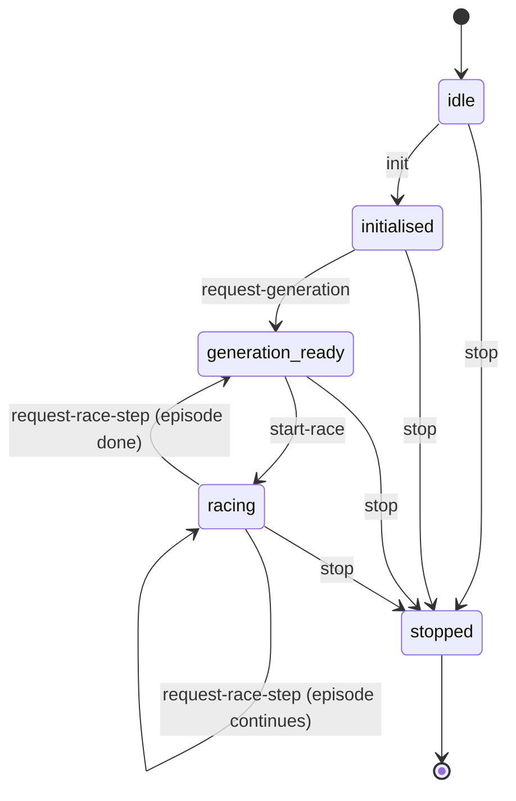
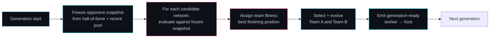

# Racing Curriculum — Coevolution Contract

This document describes the coevolution contract for the Team A/B racing
benchmark. It is written for anyone who wants to wire a real `Neat` population
loop into the worker, add a host UI on top of the protocol, or compare this
benchmark against other competitive coevolution systems.

The racing benchmark is a **two-population coevolution** problem. Team A and
Team B are independent NEAT populations that never share a gene pool. Fitness
for one team is measured by racing its current best cars against a **frozen
snapshot** of the other team. Because the opponent changes only at generation
boundaries, neither side can chase a moving target inside a single generation,
and the search stays stable enough to compare across generations.

The worker owns all simulation truth. The host owns DOM rendering and user
interaction. The contract between them is a typed, forward-only protocol that
keeps authority confusion out of the hot path.

See [Coevolution (Wikipedia)](https://en.wikipedia.org/wiki/Coevolution) and
Stanley & Miikkulainen (2002) on
[Neuroevolution of augmenting topologies](https://en.wikipedia.org/wiki/Neuroevolution_of_augmenting_topologies)
for the algorithmic background, and [Transferable objects (MDN)](https://developer.mozilla.org/en-US/docs/Web/API/Web_Workers_API/Transferring_objects)
for the zero-copy transfer contract used by streaming snapshots.

## Host ↔ Worker Message Contract

The protocol is a finite-state machine with five phases. Messages sent in a phase
where they are not permitted return an error string and leave the worker state
unchanged. The only exception is `stop`, which is accepted from any phase and
always transitions to `stopped`.



### Host → Worker

```ts
{
  type: 'init';
  populationSize: number;
  rngSeed: number;
  tier: number;
}
{
  type: 'request-generation';
}
{
  type: 'start-race';
  tierConfig: unknown;
  opponentSnapshotId: string;
}
{
  type: 'request-race-step';
  requestId: string;
  stepsToAdvance: number;
}
{
  type: 'stop';
}
```

### Worker → Host

```ts
{ type: 'generation-ready'; generation: number; teamABestFitness: number;
  teamBBestFitness: number; bestNetworkPayload?: unknown }
{ type: 'race-step'; requestId: string; done: boolean }
{ type: 'runtime-status'; phase: RacingWorkerPhase; statusText: string }
{ type: 'error'; message: string }
```

Authority rule: the host **requests** steps; the worker **advances** simulation
ticks and returns compact typed-array snapshots. The host never mutates
`EnvironmentState` directly.

## Generation Lifecycle

One generation is a complete evaluate-select-evolve pass for both teams. The
same frozen opponent snapshot is used for every episode in the generation so
that fitness comparisons inside the generation are fair.



The generation loop is not yet wired end-to-end. The types, the FSM router, and
the fitness resolver are implemented; the actual `Neat` generation step and the
host consumer are still extension points.

## Team A / B Separation

Team A and Team B are fully independent populations:

- **Independent gene pools.** No genome, species, or innovation counter is
  shared.
- **Independent fitness history.** A Team A candidate is evaluated only against
  Team B snapshots; Team B is evaluated only against Team A snapshots.
- **Single-episode team fitness.** A team's score for one race is the best
  (lowest) finishing position among its cars.

```ts
const container = createCoevolutionContainer({
  populationSize: 50,
  rngSeed: 1,
  tier: 1,
});
const teamAScore = container.resolveTeamFitness(0, [3, 7, 5]); // → 3
const teamBScore = container.resolveTeamFitness(1, [2, 4]); // → 2
```

The `createCoevolutionContainer` factory returns two stable population IDs and a
shared fitness resolver. The population IDs are opaque handles today; they will
be backed by real `Neat` instances once the core population wiring is connected.

## Opponent Snapshot Policy

The rolling snapshot store controls when the active opponent is allowed to
change. It enforces two guards:

1. **Generation barrier.** While an evaluation episode is active,
   `tryUpdateSnapshot` returns `false` and the frozen snapshot is unchanged.
2. **Generation boundary.** Snapshot rotation happens only when
   `generation % updateEveryNGenerations === 0`.

Sampling draws from both a hall-of-fame pool and a recent pool. When both pools
are non-empty, the first sample is guaranteed to come from the hall of fame, so
every evaluation generation includes at least one historically strong opponent.

```ts
const store = createOpponentSnapshotStore({ updateEveryNGenerations: 5 });
store.beginEvaluation();
store.tryUpdateSnapshot(5, payload); // → false (barrier active)
store.endEvaluation();
store.tryUpdateSnapshot(5, payload); // → true  (barrier clear, at boundary)

const samples = store.sampleOpponentSnapshots({
  hallOfFameIds: ['hof-1', 'hof-2'],
  recentIds: ['recent-1'],
  sampleCount: 3,
});
// samples[0].source === 'hall-of-fame'
```

## Race-Pack Determinism

A race pack is the complete initial state for one evaluation episode. The
factory `createDeterministicRacePack(seed, opponentSnapshot)` returns the same
positions, headings, and team assignments whenever the inputs are identical.

```ts
const packA = createDeterministicRacePack(42, snapshot);
const packB = createDeterministicRacePack(42, snapshot);
// Array.from(packA.carX) deepEquals Array.from(packB.carX)
```

Determinism is a fairness requirement: a Team A candidate and a Team B
candidate should be compared on identical starting conditions, not on different
random seeds. The current implementation places cars on a 2×2 index grid;
track-spline-aware placement is an extension point.

## Transfer-List Contract

Every `race-step` response carries a `RacingRenderFrame` packed as typed arrays.
The transfer list produced by `resolveRaceStepTransferList` contains each backing
`ArrayBuffer` exactly once. After `worker.postMessage({ ... }, transferList)`,
the worker must not reuse those buffers because they are detached on the worker
side.

```ts
const transferList = resolveRaceStepTransferList(pack);
worker.postMessage({ type: 'race-step', pack }, transferList);
// pack.carX.byteLength === 0 after transfer — buffer is detached
```

This contract works with a standard Web Worker; it does not require
`SharedArrayBuffer` or cross-origin isolation headers. A ring-buffer transport
upgrade would be a local wrapper around the same `postMessage` call site.

## Extension Points

The contract is fully typed, but several surfaces are not yet implemented or
depend on core NGE primitives that are not yet available:

| Surface                                                           | Status                   |
| ----------------------------------------------------------------- | ------------------------ |
| `TeamPopulationContainer` backed by a real `Neat` instance        | Not yet wired            |
| Host consumer for `generation-ready` messages                     | Not yet wired            |
| Worker-side controller inference loop                             | Not yet wired            |
| Packed `race-step` streaming loop                                 | Not yet wired            |
| Hall-of-fame + recent opponent sampling with real genome payloads | Not yet wired            |
| `ModulatorBroadcaster` team radio / neuromodulation               | Depends on NGE primitive |
| `EpisodicSlot` medium-term memory                                 | Depends on NGE primitive |
| `GatingRouter` hard task-switching                                | Depends on NGE primitive |
| `modeIsEvolvable` polyandric reproduction                         | Depends on NGE primitive |

These gaps are documented as neutral extension-point comments in the worker
service files. They should not be papered over inside the benchmark; they belong
in the core NGE algorithm boundary once the primitives exist.

## References

- Stanley, K. O. & Miikkulainen, R. (2002). _Evolving Neural Networks through
  Augmenting Topologies_. Neural Computation, 10(1), 99–127.
  ([Wikipedia overview](https://en.wikipedia.org/wiki/Neuroevolution_of_augmenting_topologies))
- Wikipedia contributors. _Coevolution_. Wikipedia.
  https://en.wikipedia.org/wiki/Coevolution (CC BY-SA 4.0).
- Wikipedia contributors. _Finite-state machine_. Wikipedia.
  https://en.wikipedia.org/wiki/Finite-state_machine (CC BY-SA 4.0).
- MDN Web Docs. _Transferable objects_. MDN.
  https://developer.mozilla.org/en-US/docs/Web/API/Web_Workers_API/Transferring_objects
  (licensed under CC BY-SA 2.5 / MIT for code).
