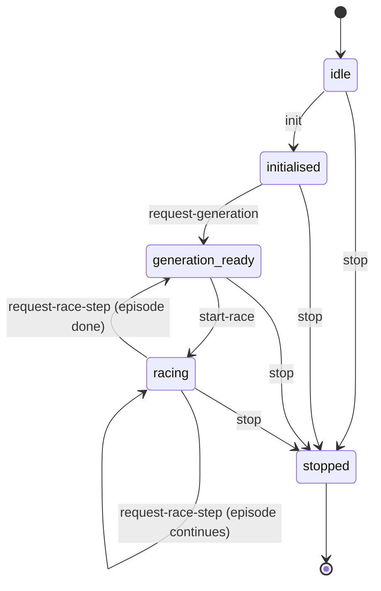

# Racing Curriculum — Simulation Worker

The simulation worker is the **authority** for all racing simulation state in
the Team A/B curriculum benchmark.  The host (main browser thread) owns only
DOM layout, canvas rendering, and user interaction.  Everything else — physics
ticking, controller inference, Team A/B population management, opponent
snapshot rotation, and packed frame production — belongs in the worker.

This boundary exists for two reasons:

1. **Performance.** Controller inference for six networked agents per tick
   cannot share the main thread with DOM compositing at 60 Hz without janking
   the display.

2. **Evaluation determinism.** Keeping all simulation truth worker-side means
   the host cannot inadvertently affect physics timing by dropping frames.
   A worker advances at a fixed timestep regardless of display cadence.

---

## Host ↔ Worker Authority Split

```mermaid
flowchart LR
    subgraph HOST["Host (main thread)"]
        direction TB
        DOM["DOM / canvas / HUD"]
        RAF["requestAnimationFrame\ncadence"]
        UI["User interaction\n(tier selector, shortcuts)"]
        RECV["Receive + decode\nrace-step snapshots"]
    end

    subgraph WORKER["Worker (simulation authority)"]
        direction TB
        TEAMS["Team A / Team B\npopulation containers"]
        SNAP["Rolling opponent\nsnapshot store"]
        GEN["Generation lifecycle\n(evaluate → select → evolve)"]
        RACE["Race episode lifecycle\n(tick → infer → pack)"]
        XFER["Transfer-list resolver\n(zero-copy postMessage)"]
    end

    HOST -- "init | request-generation\nstart-race | request-race-step\nstop" --> WORKER
    WORKER -- "generation-ready\nrace-step (typed-array frames)\nruntime-status | error" --> HOST

    style HOST fill:#0d1117,stroke:#30a2da,color:#c9d1d9
    style WORKER fill:#0d1117,stroke:#00e5ff,color:#c9d1d9
```



### Host-owned (never move to worker)

| Responsibility | Notes |
|---|---|
| DOM / canvas rendering | HUD panels, track canvas, network-view canvas |
| `requestAnimationFrame` cadence | Drives render only; does not tick physics |
| Viewport resize handling | Adjusts canvas backbuffer; no simulation side-effects |
| Receive and decode race-step frames | Reads typed-array fields from transferred snapshot |
| User interaction | Tier selector, keyboard shortcuts |

### Worker-owned (current foundation + target state)

| Responsibility | Status |
|---|---|
| Team A / Team B population handles | **Foundation** — opaque handles; real `Neat` wiring deferred |
| Rolling opponent snapshot store | **Implemented** — barrier + generation boundary |
| Protocol FSM router | **Implemented** — `idle → initialised → generation-ready → racing → stopped` |
| Deterministic race-pack construction | **Implemented** — `seed + snapshot → identical initial state` |
| Transfer-list resolver for race-step frames | **Implemented** — deduplicates shared buffers |
| Controller inference per car per tick | **Not yet wired** — currently runs on host |
| Generation-ready emission loop | **Not yet wired** — protocol types exist |
| Packed race-step streaming to host | **Not yet wired** — transfer types exist |

---

## Protocol Lifecycle

The host↔worker message contract is a strict forward-only FSM.  Messages
received in the wrong phase return an error string and leave the worker state
unchanged.



**Invariant:** `stop` is accepted from any phase and always transitions to
`stopped`.  All other transitions are gated by the current phase.

### Message shapes

**Host → Worker**

```ts
{ type: 'init'; populationSize: number; rngSeed: number; tier: number }
{ type: 'request-generation' }
{ type: 'start-race'; tierConfig: unknown; opponentSnapshotId: string }
{ type: 'request-race-step'; requestId: string; stepsToAdvance: number }
{ type: 'stop' }
```

**Worker → Host**

```ts
{ type: 'generation-ready'; generation: number; teamABestFitness: number;
  teamBBestFitness: number; bestNetworkPayload?: unknown }
{ type: 'race-step'; requestId: string; done: boolean }
{ type: 'runtime-status'; phase: RacingWorkerPhase; statusText: string }
{ type: 'error'; message: string }
```

---

## Packed Race-Step Snapshot (`RacingRenderFrame`)

Every `race-step` response carries a `RacingRenderFrame` — a structure-of-arrays
typed layout designed for zero-copy `postMessage` transfer.

| Field | Type | Length | Notes |
|---|---|---|---|
| `schemaVersion` | `'racing-packed-v1'` | — | Must be validated before reading any array |
| `carX`, `carY` | `Float32Array` | agentCount | World-unit positions |
| `carHeading` | `Float32Array` | agentCount | Radians |
| `carActive` | `Uint8Array` | agentCount | 1 = in race |
| `carTeam` | `Uint8Array` | agentCount | 0 = Team A, 1 = Team B |
| `carMode` | `Uint8Array` | agentCount | GatingRouter mode index (0 = not yet present) |
| `tireState` | `Float32Array` | agentCount × 4 | FL/FR/RL/RR wear in [0, 1] |
| `radioField` | `Float32Array` | agentCount × radioDim | 0-length in Tier 0 |
| `lap`, `place` | `Uint16Array` / `Uint8Array` | agentCount | Episode scalars |
| `pitStatus?` | `Uint8Array` | 4 | Optional Tier 4: `[teamA_car, teamA_ticks, teamB_car, teamB_ticks]` |

### Transfer-list contract

Every `ArrayBuffer` backing a typed-array field must appear **exactly once**
in the `postMessage` transfer list.  A buffer that appears in the transfer list
is detached after the call — the worker must not reuse it.  A standard Tier-0
pack without `pitStatus` produces exactly 10 buffer entries.

```ts
const transferList = resolveRaceStepTransferList(pack);
worker.postMessage({ type: 'race-step', pack }, transferList);
// pack.carX.byteLength === 0 after transfer — buffer is detached
```

Consumers must call `assertRacingSchemaVersion(frame)` before reading any
typed-array field to catch version mismatches at the boundary.

---

## Team A/B Coevolution Semantics

The benchmark runs two fully independent NEAT populations.  Team A and Team B
share only the evaluation environment — never a gene pool, species registry, or
fitness history.

**Team fitness rule:** the team score for one episode equals the **best
(lowest) finishing position** among that team's cars.  Position 1 = first place.
Team fitness does not average car positions or sum them.

```ts
const container = createCoevolutionContainer({ populationSize: 50, rngSeed: 1, tier: 1 });
// container.teamA.populationId !== container.teamB.populationId
const score = container.resolveTeamFitness(0, [3, 7, 5]); // → 3 (best finisher)
```

**Current status:** `TeamPopulationContainer` is an opaque handle with a stable
unique `populationId`.  Real `Neat` instance wiring — speciation, selection,
genetic operators, fitness accumulation — is deferred to a later pass.

---

## Rolling Opponent Snapshot Store

The opponent snapshot store enforces **two guards** before applying a snapshot
update:

1. **Generation barrier** — updates are rejected while an evaluation episode is
   active.  `beginEvaluation()` sets the barrier; `endEvaluation()` releases it.
   This prevents a new opponent snapshot from changing the fitness landscape
   mid-generation.

2. **Generation boundary** — updates are only applied at multiples of
   `updateEveryNGenerations`.  Off-boundary calls return `false` without
   modifying the frozen snapshot.

```ts
const store = createOpponentSnapshotStore({ updateEveryNGenerations: 5 });
store.beginEvaluation();
store.tryUpdateSnapshot(5, payload); // → false (barrier active)
store.endEvaluation();
store.tryUpdateSnapshot(5, payload); // → true  (barrier clear, at boundary)
store.tryUpdateSnapshot(7, payload); // → false (off boundary)
```

**Current status:** the `frozenPayload` field stores any value; no actual
network-payload sampling or hall-of-fame selection exists yet.

---

## Deterministic Race-Pack Construction

A race pack is the complete initial state for one evaluation episode.  Given
the same `seed` and the same frozen `opponentSnapshot`, `createDeterministicRacePack`
always returns identical `carX` and `carY` starting positions.

This determinism is required so that fitness comparisons between Team A and
Team B are made over identical episode conditions — not confounded by random
starting positions.

```ts
const packA = createDeterministicRacePack(42, snapshot);
const packB = createDeterministicRacePack(42, snapshot);
// Array.from(packA.carX) deepEquals Array.from(packB.carX) — always
```

**Current implementation:** car positions are computed from a 2×2 index grid
offset by the seed.  Track-geometry-aware placement (spline-based grid on the
actual track surface) is a remaining gap.

---

## Fallback Transport

When `SharedArrayBuffer` or cross-origin isolation headers are unavailable,
the protocol degrades gracefully to a single `Worker` with standard
`postMessage`.  No module in this directory requires `SharedArrayBuffer`.

The typed-array transfer-list path still applies: buffers are zero-copy
transferred even without shared memory, because `ArrayBuffer` is a
[Transferable](https://developer.mozilla.org/en-US/docs/Web/API/Web_Workers_API/Transferable_objects).
The host receives the snapshot's memory ownership rather than a copy.

A future optional upgrade can wrap the `postMessage` call site with a
SharedArrayBuffer ring buffer for lower latency without changing the FSM or
snapshot schemas.

---

## Remaining Reference-Plan Gaps

The implemented foundation covers worker protocol, deterministic race packs,
Team A/B container identity, and transfer-list safety.  The following gaps
remain before the benchmark matches the full reference plan:

| Gap | Notes |
|---|---|
| Real `Neat` population wiring | Speciation, selection, genome operators, fitness accumulation |
| Worker-owned controller inference | `network.activate` per car per tick must run in worker |
| Generation loop + `generation-ready` emission | Not yet wired; types exist |
| Packed `race-step` streaming loop | Not yet wired; schema and transfer resolver exist |
| Hall-of-fame + recent-sample snapshot selection | `frozenPayload` is any value; no genome sampling |
| Track-spline race-pack placement | Grid positions are index-based, not spline-based |
| Surface-type physics | Sand/wall/off-track lifecycle, pit-entrance blocking |
| Braking-distance + slip-onset tire effects | Tire wear model is partial |
| Radio heatmaps + role-divergence charts | Observability UI not started |
| Tier-ladder carry-state / reset-state | Tier promotion not yet implemented |
| Reproduction-mode analytics | `modeIsEvolvable`, polyandric reproduction (upstream NGE Phase E) |
| `ModulatorBroadcaster` neuromodulation | Upstream NGE Phase G |
| `EpisodicSlot` medium-term memory | Upstream NGE Phase G |
| `GatingRouter` hard task-switching | Upstream NGE Phase G |

NGE primitive gaps are documented as `NGE_TODO` comments in the coevolution and
race-pack service files.  They must not be compensated locally; route missing
core primitives to the NGE Core Scout when upstream Phase G/E work is available.

---

## Files in This Folder

| File | Role |
|---|---|
| `simulation-worker.types.ts` | `RacingRenderFrame` packed struct — zero-copy snapshot schema |
| `simulation-worker.evolution.types.ts` | Typed message union for the host↔worker protocol |
| `simulation-worker.evolution.protocol.service.ts` | FSM router — enforces phase-gated lifecycle |
| `simulation-worker.coevolution.service.ts` | Team A/B population handles + team-fitness resolver |
| `simulation-worker.race-pack.service.ts` | Deterministic race-pack factory + transfer-list resolver |
| `simulation-worker.opponent-snapshot.service.ts` | Rolling snapshot store with generation barrier |
| `simulation-worker.snapshot.utils.ts` | Schema-version assertion + transfer-list helper |
| `simulation-worker.tier3.ts` | Tier 3 frame factory + radio resolver |
| `simulation-worker.tier4.ts` | Tier 4 frame factory + pit status |
| `simulation-worker.tier5.ts` | Tier 5 frame factory + radio resolver |
