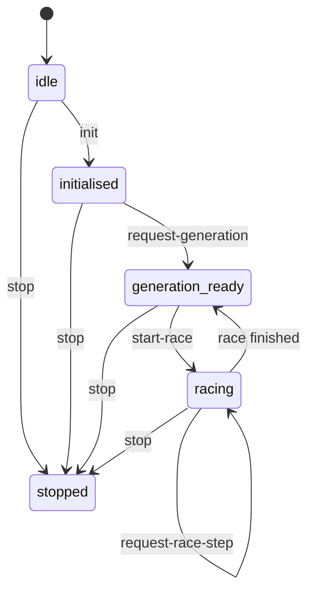

# workers/simulation-worker

Racing worker protocol FSM router.

This module owns the `routeRacingWorkerProtocolMessage` function, which maps
one host-to-worker message onto the next FSM state and an optional response.
It enforces the forward-only lifecycle:

  idle → initialised → generation-ready → racing → (stopped)

The lifecycle is a straightforward finite-state machine; see
[Finite-state machine (Wikipedia)](https://en.wikipedia.org/wiki/Finite-state_machine)
for background on why deterministic state transitions help avoid authority
confusion between a host and a worker.

## Protocol FSM

The diagram below shows the host-to-worker message contract as a state
machine.  Each transition is triggered by a single inbound message.  The
worker never advances simulation time unless the host asks for a race step,
and the host never mutates population state.



## Host/worker authority boundary

This router runs **inside the worker**.  The host calls `worker.postMessage`
with an `RacingWorkerInboundMessage`; the worker calls this router to
determine the next FSM state and the outbound payload to send back.
The host never advances simulation ticks directly — it only requests steps
and renders the snapshots it receives.

## Fallback transport

When SharedArrayBuffer or nested worker pools are unavailable (e.g., the
host document lacks the required COOP/COEP headers), the same FSM and packed
snapshot types work over a single `Worker` with `postMessage`.  No
SharedArrayBuffer dependency exists in this module.  The transport layer can
be upgraded to a SharedArrayBuffer ring-buffer by wrapping the `postMessage`
call site without changing this router.  See
[Transferable objects (MDN)](https://developer.mozilla.org/en-US/docs/Web/API/Web_Workers_API/Transferring_objects)
for the zero-copy transfer semantics used by the generation-ready response.

## Extension points

| Hook | Where to extend | Current seam |
| --- | --- | --- |
| Frozen opponent selection | `simulation-worker.opponent-snapshot.service.ts` | Swap or weight the snapshot sampler |
| Generation lifecycle | `simulation-worker.coevolution.service.ts` | Add elitism, diversity pressure, or Lamarckian updates |
| Race pack layout | `simulation-worker.race-pack.service.ts` | Add track geometry, curricula, or sensor channels |
| Transfer transport | Wrap the `postMessage` caller | Replace structured clone with a ring buffer or batched frames |
| Neuromodulation / plasticity | `ModulatorBroadcaster` (not available in Tier 0) | Extend the protocol when dynamic activation or synaptic change primitives are available |

## workers/simulation-worker/simulation-worker.evolution.protocol.service.ts

### createInitialProtocolState

```ts
createInitialProtocolState(): EvolutionProtocolState
```

Returns the canonical starting state for the racing worker protocol FSM.

The FSM lifecycle is: idle → initialised → generation-ready → racing → stopped.

Returns: Idle protocol state.

Example:

```ts
const state = createInitialProtocolState();
// state.phase === 'idle'
```

### routeRacingWorkerProtocolMessage

```ts
routeRacingWorkerProtocolMessage(
  message: RacingWorkerInboundMessage,
  state: EvolutionProtocolState,
): EvolutionProtocolRouteResult
```

Routes one inbound host-to-worker message through the evolution protocol FSM.

Messages that arrive in a phase where they are not allowed return an error
string and leave `nextState` unchanged.  The `stop` message is always
accepted from any phase and unconditionally transitions to `stopped`.

Lifecycle transitions:
- idle        + init             → initialised
- initialised + request-generation → generation-ready
- generation-ready + start-race  → racing
- racing      + request-race-step → racing (or generation-ready when done)
- any phase   + stop             → stopped

Parameters:
- `message` - Inbound host-to-worker protocol message.
- `state` - Current FSM state.

Returns: Next state plus optional response or rejection error.

## workers/simulation-worker/simulation-worker.evolution.types.ts

Typed message union for the worker-authoritative racing evolution protocol.

The racing benchmark follows a strict host/worker authority split: the host
owns DOM rendering and user interaction; the worker owns environment state,
controller inference, Team A/B population containers, and race-step snapshot
production.  This file defines the typed envelope for every message that
crosses the host↔worker boundary.

The two-team, frozen-snapshot evaluation model follows the competitive
coevolution pattern.  See [Coevolution (Wikipedia)](https://en.wikipedia.org/wiki/Coevolution)
and Stanley & Miikkulainen (2002) on
[Neuroevolution of augmenting topologies](https://en.wikipedia.org/wiki/Neuroevolution_of_augmenting_topologies)
for the algorithmic background.

## Protocol lifecycle

The protocol is a forward-only FSM with five phases:

```
idle → (init) → initialised → (request-generation) → generation-ready
     → (start-race) → racing → (request-race-step*) → racing | generation-ready
     any phase → (stop) → stopped
```

Messages that arrive in a phase where they are not permitted return an error
string from `routeRacingWorkerProtocolMessage` and leave the FSM state
unchanged.  See [Finite-state machine (Wikipedia)](https://en.wikipedia.org/wiki/Finite-state_machine)
for background on the state-machine pattern.

## Worker-owned responsibilities

- Team A and Team B `Neat` population containers (independent speciation and
  fitness tracking).
- Rolling opponent snapshot store — frozen at generation start, rotated at
  the configured generation boundary.
- Generation lifecycle: evaluate against frozen snapshot → select → evolve →
  emit `generation-ready` response.
- Race episode lifecycle: build a deterministic race pack → tick simulation →
  run controller inference per car per tick → stream packed `race-step`
  typed-array snapshots.
- Transfer-list resolution for zero-copy `postMessage` frame delivery.  See
  [Transferable objects (MDN)](https://developer.mozilla.org/en-US/docs/Web/API/Web_Workers_API/Transferring_objects)
  for the transfer-list semantics.

## Host-owned responsibilities

- DOM layout, canvas rendering, HUD panels, telemetry display.
- `requestAnimationFrame` cadence and viewport resize handling.
- Receiving and decoding compact `race-step` typed-array snapshots for render.
- User interaction (tier selector, keyboard shortcuts).

## Extension points

- `TeamPopulationContainer` is a typed handle; the actual NEAT population
  wiring will replace the opaque container.
- The `generation-ready` worker→host message is typed, but the host consumer
  that starts the generation loop is not yet wired end-to-end.
- Hall-of-fame + recent opponent sampling is typed, but the network-payload
  sampling implementation depends on a real `Neat` snapshot payload.
- Radio semantics (`ModulatorBroadcaster`, `EpisodicSlot`, `GatingRouter`)
  depend on NGE primitives that are not yet available.
- Polyandric reproduction (`modeIsEvolvable`) depends on an NGE primitive
  that is not yet available.

### EvolutionProtocolRouteResult

Route result returned by `routeRacingWorkerProtocolMessage` for one inbound
message.

- `nextState` — updated FSM state to use for the next message.
- `response` — optional outbound payload the worker should send to the host.
- `error` — rejection reason when the message was not permitted in the
  current phase; `nextState` is unchanged when `error` is set.

### EvolutionProtocolState

Stateful protocol snapshot carried between inbound worker messages.

The FSM router is a pure function: given a message and the current
`EvolutionProtocolState`, it returns the next state plus an optional
response or rejection error — no shared mutable state required.

### GenerationReadyResponse

Typed generation-ready response produced by the worker evolution loop.

Carries per-team best fitness and an optional zero-copy payload transfer list.

### RacingWorkerInboundMessage

Host-to-worker messages for the racing evolution protocol.

Messages are accepted only in the phase where they are permitted.
Sending `request-generation` before `init`, or `start-race` before a
generation has completed, produces a rejection error instead of a
transition.  The `stop` message is always accepted and transitions to
`stopped` unconditionally.

### RacingWorkerOutboundMessage

Worker-to-host outbound messages for the racing evolution protocol.

These represent the compact, streaming payloads the worker sends back to the
host after each protocol event:
- `generation-ready` — emitted after a full evolution generation completes;
  carries per-team best fitness and optionally the best genome payload.
- `race-step` — compact typed-array snapshot for one or more simulation
  ticks; the host should render each snapshot at display cadence.
- `runtime-status` — human-readable status text for HUD display.
- `error` — protocol or runtime error; the host should surface this to the
  user and consider stopping.

Note: `race-step` snapshots must be transferred with a transfer list so that
typed-array buffers are zero-copy handed to the host thread.  See
`resolveRaceStepTransferList` in the race-pack service.

### RacingWorkerPhase

Lifecycle phases for the racing worker protocol FSM.

Phases advance strictly forward: `idle` → `initialised` → `generation-ready`
→ `racing`.  The `stopped` phase is terminal and reachable from any phase
via a `stop` message.

## workers/simulation-worker/simulation-worker.coevolution.service.ts

Team A/B coevolution container for the racing curriculum benchmark.

Each call to `createCoevolutionContainer` allocates two independent
population handles — one for Team A and one for Team B.  Team-level fitness
is routed through the reusable NGE core evaluator, using the racing policy
"best (lowest) finishing position among that team's cars."

The two-population shape follows the competitive coevolution pattern: each
team is evaluated against frozen snapshots of the other, so neither side
optimizes against a stationary target.  This helps keep the search from
collapsing into a one-sided arms race.  See
[Coevolution (Wikipedia)](https://en.wikipedia.org/wiki/Coevolution)
for background, and
[Neuroevolution of augmenting topologies (Wikipedia)](https://en.wikipedia.org/wiki/Neuroevolution_of_augmenting_topologies)
for the NEAT algorithm that underpins the population containers.

Extension points:
- Extend this container to broadcast neuromodulation across team members
  when `ModulatorBroadcaster` and `EpisodicSlot` primitives are available.
- Extend this container with polyandric reproduction (`modeIsEvolvable`)
  once that primitive is available.

### CoevolutionConfig

Narrow config used to allocate the racing coevolution container.

### CoevolutionContainer

Paired Team A/B coevolution container with a racing-specific team-fitness
resolver.

The container exposes both team handles and the policy that converts finishing
positions into a scalar fitness value for each side.

### createCoevolutionContainer

```ts
createCoevolutionContainer(
  config: CoevolutionConfig,
): CoevolutionContainer
```

Creates a paired Team A/B coevolution container with independent population
handles and a best-position team-fitness resolver.

Parameters:
- `_config` - Container configuration (population size, seed, tier).

Returns: Paired coevolution container with distinct team handles.

Example:

```ts
const container = createCoevolutionContainer({ populationSize: 50, rngSeed: 1, tier: 1 });
// container.teamA.populationId !== container.teamB.populationId
const fitness = container.resolveTeamFitness(0, [3, 7]); // → 3
```

### createRacingTeamResultGroup

```ts
createRacingTeamResultGroup(
  teamId: 0 | 1,
  carFinishPositions: readonly number[],
): { readonly teamId: RacingTeamId; readonly memberResults: readonly RacingTeamMemberResult[]; }
```

Convert one racing team's finish positions into the generic team-group seam.

Parameters:
- `teamId` - Racing-local team index.
- `carFinishPositions` - Finish positions for this team's cars.

Returns: Generic team-result group ready for the core evaluator.

### RacingTeamId

Stable racing team identifiers used to route local results through the core seam.

### RacingTeamMemberResult

Racing stores finish positions in `rawScore`; support score is unused here.

### selectBestFinishingPosition

```ts
selectBestFinishingPosition(
  group: { readonly memberResults: readonly RacingTeamMemberResult[]; },
): number
```

Racing policy: the best team car defines the team's fitness.

Lower finishing positions are better, so this policy selects the minimum
recorded `rawScore`. Empty groups preserve the existing `Infinity` fallback.

Parameters:
- `group` - Generic team group routed through the core evaluator seam.

Returns: Best finishing position, or `Infinity` when the group is empty.

### TeamPopulationContainer

Opaque per-team population handle wrapping a future `Neat` instance.

The handle exposes a stable identity and a mutable generation counter so the
racing benchmark can track each team's progress independently.

## workers/simulation-worker/simulation-worker.opponent-snapshot.service.ts

Rolling opponent snapshot store for the racing curriculum benchmark.

The store enforces two guards before applying a snapshot update:
1. Generation barrier — updates are rejected while an evaluation episode is
   active.  `beginEvaluation()` sets the barrier; `endEvaluation()` releases
   it.
2. Generation boundary — updates are only applied at multiples of
   `updateEveryNGenerations` (i.e. when `generation % updateEveryNGenerations === 0`).

The hall-of-fame / recent-pool sampling mirrors the common coevolution
stabilization technique of evaluating candidates against both strong historical
opponents and the current adversary, rather than against a single moving
target.  See [Coevolution (Wikipedia)](https://en.wikipedia.org/wiki/Coevolution)
for background.

Extension point:
- Extend the snapshot payload format to include episodic context and hard
  task-switch state when `EpisodicSlot` and `GatingRouter` primitives are
  available.

### createOpponentSnapshotStore

```ts
createOpponentSnapshotStore(
  config: OpponentSnapshotConfig,
): OpponentSnapshotStore
```

Creates a rolling opponent snapshot store that respects the generation
barrier and the configured update boundary.

Parameters:
- `config` - Snapshot update policy.

Returns: Opponent snapshot store with barrier-enforced update semantics.

Example:

```ts
const store = createOpponentSnapshotStore({ updateEveryNGenerations: 5 });
store.beginEvaluation();
store.tryUpdateSnapshot(5, payload); // → false (barrier active)
store.endEvaluation();
store.tryUpdateSnapshot(5, payload); // → true  (barrier cleared, at boundary)
store.tryUpdateSnapshot(7, payload); // → false (not at boundary)
```

### OpponentSnapshotConfig

Snapshot update cadence configuration.

### OpponentSnapshotStore

Rolling opponent snapshot store with generation barrier enforcement.

The store freezes a snapshot between evaluation episodes and only allows an
update when the configured generation boundary is crossed.

### SnapshotSample

One sampled opponent snapshot together with its source pool label.

The label lets the caller distinguish historical hall-of-fame opponents from
recent opponents when building a mixed evaluation pool.

## workers/simulation-worker/simulation-worker.race-pack.service.ts

### createDeterministicRacePack

```ts
createDeterministicRacePack(
  seed: number,
  _opponentSnapshot: OpponentSnapshot,
): RacingRenderFrame
```

Constructs an initial race frame deterministically from a seed and a frozen
opponent snapshot.  Identical seed + identical snapshot → identical frame.

All cars start on the inner-lane centerline of the deterministic medium
simple track so that full-throttle episodes produce comparable lap times.

Parameters:
- `seed` - Deterministic race-pack seed.
- `_opponentSnapshot` - Frozen opponent snapshot for the episode (reserved
for future episodic context wiring; currently unused for determinism).

Returns: Packed `RacingRenderFrame` with `schemaVersion: 'racing-packed-v1'`.

Example:

```ts
const packA = createDeterministicRacePack(42, snapshot);
const packB = createDeterministicRacePack(42, snapshot);
// Array.from(packA.carX) deepEquals Array.from(packB.carX)
```

### createRaceEpisodeRunner

```ts
createRaceEpisodeRunner(
  seed: number,
  _opponentSnapshot: OpponentSnapshot,
  networks: readonly RaceControllerNetwork[],
): RaceEpisodeRunner
```

Builds a runnable race episode whose `tick()` advances physics and runs one
controller inference per car per tick.

The runner owns a deterministic initial frame produced from the same medium
simple-track generator used by {@link createDeterministicRacePack}. Each call
to `tick()` increments the frame tick counter, advances each car along the
inner-lane centerline, detects lap completion, and invokes every provided
network exactly once.

Parameters:
- `seed` - Deterministic race-pack seed.
- `_opponentSnapshot` - Frozen opponent snapshot for the episode (reserved
for future episodic context wiring; currently unused for determinism).
- `networks` - One controller network per car slot.

Returns: Runnable race episode with an initial packed frame.

Example:

```ts
const runner = createRaceEpisodeRunner(42, snapshot, [netA, netB]);
runner.tick();
console.log(runner.frame.tick); // 1
```

### EXPECTED_TRANSFER_BUFFER_COUNT

Expected number of distinct ArrayBuffer entries in a Tier-0 transfer list.

### OpponentSnapshot

Frozen opponent snapshot used as deterministic race-pack input.

Identical seed + identical snapshot produce identical starting frames, which
makes race episodes replayable and comparative fitness claims fair.  The
zero-copy transfer path uses `ArrayBuffer` transfer lists supported by Web
Workers; see [Transferable objects (MDN)](https://developer.mozilla.org/en-US/docs/Web/API/Web_Workers_API/Transferring_objects)
for details.

Extension point:
- Extend the snapshot payload format to include episodic context and hard
  task-switch state when `EpisodicSlot` and `GatingRouter` primitives are
  available.

### RaceControllerNetwork

Minimal controller handle used inside a race episode runner.

### RaceEpisodeRunner

Mutable episode state returned by `createRaceEpisodeRunner`.

`frame` exposes the current packed render frame; `tick()` advances it by one
fixed timestep and runs one controller inference per car.

### RaceEpisodeRunnerFrame

Packed render frame augmented with the per-car unit-progress field used by the
race-pack runner. The `progress01` buffer is intentionally not part of the
zero-copy transfer list; it is computed locally and kept attached to the
runner frame.

### resolveRaceStepTransferList

```ts
resolveRaceStepTransferList(
  frame: RacingRenderFrame,
): ArrayBuffer[]
```

Collects every `ArrayBuffer` backing a typed-array field in the frame into a
transfer list for zero-copy `postMessage` transfer.

Mirrors `resolveRacingRenderFrameTransferList` from the snapshot utils but is
owned by this service boundary so race-step streaming follows the same
zero-copy ownership contract.

Rules:
- Every typed-array field contributes exactly one buffer entry.
- Shared buffers are deduplicated (listed only once).
- A standard pack without `pitStatus` produces exactly
  {@link EXPECTED_TRANSFER_BUFFER_COUNT} entries.
- The local-only `progress01` field is never transferred.

Parameters:
- `frame` - Packed render frame whose buffers will be transferred.

Returns: Ordered list of `ArrayBuffer` references for postMessage transfer.

Example:

```ts
const transferList = resolveRaceStepTransferList(pack);
worker.postMessage({ type: 'race-step', pack }, transferList);
```

## workers/simulation-worker/simulation-worker.snapshot.utils.ts

### assertRacingSchemaVersion

```ts
assertRacingSchemaVersion(
  frame: { schemaVersion: unknown; },
): void
```

Asserts that the `schemaVersion` field of an incoming frame matches the
expected `'racing-packed-v1'` sentinel.

Consumers must call this before reading any typed-array field so that a
version mismatch is caught at the boundary rather than silently
misinterpreting the packed bytes.

Parameters:
- `frame` - Incoming message payload (or any object with `schemaVersion`).

Example:

```ts
assertRacingSchemaVersion(receivedMessage);
// now safe to read typed-array fields
```

### resolveRacingRenderFrameTransferList

```ts
resolveRacingRenderFrameTransferList(
  frame: RacingRenderFrame,
): ArrayBuffer[]
```

Collects every `ArrayBuffer` backing a typed-array field in `frame` into a
transfer list for zero-copy `postMessage` transfer.

Rules enforced by the real implementation:
- Every typed-array field must contribute exactly one buffer entry.
- If two typed arrays share the same underlying buffer they must be listed
  only once.
- The returned list must have the same length as the number of distinct
  typed-array buffers in the frame (10 for a standard Tier-0 solo frame,
  11 when Tier 4 adds the optional `pitStatus` array).

Parameters:
- `frame` - The packed render frame whose buffers will be transferred.

Returns: Ordered list of `ArrayBuffer` references for postMessage transfer.

Example:

```ts
const transferList = resolveRacingRenderFrameTransferList(frame);
worker.postMessage({ type: 'frame', frame }, transferList);
```

## workers/simulation-worker/simulation-worker.evaluation-pack.normalizer.ts

Racing evaluation-pack normalizer (Layer 3 wrapper around Layer 2 generic pack).

Provides the benchmark-local `populateRacingFrame` seam that consumes a core
`DeterministicEvaluationPack` and produces a `RacingRenderFrame`. Also exposes
thin racing-specific helpers for transfer-list resolution and schema-version
assertion that delegate to the generic Layer 2 contracts.

The generic pack is intentionally transport-neutral: it only promises
determinism for the tuple `(seed, agentCount, schemaVersion)`. The racing
wrapper adds the benchmark-local reproducibility tuple
`(seed, agentCount, packSchemaVersion, opponentSnapshot, trackId, featureFlags)`.
Same full tuple → identical `RacingRenderFrame` on the same runtime. This
preserves Layer 2 reuse while letting racing own its own frame format and
lifecycle.

Array mapping invariant: the generic pack exposes `[agentStates,
agentWeights, agentActive]` in that order. The racing wrapper maps these
deterministically to `carX`, `carY`, `carHeading`, `carActive`, and
`carTeam` using pure functions, so the same source arrays always produce the
same frame fields.

### assertRacingPackSchemaVersion

```ts
assertRacingPackSchemaVersion(
  pack: { schemaVersion: unknown; },
  expectedVersion: string,
): void
```

Asserts that the incoming generic pack's schema version matches the racing
configuration's expected version.

This is the racing-specific wrapper around the generic
`assertSchemaVersion` boundary guard. Rejecting an unexpected version at
the boundary prevents silent misinterpretation of packed bytes. For background
on schema-version sentinels and forward compatibility, see Wikipedia
contributors,
[Forward compatibility](https://en.wikipedia.org/wiki/Forward_compatibility).

Parameters:
- `pack` - Object with a `schemaVersion` field.
- `expectedVersion` - Expected schema-version sentinel.

Example:

```ts
assertRacingPackSchemaVersion({ schemaVersion: 'eval-pack-v1' }, 'eval-pack-v1');
// no error
```

### populateRacingFrame

```ts
populateRacingFrame(
  pack: DeterministicEvaluationPack,
  racingConfig: RacingEvaluationConfig,
): RacingRenderFrame
```

Populates a `RacingRenderFrame` from a generic deterministic evaluation pack
and racing-specific configuration.

Racing reproducibility tuple:
`(seed, agentCount, packSchemaVersion, opponentSnapshot, trackId, featureFlags)`.
Same tuple → identical racing frame on the same runtime.

The deterministic array mapping is: `agentStates → carX/carHeading`,
`agentWeights → carY`, `agentActive → carActive/carTeam`. Because the mapping
uses pure functions (copy constructors and modulo), the same generic pack and
racing configuration always produce the same frame fields.

Parameters:
- `pack` - Generic deterministic evaluation pack from Layer 2.
- `racingConfig` - Racing-specific frame inputs.

Returns: A packed `RacingRenderFrame` with `schemaVersion: 'racing-packed-v1'`.

Example:

```ts
const pack = createDeterministicEvaluationPack(42, {
  agentCount: 4,
  schemaVersion: 'eval-pack-v1',
});
const frame = populateRacingFrame(pack, RACING_CONFIG);
console.log(frame.schemaVersion); // 'racing-packed-v1'
```

### RacingEvaluationConfig

Racing-specific inputs that accompany a generic deterministic pack.

### resolveRacingTransferList

```ts
resolveRacingTransferList(
  frame: RacingRenderFrame,
): ArrayBuffer[]
```

Resolves the zero-copy postMessage transfer list for a racing render frame.

Delegates to the racing-specific transfer-list resolver so the Layer 3
normalizer and the existing snapshot utilities share the same zero-copy
ownership contract. The transfer list follows the HTML structured-clone
transferables contract consumed by Web Workers; for background see MDN Web
Docs,
[Transferable objects](https://developer.mozilla.org/en-US/docs/Web/API/Web_Workers_API/Transferring_objects_from_one_worker_to_another).

Parameters:
- `frame` - Packed racing render frame.

Returns: Ordered list of distinct `ArrayBuffer` references.

Example:

```ts
const transferList = resolveRacingTransferList(frame);
worker.postMessage({ type: 'render', frame }, transferList);
```

## workers/simulation-worker/simulation-worker.types.ts

Packed structure-of-arrays frame produced by the simulation worker and
consumed by the display thread.

All typed arrays are row-major with `agentCount` rows (one row per car).
The `tireState` array is `agentCount * 4` elements (FL, FR, RL, RR per car).
The `radioField` array has 0 elements in Tier 0 (radio disabled).
Tier 4 may also append `pitStatus` as `[teamA_car, teamA_ticks, teamB_car, teamB_ticks]`,
where `255` in a car slot means that team's pit is currently empty.

Zero-copy transfer contract:
- Every `ArrayBuffer` backing a typed-array field must appear exactly once in
  the postMessage transfer list.
- A buffer that appears in the transfer list is detached after transfer;
  the producer must not reuse it.
- Consumers must reject frames whose `schemaVersion` differs from
  `'racing-packed-v1'`.

### RacingRenderFrame

Packed structure-of-arrays frame produced by the simulation worker and
consumed by the display thread.

All typed arrays are row-major with `agentCount` rows (one row per car).
The `tireState` array is `agentCount * 4` elements (FL, FR, RL, RR per car).
The `radioField` array has 0 elements in Tier 0 (radio disabled).
Tier 4 may also append `pitStatus` as `[teamA_car, teamA_ticks, teamB_car, teamB_ticks]`,
where `255` in a car slot means that team's pit is currently empty.

Zero-copy transfer contract:
- Every `ArrayBuffer` backing a typed-array field must appear exactly once in
  the postMessage transfer list.
- A buffer that appears in the transfer list is detached after transfer;
  the producer must not reuse it.
- Consumers must reject frames whose `schemaVersion` differs from
  `'racing-packed-v1'`.

## workers/simulation-worker/simulation-worker.tier3.ts

Tier 3 simulation-worker helpers for the smallest honest 2v2 race pack.

This module keeps the Phase 3 worker contract narrow: one factory allocates
the canonical four-car packed frame, and one resolver answers which radio
rows a car may read. That is enough to exercise teammate communication
without hard-coding later tournament logic into the worker seam.

### createTier3RacePack

```ts
createTier3RacePack(): RacingRenderFrame
```

Creates the canonical packed Tier 3 race frame for a 2v2 evaluation slice.

The frame follows the shared structure-of-arrays contract used by the rest of
the worker pipeline: four car rows, `carTeam = [0, 0, 1, 1]`, radio enabled
through feature-flag bit 1, and a 28-float `radioField` laid out as
4 rows × 7 channels.

Returns: Four-car packed render frame with a 2v2 team layout.

Example:

```ts
const frame = createTier3RacePack();

frame.agentCount; // 4
frame.radioField.length; // 28
Array.from(frame.carTeam); // [0, 0, 1, 1]
```

### resolveReadableRadioRows

```ts
resolveReadableRadioRows(
  frame: RacingRenderFrame,
  carIndex: number,
): readonly number[]
```

Resolves which radio rows the querying car may read from the shared field.

Tier 3 keeps radio visibility team-local: a car may read its own row and its
teammate's row, but not the opposing team's rows. The resolver therefore
walks the packed frame and returns only indices whose `carTeam` matches the
querying car.

Parameters:
- `frame` - Current packed race frame.
- `carIndex` - Zero-based index of the querying car.

Returns: Ordered list of row indices visible to that car's team.

Example:

```ts
const frame = createTier3RacePack();

resolveReadableRadioRows(frame, 0); // [0, 1]
resolveReadableRadioRows(frame, 2); // [2, 3]
```

## workers/simulation-worker/simulation-worker.tier4.ts

Tier 4 simulation-worker helpers for the smallest honest 2v2 tire-and-pit race pack.

This keeps the worker seam narrow: one factory allocates the canonical
four-car packed frame, and one resolver returns the readable radio rows for a
given car. Tier 4 reuses the exact team-local radio visibility from Tier 3
while extending the packed frame with pit-status transport.

### createTier4RacePack

```ts
createTier4RacePack(): RacingRenderFrame & { pitStatus: Int16Array<ArrayBufferLike>; }
```

Creates the canonical packed Tier 4 race frame for a 2v2 evaluation slice.

The returned arrays are sized to the smallest honest tire-and-pit contract:
`tireState.length = 16` (`4 cars × 4 tires`) and `pitStatus.length = 4`
storing `[teamA_car, teamA_ticks, teamB_car, teamB_ticks]`. The car slots
start at `255` so an untouched pack always means `no car in pit`.

Returns: Four-car packed render frame with tire and pit transport enabled.

Example:

```ts
const frame = createTier4RacePack();

frame.agentCount; // 4
frame.tireState.length; // 16
frame.pitStatus.length; // 4
```

### resolveReadableRadioRows

```ts
resolveReadableRadioRows(
  frame: RacingRenderFrame,
  carIndex: number,
): readonly number[]
```

Resolves which radio rows the querying car may read from the shared field.

Tier 4 keeps the exact Tier 3 readability contract: Team A reads rows
`[0, 1]`, Team B reads rows `[2, 3]`.

Parameters:
- `frame` - Current packed race frame.
- `carIndex` - Zero-based index of the querying car.

Returns: Ordered list of row indices visible to that car's team.

## workers/simulation-worker/simulation-worker.tier5.ts

Tier 5 simulation-worker helpers for the smallest honest 3v3 six-car race pack.

This module keeps the six-car seam narrow: one factory allocates the canonical
packed frame, and one resolver answers which teammate radio rows are readable
for a given car.

### createTier5RacePack

```ts
createTier5RacePack(): RacingRenderFrame & { pitStatus: Int16Array<ArrayBufferLike>; focusCarIndex: number; }
```

Creates the canonical packed Tier 5 race frame for a 3v3 evaluation slice.

This helper pins the six-car transport contract used by the Tier 5 worker seam:

- `agentCount = 6` because the pack always represents two teams of three cars.
- `carTeam = [0, 0, 0, 1, 1, 1]`, so cars `0..2` are Team A and cars `3..5` are Team B.
- `radioField.length = 42` because six cars each publish one seven-channel row.
- `tireState.length = 24` because six cars each store four wheel channels.
- `pitStatus.length = 6` because the pit shelf includes wait slots for both teams.

`NO_CAR_INDEX` marks an empty team pit slot inside that packed `pitStatus` tuple.

Returns: Six-car packed render frame with tire, radio, and pit transport enabled.

Example:

```ts
const expectedAgentCount = TIER_FIVE_AGENT_COUNT;
const expectedRadioWidth = TIER_FIVE_RADIO_FIELD_SIZE;
const expectedTireWidth = TIER_FIVE_TIRE_STATE_SIZE;
const frame = createTier5RacePack();

frame.agentCount === expectedAgentCount; // true
frame.radioField.length === expectedRadioWidth; // true
frame.tireState.length === expectedTireWidth; // true
frame.pitStatus.length === PIT_STATUS_CHANNEL_COUNT; // true
```

### resolveReadableRadioRows

```ts
resolveReadableRadioRows(
  frame: RacingRenderFrame,
  carIndex: number,
): readonly number[]
```

Resolves which teammate radio rows the querying car may read from the shared field.

The shared field stores one seven-channel radio row per car in the canonical
roster `[A0, A1, A2, B0, B1, B2]`. Visibility stays team-local and includes the
querying car row for parity with the Tier 3 helper contract.

Parameters:
- `frame` - Current packed race frame.
- `carIndex` - Zero-based index of the querying car.

Returns: Ordered teammate row indices visible to the querying car.

Example:

```ts
const teamAAnchorCarIndex = 0;
const teamBAnchorCarIndex = TIER_FIVE_TEAM_SIZE;
const frame = createTier5RacePack();

resolveReadableRadioRows(frame, teamAAnchorCarIndex); // [0, 1, 2]
resolveReadableRadioRows(frame, teamBAnchorCarIndex); // [3, 4, 5]
```
