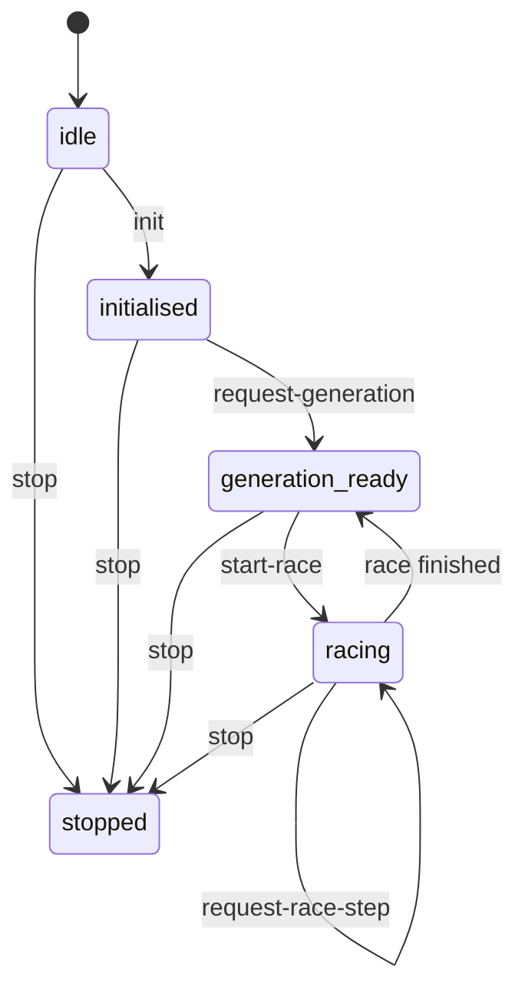
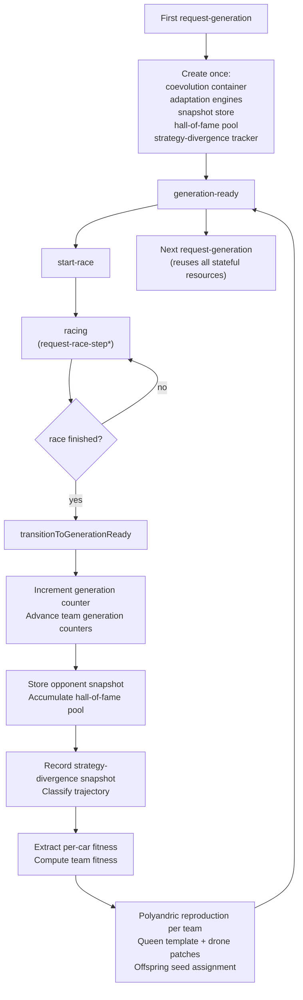
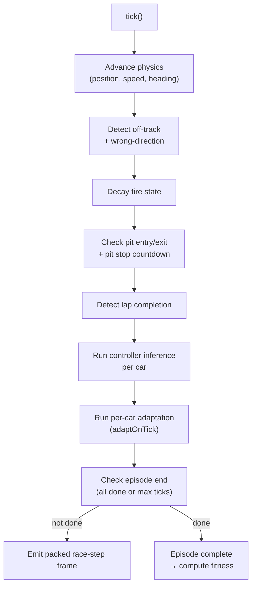
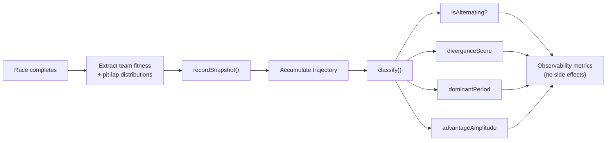

# workers/simulation-worker

Racing worker protocol FSM router.

This module owns the `routeRacingWorkerProtocolMessage` function, which maps
one host-to-worker message onto the next FSM state and an optional response.
It enforces the forward-only lifecycle:

  idle → initialised → generation-ready → racing → (stopped)

The lifecycle is a straightforward finite-state machine; see
[Finite-state machine (Wikipedia)](https://en.wikipedia.org/wiki/Finite-state_machine)
for background on why deterministic state transitions help avoid authority
confusion between a host and a worker.

## Protocol FSM

The diagram below shows the host-to-worker message contract as a state
machine.  Each transition is triggered by a single inbound message.  The
worker never advances simulation time unless the host asks for a race step,
and the host never mutates population state.



## Host/worker authority boundary

This router runs **inside the worker**.  The host calls `worker.postMessage`
with an `RacingWorkerInboundMessage`; the worker calls this router to
determine the next FSM state and the outbound payload to send back.
The host never advances simulation ticks directly — it only requests steps
and renders the snapshots it receives.

## Fallback transport

When SharedArrayBuffer or nested worker pools are unavailable (e.g., the
host document lacks the required COOP/COEP headers), the same FSM and packed
snapshot types work over a single `Worker` with `postMessage`.  No
SharedArrayBuffer dependency exists in this module.  The transport layer can
be upgraded to a SharedArrayBuffer ring-buffer by wrapping the `postMessage`
call site without changing this router.  See
[Transferable objects (MDN)](https://developer.mozilla.org/en-US/docs/Web/API/Web_Workers_API/Transferring_objects)
for the zero-copy transfer semantics used by the generation-ready response.

## Extension points

| Hook | Where to extend | Current seam |
| --- | --- | --- |
| Frozen opponent selection | `simulation-worker.opponent-snapshot.service.ts` | Swap or weight the snapshot sampler |
| Generation lifecycle | `simulation-worker.coevolution.service.ts` | Add elitism, diversity pressure, or Lamarckian updates |
| Race pack layout | `simulation-worker.race-pack.service.ts` | Add track geometry, curricula, or sensor channels |
| Transfer transport | Wrap the `postMessage` caller | Replace structured clone with a ring buffer or batched frames |
| Neuromodulation / plasticity | `ModulatorBroadcaster` (not available in Tier 0) | Extend the protocol when dynamic activation or synaptic change primitives are available |
| Strategy-divergence analytics | `simulation-worker.strategy-divergence.service.ts` | Adjust classifier thresholds or add new divergence metrics |

## Multi-generation evaluation loop

The diagram below shows how stateful resources persist across generations.
The coevolution container, adaptation engines, opponent snapshot store,
hall-of-fame snapshot pool, and strategy-divergence tracker are all created
once on the first `request-generation` and reused on every subsequent
generation. This avoids discarding accumulated population state between
races.



The reproduction step follows the queen-plus-drones pattern described by the
racing reference design. The biological analogy is polyandry; see
[Polyandry (Wikipedia)](https://en.wikipedia.org/wiki/Polyandry) for
background on why one primary genome can benefit from multiple donor
contributions.

### Hall-of-fame opponent snapshot pool

The `OpponentSnapshotPool` from `src/neat/nge-collective/` provides a
fixed-capacity rolling buffer with FIFO eviction. Each completed generation
adds per-car serialized genome snapshots to the pool so that historical
opponents persist across generations. The pool capacity is
`OPPONENT_SNAPSHOT_POOL_CAPACITY` (10). See
[Coevolution (Wikipedia)](https://en.wikipedia.org/wiki/Coevolution)
for why evaluating against historical opponents stabilises competitive
coevolution.

### Strategy-divergence analytics

The `StrategyDivergenceTracker` accumulates per-generation team-level
observables (aggregate fitness, pit-lap distributions, reproduction-mode
mix) and classifies the resulting time series to detect whether the two
teams' strategies are diverging in an alternating arms-race pattern or one
team is consistently dominant. These metrics are observability-only — they
do NOT change fitness or reproduction.

## workers/simulation-worker/simulation-worker.evolution.protocol.service.ts

### computeSharedEqualTeamFitness

```ts
computeSharedEqualTeamFitness(
  carFitnessScores: readonly number[],
  teamLayout: readonly (0 | 1)[],
  teamId: 0 | 1,
): number
```

Computes shared-equal team fitness as the average of all team members' fitness.

Each car on a team shares equal fitness — the team's fitness is the arithmetic
mean of all member fitness scores.  This cooperative pressure ensures a team
is only as strong as its average member, not its single best performer.

See [Coevolution (Wikipedia)](https://en.wikipedia.org/wiki/Coevolution) for
background on why shared-equal fitness promotes cooperative team strategies
over free-rider exploitation.

Parameters:
- `carFitnessScores` - Per-car fitness scores (one entry per car).
- `teamLayout` - Team id per car: 0 for blue (Team A), 1 for red (Team B).
- `teamId` - 0 for Team A (blue), 1 for Team B (red).

Returns: Average fitness of all team members, or 0 when the team has no members.

Example:

```ts
const teamFitness = computeSharedEqualTeamFitness([10, 20, 30, 40], [0, 0, 1, 1], 0);
// → 15 (average of 10 and 20 — blue team members)
```

### createInitialProtocolState

```ts
createInitialProtocolState(): EvolutionProtocolState
```

Returns the canonical starting state for the racing worker protocol FSM.

The FSM lifecycle is: idle → initialised → generation-ready → racing → stopped.

Returns: Idle protocol state.

Example:

```ts
const state = createInitialProtocolState();
// state.phase === 'idle'
```

### extractCarFitnessScores

```ts
extractCarFitnessScores(
  runner: unknown,
  carCount: number,
): number[]
```

Extracts per-car fitness scores from a race episode runner.

Priority:
1. When the runner exposes a `computeFitness` method (the real race episode
   runner or a mock that provides it), per-car fitness is read directly.
2. When the runner exposes lap-completion data (`lapCompleted`,
   `lapTimeTicks`, `frame.progress01`) but no `computeFitness`, fitness is
   derived from real finish positions: lap finishers ranked by lap time,
   non-finishers ranked by progress, with a lap-completion bonus.
3. Otherwise (e.g., a minimal mock in tests without lap data), a
   deterministic non-zero fallback based on car index is used so fitness
   feedback is never absent after a completed race.

Parameters:
- `runner` - Race episode runner (may be a mock without computeFitness).
- `carCount` - Number of cars in the race pack.

Returns: Per-car fitness scores (one entry per car).

### extractOffspringEnvelope

```ts
extractOffspringEnvelope(
  result: NgeDnaCanonicalEnvelope | { readonly offspring?: NgeDnaCanonicalEnvelope | undefined; },
): NgeDnaCanonicalEnvelope
```

Normalizes the return of `reproducePolyandric` so the FSM can use both the
real operator (which returns `{ offspring }`) and test mocks that return the
envelope directly.

Parameters:
- `result` - Raw operator return value.

Returns: The offspring canonical envelope.

### routeRacingWorkerProtocolMessage

```ts
routeRacingWorkerProtocolMessage(
  message: RacingWorkerInboundMessage,
  state: EvolutionProtocolState,
): EvolutionProtocolRouteResult
```

Routes one inbound host-to-worker message through the evolution protocol FSM.

Messages that arrive in a phase where they are not allowed return an error
string and leave `nextState` unchanged.  The `stop` message is always
accepted from any phase and unconditionally transitions to `stopped`.

Lifecycle transitions:
- idle        + init             → initialised
- initialised + request-generation → generation-ready
- generation-ready + start-race  → racing
- racing      + request-race-step → racing (or generation-ready when done)
- any phase   + stop             → stopped

Parameters:
- `message` - Inbound host-to-worker protocol message.
- `state` - Current FSM state.

Returns: Next state plus optional response or rejection error.

### tryExtractFinishPositionRanks

```ts
tryExtractFinishPositionRanks(
  runner: unknown,
  carCount: number,
): number[] | null
```

Extracts 1-based finish positions from real lap-completion data.

Cars that completed at least one lap are ranked by lap time ascending;
non-finishers are ranked by track progress descending. The returned array
uses 1-based positions (1 = first place) indexed by carIndex.

Returns `null` when the runner does not expose the required lap-data fields,
so callers can fall back to raw fitness scores.

Parameters:
- `runner` - Race episode runner (may be a mock without lap data).
- `carCount` - Number of cars in the race pack.

Returns: Per-car finish positions, or `null` when lap data is unavailable.

### tryExtractFinishPositions

```ts
tryExtractFinishPositions(
  runner: unknown,
  carCount: number,
): number[] | null
```

Derives per-car fitness from real finish positions when lap data is available.

Cars that completed at least one lap (`lapCompleted[car] === 1`) are ranked
by lap time ascending (fewer ticks = better finish).  Cars that did not
complete a lap are ranked by track progress descending (further along =
better finish).  Each car receives a base fitness of
`(carCount - rank) * FINISH_POSITION_FITNESS_SCALE` plus a
`LAP_COMPLETION_FITNESS_BONUS` when the lap was completed.

Returns `null` when the runner does not expose the required lap-data fields,
signalling the caller to use a fallback strategy.

Parameters:
- `runner` - Race episode runner (may be a mock without lap data).
- `carCount` - Number of cars in the race pack.

Returns: Per-car fitness scores, or `null` when lap data is unavailable.

## workers/simulation-worker/simulation-worker.evolution.types.ts

Typed message union for the worker-authoritative racing evolution protocol.

The racing benchmark follows a strict host/worker authority split: the host
owns DOM rendering and user interaction; the worker owns environment state,
controller inference, Team A/B population containers, and race-step snapshot
production.  This file defines the typed envelope for every message that
crosses the host↔worker boundary.

The two-team, frozen-snapshot evaluation model follows the competitive
coevolution pattern.  See [Coevolution (Wikipedia)](https://en.wikipedia.org/wiki/Coevolution)
and Stanley & Miikkulainen (2002) on
[Neuroevolution of augmenting topologies](https://en.wikipedia.org/wiki/Neuroevolution_of_augmenting_topologies)
for the algorithmic background.

## Protocol lifecycle

The protocol is a forward-only FSM with five phases:

```
idle → (init) → initialised → (request-generation) → generation-ready
     → (start-race) → racing → (request-race-step*) → racing | generation-ready
     any phase → (stop) → stopped
```

Messages that arrive in a phase where they are not permitted return an error
string from `routeRacingWorkerProtocolMessage` and leave the FSM state
unchanged.  See [Finite-state machine (Wikipedia)](https://en.wikipedia.org/wiki/Finite-state_machine)
for background on the state-machine pattern.

## Worker-owned responsibilities

- Team A and Team B `Neat` population containers (independent speciation and
  fitness tracking).
- Rolling opponent snapshot store — frozen at generation start, rotated at
  the configured generation boundary.
- Generation lifecycle: evaluate against frozen snapshot → select → evolve →
  emit `generation-ready` response.
- Race episode lifecycle: build a deterministic race pack → tick simulation →
  run controller inference per car per tick → stream packed `race-step`
  typed-array snapshots.
- Transfer-list resolution for zero-copy `postMessage` frame delivery.  See
  [Transferable objects (MDN)](https://developer.mozilla.org/en-US/docs/Web/API/Web_Workers_API/Transferring_objects)
  for the transfer-list semantics.

## Host-owned responsibilities

- DOM layout, canvas rendering, HUD panels, telemetry display.
- `requestAnimationFrame` cadence and viewport resize handling.
- Receiving and decoding compact `race-step` typed-array snapshots for render.
- User interaction (tier selector, keyboard shortcuts).

## Extension points

- `TeamPopulationContainer` is a typed handle; the actual NEAT population
  wiring will replace the opaque container.
- The `generation-ready` worker→host message is typed, but the host consumer
  that starts the generation loop is not yet wired end-to-end.
- Hall-of-fame + recent opponent sampling is typed, but the network-payload
  sampling implementation depends on a real `Neat` snapshot payload.
- Radio semantics (`ModulatorBroadcaster`, `EpisodicSlot`, `GatingRouter`)
  depend on NGE primitives that are not yet available.
- Polyandric reproduction is wired into the generation-boundary transition
  in `simulation-worker.evolution.protocol.service.ts` via queen/drone
  selection and `reproducePolyandric`. The evolvable-mode flag
  (`modeIsEvolvable`) remains descriptor-only until NGE core provides a
  runtime operator for it.

### EvolutionProtocolRouteResult

Route result returned by `routeRacingWorkerProtocolMessage` for one inbound
message.

- `nextState` — updated FSM state to use for the next message.
- `response` — optional outbound payload the worker should send to the host.
- `error` — rejection reason when the message was not permitted in the
  current phase; `nextState` is unchanged when `error` is set.

### EvolutionProtocolState

Stateful protocol snapshot carried between inbound worker messages.

The FSM router is a pure function: given a message and the current
`EvolutionProtocolState`, it returns the next state plus an optional
response or rejection error — no shared mutable state required.

### GenerationReadyResponse

Typed generation-ready response produced by the worker evolution loop.

Carries per-team best fitness and an optional zero-copy payload transfer list.

### PitLapDistribution

Per-car pit-lap distribution for one team.

Each element is the lap number on which that car entered the pit lane
during the race episode. A value of 0 means the car never pitted.
The array length equals the team size (e.g. 3 for a 6-car pack).

### RacingWorkerInboundMessage

Host-to-worker messages for the racing evolution protocol.

Messages are accepted only in the phase where they are permitted.
Sending `request-generation` before `init`, or `start-race` before a
generation has completed, produces a rejection error instead of a
transition.  The `stop` message is always accepted and transitions to
`stopped` unconditionally.

### RacingWorkerOutboundMessage

Worker-to-host outbound messages for the racing evolution protocol.

These represent the compact, streaming payloads the worker sends back to the
host after each protocol event:
- `generation-ready` — emitted after a full evolution generation completes;
  carries per-team best fitness and optionally the best genome payload.
- `race-step` — compact typed-array snapshot for one or more simulation
  ticks; the host should render each snapshot at display cadence.
- `runtime-status` — human-readable status text for HUD display.
- `error` — protocol or runtime error; the host should surface this to the
  user and consider stopping.

Note: `race-step` snapshots must be transferred with a transfer list so that
typed-array buffers are zero-copy handed to the host thread.  See
`resolveRaceStepTransferList` in the race-pack service.

### RacingWorkerPhase

Lifecycle phases for the racing worker protocol FSM.

Phases advance strictly forward: `idle` → `initialised` → `generation-ready`
→ `racing`.  The `stopped` phase is terminal and reachable from any phase
via a `stop` message.

### StrategyDivergenceClassifierResult

Result of classifying a team-fitness time series for strategy divergence.

### StrategyDivergenceService

Factory service for creating strategy-divergence trackers.

### StrategyDivergenceSnapshot

One snapshot of team-level strategy divergence at a generation boundary.

Captures the per-team aggregate fitness and per-car pit-lap choices so
that the divergence classifier can detect alternating advantage patterns
and score how strongly the two teams' strategies are diverging.

### StrategyDivergenceTracker

Accumulator that records per-generation strategy-divergence snapshots
and classifies the resulting time series.

## workers/simulation-worker/simulation-worker.coevolution.service.ts

Team A/B coevolution container for the racing curriculum benchmark.

Each call to `createCoevolutionContainer` allocates two independent
population handles — one for Team A and one for Team B.  Team-level fitness
is routed through the reusable NGE core evaluator, using the racing policy
"best (lowest) finishing position among that team's cars."

The two-population shape follows the competitive coevolution pattern: each
team is evaluated against frozen snapshots of the other, so neither side
optimizes against a stationary target.  This helps keep the search from
collapsing into a one-sided arms race.  See
[Coevolution (Wikipedia)](https://en.wikipedia.org/wiki/Coevolution)
for background, and
[Neuroevolution of augmenting topologies (Wikipedia)](https://en.wikipedia.org/wiki/Neuroevolution_of_augmenting_topologies)
for the NEAT algorithm that underpins the population containers.

Extension points:
- Extend this container to broadcast neuromodulation across team members
  when `ModulatorBroadcaster` and `EpisodicSlot` primitives are available.
- Extend this container with polyandric reproduction (`modeIsEvolvable`)
  once that primitive is available.

### CarGenome

Handle for one car's independent genome.

Each car genome is a fully independent network with its own evolution state.
Mutating one car's genome must not affect any other car's genome.  Each car
gets a distinct `Network` instance seeded with a car-specific seed so
activation outputs differ from the first generation onward.

### CarGenomeOptions

Configuration options for `createCarGenome`.

### CoevolutionConfig

Narrow config used to allocate the racing coevolution container.

### CoevolutionContainer

Paired Team A/B coevolution container with a racing-specific team-fitness
resolver.

The container exposes both team handles and the policy that converts finishing
positions into a scalar fitness value for each side.

### createCarGenome

```ts
createCarGenome(
  options: CarGenomeOptions,
): CarGenome
```

Creates a single car's independent genome backed by a real `Network` instance.

When no envelope or network is supplied, the genome is built from a minimal
NGE DNA envelope and materialized deterministically with the provided seed.
This keeps every car NGE-enabled so that polyandric reproduction can read
its `envelope` at the generation boundary.

Parameters:
- `options` - Car genome configuration.

Returns: A car genome handle with a materialized runtime network.

### createCoevolutionContainer

```ts
createCoevolutionContainer(
  config: CoevolutionConfig,
): CoevolutionContainer
```

Creates a paired Team A/B coevolution container with independent population
handles and a best-position team-fitness resolver.

The `tier` field in the config controls two dimension switches:
- **Car count:** Tier 1–2 allocates 2 cars (one per team); Tier 3+ allocates
  4 cars (two per team) using the `[0, 0, 1, 1]` team layout.
- **Controller input dimension:** Tier 1–2 produces 4-input networks; Tier 3
  produces 91-input networks (70 base + 21 teammate-radio); Tier 4+ produces
  95-input networks (91 Tier 3 + 4 tire-health channels).

The output dimension is 2 for Tier 1–2 (throttle + steer) and 9 for Tier 3+
(2 control + 7 radio-write). Each car gets a distinct seed derived from the
base `rngSeed` plus the car index so activation outputs differ from
generation 1 onward.

Parameters:
- `_config` - Container configuration (population size, seed, tier).

Returns: Paired coevolution container with distinct team handles.

Examples:

```ts
const container = createCoevolutionContainer({ populationSize: 50, rngSeed: 1, tier: 1 });
// container.teamA.populationId !== container.teamB.populationId
const fitness = container.resolveTeamFitness(0, [3, 7]); // → 3
```

```ts
// Tier 4: 2v2 with 95-input / 9-output controller networks.
const container = createCoevolutionContainer({ populationSize: 50, rngSeed: 42, tier: 4 });
const genomes = container.getCarGenomes();
// genomes.length === 4 (two blue, two red)
```

### createMinimalControllerEnvelope

```ts
createMinimalControllerEnvelope(
  inputSize: number,
  outputSize: number,
): NgeDnaCanonicalEnvelope
```

Builds the smallest materializable NGE DNA envelope for a racing controller.

The envelope contains one input archetype and one output archetype, each with
a `replicate` rule pass that places `inputSize` modules at z=0 and
`outputSize` modules at z=1. A single CPPN program wires the `dist` input to the
`weight` output, which creates a sparse set of directed edges during phenotype
materialization. Per-car distinctness is then introduced by seeding each
materialized network and applying a deterministic weight-perturbation pass.

Parameters:
- `inputSize` - Controller network input dimension.
- `outputSize` - Controller network output dimension.

Returns: Canonical NGE DNA envelope ready for materialization.

### createRacingTeamResultGroup

```ts
createRacingTeamResultGroup(
  teamId: 0 | 1,
  carFinishPositions: readonly number[],
): { readonly teamId: RacingTeamId; readonly memberResults: readonly RacingTeamMemberResult[]; }
```

Convert one racing team's finish positions into the generic team-group seam.

Parameters:
- `teamId` - Racing-local team index.
- `carFinishPositions` - Finish positions for this team's cars.

Returns: Generic team-result group ready for the core evaluator.

### QueenSelectionResult

Result of queen selection for one team.

The queen is the best-finishing car on the team — the one whose individual
finishing position is lowest (best).  This selection drives polyandric
reproduction: the queen's genome becomes the template, and the other team
cars become drones.

### RacingTeamId

Stable racing team identifiers used to route local results through the core seam.

### RacingTeamMemberResult

Racing stores finish positions in `rawScore`; support score is unused here.

### selectBestFinishingPosition

```ts
selectBestFinishingPosition(
  group: { readonly memberResults: readonly RacingTeamMemberResult[]; },
): number
```

Racing policy: the best team car defines the team's fitness.

Lower finishing positions are better, so this policy selects the minimum
recorded `rawScore`. Empty groups preserve the existing `Infinity` fallback.

Parameters:
- `group` - Generic team group routed through the core evaluator seam.

Returns: Best finishing position, or `Infinity` when the group is empty.

### selectQueenPerTeam

```ts
selectQueenPerTeam(
  carFinishPositions: readonly number[],
  teamLayout: readonly (0 | 1)[],
): readonly QueenSelectionResult[]
```

Selects the queen (best-finishing car) for each team after a race.

The queen is the car with the lowest (best) individual finishing position
on its team. The remaining team cars become drones. This selection is
consumed by the FSM generation-boundary transition in
`simulation-worker.evolution.protocol.service.ts`, which calls
`reproducePolyandric` once per team to produce the next generation's
genomes.

The queen-selection policy uses best-finishing-position (the lowest
individual finish wins the queen role), while population-level team fitness
remains shared-equal (average of all members) for team coordination. This
split policy lets queen selection reward the winning car's DNA without
destabilizing the cooperative fitness signal that drives team coordination.

Parameters:
- `carFinishPositions` - Finish positions for all cars, indexed by carIndex.
- `teamLayout` - Team assignment per car (0 for Team A, 1 for Team B).

Returns: One QueenSelectionResult per team (Team A first, Team B second).

Example:

```ts
// 6-car Tier 5 pack: Team A cars 0,1,2 finish at positions 3,1,5
// Team B cars 3,4,5 finish at positions 2,4,6
const results = selectQueenPerTeam([3, 1, 5, 2, 4, 6], [0, 0, 0, 1, 1, 1]);
// results[0].queenCarIndex === 1 (Team A best finish = position 1)
// results[1].queenCarIndex === 3 (Team B best finish = position 2)
```

### TeamPopulationContainer

Opaque per-team population handle wrapping a future `Neat` instance.

The handle exposes a stable identity and a mutable generation counter so the
racing benchmark can track each team's progress independently.

## workers/simulation-worker/simulation-worker.opponent-snapshot.service.ts

Rolling opponent snapshot store for the racing curriculum benchmark.

The store enforces two guards before applying a snapshot update:
1. Generation barrier — updates are rejected while an evaluation episode is
   active.  `beginEvaluation()` sets the barrier; `endEvaluation()` releases
   it.
2. Generation boundary — updates are only applied at multiples of
   `updateEveryNGenerations` (i.e. when `generation % updateEveryNGenerations === 0`).

The hall-of-fame / recent-pool sampling mirrors the common coevolution
stabilization technique of evaluating candidates against both strong historical
opponents and the current adversary, rather than against a single moving
target.  See [Coevolution (Wikipedia)](https://en.wikipedia.org/wiki/Coevolution)
for background.

Extension point:
- Extend the snapshot payload format to include episodic context and hard
  task-switch state when `EpisodicSlot` and `GatingRouter` primitives are
  available.

### convertCoreToRacePackSnapshot

```ts
convertCoreToRacePackSnapshot(
  core: OpponentSnapshot,
): OpponentSnapshot
```

Converts a core collective opponent snapshot into the race-pack shape.

The core `OpponentSnapshot` ({agentId, snapshot, frozenAt}) uses a generic
payload record, while the race-pack variant ({snapshotId, generation,
networkPayloads}) expects a flat serialised network payload array. This
adapter bridges the two so snapshots accumulated in the core
`OpponentSnapshotPool` can be consumed by the race-pack racing pipeline.

Parameters:
- `core` - Core collective snapshot to convert.

Returns: Race-pack-shaped opponent snapshot.

Example:

```ts
const racePackSnapshot = convertCoreToRacePackSnapshot(coreSnapshot);
console.log(racePackSnapshot.snapshotId); // core.agentId
```

### createOpponentSnapshotStore

```ts
createOpponentSnapshotStore(
  config: OpponentSnapshotConfig,
): OpponentSnapshotStore
```

Creates a rolling opponent snapshot store that respects the generation
barrier and the configured update boundary.

Parameters:
- `config` - Snapshot update policy.

Returns: Opponent snapshot store with barrier-enforced update semantics.

Example:

```ts
const store = createOpponentSnapshotStore({ updateEveryNGenerations: 5 });
store.beginEvaluation();
store.tryUpdateSnapshot(5, payload); // → false (barrier active)
store.endEvaluation();
store.tryUpdateSnapshot(5, payload); // → true  (barrier cleared, at boundary)
store.tryUpdateSnapshot(7, payload); // → false (not at boundary)
```

### OpponentSnapshotConfig

Snapshot update cadence configuration.

### OpponentSnapshotStore

Rolling opponent snapshot store with generation barrier enforcement.

The store freezes a snapshot between evaluation episodes and only allows an
update when the configured generation boundary is crossed.

### SnapshotSample

One sampled opponent snapshot together with its source pool label.

The label lets the caller distinguish historical hall-of-fame opponents from
recent opponents when building a mixed evaluation pool.

## workers/simulation-worker/simulation-worker.race-pack.service.ts

Race episode runner and packed snapshot producer for the racing curriculum.

This module owns the deterministic race episode lifecycle: building a race
pack from a seed and frozen opponent snapshot, ticking physics + controller
inference per car per tick, tracking lap completion and pit stops, computing
per-car fitness from finish positions, and resolving the zero-copy transfer
list for streaming packed `race-step` frames to the host.

Key concepts:
- **Deterministic race pack**: identical seed + identical opponent snapshot
  produce identical starting frames, making race episodes replayable and
  comparative fitness claims fair.
- **Fixed-timestep simulation**: each `tick()` advances physics by
  `FIXED_TIMESTEP_SECONDS` (1/60 s) and runs one controller inference per
  car. The episode ends when all cars finish or `MAX_EPISODE_TICKS` is
  reached.
- **Pit lifecycle**: cars enter the pit when tire health drops below a
  threshold, remain for `PIT_STOP_TICKS`, then exit with fresh tires. The
  lap number at which each car pitted is recorded in `pitLapPerCar` for
  strategy-divergence observables.
- **Pit-lap distribution**: `extractPitLapDistribution` returns per-car lap
  numbers at which each car on a team pitted. A value of 0 means that car
  never pitted. These distributions feed the strategy-divergence tracker so
  the host can observe whether teams are converging on similar pit strategies
  or diverging.
- **Fitness from finish positions**: lap finishers are ranked by lap time
  ascending (fewer ticks = better finish); non-finishers are ranked by track
  progress descending. Each car receives a base fitness scaled by finish
  position plus a lap-completion bonus.
- **Shared-equal team fitness**: each team's fitness is the arithmetic mean
  of all member fitness scores, computed by `computeSharedEqualTeamFitness`
  from the evolution protocol service.

## Race episode tick lifecycle

The diagram below shows one tick of the race episode runner. Each tick
advances physics, runs controller inference, updates pit and tire state,
checks lap completion, and optionally runs per-car adaptation.



## Pit-lap distribution observables

After a race episode completes, `extractPitLapDistribution` reads the
`pitLapPerCar` array and filters by team to produce per-team pit-lap
distributions. These feed the strategy-divergence tracker so the host can
observe whether teams are converging on similar pit strategies or diverging.
The distributions are observability-only — they do NOT change fitness or
reproduction.

See [Coevolution (Wikipedia)](https://en.wikipedia.org/wiki/Coevolution)
for background on why observing strategy divergence helps assess whether a
competitive coevolution arms race is producing diverse team strategies.

### convertCoreToRacePackSnapshot

```ts
convertCoreToRacePackSnapshot(
  core: OpponentSnapshot,
): OpponentSnapshot
```

Converts a core collective opponent snapshot into the race-pack shape.

The core `OpponentSnapshot` ({agentId, snapshot, frozenAt}) uses a generic
payload record, while the race-pack variant ({snapshotId, generation,
networkPayloads}) expects a flat serialised network payload array. This
adapter bridges the two so snapshots accumulated in the core
`OpponentSnapshotPool` can be consumed by the race-pack racing pipeline.

Parameters:
- `core` - Core collective snapshot to convert.

Returns: Race-pack-shaped opponent snapshot.

Example:

```ts
const racePackSnapshot = convertCoreToRacePackSnapshot(coreSnapshot);
console.log(racePackSnapshot.snapshotId); // core.agentId
```

### createDeterministicRacePack

```ts
createDeterministicRacePack(
  seed: number,
  _opponentSnapshot: OpponentSnapshot,
): RacingRenderFrame
```

Constructs an initial race frame deterministically from a seed and a frozen
opponent snapshot.  Identical seed + identical snapshot → identical frame.

All cars start on the inner-lane centerline of the deterministic medium
simple track so that full-throttle episodes produce comparable lap times.

Parameters:
- `seed` - Deterministic race-pack seed.
- `_opponentSnapshot` - Frozen opponent snapshot for the episode (reserved
for future episodic context wiring; currently unused for determinism).

Returns: Packed `RacingRenderFrame` with `schemaVersion: 'racing-packed-v1'`.

Example:

```ts
const packA = createDeterministicRacePack(42, snapshot);
const packB = createDeterministicRacePack(42, snapshot);
// Array.from(packA.carX) deepEquals Array.from(packB.carX)
```

### createRaceEpisodeRunner

```ts
createRaceEpisodeRunner(
  seed: number,
  _opponentSnapshot: OpponentSnapshot,
  networks: readonly RaceControllerNetwork[],
  adaptationContext: RaceAdaptationContext | undefined,
): RaceEpisodeRunner
```

Builds a runnable race episode whose `tick()` advances physics and runs one
controller inference per car per tick.

The runner owns a deterministic initial frame produced from the same medium
simple-track generator used by {@link createDeterministicRacePack}. Each call
to `tick()` increments the frame tick counter, advances each car along the
inner-lane centerline, detects lap completion, and invokes every provided
network exactly once.

Parameters:
- `seed` - Deterministic race-pack seed.
- `_opponentSnapshot` - Frozen opponent snapshot for the episode (reserved
for future episodic context wiring; currently unused for determinism).
- `networks` - One controller network per car slot.

Returns: Runnable race episode with an initial packed frame.

Example:

```ts
const runner = createRaceEpisodeRunner(42, snapshot, [netA, netB]);
runner.tick();
console.log(runner.frame.tick); // 1
```

### EXPECTED_TRANSFER_BUFFER_COUNT

Expected number of distinct ArrayBuffer entries in a Tier-0 transfer list.

### extractNetworkPayloadsFromSnapshot

```ts
extractNetworkPayloadsFromSnapshot(
  snapshot: Readonly<Record<string, unknown>>,
): readonly unknown[]
```

Extracts a network-payloads array from a core snapshot payload record.

Parameters:
- `snapshot` - Generic payload record from a core opponent snapshot.

Returns: The `networkPayloads` array when present, otherwise an empty array.

### extractPitLapDistribution

```ts
extractPitLapDistribution(
  runner: { readonly pitLapPerCar?: Uint16Array<ArrayBufferLike> | undefined; readonly frame?: { readonly carTeam?: readonly number[] | Uint8Array<ArrayBufferLike> | undefined; } | undefined; },
  teamId: 0 | 1,
): number[]
```

Extract the per-car pit-lap distribution for one team from a race episode
runner.

Returns an array of lap numbers, one entry per car on the requested team.
A value of 0 means that car never pitted during the episode. The array
length equals the number of cars on the team.

Handles mock runners gracefully: when the runner does not expose
`pitLapPerCar` or `frame.carTeam` (e.g. in unit tests with minimal mocks),
an empty array is returned.

Parameters:
- `runner` - Race episode runner after the episode has completed
- `teamId` - 0 for Team A, 1 for Team B

Returns: Per-car pit-lap distribution for the requested team

Example:

```ts
const teamADistribution = extractPitLapDistribution(runner, 0);
console.log(teamADistribution); // [2, 0, 4] — car 0 pitted on lap 2, etc.
```

### OpponentSnapshot

Frozen opponent snapshot used as deterministic race-pack input.

Identical seed + identical snapshot produce identical starting frames, which
makes race episodes replayable and comparative fitness claims fair.  The
zero-copy transfer path uses `ArrayBuffer` transfer lists supported by Web
Workers; see [Transferable objects (MDN)](https://developer.mozilla.org/en-US/docs/Web/API/Web_Workers_API/Transferring_objects)
for details.

Extension point:
- Extend the snapshot payload format to include episodic context and hard
  task-switch state when `EpisodicSlot` and `GatingRouter` primitives are
  available.

### RaceAdaptationContext

Per-car adaptation context passed to the race episode runner.

Each entry pairs a {@link RuntimeAdaptationEngine} with the live
{@link Network} it mutates, so the runner can call `adaptOnTick` after
physics + inference for each car on every tick.

### RaceControllerNetwork

Minimal controller handle used inside a race episode runner.

### RaceEpisodeRunner

Mutable episode state returned by `createRaceEpisodeRunner`.

`frame` exposes the current packed render frame; `tick()` advances it by one
fixed timestep and runs one controller inference per car.

### RaceEpisodeRunnerFrame

Packed render frame augmented with the per-car unit-progress field used by the
race-pack runner. The `progress01` buffer is intentionally not part of the
zero-copy transfer list; it is computed locally and kept attached to the
runner frame.

### resolveRaceStepTransferList

```ts
resolveRaceStepTransferList(
  frame: RacingRenderFrame,
): ArrayBuffer[]
```

Collects every `ArrayBuffer` backing a typed-array field in the frame into a
transfer list for zero-copy `postMessage` transfer.

Mirrors `resolveRacingRenderFrameTransferList` from the snapshot utils but is
owned by this service boundary so race-step streaming follows the same
zero-copy ownership contract.

Rules:
- Every typed-array field contributes exactly one buffer entry.
- Shared buffers are deduplicated (listed only once).
- A standard pack without `pitStatus` produces exactly
  {@link EXPECTED_TRANSFER_BUFFER_COUNT} entries.
- The local-only `progress01` field is never transferred.

Parameters:
- `frame` - Packed render frame whose buffers will be transferred.

Returns: Ordered list of `ArrayBuffer` references for postMessage transfer.

Example:

```ts
const transferList = resolveRaceStepTransferList(pack);
worker.postMessage({ type: 'race-step', pack }, transferList);
```

## workers/simulation-worker/simulation-worker.snapshot.utils.ts

### assertRacingSchemaVersion

```ts
assertRacingSchemaVersion(
  frame: { schemaVersion: unknown; },
): void
```

Asserts that the `schemaVersion` field of an incoming frame matches the
expected `'racing-packed-v1'` sentinel.

Consumers must call this before reading any typed-array field so that a
version mismatch is caught at the boundary rather than silently
misinterpreting the packed bytes.

Parameters:
- `frame` - Incoming message payload (or any object with `schemaVersion`).

Example:

```ts
assertRacingSchemaVersion(receivedMessage);
// now safe to read typed-array fields
```

### resolveRacingRenderFrameTransferList

```ts
resolveRacingRenderFrameTransferList(
  frame: RacingRenderFrame,
): ArrayBuffer[]
```

Collects every `ArrayBuffer` backing a typed-array field in `frame` into a
transfer list for zero-copy `postMessage` transfer.

Rules enforced by the real implementation:
- Every typed-array field must contribute exactly one buffer entry.
- If two typed arrays share the same underlying buffer they must be listed
  only once.
- The returned list must have the same length as the number of distinct
  typed-array buffers in the frame (10 for a standard Tier-0 solo frame,
  11 when Tier 4 adds the optional `pitStatus` array).

Parameters:
- `frame` - The packed render frame whose buffers will be transferred.

Returns: Ordered list of `ArrayBuffer` references for postMessage transfer.

Example:

```ts
const transferList = resolveRacingRenderFrameTransferList(frame);
worker.postMessage({ type: 'frame', frame }, transferList);
```

## workers/simulation-worker/simulation-worker.evaluation-pack.normalizer.ts

Racing evaluation-pack normalizer (Layer 3 wrapper around Layer 2 generic pack).

Provides the benchmark-local `populateRacingFrame` seam that consumes a core
`DeterministicEvaluationPack` and produces a `RacingRenderFrame`. Also exposes
thin racing-specific helpers for transfer-list resolution and schema-version
assertion that delegate to the generic Layer 2 contracts.

The generic pack is intentionally transport-neutral: it only promises
determinism for the tuple `(seed, agentCount, schemaVersion)`. The racing
wrapper adds the benchmark-local reproducibility tuple
`(seed, agentCount, packSchemaVersion, opponentSnapshot, trackId, featureFlags)`.
Same full tuple → identical `RacingRenderFrame` on the same runtime. This
preserves Layer 2 reuse while letting racing own its own frame format and
lifecycle.

Array mapping invariant: the generic pack exposes `[agentStates,
agentWeights, agentActive]` in that order. The racing wrapper maps these
deterministically to `carX`, `carY`, `carHeading`, `carActive`, and
`carTeam` using pure functions, so the same source arrays always produce the
same frame fields.

### assertRacingPackSchemaVersion

```ts
assertRacingPackSchemaVersion(
  pack: { schemaVersion: unknown; },
  expectedVersion: string,
): void
```

Asserts that the incoming generic pack's schema version matches the racing
configuration's expected version.

This is the racing-specific wrapper around the generic
`assertSchemaVersion` boundary guard. Rejecting an unexpected version at
the boundary prevents silent misinterpretation of packed bytes. For background
on schema-version sentinels and forward compatibility, see Wikipedia
contributors,
[Forward compatibility](https://en.wikipedia.org/wiki/Forward_compatibility).

Parameters:
- `pack` - Object with a `schemaVersion` field.
- `expectedVersion` - Expected schema-version sentinel.

Example:

```ts
assertRacingPackSchemaVersion({ schemaVersion: 'eval-pack-v1' }, 'eval-pack-v1');
// no error
```

### populateRacingFrame

```ts
populateRacingFrame(
  pack: DeterministicEvaluationPack,
  racingConfig: RacingEvaluationConfig,
): RacingRenderFrame
```

Populates a `RacingRenderFrame` from a generic deterministic evaluation pack
and racing-specific configuration.

Racing reproducibility tuple:
`(seed, agentCount, packSchemaVersion, opponentSnapshot, trackId, featureFlags)`.
Same tuple → identical racing frame on the same runtime.

The deterministic array mapping is: `agentStates → carX/carHeading`,
`agentWeights → carY`, `agentActive → carActive/carTeam`. Because the mapping
uses pure functions (copy constructors and modulo), the same generic pack and
racing configuration always produce the same frame fields.

Parameters:
- `pack` - Generic deterministic evaluation pack from Layer 2.
- `racingConfig` - Racing-specific frame inputs.

Returns: A packed `RacingRenderFrame` with `schemaVersion: 'racing-packed-v1'`.

Example:

```ts
const pack = createDeterministicEvaluationPack(42, {
  agentCount: 4,
  schemaVersion: 'eval-pack-v1',
});
const frame = populateRacingFrame(pack, RACING_CONFIG);
console.log(frame.schemaVersion); // 'racing-packed-v1'
```

### RacingEvaluationConfig

Racing-specific inputs that accompany a generic deterministic pack.

### resolveRacingTransferList

```ts
resolveRacingTransferList(
  frame: RacingRenderFrame,
): ArrayBuffer[]
```

Resolves the zero-copy postMessage transfer list for a racing render frame.

Delegates to the racing-specific transfer-list resolver so the Layer 3
normalizer and the existing snapshot utilities share the same zero-copy
ownership contract. The transfer list follows the HTML structured-clone
transferables contract consumed by Web Workers; for background see MDN Web
Docs,
[Transferable objects](https://developer.mozilla.org/en-US/docs/Web/API/Web_Workers_API/Transferring_objects_from_one_worker_to_another).

Parameters:
- `frame` - Packed racing render frame.

Returns: Ordered list of distinct `ArrayBuffer` references.

Example:

```ts
const transferList = resolveRacingTransferList(frame);
worker.postMessage({ type: 'render', frame }, transferList);
```

## workers/simulation-worker/simulation-worker.types.ts

Packed structure-of-arrays frame produced by the simulation worker and
consumed by the display thread.

All typed arrays are row-major with `agentCount` rows (one row per car).
The `tireState` array is `agentCount * 4` elements ordered as
`[FL, FR, RL, RR]` per car, with each channel clamped to `[0, 1]`.
The `radioField` array has 0 elements in Tier 0 (radio disabled).

Tier 4+ packs (4 or more cars) also include a compact `pitStatus` typed
array laid out as `[teamA_car, teamA_ticks, teamB_car, teamB_ticks]`.
The value `255` in a car slot means that team's pit is currently empty;
the tick slot counts down from `PIT_STOP_TICKS` (4) to zero, at which
point the car is released and its tires are restored to full health.
The environment-level `PitOccupancyState` shelf uses the full six-slot
layout (three per team); the packed frame projects that into this compact
form for zero-copy transfer.

Zero-copy transfer contract:
- Every `ArrayBuffer` backing a typed-array field must appear exactly once in
  the postMessage transfer list.
- A buffer that appears in the transfer list is detached after transfer;
  the producer must not reuse it.
- Consumers must reject frames whose `schemaVersion` differs from
  `'racing-packed-v1'`.

### RacingRenderFrame

Packed structure-of-arrays frame produced by the simulation worker and
consumed by the display thread.

All typed arrays are row-major with `agentCount` rows (one row per car).
The `tireState` array is `agentCount * 4` elements ordered as
`[FL, FR, RL, RR]` per car, with each channel clamped to `[0, 1]`.
The `radioField` array has 0 elements in Tier 0 (radio disabled).

Tier 4+ packs (4 or more cars) also include a compact `pitStatus` typed
array laid out as `[teamA_car, teamA_ticks, teamB_car, teamB_ticks]`.
The value `255` in a car slot means that team's pit is currently empty;
the tick slot counts down from `PIT_STOP_TICKS` (4) to zero, at which
point the car is released and its tires are restored to full health.
The environment-level `PitOccupancyState` shelf uses the full six-slot
layout (three per team); the packed frame projects that into this compact
form for zero-copy transfer.

Zero-copy transfer contract:
- Every `ArrayBuffer` backing a typed-array field must appear exactly once in
  the postMessage transfer list.
- A buffer that appears in the transfer list is detached after transfer;
  the producer must not reuse it.
- Consumers must reject frames whose `schemaVersion` differs from
  `'racing-packed-v1'`.

## workers/simulation-worker/simulation-worker.tier3.ts

Tier 3 simulation-worker helpers for the smallest honest 2v2 race pack.

This module keeps the Tier 3 worker contract narrow: one factory allocates
the canonical four-car packed frame, and one resolver answers which radio
rows a car may read. That is enough to exercise teammate communication
without hard-coding later tournament logic into the worker seam.

### createTier3RacePack

```ts
createTier3RacePack(): RacingRenderFrame
```

Creates the canonical packed Tier 3 race frame for a 2v2 evaluation slice.

The frame follows the shared structure-of-arrays contract used by the rest of
the worker pipeline: four car rows, `carTeam = [0, 0, 1, 1]`, radio enabled
through feature-flag bit 1, and a 28-float `radioField` laid out as
4 rows × 7 channels.

Returns: Four-car packed render frame with a 2v2 team layout.

Example:

```ts
const frame = createTier3RacePack();

frame.agentCount; // 4
frame.radioField.length; // 28
Array.from(frame.carTeam); // [0, 0, 1, 1]
```

### resolveReadableRadioRows

```ts
resolveReadableRadioRows(
  frame: RacingRenderFrame,
  carIndex: number,
): readonly number[]
```

Resolves which radio rows the querying car may read from the shared field.

Tier 3 keeps radio visibility team-local: a car may read its own row and its
teammate's row, but not the opposing team's rows. The resolver therefore
walks the packed frame and returns only indices whose `carTeam` matches the
querying car.

Parameters:
- `frame` - Current packed race frame.
- `carIndex` - Zero-based index of the querying car.

Returns: Ordered list of row indices visible to that car's team.

Example:

```ts
const frame = createTier3RacePack();

resolveReadableRadioRows(frame, 0); // [0, 1]
resolveReadableRadioRows(frame, 2); // [2, 3]
```

## workers/simulation-worker/simulation-worker.tier4.ts

Tier 4 simulation-worker helpers for the smallest honest 2v2 tire-and-pit race pack.

This keeps the worker seam narrow: one factory allocates the canonical
four-car packed frame, and one resolver returns the readable radio rows for a
given car. Tier 4 reuses the exact team-local radio visibility from Tier 3
while extending the packed frame with pit-status transport.

### createTier4RacePack

```ts
createTier4RacePack(): RacingRenderFrame & { pitStatus: Int16Array<ArrayBufferLike>; }
```

Creates the canonical packed Tier 4 race frame for a 2v2 evaluation slice.

The returned arrays are sized to the smallest honest tire-and-pit contract:
`tireState.length = 16` (`4 cars × 4 tires`) and `pitStatus.length = 4`
storing `[teamA_car, teamA_ticks, teamB_car, teamB_ticks]`. The car slots
start at `255` so an untouched pack always means `no car in pit`.

Returns: Four-car packed render frame with tire and pit transport enabled.

Example:

```ts
const frame = createTier4RacePack();

frame.agentCount; // 4
frame.tireState.length; // 16
frame.pitStatus.length; // 4
```

### resolveReadableRadioRows

```ts
resolveReadableRadioRows(
  frame: RacingRenderFrame,
  carIndex: number,
): readonly number[]
```

Resolves which radio rows the querying car may read from the shared field.

Tier 4 keeps the exact Tier 3 readability contract: Team A reads rows
`[0, 1]`, Team B reads rows `[2, 3]`.

Parameters:
- `frame` - Current packed race frame.
- `carIndex` - Zero-based index of the querying car.

Returns: Ordered list of row indices visible to that car's team.

## workers/simulation-worker/simulation-worker.tier5.ts

Tier 5 simulation-worker helpers for the smallest honest 3v3 six-car race pack.

This module keeps the six-car seam narrow: one factory allocates the canonical
packed frame, and one resolver answers which teammate radio rows are readable
for a given car.

### createTier5RacePack

```ts
createTier5RacePack(): RacingRenderFrame & { pitStatus: Int16Array<ArrayBufferLike>; focusCarIndex: number; }
```

Creates the canonical packed Tier 5 race frame for a 3v3 evaluation slice.

This helper pins the six-car transport contract used by the Tier 5 worker seam:

- `agentCount = 6` because the pack always represents two teams of three cars.
- `carTeam = [0, 0, 0, 1, 1, 1]`, so cars `0..2` are Team A and cars `3..5` are Team B.
- `radioField.length = 42` because six cars each publish one seven-channel row.
- `tireState.length = 24` because six cars each store four wheel channels.
- `pitStatus.length = 6` because the pit shelf includes wait slots for both teams.

`NO_CAR_INDEX` marks an empty team pit slot inside that packed `pitStatus` tuple.

Returns: Six-car packed render frame with tire, radio, and pit transport enabled.

Example:

```ts
const expectedAgentCount = TIER_FIVE_AGENT_COUNT;
const expectedRadioWidth = TIER_FIVE_RADIO_FIELD_SIZE;
const expectedTireWidth = TIER_FIVE_TIRE_STATE_SIZE;
const frame = createTier5RacePack();

frame.agentCount === expectedAgentCount; // true
frame.radioField.length === expectedRadioWidth; // true
frame.tireState.length === expectedTireWidth; // true
frame.pitStatus.length === PIT_STATUS_CHANNEL_COUNT; // true
```

### resolveReadableRadioRows

```ts
resolveReadableRadioRows(
  frame: RacingRenderFrame,
  carIndex: number,
): readonly number[]
```

Resolves which teammate radio rows the querying car may read from the shared field.

The shared field stores one seven-channel radio row per car in the canonical
roster `[A0, A1, A2, B0, B1, B2]`. Visibility stays team-local and includes the
querying car row for parity with the Tier 3 helper contract.

Parameters:
- `frame` - Current packed race frame.
- `carIndex` - Zero-based index of the querying car.

Returns: Ordered teammate row indices visible to the querying car.

Example:

```ts
const teamAAnchorCarIndex = 0;
const teamBAnchorCarIndex = TIER_FIVE_TEAM_SIZE;
const frame = createTier5RacePack();

resolveReadableRadioRows(frame, teamAAnchorCarIndex); // [0, 1, 2]
resolveReadableRadioRows(frame, teamBAnchorCarIndex); // [3, 4, 5]
```

## workers/simulation-worker/simulation-worker.gpu.ts

GPU-aware controller integration for the racing-curriculum simulation worker.

This module provides the worker-side decision helper that chooses when to
pass the `useGPU` hint to {@link Network.activate}. It mirrors the Phase 2
crossover threshold findings: in the racing-browser demo the GPU dispatch
overhead only pays off once the batch is large enough.

The module does not import the WebGPU API directly; it relies on the
existing GPU seam in `src/architecture/network/gpu/` and on the
`Network.activate` opt-in flag. This keeps the worker boundary thin and
avoids duplicating device-management logic.

### createGPUAwareRaceController

```ts
createGPUAwareRaceController(
  network: default,
  agentCount: number,
): GPUAwareRaceController
```

Create a race controller that passes the GPU hint to {@link Network.activate}
when the generation is large enough to justify GPU dispatch.

The controller is synchronous because the racing tick loop is synchronous.
When the GPU hint is passed but the network is not actually GPU-ready
(missing device, lost device, ineligible structure), {@link Network.activate}
falls back to the CPU path and returns a plain number array.

Parameters:
- `network` - Network that will drive one car.
- `agentCount` - Total number of cars / networks in the batch. Used to
apply the Phase 2 crossover threshold.

Returns: A controller handle that internally decides whether to pass
`useGPU: true`.

### GPUAwareRaceController

Synchronous controller handle returned by
{@link createGPUAwareRaceController}.

### isNetworkStructurallyGPUEligible

```ts
isNetworkStructurallyGPUEligible(
  network: default,
): boolean
```

Check structural GPU eligibility without requiring a live WebGPU device.

Mirrors the device-independent portion of the eligibility checks used by
the batched GPU seam so worker-side batch planning can decide before a
device is bound.

Parameters:
- `network` - Network to inspect.

Returns: True when the network has no gating, self-connections, or
unsupported activations.

### RACING_BROWSER_GPU_THRESHOLD

Phase 2 crossover threshold for the racing-browser worker.

Below this agent count the per-car CPU path is cheaper because the fixed
WebGPU dispatch and readback overhead dominates. At or above the threshold
the parallel GPU path begins to amortize that overhead.

### shouldUseGPUForBatch

```ts
shouldUseGPUForBatch(
  agentCount: number,
  network: default,
): boolean
```

Decide whether a racing generation batch should opt into the GPU path.

The decision uses the Phase 2 racing-browser crossover threshold and a
lightweight structural eligibility check on the representative network.
Device readiness is intentionally checked at activation time by
{@link Network.activate} so this predicate can be used in worker planning
without requiring a live WebGPU device.

Parameters:
- `agentCount` - Number of cars / networks in the batch.
- `network` - Representative network from the batch.

Returns: True when the batch is large enough and the network is
structurally GPU-compatible.

## workers/simulation-worker/simulation-worker.role-divergence.service.ts

Role-divergence observables for Tier 5 3v3 coevolution.

Computes per-car metrics that quantify how each car's individual performance
relates to its team's outcome. These metrics are observability-only — they
do NOT change fitness or reproduction. The queen selection function in the
coevolution service handles reproductive consequences separately.

Key concepts:
- **blockerDelta**: leave-one-out contribution to the team's best-finishing
  position. Computed as `teamBestWithCar - teamBestWithoutCar`. A non-zero
  delta means removing this car would change the team's best-finishing
  position. The queen (best finisher) always has a non-zero delta because
  removing her exposes the next-best finisher. Blockers (worst finishers)
  typically have a zero delta because their removal does not affect the
  team's best position.
- **inferredRole**: heuristic classification based on within-team finishing
  rank and team win/loss/tie status:
  - `queen` — best (lowest) individual finishing position on the team.
  - `blocker` — worst (highest) individual position on a winning or tied team.
  - `pacer` — mid-range individual position on the team.
  - `undifferentiated` — worst finisher on a losing team (no blocker role).

These metrics complement the best-finishing-position queen-selection policy:
queen selection rewards the winning car's DNA, while role-divergence
observables provide visibility into role specialization without altering the
fitness landscape.

### computeBlockerDelta

```ts
computeBlockerDelta(
  carFinishPositions: readonly number[],
  teamCarIndices: readonly number[],
  carIndex: number,
): number
```

Computes the leave-one-out blockerDelta for a single car.

blockerDelta = teamBestWithCar - teamBestWithoutCar.

The queen (best finisher) has a non-zero delta because removing her exposes
the next-best finisher. Blockers (worst finishers) typically have a zero
delta because their removal does not change the team's best position.

Parameters:
- `carFinishPositions` - Finish positions for all cars.
- `teamCarIndices` - Car indices on this car's team (including this car).
- `carIndex` - The car being evaluated.

Returns: The blockerDelta (0 when removing the car does not change the
team's best position; non-zero when the car is the team's best finisher).

### computeRoleDivergenceMetrics

```ts
computeRoleDivergenceMetrics(
  carFinishPositions: readonly number[],
  teamLayout: readonly (0 | 1)[],
  teamScores: readonly number[],
): readonly RoleDivergenceMetric[]
```

Computes per-car role-divergence metrics for a finished race pack.

This function is observability-only: it does NOT change fitness scores or
trigger reproduction. Use `selectQueenPerTeam` from the coevolution service
for queen-based reproduction wiring.

Parameters:
- `carFinishPositions` - Finish positions for all cars, indexed by carIndex.
Lower numbers are better (1 = first place).
- `teamLayout` - Team assignment per car (0 for Team A, 1 for Team B).
- `teamScores` - Team scores indexed by teamId. Higher scores are better.
Used to determine the winning team for role classification.

Returns: One `RoleDivergenceMetric` per car, ordered by carIndex.

Example:

```ts
// 6-car Tier 5 pack: Team A cars 0,1,2 finish at positions 1,4,6
// Team B cars 3,4,5 finish at positions 2,3,5
// Both teams score 10 (tied)
const metrics = computeRoleDivergenceMetrics(
  [1, 4, 6, 2, 3, 5],
  [0, 0, 0, 1, 1, 1],
  [10, 10],
);
// metrics[0].inferredRole === 'queen'   (best Team A finisher)
// metrics[2].inferredRole === 'blocker' (worst Team A finisher, tied)
// metrics[1].inferredRole === 'pacer'   (mid Team A finisher)
```

### inferRole

```ts
inferRole(
  carIndex: number,
  teamCarIndices: readonly number[],
  carFinishPositions: readonly number[],
  teamId: 0 | 1,
  teamScores: readonly number[],
): "queen" | "blocker" | "pacer" | "undifferentiated"
```

Infers a car's role based on within-team finishing rank and team outcome.

Role assignment logic:
- `queen` — best (lowest) individual finishing position on the team.
- `blocker` — worst (highest) individual position on a winning or tied team.
- `pacer` — mid-range individual position (not best, not worst).
- `undifferentiated` — worst finisher on a losing team.

Parameters:
- `carIndex` - The car being classified.
- `teamCarIndices` - Car indices on this car's team.
- `carFinishPositions` - Finish positions for all cars.
- `teamId` - This car's team ID (0 or 1).
- `teamScores` - Team scores indexed by teamId.

Returns: The inferred role string.

### RoleDivergenceMetric

Per-car role-divergence metric for Tier 5 3v3 racing.

## workers/simulation-worker/simulation-worker.strategy-divergence.service.ts

Strategy-divergence analytics for racing coevolution.

Accumulates per-generation team-level observables (aggregate fitness,
pit-lap distributions, reproduction-mode mix) and classifies the resulting
time series to detect whether the two teams' strategies are diverging in an
alternating arms-race pattern or one team is consistently dominant.

Key concepts:
- **Advantage**: `teamAFitness - teamBFitness` at each generation boundary.
  Positive means Team A leads; negative means Team B leads.
- **isAlternating**: true when every consecutive advantage pair flips sign,
  indicating a balanced coevolution arms race rather than one-team dominance.
- **dominantPeriod**: estimated oscillation period of the advantage signal.
  2 when alternating (advantage flips each generation), 1 when one team
  dominates (no sign flip).
- **advantageAmplitude**: mean of absolute advantage values across all
  recorded generations. Measures how far apart the teams' fitness is on
  average.
- **divergenceScore**: normalised advantage amplitude divided by the maximum
  fitness observed, clamped to [0, 1]. A higher score means the teams'
  strategies are diverging more strongly.

These metrics are observability-only — they do NOT change fitness or
reproduction. The host can use them to decide whether to adjust curriculum
parameters, but the analytics module itself has no side effects.

## Analytics flow

The diagram below shows how per-generation race results flow through the
tracker and classifier to produce observability metrics. The analytics
module has no side effects — it records and classifies, but never changes
fitness or reproduction.



The alternating advantage pattern this classifier detects is the signature of
a balanced competitive coevolution arms race. See
[Coevolution (Wikipedia)](https://en.wikipedia.org/wiki/Coevolution)
for background on why sign-flipping advantage indicates neither team has
collapsed into a fixed-point equilibrium.

### classifyTrajectory

```ts
classifyTrajectory(
  trajectory: readonly StrategyDivergenceSnapshot[],
): StrategyDivergenceClassifierResult
```

Classify a team-fitness time series and compute divergence metrics.

Algorithm:
1. Compute per-generation advantage (teamAFitness - teamBFitness).
2. Compute sign flips between consecutive advantage values.
3. isAlternating = true when all consecutive pairs flip sign.
4. dominantPeriod = 2 when alternating, 1 otherwise.
5. advantageAmplitude = mean of absolute advantages.
6. divergenceScore = advantageAmplitude / maxFitness, clamped to [0, 1].

Parameters:
- `trajectory` - Read-only array of strategy-divergence snapshots

Returns: Classifier result with isAlternating, dominantPeriod,
advantageAmplitude, and divergenceScore

### computeAdvantages

```ts
computeAdvantages(
  trajectory: readonly StrategyDivergenceSnapshot[],
): number[]
```

Compute per-generation advantage values (teamAFitness - teamBFitness).

### computeDivergenceScore

```ts
computeDivergenceScore(
  advantageAmplitude: number,
  maxFitness: number,
): number
```

Compute the normalised divergence score, clamped to [0, 1].

When maxFitness is zero (both teams scored zero), divergence is zero
because there is no meaningful separation to measure.

### computeMaxFitness

```ts
computeMaxFitness(
  trajectory: readonly StrategyDivergenceSnapshot[],
): number
```

Compute the maximum fitness value across both teams and all generations.

### computeMeanAbsoluteAdvantage

```ts
computeMeanAbsoluteAdvantage(
  advantages: readonly number[],
): number
```

Compute the mean of absolute advantage values.

### createStrategyDivergenceTracker

```ts
createStrategyDivergenceTracker(
  config: { readonly teamSize: number; readonly minGenerations?: number | undefined; },
): StrategyDivergenceTracker
```

Create a strategy-divergence tracker that accumulates per-generation
snapshots and classifies the team-fitness time series.

The tracker is stateful but side-effect-free: it only records snapshots
and computes read-only classifier results. It does not modify the
snapshots it receives.

Parameters:
- `config` - Configuration object
- `config` - Number of cars per team (e.g. 3 for a 6-car pack)
- `config` - Minimum snapshots before classify() returns
a non-zero result. Defaults to 2 when omitted or less than 2.

Returns: A `StrategyDivergenceTracker` with recordSnapshot, classify, and
getTrajectory methods

Example:

```ts
const tracker = createStrategyDivergenceTracker({ teamSize: 3, minGenerations: 2 });
tracker.recordSnapshot({ generation: 0, teamAFitness: 10, teamBFitness: 8, ... });
const result = tracker.classify();
console.log(result.isAlternating, result.divergenceScore);
```

### detectAlternating

```ts
detectAlternating(
  advantages: readonly number[],
): boolean
```

Detect whether the advantage time series alternates sign on every
consecutive pair.

A single-element or empty series is not alternating (no flips to detect).

### zerosResult

```ts
zerosResult(): StrategyDivergenceClassifierResult
```

Default zero-value classifier result returned when insufficient data
has been accumulated.
