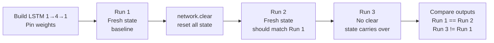

# Sequence Reset (NeatapticTS)

This folder is the third stop in the starter learning path. It uses a small LSTM network with one input and one output to teach the most important operational difference between feed-forward and recurrent networks: **state must be managed explicitly**.

The example keeps the problem minimal on purpose — no training, no evolution, no complex fitness function. Just three controlled sequence passes that isolate one teaching concept per run.



## What This Example Teaches

- how LSTM memory cells accumulate state across time steps so each output depends on the full input history, not just the current input,
- how `network.clear()` resets all node states to zero so the next sequence pass starts from identical initial conditions as a fresh network,
- how skipping `clear()` between two sequence passes changes the initial conditions and produces different outputs from the same input sequence,
- why recurrent networks need explicit state management in any loop that evaluates the same network on independent sequences (separate episodes, independent examples, or new evaluation batches).

## Run The Example

From the repo root:

```bash
npx tsx examples/sequenceReset/run.ts
```

## Minimal Public API Shape

```ts
import { Architect } from '@reicek/neataptic-ts';

const network = Architect.lstm(1, 4, 1);

// Run first sequence from fresh state.
const run1 = [0.1, 0.3, 0.7].map(input => network.activate([input])[0]);

// Reset all accumulated state.
network.clear();

// Run same sequence again — produces identical outputs.
const run2 = [0.1, 0.3, 0.7].map(input => network.activate([input])[0]);

console.log(run1[0] === run2[0]); // true — clear() restored fresh-start behavior
```

## When To Call `clear()`

| Scenario | Call `clear()`? |
|---|---|
| New episode or independent evaluation example | Yes — before each new sequence |
| Rolling window / online learning across one continuous stream | No — state should carry forward |
| Evaluating NEAT population (each genome is an independent agent) | Yes — before each genome's episode |
| Training with BPTT across one contiguous batch | No — state is part of the sequence |

The example deliberately shows both cases side-by-side so the distinction stays concrete.
