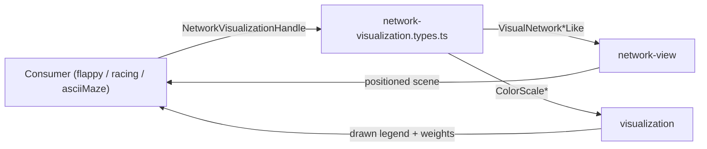

# network-visualization

Shared network-visualization contracts.

These lightweight types let any example render evolved network topology
without depending on a specific demo. They describe the public shapes used
by the architecture panel so rendering logic can stay decoupled from the
full internal network implementation.

The visualization subsystem is split into three responsibilities:
- Types (this file): the public shapes a consumer must provide.
- Network-view: topology resolution and node-positioning.
- Visualization: color scales, drawing, and legend helpers.



## network-visualization.types.ts

### ColorLegendRow

Legend row model for network visualization color legends.

Each row labels a numeric interval and the color used to render it.

### ColorTier

Connection or bias tier used for color mapping ramps.

Visualization buckets continuous weights into legible color bands so humans
can scan sign and magnitude at a glance.

### NetworkHiddenColumnLabelScene

Positioned hidden-column label scene reused by drawing and future hit testing.

Recurrent-aware layouts use these scenes to explain what one hidden column
means, for example an LSTM gate or a NARX delay shelf, without replacing the
underlying node bias encoding.

### NetworkInputDescriptionScene

Positioned input-description row scene reused by drawing and hover hit testing.

Each row maps one human-readable description to one input node so hovering
the text can emphasize the same node the description explains.

### NetworkInputGroupLabelBandScene

Positioned input-group label band scene reused by drawing and hit testing.

The host relies on this exact geometry when category hovers need to
highlight every node in a semantic input group.

### NetworkLegendLayout

Precomputed legend panel layout used by visualization renderer.

Layout is resolved up front so the draw path can stay focused on painting,
not recomputing geometry every frame.

### NetworkNodeDimensionsLike

Pixel dimensions used for network-node rectangle rendering.

Keeping node box dimensions explicit makes legend and topology layout easier
to tune without hidden drawing constants.

### NetworkVisualizationAnimatedHoveredNode

Animated hovered-node intensity sample used during fade transitions.

The host can keep several recent hover targets partially active at once so
quick pointer motion produces overlapping line-emphasis fades
instead of abrupt binary flicker.

### NetworkVisualizationHandle

Browser-facing handle that lets a demo render the champion network panel.

Example:

```ts
const visualizationHandle: NetworkVisualizationHandle = {
  renderNetworkArchitecture: (network, inputSize, outputSize) => {
    renderer.draw(network, inputSize, outputSize);
  },
  applyNetworkActivationOverlay: (network, activations) => {
    network.nodes.forEach((node, i) => {
      node.activation = activations[i] ?? node.activation;
    });
  },
};
visualizationHandle.renderNetworkArchitecture(championNetwork, 5, 2);
visualizationHandle.applyNetworkActivationOverlay(
  championNetwork,
  new Float32Array([0.2, -0.4, 0.9]),
);
```

### NetworkVisualizationHoverState

Browser-owned hover state used by interactive network visualization passes.

Hover is resolved from the canvas pointer and then passed into drawing as a
tiny UI-only contract. Supporting multiple node indices keeps direct node
hover and category combo-hover on the same rendering path, while animated
hover samples let the renderer fade highlights in and out.

### NetworkVisualizationLodSettings

Level-of-detail (LOD) settings for dense-network visualization.

When a network's hidden-node count exceeds `hiddenNodeThreshold`, the shared
visualizer can replace the full-detail graph with a cheap abstraction: input
and output shelves stay fully rendered while hidden nodes collapse into a
few density clusters. Hovering a hidden node expands a deterministic 2-hop
ego neighborhood capped at `hoverMaxLocalNodes` local nodes.

Example:

```ts
const settings: NetworkVisualizationSettings = {
  lod: {
    enabled: true,
    hiddenNodeThreshold: 2048,
    clusterCount: 4,
    hoverMaxLocalNodes: 64,
  },
};
```

### NetworkVisualizationPositionedScene

Reusable positioned-node snapshot returned by the network-view draw path.

The host reuses this exact layout snapshot for pointer hit testing so hover
logic can stay aligned with the scene that was actually rendered.

### NetworkVisualizationTooltipScene

Tooltip scene model resolved from the hovered network overlay target.

The host uses this shape to position and populate the educational tooltip
that appears when the pointer rests on an input node, hidden column, or
semantic input group band.

### PositionedNetworkNodeLike

Positioned node instance used by network visualization drawing.

Layout and rendering are split: first a node is assigned screen coordinates,
then the renderer paints it.

### VisualNetworkConnectionLike

Lightweight connection shape used by network visualization drawing.

The renderer only needs connectivity, weight, and enabled state, not the full
training-time behavior of a connection object.

### VisualNetworkNodeLike

Lightweight node shape used by network visualization drawing.

This shape keeps the renderer independent from the concrete Network class
while still exposing the semantic fields that matter visually.

## network-visualization.constants.ts

Network visualization geometry and tier-mapping constants for the shared
network-visualization domain.

These values define graph padding, node sizing, legend geometry, and tier
thresholds used to map connection and bias magnitudes to color ramps.

### BIAS_TIER_CENTER_THRESHOLD

Bias-tier center threshold around zero.

### BIAS_TIER_EDGE_START_ABS_VALUE

Bias-tier edge region start magnitude.

### BIAS_TIER_MAX_ABS_VALUE

Bias-tier max absolute magnitude used by diverging color tiers.

### CONNECTION_TIER_CENTER_THRESHOLD

Connection-tier center threshold around zero.

Values with a smaller absolute magnitude than this fall into the center tier,
typically rendered as a neutral color.

Example:

```ts
const tinyConnection = 0.05;
const isCenter = Math.abs(tinyConnection) < CONNECTION_TIER_CENTER_THRESHOLD;
```

### CONNECTION_TIER_EDGE_START_ABS_VALUE

Connection-tier edge region start magnitude.

Example:

```ts
const weight = 1.1;
const isEdge = Math.abs(weight) >= CONNECTION_TIER_EDGE_START_ABS_VALUE;
```

### CONNECTION_TIER_MAX_ABS_VALUE

Connection-tier max absolute magnitude used by diverging color tiers.

Example:

```ts
const strongConnection = 1.4;
const isEdge = Math.abs(strongConnection) >= CONNECTION_TIER_EDGE_START_ABS_VALUE;
const isMax = Math.abs(strongConnection) >= CONNECTION_TIER_MAX_ABS_VALUE;
```

### NETWORK_ARCHITECTURE_COLUMN_SEPARATOR

Separator used between architecture columns in the compact header label.

### NETWORK_ARCHITECTURE_LINE_SEPARATOR

Line separator used by the two-line architecture label block.

### NETWORK_BASELINE_HEIGHT_PX

Baseline network panel height before complexity adjustments.

### NETWORK_EMPTY_HIDDEN_LAYER_LABEL

Placeholder label used when the network has no hidden layers.

### NETWORK_GRAPH_BOTTOM_PADDING_PX

Graph-bottom padding for network visualization content.

### NETWORK_GRAPH_INNER_PADDING_PX

Extra inner graph padding for topology-driven sizing.

### NETWORK_GRAPH_LEFT_PADDING_PX

Graph-left padding for network visualization content.

### NETWORK_GRAPH_RIGHT_PADDING_PX

Graph-right padding for network visualization content.

### NETWORK_GRAPH_TOP_PADDING_PX

Graph-top padding for network visualization content.

### NETWORK_HEADER_FONT_SIZE_PX

Header font size for architecture label lines.

### NETWORK_HIDDEN_COLUMN_LABEL_CHARACTER_WIDTH_PX

Approximate monospace character width used to size recurrent guide chips.

### NETWORK_HIDDEN_COLUMN_LABEL_FILL_COLOR

Fill color used by recurrent hidden-column guide chips when no custom color is set.

### NETWORK_HIDDEN_COLUMN_LABEL_FONT_SIZE_PX

Font size used for recurrent hidden-column guide chips.

### NETWORK_HIDDEN_COLUMN_LABEL_FONT_WEIGHT

Font weight used for recurrent hidden-column guide chips.

### NETWORK_HIDDEN_COLUMN_LABEL_GAP_PX

Gap between hidden-column guide chips and the node shelf below.

### NETWORK_HIDDEN_COLUMN_LABEL_LINE_HEIGHT_PX

Line height used for recurrent hidden-column guide chips.

### NETWORK_HIDDEN_COLUMN_LABEL_MIN_WIDTH_PX

Minimum chip width for recurrent hidden-column guide labels.

### NETWORK_HIDDEN_COLUMN_LABEL_RADIUS_PX

Corner radius used by recurrent hidden-column guide chips.

### NETWORK_HIDDEN_COLUMN_LABEL_STROKE_COLOR

Outline color used by recurrent hidden-column guide chips.

### NETWORK_HIDDEN_COLUMN_LABEL_STROKE_WIDTH_PX

Stroke width used by recurrent hidden-column guide chips.

### NETWORK_HIDDEN_COLUMN_LABEL_TEXT_COLOR

Text color used inside recurrent hidden-column guide chips.

### NETWORK_HIDDEN_COLUMN_LABEL_TEXT_PADDING_PX

Horizontal text padding inside recurrent hidden-column guide chips.

### NETWORK_HIDDEN_COLUMN_LABEL_TEXT_VERTICAL_PADDING_PX

Vertical text padding inside recurrent hidden-column guide chips.

### NETWORK_HIDDEN_COLUMN_LABEL_TOP_RESERVE_PX

Reserved vertical shelf for recurrent hidden-column guide chips.

### NETWORK_HIDDEN_LAYER_SEPARATOR

Separator used between hidden-layer sizes inside architecture labels.

### NETWORK_INFERRED_HIDDEN_LAYER_PREFIX

Prefix used when hidden-layer counts are inferred rather than declared.

### NETWORK_INPUT_DESCRIPTION_CHARACTER_WIDTH_PX

Approximate monospace character width used to size the input-description column.

### NETWORK_INPUT_DESCRIPTION_CHIP_VERTICAL_GAP_PX

Minimum vertical gap kept between adjacent input-description chip outlines.

### NETWORK_INPUT_DESCRIPTION_FILL_COLOR

Background fill used by horizontal input-description chips.

### NETWORK_INPUT_DESCRIPTION_FONT_SIZE_PX

Font size used for horizontal input-description rows.

### NETWORK_INPUT_DESCRIPTION_FONT_WEIGHT

Font weight used for horizontal input-description rows.

### NETWORK_INPUT_DESCRIPTION_GAP_PX

Horizontal gap between the input-description column and the input-node column.

### NETWORK_INPUT_DESCRIPTION_LINE_HEIGHT_PX

Vertical distance between wrapped input-description lines.

### NETWORK_INPUT_DESCRIPTION_MIN_HEIGHT_PX

Minimum visual height reserved for one input-description hover row.

### NETWORK_INPUT_DESCRIPTION_MIN_WIDTH_PX

Minimum reserved width for the input-description column.

### NETWORK_INPUT_DESCRIPTION_RADIUS_PX

Corner radius used by horizontal input-description chips.

### NETWORK_INPUT_DESCRIPTION_STROKE_COLOR

Outline color for horizontal input-description chips.

### NETWORK_INPUT_DESCRIPTION_STROKE_WIDTH_PX

Stroke width used by horizontal input-description chips.

### NETWORK_INPUT_DESCRIPTION_TEXT_COLOR

Text color for horizontal input-description rows.

### NETWORK_INPUT_DESCRIPTION_TEXT_PADDING_PX

Inner left padding used by the input-description text column.

### NETWORK_INPUT_DESCRIPTION_TEXT_VERTICAL_PADDING_PX

Inner vertical padding used by outlined input-description chips.

### NETWORK_INPUT_GROUP_LABEL_BAND_GAP_PX

Horizontal gap between the vertical group-band column and the input-description column.

### NETWORK_INPUT_GROUP_LABEL_BAND_WIDTH_PX

Width of the vertical input-group label band.

### NETWORK_INPUT_GROUP_LABEL_FONT_SIZE_PX

Font size used for vertical input-group label text.

### NETWORK_INPUT_GROUP_LABEL_FONT_WEIGHT

Font weight used for vertical input-group label text.

### NETWORK_INPUT_GROUP_LABEL_LINE_HEIGHT_PX

Vertical distance between wrapped input-group label lines.

### NETWORK_INPUT_GROUP_LABEL_MIN_HEIGHT_PX

Minimum visual height for any input-group label band.

### NETWORK_INPUT_GROUP_LABEL_RADIUS_PX

Corner radius used by input-group label band backgrounds.

### NETWORK_INPUT_GROUP_LABEL_TEXT_COLOR

Text color for vertical input-group labels on neon backgrounds.

### NETWORK_INPUT_GROUP_PADDING_PX

Inner vertical padding applied to each semantic input group block.

### NETWORK_INPUT_GROUP_VERTICAL_GAP_PX

Vertical gap kept between adjacent semantic input groups.

### NETWORK_INPUT_LAYER_TARGET_GAP_PX

Preferred vertical spacing between input-layer nodes.

### NETWORK_INPUT_OVERLAY_FOCUS_STROKE_WIDTH_PX

Stroke width used when an input overlay element is actively hovered.

### NETWORK_LAYER_COMPLEXITY_BASELINE_COUNT

Baseline layer-count threshold before layer-complexity height increments apply.

### NETWORK_LAYER_COMPLEXITY_HEIGHT_STEP_PX

Additional height increment per extra layer above baseline.

### NETWORK_LEGEND_BACKGROUND

Legend panel background fill color.

### NETWORK_LEGEND_BOTTOM_PADDING_PX

Legend bottom padding in compact/regular layouts.

### NETWORK_LEGEND_COMPACT_FONT_SIZE_PX

Legend font size for compact mode.

### NETWORK_LEGEND_COMPACT_HEIGHT_THRESHOLD_PX

Compact legend height threshold for network visualization.

### NETWORK_LEGEND_COMPACT_ROW_HEIGHT_PX

Legend row height in compact mode.

### NETWORK_LEGEND_COMPACT_SECTION_GAP_PX

Legend section gap in compact mode.

### NETWORK_LEGEND_COMPACT_SECTION_TITLE_HEIGHT_PX

Legend section title height in compact mode.

### NETWORK_LEGEND_COMPACT_WIDTH_PX

Compact legend panel width.

### NETWORK_LEGEND_COMPACT_WIDTH_THRESHOLD_PX

Compact legend width threshold for network visualization.

### NETWORK_LEGEND_CONNECTION_LINE_WIDTH_PX

Connection row stroke line width in legend.

### NETWORK_LEGEND_GRAPH_GAP_PX

Gap between graph body and floating legend panel.

### NETWORK_LEGEND_HEADER_HEIGHT_PX

Legend header row height.

### NETWORK_LEGEND_MARGIN_PX

Legend panel outer margin.

### NETWORK_LEGEND_MIN_TOP_PX

Minimum top clamp for legend placement.

### NETWORK_LEGEND_REGULAR_FONT_SIZE_PX

Legend font size for regular mode.

### NETWORK_LEGEND_REGULAR_ROW_HEIGHT_PX

Legend row height in regular mode.

### NETWORK_LEGEND_REGULAR_SECTION_GAP_PX

Legend section gap in regular mode.

### NETWORK_LEGEND_REGULAR_SECTION_TITLE_HEIGHT_PX

Legend section title height in regular mode.

### NETWORK_LEGEND_REGULAR_WIDTH_PX

Regular legend panel width.

### NETWORK_LEGEND_RIGHT_SIDE_THRESHOLD_RATIO

Ratio used to decide whether the legend occupies the right half of the canvas.

### NETWORK_LEGEND_TARGET_TOP_PX

Target top offset used for legend placement.

### NETWORK_LEGEND_TOP_LEFT_THRESHOLD_PX

Canvas width threshold to prefer top-left legend placement.

### NETWORK_LOD_CANVAS_BACKGROUND

Canvas background painted by the shared LOD renderer.

### NETWORK_LOD_CLUSTER_CONNECTION_DEFAULT_OPACITY

Default opacity for abstract LOD cluster connection strokes.

### NETWORK_LOD_CLUSTER_CONNECTION_RGB

RGB triplet used to build abstract LOD cluster connection strokes.

### NETWORK_LOD_CLUSTER_HEIGHT_PX

Height of one LOD hidden-density cluster marker.

### NETWORK_LOD_CLUSTER_WIDTH_PX

Width of one LOD hidden-density cluster marker.

### NETWORK_LOD_CONNECTION_LINE_WIDTH_PX

Default connection line width used by the LOD renderer.

### NETWORK_LOD_EGO_CONNECTION_DEFAULT_OPACITY

Default opacity for hovered ego-neighborhood connection strokes.

### NETWORK_LOD_EGO_CONNECTION_RGB

RGB triplet used to build hovered ego-neighborhood connection strokes.

### NETWORK_LOD_EGO_DETAIL_FILL

Fill color for hovered ego-neighborhood detail nodes.

### NETWORK_LOD_EGO_LABEL_WIDTH_PX

Width of the hovered hidden-node ego-neighborhood banner.

### NETWORK_LOD_GRAPH_BOTTOM_PADDING_PX

Bottom padding around the LOD graph area.

### NETWORK_LOD_GRAPH_TOP_PADDING_PX

Top padding around the LOD graph area.

### NETWORK_LOD_HIDDEN_CLUSTER_COUNT

Number of abstract hidden clusters rendered by the shared LOD renderer.

### NETWORK_LOD_HIDDEN_CLUSTER_FILL

Fill color for LOD hidden-density cluster markers.

### NETWORK_LOD_HIDDEN_NODE_THRESHOLD

Hidden-node count above which the shared LOD abstraction activates.

### NETWORK_LOD_HOVER_MAX_LOCAL_NODES

Maximum local nodes rendered when hovering a hidden node in LOD mode.

### NETWORK_LOD_INPUT_LABEL_BAND_WIDTH_PX

Width of the vertical LOD input-group label band.

### NETWORK_LOD_INPUT_LABEL_LEFT_PADDING_PX

Left label-column padding reserved for LOD input descriptions and bands.

### NETWORK_LOD_INPUT_LEFT_RESERVE_PX

Left reserve between the LOD input-label column and the first input node.

### NETWORK_LOD_INPUT_NODE_FILL

Fill color for LOD input-shelf nodes.

### NETWORK_LOD_NODE_HEIGHT_PX

Height of one LOD shelf node.

### NETWORK_LOD_NODE_STROKE_COLOR

Outline stroke color for LOD nodes.

### NETWORK_LOD_NODE_STROKE_WIDTH_PX

Outline stroke width for LOD nodes.

### NETWORK_LOD_NODE_WIDTH_PX

Width of one LOD shelf node.

### NETWORK_LOD_OUTPUT_NODE_FILL

Fill color for LOD output-shelf nodes.

### NETWORK_LOD_OUTPUT_RIGHT_RESERVE_PX

Right canvas reserve that keeps output-node labels on-screen in LOD mode.

### NETWORK_MAX_HEIGHT_PX

Maximum clamped network panel height.

### NETWORK_MAX_NODE_HEIGHT_PX

Maximum node height in network visualization.

### NETWORK_MAX_NODE_WIDTH_PX

Maximum node width in network visualization.

### NETWORK_MIN_DRAWABLE_SIZE_PX

Minimum drawable graph dimension after padding is removed.

### NETWORK_MIN_HEIGHT_PX

Minimum clamped network panel height.

### NETWORK_MIN_INTER_NODE_GAP_PX

Minimum inter-node vertical gap for topology-driven sizing.

### NETWORK_MIN_LABEL_HEIGHT_PX

Minimum node label height in pixels.

### NETWORK_MIN_NODE_FIT_HEIGHT_PX

Minimum fit-based node height before width and label constraints are applied.

### NETWORK_MIN_NODE_HEIGHT_LABEL_EXTRA_PX

Extra pixel allowance above label baseline for minimum node-height readability.

### NETWORK_MIN_NODE_INNER_PADDING_PX

Minimum inner padding for node labels.

### NETWORK_MIN_NODE_WIDTH_PX

Minimum node width in network visualization.

### NETWORK_NODE_DENSITY_BASELINE_COUNT

Baseline node-count threshold before node-density height increments apply.

### NETWORK_NODE_DENSITY_HEIGHT_STEP_PX

Additional height increment per node above baseline density.

### NETWORK_NODE_HEIGHT_DENSITY_DIVISOR

Layer-fit divisor used when deriving max node height from dense layer stacks.

Larger values keep nodes shorter in dense topologies so labels remain legible.

### NETWORK_NODE_HEIGHT_DENSITY_MIN_DENOMINATOR

Minimum denominator clamp for dense-layer node-height derivation.

### NETWORK_NODE_HEIGHT_LAYER_WIDTH_DIVISOR

Width-fit divisor used when deriving node height from layer count.

### NETWORK_NODE_HEIGHT_LAYER_WIDTH_MIN_DENOMINATOR

Minimum denominator clamp for layer-width node-height derivation.

### NETWORK_NODE_LABEL_FONT_WEIGHT

Font-weight used when rendering node bias values.

### NETWORK_NODE_LABEL_SIZE_RATIO

Relative label-height ratio used when rendering node bias values.

### NETWORK_NODE_LAYOUT_PADDING_PX

Inner node-layout padding inside drawable network region.

### NETWORK_NODE_TOP_MARGIN_PX

Fixed top margin for node stacks inside the network drawable area.

### NETWORK_NODE_WIDTH_LAYER_WIDTH_DIVISOR

Width-fit divisor used when deriving node width from layer count.

### NETWORK_NODE_WIDTH_LAYER_WIDTH_MIN_DENOMINATOR

Minimum denominator clamp for layer-width node-width derivation.

### NETWORK_NODE_WIDTH_TO_HEIGHT_RATIO

Width-to-height ratio used for node rectangle proportions.

### NETWORK_TOPOLOGY_HEIGHT_MULTIPLIER

Additional multiplier used for topology-driven minimum host-height recommendation.

### TIER_EDGE_COUNT

Number of linearly distributed edge tiers near maximum magnitudes.

### TIER_LOGARITHMIC_STEEPNESS

Shared logarithmic steepness for diverging color tier mapping.

## network-visualization.math.utils.ts

Shared math utilities for the network-visualization domain.

Keep these helpers self-contained so the visualizer stays dependency-free
and can be imported by any example without pulling in core library internals.

### clamp

```ts
clamp(
  value: number,
  minimum: number,
  maximum: number,
): number
```

Clamps a numeric value to the inclusive `[minimum, maximum]` range.

Parameters:
- `value` - Value to clamp.
- `minimum` - Lower bound.
- `maximum` - Upper bound.

Returns: Clamped value.

## network-visualization.lod.service.ts

Shared level-of-detail (LOD) network-visualization service.

The full-detail network view draws every node and edge, which collapses FPS
once networks grow past a few hundred nodes. This module replaces that
full-detail path for dense networks with a cheap abstraction:

- input and output shelves are always rendered in full so tooltips and
  output labels keep working;
- hidden nodes above a threshold are collapsed into a handful of density
  clusters;
- hovering a hidden node expands a deterministic 2-hop ego neighborhood so
  the user can still inspect local topology without redrawing the whole
  graph.

The renderer stays host-agnostic: semantic input labels are threaded in as
plain {@link InputLabelGroupDefinition} groups, and the orchestrator in
`network-view/network-view.ts` branches to this service when the settings
bag enables LOD for a dense network.

### buildLodAdjacencyMap

```ts
buildLodAdjacencyMap(
  network: default,
): Map<number, number[]>
```

Builds a bidirectional adjacency map from connections and self-connections.

### buildPositionByNodeIndex

```ts
buildPositionByNodeIndex(
  positionedNodes: readonly PositionedNetworkNodeLike[],
): Map<number, PositionedNetworkNodeLike>
```

Builds a node-index lookup map for resolved positioned nodes.

### collectLodNodesByType

```ts
collectLodNodesByType(
  network: default,
  nodeType: "input" | "hidden" | "output",
): default[]
```

Filters the runtime node list by visual layer type.

### drawAbstractLodNodesAndConnections

```ts
drawAbstractLodNodesAndConnections(
  context: CanvasRenderingContext2D,
  scene: NetworkVisualizationPositionedScene,
  connectionLayerStyle: Partial<WeightedConnectionLayerStyle> | undefined,
): void
```

Paints abstract shelf nodes, cluster markers, and density bundles.

### drawEgoDetailOverlay

```ts
drawEgoDetailOverlay(
  context: CanvasRenderingContext2D,
  detail: EgoDetailScene,
  connectionLayerStyle: Partial<WeightedConnectionLayerStyle> | undefined,
): void
```

Paints the hovered ego-neighborhood overlay above the abstract scene.

### drawNetworkLODFromFrame

```ts
drawNetworkLODFromFrame(
  context: CanvasRenderingContext2D,
  resolvedFrame: NetworkVisualizationLODResolvedFrame,
  hoveredNodeIndices: readonly number[] | undefined,
  connectionLayerStyle: Partial<WeightedConnectionLayerStyle> | undefined,
): NetworkVisualizationPositionedScene
```

Draw a previously resolved LOD frame, optionally expanding a hovered ego
graph.

Parameters:
- `context` - Canvas 2D context to paint on.
- `resolvedFrame` - LOD frame produced by  {@link resolveNetworkLODFrame} .
- `hoveredNodeIndices` - Optional host-owned hovered node ids.
- `connectionLayerStyle` - Optional override for connection stroke visibility.

Returns: Positioned node snapshot reused by host-side hover hit testing.

Example:

```ts
const scene = drawNetworkLODFromFrame(context, frame, [hoveredNodeIndex]);
```

### EgoDetailScene

Hovered ego-neighborhood overlay produced for one LOD draw pass.

### isNetworkLODResolvedFrame

```ts
isNetworkLODResolvedFrame(
  resolvedFrame: NetworkVisualizationResolvedFrame,
): boolean
```

Type guard for frames produced by {@link resolveNetworkLODFrame}.

Parameters:
- `resolvedFrame` - Any resolved network-visualization frame.

Returns: `true` when the frame was produced by the LOD renderer.

Example:

```ts
if (isNetworkLODResolvedFrame(frame)) {
  drawNetworkLODFromFrame(context, frame, hoveredNodeIndices);
}
```

### LodGeometry

Geometry box shared by LOD scene resolution and drawing.

### NetworkVisualizationLODFrameOptions

Optional tuning bag for the shared LOD renderer.

### NetworkVisualizationLODResolvedFrame

Branded resolved frame produced by the shared LOD renderer.

### paintLodCanvasBase

```ts
paintLodCanvasBase(
  context: CanvasRenderingContext2D,
  resolvedFrame: NetworkVisualizationLODResolvedFrame,
): void
```

Paints the LOD canvas base color for the resolved frame.

### positionEgoHiddenNodes

```ts
positionEgoHiddenNodes(
  hiddenIndices: readonly number[],
  geometry: LodGeometry,
): PositionedNetworkNodeLike[]
```

Places hidden ego-detail nodes on a deterministic grid inside the graph.

### resolveAbstractLodPositionedScene

```ts
resolveAbstractLodPositionedScene(
  network: default,
  canvasWidthPx: number,
  canvasHeightPx: number,
  clusterCount: number,
  inputLabelGroupDefinitions: readonly InputLabelGroupDefinition[] | undefined,
): NetworkVisualizationPositionedScene
```

Resolves the abstract positioned scene for one dense network frame.

### resolveHoveredEgoDetail

```ts
resolveHoveredEgoDetail(
  network: default,
  hoveredNodeIndices: readonly number[],
  geometry: LodGeometry,
  hoverMaxLocalNodes: number,
): EgoDetailScene | undefined
```

Resolves the hovered hidden node's capped 2-hop ego-neighborhood overlay.

### resolveLodGeometry

```ts
resolveLodGeometry(
  canvasWidthPx: number,
  canvasHeightPx: number,
): LodGeometry
```

Resolves the shared LOD geometry box from the canvas backing store.

### resolveLodHiddenClusterLabelScenes

```ts
resolveLodHiddenClusterLabelScenes(
  hiddenClusterNodes: readonly PositionedNetworkNodeLike[],
): NetworkHiddenColumnLabelScene[]
```

Resolves one density-cluster chip per abstract hidden marker.

### resolveLodHiddenClusterNodes

```ts
resolveLodHiddenClusterNodes(
  network: default,
  geometry: LodGeometry,
  clusterCount: number,
): PositionedNetworkNodeLike[]
```

Resolves one abstract hidden-density cluster marker per hidden slice.

### resolveLodInputDescriptionScenes

```ts
resolveLodInputDescriptionScenes(
  inputNodes: readonly PositionedNetworkNodeLike[],
  inputLabelGroupDefinitions: readonly InputLabelGroupDefinition[] | undefined,
): NetworkInputDescriptionScene[]
```

Resolves one horizontal description chip per bound input node row.

### resolveLodInputGroupLabelBandScenes

```ts
resolveLodInputGroupLabelBandScenes(
  inputNodes: readonly PositionedNetworkNodeLike[],
  inputLabelGroupDefinitions: readonly InputLabelGroupDefinition[] | undefined,
): NetworkInputGroupLabelBandScene[]
```

Resolves one vertical semantic band per provided input-label group.

### resolveLodInputPositionedNodes

```ts
resolveLodInputPositionedNodes(
  network: default,
  geometry: LodGeometry,
): PositionedNetworkNodeLike[]
```

Resolves the fully positioned input shelf for the LOD scene.

### resolveLodOutputPositionedNodes

```ts
resolveLodOutputPositionedNodes(
  network: default,
  geometry: LodGeometry,
): PositionedNetworkNodeLike[]
```

Resolves the fully positioned output shelf for the LOD scene.

### resolveNetworkLODFrame

```ts
resolveNetworkLODFrame(
  context: CanvasRenderingContext2D,
  network: default,
  inputSize: number,
  outputSize: number,
  lodOptions: NetworkVisualizationLODFrameOptions | undefined,
): NetworkVisualizationLODResolvedFrame
```

Resolve a reusable LOD frame for a dense network.

The frame keeps input and output shelves fully positioned, collapses hidden
nodes into abstract density clusters, and carries the tuning needed by
hover-only redraws.

Parameters:
- `context` - Canvas 2D context used for sizing.
- `network` - Network to abstract.
- `inputSize` - Expected input node count.
- `outputSize` - Expected output node count.
- `lodOptions` - Optional LOD tuning (cluster count, hover budget, labels).

Returns: Branded LOD frame.

Example:

```ts
const frame = resolveNetworkLODFrame(canvasContext, denseNetwork, 70, 2);
```

### resolveTwoHopEgoIndices

```ts
resolveTwoHopEgoIndices(
  network: default,
  startIndex: number,
  maxNodes: number,
): number[]
```

Walks a capped 2-hop breadth-first neighborhood from one node index.

### shouldUseNetworkLOD

```ts
shouldUseNetworkLOD(
  network: default | undefined,
  hiddenNodeThreshold: number,
): boolean
```

Decide whether a network is large enough to warrant the LOD abstraction.

Parameters:
- `network` - Network to inspect, or `undefined`.
- `hiddenNodeThreshold` - Hidden-node count above which LOD should activate.

Returns: `true` when LOD should be used.

Example:

```ts
if (shouldUseNetworkLOD(network, NETWORK_LOD_HIDDEN_NODE_THRESHOLD)) {
  frame = resolveNetworkLODFrame(context, network, 70, 2);
}
```

## network-visualization.tooltip.service.ts

### NetworkVisualizationCanvasPointLike

Canvas-space point used when resolving network tooltip targets.

### resolveNetworkVisualizationTooltipScene

```ts
resolveNetworkVisualizationTooltipScene(
  canvasPoint: NetworkVisualizationCanvasPointLike,
  positionedScene: NetworkVisualizationPositionedScene,
): NetworkVisualizationTooltipScene | undefined
```

Resolves the tooltip scene for the current hovered network overlay target.

Hit-test priority, from narrowest to broadest:
1. Hidden-column node hit.
2. Input node hit.
3. Hidden-column label region.
4. Input description region.
5. Input group label band.

Input descriptions and input nodes intentionally share the same tooltip copy,
while semantic group bands resolve a broader group-level teaching tooltip.

Parameters:
- `canvasPoint` - Hover point in network-canvas coordinates.
- `positionedScene` - Rendered positioned scene reused for hover hit testing.

Returns: Tooltip scene model for the hovered overlay target, or undefined.

Example:

```ts
const scene = resolveNetworkVisualizationFrame(context, network, inputSize, outputSize);
const tooltip = resolveNetworkVisualizationTooltipScene({ xPx: 120, yPx: 80 }, scene);
if (tooltip) {
  showTooltip(tooltip.heading, tooltip.bodyParagraphs, tooltip.anchorCenterXPx, tooltip.anchorTopPx);
}
```
