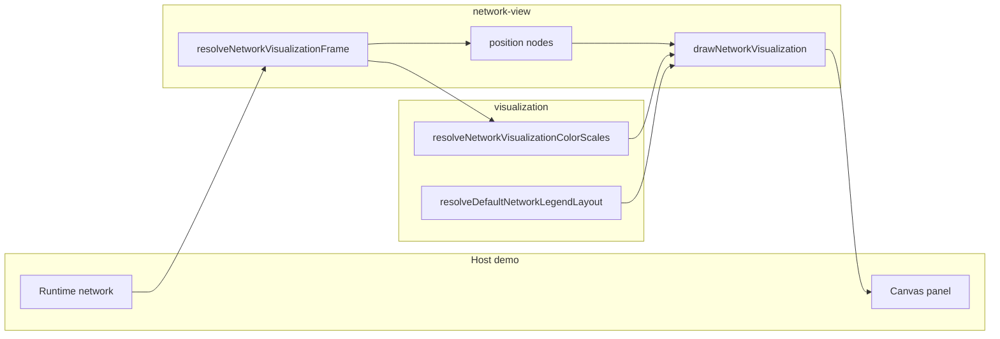

# network-view

Network-view orchestration for the browser-side architecture panel.

This module is the browser-facing fold from a live evolved controller to a
readable inspection panel. It does not own the low-level drawing primitives,
and it does not invent topology semantics from scratch. Instead it composes
both into one higher-level question: how should this network be laid out so a
human can actually learn from it?

The boundary exists because "draw the network" hides several distinct jobs:
summarize topology, size the panel, place nodes, choose overlay policy, and
then delegate the final painting work. Keeping those steps together here makes
the generated README read like an inspection chapter instead of a pile of
canvas helpers.



Examples:

```ts
const frame = resolveNetworkVisualizationFrame(
  canvasContext,
  bestNetwork,
  5,
  2,
);
console.log(frame.positionedScene.positionedNodes.length);
```

```ts
// Minimal settings usage — an empty bag renders with the NETWORK_* defaults.
drawNetworkVisualization(canvasContext, network, 5, 2, undefined, undefined, {});
```

## network-view/network-view.ts

### applyNetworkVisualizationPaletteToColorScales

```ts
applyNetworkVisualizationPaletteToColorScales(
  colorScales: NetworkVisualizationColorScales,
  palette: Partial<NetworkVisualizationPalette> | undefined,
): NetworkVisualizationColorScales
```

Applies a host palette to resolved color scales without mutating the input.

When a palette is provided, its currentRunText color becomes the
above-tier fallback color for both the connection and bias scales. When no
palette is provided the resolved scales pass through unchanged, keeping
zero-settings renders value-identical to the pre-settings behavior.

Parameters:
- `colorScales` - Color scales resolved from the active network.
- `palette` - Optional host palette with the fields it wants to override.

Returns: Color scales with palette overrides applied.

### clampRecommendedNetworkHeightPx

```ts
clampRecommendedNetworkHeightPx(
  recommendedHeightPx: number,
): number
```

Clamps a recommended network height into the configured panel range.

Parameters:
- `recommendedHeightPx` - Recommended panel height.

Returns: Clamped panel height.

### createPositionByNodeIndex

```ts
createPositionByNodeIndex(
  centeredPositionedNodes: PositionedNetworkNodeLike[],
): Map<number, PositionedNetworkNodeLike>
```

Builds a node-index lookup map for resolved positioned nodes.

Parameters:
- `centeredPositionedNodes` - Positioned nodes after centering.

Returns: Map keyed by node index.

### drawNetworkVisualization

```ts
drawNetworkVisualization(
  context: CanvasRenderingContext2D,
  network: default | undefined,
  inputSize: number,
  outputSize: number,
  hoverState: NetworkVisualizationHoverState | undefined,
  connectionLayerStyle: Partial<WeightedConnectionLayerStyle> | undefined,
  settings: NetworkVisualizationSettings | undefined,
): NetworkVisualizationPositionedScene
```

Draws a complete, layer-based visualization of the active network.

Conceptually, this is the main fold from network object to finished panel:
resolve scene state, compute layout, paint the graph, then paint overlays.
An optional {@link NetworkVisualizationSettings} bag lets the host thread
custom colors, fonts, ramps, and input-label groups without changing the
shared visualizer code.

Parameters:
- `context` - Canvas 2D drawing context.
- `network` - Network to visualize.
- `inputSize` - Input-layer size.
- `outputSize` - Output-layer size.
- `hoverState` - Optional host-owned hover state for interactive emphasis.
- `connectionLayerStyle` - Optional override for connection stroke visibility.
- `settings` - Optional host settings bag (input label groups, canvas background, palette).

Returns: Positioned node snapshot reused by host-side hover hit testing.

Example:

```ts
drawNetworkVisualization(networkContext, bestNetwork, 12, 2, undefined, undefined, {
  canvasBackground: '#02050c',
  fontFamily: 'Consolas, monospace',
});
```

### drawPositionedNetworkGraph

```ts
drawPositionedNetworkGraph(
  context: CanvasRenderingContext2D,
  resolvedNetworkVisualizationFrame: NetworkVisualizationResolvedFrame,
  hoverState: NetworkVisualizationHoverState | undefined,
  connectionLayerStyle: Partial<WeightedConnectionLayerStyle> | undefined,
  settings: NetworkVisualizationSettings | undefined,
): void
```

Draws the positioned graph layers and optional guide overlays.

Parameters:
- `context` - Canvas 2D drawing context.
- `resolvedNetworkVisualizationFrame` - Resolved network visualization frame containing positioned scene, connections, and color scales.
- `hoverState` - Optional host-owned hover state for interactive emphasis.
- `connectionLayerStyle` - Optional override for connection stroke visibility.

Returns: Nothing.

### drawResolvedNetworkVisualization

```ts
drawResolvedNetworkVisualization(
  context: CanvasRenderingContext2D,
  resolvedNetworkVisualizationFrame: NetworkVisualizationResolvedFrame,
  hoverState: NetworkVisualizationHoverState | undefined,
  connectionLayerStyle: Partial<WeightedConnectionLayerStyle> | undefined,
): NetworkVisualizationPositionedScene
```

Draws a previously resolved network-visualization frame.

The host uses this path for hover-only repaint work because it can reuse the
cached static frame and only vary interactive emphasis. After painting, the
context fill style is left at the panel base color so every draw pass rests
in a known terminal state.

Parameters:
- `context` - Canvas 2D drawing context.
- `resolvedNetworkVisualizationFrame` - Reusable frame cache.
- `hoverState` - Optional host-owned hover state for interactive emphasis.
- `connectionLayerStyle` - Optional override for connection stroke visibility.

Returns: Positioned node snapshot reused by host-side hover hit testing.

### formatArchitectureLabel

```ts
formatArchitectureLabel(
  architectureInputSize: number,
  hiddenLayersLabel: string,
  architectureOutputSize: number,
  totalNodeCount: number,
  totalConnectionCount: number,
  schedulingStatusLine: string | null | undefined,
): string
```

Formats the two-line architecture label used by the header and legend.

Parameters:
- `architectureInputSize` - Input layer size.
- `hiddenLayersLabel` - Hidden-layer description.
- `architectureOutputSize` - Output layer size.
- `totalNodeCount` - Total node count.
- `totalConnectionCount` - Total connection count.

Returns: Formatted architecture label.

### NetworkVisualizationResolvedFrame

Reusable resolved frame cache for hover-only network redraws.

The host can keep this resolved frame between pointer-driven redraws so it
does not recompute topology, layout, legend inputs, or connection lookups
until the network payload or canvas size changes.

### paintNetworkVisualizationCanvasBase

```ts
paintNetworkVisualizationCanvasBase(
  context: CanvasRenderingContext2D,
  networkVisualizationScene: Pick<NetworkVisualizationResolvedFrame, "canvasBackground" | "canvasWidthPx" | "canvasHeightPx">,
): void
```

Paints the static background fill for the network visualization canvas.

Parameters:
- `context` - Canvas 2D drawing context.
- `networkVisualizationScene` - Frame scene context.

Returns: Nothing.

### resolveAdjustedGraphPaddingContext

```ts
resolveAdjustedGraphPaddingContext(
  context: CanvasRenderingContext2D,
  network: default | undefined,
  canvasWidthPx: number,
  hideNetworkOverlays: boolean,
  graphPaddingContext: NetworkGraphPaddingContext,
): Pick<NetworkGraphPaddingContext, "graphLeftPaddingPx" | "graphRightPaddingPx">
```

Adjusts graph-side padding to keep the floating legend from overlapping nodes.

Parameters:
- `context` - Canvas 2D drawing context.
- `network` - Network to visualize.
- `canvasWidthPx` - Canvas width.
- `hideNetworkOverlays` - Whether overlays are hidden.
- `graphPaddingContext` - Base graph padding context.

Returns: Adjusted graph padding context.

### resolveBaseGraphPaddingContext

```ts
resolveBaseGraphPaddingContext(
  hideNetworkOverlays: boolean,
  inputNodeCount: number,
  network: default | undefined,
  inputLabelGroupDefinitions: readonly InputLabelGroupDefinition[] | undefined,
): NetworkGraphPaddingContext
```

Resolves the base graph padding before legend-aware adjustments are applied.

Returns: Base graph padding context.

### resolveHiddenLayersLabel

```ts
resolveHiddenLayersLabel(
  hiddenLayerSizes: number[],
  architectureSource: "layer-metadata" | "graph-topology" | "inferred",
): string
```

Resolves the hidden-layer portion of the compact architecture label.

Parameters:
- `hiddenLayerSizes` - Hidden-layer sizes.
- `architectureSource` - Architecture source metadata.

Returns: Hidden-layer label.

### resolveNetworkArchitectureLabel

```ts
resolveNetworkArchitectureLabel(
  network: default | undefined,
  inputSize: number,
  outputSize: number,
): string
```

Resolves compact architecture label text for headers and HUD rows.

The label compresses the active network into a short human-readable summary:
input size, hidden-layer structure, output size, and graph size metadata.
When a runtime network is present, explicit input/output role metadata is
treated as the authoritative boundary size instead of the caller's fallback
hints so the browser panel reflects the network's current public contract.
The label can also append a compact scheduling line when the runtime exposes
a non-standard activation contract such as recurrent execution or cycle
fallback behavior.

Parameters:
- `network` - Network to describe.
- `inputSize` - Configured input size.
- `outputSize` - Configured output size.

Returns: Readable architecture label.

### resolveNetworkCanvasBackground

```ts
resolveNetworkCanvasBackground(
  settings: NetworkVisualizationSettings | undefined,
): string
```

Resolves the canvas background fill for a resolved frame.

Parameters:
- `settings` - Optional host settings bag.

Returns: Host canvas background when provided, otherwise the network default.

### resolveNetworkDrawableArea

```ts
resolveNetworkDrawableArea(
  networkVisualizationScene: NetworkVisualizationScene,
): NetworkDrawableArea
```

Resolves the drawable graph area after scene padding is applied.

Parameters:
- `networkVisualizationScene` - Frame scene context.

Returns: Drawable area dimensions.

### resolveNetworkNodeDimensionsFromTopologySummary

```ts
resolveNetworkNodeDimensionsFromTopologySummary(
  networkTopologySummary: NetworkTopologySummary,
  drawableWidthPx: number,
  drawableHeightPx: number,
): NetworkNodeDimensionsLike
```

Resolves node rectangle dimensions from topology density and drawable bounds.

Parameters:
- `networkTopologySummary` - Topology summary.
- `drawableWidthPx` - Drawable graph width.
- `drawableHeightPx` - Drawable graph height.

Returns: Node dimensions.

### resolveNetworkTopologySummary

```ts
resolveNetworkTopologySummary(
  network: default | undefined,
  inputSize: number,
  outputSize: number,
  lightNeonRamp: readonly string[] | undefined,
): NetworkTopologySummary
```

Resolves a reusable topology summary for layout and sizing helpers.

Parameters:
- `network` - Network to visualize.
- `inputSize` - Input-layer size.
- `outputSize` - Output-layer size.

Returns: Topology summary.

### resolveNetworkVisualizationFrame

```ts
resolveNetworkVisualizationFrame(
  context: CanvasRenderingContext2D,
  network: default | undefined,
  inputSize: number,
  outputSize: number,
  inputLabelGroupDefinitions: readonly InputLabelGroupDefinition[] | undefined,
  settings: NetworkVisualizationSettings | undefined,
): NetworkVisualizationResolvedFrame
```

Resolves a reusable network-visualization frame from the active payload.

This fold captures the expensive static work for the panel in one object so
hover-only redraws can repaint from cached layout and legend data. Pass a
{@link NetworkVisualizationSettings} bag to override defaults; when both the
direct `inputLabelGroupDefinitions` parameter and `settings` provide groups,
the settings bag wins.

Parameters:
- `context` - Canvas 2D drawing context.
- `network` - Network to visualize.
- `inputSize` - Input-layer size.
- `outputSize` - Output-layer size.
- `inputLabelGroupDefinitions` - Optional semantic input-label group definitions.
- `settings` - Optional host settings bag; settings fields win over direct parameters.
When `settings.lod` is enabled and the hidden-node count exceeds the
configured threshold, the frame is produced by the shared LOD renderer
instead of the full-detail graph path.

Returns: Reusable resolved frame for subsequent draw passes.

Example:

```ts
const frame = resolveNetworkVisualizationFrame(
  canvasContext,
  bestNetwork,
  12,
  2,
  [],
  { canvasBackground: '#02050c' },
);
```

### resolveNetworkVisualizationHeightPx

```ts
resolveNetworkVisualizationHeightPx(
  network: default | undefined,
  inputSize: number,
  outputSize: number,
): number
```

Resolves responsive visualization canvas height from network shape.

Dense or deeper networks need more vertical room to stay readable, so panel
height is driven by topology rather than fixed to a single constant.

Parameters:
- `network` - Network to visualize.
- `inputSize` - Input-layer size.
- `outputSize` - Output-layer size.

Returns: Recommended height in pixels.

Example:

```ts
const recommendedHeightPx = resolveNetworkVisualizationHeightPx(network, 12, 2);
```

### resolveNetworkVisualizationScene

```ts
resolveNetworkVisualizationScene(
  context: CanvasRenderingContext2D,
  network: default | undefined,
  inputSize: number,
  outputSize: number,
  inputLabelGroupDefinitions: readonly InputLabelGroupDefinition[] | undefined,
  settings: NetworkVisualizationSettings | undefined,
): NetworkVisualizationScene
```

Resolves all non-topology canvas state needed to draw the network view.

This separates frame-scene concerns such as canvas size, overlays, and color
scales from the later graph-topology layout step.

Parameters:
- `context` - Canvas 2D drawing context.
- `network` - Network to visualize.
- `inputSize` - Input-layer size.
- `outputSize` - Output-layer size.

Returns: Scene context for the current frame.

### resolvePositionedNetworkGraphScene

```ts
resolvePositionedNetworkGraphScene(
  networkVisualizationScene: NetworkVisualizationScene,
  network: default | undefined,
  inputSize: number,
  outputSize: number,
  inputLabelGroupDefinitions: readonly InputLabelGroupDefinition[] | undefined,
  settings: NetworkVisualizationSettings | undefined,
): PositionedNetworkGraphScene
```

Resolves positioned nodes, connection lookup state, and shared node dimensions.

Parameters:
- `networkVisualizationScene` - Frame scene context.
- `network` - Network to visualize.
- `inputSize` - Input-layer size.
- `outputSize` - Output-layer size.

Returns: Positioned graph scene.

### resolveRecommendedNetworkHeightPx

```ts
resolveRecommendedNetworkHeightPx(
  networkTopologySummary: NetworkTopologySummary,
  topologyDrivenHeightPx: number,
): number
```

Resolves the recommended panel height from topology and density adjustments.

Parameters:
- `networkTopologySummary` - Topology summary.
- `topologyDrivenHeightPx` - Minimum readable topology height.

Returns: Recommended panel height.

### resolveRuntimeConnections

```ts
resolveRuntimeConnections(
  network: default | undefined,
): VisualNetworkConnectionLike[]
```

Resolves the runtime connection array from the active network.

Parameters:
- `network` - Network to visualize.

Returns: Runtime connection list.

### resolveSchedulingExecutionLabel

```ts
resolveSchedulingExecutionLabel(
  executionPath: ActivationSchedulingExecutionPath,
): string
```

Resolve a short human-readable execution label for browser architecture text.

Parameters:
- `executionPath` - Scheduling execution path reported by the runtime.

Returns: Compact browser-facing label.

### resolveSchedulingStatusLine

```ts
resolveSchedulingStatusLine(
  network: default,
): string | null
```

Resolve a compact scheduling status line for the architecture label.

The browser panel should stay quiet for the standard feed-forward contract,
but it should surface a small extra line when a network is recurrent or when
acyclic scheduling fell back because of a detected cycle.

Parameters:
- `network` - Network being visualized.

Returns: Scheduling status line or null for the normal feed-forward path.

### resolveTopologyDrivenHeightPx

```ts
resolveTopologyDrivenHeightPx(
  networkTopologySummary: NetworkTopologySummary,
): number
```

Resolves the topology-driven minimum readable height.

Parameters:
- `networkTopologySummary` - Topology summary.

Returns: Minimum readable height in pixels.

### shouldHideNetworkOverlays

```ts
shouldHideNetworkOverlays(
  context: CanvasRenderingContext2D,
  overlayHiddenBreakpointPx: number | undefined,
): boolean
```

Determines whether responsive rules hide auxiliary network overlays.

Parameters:
- `context` - Canvas 2D drawing context.
- `overlayHiddenBreakpointPx` - Optional viewport breakpoint from settings.

Returns: True when overlays should be hidden.

## network-view/network-view.types.ts

Shared type contracts for network-view overlays.

The most notable overlays are the input-group label bands and the per-input
row descriptions. Together they turn a raw input shelf into a readable
teaching surface instead of a flat strip of anonymous nodes.

### InputGroupLabelBand

Input-group label band geometry and style contract.

Each band identifies a contiguous span of input nodes and the visual style
used to render that group marker.

### InputLabelGroupDefinition

One reusable semantic input group definition for the shared network visualizer.

### InputLabelNodeDefinition

One reusable description definition before it is bound to a concrete node row.

### InputNodeDescriptionLabel

One horizontal description aligned to a specific input node.

The label sits between the semantic group band and the network itself so the
viewer can understand each observation channel without inspecting source.

### NetworkVisualizationPalette

Theme palette fields consumed by the shared network visualizer.

The contract grows additively as more consumers are threaded through the
settings bag; today `currentRunText` drives the above-tier fallback and
legend current-run text, while `statusText` drives legend stroke and overlay
focus accents.

Example:

```ts
const palette: NetworkVisualizationPalette = {
  currentRunText: '#00ff66',
  statusText: '#ff5cff',
};
```

### NetworkVisualizationSettings

Host-supplied settings bag for the shared network visualization panel.

Every field is optional so existing host calls keep rendering
value-identically; provided fields are layered over the NETWORK_* defaults
in network-view.constants.ts.

Example:

```ts
const settings: NetworkVisualizationSettings = {
  inputLabelGroupDefinitions: [],
  canvasBackground: '#02050c',
  palette: { currentRunText: '#00ff66' },
};
```

### NetworkVisualizationThemeColors

Theme colors used for headers, node labels, and legend chrome.

All fields are optional; omitted colors fall back to the NETWORK_* defaults
so zero-settings consumers render value-identically.

## network-view/network-view.constants.ts

Value-identical NETWORK_* defaults for the shared network visualizer.

These constants back the optional fields of the
{@link NetworkVisualizationSettings} settings bag so hosts that omit
settings get the exact rendering that shipped before settings existed.
Values are copied as literals rather than re-exported from the
demo-branded constants module so the shared visualizer owns its defaults.

### NETWORK_CENTER_BLUE_RAMP

Default neutral-center blue ramp used for near-zero diverging tiers.

Example:

```ts
const nearZeroColor = NETWORK_CENTER_BLUE_RAMP[1]; // '#5ad1ff'
```

### NETWORK_FONT_FAMILY

Default font family used for all network overlay text.

Example:

```ts
const font = NETWORK_FONT_FAMILY; // 'Consolas, Menlo, Monaco, monospace'
```

### NETWORK_HEADER_TEXT_COLOR

Default header/architecture label text color.

### NETWORK_HIDDEN_NODE_STROKE_COLOR

Default stroke color for hidden and input nodes.

### NETWORK_HOVER_TRANSITION_DURATION_MS

Default CSS transition duration (ms) for hover highlights.

Example:

```ts
const fadeMs = NETWORK_HOVER_TRANSITION_DURATION_MS; // 50
```

### NETWORK_LEGEND_BACKGROUND

Default background fill for the color legend panel.

### NETWORK_LEGEND_BIAS_TITLE_COLOR

Default section title color for node-bias legend rows.

### NETWORK_LEGEND_CONNECTION_TITLE_COLOR

Default section title color for connection-weight legend rows.

### NETWORK_LEGEND_HEADER_COLOR

Default title color for the legend panel.

### NETWORK_LEGEND_ROW_TEXT_COLOR

Default text color for legend row labels and swatch descriptions.

### NETWORK_LEGEND_STROKE_COLOR

Default legend panel frame stroke color.

### NETWORK_LIGHT_NEON_RAMP

Default light neon ramp used for topology heatmaps.

Example:

```ts
const heatmapColor = NETWORK_LIGHT_NEON_RAMP[0]; // '#7dffd2'
```

### NETWORK_NEON_PALETTE

Default neon theme palette for the network visualization panel.

Value-identical copy of the demo neon palette; only the fields declared on
{@link NetworkVisualizationPalette} are consumed today, and the full copy
keeps future palette threading value-identical.

Example:

```ts
const currentRunColor = NETWORK_NEON_PALETTE.currentRunText;
```

### NETWORK_NODE_LABEL_FILL_COLOR

Default fill color for node activation labels.

### NETWORK_OUTPUT_NODE_FILL_COLOR

Default fill color for output nodes.

### NETWORK_OUTPUT_NODE_STROKE_COLOR

Default stroke color for output nodes.

### NETWORK_OVERLAY_HIDDEN_BREAKPOINT_PX

Default viewport width (px) below which the overlay is hidden.

Example:

```ts
const hideBelow = NETWORK_OVERLAY_HIDDEN_BREAKPOINT_PX; // 800
```

### NETWORK_REGULAR_NEON_RAMP

Default regular neon ramp used for strong positive/baseline scales.

Example:

```ts
const strongPositiveColor = NETWORK_REGULAR_NEON_RAMP[2]; // '#7dff33'
```

### NETWORK_UI_CANVAS_BACKGROUND

Default canvas background fill for the network visualization panel.

Example:

```ts
const background = NETWORK_UI_CANVAS_BACKGROUND; // '#02050c'
```

## network-view/network-view.layout.utils.ts

Node-positioning helpers for the browser network view.

Once topology has been resolved into layers, these helpers place nodes inside
the drawable panel and then center the final graph so it feels balanced inside
the available canvas space.

### centerPositionedNodesInDrawableArea

```ts
centerPositionedNodesInDrawableArea(
  positionedNodes: PositionedNetworkNodeLike[],
  leftPaddingPx: number,
  topPaddingPx: number,
  drawableWidthPx: number,
  drawableHeightPx: number,
  nodeLayoutPaddingPx: number,
  nodeDimensions: NetworkNodeDimensionsLike,
): PositionedNetworkNodeLike[]
```

Centers positioned nodes within the drawable graph area.

Positioning establishes relative structure first; centering then shifts the
whole graph as a block so it sits comfortably within the padded draw region.

Parameters:
- `positionedNodes` - Positioned nodes before centering.
- `leftPaddingPx` - Left graph padding.
- `topPaddingPx` - Top graph padding.
- `drawableWidthPx` - Drawable graph width.
- `drawableHeightPx` - Drawable graph height.
- `nodeLayoutPaddingPx` - Inner graph padding.
- `nodeDimensions` - Node dimensions.

Returns: Center-aligned positioned nodes.

### positionNetworkNodes

```ts
positionNetworkNodes(
  networkLayers: VisualNetworkNodeLike[][],
  leftPaddingPx: number,
  topPaddingPx: number,
  drawableWidthPx: number,
  drawableHeightPx: number,
  nodeLayoutPaddingPx: number,
  nodeDimensions: NetworkNodeDimensionsLike,
): PositionedNetworkNodeLike[]
```

Positions network nodes into drawable canvas coordinates.

The layout keeps layer ordering stable while adapting inter-node spacing to
the amount of available vertical space.

Parameters:
- `networkLayers` - Resolved network layers.
- `leftPaddingPx` - Left graph padding.
- `topPaddingPx` - Top graph padding.
- `drawableWidthPx` - Drawable graph width.
- `drawableHeightPx` - Drawable graph height.
- `nodeLayoutPaddingPx` - Inner graph padding.
- `nodeDimensions` - Node dimensions.

Returns: Positioned nodes.

## network-view/network-view.topology.utils.ts

Topology resolution helpers for the browser network view.

These helpers answer a key visualization question: how should the current
network be partitioned into ordered layers so layout and architecture labels
stay meaningful even when some metadata is missing?

### NetworkHiddenColumnAnnotation

Semantic annotation for one hidden column in the browser network view.

These annotations power recurrent-role guide chips such as “input gate” or
“IN t-1”, making recurrent presets readable without flattening them into one
anonymous hidden shelf.

### NetworkVisualizationTopologyPlan

Full topology plan for the browser network view.

The plan preserves the original layer-array input used by layout helpers and
adds semantic hidden-column annotations for recurrent-aware overlays.

### resolveNetworkVisualizationLayers

```ts
resolveNetworkVisualizationLayers(
  network: default | undefined,
  inputSize: number,
  outputSize: number,
  lightNeonRamp: readonly string[] | undefined,
): VisualNetworkNodeLike[][]
```

Resolves layered node groups for network-view layout and rendering.

Parameters:
- `network` - Runtime network instance.
- `inputSize` - Input count fallback.
- `outputSize` - Output count fallback.
- `lightNeonRamp` - Optional light neon ramp for hidden-column backgrounds.

Returns: Layered nodes for rendering.

### resolveNetworkVisualizationTopologyPlan

```ts
resolveNetworkVisualizationTopologyPlan(
  network: default | undefined,
  inputSize: number,
  outputSize: number,
  lightNeonRamp: readonly string[] | undefined,
): NetworkVisualizationTopologyPlan
```

Resolves the full topology plan for browser layout and recurrent guides.

Parameters:
- `network` - Runtime network instance.
- `inputSize` - Input count fallback.
- `outputSize` - Output count fallback.
- `lightNeonRamp` - Optional light neon ramp for hidden-column backgrounds.

Returns: Layered nodes plus semantic hidden-column annotations.

## network-view/network-view.draw.service.ts

Overlay drawing helpers specific to the network-view panel.

These helpers render semantic guides that sit on top of the raw graph, most
notably the colored input-group bands and per-input labels that explain how
the simplified observation shelf is organized.

### alignInputNodesToDescriptionScenes

```ts
alignInputNodesToDescriptionScenes(
  positionedNodes: PositionedNetworkNodeLike[],
  inputDescriptionScenes: readonly NetworkInputDescriptionScene[],
): PositionedNetworkNodeLike[]
```

Aligns input-node centers with the resolved description chip centers.

Parameters:
- `positionedNodes` - Positioned nodes in graph coordinates.
- `inputDescriptionScenes` - Positioned input-description scenes.

Returns: Positioned nodes with input-node rows aligned to their description chips.

### drawHiddenColumnLabelScenes

```ts
drawHiddenColumnLabelScenes(
  context: CanvasRenderingContext2D,
  hiddenColumnLabelScenes: readonly NetworkHiddenColumnLabelScene[],
  hoveredNodeIndices: readonly number[] | undefined,
  settings: NetworkVisualizationSettings | undefined,
): void
```

Draws hidden-column guide chips for recurrent-aware layouts.

Parameters:
- `context` - Canvas 2D rendering context.
- `hiddenColumnLabelScenes` - Positioned hidden-column label scenes.
- `hoveredNodeIndices` - Optional hovered-node indices used to focus the matching column.

Returns: Nothing.

### drawInputGroupLabelBands

```ts
drawInputGroupLabelBands(
  context: CanvasRenderingContext2D,
  inputGroupLabelBandScenes: NetworkInputGroupLabelBandScene[],
  hoveredNodeIndices: readonly number[] | undefined,
  settings: NetworkVisualizationSettings | undefined,
): void
```

Draws vertical neon bands that label semantic groups in the input layer.

Parameters:
- `context` - Canvas 2D rendering context.
- `inputGroupLabelBandScenes` - Positioned label-band scenes.

Returns: Nothing.

### drawInputNodeDescriptions

```ts
drawInputNodeDescriptions(
  context: CanvasRenderingContext2D,
  inputDescriptionScenes: NetworkInputDescriptionScene[],
  hoveredNodeIndices: readonly number[] | undefined,
  settings: NetworkVisualizationSettings | undefined,
): void
```

Draws the horizontal per-input description rows.

Parameters:
- `context` - Canvas 2D rendering context.
- `inputDescriptionScenes` - Positioned input-description scenes.

Returns: Nothing.

### drawRoundedRect

```ts
drawRoundedRect(
  context: CanvasRenderingContext2D,
  leftXPx: number,
  topYPx: number,
  widthPx: number,
  heightPx: number,
  radiusPx: number,
  fillColor: string,
): void
```

Draws a filled rounded rectangle path.

This is the small geometry primitive used by the input-group band renderer.

Parameters:
- `context` - Canvas 2D drawing context.
- `leftXPx` - Left edge x-coordinate.
- `topYPx` - Top edge y-coordinate.
- `widthPx` - Rectangle width.
- `heightPx` - Rectangle height.
- `radiusPx` - Corner radius.
- `fillColor` - Fill color.

### resolveHiddenColumnLabelScenes

```ts
resolveHiddenColumnLabelScenes(
  positionedNodes: PositionedNetworkNodeLike[],
  nodeDimensions: NetworkNodeDimensionsLike,
  hiddenColumnAnnotations: readonly NetworkHiddenColumnAnnotation[],
): NetworkHiddenColumnLabelScene[]
```

Resolves hidden-column guide scenes for recurrent-aware layouts.

Parameters:
- `positionedNodes` - Positioned nodes in graph coordinates.
- `nodeDimensions` - Resolved node dimensions.
- `hiddenColumnAnnotations` - Semantic hidden-column annotations.

Returns: Positioned hidden-column label scenes.

### resolveInputDescriptionScenes

```ts
resolveInputDescriptionScenes(
  positionedNodes: PositionedNetworkNodeLike[],
  nodeDimensions: NetworkNodeDimensionsLike,
  inputLabelGroupDefinitions: readonly InputLabelGroupDefinition[] | undefined,
): NetworkInputDescriptionScene[]
```

Resolves one horizontal description scene for each input node.

Parameters:
- `positionedNodes` - Positioned nodes in graph coordinates.
- `nodeDimensions` - Resolved node dimensions.

Returns: Positioned input-description scenes.

### resolveInputGroupLabelBandScenes

```ts
resolveInputGroupLabelBandScenes(
  positionedNodes: PositionedNetworkNodeLike[],
  nodeDimensions: NetworkNodeDimensionsLike,
  inputDescriptionScenes: readonly NetworkInputDescriptionScene[] | undefined,
  inputLabelGroupDefinitions: readonly InputLabelGroupDefinition[] | undefined,
): NetworkInputGroupLabelBandScene[]
```

Resolves vertical neon band scenes that label semantic groups in the input layer.

Resolving the bands up front lets drawing and hover hit testing reuse the
same geometry instead of maintaining duplicate layout logic.

Parameters:
- `positionedNodes` - Positioned nodes in graph coordinates.
- `nodeDimensions` - Resolved node dimensions.

Returns: Positioned label-band scenes.

## network-view/network-view.labels.utils.ts

Semantic input-label helpers for the network-view panel.

A host can pass a compact current-frame shelf as input-label group
definitions, but the panel still needs to teach what each row means. These
helpers recover both the broader semantic families and the per-input
descriptions from the provided groups.

### resolveInputDescriptionChipWidthPx

```ts
resolveInputDescriptionChipWidthPx(
  labelLines: readonly string[],
): number
```

Resolves the content-driven width of one input-description chip.

Parameters:
- `labelLines` - Human-readable label lines shown inside the chip.

Returns: Pixel width needed to render the chip without clipping.

### resolveInputDescriptionColumnWidthPx

```ts
resolveInputDescriptionColumnWidthPx(
  inputNodeCount: number,
  inputLabelGroupDefinitions: readonly InputLabelGroupDefinition[] | undefined,
): number
```

Resolves the maximum width required by the current input-description column.

The layout shelf should reserve enough space for the widest chip so the
semantic group bands never get pushed off the left edge of the canvas.

Parameters:
- `inputNodeCount` - Input-layer node count.
- `inputLabelGroupDefinitions` - Optional semantic input-label group definitions.

Returns: Maximum chip width needed by the current input-description column.

### resolveInputGroupLabelBands

```ts
resolveInputGroupLabelBands(
  inputNodeCount: number,
  inputLabelGroupDefinitions: readonly InputLabelGroupDefinition[] | undefined,
): InputGroupLabelBand[]
```

Resolves input-layer semantic label bands from the provided input-label
group definitions.

When the input size matches the total node count described by the groups, the
view can annotate the full input band directly beside the input layer.

Parameters:
- `inputNodeCount` - Input-layer node count.
- `inputLabelGroupDefinitions` - Optional semantic input-label group definitions.

Returns: Group label ranges with band colors.

### resolveInputNodeDescriptionLabels

```ts
resolveInputNodeDescriptionLabels(
  inputNodeCount: number,
  inputLabelGroupDefinitions: readonly InputLabelGroupDefinition[] | undefined,
): InputNodeDescriptionLabel[]
```

Resolves one short horizontal description for each provided input-label
group node.

These descriptions sit between the group bands and the network so each input
row can be read directly from the browser visualizer.

Parameters:
- `inputNodeCount` - Input-layer node count.
- `inputLabelGroupDefinitions` - Optional semantic input-label group definitions.

Returns: Ordered node descriptions for the input shelf.
