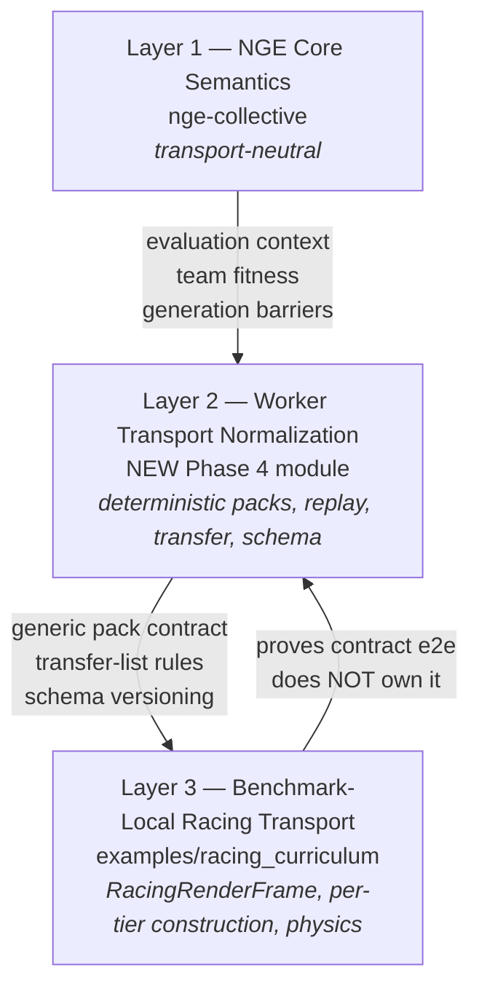

# NEAT Genesis EvoDevo: Core Readiness Audit

**Status:** [PLANNED]

## Audit summary

Phase 3 closed 2026-06-07: independent-population harness and generation-barrier semantics implemented in NGE core (`src/neat/nge-collective/neat.nge-collective.two-population.ts`), validated with 10/10 targeted tests + 89/89 nge-collective regression tests passing, transport-neutral contract documented, deterministic transport normalization deferred to Phase 4. Racing is the first proving ground; Predator/Prey is the second consumer with stronger synchronized-two-population pressure.

## Scope

Audit the readiness of NGE core primitives before benchmark demo work advances,
and select the smallest aligned first implementation tranche that removes the
highest-leverage blocker. Demos are downstream end-to-end tests of the core;
when a demo exposes a gap, the gap routes back to NGE core rather than being
solved with demo-local compensation. Racing is the first e2e proving ground
after core readiness is sufficient.

Upstream authority: [plans/completed/NEAT_Genesis_EvoDevo.md](completed/NEAT_Genesis_EvoDevo.md)

Active downstream benchmarks:

- [plans/NEAT_Genesis_EvoDevo_Racing_Curriculum.md](NEAT_Genesis_EvoDevo_Racing_Curriculum.md) [WIP]
- [plans/NEAT_Genesis_EvoDevo_AntHive_Demo.md](NEAT_Genesis_EvoDevo_AntHive_Demo.md) [PLANNED]
- [plans/NEAT_Genesis_EvoDevo_PredatorPrey_Demo.md](NEAT_Genesis_EvoDevo_PredatorPrey_Demo.md) [PLANNED]

## MCP tracking plan

```yaml
workstream: nge_core_readiness_audit
source_reference: plans/completed/NEAT_Genesis_EvoDevo.md
active_tracker: plans/NEAT_Genesis_EvoDevo_Core_Readiness.plans.md
primary_boundary: nge_primitive_readiness_and_core_gap_closure
reason:
  - 'NGE core primitives must be audited and the highest-leverage gaps closed before benchmark demos can act as honest e2e tests.'
  - 'Demo-local compensation for missing core capabilities produces benchmark results that reflect the workaround rather than the algorithm.'
  - 'Racing is the first e2e proving ground; any racing gap must route back to NGE core rather than being solved inside the racing demo.'
preserve_terms:
  - rolling opponent snapshot
  - polyandric reproduction
  - deterministic race packs
  - Phase A/B/D/E/G
  - team-level fitness
  - generation barriers
  - lifecycle staging
  - juvenile and assimilation boundaries
  - nge-adult
mcp_services:
  workflow:
    - neataptic-workflow-mcp.get_active_workflow_snapshot
    - neataptic-workflow-mcp.get_customization_inventory
  cortex:
    - neataptic-cortex-mcp.search_corpus
    - neataptic-cortex-mcp.freshness_check
  gates:
    - neataptic-gate-mcp.list_gates
    - neataptic-gate-mcp.run_gate_check
    - neataptic-gate-mcp.query_customization_routing_table
  validation:
    - neataptic-validation-mcp.get_active_validation_allowlist
    - neataptic-validation-mcp.run_allowlisted_validation
specialist_delegation:
  research:
    - NGE Core Scout
    - Repo Cortex Scout
  implementation:
    - 04-implementing
    - NGE Core Scout
  validation:
    - 05-green-testing
    - Coverage Guard
  escalation:
    - '00-helping only when an MCP/tool/agent/flow gap blocks the active step.'
non_goals:
  - 'Do not implement missing NGE primitives during the audit phase.'
  - 'Do not patch benchmark-local workarounds into demos to hide missing core capabilities.'
  - 'Do not optimize the first tranche around racing-, predator/prey-, or ant-hive-specific semantics before generic NGE foundation gaps are closed.'
  - 'Do not treat demo completion as proof of readiness if the demo only works via benchmark-local compensation.'
  - 'Do not export every internal NGE module at once; prefer a narrow experimental namespace for the initial public entrypoint.'
acceptance_criteria:
  - id: primitive_classification
    criterion: 'Given the requested primitive list, when the audit completes, then each primitive is classified as implemented, partial, plan-only, or missing with at least one file-backed citation.'
    validation: 'readiness matrix with file citations'
  - id: gap_ownership
    criterion: 'Given a primitive is not fully ready, when it is recorded in the audit, then it is assigned to the correct owner boundary: upstream NGE core, benchmark-local runtime, worker protocol, or policy decision.'
    validation: 'gap classification table'
  - id: terminology_preservation
    criterion: 'Given plan alignment matters, when the audit names a gap, then it preserves existing upstream terminology such as rolling opponent snapshot, polyandric reproduction, deterministic race packs, and Phase A/B/D/E/G.'
    validation: 'audit doc review'
  - id: benchmark_decomposition
    criterion: 'Given downstream benchmarks depend on different subsets of NGE, when the audit compares readiness, then it distinguishes reusable core support from racing-only, predator/prey-only, and ant-hive-only requirements.'
    validation: 'per-benchmark readiness column in matrix'
  - id: smallest_tranche
    criterion: 'Given the user wants an implementation plan after the audit, when the audit closes, then it identifies the smallest next tranche that removes the highest-leverage blocker.'
    validation: 'tranche selection rationale doc'
  - id: lifecycle_honesty
    criterion: 'Given lifecycle staging is easy to overclaim, when the audit evaluates lifecycle support, then it explicitly calls out whether the current boundary is production-ready or still scaffolded or red-phase.'
    validation: 'lifecycle status row in matrix'
  - id: core_first_routing
    criterion: 'Given demos are end-to-end tests, when an e2e exposes a missing capability or failure, then the gap is routed back to NGE core rather than solved with demo-local compensation.'
    validation: 'routing policy documented in tranche handoff'
stop_conditions:
  done: 'All Phase 1 steps are complete and the implementation handoff packet is ready for Phase 2.'
  hold: 'A benchmark-policy decision is needed before the first tranche can be selected.'
  blocked: 'A missing upstream primitive or MCP/tooling gap prevents honest audit completion.'
```

## Current-state audit summary

### Step 02 readiness matrix (verbatim archival copy)

| Primitive                                                            | Status          | Owner           | Depends on / unblocks           |
| -------------------------------------------------------------------- | --------------- | --------------- | ------------------------------- |
| `nge-dna` deterministic envelope / realized phenotype                | **partial**     | NGE core        | racing, ant-hive, predator/prey |
| Computation motif catalogue (`ResidualStream`, `WeightSharedCohort`) | **partial**     | NGE core        | all                             |
| Memory-tier params/runtime                                           | **partial**     | NGE core        | all, strongest for ant-hive     |
| Neuromodulator zones / broadcast economics                           | **partial**     | NGE core        | racing, ant-hive, predator/prey |
| Phase E reproduction incl. **polyandric reproduction**               | **implemented** | NGE core        | all                             |
| Phase B juvenile focus / grow boundary                               | **partial**     | NGE core        | all                             |
| `nge-adult` / adult-side **lifecycle staging**                       | **partial**     | NGE core        | all                             |
| Phase D assimilation write-back                                      | **implemented** | NGE core        | all                             |
| `nge-collective` shared field + role divergence                      | **implemented** | NGE core        | ant-hive, racing                |
| **rolling opponent snapshot** pool                                   | **implemented** | NGE core        | racing, predator/prey           |
| Two-population coevolution harness                                   | **partial**     | NGE core        | racing, predator/prey           |
| Team/group fitness aggregation seam                                  | **missing**     | policy decision | racing, ant-hive                |
| Generation barriers                                                  | **missing**     | worker protocol | racing, predator/prey           |
| Deterministic race packs / packed `race-step` transport              | **partial**     | worker protocol | racing first                    |
| Root public API experimental entrypoint (`src/neataptic.ts`)         | **missing**     | NGE core        | all external demos/tests        |

### Step 02 gap inventory

- team-level fitness core evaluator
- independent populations and generation barriers
- deterministic evaluation packs / deterministic race packs normalization
- lifecycle staging closure and `nge-adult` readiness reconciliation
- experimental root public API exposure
- downstream benchmark dependency + MCP synchronization

### Implemented primitives with code evidence

- `src/neat/nge-dna/*` provides deterministic DNA schema, fingerprints, virtual-plan build, and phenotype realization.
- `src/neat/nge-evolution/*` provides parthenogenesis, polyandric, and sexual reproduction operators plus reproduction-policy types.
- `src/neat/nge-collective/*` provides shared typed-array fields, collective evaluation context, rolling opponent snapshot pools, and a narrow two-population harness scaffold.
- `examples/racing_curriculum/workers/simulation-worker/simulation-worker.tier3.ts`, `.tier4.ts`, and `.tier5.ts` define packed race-pack transport shapes for 2v2 and 3v3 worker slices.

### Partial or not yet benchmark-ready

- **Team-level fitness** — described in plans but not implemented as a reusable core evaluator; the current two-population harness only partitions results and cross-registers snapshots.
- **Independent populations** — exist as separate `Neat` controllers in the two-population harness, but generation barriers and richer coevolution logic remain plan-owned gaps.
- **Deterministic evaluation packs** — partially present in racing worker helpers, but the reusable contract is not yet closed as a benchmark-ready core primitive.
- **Lifecycle staging** — uneven: juvenile and assimilation boundaries exist, but `src/neat/nge-adult/*` still advertises red-phase or placeholder behavior; end-to-end lifecycle readiness is not complete.
- **Root public API exposure** — NGE surfaces are not exported from `src/neataptic.ts`; support is still internal or experimental.
- **Racing plan gap confirmation** — the active racing plan records team-level fitness, generation barriers, and deterministic race packs as current gaps, confirming that racing should validate core readiness rather than define it.

## Open assumptions and planning gaps

- The exact Step 02 readiness table is preserved here verbatim rather than regenerated so every later phase can anchor back to the same audit baseline.
- The deterministic evaluation-pack owner boundary is frozen (Phase 4 Step 01): core (Layer 2) owns the deterministic pack contract; racing (Layer 3) owns frame assembly; worker protocol shares Layer 2 transfer/clone contracts.
- The lifecycle contradiction between archived closure claims and the current readiness audit remains open until file-backed staging evidence and tracker language reconcile.
- The exact public entrypoint shape is still open: a narrow experimental namespace may be safer than exporting every internal NGE module at once.
- The first execution tranche still needs a final priority decision between lifecycle closure, reusable collective-coevolution semantics, and public-surface wiring if all three cannot fit cleanly into one bounded pass.

## Tracker invariants

- Mandatory MCP flow: before starting any step, re-read `neataptic-workflow-mcp.get_active_workflow_snapshot` for this tracker and for any downstream tracker named by the active phase.
- Mandatory Cortex flow: use `neataptic-cortex-mcp.search_corpus` and freshness checks during Step 02 seam/evidence mapping before phase scope is treated as stable.
- No later bucket: every Step 02 gap remains a named phase in this tracker until it reaches `[DONE]` with file-backed evidence and explicit user confirmation.
- Cross-plan movement must be explicit: when work moves to Racing, Predator/Prey, or Ant Hive, record the target tracker, target step, and return condition here before leaving this plan.
- A phase cannot close by re-labeling unfinished work as deferred; unresolved work must remain `[WIP]`, move to a newly named readiness phase, or be marked `[BLOCKED]`.
- If workflow snapshot, Cortex freshness, validation allowlist, or routing evidence is unavailable, mark the active step `[BLOCKED]` and escalate to `00-helping`; do not continue on memory alone.

## Implementation phases

### Phase 1 — Readiness audit, matrix preservation, and phase packetization [DONE]

#### Step 01 — Initial survey and findings [DONE]

[DONE] Initial audit compressed: upstream plan evidence, code exploration, and
racing curriculum gap review confirm that DNA, reproduction operators, collective
harness, and race-pack worker shapes are partially present; team-level fitness,
generation barriers, deterministic evaluation packs, lifecycle completeness
(`nge-adult`), and root public API exposure remain the highest-leverage gaps.
See Current-state audit summary above for file-backed evidence.

#### Step 02 — Readiness matrix and gap classification [DONE]

```yaml
phase: 1
step: 2
agent: '02-researching'
agent_file: '.github/agents/02-researching.agent.md'
status: '[DONE]'
mode: 'fresh-session'
source_of_truth: 'plans\NEAT_Genesis_EvoDevo_Core_Readiness.plans.md'
copy_paste: 'true'
next_step: 'Step 03 — Gap-to-phase mapping'
skills: 'nge-core-algorithm'
validation:
  - node scripts/agent-customization/validate-plan-sync.mjs --json --plan=plans/NEAT_Genesis_EvoDevo_Core_Readiness.plans.md
```

**User instruction:** Start a fresh session, select `02-researching`, and paste this full step packet.

**Step objective:** Produce a primitive-by-primitive readiness matrix, paste the exact Step 02 readiness matrix into this tracker, and classify each gap by owner boundary so the named readiness phases can be selected with confidence.

**Context the agent must know:**

- The upstream authority is `plans/completed/NEAT_Genesis_EvoDevo.md` (archived baseline); preserve its terminology including rolling opponent snapshot, polyandric reproduction, deterministic race packs, Phase A/B/D/E/G, lifecycle staging, and nge-adult.
- The core-first rule is hard: any gap found during this audit belongs to NGE core unless it is demonstrably racing-, predator/prey-, or ant-hive-only.
- The current-state survey above is a starting point; the readiness matrix must be backed by file citations.
- Racing is the first e2e proving ground; any racing gap that is not demo-local must route back to NGE core before the racing curriculum advances.
- The public API exposure gap (`src/neataptic.ts`) is in scope as a core gap.

**Execution steps:**

1. Use `neataptic-workflow-mcp.get_active_workflow_snapshot` to confirm this tracker is active and Step 02 is [WIP].
2. Use `neataptic-cortex-mcp.search_corpus` for: team-level fitness, generation barriers, deterministic race packs, lifecycle staging, nge-adult, nge-collective, nge-evolution, nge-dna, rolling opponent snapshot, polyandric reproduction, public API entrypoint.
3. Read `src/neat/nge-dna/README.md`, `src/neat/nge-evolution/README.md`, `src/neat/nge-collective/README.md`, and `src/neat/nge-adult/README.md` (or nearest available READMEs) as the first-pass scope.
4. Produce a readiness matrix with columns: primitive, status (implemented/partial/plan-only/missing), file citation, owner boundary (NGE core/benchmark-local/worker protocol/policy decision), and which benchmark(s) depend on it.
5. Classify each partial/missing primitive by owner boundary; do not route benchmark-local gaps into the core tranche.
6. Identify the highest-leverage gap cluster: the set of partial/missing primitives whose closure unblocks the most downstream benchmark capability.
7. Record the matrix and gap classification in this tracker, including the verbatim archival matrix section and the Step 02 gap inventory, before ending the step.

**Stop conditions:**

- **Done:** readiness matrix covers all primitives from the upstream plan with file citations, the exact Step 02 matrix is pasted into this tracker, and gap classification is owner-specific.
- **Hold:** a policy decision is needed before a gap can be classified.
- **Blocked:** an MCP/tool/agent gap prevents honest research; escalate to `00-helping`.

**Required validation:**

`node scripts/agent-customization/validate-plan-sync.mjs --json --plan=plans/NEAT_Genesis_EvoDevo_Core_Readiness.plans.md`

#### Step 03 — Gap-to-phase mapping [DONE]

```yaml
phase: 1
step: 3
agent: '01-planning'
agent_file: '.github/agents/01-planning.agent.md'
status: '[DONE]'
mode: 'fresh-session'
source_of_truth: 'plans/NEAT_Genesis_EvoDevo_Core_Readiness.plans.md'
copy_paste: 'true'
next_step: 'Step 04 — First active implementation cycle selection'
skills: 'plan-alignment, phase-handoff-workflow, nge-core-algorithm'
validation:
  - node scripts/agent-customization/validate-plan-sync.mjs --json --plan=plans/NEAT_Genesis_EvoDevo_Core_Readiness.plans.md
```

**Step objective:** Convert every Step 02 gap into an explicit named phase in this tracker with no deferred or later bucket, and record which owner boundary each new phase closes.

**Execution focus:**

1. Re-read the archived Step 02 matrix plus the file-backed evidence behind each partial or missing primitive.
2. Map each distinct gap cluster into one named readiness phase and preserve the approved phase titles already declared in this tracker.
3. Record any shared prerequisites or sequencing rules without collapsing multiple gaps into a deferred bucket.
4. Mark downstream benchmark dependencies and the return condition for any gap that needs work in Racing, Predator/Prey, or Ant Hive after core closure.

**Stop conditions:**

- **Done:** every Step 02 gap is represented by an explicit named phase in this tracker, sequencing notes are recorded, and no unresolved work is labeled for later.
- **Hold:** a user priority decision is needed before the tranche can be finalized.
- **Blocked:** Step 02 matrix is incomplete; return to Step 02.

**Required validation:**

`node scripts/agent-customization/validate-plan-sync.mjs --json --plan=plans/NEAT_Genesis_EvoDevo_Core_Readiness.plans.md`

#### Step 04 — First active implementation cycle selection [DONE]

```yaml
phase: 1
step: 4
agent: '01-planning'
agent_file: '.github/agents/01-planning.agent.md'
status: '[DONE]'
mode: 'fresh-session'
source_of_truth: 'plans/NEAT_Genesis_EvoDevo_Core_Readiness.plans.md'
copy_paste: 'true'
next_step: 'Step 05 — Cross-plan MCP handoff packet'
skills: 'plan-alignment, phase-handoff-workflow, nge-core-algorithm'
validation:
  - node scripts/agent-customization/validate-plan-sync.mjs --json --plan=plans/NEAT_Genesis_EvoDevo_Core_Readiness.plans.md
```

**Step objective:** Select the first active implementation cycle from the named readiness phases using the Step 02 evidence, the no-later-bucket rule, and the highest-leverage downstream unblock.

**Execution focus:**

1. Compare the named readiness phases against benchmark dependencies, owner boundaries, and current file-backed maturity.
2. Pick the smallest implementation cycle that removes the highest-leverage blocker without hiding unfinished work behind a deferred label.
3. Record why the non-selected phases remain queued and what evidence or prerequisite they still need before promotion to `[WIP]`.
4. Align the selected cycle with downstream benchmark return conditions so Racing remains the first proving ground rather than the design owner.

**Stop conditions:**

- **Done:** the first implementation cycle is explicitly selected, justified, and aligned to the named phases in this tracker.
- **Hold:** a user priority decision is still needed between equally valid first cycles.
- **Blocked:** Step 03 output is incomplete.

**Required validation:**

`node scripts/agent-customization/validate-plan-sync.mjs --json --plan=plans/NEAT_Genesis_EvoDevo_Core_Readiness.plans.md`

[DONE] Selection compressed: the first active implementation cycle is **Phase 2 —
Team-level fitness core evaluator**. It is the smallest reusable core cycle that
closes a **missing** Step 02 primitive, unblocks **Racing** and **Ant Hive**
simultaneously, and prevents Racing from becoming the design owner for team
scoring semantics. Phase 3 explicitly depends on this evaluator boundary staying
stable, so promoting Phase 2 first removes the highest-leverage downstream
blocker without hiding any unfinished work behind a later bucket.

**Cycle selection and queue rationale:**

- **Selected first cycle — Phase 2 / Team-level fitness core evaluator:** Step 02
  records the team/group fitness aggregation seam as **missing** and needed by
  `racing, ant-hive`; the current code only partitions two-population results
  and cross-registers snapshots. This is a narrower first cycle than lifecycle
  reconciliation or public-surface exposure, but it still removes the most
  immediate shared benchmark blocker and freezes the policy seam before any
  benchmark-local compensation appears.
- **Phase 3 remains queued — Independent populations and generation barriers:**
  the gap is real, but the phase already declares it is blocked if **Phase 2
  still changes prerequisite evaluator semantics**. Step 02 also shows partial
  two-population scaffolding plus missing generation barriers, so Phase 3 should
  start only after the reusable team-level fitness contract is fixed in NGE
  core.
- **Phase 4 remains queued — Deterministic evaluation packs / deterministic race
  packs normalization:** Step 02 still marks the owner boundary as provisional,
  and Phase 4 already says its contract should keep Racing as the proving ground
  rather than the owner. It needs the Phase 3 coevolution/barrier seams to
  settle before transport normalization can be scoped honestly.
- **Phase 5 remains queued — Lifecycle staging closure and `nge-adult`
  readiness reconciliation:** lifecycle is benchmark-critical, but this tracker
  still carries an open contradiction between archived claims and current
  readiness evidence. The phase itself says it is blocked if earlier phases are
  still changing prerequisite lifecycle contracts, so it stays named and queued
  rather than being promoted ahead of the shared coevolution seam.
- **Phase 6 remains queued — Experimental root public API exposure:** the root
  export gap is still real, but exposing a public experimental namespace before
  the first reusable evaluator and lifecycle seams stabilize would advertise a
  false-ready surface. Its own phase already treats lifecycle closure as a
  prerequisite.
- **Phase 7 remains queued — Downstream benchmark dependency + MCP
  synchronization:** Step 05 owns the first cross-plan handoff packet. This
  phase should not move until there is completed core-phase evidence to hand to
  Racing, Predator/Prey, or Ant Hive.

**Downstream benchmark alignment:**

- **Racing remains the first proving ground, not the design owner:** the active
  racing tracker is still on **Phase 1 Step 02 — Research boundary mapping
  [WIP]**, where missing prerequisites must be classified as demo-local,
  reusable library/API, or upstream NGE core. The selected Phase 2 cycle keeps
  team-level fitness owned by NGE core, so Racing only validates that Team A/B
  benchmark flow can consume the reusable evaluator once it exists.
- **Return condition for the next handoff packet:** when Phase 2 closes with
  green validation, Step 05 should route the result back into
  `plans\NEAT_Genesis_EvoDevo_Racing_Curriculum.md` so Racing can continue as
  the first e2e consumer of core-owned team-level fitness without implying that
  unresolved Phase 3–6 gaps are solved.
- **Ant Hive stays queued as the second direct consumer:** it shares the same
  missing team-level fitness dependency, so selecting Phase 2 first improves its
  eventual readiness without making Ant Hive the policy owner either.

#### Step 05 — Cross-plan MCP handoff packet [DONE]

```yaml
phase: 1
step: 5
agent: '01-planning'
agent_file: '.github/agents/01-planning.agent.md'
status: '[DONE]'
mode: 'fresh-session'
source_of_truth: 'plans/NEAT_Genesis_EvoDevo_Core_Readiness.plans.md'
copy_paste: 'true'
next_step: 'Phase 2 — Team-level fitness core evaluator'
skills: 'plan-alignment, phase-handoff-workflow, repo-cortex-workflow'
validation:
  - node scripts/agent-customization/validate-plan-sync.mjs --json --plan=plans/NEAT_Genesis_EvoDevo_Core_Readiness.plans.md
```

**Step objective:** Record the MCP-aware cross-plan handoff packet for any downstream benchmark tracker touched by the selected first implementation cycle, including target tracker, target step, and return condition.

**Execution focus:**

1. Name every downstream tracker that depends on the selected cycle and record its current step.
2. Re-read `neataptic-workflow-mcp.get_active_workflow_snapshot` for this tracker and each named downstream tracker before finalizing handoff text.
3. Record the return condition that hands control back to this readiness tracker after downstream coordination completes.
4. If workflow or Cortex evidence is unavailable for a downstream tracker, mark the step `[BLOCKED]` and escalate to `00-helping`.

**Stop conditions:**

- **Done:** downstream tracker targets, MCP snapshot evidence, and return conditions are recorded in this tracker.
- **Hold:** no downstream tracker needs immediate coordination for the selected first cycle.
- **Blocked:** workflow snapshot or routing evidence is unavailable for a required downstream tracker.

**Required validation:**

`node scripts/agent-customization/validate-plan-sync.mjs --json --plan=plans/NEAT_Genesis_EvoDevo_Core_Readiness.plans.md`

[DONE] Cross-plan handoff packet recorded. MCP snapshot evidence, downstream tracker targets, and return conditions are below.

---

#### Cross-plan handoff packet — Phase 2 / Team-level fitness core evaluator

**MCP snapshot evidence (queried before finalizing this packet):**

| Tracker                                              | MCP scope                            | Active phase/step                                                                                              | Agent            |
| ---------------------------------------------------- | ------------------------------------ | -------------------------------------------------------------------------------------------------------------- | ---------------- |
| `plans/NEAT_Genesis_EvoDevo_Core_Readiness.plans.md` | `no-active-phase`                    | Step 05 is now [DONE]; Phase 2 has not been promoted to [WIP] yet, so direct plan-file context is the fallback | `01-planning`    |
| `plans/NEAT_Genesis_EvoDevo_Racing_Curriculum.md`    | `repo-static`                        | Phase 1 Step 02 [WIP]                                                                                          | `02-researching` |
| `plans/NEAT_Genesis_EvoDevo_AntHive_Demo.md`         | `no-active-phase`                    | [PLANNED] — no WIP marker                                                                                      | —                |
| `plans/NEAT_Genesis_EvoDevo_PredatorPrey_Demo.md`    | not queried — NOT a Phase 2 consumer | [PLANNED]                                                                                                      | —                |

**Downstream trackers directly touched by Phase 2 (team/group fitness aggregation seam):**

Step 02 readiness matrix assigns team/group fitness aggregation seam → **missing**, owner: policy decision, depends: `racing, ant-hive`. Predator/Prey is not a direct consumer of this primitive.

1. **Racing** — `plans/NEAT_Genesis_EvoDevo_Racing_Curriculum.md`
   - Current step: Phase 1 Step 02 [WIP] — "Research boundary mapping"
   - The step objective is to classify every missing prerequisite as demo-local, reusable library/API, upstream NGE core, MCP tooling, or user-policy decision.
   - Team-level fitness is an upstream NGE core gap that Racing Step 02 cannot resolve locally. Racing must not advance to Step 03 (red tests for worker runtime and coevolution contracts) before the Phase 2 evaluator exists.
   - **Handoff target**: Racing Phase 1 Step 02. When Phase 2 closes, Racing Step 02 should record the evaluator as a resolved prerequisite and advance to Step 03.

2. **Ant Hive** — `plans/NEAT_Genesis_EvoDevo_AntHive_Demo.md`
   - MCP snapshot: `no-active-phase` — fully [PLANNED], no WIP marker.
   - Shares the team-level fitness dependency (Step 02 matrix). Cannot start implementation until the Phase 2 evaluator is available.
   - **Handoff target**: none yet. Ant Hive remains [PLANNED] until Phase 2 closes and Racing has proved the evaluator e2e. At that point, Ant Hive Phase 1 Step 01 may be promoted to [WIP].

3. **Predator/Prey** — `plans/NEAT_Genesis_EvoDevo_PredatorPrey_Demo.md`
   - Not a direct consumer of team-level fitness (Step 02 matrix: `racing, ant-hive` only).
   - **No Phase 2 handoff required.** Predator/Prey remains [PLANNED] and is not touched by the Phase 2 implementation cycle.

**Return condition (hands control back to this tracker):**

When Phase 2 Step 05 (Green validation) completes with passing focused tests and a clean `validate-plan-sync` result, control returns here for Phase 3 promotion. The explicit trigger is:

> Racing Phase 1 Step 02 records the team-level fitness evaluator as a resolved upstream prerequisite AND advances to Step 03; this confirms that the Phase 2 evaluator is live and benchmark-consumable. Phase 3 (independent populations and generation barriers) is then eligible for promotion to [WIP] in this tracker.

Until that confirmation exists, Phase 3 remains [PLANNED] and no unresolved Phase 3–6 gaps are implied to be solved.

**Stop condition met:** downstream tracker targets, MCP snapshot evidence, and return conditions are recorded. Phase 2 is the confirmed next active step.

---

### Phase 2 — Team-level fitness core evaluator [DONE]

[DONE] Phase 2 compressed: NGE core now owns the reusable team/group
aggregation seam via `createTeamFitnessEvaluator`, Racing consumes that seam
through an injected policy instead of benchmark-local aggregation logic, and
the touched NGE collective docs/readme now describe the contract without
claiming later barrier or transport work is complete.

**Durable coverage notes:**

- **Scope frozen:** planning and boundary mapping kept team/group fitness in
  `src/neat/nge-collective` as the reusable core owner boundary, with Racing
  and Ant Hive as consumers only and generation-barrier / deterministic
  transport work left for later phases.
- **Red-to-green delivery landed:** owner-local tests proved the missing
  evaluator/export seam; implementation added
  `src/neat/nge-collective/neat.nge-collective.team-fitness.ts`, updated the
  barrel/types/tests, and routed
  `examples/racing_curriculum/workers/simulation-worker/simulation-worker.coevolution.service.ts`
  through the shared evaluator.
- **Docs aligned honestly:** `src/neat/nge-collective/README.md` was regenerated
  from source-first JSDoc and explicitly keeps Phase 3+ generation barriers and
  Phase 4 deterministic transport work outside the landed contract.

**Durable validation evidence:**

- `node scripts/agent-customization/validate-plan-sync.mjs --json --plan=plans/NEAT_Genesis_EvoDevo_Core_Readiness.plans.md`
  passed after the Phase 2 compression edit.
- The implementation phase already recorded green validation for `npm run
build`, `npm run quality:folder -- --folder=src/neat/nge-collective`, `npm
run quality:folder -- --folder=examples/racing_curriculum/workers/simulation-worker`,
  the focused Jest slices, and `npm run test:silent` with repo-wide 100%
  `src/` coverage.
- No gate exceptions were recorded across the Phase 2 implementation,
  validation, or documentation passes.

**Remaining queue state and Phase 3 readiness:**

- **Phase 3 stays the explicit next phase:** independent populations and
  generation barriers remain unfinished core work and are not relabeled as
  deferred.
- **Phase 3 remains `[PLANNED]` after Phase 2 closure:** its planning packet is
  the next frontier once the next session promotes that boundary intentionally.
- **Downstream readiness remains visible:** Racing is the first proven consumer
  of the shared evaluator, Ant Hive remains queued behind the same reusable
  seam, and Phase 4–7 stay queued behind the Phase 3 barrier boundary rather
  than being implied complete.

### Phase 3 — Independent populations and generation barriers [DONE]

[DONE] Phase 3 compressed: reusable independent-population harness and generation-barrier semantics implemented in NGE core (`src/neat/nge-collective/neat.nge-collective.two-population.ts`), validated with 10/10 targeted tests + 89/89 nge-collective regression tests passing, transport-neutral barrier contract documented, deterministic transport normalization deferred to Phase 4.

**Durable coverage notes:**

- **Scope frozen:** planning kept independent-population semantics and transport-neutral generation-barrier semantics in NGE core; Racing and Predator/Prey treated as downstream consumers only.
- **Implementation boundary:** `createTwoPopulationHarness`, `runTwoTeamEvaluationTick`, `advanceTwoPopulations` in `src/neat/nge-collective/neat.nge-collective.two-population.ts`.
- **Test evidence:** 10/10 two-population tests green (barrier semantics, snapshot cross-registration); 89/89 nge-collective regression tests passing.
- **Gate evidence:** plan-sync PASS, agent-graph PASS (61 agents, 0 issues), step-packet PASS, phase-compression PASS, stale-wip-plans PASS.
- **Deferred to Phase 4:** deterministic evaluation-pack normalization, packed `race-step` transport, transfer-list rules, replay guarantees.
- **Downstream consumers:** Racing (first proving ground), Predator/Prey (second consumer with stronger synchronized-two-population pressure).

### Phase 4 — Deterministic evaluation packs / deterministic race packs normalization [WIP]

#### Step 01 — Planning packet and determinism contract freeze [DONE]

```yaml
phase: 4
step: 1
agent: '01-planning'
agent_file: '.github/agents/01-planning.agent.md'
status: '[DONE]'
mode: 'fresh-session'
source_of_truth: 'plans/NEAT_Genesis_EvoDevo_Core_Readiness.plans.md'
copy_paste: 'true'
next_step: 'Step 02 — Transport and reproducibility seam mapping'
skills: 'plan-alignment, phase-handoff-workflow, reproducibility-contracts'
validation:
  - node scripts/agent-customization/validate-plan-sync.mjs --json --plan=plans/NEAT_Genesis_EvoDevo_Core_Readiness.plans.md
```

**Step objective:** Freeze the deterministic evaluation-pack contract and clarify which pieces are core semantics versus worker transport normalization.

**Execution focus:** Preserve the provisional owner note from the readiness audit, define the normalization boundary explicitly, and keep Racing as the proving ground rather than the owner.

**Stop conditions:** Done when contract scope and ownership are frozen; hold on unresolved owner boundaries; blocked if Phase 3 still changes shared prerequisites.

**Required validation:** `node scripts/agent-customization/validate-plan-sync.mjs --json --plan=plans/NEAT_Genesis_EvoDevo_Core_Readiness.plans.md`

---

##### Step 01 — Frozen Determinism Contract

###### Determinism rung

**Level 2 — Ordered deterministic.** Same seed, same inputs, same ordering rules,
and same runtime configuration produce numerically stable outputs within one
runtime (Node or browser). Cross-environment byte-identical results are NOT
promised because typed-array layout, transfer semantics, and floating-point
reduction order may differ between Node `worker_threads` and browser
`Web Workers`.

Rationale: `createDeterministicRacePack` already proves that same seed + same
opponent snapshot → identical `RacingRenderFrame` on the same runtime. A Level 3
(replay exact) claim would require full RNG state capture beyond the pack seed,
which is out of scope for Phase 4 — the pack seed is sufficient for ordered
deterministic replay at the pack-creation boundary. A Level 4 (cross-environment
bounded) claim would require documenting every floating-point and transport
difference between Node and browser workers, which is deferred to a later
reproducibility audit after the core normalization seam lands.

###### Contract scope — what Phase 4 normalizes

| Contract element                 | Current location                                          | Target owner after Phase 4          |
| -------------------------------- | --------------------------------------------------------- | ----------------------------------- |
| Deterministic pack creation      | `simulation-worker.race-pack.service.ts` (racing)         | NGE core — Layer 2                  |
| Pack replay validation           | No reusable validator exists                              | NGE core — Layer 2                  |
| Transfer-list resolution         | `simulation-worker.race-pack.service.ts` (racing)         | NGE core — Layer 2                  |
| Schema versioning / rejection    | `simulation-worker.types.ts` (racing `RacingRenderFrame`) | NGE core — Layer 2 (generic schema) |
| Clone-safe payload contract      | Implicit in worker transport                              | NGE core — Layer 2 (explicit)       |
| `RacingRenderFrame` type         | `simulation-worker.types.ts` (racing)                     | Racing-owned — Layer 3 (stays)      |
| Per-tier pack construction       | `simulation-worker.tier3/4/5.ts` (racing)                 | Racing-owned — Layer 3 (stays)      |
| Track physics / tire / pit state | Racing-specific frame fields                              | Racing-owned — Layer 3 (stays)      |
| Renderer layout                  | Car positions, headings, place                            | Racing-owned — Layer 3 (stays)      |

###### Three-layer ownership boundary



**Layer 1 — NGE Core Semantics** (`src/neat/nge-collective/`):

- `runCollectiveEvaluationTick`, `resetCollectiveEvaluationState`
- `createTeamFitnessEvaluator`, team/group fitness aggregation
- `createTwoPopulationHarness`, `advanceTwoPopulations`
- Generation barrier semantics (transport-neutral by Phase 3 design)
- Opponent snapshot pool management
- **Invariant:** these functions never depend on `RacingRenderFrame`,
  transfer lists, worker topology, or any benchmark-specific type.

**Layer 2 — Worker Transport Normalization** (NEW — Phase 4 creates this):

- Deterministic evaluation-pack creation (core-owned generic contract)
- Pack replay validation (same seed + same inputs → identical output)
- Transfer-list resolution (zero-copy `postMessage` contract)
- Schema versioning and forward-compatibility rejection
- Clone-safe payload contract for worker boundaries
- **Invariant:** Layer 2 types are generic (not `RacingRenderFrame`-specific).
  Racing provides the concrete frame type; Layer 2 provides the
  deterministic-pack and transfer contracts that any benchmark can reuse.

**Layer 3 — Benchmark-Local Racing Transport** (`examples/racing_curriculum/`):

- `RacingRenderFrame` type with `schemaVersion: 'racing-packed-v1'`
- Per-tier pack construction (`simulation-worker.tier3/4/5.ts`)
- Track-specific physics, tire/pit state, feature flags
- Renderer-specific layout (car positions, headings, place)
- **Invariant:** Layer 3 stays racing-owned and is never promoted to core.
  If Racing exposes a gap in the Layer 2 contract, the gap routes back to
  NGE core per the core-first routing policy.

###### Seam between Layer 2 and Layer 3

The seam is where core pack creation meets racing-specific frame population.
Today, `createDeterministicRacePack` in `simulation-worker.race-pack.service.ts`
fills a `RacingRenderFrame` directly from a seed + snapshot. After Phase 4,
the core owns a generic `createDeterministicEvaluationPack(seed, inputs)` that
produces a transport-neutral pack, and Racing wraps that with its own
`populateRacingFrame(pack, racingConfig)` that injects track physics, tire
state, and renderer layout. The replay contract applies at the generic pack
boundary, not at the racing-frame boundary.

###### Provisional owner note — resolved

The Step 02 readiness audit recorded:

> "The deterministic evaluation-pack owner boundary is still provisional
> pending seam mapping between NGE core, worker protocol, and racing-owned
> transport."

**Resolution:** The owner boundary is now frozen per the three-layer model
above. Core (Layer 2) owns the deterministic pack contract. Racing (Layer 3)
owns the frame assembly. Worker protocol (Layer 2, shared with core) owns the
transfer-list and clone-safe contracts. No owner boundary remains provisional.

###### Racing as proving ground, not owner

Racing is the first downstream consumer that validates the core deterministic
evaluation-pack contract works end-to-end. Racing does NOT own the pack
creation contract, the replay contract, or the transfer contract. If Racing
exposes a gap in the core contract, the gap routes back to NGE core (per the
`core_first_routing` acceptance criterion). Predator/Prey and Ant Hive will be
the second and third proving grounds, but they cannot validate the contract
until Phase 4 normalization lands and Racing confirms it e2e.

###### Reproducibility tuple for the pack-creation boundary

$$
R_{\text{pack}} = (\text{seed}, \text{opponentSnapshot}, \text{agentCount}, \text{schemaVersion})
$$

Same tuple → identical pack on the same runtime. Missing any component weakens
the claim to seed-repeatable (Level 1). The tuple does NOT include full RNG
state (Level 3 would require that) or environment assumptions (Level 4 would
require that).

###### Phase 3 prerequisite — confirmed stable

Phase 3 ([DONE]) closed with transport-neutral generation-barrier semantics in
`neat.nge-collective.two-population.ts`. The Phase 3 closure notes explicitly
defer deterministic transport normalization to Phase 4. Phase 3 no longer
changes shared prerequisites — the blocker condition is not active.

#### Step 02 — Transport and reproducibility seam mapping [PLANNED]

```yaml
phase: 4
step: 2
agent: '02-researching'
agent_file: '.github/agents/02-researching.agent.md'
status: '[PLANNED]'
mode: 'fresh-session'
source_of_truth: 'plans/NEAT_Genesis_EvoDevo_Core_Readiness.plans.md'
copy_paste: 'true'
next_step: 'Step 03 — Red tests for deterministic evaluation packs'
skills: 'reproducibility-contracts, worker-inference-transport, repo-cortex-workflow'
validation:
  - node scripts/agent-customization/validate-plan-sync.mjs --json --plan=plans/NEAT_Genesis_EvoDevo_Core_Readiness.plans.md
  - node scripts/agent-customization/gates/cortex-first-search.gate.mjs --json
```

**Step objective:** Map current pack generation, race-step transport, and reproducibility seams before writing tests.

**Execution focus:** Use Repo Cortex to map existing race-pack helpers, worker-frame schemas, and determinism notes; classify which files own normalization and which remain benchmark-local adapters.

**Stop conditions:** Done when seam mapping and owner boundaries are recorded; hold on unresolved transport ownership; blocked on missing workflow or Cortex evidence.

**Required validation:**

- `node scripts/agent-customization/validate-plan-sync.mjs --json --plan=plans/NEAT_Genesis_EvoDevo_Core_Readiness.plans.md`
- `node scripts/agent-customization/gates/cortex-first-search.gate.mjs --json`

#### Step 03 — Red tests for deterministic evaluation packs [PLANNED]

```yaml
phase: 4
step: 3
agent: '03-red-testing'
agent_file: '.github/agents/03-red-testing.agent.md'
status: '[PLANNED]'
mode: 'fresh-session'
source_of_truth: 'plans/NEAT_Genesis_EvoDevo_Core_Readiness.plans.md'
copy_paste: 'true'
next_step: 'Step 04 — Implement deterministic evaluation-pack normalization'
skills: 'red-test-contracts, creating-unit-tests'
validation:
  - node scripts/agent-customization/validate-plan-sync.mjs --json --plan=plans/NEAT_Genesis_EvoDevo_Core_Readiness.plans.md
```

**Step objective:** Add focused failing tests for deterministic pack normalization, replay stability, and race-step transport contracts.

**Execution focus:** Keep tests narrow to the selected normalization seam and avoid folding in broader population or lifecycle work that belongs to adjacent phases.

**Stop conditions:** Done when the missing determinism contract fails under focused tests; hold on unresolved owner boundary assertions; blocked if Step 02 mapping is incomplete.

**Required validation:** `node scripts/agent-customization/validate-plan-sync.mjs --json --plan=plans/NEAT_Genesis_EvoDevo_Core_Readiness.plans.md`

#### Step 04 — Implement deterministic evaluation-pack normalization [PLANNED]

```yaml
phase: 4
step: 4
agent: '04-implementing'
agent_file: '.github/agents/04-implementing.agent.md'
status: '[PLANNED]'
mode: 'fresh-session'
source_of_truth: 'plans/NEAT_Genesis_EvoDevo_Core_Readiness.plans.md'
copy_paste: 'true'
next_step: 'Step 05 — Green validation and determinism audit'
skills: 'reproducibility-contracts, worker-inference-transport'
validation:
  - node scripts/agent-customization/validate-plan-sync.mjs --json --plan=plans/NEAT_Genesis_EvoDevo_Core_Readiness.plans.md
```

**Step objective:** Implement the deterministic evaluation-pack and race-pack normalization seam selected by the red tests.

**Execution focus:** Keep the code bounded to normalized pack generation, stable transport, and explicit ownership boundaries; route any new lifecycle or benchmark-policy questions back to their named phases.

**Stop conditions:** Done when red tests turn green for the selected normalization seam; hold on policy ambiguity; blocked on contradictory worker transport ownership.

**Required validation:** `node scripts/agent-customization/validate-plan-sync.mjs --json --plan=plans/NEAT_Genesis_EvoDevo_Core_Readiness.plans.md`

#### Step 05 — Green validation and determinism audit [PLANNED]

```yaml
phase: 4
step: 5
agent: '05-green-testing'
agent_file: '.github/agents/05-green-testing.agent.md'
status: '[PLANNED]'
mode: 'fresh-session'
source_of_truth: 'plans/NEAT_Genesis_EvoDevo_Core_Readiness.plans.md'
copy_paste: 'true'
next_step: 'Step 06 — Documentation and reproducibility contract alignment'
skills: 'green-validation-gates, reproducibility-contracts'
validation:
  - node scripts/agent-customization/validate-plan-sync.mjs --json --plan=plans/NEAT_Genesis_EvoDevo_Core_Readiness.plans.md
```

**Step objective:** Confirm deterministic packs, replay behavior, and transport invariants stay green for the touched boundary.

**Stop conditions:** Done when focused validation passes and determinism evidence is recorded; hold on flaky replay output; blocked if implementation remains red.

**Required validation:** `node scripts/agent-customization/validate-plan-sync.mjs --json --plan=plans/NEAT_Genesis_EvoDevo_Core_Readiness.plans.md`

#### Step 06 — Documentation and reproducibility contract alignment [PLANNED]

```yaml
phase: 4
step: 6
agent: '06-documenting'
agent_file: '.github/agents/06-documenting.agent.md'
status: '[PLANNED]'
mode: 'fresh-session'
source_of_truth: 'plans/NEAT_Genesis_EvoDevo_Core_Readiness.plans.md'
copy_paste: 'true'
next_step: 'Step 07 — Logging and phase closure packet'
skills: 'educational-docs, reproducibility-contracts'
validation:
  - node scripts/agent-customization/validate-plan-sync.mjs --json --plan=plans/NEAT_Genesis_EvoDevo_Core_Readiness.plans.md
```

**Step objective:** Update touched docs so deterministic evaluation-pack semantics, caveats, and downstream benchmark usage are explicit and accurate.

**Stop conditions:** Done when docs align to file-backed behavior; hold on unresolved wording; blocked if green validation evidence is missing.

**Required validation:** `node scripts/agent-customization/validate-plan-sync.mjs --json --plan=plans/NEAT_Genesis_EvoDevo_Core_Readiness.plans.md`

#### Step 07 — Logging and phase closure packet [PLANNED]

```yaml
phase: 4
step: 7
agent: '07-logging'
agent_file: '.github/agents/07-logging.agent.md'
status: '[PLANNED]'
mode: 'fresh-session'
source_of_truth: 'plans/NEAT_Genesis_EvoDevo_Core_Readiness.plans.md'
copy_paste: 'true'
next_step: 'Phase 5 — Lifecycle staging closure and nge-adult readiness reconciliation'
skills: 'tracker-handoff'
validation:
  - node scripts/agent-customization/validate-plan-sync.mjs --json --plan=plans/NEAT_Genesis_EvoDevo_Core_Readiness.plans.md
```

**Step objective:** Compress deterministic-pack coverage, record validation evidence, and keep lifecycle staging reconciliation as the next explicit queue.

**Stop conditions:** Done when the tracker reflects durable coverage and remaining lifecycle work stays visible; hold on pending user confirmation; blocked if evidence is missing.

**Required validation:** `node scripts/agent-customization/validate-plan-sync.mjs --json --plan=plans/NEAT_Genesis_EvoDevo_Core_Readiness.plans.md`

### Phase 5 — Lifecycle staging closure and nge-adult readiness reconciliation [PLANNED]

#### Step 01 — Planning packet and lifecycle contradiction freeze [PLANNED]

```yaml
phase: 5
step: 1
agent: '01-planning'
agent_file: '.github/agents/01-planning.agent.md'
status: '[PLANNED]'
mode: 'fresh-session'
source_of_truth: 'plans/NEAT_Genesis_EvoDevo_Core_Readiness.plans.md'
copy_paste: 'true'
next_step: 'Step 02 — Lifecycle seam and evidence mapping'
skills: 'plan-alignment, phase-handoff-workflow, nge-core-algorithm'
validation:
  - node scripts/agent-customization/validate-plan-sync.mjs --json --plan=plans/NEAT_Genesis_EvoDevo_Core_Readiness.plans.md
```

**Step objective:** Freeze the lifecycle staging acceptance criteria and reconcile how archived completion claims differ from the current readiness audit.

**Execution focus:** Preserve lifecycle staging, juvenile, assimilation, Phase B/D/E/G, and `nge-adult` terminology; record what counts as closure versus scaffolded behavior.

**Stop conditions:** Done when lifecycle closure criteria are explicit; hold on unresolved archival contradictions; blocked if earlier phases still change prerequisite lifecycle contracts.

**Required validation:** `node scripts/agent-customization/validate-plan-sync.mjs --json --plan=plans/NEAT_Genesis_EvoDevo_Core_Readiness.plans.md`

#### Step 02 — Lifecycle seam and evidence mapping [PLANNED]

```yaml
phase: 5
step: 2
agent: '02-researching'
agent_file: '.github/agents/02-researching.agent.md'
status: '[PLANNED]'
mode: 'fresh-session'
source_of_truth: 'plans/NEAT_Genesis_EvoDevo_Core_Readiness.plans.md'
copy_paste: 'true'
next_step: 'Step 03 — Red tests for lifecycle staging readiness'
skills: 'nge-core-algorithm, repo-cortex-workflow'
validation:
  - node scripts/agent-customization/validate-plan-sync.mjs --json --plan=plans/NEAT_Genesis_EvoDevo_Core_Readiness.plans.md
  - node scripts/agent-customization/gates/cortex-first-search.gate.mjs --json
```

**Step objective:** Map lifecycle-stage seams, `nge-adult` readiness, and archived contradiction points with file-backed evidence.

**Execution focus:** Re-read upstream NGE docs, use Repo Cortex for lifecycle staging evidence, and identify which claims are implemented, partial, or still placeholder behavior.

**Stop conditions:** Done when file-backed contradictions and gaps are recorded; hold on unresolved stage semantics; blocked on missing workflow or Cortex evidence.

**Required validation:**

- `node scripts/agent-customization/validate-plan-sync.mjs --json --plan=plans/NEAT_Genesis_EvoDevo_Core_Readiness.plans.md`
- `node scripts/agent-customization/gates/cortex-first-search.gate.mjs --json`

#### Step 03 — Red tests for lifecycle staging readiness [PLANNED]

```yaml
phase: 5
step: 3
agent: '03-red-testing'
agent_file: '.github/agents/03-red-testing.agent.md'
status: '[PLANNED]'
mode: 'fresh-session'
source_of_truth: 'plans/NEAT_Genesis_EvoDevo_Core_Readiness.plans.md'
copy_paste: 'true'
next_step: 'Step 04 — Implement lifecycle staging closure'
skills: 'red-test-contracts, creating-unit-tests'
validation:
  - node scripts/agent-customization/validate-plan-sync.mjs --json --plan=plans/NEAT_Genesis_EvoDevo_Core_Readiness.plans.md
```

**Step objective:** Add focused failing tests that prove the current lifecycle staging and `nge-adult` readiness claims are incomplete or contradictory.

**Execution focus:** Cover juvenile, assimilation, and adult-stage boundaries with the smallest failing test slice and avoid folding in public API export work owned by Phase 6.

**Stop conditions:** Done when the intended lifecycle gap is reproduced in red; hold on unresolved semantics; blocked if Step 02 evidence is incomplete.

**Required validation:** `node scripts/agent-customization/validate-plan-sync.mjs --json --plan=plans/NEAT_Genesis_EvoDevo_Core_Readiness.plans.md`

#### Step 04 — Implement lifecycle staging closure [PLANNED]

```yaml
phase: 5
step: 4
agent: '04-implementing'
agent_file: '.github/agents/04-implementing.agent.md'
status: '[PLANNED]'
mode: 'fresh-session'
source_of_truth: 'plans/NEAT_Genesis_EvoDevo_Core_Readiness.plans.md'
copy_paste: 'true'
next_step: 'Step 05 — Green validation and lifecycle audit'
skills: 'nge-core-algorithm'
validation:
  - node scripts/agent-customization/validate-plan-sync.mjs --json --plan=plans/NEAT_Genesis_EvoDevo_Core_Readiness.plans.md
```

**Step objective:** Implement the lifecycle staging closure selected by red tests and reconcile `nge-adult` readiness with file-backed behavior.

**Execution focus:** Keep the implementation bounded to lifecycle semantics, do not over-claim benchmark readiness, and leave export-surface work for Phase 6.

**Stop conditions:** Done when red tests turn green and lifecycle contradictions are resolved in code; hold on new policy questions; blocked on conflicting archived assumptions that need escalation.

**Required validation:** `node scripts/agent-customization/validate-plan-sync.mjs --json --plan=plans/NEAT_Genesis_EvoDevo_Core_Readiness.plans.md`

#### Step 05 — Green validation and lifecycle audit [PLANNED]

```yaml
phase: 5
step: 5
agent: '05-green-testing'
agent_file: '.github/agents/05-green-testing.agent.md'
status: '[PLANNED]'
mode: 'fresh-session'
source_of_truth: 'plans/NEAT_Genesis_EvoDevo_Core_Readiness.plans.md'
copy_paste: 'true'
next_step: 'Step 06 — Documentation and lifecycle contract alignment'
skills: 'green-validation-gates'
validation:
  - node scripts/agent-customization/validate-plan-sync.mjs --json --plan=plans/NEAT_Genesis_EvoDevo_Core_Readiness.plans.md
```

**Step objective:** Validate the touched lifecycle boundary and confirm the code now supports the documented staging claims.

**Stop conditions:** Done when focused validation passes; hold on flaky lifecycle output; blocked if implementation remains red.

**Required validation:** `node scripts/agent-customization/validate-plan-sync.mjs --json --plan=plans/NEAT_Genesis_EvoDevo_Core_Readiness.plans.md`

#### Step 06 — Documentation and lifecycle contract alignment [PLANNED]

```yaml
phase: 5
step: 6
agent: '06-documenting'
agent_file: '.github/agents/06-documenting.agent.md'
status: '[PLANNED]'
mode: 'fresh-session'
source_of_truth: 'plans/NEAT_Genesis_EvoDevo_Core_Readiness.plans.md'
copy_paste: 'true'
next_step: 'Step 07 — Logging and phase closure packet'
skills: 'educational-docs, docs-academic-citation-audit'
validation:
  - node scripts/agent-customization/validate-plan-sync.mjs --json --plan=plans/NEAT_Genesis_EvoDevo_Core_Readiness.plans.md
```

**Step objective:** Update touched lifecycle docs so current readiness, remaining caveats, and benchmark implications are explicit and honest.

**Stop conditions:** Done when docs align to file-backed lifecycle behavior; hold on unresolved wording; blocked if validation evidence is missing.

**Required validation:** `node scripts/agent-customization/validate-plan-sync.mjs --json --plan=plans/NEAT_Genesis_EvoDevo_Core_Readiness.plans.md`

#### Step 07 — Logging and phase closure packet [PLANNED]

```yaml
phase: 5
step: 7
agent: '07-logging'
agent_file: '.github/agents/07-logging.agent.md'
status: '[PLANNED]'
mode: 'fresh-session'
source_of_truth: 'plans/NEAT_Genesis_EvoDevo_Core_Readiness.plans.md'
copy_paste: 'true'
next_step: 'Phase 6 — Experimental root public API exposure'
skills: 'tracker-handoff'
validation:
  - node scripts/agent-customization/validate-plan-sync.mjs --json --plan=plans/NEAT_Genesis_EvoDevo_Core_Readiness.plans.md
```

**Step objective:** Compress lifecycle-phase coverage and keep experimental API exposure as the next explicit tranche.

**Stop conditions:** Done when lifecycle work is summarized without hiding unresolved items; hold on pending user confirmation; blocked if evidence is incomplete.

**Required validation:** `node scripts/agent-customization/validate-plan-sync.mjs --json --plan=plans/NEAT_Genesis_EvoDevo_Core_Readiness.plans.md`

### Phase 6 — Experimental root public API exposure [PLANNED]

#### Step 01 — Planning packet and export-surface freeze [PLANNED]

```yaml
phase: 6
step: 1
agent: '01-planning'
agent_file: '.github/agents/01-planning.agent.md'
status: '[PLANNED]'
mode: 'fresh-session'
source_of_truth: 'plans/NEAT_Genesis_EvoDevo_Core_Readiness.plans.md'
copy_paste: 'true'
next_step: 'Step 02 — Public-surface and dependency mapping'
skills: 'plan-alignment, phase-handoff-workflow, nge-core-algorithm'
validation:
  - node scripts/agent-customization/validate-plan-sync.mjs --json --plan=plans/NEAT_Genesis_EvoDevo_Core_Readiness.plans.md
```

**Step objective:** Freeze the narrow experimental public API shape and the migration constraints around `src/neataptic.ts`.

**Execution focus:** Preserve the existing caution that a narrow experimental namespace may be safer than broad exports, and record which downstream demos/tests depend on that surface.

**Stop conditions:** Done when the export contract and non-goals are explicit; hold on API-shape ambiguity; blocked if lifecycle closure still changes required exports.

**Required validation:** `node scripts/agent-customization/validate-plan-sync.mjs --json --plan=plans/NEAT_Genesis_EvoDevo_Core_Readiness.plans.md`

#### Step 02 — Public-surface and dependency mapping [PLANNED]

```yaml
phase: 6
step: 2
agent: '02-researching'
agent_file: '.github/agents/02-researching.agent.md'
status: '[PLANNED]'
mode: 'fresh-session'
source_of_truth: 'plans/NEAT_Genesis_EvoDevo_Core_Readiness.plans.md'
copy_paste: 'true'
next_step: 'Step 03 — Red tests for experimental root API exposure'
skills: 'nge-core-algorithm, repo-cortex-workflow'
validation:
  - node scripts/agent-customization/validate-plan-sync.mjs --json --plan=plans/NEAT_Genesis_EvoDevo_Core_Readiness.plans.md
  - node scripts/agent-customization/gates/cortex-first-search.gate.mjs --json
```

**Step objective:** Map the missing root export seam and every downstream consumer that should use the experimental entrypoint.

**Execution focus:** Use Repo Cortex to inspect `src/neataptic.ts`, current NGE imports, and dependent tests/demos; keep the boundary narrow and explicit.

**Stop conditions:** Done when export and consumer seams are recorded; hold on unresolved API naming; blocked on missing workflow or Cortex evidence.

**Required validation:**

- `node scripts/agent-customization/validate-plan-sync.mjs --json --plan=plans/NEAT_Genesis_EvoDevo_Core_Readiness.plans.md`
- `node scripts/agent-customization/gates/cortex-first-search.gate.mjs --json`

#### Step 03 — Red tests for experimental root API exposure [PLANNED]

```yaml
phase: 6
step: 3
agent: '03-red-testing'
agent_file: '.github/agents/03-red-testing.agent.md'
status: '[PLANNED]'
mode: 'fresh-session'
source_of_truth: 'plans/NEAT_Genesis_EvoDevo_Core_Readiness.plans.md'
copy_paste: 'true'
next_step: 'Step 04 — Implement experimental root API exposure'
skills: 'red-test-contracts, creating-unit-tests'
validation:
  - node scripts/agent-customization/validate-plan-sync.mjs --json --plan=plans/NEAT_Genesis_EvoDevo_Core_Readiness.plans.md
```

**Step objective:** Add the smallest failing tests that prove the experimental NGE root export surface is missing or incomplete.

**Execution focus:** Protect the intended namespace shape and consumer import path without widening into benchmark implementation work.

**Stop conditions:** Done when the missing export contract is reproduced in red; hold on unresolved naming; blocked if dependency mapping is incomplete.

**Required validation:** `node scripts/agent-customization/validate-plan-sync.mjs --json --plan=plans/NEAT_Genesis_EvoDevo_Core_Readiness.plans.md`

#### Step 04 — Implement experimental root API exposure [PLANNED]

```yaml
phase: 6
step: 4
agent: '04-implementing'
agent_file: '.github/agents/04-implementing.agent.md'
status: '[PLANNED]'
mode: 'fresh-session'
source_of_truth: 'plans/NEAT_Genesis_EvoDevo_Core_Readiness.plans.md'
copy_paste: 'true'
next_step: 'Step 05 — Green validation and export-surface audit'
skills: 'nge-core-algorithm'
validation:
  - node scripts/agent-customization/validate-plan-sync.mjs --json --plan=plans/NEAT_Genesis_EvoDevo_Core_Readiness.plans.md
```

**Step objective:** Implement the agreed experimental root NGE export surface in `src/neataptic.ts` and any required narrow supporting exports.

**Execution focus:** Keep the change experimental and bounded, do not over-export unfinished internals, and preserve downstream tracker dependencies explicitly.

**Stop conditions:** Done when red export tests turn green; hold on unresolved API naming; blocked on conflicting contract expectations.

**Required validation:** `node scripts/agent-customization/validate-plan-sync.mjs --json --plan=plans/NEAT_Genesis_EvoDevo_Core_Readiness.plans.md`

#### Step 05 — Green validation and export-surface audit [PLANNED]

```yaml
phase: 6
step: 5
agent: '05-green-testing'
agent_file: '.github/agents/05-green-testing.agent.md'
status: '[PLANNED]'
mode: 'fresh-session'
source_of_truth: 'plans/NEAT_Genesis_EvoDevo_Core_Readiness.plans.md'
copy_paste: 'true'
next_step: 'Step 06 — Documentation and API usage alignment'
skills: 'green-validation-gates'
validation:
  - node scripts/agent-customization/validate-plan-sync.mjs --json --plan=plans/NEAT_Genesis_EvoDevo_Core_Readiness.plans.md
```

**Step objective:** Verify the new experimental export surface works for focused consumer slices and does not regress unrelated public API behavior.

**Stop conditions:** Done when focused validation passes; hold on flaky consumer behavior; blocked if implementation remains red.

**Required validation:** `node scripts/agent-customization/validate-plan-sync.mjs --json --plan=plans/NEAT_Genesis_EvoDevo_Core_Readiness.plans.md`

#### Step 06 — Documentation and API usage alignment [PLANNED]

```yaml
phase: 6
step: 6
agent: '06-documenting'
agent_file: '.github/agents/06-documenting.agent.md'
status: '[PLANNED]'
mode: 'fresh-session'
source_of_truth: 'plans/NEAT_Genesis_EvoDevo_Core_Readiness.plans.md'
copy_paste: 'true'
next_step: 'Step 07 — Logging and phase closure packet'
skills: 'educational-docs'
validation:
  - node scripts/agent-customization/validate-plan-sync.mjs --json --plan=plans/NEAT_Genesis_EvoDevo_Core_Readiness.plans.md
```

**Step objective:** Align docs and examples with the experimental root entrypoint without teaching broader export support than the code actually provides.

**Stop conditions:** Done when touched docs match the experimental contract; hold on unresolved wording; blocked if validation evidence is missing.

**Required validation:** `node scripts/agent-customization/validate-plan-sync.mjs --json --plan=plans/NEAT_Genesis_EvoDevo_Core_Readiness.plans.md`

#### Step 07 — Logging and phase closure packet [PLANNED]

```yaml
phase: 6
step: 7
agent: '07-logging'
agent_file: '.github/agents/07-logging.agent.md'
status: '[PLANNED]'
mode: 'fresh-session'
source_of_truth: 'plans/NEAT_Genesis_EvoDevo_Core_Readiness.plans.md'
copy_paste: 'true'
next_step: 'Phase 7 — Downstream benchmark dependency + MCP synchronization'
skills: 'tracker-handoff'
validation:
  - node scripts/agent-customization/validate-plan-sync.mjs --json --plan=plans/NEAT_Genesis_EvoDevo_Core_Readiness.plans.md
```

**Step objective:** Compress export-surface coverage and keep downstream benchmark/MCP synchronization visible as the last named readiness phase.

**Stop conditions:** Done when the tracker records what landed and what downstream coordination remains; hold on pending user confirmation; blocked if evidence is incomplete.

**Required validation:** `node scripts/agent-customization/validate-plan-sync.mjs --json --plan=plans/NEAT_Genesis_EvoDevo_Core_Readiness.plans.md`

### Phase 7 — Downstream benchmark dependency + MCP synchronization [PLANNED]

#### Step 01 — Planning packet and cross-plan synchronization scope [PLANNED]

```yaml
phase: 7
step: 1
agent: '01-planning'
agent_file: '.github/agents/01-planning.agent.md'
status: '[PLANNED]'
mode: 'fresh-session'
source_of_truth: 'plans/NEAT_Genesis_EvoDevo_Core_Readiness.plans.md'
copy_paste: 'true'
next_step: 'Step 02 — Downstream tracker and MCP seam mapping'
skills: 'plan-alignment, phase-handoff-workflow, repo-cortex-workflow'
validation:
  - node scripts/agent-customization/validate-plan-sync.mjs --json --plan=plans/NEAT_Genesis_EvoDevo_Core_Readiness.plans.md
```

**Step objective:** Freeze the downstream tracker, MCP, and return-condition scope needed to synchronize Racing, Predator/Prey, and Ant Hive with completed core readiness work.

**Execution focus:** Record exact target trackers, target steps, return conditions, and the rule that no downstream closure can imply an unfinished core gap is solved.

**Stop conditions:** Done when synchronization scope is explicit; hold on downstream-priority ambiguity; blocked if prior phases still lack closure evidence.

**Required validation:** `node scripts/agent-customization/validate-plan-sync.mjs --json --plan=plans/NEAT_Genesis_EvoDevo_Core_Readiness.plans.md`

#### Step 02 — Downstream tracker and MCP seam mapping [PLANNED]

```yaml
phase: 7
step: 2
agent: '02-researching'
agent_file: '.github/agents/02-researching.agent.md'
status: '[PLANNED]'
mode: 'fresh-session'
source_of_truth: 'plans/NEAT_Genesis_EvoDevo_Core_Readiness.plans.md'
copy_paste: 'true'
next_step: 'Step 03 — Red tests for synchronization contracts'
skills: 'repo-cortex-workflow, nge-benchmark-workflow'
validation:
  - node scripts/agent-customization/validate-plan-sync.mjs --json --plan=plans/NEAT_Genesis_EvoDevo_Core_Readiness.plans.md
  - node scripts/agent-customization/gates/cortex-first-search.gate.mjs --json
```

**Step objective:** Re-read workflow snapshots for this tracker and the downstream benchmark trackers, then map the exact MCP synchronization seams and dependency gaps.

**Execution focus:** Use Repo Cortex and workflow snapshots to confirm downstream tracker state, benchmark dependency points, and any remaining MCP or routing evidence gaps that must be fixed before work leaves this plan.

**Stop conditions:** Done when downstream seam mapping and return conditions are recorded; hold on ambiguous tracker ownership; blocked on missing workflow or Cortex evidence.

**Required validation:**

- `node scripts/agent-customization/validate-plan-sync.mjs --json --plan=plans/NEAT_Genesis_EvoDevo_Core_Readiness.plans.md`
- `node scripts/agent-customization/gates/cortex-first-search.gate.mjs --json`

#### Step 03 — Red tests for synchronization contracts [PLANNED]

```yaml
phase: 7
step: 3
agent: '03-red-testing'
agent_file: '.github/agents/03-red-testing.agent.md'
status: '[PLANNED]'
mode: 'fresh-session'
source_of_truth: 'plans/NEAT_Genesis_EvoDevo_Core_Readiness.plans.md'
copy_paste: 'true'
next_step: 'Step 04 — Implement synchronization hooks and tracker updates'
skills: 'red-test-contracts'
validation:
  - node scripts/agent-customization/validate-plan-sync.mjs --json --plan=plans/NEAT_Genesis_EvoDevo_Core_Readiness.plans.md
```

**Step objective:** Add the smallest failing tests or checks that prove the downstream synchronization contract is still missing.

**Execution focus:** Keep the red boundary on tracker synchronization, MCP wiring, and dependency handoff semantics; do not reopen resolved core implementation work inside this step.

**Stop conditions:** Done when missing synchronization behavior fails under focused checks; hold on unresolved tracker policy; blocked if Step 02 mapping is incomplete.

**Required validation:** `node scripts/agent-customization/validate-plan-sync.mjs --json --plan=plans/NEAT_Genesis_EvoDevo_Core_Readiness.plans.md`

#### Step 04 — Implement synchronization hooks and tracker updates [PLANNED]

```yaml
phase: 7
step: 4
agent: '04-implementing'
agent_file: '.github/agents/04-implementing.agent.md'
status: '[PLANNED]'
mode: 'fresh-session'
source_of_truth: 'plans/NEAT_Genesis_EvoDevo_Core_Readiness.plans.md'
copy_paste: 'true'
next_step: 'Step 05 — Green validation and MCP audit'
skills: 'repo-cortex-workflow'
validation:
  - node scripts/agent-customization/validate-plan-sync.mjs --json --plan=plans/NEAT_Genesis_EvoDevo_Core_Readiness.plans.md
```

**Step objective:** Implement the synchronization work needed to keep downstream benchmark trackers and mandatory MCP flow aligned with this readiness tracker.

**Execution focus:** Keep changes bounded to tracker state, MCP wiring, and dependency handoff surfaces; route any new workflow infrastructure gaps to `00-helping`.

**Stop conditions:** Done when the selected synchronization seam is implemented and focused red checks turn green; hold on new workflow-policy questions; blocked on MCP/tooling gaps.

**Required validation:** `node scripts/agent-customization/validate-plan-sync.mjs --json --plan=plans/NEAT_Genesis_EvoDevo_Core_Readiness.plans.md`

#### Step 05 — Green validation and MCP audit [PLANNED]

```yaml
phase: 7
step: 5
agent: '05-green-testing'
agent_file: '.github/agents/05-green-testing.agent.md'
status: '[PLANNED]'
mode: 'fresh-session'
source_of_truth: 'plans/NEAT_Genesis_EvoDevo_Core_Readiness.plans.md'
copy_paste: 'true'
next_step: 'Step 06 — Documentation and handoff alignment'
skills: 'green-validation-gates, repo-cortex-workflow'
validation:
  - node scripts/agent-customization/validate-plan-sync.mjs --json --plan=plans/NEAT_Genesis_EvoDevo_Core_Readiness.plans.md
  - node scripts/agent-customization/mcp/neataptic-gate-mcp.mjs --self-check --json
```

**Step objective:** Verify the synchronization implementation and MCP wiring stay green and report accurate evidence.

**Stop conditions:** Done when focused synchronization validation passes; hold on transient MCP failures; blocked if the implementation or gate evidence remains red.

**Required validation:**

- `node scripts/agent-customization/validate-plan-sync.mjs --json --plan=plans/NEAT_Genesis_EvoDevo_Core_Readiness.plans.md`
- `node scripts/agent-customization/mcp/neataptic-gate-mcp.mjs --self-check --json`

#### Step 06 — Documentation and handoff alignment [PLANNED]

```yaml
phase: 7
step: 6
agent: '06-documenting'
agent_file: '.github/agents/06-documenting.agent.md'
status: '[PLANNED]'
mode: 'fresh-session'
source_of_truth: 'plans/NEAT_Genesis_EvoDevo_Core_Readiness.plans.md'
copy_paste: 'true'
next_step: 'Step 07 — Logging and phase closure packet'
skills: 'tracker-handoff, repo-cortex-workflow'
validation:
  - node scripts/agent-customization/validate-plan-sync.mjs --json --plan=plans/NEAT_Genesis_EvoDevo_Core_Readiness.plans.md
```

**Step objective:** Refresh tracker-facing docs and handoff language so downstream benchmark synchronization is explicit, current, and MCP-aware.

**Stop conditions:** Done when docs and handoff text align to file-backed workflow behavior; hold on unresolved wording; blocked if validation evidence is missing.

**Required validation:** `node scripts/agent-customization/validate-plan-sync.mjs --json --plan=plans/NEAT_Genesis_EvoDevo_Core_Readiness.plans.md`

#### Step 07 — Logging and phase closure packet [PLANNED]

```yaml
phase: 7
step: 7
agent: '07-logging'
agent_file: '.github/agents/07-logging.agent.md'
status: '[PLANNED]'
mode: 'fresh-session'
source_of_truth: 'plans/NEAT_Genesis_EvoDevo_Core_Readiness.plans.md'
copy_paste: 'true'
next_step: 'User confirmation before any named phase closes'
skills: 'tracker-handoff'
validation:
  - node scripts/agent-customization/validate-plan-sync.mjs --json --plan=plans/NEAT_Genesis_EvoDevo_Core_Readiness.plans.md
```

**Step objective:** Compress the final synchronization phase history while preserving the invariant that nothing closes until file-backed evidence exists and the user confirms completion.

**Stop conditions:** Done when the tracker records durable synchronization coverage and explicit remaining return conditions; hold on missing user confirmation; blocked if evidence is incomplete.

**Required validation:** `node scripts/agent-customization/validate-plan-sync.mjs --json --plan=plans/NEAT_Genesis_EvoDevo_Core_Readiness.plans.md`

## Validation gates

`node scripts/agent-customization/validate-plan-sync.mjs --json --plan=plans/NEAT_Genesis_EvoDevo_Core_Readiness.plans.md`

### Latest validation evidence

- 2026-06-08: Workflow sync: Advanced Phase 3 Step 6 → [DONE]; Phase 3 Step 7 → [WIP]
- 2026-06-03: `validate-plan-sync` PASS after recording the Phase 3 Step 02 seam map, marking Step 02 `[DONE]`, promoting Step 03 `[WIP]`, and refreshing the handoff query for the red-test packet.
- 2026-06-03: `cortex-first-search.gate` PASS (`database_path: C:\NeatapticTS\data\semantic-index.sqlite`; `index_documents: 1396`; `index_chunks: 31090`; `index_fresh: true`; `corpus_mcp_alive: true`; `corpus_search_results: 3`) after the Step 02 seam map update.
- 2026-06-03: `validate-plan-sync` PASS after freezing Phase 3 Step 01 barrier scope, promoting Phase 3 to `[WIP]`, and moving Step 02 to the active seam-mapping packet.
- 2026-06-03: `validate-plan-sync` PASS after compressing Phase 2 into durable coverage notes, marking Phase 2 `[DONE]`, refreshing the handoff query, and keeping Phase 3 `[PLANNED]` as the explicit next phase.
- 2026-06-02: Workflow sync: Advanced Phase 2 Step 5 → [DONE]; Phase 2 Step 6 → [WIP]
- 2026-06-02: Workflow sync: Advanced Phase 2 Step 4 → [DONE]; Phase 2 Step 5 → [WIP]
- 2026-06-02: Workflow sync: Advanced Phase 2 Step 3 → [DONE]; Phase 2 Step 4 → [WIP]
- 2026-06-02: Workflow sync: Advanced Phase 2 Step 2 → [DONE]; Phase 2 Step 3 → [WIP]
- (first run — see below)

## Handoff query

```text
Continue from the current repo state only. Do not rely on prior chat history.

Workstream: NGE core readiness tracker (`plans/NEAT_Genesis_EvoDevo_Core_Readiness.plans.md`).

Current durable coverage:
- Phase 1 readiness audit and packetization are `[DONE]`.
- Phase 2 team-level fitness core evaluator is `[DONE]`; `createTeamFitnessEvaluator` now lives in NGE core, Racing consumes it, and the touched validation/docs evidence is recorded in the Phase 2 coverage note.
- Phase 3 is the active phase.
- Phase 3 Step 01 is `[DONE]`; the reusable boundary is now frozen: core owns independent-population semantics plus transport-neutral generation-barrier behavior, while deterministic transport normalization stays in Phase 4.

Next narrow task:
- Continue with Phase 3 Step 03 — Red tests for independent populations and barriers.
- Add the smallest failing tests that prove population isolation, snapshot freeze/release, and coordinated next-generation eligibility without asserting Phase 4 transport schema details.
- Preserve the frozen owner split already recorded here: Phase 3 owns barrier semantics, Phase 4 owns deterministic evaluation/race-pack transport normalization, and downstream benchmarks remain consumers rather than design owners.

Seam map and owner table (file-backed evidence):

- NGE core — two-population harness and snapshot pool (Phase 3 reusable semantics):
  - src\neat\nge-collective\neat.nge-collective.two-population.ts:104-149,205-269 — `createTwoPopulationHarness`, `runTwoTeamEvaluationTick`, and `advanceTwoPopulations` isolate team-local controllers, retain one shared evaluation context, and cross-register frozen rival snapshots.
  - src\neat\nge-collective\neat.nge-collective.metrics.ts:104-148 — `createOpponentSnapshotPool` / `addOpponentSnapshot` deep-clone payloads and rotate bounded frozen snapshot history.
  - src\neat\nge-collective\neat.nge-collective.types.ts:77-98 — `OpponentSnapshot` / `OpponentSnapshotPool` invariants define immutable frozen payloads and FIFO retention.
  - src\neat\nge-collective\neat.nge-collective.team-fitness.ts:31-42,85-99 — `createTeamFitnessEvaluator` stays a closed Phase 2 prerequisite and explicitly excludes barriers and transport.

- Racing benchmark — worker-local barrier enforcement and transport shapes (benchmark-local, Phase 4 transport deferred):
  - examples\racing_curriculum\browser-entry\browser-entry.ts:126-143 — current browser seam still sends full `EnvironmentState` each tick, while the target worker-owned protocol moves populations, snapshots, and `race-step` production into the worker.
  - examples\racing_curriculum\workers\simulation-worker\simulation-worker.opponent-snapshot.service.ts:4-10,22-45,52-66,103-123 — `beginEvaluation` / `endEvaluation` / `tryUpdateSnapshot` implement local generation-barrier guards.
  - examples\racing_curriculum\workers\simulation-worker\simulation-worker.race-pack.service.ts:52-91,137-192 — `createDeterministicRacePack` and `resolveRaceStepTransferList` own packed frame schema and transfer-list rules.

- Predator/Prey plan (downstream consumer):
  - plans\NEAT_Genesis_EvoDevo_PredatorPrey_Demo.md:498-509,699-736 — describes two independent NEAT workers, a coordinator barrier, frozen rolling opponent snapshots, and generation restart only after both populations report ready.

Frozen Phase 3 ownership (transport-neutral barrier semantics):
- Core must own: population independence, opponent snapshot freeze/retention semantics, and coordinated next-generation eligibility without transport assumptions.
- Benchmarks must own: worker FSMs, episode queueing, host/render cadence, transfer-list rules, and packed `race-step` payload shapes (transport details remain Phase 4).

Holds / unresolved policy questions (require explicit hold rather than silent assignment):
- Hold: Whether Phase 3 must provide a named minimal barrier-summary payload or only a transport-neutral callback/seam. Step 03 should test sequencing first; if payload fields become necessary, record that policy decision here and defer the concrete shape to Phase 4 transport work.

Required validation:
- node scripts/agent-customization/validate-plan-sync.mjs --json --plan=plans/NEAT_Genesis_EvoDevo_Core_Readiness.plans.md
- node scripts/agent-customization/gates/cortex-first-search.gate.mjs --json

Route-back / return condition:
- When Step 03 confirms the failing barrier/isolation behavior and either keeps the hold as callback-only or records a named summary-policy decision, Step 04 can implement the reusable barrier seam without widening into transport work.


```
