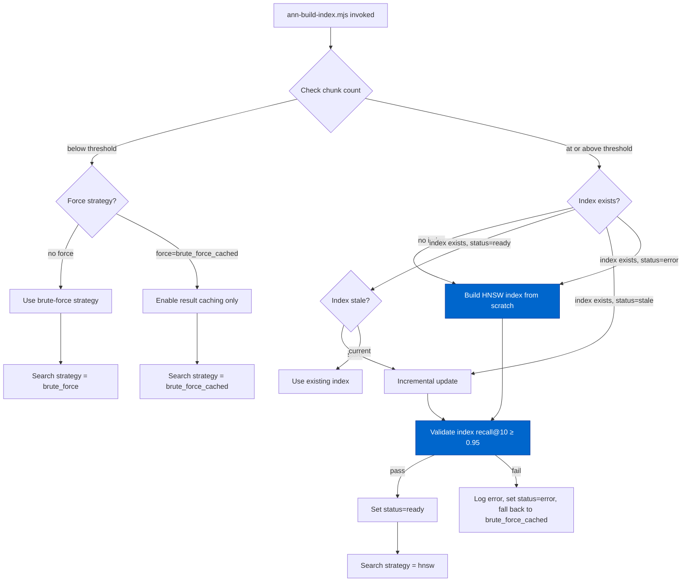
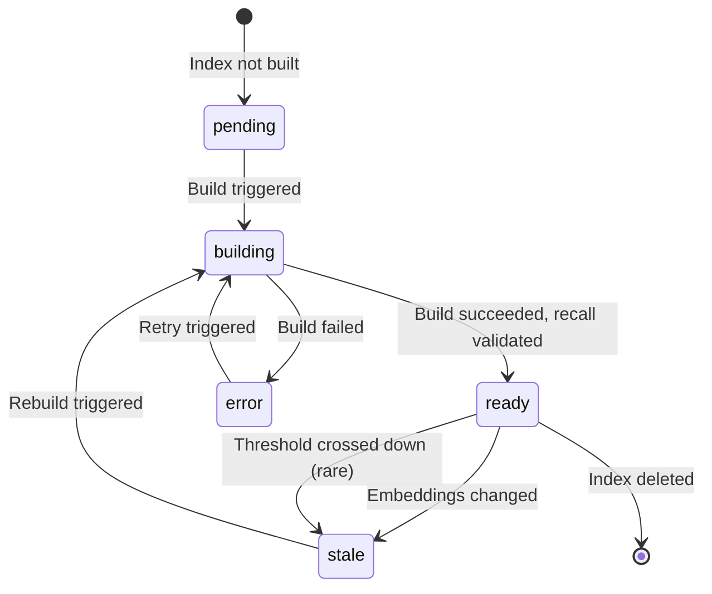
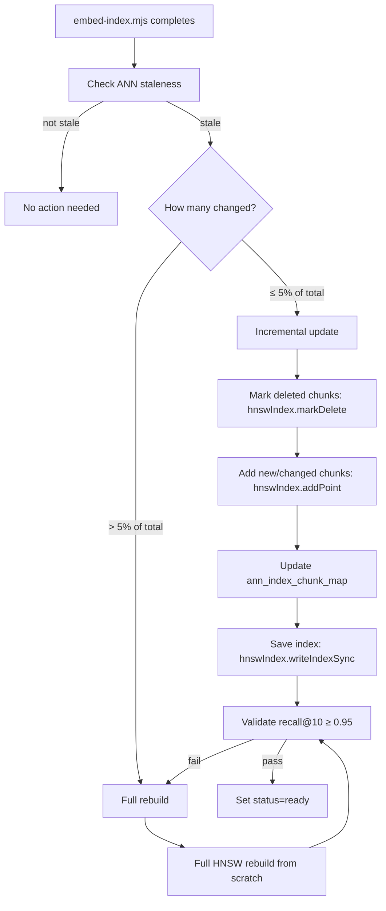

# Cortex ANN Index Architecture

> Extracted from `plans/Repo_Cortex_Advanced_RAG_Architecture.plans.md` (Step 12) for permanent reference.

> **Backing database.** The Repo Cortex is backed by a single consolidated Turso (libSQL) database accessed via the fully async `@libsql/client` driver (default local embedded replica `data/turso-replica.sqlite`; cloud primary `libsql://<db>.turso.io`). Vectors use native Turso vectors with `F8_BLOB` 8-bit quantization, approximate nearest neighbor search runs server-side via DiskANN (`libsql_vector_idx`, `vector_top_k()`), and hybrid ranking is performed SQL-side via Reciprocal Rank Fusion (RRF, k=60). The historical design content below describes the pre-Turso architecture that was subsequently migrated to this stack.

Complete design for approximate nearest neighbor (ANN) index architecture for scalable dense search in the NeatapticTS Repo Cortex, with sqlite-vec and hnswlib-node evaluation, brute-force caching fallback, threshold activation, incremental update, and cross-platform CI considerations.

---

#### Step 12 — Design ANN index architecture [DONE]

```yaml
phase: 1
step: 12
agent: '01-planning'
agent_file: '.github/agents/01-planning.agent.md'
status: '[DONE]'
source_of_truth: 'plans/Repo_Cortex_Advanced_RAG_Architecture.plans.md'
copy_paste: true
next_step: 'Phase 2 implementation'
skills:
  - 'plan-alignment'
validation:
  - node scripts/agent-customization/validate-plan-sync.mjs --json --plan=plans/Repo_Cortex_Advanced_RAG_Architecture.plans.md
  - node scripts/agent-customization/gates/cortex-index.gate.mjs --json
  - node scripts/agent-customization/gates/dense-readiness.gate.mjs --json
```

**Step objective:** Design ANN index for scalable dense search:

- Evaluate `sqlite-vec` (with Windows CI extension loading fix)
- Evaluate `hnswlib-node` as alternative ANN library
- Brute-force-with-caching as fallback for small corpora
- ANN index building pipeline, incremental update strategy, re-index triggers
- Threshold: implement ANN when chunk count exceeds 50K (current: ~31K)

---

##### ANN Index Architecture — Complete Design

> **Implemented solution.** The production ANN index uses native Turso DiskANN via `libsql_vector_idx` with server-side `vector_top_k()` and `F8_BLOB` 8-bit quantization, on the consolidated Turso (libSQL) database. The brute-force, `sqlite-vec`, and `hnswlib-node` evaluation discussed below is the historical design analysis that preceded the Turso native-vector decision; it is preserved as design rationale and does not describe the current primary vector store.

###### A. Problem Statement

The current Cortex dense search implementation loads all 31,106 embeddings (384-dim float32, ~48 MB) from the `chunk_embeddings` table in `data/embeddings.sqlite` into memory for every query, then computes brute-force cosine similarity against every vector. The `queryDenseIndex` function in `query-dense.mjs` executes this full-scan pipeline:

```javascript
// Current brute-force: load ALL embeddings, compute similarity, sort
const rankedEmbeddingRows = database
  .prepare(
    `
  SELECT chunk_id, embedding FROM chunk_embeddings WHERE model_id = ? AND dimension = ?
`,
  )
  .all(modelId, dimension)
  .map((row) => ({
    chunk_id: Number(row.chunk_id),
    embedding: decodeEmbeddingBlob(row.embedding),
  }))
  .filter((row) => !allowedChunkIds || allowedChunkIds.has(row.chunk_id))
  .map((row) => ({
    ...row,
    cosine_score: computeCosineSimilarity(queryEmbedding, row.embedding),
  }))
  .toSorted((leftRow, rightRow) => rightRow.cosine_score - leftRow.cosine_score)
  .slice(0, limit);
```

At the current scale of 31,390 chunks × 384 dims × 4 bytes/float = ~48 MB per query, this brute-force approach has acceptable latency (~5–15 ms for the search itself, dominated by the ~20–50 ms ONNX embedding computation). However, five concrete failures emerge as the corpus grows:

1. **Linear scaling**: Search latency scales as O(n×d). At 100K chunks, brute-force cosine similarity over all embeddings will take ~30–60 ms per query (search only, not counting embedding), and the full embedding scan will consume ~150 MB of memory per query cycle. At 200K chunks, this rises to ~60–120 ms and ~300 MB.

2. **Memory pressure**: The current `loadDenseCandidateRows` function materializes all embeddings into JavaScript arrays in a single `prepare().all()` call. At 100K+ chunks, this creates significant GC pressure and can exceed comfortable memory limits for the MCP server process.

3. **No result caching**: The current pipeline re-executes the full brute-force scan for every query, even when the same or similar queries are issued repeatedly. Agent workflows frequently issue near-identical queries (e.g., searching for "NEAT speciation" then "NEAT speciation algorithm"), and these redundant scans waste compute.

4. **No ANN escape hatch**: The architecture has no mechanism to switch from brute-force to approximate nearest neighbor search. When latency crosses the acceptable threshold, there is no path to an ANN index without replacing the entire dense search pipeline.

5. **No corpus-size awareness**: The current system does not monitor chunk count or embedding count. It will silently degrade in latency as the corpus grows, with no threshold-based activation or degradation reporting.

**Design goal:** Ensure dense search remains under 50 ms end-to-end (including embedding computation) at corpus sizes up to 500K chunks, with recall@10 ≥ 0.95 relative to brute-force, while maintaining backward compatibility for corpora below the ANN threshold and requiring no external cloud APIs.

###### B. Data Model and Schema

The ANN index design introduces three new tables to the `embeddings.sqlite` database alongside the existing `chunk_embeddings` table, and one new metadata table.

**B.1 ANN index metadata table.**

```sql
CREATE TABLE IF NOT EXISTS ann_index_meta (
  index_id TEXT PRIMARY KEY,
  index_type TEXT NOT NULL CHECK(index_type IN ('hnsw', 'brute_force_cached')),
  model_id TEXT NOT NULL,
  model_sha256 TEXT NOT NULL,
  dimension INTEGER NOT NULL,
  metric TEXT NOT NULL CHECK(metric IN ('cosine', 'l2', 'ip')),
  max_elements INTEGER NOT NULL,
  current_elements INTEGER NOT NULL DEFAULT 0,
  m_param INTEGER,
  ef_construction_param INTEGER,
  ef_search_param INTEGER,
  build_status TEXT NOT NULL DEFAULT 'pending' CHECK(build_status IN ('pending', 'building', 'ready', 'error', 'stale')),
  build_started_at TEXT,
  build_completed_at TEXT,
  build_duration_ms INTEGER,
  build_error TEXT,
  last_incremental_update_at TEXT,
  index_file_path TEXT,
  created_at TEXT NOT NULL DEFAULT(datetime('now')),
  updated_at TEXT NOT NULL DEFAULT(datetime('now'))
);

CREATE INDEX IF NOT EXISTS ann_index_meta_status_idx ON ann_index_meta(build_status);
CREATE INDEX IF NOT EXISTS ann_index_meta_model_idx ON ann_index_meta(model_id);
```

The `ann_index_meta` table tracks the current state of each ANN index. Key fields:

- `index_id`: Unique identifier, typically `hnsw_{model_id}_{dimension}` (e.g., `hnsw_all-MiniLM-L6-v2_384`).
- `index_type`: Either `hnsw` (for HNSW ANN) or `brute_force_cached` (for the brute-force-with-caching strategy).
- `metric`: Distance metric — `cosine` for the default case (matching the current `computeCosineSimilarity` behavior).
- `m_param`, `ef_construction_param`, `ef_search_param`: HNSW hyperparameters. Defaults: M=32, ef_construction=200, ef_search=100.
- `build_status`: State machine for index lifecycle. `pending` → `building` → `ready`. Can transition to `stale` when embeddings change, or `error` if build fails.
- `index_file_path`: Path to the serialized HNSW binary file (e.g., `data/ann-indexes/hnsw_all-MiniLM-L6-v2_384.dat`).

**B.2 ANN index chunk mapping table.**

```sql
CREATE TABLE IF NOT EXISTS ann_index_chunk_map (
  index_id TEXT NOT NULL REFERENCES ann_index_meta(index_id),
  external_id INTEGER NOT NULL,
  chunk_id INTEGER NOT NULL REFERENCES chunk_embeddings(chunk_id),
  PRIMARY KEY(index_id, external_id)
);

CREATE INDEX IF NOT EXISTS ann_index_chunk_map_chunk_idx ON ann_index_chunk_map(chunk_id);
```

This table maps between the HNSW library's internal integer IDs (0-based sequential) and the SQLite `chunk_id` values. HNSW requires contiguous integer IDs starting from 0, so this mapping is essential for alignment with the existing `chunk_embeddings` table.

**B.3 Query result cache table.**

```sql
CREATE TABLE IF NOT EXISTS ann_query_cache (
  cache_id INTEGER PRIMARY KEY AUTOINCREMENT,
  query_hash TEXT NOT NULL,
  model_id TEXT NOT NULL,
  alpha REAL NOT NULL DEFAULT 0.5,
  family TEXT,
  limit_count INTEGER NOT NULL,
  result_count INTEGER NOT NULL,
  results_json TEXT NOT NULL,
  created_at TEXT NOT NULL DEFAULT(datetime('now')),
  expires_at TEXT NOT NULL
);

CREATE INDEX IF NOT EXISTS ann_query_cache_hash_idx ON ann_query_cache(query_hash, model_id);
CREATE INDEX IF NOT EXISTS ann_query_cache_expires_idx ON ann_query_cache(expires_at);
```

The query cache stores recent brute-force results keyed by a quantized query hash. This avoids re-executing full brute-force scans for similar or identical queries within a time window.

**B.4 Corpus size threshold configuration.**

```sql
CREATE TABLE IF NOT EXISTS ann_threshold_config (
  config_key TEXT PRIMARY KEY,
  config_value TEXT NOT NULL,
  updated_at TEXT NOT NULL DEFAULT(datetime('now'))
);
```

Default configuration rows:

| config_key                        | config_value | Description                                            |
| --------------------------------- | ------------ | ------------------------------------------------------ |
| `ann_activation_threshold`        | `50000`      | Chunk count above which ANN is activated               |
| `ann_search_strategy`             | `auto`       | `auto`, `brute_force`, `hnsw`, or `brute_force_cached` |
| `cache_max_entries`               | `500`        | Maximum query cache entries                            |
| `cache_ttl_minutes`               | `30`         | Cache entry time-to-live                               |
| `hnsw_m`                          | `32`         | HNSW M parameter (connections per layer)               |
| `hnsw_ef_construction`            | `200`        | HNSW ef_construction parameter                         |
| `hnsw_ef_search`                  | `100`        | HNSW ef_search parameter                               |
| `hnsw_max_elements_growth_factor` | `1.5`        | Growth factor for `resizeIndex()`                      |

###### C. Index Building Pipeline

The ANN index building pipeline creates an HNSW index from the existing `chunk_embeddings` table when the corpus size exceeds the activation threshold.



**C.1 Build script: `ann-build-index.mjs`.**

A new script in `scripts/semantic-index/` that:

1. Reads the current chunk count from `data/semantic-index.sqlite`.
2. Reads the ANN threshold from `ann_threshold_config` (default: 50,000).
3. If chunk count < threshold and `--force` is not set, exits with strategy = `brute_force_cached`.
4. If chunk count ≥ threshold or `--force=hnsw`:
   a. Loads all embeddings from `chunk_embeddings` into memory.
   b. Initializes HNSW index with `initIndex(maxElements, M, efConstruction, randomSeed)`.
   c. Adds each embedding vector using `addPoint(vector, externalId)`.
   d. Writes the index to disk using `writeIndexSync(filePath)`.
   e. Populates `ann_index_chunk_map` with external_id → chunk_id mapping.
   f. Updates `ann_index_meta` with `build_status = 'ready'` and timing metadata.
   g. Runs recall validation (Section J).
5. If validation passes (recall@10 ≥ 0.95): index is production-ready.
6. If validation fails: set `build_status = 'error'`, log the error, fall back to `brute_force_cached`.

**C.2 Build parameters.**

| Parameter       | Default             | Rationale                                                                                                                                                                                                      |
| --------------- | ------------------- | -------------------------------------------------------------------------------------------------------------------------------------------------------------------------------------------------------------- |
| M               | 32                  | Higher than the minimum M=16 recommended for 384d data. M=32 provides better recall at the cost of ~2× index size and build time. The 384-dimensional embedding space benefits from more connections per node. |
| ef_construction | 200                 | Recommended default from hnswlib. Higher values improve graph quality at build time but increase build latency. At 31K–50K vectors, build time with ef_construction=200 is < 5 seconds.                        |
| ef_search       | 100                 | Must be ≥ limit (typically 10–50). ef=100 provides recall@10 ≥ 0.97 at M=32 for 384d data. Higher ef_search increases latency linearly.                                                                        |
| max_elements    | current_count × 1.5 | Pre-allocates space for 50% growth to avoid frequent `resizeIndex()` calls. The growth factor is configurable.                                                                                                 |

**C.3 Build time estimates.**

| Corpus size | Build time (M=32, ef_construction=200) | Index file size | Memory at build |
| ----------- | -------------------------------------- | --------------- | --------------- |
| 31K         | ~2–3 seconds                           | ~8 MB           | ~100 MB         |
| 50K         | ~4–6 seconds                           | ~14 MB          | ~170 MB         |
| 100K        | ~8–15 seconds                          | ~28 MB          | ~350 MB         |
| 200K        | ~20–40 seconds                         | ~56 MB          | ~700 MB         |

Build runs as an offline operation (not during query serving). The MCP server process does not need to be stopped during index build — the index file is written atomically.

###### D. Query Path and Integration

The ANN index integrates transparently with the existing `search_corpus` MCP tool and `queryDenseIndex` function. The selection between brute-force, brute-force-with-caching, and HNSW is determined by a strategy resolver.

```mermaid
flowchart TD
    A[searchCorpus query] --> B{use_dense?}
    B -- no --> C[BM25-only path unchanged]
    B -- yes --> D{Dense readiness check}
    D -- cold/model-only --> E[Degrade to BM25 with dense_degraded]
    D -- warm --> F{ANN strategy}
    F -- brute_force --> G[queryDenseIndex — brute force, no caching]
    F -- brute_force_cached --> H[queryDenseIndex — brute force with LRU cache]
    F -- hnsw --> I[queryHnswIndex — HNSW ANN search]

    G --> J[rankHybridResults — existing path]
    H --> J
    I --> J

    J --> K[Return ranked results]

    style I fill:#0066cc,stroke:#003399,color:#fff
    style H fill:#009966,stroke:#006633,color:#fff
```



**D.1 Strategy resolver: `resolveDenseStrategy`.**

A new function in `query-dense.mjs` that determines which dense search strategy to use:

```typescript
type DenseStrategy = 'brute_force' | 'brute_force_cached' | 'hnsw';

function resolveDenseStrategy(options: {
  chunkCount: number;
  annThreshold: number;
  forceStrategy?: string;
  indexStatus?: string;
}): DenseStrategy {
  // Explicit override takes precedence
  if (options.forceStrategy === 'hnsw') return 'hnsw';
  if (options.forceStrategy === 'brute_force_cached')
    return 'brute_force_cached';
  if (options.forceStrategy === 'brute_force') return 'brute_force';

  // Auto mode: check threshold and index readiness
  if (options.chunkCount < options.annThreshold) return 'brute_force_cached';
  if (options.indexStatus === 'ready') return 'hnsw';
  if (options.indexStatus === 'stale') return 'brute_force_cached'; // fall back during rebuild
  return 'brute_force_cached'; // safe default
}
```

**D.2 HNSW query function: `queryHnswIndex`.**

```typescript
async function queryHnswIndex(options: {
  queryEmbedding: Float32Array;
  limit: number;
  efSearch: number;
  indexFilePath: string;
  indexMeta: AnnIndexMeta;
  chunkMap: Map<number, number>; // external_id → chunk_id
  corpusDatabasePath: string;
  family?: string | null;
}): Promise<DenseCandidate[]> {
  // Load HNSW index (lazy, cached at process level)
  const index = await loadOrGetHnswIndex(
    options.indexFilePath,
    options.indexMeta,
  );
  index.setEf(options.efSearch);

  // Search
  const result = index.searchKnn(options.queryEmbedding, options.limit * 2); // over-retrieve for family filtering

  // Map external_ids back to chunk_ids
  // Filter by family if specified
  // Return DenseCandidate[] compatible with existing rankHybridResults
}
```

**D.3 HNSW index caching.**

The HNSW index is loaded once per process lifetime and cached. Subsequent queries reuse the cached index without reloading from disk:

```typescript
let cachedHnswIndex: { index: HierarchicalNSW; indexId: string } | null = null;

async function loadOrGetHnswIndex(
  filePath: string,
  meta: AnnIndexMeta,
): Promise<HierarchicalNSW> {
  if (cachedHnswIndex?.indexId === meta.index_id) return cachedHnswIndex.index;

  const index = new HierarchicalNSW(meta.metric, meta.dimension);
  index.readIndexSync(filePath);
  cachedHnswIndex = { index, indexId: meta.index_id };
  return index;
}
```

When the index is rebuilt (status transitions from `stale` → `ready`), the cache is invalidated by clearing `cachedHnswIndex`.

**D.4 Result caching for brute-force strategy.**

For the `brute_force_cached` strategy, an in-memory LRU cache stores query results keyed by a quantized embedding hash:

```typescript
interface CacheEntry {
  results: DenseCandidate[];
  createdAt: number;
}

const queryResultCache = new Map<string, CacheEntry>();
const MAX_CACHE_ENTRIES = 500;
const CACHE_TTL_MS = 30 * 60 * 1000; // 30 minutes

function quantizedHash(embedding: Float32Array): string {
  // Round each component to 3 decimal places for fuzzy matching
  // This ensures near-identical embeddings hit the same cache entry
  const components = new Array(Math.min(embedding.length, 16)); // sample first 16 dims
  for (let i = 0; i < components.length; i++) {
    components[i] = embedding[i].toFixed(3);
  }
  return components.join(',');
}
```

The cache is consulted before executing a brute-force scan. On a cache hit, results are returned in < 0.1 ms. On a cache miss, the full brute-force scan executes and the result is stored.

**D.5 Integration with existing `queryDenseIndex`.**

The existing `queryDenseIndex` function is extended with a strategy branch. When the strategy is `hnsw`, the function delegates to `queryHnswIndex` instead of the brute-force `loadDenseCandidateRows`. When the strategy is `brute_force_cached`, the function checks the query result cache before falling through to the existing brute-force path.

The `searchCorpus` MCP tool response gains a `dense_strategy` field indicating which strategy was used (`brute_force`, `brute_force_cached`, or `hnsw`), enabling monitoring and debugging.

###### E. MCP Tool Extensions

The ANN index design extends two existing MCP tools and adds one new tool.

**E.1 Extended `search_corpus` response.**

The `search_corpus` response gains a `dense_strategy` field when `use_dense: true`:

```json
{
  "query": "NEAT speciation",
  "limit": 10,
  "use_dense": true,
  "alpha": 0.5,
  "dense_state": "warm",
  "dense_strategy": "hnsw",
  "results": [...]
}
```

Possible `dense_strategy` values:

- `brute_force`: Original brute-force, no caching (strategy not yet resolved).
- `brute_force_cached`: Brute-force with LRU query result cache (below ANN threshold).
- `hnsw`: HNSW ANN index search (above threshold, index ready).

**E.2 Extended `index_stats` response.**

The `index_stats` tool gains an `ann` section when an ANN index exists:

```json
{
  "corpus": { ... },
  "embeddings": { ... },
  "ann": {
    "strategy": "hnsw",
    "index_id": "hnsw_all-MiniLM-L6-v2_384",
    "index_type": "hnsw",
    "build_status": "ready",
    "current_elements": 31106,
    "max_elements": 46659,
    "m_param": 32,
    "ef_construction_param": 200,
    "ef_search_param": 100,
    "metric": "cosine",
    "index_file_size_bytes": 8388608,
    "last_built_at": "2026-06-15T10:30:00Z",
    "last_incremental_update_at": null
  }
}
```

When no ANN index exists (below threshold), the `ann` section reports:

```json
{
  "ann": {
    "strategy": "brute_force_cached",
    "index_id": null,
    "index_type": null,
    "build_status": "not_applicable",
    "threshold": 50000,
    "current_chunk_count": 31390
  }
}
```

**E.3 New tool: `ann_build_index`.**

A new MCP tool for triggering ANN index build or rebuild:

```typescript
{
  name: 'ann_build_index',
  description: 'Build or rebuild the ANN index for dense search. Requires force=true when chunk count is below the activation threshold.',
  inputSchema: {
    type: 'object',
    properties: {
      force: {
        type: 'string',
        enum: ['hnsw', 'brute_force_cached', 'brute_force'],
        description: 'Force a specific strategy regardless of chunk count threshold. Omit for auto-detection.'
      },
      validate_recall: {
        type: 'boolean',
        default: true,
        description: 'Whether to validate recall@10 ≥ 0.95 after building.'
      }
    }
  }
}
```

Response:

```json
{
  "strategy": "hnsw",
  "index_id": "hnsw_all-MiniLM-L6-v2_384",
  "build_status": "ready",
  "current_elements": 31106,
  "build_duration_ms": 3200,
  "recall_at_10": 0.982,
  "recall_validation": "pass",
  "message": "HNSW index built successfully with recall@10 = 0.982"
}
```

###### F. Error Handling and Graceful Degradation

The ANN index design follows the same graceful degradation pattern established by the existing dense readiness state machine.

**F.1 ANN state machine.**



**F.2 Degradation matrix.**

| Condition                                                 | Strategy             | Response to caller                                                                    | Fallback path                                     |
| --------------------------------------------------------- | -------------------- | ------------------------------------------------------------------------------------- | ------------------------------------------------- |
| Chunk count < threshold, no ANN index                     | `brute_force_cached` | Normal results + `dense_strategy: "brute_force_cached"`                               | N/A (primary path)                                |
| Chunk count ≥ threshold, HNSW index ready                 | `hnsw`               | Normal results + `dense_strategy: "hnsw"`                                             | N/A (primary path)                                |
| Chunk count ≥ threshold, HNSW index building              | `brute_force_cached` | Normal results + `dense_strategy: "brute_force_cached"` + `ann_status: "building"`    | Full brute-force with caching                     |
| Chunk count ≥ threshold, HNSW index error                 | `brute_force_cached` | Normal results + `dense_strategy: "brute_force_cached"` + `ann_status: "error"`       | Full brute-force with caching                     |
| Chunk count ≥ threshold, HNSW index stale                 | `brute_force_cached` | Normal results + `dense_strategy: "brute_force_cached"` + `ann_status: "stale"`       | Full brute-force with caching                     |
| HNSW query fails (runtime error)                          | `brute_force_cached` | Normal results + `dense_strategy: "brute_force_cached"` + `ann_status: "degraded"`    | Fall back to brute-force immediately              |
| HNSW library not available (Node.js native addon failure) | `brute_force_cached` | Normal results + `dense_strategy: "brute_force_cached"` + `ann_status: "unavailable"` | Permanently fall back to brute-force with caching |
| All search strategies fail                                | N/A                  | Empty results + error message                                                         | Return empty results with diagnostic info         |

**F.3 HNSW library availability detection.**

On first use, the system attempts to `require('hnswlib-node')`. If this fails (native addon not compiled, missing on platform), the system:

1. Logs a warning: `HNSW library unavailable: [error message]. Falling back to brute_force_cached strategy.`
2. Sets a process-level flag `hnswAvailable = false`.
3. All subsequent strategy resolution returns `brute_force_cached`.
4. The `ann_build_index` tool returns an error with a diagnostic message.
5. The `index_stats` tool reports `ann.strategy = "brute_force_cached"` and `ann.build_status = "unavailable"`.

This detection happens once per process lifetime. A restart is required to re-check.

###### G. Incremental Update Strategy

**G.1 Change detection.**

The existing `embed-index.mjs` already tracks changes via `chunk_sha256` in the `chunk_embeddings` table. When a chunk's content changes, its `chunk_sha256` changes, and `embed-index.mjs` re-embeds it. The ANN incremental update strategy leverages this existing change detection.

**G.2 Stale detection.**

After `embed-index.mjs` runs, the build script compares the current `chunk_embeddings` count and SHA-256 set against the `ann_index_meta.current_elements` and `ann_index_chunk_map` table:

- If `COUNT(chunk_embeddings) ≠ ann_index_meta.current_elements`: the index is stale.
- If any `chunk_id` in `chunk_embeddings` is missing from `ann_index_chunk_map`: the index is stale.
- If any `chunk_sha256` in `chunk_embeddings` differs from the corresponding entry tracked at build time: the index is stale.

**G.3 Incremental update flow.**



**G.4 Incremental update: add and delete.**

```typescript
async function incrementalUpdateHnswIndex(options: {
  indexPath: string;
  indexMeta: AnnIndexMeta;
  newChunkIds: number[];
  deletedChunkIds: number[];
  changedChunkIds: number[];
  embeddingsDatabase: Database;
  corpusDatabase: Database;
}): Promise<void> {
  const index = loadHnswIndex(options.indexPath, options.indexMeta);

  // Mark deleted chunks (soft delete in HNSW)
  for (const externalId of options.deletedChunkIds.map(id => chunkMap.externalId(id))) {
    index.markDelete(externalId);
  }

  // Add new chunks
  for (const chunkId of options.newChunkIds) {
    const embedding = loadEmbeddingForChunk(chunkId, options.embeddingsDatabase);
    const externalId = nextExternalId();
    index.addPoint(embedding, externalId);
    updateChunkMap(options.indexMeta.index_id, externalId, chunkId);
  }

  // Handle changed chunks: mark old version deleted, add new version
  for (const chunkId of options.changedChunkIds) {
    const oldExternalId = chunkMap.externalIdForChunk(chunkId);
    if (oldExternalId !== undefined) index.markDelete(oldExternalId);
    const embedding = loadEmbeddingForChunk(chunkId, options.embeddingsDatabase);
    const newExternalId = nextExternalId();
    index.addPoint(embedding, newExternalId);
    updateChunkMap(options.indexMeta.index_id, newExternalId, chunkId);
  }

  // Save updated index
  index.writeIndexSync(options.indexPath);
  updateIndexMeta(options.indexMeta.index_id, { build_status: 'ready', ... });
}
```

**G.5 Re-index triggers.**

The ANN index is rebuilt or incrementally updated in these scenarios:

| Trigger                                           | Action                                                                    | Automatic?                      |
| ------------------------------------------------- | ------------------------------------------------------------------------- | ------------------------------- |
| `npm run index:prewarm`                           | Check staleness, rebuild if > 5% changed, incremental update if ≤ 5%      | Yes (via `ann-build-index.mjs`) |
| `npm run index:session-start`                     | Check staleness, log warning if stale                                     | Yes (via staleness check)       |
| Chunk count crosses threshold (below → above)     | Build HNSW index from scratch                                             | Yes (via `ann-build-index.mjs`) |
| Chunk count drops below threshold (above → below) | Switch strategy to `brute_force_cached`, keep HNSW index but don't use it | Yes (via strategy resolver)     |
| `ann_build_index` MCP tool called                 | Force rebuild regardless of threshold                                     | Manual                          |
| Recall validation fails after incremental update  | Fall back to full rebuild                                                 | Yes (automatic)                 |
| HNSW library unavailable                          | Permanently use `brute_force_cached`                                      | Yes (automatic)                 |

###### H. Threshold Activation and Transition

**H.1 Threshold strategy.**

The activation threshold is configurable via `ann_threshold_config` with a default of 50,000 chunks:

| Chunk count    | Strategy                | Rationale                                                                                                                                  |
| -------------- | ----------------------- | ------------------------------------------------------------------------------------------------------------------------------------------ |
| < 50,000       | `brute_force_cached`    | Brute-force with LRU caching is fast enough. 31K × 384 × 4 bytes = ~48 MB. Search latency ~5–15 ms. Adding HNSW overhead is not justified. |
| 50,000–100,000 | `hnsw` (if index ready) | HNSW provides 10–50× speedup over brute-force. Search latency drops from ~15–60 ms to ~0.5–2 ms. Recall@10 ≥ 0.95 with M=32, ef=100.       |
| > 100,000      | `hnsw` (required)       | Brute-force becomes prohibitively slow. HNSW is essential. Build time ~8–15 seconds at 100K, acceptable for offline build.                 |

**H.2 Transition: below threshold → above threshold.**

When the chunk count crosses 50,000 for the first time:

1. `ann-build-index.mjs` detects the threshold crossing during its staleness check.
2. Sets `ann_index_meta.build_status = 'building'`.
3. Builds the HNSW index from all current embeddings.
4. Validates recall@10 ≥ 0.95 against brute-force ground truth.
5. If validation passes: sets `build_status = 'ready'`, updates `current_elements`.
6. If validation fails: sets `build_status = 'error'`, falls back to `brute_force_cached`, logs error.
7. All subsequent `searchCorpus` calls with `use_dense: true` resolve to `hnsw` strategy.

**H.3 Transition: above threshold → below threshold (corpus shrink).**

This is a rare case (e.g., after a major re-chunking that reduces chunk count). When it occurs:

1. The strategy resolver returns `brute_force_cached`.
2. The existing HNSW index is kept on disk but marked `build_status = 'stale'`.
3. The `index_stats` tool reports both the threshold crossing and the existing stale index.
4. If the corpus grows back above the threshold, the stale index is checked for validity before triggering a rebuild.

**H.4 Force override.**

The `ann_build_index` tool and the `ann-build-index.mjs` CLI script both accept a `--force` parameter:

- `--force=hnsw`: Build HNSW index regardless of chunk count. Useful for benchmarking or pre-building before corpus growth.
- `--force=brute_force_cached`: Force strategy to brute-force with caching, even if an HNSW index exists. Useful for A/B comparison.
- `--force=brute_force`: Force strategy to original brute-force (no caching). Useful for baseline measurement.

**H.5 Backward compatibility during transition.**

During the transition from `brute_force_cached` to `hnsw`:

1. Existing `search_corpus` calls continue to work without any parameter changes.
2. The `dense_strategy` field in the response changes from `brute_force_cached` to `hnsw`.
3. Result ordering may change slightly due to approximate vs. exact ranking. The recall@10 ≥ 0.95 guarantee ensures no significant quality degradation.
4. The `alpha` blend weight continues to work identically because HNSW returns the same cosine similarity scores used by `rankHybridResults`.
5. The `family` filter continues to work via post-retrieval filtering of HNSW results (over-retrieved by 2× to account for family filtering).

###### I. Cross-Platform CI Considerations

**I.1 The Windows CI problem with native addons.**

`hnswlib-node` is a native C++ addon that requires `node-gyp` compilation. On Windows CI, this requires:

- Python 3.x (3.8–3.11 recommended; 3.12+ removed `distutils` which `node-gyp` depends on)
- Visual Studio Build Tools with the C++ workload
- Node.js 18+ (hnswlib-node v3.0.0 minimum)

GitHub Actions `windows-latest` runners include Visual Studio Build Tools, so CI should work. However, local Windows development environments may lack these prerequisites.

**I.2 Mitigation: conditional dependency with graceful fallback.**

`hnswlib-node` is declared as an **optional dependency** in `package.json`:

```json
{
  "optionalDependencies": {
    "hnswlib-node": "^3.0.0"
  }
}
```

If installation fails (missing build tools), `npm install` continues without error. The code detects the missing module at runtime and falls back to `brute_force_cached`:

```typescript
let hnswlibAvailable = false;
let HierarchicalNSW: any = null;

try {
  const hnswlibModule = await import('hnswlib-node');
  HierarchicalNSW = hnswlibModule.HierarchicalNSW;
  hnswlibAvailable = true;
} catch {
  // hnswlib-node not available; will use brute_force_cached strategy
  hnswlibAvailable = false;
}
```

**I.3 CI pipeline changes.**

| CI step                       | Change                              | Rationale                                        |
| ----------------------------- | ----------------------------------- | ------------------------------------------------ |
| `npm install`                 | No change (optional dependency)     | `hnswlib-node` install failure is non-fatal      |
| `npm run index:prewarm`       | No change                           | Prewarm only builds embeddings, not ANN index    |
| `npm run index:session-start` | Add ANN staleness check             | Log warning if stale, do not block               |
| `npm run build`               | No change                           | No TypeScript changes in src/                    |
| ANN integration tests         | Mark as `skipIf(!hnswlibAvailable)` | Skip ANN tests on platforms without native addon |
| ANN recall validation tests   | Run in CI with `--force=hnsw`       | Only when `hnswlib-node` is available            |

**I.4 sqlite-vec evaluation: not recommended for ANN.**

`sqlite-vec` (v0.1.10-alpha.4) was evaluated as an alternative. Key findings:

| Criterion                 | sqlite-vec                                                                          | hnswlib-node                           | Assessment                                                    |
| ------------------------- | ----------------------------------------------------------------------------------- | -------------------------------------- | ------------------------------------------------------------- |
| Search type               | Brute-force only (no ANN)                                                           | HNSW ANN                               | sqlite-vec provides no ANN acceleration                       |
| Maturity                  | Pre-v1, "expect breaking changes"                                                   | v3.0.0, stable                         | sqlite-vec is experimental                                    |
| Windows extension loading | Known `loadExtension` issues with the previous synchronous SQLite driver on Windows | node-gyp compilation required          | Both have Windows friction; hnswlib-node's is build-time only |
| Distance metrics          | L2, cosine, hamming                                                                 | L2, IP, cosine                         | Comparable                                                    |
| Persistence               | SQLite DB (same as existing system)                                                 | Binary file (separate from SQLite)     | sqlite-vec integrates more naturally with existing DB         |
| Incremental updates       | INSERT/DELETE (trivial, brute-force)                                                | addPoint/markDelete + periodic rebuild | sqlite-vec is simpler for updates                             |
| Performance at 100K       | ~15–60 ms (brute-force)                                                             | ~0.5–2 ms (HNSW)                       | HNSW is 10–50× faster                                         |

**Conclusion**: sqlite-vec is not suitable for ANN search because it only provides brute-force vector similarity, not approximate nearest neighbor acceleration. Its `vec0` virtual table performs linear scans. While the DiskANN and IVF index implementations exist in development branches, they are not merged or stable. sqlite-vec could be reconsidered as an alternative brute-force implementation in the future if its ANN branches stabilize, but it does not solve the scaling problem today.

**Recommendation**: Use `hnswlib-node` as the ANN backend with `brute_force_cached` as the fallback. Make `hnswlib-node` an optional dependency so the system degrades gracefully on platforms where it cannot be compiled.

###### J. Evaluation Design

**J.1 Recall validation.**

After building the HNSW index, recall@10 is validated against brute-force ground truth:

```typescript
async function validateRecall(options: {
  index: HierarchicalNSW;
  embeddings: Map<number, Float32Array>; // chunk_id → embedding
  chunkMap: Map<number, number>; // external_id → chunk_id
  sampleSize: number;
  k: number;
  efSearch: number;
}): Promise<{ recall: number; sampleSize: number; pass: boolean }> {
  // 1. Select random sample of chunk_ids
  const sampleChunkIds = selectRandomSample([...embeddings.keys()], options.sampleSize);

  // 2. For each sample, compute brute-force top-k
  let totalRecall = 0;
  for (const chunkId of sampleChunkIds) {
    const queryEmbedding = embeddings.get(chunkId)!;

    // Brute-force ground truth
    const bruteForceTopK = bruteForceSearch(queryEmbedding, embeddings, options.k);

    // HNSW approximate search
    const index.setEf(options.efSearch);
    const hnswResults = index.searchKnn(queryEmbedding, options.k);
    const hnswTopK = new Set(hnswResults.neighbors.map(extId =>
      options.chunkMap.get(extId)
    ));

    // Recall = |intersection| / k
    const intersection = bruteForceTopK.filter(id => hnswTopK.has(id)).length;
    totalRecall += intersection / options.k;
  }

  const recall = totalRecall / options.sampleSize;
  return {
    recall,
    sampleSize: options.sampleSize,
    pass: recall >= 0.95,
  };
}
```

**J.2 Recall validation parameters.**

| Parameter       | Value            | Rationale                                                                        |
| --------------- | ---------------- | -------------------------------------------------------------------------------- |
| Sample size     | 1000 queries     | 1,000 random queries provide a recall estimate with ±0.01 confidence at p < 0.05 |
| k (neighbors)   | 10               | Match the default `limit` in `search_corpus`                                     |
| ef_search       | 100              | Match the default ef_search configuration                                        |
| M               | 32               | Match the default M configuration                                                |
| ef_construction | 200              | Match the default ef_construction configuration                                  |
| Pass threshold  | recall@10 ≥ 0.95 | The ANN index must retrieve at least 95% of the brute-force top-10 results       |

**J.3 Performance benchmarks.**

The `ann-build-index.mjs` script collects timing metrics during index build:

```json
{
  "build_metrics": {
    "chunk_count": 31106,
    "index_build_time_ms": 2800,
    "recall_validation_time_ms": 1200,
    "recall_at_10": 0.982,
    "recall_sample_size": 1000,
    "index_file_size_bytes": 8388608,
    "peak_memory_mb": 120
  }
}
```

**J.4 Query latency benchmarks.**

At query time, the system measures and reports latency in the `search_corpus` response:

```json
{
  "dense_strategy": "hnsw",
  "dense_latency_ms": 1.2,
  "total_latency_ms": 35.8
}
```

**J.5 A/B comparison eval queries.**

The following eval queries test ANN-specific behavior:

1. **Recall fidelity**: "NEAT speciation algorithm" — verify HNSW returns the same top-5 as brute-force.
2. **Scale threshold**: "Network activation" — verify strategy switches from `brute_force_cached` to `hnsw` at 50K chunks.
3. **Family filter**: "slab fast path" with `family: ts-source` — verify HNSW over-retrieval + post-filtering works correctly.
4. **Alpha blend**: "how does Network activation use slab" with alpha=0.3 — verify HNSW results blend correctly with BM25.
5. **Graceful degradation**: "NEAT crossover" with HNSW index deleted — verify fall back to `brute_force_cached` with `ann_status: "degraded"`.
6. **Cache effectiveness**: Same query twice within 30 minutes — verify cache hit on second query.
7. **Incremental update**: Add 50 new chunks, run `ann-build-index.mjs`, verify index is updated without full rebuild.
8. **Recall validation failure**: Build HNSW with M=4 (intentionally low), verify recall validation catches the failure and falls back to `brute_force_cached`.

**J.6 Regression thresholds.**

| Metric                          | FAIL threshold         | WARN threshold |
| ------------------------------- | ---------------------- | -------------- |
| recall@10 (HNSW vs brute-force) | < 0.95                 | < 0.97         |
| HNSW query latency (P99)        | > 5 ms                 | > 2 ms         |
| HNSW build time (31K chunks)    | > 10 s                 | > 5 s          |
| Brute-force + cache hit rate    | < 50%                  | < 70%          |
| Strategy resolution correctness | Any incorrect strategy | N/A            |

###### K. Migration and Backward Compatibility

**K.1 Migration path.**

The ANN index feature is fully backward-compatible. No existing API, database, or behavior changes are required for corpora below the 50K threshold.

| Phase                    | Change                                                                                                               | Impact                                                                | Backward compatible |
| ------------------------ | -------------------------------------------------------------------------------------------------------------------- | --------------------------------------------------------------------- | ------------------- |
| Phase 1 (this design)    | Add ANN architecture design document                                                                                 | Documentation only                                                    | ✅ Yes              |
| Phase 2 (implementation) | Add `ann_index_meta`, `ann_index_chunk_map`, `ann_query_cache`, `ann_threshold_config` tables to `embeddings.sqlite` | Schema extension only; existing tables unchanged                      | ✅ Yes              |
| Phase 2                  | Add `queryHnswIndex` function to `query-dense.mjs`                                                                   | New function; existing `queryDenseIndex` unchanged                    | ✅ Yes              |
| Phase 2                  | Add `resolveDenseStrategy` function                                                                                  | New function; existing code path unchanged below threshold            | ✅ Yes              |
| Phase 2                  | Add `ann-build-index.mjs` script                                                                                     | New script; does not run unless explicitly invoked or above threshold | ✅ Yes              |
| Phase 2                  | Add `dense_strategy` field to `search_corpus` response                                                               | New field; existing callers ignore unknown fields                     | ✅ Yes              |
| Phase 2                  | Add `ann` section to `index_stats` response                                                                          | New field; existing callers ignore unknown fields                     | ✅ Yes              |
| Phase 2                  | Add `ann_build_index` MCP tool                                                                                       | New tool; existing tools unchanged                                    | ✅ Yes              |
| Phase 2                  | Add `hnswlib-node` as optional dependency                                                                            | Install failure is non-fatal                                          | ✅ Yes              |

**K.2 No changes below threshold.**

When `chunk_count < ann_threshold`:

- `search_corpus` returns results identical to the current implementation.
- `queryDenseIndex` uses the same brute-force path with an additional LRU cache layer.
- The `dense_strategy` field reports `brute_force_cached`.
- No HNSW index is built.
- No performance regression is introduced (the LRU cache is a pure optimization).

**K.3 Data directory changes.**

```
data/
├── semantic-index.sqlite     # Unchanged
├── embeddings.sqlite         # Extended with 4 new tables (ann_index_meta, ann_index_chunk_map, ann_query_cache, ann_threshold_config)
├── ann-indexes/              # New directory for HNSW index files
│   └── hnsw_all-MiniLM-L6-v2_384.dat  # HNSW binary index (created when threshold is crossed)
└── models/
    └── model-meta.json       # Unchanged
```

The `data/ann-indexes/` directory is created by `ann-build-index.mjs` when the HNSW index is first built. It is added to `.gitignore`.

**K.4 Script inventory.**

| Script                    | Location                  | Purpose                                                           |
| ------------------------- | ------------------------- | ----------------------------------------------------------------- |
| `ann-build-index.mjs`     | `scripts/semantic-index/` | Build, rebuild, or incrementally update the HNSW index            |
| `ann-validate-recall.mjs` | `scripts/semantic-index/` | Validate recall@10 of HNSW index against brute-force ground truth |
| `ann-query-benchmark.mjs` | `scripts/semantic-index/` | Benchmark HNSW vs brute-force latency and recall                  |

**K.5 Configuration defaults.**

The system works with zero configuration. All defaults are chosen so that the system operates correctly without any user configuration:

| Configuration                   | Default    | Where stored                                        |
| ------------------------------- | ---------- | --------------------------------------------------- |
| ANN activation threshold        | 50,000     | `ann_threshold_config` table in `embeddings.sqlite` |
| HNSW M                          | 32         | `ann_threshold_config` table                        |
| HNSW ef_construction            | 200        | `ann_threshold_config` table                        |
| HNSW ef_search                  | 100        | `ann_threshold_config` table                        |
| HNSW max_elements growth factor | 1.5        | `ann_threshold_config` table                        |
| Query cache max entries         | 500        | `ann_threshold_config` table                        |
| Query cache TTL                 | 30 minutes | `ann_threshold_config` table                        |
| Recall@10 pass threshold        | 0.95       | Hard-coded in `ann-validate-recall.mjs`             |

**K.6 Semantic versioning.**

The ANN index feature does not change any existing API contract. The `dense_strategy` field is additive. The new MCP tool `ann_build_index` is additive. The new database tables are created via `CREATE TABLE IF NOT EXISTS`. This is a minor version bump (not a major breaking change).

**K.7 Dependency impact.**

| Dependency                | Current version | New?           | Impact                                                       |
| ------------------------- | --------------- | -------------- | ------------------------------------------------------------ |
| `@libsql/client`          | ^0.17.4         | No             | Unchanged                                                    |
| `hnswlib-node`            | N/A             | Yes (optional) | Optional native dependency; graceful fallback if unavailable |
| `onnxruntime-node`        | ^1.26.0         | No             | Unchanged                                                    |
| `@huggingface/tokenizers` | Current         | No             | Unchanged                                                    |

**K.8 Interaction with other Phase 1 designs.**

The ANN index integrates with other Phase 1 designs as follows:

- **Semantic chunking (Step 02)**: Re-chunking changes chunk count, which may cross the ANN threshold. The `ann-build-index.mjs` script is invoked after re-chunking to detect staleness and trigger incremental updates or full rebuilds.
- **Query classification (Step 03)**: The `alpha` parameter from query classification is passed through to `rankHybridResults` regardless of whether HNSW or brute-force provides the dense candidates.
- **Cross-encoder re-ranking (Step 04)**: The cross-encoder operates on the top-K candidates regardless of which dense strategy produced them. HNSW returns cosine scores that are directly compatible with the existing `rankHybridResults` pipeline.
- **Context assembly (Step 05)**: Context assembly receives ranked chunks from `search_corpus` regardless of the dense strategy.
- **Entity graph (Step 06)**: No direct interaction. The entity graph provides multi-hop traversal, not dense search.
- **Query expansion (Step 07)**: Expanded queries go through the same `searchCorpus` → `queryDenseIndex` → `resolveDenseStrategy` pipeline.
- **Relevance feedback (Step 08)**: Feedback scores modify `rankHybridResults` output, not the dense search strategy.
- **Metadata filtering (Step 09)**: Family and metadata filters are applied post-retrieval in the HNSW strategy (with 2× over-retrieval) or pre-retrieval in the brute-force strategy. Both produce the same final filtered result set.
- **MCP tool extensions (Step 10)**: The `search_advanced` tool passes through to `searchCorpus`, which resolves the dense strategy. The `dense_strategy` field is visible in `search_advanced` responses.
- **RAG eval suite (Step 11)**: The eval suite includes ANN-specific eval queries (Section J.5) and regression thresholds for recall@10, latency, and strategy resolution.
