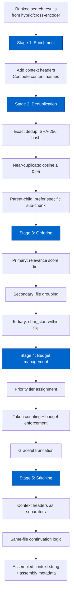

# Cortex Context Window Assembly Architecture

> Extracted from `plans/Repo_Cortex_Advanced_RAG_Architecture.plans.md` (Step 05) for permanent reference.

Complete design for multi-source context window assembly with deduplication, ordering, and budget management.

---

#### Step 05 — Design context window assembly architecture [DONE]

```yaml
phase: 1
step: 5
agent: '01-planning'
agent_file: '.github/agents/01-planning.agent.md'
status: '[DONE]'
source_of_truth: 'plans/Repo_Cortex_Advanced_RAG_Architecture.plans.md'
copy_paste: true
next_step: 'step_06'
skills: 'plan-alignment'
validation:
  - node scripts/agent-customization/validate-plan-sync.mjs --json --plan=plans/Repo_Cortex_Advanced_RAG_Architecture.plans.md
```

**Step objective:** Design multi-source context window assembly:

- Deduplication: content-hashing + embedding-similarity threshold for near-duplicate detection
- Ordering heuristics: dependency order, module hierarchy, relevance score decay
- Budget management: token budget per query, priority-based inclusion, graceful truncation
- Cross-chunk context headers: file path + heading path + signature prefix for each chunk
- Stitching: smooth transitions between chunks from different sources

---

##### Context Window Assembly Architecture — Complete Design

###### A. Problem Statement

The current Cortex search pipeline returns raw ranked chunk objects. Each chunk carries `{chunk_id, file_path, family, heading_path, text, char_start, char_end, score}` but there is no assembly step that transforms these into a coherent context window suitable for agent consumption. This creates five concrete failures:

1. **Duplicate content**: The same function may appear in multiple chunks (e.g., a class overview chunk and a method sub-chunk both contain the method signature). Near-duplicate content across readme and ts-source families produces redundant results. Agents waste token budget reading the same information twice.

2. **Incoherent ordering**: Results are ordered by relevance score alone, which produces jumbled reading. An agent asking "how does Network.activate use the slab?" receives chunks from `activate/`, `slab/`, and `network.ts` in score-descending order, not in the logical reading order that would build understanding.

3. **No budget management**: An unrestricted result set can be very large. The current `limit` cap is 50, but 50 chunks × ~1,000 chars = ~50,000 chars (~12,500 tokens). Most agent context windows cannot accommodate this. Agents need a bounded context window that respects their working context capacity.

4. **No provenance context**: Raw chunks lack file path and heading hierarchy in their body text. An agent reading a chunk about `evolve` cannot tell whether it comes from `src/neat.ts` or `src/architecture/network/evolve.ts` without inspecting the metadata separately. This forces agents to cross-reference metadata instead of reading naturally.

5. **No smooth transitions**: Chunks from different files and families are concatenated without any transition markers. An agent reading chunk 1 from `src/neat.ts` followed by chunk 2 from `plans/test-repair.plans.md` has no visual indicator that the source changed, causing confusion.

###### B. Pipeline Overview

The `assembleContext` pipeline is a five-stage stateless transformation that takes ranked search results and produces a token-budgeted context string with provenance headers.



**Key design properties:**

1. **Stateless**: The pipeline holds no persistent state. All information comes from the search results and corpus database. No new tables or columns are needed.

2. **Idempotent**: The same input always produces the same output. No randomness or nondeterminism.

3. **Composable**: Each stage is an independent pure function. Stages can be individually tested, skipped, or reordered.

4. **Retriever-agnostic**: The pipeline works with results from any retrieval stage — BM25-only, hybrid, or hybrid+cross-encoder. It does not depend on which scores are present.

###### C. Deduplication Strategy

Deduplication operates in three passes: exact match, near-duplicate, and parent-child collapse.

**C.1 Exact deduplication (SHA-256 content hash).**

Each chunk's `body_text` is hashed using SHA-256. Chunks with identical hashes are collapsed to a single representative. The representative is chosen by:

1. Highest relevance score (retains the best-ranked version)
2. Among equal scores, prefer the chunk with the most metadata (`context_header` present, `signature_text` present)
3. Among equal metadata, prefer ts-source over readme (source of truth)
4. Among equal family, prefer the chunk with the lowest `chunk_id` (stable tiebreaker)

The `chunk_sha256` column already exists in `chunk_embeddings` for embedding integrity. For assembly, we recompute SHA-256 from `body_text` only (not the embedding hash which includes metadata) because two chunks with the same body text but different `heading_path` or `context_header` are NOT exact duplicates for assembly purposes — they represent the same content at different locations. The assembly hash is:

```
assembly_hash = SHA-256(body_text)
```

This is computed at assembly time, not stored. It is a pure function of the chunk content.

**C.2 Near-duplicate detection (embedding cosine similarity ≥ 0.95).**

After exact dedup, remaining chunks are compared pairwise using their embeddings. Two chunks with cosine similarity ≥ 0.95 are considered near-duplicates. The threshold of 0.95 is chosen because:

- Below 0.90, semantically related but distinct chunks (e.g., two different methods in the same class) can exceed the threshold
- At 0.95, only truly redundant content (e.g., a readme summary that paraphrases a JSDoc comment, or two chunks that overlap due to the previous character-based overlap strategy) is collapsed
- The 0.95 threshold matches the value recommended in the Step 01 audit

Near-duplicate pairs are resolved by keeping the chunk with:

1. Higher relevance score
2. Among equal scores, the chunk that is NOT a "continued" sub-chunk (prefer the original section)
3. Among equal status, the chunk with the shorter `body_text` (prefer concise over verbose near-duplicates)

**Performance consideration**: Pairwise cosine similarity on N candidates is O(N²). For typical assembly inputs (20–50 chunks), this is at most 2,500 comparisons × 384-dim dot product ≈ 1M float operations ≈ <1 ms. No optimization needed.

However, when embeddings are NOT available (cold state, BM25-only queries), near-duplicate detection is skipped entirely. The pipeline degrades gracefully to exact dedup only.

**C.3 Parent-child collapse.**

When semantic chunking (Step 02) produces parent-child relationships (`parent_chunk_id`), the assembly pipeline applies parent-child collapse:

- If BOTH a parent chunk and its child sub-chunk appear in the results, keep only the child (the more specific, targeted result)
- If a child chunk appears but its parent does NOT appear in the results, keep the child as-is
- If a parent chunk appears but NONE of its children appear, keep the parent as-is

This prevents the common case where a class overview and a method sub-chunk both match a query about the method. The method sub-chunk is more relevant and more specific.

**Implementation:**

```
deduplicate(chunks, embeddings):
  // Pass 1: Exact dedup
  byHash = groupBy(chunks, c => sha256(c.body_text))
  deduped = byHash.values().map(group => selectRepresentative(group))

  // Pass 2: Near-duplicate (skip if embeddings unavailable)
  if embeddings available:
    for each pair (a, b) in deduped:
      if cosineSimilarity(a.embedding, b.embedding) >= 0.95:
        mark the lower-scored chunk for removal

  // Pass 3: Parent-child collapse
  parentIds = new Set(deduped.filter(c => c.parent_chunk_id != null).map(c => c.parent_chunk_id))
  remove chunks where chunk_id in parentIds AND at least one child exists in deduped

  return deduped
```

**Dedup metrics expected:**

| Scenario                                | Before dedup | After dedup | Reduction |
| --------------------------------------- | ------------ | ----------- | --------- |
| Cross-family query (readme + ts-source) | 20 results   | 14–16       | 20–30%    |
| Single-family query (ts-source only)    | 20 results   | 18–19       | 5–10%     |
| Multi-hop with continuation chunks      | 30 results   | 22–25       | 17–27%    |

###### D. Ordering Heuristics

After dedup, chunks are ordered for coherent reading. The ordering uses a stable multi-key sort:

**D.1 Primary sort: Relevance score tier.**

Chunks are divided into three relevance tiers based on their score:

| Tier            | Score range       | Priority | Description                                     |
| --------------- | ----------------- | -------- | ----------------------------------------------- |
| `essential`     | score ≥ 0.7       | Highest  | Directly relevant, likely contains the answer   |
| `supporting`    | 0.4 ≤ score < 0.7 | Medium   | Contextually relevant, provides background      |
| `supplementary` | score < 0.4       | Lowest   | Tangentially relevant, provides broader context |

Tiers are ordered: essential → supporting → supplementary. Within each tier, the secondary sort applies.

The tier thresholds (0.7, 0.4) are defaults that can be overridden per query class. For cross-encoder results where scores are probabilities, the thresholds map naturally. For hybrid scores, they may need calibration. The tier assignment function:

```
assignRelevanceTier(score, thresholds = { essential: 0.7, supporting: 0.4 }):
  if score >= thresholds.essential: return 'essential'
  if score >= thresholds.supporting: return 'supporting'
  return 'supplementary'
```

**D.2 Secondary sort: File grouping.**

Within each relevance tier, chunks from the same file are grouped together. This produces a coherent reading experience where an agent can read all results about `src/neat.ts` before moving to `src/architecture/network/activate.ts`.

Grouping uses `file_path` as the group key. Files are ordered by the highest score of any chunk within that file (descending). This means the file with the most relevant result appears first.

**D.3 Tertiary sort: Character position within file.**

Within a file group, chunks are ordered by `char_start` ascending. This preserves the natural reading order of the source document. A chunk from line 10 appears before a chunk from line 50, even if the later chunk has a slightly higher score.

**D.4 Quaternary sort: Family priority (tiebreaker).**

When two chunks from different files have equal scores and the same file-path group position (e.g., both are the only chunk from their respective files), family priority resolves the tie:

| Priority | Family      | Reason                                          |
| -------- | ----------- | ----------------------------------------------- |
| 1        | `ts-source` | Source code is the authoritative implementation |
| 2        | `readme`    | Generated documentation is secondary to source  |
| 3        | `plan`      | Design documents provide context                |
| 4        | `agent`     | Agent customizations are supporting             |
| 5        | `skill`     | Skill documentation is supporting               |
| 6        | `demo`      | Examples are supplementary                      |
| 7        | Other       | Catch-all for remaining families                |

**Implementation:**

```
orderChunks(chunks):
  // Assign tiers
  tiered = chunks.map(c => ({ ...c, tier: assignRelevanceTier(c.score) }))

  // Group by file, order files by max score
  filesGrouped = groupBy(tiered, c => c.file_path)
  fileOrder = Object.entries(filesGrouped)
    .toSorted((a, b) => maxScore(b[1]) - maxScore(a[1]))
    .map(([filePath, fileChunks]) => ({
      filePath,
      maxScore: maxScore(fileChunks),
      chunks: fileChunks.toSorted((a, b) => a.char_start - b.char_start)
    }))

  // Interleave files by tier: essential files first, then supporting, then supplementary
  essential = fileOrder.filter(g => g.maxScore >= 0.7)
  supporting = fileOrder.filter(g => g.maxScore >= 0.4 && g.maxScore < 0.7)
  supplementary = fileOrder.filter(g => g.maxScore < 0.4)

  return [...essential, ...supporting, ...supplementary].flatMap(g => g.chunks)
```

**D.5 Relevance score decay for multi-hop queries.**

For multi-hop queries (Step 06), context assembly may receive results from multiple retrieval hops. Later hops generally have lower relevance scores. The assembly pipeline applies a decay factor to later hops' scores to prevent them from displacing earlier, more relevant results:

```
applyHopDecay(chunksByHop, decayFactor = 0.85):
  // Hop 0 (initial): full score
  // Hop 1: score × 0.85
  // Hop 2: score × 0.85² = 0.7225
  return chunksByHop.flatMap((chunks, hopIndex) =>
    chunks.map(c => ({ ...c, score: c.score * decayFactor ** hopIndex }))
  )
```

This ensures the initial retrieval results remain dominant while allowing later-hop results to participate if their decayed score still exceeds the tier thresholds.

###### E. Budget Management

Budget management constrains the assembled context window to a configurable token budget.

**E.1 Token budget defaults.**

| Query class    | Default budget            | Rationale                        |
| -------------- | ------------------------- | -------------------------------- |
| Simple lookup  | 2,048 tokens (~8K chars)  | Targeted answer, minimal context |
| Cross-boundary | 4,096 tokens (~16K chars) | Needs multiple sources           |
| Multi-hop      | 6,144 tokens (~24K chars) | Accumulates across hops          |
| Exploratory    | 8,192 tokens (~32K chars) | Broad survey, many sources       |
| Code-specific  | 2,048 tokens (~8K chars)  | Focused on one symbol/module     |
| Plan-specific  | 4,096 tokens (~16K chars) | Plan context is verbose          |

The default budget for unclassified queries is 4,096 tokens. This matches the typical agent working context capacity for Cortex results — enough for 8–10 meaningful chunks without overwhelming the agent.

**E.2 Token counting.**

Token counting uses a fast character-based approximation:

```
estimateTokenCount(text):
  // Rule of thumb: 1 token ≈ 4 chars for English text and code
  // This is deliberately approximate — exact tokenization would require
  // the same tokenizer as the embedding model, adding latency for
  // minimal budget-management precision gain.
  return Math.ceil(text.length / 4)
```

For context headers (which are shorter and denser), the same ratio applies. The 4:1 ratio is conservative — actual code typically tokenizes at ~3.5:1 and markdown at ~4.2:1. Using 4:1 ensures the budget is slightly under-filled rather than over-filled.

**E.3 Priority-based inclusion.**

Chunks are included in the assembled context in priority order:

1. All `essential` tier chunks (score ≥ 0.7) — always included, even if budget is exceeded
2. `supporting` tier chunks — included in score-descending order until budget is reached
3. `supplementary` tier chunks — included in score-descending order until budget is reached

Essential chunks are "hard includes" — they are always present even if the budget is exceeded. This prevents the most relevant results from being dropped. If essential chunks alone exceed the budget, they are all included and a `budget_exceeded: true` flag is set in the response.

Supporting and supplementary chunks are "soft includes" — they are added in priority order until the next chunk would exceed the remaining budget. The last chunk that would fit is truncated if it would exceed the budget by less than 50% of its size; otherwise it is dropped entirely.

**E.4 Graceful truncation.**

When a chunk must be truncated to fit the budget:

1. Truncate at a sentence boundary (for markdown) or statement boundary (for code) when possible
2. Append an ellipsis marker `[…]` to indicate truncation
3. Add a `truncated: true` field to the chunk metadata in the assembly response
4. If the remaining budget is less than 20% of the chunk size, drop the chunk entirely rather than including a severely truncated fragment

**E.5 Budget accounting.**

The token budget accounts for ALL text in the assembled context, including:

- Context headers (file path + heading path + signature prefix)
- Chunk body text
- Separator/transition text between chunks
- Truncation markers

This prevents headers from consuming an unbounded portion of the budget. The typical header cost is ~30–60 tokens per chunk, which is manageable within the 2K–8K token budget.

**Implementation:**

```
enforceBudget(orderedChunks, budgetTokens):
  context = []
  usedTokens = 0
  budgetExceeded = false
  truncatedChunks = []

  for chunk in orderedChunks:
    headerTokens = estimateTokenCount(buildContextHeader(chunk))
    bodyTokens = estimateTokenCount(chunk.body_text)
    separatorTokens = 2  // newline separator
    totalChunkTokens = headerTokens + bodyTokens + separatorTokens

    tier = assignRelevanceTier(chunk.score)

    if tier === 'essential':
      // Always include, even if over budget
      context.push(chunk)
      usedTokens += totalChunkTokens
      if usedTokens > budgetTokens:
        budgetExceeded = true
      continue

    remaining = budgetTokens - usedTokens
    if remaining <= 0:
      break

    if totalChunkTokens <= remaining:
      // Full chunk fits
      context.push(chunk)
      usedTokens += totalChunkTokens
    else if remaining >= totalChunkTokens * 0.5:
      // Partial fit — truncate
      truncationTarget = remaining - headerTokens - separatorTokens
      truncatedBody = truncateAtBoundary(chunk.body_text, truncationTarget * 4) + ' […]'
      context.push({ ...chunk, body_text: truncatedBody, truncated: true })
      usedTokens += remaining
    // else: drop entirely (remaining < 50% of chunk)

  return { context, usedTokens, budgetExceeded, includedCount: context.length, excludedCount: orderedChunks.length - context.length }
```

###### F. Cross-Chunk Context Headers

Context headers prefix each chunk in the assembled context window, providing provenance without inflating the embedding (headers are added at assembly time, not at indexing time).

**F.1 Header format.**

The header follows the pattern:

```
[<file_path> > <heading_path> > <signature>]
```

Each component is optional and omitted when empty:

| Chunk type                     | Header example                                                                        |
| ------------------------------ | ------------------------------------------------------------------------------------- |
| TypeScript method              | `[src/neat.ts > Neat > evolve(inputs, fitnessFunction)]`                              |
| TypeScript standalone function | `[src/architecture/network/activate/network.activate.ts > activate]`                  |
| Markdown section               | `[src/architecture/network/README.md > Network > activate]`                           |
| Markdown continued section     | `[src/architecture/network/README.md > Network > activate (continued)]`               |
| Plan section                   | `[plans/Repo_Cortex_Advanced_RAG_Architecture.plans.md > Step 05 > Context assembly]` |
| Skill reference                | `[.github/skills/plan-alignment/SKILL.md > Required Workflow]`                        |
| Chunk with no heading          | `[src/methods/activation.ts]`                                                         |

**F.2 Header construction.**

```
buildContextHeader(chunk):
  parts = []

  if chunk.file_path:
    parts.push(chunk.file_path)

  if chunk.heading_path:
    parts.push(chunk.heading_path)

  // Signature is ts-source only (from Step 02 schema)
  if chunk.signature_text and chunk.family === 'ts-source':
    parts.push(chunk.signature_text)

  if parts.length === 0:
    return ''  // No header for unidentified chunks

  return '[' + parts.join(' > ') + ']'
```

**F.3 Header cost analysis.**

| Header type                       | Typical length | Token cost |
| --------------------------------- | -------------- | ---------- |
| Full (file + heading + signature) | ~80 chars      | ~20 tokens |
| File + heading                    | ~50 chars      | ~13 tokens |
| File only                         | ~30 chars      | ~8 tokens  |
| Empty                             | 0              | 0 tokens   |

For 10 chunks at the default 4K budget, headers cost ~130 tokens (~3.2% of budget). This is an acceptable overhead for the provenance value they provide.

**F.4 Header and embedding separation.**

Context headers are NOT included in the embedding computation. They are added at assembly time only. This preserves the existing embedding pipeline where `body_text` is the sole content input to the embedding model. Adding headers to embeddings would break all existing embedding comparisons and require a full re-index.

The `context_header` column added in Step 02's schema is stored in the database for agent consumption but is NOT part of `body_text` and is NOT fed to the FTS5 index. Assembly-time headers are constructed fresh from the current chunk metadata, ensuring they reflect the latest `heading_path`, `signature_text`, and `file_path`.

###### G. Stitching

Stitching assembles the final context string from ordered, budget-managed chunks with appropriate separators.

**G.1 Separator logic.**

The separator between chunks depends on the relationship between consecutive chunks:

| Relationship                                  | Separator                             | Rationale                                    |
| --------------------------------------------- | ------------------------------------- | -------------------------------------------- |
| Same file, same heading (continued sub-chunk) | `\n` (single newline)                 | Minimal break — continuation of same section |
| Same file, different heading                  | `\n\n---\n\n` + header                | Section break within same file               |
| Different file                                | `\n\n---\n\n` + header                | File break — full context header             |
| Different family                              | `\n\n===\n\n` + header + family label | Family boundary — strongest visual break     |

The three separator levels give agents clear visual cues:

- `---` indicates a new section or file (moderate boundary)
- `===` indicates a family change (strong boundary — the nature of the content changes from code to plan, for example)

**G.2 Same-file continuation optimization.**

When consecutive chunks come from the same file, the file path component of the context header is redundant. The assembly pipeline suppresses the file path for same-file continuations:

```
Chunk 1: [src/neat.ts > Neat > evolve]
Chunk 2: [> Neat > create]           // file path suppressed
Chunk 3: [> Neat > evaluate]          // file path suppressed
Chunk 4: [src/architecture/network/activate/network.activate.ts > activate]  // new file, full header
```

This saves ~30 chars per continuation chunk (~8 tokens), which accumulates meaningfully across 10+ same-file chunks.

**G.3 Assembled context format.**

The final assembled context string follows this format:

```
[file_path_1 > heading_1 > signature_1]
body_text_1

---

[> heading_2 > signature_2]
body_text_2

===

[file_path_2 > heading_3]
body_text_3

---

[> heading_4]
body_text_4
```

**G.4 Assembly metadata response.**

The `assemble_context` tool returns both the assembled string and metadata about the assembly process:

```json
{
  "context": "<assembled context string>",
  "metadata": {
    "query": "how does Network.activate use the slab?",
    "total_chunks_found": 25,
    "chunks_after_dedup": 18,
    "chunks_included": 12,
    "chunks_excluded_by_budget": 6,
    "tokens_used": 3847,
    "budget_tokens": 4096,
    "budget_exceeded": false,
    "truncated_chunks": 0,
    "dedup_stats": {
      "exact_removed": 3,
      "near_duplicate_removed": 2,
      "parent_child_collapsed": 2
    },
    "tier_counts": {
      "essential": 4,
      "supporting": 6,
      "supplementary": 2
    },
    "families_included": ["ts-source", "readme"],
    "files_included": [
      "src/neat.ts",
      "src/architecture/network/activate/network.activate.ts"
    ]
  }
}
```

This metadata allows agents and operators to understand what was included, what was excluded, and why. It also provides debugging information for tuning budget and dedup parameters.

###### H. New MCP Tool: `search_context`

**H.1 Tool contract.**

```json
{
  "name": "search_context",
  "description": "Search the corpus and assemble a context window from ranked results. Applies deduplication, ordering, budget management, and cross-chunk context headers to produce a coherent context string optimized for agent consumption. Extends search_corpus with context assembly pipeline.",
  "inputSchema": {
    "type": "object",
    "properties": {
      "query": {
        "type": "string",
        "description": "Free-text query string."
      },
      "limit": {
        "type": "number",
        "description": "Maximum number of search candidates to retrieve before assembly (default: 20)."
      },
      "family": {
        "type": "string",
        "description": "Optional document family filter."
      },
      "use_dense": {
        "type": "boolean",
        "description": "Enable hybrid dense reranking (default: true)."
      },
      "use_rerank": {
        "type": "boolean",
        "description": "Enable cross-encoder re-ranking (default: false)."
      },
      "alpha": {
        "type": "number",
        "description": "BM25/dense blend weight (default: 0.5)."
      },
      "budget_tokens": {
        "type": "number",
        "description": "Maximum token budget for the assembled context (default: 4096, range: 1024–16384)."
      },
      "dedup_similarity_threshold": {
        "type": "number",
        "description": "Cosine similarity threshold for near-duplicate detection (default: 0.95, range: 0.80–0.99)."
      },
      "tier_thresholds": {
        "type": "object",
        "description": "Custom score thresholds for essential and supporting tiers.",
        "properties": {
          "essential": { "type": "number" },
          "supporting": { "type": "number" }
        }
      }
    },
    "required": ["query"]
  }
}
```

**H.2 Integration with existing search pipeline.**

`search_context` is a composition of `searchCorpus` + `assembleContext`:

```
searchContext(options):
  // Stage 1: Retrieve candidates using existing search pipeline
  searchResult = searchCorpus({
    query: options.query,
    limit: options.limit ?? 20,
    family: options.family,
    use_dense: options.use_dense,
    use_rerank: options.use_rerank,
    alpha: options.alpha,
  })

  // Stage 2: Assemble context from results
  assemblyResult = assembleContext({
    chunks: searchResult.results,
    budgetTokens: options.budget_tokens ?? 4096,
    dedupThreshold: options.dedup_similarity_threshold ?? 0.95,
    tierThresholds: options.tier_thresholds,
  })

  return {
    context: assemblyResult.context,
    metadata: {
      ...assemblyResult.metadata,
      search_metadata: {
        query: searchResult.query,
        limit: searchResult.limit,
        use_dense: searchResult.use_dense,
        use_rerank: searchResult.use_rerank,
        ...(searchResult.dense_state ? { dense_state: searchResult.dense_state } : {}),
        ...(searchResult.rerank_state ? { rerank_state: searchResult.rerank_state } : {}),
      }
    }
  }
```

**H.3 Relationship to `search_corpus`.**

`search_context` is a higher-level tool that wraps `search_corpus`. Agents that need structured result objects (with individual `chunk_id`, `score`, etc.) should use `search_corpus` directly. Agents that need a ready-to-consume context string should use `search_context`.

The two tools serve different agent consumption patterns:

| Pattern            | Tool                                 | Use case                                                                |
| ------------------ | ------------------------------------ | ----------------------------------------------------------------------- |
| Structured results | `search_corpus`                      | "I need to inspect individual chunks, load parents, or iterate results" |
| Assembled context  | `search_context`                     | "I need a coherent context window to feed into my reasoning"            |
| Both               | `search_corpus` then manual assembly | "I need structured results AND want to assemble context myself"         |

`search_context` does NOT replace `search_corpus`. It is an optional convenience for the common pattern of "search → assemble → reason".

**H.4 Extended `search_corpus` with `use_assembly` parameter.**

As an alternative to the separate `search_context` tool, `search_corpus` can gain an optional `use_assembly` parameter:

```json
{
  "use_assembly": {
    "type": "boolean",
    "description": "When true, returns assembled context string instead of structured results (default: false)."
  },
  "budget_tokens": {
    "type": "number",
    "description": "Token budget for assembly (only used when use_assembly is true)."
  }
}
```

This approach keeps the tool surface smaller but makes the `search_corpus` response contract more complex. **Recommendation: implement `search_context` as a separate tool** for clean separation of concerns. The `search_corpus` tool remains the structured retrieval interface; `search_context` is the assembly interface. This avoids breaking existing `search_corpus` consumers.

###### I. Integration with Existing Search Pipeline

**I.1 Pipeline position.**

The context assembly pipeline is positioned AFTER the cross-encoder re-ranking stage (Step 04) and BEFORE agent consumption:

```
Query → BM25 → Dense → Hybrid Rank → [Cross-Encoder] → Assembly → Agent
```

Assembly is always the last stage. It does not feed back into the retrieval pipeline.

**I.2 Retrieval-assembly separation.**

A critical design decision: **assembly does not affect retrieval**. The retrieval pipeline (BM25, hybrid, cross-encoder) produces a ranked list of chunks. Assembly transforms that list into a context window. The two are independent:

- Assembly cannot request more candidates from retrieval
- Assembly cannot change retrieval scores
- Assembly cannot trigger additional queries

This separation ensures that assembly is a pure output transformation that can be applied, skipped, or replaced without affecting the retrieval pipeline.

**I.3 Assembly with BM25-only results.**

When the system is in BM25-only mode (dense cold or model-only), the assembly pipeline still works but with reduced capability:

| Feature               | Available in BM25-only? | Behavior                                                                 |
| --------------------- | ----------------------- | ------------------------------------------------------------------------ |
| Exact dedup           | ✅ Yes                  | SHA-256 hash works on `body_text` regardless of retrieval mode           |
| Near-duplicate dedup  | ❌ No                   | No embeddings available to compute cosine similarity; skipped gracefully |
| Parent-child collapse | ✅ Yes                  | Does not depend on embeddings                                            |
| Ordering              | ✅ Partial              | BM25 scores are negative; tiers use absolute value thresholds            |
| Budget management     | ✅ Yes                  | Token counting is retrieval-agnostic                                     |
| Context headers       | ✅ Yes                  | Headers depend on metadata, not retrieval mode                           |
| Stitching             | ✅ Yes                  | File/family grouping is retrieval-agnostic                               |

**I.4 Assembly with cross-encoder results.**

When cross-encoder re-ranking is active, assembly uses the `rerank_score` as the primary score for tier assignment. The cross-encoder score is a probability (0–1) that maps directly to the tier thresholds (essential ≥ 0.7, supporting ≥ 0.4). This produces more accurate tier assignments than hybrid-blended scores, which are min-max normalized and not directly interpretable as probabilities.

**I.5 Multi-hop assembly (Step 06 integration).**

For multi-hop queries, each hop produces its own ranked results. The assembly pipeline receives all hop results with hop-level metadata:

```
assembleMultiHopContext(hopsResults, budgetTokens):
  // Apply hop decay
  decayedChunks = applyHopDecay(hopsResults)

  // Merge all hop results into single candidate pool
  merged = deduplicate(decayedChunks)
  ordered = orderChunks(merged)
  budgeted = enforceBudget(ordered, budgetTokens)
  context = stitch(budgeted)

  return context
```

The assembly pipeline does not need to know how many hops occurred — it simply processes the merged, decayed result set.

###### J. Schema Changes

**No schema changes are needed for context assembly.** The pipeline is entirely stateless and operates on the existing chunk data:

- `body_text` — for dedup hash, token counting, and context body
- `file_path` — for context headers and file grouping
- `heading_path` — for context headers
- `chunk_id` — for parent-child collapse
- `parent_chunk_id` — for parent-child collapse (from Step 02 schema)
- `signature_text` — for context headers (from Step 02 schema)
- `context_header` — alternative header source (from Step 02 schema)
- `chunk_embeddings` — for near-duplicate cosine similarity

The assembly pipeline reads from the existing database and search results. It does not write anything. This is a critical design property that keeps assembly lightweight and non-intrusive.

**Schema dependency on Step 02:**

The `parent_chunk_id` and `signature_text` columns used by assembly are introduced in Step 02's semantic chunking schema. If Step 02 has not been implemented, assembly degrades gracefully:

| Feature               | Available without Step 02? | Fallback behavior                                                   |
| --------------------- | -------------------------- | ------------------------------------------------------------------- |
| Parent-child collapse | ❌ No                      | `parent_chunk_id` is NULL for all chunks; no collapse occurs        |
| Signature in headers  | ❌ No                      | `signature_text` is NULL; headers use file_path + heading_path only |
| Context headers       | ✅ Partial                 | Headers from `heading_path` and `file_path` only                    |

Assembly is designed to work with both the current v1 schema and the v2 schema from Step 02. With v1, features that depend on new columns are simply skipped.

###### K. File Organization

**K.1 New files.**

| File                                                            | Purpose                                                     |
| --------------------------------------------------------------- | ----------------------------------------------------------- |
| `scripts/semantic-index/assemble-context.mjs`                   | Context assembly pipeline (dedup → order → budget → stitch) |
| `scripts/mcp-semantic/tools/search-context.mjs`                 | `search_context` MCP tool implementation                    |
| `scripts/semantic-index/__tests__/assemble-context.red.test.ts` | Red tests for assembly pipeline                             |

**K.2 Modified files.**

| File                                       | Change                         |
| ------------------------------------------ | ------------------------------ |
| `scripts/mcp-semantic/repo-cortex-mcp.mjs` | Register `search_context` tool |

**K.3 No changes to existing search pipeline.**

Assembly is a separate pipeline that consumes search results. No modifications to `search-corpus.mjs`, `query-dense.mjs`, or `hybrid-rank.mjs` are needed. The `search_context` tool calls `searchCorpus` internally, then applies assembly.

###### L. Design Constraints and Non-Goals

**Constraints:**

1. **Stateless**: Assembly writes nothing to the database. All state is derived from search results and chunk metadata.
2. **No schema changes**: Assembly uses existing columns and gracefully degrades when Step 02 columns are absent.
3. **Retriever-agnostic**: Works with BM25-only, hybrid, or hybrid+cross-encoder results.
4. **Backward compatible**: `search_corpus` is unchanged. `search_context` is a new tool, not a replacement.
5. **Token budget enforced**: The assembled context never exceeds `budget_tokens` (except for essential-tier chunks which are always included).
6. **Local-first**: No cloud API calls. All computation is local (SHA-256, cosine similarity, token estimation).

**Non-goals:**

1. **Assembly-driven re-retrieval**: Assembly cannot request additional candidates or trigger follow-up queries. Multi-hop retrieval (Step 06) is a separate concern.
2. **Persistent assembly cache**: Assembled contexts are not stored. Each call produces a fresh result.
3. **LLM-based summarization**: Assembly does not use an LLM to summarize or compress context. It includes or truncates chunks. Summarization is a future optimization that would require a local LLM.
4. **Semantic compression**: Assembly does not rewrite or compress chunk content. The original `body_text` is included verbatim (or truncated at boundaries).
5. **Cross-encoder inside assembly**: Assembly does not re-rank results. Re-ranking is the responsibility of Step 04's cross-encoder pipeline, which runs before assembly.
6. **Dynamic budget adjustment**: The budget is set by the caller. Assembly does not auto-adjust the budget based on content richness or query complexity. The query classification (Step 03) suggests default budgets per class, but the caller has final control.

###### M. Evaluation Design

**Assembly quality metrics:**

| Metric                 | How to measure                                                             | Target                                          |
| ---------------------- | -------------------------------------------------------------------------- | ----------------------------------------------- |
| Dedup precision        | Manual inspection of deduped chunks — are removed chunks truly duplicates? | ≥ 90% precision (≤ 10% false positives)         |
| Dedup recall           | Manual inspection — are there remaining duplicates that were not caught?   | ≥ 80% recall                                    |
| Ordering coherence     | Human evaluation — does the reading order make sense?                      | ≥ 80% "makes sense" rating                      |
| Budget adherence       | Automated — does the assembled context stay within budget?                 | 100% adherence (except essential-tier overflow) |
| Header informativeness | Human evaluation — do headers provide enough provenance context?           | ≥ 85% "informative" rating                      |
| Context relevance      | Compare assembled context MRR vs. raw search MRR                           | ≤ 5% MRR regression from dedup                  |

**Evaluation methodology:**

1. Use the 50+ query eval set from Step 11
2. For each query, compare `search_corpus` raw results vs. `search_context` assembled results
3. Measure whether the assembled context contains the same top-3 relevant chunks as raw results
4. Measure dedup effectiveness (how many chunks removed, how many false positives)
5. Measure budget utilization (how much of the budget is used, is essential content preserved)
6. Human evaluation of 20-query subset for ordering coherence and header informativeness

**Validation criteria:**

- Assembly must not regress MRR@5 by more than 0.05 compared to raw search results
- Dedup must remove ≥ 15% of chunks on cross-family queries (where readme/ts-source overlap is common)
- Budget enforcement must be exact: assembled context tokens ≤ budget (except essential-tier overflow)
- Context headers must be present on ≥ 95% of chunks (all chunks with non-empty `file_path`)

---

_Source: `plans/Repo_Cortex_Advanced_RAG_Architecture.plans.md` (lines 1740–2539, Step 05)_
