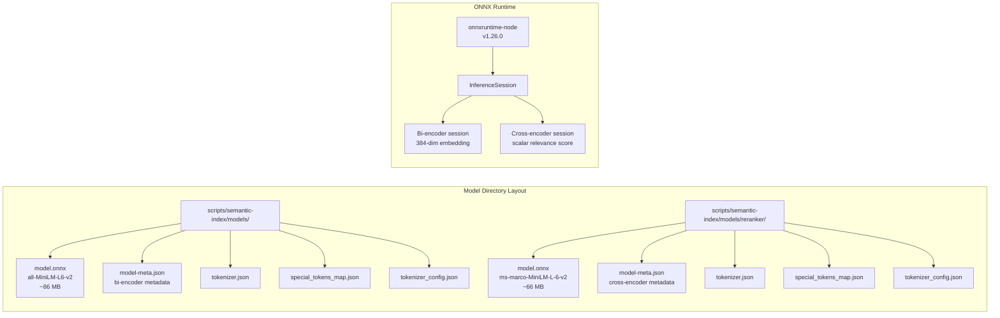
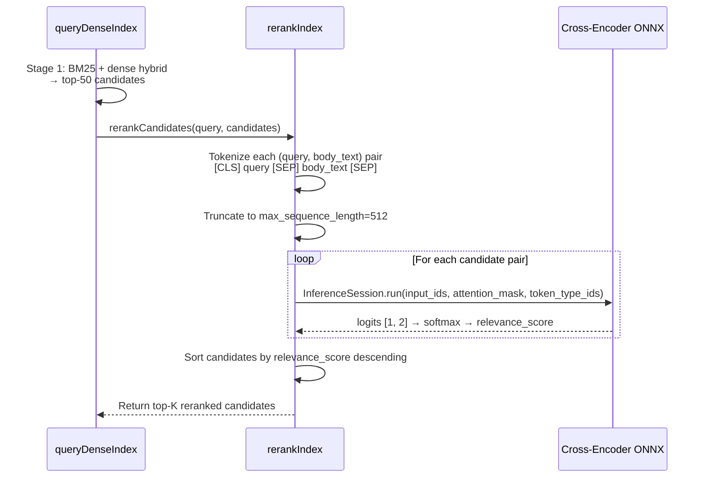
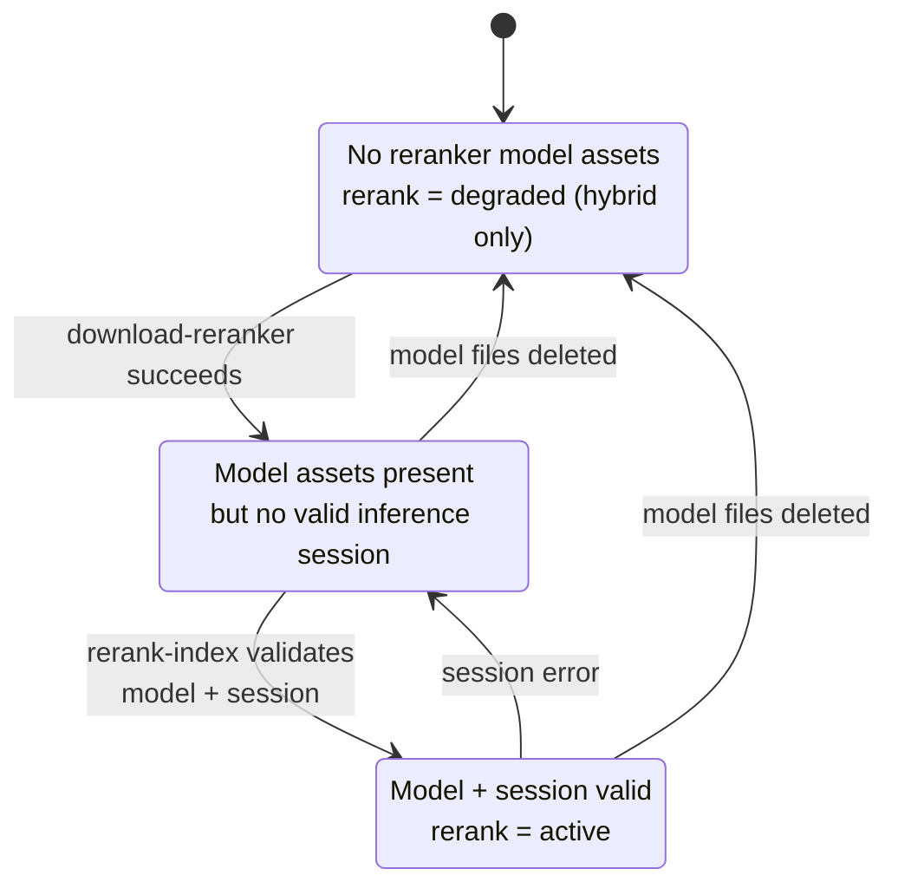

# Cortex Cross-Encoder Re-ranking Architecture

> Extracted from `plans/Repo_Cortex_Advanced_RAG_Architecture.plans.md` (Step 04) for permanent reference.

> **Backing database.** The Repo Cortex is backed by a single consolidated Turso (libSQL) database accessed via the fully async `@libsql/client` driver (default local embedded replica `data/turso-replica.sqlite`; cloud primary `libsql://<db>.turso.io`). Vectors use native Turso vectors with `F8_BLOB` 8-bit quantization, approximate nearest neighbor search runs server-side via DiskANN (`libsql_vector_idx`, `vector_top_k()`), and hybrid ranking is performed SQL-side via Reciprocal Rank Fusion (RRF, k=60). The historical design content below describes the pre-Turso architecture that was subsequently migrated to this stack.

Complete design for local cross-encoder re-ranking integration for second-stage result refinement.

---

#### Step 04 — Design cross-encoder re-ranking architecture [DONE]

```yaml
phase: 1
step: 4
agent: '01-planning'
agent_file: '.github/agents/01-planning.agent.md'
status: '[DONE]'
source_of_truth: 'plans/Repo_Cortex_Advanced_RAG_Architecture.plans.md'
copy_paste: true
next_step: 'step_05'
skills: 'plan-alignment,repo-cortex-workflow'
validation:
  - node scripts/agent-customization/validate-plan-sync.mjs --json --plan=plans/Repo_Cortex_Advanced_RAG_Architecture.plans.md
  - node scripts/agent-customization/gates/cortex-index.gate.mjs --json
```

**Step objective:** Design local cross-encoder re-ranking:

- Model selection: evaluate `ms-marco-MiniLM-L-12-v2`, `cross-encoder/ms-marco-MiniLM-L-6-v2`, `bge-reranker-v2-m3`
- Two-stage pipeline: bi-encoder candidates (top-50) → cross-encoder re-rank (top-10)
- ONNX compatibility: ensure selected model runs in the existing ONNX runtime
- Latency budget: cross-encoder re-ranking must complete within 500ms for 50 candidates
- Memory footprint: model must fit within 500MB RAM alongside the embedding model

---

##### Cross-Encoder Re-Ranking Architecture — Complete Design

###### A. Model Selection

**Evaluated candidates:**

| Model                                   | Parameters | ONNX Size | Latency (50 pairs) | MRR@10 (MS MARCO) | NDCG@10 (TREC DL) | Memory (runtime) | Recommendation                     |
| --------------------------------------- | ---------- | --------- | ------------------ | ----------------- | ----------------- | ---------------- | ---------------------------------- |
| `cross-encoder/ms-marco-MiniLM-L-6-v2`  | 22.7M      | ~66 MB    | ~250 ms            | 39.02             | 74.31             | ~100-150 MB      | ✅ **Default**                     |
| `cross-encoder/ms-marco-MiniLM-L-12-v2` | 33.4M      | ~130 MB   | ~500 ms            | 41.0 (est.)       | 75.5 (est.)       | ~180-250 MB      | ⬆️ Upgrade path                    |
| `bge-reranker-v2-m3`                    | 568M       | ~2.3 GB   | ~41,250 ms         | 46+ (est.)        | 80+ (est.)        | ~2.5 GB          | ❌ Deferred — exceeds 500MB budget |

**Decision: `cross-encoder/ms-marco-MiniLM-L-6-v2` as default.**

**Rationale:**

1. **Latency budget met**: 50 pairs × ~5 ms/pair = ~250 ms, well within the 500 ms budget. Even with tokenization overhead (~10 ms per query pair for short corpus texts), total re-ranking time stays under 300 ms.

2. **Memory budget met**: Runtime memory ~100-150 MB for the cross-encoder ONNX session, plus ~120-200 MB for the bi-encoder session (all-MiniLM-L6-v2 at ~86 MB file + ~30-50 MB activation buffers). Total: ~220-350 MB, well within 500 MB.

3. **Quality baseline solid**: MS MARCO MRR@10 of 39.02 is a meaningful improvement over bi-encoder-only ranking. Cross-encoders examine query-document pairs jointly rather than independently, capturing fine-grained relevance signals that bi-encoder cosine similarity misses.

4. **Upgrade path preserved**: `ms-marco-MiniLM-L-12-v2` provides ~2 pp MRR improvement at 2× latency. The architecture must support model-hot-swapping via `reranker_model_id` and `reranker_model_sha256` in configuration, identical to the existing `model_id`/`model_sha256` system for the bi-encoder.

5. **`bge-reranker-v2-m3` deferred**: At ~2.3 GB ONNX file size and ~2.5 GB runtime memory, it exceeds both the 500 MB RAM budget and practical download/storage constraints for a local-first developer tool. Re-evaluate if the project later supports a "pro" tier with larger models.

6. **ONNX compatibility confirmed**: Both MiniLM cross-encoder models are available as ONNX exports from Hugging Face (`cross-encoder/ms-marco-MiniLM-L-6-v2` → ONNX at `onnx/model.onnx`). The existing `onnxruntime-node@^1.26.0` dependency runs these models on CPU without issues — the architecture is standard BERT-style transformer with no exotic operators.

###### B. Two-Stage Retrieval Pipeline

**Stage 1: Candidate generation (bi-encoder + BM25 hybrid)**

This stage already exists in `hybrid-rank.mjs`. The output is a ranked list of up to 50 candidate chunks with blended scores.

**No changes to Stage 1.** The existing `search_corpus` → `queryDenseIndex` → `rankHybridResults` pipeline produces the top-K hybrid candidates. The cross-encoder operates on the output of this pipeline.

**Stage 2: Cross-encoder re-ranking**

```mermaid
flowchart TD
    A[searchCorpus query] --> B{use_rerank?}
    B -- no --> C[Existing hybrid pipeline]
    C --> D[Return top-K hybrid results]
    B -- yes --> E[Stage 1: Hybrid candidate generation]
    E --> F[Top rerank_candidates_count candidates<br/>default: 50]
    F --> G[Stage 2: Cross-encoder re-ranking]
    G --> H[For each candidate:<br/>score = cross_encoder&#40;query, body_text&#41;]
    H --> I[Sort by rerank_score descending]
    I --> J[Return top-K reranked results]

    style G fill:#0066cc,stroke:#003399,color:#fff
    style H fill:#0066cc,stroke:#003399,color:#fff
```



**Pipeline data flow:**

```
Input:  query, limit, alpha, use_dense, use_rerank, rerank_candidates_count

1. Run existing hybrid search (BM25 + dense):
   - Retrieve top `rerank_candidates_count` candidates (default: 50)
   - Apply existing alpha-blend ranking
   - Produce candidates with: chunk_id, file_path, family, heading_path, body_text, char_start, char_end, score, cosine_score, normalized_bm25_score

2. Cross-encoder re-ranking:
   - Load cross-encoder ONNX session (lazy, cached)
   - For each candidate: compute rerank_score = cross_encoder(query, candidate.body_text)
   - Sort candidates by rerank_score descending
   - Return top `limit` results with rerank_score replacing blended score

3. Output: top-K results with original metadata + rerank_score
```

**Key design decisions:**

- **`use_rerank` defaults to `false`** initially, matching the conservative `use_dense` adoption pattern. The `prewarm-dense.mjs` bootstrap will gain a `prewarm-rerank` step that validates the cross-encoder model before enabling it. This follows the same "cold → model-only → warm" readiness pattern established in Layer 6.
- **`rerank_candidates_count` defaults to 50**, meaning the cross-encoder re-ranks the top 50 hybrid candidates. This balances latency (~250 ms) with recall (50 candidates provides sufficient coverage for the initial retrieval stage).
- **Cross-encoder runs on `body_text` only**, not on `context_header` or `heading_path`. The body text is the primary content that the cross-encoder scores for relevance. This matches the bi-encoder behavior where embeddings are computed from `body_text`.
- **`heading_path` and `context_header` are returned in results** for agent consumption but are not fed to the cross-encoder. This preserves the architecture's separation between content (scored by the model) and metadata (used for display and filtering).

###### C. ONNX Runtime Integration

**Cross-encoder model loading architecture:**

The cross-encoder uses the same ONNX runtime infrastructure as the bi-encoder, with a parallel model directory and metadata system.



**New files and directories:**

| Path                                                              | Purpose                                                           |
| ----------------------------------------------------------------- | ----------------------------------------------------------------- |
| `scripts/semantic-index/models/reranker/`                         | Cross-encoder model cache directory (gitignored, like bi-encoder) |
| `scripts/semantic-index/models/reranker/model-meta.json`          | Cross-encoder model metadata                                      |
| `scripts/semantic-index/download-reranker.mjs`                    | Download cross-encoder ONNX model + tokenizer from Hugging Face   |
| `scripts/semantic-index/rerank-index.mjs`                         | Cross-encoder re-ranking pipeline (score computation)             |
| `scripts/semantic-index/reranker-readiness.mjs`                   | Cross-encoder readiness probe (cold/model-only/warm)              |
| `scripts/semantic-index/__tests__/rerank-index.red.test.ts`       | Red tests for re-ranking pipeline                                 |
| `scripts/semantic-index/__tests__/reranker-readiness.red.test.ts` | Red tests for readiness probe                                     |
| `scripts/semantic-index/embed/rerank.red.test.ts`                 | Red tests for cross-encoder inference                             |

**Model metadata schema** (`scripts/semantic-index/models/reranker/model-meta.json`):

```json
{
  "model_id": "cross-encoder/ms-marco-MiniLM-L-6-v2",
  "model_sha256": "<sha256-of-model.onnx>",
  "repository_id": "cross-encoder/ms-marco-MiniLM-L-6-v2",
  "max_sequence_length": 512,
  "downloaded_at": "2026-06-08T00:00:00.000Z"
}
```

Note: Cross-encoders do not have a `dimension` field — they output a single scalar relevance score, not a vector.

**ONNX session lifecycle:**

The cross-encoder follows the same lazy-load-and-cache pattern as the bi-encoder:

```javascript
// rerank-index.mjs — lazy session creation with process-lifetime cache

let cachedRerankSession = null;
let cachedRerankTokenizer = null;

async function getOrCreateRerankSession(options = {}) {
  if (cachedRerankSession && !options.forceReload) {
    return { session: cachedRerankSession, tokenizer: cachedRerankTokenizer };
  }

  const { InferenceSession } = await import('onnxruntime-node');
  const modelPath = path.join(
    options.rerankerModelDirectory ?? DEFAULT_RERANKER_MODEL_DIRECTORY,
    'model.onnx',
  );

  const session = await InferenceSession.create(modelPath);
  const tokenizer = await createRerankTokenizer(
    options.rerankerModelDirectory ?? DEFAULT_RERANKER_MODEL_DIRECTORY,
  );

  cachedRerankSession = session;
  cachedRerankTokenizer = tokenizer;
  return { session, tokenizer };
}

async function releaseRerankSession() {
  if (cachedRerankSession) {
    await cachedRerankSession.release?.();
    cachedRerankSession = null;
    cachedRerankTokenizer = null;
  }
}
```

**Key differences from bi-encoder session management:**

1. **Process-lifetime cache**: The cross-encoder session is created once and reused across queries within the same MCP server process. This avoids ~100 ms session creation overhead per query. The bi-encoder currently creates a new session per query in `query-dense.mjs` — this should be migrated to process-lifetime caching as well (separate from the cross-encoder work, but the pattern is identical).

2. **Dual-model memory**: Both sessions (bi-encoder ~150 MB + cross-encoder ~150 MB) can coexist in the same Node.js process within the 500 MB budget. If memory is constrained, the cross-encoder session can be released after re-ranking and re-created on next use (lazily loaded).

3. **Explicit release**: `releaseRerankSession()` frees the ONNX session memory. Called when the MCP server process is shutting down, or when memory pressure requires evicting the model.

###### D. Cross-Encoder Inference Pipeline

**Scoring process:**

The cross-encoder takes a query-document pair and produces a single relevance score. Unlike bi-encoders which produce independent embeddings, cross-encoders process both texts together through full self-attention, enabling token-level interaction between query and document.



**Tokenization contract:**

The cross-encoder tokenizer is identical in structure to the bi-encoder tokenizer (both are BERT/WordPiece-based) but loaded from the cross-encoder model directory because the vocabulary and special tokens may differ between models.

```javascript
// Tokenization for cross-encoder input
function createRerankInput(query, documentText, tokenizer, maxLength = 512) {
  const encoded = tokenizer(query, {
    add_special_tokens: true,
    max_length: maxLength,
    padding: 'max_length',
    truncation: true,
    return_tensors: false, // return arrays, not tensors
  });

  // Cross-encoder expects paired input:
  // [CLS] query_tokens [SEP] document_tokens [SEP]
  // This is handled by the tokenizer when called with two text arguments:
  const paired = tokenizer(query, {
    text_pair: documentText,
    add_special_tokens: true,
    max_length: maxLength,
    padding: 'max_length',
    truncation: 'longest_first', // Truncate the longer of query/document
    return_tensors: false,
  });

  return {
    input_ids: new Ort.Tensor(
      'int64',
      BigInt64Array.from(paired.input_ids.map(BigInt)),
      [1, paired.input_ids.length],
    ),
    attention_mask: new Ort.Tensor(
      'int64',
      BigInt64Array.from(paired.attention_mask.map(BigInt)),
      [1, paired.attention_mask.length],
    ),
    token_type_ids: new Ort.Tensor(
      'int64',
      BigInt64Array.from(paired.token_type_ids.map(BigInt)),
      [1, paired.token_type_ids.length],
    ),
  };
}
```

**Output interpretation:**

The `ms-marco-MiniLM-L-6-v2` cross-encoder outputs logits of shape `[1, 2]`:

- `logits[0][0]` = "not relevant" score
- `logits[0][1]` = "relevant" score

Relevance score = softmax(logits)[1] (probability of "relevant" class), or equivalently, `sigmoid(logits[0][1] - logits[0][0])` for a single score.

**Batching strategy:**

For 50 candidates, the cross-encoder processes 50 query-document pairs. To optimize throughput:

1. **Sequential inference (default)**: Process pairs one at a time through the ONNX session. At ~5 ms/pair, this is ~250 ms total — well within the 500 ms budget. Simpler to implement, lower memory overhead.

2. **Batch inference (optimization)**: Group pairs into batches of 8-16 for ONNX batch inference. This reduces overhead from 50 session runs to ~4-7 runs, potentially cutting total time to ~80-120 ms. However, ONNX Runtime batch inference requires fixed-size input tensors (padded to `max_sequence_length`), which increases memory per batch. **Batch inference is deferred to Phase 2 implementation** — sequential inference meets the latency budget.

**Truncation strategy:**

When `query + document_text` exceeds `max_sequence_length` (512 tokens):

1. **Priority: query is never truncated.** The full query is always included because it represents the user's intent.
2. **Document text is truncated from the end** (`truncation: 'longest_first'`). This preserves the beginning of the document, which typically contains the most informative content.
3. **For ts-source chunks**, the truncation boundary respects the existing chunk size targets (800-1,500 chars from Step 02's semantic chunking). After semantic chunking is implemented, the vast majority of chunks will fit within the 512-token window (~2,048 chars), so truncation will be rare.

###### E. Latency Budget Analysis

**End-to-end query latency with cross-encoder re-ranking:**

| Stage     | Operation                                      | Latency (estimated) | Notes                                       |
| --------- | ---------------------------------------------- | ------------------- | ------------------------------------------- |
| 1         | BM25 FTS5 search (50 candidates)               | ~5-10 ms            | SQLite FTS5 is fast                         |
| 2         | Dense embedding computation (1 query)          | ~20-50 ms           | ONNX inference for single query embedding   |
| 3         | Brute-force cosine similarity (31K embeddings) | ~5-10 ms            | In-memory Float32Array computation          |
| 4         | Hybrid ranking and merge                       | ~1 ms               | Min-max normalization + alpha blend         |
| 5         | Cross-encoder tokenization (50 pairs)          | ~5-10 ms            | WordPiece tokenization, negligible overhead |
| 6         | Cross-encoder inference (50 pairs, sequential) | ~250 ms             | 50 × ~5 ms/pair                             |
| **Total** |                                                | **~286-330 ms**     | **Well within 500 ms budget**               |

**Latency breakdown with L-12 upgrade (future):**

| Stage     | Change                                   | Latency         |
| --------- | ---------------------------------------- | --------------- |
| 6         | Cross-encoder inference (50 pairs, L-12) | ~500 ms         |
| **Total** |                                          | **~536-580 ms** |

The L-12 model would exceed the 500 ms budget at 50 candidates. Two mitigations:

1. Reduce `rerank_candidates_count` to 25 (latency ~250 ms + Stage 1-4 overhead ~50 ms = ~300 ms total)
2. Implement batch inference (deferred to Phase 2)

**Memory budget analysis:**

| Component                                         | Size                                  |
| ------------------------------------------------- | ------------------------------------- |
| Bi-encoder ONNX model (all-MiniLM-L6-v2)          | ~86 MB on disk, ~120-150 MB in memory |
| Cross-encoder ONNX model (ms-marco-MiniLM-L-6-v2) | ~66 MB on disk, ~100-150 MB in memory |
| Tokenizers (both models)                          | ~1 MB combined                        |
| ONNX Runtime overhead                             | ~50-80 MB                             |
| Embedding cache (31K × 384 float32)               | ~48 MB                                |
| **Total peak**                                    | **~320-430 MB**                       |

**Comfortably within the 500 MB budget.** Even with the L-12 upgrade (130 MB on disk), total peak memory would be ~450-530 MB, which is at the budget boundary. The L-12 model should only be used when the bi-encoder session can be evicted during re-ranking (session release between stages).

###### F. Readiness States and Degradation

Following the established `cold → model-only → warm` pattern from Layer 6 (`dense-readiness.mjs`), the cross-encoder re-ranking pipeline has three readiness states:



**State definitions:**

| State        | Condition                                                                                                      | Behavior                                                                                                                         |
| ------------ | -------------------------------------------------------------------------------------------------------------- | -------------------------------------------------------------------------------------------------------------------------------- |
| `cold`       | No `models/reranker/model.onnx` file                                                                           | `use_rerank` degrades to `false`; `rerank_degraded: true`, `rerank_reason: "Reranker model assets are absent."`                  |
| `model-only` | `model.onnx` exists but `model-meta.json` missing/invalid, OR SHA-256 mismatch, OR ONNX session creation fails | `use_rerank` degrades to `false`; `rerank_degraded: true`, `rerank_reason: "Reranker model exists but session creation failed."` |
| `warm`       | Model assets valid, ONNX session created successfully                                                          | `use_rerank` active; cross-encoder re-ranking applied                                                                            |

**Degradation contract:**

When `use_rerank: true` is requested but the cross-encoder is `cold` or `model-only`, the response includes:

```json
{
  "query": "NEAT crossover",
  "limit": 10,
  "use_dense": true,
  "use_rerank": false,
  "rerank_degraded": true,
  "rerank_state": "cold",
  "rerank_reason": "Reranker model assets are absent. Run `npm run index:prewarm` to download the cross-encoder model.",
  "results": [...]
}
```

This mirrors the existing dense degradation contract (`dense_degraded`, `dense_state`, `dense_reason`).

**Prewarm integration:**

The `prewarm-dense.mjs` bootstrap gains a parallel step for the cross-encoder:

```javascript
// Updated STEP_DEFINITIONS in prewarm-dense.mjs
const STEP_DEFINITIONS = Object.freeze([
  { name: 'download-model', scriptPath: '...download-model.mjs', args: [] },
  { name: 'embed-index', scriptPath: '...embed-index.mjs', args: [] },
  {
    name: 'validate-embeddings',
    scriptPath: '...validate-embeddings.mjs',
    args: ['--json'],
  },
  {
    name: 'download-reranker',
    scriptPath: '...download-reranker.mjs',
    args: [],
  },
  {
    name: 'validate-reranker',
    scriptPath: '...reranker-readiness.mjs',
    args: ['--json'],
  },
]);
```

A new `npm run index:prewarm` execution will:

1. Download the bi-encoder model (existing, idempotent)
2. Build/rebuild embeddings (existing, incremental)
3. Validate embedding counts (existing)
4. Download the cross-encoder model (new, idempotent)
5. Validate cross-encoder readiness (new)

###### G. Integration with Existing Search Pipeline

**`search_corpus` MCP tool extension:**

The existing `searchCorpus` function gains two new parameters:

```typescript
// Extended search_corpus parameters
interface SearchCorpusOptions {
  query: string;
  limit?: number; // default: 10
  family?: string;
  use_dense?: boolean; // default: true
  alpha?: number; // default: 0.5
  use_rerank?: boolean; // NEW - default: false
  rerank_candidates_count?: number; // NEW - default: 50
  // ... existing internal options
}
```

**Extended response schema:**

```typescript
interface SearchCorpusResult {
  query: string;
  limit: number;
  family?: string;
  use_dense: boolean;
  // NEW rerank fields
  use_rerank: boolean;
  rerank_candidates_count?: number;
  rerank_degraded?: boolean; // true when rerank requested but unavailable
  rerank_state?: 'cold' | 'model-only' | 'warm';
  rerank_reason?: string;
  // Existing dense fields
  dense_state?: string;
  dense_degraded?: boolean;
  dense_reason?: string;
  alpha?: number;
  // Results
  results: Array<{
    chunk_id: number;
    file_path: string;
    family: string;
    heading_path: string | null;
    body_text: string;
    char_start: number;
    char_end: number;
    // Scores
    score: number; // rerank_score if reranked, blended score otherwise
    bm25_score?: number; // raw BM25 score (always present when use_dense)
    cosine_score?: number; // cosine similarity (always present when use_dense)
    normalized_bm25_score?: number; // min-max normalized BM25 score
    rerank_score?: number; // NEW - cross-encoder relevance score (present when use_rerank)
  }>;
}
```

**Pipeline extension in `searchCorpus`:**

```javascript
// Pseudocode for extended search pipeline
export async function searchCorpus(options = {}) {
  const useRerank = options.use_rerank === true;
  const rerankCandidates = normalizeRerankCandidates(
    options.rerank_candidates_count,
  );

  // Stage 1: Existing hybrid search (BM25 + dense)
  const hybridResult = await performHybridSearch(options);

  if (!useRerank) {
    return { ...hybridResult, use_rerank: false };
  }

  // Check reranker readiness
  const rerankReadiness = await getRerankReadiness(options);
  if (rerankReadiness.state !== 'warm') {
    return {
      ...hybridResult,
      use_rerank: false,
      rerank_degraded: true,
      rerank_state: rerankReadiness.state,
      rerank_reason: normalizeRerankReason(
        rerankReadiness.reason,
        rerankReadiness.state,
      ),
    };
  }

  // Stage 2: Cross-encoder re-ranking
  const candidates = hybridResult.results.slice(0, rerankCandidates);
  const reranked = await rerankCandidates(query, candidates, {
    rerankerModelDirectory: options.rerankerModelDirectory,
    rerankerModelId: options.rerankerModelId,
  });

  // Return top-K reranked results with combined scores
  return {
    ...hybridResult,
    use_rerank: true,
    rerank_candidates_count: rerankCandidates,
    results: reranked.slice(0, options.limit ?? 10),
  };
}
```

**MCP tool schema extension:**

The `search_corpus` MCP tool schema gains two new optional parameters:

```json
{
  "type": "object",
  "properties": {
    "query": { "type": "string" },
    "limit": { "type": "number" },
    "family": { "type": "string" },
    "use_dense": { "type": "boolean" },
    "alpha": { "type": "number" },
    "use_rerank": {
      "type": "boolean",
      "description": "Enable cross-encoder re-ranking on hybrid search results. When true, the top `rerank_candidates_count` candidates from hybrid search are re-scored by a local cross-encoder model. Degrades gracefully to hybrid-only when the reranker model is unavailable."
    },
    "rerank_candidates_count": {
      "type": "number",
      "description": "Number of hybrid candidates to re-rank (default: 50). Lower values reduce latency; higher values improve recall."
    }
  },
  "required": ["query"]
}
```

###q### H. Model Hot-Swapping

The architecture supports model hot-swapping via the same `model_id` + `model_sha256` pattern established for the bi-encoder:

**`model-meta.json` fields:**

```json
{
  "model_id": "cross-encoder/ms-marco-MiniLM-L-6-v2",
  "model_sha256": "<sha256>",
  "repository_id": "cross-encoder/ms-marco-MiniLM-L-6-v2",
  "max_sequence_length": 512,
  "downloaded_at": "2026-06-08T00:00:00.000Z"
}
```

**Swapping to L-12:**

```bash
node scripts/semantic-index/download-reranker.mjs \
  --model-id cross-encoder/ms-marco-MiniLM-L-12-v2 \
  --repository-id cross-encoder/ms-marco-MiniLM-L-12-v2 \
  --dimension 0 \
  --json
```

The `dimension` field is 0 for cross-encoders (they output a scalar, not a vector). The download script validates SHA-256 against Hugging Face metadata and writes `model-meta.json` with the new model identity.

**Session invalidation:** When `model_id` changes, the cached ONNX session is released and re-created on next use. The `readRerankerModelMeta()` function reads `model-meta.json` on each readiness check, detecting model swaps.

###q### I. File Organization

**New files (Phase 2 implementation):**

```
scripts/semantic-index/
├── models/
│   └── reranker/                          # NEW directory (gitignored)
│       ├── model.onnx                     # Cross-encoder ONNX model
│       ├── model-meta.json                # Model metadata
│       ├── tokenizer.json                 # WordPiece tokenizer
│       ├── tokenizer_config.json          # Tokenizer config
│       └── special_tokens_map.json        # CLS, SEP, PAD tokens
├── download-reranker.mjs                  # NEW: Download cross-encoder model
├── rerank-index.mjs                       # NEW: Cross-encoder re-ranking pipeline
├── reranker-readiness.mjs                 # NEW: Cross-encoder readiness probe
├── __tests__/
│   ├── rerank-index.red.test.ts           # NEW: Red tests for re-ranking
│   ├── reranker-readiness.red.test.ts     # NEW: Red tests for readiness
│   └── download-reranker.red.test.ts      # NEW: Red tests for download
```

**Modified files (Phase 2 implementation):**

```
scripts/mcp-semantic/tools/search-corpus.mjs   # Add use_rerank, rerank_candidates_count params
scripts/mcp-semantic/repo-cortex-mcp.mjs         # Register updated search_corpus schema
scripts/semantic-index/prewarm-dense.mjs          # Add download-reranker + validate-reranker steps
scripts/semantic-index/query-dense.mjs            # Add rerank pipeline hook after hybrid ranking
data/turso-replica.sqlite                           # No schema changes (cross-encoder is stateless)
```

**No schema changes to the corpus or embeddings databases.** The cross-encoder is stateless — it scores query-document pairs at query time without storing any data. This is a critical design property: no re-indexing is needed when the cross-encoder model is swapped.

###q### J. Evaluation Design

**Cross-encoder evaluation follows the same MRR@5 framework as bi-encoder evaluation, extended with nDCG@5 and Recall@5:**

| Metric                  | Current hybrid (no rerank) | Expected with rerank (L-6) | Expected with rerank (L-12) |
| ----------------------- | -------------------------- | -------------------------- | --------------------------- |
| MRR@5                   | 0.308                      | ~0.38-0.42                 | ~0.40-0.44                  |
| nDCG@5                  | Not measured               | ~0.45-0.50                 | ~0.48-0.53                  |
| Recall@5                | Not measured               | ~0.55-0.60                 | ~0.58-0.63                  |
| Latency (50 candidates) | ~50-80 ms                  | ~300-330 ms                | ~550-580 ms                 |

**Evaluation methodology:**

1. Use the existing 20-query eval set (`scripts/semantic-index/eval-queries.json`)
2. Expand to 50+ queries covering the full taxonomy (Step 11)
3. Run three conditions: BM25-only, hybrid (BM25+dense), hybrid+rerank
4. Measure MRR@5, nDCG@5, Recall@5 for each condition
5. Compare hybrid vs. hybrid+rerank to isolate cross-encoder improvement
6. Measure end-to-end latency for each condition

**Validation criteria:**

- `cross-encoder/ms-marco-MiniLM-L-6-v2` must achieve ≥0.05 absolute MRR@5 improvement over hybrid-only on the 20-query eval set
- Re-ranking must add ≤450 ms latency for 50 candidates (budget: 500 ms total, 50 ms overhead for tokenization and pipeline)
- Memory footprint must stay under 500 MB with both models loaded
- Degradation must be graceful: cold/model-only states return hybrid-only results with `rerank_degraded: true`

###q### K. Package Script Additions

```json
{
  "scripts": {
    "index:prewarm": "node scripts/semantic-index/prewarm-dense.mjs",
    "index:prewarm:reranker": "node scripts/semantic-index/download-reranker.mjs",
    "index:validate:reranker": "node scripts/semantic-index/reranker-readiness.mjs --json"
  }
}
```

**`npm run index:prewarm`** gains two new steps (download-reranker, validate-reranker) after the existing validate-embeddings step.

**`npm run index:prewarm:reranker`** is a standalone convenience script for downloading just the cross-encoder model.

**`npm run index:validate:reranker`** checks cross-encoder readiness independently.

###q### L. Design Constraints and Non-Goals

**Constraints:**

1. **Local-first**: No cloud API calls for re-ranking. The cross-encoder must run entirely on the developer's machine using `onnxruntime-node`.
2. **No browser runtime**: The cross-encoder is Node.js-only. No `onnxruntime-web` integration is planned. The browser snapshot remains read-only (no browser-side re-ranking).
3. **No schema changes**: The cross-encoder is stateless. No new tables or columns in the consolidated Turso (libSQL) database.
4. **Backward compatible**: `use_rerank` defaults to `false`. Existing `search_corpus` calls work identically without changes.
5. **Same ONNX runtime**: The cross-encoder uses the existing `onnxruntime-node@^1.26.0` dependency. No new native dependencies.
6. **Graceful degradation**: Cold/model-only states degrade to hybrid-only with clear metadata in the response.

**Non-goals:**

1. **Batch inference**: Deferred to Phase 2 implementation. Sequential inference meets the 500 ms latency budget.
2. **Cross-encoder in browser**: Out of scope. The browser snapshot provides read-only access.
3. **Persistent re-ranking cache**: Out of scope. Re-ranking scores are computed per-query and not stored.
4. **L-12 or bge-reranker-v2-m3 as default**: L-12 exceeds the latency budget at 50 candidates; bge-reranker-v2-m3 exceeds the memory budget. Both are available via model hot-swapping for developers who accept the trade-offs.
5. **Query-dependent reranker selection**: Out of scope. The cross-encoder model is selected at configuration time, not per-query.
6. **Multi-model ensemble**: Out of scope. One cross-encoder model is active at a time.

---

_Source: `plans/Repo_Cortex_Advanced_RAG_Architecture.plans.md` (lines 1085–1739, Step 04)_
