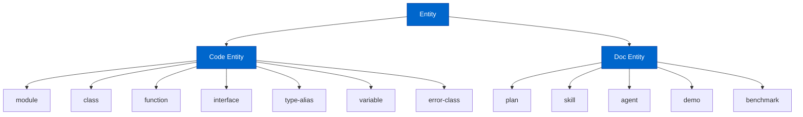
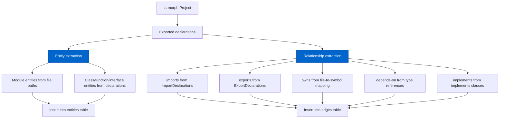
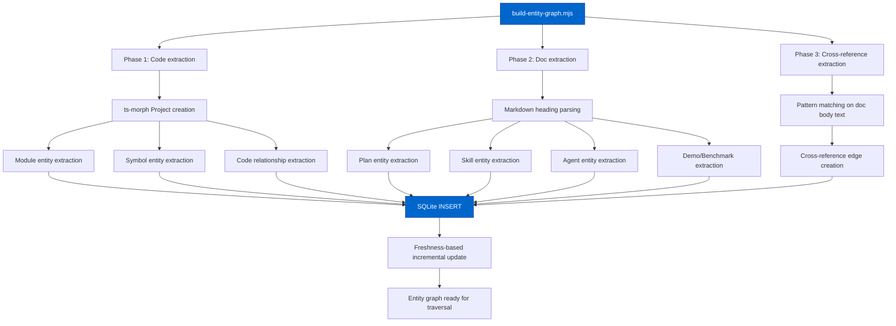
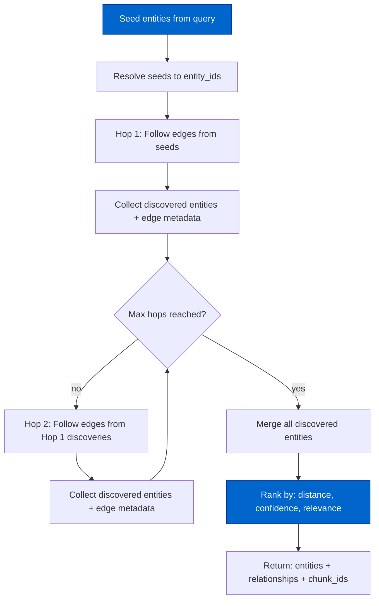

# Cortex Entity/Relationship Graph Architecture

> Extracted from `plans/Repo_Cortex_Advanced_RAG_Architecture.plans.md` (Step 06) for permanent reference.

Complete design for lightweight entity/relationship extraction and graph storage for multi-hop traversal.

---

#### Step 06 — Design entity/relationship graph architecture [DONE]

```yaml
phase: 1
step: 6
agent: '01-planning'
agent_file: '.github/agents/01-planning.agent.md'
status: '[DONE]'
source_of_truth: 'plans/Repo_Cortex_Advanced_RAG_Architecture.plans.md'
copy_paste: true
next_step: 'step_07'
skills: 'plan-alignment'
validation:
  - node scripts/agent-customization/validate-plan-sync.mjs --json --plan=plans/Repo_Cortex_Advanced_RAG_Architecture.plans.md
```

**Step objective:** Design lightweight entity/relationship extraction and storage:

- Entity types: module, class, function, export, plan, skill, agent, demo, benchmark
- Relationship types: imports, exports, depends-on, implements, references, owns, part-of
- Storage: SQLite graph tables (nodes + edges) alongside corpus index
- Extraction: static analysis for code entities, heading parsing for docs/plans
- Multi-hop traversal: graph-based expansion from seed entities to related context

---

##### Entity/Relationship Graph Architecture — Complete Design

###### A. Problem Statement

The current Cortex provides keyword and semantic search over flat chunks. An agent asking "what modules does Network.activate depend on?" must issue multiple queries and manually synthesize cross-boundary relationships. There is no structural knowledge that:

- `Network.activate` calls `slab.forward` and `activationFunction`
- `Neat` owns `Population`, `Species`, and `Genome`
- `plans/test-repair.plans.md` references `src/architecture/network/mutate/`
- `.github/skills/coverage-guard` depends on `.github/skills/running-unit-tests`

These relationships exist implicitly in source imports, heading hierarchies, and cross-references, but the Cortex cannot exploit them for multi-hop retrieval or context expansion. An entity/relationship graph bridges this gap by making structural relationships explicit and traversable.

**Five concrete failures the graph solves:**

1. **No dependency discovery**: An agent researching `Network.activate` cannot discover that it imports from `slab/`, `activate/`, and `methods/activation/` without reading the source code. The graph makes `imports` edges explicit and traversable.

2. **No ownership navigation**: An agent reading about `Neat.evolve` cannot discover that it belongs to the `Neat` class, which owns `Population`, `Species`, and `Genome` without searching for each entity independently. The graph makes `owns` and `part-of` edges explicit.

3. **No cross-family linking**: An agent searching for "checkpointing" finds chunks in `plans/`, `src/`, and `.github/skills/` but has no structural link between them. The graph makes `references` edges across families explicit.

4. **No multi-hop expansion**: The current multi-hop design (Step 01 audit item 6) relies on iterative keyword search. Graph traversal provides a more targeted expansion mechanism: from a seed entity, follow `imports`, `owns`, `references` edges to discover related entities that keyword search would miss.

5. **No module-boundary filtering**: The current `family` filter is too coarse (10 families). An agent working on `src/neat/mutation/` needs entity-level and module-level filtering. The graph provides `module` entities with `contains` and `depends-on` edges.

###### B. Entity Types and Taxonomy

**B.1 Entity type definitions.**

| Entity type   | Source                                                   | Key fields                       | Example                                  |
| ------------- | -------------------------------------------------------- | -------------------------------- | ---------------------------------------- |
| `module`      | Directory-based module path from `src/` folder structure | `module_path`, `module_kind`     | `src/architecture/network`               |
| `class`       | ts-morph `ClassDeclaration`                              | `symbol_name`, `signature_text`  | `Network`                                |
| `function`    | ts-morph `FunctionDeclaration` or `ArrowFunction` export | `symbol_name`, `signature_text`  | `activate`                               |
| `interface`   | ts-morph `InterfaceDeclaration`                          | `symbol_name`, `signature_text`  | `NetworkJSON`                            |
| `type-alias`  | ts-morph `TypeAliasDeclaration`                          | `symbol_name`, `signature_text`  | `ActivationType`                         |
| `variable`    | ts-morph `VariableDeclaration` export (non-function)     | `symbol_name`                    | `methods`                                |
| `error-class` | ts-morph class extending `Error`                         | `symbol_name`, `signature_text`  | `ArchitectInvalidLstmConfigurationError` |
| `plan`        | Markdown heading parsing from `plans/`                   | `heading_path`, `status_marker`  | `Repo_Cortex_Advanced_RAG_Architecture`  |
| `skill`       | Markdown heading parsing from `.github/skills/`          | `heading_path`, `skill_name`     | `coverage-guard`                         |
| `agent`       | YAML frontmatter + Markdown from `.github/agents/`       | `agent_name`, `tier`             | `04-implementing`                        |
| `demo`        | Markdown from `examples/`                                | `heading_path`, `demo_name`      | `Flappy Bird LSTM`                       |
| `benchmark`   | Markdown from `benchmarks/`                              | `heading_path`, `benchmark_name` | `Memory Optimization`                    |

**B.2 Entity type hierarchy.**



**B.3 Entity count estimates.**

| Entity type   | Estimated count | Source                                                 |
| ------------- | --------------- | ------------------------------------------------------ |
| `module`      | ~60             | `src/` subdirectories with orchestration files         |
| `class`       | ~80             | ts-morph exported class declarations                   |
| `function`    | ~200            | ts-morph exported function/arrow function declarations |
| `interface`   | ~60             | ts-morph exported interface declarations               |
| `type-alias`  | ~50             | ts-morph exported type alias declarations              |
| `variable`    | ~40             | ts-morph exported variable declarations (non-function) |
| `error-class` | ~20             | ts-morph classes extending Error                       |
| `plan`        | ~20             | Files in `plans/` and `plans/completed/`               |
| `skill`       | ~30             | Files in `.github/skills/`                             |
| `agent`       | ~50             | Files in `.github/agents/`                             |
| `demo`        | ~15             | Files in `examples/`                                   |
| `benchmark`   | ~5              | Files in `benchmarks/`                                 |
| **Total**     | **~630**        |                                                        |

This is a lightweight graph — ~630 entities with ~2,000–3,000 relationships. The entire graph fits comfortably in memory and can be traversed in microseconds.

###### C. Relationship Types

**C.1 Relationship definitions.**

| Relationship | Source entity          | Target entity                  | Extraction source                          | Description                                |
| ------------ | ---------------------- | ------------------------------ | ------------------------------------------ | ------------------------------------------ |
| `imports`    | `module`               | `module`                       | ts-morph `ImportDeclaration`               | Module A imports from module B             |
| `imports`    | `module`               | `class`/`function`/`interface` | ts-morph named imports                     | Module A imports symbol B                  |
| `exports`    | `module`               | `class`/`function`/`interface` | ts-morph `ExportDeclaration`               | Module A exports symbol B                  |
| `depends-on` | `class`/`function`     | `class`/`function`             | ts-morph type references, call expressions | Symbol A depends on symbol B               |
| `implements` | `class`                | `interface`                    | ts-morph `implements` clause               | Class A implements interface B             |
| `references` | Any entity             | Any entity                     | Cross-reference extraction                 | Entity A references entity B (docs, plans) |
| `owns`       | `module`               | `class`/`function`/`interface` | File-to-symbol mapping                     | Module A owns symbol B                     |
| `owns`       | `class`                | `function`                     | ts-morph class method declarations         | Class A owns method B                      |
| `part-of`    | `class`/`function`     | `module`                       | Inverse of `owns`                          | Symbol B is part of module A               |
| `part-of`    | `function`             | `class`                        | Inverse of `owns`                          | Method B is part of class A                |
| `contains`   | `plan`/`skill`/`agent` | Heading                        | Markdown heading parsing                   | Plan A contains heading B                  |
| `references` | `plan`/`skill`/`agent` | `module`/`class`/`function`    | Pattern matching in body text              | Doc A references code entity B             |

**C.2 Relationship direction convention.**

All relationships are directional. The naming convention uses active voice from source to target:

- `imports`: source is the importer, target is the imported module/symbol
- `exports`: source is the exporting module, target is the exported symbol
- `depends-on`: source depends on target
- `implements`: source (class) implements target (interface)
- `references`: source references target
- `owns`: source owns target
- `part-of`: source is part of target (inverse of `owns`)
- `contains`: source contains target

**C.3 Relationship count estimates.**

| Relationship type              | Estimated count | Source                                  |
| ------------------------------ | --------------- | --------------------------------------- |
| `imports` (module→module)      | ~400            | TypeScript import statements            |
| `imports` (module→symbol)      | ~600            | TypeScript named imports                |
| `exports` (module→symbol)      | ~450            | TypeScript named/default exports        |
| `depends-on` (symbol→symbol)   | ~500            | Type references and call expressions    |
| `implements` (class→interface) | ~30             | `implements` clauses                    |
| `owns` (module→symbol)         | ~450            | File-to-symbol mapping                  |
| `owns` (class→method)          | ~300            | Class method declarations               |
| `part-of` (inverse of owns)    | ~750            | Computed from `owns`                    |
| `references` (doc→code)        | ~200            | Pattern matching in plans/skills/agents |
| `contains` (doc→heading)       | ~300            | Markdown heading structure              |
| **Total**                      | **~3,980**      |                                         |

**C.4 Relationship confidence levels.**

Not all extracted relationships have the same reliability. Confidence levels allow traversal to prioritize high-confidence edges:

| Confidence | Relationships                                         | Rationale                                                                     |
| ---------- | ----------------------------------------------------- | ----------------------------------------------------------------------------- |
| `high`     | `imports`, `exports`, `implements`, `owns`, `part-of` | Extracted by static analysis of TypeScript AST — deterministic and exact      |
| `medium`   | `depends-on` (type references)                        | Extracted by type-reference analysis — may miss dynamic dependencies          |
| `low`      | `references` (doc→code)                               | Extracted by pattern matching — may have false positives from casual mentions |

The `confidence` column is stored on every edge and used by the traversal algorithm to weight edge priority.

###### D. Schema Design

**D.1 Graph tables in `semantic-index.sqlite`.**

The entity/relationship graph is stored in the same SQLite database as the corpus index, alongside the existing `documents` and `chunks` tables. This ensures atomic transactions, cross-referencing via `doc_id`, and no additional database file to manage.

```sql
-- Graph entities table
CREATE TABLE IF NOT EXISTS entities (
  entity_id INTEGER PRIMARY KEY,
  entity_type TEXT NOT NULL CHECK(entity_type IN (
    'module', 'class', 'function', 'interface', 'type-alias', 'variable', 'error-class',
    'plan', 'skill', 'agent', 'demo', 'benchmark'
  )),
  name TEXT NOT NULL,
  qualified_name TEXT NOT NULL UNIQUE,
  doc_id INTEGER REFERENCES documents(doc_id) ON DELETE CASCADE,
  chunk_id INTEGER REFERENCES chunks(chunk_id) ON DELETE SET NULL,
  module_path TEXT,
  signature_text TEXT,
  file_path TEXT NOT NULL,
  char_start INTEGER,
  char_end INTEGER,
  extra_metadata TEXT DEFAULT '{}',
  created_at INTEGER NOT NULL DEFAULT (unixepoch())
);

CREATE INDEX IF NOT EXISTS entities_type_idx ON entities(entity_type);
CREATE INDEX IF NOT EXISTS entities_name_idx ON entities(name);
CREATE INDEX IF NOT EXISTS entities_qualified_name_idx ON entities(qualified_name);
CREATE INDEX IF NOT EXISTS entities_module_path_idx ON entities(module_path);
CREATE INDEX IF NOT EXISTS entities_doc_id_idx ON entities(doc_id);

-- Graph edges table
CREATE TABLE IF NOT EXISTS edges (
  edge_id INTEGER PRIMARY KEY,
  source_entity_id INTEGER NOT NULL REFERENCES entities(entity_id) ON DELETE CASCADE,
  target_entity_id INTEGER NOT NULL REFERENCES entities(entity_id) ON DELETE CASCADE,
  relationship TEXT NOT NULL CHECK(relationship IN (
    'imports', 'exports', 'depends-on', 'implements', 'references', 'owns', 'part-of', 'contains'
  )),
  confidence TEXT NOT NULL DEFAULT 'high' CHECK(confidence IN ('high', 'medium', 'low')),
  extra_metadata TEXT DEFAULT '{}',
  created_at INTEGER NOT NULL DEFAULT (unixepoch()),
  UNIQUE(source_entity_id, target_entity_id, relationship)
);

CREATE INDEX IF NOT EXISTS edges_source_idx ON edges(source_entity_id);
CREATE INDEX IF NOT EXISTS edges_target_idx ON edges(target_entity_id);
CREATE INDEX IF NOT EXISTS edges_relationship_idx ON edges(relationship);
CREATE INDEX IF NOT EXISTS edges_source_rel_idx ON edges(source_entity_id, relationship);
CREATE INDEX IF NOT EXISTS edges_target_rel_idx ON edges(target_entity_id, relationship);
```

**D.2 Key design decisions for the schema.**

1. **`qualified_name` is the unique identifier for entities.** It uses a dot-separated path that is human-readable and unambiguous: `src/architecture/network.Network`, `src/neat.Neat.evolve`, `plans/repo_cortex_advanced_rag.Repo Cortex Advanced RAG Architecture`. This allows both exact lookups and prefix-based module queries.

2. **`doc_id` links entities to corpus documents.** Every entity is associated with the document (file) where it was extracted. This enables cross-referencing from graph traversal back to chunked content.

3. **`chunk_id` links entities to specific chunks (when available).** After semantic chunking (Step 02), code entities can point to their specific chunk within the document. For doc entities extracted from headings, the `chunk_id` points to the heading chunk. This is nullable because the v1 schema (before Step 02) does not have reliable chunk-to-symbol mapping.

4. **`module_path` enables module-level filtering.** Every code entity carries its folder-based module path (e.g., `src/architecture/network`). This supports the structured metadata filtering design (Step 09) and allows agents to filter by module boundary.

5. **`extra_metadata` stores extensible JSON metadata.** For agents, this includes `tier`, `skills`, and `agents` allow-lists. For plans, this includes `status_marker` and `trigger_phrases`. For code entities, this includes `export_type`, `jsdoc_word_count`, and `cyclomatic_complexity` (from the code quality scanner).

6. **`confidence` on edges supports weighted traversal.** High-confidence edges (static analysis) are followed before medium (type references) and low (pattern matching). The traversal algorithm uses this ordering.

7. **`UNIQUE(source_entity_id, target_entity_id, relationship)`** prevents duplicate edges. The same source and target can have multiple relationship types (e.g., `module` → `class` with both `exports` and `owns`), but each relationship type is unique per pair.

8. **`ON DELETE CASCADE`** ensures that when a document is deleted (freshness rebuild), all its entities and edges are automatically removed.

**D.3 `qualified_name` construction rules.**

| Entity type   | `qualified_name` pattern        | Example                                                             |
| ------------- | ------------------------------- | ------------------------------------------------------------------- |
| `module`      | `<module_path>`                 | `src/architecture/network`                                          |
| `class`       | `<module_path>.<ClassName>`     | `src/architecture/network.Network`                                  |
| `function`    | `<module_path>.<functionName>`  | `src/architecture/network/activate.activate`                        |
| `interface`   | `<module_path>.<InterfaceName>` | `src/architecture/network.NetworkJSON`                              |
| `type-alias`  | `<module_path>.<TypeName>`      | `src/methods/activation.ActivationType`                             |
| `variable`    | `<module_path>.<variableName>`  | `src/methods.methods`                                               |
| `error-class` | `<module_path>.<ErrorName>`     | `src/architecture/architect.ArchitectInvalidLstmConfigurationError` |
| `plan`        | `plans/<stem>`                  | `plans/repo_cortex_advanced_rag`                                    |
| `skill`       | `skills/<skill-name>`           | `skills/coverage-guard`                                             |
| `agent`       | `agents/<agent-name>`           | `agents/04-implementing`                                            |
| `demo`        | `demos/<demo-name>`             | `demos/flappy-bird-lstm`                                            |
| `benchmark`   | `benchmarks/<benchmark-name>`   | `benchmarks/memory-optimization`                                    |

For class methods (depth=1 in semantic chunking), the `qualified_name` includes the parent class:

| Entity type         | `qualified_name` pattern                 | Example                |
| ------------------- | ---------------------------------------- | ---------------------- |
| `function` (method) | `<module_path>.<ClassName>.<methodName>` | `src/neat.Neat.evolve` |

**D.4 Schema dependency on Step 02.**

The `chunk_id` column depends on Step 02's semantic chunking for reliable symbol-to-chunk mapping. Before Step 02 is implemented, `chunk_id` is NULL for all entities, and the graph links entities to documents only (via `doc_id`). After Step 02, the extraction pipeline populates `chunk_id` by matching `qualified_name` to `symbol_name` + `heading_path`.

The graph design is backward-compatible: the `chunk_id` column is nullable, and all graph operations fall back to `doc_id`-level granularity when `chunk_id` is NULL.

###### E. Extraction Pipeline

**E.1 Code entity extraction (ts-source family).**

Code entities and relationships are extracted by ts-morph static analysis, reusing the existing `loadExportedTypeScriptDeclarations` infrastructure from `ts-chunker.mjs`.



**E.1.1 Module entity extraction.**

Each `src/` file path that contributes exported symbols produces a `module` entity. The module path is the directory portion of the file path (e.g., `src/architecture/network` for `src/architecture/network/activate/network.activate.ts`).

Module extraction rules:

1. **One module per directory that contains at least one exported symbol.** Directories with no exported TypeScript (e.g., `src/env/browser/` which only contains runtime helpers) may not produce a module entity.
2. **Barrel files** (e.g., `src/architecture/network/index.ts`, `src/neat.ts`) are module entry points. Their `exports` relationships capture the re-exported symbols.
3. **Module `qualified_name`** uses the directory path: `src/architecture/network`, `src/neat`, `src/methods/activation`.
4. **Module `extra_metadata`** includes `{ file_count: N, symbol_count: M }`.

**E.1.2 Code symbol entity extraction.**

For each exported declaration identified by `loadExportedTypeScriptDeclarations`:

| Declaration kind                     | Entity type   | `qualified_name`           | `signature_text`                     |
| ------------------------------------ | ------------- | -------------------------- | ------------------------------------ |
| `ClassDeclaration`                   | `class`       | `<module>.<ClassName>`     | Class signature (up to first `{`)    |
| `FunctionDeclaration`                | `function`    | `<module>.<functionName>`  | Function signature (up to first `{`) |
| `ArrowFunction` export               | `function`    | `<module>.<variableName>`  | Arrow function signature             |
| `InterfaceDeclaration`               | `interface`   | `<module>.<InterfaceName>` | Interface signature (full)           |
| `TypeAliasDeclaration`               | `type-alias`  | `<module>.<TypeName>`      | Type alias (full)                    |
| `VariableDeclaration` (non-function) | `variable`    | `<module>.<variableName>`  | Variable declaration                 |
| `ClassDeclaration` extending `Error` | `error-class` | `<module>.<ErrorName>`     | Class signature                      |

Class method extraction: For class entities, each method with a body longer than 100 chars produces a `function` entity with `qualified_name` = `<module>.<ClassName>.<methodName>`. Methods shorter than 100 chars are grouped into the parent class entity and do not produce separate entities.

**E.1.3 Code relationship extraction.**

| Relationship                   | Extraction method                                                                             | Confidence |
| ------------------------------ | --------------------------------------------------------------------------------------------- | ---------- |
| `imports` (module→module)      | ts-morph `ImportDeclaration.getModuleSpecifierValue()` → resolve to target module path        | `high`     |
| `imports` (module→symbol)      | ts-morph `ImportDeclaration.getNamedImports()` → resolve to target entity `qualified_name`    | `high`     |
| `exports` (module→symbol)      | ts-morph `SourceFile.getExportedDeclarations()` → target entity `qualified_name`              | `high`     |
| `owns` (module→symbol)         | File path → directory module path; all symbols in that file are `owns` edges                  | `high`     |
| `owns` (class→method)          | ts-morph `ClassDeclaration.getMethods()` → method entity `qualified_name`                     | `high`     |
| `depends-on` (symbol→symbol)   | ts-morph type references, constructor parameters, and call expressions within function bodies | `medium`   |
| `implements` (class→interface) | ts-morph `ClassDeclaration.getImplements()` → resolve to interface `qualified_name`           | `high`     |
| `part-of` (inverse of `owns`)  | Computed: for each `owns` edge, create the inverse `part-of` edge                             | `high`     |

**E.1.4 Dependency extraction depth.**

`depends-on` edges are extracted from three sources, in order of reliability:

1. **Type references in signatures** (high confidence): Parameter types, return types, and generic type arguments in the symbol's signature text.
2. **Constructor parameters** (high confidence): Class constructor parameter types.
3. **Call expressions in body** (medium confidence): Function calls within the first 500 chars of the function body. Only calls to symbols defined within the repository are extracted; calls to external packages are ignored.

The extraction is bounded to avoid O(N²) explosion: a single function is limited to at most 20 `depends-on` edges.

**E.2 Doc entity extraction (non-ts-source families).**

Doc entities are extracted from markdown headings and structured content in plan, skill, agent, demo, and benchmark documents.

**E.2.1 Plan entity extraction.**

Each file in `plans/` (and `plans/completed/`) produces:

1. A `plan` entity with `qualified_name` = `plans/<stem>` (filename without extension, kebab-cased)
2. `contains` edges from the plan entity to heading entities for each `#` and `##` heading
3. `references` edges extracted by pattern matching (see E.2.4)

**E.2.2 Skill entity extraction.**

Each file in `.github/skills/*/SKILL.md` produces:

1. A `skill` entity with `qualified_name` = `skills/<skill-folder-name>`
2. `contains` edges from the skill entity to heading entities
3. `references` edges extracted by pattern matching

**E.2.3 Agent entity extraction.**

Each file in `.github/agents/*.agent.md` produces:

1. An `agent` entity with `qualified_name` = `agents/<agent-name>` (filename without `.agent.md`)
2. `extra_metadata` including `tier` and `skills` from YAML frontmatter
3. `contains` edges from the agent entity to heading entities
4. `references` edges extracted by pattern matching

**E.2.4 Cross-reference extraction (references).**

Cross-references from doc entities to code entities are extracted by pattern matching on the document body text. The patterns, in priority order:

| Pattern                               | Matches                                | Confidence |
| ------------------------------------- | -------------------------------------- | ---------- |
| `src/<path>/<file>.ts`                | Module entity or file path             | `medium`   |
| `<ClassName>.<methodName>`            | Method function entity (if both exist) | `medium`   |
| `<ClassName>`                         | Class entity (if exists)               | `low`      |
| `` `code_symbol` `` (backtick-quoted) | Symbol entity (fuzzy match)            | `low`      |
| `plans/<plan-name>`                   | Plan entity                            | `medium`   |
| `.github/skills/<skill-name>`         | Skill entity                           | `medium`   |

Pattern matching is limited to the first 2,000 chars of each heading section (the same window used for embedding) to avoid false positives from deep prose.

**E.3 Extraction pipeline architecture.**



**E.4 Incremental graph update strategy.**

The entity graph follows the same freshness-based incremental update pattern as the corpus index:

1. On `build-entity-graph.mjs` execution, read the `mtime_ms`, `file_size`, and `sha256` from the `documents` table for each file.
2. If the freshness proof matches (file unchanged), skip extraction for that file and preserve its existing entities and edges.
3. If the freshness proof differs (file changed), delete all entities and edges for that `doc_id`, then re-extract and re-insert.
4. If a file was deleted, delete all entities and edges for its `doc_id` (CASCADE handles this automatically).

This mirrors the `build-index.mjs` incremental rebuild strategy and requires no additional freshness tracking — it reuses the `documents` table's freshness columns.

**E.5 Extraction script file organization.**

| File                                                                 | Purpose                                                                          |
| -------------------------------------------------------------------- | -------------------------------------------------------------------------------- |
| `scripts/semantic-index/build-entity-graph.mjs`                      | Main extraction script: orchestrates code + doc + cross-reference extraction     |
| `scripts/semantic-index/extract-code-entities.mjs`                   | ts-morph code entity and relationship extraction (module, class, function, etc.) |
| `scripts/semantic-index/extract-doc-entities.mjs`                    | Markdown heading and frontmatter extraction for plans, skills, agents            |
| `scripts/semantic-index/extract-cross-refs.mjs`                      | Pattern-matching cross-reference extraction from doc body text                   |
| `scripts/semantic-index/__tests__/build-entity-graph.red.test.ts`    | Red tests for graph extraction                                                   |
| `scripts/semantic-index/__tests__/extract-code-entities.red.test.ts` | Red tests for code entity extraction                                             |
| `scripts/semantic-index/__tests__/extract-doc-entities.red.test.ts`  | Red tests for doc entity extraction                                              |
| `scripts/semantic-index/__tests__/extract-cross-refs.red.test.ts`    | Red tests for cross-reference extraction                                         |

**Modified files:**

| File                                           | Change                                                                        |
| ---------------------------------------------- | ----------------------------------------------------------------------------- |
| `scripts/semantic-index/schema.sql`            | Add `entities` and `edges` table DDL                                          |
| `scripts/semantic-index/init-schema.mjs`       | Create `entities` and `edges` tables in `initSemanticIndex()`                 |
| `scripts/semantic-index/build-index.mjs`       | Add `--with-graph` flag that runs `build-entity-graph.mjs` after corpus build |
| `scripts/mcp-semantic/repo-cortex-mcp.mjs`     | Register `traverse_graph` tool                                                |
| `scripts/mcp-semantic/tools/search-corpus.mjs` | Add entity-aware expansion hints in search results                            |

###### F. Multi-Hop Traversal

**F.1 Traversal algorithm.**

The `traverse_graph` MCP tool supports seed-based graph traversal: start from one or more seed entities (identified by `qualified_name` or text search), then follow edges of specified relationship types for a configurable number of hops.



**F.2 `traverse_graph` MCP tool contract.**

```json
{
  "name": "traverse_graph",
  "description": "Traverse the entity/relationship graph from seed entities, following specified relationship types for a configurable number of hops. Returns discovered entities, relationships, and associated chunk_ids for context expansion.",
  "inputSchema": {
    "type": "object",
    "properties": {
      "seed_names": {
        "type": "array",
        "items": { "type": "string" },
        "description": "Qualified names or partial names of seed entities to start traversal from. Supports prefix matching (e.g., 'src/neat.Neat' matches 'src/neat.Neat.evolve')."
      },
      "seed_query": {
        "type": "string",
        "description": "Free-text query to discover seed entities via name/qualified_name search. Used when seed_names are not known in advance."
      },
      "relationship_types": {
        "type": "array",
        "items": {
          "type": "string",
          "enum": [
            "imports",
            "exports",
            "depends-on",
            "implements",
            "references",
            "owns",
            "part-of",
            "contains"
          ]
        },
        "description": "Relationship types to follow during traversal. Default: all types.",
        "default": [
          "imports",
          "exports",
          "depends-on",
          "implements",
          "references",
          "owns",
          "part-of",
          "contains"
        ]
      },
      "entity_types": {
        "type": "array",
        "items": {
          "type": "string",
          "enum": [
            "module",
            "class",
            "function",
            "interface",
            "type-alias",
            "variable",
            "error-class",
            "plan",
            "skill",
            "agent",
            "demo",
            "benchmark"
          ]
        },
        "description": "Entity types to include in results. Default: all types.",
        "default": [
          "module",
          "class",
          "function",
          "interface",
          "type-alias",
          "variable",
          "error-class",
          "plan",
          "skill",
          "agent",
          "demo",
          "benchmark"
        ]
      },
      "max_hops": {
        "type": "number",
        "description": "Maximum number of hops from seed entities. Default: 2, max: 3.",
        "default": 2
      },
      "max_results": {
        "type": "number",
        "description": "Maximum number of entities to return. Default: 20, max: 50.",
        "default": 20
      },
      "confidence_filter": {
        "type": "array",
        "items": { "type": "string", "enum": ["high", "medium", "low"] },
        "description": "Minimum confidence levels to follow. Default: high and medium only.",
        "default": ["high", "medium"]
      }
    },
    "required": []
  }
}
```

**F.3 Traversal algorithm pseudocode.**

```
traverseGraph(seeds, options):
  maxHops = options.maxHops ?? 2
  maxResults = options.maxResults ?? 20
  relTypes = options.relationshipTypes ?? ALL_RELATIONSHIP_TYPES
  entityTypes = options.entityTypes ?? ALL_ENTITY_TYPES
  confidenceFilter = options.confidenceFilter ?? ['high', 'medium']

  // Phase 1: Resolve seed entities
  seedEntities = resolveSeeds(seeds, options.seedQuery)
  if seedEntities.length === 0:
    return { entities: [], relationships: [], chunks: [] }

  // Phase 2: Breadth-first traversal
  visited = new Set(seedEntities.map(e => e.entity_id))
  discovered = [...seedEntities]
  currentFrontier = [...seedEntities]
  allEdges = []

  for hop from 1 to maxHops:
    nextFrontier = []

    for entity in currentFrontier:
      // Follow outgoing edges from this entity
      outgoingEdges = queryOutgoingEdges(entity.entity_id, relTypes, confidenceFilter)

      for edge in outgoingEdges:
        target = getEntity(edge.target_entity_id)

        // Skip if already visited
        if visited.has(target.entity_id):
          continue

        // Skip if entity type not in filter
        if target.entity_type not in entityTypes:
          continue

        visited.add(target.entity_id)
        discovered.push(target)
        nextFrontier.push(target)
        allEdges.push(edge)

      // Follow incoming edges to this entity (reverse traversal)
      incomingEdges = queryIncomingEdges(entity.entity_id, relTypes, confidenceFilter)

      for edge in incomingEdges:
        source = getEntity(edge.source_entity_id)

        if visited.has(source.entity_id):
          continue
        if source.entity_type not in entityTypes:
          continue

        visited.add(source.entity_id)
        discovered.push(source)
        nextFrontier.push(source)
        allEdges.push(edge)

    currentFrontier = nextFrontier

    if currentFrontier.length === 0:
      break  // No more frontier entities

  // Phase 3: Rank and limit results
  rankedEntities = rankEntities(discovered, seedEntities, allEdges)
  topEntities = rankedEntities.slice(0, maxResults)

  // Phase 4: Collect associated chunks
  chunkIds = topEntities
    .filter(e => e.chunk_id !== null)
    .map(e => e.chunk_id)

  docIds = topEntities
    .filter(e => e.chunk_id === null)
    .map(e => e.doc_id)

  return {
    seed_entities: seedEntities,
    entities: topEntities,
    relationships: allEdges.filter(e =>
      topEntities.some(te => te.entity_id === e.source_entity_id) ||
      topEntities.some(te => te.entity_id === e.target_entity_id)
    ),
    chunk_ids: [...new Set(chunkIds)],
    doc_ids: [...new Set(docIds)],
    hop_count: maxHops,
    total_discovered: discovered.length,
    returned_count: topEntities.length,
  }
```

**F.4 Entity ranking heuristic.**

Discovered entities are ranked by a composite score that balances distance, confidence, and relevance:

```
rankEntities(discovered, seeds, edges):
  for each entity in discovered:
    // Distance: fewer hops = higher rank
    minDistance = min distance from any seed entity

    // Confidence: high > medium > low
    confidenceScore = confidenceWeight(entity, edges)
    // high = 1.0, medium = 0.7, low = 0.4

    // Connectivity: entities with more edges = higher rank
    connectivityScore = log(1 + countEdges(entity, edges))

    // Type preference: code entities > doc entities for code queries
    typeScore = entity.entity_type in CODE_TYPES ? 1.0 : 0.8

    entity.rank = (1.0 / minDistance) * confidenceScore * (1 + 0.1 * connectivityScore) * typeScore

  return discovered.toSorted((a, b) => b.rank - a.rank)
```

**F.5 Integration with multi-hop retrieval (Step 01 audit item 6).**

The entity graph provides a targeted expansion mechanism that complements the iterative keyword search described in the audit. The two mechanisms work together:

1. **Hop 0 (seed)**: The query is resolved to seed entities via `seed_query` (name/qualified_name search) or direct `seed_names`.
2. **Hop 1 (graph expansion)**: `traverse_graph` follows `imports`, `owns`, `depends-on`, and `references` edges from seeds to discover related entities. The `chunk_ids` and `doc_ids` from these entities are collected.
3. **Hop 2 (corpus expansion)**: The collected `chunk_ids` and `doc_ids` are used to load additional context from the corpus, enriching the agent's understanding beyond what pure keyword search would find.

This is more targeted than iterative keyword search because:

- Graph edges represent **structural** relationships (imports, ownership, type references), not just textual similarity.
- The graph can discover entities that share no keyword overlap with the query (e.g., `slab.forward` is discovered via `Network.activate → imports → slab` even if the query was only "Network activate").
- Traversal is bounded by `max_hops` and `confidence_filter`, preventing unbounded expansion.

**F.6 Seed resolution.**

When `seed_names` are provided, they are matched against entity `qualified_name` and `name` fields using SQL `LIKE` with wildcards:

```sql
SELECT * FROM entities
WHERE qualified_name LIKE '%' || ? || '%'
   OR name LIKE '%' || ? || '%'
ORDER BY
  CASE WHEN qualified_name = ? THEN 0
       WHEN qualified_name LIKE ? || '%' THEN 1
       WHEN name = ? THEN 2
       ELSE 3
  END,
  LENGTH(qualified_name)
LIMIT 10
```

When `seed_query` is provided, seed resolution falls back to BM25 search over entity `name` and `qualified_name` fields (not the full corpus), then takes the top-5 matching entities as seeds.

**F.7 Traversal SQL queries.**

The core traversal queries are simple and efficient for the ~630-entity, ~3,980-edge graph:

```sql
-- Outgoing edges from an entity
SELECT e.*,
       src.qualified_name AS source_name, src.entity_type AS source_type,
       tgt.qualified_name AS target_name, tgt.entity_type AS target_type
FROM edges e
JOIN entities src ON e.source_entity_id = src.entity_id
JOIN entities tgt ON e.target_entity_id = tgt.entity_id
WHERE e.source_entity_id = ?
  AND e.relationship IN (?, ...)
  AND e.confidence IN (?, ...)

-- Incoming edges to an entity
SELECT e.*,
       src.qualified_name AS source_name, src.entity_type AS source_type,
       tgt.qualified_name AS target_name, tgt.entity_type AS target_type
FROM edges e
JOIN entities src ON e.source_entity_id = src.entity_id
JOIN entities tgt ON e.target_entity_id = tgt.entity_id
WHERE e.target_entity_id = ?
  AND e.relationship IN (?, ...)
  AND e.confidence IN (?, ...)
```

With the indexed columns, these queries complete in under 1 ms for the entire graph.

###### G. Integration with Existing Search Pipeline

**G.1 Relationship to `search_corpus`.**

`traverse_graph` is a **complementary** tool, not a replacement for `search_corpus`. They serve different retrieval patterns:

| Pattern                 | Tool                               | Use case                                                                        |
| ----------------------- | ---------------------------------- | ------------------------------------------------------------------------------- |
| Keyword/semantic search | `search_corpus`                    | "Find chunks about NEAT crossover"                                              |
| Structural navigation   | `traverse_graph`                   | "What does Network.activate depend on?"                                         |
| Combined                | `search_corpus` → `traverse_graph` | "Find chunks about 'slab fast path', then expand to related modules"            |
| Combined                | `traverse_graph` → `search_corpus` | "Discover that Network.activate imports from slab, then search for slab chunks" |

**G.2 Integration with context assembly (Step 05).**

The context assembly pipeline can use graph-discovered `chunk_ids` as additional input candidates:

```
searchCorpus(query, { limit: 20 })
  → hybrid results (ranked by relevance)

traverseGraph({ seed_query: query, max_hops: 2 })
  → discovered entities with chunk_ids

// Merge graph-discovered chunks into assembly candidates
merged = [...hybridResults, ...loadChunks(graphChunkIds)]

// Assembly pipeline (dedup → order → budget → stitch)
assembled = assembleContext(merged, { budget_tokens: 4096 })
```

This integration is implemented in the `search_context` tool (Step 05, Section H) via an optional `use_graph_expansion` parameter:

```json
{
  "use_graph_expansion": {
    "type": "boolean",
    "description": "When true, expands context with entity/relationship graph traversal before assembly. Discovers structurally related chunks that keyword search may miss.",
    "default": false
  },
  "graph_max_hops": {
    "type": "number",
    "description": "Maximum graph traversal hops when use_graph_expansion is true (default: 2, max: 3)."
  }
}
```

When `use_graph_expansion` is true:

1. The initial `search_corpus` query identifies seed chunks.
2. Seed chunks are mapped to entities via `entities.chunk_id` or `entities.doc_id`.
3. `traverse_graph` expands from those entities.
4. Graph-discovered chunk_ids are merged into the assembly candidate pool.
5. The assembly pipeline (dedup → order → budget → stitch) handles the merged results.

**G.3 Graph expansion in multi-hop retrieval.**

For the iterative retrieval loop described in Step 01 (Section 6), graph expansion replaces the ad-hoc entity extraction from Hop 2:

- **Hop 1**: Initial query → `search_corpus` → top-20 hybrid candidates
- **Hop 2**: Seed entities from Hop 1 candidates → `traverse_graph` → related entities → load their chunks → merge with Hop 1 results
- **Hop 3** (optional): Gap-driven refinement — if Hop 2 discovered new module boundaries, search within those modules → merge

This is more targeted than "extract entities from Hop 1 results → expanded query with extracted entities" because the graph provides structural edges (imports, ownership, type references) rather than keyword associations.

###### H. File Organization

**H.1 New files.**

| File                                                                 | Purpose                                                 |
| -------------------------------------------------------------------- | ------------------------------------------------------- |
| `scripts/semantic-index/build-entity-graph.mjs`                      | Main extraction orchestration script                    |
| `scripts/semantic-index/extract-code-entities.mjs`                   | ts-morph code entity and relationship extraction        |
| `scripts/semantic-index/extract-doc-entities.mjs`                    | Markdown/agent/skill heading and frontmatter extraction |
| `scripts/semantic-index/extract-cross-refs.mjs`                      | Pattern-matching cross-reference extraction             |
| `scripts/mcp-semantic/tools/traverse-graph.mjs`                      | `traverse_graph` MCP tool implementation                |
| `scripts/semantic-index/__tests__/build-entity-graph.red.test.ts`    | Red tests for graph extraction                          |
| `scripts/semantic-index/__tests__/extract-code-entities.red.test.ts` | Red tests for code extraction                           |
| `scripts/semantic-index/__tests__/extract-doc-entities.red.test.ts`  | Red tests for doc extraction                            |
| `scripts/semantic-index/__tests__/extract-cross-refs.red.test.ts`    | Red tests for cross-references                          |

**H.2 Modified files.**

| File                                            | Change                                                                        |
| ----------------------------------------------- | ----------------------------------------------------------------------------- |
| `scripts/semantic-index/schema.sql`             | Add `entities` and `edges` table DDL                                          |
| `scripts/semantic-index/init-schema.mjs`        | Create `entities` and `edges` tables in `initSemanticIndex()`                 |
| `scripts/semantic-index/build-index.mjs`        | Add `--with-graph` flag that runs `build-entity-graph.mjs` after corpus build |
| `scripts/semantic-index/prewarm-dense.mjs`      | Add graph build step to prewarm sequence                                      |
| `scripts/mcp-semantic/repo-cortex-mcp.mjs`      | Register `traverse_graph` tool                                                |
| `scripts/mcp-semantic/tools/search-context.mjs` | Add `use_graph_expansion` parameter (Step 05 integration)                     |

**H.3 Package script additions.**

```json
{
  "scripts": {
    "index:build-graph": "node scripts/semantic-index/build-entity-graph.mjs",
    "index:build-graph:json": "node scripts/semantic-index/build-entity-graph.mjs --json"
  }
}
```

###### I. Design Constraints and Non-Goals

**Constraints:**

1. **Local-first**: All extraction and traversal runs locally using ts-morph (already a dependency) and SQLite. No external API calls.
2. **Same database**: The entity graph is stored in `semantic-index.sqlite` alongside `documents` and `chunks`. No new database file.
3. **Freshness-based incremental**: Entity extraction follows the same freshness proof mechanism as the corpus index. Unchanged files skip extraction.
4. **Backward compatible**: The graph is optional. `traverse_graph` returns empty results if the `entities` and `edges` tables do not exist (graceful degradation).
5. **Bounded traversal**: Max 3 hops and max 50 results prevent unbounded expansion.
6. **Confidence-weighted**: Edges carry confidence levels (high/medium/low) that the traversal algorithm uses for prioritization.
7. **No external dependencies**: ts-morph is already a project dependency. No new packages are required.

**Non-goals:**

1. **Full type dependency graph**: The graph does not trace the complete TypeScript call graph. `depends-on` edges capture type references and first-order call expressions, not the full transitive closure.
2. **Runtime dependency tracking**: The graph captures static dependencies (imports, type references), not runtime dependencies or dynamic imports.
3. **Code search replacement**: The graph does not replace `search_corpus` for content search. It provides structural navigation, not semantic retrieval.
4. **Real-time graph updates**: The graph is rebuilt during `build-entity-graph.mjs`, not on every file change. Incremental updates are freshness-based, not file-watch-based.
5. **Cross-repo dependencies**: The graph covers only the NeatapticTS repository. External package dependencies (e.g., `better-sqlite3`, `onnxruntime-node`) are not modeled.
6. **Graph visualization**: The `traverse_graph` tool returns structured data (entities + relationships). No built-in visualization is planned, though the data is suitable for Mermaid or D3 rendering.

###### J. Evaluation Design

**Entity/relationship graph quality metrics:**

| Metric                            | How to measure                                                       | Target                                                    |
| --------------------------------- | -------------------------------------------------------------------- | --------------------------------------------------------- |
| Entity extraction recall          | Compare extracted entities against exported symbols in `src/neat.ts` | ≥ 95% of exported symbols extracted                       |
| Relationship extraction precision | Manual inspection of `depends-on` edges for 20 random entities       | ≥ 85% of edges are correct                                |
| Relationship extraction recall    | Compare `imports` edges against actual TypeScript import statements  | ≥ 90% of explicit imports captured                        |
| Cross-reference precision         | Manual inspection of `references` edges from 10 random plans/skills  | ≥ 70% of references are correct (low confidence accepted) |
| Traversal latency                 | Measure `traverse_graph` for 2-hop traversal from `src/neat.Neat`    | ≤ 10 ms (entire graph fits in memory)                     |
| Graph size                        | Count entities and edges after full extraction                       | ~630 entities, ~3,980 edges                               |
| Freshness consistency             | Modify a file, rebuild graph, verify entity/edge counts match        | 100% consistency                                          |

**Validation criteria:**

- All exported symbols in `src/neat.ts` are extracted as entities with correct `qualified_name`
- All `import` statements in `src/architecture/network/activate/network.activate.ts` produce `imports` edges
- The `Neat` class entity has `owns` edges to its major methods (`evolve`, `create`, `evaluate`)
- `traverse_graph` from `src/neat.Neat` with 2 hops discovers `Network`, `Population`, `Species`, and `Genome`
- Cross-references from `plans/Repo_Cortex_Advanced_RAG_Architecture.plans.md` to `src/` modules are extracted
- Freshness-based incremental update preserves entities for unchanged files
- `traverse_graph` returns empty results gracefully when `entities` and `edges` tables do not exist

---

_Source: `plans/Repo_Cortex_Advanced_RAG_Architecture.plans.md` (lines 2540–3411, Step 06)_
