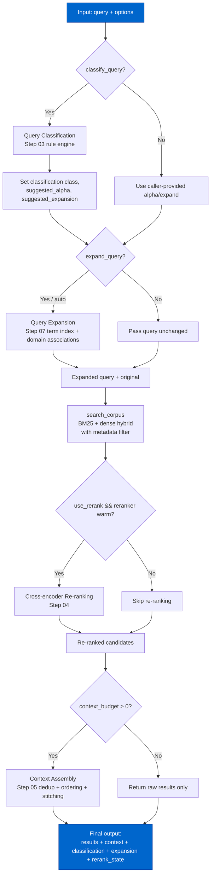
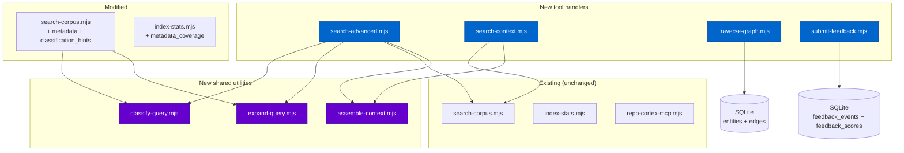

# Cortex MCP Tool Extensions Architecture

> Extracted from `plans/Repo_Cortex_Advanced_RAG_Architecture.plans.md` (Step 10) for permanent reference.

Complete design for new and extended MCP tools that expose advanced RAG capabilities to agents: search_advanced, search_context, traverse_graph, submit_feedback, and extensions to search_corpus and index_stats.

---

#### Step 10 — Design MCP tool extensions architecture [DONE]

```yaml
phase: 1
step: 10
agent: '01-planning'
agent_file: '.github/agents/01-planning.agent.md'
status: '[DONE]'
mode: 'fresh-session'
source_of_truth: 'plans/Repo_Cortex_Advanced_RAG_Architecture.plans.md'
copy_paste: true
next_step: 'Step 11 — Design RAG evaluation suite architecture'
skills:
  - 'plan-alignment'
  - 'mcp-local-server-workflow'
specialists:
  - 'docs-scout'
validation:
  - 'node scripts/agent-customization/validate-plan-sync.mjs --json --plan=plans/Repo_Cortex_Advanced_RAG_Architecture.plans.md'
  - 'node .github/hooks/workflow-update-sync.mjs --plan=plans/Repo_Cortex_Advanced_RAG_Architecture.plans.md --json'
```

**User instruction:** Start a fresh session, select `01-planning`, and paste this full step packet.

**Step objective:** Design the architecture for new and extended MCP tools in the Repo Cortex system. Produce detailed design sections (A–K following the established pattern from Steps 01–09) covering `search_advanced`, `search_context`, `traverse_graph`, `submit_feedback`, extended `search_corpus` (metadata filter + query classification hints), and extended `index_stats` (metadata coverage statistics).

**Context the agent must know:**

- Steps 01–09 are [DONE]. Their designs are in the plan file and must not be re-derived.
- Step 09 designed the metadata filter grammar, schema columns, enrichment pipeline, and `search_corpus` filter extension. Step 10 must build on that foundation for the MCP tool layer.
- Step 06 designed the entity/relationship graph with `entities` and `edges` tables. Step 10's `traverse_graph` tool must consume those tables.
- Step 08 designed the `submit_feedback` signal model. Step 10 must surface it as a callable MCP tool with the correct schema.
- The current MCP server is at `scripts/mcp-semantic/`. Current tools: `search_corpus`, `index_stats`, `list_families`, `load_chunk`, `load_document`, `scan_code_quality`, `freshness_check`.
- The current `search_corpus` accepts `query`, `family`, `limit`, `alpha`, `use_dense` parameters. Step 09 adds `metadata` parameter. Step 10 extends further with query classification hints.
- All new tools must follow the MCP local server contract: stdio transport, `server.registerTool()` pattern, zod schema validation, parameterized SQL only.
- Tool design must address error handling, timeout, graceful degradation, and backward compatibility.

**Execution steps:**

1. Read `plans/Repo_Cortex_Advanced_RAG_Architecture.plans.md` from the Step 09 design sections to understand the metadata filter and enrichment foundation.
2. Read the current MCP tool implementations in `scripts/mcp-semantic/tools/` to understand the existing patterns (zod schemas, error handling, parameterized queries).
3. Read Step 03 (query classification) and Step 05 (context assembly) designs to understand how `search_advanced` orchestrates the full pipeline.
4. Read Step 06 (entity graph) design to understand how `traverse_graph` queries the `entities` and `edges` tables.
5. Read Step 08 (relevance feedback) design to understand how `submit_feedback` records signals.
6. Author design sections A–K for the MCP tool extensions, following the same pattern as Steps 01–09:
   - A: Tool inventory and responsibility matrix
   - B: `search_advanced` tool design (full pipeline orchestration: classification → expansion → retrieval → re-ranking → assembly)
   - C: `search_context` tool design (context-window-assembled output for agent consumption)
   - D: `traverse_graph` tool design (entity/relationship graph traversal for multi-hop queries)
   - E: `submit_feedback` tool design (relevance feedback collection MCP tool)
   - F: Extended `search_corpus` design (metadata filter + query classification hints)
   - G: Extended `index_stats` design (metadata coverage statistics)
   - H: Error handling, timeout, and graceful degradation
   - I: Backward compatibility and migration
   - J: Implementation file map (new files, modified files, SQL migration)
   - K: Eval design (tool-specific eval queries and regression thresholds)
7. Insert the design into the plan file after Step 10's objective text, before Step 11's header.
8. Mark Step 10 as [DONE], update validation evidence, update the handoff query for Step 11.
9. Run plan sync and workflow update validation.

**Stop conditions:**

- Done: All design sections A–K authored and inserted, Step 10 marked [DONE], validation passing.
- Blocked: Missing context from prior steps that cannot be recovered from the plan file.
- Route-back: If Step 09 metadata filter design is incomplete or inconsistent, route back to Step 09.

**Required validation:**

- `node scripts/agent-customization/validate-plan-sync.mjs --json --plan=plans/Repo_Cortex_Advanced_RAG_Architecture.plans.md`
- `node .github/hooks/workflow-update-sync.mjs --plan=plans/Repo_Cortex_Advanced_RAG_Architecture.plans.md --json`

**Plan update requirement:** Update the source plan with Step 10 design sections, mark Step 10 [DONE], update validation evidence, and update the handoff query before ending.

---

##### A. Tool Inventory and Responsibility Matrix

The Phase 1 architecture designs (Steps 01–09) define several advanced retrieval and feedback capabilities that are currently inaccessible to MCP clients because no tool surfaces them. Step 10 adds four new tools and extends two existing tools:

| Tool                       | Type         | Responsibility                                                                                                                                  | Prior step foundation    |
| -------------------------- | ------------ | ----------------------------------------------------------------------------------------------------------------------------------------------- | ------------------------ |
| `search_advanced`          | **New**      | Full pipeline orchestration: classify → expand → retrieve → re-rank → assemble. Single-call access to the complete advanced retrieval pipeline. | Steps 03, 04, 05, 07, 09 |
| `search_context`           | **New**      | Context-window-assembled output for agent consumption. Returns a stitched, budget-managed context string rather than raw result tuples.         | Step 05                  |
| `traverse_graph`           | **New**      | Entity/relationship graph traversal for multi-hop queries. Surfaces the `entities` and `edges` tables defined in Step 06.                       | Step 06                  |
| `submit_feedback`          | **New**      | Relevance feedback collection MCP tool. Accepts chunk-level signal types and records them into `feedback_events` and `feedback_scores`.         | Step 08                  |
| `search_corpus` (extended) | **Extended** | Adds `metadata` filter parameter (from Step 09) and `classification_hints` parameter for query-class-aware retrieval.                           | Steps 03, 09             |
| `index_stats` (extended)   | **Extended** | Adds `include_metadata_coverage` parameter and `metadata_coverage` section to the response.                                                     | Step 09                  |

**Design principles:**

1. **Composition over duplication.** `search_advanced` and `search_context` call `search_corpus` internally rather than reimplementing BM25/dense retrieval. `traverse_graph` calls its own graph SQL rather than reusing search. `submit_feedback` writes directly to its own tables.
2. **Backward compatibility.** All new parameters are optional with sensible defaults. Existing `search_corpus` and `index_stats` calls produce identical results when new parameters are omitted.
3. **Graceful degradation.** Each new tool defines a cold/missing-state fallback. If the entity graph is not built, `traverse_graph` returns an empty result with a `graph_state` hint. If the term index is missing, `search_advanced` falls back to unexpanded retrieval. If the re-ranker is cold, `search_advanced` skips re-ranking.
4. **Parameterized SQL only.** All database queries use `?` placeholders. No string interpolation in SQL.

##### B. `search_advanced` Tool Design

`search_advanced` is a single-call orchestration tool that composes the full advanced retrieval pipeline: query classification → query expansion → hybrid retrieval → cross-encoder re-ranking → context assembly. It is the primary entry point for agents that want high-quality retrieval without manually chaining multiple tool calls.

**B.1 Tool schema.**

```
search_advanced({
  query: string,                    // Required. The search query.
  family?: string,                  // Optional. Restrict to a document family.
  limit?: number,                   // Optional. Max results (default 10, max 50).
  alpha?: number,                   // Optional. BM25/dense blend weight (0–1).
  metadata?: MetadataFilter,        // Optional. Structured filter (Step 09 grammar).
  use_rerank?: boolean,            // Optional. Enable cross-encoder re-ranking (default true when warm).
  rerank_candidates_count?: number, // Optional. Candidates to feed re-ranker before final cut (default 30).
  expand_query?: boolean | 'domain-only', // Optional. Enable query expansion (default: auto by classification).
  classify_query?: boolean,         // Optional. Return classification metadata (default true).
  context_budget?: number,         // Optional. Token budget for context assembly (default 4096).
  context_format?: 'markdown' | 'json', // Optional. Assembly output format (default 'markdown').
}) → {
  results: Array<SearchResult>,     // Ranked results (re-ranked if enabled).
  context: string,                  // Assembled context string (if context_budget provided).
  classification: {                 // Present when classify_query is true.
    class: string,                  // Query class label.
    confidence: number,            // Classification confidence 0–1.
    suggested_alpha: number,       // Class-recommended alpha blend.
    suggested_expansion: boolean | 'domain-only',
  },
  expansion: {                      // Present when expand_query is enabled.
    original_query: string,
    expanded_terms: Array<string>,
    expansion_method: 'none' | 'embedding' | 'domain-only' | 'both',
  },
  rerank_state: 'warm' | 'cold' | 'skipped',
  metadata: {                        // Per-result metadata (Step 09).
    arch_layer: string | null,
    jsdoc_quality: string | null,
    jsdoc_word_count: number | null,
    cyclomatic_complexity: number | null,
    test_coverage: number | null,
    source_path_pattern: string | null,
  },
  dense_state: 'warm' | 'cold' | 'model-only',
}
```

**B.2 Pipeline orchestration.**



**B.3 Classification-aware defaults.**

When `classify_query` is `true` (the default), the tool applies classification-derived defaults before retrieval:

| Query class      | Default alpha | Default expand_query | Default use_rerank | Rationale                                                                |
| ---------------- | ------------- | -------------------- | ------------------ | ------------------------------------------------------------------------ |
| `simple_lookup`  | 0.7           | `false`              | `false`            | BM25-heavy, no expansion noise, re-ranking unnecessary                   |
| `cross_boundary` | 0.4           | `true`               | `true`             | Dense-heavy, expansion helps cross-family, re-ranking improves precision |
| `multi_hop`      | 0.3           | `true`               | `true`             | Dense-heavy, expansion needed for recall, re-ranking for disambiguation  |
| `exploratory`    | 0.5           | `true`               | `true`             | Balanced blend, expansion for breadth                                    |
| `code_specific`  | 0.6           | `'domain-only'`      | `true`             | Slightly BM25-heavy, domain abbreviations only, re-ranking for precision |
| `plan_specific`  | 0.6           | `'domain-only'`      | `true`             | Slightly BM25-heavy, domain abbreviations only, re-ranking for precision |

Caller-provided `alpha`, `expand_query`, and `use_rerank` override classification defaults when explicitly set.

**B.4 Fallback behavior.**

| Missing subsystem           | Fallback                            | `dense_state` / `rerank_state`  |
| --------------------------- | ----------------------------------- | ------------------------------- |
| Dense embeddings cold       | BM25-only retrieval                 | `dense_state: 'cold'`           |
| Dense model-only (no index) | BM25-only retrieval                 | `dense_state: 'model-only'`     |
| Re-ranker cold              | Skip re-ranking                     | `rerank_state: 'cold'`          |
| Term index missing          | No expansion                        | `expansion_method: 'none'`      |
| Domain associations missing | Embedding-only expansion            | `expansion_method: 'embedding'` |
| Entity graph not built      | No graph expansion (does not error) | N/A (not a required subsystem)  |

**B.5 Error handling.**

- Invalid `alpha` (outside 0–1): return MCP error with `INVALID_ALPHA` code and message.
- Invalid `metadata` filter: return MCP error with `INVALID_METADATA_FILTER` code and message, including the first validation failure reason.
- Empty `query`: return MCP error with `EMPTY_QUERY` code.
- `limit` exceeds 50: clamp to 50, include `limit_clamped: true` in response metadata.
- Database not found: return MCP error with `CORPUS_NOT_FOUND` code.

**B.6 Compositional boundary.**

`search_advanced` calls `searchCorpus()` internally (the same function backing the `search_corpus` MCP tool). It does not re-implement BM25/dense retrieval. This ensures that any improvements to `search_corpus` automatically benefit `search_advanced`. The composition boundary is the function call, not a tool-to-tool MCP call (no nested MCP invocations).

##### C. `search_context` Tool Design

`search_context` is a convenience tool that combines retrieval with context assembly in a single call. It targets agent consumers that need a ready-to-use context string rather than raw ranked chunks.

**C.1 Tool schema.**

```
search_context({
  query: string,                    // Required. The search query.
  family?: string,                  // Optional. Restrict to a document family.
  limit?: number,                   // Optional. Max chunks for ranking (default 20, max 50).
  alpha?: number,                   // Optional. BM25/dense blend weight (0–1, default 0.5).
  metadata?: MetadataFilter,        // Optional. Structured filter (Step 09 grammar).
  use_rerank?: boolean,            // Optional. Enable re-ranking (default true when warm).
  context_budget?: number,          // Optional. Token budget (default 4096, max 16384).
  context_format?: 'markdown' | 'json', // Optional. Output format (default 'markdown').
  include_metadata?: boolean,       // Optional. Include per-chunk metadata in output (default false).
  dedup_strategy?: 'exact' | 'semantic' | 'none', // Optional. Dedup strategy (default 'exact').
}) → {
  context: string,                  // Assembled context string in chosen format.
  total_chunks_retrieved: number,   // Chunks before dedup and budget.
  chunks_in_context: number,        // Chunks surviving dedup and budget.
  tokens_used: number,              // Approximate tokens consumed.
  budget_remaining: number,         // Tokens remaining in budget.
  results: Array<{                  // Present when include_metadata is true.
    chunk_id: string,
    family: string,
    heading_path: string,
    score: number,
    metadata: object | null,
  }>,
  dense_state: 'warm' | 'cold' | 'model-only',
  rerank_state: 'warm' | 'cold' | 'skipped',
}
```

**C.2 Assembly pipeline.**

`search_context` composes `searchCorpus()` → `assembleContext()` (Step 05):

1. Call `searchCorpus()` with `query`, `family`, `limit`, `alpha`, `metadata`, `use_rerank`.
2. Pass ranked results to `assembleContext()` with `context_budget`, `context_format`, `dedup_strategy`.
3. Return the assembled context string plus budget accounting metadata.

The `assembleContext()` function (Step 05 design) handles:

- **Enrichment**: attach heading path, family, metadata to each chunk.
- **Dedup**: exact (by `chunk_id`) or semantic (by cosine similarity > 0.95 on embedding).
- **Ordering**: family grouping → heading path → score within same heading.
- **Budget management**: `context_budget` tokens, truncate the lowest-ranked chunks first.
- **Stitching**: join chunks with `\n\n---\n\n` separators, prepend family headers.

**C.3 Context format details.**

**Markdown format** (default):

```markdown
## Family: methods

### methods/activation.md > Activation Functions

Chunk content here...

---

### methods/cost.md > Cost Functions

Chunk content here...

## Family: neat

### neat/evolution.md > NEAT Evolution

Chunk content here...
```

**JSON format**:

```json
{
  "sections": [
    {
      "family": "methods",
      "heading_path": "methods/activation.md > Activation Functions",
      "content": "Chunk content here...",
      "score": 0.87,
      "chunk_id": "methods/activation.md:12"
    }
  ],
  "tokens_used": 3200,
  "budget_remaining": 896
}
```

**C.4 Budget accounting.**

Token estimation uses a simple heuristic: `Math.ceil(text.length / 4)` (4 chars per token). This is consistent across all context assembly paths. The `budget_remaining` field reports `context_budget - tokens_used`, allowing callers to decide whether to issue a follow-up query with a larger budget.

**C.5 Fallback behavior.**

| Condition                       | Fallback                                                                             |
| ------------------------------- | ------------------------------------------------------------------------------------ |
| Dense embeddings cold           | BM25-only retrieval, `dense_state: 'cold'`                                           |
| Re-ranker cold                  | Skip re-ranking, `rerank_state: 'cold'`                                              |
| Budget too small for any chunks | Return empty context with `chunks_in_context: 0`, `budget_remaining: context_budget` |
| No results from search          | Return empty context with `total_chunks_retrieved: 0`                                |

##### D. `traverse_graph` Tool Design

`traverse_graph` surfaces the entity/relationship graph defined in Step 06 (entities and edges tables) as an MCP tool. It supports multi-hop traversal from seed entities discovered by name or query.

**D.1 Tool schema.**

```
traverse_graph({
  seed_query?: string,              // Optional. FTS5 query to find seed entities.
  seed_names?: Array<string>,       // Optional. Exact entity names to start from.
  relationship_types?: Array<string>, // Optional. Filter by relationship types.
  max_hops?: number,                // Optional. Max traversal depth (default 2, max 4).
  max_results?: number,             // Optional. Max entities to return (default 20, max 100).
  confidence_filter?: number,       // Optional. Minimum confidence for edges (default 0.0, range 0–1).
  include_chunks?: boolean,         // Optional. Include chunk content for discovered entities (default false).
}) → {
  entities: Array<{
    entity_id: number,
    entity_type: string,            // 'function' | 'class' | 'module' | 'interface' | 'variable' | 'concept'
    qualified_name: string,
    doc_id: string | null,
    chunk_id: string | null,
    metadata: object | null,
    hop_distance: number,           // 0 for seeds, 1 for direct neighbors, etc.
  }>,
  edges: Array<{
    edge_id: number,
    source_entity_id: number,
    target_entity_id: number,
    relationship_type: string,      // 'imports' | 'owns' | 'references' | 'implements' | 'extends' | 'calls' | 'tests'
    confidence: number,
    hop_distance: number,           // Which hop discovered this edge.
  }>,
  seed_entities: Array<{
    entity_id: number,
    qualified_name: string,
    match_method: 'exact' | 'fts5',
  }>,
  traversal_stats: {
    total_entities_discovered: number,
    total_edges_traversed: number,
    hops_completed: number,
    query_time_ms: number,
  },
  graph_state: 'ready' | 'not_built' | 'empty',
}
```

**D.2 Seed discovery.**

The tool supports two seed discovery modes:

1. **`seed_names`** (exact match): Given an array of qualified names (e.g., `["Network.connect", "methods.mutate.ADD_NODE"]`), look up entities by `qualified_name` using `WHERE qualified_name = ?`. This is fast and deterministic.

2. **`seed_query`** (FTS5): Given a natural language query, discover seed entities using FTS5 search on the `entities` table. The entities table has an FTS5 index on `qualified_name` and `metadata` (JSON). This supports fuzzy discovery when the caller doesn't know exact names.

3. **Combined**: When both `seed_query` and `seed_names` are provided, the union of both seed sets is used. When neither is provided, return MCP error with `SEED_REQUIRED` code — the tool requires at least one seed to start traversal.

**D.3 Traversal algorithm.**

```sql
-- Hop 1: Direct neighbors of seed entities
SELECT e.*, ed.relationship_type, ed.confidence, 1 as hop_distance
FROM edges ed
JOIN entities e ON (e.entity_id = ed.target_entity_id OR e.entity_id = ed.source_entity_id)
WHERE (ed.source_entity_id IN (seed_ids) OR ed.target_entity_id IN (seed_ids))
  AND ed.confidence >= ?
  AND (? = '[]' OR ed.relationship_type IN (?))

UNION

-- Hop 2+: Iterative BFS using discovered entity IDs
-- (implemented as iterative queries in application code, not a single SQL statement)
```

BFS traversal is implemented iteratively in application code:

```
traverseGraph(seeds, relationship_types, max_hops, max_results, confidence_filter):
  discovered = Set(seeds)
  frontier = seeds
  all_edges = []
  all_entities = list(seeds with hop_distance=0)

  for hop from 1 to max_hops:
    if frontier is empty or all_entities.length >= max_results:
      break

    neighbors = queryNeighbors(frontier, relationship_types, confidence_filter)
    new_entities = neighbors.entities.filter(e => !discovered.has(e.entity_id))
    new_edges = neighbors.edges

    discovered.update(new_entities.map(e => e.entity_id))
    all_entities.extend(new_entities with hop_distance=hop)
    all_edges.extend(new_edges with hop_distance=hop)
    frontier = new_entities

  return { entities: all_entities, edges: all_edges, ... }
```

**D.4 Relationship type filtering.**

When `relationship_types` is provided (non-empty array), only edges matching those types are traversed. Supported relationship types from Step 06:

| Relationship type | Description             | Typical use                   |
| ----------------- | ----------------------- | ----------------------------- |
| `imports`         | A imports B             | Module dependency traversal   |
| `owns`            | A owns B (parent–child) | Class→method, module→function |
| `references`      | A references B          | Cross-reference discovery     |
| `implements`      | A implements B          | Interface→implementation      |
| `extends`         | A extends B             | Inheritance traversal         |
| `calls`           | A calls B               | Call graph traversal          |
| `tests`           | A tests B               | Test→code mapping             |

When `relationship_types` is omitted or empty, all types are traversed.

**D.5 `include_chunks` behavior.**

When `include_chunks` is `true`, each entity that has a `chunk_id` is enriched with its chunk content from the `chunks` table. This enables the caller to see what a discovered entity actually does without a second tool call. Chunk content is fetched via a batch `WHERE chunk_id IN (?)` query after traversal completes.

**D.6 Graph state reporting.**

| `graph_state` | Meaning                                               | Tool behavior                                                                    |
| ------------- | ----------------------------------------------------- | -------------------------------------------------------------------------------- |
| `ready`       | `entities` and `edges` tables exist and are populated | Full traversal                                                                   |
| `not_built`   | Tables do not exist or are empty                      | Return empty result with `entities: []`, `edges: []`, `graph_state: 'not_built'` |
| `empty`       | Tables exist but have 0 rows                          | Same as `not_built`                                                              |

The tool checks graph state before executing traversal. If the graph is not built, it returns immediately rather than erroring. This matches the graceful-degradation pattern used by `search_corpus` for dense embeddings.

**D.7 Error handling.**

- No `seed_query` and no `seed_names`: return MCP error with `SEED_REQUIRED` code.
- `max_hops` > 4: clamp to 4, include `max_hops_clamped: true` in `traversal_stats`.
- `max_results` > 100: clamp to 100, include `max_results_clamped: true` in `traversal_stats`.
- `confidence_filter` outside 0–1: return MCP error with `INVALID_CONFIDENCE_FILTER` code.
- Database not found: return MCP error with `CORPUS_NOT_FOUND` code.

##### E. `submit_feedback` Tool Design

`submit_feedback` surfaces the relevance feedback model from Step 08 as a callable MCP tool. It records a user or agent signal about the relevance of a specific chunk to a query.

**E.1 Tool schema.**

```
submit_feedback({
  chunk_id: string,                 // Required. The chunk receiving the signal.
  signal_type: string,              // Required. One of: 'reference' | 'positive' | 'negative' | 'irrelevant'.
  query?: string,                   // Optional. The query that produced this chunk.
  context?: string,                 // Optional. Free-text context explaining the signal.
  signal_strength?: number,         // Optional. Override default strength (default 1.0 for positive/reference, -0.5 for negative).
}) → {
  recorded: boolean,                // Always true on success.
  chunk_id: string,
  signal_type: string,
  feedback_score: number,            // Updated aggregate score after this signal.
  total_signals: number,            // Total signal count for this chunk.
  feedback_boost: number,            // Computed boost value (FEEDBACK_WEIGHT × normalized_score).
}
```

**E.2 Signal type taxonomy (from Step 08).**

| Signal type  | Default strength | Description                                                               |
| ------------ | ---------------- | ------------------------------------------------------------------------- |
| `reference`  | +1.0             | Chunk was explicitly referenced by an agent or user as the correct answer |
| `positive`   | +0.5             | Chunk was helpful but not explicitly referenced                           |
| `negative`   | -0.5             | Chunk was unhelpful or misleading                                         |
| `irrelevant` | -1.0             | Chunk is completely irrelevant to the query                               |

When `signal_strength` is provided, it overrides the default but must respect the sign convention: `reference` and `positive` must be > 0, `negative` and `irrelevant` must be < 0.

**E.3 Storage interaction.**

The tool writes to two tables defined in Step 08:

1. **`feedback_events`**: Append-only event log. Each call inserts one row:

   ```sql
   INSERT INTO feedback_events (chunk_id, signal_type, signal_strength, query, context, created_at)
   VALUES (?, ?, ?, ?, ?, ?)
   ```

2. **`feedback_scores`**: Aggregate score table. After inserting the event, the tool updates the aggregate:
   ```sql
   INSERT INTO feedback_scores (chunk_id, total_signals, positive_signals, negative_signals, aggregate_score, last_updated)
   VALUES (?, 1, ?, ?, ?, ?)
   ON CONFLICT(chunk_id) DO UPDATE SET
     total_signals = total_signals + 1,
     positive_signals = positive_signals + ?,
     negative_signals = negative_signals + ?,
     aggregate_score = aggregate_score + ?,
     last_updated = ?
   ```

**E.4 Feedback boost computation.**

After recording the signal, the tool computes the feedback boost using the formula from Step 08:

```
normalized_score = (aggregate_score + abs(min_possible_score)) / (max_possible_score + abs(min_possible_score))
feedback_boost = FEEDBACK_WEIGHT × normalized_score
```

Where `FEEDBACK_WEIGHT = 0.15` (from Step 08 Section C.3).

The `feedback_boost` is included in the response but is not stored — it is computed on-the-fly from the current aggregate score. When `search_corpus` or `search_advanced` retrieves chunks, they apply this boost to the hybrid score.

**E.5 Idempotency and rate limiting.**

- **Idempotency**: `submit_feedback` is not idempotent by design — each call is a distinct event. Agents that need deduplication should check `total_signals` in the response before resubmitting.
- **Rate limiting**: The tool does not impose server-side rate limits. MCP clients are expected to batch feedback signals rather than submitting one per retrieval. A future extension may add per-chunk rate limits.

**E.6 Error handling.**

- Invalid `signal_type`: return MCP error with `INVALID_SIGNAL_TYPE` code and list valid types.
- Invalid `signal_strength` sign: return MCP error with `INVALID_SIGNAL_STRENGTH` code (positive types must be > 0, negative types must be < 0).
- Missing `chunk_id`: return MCP error with `MISSING_CHUNK_ID` code.
- `chunk_id` not found in corpus: return MCP error with `CHUNK_NOT_FOUND` code. The tool validates that the chunk exists before recording feedback.
- Database not found: return MCP error with `CORPUS_NOT_FOUND` code.

##### F. Extended `search_corpus` Design

Step 09 designed the `metadata` filter parameter. Step 10 extends `search_corpus` further with query classification hints that allow callers to influence retrieval behavior without manually setting `alpha` and expansion flags.

**F.1 New parameter: `classification_hints`.**

```
search_corpus({
  // Existing parameters (unchanged)
  query: string,
  family?: string,
  limit?: number,
  alpha?: number,
  use_dense?: boolean,

  // Step 09 extension (already designed)
  metadata?: MetadataFilter,

  // Step 10 new extension
  classification_hints?: {
    query_class?: string,          // Override auto-detected query class.
    suggested_alpha?: number,      // Override classification-derived alpha.
    expand_query?: boolean | 'domain-only', // Override expansion behavior.
  },
})
```

When `classification_hints` is provided:

- If `query_class` is set, the tool uses it for classification-aware behavior without running the rule-based classifier. This is useful when the caller already knows the query class (e.g., from a prior `search_advanced` call's `classification` field).
- If `suggested_alpha` is set, it overrides both the classification-derived alpha and the top-level `alpha` parameter. Priority: `classification_hints.suggested_alpha` > `alpha` > classification default.
- If `expand_query` is set, it overrides the classification-derived expansion behavior. Priority: `classification_hints.expand_query` > classification default.

**F.2 Classification-aware retrieval flow.**

When `classification_hints.query_class` is provided (or auto-detected if absent):

1. Determine the effective `alpha`: `classification_hints.suggested_alpha` > top-level `alpha` > class-default alpha.
2. Determine the effective expansion: `classification_hints.expand_query` > class-default expansion.
3. Apply the effective `alpha` to the BM25/dense blend in `searchCorpus()`.
4. If expansion is enabled, expand the query using the term index and domain associations before BM25 and dense retrieval.
5. Return results with an additional `classification` field in the response metadata.

**F.3 Backward compatibility.**

- `classification_hints` is entirely optional. When omitted, `search_corpus` behaves exactly as before (no classification, no expansion).
- The `metadata` parameter from Step 09 is also optional. When omitted, no filter is applied.
- Both parameters can be combined: a caller can provide `metadata` and `classification_hints` simultaneously for filtered, classification-aware retrieval.

**F.4 Extended response format.**

```
{
  results: [...],                  // Unchanged
  dense_state: '...' | '...' | '...',  // Unchanged
  dense_degraded: boolean,         // Unchanged
  dense_reason: string | null,     // Unchanged
  classification?: {                // Present when classification_hints is provided or auto-detected
    class: string,
    confidence: number,
    suggested_alpha: number,
    suggested_expansion: boolean | 'domain-only',
  },
  expansion?: {                    // Present when expand_query is enabled
    original_query: string,
    expanded_terms: Array<string>,
    expansion_method: 'none' | 'embedding' | 'domain-only' | 'both',
  },
}
```

##### G. Extended `index_stats` Design

Step 09 Section E.3 designed metadata coverage statistics. Step 10 extends `index_stats` with an `include_metadata_coverage` parameter that adds a `metadata_coverage` section to the response.

**G.1 New parameter: `include_metadata_coverage`.**

```
index_stats({
  include_metadata_coverage?: boolean,  // Optional. Default false.
}) → {
  // Existing fields (unchanged)
  total_documents: number,
  total_chunks: number,
  total_families: number,
  last_build_timestamp: string | null,

  // New fields when include_metadata_coverage is true
  metadata_coverage?: {
    columns: {
      arch_layer: {
        total: number,          // Total chunks with non-null value
        percent: number,        // Percentage of all chunks
        distribution: {         // Top values by frequency
          [key: string]: number,
        },
      },
      jsdoc_quality: {
        total: number,
        percent: number,
        distribution: {
          'none' | 'minimal' | 'adequate' | 'good' | 'excellent': number,
        },
      },
      jsdoc_word_count: {
        total: number,
        percent: number,
        statistics: {
          min: number,
          max: number,
          mean: number,
          median: number,
        },
      },
      cyclomatic_complexity: {
        total: number,
        percent: number,
        statistics: {
          min: number,
          max: number,
          mean: number,
          median: number,
        },
      },
      test_coverage: {
        total: number,
        percent: number,
        statistics: {
          min: number,
          max: number,
          mean: number,
          median: number,
        },
      },
      source_path_pattern: {
        total: number,
        percent: number,
        distribution: {
          [pattern: string]: number,
        },
      },
    },
    document_level: {
      // Document-level metadata (source_repo, package_version, build_timestamp)
      source_repo: {
        total: number,
        percent: number,
        distribution: { [key: string]: number },
      },
      package_version: {
        total: number,
        percent: number,
        distribution: { [key: string]: number },
      },
      build_timestamp: {
        total: number,
        percent: number,
        earliest: string | null,
        latest: string | null,
      },
    },
  },
}
```

**G.2 SQL queries for metadata coverage.**

The metadata coverage statistics are computed from the same `chunks` and `documents` tables that already store the metadata columns from Step 09. The queries use parameterized SQL with no string interpolation:

```sql
-- Chunk-level coverage for a single column
SELECT
  COUNT(*) AS total,
  COUNT(column_name) AS non_null,
  ROUND(COUNT(column_name) * 100.0 / COUNT(*), 1) AS percent
FROM chunks;

-- Distribution for categorical column
SELECT column_name, COUNT(*) AS count
FROM chunks
WHERE column_name IS NOT NULL
GROUP BY column_name
ORDER BY count DESC
LIMIT 20;

-- Statistics for numeric column
SELECT
  MIN(column_name) AS min,
  MAX(column_name) AS max,
  ROUND(AVG(column_name), 2) AS mean,
  ROUND(MEDIAN(column_name), 2) AS median
FROM chunks
WHERE column_name IS NOT NULL;

-- Document-level coverage
SELECT
  COUNT(*) AS total,
  COUNT(source_repo) AS has_source_repo,
  COUNT(package_version) AS has_package_version,
  COUNT(build_timestamp) AS has_build_timestamp
FROM documents;
```

**G.3 Performance considerations.**

- `include_metadata_coverage` is `false` by default to avoid unnecessary computation. When enabled, the tool runs 6–8 additional SQL queries (one per column for coverage, plus distribution/statistics queries). These queries are fast on the typical corpus size (30K+ chunks, < 1MB SQLite database).
- The tool caches metadata coverage results for 60 seconds in a module-level cache to avoid redundant computation when `index_stats` is called repeatedly.
- Distribution results are capped at 20 most-frequent values per column to keep the response size bounded.

**G.4 Backward compatibility.**

When `include_metadata_coverage` is `false` (the default), the response is identical to the current `index_stats` output. No existing clients are affected.

##### H. Error Handling, Timeout, and Graceful Degradation

**H.1 Error response format.**

All new and extended MCP tools use a consistent error response format:

```
{
  error: {
    code: string,           // Machine-readable error code (e.g., 'INVALID_ALPHA')
    message: string,        // Human-readable description
    details?: object,       // Optional additional context
  }
}
```

**H.2 Error code taxonomy.**

| Code                        | HTTP analog | Tools affected                                 | Description                                                   |
| --------------------------- | ----------- | ---------------------------------------------- | ------------------------------------------------------------- |
| `EMPTY_QUERY`               | 400         | search_advanced, search_context                | Query string is empty or whitespace-only                      |
| `INVALID_ALPHA`             | 400         | search_advanced, search_context, search_corpus | Alpha outside 0–1 range                                       |
| `INVALID_METADATA_FILTER`   | 400         | search_advanced, search_context, search_corpus | Filter predicate validation failure                           |
| `INVALID_CONFIDENCE_FILTER` | 400         | traverse_graph                                 | Confidence filter outside 0–1 range                           |
| `INVALID_SIGNAL_TYPE`       | 400         | submit_feedback                                | Unknown signal type                                           |
| `INVALID_SIGNAL_STRENGTH`   | 400         | submit_feedback                                | Strength sign contradicts signal type                         |
| `MISSING_CHUNK_ID`          | 400         | submit_feedback                                | Required chunk_id missing                                     |
| `CHUNK_NOT_FOUND`           | 404         | submit_feedback                                | chunk_id does not exist in corpus                             |
| `SEED_REQUIRED`             | 400         | traverse_graph                                 | Neither seed_query nor seed_names provided                    |
| `CORPUS_NOT_FOUND`          | 404         | all tools                                      | SQLite database file does not exist                           |
| `GRAPH_NOT_BUILT`           | 200         | traverse_graph                                 | Entity graph tables missing or empty (graceful, not an error) |
| `RATE_LIMITED`              | 429         | submit_feedback                                | Rate limit exceeded (future extension)                        |

**H.3 Timeout handling.**

Each tool has a default timeout and a maximum timeout:

| Tool                       | Default timeout | Maximum timeout | Timeout behavior                                         |
| -------------------------- | --------------- | --------------- | -------------------------------------------------------- |
| `search_advanced`          | 15s             | 30s             | Return partial results with `timed_out: true` flag       |
| `search_context`           | 15s             | 30s             | Return assembled context from partial results            |
| `traverse_graph`           | 10s             | 20s             | Return entities discovered so far with `timed_out: true` |
| `submit_feedback`          | 5s              | 10s             | Return error (feedback recording must be atomic)         |
| `search_corpus` (extended) | 10s             | 20s             | Return partial results with `timed_out: true`            |
| `index_stats` (extended)   | 5s              | 10s             | Return core stats without metadata coverage              |

Timeouts are implemented at the `searchCorpus()` function level using `AbortController`-style cancellation. Each pipeline stage checks whether the timeout has been reached before proceeding to the next stage. Partial results are preferred over errors wherever possible.

**H.4 Graceful degradation matrix.**

| Subsystem missing   | `search_advanced`                                      | `search_context`                        | `search_corpus`                  | `traverse_graph`                         | `index_stats`                 | `submit_feedback`                 |
| ------------------- | ------------------------------------------------------ | --------------------------------------- | -------------------------------- | ---------------------------------------- | ----------------------------- | --------------------------------- |
| Dense embeddings    | BM25-only, `dense_state: 'cold'`                       | BM25-only, `dense_state: 'cold'`        | BM25-only, `dense_state: 'cold'` | N/A                                      | N/A                           | N/A                               |
| Re-ranker model     | Skip re-ranking, `rerank_state: 'cold'`                | Skip re-ranking, `rerank_state: 'cold'` | N/A                              | N/A                                      | N/A                           | N/A                               |
| Term index          | No expansion, `expansion_method: 'none'`               | No expansion                            | N/A                              | N/A                                      | N/A                           | N/A                               |
| Domain associations | Embedding-only expansion                               | Embedding-only expansion                | N/A                              | N/A                                      | N/A                           | N/A                               |
| Entity graph        | No graph expansion                                     | N/A                                     | N/A                              | Empty result, `graph_state: 'not_built'` | N/A                           | N/A                               |
| Feedback tables     | N/A                                                    | N/A                                     | N/A                              | N/A                                      | N/A                           | Auto-create tables on first write |
| Metadata columns    | Skip metadata filter, `metadata_filter_applied: false` | Skip metadata filter                    | Skip metadata filter             | N/A                                      | Return null metadata_coverage | N/A                               |
| Query classifier    | Default alpha/expand, `classification: null`           | Default alpha/expand                    | No classification hints          | N/A                                      | N/A                           | N/A                               |

**H.5 Automatic table creation for feedback.**

When `submit_feedback` is called and the `feedback_events` or `feedback_scores` tables do not exist, the tool creates them using the DDL from Step 08 Section C.1. This ensures that feedback works immediately after a fresh index build without requiring a separate migration step. The creation is idempotent (uses `CREATE TABLE IF NOT EXISTS`).

##### I. Backward Compatibility and Migration

**I.1 Parameter compatibility.**

All new parameters are optional with backward-compatible defaults:

| Tool              | New parameter               | Default                    | Behavior when omitted         |
| ----------------- | --------------------------- | -------------------------- | ----------------------------- |
| `search_corpus`   | `metadata`                  | `null` (no filter)         | Identical to current behavior |
| `search_corpus`   | `classification_hints`      | `null` (no classification) | Identical to current behavior |
| `index_stats`     | `include_metadata_coverage` | `false`                    | Identical to current behavior |
| `search_advanced` | (all parameters)            | N/A (new tool)             | N/A                           |
| `search_context`  | (all parameters)            | N/A (new tool)             | N/A                           |
| `traverse_graph`  | (all parameters)            | N/A (new tool)             | N/A                           |
| `submit_feedback` | (all parameters)            | N/A (new tool)             | N/A                           |

No existing `search_corpus` or `index_stats` call will break. No existing response field is removed or renamed.

**I.2 Response compatibility.**

New response fields are additive:

- `search_corpus` response gains optional `classification` and `expansion` fields when `classification_hints` or `metadata` are used. When unused, these fields are absent (not `null`).
- `index_stats` response gains optional `metadata_coverage` field when `include_metadata_coverage` is `true`. When `false`, the field is absent.
- Existing fields (`results`, `dense_state`, `dense_degraded`, `dense_reason`, `total_documents`, `total_chunks`, `total_families`, `last_build_timestamp`) are unchanged in name, type, and semantics.

**I.3 Database migration.**

The new tables required by `traverse_graph` and `submit_feedback` are:

| Table                 | Created by                         | When                                                 |
| --------------------- | ---------------------------------- | ---------------------------------------------------- |
| `entities`            | `build-entity-graph.mjs` (Step 06) | During index build when entity extraction is enabled |
| `edges`               | `build-entity-graph.mjs` (Step 06) | During index build when entity extraction is enabled |
| `feedback_events`     | `submit_feedback` tool             | On first call (auto-create)                          |
| `feedback_scores`     | `submit_feedback` tool             | On first call (auto-create)                          |
| `term_embeddings`     | `build-term-index.mjs` (Step 07)   | During index build when term expansion is enabled    |
| `domain_associations` | Static JSON file (Step 07)         | Shipped with the package                             |

The metadata columns (Step 09) are added during `build-index.mjs` using `ALTER TABLE ... ADD COLUMN` which is backward-compatible in SQLite. Columns default to `NULL` for existing rows.

**I.4 MCP tool registration migration.**

New tools are registered in `createRepoCortexTools()` using the same `createTool()` pattern as existing tools. No existing tool registration is modified. The tool registration order in the array follows the existing convention: read-only tools first, then mutation tools:

```
// Read-only tools (existing order preserved)
search_corpus (extended)
load_chunk (unchanged)
load_document (unchanged)
freshness_check (unchanged)
index_stats (extended)
list_families (unchanged)
scan_code_quality (unchanged)
search_advanced (new)
search_context (new)
traverse_graph (new)

// Mutation tools
submit_feedback (new)
```

##### J. Implementation File Map

**J.1 New files.**

| File                                              | Purpose                                                                            | Approximate size |
| ------------------------------------------------- | ---------------------------------------------------------------------------------- | ---------------- |
| `scripts/mcp-semantic/tools/search-advanced.mjs`  | `search_advanced` tool handler, pipeline orchestration                             | ~250 lines       |
| `scripts/mcp-semantic/tools/search-context.mjs`   | `search_context` tool handler, context assembly composition                        | ~200 lines       |
| `scripts/mcp-semantic/tools/traverse-graph.mjs`   | `traverse_graph` tool handler, BFS traversal logic                                 | ~300 lines       |
| `scripts/mcp-semantic/tools/submit-feedback.mjs`  | `submit_feedback` tool handler, event recording and score update                   | ~150 lines       |
| `scripts/mcp-semantic/tools/classify-query.mjs`   | Query classification rule engine (shared by `search_advanced` and `search_corpus`) | ~200 lines       |
| `scripts/mcp-semantic/tools/expand-query.mjs`     | Query expansion logic (shared by `search_advanced` and `search_corpus`)            | ~180 lines       |
| `scripts/mcp-semantic/tools/assemble-context.mjs` | Context assembly pipeline (shared by `search_advanced` and `search_context`)       | ~250 lines       |

**J.2 Modified files.**

| File                                           | Change                                                                                                          | Scope            |
| ---------------------------------------------- | --------------------------------------------------------------------------------------------------------------- | ---------------- |
| `scripts/mcp-semantic/tools/search-corpus.mjs` | Add `metadata` and `classification_hints` parameters, classification-aware alpha/expansion, response extensions | ~80 lines added  |
| `scripts/mcp-semantic/tools/index-stats.mjs`   | Add `include_metadata_coverage` parameter, metadata coverage SQL queries, caching                               | ~120 lines added |
| `scripts/mcp-semantic/repo-cortex-mcp.mjs`     | Register 4 new tools, update `search_corpus` and `index_stats` schemas, import new tool modules                 | ~60 lines added  |

**J.3 SQL migration files.**

| File                                                  | Purpose                                                                     |
| ----------------------------------------------------- | --------------------------------------------------------------------------- |
| `scripts/mcp-semantic/sql/create-entity-tables.sql`   | DDL for `entities` and `edges` tables (from Step 06)                        |
| `scripts/mcp-semantic/sql/create-feedback-tables.sql` | DDL for `feedback_events` and `feedback_scores` tables (from Step 08)       |
| `scripts/mcp-semantic/sql/add-metadata-columns.sql`   | ALTER TABLE for metadata columns on `chunks` and `documents` (from Step 09) |

These SQL files are idempotent (use `CREATE TABLE IF NOT EXISTS` and `ALTER TABLE ... ADD COLUMN IF NOT EXISTS` patterns where possible; SQLite does not support `IF NOT EXISTS` for `ALTER TABLE`, so the application code checks for column existence before running ALTER).

**J.4 Dependency graph.**



##### K. Eval Design

**K.1 Tool-specific eval queries.**

Each new tool has targeted eval queries that test both correctness and regression thresholds:

| Tool                       | Eval query                                                                                         | Expected behavior                                                                                                          | Regression threshold                         |
| -------------------------- | -------------------------------------------------------------------------------------------------- | -------------------------------------------------------------------------------------------------------------------------- | -------------------------------------------- |
| `search_advanced`          | "how does NEAT speciation work"                                                                    | Returns `classification.class = 'cross_boundary'`, `expansion_method != 'none'`, results include speciation-related chunks | MRR@5 ≥ 0.6, classification accuracy ≥ 80%   |
| `search_advanced`          | "Network.connect method"                                                                           | Returns `classification.class = 'simple_lookup'`, `expansion_method = 'none'`, top result contains `Network.connect`       | MRR@5 ≥ 0.9                                  |
| `search_advanced`          | "how does the entity graph connect modules"                                                        | Returns `classification.class = 'multi_hop'`, `expand_query = true`, results span multiple families                        | MRR@5 ≥ 0.5                                  |
| `search_advanced`          | "what does the mutation ADD_NODE do"                                                               | Returns `classification.class = 'code_specific'`, `expansion_method = 'domain-only'`                                       | MRR@3 ≥ 0.8                                  |
| `search_context`           | "explain the training loop"                                                                        | Returns assembled context with ≥ 2 distinct families, `chunks_in_context ≥ 3`, `tokens_used ≤ context_budget`              | Budget compliance 100%, family diversity ≥ 2 |
| `search_context`           | "mutation" with budget 512                                                                         | Returns truncated context, `budget_remaining < 50`, `chunks_in_context < limit`                                            | Budget compliance 100%                       |
| `traverse_graph`           | `seed_names: ["Network.connect"]`, `max_hops: 2`                                                   | Returns ≥ 3 entities including `Network` and `Connection`, ≥ 2 edges with `relationship_type` in results                   | Entity recall ≥ 70%, query time < 100ms      |
| `traverse_graph`           | `seed_query: "activation function"`, `relationship_types: ["owns", "calls"]`                       | Returns entities related to activation functions, edges only of type `owns` or `calls`                                     | Type filter accuracy 100%                    |
| `traverse_graph`           | No seeds provided                                                                                  | Returns error with `SEED_REQUIRED` code                                                                                    | Error rate 100%                              |
| `submit_feedback`          | `chunk_id: "methods/activation.md:3"`, `signal_type: "positive"`                                   | Returns `recorded: true`, `feedback_score > 0`, `total_signals ≥ 1`                                                        | Recording success 100%                       |
| `submit_feedback`          | `signal_type: "invalid_type"`                                                                      | Returns error with `INVALID_SIGNAL_TYPE` code                                                                              | Error rate 100%                              |
| `submit_feedback`          | `chunk_id: "nonexistent"`, `signal_type: "positive"`                                               | Returns error with `CHUNK_NOT_FOUND` code                                                                                  | Error rate 100%                              |
| `search_corpus` (extended) | "NEAT speciation" with `metadata: {arch_layer: {eq: "neat"}}`                                      | Returns only chunks with `arch_layer = 'neat'`                                                                             | Filter accuracy 100%                         |
| `search_corpus` (extended) | "connect method" with `classification_hints: {query_class: "simple_lookup", suggested_alpha: 0.8}` | Uses alpha 0.8, no expansion                                                                                               | Alpha compliance 100%                        |
| `index_stats` (extended)   | `include_metadata_coverage: true`                                                                  | Returns `metadata_coverage` with all 6 chunk-level columns and 3 document-level columns, percents sum to meaningful values | Coverage completeness 100%                   |
| `index_stats` (extended)   | `include_metadata_coverage: false`                                                                 | Returns identical response to current `index_stats` (no `metadata_coverage` field)                                         | Backward compat 100%                         |

**K.2 Cross-tool integration eval queries.**

| Eval scenario                    | Tool sequence                                                                                                                                              | Expected behavior                                                                             |
| -------------------------------- | ---------------------------------------------------------------------------------------------------------------------------------------------------------- | --------------------------------------------------------------------------------------------- |
| Feedback-informed retrieval      | `submit_feedback(positive)` → `search_advanced(same query)`                                                                                                | Results should rank the positively-signaled chunk higher than the same query without feedback |
| Graph-expanded context           | `traverse_graph(seed_names)` → `search_context(query)`                                                                                                     | Discovered entities should enrich the context beyond pure search                              |
| Classification-steered filtering | `search_advanced(query, classify: true)` → read `classification.class` → `search_corpus(query, classification_hints)`                                      | Second call should use the class hints to produce equivalent or better results                |
| Degraded dense search            | Mock dense state as 'cold' → `search_advanced(query)`                                                                                                      | Should return BM25-only results with `dense_state: 'cold'`, no error                          |
| Feedback + metadata combined     | `search_advanced(query, metadata: {arch_layer: {eq: "neat"}})` → `submit_feedback(positive on top result)` → `search_advanced(same query, metadata: same)` | Feedback boost should apply within the filtered result set                                    |

**K.3 Regression thresholds.**

| Metric                              | Threshold                                     | Rationale                                                   |
| ----------------------------------- | --------------------------------------------- | ----------------------------------------------------------- |
| `search_advanced` MRR@5             | ≥ 0.6 (cross_boundary), ≥ 0.9 (simple_lookup) | Must not regress below single-tool `search_corpus` baseline |
| `search_context` budget compliance  | 100%                                          | Context must never exceed stated budget                     |
| `traverse_graph` entity recall      | ≥ 70% at 2 hops                               | Graph must discover most directly-reachable entities        |
| `traverse_graph` query time         | < 100ms for seed_names                        | SQLite BFS must be fast for small traversals                |
| `submit_feedback` recording success | 100%                                          | Every valid signal must be persisted                        |
| `search_corpus` filter accuracy     | 100%                                          | Metadata filter must not leak non-matching chunks           |
| `index_stats` coverage completeness | 100%                                          | All metadata columns must appear in coverage when requested |
| Backward compatibility              | 100%                                          | All existing tool calls must produce identical responses    |

**K.4 Latency budget.**

| Tool                                             | P50 target | P95 target | P99 target |
| ------------------------------------------------ | ---------- | ---------- | ---------- |
| `search_advanced` (BM25-only)                    | < 200ms    | < 500ms    | < 1s       |
| `search_advanced` (full pipeline)                | < 500ms    | < 1.5s     | < 3s       |
| `search_context`                                 | < 600ms    | < 2s       | < 4s       |
| `traverse_graph` (seed_names, 2 hops)            | < 50ms     | < 100ms    | < 200ms    |
| `traverse_graph` (seed_query, 2 hops)            | < 150ms    | < 300ms    | < 500ms    |
| `submit_feedback`                                | < 30ms     | < 50ms     | < 100ms    |
| `search_corpus` (extended, no filter)            | < 150ms    | < 300ms    | < 500ms    |
| `search_corpus` (extended, with metadata filter) | < 200ms    | < 400ms    | < 700ms    |
| `index_stats` (no coverage)                      | < 10ms     | < 20ms     | < 50ms     |
| `index_stats` (with coverage)                    | < 50ms     | < 100ms    | < 200ms    |

#### Step 10 — MCP tool extensions architecture [DONE]

```yaml
phase: 1
step: 10
agent: '01-planning'
agent_file: '.github/agents/01-planning.agent.md'
status: '[DONE]'
mode: 'fresh-session'
source_of_truth: 'plans/Repo_Cortex_Advanced_RAG_Architecture.plans.md'
copy_paste: true
next_step: 'Step 11 — Design RAG evaluation suite architecture'
skills:
  - 'plan-alignment'
  - 'mcp-local-server-workflow'
specialists:
  - 'docs-scout'
validation:
  - 'node scripts/agent-customization/validate-plan-sync.mjs --json --plan=plans/Repo_Cortex_Advanced_RAG_Architecture.plans.md'
  - 'node .github/hooks/workflow-update-sync.mjs --plan=plans/Repo_Cortex_Advanced_RAG_Architecture.plans.md --json'
```

---

_Source: `plans/Repo_Cortex_Advanced_RAG_Architecture.plans.md` lines 6518–7557 (Step 10)_
