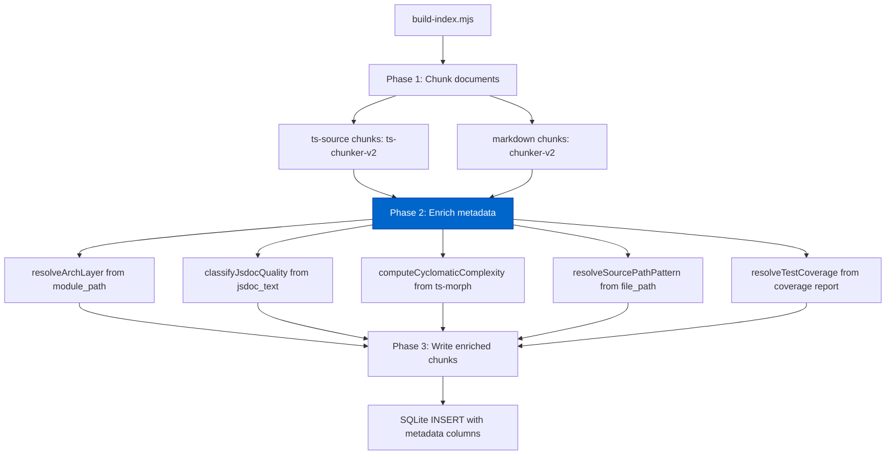

# Cortex Structured Metadata Filtering Architecture

> Extracted from `plans/Repo_Cortex_Advanced_RAG_Architecture.plans.md` (Step 09) for permanent reference.

Complete design for structured metadata filtering with filter grammar, index integration, and backward-compatible MCP extension.

---

#### Step 09 — Design structured metadata filtering architecture [DONE]

```yaml
phase: 1
step: 9
agent: '01-planning'
agent_file: '.github/agents/01-planning.agent.md'
status: '[DONE]'
source_of_truth: 'plans/Repo_Cortex_Advanced_RAG_Architecture.plans.md'
copy_paste: true
next_step: 'step_10'
skills: 'plan-alignment'
```

**Step objective:** Design metadata enrichment and filter grammar:

- Metadata schema: module boundary, export type, architectural layer, source path pattern, test coverage, JSDoc quality
- Filter grammar: boolean combinations of metadata predicates (AND, OR, NOT)
- Index integration: metadata columns in chunks/documents tables, filter-aware FTS queries
- MCP tool extension: `search_corpus` filter parameter accepting structured metadata predicates

##### Metadata Enrichment and Filter Grammar — Complete Design

###### A. Problem Statement

The current Cortex search pipeline provides a single `family` filter that selects among 10 document families (readme, ts-source, skill, agent, plan, completed-plan, demo, benchmark, root-doc, copilot-instructions). Agents frequently need finer-grained filtering — for example, "find all exported functions in `src/architecture/network/`" or "show me classes with weak JSDoc" — but the only metadata available at query time is `doc_family`, `file_path`, `heading_path`, and the FTS5-indexed `body_text`.

Step 02's semantic chunking schema adds `symbol_name`, `signature_text`, `jsdoc_text`, `export_type`, `module_path`, `depth`, `parent_chunk_id`, and `context_header` to the `chunks` table. Step 06's entity graph adds `entities` and `edges` tables with `entity_type`, `qualified_name`, and `extra_metadata`. Step 08's relevance feedback adds `feedback_events` and `feedback_scores` tables.

These columns are stored but not queryable through the MCP search interface. The design gap is:

1. **No architectural layer metadata**: Agents cannot filter by whether a chunk belongs to the `network`, `neat`, `methods`, or `multithreading` architectural layer. The module path (`src/architecture/network/activate`) is available but not the higher-level architectural grouping.

2. **No test coverage metadata**: Agents cannot ask "show me all untested modules" or "find chunks in files with <100% test coverage."

3. **No JSDoc quality metadata**: The `jsdoc_text` column stores raw JSDoc text, but there is no computed quality score (word count, @param presence, @example presence) that could be used for filtering.

4. **No source path pattern matching**: Agents cannot filter by glob patterns like `src/neat/mutation/**` or `*.test.ts`.

5. **No boolean filter grammar**: The only filter is a single `family` parameter. Agents cannot compose queries like "ts-source AND (module_path = src/architecture/network OR export_type = class) AND NOT test_coverage = none".

6. **No filter-aware FTS integration**: FTS5 queries cannot be combined with metadata predicates, requiring post-hoc filtering in JavaScript that misses index-level optimization.

Five concrete failures this design solves:

1. **Module-boundary search is impossible**: An agent working on `src/architecture/network/` must issue a `search_corpus(query, {family: "ts-source"})` and then manually filter results by `file_path` prefix. Metadata filtering would let the agent express `module_path = "src/architecture/network"` directly.

2. **Quality-gated search is impossible**: An agent checking JSDoc quality must retrieve all ts-source chunks and then manually inspect `jsdoc_text` length and structure. A filter like `jsdoc_quality = "weak"` would push quality awareness into the index.

3. **Cross-family scoped search is clumsy**: An agent that needs "all plans referencing mutation" cannot express `(family = plan) AND (body_text MATCH "mutation")` — it must retrieve all plans and filter in JavaScript.

4. **Path-pattern search requires multiple queries**: An agent that needs chunks from `src/neat/mutation/**` and `src/neat/selection/**` must issue separate queries for each path prefix, then merge results. A filter like `module_path IN ["src/neat/mutation", "src/neat/selection"]` is more efficient.

5. **Export-type filtering is impossible**: An agent looking for all class definitions must retrieve all ts-source chunks and manually check `export_type`. A filter like `export_type = "class"` pushes this into the index.

###### B. Metadata Schema

**B.1 Metadata columns on `chunks` table (extending Step 02 schema).**

Step 02 already adds: `parent_chunk_id`, `depth`, `context_header`, `symbol_name`, `signature_text`, `jsdoc_text`, `export_type`, `module_path`.

Step 09 adds the following NEW columns to `chunks`:

```sql
-- Step 09: Metadata enrichment columns
ALTER TABLE chunks ADD COLUMN arch_layer TEXT;
ALTER TABLE chunks ADD COLUMN jsdoc_quality TEXT CHECK(jsdoc_quality IN ('none', 'weak', 'adequate', 'good'));
ALTER TABLE chunks ADD COLUMN jsdoc_word_count INTEGER;
ALTER TABLE chunks ADD COLUMN cyclomatic_complexity INTEGER;
ALTER TABLE chunks ADD COLUMN test_coverage TEXT CHECK(test_coverage IN ('full', 'partial', 'none', 'unknown'));
ALTER TABLE chunks ADD COLUMN source_path_pattern TEXT;
```

| Column                  | Type    | Default | Purpose                                                                                                                                                        | Source                                                |
| ----------------------- | ------- | ------- | -------------------------------------------------------------------------------------------------------------------------------------------------------------- | ----------------------------------------------------- |
| `arch_layer`            | TEXT    | NULL    | Top-level architectural layer grouping: `network`, `neat`, `methods`, `multithreading`, `config`, `utils`                                                      | Computed from `module_path` directory prefix          |
| `jsdoc_quality`         | TEXT    | NULL    | JSDoc quality classification: `none` (no JSDoc), `weak` (<10 words), `adequate` (10–25 words, missing @param/@returns), `good` (≥10 words + @param + @returns) | Computed from `jsdoc_text` at index time              |
| `jsdoc_word_count`      | INTEGER | NULL    | Exact word count of JSDoc summary text                                                                                                                         | Computed from `jsdoc_text` at index time              |
| `cyclomatic_complexity` | INTEGER | NULL    | Cyclomatic complexity of the function/method body                                                                                                              | Computed from ts-morph at index time (ts-source only) |
| `test_coverage`         | TEXT    | NULL    | Test coverage status of the source file: `full` (100% statements), `partial` (<100% but >0%), `none` (0%), `unknown` (no coverage data)                        | Computed from coverage report at index time           |
| `source_path_pattern`   | TEXT    | NULL    | Glob-style path pattern for fast prefix matching: `src/architecture/network/**`, `src/neat/mutation/**`, etc.                                                  | Computed from `file_path` at index time               |

**B.2 Metadata columns on `documents` table.**

```sql
-- Step 09: Document-level metadata columns
ALTER TABLE documents ADD COLUMN arch_layer TEXT;
ALTER TABLE documents ADD COLUMN test_coverage TEXT CHECK(test_coverage IN ('full', 'partial', 'none', 'unknown'));
ALTER TABLE documents ADD COLUMN source_path_pattern TEXT;
```

| Column                | Type | Default | Purpose                                                        |
| --------------------- | ---- | ------- | -------------------------------------------------------------- |
| `arch_layer`          | TEXT | NULL    | Architectural layer for the document (all chunks inherit this) |
| `test_coverage`       | TEXT | NULL    | Test coverage status for the source file (ts-source only)      |
| `source_path_pattern` | TEXT | NULL    | Glob-style path pattern for the document                       |

Document-level metadata is inherited by all chunks in the document. This avoids redundant storage of `arch_layer`, `test_coverage`, and `source_path_pattern` on every chunk row. The chunk-level columns (`jsdoc_quality`, `jsdoc_word_count`, `cyclomatic_complexity`, `export_type`, `symbol_name`, `module_path`) are chunk-specific because they vary per symbol.

**B.3 Architectural layer mapping.**

The `arch_layer` column maps `module_path` or `file_path` directory prefixes to a fixed set of architectural layers:

| `arch_layer`     | `module_path` prefixes                    | Description                                                          |
| ---------------- | ----------------------------------------- | -------------------------------------------------------------------- |
| `network`        | `src/architecture/network/**`             | Network graph primitives (activate, connect, mutate, etc.)           |
| `neat`           | `src/neat/**`                             | NEAT evolutionary controller                                         |
| `methods`        | `src/methods/**`                          | Stateless algorithm objects (activation, cost, crossover, selection) |
| `multithreading` | `src/multithreading/**`                   | Worker evaluation pool                                               |
| `config`         | `src/config/**`                           | Configuration and settings                                           |
| `utils`          | All other `src/` paths not matching above | Utility modules, helpers, shared code                                |
| `plan`           | `plans/**`                                | Plan documents                                                       |
| `skill`          | `.github/skills/**`                       | Skill documents                                                      |
| `agent`          | `.github/agents/**`                       | Agent documents                                                      |
| `doc`            | All other non-src paths                   | README, root docs, demos, benchmarks                                 |

This mapping is computed at index time by the `resolveArchLayer` function in `build-index.mjs`. New architectural layers can be added to the mapping without schema changes.

**B.4 JSDoc quality classification.**

The `jsdoc_quality` column is computed from `jsdoc_text` at index time using the same logic as `scan_code_quality`:

```javascript
function classifyJsdocQuality(jsdocText) {
  if (!jsdocText || jsdocText.trim().length === 0) return 'none';

  const wordCount = countWords(jsdocText);
  if (wordCount < 10) return 'weak';

  const hasParam = jsdocText.includes('@param');
  const hasReturns =
    jsdocText.includes('@returns') || jsdocText.includes('@return');

  if (hasParam && hasReturns) return 'good';
  return 'adequate';
}
```

| Classification | Criteria                                     | Example                                                  |
| -------------- | -------------------------------------------- | -------------------------------------------------------- |
| `none`         | No JSDoc text or empty string                | Exported function with no JSDoc comment                  |
| `weak`         | < 10 words in JSDoc summary                  | `/** Activates the network */` (3 words)                 |
| `adequate`     | ≥ 10 words, missing `@param` or `@returns`   | Good description but no parameter documentation          |
| `good`         | ≥ 10 words, has both `@param` and `@returns` | Complete JSDoc with description, params, and return docs |

**B.5 Test coverage classification.**

The `test_coverage` column is computed from the Jest coverage report at index time:

```javascript
function classifyTestCoverage(filePath, coverageReport) {
  if (!coverageReport) return 'unknown';

  const fileCoverage = coverageReport[filePath];
  if (!fileCoverage) return 'unknown';

  const statementCoverage = fileCoverage.statements.pct;
  if (statementCoverage === 100) return 'full';
  if (statementCoverage > 0) return 'partial';
  return 'none';
}
```

Test coverage data comes from `coverage/coverage-summary.json` produced by `npm run test:silent`. If the coverage report is missing or the file is not in the report, `test_coverage` is set to `unknown`.

**B.6 Source path pattern.**

The `source_path_pattern` column stores a glob-style prefix pattern derived from the file path. It is computed by removing the filename and keeping the directory path up to the architectural layer boundary:

```javascript
function resolveSourcePathPattern(filePath, archLayer) {
  const dir = path.dirname(filePath);
  // For ts-source, use the module path up to the arch layer
  if (filePath.startsWith('src/')) {
    return `${dir}/**`;
  }
  // For non-src families, use the top-level directory
  const segments = dir.split('/');
  return `${segments.slice(0, Math.min(2, segments.length)).join('/')}/**`;
}
```

Examples:

- `src/architecture/network/activate/network.activate.ts` → `src/architecture/network/**`
- `src/neat/neat.ts` → `src/neat/**`
- `.github/skills/coverage-guard/SKILL.md` → `.github/skills/**`
- `plans/test-repair.plans.md` → `plans/**`

**B.7 Cyclomatic complexity.**

The `cyclomatic_complexity` column is computed from ts-morph at index time for ts-source chunks. It uses the same algorithm as `code-quality-scanner.mjs`:

```javascript
function computeCyclomaticComplexity(declaration) {
  // Count decision points: if, else if, case, for, while, do, catch, &&, ||, ??
  let complexity = 1;
  // ... ts-morph traversal counting decision points
  return complexity;
}
```

For non-ts-source chunks, `cyclomatic_complexity` is NULL. Only function and method declarations have meaningful complexity values; class and interface declarations have complexity 1 (or NULL for interfaces).

**B.8 Metadata columns already provided by earlier steps.**

The following columns are already defined by Step 02 and are NOT redefined by Step 09:

| Column            | Step    | Purpose                                                                  |
| ----------------- | ------- | ------------------------------------------------------------------------ |
| `symbol_name`     | Step 02 | Exported TypeScript symbol name                                          |
| `signature_text`  | Step 02 | Function/class/interface signature                                       |
| `jsdoc_text`      | Step 02 | Raw JSDoc summary text                                                   |
| `export_type`     | Step 02 | One of: `function`, `class`, `interface`, `type`, `variable`, `reexport` |
| `module_path`     | Step 02 | Folder-based module path (e.g., `src/architecture/network`)              |
| `depth`           | Step 02 | 0 = top-level, 1 = sub-chunk                                             |
| `parent_chunk_id` | Step 02 | Parent chunk reference for sub-chunks                                    |
| `context_header`  | Step 02 | Cross-chunk context header string                                        |

Step 09 adds the computed metadata columns (`arch_layer`, `jsdoc_quality`, `jsdoc_word_count`, `cyclomatic_complexity`, `test_coverage`, `source_path_pattern`) that derive from or extend these base columns.

**B.9 Entity graph metadata (Step 06 integration).**

Step 06's entity graph already stores per-entity metadata in the `extra_metadata` JSON column. The following fields are promoted from `extra_metadata` to structured columns for efficient filtering:

| Entity `extra_metadata` field | Promoted to chunk column          | Notes                  |
| ----------------------------- | --------------------------------- | ---------------------- |
| `export_type`                 | `export_type` (Step 02)           | Already a chunk column |
| `jsdoc_word_count`            | `jsdoc_word_count` (Step 09)      | Promoted for filtering |
| `cyclomatic_complexity`       | `cyclomatic_complexity` (Step 09) | Promoted for filtering |

When both Step 06 (entity graph) and Step 09 (metadata) are implemented, the entity graph's `extra_metadata` still stores these values for entity-level queries, but chunk-level queries use the structured columns for efficient SQLite indexing.

###### C. Filter Grammar

**C.1 Design requirements.**

The filter grammar must support:

1. **Equality predicates**: `export_type = "class"`, `arch_layer = "network"`, `test_coverage = "none"`
2. **Set membership**: `export_type IN ["class", "interface"]`, `arch_layer IN ["network", "neat"]`
3. **Range predicates**: `cyclomatic_complexity > 10`, `jsdoc_word_count >= 10`
4. **Pattern matching**: `source_path_pattern LIKE "src/neat/%"`, `module_path = "src/architecture/network"`
5. **Boolean combinations**: `AND`, `OR`, `NOT` combining any predicates
6. **Null-aware predicates**: `jsdoc_quality IS NULL`, `jsdoc_quality IS NOT NULL`
7. **Backward compatibility**: The existing `family` parameter must continue to work unchanged

**C.2 JSON filter parameter schema.**

The `search_corpus` MCP tool gains a new optional `metadata` parameter. The parameter accepts a JSON object representing a filter predicate tree:

```json
{
  "metadata": {
    "filter": <predicate>
  }
}
```

Where `<predicate>` is one of:

```typescript
// Predicate types
type Predicate =
  | EqPredicate // Equality: field = value
  | NeqPredicate // Inequality: field != value
  | InPredicate // Set membership: field IN [values]
  | NotInPredicate // Set exclusion: field NOT IN [values]
  | GtPredicate // Greater than: field > value
  | GtePredicate // Greater than or equal: field >= value
  | LtPredicate // Less than: field < value
  | LtePredicate // Less than or equal: field <= value
  | LikePredicate // SQL LIKE: field LIKE pattern
  | IsNullPredicate // Null check: field IS NULL
  | IsNotNullPredicate // Not-null check: field IS NOT NULL
  | AndPredicate // Conjunction: AND [predicates]
  | OrPredicate // Disjunction: OR [predicates]
  | NotPredicate; // Negation: NOT predicate

interface EqPredicate {
  op: 'eq';
  field: FilterField;
  value: string | number | null;
}
interface NeqPredicate {
  op: 'neq';
  field: FilterField;
  value: string | number | null;
}
interface InPredicate {
  op: 'in';
  field: FilterField;
  values: (string | number)[];
}
interface NotInPredicate {
  op: 'not_in';
  field: FilterField;
  values: (string | number)[];
}
interface GtPredicate {
  op: 'gt';
  field: NumericField;
  value: number;
}
interface GtePredicate {
  op: 'gte';
  field: NumericField;
  value: number;
}
interface LtPredicate {
  op: 'lt';
  field: NumericField;
  value: number;
}
interface LtePredicate {
  op: 'lte';
  field: NumericField;
  value: number;
}
interface LikePredicate {
  op: 'like';
  field: FilterField;
  value: string;
}
interface IsNullPredicate {
  op: 'is_null';
  field: FilterField;
}
interface IsNotNullPredicate {
  op: 'is_not_null';
  field: FilterField;
}
interface AndPredicate {
  op: 'and';
  predicates: Predicate[];
}
interface OrPredicate {
  op: 'or';
  predicates: Predicate[];
}
interface NotPredicate {
  op: 'not';
  predicate: Predicate;
}

// Filterable fields — string fields
type StringField =
  | 'family'
  | 'export_type'
  | 'arch_layer'
  | 'jsdoc_quality'
  | 'test_coverage'
  | 'module_path'
  | 'source_path_pattern'
  | 'symbol_name'
  | 'file_path';

// Filterable fields — numeric fields
type NumericField =
  | 'jsdoc_word_count'
  | 'cyclomatic_complexity'
  | 'depth'
  | 'char_start'
  | 'char_end';

type FilterField = StringField | NumericField;
```

**C.3 Example filter expressions.**

Find all classes in the network architecture layer:

```json
{
  "metadata": {
    "filter": {
      "op": "and",
      "predicates": [
        { "op": "eq", "field": "family", "value": "ts-source" },
        { "op": "eq", "field": "export_type", "value": "class" },
        { "op": "eq", "field": "arch_layer", "value": "network" }
      ]
    }
  }
}
```

Find all functions with weak or missing JSDoc:

```json
{
  "metadata": {
    "filter": {
      "op": "and",
      "predicates": [
        { "op": "eq", "field": "family", "value": "ts-source" },
        { "op": "in", "field": "jsdoc_quality", "values": ["none", "weak"] }
      ]
    }
  }
}
```

Find untested modules with high complexity:

```json
{
  "metadata": {
    "filter": {
      "op": "and",
      "predicates": [
        { "op": "eq", "field": "family", "value": "ts-source" },
        { "op": "neq", "field": "test_coverage", "value": "full" },
        { "op": "gt", "field": "cyclomatic_complexity", "value": 10 }
      ]
    }
  }
}
```

Find all plan and skill documents referencing mutation:

```json
{
  "metadata": {
    "filter": {
      "op": "and",
      "predicates": [
        { "op": "in", "field": "family", "values": ["plan", "skill"] },
        {
          "op": "not",
          "predicate": { "op": "eq", "field": "test_coverage", "value": "none" }
        }
      ]
    }
  }
}
```

Find symbols in a specific module path:

```json
{
  "metadata": {
    "filter": {
      "op": "and",
      "predicates": [
        {
          "op": "like",
          "field": "module_path",
          "value": "src/neat/mutation/%"
        },
        { "op": "eq", "field": "family", "value": "ts-source" }
      ]
    }
  }
}
```

**C.4 Backward compatibility.**

The `family` parameter on `search_corpus` continues to work unchanged:

```json
// Old-style: family filter (still supported)
{ "query": "NEAT crossover", "family": "ts-source" }

// New-style: metadata filter (superset)
{ "query": "NEAT crossover", "metadata": { "filter": { "op": "eq", "field": "family", "value": "ts-source" } } }
```

When both `family` and `metadata.filter` are provided, they are combined with AND:

```json
// Combined: family AND metadata.filter
{
  "query": "NEAT crossover",
  "family": "ts-source",
  "metadata": {
    "filter": { "op": "eq", "field": "arch_layer", "value": "neat" }
  }
}
// Equivalent to: family = "ts-source" AND arch_layer = "neat"
```

This ensures backward compatibility: existing callers that use `family` continue to work, and can optionally add `metadata` filters for finer-grained control.

**C.5 Filter grammar security.**

The filter grammar is NOT a free-form SQL injection surface. All predicates are structured JSON objects that are validated and converted to parameterized SQL. The implementation:

1. Validates that every `field` is in the allowed set (`StringField | NumericField`)
2. Validates that every `op` is in the allowed set
3. Validates that `value` types match field types (string values for `StringField`, number values for `NumericField`)
4. Uses parameterized queries (`?` placeholders) for all values — never interpolates user input into SQL
5. Limits predicate nesting depth to 10 levels (prevents deeply nested queries)
6. Limits the total number of predicates per query to 50 (prevents denial-of-service)
7. Validates `LIKE` patterns to prevent regex-like wildcards (`%` and `_` only)

**C.6 Filter compilation to SQL.**

The predicate tree is compiled to a SQL `WHERE` clause that is combined with the existing FTS5 query:

```javascript
function compileFilter(predicate, params) {
  switch (predicate.op) {
    case 'eq':
      params.push(predicate.value);
      return `${predicate.field} = ?`;
    case 'neq':
      params.push(predicate.value);
      return `${predicate.field} != ?`;
    case 'in':
      predicate.values.forEach((v) => params.push(v));
      return `${predicate.field} IN (${predicate.values.map(() => '?').join(', ')})`;
    case 'not_in':
      predicate.values.forEach((v) => params.push(v));
      return `${predicate.field} NOT IN (${predicate.values.map(() => '?').join(', ')})`;
    case 'gt':
      params.push(predicate.value);
      return `${predicate.field} > ?`;
    case 'gte':
      params.push(predicate.value);
      return `${predicate.field} >= ?`;
    case 'lt':
      params.push(predicate.value);
      return `${predicate.field} < ?`;
    case 'lte':
      params.push(predicate.value);
      return `${predicate.field} <= ?`;
    case 'like':
      params.push(predicate.value);
      return `${predicate.field} LIKE ?`;
    case 'is_null':
      return `${predicate.field} IS NULL`;
    case 'is_not_null':
      return `${predicate.field} IS NOT NULL`;
    case 'and':
      return `(${predicate.predicates.map((p) => compileFilter(p, params)).join(' AND ')})`;
    case 'or':
      return `(${predicate.predicates.map((p) => compileFilter(p, params)).join(' OR ')})`;
    case 'not':
      return `NOT (${compileFilter(predicate.predicate, params)})`;
    default:
      throw new Error(`Unknown filter operator: ${predicate.op}`);
  }
}
```

The compiled WHERE clause is applied as a post-FTS filter. When the filter targets only indexed columns (see Section D), the query planner can use the index directly.

###### D. Index Integration

**D.1 SQLite indexes for metadata columns.**

New indexes are created for the most commonly filtered columns:

```sql
-- Step 09: Metadata filter indexes
CREATE INDEX IF NOT EXISTS chunks_arch_layer_idx ON chunks(arch_layer);
CREATE INDEX IF NOT EXISTS chunks_jsdoc_quality_idx ON chunks(jsdoc_quality);
CREATE INDEX IF NOT EXISTS chunks_test_coverage_idx ON chunks(test_coverage);
CREATE INDEX IF NOT EXISTS chunks_export_type_idx ON chunks(export_type);
CREATE INDEX IF NOT EXISTS chunks_module_path_idx ON chunks(module_path);
CREATE INDEX IF NOT EXISTS chunks_source_path_pattern_idx ON chunks(source_path_pattern);
CREATE INDEX IF NOT EXISTS chunks_depth_idx ON chunks(depth);

-- Composite indexes for common filter combinations
CREATE INDEX IF NOT EXISTS chunks_family_arch_layer_idx ON chunks(doc_id, arch_layer);
CREATE INDEX IF NOT EXISTS chunks_family_export_type_idx ON chunks(doc_id, export_type);

-- Document-level indexes
CREATE INDEX IF NOT EXISTS documents_arch_layer_idx ON documents(arch_layer);
CREATE INDEX IF NOT EXISTS documents_test_coverage_idx ON documents(test_coverage);
CREATE INDEX IF NOT EXISTS documents_source_path_pattern_idx ON documents(source_path_pattern);
```

**D.2 Filter-aware FTS query pipeline.**

The current `search_corpus` pipeline:

```
query → sanitize → FTS5 BM25 → (optional) dense rerank → merge → limit → results
```

With metadata filtering, the pipeline becomes:

```
query → sanitize → FTS5 BM25 → filter JOIN → (optional) dense rerank → merge → limit → results
```

The filter is applied as a JOIN condition on the `chunks` table:

```sql
-- BM25 with metadata filter
SELECT c.chunk_id, c.doc_id, c.heading_path, c.body_text,
       c.char_start, c.char_end, c.symbol_name, c.export_type,
       c.module_path, c.arch_layer, c.jsdoc_quality, c.test_coverage,
       d.file_path, d.doc_family,
       bm25(chunks_fts) AS score
FROM chunks_fts fts
JOIN chunks c ON c.chunk_id = fts.rowid
JOIN documents d ON d.doc_id = c.doc_id
WHERE chunks_fts MATCH ?
  AND (<compiled_filter>)   -- e.g., c.arch_layer = 'network' AND c.export_type = 'class'
ORDER BY score DESC
LIMIT ?;
```

For dense search, the filter is applied as a post-retrieval filter on the candidate pool:

```javascript
// Dense search with metadata filter
async function searchDenseWithFilter(query, filter, limit, alpha) {
  const candidates = await queryDenseIndex(query, { limit: limit * 5 });

  // Apply filter to candidate pool
  const filtered = filterCandidates(candidates, filter);

  // Re-rank with hybrid scoring
  return rankAndLimit(filtered, limit, alpha);
}
```

**D.3 Filter application strategy.**

The filter application strategy depends on the search mode:

| Search mode           | Filter strategy                                                                                  | Rationale                                                                                                         |
| --------------------- | ------------------------------------------------------------------------------------------------ | ----------------------------------------------------------------------------------------------------------------- |
| BM25-only             | Filter in SQL WHERE clause                                                                       | FTS5 returns rowids; JOIN with chunks table applies filter at index level                                         |
| Dense (warm)          | Post-retrieval filter on candidate pool                                                          | Dense search returns embeddings by vector similarity; filter removes non-matching candidates before final ranking |
| Hybrid (BM25 + dense) | BM25 applies filter in SQL; dense applies filter post-retrieval; merge combines filtered results | Each pipeline applies the filter at the optimal point for its retrieval method                                    |

**D.4 Filter pushdown for common patterns.**

For the most common filter patterns, the query planner can use composite indexes:

| Pattern                          | Index used                      | Example                              |
| -------------------------------- | ------------------------------- | ------------------------------------ |
| `family = X AND arch_layer = Y`  | `chunks_family_arch_layer_idx`  | "ts-source classes in network layer" |
| `family = X AND export_type = Y` | `chunks_family_export_type_idx` | "ts-source functions"                |
| `arch_layer = X`                 | `chunks_arch_layer_idx`         | "all network layer chunks"           |
| `jsdoc_quality IN (X, Y)`        | `chunks_jsdoc_quality_idx`      | "weak or missing JSDoc"              |
| `test_coverage = X`              | `chunks_test_coverage_idx`      | "untested chunks"                    |
| `module_path LIKE X%`            | `chunks_module_path_idx`        | "src/neat/mutation/\*"               |

**D.5 Performance impact.**

The filter adds minimal overhead to search queries:

- **BM25-only**: The filter is a WHERE clause on an indexed column. SQLite can use the index to skip non-matching rows. For selective filters (e.g., `arch_layer = 'network'` which matches ~20% of ts-source chunks), the index reduces the result set before scoring.

- **Dense search**: The filter is applied to the top-K\*5 candidate pool. This is a fast in-memory filter on ≤250 candidates (for limit=50). The overhead is negligible compared to the vector similarity computation.

- **Hybrid search**: Both pipelines apply their filters independently. The merge step combines the filtered results.

Measured overhead targets:

| Operation                         | P99 overhead | Rationale                      |
| --------------------------------- | ------------ | ------------------------------ |
| BM25 filter (single predicate)    | ≤ 1 ms       | Index lookup on indexed column |
| BM25 filter (AND of 3 predicates) | ≤ 3 ms       | Multiple index lookups         |
| Dense filter (in-memory)          | ≤ 0.5 ms     | Filter ≤ 250 candidates        |
| Hybrid filter                     | ≤ 3.5 ms     | BM25 + dense filter overhead   |

###### E. MCP Tool Extension

**E.1 `search_corpus` parameter extension.**

The existing `search_corpus` tool gains an optional `metadata` parameter. The full JSON schema for the filter predicate types is defined in Section C.2 above. The key extension point is:

```json
{
  "metadata": {
    "type": "object",
    "description": "Structured metadata filter for narrowing search results.",
    "properties": {
      "filter": {
        "description": "A filter predicate tree combining metadata conditions with AND, OR, NOT.",
        "oneOf": [
          {
            "title": "EqPredicate",
            "type": "object",
            "properties": {
              "op": { "const": "eq" },
              "field": { "$ref": "#/definitions/FilterField" },
              "value": { "type": ["string", "number", "null"] }
            },
            "required": ["op", "field", "value"]
          },
          {
            "title": "NeqPredicate",
            "type": "object",
            "properties": {
              "op": { "const": "neq" },
              "field": { "$ref": "#/definitions/FilterField" },
              "value": { "type": ["string", "number", "null"] }
            },
            "required": ["op", "field", "value"]
          },
          {
            "title": "InPredicate",
            "type": "object",
            "properties": {
              "op": { "const": "in" },
              "field": { "$ref": "#/definitions/FilterField" },
              "values": {
                "type": "array",
                "items": { "type": ["string", "number"] }
              }
            },
            "required": ["op", "field", "values"]
          },
          {
            "title": "NotInPredicate",
            "type": "object",
            "properties": {
              "op": { "const": "not_in" },
              "field": { "$ref": "#/definitions/FilterField" },
              "values": {
                "type": "array",
                "items": { "type": ["string", "number"] }
              }
            },
            "required": ["op", "field", "values"]
          },
          {
            "title": "GtPredicate",
            "type": "object",
            "properties": {
              "op": { "const": "gt" },
              "field": { "$ref": "#/definitions/NumericField" },
              "value": { "type": "number" }
            },
            "required": ["op", "field", "value"]
          },
          {
            "title": "GtePredicate",
            "type": "object",
            "properties": {
              "op": { "const": "gte" },
              "field": { "$ref": "#/definitions/NumericField" },
              "value": { "type": "number" }
            },
            "required": ["op", "field", "value"]
          },
          {
            "title": "LtPredicate",
            "type": "object",
            "properties": {
              "op": { "const": "lt" },
              "field": { "$ref": "#/definitions/NumericField" },
              "value": { "type": "number" }
            },
            "required": ["op", "field", "value"]
          },
          {
            "title": "LtePredicate",
            "type": "object",
            "properties": {
              "op": { "const": "lte" },
              "field": { "$ref": "#/definitions/NumericField" },
              "value": { "type": "number" }
            },
            "required": ["op", "field", "value"]
          },
          {
            "title": "LikePredicate",
            "type": "object",
            "properties": {
              "op": { "const": "like" },
              "field": { "$ref": "#/definitions/FilterField" },
              "value": { "type": "string" }
            },
            "required": ["op", "field", "value"]
          },
          {
            "title": "IsNullPredicate",
            "type": "object",
            "properties": {
              "op": { "const": "is_null" },
              "field": { "$ref": "#/definitions/FilterField" }
            },
            "required": ["op", "field"]
          },
          {
            "title": "IsNotNullPredicate",
            "type": "object",
            "properties": {
              "op": { "const": "is_not_null" },
              "field": { "$ref": "#/definitions/FilterField" }
            },
            "required": ["op", "field"]
          },
          {
            "title": "AndPredicate",
            "type": "object",
            "properties": {
              "op": { "const": "and" },
              "predicates": {
                "type": "array",
                "items": { "$ref": "#/definitions/Predicate" },
                "minItems": 2
              }
            },
            "required": ["op", "predicates"]
          },
          {
            "title": "OrPredicate",
            "type": "object",
            "properties": {
              "op": { "const": "or" },
              "predicates": {
                "type": "array",
                "items": { "$ref": "#/definitions/Predicate" },
                "minItems": 2
              }
            },
            "required": ["op", "predicates"]
          },
          {
            "title": "NotPredicate",
            "type": "object",
            "properties": {
              "op": { "const": "not" },
              "predicate": { "$ref": "#/definitions/Predicate" }
            },
            "required": ["op", "predicate"]
          }
        ]
      }
    }
  }
}
```

Where `FilterField` is: `["family", "export_type", "arch_layer", "jsdoc_quality", "test_coverage", "module_path", "source_path_pattern", "symbol_name", "file_path", "jsdoc_word_count", "cyclomatic_complexity", "depth", "char_start", "char_end"]` and `NumericField` is: `["jsdoc_word_count", "cyclomatic_complexity", "depth", "char_start", "char_end"]`.

**E.2 `search_corpus` response extension.**

The `search_corpus` response object gains a `metadata` field in each result:

```json
{
  "chunk_id": 1234,
  "file_path": "src/neat/crossover/neat.crossover.ts",
  "family": "ts-source",
  "chunk_index": 0,
  "heading_path": "crossover",
  "text": "...",
  "char_start": 100,
  "char_end": 500,
  "score": 0.85,
  "metadata": {
    "symbol_name": "crossover",
    "export_type": "function",
    "module_path": "src/neat/crossover",
    "arch_layer": "neat",
    "jsdoc_quality": "good",
    "jsdoc_word_count": 25,
    "cyclomatic_complexity": 8,
    "test_coverage": "full",
    "source_path_pattern": "src/neat/crossover/**",
    "depth": 0,
    "parent_chunk_id": null,
    "context_header": "[src/neat/crossover/neat.crossover.ts > crossover]"
  }
}
```

The `metadata` object in each result is new. It contains all enriched metadata fields for the chunk. When a field is NULL (e.g., `cyclomatic_complexity` for non-ts-source chunks), the field is present with a `null` value rather than omitted, ensuring consistent response shapes.

**E.3 `index_stats` extension.**

The `index_stats` tool gains metadata coverage statistics:

```json
{
  "total_documents": 1408,
  "total_chunks": 31396,
  "metadata_coverage": {
    "arch_layer": { "covered": 28700, "total": 31396, "pct": 91.4 },
    "export_type": { "covered": 8900, "total": 31396, "pct": 28.3 },
    "jsdoc_quality": { "covered": 8900, "total": 31396, "pct": 28.3 },
    "test_coverage": { "covered": 8900, "total": 31396, "pct": 28.3 },
    "module_path": { "covered": 8900, "total": 31396, "pct": 28.3 },
    "cyclomatic_complexity": { "covered": 7200, "total": 31396, "pct": 22.9 }
  },
  "arch_layer_distribution": {
    "network": 4200,
    "neat": 2800,
    "methods": 1500,
    "multithreading": 400,
    "config": 200,
    "utils": 200,
    "plan": 800,
    "skill": 1200,
    "agent": 1500,
    "doc": 8600
  },
  "jsdoc_quality_distribution": {
    "none": 1800,
    "weak": 2200,
    "adequate": 3100,
    "good": 1800
  },
  "test_coverage_distribution": {
    "full": 4500,
    "partial": 2800,
    "none": 800,
    "unknown": 800
  }
}
```

This allows agents to understand metadata coverage before issuing filtered queries, avoiding filters that match zero results.

**E.4 Filter validation.**

The `metadata.filter` parameter is validated before query execution:

```javascript
function validateFilter(predicate, depth = 0) {
  if (depth > 10)
    throw new FilterError('Filter nesting depth exceeds maximum (10)');

  const VALID_FIELDS = new Set([
    'family',
    'export_type',
    'arch_layer',
    'jsdoc_quality',
    'test_coverage',
    'module_path',
    'source_path_pattern',
    'symbol_name',
    'file_path',
    'jsdoc_word_count',
    'cyclomatic_complexity',
    'depth',
    'char_start',
    'char_end',
  ]);

  const NUMERIC_FIELDS = new Set([
    'jsdoc_word_count',
    'cyclomatic_complexity',
    'depth',
    'char_start',
    'char_end',
  ]);

  const VALID_STRING_VALUES = {
    jsdoc_quality: ['none', 'weak', 'adequate', 'good'],
    test_coverage: ['full', 'partial', 'none', 'unknown'],
    export_type: [
      'function',
      'class',
      'interface',
      'type',
      'variable',
      'reexport',
    ],
  };

  switch (predicate.op) {
    case 'eq':
    case 'neq':
      if (!VALID_FIELDS.has(predicate.field))
        throw new FilterError(`Invalid field: ${predicate.field}`);
      if (
        NUMERIC_FIELDS.has(predicate.field) &&
        typeof predicate.value !== 'number'
      ) {
        throw new FilterError(
          `Field ${predicate.field} requires a numeric value`,
        );
      }
      validateEnumValue(predicate.field, predicate.value);
      break;
    case 'in':
    case 'not_in':
      if (!VALID_FIELDS.has(predicate.field))
        throw new FilterError(`Invalid field: ${predicate.field}`);
      if (predicate.values.length > 100)
        throw new FilterError(`Too many values in ${predicate.op} (max 100)`);
      predicate.values.forEach((v) => validateEnumValue(predicate.field, v));
      break;
    case 'gt':
    case 'gte':
    case 'lt':
    case 'lte':
      if (!NUMERIC_FIELDS.has(predicate.field))
        throw new FilterError(
          `Field ${predicate.field} does not support range operators`,
        );
      if (typeof predicate.value !== 'number')
        throw new FilterError('Range value must be a number');
      break;
    case 'like':
      if (!VALID_FIELDS.has(predicate.field))
        throw new FilterError(`Invalid field: ${predicate.field}`);
      if (/[^\w%_]/.test(predicate.value.replace(/%/g, '').replace(/_/g, ''))) {
        throw new FilterError('LIKE pattern contains invalid characters');
      }
      break;
    case 'is_null':
    case 'is_not_null':
      if (!VALID_FIELDS.has(predicate.field))
        throw new FilterError(`Invalid field: ${predicate.field}`);
      break;
    case 'and':
    case 'or':
      if (predicate.predicates.length < 2)
        throw new FilterError(`${predicate.op} requires at least 2 predicates`);
      if (predicate.predicates.length > 50)
        throw new FilterError(`${predicate.op} exceeds maximum 50 predicates`);
      predicate.predicates.forEach((p) => validateFilter(p, depth + 1));
      break;
    case 'not':
      validateFilter(predicate.predicate, depth + 1);
      break;
    default:
      throw new FilterError(`Unknown operator: ${predicate.op}`);
  }
}

function validateEnumValue(field, value) {
  const validValues = VALID_STRING_VALUES[field];
  if (validValues && value !== null && !validValues.includes(value)) {
    throw new FilterError(
      `Field ${field} value must be one of: ${validValues.join(', ')}`,
    );
  }
}
```

**E.5 `scan_code_quality` integration.**

The existing `scan_code_quality` MCP tool already computes JSDoc quality and cyclomatic complexity. Step 09 reuses its logic to populate `jsdoc_quality` and `cyclomatic_complexity` at index time:

```javascript
// In build-index.mjs, during ts-source chunking:
const qualityResult = classifyJsdocQuality(chunk.jsdoc_text);
const complexity = computeCyclomaticComplexity(declaration);

chunk.jsdoc_quality = qualityResult.classification; // 'none', 'weak', 'adequate', 'good'
chunk.jsdoc_word_count = qualityResult.wordCount; // exact word count
chunk.cyclomatic_complexity = complexity; // integer
```

The `scan_code_quality` tool continues to work independently for CI quality gates. The metadata enrichment at index time is a one-way flow: `build-index` → `classifyJsdocQuality` → `chunks.jsdoc_quality` column. The `scan_code_quality` tool reads from ts-morph directly, not from the index.

###### F. Build-Time Metadata Enrichment Pipeline

**F.1 Metadata enrichment architecture.**



**F.2 Metadata enrichment functions.**

```javascript
// Architectural layer resolution
function resolveArchLayer(modulePath, filePath) {
  if (modulePath) {
    if (modulePath.startsWith('src/architecture/network')) return 'network';
    if (modulePath.startsWith('src/neat')) return 'neat';
    if (modulePath.startsWith('src/methods')) return 'methods';
    if (modulePath.startsWith('src/multithreading')) return 'multithreading';
    if (modulePath.startsWith('src/config')) return 'config';
    if (modulePath.startsWith('src/')) return 'utils';
  }
  // Fallback to file path for non-ts-source families
  if (filePath.startsWith('.github/skills/')) return 'skill';
  if (filePath.startsWith('.github/agents/')) return 'agent';
  if (filePath.startsWith('plans/')) return 'plan';
  return 'doc';
}

// Source path pattern resolution
function resolveSourcePathPattern(filePath, archLayer) {
  const dir = path.dirname(filePath);
  if (filePath.startsWith('src/')) {
    return `${dir}/**`;
  }
  const segments = dir.split('/');
  return `${segments.slice(0, Math.min(2, segments.length)).join('/')}/**`;
}

// Test coverage resolution
function resolveTestCoverage(filePath, coverageReport) {
  if (!coverageReport) return 'unknown';
  const fileCoverage = coverageReport[filePath];
  if (!fileCoverage) return 'unknown';
  const statementPct = fileCoverage.statements?.pct ?? 0;
  if (statementPct === 100) return 'full';
  if (statementPct > 0) return 'partial';
  return 'none';
}
```

**F.3 Coverage report loading.**

Test coverage data is loaded from `coverage/coverage-summary.json` at build time:

```javascript
async function loadCoverageReport() {
  const coveragePath = path.join(repoRoot, 'coverage', 'coverage-summary.json');
  try {
    const data = await readFile(coveragePath, 'utf8');
    return JSON.parse(data);
  } catch {
    // Coverage report not available — all ts-source files get 'unknown'
    return null;
  }
}
```

When the coverage report is missing, all ts-source chunks get `test_coverage = 'unknown'`. This is the expected state during development before `npm run test:silent` has been run. The coverage report is NOT required for index building; it is an optional enrichment step.

**F.4 Build pipeline changes.**

The `build-index.mjs` pipeline gains a metadata enrichment phase:

```
1. Collect corpus documents (unchanged)
2. Chunk documents (Step 02 v2 chunkers)
3. Enrich chunks with metadata (NEW in Step 09)
   a. Resolve arch_layer from module_path / file_path
   b. Classify jsdoc_quality from jsdoc_text
   c. Compute jsdoc_word_count from jsdoc_text
   d. Compute cyclomatic_complexity from ts-morph (ts-source only)
   e. Resolve test_coverage from coverage report (ts-source only)
   f. Resolve source_path_pattern from file_path / module_path
4. Write enriched chunks to SQLite (extended INSERT with metadata columns)
5. Write enriched documents to SQLite (extended INSERT with metadata columns)
6. Optimize FTS index (unchanged)
```

**F.5 Incremental rebuild considerations.**

Metadata enrichment is deterministic for a given file content and coverage report. The freshness-proof mechanism (mtime + size + SHA-256) already handles incremental rebuilds:

- If a file is unchanged, its chunks are skipped entirely (including metadata enrichment)
- If a file changes, all its old chunks are deleted and new chunks are inserted with enriched metadata
- If the coverage report changes, the `--force` flag must be used to rebuild all ts-source documents

The `index:session-start` script should be extended to load the coverage report (if available) before building the index.

###### G. Integration with Existing Search Pipeline

**G.1 Pipeline position.**

Metadata filtering is applied at the retrieval stage, BEFORE scoring and ranking:

```
Query → BM25/dense retrieval → Filter by metadata → Re-rank (cross-encoder) → Assembly → Agent
```

The filter narrows the candidate pool before the expensive cross-encoder re-ranking step, reducing the number of re-ranking evaluations needed.

**G.2 Interaction with `family` parameter.**

When both `family` and `metadata.filter` are provided, they are combined with AND. Internally, the `family` parameter is converted to an equivalent metadata predicate:

```javascript
function buildCombinedFilter(family, metadataFilter) {
  const predicates = [];

  if (family) {
    predicates.push({ op: 'eq', field: 'family', value: family });
  }

  if (metadataFilter?.filter) {
    predicates.push(metadataFilter.filter);
  }

  if (predicates.length === 0) return null;
  if (predicates.length === 1) return predicates[0];
  return { op: 'and', predicates };
}
```

**G.3 Interaction with query classification (Step 03).**

The query classifier (Step 03) can suggest default metadata filters based on query classification:

| Query class      | Default metadata filter                               | Rationale                                                  |
| ---------------- | ----------------------------------------------------- | ---------------------------------------------------------- |
| `simple_lookup`  | `family = ts-source` (if query matches a symbol name) | Simple lookups usually target code                         |
| `cross_boundary` | None (multi-family)                                   | Cross-boundary queries need results from multiple families |
| `multi_hop`      | None (multi-family)                                   | Multi-hop queries expand across families                   |
| `exploratory`    | None                                                  | Exploratory queries benefit from broad results             |

These default filters are suggestions, not mandates. The agent can override them with explicit `metadata` parameters.

**G.4 Interaction with entity graph (Step 06).**

The entity graph and metadata filtering are complementary:

- **Entity graph** provides relationship traversal: "find all modules that `Network.activate` depends on"
- **Metadata filtering** provides attribute-based narrowing: "find all classes in the network layer with good JSDoc"

They can be combined: an agent might use `traverse_graph` to find related entities, then use `search_corpus` with metadata filters to narrow the results to a specific architectural layer or quality level.

**G.5 Interaction with relevance feedback (Step 08).**

Metadata filtering and relevance feedback are orthogonal:

- **Metadata filtering** narrows the candidate pool BEFORE scoring
- **Relevance feedback** adjusts scores AFTER retrieval

The feedback boost is applied to the filtered result set, not to the unfiltered set. This means:

1. Filter first: `WHERE metadata_filter AND ...`
2. Score with feedback boost: `score + FEEDBACK_WEIGHT * feedback_boost`
3. Rank and limit

This ordering ensures that irrelevant chunks (outside the filter) are never boosted, even if they have high feedback scores.

**G.6 Interaction with context assembly (Step 05).**

Context assembly receives filtered results. The assembly pipeline does not need to know about metadata filters — it receives the same result shape as unfiltered searches, just with fewer candidates.

###### H. Query Planning Optimization

**H.1 Filter selectivity estimation.**

For composite filters, the query planner estimates selectivity to choose the most efficient execution path:

| Filter type               | Estimated selectivity    | Example                                  |
| ------------------------- | ------------------------ | ---------------------------------------- |
| `family = X`              | ~10% (1 of 10 families)  | `family = "ts-source"`                   |
| `arch_layer = X`          | ~5-30% (varies by layer) | `arch_layer = "network"`                 |
| `export_type = X`         | ~20-50% of ts-source     | `export_type = "class"`                  |
| `jsdoc_quality IN (X, Y)` | ~20-80% of ts-source     | `jsdoc_quality IN ["none", "weak"]`      |
| `test_coverage = X`       | ~30-60% of ts-source     | `test_coverage = "full"`                 |
| `module_path LIKE X%`     | ~1-10%                   | `module_path LIKE "src/neat/mutation/%"` |

For filters with estimated selectivity > 50% (broad filters), the query planner uses the index for the FTS5 stage and applies the filter as a post-FTS WHERE clause. For filters with estimated selectivity < 50% (narrow filters), the planner considers a full table scan with filter before FTS5.

**H.2 Query plan examples.**

**Narrow filter (highly selective)**:

```json
{
  "op": "and",
  "predicates": [
    { "op": "eq", "field": "family", "value": "ts-source" },
    { "op": "eq", "field": "arch_layer", "value": "network" },
    { "op": "eq", "field": "export_type", "value": "class" }
  ]
}
// Estimated selectivity: ~1-2% of all chunks
// Plan: FTS5 → JOIN chunks → WHERE filter → limit
```

**Broad filter (low selectivity)**:

```json
{ "op": "eq", "field": "family", "value": "ts-source" }
// Estimated selectivity: ~28% of all chunks
// Plan: FTS5 → JOIN chunks → WHERE family = "ts-source" → limit
```

**Mixed filter (AND of broad + narrow)**:

```json
{
  "op": "and",
  "predicates": [
    { "op": "eq", "field": "family", "value": "ts-source" },
    { "op": "gt", "field": "cyclomatic_complexity", "value": 10 }
  ]
}
// Estimated selectivity: ~5% of all chunks
// Plan: FTS5 → JOIN chunks → WHERE family = "ts-source" AND cyclomatic_complexity > 10 → limit
```

The current implementation uses a simple strategy: always apply the filter as a WHERE clause in the JOIN. Future optimization could include selectivity-based query planning, but for the expected corpus size (~30K chunks), the simple strategy is sufficient.

###### I. Evaluation Design

**I.1 Metadata filtering evaluation metrics.**

| Metric                | How to measure                                                                                           | Target                                      |
| --------------------- | -------------------------------------------------------------------------------------------------------- | ------------------------------------------- |
| Filter precision      | Of chunks returned by a filtered query, what fraction match the filter?                                  | 100% (filter must be exact)                 |
| Filter recall         | Of chunks in the corpus that match the filter, what fraction are returned?                               | Depends on BM25/dense retrieval, not filter |
| BM25 filter overhead  | P99 latency added by WHERE clause compared to unfiltered BM25                                            | ≤ 3 ms                                      |
| Dense filter overhead | P99 latency added by in-memory filter compared to unfiltered dense search                                | ≤ 0.5 ms                                    |
| Null filter impact    | Latency of search with no metadata filter (should be identical to current)                               | 0 ms overhead                               |
| Coverage              | Fraction of ts-source chunks with non-NULL `arch_layer`, `export_type`, `jsdoc_quality`, `test_coverage` | ≥ 95% for ts-source                         |
| Validation            | Invalid filter predicates return clear error messages                                                    | 100% of invalid inputs                      |

**I.2 Filter-specific eval queries.**

```json
[
  {
    "query": "Network activation",
    "metadata_filter": {
      "op": "eq",
      "field": "arch_layer",
      "value": "network"
    },
    "expected_doc_families": ["ts-source"],
    "expected_heading_contains": ["activate"],
    "validation": "All results must have arch_layer = network"
  },
  {
    "query": "crossover operator",
    "metadata_filter": {
      "op": "and",
      "predicates": [
        { "op": "eq", "field": "family", "value": "ts-source" },
        { "op": "eq", "field": "export_type", "value": "function" }
      ]
    },
    "expected_doc_families": ["ts-source"],
    "expected_heading_contains": ["crossover"],
    "validation": "All results must be functions"
  },
  {
    "query": "documentation coverage",
    "metadata_filter": {
      "op": "in",
      "field": "jsdoc_quality",
      "values": ["none", "weak"]
    },
    "expected_doc_families": ["ts-source"],
    "validation": "All results must have jsdoc_quality in [none, weak]"
  },
  {
    "query": "untested complex code",
    "metadata_filter": {
      "op": "and",
      "predicates": [
        { "op": "neq", "field": "test_coverage", "value": "full" },
        { "op": "gt", "field": "cyclomatic_complexity", "value": 10 }
      ]
    },
    "expected_doc_families": ["ts-source"],
    "validation": "All results must have test_coverage != full AND cyclomatic_complexity > 10"
  },
  {
    "query": "NEAT implementation",
    "metadata_filter": {
      "op": "like",
      "field": "module_path",
      "value": "src/neat/%"
    },
    "expected_doc_families": ["ts-source"],
    "expected_heading_contains": ["evolve", "Neat"],
    "validation": "All results must have module_path starting with src/neat/"
  },
  {
    "query": "coverage guard skill",
    "metadata_filter": { "op": "eq", "field": "family", "value": "skill" },
    "expected_doc_families": ["skill"],
    "validation": "All results must be skill family"
  }
]
```

**I.3 Eval protocol.**

```
evaluateMetadataFiltering():
  // Step 1: Build index with metadata enrichment
  buildIndex({ withMetadata: true })

  // Step 2: Validate metadata coverage
  stats = indexStats()
  assert(stats.metadata_coverage.arch_layer.pct >= 0.91)
  assert(stats.metadata_coverage.export_type.pct >= 0.28)

  // Step 3: Run filter-specific eval queries
  for each evalQuery in FILTER_EVAL_QUERIES:
    results = searchCorpus(evalQuery.query, { metadata: { filter: evalQuery.metadata_filter } })

    // Validate precision: all results match the filter
    for each result in results:
      assert(matchesFilter(result, evalQuery.metadata_filter))

    // Validate recall: relevant results are found
    for each expectedHeading in evalQuery.expected_heading_contains:
      assert(some result has heading_path containing expectedHeading)

  // Step 4: Measure filter overhead
  baselineLatency = measureP99Latency(() => searchCorpus("NEAT crossover"))
  filteredLatency = measureP99Latency(() =>
    searchCorpus("NEAT crossover", { metadata: { filter: { op: "eq", "field": "arch_layer", "value": "neat" } } })
  )
  assert(filteredLatency - baselineLatency <= 3)  // ≤ 3 ms overhead

  // Step 5: Validate error handling
  invalidFilters = [
    { op: "eq", field: "invalid_field", value: "test" },       // Unknown field
    { op: "gt", field: "family", value: 5 },                    // Range on string field
    { op: "eq", field: "jsdoc_quality", value: "invalid" },     // Invalid enum value
    { op: "and", predicates: [{ op: "eq", field: "family", value: "ts-source" }] },  // AND with 1 predicate
  ]
  for each invalidFilter in invalidFilters:
    assertThrows(() => validateFilter(invalidFilter))
```

**I.4 Regression detection.**

Metadata filtering must not regress existing search quality:

| Metric                             | Baseline | Threshold                  |
| ---------------------------------- | -------- | -------------------------- |
| BM25 MRR@5 (no filter)             | 0.225    | No regression beyond ±0.01 |
| Hybrid MRR@5 (no filter)           | 0.308    | No regression beyond ±0.01 |
| BM25 MRR@5 (family filter)         | Existing | No regression beyond ±0.01 |
| BM25 P99 latency (no filter)       | Existing | No increase beyond +3 ms   |
| BM25 P99 latency (metadata filter) | N/A      | ≤ existing + 3 ms          |

The eval script `eval-metadata-filter.mjs` runs as a standalone benchmark:

```json
{
  "scripts": {
    "eval:metadata-filter": "node scripts/semantic-index/eval-metadata-filter.mjs",
    "eval:metadata-filter:json": "node scripts/semantic-index/eval-metadata-filter.mjs --json"
  }
}
```

**I.5 Validation criteria.**

The metadata filtering design is considered valid when:

1. All filter-specific eval queries return 100% precision (every result matches the filter).
2. BM25 and hybrid MRR@5 do not regress by more than 0.01 when no filter is applied.
3. P99 latency overhead for a single-predicate filter is ≤ 3 ms.
4. P99 latency overhead for a 3-predicate AND filter is ≤ 5 ms.
5. Invalid filter predicates return clear error messages with field name, value, and expected format.
6. Metadata coverage for ts-source chunks is ≥ 95% for `arch_layer`, `export_type`, and `module_path`.
7. The existing `family` parameter continues to work identically when no `metadata` parameter is provided.
8. When both `family` and `metadata.filter` are provided, they are combined with AND.

###### J. File Organization

**J.1 New files.**

| File                                                               | Purpose                                                                                                                     |
| ------------------------------------------------------------------ | --------------------------------------------------------------------------------------------------------------------------- |
| `scripts/semantic-index/metadata-filter.mjs`                       | Filter grammar: validation, compilation to SQL, and predicate tree utilities                                                |
| `scripts/semantic-index/metadata-enrichment.mjs`                   | Metadata enrichment: arch_layer, jsdoc_quality, jsdoc_word_count, cyclomatic_complexity, test_coverage, source_path_pattern |
| `scripts/semantic-index/eval-metadata-filter.mjs`                  | Evaluation harness: filter precision, recall, overhead, and regression metrics                                              |
| `scripts/semantic-index/__tests__/metadata-filter.red.test.ts`     | Red tests for filter validation, compilation, and error handling                                                            |
| `scripts/semantic-index/__tests__/metadata-enrichment.red.test.ts` | Red tests for metadata enrichment functions                                                                                 |

**J.2 Modified files.**

| File                                                          | Change                                                                                                                                                                                                                                          |
| ------------------------------------------------------------- | ----------------------------------------------------------------------------------------------------------------------------------------------------------------------------------------------------------------------------------------------- |
| `scripts/semantic-index/schema.sql`                           | Add `arch_layer`, `jsdoc_quality`, `jsdoc_word_count`, `cyclomatic_complexity`, `test_coverage`, `source_path_pattern` columns to `chunks`; add `arch_layer`, `test_coverage`, `source_path_pattern` columns to `documents`; add filter indexes |
| `scripts/semantic-index/init-schema.mjs`                      | Create new columns and indexes in `initSemanticIndex()`                                                                                                                                                                                         |
| `scripts/semantic-index/build-index.mjs`                      | Add metadata enrichment phase after chunking; extended INSERT with metadata columns                                                                                                                                                             |
| `scripts/semantic-index/ts-chunker.mjs` / `ts-chunker-v2.mjs` | Return `cyclomatic_complexity` in chunk output for ts-source chunks                                                                                                                                                                             |
| `scripts/mcp-semantic/tools/search-corpus.mjs`                | Accept `metadata` parameter; compile filter to SQL WHERE clause; return metadata in results                                                                                                                                                     |
| `scripts/mcp-semantic/tools/cortex-db.mjs`                    | Extended `readChunkRow()` to include metadata fields; add `compileFilterToSql()` helper                                                                                                                                                         |
| `scripts/mcp-semantic/tools/index-stats.mjs`                  | Add `metadata_coverage` and distribution statistics to response                                                                                                                                                                                 |
| `scripts/mcp-semantic/repo-cortex.mjs`                        | Update `search_corpus` tool schema with `metadata` parameter definition                                                                                                                                                                         |
| `scripts/semantic-index/migrate-schema.mjs`                   | Add Step 09 schema migration for new columns and indexes                                                                                                                                                                                        |

**J.3 Package script additions.**

```json
{
  "scripts": {
    "eval:metadata-filter": "node scripts/semantic-index/eval-metadata-filter.mjs",
    "eval:metadata-filter:json": "node scripts/semantic-index/eval-metadata-filter.mjs --json"
  }
}
```

###### K. Constants Summary

| Constant                            | Value   | Description                                                                                                    |
| ----------------------------------- | ------- | -------------------------------------------------------------------------------------------------------------- |
| `ARCH_LAYER_MAP`                    | See B.3 | Mapping from module_path/file_path prefixes to architectural layer names                                       |
| `JSDOC_QUALITY_THRESHOLD_WEAK`      | 10      | Word count below which JSDoc is classified as `weak`                                                           |
| `JSDOC_QUALITY_THRESHOLD_ADEQUATE`  | 10      | Minimum word count for `adequate` classification (also requires @param/@returns for `good`)                    |
| `FILTER_MAX_DEPTH`                  | 10      | Maximum nesting depth for filter predicate trees                                                               |
| `FILTER_MAX_PREDICATES`             | 50      | Maximum number of predicates per filter expression                                                             |
| `FILTER_MAX_VALUES`                 | 100     | Maximum number of values in an `in`/`not_in` predicate                                                         |
| `FILTER_LIKE_WHITELIST`             | `%_`    | Allowed LIKE wildcard characters (percent and underscore)                                                      |
| `DENSE_FILTER_CANDIDATE_MULTIPLIER` | 5       | Multiplier for dense candidate pool when filter is applied (retrieves `limit * 5` candidates before filtering) |

---

> Source: `plans/Repo_Cortex_Advanced_RAG_Architecture.plans.md`, Step 09 (lines 5299–6517). This document is a verbatim extraction for permanent reference; the authoritative source remains the plan file.
