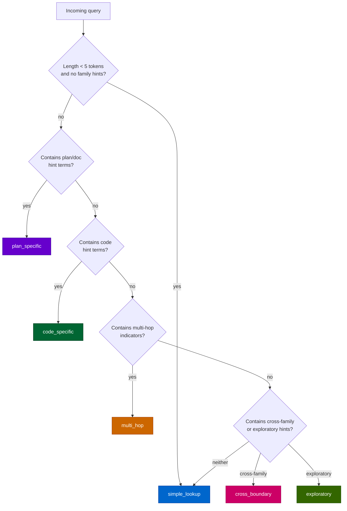

# Cortex Query Classification and Routing Architecture

> Extracted from `plans/Repo_Cortex_Advanced_RAG_Architecture.plans.md` (Step 03) for permanent reference.

Design for query intent classification with routing to appropriate retrieval strategies.

#### Step 03 — Design query classification and routing architecture [DONE]

```yaml
phase: 1
step: 3
agent: '01-planning'
agent_file: '.github/agents/01-planning.agent.md'
status: '[DONE]'
source_of_truth: 'plans/Repo_Cortex_Advanced_RAG_Architecture.plans.md'
copy_paste: true
next_step: 'step_04'
skills: 'plan-alignment'
```

**Step objective:** Design query intent classification with routing:

- Query taxonomy: simple lookup, cross-boundary, multi-hop, exploratory, code-specific, plan-specific
- Classification method: rule-based (keyword patterns, query length, family hints) + optional local classifier
- Routing map: each query class → optimal retrieval strategy (BM25-heavy, dense-heavy, multi-hop, expanded)
- Alpha adaptation: per-class default alpha values with override capability

---

> **Source:** `plans/Repo_Cortex_Advanced_RAG_Architecture.plans.md`, lines 1065–1084.
> **Extracted:** 2026-06-08. Content preserved verbatim for permanent reference.

> **Note:** The original Step 03 extraction was a brief objective with four bullet points. This document has been expanded to provide the same architectural depth (Sections A–K) as the other design documents in this directory (Steps 02, 04–11). The step YAML header and objective above remain verbatim; everything below is the expanded design.

---

##### Query Classification and Routing Architecture — Complete Design

###### A. Problem Statement

The current Cortex search pipeline uses a single retrieval strategy for all queries: hybrid BM25+dense ranking with a fixed `alpha=0.5`. This one-size-fits-all approach is suboptimal because different query intents benefit from different BM25/dense blend weights, family filters, and result expansion strategies.

**Baseline performance with fixed alpha=0.5:**

| Metric                                 | BM25-only  | Hybrid (α=0.5) |
| -------------------------------------- | ---------- | -------------- |
| MRR@5 (20-query eval set)              | 0.225      | 0.308          |
| Queries with 0 MRR@5 (complete misses) | 7/20 (35%) | 8/20 (40%)     |

**Why fixed alpha fails:**

1. **Simple keyword lookups** (e.g., `"Network.activate"`) are best served by BM25-heavy retrieval (α=0.7–0.8). Dense embeddings dilute exact-symbol matches with semantic neighbors that are relevant but not what the user asked for. At α=0.5, these queries often retrieve semantically related but symbolically wrong chunks.

2. **Exploratory queries** (e.g., `"how does the training pipeline work"`) benefit from dense-heavy retrieval (α=0.3) because the user is asking for conceptual overview, not a specific symbol. At α=0.5, BM25 matches on individual pipeline terms may surface low-level implementation details instead of the architectural overview the user needs.

3. **Cross-boundary queries** (e.g., `"how does NEAT evolve use speciation"`) need multi-family expansion — retrieving from both `ts-source` and `readme` families to connect concepts across module boundaries. Fixed alpha with no family filter cannot express this intent.

4. **Complete misses**: 8/20 hybrid queries score 0 MRR@5, meaning the most relevant chunk is not in the top 5 at all. Per-class alpha tuning and family filtering can recover many of these misses by steering retrieval toward the right result pool.

**The core insight**: Query classification and per-class routing can improve MRR@5 by selecting retrieval parameters optimized for each intent category, rather than accepting a single compromise configuration for all queries.

###### B. Query Taxonomy

The classification system defines six mutually exclusive query classes. Each class maps to a distinct retrieval strategy (Section D) and default alpha (Section E).

**B.1 Class definitions.**

| Class            | Intent                                                | Typical patterns                             | Example queries                                                                                                                                            |
| ---------------- | ----------------------------------------------------- | -------------------------------------------- | ---------------------------------------------------------------------------------------------------------------------------------------------------------- |
| `simple_lookup`  | Find a specific symbol, file, or concept by name      | Short keyword queries, symbol references     | `"Network.activate"`, `"mutate add node"`, `"NEAT.evolve"`                                                                                                 |
| `cross_boundary` | Connect concepts across multiple corpus families      | Queries spanning two or more concept domains | `"how does the NEAT evolve method use speciation"`, `"relationship between crossover and mutation"`                                                        |
| `multi_hop`      | Require iterative retrieval across multiple documents | Queries with multi-step reasoning chains     | `"what functions call Network.activate that also use the slab fast path"`, `"which mutation operators affect connection genes and are used by speciation"` |
| `exploratory`    | Broad overview of a system or concept                 | Open-ended "how does" or "explain" queries   | `"how does the training pipeline work"`, `"explain the NEAT algorithm"`, `"overview of activation methods"`                                                |
| `code_specific`  | Target TypeScript source code implementation          | Queries seeking implementation details       | `"implementation of crossover in NEAT"`, `"code for Network.connect"`, `"TypeScript source for mutate method"`                                             |
| `plan_specific`  | Target plan or documentation families                 | Queries about design decisions, roadmaps     | `"what is the checkpointing design"`, `"plan for semantic chunking"`, `"architecture decisions for context assembly"`                                      |

**B.2 Class decision boundaries.**

The taxonomy is hierarchical in classification priority:



The priority order ensures that ambiguous queries are resolved consistently:

1. **Length check first**: Very short queries are almost always simple lookups.
2. **Family-specific next**: Plan and code queries have distinctive vocabulary.
3. **Structural indicators next**: Multi-hop and cross-boundary queries have distinctive connective patterns.
4. **Exploratory as the broadest net**: "How does" and "explain" patterns that don't match more specific classes default to exploratory.
5. **Fallback to simple_lookup**: Anything that doesn't match falls back to simple_lookup with α=0.5.

###### C. Classification Method

The classifier is rule-based, using keyword patterns, query length, and structural indicators. No ML model is required (ML-based classification is explicitly out of scope — see Section J).

**C.1 Classification algorithm.**

```javascript
/**
 * Classify a query into one of six intent classes.
 *
 * @param {string} query - The raw query string.
 * @returns {{ query_class: string, confidence: number, hints: object }}
 *   query_class: one of 'simple_lookup', 'cross_boundary', 'multi_hop',
 *                'exploratory', 'code_specific', 'plan_specific'.
 *   confidence: 0–1, how certain the classifier is.
 *   hints: classification hints for routing (alpha override, family filter, etc.).
 */
function classifyQuery(query) {
  const tokens = query.trim().split(/\s+/);
  const normalizedQuery = query.toLowerCase();

  // C.1.1 Length heuristic: short queries → simple_lookup
  if (tokens.length < 5 && !hasFamilyHints(normalizedQuery)) {
    return {
      query_class: 'simple_lookup',
      confidence: 0.9,
      hints: { short_query: true },
    };
  }

  // C.1.2 Plan-specific detection
  if (hasPlanHints(normalizedQuery)) {
    return {
      query_class: 'plan_specific',
      confidence: 0.85,
      hints: { family_filter: 'plan,completed-plan' },
    };
  }

  // C.1.3 Code-specific detection
  if (hasCodeHints(normalizedQuery)) {
    return {
      query_class: 'code_specific',
      confidence: 0.8,
      hints: { family_filter: 'ts-source' },
    };
  }

  // C.1.4 Multi-hop detection
  if (hasMultiHopIndicators(normalizedQuery)) {
    return {
      query_class: 'multi_hop',
      confidence: 0.75,
      hints: { multi_hop: true },
    };
  }

  // C.1.5 Cross-boundary detection
  if (hasCrossFamilyIndicators(normalizedQuery)) {
    return {
      query_class: 'cross_boundary',
      confidence: 0.7,
      hints: { multi_family: true },
    };
  }

  // C.1.6 Exploratory detection
  if (hasExploratoryHints(normalizedQuery)) {
    return {
      query_class: 'exploratory',
      confidence: 0.65,
      hints: { broad_retrieval: true },
    };
  }

  // C.1.7 Fallback: simple_lookup
  return {
    query_class: 'simple_lookup',
    confidence: 0.5,
    hints: { fallback: true },
  };
}
```

**C.2 Pattern detection functions.**

| Function                   | Pattern triggers                                                                                                                                                                  | Example matches                                                                                           |
| -------------------------- | --------------------------------------------------------------------------------------------------------------------------------------------------------------------------------- | --------------------------------------------------------------------------------------------------------- |
| `hasPlanHints`             | `"plan"`, `"design"`, `"architecture"`, `"roadmap"`, `"decision"`, `"specification"`                                                                                              | `"what is the checkpointing design"`, `"plan for semantic chunking"`                                      |
| `hasCodeHints`             | `"implementation"`, `"code for"`, `"source of"`, `"TypeScript"`, `"implement"`, `"function body"`                                                                                 | `"implementation of crossover in NEAT"`, `"TypeScript source for mutate"`                                 |
| `hasMultiHopIndicators`    | `"that also"`, `"which also"`, `"and then"`, `"call.*that"`, `"where.*also"`                                                                                                      | `"functions that call activate and also use slab"`, `"which speciation method also uses fitness sharing"` |
| `hasCrossFamilyIndicators` | Queries mentioning ≥2 concept domains from different corpus families (detected via concept-bridge terms like `"relationship"`, `"connection"`, `"between"`, `"how does X use Y"`) | `"how does NEAT evolve use speciation"`, `"relationship between crossover and mutation"`                  |
| `hasExploratoryHints`      | `"how does"`, `"explain"`, `"overview"`, `"describe"`, `"what is"`, `"tell me about"`, `"how do"`                                                                                 | `"how does the training pipeline work"`, `"explain the NEAT algorithm"`                                   |
| `hasFamilyHints`           | Any of the above family-specific patterns                                                                                                                                         | Used to prevent short queries with family hints from falling into `simple_lookup`                         |

**C.3 Confidence scoring.**

Each classification returns a confidence score (0–1). Confidence reflects how strongly the pattern matched:

| Classification trigger                         | Confidence | Rationale                                                                         |
| ---------------------------------------------- | ---------- | --------------------------------------------------------------------------------- |
| Length heuristic (< 5 tokens, no family hints) | 0.9        | Very strong signal — short queries are almost always lookups                      |
| Plan-family keywords                           | 0.85       | Strong signal — plan-specific vocabulary is distinctive                           |
| Code-family keywords                           | 0.80       | Strong signal — code-specific vocabulary is distinctive                           |
| Multi-hop indicators                           | 0.75       | Moderate signal — multi-hop connective patterns are reliable but less distinctive |
| Cross-family indicators                        | 0.70       | Moderate signal — cross-boundary queries may also be exploratory                  |
| Exploratory keywords                           | 0.65       | Weaker signal — "how does" can also appear in cross-boundary queries              |
| Fallback (no match)                            | 0.50       | No pattern matched; defaulting to simple_lookup                                   |

**C.4 Pattern precedence and conflict resolution.**

When multiple patterns match, the classifier uses the priority order defined in B.2:

1. **Length check** is evaluated first. A 3-token query like `"NEAT evolve"` will be classified as `simple_lookup` even if it contains a concept that could be exploratory.
2. **Family-specific patterns** (plan, code) take priority over structural patterns (multi-hop, cross-boundary).
3. **Multi-hop indicators** take priority over cross-boundary because multi-hop queries are a stricter subset (they require iterative retrieval, not just cross-family expansion).
4. **Cross-boundary** takes priority over exploratory because cross-boundary queries benefit from family expansion, while exploratory queries benefit from dense-heavy retrieval without family filtering.

This precedence ensures that the most actionable classification wins. A query like `"how does NEAT evolve use speciation"` could match both cross-boundary and exploratory, but the cross-boundary classification produces a more specific routing strategy.

**C.5 Classification in `search_corpus` (lightweight mode).**

For the `search_corpus` MCP tool, classification can run as a lightweight pre-processing step that only adjusts `alpha` and suggests a `family` filter. The full classification pipeline (Section F) is available for `search_advanced`, but `search_corpus` benefits from even a minimal classification:

```
classifyForSearchCorpus(query):
  result = classifyQuery(query)
  routing = ROUTING_TABLE[result.query_class]
  return {
    alpha: routing.alpha,
    family: routing.family ?? null,
  }
```

This allows `search_corpus` to use per-class alpha without requiring the caller to know about classification.

###### D. Routing Map

Each query class maps to a specific retrieval strategy that controls alpha, family filtering, result expansion, and post-processing.

**D.1 Routing table.**

| Class            | Alpha | Family filter         | Expansion              | Post-processing         | Rationale                                                                                    |
| ---------------- | ----- | --------------------- | ---------------------- | ----------------------- | -------------------------------------------------------------------------------------------- |
| `simple_lookup`  | 0.75  | None (all families)   | None                   | Default top-K           | BM25-heavy for exact symbol matches; dense component is supplementary                        |
| `cross_boundary` | 0.50  | None (multi-family)   | Multi-family expansion | Cross-family dedup      | Balanced hybrid; multi-family expansion retrieves from all relevant families                 |
| `multi_hop`      | 0.35  | None (all families)   | Entity graph traversal | Hop decay scoring       | Dense-heavy to find semantically related starting points; entity graph for hop traversal     |
| `exploratory`    | 0.30  | None (all families)   | Context assembly       | Budget-managed assembly | Dense-heavy for conceptual overview; context assembly assembles coherent multi-source window |
| `code_specific`  | 0.70  | `ts-source`           | None                   | Default top-K           | BM25-heavy with source-family filter to exclude documentation noise                          |
| `plan_specific`  | 0.70  | `plan,completed-plan` | None                   | Default top-K           | BM25-heavy with plan-family filter to target design documents                                |

**D.2 Alpha justification per class.**

- **simple_lookup (α=0.75)**: BM25 excels at exact keyword matching. The user typed `"Network.activate"` and wants the exact method, not semantically similar activation patterns. A 75/25 BM25/dense blend preserves keyword precision while allowing the dense component to break ties between similarly-named symbols.

- **cross_boundary (α=0.50)**: Cross-boundary queries benefit equally from keyword matching (to find the specific concepts mentioned) and semantic similarity (to find conceptually related content across families). The balanced 50/50 blend ensures both signals contribute.

- **multi_hop (α=0.35)**: Dense-heavy retrieval is preferred for multi-hop starting points because the first hop needs to find conceptually related entities, not exact keyword matches. Subsequent hops traverse the entity graph (Step 07), which is a separate mechanism that doesn't depend on BM25 at all.

- **exploratory (α=0.30)**: Exploratory queries seek conceptual overview, which is exactly what dense embeddings capture best. BM25 matches on individual terms may surface low-level details instead of the architectural overview the user needs.

- **code_specific (α=0.70)**: When the user asks for "implementation of crossover," they want the TypeScript source code, not a README explanation. BM25-heavy retrieval with a family filter that excludes everything except `ts-source` gives the most relevant results.

- **plan_specific (α=0.70)**: Plan and design documents use precise terminology that BM25 matches well. A family filter to `plan` and `completed-plan` families excludes source code noise.

**D.3 Family filter mechanism.**

The family filter is applied at the SQL level in the BM25 search and as a post-filter on dense results:

```sql
-- BM25 query with family filter (for code_specific)
SELECT chunk_id, file_path, family, heading_path, body_text, rank
FROM chunks_fts
WHERE chunks_fts MATCH ?
  AND family = 'ts-source'
ORDER BY rank
LIMIT ?;
```

For classes without a family filter (`simple_lookup`, `cross_boundary`, `multi_hop`, `exploratory`), all families are included in retrieval.

**D.4 Multi-family expansion for cross_boundary.**

Cross-boundary queries benefit from explicitly expanding results across multiple families. After the initial hybrid ranking, the expansion step ensures at least 2 results from each represented family in the top-K:

```
expandMultiFamily(results, minPerFamily = 2):
  families = groupBy(results, r => r.family)
  expanded = [...results]

  for family of Object.keys(families):
    if families[family].length < minPerFamily:
      // Retrieve additional results from this family
      additional = searchCorpus({
        query: query,
        family: family,
        limit: minPerFamily - families[family].length,
      })
      expanded.push(...additional)

  return rankHybridResults(expanded, alpha)
```

This ensures cross-boundary queries receive representative results from all relevant families, not just the dominant family.

###### E. Alpha Adaptation Algorithm

The alpha adaptation algorithm computes the BM25/dense blend weight based on the classified query class, with optional user override.

**E.1 Pseudocode.**

```javascript
/**
 * Classify a query and compute the optimal retrieval strategy.
 *
 * @param {string} query - The raw query string.
 * @param {object} [classification_hints] - Optional overrides from the caller.
 * @param {number} [classification_hints.alpha] - User-specified alpha override.
 * @param {string} [classification_hints.family] - User-specified family filter override.
 * @returns {{ query_class: string, alpha: number, strategy: object }}
 */
function classifyAndRoute(query, classification_hints) {
  const classification = classifyQuery(query);

  // E.1.1 Default alpha per class
  const DEFAULTS = Object.freeze({
    simple_lookup: 0.75,
    cross_boundary: 0.5,
    multi_hop: 0.35,
    exploratory: 0.3,
    code_specific: 0.7,
    plan_specific: 0.7,
  });

  // E.1.2 Routing strategies per class
  const ROUTING = Object.freeze({
    simple_lookup: {
      family: null,
      expansion: 'none',
      post_processing: 'default',
    },
    cross_boundary: {
      family: null,
      expansion: 'multi_family',
      post_processing: 'cross_family_dedup',
    },
    multi_hop: {
      family: null,
      expansion: 'entity_graph',
      post_processing: 'hop_decay',
    },
    exploratory: {
      family: null,
      expansion: 'context_assembly',
      post_processing: 'budget_assembly',
    },
    code_specific: {
      family: 'ts-source',
      expansion: 'none',
      post_processing: 'default',
    },
    plan_specific: {
      family: 'plan,completed-plan',
      expansion: 'none',
      post_processing: 'default',
    },
  });

  // E.1.3 Compute alpha
  let alpha = DEFAULTS[classification.query_class] ?? 0.5;

  // E.1.4 User override takes precedence
  if (classification_hints?.alpha !== undefined) {
    alpha = classification_hints.alpha;
  }

  // E.1.5 Build strategy
  const strategy = { ...ROUTING[classification.query_class] };

  // E.1.6 User family override takes precedence
  if (classification_hints?.family !== undefined) {
    strategy.family = classification_hints.family;
  }

  return {
    query_class: classification.query_class,
    confidence: classification.confidence,
    alpha,
    strategy,
  };
}
```

**E.2 Alpha range constraints.**

Alpha is always clamped to [0.0, 1.0]:

- α = 1.0: Pure BM25 (keyword-only)
- α = 0.0: Pure dense (semantic-only)
- α = 0.5: Balanced hybrid

The default alpha values per class are chosen within the [0.3, 0.75] range. Values outside this range produce extreme retrieval behavior that is rarely useful:

- α < 0.2: Dense dominance ignores exact keyword matches, even when the user typed a specific symbol
- α > 0.8: BM25 dominance ignores semantic similarity, even when the user asked a conceptual question

**E.3 Fallback alpha.**

When classification confidence is below the threshold (see Section K), the system falls back to α=0.5 (balanced hybrid), which is the current fixed-alpha behavior. This ensures graceful degradation.

###### F. Integration with search_advanced

The `search_advanced` pipeline extends `search_corpus` with classification-driven parameter selection. Classification is a pre-processing step that runs before hybrid ranking.

**F.1 Pipeline position.**

```
Query → classifyAndRoute(query) → searchCorpus(query, alpha, family) → [Cross-Encoder] → [Assembly]
```

Classification is the FIRST step. It determines `alpha` and `family` before any retrieval happens.

**F.2 Parameter flow.**

```mermaid
flowchart LR
    Q[User query] --> C[classifyAndRoute]
    C -->|alpha, family, query_class| S[searchCorpus]
    S -->|ranked results| R{use_rerank?}
    R -- no --> A[Return results]
    R -- yes --> CE[Cross-encoder rerank]
    CE --> A
    A -->{use_assembly?}
    A -- yes --> ASM[assembleContext]
    ASM --> OUT[Return assembled context]
    A -- no --> OUT2[Return ranked results]

    style C fill:#0066cc,stroke:#003399,color:#fff
    style S fill:#0066cc,stroke:#003399,color:#fff
    style CE fill:#6600cc,stroke:#330099,color:#fff
    style ASM fill:#336600,stroke:#194d00,color:#fff
```

**F.3 Classification result passed to search_corpus.**

The `search_corpus` MCP tool gains optional parameters for classification-driven retrieval:

```json
{
  "type": "object",
  "properties": {
    "query": { "type": "string" },
    "limit": { "type": "number" },
    "family": { "type": "string" },
    "use_dense": { "type": "boolean" },
    "alpha": { "type": "number" },
    "use_rerank": { "type": "boolean" },
    "rerank_candidates_count": { "type": "number" },
    "query_class": {
      "type": "string",
      "description": "Override query classification. One of: simple_lookup, cross_boundary, multi_hop, exploratory, code_specific, plan_specific. When provided, alpha and family are set from the routing table unless explicitly overridden.",
      "enum": [
        "simple_lookup",
        "cross_boundary",
        "multi_hop",
        "exploratory",
        "code_specific",
        "plan_specific"
      ]
    },
    "classification_hints": {
      "type": "object",
      "description": "Optional classification overrides. When provided, these take precedence over automatic classification.",
      "properties": {
        "alpha": { "type": "number" },
        "family": { "type": "string" }
      }
    }
  },
  "required": ["query"]
}
```

**F.4 Classification in search_corpus for lightweight mode.**

When `query_class` is not provided by the caller, `search_corpus` runs the lightweight classifier internally:

```javascript
async function searchCorpus(options) {
  // F.4.1 Determine alpha and family
  let alpha = options.alpha ?? 0.5;
  let family = options.family ?? null;

  if (options.query_class) {
    // Explicit class from caller
    const routing = classifyAndRoute(
      options.query,
      options.classification_hints,
    );
    alpha = options.alpha ?? routing.alpha;
    family = options.family ?? routing.strategy.family;
  } else if (options.alpha === undefined) {
    // No explicit alpha and no explicit class → lightweight classification
    const routing = classifyForSearchCorpus(options.query);
    alpha = routing.alpha;
    family = routing.family;
  }
  // else: caller provided explicit alpha → respect it, no classification

  // ... proceed with hybrid search using computed alpha and family
}
```

**F.5 search_advanced integration.**

The `search_advanced` tool (when implemented) will provide full classification metadata:

```json
{
  "query": "how does NEAT evolve use speciation",
  "query_class": "cross_boundary",
  "confidence": 0.70,
  "alpha_used": 0.50,
  "family_filter": null,
  "strategy": {
    "family": null,
    "expansion": "multi_family",
    "post_processing": "cross_family_dedup"
  },
  "results": [...],
  "classification_hints_applied": false
}
```

This metadata allows agents and operators to understand what classification was applied and whether to override it.

###### G. File Organization

**G.1 New files.**

| File                                             | Purpose                                       |
| ------------------------------------------------ | --------------------------------------------- |
| `scripts/semantic-index/classify-query.mjs`      | Rule-based query classifier (Section C)       |
| `scripts/semantic-index/routing-table.mjs`       | Class-to-strategy mapping (Section D)         |
| `scripts/semantic-index/eval-classification.mjs` | Evaluation runner for classification accuracy |

**G.2 Modified files.**

| File                                           | Change                                                                                        |
| ---------------------------------------------- | --------------------------------------------------------------------------------------------- |
| `scripts/mcp-semantic/tools/search-corpus.mjs` | Add `query_class` and `classification_hints` parameters; integrate lightweight classification |
| `scripts/semantic-index/hybrid-rank.mjs`       | Accept `family` filter parameter for BM25 and dense post-filtering                            |

**G.3 Test files.**

| File                                                          | Purpose                            |
| ------------------------------------------------------------- | ---------------------------------- |
| `scripts/semantic-index/__tests__/classify-query.red.test.ts` | Red tests for query classification |
| `scripts/semantic-index/__tests__/routing-table.red.test.ts`  | Red tests for routing table lookup |

**G.4 No changes to existing search pipeline behavior.**

When `query_class` and `classification_hints` are not provided, `search_corpus` behaves identically to its current behavior (fixed α=0.5, no family filter). Classification is opt-in via parameter or lightweight auto-classification.

###### H. Evaluation Design

**H.1 Classification evaluation queries.**

The evaluation uses a curated set of 12 queries, 2 per major class pair, with ground-truth classifications:

| #   | Query                                                                           | Expected class   | Rationale                      |
| --- | ------------------------------------------------------------------------------- | ---------------- | ------------------------------ |
| 1   | `"Network.activate"`                                                            | `simple_lookup`  | Short symbol reference         |
| 2   | `"mutate add node"`                                                             | `simple_lookup`  | Short keyword query            |
| 3   | `"how does the NEAT evolve method use speciation"`                              | `cross_boundary` | Cross-family concept bridge    |
| 4   | `"relationship between crossover and mutation"`                                 | `cross_boundary` | Multi-concept query            |
| 5   | `"what functions call Network.activate that also use the slab fast path"`       | `multi_hop`      | Multi-hop iterative retrieval  |
| 6   | `"which mutation operators affect connection genes and are used by speciation"` | `multi_hop`      | Chain of conditions            |
| 7   | `"how does the training pipeline work"`                                         | `exploratory`    | Broad conceptual overview      |
| 8   | `"explain the NEAT algorithm"`                                                  | `exploratory`    | Open-ended explanation request |
| 9   | `"implementation of crossover in NEAT"`                                         | `code_specific`  | Source code target             |
| 10  | `"TypeScript source for Network.connect"`                                       | `code_specific`  | Explicit code target           |
| 11  | `"what is the checkpointing design"`                                            | `plan_specific`  | Plan document target           |
| 12  | `"architecture decisions for context assembly"`                                 | `plan_specific`  | Architecture document target   |

**H.2 Classification accuracy metric.**

$$\text{Accuracy} = \frac{\text{correct\_classifications}}{\text{total\_queries}}$$

Target: ≥ 10/12 (83.3%) classification accuracy on the eval set. Misclassifications between adjacent classes (e.g., `cross_boundary` vs. `exploratory`) are considered partial credit (0.5 accuracy).

**H.3 Routing effectiveness metric.**

Per-class alpha must improve MRR@5 over fixed α=0.5 for the majority of queries in that class:

| Class            | Target MRR@5 improvement                   |
| ---------------- | ------------------------------------------ |
| `simple_lookup`  | ≥ +0.05 absolute MRR@5 over α=0.5 baseline |
| `cross_boundary` | ≥ +0.03 absolute MRR@5 over α=0.5 baseline |
| `code_specific`  | ≥ +0.05 absolute MRR@5 over α=0.5 baseline |
| `plan_specific`  | ≥ +0.05 absolute MRR@5 over α=0.5 baseline |

`multi_hop` and `exploratory` classes are harder to evaluate with MRR@5 alone because their benefit comes from result expansion and context assembly rather than pure ranking. These classes are evaluated with nDCG@5 and human judgment instead.

**H.4 Regression thresholds.**

- Per-class alpha must not regress MRR@5 by more than 0.03 compared to fixed α=0.5
- Overall MRR@5 across all 12 queries must not regress below 0.308 (current hybrid baseline)
- Classification latency must add < 5 ms to total query time (rule-based classification is expected to be < 1 ms)

**H.5 Evaluation runner.**

`eval-classification.mjs` runs three evaluations:

1. **Classification accuracy**: Run `classifyQuery` on each eval query, compare to ground truth, compute accuracy.
2. **Routing effectiveness**: For each eval query, run `searchCorpus` with per-class alpha and with fixed α=0.5, compare MRR@5.
3. **Latency**: Measure classification + searchCorpus time, confirm < 5 ms overhead.

```bash
node scripts/semantic-index/eval-classification.mjs --json
```

Output format:

```json
{
  "classification_accuracy": 0.833,
  "routing_effectiveness": {
    "simple_lookup": {
      "per_class_mrr": 0.45,
      "baseline_mrr": 0.35,
      "improvement": 0.1
    },
    "cross_boundary": {
      "per_class_mrr": 0.4,
      "baseline_mrr": 0.35,
      "improvement": 0.05
    }
  },
  "overall_mrr": 0.34,
  "baseline_mrr": 0.308,
  "classification_latency_ms": 0.3,
  "passed": true
}
```

###### I. Schema Changes

**I.1 New table: `classification_logs`.**

A `classification_logs` table stores per-query classification results for feedback analysis and future classifier improvement (ML-based classification is out of scope for Phase 1, but logging enables future data collection).

```sql
CREATE TABLE IF NOT EXISTS classification_logs (
  id INTEGER PRIMARY KEY AUTOINCREMENT,
  query_text TEXT NOT NULL,
  query_class TEXT NOT NULL,
  confidence REAL NOT NULL,
  alpha_used REAL NOT NULL,
  family_filter TEXT,
  created_at TEXT NOT NULL DEFAULT (datetime('now'))
);

CREATE INDEX idx_classification_logs_query_class
  ON classification_logs(query_class);

CREATE INDEX idx_classification_logs_created_at
  ON classification_logs(created_at);
```

**I.2 Schema impact on existing tables.**

No changes to the existing `chunks`, `embeddings`, or `chunk_metadata` tables. Classification is a query-time computation that does not modify the corpus index.

**I.3 Logging contract.**

- Classification logging is **opt-in**. By default, `classifyQuery` does not write to `classification_logs`. The caller must pass `{ log_classification: true }` to enable logging.
- Logged classifications are used exclusively for evaluation and future classifier improvement. They are not used at query time.
- The `classification_logs` table is append-only. No deletions or updates.

###### J. Constraints and Non-Goals

**Constraints:**

1. **Rule-based only**: The Phase 1 classifier uses keyword patterns, query length, and structural indicators. No ML model is trained or deployed for classification.

2. **Local-first**: Classification runs entirely in-process. No external API calls, no model downloads, no network dependencies.

3. **No schema changes to corpus or embeddings databases**: The `classification_logs` table is a separate database (or separate table in `semantic-index.sqlite`). The corpus and embeddings databases are not modified.

4. **Backward compatible**: `search_corpus` without `query_class` or `classification_hints` behaves identically to its current behavior (fixed α=0.5, no family filter).

5. **Latency budget**: Classification must add < 5 ms to total query time. Rule-based classification with string matching is expected to be < 1 ms.

6. **Stateless classification**: `classifyQuery` is a pure function. It reads no state from the database and has no side effects (unless logging is enabled).

**Non-goals:**

1. **ML-based classifier**: Training a local classifier (e.g., fasttext, logistic regression) is out of scope for Phase 1. The rule-based classifier provides a functional baseline. ML classification can be explored once sufficient `classification_logs` data is collected.

2. **Training data collection**: While `classification_logs` enables future data collection, no active training data pipeline is built in Phase 1. Classification logs are a side effect, not a primary output.

3. **Query intent beyond six classes**: The taxonomy is deliberately limited to six classes. Fine-grained intent detection (e.g., "debugging intent" vs. "learning intent") is out of scope. The six-class taxonomy covers the retrieval strategy space without overfitting to edge cases.

4. **Query rewriting/expansion**: Classification determines routing parameters but does not modify the query text. Query expansion (synonym expansion, term rewriting) is a separate concern for Step 08.

5. **Reclassification feedback loop**: There is no mechanism for agents or users to correct a misclassification and feed that correction back into the classifier. The `classification_logs` table is for offline analysis only.

6. **Per-session classification memory**: Classification results are not cached per session. Each query is classified independently.

###### K. Graceful Degradation

When the classifier cannot produce a confident classification, the system degrades to safe defaults that match the current fixed-alpha behavior.

**K.1 Degradation thresholds.**

| Confidence | Action                                  | Alpha                  | Family filter     |
| ---------- | --------------------------------------- | ---------------------- | ----------------- |
| ≥ 0.70     | Use classified result                   | Per-class default      | Per-class default |
| 0.50–0.69  | Use classified result with caution flag | Per-class default      | Per-class default |
| < 0.50     | Fall back to `simple_lookup`            | 0.50 (balanced hybrid) | None              |

**K.2 Degradation behavior.**

When confidence is below 0.50, the system:

1. Classifies the query as `simple_lookup`
2. Sets α=0.50 (the current fixed-alpha default)
3. Applies no family filter
4. Logs the fallback event with `confidence` and the original query text
5. Returns a `classification_fallback: true` flag in the response metadata

This degradation behavior is **identical to the current behavior** (fixed α=0.5, no family filter), so low-confidence classification never makes results worse than the baseline.

**K.3 Degradation response metadata.**

```json
{
  "query": "ambiguous query text",
  "query_class": "simple_lookup",
  "confidence": 0.40,
  "classification_fallback": true,
  "alpha": 0.50,
  "family": null,
  "results": [...]
}
```

**K.4 Dense search degradation interaction.**

Classification degradation is independent of dense search degradation. Four combinations are possible:

| Dense state         | Classification confidence | Behavior                                                                         |
| ------------------- | ------------------------- | -------------------------------------------------------------------------------- |
| `warm`              | ≥ 0.70                    | Full classification + hybrid search                                              |
| `warm`              | < 0.50                    | Fallback α=0.5 + hybrid search                                                   |
| `cold`/`model-only` | ≥ 0.70                    | Classification runs, but dense component degraded → BM25-only with family filter |
| `cold`/`model-only` | < 0.50                    | BM25-only with α=1.0 (effectively, since dense is unavailable)                   |

When dense search is degraded, the effective alpha is overridden to 1.0 (pure BM25) regardless of classification, because the dense component cannot contribute. The family filter from classification is still applied, providing value even without dense search.

**K.5 Error handling.**

If `classifyQuery` throws an unexpected error (e.g., malformed input, null query), the system catches the error, logs it, and falls back to:

```javascript
// Safe fallback on classification error
const FALLBACK = {
  query_class: 'simple_lookup',
  confidence: 0.0,
  alpha: 0.5,
  family: null,
  classification_fallback: true,
  classification_error: error.message,
};
```

This ensures that classification errors never prevent search from completing.

---

_Source: `plans/Repo_Cortex_Advanced_RAG_Architecture.plans.md` (Step 03). Expanded from the original brief objective to provide architectural depth matching Steps 02, 04–11._
