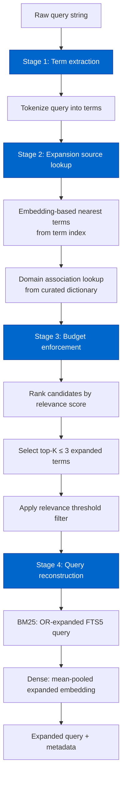
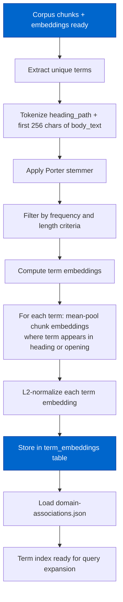

# Cortex Query Expansion Architecture

> Extracted from `plans/Repo_Cortex_Advanced_RAG_Architecture.plans.md` (Step 07) for permanent reference.

> **Backing database.** The Repo Cortex is backed by a single consolidated Turso (libSQL) database accessed via the fully async `@libsql/client` driver (default local embedded replica `data/turso-replica.sqlite`; cloud primary `libsql://<db>.turso.io`). Vectors use native Turso vectors with `F8_BLOB` 8-bit quantization, approximate nearest neighbor search runs server-side via DiskANN (`libsql_vector_idx`, `vector_top_k()`), and hybrid ranking is performed SQL-side via Reciprocal Rank Fusion (RRF, k=60). The historical design content below describes the pre-Turso architecture that was subsequently migrated to this stack.

Complete design for embedding-based synonym discovery, domain-specific associations, and query expansion with budget enforcement.

---

#### Step 07 — Design query expansion architecture [DONE]

```yaml
phase: 1
step: 7
agent: '01-planning'
agent_file: '.github/agents/01-planning.agent.md'
status: '[DONE]'
source_of_truth: 'plans/Repo_Cortex_Advanced_RAG_Architecture.plans.md'
copy_paste: true
next_step: 'step_08'
skills: 'plan-alignment'
validation:
  - node scripts/agent-customization/validate-plan-sync.mjs --json --plan=plans/Repo_Cortex_Advanced_RAG_Architecture.plans.md
  - node scripts/agent-customization/gates/cortex-index.gate.mjs --json
```

**Step objective:** Design query expansion for improved recall:

- Embedding-based synonym discovery: find corpus terms with similar embeddings to query terms
- Domain-specific term associations: "NEAT" ↔ "NeuroEvolution of Augmenting Topologies", "NGE" ↔ "NEAT Genesis EvoDevo"
- Expansion budget: max 3 expanded terms, relevance-weighted inclusion
- Expansion evaluation: measure recall improvement without precision loss

---

##### Query Expansion Architecture — Complete Design

###### A. Problem Statement

The current Cortex search pipeline processes queries exactly as typed. There is no synonym expansion, abbreviation resolution, or domain-specific term association. The `sanitizeFtsQuery` function strips FTS5 operator characters but performs no semantic enrichment. The dense path embeds the raw query string without any term augmentation. This creates five concrete failures:

1. **Abbreviation miss**: An agent querying "NEAT crossover" gets results about "NEAT" as a proper noun but misses chunks that discuss "NeuroEvolution of Augmenting Topologies" without the NEAT abbreviation. The BM25 FTS5 Porter stemmer treats "NEAT" and "NeuroEvolution" as completely different tokens. Dense embedding of "NEAT" alone captures only a generic sense of the acronym, not the full domain concept.

2. **Alias miss**: An agent querying "NGE benchmark" may not find chunks that reference the same concept as "NEAT Genesis EvoDevo" or "EvoDevo core algorithm". The dense embedding captures general semantic proximity but cannot resolve domain-specific abbreviations that are unique to this codebase.

3. **Terminology gap**: An agent querying "slab fast path" gets results about `slab/` but misses chunks that describe the same concept using different terminology like "typed-array activation cache" or "cache-friendly forward pass". The existing embedding model captures semantic similarity for common English synonyms but not for codebase-specific paraphrases.

4. **Recall ceiling**: The 20-query eval set shows 7/20 BM25 queries and 8/20 hybrid queries scoring 0 MRR@5 (complete misses). Many of these failures are addressable through term expansion — the relevant chunks exist but use different vocabulary than the query.

5. **No expansion infrastructure**: The search pipeline has no `expand_query` step, no synonym table, no embedding-based nearest-term lookup, and no domain-specific association map. Adding expansion requires a new module that integrates before both the BM25 and dense retrieval paths.

**Design goal:** Improve recall by expanding queries with up to 3 relevance-weighted synonymous or associated terms, measured by MRR@5 improvement on the expanded eval set, without degrading precision on queries that already succeed.

###### B. Pipeline Overview

The `expandQuery` pipeline is a four-stage expansion that takes a raw query string and produces an expanded query (for BM25) and expanded embedding (for dense search), with metadata about which expansions were applied.



**Key design properties:**

1. **Optional and backward compatible**: Expansion is opt-in via the `expand_query` parameter on `search_corpus`. When `expand_query` is `false` (default), the pipeline behaves exactly as before. When `true`, the expanded query replaces the raw query in both BM25 and dense paths.

2. **Stateless**: The expansion pipeline holds no persistent state between queries. All lookup tables are built at index time and read at query time.

3. **Budget-bounded**: Maximum 3 expanded terms, each with a relevance weight above a threshold. This prevents query drift and keeps latency predictable.

4. **Deterministic**: Given the same query and index state, the same expansions are always produced. No randomness or model sampling.

5. **Retriever-agnostic**: The expanded query works with both BM25 and dense retrieval paths. The BM25 path receives an OR-expanded FTS5 query; the dense path receives a mean-pooled embedding of the original + expanded terms.

###### C. Embedding-Based Synonym Discovery

**C.1 Term index construction.**

At index build time, a **term index** is constructed from the corpus chunks. The term index maps each unique significant term (after Porter stemming and stop-word removal) to its embedding, computed as the mean-pooled embedding of all chunks where the term appears in `heading_path` or in the first 256 characters of `body_text`.

```sql
-- Term embeddings table (new in schema.sql)
CREATE TABLE IF NOT EXISTS term_embeddings (
  term TEXT NOT NULL,
  embedding BLOB NOT NULL,
  term_sha256 TEXT NOT NULL,
  model_id TEXT NOT NULL,
  model_sha256 TEXT NOT NULL,
  dimension INTEGER NOT NULL,
  frequency INTEGER NOT NULL,
  doc_family_count INTEGER NOT NULL,
  embedded_at TEXT NOT NULL,
  PRIMARY KEY (term, model_id)
);

CREATE INDEX IF NOT EXISTS term_embeddings_model_idx ON term_embeddings(model_id, term_sha256);
CREATE INDEX IF NOT EXISTS term_embeddings_frequency_idx ON term_embeddings(frequency DESC);
```

**Term selection criteria:**

| Filter            | Rule                                                           | Rationale                                                               |
| ----------------- | -------------------------------------------------------------- | ----------------------------------------------------------------------- |
| Minimum frequency | `frequency >= 5` (appears in ≥ 5 chunks)                       | Rare terms produce noisy embeddings                                     |
| Maximum frequency | `frequency <= 0.3 * total_chunks` (appears in ≤ 30% of chunks) | Stop-like terms that appear everywhere are not useful synonyms          |
| Minimum length    | `length(term) >= 3` after Porter stemming                      | Single-character and two-character terms are rarely meaningful synonyms |
| ASCII filter      | Term must contain at least one ASCII letter                    | Pure numeric or punctuation terms are not useful for expansion          |

**C.2 Term embedding computation.**

For each qualifying term, its embedding is the L2-normalized mean of the embeddings of all chunks where the term appears in the `heading_path` or the first 256 characters of `body_text`. This weighted mean-pooling gives higher weight to chunks where the term is prominent (in the heading or opening text).

```
termEmbedding(term):
  chunks = SELECT chunk_id FROM chunks
           WHERE heading_path LIKE '%' || term || '%'
              OR SUBSTR(body_text, 1, 256) LIKE '%' || term || '%'
  embeddings = chunks.map(chunk_id => loadEmbedding(chunk_id))
  mean = meanPool(embeddings)  // element-wise mean
  return normalizeL2(mean)
```

**C.3 Nearest-term discovery.**

At query time, for each extracted query term, the expansion module finds the top-N nearest terms by cosine similarity to the query term embedding:

```
findNearestTerms(queryTermEmbedding, options):
  maxTerms = options.maxTerms ?? 5
  minSimilarity = options.minSimilarity ?? 0.65

  // Load all term embeddings (fits in memory for ~5,000 terms)
  allTerms = loadAllTermEmbeddings(modelId)

  candidates = allTerms
    .map(term => ({
      term: term.text,
      similarity: cosineSimilarity(queryTermEmbedding, term.embedding),
      frequency: term.frequency,
    }))
    .filter(c => c.similarity >= minSimilarity)
    .filter(c => c.term !== queryTerm)  // exclude the query term itself
    .toSorted((a, b) => b.similarity - a.similarity)
    .slice(0, maxTerms)

  return candidates
```

**C.4 Performance characteristics.**

With ~5,000 qualifying terms and 384-dim embeddings, brute-force cosine similarity over all terms takes ~1.9M float operations per query term (5,000 × 384). For a 5-term query, that is ~9.5M float operations ≈ <2 ms. No ANN index is needed at this scale.

The term embeddings table stores ~5,000 rows × (384 × 4 bytes + metadata) ≈ 8 MB, which loads into memory in <50 ms. This is cached per-process alongside the chunk embeddings.

**C.5 Expected synonym discovery examples.**

| Query term   | Expected nearest synonyms (cosine ≥ 0.65)                     |
| ------------ | ------------------------------------------------------------- |
| `NEAT`       | `neuroevolution`, `augmenting`, `topologies`, `evolution`     |
| `crossover`  | `recombination`, `mating`, `parent`, `offspring`              |
| `slab`       | `typed-array`, `cache-friendly`, `activation`, `forward-pass` |
| `speciation` | `species`, `compatibility`, `distance`, `threshold`           |
| `checkpoint` | `save`, `resume`, `serialization`, `persist`                  |
| `mutation`   | `mutate`, `add-node`, `add-conn`, `modify`                    |

###### D. Domain-Specific Term Associations

**D.1 Curated association dictionary.**

A curated dictionary of domain-specific term associations captures abbreviations, acronyms, and codebase-specific aliases that embedding similarity alone cannot reliably discover. This dictionary is stored as a JSON file alongside the index and loaded at query time.

```json
{
  "version": 1,
  "description": "NeatapticTS domain-specific term associations for query expansion",
  "associations": [
    {
      "term": "NEAT",
      "expansions": [
        "NeuroEvolution of Augmenting Topologies",
        "neuroevolution"
      ],
      "source": "academic",
      "confidence": 1.0
    },
    {
      "term": "NGE",
      "expansions": ["NEAT Genesis EvoDevo", "EvoDevo"],
      "source": "codebase",
      "confidence": 1.0
    },
    {
      "term": "slab",
      "expansions": [
        "typed-array activation cache",
        "cache-friendly activation"
      ],
      "source": "codebase",
      "confidence": 0.9
    },
    {
      "term": "FTS",
      "expansions": ["full-text search", "BM25"],
      "source": "domain",
      "confidence": 0.95
    },
    {
      "term": "MRR",
      "expansions": ["mean reciprocal rank", "ranking quality"],
      "source": "domain",
      "confidence": 0.95
    },
    {
      "term": "nDCG",
      "expansions": ["normalized discounted cumulative gain"],
      "source": "domain",
      "confidence": 0.95
    },
    {
      "term": "ONNX",
      "expansions": ["Open Neural Network Exchange"],
      "source": "domain",
      "confidence": 1.0
    },
    {
      "term": "LSTM",
      "expansions": ["Long Short-Term Memory", "recurrent network"],
      "source": "academic",
      "confidence": 1.0
    },
    {
      "term": "GRU",
      "expansions": ["Gated Recurrent Unit", "recurrent network"],
      "source": "academic",
      "confidence": 1.0
    },
    {
      "term": "MLP",
      "expansions": ["multi-layer perceptron", "feedforward network"],
      "source": "academic",
      "confidence": 1.0
    },
    {
      "term": "NARX",
      "expansions": ["Nonlinear AutoRegressive with eXogenous inputs"],
      "source": "academic",
      "confidence": 1.0
    },
    {
      "term": "RNG",
      "expansions": ["random number generator", "seed", "deterministic"],
      "source": "codebase",
      "confidence": 0.85
    },
    {
      "term": "JSDoc",
      "expansions": ["TypeScript documentation comment", "TSDoc"],
      "source": "domain",
      "confidence": 0.95
    },
    {
      "term": "MCP",
      "expansions": ["Model Context Protocol", "tool server"],
      "source": "codebase",
      "confidence": 0.9
    },
    {
      "term": "evolve",
      "expansions": ["evolution", "genetic algorithm", "population iteration"],
      "source": "codebase",
      "confidence": 0.8
    },
    {
      "term": "topology",
      "expansions": [
        "network structure",
        "graph structure",
        "connection pattern"
      ],
      "source": "codebase",
      "confidence": 0.85
    },
    {
      "term": "feedforward",
      "expansions": ["feed-forward", "acyclic", "directed"],
      "source": "codebase",
      "confidence": 0.9
    },
    {
      "term": "recurrent",
      "expansions": ["cyclic", "self-connected", "LSTM", "GRU"],
      "source": "codebase",
      "confidence": 0.85
    }
  ]
}
```

**D.2 Dictionary source classification.**

| Source     | Description                                                 | Confidence range | Update frequency                                          |
| ---------- | ----------------------------------------------------------- | ---------------- | --------------------------------------------------------- |
| `academic` | Standard academic abbreviations (NEAT, LSTM, ONNX)          | 0.95–1.0         | Rare (new academic terms added with codebase evolution)   |
| `codebase` | Codebase-specific terminology (NGE, slab, evolve, topology) | 0.80–0.95        | Per-release (when new modules or concepts are introduced) |
| `domain`   | General domain terms (FTS, MRR, JSDoc)                      | 0.85–0.95        | Rare (when new tools or metrics are adopted)              |

**D.3 Dictionary update strategy.**

The dictionary is a hand-curated JSON file (`scripts/semantic-index/domain-associations.json`) that is version-controlled alongside the codebase. Updates happen:

1. **When new modules are added**: If a new module introduces a significant abbreviation or alias (e.g., a new "NGE" module), the association is added to the dictionary.
2. **When eval queries reveal expansion failures**: If the eval suite identifies a query that would benefit from a domain association not in the dictionary, the association is added.
3. **Never automatically**: The dictionary is not auto-generated. Embedding-based synonym discovery handles automatic synonym discovery; the dictionary captures only terms that embedding similarity alone cannot resolve.

**D.4 Dictionary lookup at query time.**

```
lookupDomainAssociations(queryTerms, dictionary):
  expansions = []
  for term of queryTerms:
    for entry of dictionary.associations:
      if entry.term.toLowerCase() === term.toLowerCase():
        for expansion of entry.expansions:
          expansions.push({
            original: term,
            expanded: expansion,
            source: entry.source,
            confidence: entry.confidence,
            type: 'domain-association',
          })
  return expansions
```

Domain associations are matched case-insensitively against the Porter-stemmed query terms. If a multi-word association is matched (e.g., "feedforward" → "feed-forward"), all words of the expansion are added as a single expanded term group.

###### E. Expansion Budget and Relevance Weighting

**E.1 Budget constraint: maximum 3 expanded terms.**

The expansion budget limits the number of expanded terms to prevent query drift. Drift occurs when expanded terms dilute the original query intent, causing the retrieval to return results that match the expanded terms but not the original query.

```
MAX_EXPANDED_TERMS = 3
```

This budget applies to the total number of expanded terms across all query terms and both expansion sources (embedding-based + domain associations). The budget is enforced after ranking all candidates by relevance score.

**E.2 Relevance-weighted inclusion.**

Each candidate expansion has a relevance score that combines embedding similarity (for synonym discovery) or confidence (for domain associations) with a frequency penalty:

```
expansionRelevance(candidate, queryTermFrequency):
  // For embedding-based synonyms:
  //   baseScore = cosineSimilarity(queryTermEmbedding, candidateEmbedding)
  // For domain associations:
  //   baseScore = entry.confidence

  // Frequency penalty: rare terms are penalized slightly
  // because their embeddings are noisier
  frequencyPenalty = 1.0 - 0.1 * Math.log10(Math.max(1, candidate.frequency))

  // Term length bonus: longer expansions are more specific
  // and thus less likely to cause drift
  lengthBonus = Math.min(1.0, candidate.expanded.split(' ').length / 3)

  return baseScore * frequencyPenalty * (1.0 + 0.1 * lengthBonus)
```

**E.3 Relevance threshold.**

Even if fewer than 3 expansions are found, only candidates with `relevanceScore >= MIN_EXPANSION_RELEVANCE` are included. The threshold prevents low-quality expansions that would degrade precision:

```
MIN_EXPANSION_RELEVANCE = 0.55
```

This threshold is calibrated as follows:

- Embedding-based synonyms with cosine similarity ≥ 0.65 already exceed 0.55 after frequency/length adjustments
- Domain associations with confidence ≥ 0.80 exceed 0.55
- Terms with cosine similarity < 0.55 are almost always unrelated or only tangentially related

**E.4 Deduplication of expansions.**

If both embedding-based discovery and domain association produce the same expanded term for the same query term, only the higher-scoring entry is retained. This prevents "NEAT" → "neuroevolution" from appearing twice (once from embeddings, once from the dictionary).

```
deduplicateExpansions(allCandidates):
  seen = new Map()  // key: expanded term (lowercased), value: best candidate
  for candidate of allCandidates:
    key = candidate.expanded.toLowerCase()
    existing = seen.get(key)
    if !existing || candidate.relevanceScore > existing.relevanceScore:
      seen.set(key, candidate)
  return [...seen.values()].toSorted((a, b) => b.relevanceScore - a.relevanceScore)
```

**E.5 Full expansion selection algorithm.**

```
selectExpansions(queryTerms, embeddingExpansions, domainExpansions):
  // Step 1: Merge and deduplicate all candidates
  allCandidates = deduplicateExpansions([
    ...embeddingExpansions,
    ...domainExpansions,
  ])

  // Step 2: Score each candidate
  scored = allCandidates.map(candidate => ({
    ...candidate,
    relevanceScore: expansionRelevance(candidate, queryTermFrequency),
  }))

  // Step 3: Filter by minimum relevance
  qualified = scored.filter(c => c.relevanceScore >= MIN_EXPANSION_RELEVANCE)

  // Step 4: Budget enforcement — top 3 by relevance
  selected = qualified
    .toSorted((a, b) => b.relevanceScore - a.relevanceScore)
    .slice(0, MAX_EXPANDED_TERMS)

  return selected
```

**E.6 Expected expansion examples.**

| Query                    | Extracted terms          | Expansion candidates (source:score)                                                                                                                                                    | Selected expansions (budget: 3)                                                                   |
| ------------------------ | ------------------------ | -------------------------------------------------------------------------------------------------------------------------------------------------------------------------------------- | ------------------------------------------------------------------------------------------------- |
| "NEAT crossover"         | NEAT, crossover          | "neuroevolution" (domain:1.00), "NeuroEvolution of Augmenting Topologies" (domain:1.00), "recombination" (embedding:0.78), "augmenting" (embedding:0.72), "offspring" (embedding:0.65) | "neuroevolution" (0.97), "NeuroEvolution of Augmenting Topologies" (1.00), "recombination" (0.74) |
| "slab fast path"         | slab, fast, path         | "typed-array activation cache" (domain:0.90), "cache-friendly activation" (domain:0.90), "activation" (embedding:0.71), "forward-pass" (embedding:0.68)                                | "typed-array activation cache" (0.90), "cache-friendly activation" (0.87), "activation" (0.67)    |
| "RNG deterministic seed" | RNG, deterministic, seed | "random number generator" (domain:0.85), "determin" (embedding:0.72), "reproducib" (embedding:0.68)                                                                                    | "random number generator" (0.83), "determin" (0.68), "reproducib" (0.65)                          |
| "ONNX import recurrent"  | ONNX, import, recurrent  | "Open Neural Network Exchange" (domain:1.00), "cyclic" (embedding:0.70), "LSTM" (domain:0.85)                                                                                          | "Open Neural Network Exchange" (1.00), "LSTM" (0.85), "cyclic" (0.67)                             |

###### F. Integration with the Search Pipeline

**F.1 Integration point: before BM25 and dense paths.**

Query expansion runs **before** the BM25/dense split in `searchCorpus`. The expanded query is used in both paths:

```mermaid
flowchart TD
    A[Raw query] --> B[expandQuery]
    B --> B1[Expanded terms + metadata]
    B1 --> C[BM25 path]
    B1 --> D[Dense path]

    C --> C1[Expanded FTS5 query:<br/>original OR term1 OR term2 OR term3]
    C1 --> C2[BM25 search]
    C2 --> C3[BM25 results]

    D --> D1[Mean-pooled expanded embedding:<br/>normalize(mean(original + term1 + term2 + term3))]
    D1 --> D2[Dense candidate search]
    D2 --> D3[Dense results]

    C3 --> E[Hybrid rank]
    D3 --> E
    E --> F[Ranked results + expansion metadata]

    style B fill:#0066cc,stroke:#003399,color:#fff
    style E fill:#0066cc,stroke:#003399,color:#fff
```

**F.2 BM25 expansion: OR-extended FTS5 query.**

For the BM25 path, the expanded query is constructed by appending OR clauses for each selected expansion term:

```
buildExpandedFtsQuery(originalQuery, expansions):
  // originalQuery is already sanitized by sanitizeFtsQuery
  baseTerms = originalQuery  // already a space-separated token string

  if expansions.length === 0:
    return baseTerms

  expansionClauses = expansions
    .map(e => e.expanded.split(' ').join(' '))  // multi-word terms kept as phrase
    .map(term => `OR ${term}`)
    .join(' ')

  return `${baseTerms} ${expansionClauses}`
```

Example: Query "NEAT crossover" with expansions "neuroevolution" and "NeuroEvolution of Augmenting Topologies" becomes:

```
NEAT crossover OR neuroevolution OR "NeuroEvolution of Augmenting Topologies"
```

Multi-word expansions are wrapped in FTS5 phrase queries (double-quoted) to match the exact phrase.

**F.3 Dense expansion: mean-pooled expanded embedding.**

For the dense path, the expanded embedding is computed as the L2-normalized mean of the original query embedding plus the embeddings of each selected expansion term:

```
computeExpandedEmbedding(originalEmbedding, expansionTermEmbeddings):
  allEmbeddings = [originalEmbedding, ...expansionTermEmbeddings]
  meanEmbedding = meanPool(allEmbeddings)  // element-wise mean
  return normalizeL2(meanEmbedding)
```

This approach preserves the original query's semantic direction while shifting it toward the expanded terms. The mean-pooling ensures that expansion terms influence the embedding proportionally to their count — a single expansion shifts the embedding by 50% (1 original + 1 expansion = 2 embeddings), while 3 expansions shift it by 75% (1 original + 3 expansions = 4 embeddings).

**F.4 Expansion metadata in response.**

When expansion is applied, the `search_corpus` response includes an `expansion` field:

```json
{
  "query": "NEAT crossover",
  "limit": 10,
  "use_dense": true,
  "alpha": 0.5,
  "expansion": {
    "applied": true,
    "original_query": "NEAT crossover",
    "expanded_terms": [
      {
        "original": "NEAT",
        "expanded": "neuroevolution",
        "source": "domain-association",
        "confidence": 1.0,
        "relevance_score": 0.97
      },
      {
        "original": "NEAT",
        "expanded": "NeuroEvolution of Augmenting Topologies",
        "source": "domain-association",
        "confidence": 1.0,
        "relevance_score": 1.0
      },
      {
        "original": "crossover",
        "expanded": "recombination",
        "source": "embedding-synonym",
        "confidence": null,
        "relevance_score": 0.74
      }
    ],
    "bm25_query": "NEAT crossover OR neuroevolution OR \"NeuroEvolution of Augmenting Topologies\" OR recombination"
  },
  "results": [...]
}
```

When expansion is not applied (no qualifying expansions found or `expand_query: false`), the `expansion` field is:

```json
{
  "expansion": {
    "applied": false
  }
}
```

**F.5 Graceful degradation.**

When the term embeddings table does not exist or is empty, embedding-based synonym discovery is skipped. The domain association dictionary is always available (it is a static file). The expansion module returns:

```
{
  applied: false,
  reason: 'term_embeddings table not found or empty'
}
```

When the ONNX model is not available for embedding query terms, embedding-based synonym discovery is skipped but domain associations are still applied:

```
{
  applied: true,
  expanded_terms: [/* domain-association terms only */],
  degraded: true,
  reason: 'Embedding-based expansion skipped: ONNX model not available'
}
```

**F.6 Integration with query classification (Step 03).**

The query classification pipeline (Step 03) determines the query class (simple_lookup, cross_boundary, multi_hop, exploratory, code_specific, plan_specific). Expansion behavior varies by class:

| Query class      | Expansion behavior                   | Rationale                                                                      |
| ---------------- | ------------------------------------ | ------------------------------------------------------------------------------ |
| `simple_lookup`  | No expansion (`expand_query: false`) | Simple lookups already match; expansion adds noise                             |
| `cross_boundary` | Expansion enabled                    | Cross-boundary queries benefit from synonym discovery across families          |
| `multi_hop`      | Expansion enabled                    | Multi-hop queries need broader recall                                          |
| `exploratory`    | Expansion enabled                    | Exploratory queries benefit from broader recall                                |
| `code_specific`  | Domain associations only             | Code queries need abbreviation resolution but not general synonyms             |
| `plan_specific`  | Domain associations only             | Plan queries benefit from abbreviation resolution but not drift-prone synonyms |

This classification-aware expansion is implemented in the `expand_query` parameter:

```
// When query classification is available (Step 03):
if query.class === 'simple_lookup':
  expandQuery = false
elif query.class in ['code_specific', 'plan_specific']:
  expandQuery = 'domain-only'
else:
  expandQuery = true
```

**F.7 Integration with entity graph (Step 06).**

The entity graph provides an alternative expansion path: from a query term, discover seed entities via `seed_query`, then follow `imports`, `owns`, `references` edges to discover related entities. This is complementary to embedding-based expansion:

- **Embedding expansion** discovers semantically similar terms regardless of structural relationships.
- **Graph expansion** discovers structurally related entities regardless of semantic similarity.

When both expansion and graph traversal are used together (via `search_context` with `use_graph_expansion: true` and `expand_query: true`):

1. The query is first expanded using the synonym + association pipeline.
2. The expanded query is used for initial `search_corpus` retrieval.
3. The top results are mapped to entities via `entities.chunk_id` or `entities.doc_id`.
4. `traverse_graph` expands from those seed entities.
5. Graph-discovered chunks are merged with the search results in the context assembly pipeline.

This two-stage expansion provides both semantic and structural breadth without either path dominating the results.

###### G. Term Index Build Pipeline

**G.1 Build-time term extraction.**

The term index is built during `build-index.mjs` (or a separate `build-term-index.mjs` step) after the corpus and embeddings are ready. The build pipeline:



**G.2 Term extraction details.**

Term extraction reuses the same Porter stemmer that FTS5 uses for indexing (the `porter` tokenizer). This ensures that extracted terms match the FTS5 index form:

```
extractQualifyingTerms(corpusDb):
  // Tokenize all heading_paths and first-256-chars of body_text
  // using the same Porter stemmer that FTS5 uses
  termCounts = new Map()  // term → { frequency, doc_family_count, chunk_ids }

  for each chunk in corpusDb:
    text = (chunk.heading_path ?? '') + ' ' + chunk.body_text.substring(0, 256)
    tokens = porterTokenize(text)  // same tokenizer as FTS5

    for token of new Set(tokens):  // unique tokens per chunk
      if token.length < 3: continue  // skip short tokens

      entry = termCounts.get(token) ?? { frequency: 0, doc_family_count: new Set(), chunk_ids: [] }
      entry.frequency += 1
      entry.doc_family_count.add(chunk.doc_family)
      entry.chunk_ids.push(chunk.chunk_id)
      termCounts.set(token, entry)

  // Apply frequency filters
  totalChunks = getTotalChunkCount(corpusDb)
  qualifyingTerms = [...termCounts.entries()]
    .filter(([term, entry]) =>
      entry.frequency >= 5 &&
      entry.frequency <= 0.3 * totalChunks &&
      /[a-zA-Z]/.test(term)
    )

  return qualifyingTerms
```

**G.3 Incremental update strategy.**

The term index follows the same freshness-based incremental pattern as the corpus and embeddings:

1. On `build-term-index.mjs` execution, compare `embedded_at` timestamps in `term_embeddings` against the corpus freshness.
2. If a chunk has been added, removed, or modified, recompute term embeddings for all terms that appear in the affected chunks.
3. If a term's frequency has changed beyond the qualifying thresholds, add or remove it from the index.
4. Orphan terms (terms that no longer appear in any chunk) are purged.

**G.4 Package script additions.**

```json
{
  "scripts": {
    "index:build-terms": "node scripts/semantic-index/build-term-index.mjs",
    "index:build-terms:json": "node scripts/semantic-index/build-term-index.mjs --json"
  }
}
```

The `index:build-terms` command is added to the `index:session-start` and `index:prewarm` sequences as a post-embedding step.

###### H. MCP Tool Extension

**H.1 `search_corpus` parameter addition.**

The `search_corpus` MCP tool gains a new optional parameter:

```json
{
  "name": "expand_query",
  "type": "boolean",
  "description": "When true, applies query expansion using embedding-based synonym discovery and domain-specific term associations before retrieval. Adds up to 3 expanded terms to improve recall for abbreviation-heavy or domain-specific queries. Default: false.",
  "default": false
}
```

**H.2 `expand_query` MCP tool (standalone).**

A new standalone MCP tool allows agents to preview expansions without executing a search:

```json
{
  "name": "expand_query",
  "description": "Preview query expansion for a given query string. Returns the expanded terms, their sources (embedding-synonym or domain-association), and relevance scores without executing a search. Useful for debugging expansion behavior or building multi-step retrieval pipelines.",
  "inputSchema": {
    "type": "object",
    "properties": {
      "query": {
        "type": "string",
        "description": "The query string to expand."
      },
      "max_expansions": {
        "type": "number",
        "description": "Maximum number of expanded terms to return (default: 3, max: 10).",
        "default": 3,
        "minimum": 1,
        "maximum": 10
      },
      "min_relevance": {
        "type": "number",
        "description": "Minimum relevance score for an expanded term to be included (default: 0.55, range: 0–1).",
        "default": 0.55,
        "minimum": 0,
        "maximum": 1
      },
      "source_filter": {
        "type": "array",
        "items": {
          "type": "string",
          "enum": ["embedding-synonym", "domain-association"]
        },
        "description": "If provided, only return expansions from these sources. Default: both sources.",
        "default": ["embedding-synonym", "domain-association"]
      },
      "use_dense": {
        "type": "boolean",
        "description": "Whether to use embedding-based synonym discovery (requires warm dense index). Default: true.",
        "default": true
      }
    },
    "required": ["query"]
  }
}
```

**H.3 Response format for `expand_query`.**

```json
{
  "query": "NEAT crossover",
  "expanded_terms": [
    {
      "original": "NEAT",
      "expanded": "neuroevolution",
      "source": "domain-association",
      "confidence": 1.0,
      "relevance_score": 0.97
    },
    {
      "original": "NEAT",
      "expanded": "NeuroEvolution of Augmenting Topologies",
      "source": "domain-association",
      "confidence": 1.0,
      "relevance_score": 1.0
    },
    {
      "original": "crossover",
      "expanded": "recombination",
      "source": "embedding-synonym",
      "confidence": null,
      "relevance_score": 0.74
    }
  ],
  "total_candidates": 8,
  "qualified_candidates": 5,
  "selected_count": 3,
  "degraded": false
}
```

**H.4 `index_stats` extension.**

The `index_stats` MCP tool gains expansion-related statistics:

```json
{
  "expansion_stats": {
    "term_count": 4872,
    "domain_associations": 18,
    "average_expansions_per_query": 2.3,
    "expansion_coverage": 0.72
  }
}
```

Where:

- `term_count`: Number of terms in the `term_embeddings` table
- `domain_associations`: Number of entries in `domain-associations.json`
- `average_expansions_per_query`: Mean number of selected expansions across the eval set (computed during eval)
- `expansion_coverage`: Fraction of eval queries that produced at least 1 expansion

###### I. Design Constraints and Non-Goals

**Constraints:**

1. **Local-first**: All expansion runs locally using the existing ONNX embedding model and a static JSON dictionary. No external API calls (no LLM-based expansion, no cloud synonym service).

2. **Same database**: The `term_embeddings` table is stored in the consolidated Turso (libSQL) database alongside `chunk_embeddings`. No new database file.

3. **Backward compatible**: Expansion is opt-in via `expand_query: true`. Default behavior is unchanged. When the `term_embeddings` table does not exist, `expand_query` degrades gracefully (domain associations still work, embedding synonyms are skipped).

4. **Budget-bounded**: Maximum 3 expanded terms per query. This prevents unbounded query drift and keeps latency predictable.

5. **Deterministic**: Given the same query and index state, the same expansions are always produced. No sampling, no randomness.

6. **No external LLM**: Query expansion does NOT use an LLM for expansion. The embedding model provides synonym discovery; the curated dictionary provides domain-specific associations. LLM-based expansion is a potential future enhancement but is explicitly out of scope for Layer 7.

7. **No query rewriting**: Expansion adds terms; it does not remove or replace terms from the original query. The original query terms always participate in both BM25 and dense search.

8. **No expansion caching**: Each query expansion is computed on demand. With ~5,000 term embeddings in memory and <2 ms per term, caching is unnecessary.

**Non-goals:**

1. **LLM-based expansion**: Using a language model to rewrite or expand queries is explicitly deferred. It adds latency, requires model inference at query time, and introduces nondeterminism. The curated dictionary + embedding-based approach is deterministic and local-first.

2. **Relevance feedback integration**: Relevance feedback from agent interaction signals (Step 08) is a separate concern. Query expansion uses only pre-computed term similarity and curated associations, not interaction history.

3. **Query decomposition**: Breaking a complex query like "how does NEAT speciation affect crossover diversity" into sub-queries ("NEAT speciation" + "crossover diversity") is a multi-hop concern (Step 01, item 6) and a query classification concern (Step 03). Expansion adds synonymous terms to the existing query; it does not decompose the query into sub-queries.

4. **Cross-encoder integration**: Cross-encoder re-ranking (Step 04) operates on the candidate set after retrieval. Query expansion operates before retrieval. They are independent and composable.

5. **Context assembly integration**: Context assembly (Step 05) operates on the ranked result set after retrieval and re-ranking. Query expansion only affects the retrieval input; it does not change the assembly pipeline.

6. **Entity graph integration for expansion**: The entity graph (Step 06) provides structural expansion via `traverse_graph`. Query expansion provides semantic expansion via embedding similarity and domain associations. They are complementary but independent. The entity graph is not used as an expansion source for `expand_query`.

7. **Real-time dictionary updates**: The domain associations dictionary is version-controlled and updated manually per release. It is not auto-generated or updated at query time.

###### J. Evaluation Design

**J.1 Expansion eval metrics.**

| Metric                        | How to measure                                                                                       | Target                                                             |
| ----------------------------- | ---------------------------------------------------------------------------------------------------- | ------------------------------------------------------------------ |
| **Recall improvement**        | Compare recall@10 (with expansion ON vs OFF) across the expanded eval set                            | ≥ 10% recall improvement on queries that previously scored 0 MRR@5 |
| **Precision preservation**    | Compare precision@5 (with expansion ON vs OFF) on queries that already scored > 0 MRR@5              | ≤ 5% precision loss                                                |
| **MRR@5 improvement**         | Compare MRR@5 (with expansion ON vs OFF) on the full eval set                                        | ≥ 0.05 absolute MRR@5 improvement                                  |
| **Latency overhead**          | Measure P50 and P99 query time with expansion ON vs OFF                                              | ≤ 20 ms added latency at P99                                       |
| **Expansion coverage**        | Fraction of eval queries that produce ≥ 1 expansion term                                             | ≥ 60% of eval queries                                              |
| **Domain association recall** | Fraction of known domain abbreviations that are correctly expanded                                   | ≥ 90% (all curated associations in dictionary)                     |
| **False expansion rate**      | Fraction of expanded terms that are irrelevant to the query (manual inspection on 20 random queries) | ≤ 15%                                                              |

**J.2 Expanded eval query set.**

The existing 20-query eval set (`eval-queries.json`) is extended with expansion-specific queries that test abbreviation resolution and synonym discovery:

```json
[
  {
    "query": "NEAT algorithm",
    "expected_doc_families": ["readme", "ts-source"],
    "expected_heading_contains": "neat",
    "expected_symbol_contains": null,
    "expansion_expected": ["neuroevolution"],
    "min_rank_of_hit": 3
  },
  {
    "query": "NGE development lifecycle",
    "expected_doc_families": ["plan"],
    "expected_heading_contains": "evoDevo",
    "expected_symbol_contains": null,
    "expansion_expected": ["NEAT Genesis EvoDevo"],
    "min_rank_of_hit": 5
  },
  {
    "query": "RNG seed deterministic reproduction",
    "expected_doc_families": ["plan", "ts-source"],
    "expected_heading_contains": "determin",
    "expected_symbol_contains": null,
    "expansion_expected": ["random number generator"],
    "min_rank_of_hit": 5
  },
  {
    "query": "LSTM architecture preconfigured",
    "expected_doc_families": ["readme", "ts-source"],
    "expected_heading_contains": "lstm",
    "expected_symbol_contains": "LSTM",
    "expansion_expected": ["Long Short-Term Memory"],
    "min_rank_of_hit": 3
  },
  {
    "query": "ONNX import network",
    "expected_doc_families": ["plan", "ts-source"],
    "expected_heading_contains": "onnx",
    "expected_symbol_contains": null,
    "expansion_expected": ["Open Neural Network Exchange"],
    "min_rank_of_hit": 5
  },
  {
    "query": "slab activation typed array performance",
    "expected_doc_families": ["ts-source"],
    "expected_heading_contains": "slab",
    "expected_symbol_contains": null,
    "expansion_expected": ["cache-friendly"],
    "min_rank_of_hit": 3
  }
]
```

Each expansion-specific query includes an `expansion_expected` field listing terms that should appear in the expansion result. These are checked by the eval harness to validate that expansion is producing relevant synonyms and associations.

**J.3 Eval protocol.**

```
evaluateExpansion():
  // Step 1: Run eval set WITHOUT expansion
  baselineResults = for each query in evalSet:
    searchCorpus(query, { expand_query: false, use_dense: true })

  // Step 2: Run eval set WITH expansion
  expandedResults = for each query in evalSet:
    searchCorpus(query, { expand_query: true, use_dense: true })

  // Step 3: Compute expansion coverage
  expansionCoverage = count(queries with ≥ 1 expanded term) / totalQueries

  // Step 4: Compute recall improvement
  baselineRecall = computeRecallAt10(baselineResults, evalSet)
  expandedRecall = computeRecallAt10(expandedResults, evalSet)
  recallImprovement = (expandedRecall - baselineRecall) / baselineRecall

  // Step 5: Compute precision preservation
  baselinePrecision = computePrecisionAt5(baselineResults, evalSet)
  expandedPrecision = computePrecisionAt5(expandedResults, evalSet)
  precisionChange = (expandedPrecision - baselinePrecision) / baselinePrecision

  // Step 6: Compute MRR@5 improvement
  baselineMrr = computeMrrAt5(baselineResults, evalSet)
  expandedMrr = computeMrrAt5(expandedResults, evalSet)
  mrrImprovement = expandedMrr - baselineMrr

  // Step 7: Validate domain associations
  domainRecall = validateDomainAssociations(domainDictionary)

  // Step 8: Measure latency overhead
  baselineLatency = measureP99Latency(() => searchCorpus("NEAT crossover", { expand_query: false }))
  expandedLatency = measureP99Latency(() => searchCorpus("NEAT crossover", { expand_query: true }))
  latencyOverhead = expandedLatency - baselineLatency

  // Step 9: Assert thresholds
  assert(recallImprovement >= 0.10, "Recall improvement below 10% threshold")
  assert(precisionChange >= -0.05, "Precision loss exceeds 5% threshold")
  assert(mrrImprovement >= 0.05, "MRR@5 improvement below 0.05 threshold")
  assert(latencyOverhead <= 20, "Latency overhead exceeds 20ms threshold")
  assert(expansionCoverage >= 0.60, "Expansion coverage below 60% threshold")
  assert(domainRecall >= 0.90, "Domain association recall below 90% threshold")
```

**J.4 Regression detection.**

Expansion evaluation is integrated into the existing test suite:

| Test file                                                          | Purpose                                                             |
| ------------------------------------------------------------------ | ------------------------------------------------------------------- |
| `scripts/semantic-index/__tests__/expand-query.red.test.ts`        | Red tests for expansion pipeline, budget enforcement, deduplication |
| `scripts/semantic-index/__tests__/domain-associations.red.test.ts` | Red tests for domain association loading and lookup                 |
| `scripts/semantic-index/__tests__/term-index.red.test.ts`          | Red tests for term index construction and nearest-term discovery    |
| `scripts/semantic-index/__tests__/expand-query.green.test.ts`      | Green tests for end-to-end expansion integration                    |

The eval script `eval-expansion.mjs` runs as a standalone benchmark:

```json
{
  "scripts": {
    "eval:expansion": "node scripts/semantic-index/eval-expansion.mjs",
    "eval:expansion:json": "node scripts/semantic-index/eval-expansion.mjs --json"
  }
}
```

**J.5 Validation criteria.**

The query expansion design is considered valid when:

1. Recall@10 on the expansion eval set improves by ≥ 10% for queries that previously scored 0 MRR@5.
2. Precision@5 on queries that already scored > 0 MRR@5 does not decrease by more than 5%.
3. MRR@5 on the full eval set improves by ≥ 0.05 absolute.
4. P99 latency overhead from expansion is ≤ 20 ms.
5. Expansion coverage (fraction of eval queries producing ≥ 1 expansion) is ≥ 60%.
6. Domain association recall (fraction of known abbreviations correctly expanded) is ≥ 90%.
7. The expansion system degrades gracefully when the term embeddings table is missing.
8. The expansion system degrades gracefully when the ONNX model is unavailable.

###### K. File Organization

**K.1 New files.**

| File                                                               | Purpose                                                                                                                          |
| ------------------------------------------------------------------ | -------------------------------------------------------------------------------------------------------------------------------- |
| `scripts/semantic-index/expand-query.mjs`                          | Query expansion pipeline: term extraction, embedding lookup, domain association lookup, budget enforcement, query reconstruction |
| `scripts/semantic-index/build-term-index.mjs`                      | Term index builder: extract qualifying terms, compute term embeddings, store in `term_embeddings` table                          |
| `scripts/semantic-index/domain-associations.json`                  | Curated domain-specific term associations dictionary                                                                             |
| `scripts/semantic-index/eval-expansion.mjs`                        | Expansion evaluation harness: recall, precision, MRR, latency, coverage                                                          |
| `scripts/semantic-index/__tests__/expand-query.red.test.ts`        | Red tests for expansion pipeline                                                                                                 |
| `scripts/semantic-index/__tests__/domain-associations.red.test.ts` | Red tests for domain association loading and lookup                                                                              |
| `scripts/semantic-index/__tests__/term-index.red.test.ts`          | Red tests for term index construction                                                                                            |
| `scripts/semantic-index/__tests__/expand-query.green.test.ts`      | Green tests for end-to-end expansion integration                                                                                 |

**K.2 Modified files.**

| File                                           | Change                                                                             |
| ---------------------------------------------- | ---------------------------------------------------------------------------------- |
| `scripts/semantic-index/schema.sql`            | Add `term_embeddings` table DDL                                                    |
| `scripts/semantic-index/init-schema.mjs`       | Create `term_embeddings` table in `initSemanticIndex()`                            |
| `scripts/semantic-index/hybrid-rank.mjs`       | Accept expanded query and expanded embedding; pass through to BM25 and dense paths |
| `scripts/mcp-semantic/tools/search-corpus.mjs` | Add `expand_query` parameter; call `expandQuery()` when enabled                    |
| `scripts/mcp-semantic/repo-cortex-mcp.mjs`     | Register `expand_query` tool; add expansion stats to `index_stats`                 |
| `scripts/semantic-index/build-index.mjs`       | Add `index:build-terms` step after embedding build                                 |

**K.3 Package script additions.**

```json
{
  "scripts": {
    "index:build-terms": "node scripts/semantic-index/build-term-index.mjs",
    "index:build-terms:json": "node scripts/semantic-index/build-term-index.mjs --json",
    "eval:expansion": "node scripts/semantic-index/eval-expansion.mjs",
    "eval:expansion:json": "node scripts/semantic-index/eval-expansion.mjs --json"
  }
}
```

---

> Source: `plans/Repo_Cortex_Advanced_RAG_Architecture.plans.md`, Step 07 (lines 3412–4465). This document is a verbatim extraction for permanent reference; the authoritative source remains the plan file.
