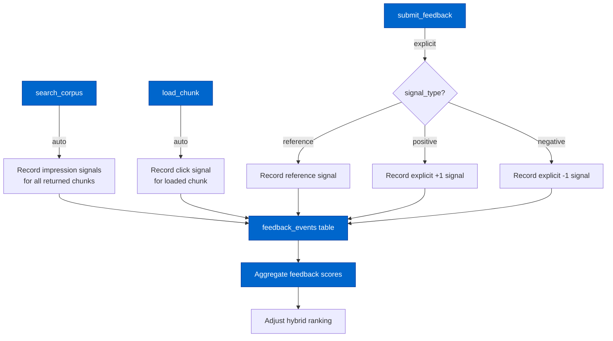

# Cortex Relevance Feedback Architecture

> Extracted from `plans/Repo_Cortex_Advanced_RAG_Architecture.plans.md` (Step 08) for permanent reference.

> **Backing database.** The Repo Cortex is backed by a single consolidated Turso (libSQL) database accessed via the fully async `@libsql/client` driver (default local embedded replica `data/turso-replica.sqlite`; cloud primary `libsql://<db>.turso.io`). Vectors use native Turso vectors with `F8_BLOB` 8-bit quantization, approximate nearest neighbor search runs server-side via DiskANN (`libsql_vector_idx`, `vector_top_k()`), and hybrid ranking is performed SQL-side via Reciprocal Rank Fusion (RRF, k=60). The historical design content below describes the pre-Turso architecture that was subsequently migrated to this stack.

Complete design for relevance feedback collection, scoring, and ranking adjustment from agent interaction signals.

---

#### Step 08 — Design relevance feedback architecture [DONE]

```yaml
phase: 1
step: 8
agent: '01-planning'
agent_file: '.github/agents/01-planning.agent.md'
status: '[DONE]'
source_of_truth: 'plans/Repo_Cortex_Advanced_RAG_Architecture.plans.md'
copy_paste: true
next_step: 'step_09'
skills: 'plan-alignment'
validation:
  - node scripts/agent-customization/validate-plan-sync.mjs --json --plan=plans/Repo_Cortex_Advanced_RAG_Architecture.plans.md
  - node scripts/agent-customization/gates/cortex-index.gate.mjs --json
```

**Step objective:** Design relevance feedback collection and ranking adjustment:

- Feedback signals: chunk loaded, chunk referenced in agent output, explicit positive/negative
- Storage: feedback events in the consolidated Turso (libSQL) database alongside corpus index
- Ranking adjustment: boost chunks with positive feedback, decay unused chunks
- Privacy: no content storage, only chunk IDs and signal types

---

##### Relevance Feedback Architecture — Complete Design

###### A. Problem Statement

The current Cortex search pipeline is stateless: every query executes against the same static ranking model regardless of past interaction outcomes. There is no mechanism for agents to signal whether results were useful, and no way for the ranking model to improve from observed interaction patterns. This creates four concrete failures:

1. **Repeated irrelevance**: When an agent queries "NEAT speciation" and the top result is an irrelevant chunk about `Neat.speciation` (a method name) rather than the NEAT algorithm speciation concept, the same irrelevant result appears on every subsequent query. The agent cannot communicate "this was not helpful" to the ranking layer.

2. **No reinforcement of useful results**: When an agent loads a chunk via `load_chunk` and uses its content in a successful action (e.g., writing code, answering a question), that positive signal is lost. Future queries that would benefit from the same chunk receive no ranking advantage.

3. **No result diversification from feedback**: Without feedback, the ranking pipeline cannot diversify results away from consistently-irrelevant chunks. If a chunk consistently appears in results but is never loaded or referenced, it may be occupying a slot that a more relevant chunk could fill.

4. **No adaptive query-class learning**: The query classifier (Step 03) uses static features. Feedback signals provide an additional data source: if queries of a certain classification pattern consistently result in negative feedback on certain chunk families, the classifier could learn to down-weight those families for similar queries. This is explicitly out of scope for Layer 7 but the feedback data must be collected to enable it.

###### B. Feedback Signals

**B.1 Signal taxonomy.**

The relevance feedback system captures four signal types, ordered from weakest to strongest:

| Signal       | Source                  | Strength        | Description                                                                                                                            |
| ------------ | ----------------------- | --------------- | -------------------------------------------------------------------------------------------------------------------------------------- |
| `impression` | `search_corpus` result  | Very weak (0.1) | A chunk appeared in search results but was not interacted with. Recorded automatically when `search_corpus` returns results.           |
| `click`      | `load_chunk` invocation | Weak (0.3)      | An agent explicitly loaded a chunk via `load_chunk`. Indicates the chunk's heading/metadata was interesting enough to investigate.     |
| `reference`  | `submit_feedback` tool  | Moderate (0.6)  | An agent used the chunk's content in its output (e.g., cited in a response, used for code generation). Requires explicit agent signal. |
| `explicit`   | `submit_feedback` tool  | Strong (±1.0)   | An agent explicitly rated the chunk as relevant (+1) or irrelevant (−1). The strongest signal, requires deliberate agent action.       |

**B.2 Signal strength rationale.**

- **Impression** is the weakest signal because appearing in results is necessary but not sufficient for relevance. A chunk that consistently appears in results but is never clicked or referenced may actually be irrelevant. Recording impressions enables decay logic: chunks that accumulate many impressions without positive feedback should be down-weighted.

- **Click** is weak because agents may load chunks for exploratory reasons (checking if content is relevant) and then find them irrelevant. However, a click still indicates more interest than a mere impression.

- **Reference** is moderate because an agent that uses chunk content in its output is a stronger signal of relevance, but the reference may be partial or tangential.

- **Explicit** is the strongest signal because it requires the agent to make a deliberate judgment call. Positive explicit feedback (+1) is a strong relevance endorsement; negative explicit feedback (−1) is a strong irrelevance signal.

**B.3 Signal collection points.**



**B.4 Automatic signal collection.**

Impression and click signals are recorded automatically without requiring agent action:

1. **Impression recording**: When `search_corpus` returns results, the MCP tool handler records an `impression` event for each returned chunk. This is done after the search completes, in a fire-and-forget write that does not block the response. The query text is stored as a SHA-256 hash (not plaintext) for privacy.

2. **Click recording**: When `load_chunk` is called, the MCP tool handler records a `click` event for the loaded chunk. The `search_corpus` query that produced the chunk (if any) is linked via the `query_hash` field, enabling correlation between search impressions and subsequent clicks.

Automatic signals use fire-and-forget SQLite writes (`INSERT` with `WAL` mode) to avoid adding latency to the search and load pathways. If the write fails, the signal is silently dropped — feedback is best-effort, not transactional.

**B.5 Explicit signal collection.**

Reference and explicit signals require the agent to call `submit_feedback`:

```
submit_feedback(chunk_id: 42, signal_type: "reference", context: "Used in code generation for Network.activate")
submit_feedback(chunk_id: 42, signal_type: "positive")
submit_feedback(chunk_id: 78, signal_type: "negative", context: "Not about NEAT speciation algorithm")
```

The `context` field is optional free-text that explains why the agent rated the chunk. It is stored as-is (not hashed) because it is agent-generated, not user content. However, it is capped at 500 chars and is never included in ranking computation — it exists only for debugging and eval analysis.

###### C. Storage Architecture

**C.1 Database and table design.**

Feedback events are stored in the same consolidated Turso (libSQL) database alongside the corpus index. This avoids a separate database file and enables efficient JOIN queries between feedback and chunk/document metadata.

**C.2 Schema DDL.**

```sql
CREATE TABLE IF NOT EXISTS feedback_events (
  event_id INTEGER PRIMARY KEY,
  chunk_id INTEGER NOT NULL REFERENCES chunks(chunk_id) ON DELETE CASCADE,
  signal_type TEXT NOT NULL CHECK(signal_type IN ('impression', 'click', 'reference', 'positive', 'negative')),
  signal_strength REAL NOT NULL DEFAULT 0.0,
  query_hash TEXT,
  agent_id TEXT,
  context TEXT,
  created_at INTEGER NOT NULL
);

CREATE INDEX IF NOT EXISTS feedback_events_chunk_idx ON feedback_events(chunk_id);
CREATE INDEX IF NOT EXISTS feedback_events_query_hash_idx ON feedback_events(query_hash);
CREATE INDEX IF NOT EXISTS feedback_events_signal_type_idx ON feedback_events(signal_type);
CREATE INDEX IF NOT EXISTS feedback_events_created_at_idx ON feedback_events(created_at);
```

**C.3 Field descriptions.**

| Field             | Type                  | Description                                                                                                                                                                                  |
| ----------------- | --------------------- | -------------------------------------------------------------------------------------------------------------------------------------------------------------------------------------------- |
| `event_id`        | `INTEGER PRIMARY KEY` | Auto-incrementing event ID                                                                                                                                                                   |
| `chunk_id`        | `INTEGER NOT NULL`    | Foreign key to `chunks.chunk_id` with CASCADE delete — when a chunk is deleted (re-indexed), its feedback events are also deleted                                                            |
| `signal_type`     | `TEXT NOT NULL`       | One of: `impression`, `click`, `reference`, `positive`, `negative`                                                                                                                           |
| `signal_strength` | `REAL NOT NULL`       | Pre-computed strength: impression=0.1, click=0.3, reference=0.6, positive=1.0, negative=−1.0. Stored at insert time to avoid re-computing at query time.                                     |
| `query_hash`      | `TEXT`                | SHA-256 hash of the `search_corpus` query that produced this result. Links impressions to clicks for the same query. `NULL` for signals not triggered by search (e.g., direct `load_chunk`). |
| `agent_id`        | `TEXT`                | Identifier for the agent that generated the signal (e.g., `01-planning`, `04-implementing`). `NULL` for system-generated signals or when agent identity is unavailable.                      |
| `context`         | `TEXT`                | Optional free-text context for explicit/reference signals (max 500 chars). `NULL` for impression/click signals.                                                                              |
| `created_at`      | `INTEGER NOT NULL`    | Unix timestamp (ms) when the event was recorded. Used for time-decay computation.                                                                                                            |

**C.4 Privacy guarantees.**

1. **No user content stored**: The `query_hash` field stores a SHA-256 hash of the query, not the plaintext. The original query text is never persisted in the feedback table. Agents that need to correlate feedback with queries must maintain their own session-local mapping.

2. **No chunk content stored**: The feedback table stores only `chunk_id` references. No chunk body text, heading, or file path is duplicated in the feedback table.

3. **Agent ID is optional**: The `agent_id` field is nullable. If an MCP caller does not identify itself, the field is `NULL`. No PII (user IDs, session IDs, IP addresses) is ever stored.

4. **Context is agent-generated**: The `context` field contains only text explicitly provided by the calling agent. It is capped at 500 chars and is never used in ranking computation.

5. **Feedback is locally scoped**: All feedback data is stored in the consolidated Turso (libSQL) database. It is never transmitted to external services, cloud APIs, or other machines beyond the configured Turso primary. The feedback database is covered by the same `.gitignore` exclusion as the corpus index (`data/`).

**C.5 Aggregation materialized view.**

To avoid scanning the entire `feedback_events` table at query time, a materialized aggregation is maintained:

```sql
CREATE TABLE IF NOT EXISTS feedback_scores (
  chunk_id INTEGER PRIMARY KEY REFERENCES chunks(chunk_id) ON DELETE CASCADE,
  total_positive REAL NOT NULL DEFAULT 0.0,
  total_negative REAL NOT NULL DEFAULT 0.0,
  total_impressions INTEGER NOT NULL DEFAULT 0,
  total_clicks INTEGER NOT NULL DEFAULT 0,
  total_references INTEGER NOT NULL DEFAULT 0,
  last_feedback_at INTEGER NOT NULL,
  feedback_boost REAL NOT NULL DEFAULT 0.0
);
```

The `feedback_boost` column stores the pre-computed ranking adjustment score (see Section D). It is updated whenever feedback events are aggregated, not at query time. This makes the ranking adjustment a constant-time lookup during search.

**C.6 Aggregation maintenance.**

The `feedback_scores` table is updated in two ways:

1. **Incremental update**: Each feedback event triggers an immediate `INSERT OR REPLACE` into `feedback_scores` that incrementally adjusts the counters. This is done in the same fire-and-forget write as the event insert.

2. **Periodic recomputation**: A periodic maintenance pass (triggered by `index:session-start` or explicitly via `index:recompute-feedback`) recomputes all `feedback_boost` values from scratch, applying time-decay and decay logic. This ensures that stale feedback is properly decayed even if no new events arrive.

```
recomputeFeedbackScores(databasePath):
  cutoff = now() - FEEDBACK_HALF_LIFE_MS

  rows = database.prepare(`
    SELECT chunk_id,
      SUM(CASE WHEN signal_strength > 0 THEN signal_strength * timeDecay(created_at, @halfLife) ELSE 0 END) AS total_positive,
      SUM(CASE WHEN signal_strength < 0 THEN ABS(signal_strength) * timeDecay(created_at, @halfLife) ELSE 0 END) AS total_negative,
      SUM(CASE WHEN signal_type = 'impression' THEN 1 ELSE 0 END) AS total_impressions,
      SUM(CASE WHEN signal_type = 'click' THEN 1 ELSE 0 END) AS total_clicks,
      SUM(CASE WHEN signal_type = 'reference' THEN 1 ELSE 0 END) AS total_references,
      MAX(created_at) AS last_feedback_at
    FROM feedback_events
    WHERE created_at >= @cutoff
    GROUP BY chunk_id
  `).all({ cutoff, halfLife: FEEDBACK_HALF_LIVE_MS })

  for row of rows:
    boost = computeFeedbackBoost(row)
    database.prepare(`
      INSERT OR REPLACE INTO feedback_scores
        (chunk_id, total_positive, total_negative, total_impressions, total_clicks, total_references, last_feedback_at, feedback_boost)
      VALUES (@chunk_id, @total_positive, @total_negative, @total_impressions, @total_clicks, @total_references, @last_feedback_at, @boost)
    `).run({ ...row, boost })
```

**C.7 Storage size estimate.**

Assuming moderate usage (10 sessions per day, 20 queries per session, 10 results per query):

| Signal type | Events/day | Events/year | Row size (bytes) | Annual storage  |
| ----------- | ---------- | ----------- | ---------------- | --------------- |
| Impression  | 2,000      | 730K        | ~80              | ~56 MB          |
| Click       | 200        | 73K         | ~80              | ~5.6 MB         |
| Reference   | 50         | 18K         | ~120             | ~2.2 MB         |
| Explicit    | 20         | 7.3K        | ~120             | ~0.9 MB         |
| **Total**   | **2,270**  | **828K**    | —                | **~65 MB/year** |

This is well within SQLite's comfortable range. A `VACUUM` or pruning pass can be added if the table grows beyond 1M rows.

**C.8 Event pruning.**

Feedback events older than `FEEDBACK_RETENTION_MS` (default: 90 days) are pruned during the periodic recomputation pass:

```sql
DELETE FROM feedback_events
WHERE created_at < @cutoff
```

Pruning is bounded by `PRAGMA max_page_count` to prevent excessive I/O. After pruning, `VACUUM` is not automatically run (it requires exclusive lock) — a separate `index:vacuum-feedback` command is provided for manual use.

###### D. Ranking Adjustment

**D.1 Feedback boost formula.**

The `feedback_boost` is a score in [−1.0, +1.0] that is added to the hybrid ranking score during search. It is computed from the aggregated feedback signals:

```
feedbackBoost(scores):
  // Time-decayed positive signal
  positiveSignal = scores.total_positive

  // Time-decayed negative signal
  negativeSignal = scores.total_negative

  // Click-through ratio (CTR) as a quality indicator
  // High impressions with low clicks = likely irrelevant
  ctr = scores.total_clicks / Math.max(1, scores.total_impressions)

  // Reference count as a strong quality indicator
  // Each reference is equivalent to ~5 clicks in signal value
  referenceBonus = Math.min(1.0, scores.total_references * 0.2)

  // Combined positive signal
  combinedPositive = positiveSignal + (ctr * 0.3) + referenceBonus

  // Net feedback score, clamped to [-1, 1]
  netFeedback = Math.max(-1.0, Math.min(1.0, combinedPositive - negativeSignal))

  // Apply diminishing returns for extreme values
  // A single explicit positive should not dominate ranking
  // Sigmoid dampening: maps [-1,1] → [-0.5, 0.5]
  dampened = 0.5 * Math.tanh(netFeedback * 2.0)

  return dampened
```

**D.2 Integration into hybrid ranking.**

The feedback boost is added as a weighted term in the hybrid ranking formula:

```
// Current hybrid formula (from hybrid-rank.mjs):
// score = alpha * bm25_norm + (1 - alpha) * cosine_sim

// With feedback boost:
// score = alpha * bm25_norm + (1 - alpha) * cosine_sim + FEEDBACK_WEIGHT * feedback_boost

FEEDBACK_WEIGHT = 0.15
```

The feedback weight is intentionally moderate (0.15) to prevent feedback from overriding the primary ranking signals. Even with maximum feedback boost (0.5), the feedback contribution is at most 0.075 — enough to reorder adjacent results but not enough to promote irrelevant chunks.

**D.3 Time decay.**

Feedback signals decay over time to ensure the ranking model adapts to changing codebase patterns. The half-life is:

```
FEEDBACK_HALF_LIFE_MS = 30 * 24 * 60 * 60 * 1000  // 30 days
```

Time decay uses an exponential function:

```
timeDecay(createdAt, halfLife):
  age = now() - createdAt
  return Math.pow(0.5, age / halfLife)
```

This means:

- A signal from today has full weight (1.0)
- A signal from 30 days ago has half weight (0.5)
- A signal from 60 days ago has quarter weight (0.25)
- A signal from 90 days ago has eighth weight (0.125)

The 30-day half-life balances two concerns:

- **Too short** (7 days): Valuable feedback on stable parts of the codebase decays too quickly, requiring frequent re-signaling.
- **Too long** (90 days): Feedback on rapidly-evolving parts of the codebase persists too long, causing ranking to lag behind reality.

**D.4 Impression-based decay.**

Chunks that accumulate many impressions without positive feedback should be gradually down-weighted. This implements a "soft negative" signal: the chunk keeps appearing in results but agents never find it useful.

```
impressionDecay(scores):
  if scores.total_impressions < MIN_IMPRESSIONS_FOR_DECAY:
    return 0.0  // Not enough data to assess

  ctr = scores.total_clicks / scores.total_impressions

  if ctr >= MIN_CTR_FOR_NEUTRAL:
    return 0.0  // Acceptable click-through rate, no decay

  // Linear decay from 0 (at MIN_CTR) to -0.2 (at 0% CTR)
  decayRate = -0.2 * (1.0 - ctr / MIN_CTR_FOR_NEUTRAL)
  return decayRate

MIN_IMPRESSIONS_FOR_DECAY = 10
MIN_CTR_FOR_NEUTRAL = 0.1  // 10% CTR is considered acceptable
```

This decay is incorporated into the `feedbackBoost` computation:

```
feedbackBoost(scores):
  // ... (positive and negative signals as above)

  // Add impression-based decay
  impressionDecayScore = impressionDecay(scores)

  // Apply impression decay as a separate term
  netWithDecay = netFeedback + impressionDecayScore

  dampened = 0.5 * Math.tanh(netWithDecay * 2.0)
  return dampened
```

**D.5 Freshness reset on re-index.**

When a chunk is re-indexed (because its source file changed), all feedback for that chunk is invalidated because the chunk content may have changed. The `ON DELETE CASCADE` on `feedback_events.chunk_id` handles this automatically: when a chunk is deleted during re-indexing, its feedback events are also deleted. The re-indexed chunk (with a new `chunk_id`) starts with no feedback.

This is correct behavior: feedback on the old version of a chunk should not influence the ranking of the new version.

###### E. Query-Feedback Correlation

**E.1 Query hash design.**

The `query_hash` field enables correlation between search impressions and subsequent interactions. When an agent:

1. Calls `search_corpus("NEAT crossover")` → records impression events with `query_hash = sha256("NEAT crossover")`
2. Calls `load_chunk(42)` → records click event with `query_hash = sha256("NEAT crossover")` (if the chunk was in the search results for that query)

The correlation enables future analysis: "which queries produce high-CTR results?" and "which chunks are frequently clicked but negatively rated?" These analytics support future ranking model improvements.

**E.2 Session-scoped query tracking.**

To link a `load_chunk` call back to the `search_corpus` query that produced the chunk, the MCP server maintains a process-lifetime LRU cache of recent search results:

```
RECENT_SEARCH_CACHE_SIZE = 50

// Map: chunk_id → { query_hash, search_timestamp }
recentSearches = new LRUMap(RECENT_SEARCH_CACHE_SIZE)

searchCorpus(query, ...):
  results = executeSearch(query, ...)
  queryHash = sha256(query)

  for result of results:
    recentSearches.set(result.chunk_id, { queryHash, search_timestamp: Date.now() })

  return results

loadChunk(chunkId, ...):
  // Check if this chunk was in a recent search
  searchInfo = recentSearches.get(chunkId)
  queryHash = searchInfo?.queryHash ?? null

  recordFeedback(chunk_id: chunkId, signal_type: 'click', query_hash: queryHash)
  return loadChunkContent(chunkId)
```

This LRU cache is process-scoped (not persisted across server restarts) because query-chunk correlation is only meaningful within a single agent session. The cache size of 50 is sufficient for typical session patterns (a session rarely involves more than 50 distinct chunks).

**E.3 Query-level feedback analytics (future).**

The `query_hash` field enables future query-level analytics without storing query text:

```sql
-- Chunks with highest CTR for a specific query
SELECT chunk_id,
  SUM(CASE WHEN signal_type = 'impression' THEN 1 ELSE 0 END) AS impressions,
  SUM(CASE WHEN signal_type = 'click' THEN 1 ELSE 0 END) AS clicks,
  SUM(clicks) * 1.0 / SUM(impressions) AS ctr
FROM feedback_events
WHERE query_hash = @queryHash
GROUP BY chunk_id
ORDER BY ctr DESC
LIMIT 10
```

This is documented here as a future capability but is not implemented in Layer 7.

###### F. MCP Tool Extensions

**F.1 `submit_feedback` MCP tool.**

A new MCP tool allows agents to explicitly submit relevance feedback:

```json
{
  "name": "submit_feedback",
  "description": "Submit relevance feedback for a corpus chunk. Signals whether a chunk was useful (positive/reference) or not useful (negative) for the agent's task. Feedback adjusts future ranking to prioritize helpful chunks and deprecate irrelevant ones. Automatic signals (impression, click) are recorded by search_corpus and load_chunk — this tool is for explicit agent judgments only.",
  "inputSchema": {
    "type": "object",
    "properties": {
      "chunk_id": {
        "type": "number",
        "description": "The chunk ID to provide feedback for."
      },
      "signal_type": {
        "type": "string",
        "enum": ["reference", "positive", "negative"],
        "description": "Type of feedback signal. 'reference': the chunk's content was used in agent output. 'positive': the chunk was relevant and helpful. 'negative': the chunk was irrelevant or unhelpful."
      },
      "context": {
        "type": "string",
        "description": "Optional free-text explanation for the feedback (max 500 chars). Used for debugging and eval analysis, never for ranking computation."
      },
      "query": {
        "type": "string",
        "description": "Optional: the original search query that produced this chunk. If provided, enables query-chunk feedback correlation."
      }
    },
    "required": ["chunk_id", "signal_type"],
    "additionalProperties": false
  },
  "outputSchema": {
    "type": "object",
    "properties": {
      "chunk_id": { "type": "number" },
      "signal_type": { "type": "string" },
      "recorded": { "type": "boolean" },
      "feedback_boost_after": {
        "type": "number",
        "description": "The chunk's updated feedback_boost score after incorporating this signal."
      }
    },
    "required": ["chunk_id", "signal_type", "recorded"]
  }
}
```

**F.2 `search_corpus` response extension.**

The `search_corpus` response gains two feedback-related fields per result:

```json
{
  "results": [
    {
      "chunk_id": 42,
      "file_path": "src/neat/neat.ts",
      "family": "ts-source",
      "heading_path": "Neat.evolve",
      "body_text": "...",
      "score": 0.87,
      "feedback_boost": 0.12,
      "feedback_signals": {
        "impressions": 47,
        "clicks": 12,
        "references": 3,
        "positive": 5,
        "negative": 1
      }
    }
  ]
}
```

The `feedback_boost` field shows the current ranking adjustment for transparency. The `feedback_signals` object shows the aggregate signal counts (not time-decayed) for informational purposes. Agents can use this to decide whether to submit explicit feedback.

**F.3 `index_stats` extension.**

The `index_stats` MCP tool gains feedback-related statistics:

```json
{
  "feedback_stats": {
    "total_events": 12847,
    "events_by_type": {
      "impression": 9200,
      "click": 2800,
      "reference": 520,
      "positive": 227,
      "negative": 100
    },
    "chunks_with_feedback": 1842,
    "average_feedback_boost": 0.03,
    "feedback_weight": 0.15,
    "feedback_half_life_days": 30,
    "last_recomputed_at": 1717852800000
  }
}
```

###### G. Integration with Existing Pipeline

**G.1 Search pipeline integration.**

The feedback boost is applied in `hybrid-rank.mjs` during the score computation step:

```mermaid
flowchart TD
    A[search_corpus query] --> B[BM25 + Dense retrieval]
    B --> C[Hybrid ranking:<br/>alpha * bm25 + (1-alpha) * cosine]
    C --> D[Lookup feedback_boost<br/>from feedback_scores table]
    D --> E[Apply feedback:<br/>score += FEEDBACK_WEIGHT * feedback_boost]
    E --> F[Final ranked results<br/>with feedback-adjusted scores]

    style C fill:#0066cc,stroke:#003399,color:#fff
    style D fill:#0066cc,stroke:#003399,color:#fff
    style E fill:#0066cc,stroke:#003399,color:#fff
```

The feedback lookup is a constant-time SQLite query per chunk (indexed by `chunk_id`), adding < 1ms to the ranking step. Chunks without feedback entries receive a default boost of 0.0 (no adjustment).

**G.2 Interaction with cross-encoder re-ranking (Step 04).**

The cross-encoder re-ranker operates after the hybrid ranking step but before feedback adjustment. This ordering ensures:

1. Hybrid ranking produces the initial candidate pool
2. Cross-encoder re-ranks the top 10–20 candidates with higher precision
3. Feedback boost adjusts the re-ranked scores for final ordering

This ordering is correct because:

- The cross-encoder produces higher-quality relevance estimates than the bi-encoder
- Feedback boost is a secondary adjustment that should not override the cross-encoder's judgment
- Applying feedback after re-ranking ensures that the feedback signal is evaluated in the context of the most accurate available relevance estimate

**G.3 Interaction with query expansion (Step 07).**

Query expansion operates before retrieval (it modifies the query input). Feedback operates after retrieval (it adjusts ranking output). They are independent and composable:

1. `search_corpus` with `expand_query: true` → expanded query
2. BM25 + Dense retrieval with expanded query → candidate pool
3. Hybrid ranking → initial scores
4. Cross-encoder re-ranking → re-ranked scores
5. Feedback boost adjustment → final scores
6. Return results with feedback metadata

**G.4 Interaction with query classification (Step 03).**

Query classification currently affects the `alpha` blend weight. Feedback does not directly affect classification, but the classification can inform how feedback is weighted:

- **Simple lookup queries**: Feedback is most valuable — agents know quickly whether the result was correct. Use full `FEEDBACK_WEIGHT`.
- **Exploratory queries**: Feedback is less reliable — relevance is subjective for broad queries. Apply `FEEDBACK_WEIGHT * 0.5`.
- **Multi-hop queries**: Individual chunk feedback is less meaningful because the query requires multiple chunks. Apply `FEEDBACK_WEIGHT * 0.7`.

This classification-aware weighting is a future enhancement. For Layer 7, `FEEDBACK_WEIGHT` is uniform across all query types.

**G.5 Graceful degradation.**

The feedback system degrades gracefully when components are missing:

1. **No `feedback_events` table**: The `feedback_scores` lookup returns `NULL` for all chunks. The default boost is 0.0. Search works normally without feedback. This matches the current behavior.

2. **No `feedback_scores` table**: Same as above — `feedback_boost` defaults to 0.0.

3. **Feedback write failure**: If the feedback event INSERT fails (database locked, disk full), the signal is silently dropped. Search and load operations are not affected.

4. **Stale `feedback_scores`**: If `feedback_scores` has not been recomputed recently, the boost values may be slightly stale (not time-decayed). This is acceptable because the periodic recomputation (at session start) will catch up. Stale boosts are still directionally correct.

###### H. Design Constraints and Non-Goals

**Constraints:**

1. **Local-first**: All feedback storage and computation happens in the consolidated Turso (libSQL) database. No external services beyond the configured Turso primary, no third-party cloud APIs.

2. **Same database**: Feedback tables are stored in the consolidated Turso (libSQL) database alongside the corpus index. No new database file.

3. **Privacy-by-design**: Query text is stored as SHA-256 hashes only. No user content, no PII, no session tokens. Agent IDs are nullable and contain only the agent role name.

4. **Fire-and-forget writes**: Feedback recording does not add latency to search or load operations. Writes are async and best-effort.

5. **Bounded feedback weight**: `FEEDBACK_WEIGHT = 0.15` ensures feedback cannot override primary ranking signals. Even maximum boost (0.5) contributes only 0.075 to the final score.

6. **Deterministic boost computation**: Given the same feedback events and timestamps, the boost computation produces the same result. No randomness.

7. **Cascade-consistent**: When chunks are deleted during re-indexing, feedback events are cascade-deleted. No orphaned feedback.

**Non-goals:**

1. **Personalized ranking**: Feedback is not per-agent or per-user. All agents share the same global feedback scores. Per-agent feedback would require user identity, which violates privacy-by-design.

2. **Online learning**: The feedback system does not update the embedding model or BM25 index weights. It only adjusts the ranking formula. Model retraining is a separate concern.

3. **Feedback-driven query expansion**: Feedback does not influence query expansion (Step 07). Expansion is based on pre-computed term similarity and domain associations, not interaction history.

4. **Cross-session agent memory**: Feedback events do not carry session identifiers. An agent cannot query "what did I find useful last session?" — the feedback is global and anonymous.

5. **Real-time feedback UI**: There is no user-facing feedback dashboard or visualization. Feedback data is accessible only via the `index_stats` MCP tool and the feedback scores table.

6. **Feedback for context assembly**: Feedback does not directly affect context window assembly (Step 05). Assembly operates on the ranked result set; feedback affects ranking, which indirectly affects assembly.

7. **Click-through rate optimization**: The system is not designed to maximize CTR. Feedback signals improve ranking for all agents, not for individual engagement optimization.

8. **Machine-learned ranking**: Feedback signals are combined via a hand-tuned formula, not a learned model. ML-based ranking (e.g., LambdaMART) is a potential future enhancement but is explicitly out of scope for Layer 7.

###### I. Evaluation Design

**I.1 Feedback eval metrics.**

| Metric                      | How to measure                                                                        | Target                                                      |
| --------------------------- | ------------------------------------------------------------------------------------- | ----------------------------------------------------------- |
| **MRR@5 with feedback**     | Compare MRR@5 (with feedback ON vs OFF) on a feedback-enriched eval set               | ≥ 0.03 absolute MRR@5 improvement after 100 feedback events |
| **Rank promotion accuracy** | Of chunks with positive explicit feedback, fraction that rank higher with feedback ON | ≥ 70% of positively-rated chunks are promoted               |
| **Rank demotion accuracy**  | Of chunks with negative explicit feedback, fraction that rank lower with feedback ON  | ≥ 70% of negatively-rated chunks are demoted                |
| **Neutral impact**          | MRR@5 on queries with no feedback should be unchanged (within ±0.01)                  | ≤ 0.01 MRR change on neutral queries                        |
| **Feedback latency**        | P99 latency added to `search_corpus` by feedback lookup                               | ≤ 2 ms                                                      |
| **Feedback write latency**  | P99 latency of `submit_feedback` tool                                                 | ≤ 10 ms                                                     |
| **Storage growth**          | MB per 1000 feedback events                                                           | ≤ 0.08 MB per 1000 events                                   |
| **Decay correctness**       | After 30 days, feedback boost should be ≤ 50% of initial value                        | Decay factor ≤ 0.5 after one half-life                      |

**I.2 Feedback-specific eval queries.**

The eval set is extended with queries designed to test feedback behavior:

```json
[
  {
    "query": "NEAT crossover operator",
    "expected_doc_families": ["ts-source"],
    "expected_heading_contains": "crossover",
    "feedback_scenario": "positive_explicit",
    "feedback_chunk_criteria": "chunks with heading_path containing 'crossover' in ts-source family"
  },
  {
    "query": "Network activation slab fast path",
    "expected_doc_families": ["ts-source"],
    "expected_heading_contains": "activate",
    "feedback_scenario": "click_then_reference",
    "feedback_chunk_criteria": "chunks from network.activate or slab files"
  },
  {
    "query": "checkpointing serialization format",
    "expected_doc_families": ["plan", "ts-source"],
    "expected_heading_contains": "checkpoint",
    "feedback_scenario": "negative_then_re_rank",
    "feedback_chunk_criteria": "negatively-rated plan chunks should rank below ts-source chunks"
  },
  {
    "query": "JSDoc documentation standards",
    "expected_doc_families": ["readme", "ts-source"],
    "expected_heading_contains": "jsdoc",
    "feedback_scenario": "impression_decay",
    "feedback_chunk_criteria": "chunks with high impressions but low CTR should be demoted"
  }
]
```

**I.3 Eval protocol.**

```
evaluateFeedback():
  // Step 1: Seed feedback events
  // Simulate 100 feedback events across the eval query set
  seedFeedbackEvents(evalQueries, { events_per_query: 5 })

  // Step 2: Run eval set WITHOUT feedback
  baselineResults = for each query in evalSet:
    searchCorpus(query, { use_feedback: false, use_dense: true })

  // Step 3: Run eval set WITH feedback
  feedbackResults = for each query in evalSet:
    searchCorpus(query, { use_feedback: true, use_dense: true })

  // Step 4: Compare metrics
  baselineMrr = computeMrrAt5(baselineResults, evalSet)
  feedbackMrr = computeMrrAt5(feedbackResults, evalSet)

  // Step 5: Measure rank changes for explicitly-rated chunks
  promotedCount = count(chunks with positive feedback that rank higher with feedback)
  demotedCount = count(chunks with negative feedback that rank lower with feedback)
  totalRated = count(chunks with explicit feedback)

  promotionAccuracy = promotedCount / totalRated
  demotionAccuracy = demotedCount / totalRated

  // Step 6: Measure neutral impact
  neutralMrr = computeMrrAt5(queries with no feedback events)
  neutralImpact = abs(neutralMrr - baselineMrr)

  // Step 7: Assert thresholds
  assert(feedbackMrr >= baselineMrr + 0.03, "MRR improvement below threshold")
  assert(promotionAccuracy >= 0.70, "Rank promotion accuracy below threshold")
  assert(demotionAccuracy >= 0.70, "Rank demotion accuracy below threshold")
  assert(neutralImpact <= 0.01, "Neutral impact exceeds threshold")
```

**I.4 Regression detection.**

Feedback evaluation is integrated into the existing test suite:

| Test file                                                       | Purpose                                                   |
| --------------------------------------------------------------- | --------------------------------------------------------- |
| `scripts/semantic-index/__tests__/feedback-boost.red.test.ts`   | Red tests for boost formula, time decay, impression decay |
| `scripts/semantic-index/__tests__/submit-feedback.red.test.ts`  | Red tests for feedback submission, validation, privacy    |
| `scripts/semantic-index/__tests__/feedback-boost.green.test.ts` | Green tests for feedback integration with search pipeline |

The eval script `eval-feedback.mjs` runs as a standalone benchmark:

```json
{
  "scripts": {
    "eval:feedback": "node scripts/semantic-index/eval-feedback.mjs",
    "eval:feedback:json": "node scripts/semantic-index/eval-feedback.mjs --json"
  }
}
```

**I.5 A/B comparison framework.**

The eval harness supports side-by-side comparison of feedback strategies:

```json
{
  "feedback_strategies": [
    { "name": "none", "use_feedback": false },
    {
      "name": "boost-only",
      "use_feedback": true,
      "feedback_components": ["positive_boost", "negative_penalty"]
    },
    {
      "name": "boost-with-decay",
      "use_feedback": true,
      "feedback_components": [
        "positive_boost",
        "negative_penalty",
        "impression_decay"
      ]
    },
    {
      "name": "full",
      "use_feedback": true,
      "feedback_components": [
        "positive_boost",
        "negative_penalty",
        "impression_decay",
        "time_decay"
      ]
    }
  ]
}
```

For each strategy, the eval harness computes MRR@5, promotion accuracy, demotion accuracy, and neutral impact, enabling direct comparison of the contribution of each feedback component.

**I.6 Validation criteria.**

The relevance feedback design is considered valid when:

1. MRR@5 on the feedback-enriched eval set improves by ≥ 0.03 absolute with feedback enabled vs. disabled.
2. ≥ 70% of chunks with explicit positive feedback rank higher with feedback enabled.
3. ≥ 70% of chunks with explicit negative feedback rank lower with feedback enabled.
4. MRR@5 on queries with no feedback events changes by ≤ 0.01 (neutral impact).
5. P99 latency overhead from feedback lookup is ≤ 2 ms.
6. `submit_feedback` completes in ≤ 10 ms P99.
7. Feedback events older than the retention period (90 days) are correctly pruned.
8. Feedback boost decays by ≥ 50% after one half-life (30 days).
9. The feedback system degrades gracefully when `feedback_events` and `feedback_scores` tables do not exist.
10. No user content or PII is stored in the feedback tables.

###### J. File Organization

**J.1 New files.**

| File                                                            | Purpose                                                                                                               |
| --------------------------------------------------------------- | --------------------------------------------------------------------------------------------------------------------- |
| `scripts/semantic-index/feedback-boost.mjs`                     | Feedback boost computation: aggregate feedback scores, compute boost with time decay, impression decay, and dampening |
| `scripts/semantic-index/submit-feedback.mjs`                    | Feedback event recording: validate signal, compute strength, persist to `feedback_events`, update `feedback_scores`   |
| `scripts/semantic-index/recompute-feedback.mjs`                 | Periodic recomputation: prune old events, recompute all `feedback_boost` values                                       |
| `scripts/mcp-semantic/tools/submit-feedback.mjs`                | `submit_feedback` MCP tool implementation                                                                             |
| `scripts/semantic-index/eval-feedback.mjs`                      | Feedback evaluation harness: MRR@5 with/without feedback, promotion/demotion accuracy, neutral impact                 |
| `scripts/semantic-index/__tests__/feedback-boost.red.test.ts`   | Red tests for boost formula and decay                                                                                 |
| `scripts/semantic-index/__tests__/submit-feedback.red.test.ts`  | Red tests for feedback submission                                                                                     |
| `scripts/semantic-index/__tests__/feedback-boost.green.test.ts` | Green tests for feedback integration                                                                                  |

**J.2 Modified files.**

| File                                           | Change                                                                                            |
| ---------------------------------------------- | ------------------------------------------------------------------------------------------------- |
| `scripts/semantic-index/schema.sql`            | Add `feedback_events` and `feedback_scores` table DDL                                             |
| `scripts/semantic-index/init-schema.mjs`       | Create `feedback_events` and `feedback_scores` tables in `initSemanticIndex()`                    |
| `scripts/semantic-index/hybrid-rank.mjs`       | Add `FEEDBACK_WEIGHT * feedback_boost` term to ranking formula                                    |
| `scripts/mcp-semantic/tools/search-corpus.mjs` | Add automatic impression recording; add `feedback_boost` and `feedback_signals` to result objects |
| `scripts/mcp-semantic/tools/load-chunk.mjs`    | Add automatic click recording with query_hash correlation                                         |
| `scripts/mcp-semantic/repo-cortex-mcp.mjs`     | Register `submit_feedback` tool                                                                   |
| `scripts/mcp-semantic/tools/index-stats.mjs`   | Add `feedback_stats` section to response                                                          |
| `scripts/semantic-index/build-index.mjs`       | Add `--with-feedback` flag that runs `recompute-feedback.mjs` after build                         |

**J.3 Package script additions.**

```json
{
  "scripts": {
    "index:recompute-feedback": "node scripts/semantic-index/recompute-feedback.mjs",
    "index:recompute-feedback:json": "node scripts/semantic-index/recompute-feedback.mjs --json",
    "eval:feedback": "node scripts/semantic-index/eval-feedback.mjs",
    "eval:feedback:json": "node scripts/semantic-index/eval-feedback.mjs --json"
  }
}
```

The `index:recompute-feedback` command is added to the `index:session-start` sequence as a post-build step.

###### K. Constants Summary

| Constant                     | Value                   | Description                                                |
| ---------------------------- | ----------------------- | ---------------------------------------------------------- |
| `FEEDBACK_WEIGHT`            | 0.15                    | Weight of feedback boost in hybrid ranking formula         |
| `FEEDBACK_HALF_LIFE_MS`      | 2,592,000,000 (30 days) | Half-life for time decay of feedback signals               |
| `FEEDBACK_RETENTION_MS`      | 7,776,000,000 (90 days) | Maximum age of feedback events before pruning              |
| `MIN_IMPRESSIONS_FOR_DECAY`  | 10                      | Minimum impressions before impression-based decay applies  |
| `MIN_CTR_FOR_NEUTRAL`        | 0.1 (10%)               | Click-through rate above which no impression decay applies |
| `SIGNAL_STRENGTH_IMPRESSION` | 0.1                     | Strength of an impression signal                           |
| `SIGNAL_STRENGTH_CLICK`      | 0.3                     | Strength of a click signal                                 |
| `SIGNAL_STRENGTH_REFERENCE`  | 0.6                     | Strength of a reference signal                             |
| `SIGNAL_STRENGTH_POSITIVE`   | 1.0                     | Strength of a positive explicit signal                     |
| `SIGNAL_STRENGTH_NEGATIVE`   | −1.0                    | Strength of a negative explicit signal                     |
| `RECENT_SEARCH_CACHE_SIZE`   | 50                      | LRU cache size for query-chunk correlation                 |
| `MAX_CONTEXT_LENGTH`         | 500                     | Maximum character length for feedback context text         |
| `FEEDBACK_BOOST_RANGE`       | [−0.5, +0.5]            | Clamped output range after sigmoid dampening               |

---

> Source: `plans/Repo_Cortex_Advanced_RAG_Architecture.plans.md`, Step 08 (lines 4466–5298). This document is a verbatim extraction for permanent reference; the authoritative source remains the plan file.
