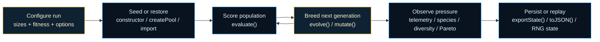
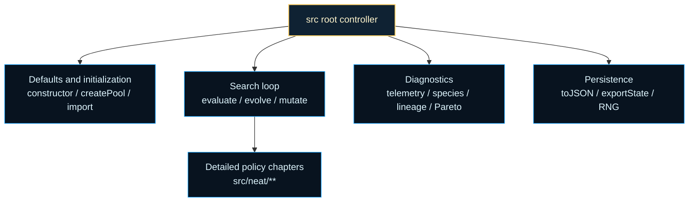
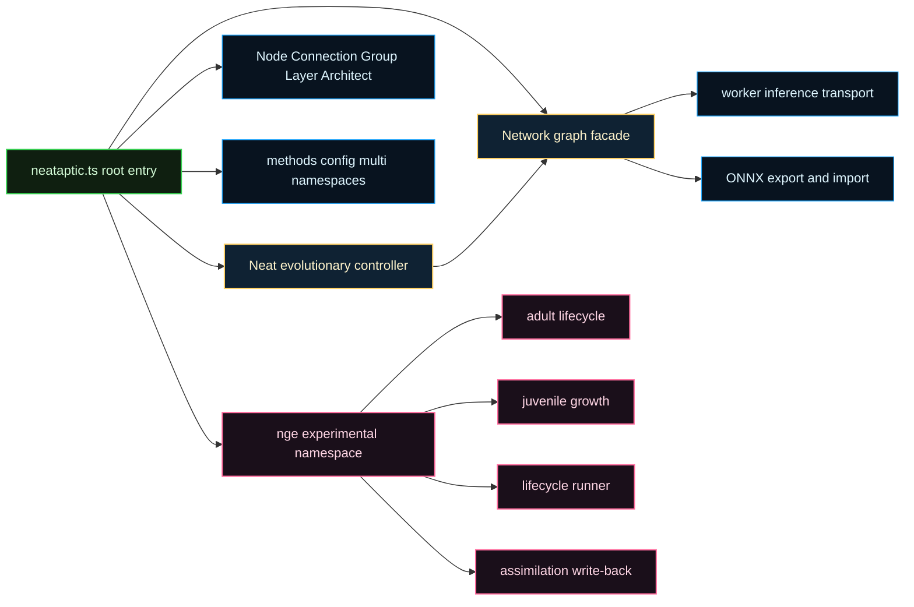

# src

Root orchestration surface for NeuroEvolution of Augmenting Topologies (NEAT) in NeatapticTS.

This root chapter is the public control desk for the library. The
architecture surfaces explain what a network graph is. The `src/neat/**`
chapters explain how evaluation, reproduction, speciation, telemetry, and
persistence work in detail. This file sits between those two layers and
answers the first practical reader question: how do I run one evolutionary
experiment without learning every subsystem in the same breath?

That boundary matters because a useful NEAT run is more than "mutate a
network." A controller has to keep a population alive, protect enough
diversity to avoid early collapse, score genomes fairly, record what
happened, and give the caller a deterministic way to pause or resume the
search. The root surface is where those responsibilities become one readable
workflow instead of a pile of helper calls.

One helpful mental model is to read the controller as four shelves. The setup
shelf decides population size, defaults, and reproducibility. The search
shelf drives `evaluate()`, `evolve()`, and the public mutation hooks. The
observability shelf exposes telemetry, lineage, diversity, species, and
Pareto views. The persistence shelf turns a live run into one of several
transport contracts: population-only snapshots through `export()` and
`import()`, best-effort restart bundles through `exportLightState()` and
`importLightState()`, meta-only controller state through `toJSON()` and
`fromJSON()`, and full pause-and-resume checkpoints through `exportState()`
and `importState()`.

The chapter also exists to keep the public class orchestration-first after
the internal split. `src/neat/**` now owns the heavier policy chapters:
`evaluate/` scores genomes, `evolve/` creates the next generation,
`speciation/` manages compatibility pressure, `telemetry/` records what the
run did, and `export/` plus `rng/` keep experiments reproducible. If you can
read the root workflow first, the subchapters become "why does this step
work?" reads instead of "where do I even start?" reads.

Read the persistence shelf as a decision ladder. Use `export()` and
`import()` when only genomes should travel. Use `toJSON()` and `fromJSON()`
when controller bookkeeping should travel without a live population. Use
`exportLightState()` and `importLightState()` when the next run should
restart from retained elites without claiming the same future random stream.
Use `exportState()` and `importState()` when a paused experiment should
resume with controller-owned replay state and explicit strict-versus-
best-effort restore semantics.

The guiding historical idea comes from Stanley and Miikkulainen's NEAT
paper: evolve both weights and topology while protecting innovation long
enough for new structures to prove useful. See Stanley and Miikkulainen,
[Evolving Neural Networks through Augmenting Topologies](https://nn.cs.utexas.edu/?stanley:ec02),
for the compact background behind the controller vocabulary that appears all
through this surface.

Read this root when you want to answer one of three questions quickly: how to
start a run, how to move it forward generation by generation, or how to
inspect and persist it without diving into every implementation chapter. Read
the narrower `src/neat/**` READMEs when the next question becomes about one
specific policy family rather than the whole experiment loop.





Example: start a small deterministic run and inspect the best score after one
generation.

```ts
const neat = new Neat(2, 1, fitness, {
  popsize: 50,
  seed: 7,
  fastMode: true,
});

await neat.evaluate();
const bestGenome = await neat.evolve();

console.log(bestGenome.score);
```

Example: capture telemetry and a replayable snapshot after the current run
step.

```ts
const latestTelemetry = neat.getTelemetry().at(-1);
const exportedState = neat.exportState();

console.log(latestTelemetry?.generation);
console.log(exportedState.neat.generation);
```

Example: choose the smaller light-checkpoint path when you want to restart
from retained elites instead of preserving the exact full controller state.

```ts
const lightCheckpoint = neat.exportLightState({ eliteCount: 8 });
const restarted = await Neat.importLightState(lightCheckpoint, fitness);

await restarted.evolve();
```

Recommended reading after this root chapter:
- `./neat/evaluate/README.md` for scoring flow and objective handling
- `./neat/evolve/README.md` for reproduction orchestration
- `./neat/speciation/README.md` for compatibility distance and sharing
- `./neat/telemetry/README.md` for diagnostics and export surfaces

## neat.ts

### DEFAULT_COMPATIBILITY_THRESHOLD

Default compatibility threshold controlling speciation distance.

This starts the speciation-pressure family of defaults. It is the neutral
boundary the controller uses before adaptive tuning or custom settings make
species splits stricter or more permissive.

### DEFAULT_DISJOINT_COEFF

Default disjoint coefficient for NEAT compatibility distance.

Matching the excess coefficient by default gives the root controller a
balanced structural view: excess and disjoint innovation gaps both count as
first-class evidence during compatibility comparisons.

### DEFAULT_DIVERSITY_GRAPHLET_SAMPLE

Default graphlet sample size used by diversity metrics in fast mode.

Read this beside {@link DEFAULT_DIVERSITY_PAIR_SAMPLE}: pair samples give the
controller quick distance evidence, while graphlet samples provide a small
structural texture read without forcing whole-population analysis.

### DEFAULT_DIVERSITY_PAIR_SAMPLE

Default pair-sample size used by diversity metrics in fast mode.

This starts the observability-sampling family. The root controller uses a
bounded sample instead of exhaustive pair checks so diversity reads stay
cheap enough for ordinary runs.

### DEFAULT_ELITISM

Default elitism count applied when unspecified.

Read this beside {@link DEFAULT_POPULATION_SIZE} and
{@link DEFAULT_PROVENANCE}: the trio defines how much of each generation is
reserved for carry-over, how much is freshly injected, and how much capacity
remains for ordinary offspring.

### DEFAULT_EXCESS_COEFF

Default excess coefficient for NEAT compatibility distance.

This begins the root compatibility-weight family. These coefficients explain
which kinds of genome disagreement matter most when the controller decides
whether two genomes still belong in the same species neighborhood.

### DEFAULT_MAX_CONNS

Default maximum allowed connections where `Infinity` means unbounded growth.

This preserves the same baseline policy as {@link DEFAULT_MAX_NODES}: the
controller does not impose a fixed connection ceiling unless the caller wants
one.

### DEFAULT_MAX_GATES

Default maximum allowed gates where `Infinity` means unbounded growth.

Gate limits stay in the same family as node and connection limits so the
whole structural-cap story remains consistent at the root surface.

### DEFAULT_MAX_NODES

Default maximum allowed nodes where `Infinity` means unbounded growth.

Read the three `DEFAULT_MAX_*` exports as one structural-ceiling family.
Leaving them unbounded by default tells the root controller to rely on
mutation policy, pruning, and adaptive limits instead of an immediate hard
cap.

### DEFAULT_MUTATION_AMOUNT

Default number of mutation operations applied per genome.

The default keeps the baseline search policy conservative: most runs mutate
often enough to keep topology moving, but each genome usually pays for only
one structural or parametric change per mutation pass.

### DEFAULT_MUTATION_RATE

Default mutation rate used by the root controller when no explicit rate is supplied.

This belongs to the same search-tempo family as
{@link DEFAULT_MUTATION_AMOUNT}. Together they define how often mutation is
attempted and how many mutation steps a genome can receive once mutation is
active.

### DEFAULT_NOVELTY_K

Default neighbor count for novelty search when `k` is unspecified.

This closes the root observability-and-exploration shelf. It controls how
many nearby behaviors contribute to novelty before the caller tunes novelty
search more explicitly.

### DEFAULT_POPULATION_SIZE

Default population size when caller does not specify `popsize`.

This opens the root defaults shelf's search-volume family. It controls how
many genomes compete in each generation before elitism, provenance, or
mutation pressure begin to reshape the population.

### DEFAULT_PROVENANCE

Default provenance count applied when unspecified.

Provenance is the root controller's small "fresh seed" policy. A value of
`0` means the default run does not spend population budget on extra
generation-zero style injections unless the caller asks for them.

### DEFAULT_WEIGHT_DIFF_COEFF

Default average weight difference coefficient for compatibility distance.

This keeps parameter drift relevant without letting weight deltas dominate
the whole speciation read. In the default family, topology disagreement still
carries more weight than modest edge-weight differences.

### Neat

High-level NEAT controller that keeps the public workflow linear while the implementation stays chaptered.

If you are learning the library, this is the class to read first. It owns the
practical experiment loop and answers the first questions most users ask:
how to seed a population, when to call `evaluate()` versus `evolve()`, how to
inspect species and telemetry, and how to export or replay a run deterministically.

Design-wise, `Neat` is intentionally orchestration-first. Mutation operators,
speciation rules, telemetry formatting, archive management, cache invalidation,
and pruning policies all live in dedicated modules so this top-level surface can
stay readable even as the underlying algorithm becomes richer.

Minimal workflow:

```ts
const neat = new Neat(2, 1, fitness, {
  popsize: 50,
  seed: 7,
  fastMode: true,
});

await neat.evaluate();
const bestGenome = await neat.evolve();

console.log(bestGenome.score);
console.log(neat.getTelemetry().at(-1));
```

#### _applyFitnessSharing

```ts
_applyFitnessSharing(): void
```

Apply fitness sharing adjustments within each species.

Returns: Adjusted species fitness data.

#### _compatibilityDistance

```ts
_compatibilityDistance(
  netA: default,
  netB: default,
): number
```

Compute compatibility distance between two networks (delegates to compat module).

Parameters:
- `netA` - First network for comparison.
- `netB` - Second network for comparison.

Returns: Compatibility distance scalar.

#### _computeDiversityStats

```ts
_computeDiversityStats(): DiversityStats
```

Compute and cache diversity statistics used by telemetry and tests.

Returns: Cached diversity statistics snapshot.

#### _diversityStats

Cached diversity metrics (computed lazily).

#### _fallbackInnov

```ts
_fallbackInnov(
  conn: ConnectionLike,
): number
```

Fallback innovation id resolver used when reuse mapping is absent.

Parameters:
- `conn` - Connection metadata used to derive the innovation id.

Returns: Innovation id for the connection.

#### _getObjectives

```ts
_getObjectives(): ObjectiveDescriptor[]
```

Internal: return cached objective descriptors, building if stale.

Returns: Cached or freshly built objective descriptors.

#### _getRNG

```ts
_getRNG(): () => number
```

Provide a memoized RNG function, initializing from internal state if needed.

Returns: RNG function bound to this instance.

#### _innovationTracker

Explicit owner for global innovation ids and generation-local reuse state.

#### _invalidateGenomeCaches

```ts
_invalidateGenomeCaches(
  genome: unknown,
): void
```

Invalidate per-genome caches (compatibility distance, forward pass, etc.).

Parameters:
- `genome` - Genome instance whose caches should be cleared.

#### _lastEvalDuration

Duration of the last evaluation run (ms).

#### _lastEvolveDuration

Duration of the last evolve run (ms).

#### _lastInbreedingCount

Last observed count of inbreeding (used for detecting excessive cloning).

#### _lineageEnabled

Whether lineage metadata should be recorded on genomes.

#### _mutateAddConnReuse

```ts
_mutateAddConnReuse(
  genome: default,
): void
```

Add-connection mutation that reuses global innovation ids when possible.

Parameters:
- `genome` - Genome receiving the mutation.

Returns: Mutated genome with added connection.

#### _mutateAddNodeReuse

```ts
_mutateAddNodeReuse(
  genome: default,
): Promise<void>
```

Add-node mutation that reuses global innovation ids when possible.

Parameters:
- `genome` - Genome receiving the mutation.

Returns: Mutated genome with added node.

#### _nextGenomeId

Counter for assigning unique genome ids.

#### _noveltyArchive

Novelty archive used by novelty search (behavior representatives).

#### _objectiveEvents

Queue of recent objective activation/deactivation events for telemetry.

#### _operatorStats

Operator statistics used by adaptive operator selection.

#### _paretoArchive

Archive of Pareto front metadata for multi-objective tracking.

#### _paretoObjectivesArchive

Archive storing Pareto objectives snapshots.

#### _prepareInnovationTrackerGeneration

```ts
_prepareInnovationTrackerGeneration(
  targetGeneration: number,
): void
```

Prepare the innovation tracker for a specific mutation-generation window.

#### _rng

Cached RNG function; created lazily and seeded from `_rngState` when used.

#### _rngState

Internal numeric state for the deterministic xorshift RNG when no user RNG is provided.

#### _sortSpeciesMembers

```ts
_sortSpeciesMembers(
  sp: SpeciesLike,
): void
```

Sort members within a species according to fitness and lineage rules.

Parameters:
- `sp` - Species whose members should be sorted.

Returns: Sorted species members.

#### _speciate

```ts
_speciate(): void
```

Partition population into species using configured compatibility metrics.

Returns: Updated species assignments.

#### _speciesHistory

Time-series history of species stats (for exports/telemetry).

#### _structuralEntropy

```ts
_structuralEntropy(
  genome: default,
): number
```

Compatibility wrapper retained for tests that reach `_structuralEntropy` through loose controller casts.

Parameters:
- `genome` - Genome whose structural entropy is calculated.

Returns: Structural entropy score for the genome.

#### _telemetry

Telemetry buffer storing diagnostic snapshots per generation.

#### _updateSpeciesStagnation

```ts
_updateSpeciesStagnation(): void
```

Update stagnation metrics per species to inform pruning and selection.

Returns: Updated stagnation state.

#### _warnIfNoBestGenome

```ts
_warnIfNoBestGenome(): void
```

Emit a standardized warning when evolution loop finds no valid best genome (test hook).

#### addGenome

```ts
addGenome(
  genome: default,
  parents: number[] | undefined,
): void
```

Register an externally-created genome into the `Neat` population.

Parameters:
- `genome` - Genome to append into the population.
- `parents` - Optional lineage metadata recorded for teaching and telemetry.

#### applyAdaptivePruning

```ts
applyAdaptivePruning(): Promise<void>
```

Run the adaptive pruning controller once using the controller's latest signals.

Unlike scheduled pruning, this path reacts to the current search state,
such as stagnation or complexity pressure, instead of only looking at the
generation index.

Returns: Promise resolving after adaptive pruning has completed.

#### applyEvolutionPruning

```ts
applyEvolutionPruning(): Promise<void>
```

Manually apply the configured generation-based pruning policy once.

This is mainly useful when you are experimenting with pruning behavior and
want to trigger the controller's scheduled pruning logic outside the normal
evolve loop.

Returns: Promise resolving after the pruning policy has been evaluated.

#### clearObjectives

```ts
clearObjectives(): void
```

Remove all custom objective registrations.

Use this when a run is changing from one multi-objective regime to another
and you want the controller to forget the previous objective schema.

#### clearParetoArchive

```ts
clearParetoArchive(): void
```

Clear the stored Pareto archive.

Use this when a new phase of a run should stop comparing itself against the
previous archive history.

#### clearTelemetry

```ts
clearTelemetry(): void
```

Clear the recorded telemetry history.

This does not reset the population or controller options. It only removes
the accumulated diagnostic snapshots so a new experiment phase can start
with a clean telemetry timeline.

#### createPool

```ts
createPool(
  network: default | null,
): void
```

Create the initial population pool, optionally cloning from a seed network.

This is the explicit population bootstrap surface. Call it when you want to
start from a known architecture template instead of relying on whatever setup
a surrounding example or harness applies for you.

Parameters:
- `network` - Optional template network copied into the initial pool.

#### ensureMinHiddenNodes

```ts
ensureMinHiddenNodes(
  network: default,
  multiplierOverride: number | undefined,
): Promise<void>
```

Ensure a network has the minimum number of hidden nodes according to configured policy.

#### ensureNoDeadEnds

```ts
ensureNoDeadEnds(
  network: default,
): void
```

Repair dead-end connectivity through the focused maintenance facade.

#### evaluate

```ts
evaluate(): Promise<void>
```

Evaluate the current population using the configured fitness function.
Delegates to the migrated evaluation helper to keep this class thin.

In practice, this is the scoring half of the controller loop. It transforms a
population of candidate networks into evidence the rest of the algorithm can use:
fitness scores, objective values, telemetry, diversity statistics, and derived
signals needed by selection or pruning.

Returns: Aggregated evaluation result (implementation specific).

#### evolve

```ts
evolve(): Promise<default>
```

Advance the evolutionary loop by one generation.

Conceptually, `evolve()` is the reproduction half of NEAT. It selects parents,
preserves elites and provenance when configured, applies structural and parametric
mutation, updates search bookkeeping, and returns the best genome observed for the step.
The heavy mechanics live in `src/neat/evolve/evolve.ts`; this method stays as the
readable front door to that orchestration.

Returns: Best genome selected by the evolution step.

Example:

// Score the current population first, then breed the next generation.
await neat.evaluate();
await neat.evolve();

#### export

```ts
export(): GenomeJSON[]
```

Export the current population as plain JSON objects.

Choose this lighter snapshot when you only need the genomes themselves and
do not need generation counters, innovation maps, or other controller-level
state. This is the smallest persistence contract on the facade, and it is
intentionally not a full replay artifact.

Returns: JSON-safe population snapshot.

Example:

```ts
const population = neat.export();
const destination = new Neat(2, 1, fitness, { popsize: 50 });

await destination.import(population);
```

#### exportLightState

```ts
exportLightState(
  exportOptions: NeatLightCheckpointExportOptions,
): NeatLightStateJSON
```

Export a light checkpoint containing retained elites plus bootstrap state.

This is the best-effort restart sibling of `exportState()`. It keeps only a
curated elite subset and the original restart-scale population target, so
the resulting bundle stays lighter while remaining honest about not being an
exact replay artifact.

Like the full checkpoint path, light bundles may also carry a top-level
`extensions` bag for downstream metadata. That add-on surface is reserved
for namespaced consumers and does not change the light checkpoint's
bootstrap semantics.

Parameters:
- `exportOptions` - Policy describing how many elite genomes to retain.

Returns: Light-checkpoint snapshot for approximate restart.

Example:

```ts
const checkpoint = neat.exportLightState({ eliteCount: 12 });
checkpoint.extensions = {
  myApp: {
    branchId: 'draft-1',
  },
};
```

#### exportParetoFrontJSONL

```ts
exportParetoFrontJSONL(
  maxEntries: number,
): string
```

Export recent Pareto archive entries as JSON Lines.

This is the easiest way to persist frontier history for offline analysis or
later replay in notebooks and visualization tools.

Parameters:
- `maxEntries` - Maximum number of recent archive entries to export.

Returns: JSONL payload for the requested Pareto archive window.

#### exportRNGState

```ts
exportRNGState(): number | undefined
```

Export the current RNG state for external persistence or tests.

Returns: Opaque RNG snapshot suitable for later replay.

#### exportSpeciesHistoryCSV

```ts
exportSpeciesHistoryCSV(
  maxEntries: number,
): string
```

Export recent species history as CSV.

This is useful when you want to chart species growth, collapse, or
stagnation in a spreadsheet or notebook without writing a custom parser.

Parameters:
- `maxEntries` - Maximum number of recent history entries to export.

Returns: CSV payload representing recent species history snapshots.

#### exportSpeciesHistoryJSONL

```ts
exportSpeciesHistoryJSONL(
  maxEntries: number,
): string
```

Export recent species history as JSON Lines.

Choose this when you want machine-friendly archival output instead of the
flatter spreadsheet-oriented CSV export.

Parameters:
- `maxEntries` - Maximum number of recent history entries to export.

Returns: JSONL payload describing recent species-history entries.

#### exportState

```ts
exportState(): NeatStateJSON
```

Export the full controller state, including metadata and population.

This is the pause-and-resume snapshot. It is the best choice when you want
to continue the same run later with the same innovation history, generation
counter, and serialized genomes.

Full checkpoints are also the bundle shape that owns strict-versus-
best-effort restore policy. Callers may attach a top-level `extensions` bag
for downstream metadata, but that add-on pocket does not redefine the core
full-checkpoint contract.

Returns: Full controller snapshot including metadata and population.

Example:

```ts
const checkpoint = neat.exportState();
checkpoint.extensions = {
  myApp: {
    memoryBankId: 'memory-bank-1',
  },
};
```

#### exportTelemetryCSV

```ts
exportTelemetryCSV(
  maxEntries: number,
): string
```

Export recent telemetry entries as CSV.

Parameters:
- `maxEntries` - Maximum number of recent telemetry entries to export.

Returns: CSV string for quick spreadsheet or notebook analysis.

#### exportTelemetryJSONL

```ts
exportTelemetryJSONL(): string
```

Export the telemetry buffer as JSON Lines.

JSONL is the easiest format to append to files, stream into data tools, or
inspect generation-by-generation without loading a giant array into memory.

Returns: JSONL payload with one telemetry entry per line.

#### fromJSON

```ts
fromJSON(
  json: NeatMetaJSON,
  fitness: NeatFitnessFunction,
): default
```

Rebuild a `Neat` controller from serialized metadata without importing a population bundle.

This is the lighter-weight sibling of `importState()`. It is useful when you
want controller defaults, innovation bookkeeping, or archive metadata back,
but you are handling genome population state separately.

A common pairing is `const meta = neat.toJSON()` plus `const population =
neat.export()`, followed later by `Neat.fromJSON(meta, fitness)` and
`restored.import(population)`.

Parameters:
- `json` - Serialized controller metadata produced by `toJSON()`.
- `fitness` - Fitness function to attach to the reconstructed controller.

Returns: Reconstructed `Neat` controller instance.

Example:

```ts
const meta = neat.toJSON();
const population = neat.export();

const restored = Neat.fromJSON(meta, fitness);
await restored.import(population);
```

#### getAverage

```ts
getAverage(): number
```

Calculates the average fitness score of the population.

#### getDiversityStats

```ts
getDiversityStats(): DiversityStats
```

Return the latest cached diversity statistics.

Diversity summaries answer a different question than raw fitness: whether
the population still explores varied structures or is collapsing toward a
narrower family of genomes.

Returns: Diversity metrics for the current population snapshot.

#### getFittest

```ts
getFittest(): default
```

Retrieves the fittest genome from the population.

#### getLineageSnapshot

```ts
getLineageSnapshot(
  limit: number,
): { id: number; parents: number[]; }[]
```

Return an array of {id, parents} for the first `limit` genomes in population.

Parameters:
- `limit` - Maximum number of lineage records to return.

Returns: Compact lineage snapshot for debugging and teaching inheritance flow.

#### getMinimumHiddenSize

```ts
getMinimumHiddenSize(
  multiplierOverride: number | undefined,
): number
```

Minimum hidden size considering explicit minHidden or multiplier policy.

#### getMultiObjectiveMetrics

```ts
getMultiObjectiveMetrics(): { rank: number; crowding: number; score: number; nodes: number; connections: number; }[]
```

Return compact multi-objective metrics for each genome in the current population.

Use this when you want a flattened view of Pareto rank, crowding, raw score,
and structural size without reconstructing the full fronts yourself.

Returns: One compact metric record per genome.

#### getNoveltyArchiveSize

```ts
getNoveltyArchiveSize(): number
```

Return the current novelty-archive size.

This is a small diagnostic hook that tells you whether novelty search is
actively accumulating behavior representatives or staying mostly unused.

Returns: Number of archived novelty descriptors.

#### getObjectiveEvents

```ts
getObjectiveEvents(): { gen: number; type: "add" | "remove"; key: string; }[]
```

Get recent objective add/remove events for telemetry exports and teaching.

#### getObjectiveKeys

```ts
getObjectiveKeys(): string[]
```

Public helper returning just the objective keys (tests rely on).

#### getObjectives

```ts
getObjectives(): { key: string; direction: "max" | "min"; }[]
```

Return a lightweight list of registered objective keys and their directions.

Returns: Objective descriptors currently active on the controller.

#### getOffspring

```ts
getOffspring(): default
```

Build a child genome from parent selection and crossover.

Use this when you want one reproduction event without running a full
generation step. The method delegates the parent choice to `getParent()` so
it still respects the controller's current breeding policy.

Returns: New network created from selected parent genomes.

#### getOperatorStats

```ts
getOperatorStats(): { name: string; success: number; attempts: number; }[]
```

Return mutation-operator success statistics.

These numbers are useful when operator adaptation is enabled and you want
to inspect which mutation operators are being rewarded or ignored.

Returns: Per-operator attempt and success counters.

#### getParent

```ts
getParent(): default
```

Select a parent genome using the controller's configured selection strategy.

Read this as the "who gets to reproduce" hook. The exact policy depends on
the current selection configuration, but the intent is always the same:
convert the scored population into a plausible breeding candidate.

Returns: The selected parent genome.

#### getParetoArchive

```ts
getParetoArchive(
  maxEntries: number,
): ParetoArchiveEntry[]
```

Return recent Pareto archive entries.

This is the metadata-oriented archive view. Use it when you want to inspect
what front snapshots were retained over time without exporting the full JSONL
payload first.

Parameters:
- `maxEntries` - Maximum number of recent archive entries to return.

Returns: Recent Pareto archive metadata entries.

#### getParetoFronts

```ts
getParetoFronts(
  maxFronts: number,
): default[][]
```

Reconstruct Pareto fronts for the current population snapshot.

Parameters:
- `maxFronts` - Maximum number of fronts to materialize.

Returns: Fronts ordered from most to least dominant under the active objectives.

#### getPerformanceStats

```ts
getPerformanceStats(): { lastEvalMs: number | undefined; lastEvolveMs: number | undefined; }
```

Return timing statistics for the latest evaluation and evolution steps.

This is a lightweight performance probe for experiments and benchmarks that
need to notice when scoring or breeding costs start drifting upward.

Returns: Recent runtime statistics for evaluation and evolution work.

#### getSpeciesHistory

```ts
getSpeciesHistory(): SpeciesHistoryEntry[]
```

Return the recorded species-history timeline.

Unlike `getSpeciesStats()`, which only reflects the current generation,
this method exposes the historical view used for trend analysis.

Returns: Species history entries in recorded order.

#### getSpeciesStats

```ts
getSpeciesStats(): { id: number; size: number; bestScore: number; lastImproved: number; }[]
```

Return a compact per-species summary for the current population snapshot.

This is the quickest inspection surface when you want to know how many
niches currently exist, how large they are, and whether they have improved
recently.

Returns: One summary record per active species.

#### getTelemetry

```ts
getTelemetry(): TelemetryEntry[]
```

Return the internal telemetry buffer.

Telemetry is the controller's teaching surface for understanding why a run is
behaving a certain way. Instead of watching only the best score, you can inspect
species counts, diversity, objective events, evaluation timing, and other search signals.

Returns: Recorded telemetry entries in chronological order.

#### import

```ts
import(
  json: GenomeJSON[],
): Promise<void>
```

Replace the current population with serialized genomes.

This is the population-only restore path. It keeps the current controller
instance, options, and metadata while swapping in a different genome set.
Use `importState()` when you want to restore controller metadata too.

Because this path replaces only genomes, it also treats the imported array
length as the controller's new runtime `popsize`. Use the light or full
checkpoint paths when you need to preserve a larger future population target
separately from the imported genome count.

Parameters:
- `json` - Serialized population to import into the current controller.

Returns: Promise resolving after the population is loaded.

Example:

```ts
const population = neat.export();
const destination = new Neat(2, 1, fitness, { popsize: 200 });

await destination.import(population);
console.log(destination.options.popsize); // imported population length
```

#### importLightState

```ts
importLightState(
  bundle: NeatLightStateJSON,
  fitness: NeatFitnessFunction,
): Promise<default>
```

Restore a light checkpoint produced by `exportLightState()`.

Use this when you want a smaller, best-effort restart bundle that preserves
retained elites and bootstrap controller settings without claiming exact
future replay. The restored controller keeps only the retained elites from
the bundle and then relies on the ordinary evolution path to refill toward
the saved restart-scale population target.

Parameters:
- `bundle` - Serialized light-checkpoint bundle.
- `fitness` - Fitness function to attach to the restored controller.

Returns: A `Neat` instance ready for approximate restart.

Example:

```ts
const checkpoint = neat.exportLightState({ eliteCount: 6 });
const restarted = await Neat.importLightState(checkpoint, fitness);

await restarted.evolve();
```

#### importRNGState

```ts
importRNGState(
  state: string | number | undefined,
): void
```

Import an RNG state (alias for restore; kept for compatibility).

Parameters:
- `state` - Numeric RNG state.

Returns: Nothing. This is a compatibility alias for `restoreRNGState()`.

#### importState

```ts
importState(
  bundle: NeatStateJSON,
  fitness: NeatFitnessFunction,
  restoreOptions: NeatCheckpointRestoreOptions | undefined,
): Promise<default>
```

Restore a full evolutionary snapshot produced by `exportState()`.

Use this when you want a paused experiment to resume with its controller
metadata, population, and archival context intact rather than rebuilding
only the bare genomes.

Read this as the exact-resume door. In `strict` mode, versioned bundles
must still carry replay-critical runtime and speciation state. Use
`best-effort` only when the caller is deliberately accepting a degraded
restore that should keep running without claiming deterministic replay.

Parameters:
- `bundle` - Serialized object with the shape `{ neat, population }`.
- `fitness` - Fitness function to attach to the restored controller.
- `restoreOptions` - Explicit restore-mode override. Defaults to strict exact resume.

Returns: A `Neat` instance ready to continue evolution from the imported state.

Example:

```ts
const checkpoint = neat.exportState();
const resumed = await Neat.importState(checkpoint, fitness, {
  restoreMode: 'strict',
});

await resumed.evolve();
```

#### mutate

```ts
mutate(): Promise<void>
```

Apply mutation pressure to the current population without advancing generation bookkeeping.

This is the direct "variation" lever. Use it when you want to perturb the
current genomes in place for an experiment, a custom training loop, or a
test harness that separates mutation from the rest of `evolve()`.
In the normal NEAT workflow, `evolve()` is usually the better entry point
because it coordinates parent selection, elitism, offspring creation, and
mutation as one generation step.

Returns: Promise resolving once mutation has been applied to the current population.

#### registerObjective

```ts
registerObjective(
  key: string,
  direction: "max" | "min",
  accessor: (network: default) => number,
): void
```

Register a custom objective for multi-objective optimization.

Register objectives when a single scalar score is too narrow to express the
behavior you want. The controller can then reason about tradeoffs such as raw
score versus simplicity, novelty, or domain-specific constraints.

Parameters:
- `key` - Stable objective identifier used in exports and telemetry.
- `direction` - Whether the objective should be minimized or maximized.
- `accessor` - Function extracting the objective value from a genome.

#### resetNoveltyArchive

```ts
resetNoveltyArchive(): void
```

Reset the novelty archive.

This is useful when you want to restart novelty pressure from a clean slate
without rebuilding the whole controller.

#### restoreRNGState

```ts
restoreRNGState(
  state: string | number | undefined,
): void
```

Restore a previously-snapshotted RNG state. This restores the internal
seed but does not re-create the RNG function until next use.

Parameters:
- `state` - Opaque numeric RNG state produced by `snapshotRNGState()`.

Returns: Nothing. The controller will resume from the restored RNG state on next use.

#### sampleRandom

```ts
sampleRandom(
  sampleCount: number,
): number[]
```

Produce deterministic random samples using the instance RNG.

Parameters:
- `sampleCount` - Number of random values to generate.

Returns: Array of deterministic random samples.

#### selectMutationMethod

```ts
selectMutationMethod(
  genome: default,
  rawReturnForTest: boolean,
): Promise<MutationMethod | MutationMethod[] | null>
```

Selects a mutation method for a given genome based on constraints.

Parameters:
- `genome` - Genome being considered for mutation.
- `rawReturnForTest` - Whether to expose raw selection output for test visibility.

Returns: Selected mutation method or `null` when no valid method can be chosen.

#### snapshotRNGState

```ts
snapshotRNGState(): number | undefined
```

Return the current opaque RNG numeric state used by the instance.
Useful for deterministic test replay and debugging.

Returns: Snapshot of the current controller RNG state.

#### sort

```ts
sort(): void
```

Sorts the population in descending order of fitness scores.

#### spawnFromParent

```ts
spawnFromParent(
  parent: default,
  mutateCount: number,
): default
```

Spawn a new genome derived from a single parent while preserving Neat bookkeeping.

Parameters:
- `parent` - Parent genome to clone and mutate.
- `mutateCount` - Number of mutation passes to apply to the child.

Returns: Child genome registered with the same bookkeeping conventions as normal evolution.

#### toJSON

```ts
toJSON(): NeatMetaJSON
```

Serialize controller metadata without the concrete population.

This is useful when you want to preserve run configuration and innovation
bookkeeping separately from genome payloads, or when the population will be
reconstructed by other means.

Read this as the controller-half of the population-plus-meta pairing. When
a later restore should reconstruct the bookkeeping first and import genomes
separately, pair `toJSON()` with `export()` instead of jumping straight to
the full checkpoint path.

Returns: JSON-safe metadata snapshot useful for innovation-history persistence.

Example:

```ts
const meta = neat.toJSON();
const population = neat.export();

const restored = Neat.fromJSON(meta, fitness);
await restored.import(population);
```

### NeatCheckpointRestoreOptions

Public restore options for `Neat.importState()`.

Use `strict` to preserve the exact-resume contract. Use `best-effort` only
when the caller is explicitly accepting a partial checkpoint that should
continue as a usable run without claiming deterministic replay.

### NeatLightCheckpointExportOptions

Export options for `Neat.exportLightState()`.

Callers use this to choose how many elite genomes the light checkpoint keeps
for approximate restart.

### NeatLightStateJSON

Public payload shape used by the light-checkpoint save/load path.

This bundle preserves a curated elite subset plus controller bootstrap state,
but it intentionally omits exact-replay innovation and runtime metadata.

### NeatOptions

Public configuration bag for `Neat` evolutionary runs.

`NeatOptions` collects the knobs that shape how search pressure is applied.
In practice, readers can think about the options in four teaching-friendly groups:

- search size and tempo: `popsize`, `elitism`, `provenance`, `mutationRate`, `mutationAmount`
- species formation: compatibility threshold plus the excess, disjoint, and weight-difference coefficients
- observability: telemetry, lineage, diversity sampling, species history, Pareto archive controls
- reproducibility: `seed`, imported RNG state, and exported run state

That organization matters because most experiment tuning questions are really
questions about pressure: how many candidates compete, how disruptive mutation
should feel, how aggressively genomes split into species, and how much evidence
you want to retain while the run is unfolding.

```ts
const options: NeatOptions = {
  popsize: 150,
  elitism: 5,
  mutationRate: 0.6,
  compatibilityThreshold: 3,
  fastMode: true,
  seed: 42,
};

const neat = new Neat(3, 1, fitness, options);
```

This alias stays intentionally permissive for compatibility with legacy callers.
Prefer treating it as the stable front door and the narrower helper-level types in
`src/neat/**` as implementation detail.

## config.ts

Global NeatapticTS configuration contract & default instance.

WHY THIS EXISTS
--------------
A central `config` object offers a convenient, documented surface for end-users (and tests)
to tweak library behaviour without digging through scattered constants. Centralization also
lets us validate & evolve feature flags in a single place.

USAGE PATTERN
------------
  import { config } from 'neataptic-ts';
  config.warnings = true;              // enable runtime warnings
  config.deterministicChainMode = true // opt into deterministic deep path construction

Adjust BEFORE constructing networks / invoking evolutionary loops so that subsystems read
the intended values while initializing internal buffers / metadata.

DESIGN NOTES
------------
- We intentionally avoid setters / proxies to keep this a plain serializable object.
- Optional flags are conservative by default (disabled) to preserve legacy stochastic
  behaviour unless a test or user explicitly opts in.

### ActivationPrecision

Shared activation precision identifiers reused by all runtime precision owners.

### DEFAULT_ACTIVATION_PRECISION

Canonical activation precision used when no lower-precision mode is requested.

### NeatapticConfig

Global NeatapticTS configuration contract & default instance.

WHY THIS EXISTS
--------------
A central `config` object offers a convenient, documented surface for end-users (and tests)
to tweak library behaviour without digging through scattered constants. Centralization also
lets us validate & evolve feature flags in a single place.

USAGE PATTERN
------------
  import { config } from 'neataptic-ts';
  config.warnings = true;              // enable runtime warnings
  config.deterministicChainMode = true // opt into deterministic deep path construction

Adjust BEFORE constructing networks / invoking evolutionary loops so that subsystems read
the intended values while initializing internal buffers / metadata.

DESIGN NOTES
------------
- We intentionally avoid setters / proxies to keep this a plain serializable object.
- Optional flags are conservative by default (disabled) to preserve legacy stochastic
  behaviour unless a test or user explicitly opts in.

### PrecisionConfig

Shared precision configuration resolved for one concrete activation-path runtime decision.

### PrecisionConfigOverrides

Optional explicit activation precision overrides supplied by one caller-owned boundary.

### resolvePrecisionConfig

```ts
resolvePrecisionConfig(
  overrides: PrecisionConfigOverrides,
  precisionFlags: Pick<NeatapticConfig, "float32Mode">,
): PrecisionConfig
```

Resolve one shared precision config from explicit overrides and legacy float32 mode.

Phase 6 centralizes precision ownership here so constructor bootstrap and
activation-buffer allocation reuse the same precedence rule: explicit
activation precision wins, otherwise the legacy global float32 flag decides
between f32 and the default f64 path.

Parameters:
- `overrides` - Optional caller-owned precision overrides.
- `precisionFlags` - Config-like flag source exposing legacy float32 mode.

Returns: Shared precision config for the current runtime decision.

## neataptic.ts

Root public entry point for the NeatapticTS library.

Import everything you need for NEAT-based neuroevolution from this single
surface. The library organizes its exports into five cooperating layers:

- **`Neat`** — the NEAT evolutionary controller: population management,
  speciation, selection, mutation, and crossover.
- **`Network`** — the mutable graph: activation, training, structural
  editing, serialization, and ONNX export.
- **Primitives** — `Node`, `Connection`, `Group`, `Layer`, `Architect` for
  hand-assembling custom architectures.
- **Namespaces** — `methods` (activation functions, cost functions, mutation
  and selection operators), `config` (global library settings), `multi`
  (worker-thread parallel evaluation).
- **`nge`** — experimental Genesis EvoDevo (NGE) lifecycle namespace. A narrow,
  unstable preview of adult staging, juvenile growth, lifecycle
  orchestration, and assimilation write-back. Not covered by the stable
  public API contract.

The NEAT algorithm behind the `Neat` controller was introduced by Stanley
and Miikkulainen,
[Evolving Neural Networks through Augmenting Topologies](https://nn.cs.utexas.edu/?stanley:ec02).



Examples:

```ts
import { Neat, Network, methods, config } from 'neataptic';

// Configure global settings
config.backend = 'float32';

// Build a feed-forward network directly
const network = Network.createMLP(2, [4], 1);
const output = network.activate([0.5, 0.8]);

// Run NEAT evolution on a population
const neat = new Neat(2, 1, fitnessFunction, { popsize: 50 });
await neat.evolve();
```

```ts
const network = Network.createMLP(2, [4], 1);
const output = network.activate([0, 1]);
```

```ts
const sensor = new Node('input');
const readout = new Node('output');

readout.describe({
  label: 'readoutNode',
  metadata: { stage: 'policy' },
});
```

```ts
const sensorBlock = new Group(4, 'input');
const readoutBlock = new Group(2, 'output');

sensorBlock.describe({
  label: 'sensorBlock',
  metadata: { stage: 'encoder' },
});
readoutBlock.describe({
  label: 'readoutBlock',
  metadata: { stage: 'readout' },
});

sensorBlock.connect(
  readoutBlock,
  methods.groupConnection.ALL_TO_ALL,
);
```

```ts
const source = new Node('input');
const target = new Node('output');
const edge = new Connection(source, target, 0.42);

edge.gain = 1.5;
edge.enabled = true;
```

```ts
const network = Architect.perceptron(2, 4, 1);
const output = network.activate([0, 1]);
```

### AutoInferenceTransport

Automatically selected worker-backed inference transport tier for the current host.

- `'shared-memory'` — SharedArrayBuffer transfer path when cross-origin isolation is active.
- `'channel'` — Persistent channel worker when a channel-worker script was delivered.
- `'transferable'` — Universal typed-array fallback when higher tiers are unavailable.

### BatchEvaluationResult

Ordered result envelope returned by `evaluateInWorkers(...)`.

The helper preserves input order even when individual worker tasks finish out
of order, and it reports stable task ids so callers can correlate results
with their original batch shelf without reconstructing indexes manually.

### BrowserWorkerAssetUrlOptions

Options for resolving a browser worker asset URL relative to the current script or an explicit base URL override.

When `baseUrl` is omitted the helper falls back to `document.currentScript.src`
and then `location.href`, keeping the worker and host bundle co-located by default.

### centerPositionedNodesInDrawableArea

```ts
centerPositionedNodesInDrawableArea(
  positionedNodes: PositionedNetworkNode[],
  drawableWidthPx: number,
  drawableLeftPx: number,
): PositionedNetworkNode[]
```

Centers positioned nodes horizontally within the drawable area.

Shifts all node x-coordinates so the leftmost and rightmost nodes
are balanced around the center of available space.

Parameters:
- `positionedNodes` - Positioned nodes.
- `drawableWidthPx` - Drawable width.

Returns: Centered positioned nodes.

### createInferencePredictor

```ts
createInferencePredictor(
  payload: PortableInferencePayload,
): InferencePredictor
```

Create an inference predictor adapter so callers can execute compiled network inference repeatedly with transport-aware worker or local execution backends.

### createNeatParallelPopulationEvaluator

```ts
createNeatParallelPopulationEvaluator(
  options: NeatParallelPopulationEvaluatorOptions<TGenome, TPayload, TWorker, TResult>,
): (population: TGenome[]) => Promise<void>
```

Create a NEAT-compatible population fitness delegate on top of `evaluateInWorkers(...)`.

The returned function matches `fitnessPopulation: true` evaluation mode: it
scores the whole population in one async call and writes ordered results back
onto the genomes in place.

Parameters:
- `options` - Boolean-first population-evaluation options plus advanced worker overrides.

Returns: Population fitness delegate compatible with `fitnessPopulation: true`.

Example:

```ts
const evaluatePopulation = createNeatParallelPopulationEvaluator({
  parallel: true,
  evaluateGenome: async (genome) => genome.score ?? 0,
  openWorker: (payload) => openSharedInferenceWorker(payload),
  evaluateWithWorker: async (worker, genome) => worker.infer(genome.activate([0, 1])),
});
```

### detectInferenceWorkerCapabilities

```ts
detectInferenceWorkerCapabilities(
  options: InferenceWorkerCapabilityOptions,
): InferenceWorkerCapabilities
```

Detect the usable worker-backed inference transport tiers for one host.

The probe stays intentionally lightweight. It does not open a worker or fetch
a script; it only combines runtime facts and delivery availability so callers
can decide whether to use shared-memory, channel, or transferable fallback.

Parameters:
- `options` - Runtime and delivery facts for the current host.

Returns: Capability snapshot describing the usable transport tiers.

Example:

```ts
const capabilities = detectInferenceWorkerCapabilities({
  hasChannelWorker: true,
  hasSharedWorker: true,
  runtime: 'browser',
});
```

### EdgePadding

Define drawable edge padding constraints so visualization layout helpers can reserve safe margins around graph links, labels, and annotation overlays across canvas and SVG render targets.

### evaluateCandidate

```ts
evaluateCandidate(
  network: default,
  dataset: TrainingSample[],
  options: EvaluateCandidateOptions,
): Promise<HybridEvaluationResult>
```

Evaluate one candidate under an explicit hybrid fine-tune policy.

The helper keeps policy decisions visible: `fineTune` controls whether
training runs, `scoreNetwork` decides how the selected network state is
scored, and `persistTrainedWeights` controls whether the trained vector is
applied back to the original candidate after a successful score.
`persistTrainedWeights: false` is the safe default because the trained
variant is otherwise discarded after scoring.

`conditional` remains blocked until the NEAT evaluation surface exposes a
deterministic ranking or tie-break contract. This helper inherits the
same-runtime ordered determinism limits of `fineTuneVector(...)`; it does
not claim cross-runtime exact replay.

```ts
import { Network, evaluateCandidate } from 'neataptic';

const network = new Network(2, 1);
const dataset = [
  { input: [0, 0], output: [0] },
  { input: [1, 1], output: [0] },
  { input: [1, 0], output: [1] },
  { input: [0, 1], output: [1] },
];

// Fitness-only: fine-tune a detached clone, score it, discard trained weights.
const fitnessOnly = await evaluateCandidate(network, dataset, {
  policy: { fineTune: 'always', persistTrainedWeights: false },
  fineTuneOptions: { steps: 50, learningRate: 0.01, seed: 42 },
  scoreNetwork: (candidate) => -candidate.test(dataset, { cost: 'mse' }).error,
});
console.log('fitness:', fitnessOnly.fitness); // original candidate unchanged

// Lamarckian: apply trained weights back to the candidate on explicit opt-in.
const lamarckian = await evaluateCandidate(network, dataset, {
  policy: { fineTune: 'always', persistTrainedWeights: true },
  fineTuneOptions: { steps: 50, learningRate: 0.01, seed: 42 },
  scoreNetwork: (candidate) => -candidate.test(dataset, { cost: 'mse' }).error,
});
console.log('fitness after persistence:', lamarckian.fitness);
```

Parameters:
- `network` - Live candidate selected by the caller's fitness delegate.
- `dataset` - Ordered training samples passed to `fineTuneVector(...)` when training runs.
- `options` - Explicit policy, training settings, and scoring callback.

Returns: Fitness plus the detached trained network when fine-tuning runs.

### EvaluateCandidateOptions

Inputs for one standalone hybrid candidate evaluation.

`fineTuneOptions` is required whenever `policy.fineTune !== 'never'`
because this helper delegates training to `fineTuneVector(...)` rather than
guessing learning settings.

### evaluateInWorkers

```ts
evaluateInWorkers(
  options: EvaluateInWorkersOptions<TInput, TPayload, TWorker, TResult>,
): Promise<BatchEvaluationResult<TResult>>
```

Evaluates an ordered batch through workers when available, otherwise locally.

This helper keeps the honest async boundary visible: callers provide worker
opening plus task execution when they want parallelism, and they also provide
a local fallback when they need the same semantics in worker-less hosts.

Parameters:
- `options` - Ordered inputs plus worker and fallback execution hooks.

Returns: Ordered batch results with elapsed time and stable task ids.

Example:

```ts
const batchResult = await evaluateInWorkers({
  inputs: payloads,
  openWorker: (payload) => openSharedInferenceWorker(payload),
  evaluateWithWorker: (worker, _payload) => worker.infer([0.25, 0.75]),
});
```

### EvaluateInWorkersOptions

Generic ordered batch-evaluation options for worker and fallback execution.

Keep the transport substrate caller-owned: this helper schedules and assembles
deterministic results, but the caller still decides how a worker is opened,
how a task is scored, and what the single-thread fallback should do.

### exportPortableInferencePayload

```ts
exportPortableInferencePayload(
  network: default,
): PortableInferencePayload
```

Export a portable inference payload so non-transferable runtimes can hydrate prediction graphs from plain structured-clone-safe objects while preserving stable node-edge ordering for reproducible inference behavior.

### exportTransferableInferencePayload

```ts
exportTransferableInferencePayload(
  network: default,
  options: TransferableInferencePayloadOptions,
): TransferableInferencePayload
```

Export a transferable inference payload so worker channels can move typed-array-heavy inference data efficiently between threads with explicit ownership transfer and minimal serialization overhead.

### exportVisualizationGraph

```ts
exportVisualizationGraph(
  network: default,
  options: ExportVisualizationOptions | undefined,
): VisualizationGraphV1
```

Exports a deterministic, versioned visualization graph from a live network.

The returned `VisualizationGraphV1` object is a plain JSON-serializable value
with no circular references. It can be passed to a canvas renderer, terminal
renderer, or serialized to disk.

**Ordering guarantees:**
- `nodes` are sorted by stable gene id ascending.
- `edges` are sorted by (from gene id, to gene id) ascending.
- `io.inputNodeIds` and `io.outputNodeIds` preserve the network's explicit
  I/O ordering (same as {@link Network.inputNodeIds} / {@link Network.outputNodeIds}).

Parameters:
- `network` - The network instance to export.
- `options` - Optional flags controlling which fields are included.

Returns: Versioned, deterministic visualization graph.

Example:

```ts
const graph = exportVisualizationGraph(network, { includeBiases: true });
// graph.version === 1
// graph.nodes[0].role === 'input'
// graph.edges[0].kind === 'forward'
```

### ExportVisualizationOptions

Options controlling which fields are included in the exported visualization graph.

All options default to `true` (maximum detail) unless explicitly set to `false`.

Example:

```ts
// Lightweight export: omit weights and biases for a large evolved network.
const graph = exportVisualizationGraph(network, {
  includeWeights: false,
  includeBiases: false,
});
```

### extractNetworkInferenceIR

```ts
extractNetworkInferenceIR(
  network: default,
): NetworkInferenceIR
```

Extract network inference intermediate representation so worker transport helpers and portable payload exporters can serialize deterministic execution structures without requiring the original mutable network instance at runtime.

### FineTuneOptions

Explicit settings for one isolated fine-tune pass.

`steps` maps to the training loop iteration count and `learningRate` maps to
the training rate. `seed` is optional because same-runtime ordered
determinism only becomes a strong claim when the caller supplies both a
stable dataset order and an explicit deterministic seed.

Without an explicit `seed`, the helper still guarantees isolation: the
original network and vector are never mutated, but repeated calls may
produce different trained vectors when the underlying training loop contains
stochastic behaviour such as dropout.

### FineTuneResult

Detached result from one isolated fine-tune pass.

The helper returns a trained parameter vector rather than a mutated network
so shared candidate state stays outside the training-owned boundary. Metrics
are numeric summaries from the existing training loop, not persisted
optimizer or runtime state.

The returned `trainedVector` can be compared against the original vector,
forwarded to a worker for scoring, persisted as a checkpoint delta, or
discarded when only the fitness score matters.

### fineTuneVector

```ts
fineTuneVector(
  baseNetwork: default,
  vector: ParameterVector,
  dataset: TrainingSample[],
  options: FineTuneOptions,
): FineTuneResult
```

Fine-tune one parameter vector against an ordered dataset without mutating shared state.

The helper clones `baseNetwork`, applies `vector` to that working copy,
optionally installs an explicit deterministic seed via `Network.setSeed(...)`,
runs the existing training loop in the caller-provided dataset order, and
returns a new `ParameterVector` exported from the trained working copy. The
supplied `baseNetwork` and `vector` are read-only inputs to this helper.

Determinism is intentionally scoped. On the same runtime, repeated calls can
return the same trained vector when topology, dataset order, training
settings, and explicit `seed` all match. This helper does not claim
cross-runtime exact replay, and it does not return transient optimizer,
activation, or recurrent runtime state.

```ts
// Export the current parameter vector, fine-tune a working copy, and
// inspect fitness metrics without modifying the shared candidate network.
const vector = toParameterVector(candidate);
const { trainedVector, metrics } = fineTuneVector(candidate, vector, dataset, {
  steps: 50,
  learningRate: 0.01,
  seed: 42,
});
console.log('training error:', metrics?.error);
// `candidate` and `vector` are unchanged after this call.
```

Parameters:
- `baseNetwork` - Topology source cloned for the isolated working copy.
- `vector` - Ordered parameter payload applied to the working copy only.
- `dataset` - Ordered training samples consumed without shuffling.
- `options` - Explicit training settings and optional deterministic seed.

Returns: Detached trained vector plus numeric training metrics.

### formatConstructSummary

```ts
formatConstructSummary(
  constructResult: ConstructResult,
): string
```

Build a compact human-readable summary for one construct-from-parts result.

The summary is layered on top of the detached `ConstructResult.graph`
snapshot so tooling can log or display one stable explanation of the built
graph without reading mutable `Network` internals.

Parameters:
- `constructResult` - Construct result returned by `Network.construct(...)`.

Returns: Multi-line summary string suitable for logs, diagnostics panels, or snapshots.

Example:

```ts
const construction = Network.construct([sensor, hidden, readout]);
const summary = formatConstructSummary(construction);
```

### fromParameterVector

```ts
fromParameterVector(
  network: default,
  parameterVector: ParameterVector,
): void
```

Import one versioned parameter vector into a compatible live network runtime.

The target layout is rebuilt fresh and validated against the incoming vector
before any bias or weight mutation occurs. Version `1` applies only live
node biases and live forward-connection or self-connection weights, so
disabled connections still consume slots whenever they still exist in the
target runtime graph. Ordered descriptor compatibility stays innovation-first
and falls back to stable endpoint gene ids when an innovation id is absent,
which keeps same-runtime imports aligned with the export layout contract.
Import rejects non-neutral `node.response` and `connection.gain` explicitly
and also rejects version, entry-count, values-length, or descriptor mismatch
before mutation.

Parameters:
- `network` - Live target network instance.
- `parameterVector` - Versioned payload to apply.

Returns: Nothing. The target runtime mutates only after compatibility checks pass.

### getTransferList

```ts
getTransferList(
  payload: TransferableInferencePayload,
): ArrayBuffer[]
```

Collect every transferable buffer from one typed-array inference payload.

Transfer these buffers exactly once when posting the payload to a worker.
After the transfer completes, the sending-side typed arrays are neutered and
must not be read again.

Parameters:
- `payload` - Transferable inference payload whose buffers should move.

Returns: ArrayBuffer transfer list aligned to the payload's typed shelves.

Example:

```ts
const payload = exportTransferableInferencePayload(network);
worker.postMessage(payload, getTransferList(payload));
```

### HybridEvaluationPolicy

Explicit hybrid policy for one candidate evaluation.

Recommended progression keeps the policy easy to reason about: start with
`fineTune: 'never'` to measure the evolutionary baseline, move to
`fineTune: 'always'` with `persistTrainedWeights: false` for fitness-only
Baldwin-style scoring, and opt into `persistTrainedWeights: true` only when
deliberate Lamarckian carry-forward is part of the experiment. `conditional`
remains blocked until the caller can supply a deterministic ranking or
tie-break contract.

Persistence stays separate from the fine-tune trigger so fitness-only
scoring remains the safe default. Callers should keep
`persistTrainedWeights` false unless they explicitly want Lamarckian
persistence after a successful score.

### HybridEvaluationResult

Result from one hybrid candidate evaluation pass.

`trainedNetwork` is present only when fine-tuning runs. Fitness-only callers
can inspect the detached trained variant without mutating the canonical
candidate, while Lamarckian callers receive the same trained snapshot that
was scored before explicit persistence is applied.

Typical downstream uses include: forwarding `fitness` to the NEAT population
score, comparing `trainedNetwork` weights against the original candidate to
measure fine-tune delta, checkpointing the trained snapshot, or discarding
the result entirely when only the fitness score matters.

### HybridFineTuneMode

Explicit fine-tune trigger for one hybrid evaluation pass.

- `never` evaluates the live candidate as-is without calling any training helper.
- `always` fine-tunes a detached clone before scoring; whether trained weights
  persist back is controlled separately by `HybridEvaluationPolicy.persistTrainedWeights`.
- `conditional` requires a deterministic ranking or tie-break contract at the
  evaluation boundary before it can be unblocked. Passing `conditional` to
  `evaluateCandidate` throws at runtime until that surface exists.

### HybridScoreNetwork

```ts
HybridScoreNetwork(
  candidate: default,
): number | Promise<number>
```

Scoring callback used after the helper resolves the network state to score.

The callback may be synchronous or async, but it should treat the supplied
network as the exact candidate state selected by the hybrid policy.

### INFERENCE_ACTIVATION_TABLE

Stable activation-function table used by worker inference transport.

Each entry index is part of the public inference payload contract. New worker
payloads should reference activations by these numeric ids rather than by
serializing function bodies or relying on runtime function identity.

Example:

```ts
const activationFunction = INFERENCE_ACTIVATION_TABLE[0];
const outputValue = activationFunction(0.5);
```

### InferenceChannel

Persistent worker-backed inference channel.

Channels bootstrap one transferable predictor payload exactly once, then keep
the worker-side predictor warm across repeated predict or reset requests sent
through one dedicated `MessageChannel` port pair.

Example:

```ts
const payload = exportTransferableInferencePayload(network);
const channel = openInferenceChannel(payload);
const outputValues = await channel.predict([0.25, 0.75]);
channel.close();
```

### InferenceChannelOptions

Configure inference channel behavior so request multiplexing, worker lifecycle transitions, and batching semantics remain explicit for asynchronous prediction clients across browser and node worker transports.

### InferencePredictor

Runtime predictor created from an exported worker payload.

Predictors intentionally keep mutable activation, recurrent-state, and gain
buffers private so callers can reuse the same instance across many
predictions without re-allocating worker state.

Example:

```ts
const predictor = createInferencePredictor(payload);
const outputValues = predictor.predict([0.25, 0.75]);
predictor.reset();
```

### InferenceWorkerCapabilities

Capability snapshot for the current worker-backed inference host.

This probe answers a narrow question: which worker transport tiers are
honestly usable in the current runtime before one evaluation pool or batch
helper commits to a transport strategy?

Example:

```ts
const capabilities = detectInferenceWorkerCapabilities({
  crossOriginIsolated: globalThis.crossOriginIsolated === true,
  hasChannelWorker: true,
  hasSharedWorker: true,
  runtime: 'browser',
});
const transport = resolveAutoInferenceTransport(capabilities);
```

### InferenceWorkerCapabilityOptions

Inputs used to probe worker-backed inference transport support.

Keep delivery facts explicit here. Step 1 only answers capability and auto
selection; Step 2 will own the generic worker-entry and URL resolution
helpers that feed these booleans.

Example:

```ts
const capabilities = detectInferenceWorkerCapabilities({
  crossOriginIsolated: false,
  hasChannelWorker: true,
  hasSharedWorker: true,
  runtime: 'browser',
});
```

### Neat

High-level NEAT controller that keeps the public workflow linear while the implementation stays chaptered.

If you are learning the library, this is the class to read first. It owns the
practical experiment loop and answers the first questions most users ask:
how to seed a population, when to call `evaluate()` versus `evolve()`, how to
inspect species and telemetry, and how to export or replay a run deterministically.

Design-wise, `Neat` is intentionally orchestration-first. Mutation operators,
speciation rules, telemetry formatting, archive management, cache invalidation,
and pruning policies all live in dedicated modules so this top-level surface can
stay readable even as the underlying algorithm becomes richer.

Minimal workflow:

```ts
const neat = new Neat(2, 1, fitness, {
  popsize: 50,
  seed: 7,
  fastMode: true,
});

await neat.evaluate();
const bestGenome = await neat.evolve();

console.log(bestGenome.score);
console.log(neat.getTelemetry().at(-1));
```

#### _applyFitnessSharing

```ts
_applyFitnessSharing(): void
```

Apply fitness sharing adjustments within each species.

Returns: Adjusted species fitness data.

#### _compatibilityDistance

```ts
_compatibilityDistance(
  netA: default,
  netB: default,
): number
```

Compute compatibility distance between two networks (delegates to compat module).

Parameters:
- `netA` - First network for comparison.
- `netB` - Second network for comparison.

Returns: Compatibility distance scalar.

#### _computeDiversityStats

```ts
_computeDiversityStats(): DiversityStats
```

Compute and cache diversity statistics used by telemetry and tests.

Returns: Cached diversity statistics snapshot.

#### _diversityStats

Cached diversity metrics (computed lazily).

#### _fallbackInnov

```ts
_fallbackInnov(
  conn: ConnectionLike,
): number
```

Fallback innovation id resolver used when reuse mapping is absent.

Parameters:
- `conn` - Connection metadata used to derive the innovation id.

Returns: Innovation id for the connection.

#### _getObjectives

```ts
_getObjectives(): ObjectiveDescriptor[]
```

Internal: return cached objective descriptors, building if stale.

Returns: Cached or freshly built objective descriptors.

#### _getRNG

```ts
_getRNG(): () => number
```

Provide a memoized RNG function, initializing from internal state if needed.

Returns: RNG function bound to this instance.

#### _innovationTracker

Explicit owner for global innovation ids and generation-local reuse state.

#### _invalidateGenomeCaches

```ts
_invalidateGenomeCaches(
  genome: unknown,
): void
```

Invalidate per-genome caches (compatibility distance, forward pass, etc.).

Parameters:
- `genome` - Genome instance whose caches should be cleared.

#### _lastEvalDuration

Duration of the last evaluation run (ms).

#### _lastEvolveDuration

Duration of the last evolve run (ms).

#### _lastInbreedingCount

Last observed count of inbreeding (used for detecting excessive cloning).

#### _lineageEnabled

Whether lineage metadata should be recorded on genomes.

#### _mutateAddConnReuse

```ts
_mutateAddConnReuse(
  genome: default,
): void
```

Add-connection mutation that reuses global innovation ids when possible.

Parameters:
- `genome` - Genome receiving the mutation.

Returns: Mutated genome with added connection.

#### _mutateAddNodeReuse

```ts
_mutateAddNodeReuse(
  genome: default,
): Promise<void>
```

Add-node mutation that reuses global innovation ids when possible.

Parameters:
- `genome` - Genome receiving the mutation.

Returns: Mutated genome with added node.

#### _nextGenomeId

Counter for assigning unique genome ids.

#### _noveltyArchive

Novelty archive used by novelty search (behavior representatives).

#### _objectiveEvents

Queue of recent objective activation/deactivation events for telemetry.

#### _operatorStats

Operator statistics used by adaptive operator selection.

#### _paretoArchive

Archive of Pareto front metadata for multi-objective tracking.

#### _paretoObjectivesArchive

Archive storing Pareto objectives snapshots.

#### _prepareInnovationTrackerGeneration

```ts
_prepareInnovationTrackerGeneration(
  targetGeneration: number,
): void
```

Prepare the innovation tracker for a specific mutation-generation window.

#### _rng

Cached RNG function; created lazily and seeded from `_rngState` when used.

#### _rngState

Internal numeric state for the deterministic xorshift RNG when no user RNG is provided.

#### _sortSpeciesMembers

```ts
_sortSpeciesMembers(
  sp: SpeciesLike,
): void
```

Sort members within a species according to fitness and lineage rules.

Parameters:
- `sp` - Species whose members should be sorted.

Returns: Sorted species members.

#### _speciate

```ts
_speciate(): void
```

Partition population into species using configured compatibility metrics.

Returns: Updated species assignments.

#### _speciesHistory

Time-series history of species stats (for exports/telemetry).

#### _structuralEntropy

```ts
_structuralEntropy(
  genome: default,
): number
```

Compatibility wrapper retained for tests that reach `_structuralEntropy` through loose controller casts.

Parameters:
- `genome` - Genome whose structural entropy is calculated.

Returns: Structural entropy score for the genome.

#### _telemetry

Telemetry buffer storing diagnostic snapshots per generation.

#### _updateSpeciesStagnation

```ts
_updateSpeciesStagnation(): void
```

Update stagnation metrics per species to inform pruning and selection.

Returns: Updated stagnation state.

#### _warnIfNoBestGenome

```ts
_warnIfNoBestGenome(): void
```

Emit a standardized warning when evolution loop finds no valid best genome (test hook).

#### addGenome

```ts
addGenome(
  genome: default,
  parents: number[] | undefined,
): void
```

Register an externally-created genome into the `Neat` population.

Parameters:
- `genome` - Genome to append into the population.
- `parents` - Optional lineage metadata recorded for teaching and telemetry.

#### applyAdaptivePruning

```ts
applyAdaptivePruning(): Promise<void>
```

Run the adaptive pruning controller once using the controller's latest signals.

Unlike scheduled pruning, this path reacts to the current search state,
such as stagnation or complexity pressure, instead of only looking at the
generation index.

Returns: Promise resolving after adaptive pruning has completed.

#### applyEvolutionPruning

```ts
applyEvolutionPruning(): Promise<void>
```

Manually apply the configured generation-based pruning policy once.

This is mainly useful when you are experimenting with pruning behavior and
want to trigger the controller's scheduled pruning logic outside the normal
evolve loop.

Returns: Promise resolving after the pruning policy has been evaluated.

#### clearObjectives

```ts
clearObjectives(): void
```

Remove all custom objective registrations.

Use this when a run is changing from one multi-objective regime to another
and you want the controller to forget the previous objective schema.

#### clearParetoArchive

```ts
clearParetoArchive(): void
```

Clear the stored Pareto archive.

Use this when a new phase of a run should stop comparing itself against the
previous archive history.

#### clearTelemetry

```ts
clearTelemetry(): void
```

Clear the recorded telemetry history.

This does not reset the population or controller options. It only removes
the accumulated diagnostic snapshots so a new experiment phase can start
with a clean telemetry timeline.

#### createPool

```ts
createPool(
  network: default | null,
): void
```

Create the initial population pool, optionally cloning from a seed network.

This is the explicit population bootstrap surface. Call it when you want to
start from a known architecture template instead of relying on whatever setup
a surrounding example or harness applies for you.

Parameters:
- `network` - Optional template network copied into the initial pool.

#### ensureMinHiddenNodes

```ts
ensureMinHiddenNodes(
  network: default,
  multiplierOverride: number | undefined,
): Promise<void>
```

Ensure a network has the minimum number of hidden nodes according to configured policy.

#### ensureNoDeadEnds

```ts
ensureNoDeadEnds(
  network: default,
): void
```

Repair dead-end connectivity through the focused maintenance facade.

#### evaluate

```ts
evaluate(): Promise<void>
```

Evaluate the current population using the configured fitness function.
Delegates to the migrated evaluation helper to keep this class thin.

In practice, this is the scoring half of the controller loop. It transforms a
population of candidate networks into evidence the rest of the algorithm can use:
fitness scores, objective values, telemetry, diversity statistics, and derived
signals needed by selection or pruning.

Returns: Aggregated evaluation result (implementation specific).

#### evolve

```ts
evolve(): Promise<default>
```

Advance the evolutionary loop by one generation.

Conceptually, `evolve()` is the reproduction half of NEAT. It selects parents,
preserves elites and provenance when configured, applies structural and parametric
mutation, updates search bookkeeping, and returns the best genome observed for the step.
The heavy mechanics live in `src/neat/evolve/evolve.ts`; this method stays as the
readable front door to that orchestration.

Returns: Best genome selected by the evolution step.

Example:

// Score the current population first, then breed the next generation.
await neat.evaluate();
await neat.evolve();

#### export

```ts
export(): GenomeJSON[]
```

Export the current population as plain JSON objects.

Choose this lighter snapshot when you only need the genomes themselves and
do not need generation counters, innovation maps, or other controller-level
state. This is the smallest persistence contract on the facade, and it is
intentionally not a full replay artifact.

Returns: JSON-safe population snapshot.

Example:

```ts
const population = neat.export();
const destination = new Neat(2, 1, fitness, { popsize: 50 });

await destination.import(population);
```

#### exportLightState

```ts
exportLightState(
  exportOptions: NeatLightCheckpointExportOptions,
): NeatLightStateJSON
```

Export a light checkpoint containing retained elites plus bootstrap state.

This is the best-effort restart sibling of `exportState()`. It keeps only a
curated elite subset and the original restart-scale population target, so
the resulting bundle stays lighter while remaining honest about not being an
exact replay artifact.

Like the full checkpoint path, light bundles may also carry a top-level
`extensions` bag for downstream metadata. That add-on surface is reserved
for namespaced consumers and does not change the light checkpoint's
bootstrap semantics.

Parameters:
- `exportOptions` - Policy describing how many elite genomes to retain.

Returns: Light-checkpoint snapshot for approximate restart.

Example:

```ts
const checkpoint = neat.exportLightState({ eliteCount: 12 });
checkpoint.extensions = {
  myApp: {
    branchId: 'draft-1',
  },
};
```

#### exportParetoFrontJSONL

```ts
exportParetoFrontJSONL(
  maxEntries: number,
): string
```

Export recent Pareto archive entries as JSON Lines.

This is the easiest way to persist frontier history for offline analysis or
later replay in notebooks and visualization tools.

Parameters:
- `maxEntries` - Maximum number of recent archive entries to export.

Returns: JSONL payload for the requested Pareto archive window.

#### exportRNGState

```ts
exportRNGState(): number | undefined
```

Export the current RNG state for external persistence or tests.

Returns: Opaque RNG snapshot suitable for later replay.

#### exportSpeciesHistoryCSV

```ts
exportSpeciesHistoryCSV(
  maxEntries: number,
): string
```

Export recent species history as CSV.

This is useful when you want to chart species growth, collapse, or
stagnation in a spreadsheet or notebook without writing a custom parser.

Parameters:
- `maxEntries` - Maximum number of recent history entries to export.

Returns: CSV payload representing recent species history snapshots.

#### exportSpeciesHistoryJSONL

```ts
exportSpeciesHistoryJSONL(
  maxEntries: number,
): string
```

Export recent species history as JSON Lines.

Choose this when you want machine-friendly archival output instead of the
flatter spreadsheet-oriented CSV export.

Parameters:
- `maxEntries` - Maximum number of recent history entries to export.

Returns: JSONL payload describing recent species-history entries.

#### exportState

```ts
exportState(): NeatStateJSON
```

Export the full controller state, including metadata and population.

This is the pause-and-resume snapshot. It is the best choice when you want
to continue the same run later with the same innovation history, generation
counter, and serialized genomes.

Full checkpoints are also the bundle shape that owns strict-versus-
best-effort restore policy. Callers may attach a top-level `extensions` bag
for downstream metadata, but that add-on pocket does not redefine the core
full-checkpoint contract.

Returns: Full controller snapshot including metadata and population.

Example:

```ts
const checkpoint = neat.exportState();
checkpoint.extensions = {
  myApp: {
    memoryBankId: 'memory-bank-1',
  },
};
```

#### exportTelemetryCSV

```ts
exportTelemetryCSV(
  maxEntries: number,
): string
```

Export recent telemetry entries as CSV.

Parameters:
- `maxEntries` - Maximum number of recent telemetry entries to export.

Returns: CSV string for quick spreadsheet or notebook analysis.

#### exportTelemetryJSONL

```ts
exportTelemetryJSONL(): string
```

Export the telemetry buffer as JSON Lines.

JSONL is the easiest format to append to files, stream into data tools, or
inspect generation-by-generation without loading a giant array into memory.

Returns: JSONL payload with one telemetry entry per line.

#### fromJSON

```ts
fromJSON(
  json: NeatMetaJSON,
  fitness: NeatFitnessFunction,
): default
```

Rebuild a `Neat` controller from serialized metadata without importing a population bundle.

This is the lighter-weight sibling of `importState()`. It is useful when you
want controller defaults, innovation bookkeeping, or archive metadata back,
but you are handling genome population state separately.

A common pairing is `const meta = neat.toJSON()` plus `const population =
neat.export()`, followed later by `Neat.fromJSON(meta, fitness)` and
`restored.import(population)`.

Parameters:
- `json` - Serialized controller metadata produced by `toJSON()`.
- `fitness` - Fitness function to attach to the reconstructed controller.

Returns: Reconstructed `Neat` controller instance.

Example:

```ts
const meta = neat.toJSON();
const population = neat.export();

const restored = Neat.fromJSON(meta, fitness);
await restored.import(population);
```

#### getAverage

```ts
getAverage(): number
```

Calculates the average fitness score of the population.

#### getDiversityStats

```ts
getDiversityStats(): DiversityStats
```

Return the latest cached diversity statistics.

Diversity summaries answer a different question than raw fitness: whether
the population still explores varied structures or is collapsing toward a
narrower family of genomes.

Returns: Diversity metrics for the current population snapshot.

#### getFittest

```ts
getFittest(): default
```

Retrieves the fittest genome from the population.

#### getLineageSnapshot

```ts
getLineageSnapshot(
  limit: number,
): { id: number; parents: number[]; }[]
```

Return an array of {id, parents} for the first `limit` genomes in population.

Parameters:
- `limit` - Maximum number of lineage records to return.

Returns: Compact lineage snapshot for debugging and teaching inheritance flow.

#### getMinimumHiddenSize

```ts
getMinimumHiddenSize(
  multiplierOverride: number | undefined,
): number
```

Minimum hidden size considering explicit minHidden or multiplier policy.

#### getMultiObjectiveMetrics

```ts
getMultiObjectiveMetrics(): { rank: number; crowding: number; score: number; nodes: number; connections: number; }[]
```

Return compact multi-objective metrics for each genome in the current population.

Use this when you want a flattened view of Pareto rank, crowding, raw score,
and structural size without reconstructing the full fronts yourself.

Returns: One compact metric record per genome.

#### getNoveltyArchiveSize

```ts
getNoveltyArchiveSize(): number
```

Return the current novelty-archive size.

This is a small diagnostic hook that tells you whether novelty search is
actively accumulating behavior representatives or staying mostly unused.

Returns: Number of archived novelty descriptors.

#### getObjectiveEvents

```ts
getObjectiveEvents(): { gen: number; type: "add" | "remove"; key: string; }[]
```

Get recent objective add/remove events for telemetry exports and teaching.

#### getObjectiveKeys

```ts
getObjectiveKeys(): string[]
```

Public helper returning just the objective keys (tests rely on).

#### getObjectives

```ts
getObjectives(): { key: string; direction: "max" | "min"; }[]
```

Return a lightweight list of registered objective keys and their directions.

Returns: Objective descriptors currently active on the controller.

#### getOffspring

```ts
getOffspring(): default
```

Build a child genome from parent selection and crossover.

Use this when you want one reproduction event without running a full
generation step. The method delegates the parent choice to `getParent()` so
it still respects the controller's current breeding policy.

Returns: New network created from selected parent genomes.

#### getOperatorStats

```ts
getOperatorStats(): { name: string; success: number; attempts: number; }[]
```

Return mutation-operator success statistics.

These numbers are useful when operator adaptation is enabled and you want
to inspect which mutation operators are being rewarded or ignored.

Returns: Per-operator attempt and success counters.

#### getParent

```ts
getParent(): default
```

Select a parent genome using the controller's configured selection strategy.

Read this as the "who gets to reproduce" hook. The exact policy depends on
the current selection configuration, but the intent is always the same:
convert the scored population into a plausible breeding candidate.

Returns: The selected parent genome.

#### getParetoArchive

```ts
getParetoArchive(
  maxEntries: number,
): ParetoArchiveEntry[]
```

Return recent Pareto archive entries.

This is the metadata-oriented archive view. Use it when you want to inspect
what front snapshots were retained over time without exporting the full JSONL
payload first.

Parameters:
- `maxEntries` - Maximum number of recent archive entries to return.

Returns: Recent Pareto archive metadata entries.

#### getParetoFronts

```ts
getParetoFronts(
  maxFronts: number,
): default[][]
```

Reconstruct Pareto fronts for the current population snapshot.

Parameters:
- `maxFronts` - Maximum number of fronts to materialize.

Returns: Fronts ordered from most to least dominant under the active objectives.

#### getPerformanceStats

```ts
getPerformanceStats(): { lastEvalMs: number | undefined; lastEvolveMs: number | undefined; }
```

Return timing statistics for the latest evaluation and evolution steps.

This is a lightweight performance probe for experiments and benchmarks that
need to notice when scoring or breeding costs start drifting upward.

Returns: Recent runtime statistics for evaluation and evolution work.

#### getSpeciesHistory

```ts
getSpeciesHistory(): SpeciesHistoryEntry[]
```

Return the recorded species-history timeline.

Unlike `getSpeciesStats()`, which only reflects the current generation,
this method exposes the historical view used for trend analysis.

Returns: Species history entries in recorded order.

#### getSpeciesStats

```ts
getSpeciesStats(): { id: number; size: number; bestScore: number; lastImproved: number; }[]
```

Return a compact per-species summary for the current population snapshot.

This is the quickest inspection surface when you want to know how many
niches currently exist, how large they are, and whether they have improved
recently.

Returns: One summary record per active species.

#### getTelemetry

```ts
getTelemetry(): TelemetryEntry[]
```

Return the internal telemetry buffer.

Telemetry is the controller's teaching surface for understanding why a run is
behaving a certain way. Instead of watching only the best score, you can inspect
species counts, diversity, objective events, evaluation timing, and other search signals.

Returns: Recorded telemetry entries in chronological order.

#### import

```ts
import(
  json: GenomeJSON[],
): Promise<void>
```

Replace the current population with serialized genomes.

This is the population-only restore path. It keeps the current controller
instance, options, and metadata while swapping in a different genome set.
Use `importState()` when you want to restore controller metadata too.

Because this path replaces only genomes, it also treats the imported array
length as the controller's new runtime `popsize`. Use the light or full
checkpoint paths when you need to preserve a larger future population target
separately from the imported genome count.

Parameters:
- `json` - Serialized population to import into the current controller.

Returns: Promise resolving after the population is loaded.

Example:

```ts
const population = neat.export();
const destination = new Neat(2, 1, fitness, { popsize: 200 });

await destination.import(population);
console.log(destination.options.popsize); // imported population length
```

#### importLightState

```ts
importLightState(
  bundle: NeatLightStateJSON,
  fitness: NeatFitnessFunction,
): Promise<default>
```

Restore a light checkpoint produced by `exportLightState()`.

Use this when you want a smaller, best-effort restart bundle that preserves
retained elites and bootstrap controller settings without claiming exact
future replay. The restored controller keeps only the retained elites from
the bundle and then relies on the ordinary evolution path to refill toward
the saved restart-scale population target.

Parameters:
- `bundle` - Serialized light-checkpoint bundle.
- `fitness` - Fitness function to attach to the restored controller.

Returns: A `Neat` instance ready for approximate restart.

Example:

```ts
const checkpoint = neat.exportLightState({ eliteCount: 6 });
const restarted = await Neat.importLightState(checkpoint, fitness);

await restarted.evolve();
```

#### importRNGState

```ts
importRNGState(
  state: string | number | undefined,
): void
```

Import an RNG state (alias for restore; kept for compatibility).

Parameters:
- `state` - Numeric RNG state.

Returns: Nothing. This is a compatibility alias for `restoreRNGState()`.

#### importState

```ts
importState(
  bundle: NeatStateJSON,
  fitness: NeatFitnessFunction,
  restoreOptions: NeatCheckpointRestoreOptions | undefined,
): Promise<default>
```

Restore a full evolutionary snapshot produced by `exportState()`.

Use this when you want a paused experiment to resume with its controller
metadata, population, and archival context intact rather than rebuilding
only the bare genomes.

Read this as the exact-resume door. In `strict` mode, versioned bundles
must still carry replay-critical runtime and speciation state. Use
`best-effort` only when the caller is deliberately accepting a degraded
restore that should keep running without claiming deterministic replay.

Parameters:
- `bundle` - Serialized object with the shape `{ neat, population }`.
- `fitness` - Fitness function to attach to the restored controller.
- `restoreOptions` - Explicit restore-mode override. Defaults to strict exact resume.

Returns: A `Neat` instance ready to continue evolution from the imported state.

Example:

```ts
const checkpoint = neat.exportState();
const resumed = await Neat.importState(checkpoint, fitness, {
  restoreMode: 'strict',
});

await resumed.evolve();
```

#### mutate

```ts
mutate(): Promise<void>
```

Apply mutation pressure to the current population without advancing generation bookkeeping.

This is the direct "variation" lever. Use it when you want to perturb the
current genomes in place for an experiment, a custom training loop, or a
test harness that separates mutation from the rest of `evolve()`.
In the normal NEAT workflow, `evolve()` is usually the better entry point
because it coordinates parent selection, elitism, offspring creation, and
mutation as one generation step.

Returns: Promise resolving once mutation has been applied to the current population.

#### registerObjective

```ts
registerObjective(
  key: string,
  direction: "max" | "min",
  accessor: (network: default) => number,
): void
```

Register a custom objective for multi-objective optimization.

Register objectives when a single scalar score is too narrow to express the
behavior you want. The controller can then reason about tradeoffs such as raw
score versus simplicity, novelty, or domain-specific constraints.

Parameters:
- `key` - Stable objective identifier used in exports and telemetry.
- `direction` - Whether the objective should be minimized or maximized.
- `accessor` - Function extracting the objective value from a genome.

#### resetNoveltyArchive

```ts
resetNoveltyArchive(): void
```

Reset the novelty archive.

This is useful when you want to restart novelty pressure from a clean slate
without rebuilding the whole controller.

#### restoreRNGState

```ts
restoreRNGState(
  state: string | number | undefined,
): void
```

Restore a previously-snapshotted RNG state. This restores the internal
seed but does not re-create the RNG function until next use.

Parameters:
- `state` - Opaque numeric RNG state produced by `snapshotRNGState()`.

Returns: Nothing. The controller will resume from the restored RNG state on next use.

#### sampleRandom

```ts
sampleRandom(
  sampleCount: number,
): number[]
```

Produce deterministic random samples using the instance RNG.

Parameters:
- `sampleCount` - Number of random values to generate.

Returns: Array of deterministic random samples.

#### selectMutationMethod

```ts
selectMutationMethod(
  genome: default,
  rawReturnForTest: boolean,
): Promise<MutationMethod | MutationMethod[] | null>
```

Selects a mutation method for a given genome based on constraints.

Parameters:
- `genome` - Genome being considered for mutation.
- `rawReturnForTest` - Whether to expose raw selection output for test visibility.

Returns: Selected mutation method or `null` when no valid method can be chosen.

#### snapshotRNGState

```ts
snapshotRNGState(): number | undefined
```

Return the current opaque RNG numeric state used by the instance.
Useful for deterministic test replay and debugging.

Returns: Snapshot of the current controller RNG state.

#### sort

```ts
sort(): void
```

Sorts the population in descending order of fitness scores.

#### spawnFromParent

```ts
spawnFromParent(
  parent: default,
  mutateCount: number,
): default
```

Spawn a new genome derived from a single parent while preserving Neat bookkeeping.

Parameters:
- `parent` - Parent genome to clone and mutate.
- `mutateCount` - Number of mutation passes to apply to the child.

Returns: Child genome registered with the same bookkeeping conventions as normal evolution.

#### toJSON

```ts
toJSON(): NeatMetaJSON
```

Serialize controller metadata without the concrete population.

This is useful when you want to preserve run configuration and innovation
bookkeeping separately from genome payloads, or when the population will be
reconstructed by other means.

Read this as the controller-half of the population-plus-meta pairing. When
a later restore should reconstruct the bookkeeping first and import genomes
separately, pair `toJSON()` with `export()` instead of jumping straight to
the full checkpoint path.

Returns: JSON-safe metadata snapshot useful for innovation-history persistence.

Example:

```ts
const meta = neat.toJSON();
const population = neat.export();

const restored = Neat.fromJSON(meta, fitness);
await restored.import(population);
```

### NeatParallelPopulationEvaluatorOptions

Low-friction NEAT population-evaluation options built on top of `evaluateInWorkers(...)`.

The factory keeps the public surface focused on population evaluation rather
than transport details. Callers can opt into parallel execution with
`parallel: true`, keep the local scoring delegate as the honest fallback,
and add worker-specific overrides only when they need them.

### NetworkInferenceIR

Deterministic, worker-consumable snapshot of one network forward pass.

This IR is the common substrate for portable, transferable, channel, and
shared-memory worker transport strategies. It intentionally stores plain data
only so callers can structured-clone it or re-encode it into typed arrays.

Example:

```ts
const inferenceIr = extractNetworkInferenceIR(network);
console.log(inferenceIr.activationSteps);
```

### NetworkInferenceIREdge

Describe one inference-graph edge in the network intermediate representation so transport, replay, and debugging tools can reconstruct connectivity deterministically across payload and channel boundaries.

### NetworkInferenceIRNode

One node snapshot inside the worker-friendly inference IR.

The IR stores runtime inference data only: stable node indexes, activation
lookup ids, recurrent self-loop metadata, and scalar modifiers that change
forward-pass output.

Example:

```ts
const irNode: NetworkInferenceIRNode = {
  index: 3,
  bias: 0.15,
  response: 1,
  mask: 1,
  activationId: 4,
  selfWeight: 0,
  selfGaterIndex: -1,
};
```

### NetworkLayerAnnotation

Semantic annotation for one layer of nodes.

For example, recurrent networks can label hidden columns as "input gate",
"hidden state t-1", etc. Feed-forward networks might have generic labels.

### NetworkNodeDimensions

Pixel dimensions shared by every node in a single rendering pass, controlling both the visual node size and the hit-test bounding box for hover interactions.

### NetworkVisualizationColorScales

Color palette strings used to encode positive and negative weights, hot and cold activations, and bias magnitudes during canvas rendering passes.

### NetworkVisualizationResolvedFrame

Complete resolved frame for hover-driven incremental redraws.

The host can cache this between pointer events so it only recomputes
topology, layout, and legend when the network payload changes.

### NetworkVisualizationTopologyPlan

Full topology plan for layout and rendering.

Preserves the layer-array input used by layout helpers and adds optional
semantic annotations for overlays.

### openInferenceChannel

```ts
openInferenceChannel(
  payload: TransferableInferencePayload,
  options: InferenceChannelOptions,
): InferenceChannel
```

Open one persistent inference worker channel from a transferable payload.

The channel transfers the predictor payload exactly once during bootstrap,
then reuses the worker-side predictor state for every later `predict()` or
`reset()` request sent over one dedicated `MessageChannel` port pair.

Parameters:
- `payload` - Transferable inference payload used to bootstrap the worker predictor.
- `options` - Channel concurrency and worker delivery options.

Returns: Persistent inference channel.

Example:

```ts
const payload = exportTransferableInferencePayload(network);
const channel = openInferenceChannel(payload);
const outputValues = await channel.predict([0.25, 0.75]);
channel.close();
```

### openSharedInferenceWorker

```ts
openSharedInferenceWorker(
  payload: TransferableInferencePayload,
  options: SharedInferenceWorkerOptions,
): SharedInferenceWorker
```

Open one persistent shared-memory inference worker from a transferable payload.

Shared-memory workers keep one predictor alive inside a dedicated worker and
exchange inputs and outputs through `SharedArrayBuffer` shelves rather than
cloning request payloads for every inference call.

Browser hosts default to a module-relative worker script emitted alongside
the library files. Bundled or CSP-constrained hosts can override that entry
with `workerUrl`.

Parameters:
- `payload` - Transferable inference payload used to bootstrap the shared worker predictor.
- `options` - Shared worker delivery options.

Returns: Persistent shared-memory inference worker.

Example:

```ts
const payload = exportTransferableInferencePayload(network);
const sharedWorker = openSharedInferenceWorker(payload);
const outputValues = await sharedWorker.infer([0.25, 0.75]);
await sharedWorker.release();
```

### OverlayFactoryHooks

Optional hook functions that demos can use to inject custom overlays.

A consumer can inject input-group label bands and per-input descriptions,
or custom layer labels, or leave hooks undefined.

### ParallelInferencePool

Generic bounded worker pool for ordered parallel inference tasks.

The pool keeps persistent predictors warm, caps concurrent worker usage, and
rebuilds results in the caller's original order even when individual jobs
finish out of order.

Example:

```ts
const pool = new ParallelInferencePool({
  openWorker: (payload) => openSharedInferenceWorker(payload),
  workerCount: 4,
});
await pool.initialize(payloads);
const results = await pool.evaluateOrderedBatch(payloads, async (worker) => {
  return worker.infer([0.25, 0.75]);
});
await pool.dispose();
```

#### dispose

```ts
dispose(): Promise<void>
```

Releases every active worker and clears the slot shelf.

Returns: Nothing.

#### evaluateOrderedBatch

```ts
evaluateOrderedBatch(
  payloads: readonly TPayload[],
  evaluator: (worker: TWorker, payload: TPayload, payloadIndex: number) => Promise<TResult>,
): Promise<TResult[]>
```

Evaluates a payload shelf through the bounded worker slots.

The pool schedules work FIFO, lets each slot consume tasks until the queue
is empty, and returns results in the same order as the input payloads.

Parameters:
- `payloads` - Ordered payload shelf to evaluate.
- `evaluator` - Caller-owned evaluation logic for one warm worker slot.

Returns: Results in the caller's original payload order.

#### initialize

```ts
initialize(
  payloads: readonly TPayload[],
): Promise<void>
```

Prepares empty slot state for the next payload shelf.

Existing workers are released before the new shelf becomes active so slot
reuse stays deterministic across generations or evaluation batches.

Parameters:
- `payloads` - Ordered payload shelf that may be evaluated next.

Returns: Nothing.

### ParallelInferencePoolOptions

Configuration for one bounded parallel inference pool.

The opener stays caller-owned so the pool can schedule shared-memory
workers, inference channels, or future worker-backed predictors without
coupling this boundary to one transport strategy.

### ParallelInferenceWorkerLike

Minimal worker resource contract required by the generic inference pool.

The pool owns worker lifecycle, not transport internals. Any persistent
predictor or worker can participate as long as it can release its resources
deterministically.

### ParameterLayoutEntry

One ordered descriptor inside parameter-layout version `1`.

Bias entries use the stable node gene id in `nodeId`.
Weight entries prefer the live connection `innovation` when it exists and
otherwise fall back to the stable endpoint gene ids in `from` and `to`.
Duplicate innovation ids or duplicate fallback endpoint pairs are rejected
as ambiguous instead of inheriting incidental container order.

### ParameterLayoutV1

Deterministic parameter-layout descriptor owned by the network serialize boundary.

Version `1` keeps one stable fold order: all bias entries first, then all
weight entries. For a fixed topology with stable historical ids, this gives
ordered determinism on the same runtime.

### ParameterVector

Versioned parameter payload for same-runtime vector roundtrips.

Layout metadata and scalar values travel together so imports can reject
incompatible payloads before mutating a live network.

### PortableInferencePayload

Structured-clone-safe inference payload for the universal worker fallback.

This payload preserves the exact inference metadata needed to replay a
forward pass without shipping live `Network`, `Node`, or `Connection`
instances across the worker boundary.

Example:

```ts
const payload = exportPortableInferencePayload(network);
console.log(payload.activationTable);
```

### PortableInferencePayloadEdge

Describe one portable payload edge so serialized inference artifacts can preserve weighted topology connections and directional metadata in runtime-agnostic JSON form.

### PortableInferencePayloadNode

One portable node record used by the structured-clone payload surface.

Portable payloads keep human-readable activation names instead of numeric ids
so they remain self-describing across worker boundaries and versioned message
logs.

Example:

```ts
const portableNode: PortableInferencePayloadNode = {
  id: 3,
  bias: 0.15,
  response: 1,
  mask: 1,
  activation: 'relu',
  selfWeight: 0,
  selfGaterIndex: -1,
};
```

### PositionedNetworkNode

A network node with its center position and pixel dimensions resolved in canvas space, ready for hit-testing and rendering passes.

### positionNetworkNodes

```ts
positionNetworkNodes(
  networkLayers: VisualNetworkNode[][],
  leftPaddingPx: number,
  topPaddingPx: number,
  drawableWidthPx: number,
  drawableHeightPx: number,
  nodeLayoutPaddingPx: number,
  nodeDimensions: NetworkNodeDimensions,
  inputLayerTargetGapPx: number,
): PositionedNetworkNode[]
```

Positions network nodes into drawable canvas coordinates.

The layout preserves layer ordering while adapting inter-node spacing to
available vertical space. Nodes in earlier layers are placed left; nodes
in later layers are placed right.

Parameters:
- `networkLayers` - Resolved network layers (each layer is a list of nodes).
- `leftPaddingPx` - Left graph padding.
- `topPaddingPx` - Top graph padding.
- `drawableWidthPx` - Drawable graph width (canvas width minus horizontal padding).
- `drawableHeightPx` - Drawable graph height (canvas height minus vertical padding).
- `nodeLayoutPaddingPx` - Inner graph padding around nodes.
- `nodeDimensions` - Node dimensions (width × height px).
- `inputLayerTargetGapPx` - Optional target gap between input nodes (default: 0).

Returns: Positioned nodes.

### renderNetworkView

```ts
renderNetworkView(
  canvas: HTMLCanvasElement,
  graph: VisualizationGraphV1,
  options: RenderNetworkViewOptions | undefined,
): NetworkVisualizationResolvedFrame
```

Renders a network visualization onto a canvas.

This is the main public entry point. It accepts a `VisualizationGraphV1` (from
`exportVisualizationGraph`), lays out the nodes, and draws them with optional
demo-specific overlays.

**Typical usage:**
```ts
const graph = exportVisualizationGraph(network);
const canvas = document.getElementById('network-canvas') as HTMLCanvasElement;
const frame = renderNetworkView(canvas, graph, {
  nodeDimensions: { widthPx: 32, heightPx: 32 },
  overlayFactory: { createDemoOverlayScenes: myCustomOverlays },
});
// frame contains positioned nodes for hover hit testing
```

Parameters:
- `canvas` - Canvas element to render onto.
- `graph` - Visualization graph (from `exportVisualizationGraph`).
- `options` - Optional render settings (dimensions, padding, colors, overlays).

Returns: Resolved frame with positioned nodes and scene state (reusable for hover).

### RenderNetworkViewOptions

Configuration bag passed to the shared canvas renderer to override default node dimensions, padding, color scales, and optional demo overlay hooks.

### resolveAutoInferenceTransport

```ts
resolveAutoInferenceTransport(
  capabilities: InferenceWorkerCapabilities,
): AutoInferenceTransport
```

Resolve the honest automatic transport choice for one capability snapshot.

The priority order matches the current transport ladder: shared-memory first,
then persistent channels, then transferable payload fallback.

Parameters:
- `capabilities` - Capability snapshot returned by the probe.

Returns: Best automatic transport choice for the current host.

Example:

```ts
const capabilities = detectInferenceWorkerCapabilities({
  hasChannelWorker: true,
  runtime: 'browser',
});
const transport = resolveAutoInferenceTransport(capabilities);
```

### resolveBrowserWorkerAssetUrl

```ts
resolveBrowserWorkerAssetUrl(
  workerAssetPath: string,
  options: BrowserWorkerAssetUrlOptions,
): string | undefined
```

Resolves a browser worker asset beside the current script or page URL.

This helper keeps the bundler boundary explicit: callers still name the
emitted worker asset they expect, while the library handles the common URL
math for browser demos, nested workers, and side-by-side bundle delivery.

Parameters:
- `workerAssetPath` - Relative worker asset path emitted by the bundler.
- `options` - Optional explicit base URL override.

Returns: Absolute worker asset URL when a browser base URL is available.

Example:

```ts
const sharedWorkerUrl = resolveBrowserWorkerAssetUrl(
  'shared-inference.worker.bundle.js',
);
```

### resolveNetworkVisualizationLayers

```ts
resolveNetworkVisualizationLayers(
  network: default | undefined,
  inputSize: number,
  outputSize: number,
): VisualNetworkNode[][]
```

Resolve network visualization layers so renderers receive stable, ordered groups suitable for node placement, edge routing passes, and annotation alignment in deterministic graph layout workflows.

### resolveNetworkVisualizationTopologyPlan

```ts
resolveNetworkVisualizationTopologyPlan(
  network: default | undefined,
  inputSize: number,
  outputSize: number,
): NetworkVisualizationTopologyPlan
```

Resolves the full topology plan including optional layer annotations.

For recurrent networks, this detects temporal modules and creates annotations.
For feed-forward networks, this creates a simple acyclic plan.

Parameters:
- `network` - Runtime network instance (or undefined for fallback).
- `inputSize` - Input count (used if network is undefined).
- `outputSize` - Output count (used if network is undefined).

Returns: Layered nodes plus semantic layer annotations.

### SHARED_INFERENCE_REQUIRES_CROSS_ORIGIN_ISOLATION

Browser `SharedArrayBuffer` inference requires cross-origin isolation.

Node.js workers can use the shared-memory path without `COOP` or `COEP`, but
browsers only expose `SharedArrayBuffer` reliably when the host page is
cross-origin isolated.

Example:

```ts
if (SHARED_INFERENCE_REQUIRES_CROSS_ORIGIN_ISOLATION) {
  console.log('Configure COOP/COEP before enabling shared-memory inference.');
}
```

### SharedInferenceWorker

Persistent shared-memory inference worker.

Shared-memory workers keep one predictor alive inside a dedicated worker and
exchange input and output values through `SharedArrayBuffer` shelves instead
of cloning or transferring a fresh payload for every request.

Example:

```ts
const worker = openSharedInferenceWorker(payload);
const outputValues = await worker.infer([0.25, 0.75]);
await worker.release();
```

### SharedInferenceWorkerOptions

Configuration for one dedicated shared-memory inference worker.

Browser hosts default to the module-relative shared worker emitted beside the
library files. Provide `workerUrl` when bundling moves that worker asset or
when CSP policy disallows the default delivery path.

Example:

```ts
const worker = openSharedInferenceWorker(payload, {
  workerUrl: '/assets/shared-inference.worker.js',
});
```

### toDot

```ts
toDot(
  graph: VisualizationGraphV1,
): string
```

Converts a {@link VisualizationGraphV1} to a Graphviz DOT string.

The output can be pasted into any DOT renderer (e.g.
[Graphviz Online](https://dreampuf.github.io/GraphvizOnline/)) to produce
a visual graph diagram.

Node shapes:
- **Inputs** — inverted triangle (`invtriangle`).
- **Outputs** — double circle (`doublecircle`).
- **Hidden** — circle (`circle`).

Edge labels show weights when they are present in the graph.
Disabled edges are rendered as dashed lines.

Parameters:
- `graph` - Versioned visualization graph produced by  {@link exportVisualizationGraph} .

Returns: Graphviz DOT string.

Example:

```ts
const graph = exportVisualizationGraph(network);
const dot = toDot(graph);
// Paste `dot` into https://dreampuf.github.io/GraphvizOnline/
```

### toParameterVector

```ts
toParameterVector(
  network: default,
): ParameterVector
```

Export one versioned parameter vector from a live network runtime.

Version `1` keeps ordered `ParameterLayoutV1` metadata and the aligned bias
and weight scalars together so same-runtime imports can verify compatibility
before mutating another network. The payload includes every live node bias
and every live forward-connection or self-connection weight in layout order,
including disabled connections when they still exist in the runtime graph.
Weight slots still prefer innovation-backed descriptors and fall back to
stable endpoint gene ids when a live connection has no innovation id.
Export rejects non-neutral `node.response` and `connection.gain` explicitly
instead of flattening those deferred families into the weights-and-biases v1
payload.

Parameters:
- `network` - Live network instance to export.

Returns: Ordered layout metadata plus aligned scalar values for same-runtime deterministic roundtrips.

### TransferableInferencePayload

Typed-array inference payload for lower-copy worker transport.

Transferable payloads keep the same semantic content as portable payloads,
but pack it into flat typed arrays so callers can move ownership across
worker boundaries without deep-cloning large object graphs.

Example:

```ts
const payload = exportTransferableInferencePayload(network);
console.log(payload.nodeIds.length);
```

### TransferableInferencePayloadOptions

Configure transferable payload export so callers can choose cloning and ownership strategies for typed buffers crossing worker boundaries in high-throughput prediction scenarios.

### VisualizationEdgeV1

Describe one visualization edge record so renderers can draw weighted directed links with consistent metadata across interactive, static, and documentation-oriented UI surfaces.

### VisualizationGraphV1

Versioned, deterministic graph schema for network visualization.

Produced by {@link exportVisualizationGraph}. Version `1` is the initial
stable shape; future breaking changes will increment the version field.

Example:

```ts
import { exportVisualizationGraph } from 'neataptic';

const graph = exportVisualizationGraph(network, { includeBiases: true });
console.log(graph.nodes.length, graph.edges.length);
// → 4 6
```

### VisualizationIOV1

Explicit I/O ordering for the visualization graph.

The arrays use stable gene ids and are ordered consistently so renderers
can highlight the I/O boundary and map external input/output indices.

### VisualizationMetadataV1

Optional metadata block attached to a {@link VisualizationGraphV1} export.

Carries a human-readable network name, a scheduling mode hint so renderers
can annotate recurrent edges correctly, and an ISO 8601 creation timestamp
for traceability in logging and checkpoint pipelines.

### VisualizationNodeV1

A single node entry in a versioned visualization graph.

`id` is the stable gene id (not a volatile runtime index), so it survives
serialization, crossover, and round-trips through evolution.

### VisualNetworkConnection

A visual edge between two positioned network nodes, carrying the synapse weight and enabled state for color-coded rendering.

### VisualNetworkNode

Minimal node representation used as input to the layout engine, carrying only the index, type role, and bias value needed for positioning.

### default

#### _activateCore

```ts
_activateCore(
  withTrace: boolean,
  input: number | undefined,
): number
```

Internal shared implementation for activate/noTraceActivate.

Parameters:
- `withTrace` - Whether to update eligibility traces.
- `input` - Optional externally supplied activation (bypasses weighted sum if provided).

#### _flags

Packed state flags (private for future-proofing hidden class):
bit0 => enabled gene expression (1 = active)
bit1 => DropConnect active mask (1 = not dropped this forward pass)
bit2 => hasGater (1 = symbol field present)
bit3 => plastic (plasticityRate > 0)
bits4+ reserved.

#### _globalNodeIndex

Global index counter for assigning unique indices to nodes.

#### _invalidateActivationBackend

```ts
_invalidateActivationBackend(): void
```

Invalidates any cached activation backend so the next forward pass reselects
the appropriate CPU or GPU path from scratch. Structural edits can change
GPU eligibility (gates, self-connections, unsupported activations), so the
cached backend must not survive them.

#### _resolveActivationBackend

```ts
_resolveActivationBackend(
  options: NetworkActivationOptions,
): ActivationBackend
```

Resolves the requested backend, applying legacy `useGPU` deprecation rules.

Parameters:
- `options` - Activation options supplied by the caller.

Returns: Requested backend label. `'auto'` is resolved to the concrete
`'cpu'` or `'gpu'` path by the caller.

#### _safeUpdateBias

```ts
_safeUpdateBias(
  delta: number,
): void
```

Internal helper to safely update the node bias with clipping and NaN checks.

#### _safeUpdateWeight

```ts
_safeUpdateWeight(
  connection: default,
  delta: number,
): void
```

Internal helper to safely update a connection weight with clipping and NaN checks.

#### _warnUseGPUDeprecated

```ts
_warnUseGPUDeprecated(): void
```

Emits a one-time deprecation warning for the legacy `useGPU` option.

#### acquire

```ts
acquire(
  from: default,
  to: default,
  weight: number | undefined,
): default
```

Acquire a connection from the internal pool, or construct a fresh one when the pool is empty.
This is the low-allocation path used by topology mutation and other edge-churn heavy flows.

Parameters:
- `from` - Source node.
- `to` - Target node.
- `weight` - Optional initial weight.

Returns: Reinitialized connection instance.

#### activate

```ts
activate(
  input: number[] | Float32Array<ArrayBufferLike>,
  options: { training?: boolean | undefined; useGPU: true; },
  _maxActivationDepth: number | undefined,
): Promise<Float32Array<ArrayBufferLike>>
```

Implementation signature used by the overloads above.

Existing callers passing a boolean `training` flag are unchanged. The GPU
path is used only when `backend: 'gpu'` or `backend: 'auto'` is supplied,
`gpuDevice` is set, and `isGPUEligible` returns true. In every other case
the standard CPU `network.activate()` implementation runs.

Parameters:
- `input` - Input vector of length `this.input`.
- `trainingOrOptions` - Boolean training flag or options bag.
- `_maxActivationDepth` - Unused; kept for signature compatibility.

Returns: Output values, or a promise when the GPU path is selected.

#### activate

```ts
activate(
  input: number | undefined,
): number
```

Activates the node, calculating its output value based on inputs and state.
This method also calculates eligibility traces (`xtrace`) used for training recurrent connections.

The activation process involves:
1. Calculating the node's internal state (`this.state`) based on:
   - Incoming connections' weighted activations.
   - The recurrent self-connection's weighted state from the previous timestep (`this.old`).
   - The node's bias.
2. Applying the activation function (`this.squash`) to the state to get the activation (`this.activation`).
3. Applying the dropout mask (`this.mask`).
4. Calculating the derivative of the activation function.
5. Updating the gain of connections gated by this node.
6. Calculating and updating eligibility traces for incoming connections.

Parameters:
- `input` - Optional input value. If provided, sets the node's activation directly (used for input nodes).

Returns: The calculated activation value of the node.

#### activate

```ts
activate(
  value: number[] | undefined,
  training: boolean,
): number[]
```

Activates all nodes within the layer, computing their output values.

If an input `value` array is provided, it's used as the initial activation
for the corresponding nodes in the layer. Otherwise, nodes compute their
activation based on their incoming connections.

During training, layer-level dropout is applied, masking all nodes in the layer together.
During inference, all masks are set to 1.

Parameters:
- `value` - An optional array of activation values to set for the layer's nodes. The length must match the number of nodes.
- `training` - A boolean indicating whether the layer is in training mode. Defaults to false.

Returns: An array containing the activation value of each node in the layer after activation.

#### activate

```ts
activate(
  value: number[] | undefined,
): number[]
```

Activates all nodes in the group.

Parameters:
- `value` - Optional array of input values. Its length must match the number of nodes in the group.

Returns: Activation value of each node in the group, in order.

#### activateBatch

```ts
activateBatch(
  inputs: number[][],
  training: boolean,
): number[][]
```

Activate the network over a batch of input vectors (micro-batching).

Currently iterates sample-by-sample while reusing the network's internal
fast-path allocations. Outputs are cloned number[] arrays for API
compatibility. Future optimizations can vectorize this path.

Parameters:
- `inputs` - Array of input vectors, each length must equal this.input
- `training` - Whether to run with training-time stochastic features

Returns: Array of output vectors, each length equals this.output

#### activateRaw

```ts
activateRaw(
  input: number[],
  training: boolean,
  maxActivationDepth: number,
): ActivationArray
```

Raw activation that can return a reusable typed array when pooling is enabled.
If `reuseActivationArrays` is disabled this falls back to the standard plain-array activation path.

Parameters:
- `input` - Input vector.
- `training` - Whether to enable training-time stochastic paths.
- `maxActivationDepth` - Maximum graph depth for activation.

Returns: Output activations as either a plain array or a reusable typed activation buffer.

#### activation

The output value of the node after applying the activation function. This is the value transmitted to connected nodes.

#### addNodeBetween

```ts
addNodeBetween(): void
```

Insert a new hidden node by splitting a randomly chosen existing connection.

The selected connection `from → to` is replaced by two new connections:
`from → newNode` and `newNode → to`. The new node's activation function
defaults to linear so the network's behavior is unchanged immediately
after the split — evolution pressure then shapes the new node over time.

This is one of the canonical NEAT structural mutations. It increases
network depth without changing connectivity density significantly.
See [Stanley & Miikkulainen (2002)](https://nn.cs.utexas.edu/?stanley:ec02) for the motivating analysis.

Example:

```ts
const network = new Network(2, 1);
network.connect(network.nodes[0], network.nodes[2]);
network.addNodeBetween(); // splits one connection, adds a hidden node
```

#### adjustRateForAccumulation

```ts
adjustRateForAccumulation(
  rate: number,
  accumulationSteps: number,
  reduction: "average" | "sum",
): number
```

Utility: adjust rate for accumulation mode (use result when switching to 'sum' to mimic 'average').

#### applyBatchUpdates

```ts
applyBatchUpdates(
  momentum: number,
): void
```

Applies accumulated batch updates to incoming and self connections and this node's bias.
Uses momentum in a Nesterov-compatible way: currentDelta = accumulated + momentum * previousDelta.
Resets accumulators after applying. Safe to call on every node type.

Parameters:
- `momentum` - Momentum factor (0 to disable)

#### applyBatchUpdatesWithOptimizer

```ts
applyBatchUpdatesWithOptimizer(
  opts: BatchOptimizerOptions,
): void
```

Extended batch update supporting multiple optimizers.

Applies accumulated (batch) gradients stored in `totalDeltaWeight` / `totalDeltaBias` to the
underlying weights and bias using the selected optimization algorithm. Supports both classic
SGD (with Nesterov-style momentum via preceding propagate logic) and a collection of adaptive
optimizers. After applying an update, gradient accumulators are reset to 0.

Supported optimizers (type):
 - 'sgd'      : Standard gradient descent with optional momentum.
 - 'rmsprop'  : Exponential moving average of squared gradients (cache) to normalize step.
 - 'adagrad'  : Accumulate squared gradients; learning rate effectively decays per weight.
 - 'adam'     : Bias‑corrected first (m) & second (v) moment estimates.
 - 'adamw'    : Adam with decoupled weight decay (applied after adaptive step).
 - 'amsgrad'  : Adam variant maintaining a maximum of past v (vhat) to enforce non‑increasing step size.
 - 'adamax'   : Adam variant using the infinity norm (u) instead of second moment.
 - 'nadam'    : Adam + Nesterov momentum style update (lookahead on first moment).
 - 'radam'    : Rectified Adam – warms up variance by adaptively rectifying denominator when sample size small.
 - 'lion'     : Uses sign of combination of two momentum buffers (beta1 & beta2) for update direction only.
 - 'adabelief': Adam-like but second moment on (g - m) (gradient surprise) for variance reduction.
 - 'lookahead': Wrapper; performs k fast optimizer steps then interpolates (alpha) towards a slow (shadow) weight.

Options:
 - momentum     : (SGD) momentum factor (Nesterov handled in propagate when update=true).
 - beta1/beta2  : Exponential decay rates for first/second moments (Adam family, Lion, AdaBelief, etc.).
 - eps          : Numerical stability epsilon added to denominator terms.
 - weightDecay  : Decoupled weight decay (AdamW) or additionally applied after main step when adamw selected.
 - lrScale      : Learning rate scalar already scheduled externally (passed as currentRate).
 - t            : Global step (1-indexed) for bias correction / rectification.
 - baseType     : Underlying optimizer for lookahead (not itself lookahead).
 - la_k         : Lookahead synchronization interval (number of fast steps).
 - la_alpha     : Interpolation factor towards slow (shadow) weights/bias at sync points.

Internal per-connection temp fields (created lazily):
 - firstMoment / secondMoment / maxSecondMoment / infinityNorm : Moment / variance / max variance / infinity norm caches.
 - gradientAccumulator : Single accumulator (RMSProp / AdaGrad).
 - previousDeltaWeight : For classic SGD momentum.
 - lookaheadShadowWeight / _la_shadowBias : Lookahead shadow copies.

Safety: We clip extreme weight / bias magnitudes and guard against NaN/Infinity.

Parameters:
- `opts` - Optimizer configuration (see above).

#### attention

```ts
attention(
  size: number,
  heads: number,
): default
```

Creates a multi-head self-attention layer (stub implementation).

Parameters:
- `size` - Number of output nodes.
- `heads` - Number of attention heads (default 1).

Returns: A new Layer instance representing an attention layer.

#### batchNorm

```ts
batchNorm(
  size: number,
): default
```

Creates a batch normalization layer.
Applies batch normalization to the activations of the nodes in this layer during activation.

Parameters:
- `size` - The number of nodes in this layer.

Returns: A new Layer instance configured as a batch normalization layer.

#### bias

The bias value of the node. Added to the weighted sum of inputs before activation.
Input nodes typically have a bias of 0.

#### clear

```ts
clear(): void
```

Clears the internal state of all nodes in the network.
Resets node activation, state, eligibility traces, and extended traces to their initial values (usually 0).
This is typically done before processing a new input sequence in recurrent networks or between training epochs if desired.

#### clearStochasticDepthSchedule

```ts
clearStochasticDepthSchedule(): void
```

Clear stochastic-depth schedule function.

#### clearWeightNoiseSchedule

```ts
clearWeightNoiseSchedule(): void
```

Clear the dynamic global weight-noise schedule.

#### clone

```ts
clone(): default
```

Creates a deep copy of the network.

Returns: A new Network instance that is a clone of the current network.

#### configurePruning

```ts
configurePruning(
  cfg: { start: number; end: number; targetSparsity: number; regrowFraction?: number | undefined; frequency?: number | undefined; method?: "magnitude" | "snip" | undefined; },
): void
```

Configure scheduled pruning during training.

Parameters:
- `cfg` - Pruning schedule and strategy configuration.

#### configureSparsityBudget

```ts
configureSparsityBudget(
  cfg: { maxConnections: number; growthGraceFraction?: number | undefined; method?: "magnitude" | "snip" | undefined; },
): void
```

Configure a structural connection-growth budget for future mutations.

Parameters:
- `cfg` - Absolute connection cap plus optional grace headroom.

#### connect

```ts
connect(
  from: default,
  to: default,
  weight: number | undefined,
): default[]
```

Creates a connection between two nodes in the network.
Handles both regular connections and self-connections.
Adds the new connection object(s) to the appropriate network list (`connections` or `selfconns`).

Returns: An array containing the newly created connection object(s). Typically contains one connection, but might be empty or contain more in specialized node types.

#### connect

```ts
connect(
  target: default | { nodes: default[]; },
  weight: number | undefined,
): default[]
```

Creates a connection from this node to a target node or all nodes in a group.

Parameters:
- `target` - The target Node or a group object containing a `nodes` array.
- `weight` - The weight for the new connection(s). If undefined, a default or random weight might be assigned by the Connection constructor (currently defaults to 0, consider changing).

Returns: An array containing the newly created Connection object(s).

#### connect

```ts
connect(
  target: default | default | LayerLike,
  method: unknown,
  weight: number | undefined,
): default[]
```

Connects this layer's output to a target component (Layer, Group, or Node).

This method delegates the connection logic primarily to the layer's `output` group
or the target layer's `input` method. It establishes the forward connections
necessary for signal propagation.

Parameters:
- `target` - The destination Layer, Group, or Node to connect to.
- `method` - The connection method (e.g., `ALL_TO_ALL`, `ONE_TO_ONE`) defining the connection pattern. See `methods.groupConnection`.
- `weight` - An optional fixed weight to assign to all created connections.

Returns: An array containing the newly created connection objects.

#### connect

```ts
connect(
  target: default | default | default,
  method: unknown,
  weight: number | undefined,
): default[]
```

Establishes connections from all nodes in this group to a target group, layer, or node.

Parameters:
- `target` - Destination entity to connect to.
- `method` - Connection pattern to use.
- `weight` - Optional fixed weight for all created connections.

Returns: All connection objects created during this wiring step.

#### connectBatch

```ts
connectBatch(
  requests: readonly NetworkConnectionRequest[],
): default[]
```

Creates many connections in one ordered structural edit batch.

This preserves the same legality checks and deterministic default-weight
behavior as repeated `connect()` calls, but it reserves network-level
storage once for the whole request shelf.

Parameters:
- `requests` - Ordered connection requests.

Returns: Flattened created connection objects in request order.

#### connections

Connection list.

#### construct

```ts
construct(
  parts: readonly ConstructPart[],
  options: ConstructOptions | undefined,
): ConstructResult
```

Construct a runnable network from mixed `Node`, `Group`, and `Layer` parts.

This builder compiles the provided parts into the ordinary `Network`
runtime, preserving explicit input/output ordering and then rebuilding the
scheduling cache in either acyclic or recurrent mode.

Parameters:
- `parts` - Mixed architecture parts to flatten.
- `options` - Optional construct-time validation, ordering, and runtime flags.

Returns: Materialized runtime plus lightweight diagnostics.

Example:

```ts
const sensor = new Node('input');
const hidden = new Group(2);
const readout = Layer.dense(1, 'output');

sensor.connect(hidden);
hidden.connect(readout);

const { network } = Network.construct([sensor, hidden, readout]);
```

#### construct

```ts
construct(
  list: (default | default | default)[],
): default
```

Constructs a network instance from an array of interconnected layers,
groups, or nodes.

This method is the bridge between manual graph assembly and a runnable
`Network`. It walks the supplied primitives, collects the unique nodes and
connections they reference, infers input/output counts from node types, and
folds the result into one normalized network object.

Parameters:
- `list` - Building blocks that are already interconnected.

Returns: A network representing the supplied architecture.

#### conv1d

```ts
conv1d(
  size: number,
  kernelSize: number,
  stride: number,
  padding: number,
): default
```

Creates a 1D convolutional layer (stub implementation).

Parameters:
- `size` - Number of output nodes (filters).
- `kernelSize` - Size of the convolution kernel.
- `stride` - Stride of the convolution (default 1).
- `padding` - Padding (default 0).

Returns: A new Layer instance representing a 1D convolutional layer.

#### createMLP

```ts
createMLP(
  inputCount: number,
  hiddenCounts: number[],
  outputCount: number,
): default
```

Creates a fully connected, strictly layered MLP network.

Returns: A new, fully connected, layered MLP

#### crossOver

```ts
crossOver(
  network1: default,
  network2: default,
  equal: boolean,
): default
```

NEAT-style crossover delegate.

#### dcMask

DropConnect active mask: `1` means active for this stochastic pass, `0` means dropped.

#### dense

```ts
dense(
  size: number,
  nodeType: PrimitiveNodeType,
): default
```

Creates a standard fully connected (dense) layer.

All nodes in the source layer/group will connect to all nodes in this layer
when using the default `ALL_TO_ALL` connection method via `layer.input()`.
Dense layers also stamp default descriptor metadata (`family: 'dense'`) so
later tooling can recognize the block even when the caller never names it.

Parameters:
- `size` - The number of nodes (neurons) in this layer.
- `nodeType` - Optional primitive role assigned to the dense block.

Returns: A new Layer instance configured as a dense layer.

Example:

```ts
const output = Layer.dense(2, 'output');

output.describe({ label: 'policyHead' });
```

#### derivative

The derivative of the activation function evaluated at the node's current state. Used in backpropagation.

#### describe

```ts
describe(
  descriptor: PrimitiveDescriptor,
): void
```

Attaches optional descriptor metadata to the primitive boundary.

This descriptor is advisory only. It does not change runtime activation,
mutation, or serialization behavior, but it gives later architecture
assembly, diagnostics, and visualization passes a stable place to read
human-facing labels and intent.

Reach for this when the node is still the right abstraction but a later
reader should not have to infer its purpose from connection order alone.

Parameters:
- `descriptor` - Optional label, intent, and scalar metadata to merge.

Returns: Nothing.

Examples:

```ts
const readout = new Node('output');
readout.describe({
  label: 'readoutNode',
  metadata: { stage: 'readout' },
});
```

```ts
const readout = Layer.dense(2, 'output');

readout.describe({
  label: 'readoutHead',
  metadata: { stage: 'policy' },
});
```

```ts
const forgetGate = new Group(8);

forgetGate.describe({
  label: 'forgetGate',
  intent: 'gate',
  metadata: { family: 'lstm' },
});
```

#### describeArchitecture

```ts
describeArchitecture(): NetworkArchitectureDescriptor
```

Resolves a stable architecture descriptor for telemetry/UI consumers.

Prefers live graph analysis and only falls back to hydrated serialization
metadata when graph-based resolution is purely inferred.

Returns: Architecture descriptor with hidden-layer widths and provenance.

#### describeTemporalStructure

```ts
describeTemporalStructure(): NetworkTemporalStructureDescriptor
```

Resolves the validated temporal-module structure for diagnostics and visualization.

Call this when the coarse hidden-layer descriptor is not enough and you
need the explicit recurrent-module and gated-block ownership story that the
runtime builders preserve for LSTM, GRU, and NARX networks.

Returns: Temporal-structure descriptor synchronized against the live graph.

#### deserialize

```ts
deserialize(
  data: unknown[] | CompactSerializedNetworkTuple,
  inputSize: number | undefined,
  outputSize: number | undefined,
): default
```

Static lightweight tuple deserializer delegate

#### disableDropConnect

```ts
disableDropConnect(): void
```

Disable DropConnect.

#### disableStochasticDepth

```ts
disableStochasticDepth(): void
```

Disable stochastic depth.

#### disableWeightNoise

```ts
disableWeightNoise(): void
```

Disable all weight-noise settings.

#### disconnect

```ts
disconnect(
  from: default,
  to: default,
): void
```

Disconnects two nodes, removing the connection between them.
Handles both regular connections and self-connections.
If the connection being removed was gated, it is also ungated.

#### disconnect

```ts
disconnect(
  target: default,
  twosided: boolean,
): void
```

Removes the connection from this node to the target node.

Parameters:
- `target` - The target node to disconnect from.
- `twosided` - If true, also removes the connection from the target node back to this node (if it exists). Defaults to false.

#### disconnect

```ts
disconnect(
  target: default | default,
  twosided: boolean | undefined,
): void
```

Removes connections between this layer's nodes and a target Group or Node.

Parameters:
- `target` - The Group or Node to disconnect from.
- `twosided` - If true, removes connections in both directions (from this layer to target, and from target to this layer). Defaults to false.

#### disconnect

```ts
disconnect(
  target: default | default,
  twosided: boolean,
): void
```

Removes connections between nodes in this group and a target group or node.

Parameters:
- `target` - Group or node to disconnect from.
- `twosided` - Whether to also remove reciprocal connections.

Returns: Nothing.

#### dropConnectActiveMask

Convenience alias for DropConnect mask with clearer naming.

#### dropout

Dropout probability.

#### eligibility

Standard eligibility trace (e.g., for RTRL / policy gradient credit assignment).

#### enabled

Whether the gene is currently expressed and participates in the forward pass.

#### enableDropConnect

```ts
enableDropConnect(
  p: number,
): void
```

Enable DropConnect with a probability in $[0,1)$.

Parameters:
- `p` - DropConnect probability.

#### enableWeightNoise

```ts
enableWeightNoise(
  stdDev: number | { perHiddenLayer: number[]; },
): void
```

Enable weight noise using either a global standard deviation or per-hidden-layer values.

Parameters:
- `stdDev` - Global standard deviation or hidden-layer schedule.

#### enforceMinimumHiddenLayerSizes

```ts
enforceMinimumHiddenLayerSizes(
  network: default,
): default
```

Enforces the minimum hidden layer size rule on a network.

Parameters:
- `network` - The network to normalize.

Returns: The same network with hidden layers grown to the minimum size when needed.

#### error

Stores error values calculated during backpropagation.

#### evolve

```ts
evolve(
  set: { input: number[]; output: number[]; }[],
  options: Record<string, unknown> | undefined,
): Promise<{ error: number; iterations: number; time: number; }>
```

Evolve the network against a dataset using the neuroevolution chapter.

The implementation lives outside this class so the public surface stays
orchestration-first while population search, mutation policy, and stopping
criteria remain chapter-owned.

Parameters:
- `set` - Evaluation samples with `input` and `output` vectors.
- `options` - Evolution options controlling population search and stopping criteria.

Returns: Promise resolving to the final error, iteration count, and elapsed time.

#### fastSlabActivate

```ts
fastSlabActivate(
  input: number[],
): number[]
```

Public wrapper for fast slab forward pass.

Parameters:
- `input` - Input vector.

Returns: Activation output.

#### firstMoment

First moment estimate used by Adam-family optimizers.

#### forwardWindowed

```ts
forwardWindowed(
  inputs: number[][],
  options: NetworkForwardWindowOptions | undefined,
): number[][]
```

Activate one input sequence in bounded windows while preserving carried recurrent state.

This keeps the same output contract as repeated `activate()` calls, while
adding bounded window callbacks and an opt-out from collecting the full
output matrix when the caller wants lower sequence-retention pressure.

Parameters:
- `inputs` - Ordered sequence of input vectors.
- `options` - Optional windowed activation settings.

Returns: Output vectors aligned to the input order.

#### forwardWindowedAsync

```ts
forwardWindowedAsync(
  inputs: number[][],
  options: NetworkForwardWindowAsyncOptions | undefined,
): Promise<number[][]>
```

Activate one input sequence in bounded windows with cooperative runtime yields.

Browser runtimes can use this to yield after a configurable number of
emitted windows so long-running sequence inference remains responsive.

Parameters:
- `inputs` - Ordered sequence of input vectors.
- `options` - Optional async windowed activation settings.

Returns: Output vectors aligned to the input order.

#### from

The source (pre-synaptic) node supplying activation.

#### fromJSON

```ts
fromJSON(
  json: Record<string, unknown>,
): default
```

Verbose JSON static deserializer

#### fromJSON

```ts
fromJSON(
  json: { bias: number; response?: number | undefined; type: string; squash: string; mask: number; },
): default
```

Creates a Node instance from a JSON object.

Parameters:
- `json` - The JSON object containing node configuration.

Returns: A new Node instance configured according to the JSON object.

#### gain

Multiplicative modulation applied after weight. Neutral gain `1` is omitted from storage.

#### gate

```ts
gate(
  node: default,
  connection: default,
): void
```

Gates a connection with a specified node.
The activation of the `node` (gater) will modulate the weight of the `connection`.
Adds the connection to the network's `gates` list.

#### gate

```ts
gate(
  connections: default | default[],
): void
```

Makes this node gate the provided connection(s).
The connection's gain will be controlled by this node's activation value.

Parameters:
- `connections` - A single Connection object or an array of Connection objects to be gated.

#### gate

```ts
gate(
  connections: default[],
  method: unknown,
): void
```

Applies gating to a set of connections originating from this layer's output group.

Gating allows the activity of nodes in this layer (specifically, the output group)
to modulate the flow of information through the specified `connections`.

Parameters:
- `connections` - An array of connection objects to be gated.
- `method` - The gating method (e.g., `INPUT`, `OUTPUT`, `SELF`) specifying how the gate influences the connection. See `methods.gating`.

#### gate

```ts
gate(
  connections: default | default[],
  method: unknown,
): void
```

Configures nodes within this group to act as gates for the specified connection set.

Parameters:
- `connections` - Single connection or list of connections to gate.
- `method` - Gating mechanism to use.

Returns: Nothing.

#### gater

Optional gating node whose activation modulates effective weight.

#### gates

Network gates collection.

#### geneId

Stable per-node gene identifier for NEAT innovation reuse.

#### getAccelerationStatus

```ts
getAccelerationStatus(): AccelerationStatus
```

Returns a snapshot of the network's acceleration state.

Returns: Status describing the last used backend, GPU readiness, and worker support.

#### getActivationSchedulingDiagnostics

```ts
getActivationSchedulingDiagnostics(): ActivationSchedulingDiagnostics
```

Read a human-friendly snapshot of the current activation-ordering contract.

Use this after activation or structural edits to see whether the runtime is
using a compiled schedule, a cycle fallback, or a raw-node-order fallback,
and what to do next if that result is not the one you expected.

Returns: Activation scheduling diagnostics snapshot.

#### getConnectionSlab

```ts
getConnectionSlab(): ConnectionSlabView
```

Read slab structures for fast activation.

Returns: Slab connection structures.

#### getCurrentSparsity

```ts
getCurrentSparsity(): number
```

Compute the current connection sparsity ratio.

Returns: Current sparsity in $[0,1]$.

#### getGPUEligibility

```ts
getGPUEligibility(): GPUEligibilityResult
```

Probes whether this network can use its current GPU device for activation.

Returns: Eligibility verdict and a human-readable reason.

#### getLastGradClipGroupCount

```ts
getLastGradClipGroupCount(): number
```

Returns last gradient clipping group count (0 if no clipping yet).

#### getLossScale

```ts
getLossScale(): number
```

Returns current mixed precision loss scale (1 if disabled).

#### getRandomFn

```ts
getRandomFn(): (() => number) | undefined
```

Read the active deterministic RNG function.

Returns: RNG function when deterministic state is initialized.

#### getRawGradientNorm

```ts
getRawGradientNorm(): number
```

Returns last recorded raw (pre-update) gradient L2 norm.

#### getRegularizationStats

```ts
getRegularizationStats(): Record<string, unknown> | null
```

Read regularization statistics collected during training.

Returns: Regularization stats payload.

#### getRNGState

```ts
getRNGState(): number | undefined
```

Read the raw deterministic RNG state word.

Returns: RNG state value when present.

#### getSparsityBudgetSnapshot

```ts
getSparsityBudgetSnapshot(): NetworkSparsityBudgetSnapshot | undefined
```

Read the latest structural growth-budget decision snapshot.

Returns: Snapshot when a budgeted growth decision has already run.

#### getTopologyIntent

```ts
getTopologyIntent(): NetworkTopologyIntent
```

Returns the public topology intent for this network.

Returns: Current topology intent.

#### getTrainingStats

```ts
getTrainingStats(): TrainingStatsSnapshot
```

Consolidated training stats snapshot.

#### gpuDevice

Optional WebGPU device used by the GPU inference fast path.

Assign a device here, then call `activate(input, { useGPU: true })` to opt
into the WebGPU forward pass. If the device is missing, the network is
ineligible, or `useGPU` is omitted, the standard CPU path is used
transparently. This opt-in design keeps classic NEAT behavior unchanged
unless a caller explicitly requests the GPU path.

A one-shot `device.lost` listener is attached the first time a device is
assigned. If the device is later lost, this property is cleared so
subsequent activations fall back to the CPU path until a new device is
assigned.

GPU output agrees with the CPU path within an absolute tolerance of `5e-1`
and a mean absolute error of `≤ 1e-1`. For deterministic replay or
cross-machine regression tests, use the CPU path as the canonical reference.

Example:

```ts
const network = new Architect.Perceptron(2, 4, 1);
const adapter = await navigator.gpu.requestAdapter({
  powerPreference: 'high-performance',
});
network.gpuDevice = (await adapter?.requestDevice()) ?? undefined;
const output = await network.activate([0.5, -0.2], { useGPU: true });
```

#### gradientAccumulator

Generic gradient accumulator used by RMSProp and AdaGrad.

#### gru

```ts
gru(
  size: number,
): default
```

Creates a Gated Recurrent Unit (GRU) layer.

GRUs are another type of recurrent neural network cell, often considered
simpler than LSTMs but achieving similar performance on many tasks.
They use an update gate and a reset gate to manage information flow.

Parameters:
- `size` - The number of GRU units (and nodes in each gate/cell group).

Returns: A new Layer instance configured as a GRU layer.

#### gru

```ts
gru(
  layerArgs: (number | ArchitectRecurrentShortcutOptions)[],
): default
```

Creates a Gated Recurrent Unit network.

This builder keeps the GRU graph explicit: update, inverse-update, reset,
memory, output, and previous-output groups are all wired from the public
primitive surface rather than hidden behind a fused recurrent runtime.

The optional `inputToOutput` shortcut is disabled by default so existing
GRU topologies keep their historical shape. Enable it when you want a
direct input-to-readout path in addition to the recurrent block stack.

Recommended starting knobs:

- start with one small recurrent block before stacking multiple GRU stages,
- supervised fine-tuning: keep `rate` low, usually around `0.001` to
  `0.01`, and preserve sequence order,
- evolution: compare runs with a fixed `seed`, moderate `mutationRate`,
  and only enable `inputToOutput` when the task clearly benefits from a
  direct readout shortcut.

Common pitfalls:

- forgetting to call `clear()` between independent sequences or episodes,
- enabling the shortcut before checking whether the recurrent block alone
  already solves the task,
- shuffling timesteps rather than whole sequences.

Parameters:
- `layerArgs` - Layer sizes plus an optional trailing options object.

Returns: The constructed GRU network.

Example:

```ts
const network = Architect.gru(1, 3, 1, { inputToOutput: true });

const outputs = [0.1, 0.4, 0.2].map(
  (value) => network.activate([value])[0],
);

network.clear();

console.log(outputs);
```

#### hasGater

Whether a gater node is assigned to modulate this connection's effective weight.

#### hopfield

```ts
hopfield(
  size: number,
): default
```

Creates a Hopfield network.

Parameters:
- `size` - The number of nodes in the network.

Returns: The constructed Hopfield network.

#### index

Optional index, potentially used to identify the node's position within a layer or network structure. Not used internally by the Node class itself.

#### infinityNorm

Adamax infinity norm accumulator.

#### innovation

Unique historical marking (auto-increment) for evolutionary alignment.

#### innovationID

```ts
innovationID(
  sourceNodeId: number,
  targetNodeId: number,
): number
```

Deterministic Cantor pairing function for a `(sourceNodeId, targetNodeId)` pair.
Use it when you need a stable edge identifier without relying on the mutable
auto-increment counter.

Parameters:
- `sourceNodeId` - Source node integer id or index.
- `targetNodeId` - Target node integer id or index.

Returns: Unique non-negative integer derived from the ordered pair.

Example:

```ts
const id = Connection.innovationID(2, 5);
```

#### input

Input node count.

#### input

```ts
input(
  from: default | LayerLike,
  method: unknown,
  weight: number | undefined,
): default[]
```

Handles the connection logic when this layer is the *target* of a connection.

It connects the output of the `from` layer or group to this layer's primary
input mechanism (which is often the `output` group itself, but depends on the layer type).
This method is usually called by the `connect` method of the source layer/group.

Parameters:
- `from` - The source Layer or Group connecting *to* this layer.
- `method` - The connection method (e.g., `ALL_TO_ALL`). Defaults to `ALL_TO_ALL`.
- `weight` - An optional fixed weight for the connections.

Returns: An array containing the newly created connection objects.

#### inputNodeIds

Ordered stable gene ids that define the network input vector contract.

Returns a cloned array so callers can inspect role metadata without
mutating runtime state.

Returns: Ordered input node gene ids.

#### intent

Optional semantic intent for architecture tooling and diagnostics.

#### isActivating

Internal flag to detect cycles during activation.

#### isConnectedTo

```ts
isConnectedTo(
  target: default,
): boolean
```

Checks if this node is connected to another node.

Parameters:
- `target` - The target node to check the connection with.

Returns: True if connected, otherwise false.

#### isGPUReady

```ts
isGPUReady(): boolean
```

Whether a WebGPU device has been assigned and is currently ready for use.

Returns: True when  {@link gpuDevice} is set and not lost.

#### isProjectedBy

```ts
isProjectedBy(
  node: default,
): boolean
```

Checks if the given node has a direct outgoing connection to this node.
Considers both regular incoming connections and the self-connection.

Parameters:
- `node` - The potential source node.

Returns: True if the given node projects to this node, false otherwise.

#### isProjectingTo

```ts
isProjectingTo(
  node: default,
): boolean
```

Checks if this node has a direct outgoing connection to the given node.
Considers both regular outgoing connections and the self-connection.

Parameters:
- `node` - The potential target node.

Returns: True if this node projects to the target node, false otherwise.

#### label

Optional human-readable descriptor label for architecture tooling.

#### lastActivationBackend

Backend used during the most recent activation.

#### lastSkippedLayers

Last skipped stochastic-depth layers from activation runtime state.

#### layerNorm

```ts
layerNorm(
  size: number,
): default
```

Creates a layer normalization layer.
Applies layer normalization to the activations of the nodes in this layer during activation.

Parameters:
- `size` - The number of nodes in this layer.

Returns: A new Layer instance configured as a layer normalization layer.

#### layers

Optional layered view cache.

#### lookaheadShadowWeight

Lookahead slow-weight snapshot.

#### lstm

```ts
lstm(
  size: number,
): default
```

Creates a Long Short-Term Memory (LSTM) layer.

LSTMs are a type of recurrent neural network (RNN) cell capable of learning
long-range dependencies. This implementation uses standard LSTM architecture
with input, forget, and output gates, and a memory cell.

Parameters:
- `size` - The number of LSTM units (and nodes in each gate/cell group).

Returns: A new Layer instance configured as an LSTM layer.

#### lstm

```ts
lstm(
  layerArgs: (number | ArchitectRecurrentShortcutOptions)[],
): default
```

Creates a Long Short-Term Memory network.

This builder keeps the LSTM graph explicit: each recurrent block is
assembled from gate groups, a memory-cell group, and an output block using
the same primitive wiring surface used elsewhere in the architecture layer.

The optional `inputToOutput` shortcut preserves the historical builder
behavior by default. Disable it when you want the public preset to route
information strictly through the recurrent block stack.

Recommended starting knobs:

- start with one small block such as `Architect.lstm(input, 4, output)`
  before stacking multiple recurrent stages,
- supervised fine-tuning: keep `rate` low, usually around `0.001` to
  `0.01`, and feed one ordered sequence at a time,
- evolution: keep `seed` fixed for comparisons and prefer `NARX` first
  when a short explicit window already explains the task.

Common pitfalls:

- forgetting that `inputToOutput` defaults to `true`,
- flattening unrelated episodes into one activation stream without calling
  `clear()`,
- shuffling timesteps inside a sequence and destroying the temporal story
  the recurrent block is supposed to learn.

Parameters:
- `layerArgs` - Layer sizes plus an optional trailing options object.

Returns: The constructed LSTM network.

Example:

```ts
const network = Architect.lstm(1, 4, 1, { inputToOutput: false });

const firstPass = [0.1, 0.4, 0.2].map(
  (value) => network.activate([value])[0],
);

network.clear();

const secondPass = [0.1, 0.4, 0.2].map(
  (value) => network.activate([value])[0],
);

console.log(firstPass, secondPass);
```

#### mask

A mask factor (typically 0 or 1) used for implementing dropout. If 0, the node's output is effectively silenced.

#### maxSecondMoment

AMSGrad maximum of past second-moment estimates.

#### memory

```ts
memory(
  size: number,
  memory: number,
): default
```

Creates a Memory layer, designed to hold state over a fixed number of time steps.

This layer consists of multiple groups (memory blocks), each holding the state
from a previous time step. The input connects to the most recent block, and
information propagates backward through the blocks. The layer's output
concatenates the states of all memory blocks.

Parameters:
- `size` - The number of nodes in each memory block (must match the input size).
- `memory` - The number of time steps to remember (number of memory blocks).

Returns: A new Layer instance configured as a Memory layer.

#### metadata

Optional scalar metadata retained on the primitive boundary.

#### mutate

```ts
mutate(
  method: MutationMethod,
): void
```

Mutates the network's structure or parameters according to the specified method.
This is a core operation for neuro-evolutionary algorithms (like NEAT).
The method argument should be one of the mutation types defined in `methods.mutation`.

Some structural methods, especially `ADD_CONN` and `ADD_NODE`, silently
no-op when no eligible candidate exists (for example, a fully saturated
graph). The NGE juvenile applier checks the live node/edge count before and
after calling `mutate` so it can report the outcome truthfully as applied or
skipped rather than claiming growth that did not happen.

Parameters:
- `method` - The mutation method to apply (e.g., `mutation.ADD_NODE`, `mutation.MOD_WEIGHT`).
  Some methods might have associated parameters (e.g., `MOD_WEIGHT` uses `min`, `max`).

#### mutate

```ts
mutate(
  method: unknown,
): void
```

Applies a mutation method to the node. Used in neuro-evolution.

This allows modifying the node's properties, such as its activation function or bias,
based on predefined mutation methods.

Parameters:
- `method` - A mutation method object, typically from `methods.mutation`. It should define the type of mutation and its parameters (e.g., allowed functions, modification range).

#### narx

```ts
narx(
  inputSize: number,
  hiddenLayers: number | number[],
  outputSize: number,
  previousInput: number,
  previousOutput: number,
): default
```

Creates a Nonlinear AutoRegressive network with eXogenous inputs.

This is the smallest stateful preset in the public builder surface. The
main processing path receives the current exogenous input plus two explicit
delay lines: one for recent inputs and one for recent outputs. That keeps
the temporal story readable for debugging, visualization, and evolution
work without immediately jumping to gated cells.

Both delay lines are built from `Layer.memory(...)` blocks. Those memory
blocks use identity activation, zero bias, and one-to-one unit carry links,
so remembered values behave like a deterministic rolling window rather than
a learned recurrent cell.

Recommended starting knobs:

- start with short shelves such as `previousInput` and `previousOutput`
  in the `1` to `3` range,
- prefer `narx()` before gated builders when the task is really "predict
  from a small rolling window",
- keep sequence order intact during fine-tuning or evaluation and reset the
  carried state between independent runs.

Common pitfalls:

- forgetting that the delay lines intentionally carry state until
  `clear()` is called,
- shuffling timesteps from different sequences together,
- using long memory shelves when a shorter explicit window would be easier
  to debug, visualize, and evolve.

Clear-state guidance: call `network.clear()` before starting a new
independent sequence, episode, or evaluation run. If you keep activating
the same runtime without clearing it, the delay lines intentionally carry
their terminal state into the next activation stream.

Parameters:
- `inputSize` - The exogenous input size at each time step.
- `hiddenLayers` - Hidden layer sizes, or zero / empty for none.
- `outputSize` - The prediction output size.
- `previousInput` - The number of delayed input steps.
- `previousOutput` - The number of delayed output steps.

Returns: The constructed NARX network.

Example:

```ts
const network = Architect.narx(1, [4], 1, 2, 1);
const firstSequence = [[0.2], [0.7], [0.4]];
const secondSequence = [[1], [0], [0]];

const firstOutputs = firstSequence.map((input) => network.activate(input)[0]);

network.clear();

const secondOutputs = secondSequence.map((input) => network.activate(input)[0]);

console.log(firstOutputs, secondOutputs);
```

#### nextInnovation

Read the current next-innovation cursor without advancing it.

Use this to seed an external innovation tracker so its counter never
overlaps with innovation IDs already assigned by the Connection constructor.

Returns: Current value of the monotonic connection innovation counter.

#### nodes

Network node collection.

#### noTraceActivate

```ts
noTraceActivate(
  input: number[] | Float32Array<ArrayBufferLike>,
): number[]
```

Activates the network without calculating eligibility traces.
This is a performance optimization for scenarios where backpropagation is not needed,
such as during testing, evaluation, or deployment (inference).

Returns: An array of numerical values representing the activations of the network's output nodes.

#### noTraceActivate

```ts
noTraceActivate(
  input: number | undefined,
): number
```

Activates the node without calculating eligibility traces (`xtrace`).
This is a performance optimization used during inference (when the network
is just making predictions, not learning) as trace calculations are only needed for training.

Parameters:
- `input` - Optional input value. If provided, sets the node's activation directly (used for input nodes).

Returns: The calculated activation value of the node.

#### old

The node's state from the previous activation cycle. Used for recurrent self-connections.

#### output

Output node count.

#### outputNodeIds

Ordered stable gene ids that define the network output vector contract.

Returns a cloned array so callers can inspect role metadata without
mutating runtime state.

Returns: Ordered output node gene ids.

#### perceptron

```ts
perceptron(
  layers: number[],
): default
```

Creates a standard multi-layer perceptron network.

The returned network is marked with the public `feed-forward` topology
intent so acyclic enforcement and slab fast-path eligibility stay aligned
with the builder users already chose.

Recommended starting knobs:

- gradient training: start with `iterations` in the low thousands, `rate`
  around `0.1` to `0.3`, and `momentum` around `0.9` for small normalized tasks,
- evolution: use this as the deterministic baseline profile with a fixed
  `seed`, `popsize` around `50` to `150`, and moderate `mutationRate`.

Common pitfalls:

- expecting a feed-forward graph to remember prior timesteps,
- keeping the exact same sample order every epoch on small i.i.d. datasets
  when some order randomization would reduce training bias.

Parameters:
- `layers` - Layer sizes starting with input, followed by hidden layers,
and ending with output.

Returns: The constructed MLP network.

Example:

```ts
const network = Architect.perceptron(2, 4, 1);

network.train(
  [
    { input: [0, 0], output: [0] },
    { input: [0, 1], output: [1] },
    { input: [1, 0], output: [1] },
    { input: [1, 1], output: [0] },
  ],
  {
    iterations: 3_000,
    rate: 0.3,
    momentum: 0.9,
  },
);

const output = network.activate([1, 0])[0];
```

#### plastic

Whether this connection participates in plastic adaptation.

#### plasticityRate

Per-connection plasticity rate. `0` means the connection is not plastic.

#### previousDeltaBias

The change in bias applied in the previous training iteration. Used for calculating momentum.

#### previousDeltaWeight

Last applied delta weight (used by classic momentum).

#### propagate

```ts
propagate(
  rate: number,
  momentum: number,
  update: boolean,
  target: number[],
  regularization: number,
  costDerivative: ((target: number, output: number) => number) | undefined,
): void
```

Propagates the error backward through the network (backpropagation).
Calculates the error gradient for each node and connection.
If `update` is true, it adjusts the weights and biases based on the calculated gradients,
learning rate, momentum, and optional L2 regularization.

The process starts from the output nodes and moves backward layer by layer (or topologically for recurrent nets).

#### propagate

```ts
propagate(
  rate: number,
  momentum: number,
  update: boolean,
  regularization: number | { type: "L1" | "L2"; lambda: number; } | ((weight: number) => number),
  target: number | undefined,
): void
```

Back-propagates the error signal through the node and calculates weight/bias updates.

This method implements the backpropagation algorithm, including:
1. Calculating the node's error responsibility based on errors from subsequent nodes (`projected` error)
   and errors from connections it gates (`gated` error).
2. Calculating the gradient for each incoming connection's weight using eligibility traces (`xtrace`).
3. Calculating the change (delta) for weights and bias, incorporating:
   - Learning rate.
   - L1/L2/custom regularization.
   - Momentum (using Nesterov Accelerated Gradient - NAG).
4. Optionally applying the calculated updates immediately or accumulating them for batch training.

Parameters:
- `rate` - The learning rate (controls the step size of updates).
- `momentum` - The momentum factor (helps accelerate learning and overcome local minima). Uses NAG.
- `update` - If true, apply the calculated weight/bias updates immediately. If false, accumulate them in `totalDelta*` properties for batch updates.
- `regularization` - The regularization setting. Can be:
- number (L2 lambda)
- { type: 'L1'|'L2', lambda: number }
- (weight: number) => number (custom function)
- `target` - The target output value for this node. Only used if the node is of type 'output'.

#### propagate

```ts
propagate(
  rate: number,
  momentum: number,
  target: number[] | undefined,
): void
```

Propagates the error backward through all nodes in the layer.

This is a core step in the backpropagation algorithm used for training.
If a `target` array is provided (typically for the output layer), it's used
to calculate the initial error for each node. Otherwise, nodes calculate
their error based on the error propagated from subsequent layers.

Parameters:
- `rate` - The learning rate, controlling the step size of weight adjustments.
- `momentum` - The momentum factor, used to smooth weight updates and escape local minima.
- `target` - An optional array of target values (expected outputs) for the layer's nodes. The length must match the number of nodes.

#### pruneToSparsity

```ts
pruneToSparsity(
  targetSparsity: number,
  method: "magnitude" | "snip",
): void
```

Immediately prune connections until the graph reaches (or approaches)
a target sparsity fraction.

Sparsity is defined as the fraction of connections removed relative to
the baseline connection count captured on the first call. A
`targetSparsity` of `0.8` means approximately 80% of the original
connections will be removed, leaving 20% intact.

Two ranking strategies are available:

- `'magnitude'` (default): removes the connections with the smallest
  absolute weight values — a fast, weight-magnitude heuristic.
- `'snip'`: removes connections ranked by a SNIP-style first-order
  gradient-magnitude saliency score.

This method is suitable for evolutionary generation-based pruning
independent of a training-iteration schedule. For schedule-based
pruning during gradient training, use `configureSparsityBudget()`.

Parameters:
- `targetSparsity` - Fraction of original connections to remove,
in the open interval `(0, 1)`. Values close to 1 produce very
sparse networks.
- `method` - Ranking strategy: `'magnitude'` or `'snip'`.
Defaults to `'magnitude'`.

Example:

```ts
const network = Network.createMLP(4, [16, 16], 2);
// Remove 70% of connections by weight magnitude:
network.pruneToSparsity(0.7);
```

#### random

```ts
random(
  input: number,
  hidden: number,
  output: number,
  options: ArchitectLegacyRandomOptions,
): default
```

Creates a randomly structured network based on node counts and connection
options.

This compatibility wrapper preserves the historical `random()` surface
while forwarding to the stricter `randomSparse()` builder that uses the
sparse-profile vocabulary.

Parameters:
- `input` - The number of input nodes.
- `hidden` - The number of hidden nodes to add.
- `output` - The number of output nodes.
- `options` - Optional legacy configuration using lowercase back/self keys.

Returns: The constructed randomized network.

#### randomSparse

```ts
randomSparse(
  input: number,
  hidden: number,
  output: number,
  options: ArchitectRandomSparseOptions,
): default
```

Creates a sparse random starting graph for topology-oriented search.

This builder is the explicit sparse-profile entrypoint for the public
architecture set. It accepts camelCase option names, validates the request
up front, and throws a clear error as soon as one requested structural edit
cannot be satisfied instead of silently leaving the graph underspecified.

Recommended starting knobs:

- topology search: keep `connections` only a little above the hidden-node
  count, then add `backConnections`, `selfConnections`, and `gates`
  gradually as the task proves it benefits from richer recurrence,
- deterministic replay: set `seed` whenever you want to compare topology
  changes instead of random initializers,
- NEAT seeding: pair this preset with `popsize` around `100` and moderate
  `mutationRate` so evolution still has structural headroom left.

Common pitfalls:

- requesting more structural edits than the graph can satisfy,
- starting from a graph that is already so dense that topology search has
  little left to discover.

Parameters:
- `input` - The number of input nodes.
- `hidden` - The number of hidden nodes to add.
- `output` - The number of output nodes.
- `options` - Optional sparse-structure counts for forward connections,
back connections, self connections, gates, and an optional deterministic seed.

Returns: The constructed sparse random network.

Example:

```ts
const network = Architect.randomSparse(3, 6, 1, {
  connections: 10,
  backConnections: 1,
  selfConnections: 1,
  seed: 7,
});

const output = network.activate([0.2, -0.1, 0.8])[0];
```

#### rebuildConnections

```ts
rebuildConnections(
  net: default,
): void
```

Rebuilds the network's connections array from all per-node connections.
This ensures that the network.connections array is consistent with the actual
outgoing connections of all nodes. Useful after manual wiring or node manipulation.

Returns: Example usage:
  Network.rebuildConnections(net);

#### rebuildConnectionSlab

```ts
rebuildConnectionSlab(
  force: boolean,
): void
```

Rebuild slab structures for fast activation.

Parameters:
- `force` - Whether to force a rebuild.

Returns: Slab rebuild result.

#### refreshExplicitIORoles

```ts
refreshExplicitIORoles(): void
```

Refresh explicit ordered input and output role ids from the current graph.

Builder, restore, and evolutionary materialization paths use this after
replacing `nodes` wholesale so the role contract stays explicit even while
activation semantics still rely on legacy ordering rules.

Returns: Nothing.

#### release

```ts
release(
  conn: default,
): void
```

Return a connection instance to the internal pool for later reuse.
Treat the instance as surrendered after calling this method.

Parameters:
- `conn` - The connection instance to recycle.

Returns: Nothing.

#### remove

```ts
remove(
  node: default,
): void
```

Removes a node from the network.
This involves:
1. Disconnecting all incoming and outgoing connections associated with the node.
2. Removing self-connections.
3. Removing the node from the `nodes` array.
4. Attempting to reconnect the node's direct predecessors to its direct successors
   to maintain network flow, if possible and configured.
5. Handling gates involving the removed node (ungating connections gated *by* this node,
   and potentially re-gating connections that were gated *by other nodes* onto the removed node's connections).

#### resetDropoutMasks

```ts
resetDropoutMasks(): void
```

Resets all masks in the network to 1 (no dropout). Applies to both node-level and layer-level dropout.
Should be called after training to ensure inference is unaffected by previous dropout.

#### resetInnovationCounter

```ts
resetInnovationCounter(
  value: number,
): void
```

Reset the monotonic innovation counter used for newly constructed or pooled connections.
You usually call this at the start of an experiment or before rebuilding a whole population.

Parameters:
- `value` - New starting value.

Returns: Nothing.

#### response

Response multiplier applied to the node state before the squash function.

A neutral response of `1` preserves the historical runtime behavior. Values
above or below `1` steepen or flatten the node's effective transfer curve
without changing the chosen activation family.

#### restoreRNG

```ts
restoreRNG(
  fn: () => number,
): void
```

Restore deterministic RNG function from a snapshot source.

Parameters:
- `fn` - RNG function to restore.

#### score

Optional fitness score.

#### secondMoment

Second raw moment estimate used by Adam-family optimizers.

#### secondMomentum

Secondary momentum buffer used by Lion-style updates.

#### selfconns

Self-connection list.

#### serialize

```ts
serialize(): CompactSerializedNetworkTuple
```

Lightweight tuple serializer delegating to network.serialize.ts

#### set

```ts
set(
  values: { bias?: number | undefined; squash?: ((x: number, derivate?: boolean | undefined) => number) | undefined; },
): void
```

Sets specified properties (e.g., bias, squash function) for all nodes in the network.
Useful for initializing or resetting node properties uniformly.

#### set

```ts
set(
  values: { bias?: number | undefined; squash?: ((x: number, derivate?: boolean | undefined) => number) | undefined; type?: string | undefined; },
): void
```

Configures properties for all nodes within the layer.

Allows batch setting of common node properties like bias, activation function (`squash`),
or node type. If a node within the `nodes` array is actually a `Group` (e.g., in memory layers),
the configuration is applied recursively to the nodes within that group.

Parameters:
- `values` - An object containing the properties and their values to set.
  Example: `{ bias: 0.5, squash: methods.Activation.ReLU }`

#### setActivation

```ts
setActivation(
  fn: (x: number, derivate?: boolean | undefined) => number,
): void
```

Sets a custom activation function for this node at runtime.

Parameters:
- `fn` - The activation function (should handle derivative if needed).

#### setEnforceAcyclic

```ts
setEnforceAcyclic(
  flag: boolean,
): void
```

Enable or disable acyclic topology enforcement.

Parameters:
- `flag` - Whether to enforce acyclic connectivity.

#### setRandom

```ts
setRandom(
  fn: () => number,
): void
```

Replace the network random number generator.

Parameters:
- `fn` - RNG function returning values in $[0,1)$.

#### setRNGState

```ts
setRNGState(
  state: number,
): void
```

Set the raw deterministic RNG state word.

Parameters:
- `state` - RNG state value.

#### setSeed

```ts
setSeed(
  seed: number,
): void
```

Seed the internal deterministic RNG.

Seeding makes every subsequent structural mutation, weight initialization,
and random choice reproducible for the same starting network. NGE uses this
in `runNgeLifecycle` to guarantee that the same DNA + seed + experience
stream produce identical growth checkpoints, including the same innovation
IDs for newly created connections. Omitting the seed leaves the network
using its default non-deterministic RNG.

Parameters:
- `seed` - Seed value.

#### setStochasticDepth

```ts
setStochasticDepth(
  survival: number[],
): void
```

Configure stochastic depth with survival probabilities per hidden layer.

Parameters:
- `survival` - Survival probabilities for hidden layers.

#### setStochasticDepthSchedule

```ts
setStochasticDepthSchedule(
  fn: (step: number, current: number[]) => number[],
): void
```

Set stochastic-depth schedule function.

Parameters:
- `fn` - Function mapping step and current schedule to next schedule.

#### setTopologyIntent

```ts
setTopologyIntent(
  topologyIntent: NetworkTopologyIntent,
): void
```

Sets the public topology intent and keeps acyclic enforcement aligned.

Parameters:
- `topologyIntent` - Desired topology intent.

Returns: Nothing.

#### setWeightNoiseSchedule

```ts
setWeightNoiseSchedule(
  fn: (step: number) => number,
): void
```

Set a dynamic scheduler for global weight noise.

Parameters:
- `fn` - Function mapping training step to noise standard deviation.

#### snapshotRNG

```ts
snapshotRNG(): RNGSnapshot
```

Snapshot deterministic RNG runtime state.

Returns: Current RNG snapshot.

#### squash

```ts
squash(
  x: number,
  derivate: boolean | undefined,
): number
```

The activation function (squashing function) applied to the node's state.
Maps the internal state to the node's output (activation).

Parameters:
- `x` - The node's internal state (sum of weighted inputs + bias).
- `derivate` - If true, returns the derivative of the function instead of the function value.

Returns: The activation value or its derivative.

#### standalone

```ts
standalone(): string
```

Generate a dependency-light standalone inference function for this network.

Use this when you want to snapshot the current topology and weights into a
self-contained JavaScript function for deployment, offline benchmarking,
or browser embedding without the full training runtime.

Returns: Standalone JavaScript source for inference.

#### state

The internal state of the node (sum of weighted inputs + bias) before the activation function is applied.

#### syncGeneIdCounter

```ts
syncGeneIdCounter(
  maxObservedGeneId: number,
): void
```

Advances the global gene-id cursor past a restored maximum.

Restore flows use this after hydrating persisted genomes so the next freshly
created node cannot collide with an older serialized `geneId`.

Parameters:
- `maxObservedGeneId` - Highest restored node gene id currently in memory.

Returns: Nothing.

#### syncInnovationCounter

```ts
syncInnovationCounter(
  maxObservedInnovation: number,
): void
```

Advances the innovation cursor past a restored maximum.

This keeps import and clone paths monotonic: once a payload brings in a high
innovation id, newly created edges continue from above that value.

Parameters:
- `maxObservedInnovation` - Highest restored innovation id currently in memory.

Returns: Nothing.

#### test

```ts
test(
  set: { input: number[]; output: number[]; }[],
  cost: ((target: number[], output: number[]) => number) | undefined,
): { error: number; time: number; }
```

Tests the network's performance on a given dataset.
Calculates the average error over the dataset using a specified cost function.
Uses `noTraceActivate` for efficiency as gradients are not needed.
Handles dropout scaling if dropout was used during training.

Returns: An object containing the calculated average error over the dataset and the time taken for the test in milliseconds.

#### testForceOverflow

```ts
testForceOverflow(): void
```

Force the next mixed-precision overflow path (test utility).

#### to

The target (post-synaptic) node receiving activation.

#### toJSON

```ts
toJSON(): Record<string, unknown>
```

Verbose JSON serializer delegate

#### toJSON

```ts
toJSON(): { index: number | undefined; bias: number; response: number; type: string; squash: string | null; mask: number; }
```

Converts the node's essential properties to a JSON object for serialization.
Does not include state, activation, error, or connection information, as these
are typically transient or reconstructed separately.

Returns: A JSON representation of the node's configuration.

#### toJSON

```ts
toJSON(): { size: number; nodeIndices: (number | undefined)[]; connections: { in: number; out: number; self: number; }; }
```

Serializes the group into a JSON-compatible format, avoiding circular references.

Returns: JSON-friendly representation with node indices and connection counts.

#### toJSON

```ts
toJSON(): { from: number | undefined; to: number | undefined; weight: number; gain: number; innovation: number; enabled: boolean; gater?: number | undefined; }
```

Serialize to a minimal JSON-friendly shape used by genome and network save flows.
Undefined node indices are preserved so callers can resolve or remap them later.

Returns: Object with node indices, weight, gain, innovation id, enabled flag, and gater index when one exists.

Example:

```ts
const json = connection.toJSON();
// => { from: 0, to: 3, weight: 0.12, gain: 1, innovation: 57, enabled: true }
```

#### toONNX

```ts
toONNX(): OnnxModel
```

Exports the network to ONNX format (JSON object, minimal MLP support).
Only standard feedforward architectures and standard activations are supported.
Gating, custom activations, and evolutionary features are ignored or replaced with Identity.

Returns: ONNX model as a JSON object.

#### totalDeltaBias

Accumulates changes in bias over a mini-batch during batch training. Reset after each weight update.

#### totalDeltaWeight

Accumulated (batched) delta weight awaiting an apply step.

#### train

```ts
train(
  set: { input: number[]; output: number[]; }[],
  options: unknown,
): { error: number; iterations: number; time: number; }
```

Train the network against a supervised dataset using the gradient-based
training chapter.

This wrapper keeps the public `Network` API stable while the training
helpers own batching, optimizer steps, regularization, and mixed-precision
runtime behavior.

Parameters:
- `set` - Supervised samples with `input` and `output` vectors.
- `options` - Training options such as learning rate, iteration limits, batching, and optimizer settings.

Returns: Aggregate training result with final error, iteration count, and elapsed time.

#### trainingStep

Current training step counter.

#### type

The type of the node: 'input', 'hidden', or 'output'.
Determines behavior (e.g., input nodes don't have biases modified typically, output nodes calculate error differently).

#### ungate

```ts
ungate(
  connection: default,
): void
```

Removes the gate from a specified connection.
The connection will no longer be modulated by its gater node.
Removes the connection from the network's `gates` list.

#### ungate

```ts
ungate(
  connections: default | default[],
): void
```

Removes this node's gating control over the specified connection(s).
Resets the connection's gain to 1 and removes it from the `connections.gated` list.

Parameters:
- `connections` - A single Connection object or an array of Connection objects to ungate.

#### weight

Scalar multiplier applied to the source activation (prior to gain modulation).

#### xtrace

Extended trace structure for modulatory / eligibility propagation algorithms. Parallel arrays for cache-friendly iteration.

## browser-entry.ts

Browser-safe public entry for NeatapticTS bundles.

This entry keeps the core learning and architecture surface available to
browser builds while leaving out the mixed-runtime multithreading facade.
The Node worker helpers stay on the main root entry until the environment
adapter step narrows that boundary further.

Examples:

```ts
import { Neat, Network, methods } from './browser-entry';

const network = new Network(2, 1);
const output = network.activate([0.5, 0.5]);
console.log(output, methods.activation.LOGISTIC);
```

```ts
const network = Network.createMLP(2, [4], 1);
const output = network.activate([0, 1]);
```

```ts
const sensor = new Node('input');
const readout = new Node('output');

readout.describe({
  label: 'readoutNode',
  metadata: { stage: 'policy' },
});
```

```ts
const sensorBlock = new Group(4, 'input');
const readoutBlock = new Group(2, 'output');

sensorBlock.describe({
  label: 'sensorBlock',
  metadata: { stage: 'encoder' },
});
readoutBlock.describe({
  label: 'readoutBlock',
  metadata: { stage: 'readout' },
});

sensorBlock.connect(
  readoutBlock,
  methods.groupConnection.ALL_TO_ALL,
);
```

```ts
const source = new Node('input');
const target = new Node('output');
const edge = new Connection(source, target, 0.42);

edge.gain = 1.5;
edge.enabled = true;
```

```ts
const network = Architect.perceptron(2, 4, 1);
const output = network.activate([0, 1]);
```

### activateGPU

```ts
activateGPU(
  device: GPUDevice,
  network: default,
  inputs: number[] | Float32Array<ArrayBufferLike>,
): Promise<Float32Array<ArrayBufferLike>>
```

Run a single-network forward pass on the supplied WebGPU device.

Parameters:
- `device` - WebGPU device used to run the forward kernel.
- `network` - Network whose fast-slab topology will be uploaded.
- `inputs` - Input vector of length `network.input`.

Returns: A promise resolving to a Float32Array of output-node values.

Example:

```ts
const adapter = await navigator.gpu.requestAdapter({
  powerPreference: 'high-performance',
});
const device = await adapter?.requestDevice();
if (device) {
  const output = await activateGPU(device, network, [0.5, -0.2]);
}
```

### batchActivate

```ts
batchActivate(
  device: GPUDevice,
  networks: default[],
  inputMatrix: Float32Array<ArrayBufferLike>,
  options: BatchActivateOptions | undefined,
): Promise<BatchedGPUResult>
```

Batched GPU activation for multi-agent evaluation.

Reuses the per-network persistent GPU state managed by
`ensureNetworkGPUState()`, uploads only the dynamic node/connection data
and the input matrix each call, dispatches all networks and all iterations
inside a single compute pass once per topological level, and reads back the
output matrix through a single reusable staging buffer. This removes the
per-call buffer allocation, mapping, and destruction that otherwise make
the GPU path slower than the CPU path for small networks. The optional
`iterations` flag records many independent passes inside a single command
buffer with only one CPU-GPU readback.

Because every pass is recorded before the command buffer is submitted, only
one `mapAsync` call is needed for the final result. The WebGPU specification
already guarantees that mapping waits for all previously submitted work on the
buffer's queue timeline, so an additional `onSubmittedWorkDone()` barrier is
redundant for readback and is intentionally omitted.

Parameters:
- `device` - WebGPU device used to run the forward kernel.
- `networks` - Networks to evaluate as a batch. All networks must have the
same input and output dimensions.
- `inputMatrix` - Flattened row-major inputs, length
`networks.length * networks[0].input`. Still validated when upload is
skipped, but not written to the GPU in that case.
- `options` - Optional tuning flags for repeated static evaluation
(see `BatchActivateOptions`).

Returns: Promise resolving to a row-major output matrix.

Example:

```ts
const networks = Array.from({ length: 4 }, () => Network.createMLP(2, [3], 1));
const inputs = new Float32Array([0.1, 0.2, 0.3, 0.4, 0.5, 0.6, 0.7, 0.8]);
const { outputs, rowCount, colCount } = await batchActivate(device, networks, inputs);

// Amortize CPU-GPU synchronization across 60 identical static evaluations.
const batched = await batchActivate(device, networks, inputs, {
  skipUpload: true,
  iterations: 60,
});
```

### buildOverheadArtifact

```ts
buildOverheadArtifact(
  tierResults: ProfilingResult[],
  options: { tiers?: number[] | undefined; inputCount?: number | undefined; outputCount?: number | undefined; timestampQuerySupported?: boolean | undefined; gpuTimestampQueryNs?: number | null | undefined; gpuAdapterInfo?: Record<string, unknown> | null | undefined; gpuProbedLimits?: Record<string, number> | null | undefined; referenceHardware?: { processor: string; memory: string; os: string; gpu_vendor: string; gpu_architecture: string; maxStorageBuffersPerShaderStage: number; } | undefined; browserVisibility?: string | undefined; },
): Record<string, unknown>
```

Build the overhead-breakdown artifact consumed by the browser scenario.

Parameters:
- `tierResults` - Per-tier profiling results.
- `options` - Benchmark options and probed environment values.
- `options` - Visibility label, e.g. 'visible-foreground'.

Returns: JSON-serializable artifact object.

### computeOverheadBreakdown

```ts
computeOverheadBreakdown(
  timings: Record<string, number>,
): ProfilingPhaseTiming[]
```

Compute the percentage share of each overhead phase relative to the total.

Parameters:
- `timings` - Milliseconds per phase.

Returns: Phase timings with percentages, sorted by descending share.

### formatConstructSummary

```ts
formatConstructSummary(
  constructResult: ConstructResult,
): string
```

Build a compact human-readable summary for one construct-from-parts result.

The summary is layered on top of the detached `ConstructResult.graph`
snapshot so tooling can log or display one stable explanation of the built
graph without reading mutable `Network` internals.

Parameters:
- `constructResult` - Construct result returned by `Network.construct(...)`.

Returns: Multi-line summary string suitable for logs, diagnostics panels, or snapshots.

Example:

```ts
const construction = Network.construct([sensor, hidden, readout]);
const summary = formatConstructSummary(construction);
```

### GpuProfilingTimer

Simple high-resolution timer for named overhead phases.

Uses `performance.now()` so the same instrumentation works in the browser
and in Node test environments. A phase may be started and stopped multiple
times; reported durations are accumulated.

Example:

```ts
const timer = new GpuProfilingTimer();
timer.start('bufferUpload');
// ... GPU upload work ...
const ms = timer.stop('bufferUpload');
```

#### durations

Accumulated durations keyed by phase name.

#### get

```ts
get(
  name: string,
): number
```

Return the accumulated milliseconds for a phase.

Parameters:
- `name` - Phase identifier.

Returns: Accumulated milliseconds, or `0` when the phase was never timed.

#### marks

In-flight start marks keyed by phase name.

#### reset

```ts
reset(): void
```

Clear all marks and accumulated durations.

#### start

```ts
start(
  name: string,
): void
```

Record the start time for a named phase.

Parameters:
- `name` - Phase identifier.

#### stop

```ts
stop(
  name: string,
): number
```

Stop a phase and return the elapsed milliseconds.

If the phase was never started, returns `0` and records nothing.

Parameters:
- `name` - Phase identifier that was previously passed to `start`.

Returns: Accumulated milliseconds for the phase, including this interval.

### Neat

High-level NEAT controller that keeps the public workflow linear while the implementation stays chaptered.

If you are learning the library, this is the class to read first. It owns the
practical experiment loop and answers the first questions most users ask:
how to seed a population, when to call `evaluate()` versus `evolve()`, how to
inspect species and telemetry, and how to export or replay a run deterministically.

Design-wise, `Neat` is intentionally orchestration-first. Mutation operators,
speciation rules, telemetry formatting, archive management, cache invalidation,
and pruning policies all live in dedicated modules so this top-level surface can
stay readable even as the underlying algorithm becomes richer.

Minimal workflow:

```ts
const neat = new Neat(2, 1, fitness, {
  popsize: 50,
  seed: 7,
  fastMode: true,
});

await neat.evaluate();
const bestGenome = await neat.evolve();

console.log(bestGenome.score);
console.log(neat.getTelemetry().at(-1));
```

#### _applyFitnessSharing

```ts
_applyFitnessSharing(): void
```

Apply fitness sharing adjustments within each species.

Returns: Adjusted species fitness data.

#### _compatibilityDistance

```ts
_compatibilityDistance(
  netA: default,
  netB: default,
): number
```

Compute compatibility distance between two networks (delegates to compat module).

Parameters:
- `netA` - First network for comparison.
- `netB` - Second network for comparison.

Returns: Compatibility distance scalar.

#### _computeDiversityStats

```ts
_computeDiversityStats(): DiversityStats
```

Compute and cache diversity statistics used by telemetry and tests.

Returns: Cached diversity statistics snapshot.

#### _diversityStats

Cached diversity metrics (computed lazily).

#### _fallbackInnov

```ts
_fallbackInnov(
  conn: ConnectionLike,
): number
```

Fallback innovation id resolver used when reuse mapping is absent.

Parameters:
- `conn` - Connection metadata used to derive the innovation id.

Returns: Innovation id for the connection.

#### _getObjectives

```ts
_getObjectives(): ObjectiveDescriptor[]
```

Internal: return cached objective descriptors, building if stale.

Returns: Cached or freshly built objective descriptors.

#### _getRNG

```ts
_getRNG(): () => number
```

Provide a memoized RNG function, initializing from internal state if needed.

Returns: RNG function bound to this instance.

#### _innovationTracker

Explicit owner for global innovation ids and generation-local reuse state.

#### _invalidateGenomeCaches

```ts
_invalidateGenomeCaches(
  genome: unknown,
): void
```

Invalidate per-genome caches (compatibility distance, forward pass, etc.).

Parameters:
- `genome` - Genome instance whose caches should be cleared.

#### _lastEvalDuration

Duration of the last evaluation run (ms).

#### _lastEvolveDuration

Duration of the last evolve run (ms).

#### _lastInbreedingCount

Last observed count of inbreeding (used for detecting excessive cloning).

#### _lineageEnabled

Whether lineage metadata should be recorded on genomes.

#### _mutateAddConnReuse

```ts
_mutateAddConnReuse(
  genome: default,
): void
```

Add-connection mutation that reuses global innovation ids when possible.

Parameters:
- `genome` - Genome receiving the mutation.

Returns: Mutated genome with added connection.

#### _mutateAddNodeReuse

```ts
_mutateAddNodeReuse(
  genome: default,
): Promise<void>
```

Add-node mutation that reuses global innovation ids when possible.

Parameters:
- `genome` - Genome receiving the mutation.

Returns: Mutated genome with added node.

#### _nextGenomeId

Counter for assigning unique genome ids.

#### _noveltyArchive

Novelty archive used by novelty search (behavior representatives).

#### _objectiveEvents

Queue of recent objective activation/deactivation events for telemetry.

#### _operatorStats

Operator statistics used by adaptive operator selection.

#### _paretoArchive

Archive of Pareto front metadata for multi-objective tracking.

#### _paretoObjectivesArchive

Archive storing Pareto objectives snapshots.

#### _prepareInnovationTrackerGeneration

```ts
_prepareInnovationTrackerGeneration(
  targetGeneration: number,
): void
```

Prepare the innovation tracker for a specific mutation-generation window.

#### _rng

Cached RNG function; created lazily and seeded from `_rngState` when used.

#### _rngState

Internal numeric state for the deterministic xorshift RNG when no user RNG is provided.

#### _sortSpeciesMembers

```ts
_sortSpeciesMembers(
  sp: SpeciesLike,
): void
```

Sort members within a species according to fitness and lineage rules.

Parameters:
- `sp` - Species whose members should be sorted.

Returns: Sorted species members.

#### _speciate

```ts
_speciate(): void
```

Partition population into species using configured compatibility metrics.

Returns: Updated species assignments.

#### _speciesHistory

Time-series history of species stats (for exports/telemetry).

#### _structuralEntropy

```ts
_structuralEntropy(
  genome: default,
): number
```

Compatibility wrapper retained for tests that reach `_structuralEntropy` through loose controller casts.

Parameters:
- `genome` - Genome whose structural entropy is calculated.

Returns: Structural entropy score for the genome.

#### _telemetry

Telemetry buffer storing diagnostic snapshots per generation.

#### _updateSpeciesStagnation

```ts
_updateSpeciesStagnation(): void
```

Update stagnation metrics per species to inform pruning and selection.

Returns: Updated stagnation state.

#### _warnIfNoBestGenome

```ts
_warnIfNoBestGenome(): void
```

Emit a standardized warning when evolution loop finds no valid best genome (test hook).

#### addGenome

```ts
addGenome(
  genome: default,
  parents: number[] | undefined,
): void
```

Register an externally-created genome into the `Neat` population.

Parameters:
- `genome` - Genome to append into the population.
- `parents` - Optional lineage metadata recorded for teaching and telemetry.

#### applyAdaptivePruning

```ts
applyAdaptivePruning(): Promise<void>
```

Run the adaptive pruning controller once using the controller's latest signals.

Unlike scheduled pruning, this path reacts to the current search state,
such as stagnation or complexity pressure, instead of only looking at the
generation index.

Returns: Promise resolving after adaptive pruning has completed.

#### applyEvolutionPruning

```ts
applyEvolutionPruning(): Promise<void>
```

Manually apply the configured generation-based pruning policy once.

This is mainly useful when you are experimenting with pruning behavior and
want to trigger the controller's scheduled pruning logic outside the normal
evolve loop.

Returns: Promise resolving after the pruning policy has been evaluated.

#### clearObjectives

```ts
clearObjectives(): void
```

Remove all custom objective registrations.

Use this when a run is changing from one multi-objective regime to another
and you want the controller to forget the previous objective schema.

#### clearParetoArchive

```ts
clearParetoArchive(): void
```

Clear the stored Pareto archive.

Use this when a new phase of a run should stop comparing itself against the
previous archive history.

#### clearTelemetry

```ts
clearTelemetry(): void
```

Clear the recorded telemetry history.

This does not reset the population or controller options. It only removes
the accumulated diagnostic snapshots so a new experiment phase can start
with a clean telemetry timeline.

#### createPool

```ts
createPool(
  network: default | null,
): void
```

Create the initial population pool, optionally cloning from a seed network.

This is the explicit population bootstrap surface. Call it when you want to
start from a known architecture template instead of relying on whatever setup
a surrounding example or harness applies for you.

Parameters:
- `network` - Optional template network copied into the initial pool.

#### ensureMinHiddenNodes

```ts
ensureMinHiddenNodes(
  network: default,
  multiplierOverride: number | undefined,
): Promise<void>
```

Ensure a network has the minimum number of hidden nodes according to configured policy.

#### ensureNoDeadEnds

```ts
ensureNoDeadEnds(
  network: default,
): void
```

Repair dead-end connectivity through the focused maintenance facade.

#### evaluate

```ts
evaluate(): Promise<void>
```

Evaluate the current population using the configured fitness function.
Delegates to the migrated evaluation helper to keep this class thin.

In practice, this is the scoring half of the controller loop. It transforms a
population of candidate networks into evidence the rest of the algorithm can use:
fitness scores, objective values, telemetry, diversity statistics, and derived
signals needed by selection or pruning.

Returns: Aggregated evaluation result (implementation specific).

#### evolve

```ts
evolve(): Promise<default>
```

Advance the evolutionary loop by one generation.

Conceptually, `evolve()` is the reproduction half of NEAT. It selects parents,
preserves elites and provenance when configured, applies structural and parametric
mutation, updates search bookkeeping, and returns the best genome observed for the step.
The heavy mechanics live in `src/neat/evolve/evolve.ts`; this method stays as the
readable front door to that orchestration.

Returns: Best genome selected by the evolution step.

Example:

// Score the current population first, then breed the next generation.
await neat.evaluate();
await neat.evolve();

#### export

```ts
export(): GenomeJSON[]
```

Export the current population as plain JSON objects.

Choose this lighter snapshot when you only need the genomes themselves and
do not need generation counters, innovation maps, or other controller-level
state. This is the smallest persistence contract on the facade, and it is
intentionally not a full replay artifact.

Returns: JSON-safe population snapshot.

Example:

```ts
const population = neat.export();
const destination = new Neat(2, 1, fitness, { popsize: 50 });

await destination.import(population);
```

#### exportLightState

```ts
exportLightState(
  exportOptions: NeatLightCheckpointExportOptions,
): NeatLightStateJSON
```

Export a light checkpoint containing retained elites plus bootstrap state.

This is the best-effort restart sibling of `exportState()`. It keeps only a
curated elite subset and the original restart-scale population target, so
the resulting bundle stays lighter while remaining honest about not being an
exact replay artifact.

Like the full checkpoint path, light bundles may also carry a top-level
`extensions` bag for downstream metadata. That add-on surface is reserved
for namespaced consumers and does not change the light checkpoint's
bootstrap semantics.

Parameters:
- `exportOptions` - Policy describing how many elite genomes to retain.

Returns: Light-checkpoint snapshot for approximate restart.

Example:

```ts
const checkpoint = neat.exportLightState({ eliteCount: 12 });
checkpoint.extensions = {
  myApp: {
    branchId: 'draft-1',
  },
};
```

#### exportParetoFrontJSONL

```ts
exportParetoFrontJSONL(
  maxEntries: number,
): string
```

Export recent Pareto archive entries as JSON Lines.

This is the easiest way to persist frontier history for offline analysis or
later replay in notebooks and visualization tools.

Parameters:
- `maxEntries` - Maximum number of recent archive entries to export.

Returns: JSONL payload for the requested Pareto archive window.

#### exportRNGState

```ts
exportRNGState(): number | undefined
```

Export the current RNG state for external persistence or tests.

Returns: Opaque RNG snapshot suitable for later replay.

#### exportSpeciesHistoryCSV

```ts
exportSpeciesHistoryCSV(
  maxEntries: number,
): string
```

Export recent species history as CSV.

This is useful when you want to chart species growth, collapse, or
stagnation in a spreadsheet or notebook without writing a custom parser.

Parameters:
- `maxEntries` - Maximum number of recent history entries to export.

Returns: CSV payload representing recent species history snapshots.

#### exportSpeciesHistoryJSONL

```ts
exportSpeciesHistoryJSONL(
  maxEntries: number,
): string
```

Export recent species history as JSON Lines.

Choose this when you want machine-friendly archival output instead of the
flatter spreadsheet-oriented CSV export.

Parameters:
- `maxEntries` - Maximum number of recent history entries to export.

Returns: JSONL payload describing recent species-history entries.

#### exportState

```ts
exportState(): NeatStateJSON
```

Export the full controller state, including metadata and population.

This is the pause-and-resume snapshot. It is the best choice when you want
to continue the same run later with the same innovation history, generation
counter, and serialized genomes.

Full checkpoints are also the bundle shape that owns strict-versus-
best-effort restore policy. Callers may attach a top-level `extensions` bag
for downstream metadata, but that add-on pocket does not redefine the core
full-checkpoint contract.

Returns: Full controller snapshot including metadata and population.

Example:

```ts
const checkpoint = neat.exportState();
checkpoint.extensions = {
  myApp: {
    memoryBankId: 'memory-bank-1',
  },
};
```

#### exportTelemetryCSV

```ts
exportTelemetryCSV(
  maxEntries: number,
): string
```

Export recent telemetry entries as CSV.

Parameters:
- `maxEntries` - Maximum number of recent telemetry entries to export.

Returns: CSV string for quick spreadsheet or notebook analysis.

#### exportTelemetryJSONL

```ts
exportTelemetryJSONL(): string
```

Export the telemetry buffer as JSON Lines.

JSONL is the easiest format to append to files, stream into data tools, or
inspect generation-by-generation without loading a giant array into memory.

Returns: JSONL payload with one telemetry entry per line.

#### fromJSON

```ts
fromJSON(
  json: NeatMetaJSON,
  fitness: NeatFitnessFunction,
): default
```

Rebuild a `Neat` controller from serialized metadata without importing a population bundle.

This is the lighter-weight sibling of `importState()`. It is useful when you
want controller defaults, innovation bookkeeping, or archive metadata back,
but you are handling genome population state separately.

A common pairing is `const meta = neat.toJSON()` plus `const population =
neat.export()`, followed later by `Neat.fromJSON(meta, fitness)` and
`restored.import(population)`.

Parameters:
- `json` - Serialized controller metadata produced by `toJSON()`.
- `fitness` - Fitness function to attach to the reconstructed controller.

Returns: Reconstructed `Neat` controller instance.

Example:

```ts
const meta = neat.toJSON();
const population = neat.export();

const restored = Neat.fromJSON(meta, fitness);
await restored.import(population);
```

#### getAverage

```ts
getAverage(): number
```

Calculates the average fitness score of the population.

#### getDiversityStats

```ts
getDiversityStats(): DiversityStats
```

Return the latest cached diversity statistics.

Diversity summaries answer a different question than raw fitness: whether
the population still explores varied structures or is collapsing toward a
narrower family of genomes.

Returns: Diversity metrics for the current population snapshot.

#### getFittest

```ts
getFittest(): default
```

Retrieves the fittest genome from the population.

#### getLineageSnapshot

```ts
getLineageSnapshot(
  limit: number,
): { id: number; parents: number[]; }[]
```

Return an array of {id, parents} for the first `limit` genomes in population.

Parameters:
- `limit` - Maximum number of lineage records to return.

Returns: Compact lineage snapshot for debugging and teaching inheritance flow.

#### getMinimumHiddenSize

```ts
getMinimumHiddenSize(
  multiplierOverride: number | undefined,
): number
```

Minimum hidden size considering explicit minHidden or multiplier policy.

#### getMultiObjectiveMetrics

```ts
getMultiObjectiveMetrics(): { rank: number; crowding: number; score: number; nodes: number; connections: number; }[]
```

Return compact multi-objective metrics for each genome in the current population.

Use this when you want a flattened view of Pareto rank, crowding, raw score,
and structural size without reconstructing the full fronts yourself.

Returns: One compact metric record per genome.

#### getNoveltyArchiveSize

```ts
getNoveltyArchiveSize(): number
```

Return the current novelty-archive size.

This is a small diagnostic hook that tells you whether novelty search is
actively accumulating behavior representatives or staying mostly unused.

Returns: Number of archived novelty descriptors.

#### getObjectiveEvents

```ts
getObjectiveEvents(): { gen: number; type: "add" | "remove"; key: string; }[]
```

Get recent objective add/remove events for telemetry exports and teaching.

#### getObjectiveKeys

```ts
getObjectiveKeys(): string[]
```

Public helper returning just the objective keys (tests rely on).

#### getObjectives

```ts
getObjectives(): { key: string; direction: "max" | "min"; }[]
```

Return a lightweight list of registered objective keys and their directions.

Returns: Objective descriptors currently active on the controller.

#### getOffspring

```ts
getOffspring(): default
```

Build a child genome from parent selection and crossover.

Use this when you want one reproduction event without running a full
generation step. The method delegates the parent choice to `getParent()` so
it still respects the controller's current breeding policy.

Returns: New network created from selected parent genomes.

#### getOperatorStats

```ts
getOperatorStats(): { name: string; success: number; attempts: number; }[]
```

Return mutation-operator success statistics.

These numbers are useful when operator adaptation is enabled and you want
to inspect which mutation operators are being rewarded or ignored.

Returns: Per-operator attempt and success counters.

#### getParent

```ts
getParent(): default
```

Select a parent genome using the controller's configured selection strategy.

Read this as the "who gets to reproduce" hook. The exact policy depends on
the current selection configuration, but the intent is always the same:
convert the scored population into a plausible breeding candidate.

Returns: The selected parent genome.

#### getParetoArchive

```ts
getParetoArchive(
  maxEntries: number,
): ParetoArchiveEntry[]
```

Return recent Pareto archive entries.

This is the metadata-oriented archive view. Use it when you want to inspect
what front snapshots were retained over time without exporting the full JSONL
payload first.

Parameters:
- `maxEntries` - Maximum number of recent archive entries to return.

Returns: Recent Pareto archive metadata entries.

#### getParetoFronts

```ts
getParetoFronts(
  maxFronts: number,
): default[][]
```

Reconstruct Pareto fronts for the current population snapshot.

Parameters:
- `maxFronts` - Maximum number of fronts to materialize.

Returns: Fronts ordered from most to least dominant under the active objectives.

#### getPerformanceStats

```ts
getPerformanceStats(): { lastEvalMs: number | undefined; lastEvolveMs: number | undefined; }
```

Return timing statistics for the latest evaluation and evolution steps.

This is a lightweight performance probe for experiments and benchmarks that
need to notice when scoring or breeding costs start drifting upward.

Returns: Recent runtime statistics for evaluation and evolution work.

#### getSpeciesHistory

```ts
getSpeciesHistory(): SpeciesHistoryEntry[]
```

Return the recorded species-history timeline.

Unlike `getSpeciesStats()`, which only reflects the current generation,
this method exposes the historical view used for trend analysis.

Returns: Species history entries in recorded order.

#### getSpeciesStats

```ts
getSpeciesStats(): { id: number; size: number; bestScore: number; lastImproved: number; }[]
```

Return a compact per-species summary for the current population snapshot.

This is the quickest inspection surface when you want to know how many
niches currently exist, how large they are, and whether they have improved
recently.

Returns: One summary record per active species.

#### getTelemetry

```ts
getTelemetry(): TelemetryEntry[]
```

Return the internal telemetry buffer.

Telemetry is the controller's teaching surface for understanding why a run is
behaving a certain way. Instead of watching only the best score, you can inspect
species counts, diversity, objective events, evaluation timing, and other search signals.

Returns: Recorded telemetry entries in chronological order.

#### import

```ts
import(
  json: GenomeJSON[],
): Promise<void>
```

Replace the current population with serialized genomes.

This is the population-only restore path. It keeps the current controller
instance, options, and metadata while swapping in a different genome set.
Use `importState()` when you want to restore controller metadata too.

Because this path replaces only genomes, it also treats the imported array
length as the controller's new runtime `popsize`. Use the light or full
checkpoint paths when you need to preserve a larger future population target
separately from the imported genome count.

Parameters:
- `json` - Serialized population to import into the current controller.

Returns: Promise resolving after the population is loaded.

Example:

```ts
const population = neat.export();
const destination = new Neat(2, 1, fitness, { popsize: 200 });

await destination.import(population);
console.log(destination.options.popsize); // imported population length
```

#### importLightState

```ts
importLightState(
  bundle: NeatLightStateJSON,
  fitness: NeatFitnessFunction,
): Promise<default>
```

Restore a light checkpoint produced by `exportLightState()`.

Use this when you want a smaller, best-effort restart bundle that preserves
retained elites and bootstrap controller settings without claiming exact
future replay. The restored controller keeps only the retained elites from
the bundle and then relies on the ordinary evolution path to refill toward
the saved restart-scale population target.

Parameters:
- `bundle` - Serialized light-checkpoint bundle.
- `fitness` - Fitness function to attach to the restored controller.

Returns: A `Neat` instance ready for approximate restart.

Example:

```ts
const checkpoint = neat.exportLightState({ eliteCount: 6 });
const restarted = await Neat.importLightState(checkpoint, fitness);

await restarted.evolve();
```

#### importRNGState

```ts
importRNGState(
  state: string | number | undefined,
): void
```

Import an RNG state (alias for restore; kept for compatibility).

Parameters:
- `state` - Numeric RNG state.

Returns: Nothing. This is a compatibility alias for `restoreRNGState()`.

#### importState

```ts
importState(
  bundle: NeatStateJSON,
  fitness: NeatFitnessFunction,
  restoreOptions: NeatCheckpointRestoreOptions | undefined,
): Promise<default>
```

Restore a full evolutionary snapshot produced by `exportState()`.

Use this when you want a paused experiment to resume with its controller
metadata, population, and archival context intact rather than rebuilding
only the bare genomes.

Read this as the exact-resume door. In `strict` mode, versioned bundles
must still carry replay-critical runtime and speciation state. Use
`best-effort` only when the caller is deliberately accepting a degraded
restore that should keep running without claiming deterministic replay.

Parameters:
- `bundle` - Serialized object with the shape `{ neat, population }`.
- `fitness` - Fitness function to attach to the restored controller.
- `restoreOptions` - Explicit restore-mode override. Defaults to strict exact resume.

Returns: A `Neat` instance ready to continue evolution from the imported state.

Example:

```ts
const checkpoint = neat.exportState();
const resumed = await Neat.importState(checkpoint, fitness, {
  restoreMode: 'strict',
});

await resumed.evolve();
```

#### mutate

```ts
mutate(): Promise<void>
```

Apply mutation pressure to the current population without advancing generation bookkeeping.

This is the direct "variation" lever. Use it when you want to perturb the
current genomes in place for an experiment, a custom training loop, or a
test harness that separates mutation from the rest of `evolve()`.
In the normal NEAT workflow, `evolve()` is usually the better entry point
because it coordinates parent selection, elitism, offspring creation, and
mutation as one generation step.

Returns: Promise resolving once mutation has been applied to the current population.

#### registerObjective

```ts
registerObjective(
  key: string,
  direction: "max" | "min",
  accessor: (network: default) => number,
): void
```

Register a custom objective for multi-objective optimization.

Register objectives when a single scalar score is too narrow to express the
behavior you want. The controller can then reason about tradeoffs such as raw
score versus simplicity, novelty, or domain-specific constraints.

Parameters:
- `key` - Stable objective identifier used in exports and telemetry.
- `direction` - Whether the objective should be minimized or maximized.
- `accessor` - Function extracting the objective value from a genome.

#### resetNoveltyArchive

```ts
resetNoveltyArchive(): void
```

Reset the novelty archive.

This is useful when you want to restart novelty pressure from a clean slate
without rebuilding the whole controller.

#### restoreRNGState

```ts
restoreRNGState(
  state: string | number | undefined,
): void
```

Restore a previously-snapshotted RNG state. This restores the internal
seed but does not re-create the RNG function until next use.

Parameters:
- `state` - Opaque numeric RNG state produced by `snapshotRNGState()`.

Returns: Nothing. The controller will resume from the restored RNG state on next use.

#### sampleRandom

```ts
sampleRandom(
  sampleCount: number,
): number[]
```

Produce deterministic random samples using the instance RNG.

Parameters:
- `sampleCount` - Number of random values to generate.

Returns: Array of deterministic random samples.

#### selectMutationMethod

```ts
selectMutationMethod(
  genome: default,
  rawReturnForTest: boolean,
): Promise<MutationMethod | MutationMethod[] | null>
```

Selects a mutation method for a given genome based on constraints.

Parameters:
- `genome` - Genome being considered for mutation.
- `rawReturnForTest` - Whether to expose raw selection output for test visibility.

Returns: Selected mutation method or `null` when no valid method can be chosen.

#### snapshotRNGState

```ts
snapshotRNGState(): number | undefined
```

Return the current opaque RNG numeric state used by the instance.
Useful for deterministic test replay and debugging.

Returns: Snapshot of the current controller RNG state.

#### sort

```ts
sort(): void
```

Sorts the population in descending order of fitness scores.

#### spawnFromParent

```ts
spawnFromParent(
  parent: default,
  mutateCount: number,
): default
```

Spawn a new genome derived from a single parent while preserving Neat bookkeeping.

Parameters:
- `parent` - Parent genome to clone and mutate.
- `mutateCount` - Number of mutation passes to apply to the child.

Returns: Child genome registered with the same bookkeeping conventions as normal evolution.

#### toJSON

```ts
toJSON(): NeatMetaJSON
```

Serialize controller metadata without the concrete population.

This is useful when you want to preserve run configuration and innovation
bookkeeping separately from genome payloads, or when the population will be
reconstructed by other means.

Read this as the controller-half of the population-plus-meta pairing. When
a later restore should reconstruct the bookkeeping first and import genomes
separately, pair `toJSON()` with `export()` instead of jumping straight to
the full checkpoint path.

Returns: JSON-safe metadata snapshot useful for innovation-history persistence.

Example:

```ts
const meta = neat.toJSON();
const population = neat.export();

const restored = Neat.fromJSON(meta, fitness);
await restored.import(population);
```

### prepareActivationContext

```ts
prepareActivationContext(
  network: default,
): { index: number; restore: () => void; }
```

Temporarily annotate the first node's squash with its worker-registry index
so `compileActivationKernel` can generate the correct WGSL switch, then restore
the original value.

Parameters:
- `network` - Network whose first node squash will be temporarily annotated.

Returns: A context object with the resolved index and a `restore()` callback.

### profileGPUActivation

```ts
profileGPUActivation(
  device: GPUDevice,
  network: default,
  inputs: number[] | Float32Array<ArrayBufferLike>,
): Promise<ProfilingResult>
```

Profile a single GPU forward pass, measuring every major cold-path overhead.

This function deliberately bypasses the production `activateGPU` caches so it
can time buffer allocation, pipeline compilation, and bind-group creation.
It creates and destroys a fresh `GPUBufferSet` per call. The returned result
includes a per-phase percentage breakdown, the dominant bottleneck, and an
overhead ratio.

Parameters:
- `device` - WebGPU device used to run the forward pass.
- `network` - Network whose topology will be uploaded.
- `inputs` - Input vector of length `network.input`.

Returns: A `ProfilingResult` with timing breakdowns and the output vector.

Example:

```ts
const result = await profileGPUActivation(device, network, [0.5, -0.2]);
console.log(result.dominantBottleneck, result.overheadRatio);
```

### rankWeakPoints

```ts
rankWeakPoints(
  phases: ProfilingPhaseTiming[],
): { name: "cpuPreparation" | "bufferUpload" | "pipeline" | "bindGroup" | "dynamicBufferUpload" | "queueSubmission" | "gpuCompletionWait" | "outputReadback"; impactPct: number; strategy: string; }[]
```

Rank measured overhead phases by impact and attach a strategy to each.

Parameters:
- `phases` - Phase timings from one or more profile runs.

Returns: Weak points sorted by descending percentage share.

### default

#### _activateCore

```ts
_activateCore(
  withTrace: boolean,
  input: number | undefined,
): number
```

Internal shared implementation for activate/noTraceActivate.

Parameters:
- `withTrace` - Whether to update eligibility traces.
- `input` - Optional externally supplied activation (bypasses weighted sum if provided).

#### _flags

Packed state flags (private for future-proofing hidden class):
bit0 => enabled gene expression (1 = active)
bit1 => DropConnect active mask (1 = not dropped this forward pass)
bit2 => hasGater (1 = symbol field present)
bit3 => plastic (plasticityRate > 0)
bits4+ reserved.

#### _globalNodeIndex

Global index counter for assigning unique indices to nodes.

#### _invalidateActivationBackend

```ts
_invalidateActivationBackend(): void
```

Invalidates any cached activation backend so the next forward pass reselects
the appropriate CPU or GPU path from scratch. Structural edits can change
GPU eligibility (gates, self-connections, unsupported activations), so the
cached backend must not survive them.

#### _resolveActivationBackend

```ts
_resolveActivationBackend(
  options: NetworkActivationOptions,
): ActivationBackend
```

Resolves the requested backend, applying legacy `useGPU` deprecation rules.

Parameters:
- `options` - Activation options supplied by the caller.

Returns: Requested backend label. `'auto'` is resolved to the concrete
`'cpu'` or `'gpu'` path by the caller.

#### _safeUpdateBias

```ts
_safeUpdateBias(
  delta: number,
): void
```

Internal helper to safely update the node bias with clipping and NaN checks.

#### _safeUpdateWeight

```ts
_safeUpdateWeight(
  connection: default,
  delta: number,
): void
```

Internal helper to safely update a connection weight with clipping and NaN checks.

#### _warnUseGPUDeprecated

```ts
_warnUseGPUDeprecated(): void
```

Emits a one-time deprecation warning for the legacy `useGPU` option.

#### acquire

```ts
acquire(
  from: default,
  to: default,
  weight: number | undefined,
): default
```

Acquire a connection from the internal pool, or construct a fresh one when the pool is empty.
This is the low-allocation path used by topology mutation and other edge-churn heavy flows.

Parameters:
- `from` - Source node.
- `to` - Target node.
- `weight` - Optional initial weight.

Returns: Reinitialized connection instance.

#### activate

```ts
activate(
  input: number[] | Float32Array<ArrayBufferLike>,
  options: { training?: boolean | undefined; useGPU: true; },
  _maxActivationDepth: number | undefined,
): Promise<Float32Array<ArrayBufferLike>>
```

Implementation signature used by the overloads above.

Existing callers passing a boolean `training` flag are unchanged. The GPU
path is used only when `backend: 'gpu'` or `backend: 'auto'` is supplied,
`gpuDevice` is set, and `isGPUEligible` returns true. In every other case
the standard CPU `network.activate()` implementation runs.

Parameters:
- `input` - Input vector of length `this.input`.
- `trainingOrOptions` - Boolean training flag or options bag.
- `_maxActivationDepth` - Unused; kept for signature compatibility.

Returns: Output values, or a promise when the GPU path is selected.

#### activate

```ts
activate(
  input: number | undefined,
): number
```

Activates the node, calculating its output value based on inputs and state.
This method also calculates eligibility traces (`xtrace`) used for training recurrent connections.

The activation process involves:
1. Calculating the node's internal state (`this.state`) based on:
   - Incoming connections' weighted activations.
   - The recurrent self-connection's weighted state from the previous timestep (`this.old`).
   - The node's bias.
2. Applying the activation function (`this.squash`) to the state to get the activation (`this.activation`).
3. Applying the dropout mask (`this.mask`).
4. Calculating the derivative of the activation function.
5. Updating the gain of connections gated by this node.
6. Calculating and updating eligibility traces for incoming connections.

Parameters:
- `input` - Optional input value. If provided, sets the node's activation directly (used for input nodes).

Returns: The calculated activation value of the node.

#### activate

```ts
activate(
  value: number[] | undefined,
  training: boolean,
): number[]
```

Activates all nodes within the layer, computing their output values.

If an input `value` array is provided, it's used as the initial activation
for the corresponding nodes in the layer. Otherwise, nodes compute their
activation based on their incoming connections.

During training, layer-level dropout is applied, masking all nodes in the layer together.
During inference, all masks are set to 1.

Parameters:
- `value` - An optional array of activation values to set for the layer's nodes. The length must match the number of nodes.
- `training` - A boolean indicating whether the layer is in training mode. Defaults to false.

Returns: An array containing the activation value of each node in the layer after activation.

#### activate

```ts
activate(
  value: number[] | undefined,
): number[]
```

Activates all nodes in the group.

Parameters:
- `value` - Optional array of input values. Its length must match the number of nodes in the group.

Returns: Activation value of each node in the group, in order.

#### activateBatch

```ts
activateBatch(
  inputs: number[][],
  training: boolean,
): number[][]
```

Activate the network over a batch of input vectors (micro-batching).

Currently iterates sample-by-sample while reusing the network's internal
fast-path allocations. Outputs are cloned number[] arrays for API
compatibility. Future optimizations can vectorize this path.

Parameters:
- `inputs` - Array of input vectors, each length must equal this.input
- `training` - Whether to run with training-time stochastic features

Returns: Array of output vectors, each length equals this.output

#### activateRaw

```ts
activateRaw(
  input: number[],
  training: boolean,
  maxActivationDepth: number,
): ActivationArray
```

Raw activation that can return a reusable typed array when pooling is enabled.
If `reuseActivationArrays` is disabled this falls back to the standard plain-array activation path.

Parameters:
- `input` - Input vector.
- `training` - Whether to enable training-time stochastic paths.
- `maxActivationDepth` - Maximum graph depth for activation.

Returns: Output activations as either a plain array or a reusable typed activation buffer.

#### activation

The output value of the node after applying the activation function. This is the value transmitted to connected nodes.

#### addNodeBetween

```ts
addNodeBetween(): void
```

Insert a new hidden node by splitting a randomly chosen existing connection.

The selected connection `from → to` is replaced by two new connections:
`from → newNode` and `newNode → to`. The new node's activation function
defaults to linear so the network's behavior is unchanged immediately
after the split — evolution pressure then shapes the new node over time.

This is one of the canonical NEAT structural mutations. It increases
network depth without changing connectivity density significantly.
See [Stanley & Miikkulainen (2002)](https://nn.cs.utexas.edu/?stanley:ec02) for the motivating analysis.

Example:

```ts
const network = new Network(2, 1);
network.connect(network.nodes[0], network.nodes[2]);
network.addNodeBetween(); // splits one connection, adds a hidden node
```

#### adjustRateForAccumulation

```ts
adjustRateForAccumulation(
  rate: number,
  accumulationSteps: number,
  reduction: "average" | "sum",
): number
```

Utility: adjust rate for accumulation mode (use result when switching to 'sum' to mimic 'average').

#### applyBatchUpdates

```ts
applyBatchUpdates(
  momentum: number,
): void
```

Applies accumulated batch updates to incoming and self connections and this node's bias.
Uses momentum in a Nesterov-compatible way: currentDelta = accumulated + momentum * previousDelta.
Resets accumulators after applying. Safe to call on every node type.

Parameters:
- `momentum` - Momentum factor (0 to disable)

#### applyBatchUpdatesWithOptimizer

```ts
applyBatchUpdatesWithOptimizer(
  opts: BatchOptimizerOptions,
): void
```

Extended batch update supporting multiple optimizers.

Applies accumulated (batch) gradients stored in `totalDeltaWeight` / `totalDeltaBias` to the
underlying weights and bias using the selected optimization algorithm. Supports both classic
SGD (with Nesterov-style momentum via preceding propagate logic) and a collection of adaptive
optimizers. After applying an update, gradient accumulators are reset to 0.

Supported optimizers (type):
 - 'sgd'      : Standard gradient descent with optional momentum.
 - 'rmsprop'  : Exponential moving average of squared gradients (cache) to normalize step.
 - 'adagrad'  : Accumulate squared gradients; learning rate effectively decays per weight.
 - 'adam'     : Bias‑corrected first (m) & second (v) moment estimates.
 - 'adamw'    : Adam with decoupled weight decay (applied after adaptive step).
 - 'amsgrad'  : Adam variant maintaining a maximum of past v (vhat) to enforce non‑increasing step size.
 - 'adamax'   : Adam variant using the infinity norm (u) instead of second moment.
 - 'nadam'    : Adam + Nesterov momentum style update (lookahead on first moment).
 - 'radam'    : Rectified Adam – warms up variance by adaptively rectifying denominator when sample size small.
 - 'lion'     : Uses sign of combination of two momentum buffers (beta1 & beta2) for update direction only.
 - 'adabelief': Adam-like but second moment on (g - m) (gradient surprise) for variance reduction.
 - 'lookahead': Wrapper; performs k fast optimizer steps then interpolates (alpha) towards a slow (shadow) weight.

Options:
 - momentum     : (SGD) momentum factor (Nesterov handled in propagate when update=true).
 - beta1/beta2  : Exponential decay rates for first/second moments (Adam family, Lion, AdaBelief, etc.).
 - eps          : Numerical stability epsilon added to denominator terms.
 - weightDecay  : Decoupled weight decay (AdamW) or additionally applied after main step when adamw selected.
 - lrScale      : Learning rate scalar already scheduled externally (passed as currentRate).
 - t            : Global step (1-indexed) for bias correction / rectification.
 - baseType     : Underlying optimizer for lookahead (not itself lookahead).
 - la_k         : Lookahead synchronization interval (number of fast steps).
 - la_alpha     : Interpolation factor towards slow (shadow) weights/bias at sync points.

Internal per-connection temp fields (created lazily):
 - firstMoment / secondMoment / maxSecondMoment / infinityNorm : Moment / variance / max variance / infinity norm caches.
 - gradientAccumulator : Single accumulator (RMSProp / AdaGrad).
 - previousDeltaWeight : For classic SGD momentum.
 - lookaheadShadowWeight / _la_shadowBias : Lookahead shadow copies.

Safety: We clip extreme weight / bias magnitudes and guard against NaN/Infinity.

Parameters:
- `opts` - Optimizer configuration (see above).

#### attention

```ts
attention(
  size: number,
  heads: number,
): default
```

Creates a multi-head self-attention layer (stub implementation).

Parameters:
- `size` - Number of output nodes.
- `heads` - Number of attention heads (default 1).

Returns: A new Layer instance representing an attention layer.

#### batchNorm

```ts
batchNorm(
  size: number,
): default
```

Creates a batch normalization layer.
Applies batch normalization to the activations of the nodes in this layer during activation.

Parameters:
- `size` - The number of nodes in this layer.

Returns: A new Layer instance configured as a batch normalization layer.

#### bias

The bias value of the node. Added to the weighted sum of inputs before activation.
Input nodes typically have a bias of 0.

#### clear

```ts
clear(): void
```

Clears the internal state of all nodes in the network.
Resets node activation, state, eligibility traces, and extended traces to their initial values (usually 0).
This is typically done before processing a new input sequence in recurrent networks or between training epochs if desired.

#### clearStochasticDepthSchedule

```ts
clearStochasticDepthSchedule(): void
```

Clear stochastic-depth schedule function.

#### clearWeightNoiseSchedule

```ts
clearWeightNoiseSchedule(): void
```

Clear the dynamic global weight-noise schedule.

#### clone

```ts
clone(): default
```

Creates a deep copy of the network.

Returns: A new Network instance that is a clone of the current network.

#### configurePruning

```ts
configurePruning(
  cfg: { start: number; end: number; targetSparsity: number; regrowFraction?: number | undefined; frequency?: number | undefined; method?: "magnitude" | "snip" | undefined; },
): void
```

Configure scheduled pruning during training.

Parameters:
- `cfg` - Pruning schedule and strategy configuration.

#### configureSparsityBudget

```ts
configureSparsityBudget(
  cfg: { maxConnections: number; growthGraceFraction?: number | undefined; method?: "magnitude" | "snip" | undefined; },
): void
```

Configure a structural connection-growth budget for future mutations.

Parameters:
- `cfg` - Absolute connection cap plus optional grace headroom.

#### connect

```ts
connect(
  from: default,
  to: default,
  weight: number | undefined,
): default[]
```

Creates a connection between two nodes in the network.
Handles both regular connections and self-connections.
Adds the new connection object(s) to the appropriate network list (`connections` or `selfconns`).

Returns: An array containing the newly created connection object(s). Typically contains one connection, but might be empty or contain more in specialized node types.

#### connect

```ts
connect(
  target: default | { nodes: default[]; },
  weight: number | undefined,
): default[]
```

Creates a connection from this node to a target node or all nodes in a group.

Parameters:
- `target` - The target Node or a group object containing a `nodes` array.
- `weight` - The weight for the new connection(s). If undefined, a default or random weight might be assigned by the Connection constructor (currently defaults to 0, consider changing).

Returns: An array containing the newly created Connection object(s).

#### connect

```ts
connect(
  target: default | default | LayerLike,
  method: unknown,
  weight: number | undefined,
): default[]
```

Connects this layer's output to a target component (Layer, Group, or Node).

This method delegates the connection logic primarily to the layer's `output` group
or the target layer's `input` method. It establishes the forward connections
necessary for signal propagation.

Parameters:
- `target` - The destination Layer, Group, or Node to connect to.
- `method` - The connection method (e.g., `ALL_TO_ALL`, `ONE_TO_ONE`) defining the connection pattern. See `methods.groupConnection`.
- `weight` - An optional fixed weight to assign to all created connections.

Returns: An array containing the newly created connection objects.

#### connect

```ts
connect(
  target: default | default | default,
  method: unknown,
  weight: number | undefined,
): default[]
```

Establishes connections from all nodes in this group to a target group, layer, or node.

Parameters:
- `target` - Destination entity to connect to.
- `method` - Connection pattern to use.
- `weight` - Optional fixed weight for all created connections.

Returns: All connection objects created during this wiring step.

#### connectBatch

```ts
connectBatch(
  requests: readonly NetworkConnectionRequest[],
): default[]
```

Creates many connections in one ordered structural edit batch.

This preserves the same legality checks and deterministic default-weight
behavior as repeated `connect()` calls, but it reserves network-level
storage once for the whole request shelf.

Parameters:
- `requests` - Ordered connection requests.

Returns: Flattened created connection objects in request order.

#### connections

Connection list.

#### construct

```ts
construct(
  parts: readonly ConstructPart[],
  options: ConstructOptions | undefined,
): ConstructResult
```

Construct a runnable network from mixed `Node`, `Group`, and `Layer` parts.

This builder compiles the provided parts into the ordinary `Network`
runtime, preserving explicit input/output ordering and then rebuilding the
scheduling cache in either acyclic or recurrent mode.

Parameters:
- `parts` - Mixed architecture parts to flatten.
- `options` - Optional construct-time validation, ordering, and runtime flags.

Returns: Materialized runtime plus lightweight diagnostics.

Example:

```ts
const sensor = new Node('input');
const hidden = new Group(2);
const readout = Layer.dense(1, 'output');

sensor.connect(hidden);
hidden.connect(readout);

const { network } = Network.construct([sensor, hidden, readout]);
```

#### construct

```ts
construct(
  list: (default | default | default)[],
): default
```

Constructs a network instance from an array of interconnected layers,
groups, or nodes.

This method is the bridge between manual graph assembly and a runnable
`Network`. It walks the supplied primitives, collects the unique nodes and
connections they reference, infers input/output counts from node types, and
folds the result into one normalized network object.

Parameters:
- `list` - Building blocks that are already interconnected.

Returns: A network representing the supplied architecture.

#### conv1d

```ts
conv1d(
  size: number,
  kernelSize: number,
  stride: number,
  padding: number,
): default
```

Creates a 1D convolutional layer (stub implementation).

Parameters:
- `size` - Number of output nodes (filters).
- `kernelSize` - Size of the convolution kernel.
- `stride` - Stride of the convolution (default 1).
- `padding` - Padding (default 0).

Returns: A new Layer instance representing a 1D convolutional layer.

#### createMLP

```ts
createMLP(
  inputCount: number,
  hiddenCounts: number[],
  outputCount: number,
): default
```

Creates a fully connected, strictly layered MLP network.

Returns: A new, fully connected, layered MLP

#### crossOver

```ts
crossOver(
  network1: default,
  network2: default,
  equal: boolean,
): default
```

NEAT-style crossover delegate.

#### dcMask

DropConnect active mask: `1` means active for this stochastic pass, `0` means dropped.

#### dense

```ts
dense(
  size: number,
  nodeType: PrimitiveNodeType,
): default
```

Creates a standard fully connected (dense) layer.

All nodes in the source layer/group will connect to all nodes in this layer
when using the default `ALL_TO_ALL` connection method via `layer.input()`.
Dense layers also stamp default descriptor metadata (`family: 'dense'`) so
later tooling can recognize the block even when the caller never names it.

Parameters:
- `size` - The number of nodes (neurons) in this layer.
- `nodeType` - Optional primitive role assigned to the dense block.

Returns: A new Layer instance configured as a dense layer.

Example:

```ts
const output = Layer.dense(2, 'output');

output.describe({ label: 'policyHead' });
```

#### derivative

The derivative of the activation function evaluated at the node's current state. Used in backpropagation.

#### describe

```ts
describe(
  descriptor: PrimitiveDescriptor,
): void
```

Attaches optional descriptor metadata to the primitive boundary.

This descriptor is advisory only. It does not change runtime activation,
mutation, or serialization behavior, but it gives later architecture
assembly, diagnostics, and visualization passes a stable place to read
human-facing labels and intent.

Reach for this when the node is still the right abstraction but a later
reader should not have to infer its purpose from connection order alone.

Parameters:
- `descriptor` - Optional label, intent, and scalar metadata to merge.

Returns: Nothing.

Examples:

```ts
const readout = new Node('output');
readout.describe({
  label: 'readoutNode',
  metadata: { stage: 'readout' },
});
```

```ts
const readout = Layer.dense(2, 'output');

readout.describe({
  label: 'readoutHead',
  metadata: { stage: 'policy' },
});
```

```ts
const forgetGate = new Group(8);

forgetGate.describe({
  label: 'forgetGate',
  intent: 'gate',
  metadata: { family: 'lstm' },
});
```

#### describeArchitecture

```ts
describeArchitecture(): NetworkArchitectureDescriptor
```

Resolves a stable architecture descriptor for telemetry/UI consumers.

Prefers live graph analysis and only falls back to hydrated serialization
metadata when graph-based resolution is purely inferred.

Returns: Architecture descriptor with hidden-layer widths and provenance.

#### describeTemporalStructure

```ts
describeTemporalStructure(): NetworkTemporalStructureDescriptor
```

Resolves the validated temporal-module structure for diagnostics and visualization.

Call this when the coarse hidden-layer descriptor is not enough and you
need the explicit recurrent-module and gated-block ownership story that the
runtime builders preserve for LSTM, GRU, and NARX networks.

Returns: Temporal-structure descriptor synchronized against the live graph.

#### deserialize

```ts
deserialize(
  data: unknown[] | CompactSerializedNetworkTuple,
  inputSize: number | undefined,
  outputSize: number | undefined,
): default
```

Static lightweight tuple deserializer delegate

#### disableDropConnect

```ts
disableDropConnect(): void
```

Disable DropConnect.

#### disableStochasticDepth

```ts
disableStochasticDepth(): void
```

Disable stochastic depth.

#### disableWeightNoise

```ts
disableWeightNoise(): void
```

Disable all weight-noise settings.

#### disconnect

```ts
disconnect(
  from: default,
  to: default,
): void
```

Disconnects two nodes, removing the connection between them.
Handles both regular connections and self-connections.
If the connection being removed was gated, it is also ungated.

#### disconnect

```ts
disconnect(
  target: default,
  twosided: boolean,
): void
```

Removes the connection from this node to the target node.

Parameters:
- `target` - The target node to disconnect from.
- `twosided` - If true, also removes the connection from the target node back to this node (if it exists). Defaults to false.

#### disconnect

```ts
disconnect(
  target: default | default,
  twosided: boolean | undefined,
): void
```

Removes connections between this layer's nodes and a target Group or Node.

Parameters:
- `target` - The Group or Node to disconnect from.
- `twosided` - If true, removes connections in both directions (from this layer to target, and from target to this layer). Defaults to false.

#### disconnect

```ts
disconnect(
  target: default | default,
  twosided: boolean,
): void
```

Removes connections between nodes in this group and a target group or node.

Parameters:
- `target` - Group or node to disconnect from.
- `twosided` - Whether to also remove reciprocal connections.

Returns: Nothing.

#### dropConnectActiveMask

Convenience alias for DropConnect mask with clearer naming.

#### dropout

Dropout probability.

#### eligibility

Standard eligibility trace (e.g., for RTRL / policy gradient credit assignment).

#### enabled

Whether the gene is currently expressed and participates in the forward pass.

#### enableDropConnect

```ts
enableDropConnect(
  p: number,
): void
```

Enable DropConnect with a probability in $[0,1)$.

Parameters:
- `p` - DropConnect probability.

#### enableWeightNoise

```ts
enableWeightNoise(
  stdDev: number | { perHiddenLayer: number[]; },
): void
```

Enable weight noise using either a global standard deviation or per-hidden-layer values.

Parameters:
- `stdDev` - Global standard deviation or hidden-layer schedule.

#### enforceMinimumHiddenLayerSizes

```ts
enforceMinimumHiddenLayerSizes(
  network: default,
): default
```

Enforces the minimum hidden layer size rule on a network.

Parameters:
- `network` - The network to normalize.

Returns: The same network with hidden layers grown to the minimum size when needed.

#### error

Stores error values calculated during backpropagation.

#### evolve

```ts
evolve(
  set: { input: number[]; output: number[]; }[],
  options: Record<string, unknown> | undefined,
): Promise<{ error: number; iterations: number; time: number; }>
```

Evolve the network against a dataset using the neuroevolution chapter.

The implementation lives outside this class so the public surface stays
orchestration-first while population search, mutation policy, and stopping
criteria remain chapter-owned.

Parameters:
- `set` - Evaluation samples with `input` and `output` vectors.
- `options` - Evolution options controlling population search and stopping criteria.

Returns: Promise resolving to the final error, iteration count, and elapsed time.

#### fastSlabActivate

```ts
fastSlabActivate(
  input: number[],
): number[]
```

Public wrapper for fast slab forward pass.

Parameters:
- `input` - Input vector.

Returns: Activation output.

#### firstMoment

First moment estimate used by Adam-family optimizers.

#### forwardWindowed

```ts
forwardWindowed(
  inputs: number[][],
  options: NetworkForwardWindowOptions | undefined,
): number[][]
```

Activate one input sequence in bounded windows while preserving carried recurrent state.

This keeps the same output contract as repeated `activate()` calls, while
adding bounded window callbacks and an opt-out from collecting the full
output matrix when the caller wants lower sequence-retention pressure.

Parameters:
- `inputs` - Ordered sequence of input vectors.
- `options` - Optional windowed activation settings.

Returns: Output vectors aligned to the input order.

#### forwardWindowedAsync

```ts
forwardWindowedAsync(
  inputs: number[][],
  options: NetworkForwardWindowAsyncOptions | undefined,
): Promise<number[][]>
```

Activate one input sequence in bounded windows with cooperative runtime yields.

Browser runtimes can use this to yield after a configurable number of
emitted windows so long-running sequence inference remains responsive.

Parameters:
- `inputs` - Ordered sequence of input vectors.
- `options` - Optional async windowed activation settings.

Returns: Output vectors aligned to the input order.

#### from

The source (pre-synaptic) node supplying activation.

#### fromJSON

```ts
fromJSON(
  json: Record<string, unknown>,
): default
```

Verbose JSON static deserializer

#### fromJSON

```ts
fromJSON(
  json: { bias: number; response?: number | undefined; type: string; squash: string; mask: number; },
): default
```

Creates a Node instance from a JSON object.

Parameters:
- `json` - The JSON object containing node configuration.

Returns: A new Node instance configured according to the JSON object.

#### gain

Multiplicative modulation applied after weight. Neutral gain `1` is omitted from storage.

#### gate

```ts
gate(
  node: default,
  connection: default,
): void
```

Gates a connection with a specified node.
The activation of the `node` (gater) will modulate the weight of the `connection`.
Adds the connection to the network's `gates` list.

#### gate

```ts
gate(
  connections: default | default[],
): void
```

Makes this node gate the provided connection(s).
The connection's gain will be controlled by this node's activation value.

Parameters:
- `connections` - A single Connection object or an array of Connection objects to be gated.

#### gate

```ts
gate(
  connections: default[],
  method: unknown,
): void
```

Applies gating to a set of connections originating from this layer's output group.

Gating allows the activity of nodes in this layer (specifically, the output group)
to modulate the flow of information through the specified `connections`.

Parameters:
- `connections` - An array of connection objects to be gated.
- `method` - The gating method (e.g., `INPUT`, `OUTPUT`, `SELF`) specifying how the gate influences the connection. See `methods.gating`.

#### gate

```ts
gate(
  connections: default | default[],
  method: unknown,
): void
```

Configures nodes within this group to act as gates for the specified connection set.

Parameters:
- `connections` - Single connection or list of connections to gate.
- `method` - Gating mechanism to use.

Returns: Nothing.

#### gater

Optional gating node whose activation modulates effective weight.

#### gates

Network gates collection.

#### geneId

Stable per-node gene identifier for NEAT innovation reuse.

#### getAccelerationStatus

```ts
getAccelerationStatus(): AccelerationStatus
```

Returns a snapshot of the network's acceleration state.

Returns: Status describing the last used backend, GPU readiness, and worker support.

#### getActivationSchedulingDiagnostics

```ts
getActivationSchedulingDiagnostics(): ActivationSchedulingDiagnostics
```

Read a human-friendly snapshot of the current activation-ordering contract.

Use this after activation or structural edits to see whether the runtime is
using a compiled schedule, a cycle fallback, or a raw-node-order fallback,
and what to do next if that result is not the one you expected.

Returns: Activation scheduling diagnostics snapshot.

#### getConnectionSlab

```ts
getConnectionSlab(): ConnectionSlabView
```

Read slab structures for fast activation.

Returns: Slab connection structures.

#### getCurrentSparsity

```ts
getCurrentSparsity(): number
```

Compute the current connection sparsity ratio.

Returns: Current sparsity in $[0,1]$.

#### getGPUEligibility

```ts
getGPUEligibility(): GPUEligibilityResult
```

Probes whether this network can use its current GPU device for activation.

Returns: Eligibility verdict and a human-readable reason.

#### getLastGradClipGroupCount

```ts
getLastGradClipGroupCount(): number
```

Returns last gradient clipping group count (0 if no clipping yet).

#### getLossScale

```ts
getLossScale(): number
```

Returns current mixed precision loss scale (1 if disabled).

#### getRandomFn

```ts
getRandomFn(): (() => number) | undefined
```

Read the active deterministic RNG function.

Returns: RNG function when deterministic state is initialized.

#### getRawGradientNorm

```ts
getRawGradientNorm(): number
```

Returns last recorded raw (pre-update) gradient L2 norm.

#### getRegularizationStats

```ts
getRegularizationStats(): Record<string, unknown> | null
```

Read regularization statistics collected during training.

Returns: Regularization stats payload.

#### getRNGState

```ts
getRNGState(): number | undefined
```

Read the raw deterministic RNG state word.

Returns: RNG state value when present.

#### getSparsityBudgetSnapshot

```ts
getSparsityBudgetSnapshot(): NetworkSparsityBudgetSnapshot | undefined
```

Read the latest structural growth-budget decision snapshot.

Returns: Snapshot when a budgeted growth decision has already run.

#### getTopologyIntent

```ts
getTopologyIntent(): NetworkTopologyIntent
```

Returns the public topology intent for this network.

Returns: Current topology intent.

#### getTrainingStats

```ts
getTrainingStats(): TrainingStatsSnapshot
```

Consolidated training stats snapshot.

#### gpuDevice

Optional WebGPU device used by the GPU inference fast path.

Assign a device here, then call `activate(input, { useGPU: true })` to opt
into the WebGPU forward pass. If the device is missing, the network is
ineligible, or `useGPU` is omitted, the standard CPU path is used
transparently. This opt-in design keeps classic NEAT behavior unchanged
unless a caller explicitly requests the GPU path.

A one-shot `device.lost` listener is attached the first time a device is
assigned. If the device is later lost, this property is cleared so
subsequent activations fall back to the CPU path until a new device is
assigned.

GPU output agrees with the CPU path within an absolute tolerance of `5e-1`
and a mean absolute error of `≤ 1e-1`. For deterministic replay or
cross-machine regression tests, use the CPU path as the canonical reference.

Example:

```ts
const network = new Architect.Perceptron(2, 4, 1);
const adapter = await navigator.gpu.requestAdapter({
  powerPreference: 'high-performance',
});
network.gpuDevice = (await adapter?.requestDevice()) ?? undefined;
const output = await network.activate([0.5, -0.2], { useGPU: true });
```

#### gradientAccumulator

Generic gradient accumulator used by RMSProp and AdaGrad.

#### gru

```ts
gru(
  size: number,
): default
```

Creates a Gated Recurrent Unit (GRU) layer.

GRUs are another type of recurrent neural network cell, often considered
simpler than LSTMs but achieving similar performance on many tasks.
They use an update gate and a reset gate to manage information flow.

Parameters:
- `size` - The number of GRU units (and nodes in each gate/cell group).

Returns: A new Layer instance configured as a GRU layer.

#### gru

```ts
gru(
  layerArgs: (number | ArchitectRecurrentShortcutOptions)[],
): default
```

Creates a Gated Recurrent Unit network.

This builder keeps the GRU graph explicit: update, inverse-update, reset,
memory, output, and previous-output groups are all wired from the public
primitive surface rather than hidden behind a fused recurrent runtime.

The optional `inputToOutput` shortcut is disabled by default so existing
GRU topologies keep their historical shape. Enable it when you want a
direct input-to-readout path in addition to the recurrent block stack.

Recommended starting knobs:

- start with one small recurrent block before stacking multiple GRU stages,
- supervised fine-tuning: keep `rate` low, usually around `0.001` to
  `0.01`, and preserve sequence order,
- evolution: compare runs with a fixed `seed`, moderate `mutationRate`,
  and only enable `inputToOutput` when the task clearly benefits from a
  direct readout shortcut.

Common pitfalls:

- forgetting to call `clear()` between independent sequences or episodes,
- enabling the shortcut before checking whether the recurrent block alone
  already solves the task,
- shuffling timesteps rather than whole sequences.

Parameters:
- `layerArgs` - Layer sizes plus an optional trailing options object.

Returns: The constructed GRU network.

Example:

```ts
const network = Architect.gru(1, 3, 1, { inputToOutput: true });

const outputs = [0.1, 0.4, 0.2].map(
  (value) => network.activate([value])[0],
);

network.clear();

console.log(outputs);
```

#### hasGater

Whether a gater node is assigned to modulate this connection's effective weight.

#### hopfield

```ts
hopfield(
  size: number,
): default
```

Creates a Hopfield network.

Parameters:
- `size` - The number of nodes in the network.

Returns: The constructed Hopfield network.

#### index

Optional index, potentially used to identify the node's position within a layer or network structure. Not used internally by the Node class itself.

#### infinityNorm

Adamax infinity norm accumulator.

#### innovation

Unique historical marking (auto-increment) for evolutionary alignment.

#### innovationID

```ts
innovationID(
  sourceNodeId: number,
  targetNodeId: number,
): number
```

Deterministic Cantor pairing function for a `(sourceNodeId, targetNodeId)` pair.
Use it when you need a stable edge identifier without relying on the mutable
auto-increment counter.

Parameters:
- `sourceNodeId` - Source node integer id or index.
- `targetNodeId` - Target node integer id or index.

Returns: Unique non-negative integer derived from the ordered pair.

Example:

```ts
const id = Connection.innovationID(2, 5);
```

#### input

Input node count.

#### input

```ts
input(
  from: default | LayerLike,
  method: unknown,
  weight: number | undefined,
): default[]
```

Handles the connection logic when this layer is the *target* of a connection.

It connects the output of the `from` layer or group to this layer's primary
input mechanism (which is often the `output` group itself, but depends on the layer type).
This method is usually called by the `connect` method of the source layer/group.

Parameters:
- `from` - The source Layer or Group connecting *to* this layer.
- `method` - The connection method (e.g., `ALL_TO_ALL`). Defaults to `ALL_TO_ALL`.
- `weight` - An optional fixed weight for the connections.

Returns: An array containing the newly created connection objects.

#### inputNodeIds

Ordered stable gene ids that define the network input vector contract.

Returns a cloned array so callers can inspect role metadata without
mutating runtime state.

Returns: Ordered input node gene ids.

#### intent

Optional semantic intent for architecture tooling and diagnostics.

#### isActivating

Internal flag to detect cycles during activation.

#### isConnectedTo

```ts
isConnectedTo(
  target: default,
): boolean
```

Checks if this node is connected to another node.

Parameters:
- `target` - The target node to check the connection with.

Returns: True if connected, otherwise false.

#### isGPUReady

```ts
isGPUReady(): boolean
```

Whether a WebGPU device has been assigned and is currently ready for use.

Returns: True when  {@link gpuDevice} is set and not lost.

#### isProjectedBy

```ts
isProjectedBy(
  node: default,
): boolean
```

Checks if the given node has a direct outgoing connection to this node.
Considers both regular incoming connections and the self-connection.

Parameters:
- `node` - The potential source node.

Returns: True if the given node projects to this node, false otherwise.

#### isProjectingTo

```ts
isProjectingTo(
  node: default,
): boolean
```

Checks if this node has a direct outgoing connection to the given node.
Considers both regular outgoing connections and the self-connection.

Parameters:
- `node` - The potential target node.

Returns: True if this node projects to the target node, false otherwise.

#### label

Optional human-readable descriptor label for architecture tooling.

#### lastActivationBackend

Backend used during the most recent activation.

#### lastSkippedLayers

Last skipped stochastic-depth layers from activation runtime state.

#### layerNorm

```ts
layerNorm(
  size: number,
): default
```

Creates a layer normalization layer.
Applies layer normalization to the activations of the nodes in this layer during activation.

Parameters:
- `size` - The number of nodes in this layer.

Returns: A new Layer instance configured as a layer normalization layer.

#### layers

Optional layered view cache.

#### lookaheadShadowWeight

Lookahead slow-weight snapshot.

#### lstm

```ts
lstm(
  size: number,
): default
```

Creates a Long Short-Term Memory (LSTM) layer.

LSTMs are a type of recurrent neural network (RNN) cell capable of learning
long-range dependencies. This implementation uses standard LSTM architecture
with input, forget, and output gates, and a memory cell.

Parameters:
- `size` - The number of LSTM units (and nodes in each gate/cell group).

Returns: A new Layer instance configured as an LSTM layer.

#### lstm

```ts
lstm(
  layerArgs: (number | ArchitectRecurrentShortcutOptions)[],
): default
```

Creates a Long Short-Term Memory network.

This builder keeps the LSTM graph explicit: each recurrent block is
assembled from gate groups, a memory-cell group, and an output block using
the same primitive wiring surface used elsewhere in the architecture layer.

The optional `inputToOutput` shortcut preserves the historical builder
behavior by default. Disable it when you want the public preset to route
information strictly through the recurrent block stack.

Recommended starting knobs:

- start with one small block such as `Architect.lstm(input, 4, output)`
  before stacking multiple recurrent stages,
- supervised fine-tuning: keep `rate` low, usually around `0.001` to
  `0.01`, and feed one ordered sequence at a time,
- evolution: keep `seed` fixed for comparisons and prefer `NARX` first
  when a short explicit window already explains the task.

Common pitfalls:

- forgetting that `inputToOutput` defaults to `true`,
- flattening unrelated episodes into one activation stream without calling
  `clear()`,
- shuffling timesteps inside a sequence and destroying the temporal story
  the recurrent block is supposed to learn.

Parameters:
- `layerArgs` - Layer sizes plus an optional trailing options object.

Returns: The constructed LSTM network.

Example:

```ts
const network = Architect.lstm(1, 4, 1, { inputToOutput: false });

const firstPass = [0.1, 0.4, 0.2].map(
  (value) => network.activate([value])[0],
);

network.clear();

const secondPass = [0.1, 0.4, 0.2].map(
  (value) => network.activate([value])[0],
);

console.log(firstPass, secondPass);
```

#### mask

A mask factor (typically 0 or 1) used for implementing dropout. If 0, the node's output is effectively silenced.

#### maxSecondMoment

AMSGrad maximum of past second-moment estimates.

#### memory

```ts
memory(
  size: number,
  memory: number,
): default
```

Creates a Memory layer, designed to hold state over a fixed number of time steps.

This layer consists of multiple groups (memory blocks), each holding the state
from a previous time step. The input connects to the most recent block, and
information propagates backward through the blocks. The layer's output
concatenates the states of all memory blocks.

Parameters:
- `size` - The number of nodes in each memory block (must match the input size).
- `memory` - The number of time steps to remember (number of memory blocks).

Returns: A new Layer instance configured as a Memory layer.

#### metadata

Optional scalar metadata retained on the primitive boundary.

#### mutate

```ts
mutate(
  method: MutationMethod,
): void
```

Mutates the network's structure or parameters according to the specified method.
This is a core operation for neuro-evolutionary algorithms (like NEAT).
The method argument should be one of the mutation types defined in `methods.mutation`.

Some structural methods, especially `ADD_CONN` and `ADD_NODE`, silently
no-op when no eligible candidate exists (for example, a fully saturated
graph). The NGE juvenile applier checks the live node/edge count before and
after calling `mutate` so it can report the outcome truthfully as applied or
skipped rather than claiming growth that did not happen.

Parameters:
- `method` - The mutation method to apply (e.g., `mutation.ADD_NODE`, `mutation.MOD_WEIGHT`).
  Some methods might have associated parameters (e.g., `MOD_WEIGHT` uses `min`, `max`).

#### mutate

```ts
mutate(
  method: unknown,
): void
```

Applies a mutation method to the node. Used in neuro-evolution.

This allows modifying the node's properties, such as its activation function or bias,
based on predefined mutation methods.

Parameters:
- `method` - A mutation method object, typically from `methods.mutation`. It should define the type of mutation and its parameters (e.g., allowed functions, modification range).

#### narx

```ts
narx(
  inputSize: number,
  hiddenLayers: number | number[],
  outputSize: number,
  previousInput: number,
  previousOutput: number,
): default
```

Creates a Nonlinear AutoRegressive network with eXogenous inputs.

This is the smallest stateful preset in the public builder surface. The
main processing path receives the current exogenous input plus two explicit
delay lines: one for recent inputs and one for recent outputs. That keeps
the temporal story readable for debugging, visualization, and evolution
work without immediately jumping to gated cells.

Both delay lines are built from `Layer.memory(...)` blocks. Those memory
blocks use identity activation, zero bias, and one-to-one unit carry links,
so remembered values behave like a deterministic rolling window rather than
a learned recurrent cell.

Recommended starting knobs:

- start with short shelves such as `previousInput` and `previousOutput`
  in the `1` to `3` range,
- prefer `narx()` before gated builders when the task is really "predict
  from a small rolling window",
- keep sequence order intact during fine-tuning or evaluation and reset the
  carried state between independent runs.

Common pitfalls:

- forgetting that the delay lines intentionally carry state until
  `clear()` is called,
- shuffling timesteps from different sequences together,
- using long memory shelves when a shorter explicit window would be easier
  to debug, visualize, and evolve.

Clear-state guidance: call `network.clear()` before starting a new
independent sequence, episode, or evaluation run. If you keep activating
the same runtime without clearing it, the delay lines intentionally carry
their terminal state into the next activation stream.

Parameters:
- `inputSize` - The exogenous input size at each time step.
- `hiddenLayers` - Hidden layer sizes, or zero / empty for none.
- `outputSize` - The prediction output size.
- `previousInput` - The number of delayed input steps.
- `previousOutput` - The number of delayed output steps.

Returns: The constructed NARX network.

Example:

```ts
const network = Architect.narx(1, [4], 1, 2, 1);
const firstSequence = [[0.2], [0.7], [0.4]];
const secondSequence = [[1], [0], [0]];

const firstOutputs = firstSequence.map((input) => network.activate(input)[0]);

network.clear();

const secondOutputs = secondSequence.map((input) => network.activate(input)[0]);

console.log(firstOutputs, secondOutputs);
```

#### nextInnovation

Read the current next-innovation cursor without advancing it.

Use this to seed an external innovation tracker so its counter never
overlaps with innovation IDs already assigned by the Connection constructor.

Returns: Current value of the monotonic connection innovation counter.

#### nodes

Network node collection.

#### noTraceActivate

```ts
noTraceActivate(
  input: number[] | Float32Array<ArrayBufferLike>,
): number[]
```

Activates the network without calculating eligibility traces.
This is a performance optimization for scenarios where backpropagation is not needed,
such as during testing, evaluation, or deployment (inference).

Returns: An array of numerical values representing the activations of the network's output nodes.

#### noTraceActivate

```ts
noTraceActivate(
  input: number | undefined,
): number
```

Activates the node without calculating eligibility traces (`xtrace`).
This is a performance optimization used during inference (when the network
is just making predictions, not learning) as trace calculations are only needed for training.

Parameters:
- `input` - Optional input value. If provided, sets the node's activation directly (used for input nodes).

Returns: The calculated activation value of the node.

#### old

The node's state from the previous activation cycle. Used for recurrent self-connections.

#### output

Output node count.

#### outputNodeIds

Ordered stable gene ids that define the network output vector contract.

Returns a cloned array so callers can inspect role metadata without
mutating runtime state.

Returns: Ordered output node gene ids.

#### perceptron

```ts
perceptron(
  layers: number[],
): default
```

Creates a standard multi-layer perceptron network.

The returned network is marked with the public `feed-forward` topology
intent so acyclic enforcement and slab fast-path eligibility stay aligned
with the builder users already chose.

Recommended starting knobs:

- gradient training: start with `iterations` in the low thousands, `rate`
  around `0.1` to `0.3`, and `momentum` around `0.9` for small normalized tasks,
- evolution: use this as the deterministic baseline profile with a fixed
  `seed`, `popsize` around `50` to `150`, and moderate `mutationRate`.

Common pitfalls:

- expecting a feed-forward graph to remember prior timesteps,
- keeping the exact same sample order every epoch on small i.i.d. datasets
  when some order randomization would reduce training bias.

Parameters:
- `layers` - Layer sizes starting with input, followed by hidden layers,
and ending with output.

Returns: The constructed MLP network.

Example:

```ts
const network = Architect.perceptron(2, 4, 1);

network.train(
  [
    { input: [0, 0], output: [0] },
    { input: [0, 1], output: [1] },
    { input: [1, 0], output: [1] },
    { input: [1, 1], output: [0] },
  ],
  {
    iterations: 3_000,
    rate: 0.3,
    momentum: 0.9,
  },
);

const output = network.activate([1, 0])[0];
```

#### plastic

Whether this connection participates in plastic adaptation.

#### plasticityRate

Per-connection plasticity rate. `0` means the connection is not plastic.

#### previousDeltaBias

The change in bias applied in the previous training iteration. Used for calculating momentum.

#### previousDeltaWeight

Last applied delta weight (used by classic momentum).

#### propagate

```ts
propagate(
  rate: number,
  momentum: number,
  update: boolean,
  target: number[],
  regularization: number,
  costDerivative: ((target: number, output: number) => number) | undefined,
): void
```

Propagates the error backward through the network (backpropagation).
Calculates the error gradient for each node and connection.
If `update` is true, it adjusts the weights and biases based on the calculated gradients,
learning rate, momentum, and optional L2 regularization.

The process starts from the output nodes and moves backward layer by layer (or topologically for recurrent nets).

#### propagate

```ts
propagate(
  rate: number,
  momentum: number,
  update: boolean,
  regularization: number | { type: "L1" | "L2"; lambda: number; } | ((weight: number) => number),
  target: number | undefined,
): void
```

Back-propagates the error signal through the node and calculates weight/bias updates.

This method implements the backpropagation algorithm, including:
1. Calculating the node's error responsibility based on errors from subsequent nodes (`projected` error)
   and errors from connections it gates (`gated` error).
2. Calculating the gradient for each incoming connection's weight using eligibility traces (`xtrace`).
3. Calculating the change (delta) for weights and bias, incorporating:
   - Learning rate.
   - L1/L2/custom regularization.
   - Momentum (using Nesterov Accelerated Gradient - NAG).
4. Optionally applying the calculated updates immediately or accumulating them for batch training.

Parameters:
- `rate` - The learning rate (controls the step size of updates).
- `momentum` - The momentum factor (helps accelerate learning and overcome local minima). Uses NAG.
- `update` - If true, apply the calculated weight/bias updates immediately. If false, accumulate them in `totalDelta*` properties for batch updates.
- `regularization` - The regularization setting. Can be:
- number (L2 lambda)
- { type: 'L1'|'L2', lambda: number }
- (weight: number) => number (custom function)
- `target` - The target output value for this node. Only used if the node is of type 'output'.

#### propagate

```ts
propagate(
  rate: number,
  momentum: number,
  target: number[] | undefined,
): void
```

Propagates the error backward through all nodes in the layer.

This is a core step in the backpropagation algorithm used for training.
If a `target` array is provided (typically for the output layer), it's used
to calculate the initial error for each node. Otherwise, nodes calculate
their error based on the error propagated from subsequent layers.

Parameters:
- `rate` - The learning rate, controlling the step size of weight adjustments.
- `momentum` - The momentum factor, used to smooth weight updates and escape local minima.
- `target` - An optional array of target values (expected outputs) for the layer's nodes. The length must match the number of nodes.

#### pruneToSparsity

```ts
pruneToSparsity(
  targetSparsity: number,
  method: "magnitude" | "snip",
): void
```

Immediately prune connections until the graph reaches (or approaches)
a target sparsity fraction.

Sparsity is defined as the fraction of connections removed relative to
the baseline connection count captured on the first call. A
`targetSparsity` of `0.8` means approximately 80% of the original
connections will be removed, leaving 20% intact.

Two ranking strategies are available:

- `'magnitude'` (default): removes the connections with the smallest
  absolute weight values — a fast, weight-magnitude heuristic.
- `'snip'`: removes connections ranked by a SNIP-style first-order
  gradient-magnitude saliency score.

This method is suitable for evolutionary generation-based pruning
independent of a training-iteration schedule. For schedule-based
pruning during gradient training, use `configureSparsityBudget()`.

Parameters:
- `targetSparsity` - Fraction of original connections to remove,
in the open interval `(0, 1)`. Values close to 1 produce very
sparse networks.
- `method` - Ranking strategy: `'magnitude'` or `'snip'`.
Defaults to `'magnitude'`.

Example:

```ts
const network = Network.createMLP(4, [16, 16], 2);
// Remove 70% of connections by weight magnitude:
network.pruneToSparsity(0.7);
```

#### random

```ts
random(
  input: number,
  hidden: number,
  output: number,
  options: ArchitectLegacyRandomOptions,
): default
```

Creates a randomly structured network based on node counts and connection
options.

This compatibility wrapper preserves the historical `random()` surface
while forwarding to the stricter `randomSparse()` builder that uses the
sparse-profile vocabulary.

Parameters:
- `input` - The number of input nodes.
- `hidden` - The number of hidden nodes to add.
- `output` - The number of output nodes.
- `options` - Optional legacy configuration using lowercase back/self keys.

Returns: The constructed randomized network.

#### randomSparse

```ts
randomSparse(
  input: number,
  hidden: number,
  output: number,
  options: ArchitectRandomSparseOptions,
): default
```

Creates a sparse random starting graph for topology-oriented search.

This builder is the explicit sparse-profile entrypoint for the public
architecture set. It accepts camelCase option names, validates the request
up front, and throws a clear error as soon as one requested structural edit
cannot be satisfied instead of silently leaving the graph underspecified.

Recommended starting knobs:

- topology search: keep `connections` only a little above the hidden-node
  count, then add `backConnections`, `selfConnections`, and `gates`
  gradually as the task proves it benefits from richer recurrence,
- deterministic replay: set `seed` whenever you want to compare topology
  changes instead of random initializers,
- NEAT seeding: pair this preset with `popsize` around `100` and moderate
  `mutationRate` so evolution still has structural headroom left.

Common pitfalls:

- requesting more structural edits than the graph can satisfy,
- starting from a graph that is already so dense that topology search has
  little left to discover.

Parameters:
- `input` - The number of input nodes.
- `hidden` - The number of hidden nodes to add.
- `output` - The number of output nodes.
- `options` - Optional sparse-structure counts for forward connections,
back connections, self connections, gates, and an optional deterministic seed.

Returns: The constructed sparse random network.

Example:

```ts
const network = Architect.randomSparse(3, 6, 1, {
  connections: 10,
  backConnections: 1,
  selfConnections: 1,
  seed: 7,
});

const output = network.activate([0.2, -0.1, 0.8])[0];
```

#### rebuildConnections

```ts
rebuildConnections(
  net: default,
): void
```

Rebuilds the network's connections array from all per-node connections.
This ensures that the network.connections array is consistent with the actual
outgoing connections of all nodes. Useful after manual wiring or node manipulation.

Returns: Example usage:
  Network.rebuildConnections(net);

#### rebuildConnectionSlab

```ts
rebuildConnectionSlab(
  force: boolean,
): void
```

Rebuild slab structures for fast activation.

Parameters:
- `force` - Whether to force a rebuild.

Returns: Slab rebuild result.

#### refreshExplicitIORoles

```ts
refreshExplicitIORoles(): void
```

Refresh explicit ordered input and output role ids from the current graph.

Builder, restore, and evolutionary materialization paths use this after
replacing `nodes` wholesale so the role contract stays explicit even while
activation semantics still rely on legacy ordering rules.

Returns: Nothing.

#### release

```ts
release(
  conn: default,
): void
```

Return a connection instance to the internal pool for later reuse.
Treat the instance as surrendered after calling this method.

Parameters:
- `conn` - The connection instance to recycle.

Returns: Nothing.

#### remove

```ts
remove(
  node: default,
): void
```

Removes a node from the network.
This involves:
1. Disconnecting all incoming and outgoing connections associated with the node.
2. Removing self-connections.
3. Removing the node from the `nodes` array.
4. Attempting to reconnect the node's direct predecessors to its direct successors
   to maintain network flow, if possible and configured.
5. Handling gates involving the removed node (ungating connections gated *by* this node,
   and potentially re-gating connections that were gated *by other nodes* onto the removed node's connections).

#### resetDropoutMasks

```ts
resetDropoutMasks(): void
```

Resets all masks in the network to 1 (no dropout). Applies to both node-level and layer-level dropout.
Should be called after training to ensure inference is unaffected by previous dropout.

#### resetInnovationCounter

```ts
resetInnovationCounter(
  value: number,
): void
```

Reset the monotonic innovation counter used for newly constructed or pooled connections.
You usually call this at the start of an experiment or before rebuilding a whole population.

Parameters:
- `value` - New starting value.

Returns: Nothing.

#### response

Response multiplier applied to the node state before the squash function.

A neutral response of `1` preserves the historical runtime behavior. Values
above or below `1` steepen or flatten the node's effective transfer curve
without changing the chosen activation family.

#### restoreRNG

```ts
restoreRNG(
  fn: () => number,
): void
```

Restore deterministic RNG function from a snapshot source.

Parameters:
- `fn` - RNG function to restore.

#### score

Optional fitness score.

#### secondMoment

Second raw moment estimate used by Adam-family optimizers.

#### secondMomentum

Secondary momentum buffer used by Lion-style updates.

#### selfconns

Self-connection list.

#### serialize

```ts
serialize(): CompactSerializedNetworkTuple
```

Lightweight tuple serializer delegating to network.serialize.ts

#### set

```ts
set(
  values: { bias?: number | undefined; squash?: ((x: number, derivate?: boolean | undefined) => number) | undefined; },
): void
```

Sets specified properties (e.g., bias, squash function) for all nodes in the network.
Useful for initializing or resetting node properties uniformly.

#### set

```ts
set(
  values: { bias?: number | undefined; squash?: ((x: number, derivate?: boolean | undefined) => number) | undefined; type?: string | undefined; },
): void
```

Configures properties for all nodes within the layer.

Allows batch setting of common node properties like bias, activation function (`squash`),
or node type. If a node within the `nodes` array is actually a `Group` (e.g., in memory layers),
the configuration is applied recursively to the nodes within that group.

Parameters:
- `values` - An object containing the properties and their values to set.
  Example: `{ bias: 0.5, squash: methods.Activation.ReLU }`

#### setActivation

```ts
setActivation(
  fn: (x: number, derivate?: boolean | undefined) => number,
): void
```

Sets a custom activation function for this node at runtime.

Parameters:
- `fn` - The activation function (should handle derivative if needed).

#### setEnforceAcyclic

```ts
setEnforceAcyclic(
  flag: boolean,
): void
```

Enable or disable acyclic topology enforcement.

Parameters:
- `flag` - Whether to enforce acyclic connectivity.

#### setRandom

```ts
setRandom(
  fn: () => number,
): void
```

Replace the network random number generator.

Parameters:
- `fn` - RNG function returning values in $[0,1)$.

#### setRNGState

```ts
setRNGState(
  state: number,
): void
```

Set the raw deterministic RNG state word.

Parameters:
- `state` - RNG state value.

#### setSeed

```ts
setSeed(
  seed: number,
): void
```

Seed the internal deterministic RNG.

Seeding makes every subsequent structural mutation, weight initialization,
and random choice reproducible for the same starting network. NGE uses this
in `runNgeLifecycle` to guarantee that the same DNA + seed + experience
stream produce identical growth checkpoints, including the same innovation
IDs for newly created connections. Omitting the seed leaves the network
using its default non-deterministic RNG.

Parameters:
- `seed` - Seed value.

#### setStochasticDepth

```ts
setStochasticDepth(
  survival: number[],
): void
```

Configure stochastic depth with survival probabilities per hidden layer.

Parameters:
- `survival` - Survival probabilities for hidden layers.

#### setStochasticDepthSchedule

```ts
setStochasticDepthSchedule(
  fn: (step: number, current: number[]) => number[],
): void
```

Set stochastic-depth schedule function.

Parameters:
- `fn` - Function mapping step and current schedule to next schedule.

#### setTopologyIntent

```ts
setTopologyIntent(
  topologyIntent: NetworkTopologyIntent,
): void
```

Sets the public topology intent and keeps acyclic enforcement aligned.

Parameters:
- `topologyIntent` - Desired topology intent.

Returns: Nothing.

#### setWeightNoiseSchedule

```ts
setWeightNoiseSchedule(
  fn: (step: number) => number,
): void
```

Set a dynamic scheduler for global weight noise.

Parameters:
- `fn` - Function mapping training step to noise standard deviation.

#### snapshotRNG

```ts
snapshotRNG(): RNGSnapshot
```

Snapshot deterministic RNG runtime state.

Returns: Current RNG snapshot.

#### squash

```ts
squash(
  x: number,
  derivate: boolean | undefined,
): number
```

The activation function (squashing function) applied to the node's state.
Maps the internal state to the node's output (activation).

Parameters:
- `x` - The node's internal state (sum of weighted inputs + bias).
- `derivate` - If true, returns the derivative of the function instead of the function value.

Returns: The activation value or its derivative.

#### standalone

```ts
standalone(): string
```

Generate a dependency-light standalone inference function for this network.

Use this when you want to snapshot the current topology and weights into a
self-contained JavaScript function for deployment, offline benchmarking,
or browser embedding without the full training runtime.

Returns: Standalone JavaScript source for inference.

#### state

The internal state of the node (sum of weighted inputs + bias) before the activation function is applied.

#### syncGeneIdCounter

```ts
syncGeneIdCounter(
  maxObservedGeneId: number,
): void
```

Advances the global gene-id cursor past a restored maximum.

Restore flows use this after hydrating persisted genomes so the next freshly
created node cannot collide with an older serialized `geneId`.

Parameters:
- `maxObservedGeneId` - Highest restored node gene id currently in memory.

Returns: Nothing.

#### syncInnovationCounter

```ts
syncInnovationCounter(
  maxObservedInnovation: number,
): void
```

Advances the innovation cursor past a restored maximum.

This keeps import and clone paths monotonic: once a payload brings in a high
innovation id, newly created edges continue from above that value.

Parameters:
- `maxObservedInnovation` - Highest restored innovation id currently in memory.

Returns: Nothing.

#### test

```ts
test(
  set: { input: number[]; output: number[]; }[],
  cost: ((target: number[], output: number[]) => number) | undefined,
): { error: number; time: number; }
```

Tests the network's performance on a given dataset.
Calculates the average error over the dataset using a specified cost function.
Uses `noTraceActivate` for efficiency as gradients are not needed.
Handles dropout scaling if dropout was used during training.

Returns: An object containing the calculated average error over the dataset and the time taken for the test in milliseconds.

#### testForceOverflow

```ts
testForceOverflow(): void
```

Force the next mixed-precision overflow path (test utility).

#### to

The target (post-synaptic) node receiving activation.

#### toJSON

```ts
toJSON(): Record<string, unknown>
```

Verbose JSON serializer delegate

#### toJSON

```ts
toJSON(): { index: number | undefined; bias: number; response: number; type: string; squash: string | null; mask: number; }
```

Converts the node's essential properties to a JSON object for serialization.
Does not include state, activation, error, or connection information, as these
are typically transient or reconstructed separately.

Returns: A JSON representation of the node's configuration.

#### toJSON

```ts
toJSON(): { size: number; nodeIndices: (number | undefined)[]; connections: { in: number; out: number; self: number; }; }
```

Serializes the group into a JSON-compatible format, avoiding circular references.

Returns: JSON-friendly representation with node indices and connection counts.

#### toJSON

```ts
toJSON(): { from: number | undefined; to: number | undefined; weight: number; gain: number; innovation: number; enabled: boolean; gater?: number | undefined; }
```

Serialize to a minimal JSON-friendly shape used by genome and network save flows.
Undefined node indices are preserved so callers can resolve or remap them later.

Returns: Object with node indices, weight, gain, innovation id, enabled flag, and gater index when one exists.

Example:

```ts
const json = connection.toJSON();
// => { from: 0, to: 3, weight: 0.12, gain: 1, innovation: 57, enabled: true }
```

#### toONNX

```ts
toONNX(): OnnxModel
```

Exports the network to ONNX format (JSON object, minimal MLP support).
Only standard feedforward architectures and standard activations are supported.
Gating, custom activations, and evolutionary features are ignored or replaced with Identity.

Returns: ONNX model as a JSON object.

#### totalDeltaBias

Accumulates changes in bias over a mini-batch during batch training. Reset after each weight update.

#### totalDeltaWeight

Accumulated (batched) delta weight awaiting an apply step.

#### train

```ts
train(
  set: { input: number[]; output: number[]; }[],
  options: unknown,
): { error: number; iterations: number; time: number; }
```

Train the network against a supervised dataset using the gradient-based
training chapter.

This wrapper keeps the public `Network` API stable while the training
helpers own batching, optimizer steps, regularization, and mixed-precision
runtime behavior.

Parameters:
- `set` - Supervised samples with `input` and `output` vectors.
- `options` - Training options such as learning rate, iteration limits, batching, and optimizer settings.

Returns: Aggregate training result with final error, iteration count, and elapsed time.

#### trainingStep

Current training step counter.

#### type

The type of the node: 'input', 'hidden', or 'output'.
Determines behavior (e.g., input nodes don't have biases modified typically, output nodes calculate error differently).

#### ungate

```ts
ungate(
  connection: default,
): void
```

Removes the gate from a specified connection.
The connection will no longer be modulated by its gater node.
Removes the connection from the network's `gates` list.

#### ungate

```ts
ungate(
  connections: default | default[],
): void
```

Removes this node's gating control over the specified connection(s).
Resets the connection's gain to 1 and removes it from the `connections.gated` list.

Parameters:
- `connections` - A single Connection object or an array of Connection objects to ungate.

#### weight

Scalar multiplier applied to the source activation (prior to gain modulation).

#### xtrace

Extended trace structure for modulatory / eligibility propagation algorithms. Parallel arrays for cache-friendly iteration.
