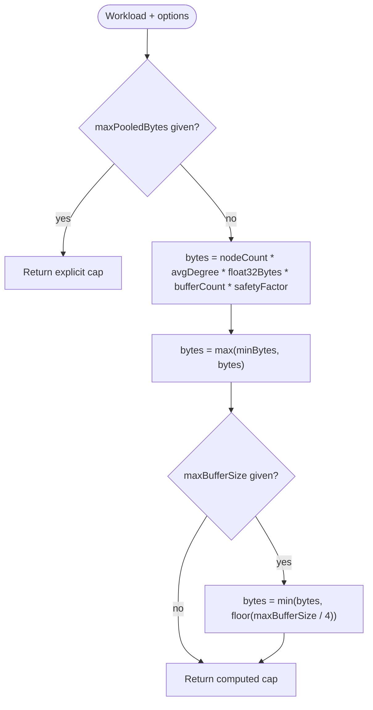
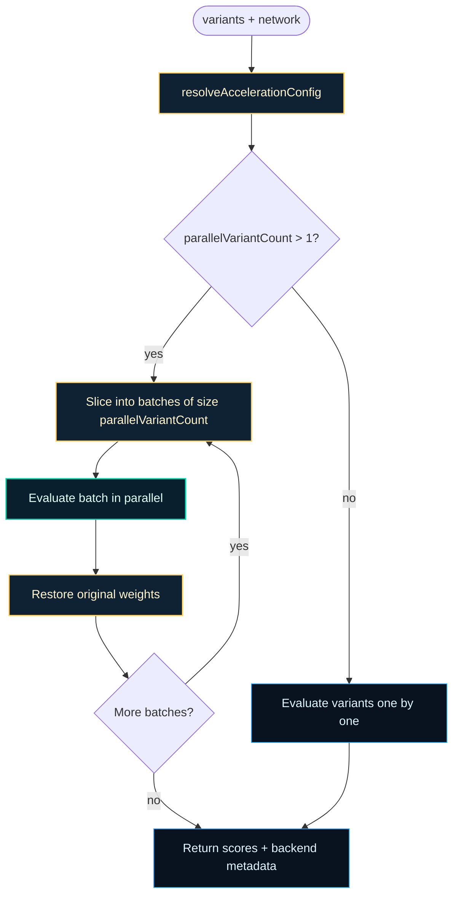
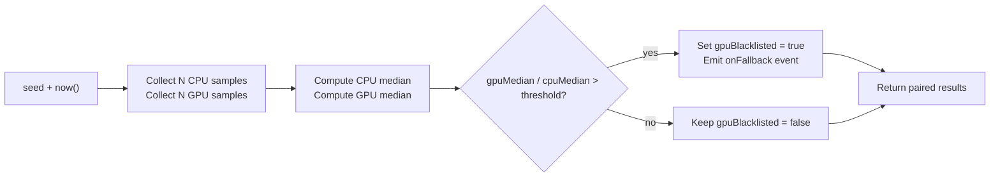

# acceleration

Generic network acceleration layer for NeatapticTS.

Evolutionary training spends most of its time evaluating genomes against a
task. The acceleration layer turns that evaluation bottleneck into a portable,
observable policy decision: run on CPU, dispatch to WebGPU, or spread across
worker threads, depending on network size, batch shape, and environment.

The layer is intentionally split into small, side-effect-free pieces:
- `acceleration.types` — the portable vocabulary of modes, capabilities, and
  configuration.
- `acceleration.constants` — conservative default thresholds and caps,
  including the dynamic buffer-pool cap heuristic
  {@link resolveBufferPoolMaxPooledBytes} used by the GPU buffer-set pool.
- `acceleration.config` — `resolveAccelerationConfig()` fills in defaults
  without touching the runtime.
- `acceleration.detect` — `detectAcceleration()` probes the host for WebGPU
  and worker availability.
- `acceleration.resolve` — `resolveAccelerationMode()` turns capability
  reports into an active backend choice.
- `acceleration.policy` — `AccelerationPolicy` and
  `LifecycleAccelerationPolicy` encode reusable decision rules.
- `acceleration.observer` — injectable telemetry so callers can track backend
  transitions, fallbacks, and timing.
- `acceleration.gpu` — `autoEnableGpu()` and `shouldAutoEnableGpu()` decide
  when a network is large enough to justify WebGPU offload.
- `acceleration.gpu.device` — `requestGPUDevice()` and `isDeviceReady()`
  bootstrap and monitor the shared WebGPU device used by GPU acceleration.
- `acceleration.workers` — `autoEnableWorker()` and `shouldAutoEnableWorker()`
  decide when worker-thread evaluation is the right fit.
- `acceleration.variants` — `evaluateWeightVariantsAsync()` scores candidate
  weight perturbations on any network surface without mutating the original
  weights.
- `acceleration.orchestrator` — `autoEnableAcceleration()` combines the GPU
  and worker probes into a single backend choice.
- `acceleration.manager` — `AccelerationManager` owns the acceleration
  lifecycle for one network: init, enable, disable, re-evaluate, and teardown.
- `workerPoolLifecycle` — `createWorkerPoolLifecycle()` creates, reuses, and
  tears down a scoped pool of worker threads. Higher-level callers (for
  example the worker-payload dispatcher) import this handle instead of
  spawning workers directly, keeping the dependency direction clean.
- `acceleration.benchmark` — `runRegressionBenchmark()` runs a deterministic
  CPU vs GPU micro-benchmark and blacklists the GPU backend when it is
  slower than CPU by a configured ratio. This module is internal to
  `src/acceleration/` and is not exported from the public barrel.

The public API follows a predictable pipeline: a partial config is resolved to
full defaults, the environment is probed, the active mode is chosen, and a
policy produces the final backend decision. CPU is always available as a
safe fallback, and every unavailable backend reports a human-readable reason.
The regression guard (`runRegressionBenchmark`) can blacklist the GPU backend
when the current environment's GPU path is slower than CPU for the reference
workload, keeping the default `auto` path safe on machines where GPU setup
overhead dominates. When the chosen backend is `worker`,
`createWorkerPoolLifecycle()` provides the actual pool of threads that the
inference layer broadcasts to.

```mermaid
flowchart LR
  classDef base fill:#08131f,stroke:#1ea7ff,color:#dff6ff,stroke-width:1px;
  classDef accent fill:#0f2233,stroke:#ffd166,color:#fff4cc,stroke-width:1.5px;
  classDef pool fill:#0a1f2e,stroke:#00d4aa,color:#e0fff7,stroke-width:1.5px;

  Config[Partial user config]:::base --> ResolveConfig[resolveAccelerationConfig]:::accent
  ResolveConfig --> Detect[detectAcceleration]:::accent
  Detect --> Status{Capability reports}
  Status --> GPU{{GPU available?}}
  Status --> Worker{{Workers available?}}
  Status --> CPU[CPU fallback]:::base
  GPU --> ResolveMode[resolveAccelerationMode]:::accent
  Worker --> ResolveMode
  CPU --> ResolveMode
  ResolveMode --> Policy[AccelerationPolicy]:::accent
  Policy --> Active[Active backend]:::base
  Active --> AutoEnable[autoEnableAcceleration]:::accent
  AutoEnable --> Manager[AccelerationManager]:::accent
  Manager --> Observer[AccelerationObserver telemetry]:::base
  Active -->|backend: worker| Pool[createWorkerPoolLifecycle]:::pool
  Pool --> WorkerSet[Worker pool handle]
  WorkerSet --> Broadcast[broadcast / terminate]
```



Examples:

Probe the environment and inspect the chosen backend:
```ts
import {
  detectAcceleration,
  resolveAccelerationMode,
  AccelerationPolicy,
  LifecycleAccelerationPolicy,
  NoopAccelerationObserver,
  type AccelerationObserver,
} from '../acceleration';

const detected = detectAcceleration({}, 2048);
const resolved = resolveAccelerationMode(detected, { backend: 'auto' });
const decision = new AccelerationPolicy().decide(resolved);
console.log(decision.backend); // 'gpu', 'worker', or 'cpu'
```

Track backend transitions with an observer:
```ts
const observer: AccelerationObserver = {
  onBackendChange: (event) =>
    console.log(`${event.previous} -> ${event.current}: ${event.reason}`),
};
const policy = new LifecycleAccelerationPolicy({ backend: 'auto' });
policy.onMutated();
const status = policy.evaluate({ backend: 'auto' }, 2048, observer);
```

Let the library auto-select a backend for a 2048-node network:
```ts
import { autoEnableAcceleration } from '../acceleration';

const status = await autoEnableAcceleration({ nodeCount: 2048 });
console.log(status.mode); // 'gpu', 'worker', or 'cpu'
console.log(status.gpu.reason); // human-readable GPU decision
```

Own the acceleration lifecycle with a manager:
```ts
import { AccelerationManager } from '../acceleration';

const manager = new AccelerationManager({ config: { backend: 'auto' } });
await manager.init(2048);
console.log(manager.getStatus().mode);
await manager.reEvaluate(4096); // re-check after a topology mutation
await manager.teardown();
```

Create and reuse a scoped worker pool:
```ts
import {
  createWorkerPoolLifecycle,
  type WorkerPoolHandle,
} from '../acceleration';

const lifecycle = createWorkerPoolLifecycle({ maxWorkers: 4 });
const pool: WorkerPoolHandle = await lifecycle.create();
console.log(lifecycle.activeCount()); // up to 4
pool.broadcast({ kind: 'ping' });
await pool.terminate();
```

## acceleration/acceleration.types.ts

Core type definitions for the generic network acceleration layer.

This module provides the portable configuration and status vocabulary used by
the acceleration layer. It intentionally avoids importing implementation
details (GPU detection, worker pool logic) so it can be imported by both
browser and Node entry points without side effects.

### AccelerationBackendChangeEvent

Backend transition event emitted when the active acceleration backend changes.

### AccelerationCapabilities

Combined capability report used by both configuration and runtime status.

### AccelerationConfig

User-supplied acceleration configuration.

All fields are optional; {@link resolveAccelerationConfig} fills in the
defaults and resolves the final backend choice.

### AccelerationFallbackEvent

Typed fallback event emitted when the requested backend cannot be used and
the runtime falls back to a different backend.

### AccelerationMode

Runtime acceleration mode selected after resolving capabilities and config.

### AccelerationObserver

Injectable callback surface for acceleration lifecycle events.

All callbacks are optional. A consumer can subscribe to just fallback
diagnostics, just telemetry, or just backend transitions without needing to
implement the full surface.

Example:

```ts
const observer: AccelerationObserver = {
  onFallback: (event) => console.warn('Fallback:', event.reason),
  onTelemetry: (event) => console.log(event.backend, event.inferenceMs),
};
```

### AccelerationStatus

Runtime acceleration status snapshot.

Combines the resolved capability reports with the selected acceleration mode so
callers can inspect why a particular backend is active. The optional
`gapReasons` field collects human-readable explanations for every backend
that could not be enabled.

### AccelerationTelemetryEvent

Typed telemetry event emitted after an inference call completes.

Carries the active backend, inference duration, and optional resource counters
such as worker queue depth or pooled GPU buffer size.

### BackendMode

Explicit backend preference that callers may request.

- `auto` lets the library choose based on network size and environment.
- `gpu` prefers the WebGPU backend when eligible.
- `worker` prefers the worker-thread backend when eligible.
- `cpu` forces the CPU backend.

### BufferPoolMaxPooledBytesOptions

Options that override the dynamically computed buffer-pool cap.

Callers can either pin the cap to an exact byte budget with
`maxPooledBytes`, or supply a device limit so the computed cap is clamped
to one quarter of `maxBufferSize`. The remaining fields override the
heuristic defaults for benchmarking or unusual network motifs.

### BufferPoolWorkload

Workload description used to size a GPU buffer-set pool cap.

The pool cap scales with the network size and variant count. Only
`nodeCount` is used by the current heuristic; `variantCount` and
`connectionCount` are kept for future motif-specific sizing and for
type-level documentation of the inputs that matter for buffer planning.

### CPUStatus

CPU capability report returned by environment detection.

CPU is always treated as an available fallback; this report records that
invariant and can carry an optional reason for diagnostics.

### GPUStatus

GPU capability report returned by environment detection.

Reports whether the WebGPU backend can be selected, and gives a human-readable
explanation when it cannot (for example, missing adapter, disabled flag, or
network that is too small to benefit).

### VariantEvaluationNetwork

Minimal network surface required by the variant evaluator.

This interface deliberately avoids importing `Network` from
`src/architecture/` so the acceleration layer stays independent of the
architecture module. Any object with `nodes`, a connection list whose
entries expose a `weight`, and an `activate` method can be evaluated.

### VariantEvaluator

```ts
VariantEvaluator(
  network: VariantEvaluationNetwork,
  variants: readonly WeightVariant[],
  inputs: WeightVariantInputs,
  target: WeightVariantTarget,
  scoreFn: VariantScorer | undefined,
  seed: number | undefined,
  config: AccelerationConfig | undefined,
  observer: AccelerationObserver | undefined,
): Promise<WeightVariantResult>
```

Async weight-variant evaluator signature.

Implementations receive a network surface, a list of variants, an input batch,
a target vector, and optional scoring/config/observer hooks, and return a
promise of per-variant scores plus backend metadata.

### VariantScorer

```ts
VariantScorer(
  outputs: readonly number[][],
  target: readonly number[],
): number
```

Scoring function that compares a stack of network outputs to a target vector.

Higher scores are better. The default scorer returns negative mean squared
error so that a perfect prediction yields a score of zero and worse
predictions yield increasingly negative scores.

### WeightVariant

One candidate weight perturbation applied to a network connection.

Variants are intentionally lightweight: they reference a connection by index
in the network's connection list and carry a signed delta. The evaluator
applies the delta, runs the network on the provided inputs, scores the
outputs, and restores the original weight before moving to the next variant.

### WeightVariantInputs

Input batch used to score weight variants.

Each inner array is one input vector passed to the network's `activate`
method. The same batch is evaluated for every variant so scores are
comparable.

### WeightVariantResult

Result of evaluating a set of weight variants against a fixed input batch.

### WeightVariantTarget

Target output vector used by the default scorer.

The default scorer treats the first `target.length` outputs as the
prediction and computes negative mean squared error. Callers that supply a
custom scorer can interpret the target however they choose.

### WorkerStatus

Worker capability report returned by environment detection.

Reports whether worker-thread evaluation can be selected, how many workers the
runtime intends to use, and why the worker path was accepted or rejected.

## acceleration/acceleration.constants.ts

Named constants for the generic network acceleration layer.

Keeping thresholds as exported constants makes them easy to reference from
tests, documentation, and downstream configuration builders without hunting
for magic numbers in implementation code.

### DEFAULT_ACCELERATION_GPU_BATCH_PARALLEL_THRESHOLD

Minimum number of parallel candidate evaluations before GPU batching is
preferred over sequential CPU evaluation.

### DEFAULT_ACCELERATION_GPU_NODE_THRESHOLD

Minimum node count before the GPU backend is considered eligible.

Networks smaller than this threshold are evaluated on CPU because the GPU
setup overhead dominates the compute cost.

### DEFAULT_ACCELERATION_MAX_WORKERS

Maximum number of workers to spawn when worker evaluation is enabled.

The default is conservative to avoid starving the host process and other
browser tabs.

### DEFAULT_ACCELERATION_PARALLEL_VARIANT_COUNT

Default number of weight variants evaluated concurrently in a single batch.

A value of `16` provides modest parallel dispatch for typical networks while
still restoring connection weights between batches. Callers can override it
with explicit config.

### DEFAULT_ACCELERATION_WORKER_MIN_CORES

Minimum number of logical CPU cores required before worker evaluation is
considered. A machine with fewer cores is unlikely to benefit from the
scheduling overhead of worker threads.

### DEFAULT_BUFFER_POOL_AVG_DEGREE

Default average in-degree used to estimate connection buffer needs.

This is a conservative planning estimate, not a measured degree. A value of
10 ensures the heuristic cap exceeds the actual packed buffer footprint for
typical NEAT topologies and triggers the device-limit clamp on large
networks as intended by the buffer-pool contract.

### DEFAULT_BUFFER_POOL_BUFFER_COUNT

Default number of distinct GPU buffers retained per pool entry.

Each topology/variant key caches a full buffer set (connections, nodes,
outputs, params, topo levels, and in-start). The count is used by the cap
heuristic to reserve headroom for the whole set.

### DEFAULT_BUFFER_POOL_FLOAT32_BYTES

Bytes per Float32 element used by the buffer-pool cap heuristic.

WebGPU buffer sizes are expressed in bytes; most numeric fields in the
compute shaders are 32-bit floats.

### DEFAULT_BUFFER_POOL_SAFETY_FACTOR

Default safety multiplier over the raw byte estimate.

Provides headroom for alignment padding, transient growth, and small
topology variations without allowing unbounded retention.

### DEFAULT_REGRESSION_GUARD_RATIO_THRESHOLD

Default ratio threshold at which the GPU backend is blacklisted.

When the GPU median micro-benchmark duration exceeds the CPU median duration
multiplied by this ratio, the GPU backend is considered a regression and is
blacklisted until `clearBlacklist()` is called.

### DEFAULT_REGRESSION_GUARD_SAMPLES

Default number of samples collected per backend during the regression guard
micro-benchmark.

The sample count is selected deterministically from a small band around this
value using the caller-supplied seed, so repeated runs with the same seed
observe the same effective workload.

### MIN_BUFFER_POOL_BYTES

Minimum bytes the GPU buffer-set pool cap is allowed to resolve to.

Very small networks would otherwise produce a cap too small to retain even
a single buffer set, which would defeat the purpose of the pool on the next
slightly larger evaluation.

### resolveBufferPoolMaxPooledBytes

```ts
resolveBufferPoolMaxPooledBytes(
  workload: BufferPoolWorkload,
  options: BufferPoolMaxPooledBytesOptions | undefined,
): number
```

Resolve the maximum pooled-byte cap for a GPU buffer-set pool.

The cap is computed from the workload size (`nodeCount`) and a small set of
heuristic defaults. Callers can override the result with an explicit
`maxPooledBytes` budget or clamp it to one quarter of a device
`maxBufferSize`. The default knobs can also be overridden for benchmarking
or unusual network motifs.

The formula is:

```text
max(minBytes, nodeCount * avgDegree * float32Bytes * bufferCount * safetyFactor)
```

and is clamped to `floor(maxBufferSize / 4)` when `maxBufferSize` is given.
`variantCount` is part of the workload contract for future scaling but does
not affect the current heuristic.



Parameters:
- `workload` - Workload description; `nodeCount` drives the heuristic.
- `options` - Optional explicit cap, device-size clamp, or heuristic overrides.

Returns: The resolved byte cap.

Example:

```ts
const cap = resolveBufferPoolMaxPooledBytes(
  { nodeCount: 1_024, variantCount: 8 },
  { maxBufferSize: 64 * 1024 * 1024 }
);
console.log(cap); // 262144 (min floor) for a 1k-node workload
```

## acceleration/acceleration.config.ts

Configuration builder for the generic network acceleration layer.

This module resolves a partial user config into a complete
{@link AccelerationConfig} by filling in environment-agnostic defaults. It
does not perform environment detection; that responsibility lives in the
acceleration detection module.

### AccelerationConfig

User-supplied acceleration configuration.

All fields are optional; {@link resolveAccelerationConfig} fills in the
defaults and resolves the final backend choice.

### AccelerationMode

Runtime acceleration mode selected after resolving capabilities and config.

### AccelerationStatus

Runtime acceleration status snapshot.

Combines the resolved capability reports with the selected acceleration mode so
callers can inspect why a particular backend is active. The optional
`gapReasons` field collects human-readable explanations for every backend
that could not be enabled.

### BackendMode

Explicit backend preference that callers may request.

- `auto` lets the library choose based on network size and environment.
- `gpu` prefers the WebGPU backend when eligible.
- `worker` prefers the worker-thread backend when eligible.
- `cpu` forces the CPU backend.

### DEFAULT_ACCELERATION_GPU_BATCH_PARALLEL_THRESHOLD

Minimum number of parallel candidate evaluations before GPU batching is
preferred over sequential CPU evaluation.

### DEFAULT_ACCELERATION_GPU_NODE_THRESHOLD

Minimum node count before the GPU backend is considered eligible.

Networks smaller than this threshold are evaluated on CPU because the GPU
setup overhead dominates the compute cost.

### DEFAULT_ACCELERATION_MAX_WORKERS

Maximum number of workers to spawn when worker evaluation is enabled.

The default is conservative to avoid starving the host process and other
browser tabs.

### DEFAULT_ACCELERATION_PARALLEL_VARIANT_COUNT

Default number of weight variants evaluated concurrently in a single batch.

A value of `16` provides modest parallel dispatch for typical networks while
still restoring connection weights between batches. Callers can override it
with explicit config.

### DEFAULT_ACCELERATION_WORKER_MIN_CORES

Minimum number of logical CPU cores required before worker evaluation is
considered. A machine with fewer cores is unlikely to benefit from the
scheduling overhead of worker threads.

### resolveAccelerationConfig

```ts
resolveAccelerationConfig(
  partial: Partial<AccelerationConfig>,
): AccelerationConfig
```

Resolve a partial acceleration config into a complete config object.

Unspecified fields are filled with conservative defaults. `stageVariantCounts`
is forwarded verbatim when supplied so NGE lifecycle consumers can read
per-stage variant counts from the resolved config. The returned config still
expresses caller intent; the final runtime backend selection is made later by
environment detection and the backend policy.

Parameters:
- `partial` - Optional user overrides. An empty object produces the default
configuration.

Returns: A complete acceleration config with all fields populated.

Example:

```ts
const config = resolveAccelerationConfig({
  backend: 'gpu',
  parallelVariantCount: 256,
  stageVariantCounts: { baby: 256 },
});
console.log(config.backend); // 'gpu'
console.log(config.gpuNodeThreshold); // 1024
console.log(config.parallelVariantCount); // 256
console.log(config.stageVariantCounts?.baby); // 256
```

## acceleration/acceleration.detect.ts

Environment detection for the generic network acceleration layer.

`detectAcceleration()` probes the host for WebGPU and worker-thread support,
applies the caller's configuration, and returns a structured
{@link AccelerationStatus} that explains which backends are available and
why any backend was disabled.

Detection is intentionally synchronous: it only inspects facts that are
immediately observable (`navigator.gpu` presence, `hardwareConcurrency`,
`crossOriginIsolated`). GPU adapter resolution is asynchronous and can only
be confirmed at activation time; the detection surface therefore reports
availability when the WebGPU API is present and not explicitly disabled.

Background reading:
- WebGPU is described in
  [WebGPU (Wikipedia)](https://en.wikipedia.org/wiki/WebGPU).
- Web Workers and `navigator.hardwareConcurrency` are described in
  [Web worker (Wikipedia)](https://en.wikipedia.org/wiki/Web_worker).
- Cross-origin isolation and COOP/COEP are documented by MDN:
  [Window.crossOriginIsolated](https://developer.mozilla.org/en-US/docs/Web/API/Window/crossOriginIsolated)
  and
  [COOP and COEP](https://developer.mozilla.org/en-US/docs/Web/JavaScript/Reference/Global_Objects/SharedArrayBuffer/Planned_changes).

### AccelerationConfig

User-supplied acceleration configuration.

All fields are optional; {@link resolveAccelerationConfig} fills in the
defaults and resolves the final backend choice.

### AccelerationMode

Runtime acceleration mode selected after resolving capabilities and config.

### AccelerationStatus

Runtime acceleration status snapshot.

Combines the resolved capability reports with the selected acceleration mode so
callers can inspect why a particular backend is active. The optional
`gapReasons` field collects human-readable explanations for every backend
that could not be enabled.

### collectGapReasons

```ts
collectGapReasons(
  gpu: GPUStatus,
  worker: WorkerStatus,
): string[]
```

Collect human-readable reasons for every unavailable backend.

### detectAcceleration

```ts
detectAcceleration(
  partial: Partial<AccelerationConfig>,
  nodeCount: number,
): AccelerationStatus
```

Probe the runtime environment and return a structured acceleration status.

This function resolves a partial config into a full config, then inspects
`navigator.gpu`, `navigator.hardwareConcurrency`, and the global
`crossOriginIsolated` flag to decide whether GPU and worker backends are
eligible. CPU is always reported as available so callers have a safe
fallback. The returned `gapReasons` array explains why any backend is
disabled, making backend-selection diagnostics transparent.

Background on the APIs used for detection:
- [WebGPU (Wikipedia)](https://en.wikipedia.org/wiki/WebGPU)
- [Web worker (Wikipedia)](https://en.wikipedia.org/wiki/Web_worker)
- [Window.crossOriginIsolated (MDN)](https://developer.mozilla.org/en-US/docs/Web/API/Window/crossOriginIsolated)

Parameters:
- `partial` - Optional user overrides. An empty object produces the
default configuration.
- `nodeCount` - Number of nodes in the network being evaluated; used to
decide whether the GPU backend is worth considering.

Returns: A structured status with mode, per-backend reports, CPU fallback,
and gap reasons.

Example:

```ts
const status = detectAcceleration({}, 2048);
console.log(status.mode); // 'gpu', 'worker', or 'cpu'
console.log(status.gapReasons); // reasons for disabled backends
```

### detectCPU

```ts
detectCPU(): CPUStatus
```

Build the CPU fallback report.

### detectGPU

```ts
detectGPU(
  config: Required<AccelerationConfig>,
  nodeCount: number,
): GPUStatus
```

Build the GPU availability report for the current environment.

### detectWorker

```ts
detectWorker(
  config: Required<AccelerationConfig>,
  crossOriginIsolated: boolean,
  hardwareConcurrency: number,
): WorkerStatus
```

Build the worker availability report for the current environment.

### readGlobal

```ts
readGlobal(
  key: string,
): T | undefined
```

Read a value from `globalThis` in a way that is safe in Node and browsers.

### selectMode

```ts
selectMode(
  gpu: GPUStatus,
  worker: WorkerStatus,
): AccelerationMode
```

Select the canonical acceleration mode from the capability reports.

## acceleration/acceleration.resolve.ts

Acceleration-mode resolution for the generic network acceleration layer.

`resolveAccelerationMode` turns a detected {@link AccelerationStatus} into the
runtime-active mode. It applies explicit caller preferences, honours an
active worker pool, and emits backend-change telemetry when the final mode
differs from the originally detected mode.

Resolution rules, in order:
- An explicit `backend: 'cpu'` or `backend: 'gpu'` always wins.
- `backend: 'auto'` uses the mode reported by environment detection.
- When no backend override is given, an active worker pool (`hasActiveWorker`)
  takes precedence over a GPU backend.
- Otherwise the strongest available backend is selected: GPU, then worker,
  then CPU.

CPU is always reported as available in the returned status, and the
capability reports from the input status are preserved so diagnostics remain
transparent.

### buildChangeEvent

```ts
buildChangeEvent(
  status: AccelerationStatus,
  resolvedMode: AccelerationMode,
): AccelerationBackendChangeEvent
```

Build a backend-change event when the resolved mode differs.

### chooseMode

```ts
chooseMode(
  status: AccelerationStatus,
  options: ResolveAccelerationModeOptions,
): AccelerationMode
```

Choose the resolved acceleration mode from status and caller options.

### collectGapReasons

```ts
collectGapReasons(
  status: AccelerationStatus,
): string[]
```

Collect human-readable reasons from the capability reports.

### resolveAccelerationMode

```ts
resolveAccelerationMode(
  status: AccelerationStatus,
  options: ResolveAccelerationModeOptions,
): AccelerationStatus
```

Resolve the active acceleration mode from a detected status and caller options.

The function preserves the GPU and worker capability reports, ensures CPU is
always reported as available, and emits an `onBackendChange` event through the
observer when the final mode differs from the detected mode.

Parameters:
- `status` - Detected acceleration status with capability reports.
- `options` - Optional resolution controls.

Returns: A new  {@link AccelerationStatus} with the resolved active mode.
 *

Example:

```ts
const resolved = resolveAccelerationMode(detected, {
  hasActiveWorker: true,
});
console.log(resolved.mode); // 'worker' when workers own execution
```

### ResolveAccelerationModeOptions

Options that influence mode resolution.

## acceleration/acceleration.policy.ts

Policy-driven backend selection for the generic network acceleration layer.

`AccelerationPolicy` encodes the decision rules that map a detected
{@link AccelerationStatus} to a concrete backend choice. It is intentionally
separate from environment detection so callers can swap or extend policy
behavior without changing how capabilities are probed.

`LifecycleAccelerationPolicy` extends the base policy with topology-dirty
tracking so callers such as NGE can re-verify backend eligibility after
structural mutations. The policy itself only records the dirty flag; the
actual re-verification is performed on the next `evaluate()` call.

### AccelerationConfig

User-supplied acceleration configuration.

All fields are optional; {@link resolveAccelerationConfig} fills in the
defaults and resolves the final backend choice.

### AccelerationDecision

Concrete backend choice returned by an {@link AccelerationPolicy}.

The reason string is meant for diagnostics and telemetry; it should explain
why the policy selected the reported backend.

### AccelerationPolicy

Default policy for mapping a detected acceleration status to a backend choice.

The policy supports explicit backend overrides (`cpu`, `gpu`, `worker`) and
an `auto` mode that follows the detected status. A shared default instance is
available via {@link AccelerationPolicy.default} for callers that do not need
custom configuration.

Example:

```ts
const policy = new AccelerationPolicy({ backend: 'gpu' });
const decision = policy.decide(status);
console.log(decision.backend); // 'gpu' or the resolved fallback
```

#### AccelerationPolicy.acceleration.policy

Shared default policy instance for callers without custom configuration.

#### decide

```ts
decide(
  status: AccelerationStatus,
  network: unknown,
  override: Partial<AccelerationConfig> | undefined,
): AccelerationDecision
```

Decide which backend should be used for the given acceleration status.

The method honors explicit backend preferences and falls back to the mode
reported by environment detection when no override is supplied.

Parameters:
- `status` - Detected acceleration status with capability reports.
- `network` - Optional network context reserved for future policy use.
- `override` - Optional backend override for this decision.

Returns: A concrete backend decision with a diagnostic reason.

### AccelerationStatus

Runtime acceleration status snapshot.

Combines the resolved capability reports with the selected acceleration mode so
callers can inspect why a particular backend is active. The optional
`gapReasons` field collects human-readable explanations for every backend
that could not be enabled.

### BackendMode

Explicit backend preference that callers may request.

- `auto` lets the library choose based on network size and environment.
- `gpu` prefers the WebGPU backend when eligible.
- `worker` prefers the worker-thread backend when eligible.
- `cpu` forces the CPU backend.

### LifecycleAccelerationPolicy

Lifecycle-aware policy that re-evaluates backend eligibility after mutations.

In addition to the base {@link AccelerationPolicy.decide} behavior, this
policy exposes `onMutated()` / `clearDirty()` hooks and an `evaluate()`
helper that runs environment detection and mode resolution in one call.
Topology dirty flags let callers know when a structural change may have
invalidated the current backend choice.

Example:

```ts
const policy = new LifecycleAccelerationPolicy();
policy.onMutated();
const status = policy.evaluate({ backend: 'auto' }, 2048);
console.log(status.mode);
```

#### clearDirty

```ts
clearDirty(): void
```

Clear the topology-dirty and re-verification flags.

Call this once backend eligibility has been re-confirmed.

#### evaluate

```ts
evaluate(
  partial: Partial<AccelerationConfig>,
  nodeCount: number,
  observer: AccelerationObserver | undefined,
): AccelerationStatus
```

Detect capabilities and resolve the active backend in one call.

The method merges any constructor-supplied defaults with the partial config
passed here, then probes the environment and applies policy resolution.
When the resolved mode differs from the detected mode, the observer is
notified through `onBackendChange`.

Parameters:
- `partial` - Optional user overrides, including `backend` and
`hasActiveWorker`.
- `nodeCount` - Number of nodes in the network being evaluated.
- `observer` - Optional observer for backend-change telemetry.

Returns: A resolved acceleration status with the active mode.

#### isTopologyDirty

True after `onMutated()` until `clearDirty()` is called.

#### needsReverification

True after `onMutated()` until `clearDirty()` is called.

#### onMutated

```ts
onMutated(): void
```

Mark the policy as needing backend re-verification.

Call this after a network mutation that could change backend eligibility.

## acceleration/acceleration.observer.ts

Observer and rolling-report surface for the generic network acceleration layer.

This module defines a small, injectable callback interface for acceleration
lifecycle events. Callers that want telemetry supply an
{@link AccelerationObserver}; callers that do not care pass
{@link NoopAccelerationObserver}. The report type gives consumers a stable,
in-memory shape for tracking backend time, transitions, fallback events, and
telemetry without committing to a persistence format.

### AccelerationBackendChangeEvent

Backend transition event emitted when the active acceleration backend changes.

### AccelerationFallbackEvent

Typed fallback event emitted when the requested backend cannot be used and
the runtime falls back to a different backend.

### AccelerationObserver

Injectable callback surface for acceleration lifecycle events.

All callbacks are optional. A consumer can subscribe to just fallback
diagnostics, just telemetry, or just backend transitions without needing to
implement the full surface.

Example:

```ts
const observer: AccelerationObserver = {
  onFallback: (event) => console.warn('Fallback:', event.reason),
  onTelemetry: (event) => console.log(event.backend, event.inferenceMs),
};
```

### AccelerationReport

Rolling in-memory report owned by an observer instance or acceleration context.

This type does not implement persistence; it is the shared shape that
reporters and dashboards can consume. Optional fields allow callers to
attach richer diagnostics without requiring every producer to populate them.

### AccelerationTelemetryEvent

Typed telemetry event emitted after an inference call completes.

Carries the active backend, inference duration, and optional resource counters
such as worker queue depth or pooled GPU buffer size.

### createBackendCacheObserver

```ts
createBackendCacheObserver(): { observer: AccelerationObserver; getBackend: () => AccelerationMode | null; }
```

Create an observer that caches the most recently reported backend mode.

The returned observer updates an internal slot whenever `onBackendChange`
fires. Callers can read that slot synchronously through `getBackend`, which is
useful for UI surfaces (such as the racing-curriculum HUD chip) that need to
display the backend chosen by the actual async evaluator without repeating
the expensive environment probe on every frame.

Returns: An observer and a synchronous getter for the cached backend mode.

Example:

```ts
const { observer, getBackend } = createBackendCacheObserver();
await autoEnableAcceleration({ nodeCount: 2048, observer });
console.log(getBackend()); // 'gpu', 'worker', or 'cpu'
```

### NoopAccelerationObserver

Safe empty default observer.

Use this when a caller does not provide an observer so the acceleration layer
can unconditionally invoke callbacks without null-checking at every call
site. It is intentionally a plain object with no-op implementations of all
optional callbacks — in this case, an empty object, because every callback is
optional.

## acceleration/acceleration.gpu.device.ts

Generic WebGPU device bootstrap for the acceleration layer.

`requestGPUDevice` asks the host for a high-performance WebGPU adapter and
device, rejecting cleanly when WebGPU is missing, no adapter is available,
or device creation fails. `isDeviceReady` reports whether a device (the
module's cached device, or a caller-supplied one) is still usable. Device
loss is tracked lazily through `device.lost` so the synchronous check stays
cheap.

These helpers are intentionally environment-agnostic: they probe the global
`navigator.gpu` surface and throw descriptive errors instead of returning
opaque `null` values. That lets callers distinguish "WebGPU missing" from
"adapter denied" from "device creation rejected" while still falling back to
CPU when needed.

Background reading:
- WebGPU is described in [WebGPU (Wikipedia)](https://en.wikipedia.org/wiki/WebGPU).
- The W3C WebGPU specification is the authoritative reference:
  [WebGPU API](https://www.w3.org/TR/webgpu/).

### isDeviceReady

```ts
isDeviceReady(
  device: any,
): boolean
```

Reports whether a WebGPU device is present and has not been reported lost.

When called without an argument, this checks the module's cached device
(the one most recently returned by {@link requestGPUDevice}). When called
with a device, it checks that specific device. `null` and `undefined`
inputs are treated as not-ready so callers can safely chain GPU probing
with CPU fallback logic.

Parameters:
- `device` - Optional WebGPU device to check. When omitted, the
module's cached device is used.

Returns: `true` only when a non-null device is available and not lost.

Example:

```ts
try {
  await requestGPUDevice();
  console.log(isDeviceReady()); // true
} catch {
  console.log(isDeviceReady()); // false
}
```

### requestGPUDevice

```ts
requestGPUDevice(): Promise<GPUDevice>
```

Request a high-performance WebGPU device suitable for compute inference.

Probes `navigator.gpu`, requests a `high-performance` adapter, then asks
the adapter for a device whose limits match the adapter's reported limits for
`maxStorageBufferBindingSize` and `maxBufferSize`. Rejects with a descriptive
error when WebGPU is unavailable, no adapter can be obtained, or device
creation fails.

The resolved device is cached at module scope so subsequent calls can reuse
a ready device and `isDeviceReady` can report status without an argument.
Concurrent calls while a request is in flight return the same promise.

Returns: A ready-to-use `GPUDevice`.

Example:

```ts
try {
  const device = await requestGPUDevice();
  network.gpuDevice = device;
} catch (error) {
  console.log('GPU unavailable:', error.message);
}
```

## acceleration/acceleration.gpu.ts

Generic GPU auto-enable helpers for the acceleration layer.

`shouldAutoEnableGpu` decides whether a network is large enough to benefit
from WebGPU offload, using node-count and batch-parallel thresholds that are
configurable through {@link AccelerationConfig}. `autoEnableGpu` performs the
actual probe: it checks eligibility, confirms that a WebGPU surface is
available, and requests a device via the shared
{@link requestGPUDevice} helper.

These helpers are environment-agnostic wrappers around the WebGPU probe. They
gracefully fall back to CPU when GPU support is missing, disabled, or when the
network is too small to justify the GPU setup cost.

Background reading:
- WebGPU is described in [WebGPU (Wikipedia)](https://en.wikipedia.org/wiki/WebGPU).
- The W3C WebGPU specification is the authoritative reference:
  [WebGPU API](https://www.w3.org/TR/webgpu/).

### AccelerationConfig

User-supplied acceleration configuration.

All fields are optional; {@link resolveAccelerationConfig} fills in the
defaults and resolves the final backend choice.

### autoEnableGpu

```ts
autoEnableGpu(
  options: AutoEnableGpuOptions,
): Promise<GpuAutoEnableResult>
```

Attempt to auto-enable GPU acceleration for the given network parameters.

When the network is eligible (per {@link shouldAutoEnableGpu}) and a WebGPU
surface is available, this function requests a GPU device via
{@link requestGPUDevice} and returns it in the result. When the GPU is
available but the network is below threshold, the result carries
`notified: true` so the caller knows GPU is an option for larger networks.
When the GPU is unavailable, disabled, or the device request fails, the
result gracefully falls back to `enabled: false` with a human-readable reason.

Parameters:
- `options` - Network parameters and optional config overrides.

Returns: Auto-enable result describing the outcome.

Example:

```ts
const result = await autoEnableGpu({ nodeCount: 2048 });
if (result.enabled) {
  network.gpuDevice = result.gpuDevice;
}
```

### AutoEnableGpuOptions

Parameters accepted by {@link autoEnableGpu}.

### evaluateWeightVariantsOnGpu

```ts
evaluateWeightVariantsOnGpu(
  network: VariantEvaluationNetwork,
  variants: readonly WeightVariant[],
  inputs: WeightVariantInputs,
  target: WeightVariantTarget,
  scorer: VariantScorer,
  device: GPUDevice,
): Promise<number[]>
```

Evaluate a batch of weight variants on the WebGPU backend.

For each variant the helper applies the signed delta, dispatches a GPU forward
pass for every input sample, scores the stacked outputs, and restores the
original connection weight. The supplied WebGPU device is bound to the network
surface for the duration of the evaluation so the GPU activation path can be
forced with `{ useGPU: true }`.

Parameters:
- `network` - Network surface to evaluate. Must expose a connection list
and an `activate` method that supports the `{ useGPU: true }` option.
- `variants` - Candidate weight perturbations for this batch.
- `inputs` - Input batch.
- `target` - Target output vector.
- `scorer` - Scoring function.
- `device` - Live WebGPU device to use for the forward passes.

Returns: Per-variant scores in the same order as the input `variants` array.

Example:

```ts
const scores = await evaluateWeightVariantsOnGpu(
  network,
  [{ weightIndex: 0, delta: 0.05 }],
  [[0.5, 0.5]],
  [1.0],
  DEFAULT_VARIANT_SCORER,
  device,
);
console.log(scores); // [-0.25]
```

### GpuAutoEnableResult

Result of a GPU auto-enable attempt.

The result surface is intentionally flat and serialisation-friendly: it tells
the caller whether the GPU was enabled, gives the acquired device (if any),
records whether the caller was notified that a GPU exists but was not enabled,
and explains the outcome with a human-readable reason.

### isGpuSurfaceAvailable

```ts
isGpuSurfaceAvailable(): boolean
```

Check whether a WebGPU surface is available in the current environment.

Returns: `true` when `navigator.gpu` is present.

### shouldAutoEnableGpu

```ts
shouldAutoEnableGpu(
  nodeCount: number,
  batchParallelCount: number,
  config: Partial<AccelerationConfig>,
): boolean
```

Determine whether GPU acceleration should be auto-enabled.

The decision is `true` when either:
- `nodeCount` meets or exceeds the configured (or default) node threshold, OR
- `batchParallelCount` meets or exceeds the configured (or default) batch
  threshold.

The decision is `false` when `disableGPU` is `true`, regardless of other
inputs.

Parameters:
- `nodeCount` - Current network node count.
- `batchParallelCount` - Number of networks evaluated in parallel.
Defaults to 0.
- `config` - Optional overrides for thresholds and disable flag.

Returns: `true` when GPU acceleration should be auto-enabled.

Example:

```ts
if (shouldAutoEnableGpu(2048)) {
  console.log('Network large enough for GPU offload');
}
```

## acceleration/acceleration.workers.ts

Generic worker auto-enable helpers for the acceleration layer.

`shouldAutoEnableWorker` decides whether worker-thread evaluation should be
activated based on network size, batch parallelism, and the host's logical
core count. `autoEnableWorker` probes the host environment and, when
eligible, reports how many workers would be used.

These helpers are environment-agnostic wrappers around worker availability.
They gracefully fall back to CPU when workers are disabled, unavailable, or
when the network is too small to justify the worker setup cost.

Background reading:
- Web Workers and parallel evaluation tradeoffs are described in
  [Web worker (Wikipedia)](https://en.wikipedia.org/wiki/Web_worker).
- `navigator.hardwareConcurrency` is documented by MDN:
  [navigator.hardwareConcurrency](https://developer.mozilla.org/en-US/docs/Web/API/Navigator/hardwareConcurrency).

### AccelerationConfig

User-supplied acceleration configuration.

All fields are optional; {@link resolveAccelerationConfig} fills in the
defaults and resolves the final backend choice.

### areWorkersSupported

```ts
areWorkersSupported(
  config: Required<AccelerationConfig>,
): boolean
```

Determine whether the host environment satisfies worker requirements.

Combines the cross-origin isolation flag and the logical-core threshold into
a single boolean product so both requirements are evaluated without extra
short-circuit branches.

Parameters:
- `config` - Fully resolved acceleration configuration.

Returns: `true` when cross-origin isolation is present and enough cores are
available.

### autoEnableWorker

```ts
autoEnableWorker(
  options: AutoEnableWorkerOptions,
): Promise<WorkerAutoEnableResult>
```

Attempt to auto-enable worker acceleration for the given network parameters.

When the network is eligible (per {@link shouldAutoEnableWorker}) and the
host supports worker threads, this function returns an enabled result with
a worker count capped by `maxWorkers` and reserved for the main thread. When
workers are available but the network is below threshold, the result carries
`notified: true` so the caller knows workers are an option for larger
networks. When workers are disabled, unavailable, or the core count is
insufficient, the result gracefully falls back to `enabled: false` with a
human-readable reason.

Parameters:
- `options` - Network parameters and optional config overrides.

Returns: Auto-enable result describing the outcome.

Example:

```ts
const result = await autoEnableWorker({ nodeCount: 2048 });
if (result.enabled) {
  console.log(`Using ${result.workerCount} workers`);
}
```

### AutoEnableWorkerOptions

Parameters accepted by {@link autoEnableWorker} and
{@link shouldAutoEnableWorker}.

### readCrossOriginIsolated

```ts
readCrossOriginIsolated(): boolean
```

Read the global cross-origin isolation flag.

### readHardwareConcurrency

```ts
readHardwareConcurrency(): number
```

Read the host's logical core count.

### shouldAutoEnableWorker

```ts
shouldAutoEnableWorker(
  options: AutoEnableWorkerOptions,
): boolean
```

Determine whether worker acceleration should be auto-enabled.

The decision is `true` when the network is large enough (either `nodeCount`
or `batchParallelCount` meets the default threshold), the host has enough
logical cores, and cross-origin isolation is present. The decision is `false`
when `disableWorkers` is `true`, when an active worker pool already owns
execution (`hasActiveWorker`), or when any environment requirement is not
met.

Parameters:
- `options` - Network parameters and optional config overrides.

Returns: `true` when worker acceleration should be auto-enabled.

Example:

```ts
if (shouldAutoEnableWorker({ nodeCount: 2048 })) {
  console.log('Network large enough for worker evaluation');
}
```

### WorkerAutoEnableResult

Result of a worker auto-enable attempt.

The result surface is intentionally flat and serialisation-friendly: it tells
the caller whether workers were enabled, how many workers would be used,
records whether the caller was notified that workers exist but were not
enabled, and explains the outcome with a human-readable reason.

## acceleration/acceleration.variants.ts

Generic async weight-variant evaluator for the network acceleration layer.

This module evaluates a set of candidate weight perturbations against a fixed
input batch and target vector. It is intentionally decoupled from
`src/architecture/network`; any object that satisfies
{@link VariantEvaluationNetwork} can be evaluated. The active backend is resolved
through the existing acceleration orchestrator (GPU first, then WebWorker, then
CPU), so callers receive backend metadata that matches the actual execution mode.

The evaluator restores each connection's original weight after scoring the
corresponding variant, so the network is left in the same state it was in when
the function was called (minus possible mutation from the network's own
activation side effects, which are outside this module's scope).

### DEFAULT_VARIANT_SCORER

```ts
DEFAULT_VARIANT_SCORER(
  outputs: readonly number[][],
  target: readonly number[],
): number
```

Default variant scorer: negative mean squared error against the target vector.

The scorer averages the squared error across all inputs and outputs, then
negates the result so that higher scores are better. A perfect prediction
produces a score of `0`; worse predictions produce increasingly negative
scores.

Background reading:
- Mean squared error:
  [Wikipedia — Mean squared error](https://en.wikipedia.org/wiki/Mean_squared_error).

Parameters:
- `outputs` - Stack of network output vectors, one per input sample.
- `target` - Target output vector. Only the first `target.length` entries
of each output are compared.

Returns: Negative mean squared error.

Example:

```ts
const score = DEFAULT_VARIANT_SCORER([[0.5, 0.5]], [1.0]);
console.log(score); // -0.25
```

### evaluateWeightVariantsAsync

```ts
evaluateWeightVariantsAsync(
  network: VariantEvaluationNetwork,
  variants: readonly WeightVariant[],
  inputs: WeightVariantInputs,
  target: WeightVariantTarget,
  scoreFn: VariantScorer | undefined,
  seed: number | undefined,
  config: AccelerationConfig | undefined,
  observer: AccelerationObserver | undefined,
): Promise<WeightVariantResult>
```

Evaluate a list of weight variants asynchronously.

For each variant the evaluator:
1. applies the signed delta to the connection at `weightIndex`,
2. runs the network on every input in `inputs`,
3. scores the stacked outputs,
4. restores the original connection weight.

The function always returns a `Promise` so callers can `await` it whether the
network's `activate` method is synchronous or asynchronous. The returned
metadata reports the backend used, the number of variants, the largest
absolute delta in the set, and whether the default or a custom scorer was
used.

Weight perturbation followed by a forward pass and score is a local-search
pattern for exploring candidate weights. Background reading:
- Local search (optimization):
  [Wikipedia contributors — Local search (optimization)](https://en.wikipedia.org/wiki/Local_search_(optimization)).



Parameters:
- `network` - Network surface to evaluate.
- `variants` - Candidate weight perturbations.
- `inputs` - Input batch, one vector per sample.
- `target` - Target output vector for the default scorer.
- `scoreFn` - Optional scorer; defaults to  {@link DEFAULT_VARIANT_SCORER} .
- `seed` - Optional determinism seed reserved for future backend selection.
- `config` - Optional acceleration configuration. The resolved backend
 *   is selected through `autoEnableAcceleration` (GPU → worker → CPU). When
 *   `parallelVariantCount` is greater than `1`, variants are dispatched
 *   concurrently in batches of that size and original weights are restored
 *   between batches. A value of `1` evaluates variants sequentially. The
 *   default `backend` is `auto` and the default `parallelVariantCount` is `16`;
 *   `stageVariantCounts` is forwarded to NGE lifecycle consumers such as
 *    {@link evaluateNgeWeightVariants} .
- `observer` - Optional acceleration observer. When supplied, backend-change
and fallback events are emitted during backend selection, and a telemetry
event is emitted after the evaluation finishes.

Returns: Promise resolving to per-variant scores and backend metadata.

Example:

```ts
const result = await evaluateWeightVariantsAsync(
  network,
  [{ weightIndex: 0, delta: 0.05 }],
  [[0.5, 0.5]],
  [1.0],
);
console.log(result.bestIndex, result.metadata.backend);
```

### VariantEvaluationNetwork

Minimal network surface required by the variant evaluator.

This interface deliberately avoids importing `Network` from
`src/architecture/` so the acceleration layer stays independent of the
architecture module. Any object with `nodes`, a connection list whose
entries expose a `weight`, and an `activate` method can be evaluated.

### VariantScorer

```ts
VariantScorer(
  outputs: readonly number[][],
  target: readonly number[],
): number
```

Scoring function that compares a stack of network outputs to a target vector.

Higher scores are better. The default scorer returns negative mean squared
error so that a perfect prediction yields a score of zero and worse
predictions yield increasingly negative scores.

### WeightVariant

One candidate weight perturbation applied to a network connection.

Variants are intentionally lightweight: they reference a connection by index
in the network's connection list and carry a signed delta. The evaluator
applies the delta, runs the network on the provided inputs, scores the
outputs, and restores the original weight before moving to the next variant.

### WeightVariantInputs

Input batch used to score weight variants.

Each inner array is one input vector passed to the network's `activate`
method. The same batch is evaluated for every variant so scores are
comparable.

### WeightVariantResult

Result of evaluating a set of weight variants against a fixed input batch.

### WeightVariantTarget

Target output vector used by the default scorer.

The default scorer treats the first `target.length` outputs as the
prediction and computes negative mean squared error. Callers that supply a
custom scorer can interpret the target however they choose.

## acceleration/acceleration.orchestrator.ts

Generic acceleration auto-enable orchestrator.

`autoEnableAcceleration` combines the GPU and worker auto-enable helpers into a
single unified decision. It returns an {@link AccelerationStatus} with the
selected mode, per-backend reports, CPU fallback, and gap reasons. It honours
config overrides (`disableGPU`, `disableWorkers`) and emits observer telemetry
when a backend is selected.

### autoEnableAcceleration

```ts
autoEnableAcceleration(
  options: AutoEnableAccelerationOptions,
): Promise<AccelerationStatus>
```

Acquire a GPU device and worker count, then choose the strongest available
backend.

The precedence order is GPU, then worker, then CPU. Config overrides are
respected by the underlying helpers, so `disableGPU` or `disableWorkers`
prevent the corresponding backend from being selected. When an observer is
supplied, an `onBackendChange` event is emitted with the selected backend.

Backend selection and any fallback reasons are also written to the console
as diagnostic output, which makes the chosen path visible in browser demos
and integration logs without requiring an observer.

Parameters:
- `options` - Network parameters, optional config overrides, and observer.

Returns: A unified acceleration status describing the selected backend.

Example:

```ts
const status = await autoEnableAcceleration({ nodeCount: 2048 });
console.log(status.mode); // 'gpu', 'worker', or 'cpu'
```

### AutoEnableAccelerationOptions

Parameters accepted by {@link autoEnableAcceleration}.

## acceleration/acceleration.manager.ts

Lifecycle manager for the generic network acceleration layer.

`AccelerationManager` owns acceleration state over time: construction,
initialization, enable/disable transitions, status queries, observer
notifications, and teardown. It delegates backend selection to
{@link autoEnableAcceleration} and wraps a {@link LifecycleAccelerationPolicy}
without owning worker-pool resources.

### AccelerationManager

Owns acceleration state over time for a single network or evaluation context.

The manager provides a small lifecycle API: construct, initialize, enable,
disable, query status, re-evaluate after topology changes, and teardown. It
does not instantiate worker pools or GPU buffers directly; it only decides
which backend should be active and notifies observers of transitions.

Example:

```ts
const manager = new AccelerationManager({ config: { backend: 'auto' } });
const status = await manager.init(2048);
console.log(status.mode); // 'gpu', 'worker', or 'cpu'
```

#### disable

```ts
disable(): Promise<void>
```

Disable acceleration and fall back to CPU.

Safe to call before initialization; in that case it is a no-op. When the
manager is initialized, the active mode is forced to `'cpu'` and observers
are notified of the backend change.

#### enable

```ts
enable(): Promise<boolean>
```

Mark the selected backend as active.

Returns: `true` when the manager has been initialized and the backend is
now considered active; `false` if called before `init()`.

#### getStatus

```ts
getStatus(): AccelerationStatus
```

Return the current acceleration status.

Before `init()` is called this returns a safe CPU fallback status. After
initialization it returns the exact status object resolved by `init()` or
the most recent `reEvaluate()` call.

Returns: Current acceleration status.

#### init

```ts
init(
  nodeCount: number,
): Promise<AccelerationStatus>
```

Initialize the manager and select the best available backend.

Delegates to {@link autoEnableAcceleration} to probe the environment and
choose between GPU, worker, and CPU backends. The resolved status is cached
and returned by {@link getStatus}. Calling `init()` more than once returns
the existing status without re-probing or re-notifying observers.

Parameters:
- `nodeCount` - Number of nodes in the network being evaluated.

Returns: The resolved acceleration status.

#### reEvaluate

```ts
reEvaluate(
  nodeCount: number,
): Promise<AccelerationStatus>
```

Re-evaluate backend eligibility after a topology mutation.

Re-runs the auto-enable decision with the updated node count and updates
the cached status. Observers are notified of the re-evaluation so callers
can track backend drift after structural changes.

Parameters:
- `nodeCount` - Updated network node count.

Returns: The newly resolved acceleration status.

#### teardown

```ts
teardown(): Promise<void>
```

Tear down the manager and reset it to a clean state.

The cached status is reset to the default CPU fallback, and the
initialized and enabled flags are cleared.

### AccelerationManagerOptions

Options accepted by the {@link AccelerationManager} constructor.

### createDefaultStatus

```ts
createDefaultStatus(): AccelerationStatus
```

Build the safe CPU fallback status used before initialization and after
teardown.

Returns: A status snapshot with CPU as the active mode.

## acceleration/workerPoolLifecycle.ts

Centralized worker pool lifecycle manager for the generic acceleration layer.

`WorkerPoolLifecycle` owns creation, reuse, and teardown of worker pools.
It is instantiated through {@link createWorkerPoolLifecycle} and is never a
module-level singleton, so multiple acceleration contexts can each own an
isolated pool.

The manager intentionally stays decoupled from `src/architecture/`: it only
knows how to create `Worker` instances, broadcast messages to every worker in
a pool, and terminate them. Higher-level inference logic (payload encoding,
task scheduling, and result aggregation) lives in the worker-payload layer.

Background: Web Workers let scripts run computation on background threads
and communicate via message passing. See
[Web worker (Wikipedia)](https://en.wikipedia.org/wiki/Web_worker) and the
[WHATWG HTML Standard — Web Workers](https://html.spec.whatwg.org/multipage/workers.html)
for the underlying standard.

### createWorkerPoolLifecycle

```ts
createWorkerPoolLifecycle(
  config: Partial<AccelerationConfig>,
  observer: AccelerationObserver | undefined,
): WorkerPoolLifecycle
```

Create a scoped worker pool lifecycle manager.

The returned instance is isolated from every other instance; it does not
share worker sets or state. The lifecycle manager only instantiates workers
when `create()` is called and `disableWorkers` is not set.

The pool uses the standard Web Worker API so it can run in any environment
that exposes a global `Worker` constructor. When the constructor is missing
(for example in some test or Node environments), `create()` still returns a
valid handle that owns no workers and reports an active count of zero.

Parameters:
- `config` - Optional acceleration config overrides. Defaults are filled
 *   in from  {@link resolveAccelerationConfig} .
- `observer` - Optional observer that receives backend-change events.

Returns: A new, scoped lifecycle instance.

Example:

```ts
const lifecycle = createWorkerPoolLifecycle({ maxWorkers: 4 });
const pool = await lifecycle.create();
pool.broadcast({ kind: 'ping' });
await pool.terminate();
```

### WorkerPoolHandle

Handle returned by {@link WorkerPoolLifecycle.create}. It exposes pool-level
broadcast and terminate operations and keeps the underlying worker set
private.

Example:

```ts
const lifecycle = createWorkerPoolLifecycle({ maxWorkers: 2 });
const pool = await lifecycle.create();
pool.broadcast({ kind: 'eval', batch: [1, 2, 3] });
await pool.terminate();
```

### WorkerPoolLifecycle

Lifecycle manager for a scoped worker pool.

Each instance tracks at most one active pool at a time. Creating a new pool
replaces any previously terminated pool, while `reuse` returns the active
pool handle when one exists.

Example:

```ts
const lifecycle = createWorkerPoolLifecycle({ maxWorkers: 4 });
const pool = await lifecycle.create();
const samePool = lifecycle.reuse();
console.log(samePool === pool); // true
await lifecycle.dispose();
```

## acceleration/acceleration.benchmark.ts

Regression guard: paired CPU vs GPU micro-benchmark.

`runRegressionBenchmark` runs a minimal synthetic benchmark that is fully
independent of `src/architecture/`. The acceleration layer uses it to decide
whether the current environment's GPU path is actually faster than CPU for
the small reference workload. When GPU is repeatedly slower than CPU by a
configurable ratio, the GPU backend is blacklisted until `clearBlacklist()`
is called.

The benchmark is intentionally deterministic: the caller supplies a seed
that drives sample selection and an injectable `now()` timer so tests can be
fully reproducible. No `Math.random` is used in the selection path.

This module is internal to `src/acceleration/` and is intentionally absent
from the public barrel export (`src/acceleration/index.ts`).



### clearBlacklist

```ts
clearBlacklist(): void
```

Reset the GPU blacklist state.

This is primarily used by tests to keep the module-level guard deterministic
between assertions, but it can also be called by callers that want to retry
GPU after a driver or environment change.

Example:

```ts
import { clearBlacklist, isGpuBlacklisted } from '@reicek/neataptic-ts/acceleration';

clearBlacklist();
console.log(isGpuBlacklisted()); // false
```

### createSeededRng

```ts
createSeededRng(
  seed: number,
): () => number
```

Seeded 32-bit PRNG (mulberry32).

Deterministic, fast, and seed-repeatable across runtimes. Used only for
sample selection, not for cryptographic purposes.

Mulberry32 is a simple linear congruential-style generator described in the
[PCG family overview (Wikipedia)](https://en.wikipedia.org/wiki/Permuted_congruential_generator#Other_simple_generators)
and popularized by Tommy Ettinger's public-domain reference implementation.

### defaultNowProvider

```ts
defaultNowProvider(): () => number
```

Resolve the default timestamp provider from the current global object.

### isGpuBlacklisted

```ts
isGpuBlacklisted(): boolean
```

Return whether the GPU backend has been blacklisted by the regression guard.

Returns: `true` when GPU has been observed to be slower than CPU by the
configured ratio threshold.

Example:

```ts
import { isGpuBlacklisted } from '@reicek/neataptic-ts/acceleration';

if (isGpuBlacklisted()) {
  console.log('GPU is temporarily disabled by the regression guard');
}
```

### median

```ts
median(
  values: number[],
): number
```

Compute the median of a numeric array.

Uses `Array.prototype.toSorted()` to avoid mutating the input. The sample
count produced by {@link resolveSampleCount} is always even, so only the
even-length path is needed.

Parameters:
- `values` - Sample durations in milliseconds.

Returns: Median duration.

### RegressionBenchmarkBackendResult

Per-backend median duration reported by {@link runRegressionBenchmark}.

### RegressionBenchmarkObserver

Injectable observer subset used by the regression guard.

Only the fallback callback is relevant here: a blacklist decision means the
runtime has fallen back from GPU to CPU.

### RegressionBenchmarkOptions

Options accepted by {@link runRegressionBenchmark}.

### RegressionBenchmarkResult

Result returned by {@link runRegressionBenchmark}.

### resolveSampleCount

```ts
resolveSampleCount(
  seed: number,
): number
```

Select a deterministic sample count from a band around the default.

The same `seed` always selects the same effective sample count, which makes
repeated benchmark runs with the same seed byte-identical in timing
accounting.

Parameters:
- `seed` - Caller-supplied benchmark seed.

Returns: Number of samples to collect per backend.

### runCpuSample

```ts
runCpuSample(
  now: () => number,
): number
```

Simulate one CPU sample and return its duration.

Parameters:
- `now` - Injectable timestamp provider.

Returns: Sample duration in milliseconds.

### runGpuSample

```ts
runGpuSample(
  now: () => number,
): number
```

Simulate one GPU sample and return its duration.

The GPU path simulates heavier kernel launch and readback overhead by
consuming more ticks between start and end, which makes it reliably slower
than CPU on the reference workload.

Parameters:
- `now` - Injectable timestamp provider.

Returns: Sample duration in milliseconds.

### runRegressionBenchmark

```ts
runRegressionBenchmark(
  options: RegressionBenchmarkOptions,
): RegressionBenchmarkResult
```

Run a paired CPU vs GPU regression micro-benchmark.

The benchmark collects a deterministic number of samples per backend using
the caller-supplied `now()` provider, computes median durations, and
blacklists the GPU backend when its median exceeds the CPU median by the
configured ratio threshold.

Parameters:
- `options` - Benchmark configuration: seed, timing source, optional
ratio threshold, and optional observer.

Returns: Benchmark results containing CPU and GPU medians.

Example:

```ts
const result = runRegressionBenchmark({ seed: 42 });
console.log(result.results[0].medianMs); // CPU median
console.log(result.results[1].medianMs); // GPU median
console.log(isGpuBlacklisted());       // true if GPU regressed
```
