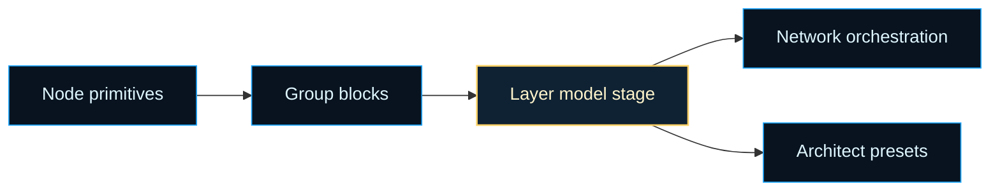
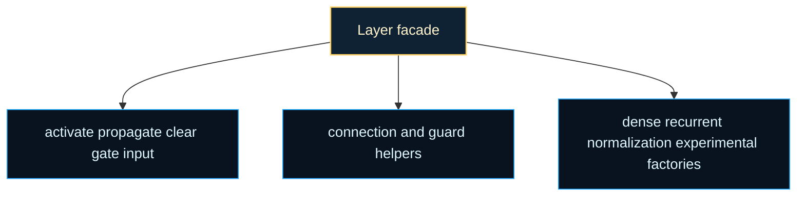

# architecture/layer

Core layer chapter for the architecture surface.

This folder owns the public `Layer` class that turns node-level primitives
into reusable feed-forward and recurrent building blocks. The helper files in
this chapter keep activation, connection, propagation, and factory policies
focused, while this file preserves the orchestration story that readers and
callers actually meet first.

If `Node` is the single-neuron chapter and `Network` is the whole-graph
chapter, `Layer` is the middle shelf that lets builders talk in model-sized
blocks. Dense stages, recurrent cells, normalization passes, and memory-
shaped motifs all need more intent than a raw list of nodes, but far less
ceremony than constructing an entire network by hand.

That middle shelf matters for two audiences at once. Callers want one place
to say "make a dense block" or "connect this stage to that stage" without
manually pushing node arrays around. Maintainers want activation, wiring,
propagation, and factory mechanics separated so the public API can stay easy
to read while the underlying policies continue to evolve. This folderized
chapter is how the repo serves both goals at the same time.

One useful mental model is to place `Layer` between `Group` and `Network`.
`Group` exposes a reusable cluster of nodes plus wiring vocabulary. `Layer`
adds the stronger promise that the cluster represents a recognizable model
stage with standard entrypoints such as `activate()`, `propagate()`,
`connect()`, and factory constructors. `Network` then chains many of those
stages into a runnable, mutable graph.

A second mental model is to treat `layer.ts` as a public facade over several
helper shelves. Readers should start here because this file owns the stable
orchestration story. The helper files exist to keep concerns narrow: one set
handles activation and propagation, another handles wiring and guards, and
the factory helpers explain how dense, recurrent, normalization, and
experimental layer families are assembled.





For background on the broader modeling idea, see Wikipedia contributors,
[Artificial neural network](https://en.wikipedia.org/wiki/Artificial_neural_network).
This chapter is narrower: it documents the library boundary that packages
those ideas into reusable blocks and helper-owned policies.

Read this chapter in three passes:

1. start with the `Layer` class overview to understand why the boundary
   exists above raw nodes and groups,
2. continue to `activate()`, `propagate()`, `connect()`, and `input()` when
   you need the runtime wiring surface,
3. finish with the static factory methods when you want named layer shapes
   such as dense, recurrent, normalization, or experimental blocks.

Example: wire a small dense stack using the same block-level API that higher
level builders depend on.

```ts
const input = Layer.dense(2);
input.set({ type: 'input' });
const hidden = Layer.dense(4);
const output = Layer.dense(1);
output.set({ type: 'output' });

input.connect(hidden);
hidden.connect(output);

input.activate([0, 1]);
hidden.activate();
const values = output.activate();
```

Example: swap in a richer factory-built block without changing the top-level
layer-to-layer wiring vocabulary.

```ts
const recurrent = Layer.lstm(8);
const readout = Layer.dense(2);

recurrent.connect(readout);
```

## architecture/layer/layer.ts

### Layer

Public block-level facade for layer-oriented architecture building.

`Layer` is the boundary readers reach for when a graph region should behave
like one model stage rather than a loose collection of neurons. It
normalizes common operations across dense, recurrent, normalization, and
experimental factories so higher-level chapters can compose readable graphs
without depending on each helper shelf's private implementation details.

This makes the class useful when you want to:

- assemble a network from named blocks instead of raw nodes,
- reuse the same activation, wiring, and propagation vocabulary across layer
  families,
- keep factory-specific mechanics below the public API.

### default

#### activate

```ts
activate(
  value: number[] | undefined,
  training: boolean,
): number[]
```

Activates all nodes within the layer, computing their output values.

If an input `value` array is provided, it's used as the initial activation
for the corresponding nodes in the layer. Otherwise, nodes compute their
activation based on their incoming connections.

During training, layer-level dropout is applied, masking all nodes in the layer together.
During inference, all masks are set to 1.

Parameters:
- `value` - - An optional array of activation values to set for the layer's nodes. The length must match the number of nodes.
- `training` - - A boolean indicating whether the layer is in training mode. Defaults to false.

Returns: An array containing the activation value of each node in the layer after activation.

#### attention

```ts
attention(
  size: number,
  heads: number,
): default
```

Creates a multi-head self-attention layer (stub implementation).

Parameters:
- `size` - - Number of output nodes.
- `heads` - - Number of attention heads (default 1).

Returns: A new Layer instance representing an attention layer.

#### batchNorm

```ts
batchNorm(
  size: number,
): default
```

Creates a batch normalization layer.
Applies batch normalization to the activations of the nodes in this layer during activation.

Parameters:
- `size` - - The number of nodes in this layer.

Returns: A new Layer instance configured as a batch normalization layer.

#### clear

```ts
clear(): void
```

Resets the activation state of all nodes within the layer.
This is typically done before processing a new input sequence or sample.

#### connect

```ts
connect(
  target: default | default | LayerLike,
  method: unknown,
  weight: number | undefined,
): default[]
```

Connects this layer's output to a target component (Layer, Group, or Node).

This method delegates the connection logic primarily to the layer's `output` group
or the target layer's `input` method. It establishes the forward connections
necessary for signal propagation.

Parameters:
- `target` - - The destination Layer, Group, or Node to connect to.
- `method` - - The connection method (e.g., `ALL_TO_ALL`, `ONE_TO_ONE`) defining the connection pattern. See `methods.groupConnection`.
- `weight` - - An optional fixed weight to assign to all created connections.

Returns: An array containing the newly created connection objects.

#### connections

Stores connection information related to this layer. This is often managed
by the network or higher-level structures rather than directly by the layer itself.
`in`: Incoming connections to the layer's nodes.
`out`: Outgoing connections from the layer's nodes.
`self`: Self-connections within the layer's nodes.

#### conv1d

```ts
conv1d(
  size: number,
  kernelSize: number,
  stride: number,
  padding: number,
): default
```

Creates a 1D convolutional layer (stub implementation).

Parameters:
- `size` - - Number of output nodes (filters).
- `kernelSize` - - Size of the convolution kernel.
- `stride` - - Stride of the convolution (default 1).
- `padding` - - Padding (default 0).

Returns: A new Layer instance representing a 1D convolutional layer.

#### dense

```ts
dense(
  size: number,
): default
```

Creates a standard fully connected (dense) layer.

All nodes in the source layer/group will connect to all nodes in this layer
when using the default `ALL_TO_ALL` connection method via `layer.input()`.

Parameters:
- `size` - - The number of nodes (neurons) in this layer.

Returns: A new Layer instance configured as a dense layer.

#### disconnect

```ts
disconnect(
  target: default | default,
  twosided: boolean | undefined,
): void
```

Removes connections between this layer's nodes and a target Group or Node.

Parameters:
- `target` - - The Group or Node to disconnect from.
- `twosided` - - If true, removes connections in both directions (from this layer to target, and from target to this layer). Defaults to false.

#### dropout

Dropout rate for this layer (0 to 1). If > 0, all nodes in the layer are masked together during training.
Layer-level dropout takes precedence over node-level dropout for nodes in this layer.

#### gate

```ts
gate(
  connections: default[],
  method: unknown,
): void
```

Applies gating to a set of connections originating from this layer's output group.

Gating allows the activity of nodes in this layer (specifically, the output group)
to modulate the flow of information through the specified `connections`.

Parameters:
- `connections` - - An array of connection objects to be gated.
- `method` - - The gating method (e.g., `INPUT`, `OUTPUT`, `SELF`) specifying how the gate influences the connection. See `methods.gating`.

#### gru

```ts
gru(
  size: number,
): default
```

Creates a Gated Recurrent Unit (GRU) layer.

GRUs are another type of recurrent neural network cell, often considered
simpler than LSTMs but achieving similar performance on many tasks.
They use an update gate and a reset gate to manage information flow.

Parameters:
- `size` - - The number of GRU units (and nodes in each gate/cell group).

Returns: A new Layer instance configured as a GRU layer.

#### input

```ts
input(
  from: default | LayerLike,
  method: unknown,
  weight: number | undefined,
): default[]
```

Handles the connection logic when this layer is the *target* of a connection.

It connects the output of the `from` layer or group to this layer's primary
input mechanism (which is often the `output` group itself, but depends on the layer type).
This method is usually called by the `connect` method of the source layer/group.

Parameters:
- `from` - - The source Layer or Group connecting *to* this layer.
- `method` - - The connection method (e.g., `ALL_TO_ALL`). Defaults to `ALL_TO_ALL`.
- `weight` - - An optional fixed weight for the connections.

Returns: An array containing the newly created connection objects.

#### layerNorm

```ts
layerNorm(
  size: number,
): default
```

Creates a layer normalization layer.
Applies layer normalization to the activations of the nodes in this layer during activation.

Parameters:
- `size` - - The number of nodes in this layer.

Returns: A new Layer instance configured as a layer normalization layer.

#### lstm

```ts
lstm(
  size: number,
): default
```

Creates a Long Short-Term Memory (LSTM) layer.

LSTMs are a type of recurrent neural network (RNN) cell capable of learning
long-range dependencies. This implementation uses standard LSTM architecture
with input, forget, and output gates, and a memory cell.

Parameters:
- `size` - - The number of LSTM units (and nodes in each gate/cell group).

Returns: A new Layer instance configured as an LSTM layer.

#### memory

```ts
memory(
  size: number,
  memory: number,
): default
```

Creates a Memory layer, designed to hold state over a fixed number of time steps.

This layer consists of multiple groups (memory blocks), each holding the state
from a previous time step. The input connects to the most recent block, and
information propagates backward through the blocks. The layer's output
concatenates the states of all memory blocks.

Parameters:
- `size` - - The number of nodes in each memory block (must match the input size).
- `memory` - - The number of time steps to remember (number of memory blocks).

Returns: A new Layer instance configured as a Memory layer.

#### nodes

An array containing all the nodes (neurons or groups) that constitute this layer.
The order of nodes might be relevant depending on the layer type and its connections.

#### output

Represents the primary output group of nodes for this layer.
This group is typically used when connecting this layer *to* another layer or group.
It might be null if the layer is not yet fully constructed or is an input layer.

#### propagate

```ts
propagate(
  rate: number,
  momentum: number,
  target: number[] | undefined,
): void
```

Propagates the error backward through all nodes in the layer.

This is a core step in the backpropagation algorithm used for training.
If a `target` array is provided (typically for the output layer), it's used
to calculate the initial error for each node. Otherwise, nodes calculate
their error based on the error propagated from subsequent layers.

Parameters:
- `rate` - - The learning rate, controlling the step size of weight adjustments.
- `momentum` - - The momentum factor, used to smooth weight updates and escape local minima.
- `target` - - An optional array of target values (expected outputs) for the layer's nodes. The length must match the number of nodes.

#### set

```ts
set(
  values: { bias?: number | undefined; squash?: ((x: number, derivate?: boolean | undefined) => number) | undefined; type?: string | undefined; },
): void
```

Configures properties for all nodes within the layer.

Allows batch setting of common node properties like bias, activation function (`squash`),
or node type. If a node within the `nodes` array is actually a `Group` (e.g., in memory layers),
the configuration is applied recursively to the nodes within that group.

Parameters:
- `values` - - An object containing the properties and their values to set.
  Example: `{ bias: 0.5, squash: methods.Activation.ReLU }`

## architecture/layer/layer.errors.ts

Raised when caller-provided layer values do not match the number of nodes.

### LayerInputSourceUnavailableError

Raised when a layer source output group is missing during input wiring.

### LayerInputTargetUnavailableError

Raised when a layer target output group is missing during input wiring.

### LayerMemoryInputBlockTypeError

Raised when a recurrent memory layer cannot resolve a group-like input block.

### LayerMemoryInputSizeMismatchError

Raised when recurrent memory source and target block sizes do not match.

### LayerOutputConnectUnavailableError

Raised when a layer output group is missing during connect operations.

### LayerOutputGateUnavailableError

Raised when a layer output group is missing during gate operations.

### LayerSizeMismatchError

Raised when caller-provided layer values do not match the number of nodes.

## architecture/layer/layer.utils.types.ts

### LayerActivationContext

Minimal state required to run layer activation helpers.

`dropout` is layer-level dropout probability, while `nodes` holds the
activation units that will be read/written during forward activation.

Example:

```ts
const activationContext: LayerActivationContext = {
  nodes: layer.nodes,
  dropout: 0.2,
};

// activateLayer(activationContext, values, true)
```

### LayerConnectionContext

Context bundle required by connection/disconnection orchestration.

It packages raw connection arrays, a layer type guard, and the active layer
references so helpers remain pure and testable.

Example:

```ts
const connectionContext: LayerConnectionContext = {
  connections: { in: [], out: [], self: [] },
  isLayer: (value): value is LayerLike =>
    !!value && typeof (value as LayerLike).input === 'function',
  layer: someLayerLike,
  nodes: someLayerLike.nodes,
  output: someLayerLike.output,
};
```

### LayerFactoryContext

Generic factory context used to create layers without circular imports.

`createLayer` builds the target instance, and `isLayer` enables structural
narrowing whenever helpers accept mixed layer/group values.

Example:

```ts
const factoryContext: LayerFactoryContext<MyLayer> = {
  createLayer: () => new MyLayer(),
  isLayer: (value): value is LayerLike =>
    !!value && typeof (value as LayerLike).input === 'function',
};
```

### LayerFactoryLayer

Public layer surface required by factory construction helpers.

Factories only depend on activation/input wiring and output/node containers.

Example:

```ts
// Factory builders create an object that has these members.
// (Concrete layer classes typically provide many more helpers.)
```

### LayerLike

Structural contract for "layer-like" objects used in utility wiring.

This type avoids direct class coupling while preserving the behaviors needed
by connection helpers (`input`, `nodes`, and `output`).

Example:

```ts
// A real layer class typically satisfies this shape.
const layerLike: LayerLike = {
  input: (from) => [],
  nodes: [],
  output: null,
};
```

### LayerPropagationContext

Minimal state required to run backpropagation helpers.

Helpers only need access to the node sequence to propagate in reverse order.

Example:

```ts
const propagationContext: LayerPropagationContext = { nodes: layer.nodes };

// propagateLayer(propagationContext, 0.3, 0.1, targets)
```

## architecture/layer/layer.utils.ts

### activateLayer

```ts
activateLayer(
  context: LayerActivationContext,
  values: number[] | undefined,
  training: boolean,
): number[]
```

Orchestrates layer activation behavior with a high-level flow.

This is the recommended entry point for forward activation when you already
have a `LayerActivationContext`. It handles:
1) Input validation
2) Layer-level dropout masking (when `training` is true)
3) Activation into a pooled buffer
4) Cloning into a stable array for the caller

Examples:

```ts
// Typical usage: activate without explicit per-node inputs.
const output = activateLayer({ nodes: layer.nodes, dropout: layer.dropout });

// Explicit inputs: one number per node.
const output2 = activateLayer(
  { nodes: layer.nodes, dropout: layer.dropout },
  [0.1, 0.2, 0.3],
  true,
);
```

Parameters:
- `context` - - The layer state needed for activation.
- `values` - - Optional activation values to set per node.
- `training` - - Whether to apply dropout masking for training.

Returns: A cloned array of activation values.

### clearLayer

```ts
clearLayer(
  context: LayerConnectionContext,
): void
```

Orchestrates clearing node activation state with a high-level flow.

Parameters:
- `context` - - The layer state needed to reset nodes.
Example:

```ts
clearLayer(layerConnectionContext);
```

### connectLayer

```ts
connectLayer(
  context: LayerConnectionContext,
  target: default | default | LayerLike,
  method: unknown,
  weight: number | undefined,
): default[]
```

Orchestrates layer connection behavior with a high-level flow.

This is a small wrapper around the focused helper in
`layer.connection.utils.ts`, kept here so the public layer API stays compact.

Example:

```ts
connectLayer(layerConnectionContext, nextLayerLike);
```

Parameters:
- `context` - - The layer state needed for connections.
- `target` - - The layer, group, or node to connect to.
- `method` - - Optional connection method override.
- `weight` - - Optional fixed weight to apply.

Returns: The created connection list.

### createAttentionLayer

```ts
createAttentionLayer(
  context: LayerFactoryContext<TLayer>,
  size: number,
  heads: number,
): TLayer
```

Orchestrates attention layer creation with a high-level flow.

Parameters:
- `context` - - Factory helpers for constructing the layer instance.
- `size` - - Number of output nodes.
- `heads` - - Number of attention heads.

Returns: The configured layer instance.
Example:

```ts
const attention = createAttentionLayer(factoryContext, 8, 4);
```

### createBatchNormLayer

```ts
createBatchNormLayer(
  context: LayerFactoryContext<TLayer>,
  size: number,
): TLayer
```

Orchestrates batch normalization layer creation with a high-level flow.

Parameters:
- `context` - - Factory helpers for constructing the layer instance.
- `size` - - Number of nodes in the normalization layer.

Returns: The configured layer instance.
Example:

```ts
const batchNorm = createBatchNormLayer(factoryContext, 16);
```

### createConv1dLayer

```ts
createConv1dLayer(
  context: LayerFactoryContext<TLayer>,
  size: number,
  kernelSize: number,
  stride: number,
  padding: number,
): TLayer
```

Orchestrates 1D convolution layer creation with a high-level flow.

Parameters:
- `context` - - Factory helpers for constructing the layer instance.
- `size` - - Number of output nodes.
- `kernelSize` - - Size of the convolution kernel.
- `stride` - - Stride of the convolution.
- `padding` - - Padding size for the convolution.

Returns: The configured layer instance.
Example:

```ts
const conv1d = createConv1dLayer(factoryContext, 8, 3);
```

### createDenseLayer

```ts
createDenseLayer(
  context: LayerFactoryContext<TLayer>,
  size: number,
): TLayer
```

Orchestrates dense layer creation with a high-level flow.

Parameters:
- `context` - - Factory helpers for constructing the layer instance.
- `size` - - Number of nodes in the dense layer.

Returns: The configured layer instance.
Example:

```ts
const dense = createDenseLayer(factoryContext, 8);
```

### createGruLayer

```ts
createGruLayer(
  context: LayerFactoryContext<TLayer>,
  size: number,
): TLayer
```

Orchestrates GRU layer creation with a high-level flow.

Parameters:
- `context` - - Factory helpers for constructing the layer instance.
- `size` - - Number of units in the GRU layer.

Returns: The configured layer instance.
Example:

```ts
const gru = createGruLayer(factoryContext, 8);
```

### createLayerNormLayer

```ts
createLayerNormLayer(
  context: LayerFactoryContext<TLayer>,
  size: number,
): TLayer
```

Orchestrates layer normalization layer creation with a high-level flow.

Parameters:
- `context` - - Factory helpers for constructing the layer instance.
- `size` - - Number of nodes in the normalization layer.

Returns: The configured layer instance.
Example:

```ts
const layerNorm = createLayerNormLayer(factoryContext, 16);
```

### createLstmLayer

```ts
createLstmLayer(
  context: LayerFactoryContext<TLayer>,
  size: number,
): TLayer
```

Orchestrates LSTM layer creation with a high-level flow.

Parameters:
- `context` - - Factory helpers for constructing the layer instance.
- `size` - - Number of units in the LSTM layer.

Returns: The configured layer instance.
Example:

```ts
const lstm = createLstmLayer(factoryContext, 8);
```

### createMemoryLayer

```ts
createMemoryLayer(
  context: LayerFactoryContext<TLayer>,
  size: number,
  memory: number,
): TLayer
```

Orchestrates Memory layer creation with a high-level flow.

Parameters:
- `context` - - Factory helpers for constructing the layer instance.
- `size` - - Number of nodes in each memory block.
- `memory` - - Number of time steps to remember.

Returns: The configured layer instance.
Example:

```ts
const memoryLayer = createMemoryLayer(factoryContext, 4, 3);
```

### disconnectLayer

```ts
disconnectLayer(
  context: LayerConnectionContext,
  target: default | default,
  twoSided: boolean,
): void
```

Orchestrates disconnection behavior with a high-level flow.

Example:

```ts
disconnectLayer(layerConnectionContext, someGroup, true);
```

Parameters:
- `context` - - The layer state needed for disconnecting.
- `target` - - The group or node to disconnect.
- `twoSided` - - Whether to remove reciprocal connections as well.

### gateLayer

```ts
gateLayer(
  context: LayerConnectionContext,
  connections: default[],
  method: unknown,
): void
```

Orchestrates layer gating behavior with a high-level flow.

Example:

```ts
gateLayer(layerConnectionContext, someConnections, method);
```

Parameters:
- `context` - - The layer state needed for gating.
- `connections` - - The connections to gate.
- `method` - - The gating method.

### inputLayer

```ts
inputLayer(
  context: LayerConnectionContext,
  from: default | LayerLike,
  method: unknown,
  weight: number | undefined,
): default[]
```

Orchestrates layer input wiring with a high-level flow.

Example:

```ts
inputLayer(layerConnectionContext, previousLayerLike);
```

Parameters:
- `context` - - The layer state needed for input wiring.
- `from` - - The source layer or group.
- `method` - - Optional connection method override.
- `weight` - - Optional fixed weight to apply.

Returns: The created connection list.

### propagateLayer

```ts
propagateLayer(
  context: LayerPropagationContext,
  rate: number,
  momentum: number,
  targets: number[] | undefined,
): void
```

Orchestrates layer backpropagation behavior with a high-level flow.

If `targets` is provided, it must be one value per node (output layer).
If omitted, propagation behaves like a hidden layer.

Examples:

```ts
// Hidden layer propagation.
propagateLayer({ nodes: layer.nodes }, 0.3, 0.1);

// Output layer propagation.
propagateLayer({ nodes: layer.nodes }, 0.3, 0.1, [1, 0, 0]);
```

Parameters:
- `context` - - The layer state needed for propagation.
- `rate` - - The learning rate for weight updates.
- `momentum` - - The momentum factor for smoothing updates.
- `targets` - - Optional target values for output layers.

## architecture/layer/layer.guard.utils.ts

### isGroup

```ts
isGroup(
  candidate: unknown,
): boolean
```

Checks whether an unknown value is group-like.

This is a structural runtime guard used by layer helpers that must safely
operate on mixed node/group collections.

Parameters:
- `candidate` - - The value to inspect.

Returns: True when the value exposes group-like members.

Example:

```ts
if (isGroup(value)) {
value.set({ bias: 0 });
}
```

## architecture/layer/layer.activation.utils.ts

### acquireActivationOutput

```ts
acquireActivationOutput(
  nodeCount: number,
): number[]
```

Acquires a pooled output buffer sized for the current activation call.

Pooling avoids frequent temporary allocations in hot activation paths.

The returned array is owned by the pool. Treat it as **temporary**:
- Fill it.
- Clone it (if you need a stable output).
- Release it back to the pool.

Example (typical pattern):

```ts
const pooled = acquireActivationOutput(nodes.length);
fillActivationOutput(nodes, values, pooled);
const output = cloneActivationOutput(pooled);
releaseActivationOutput(pooled);
```

Parameters:
- `nodeCount` - - Number of nodes in the layer.

Returns: A pooled output array.

### applyLayerMask

```ts
applyLayerMask(
  nodeList: default[],
  mask: number,
): void
```

Applies one mask value to every node in the layer.

In this library, a node-level `mask` is used as a lightweight dropout control.
A mask of `0` effectively disables the node for the current activation step.

Example:

```ts
applyLayerMask(layer.nodes, 1);
```

Parameters:
- `nodeList` - - The layer nodes to update.
- `mask` - - The mask value to apply.

### assertActivationInputSize

```ts
assertActivationInputSize(
  nodeCount: number,
  inputValues: number[] | undefined,
): void
```

Ensures optional activation inputs align 1:1 with layer nodes.

This guard prevents silent index skew where one node might accidentally
reuse another node's value.

In practice, this enables two safe activation modes:
- **Implicit activation**: omit `inputValues` and let each node compute its
  activation from its inbound connections.
- **Explicit activation**: pass a `number[]` with exactly one value per node.

This function exists because a mismatched array length is almost always a
caller bug, and failing fast is easier to debug than producing subtly wrong
activations.

Throws when `inputValues.length !== nodeCount`.

Example:

```ts
assertActivationInputSize(3, [0.1, 0.2, 0.3]);
assertActivationInputSize(3, [0.1, 0.2]); // throws
```

Parameters:
- `nodeCount` - - Number of nodes in the layer.
- `inputValues` - - Optional activation values provided by the caller.

### cloneActivationOutput

```ts
cloneActivationOutput(
  output: number[],
): number[]
```

Clones pooled output into a stable caller-owned array.

This is the "escape hatch" that turns a pooled scratch buffer into a normal
array you can safely return from APIs.

Example:

```ts
const stable = cloneActivationOutput(pooled);
```

Parameters:
- `output` - - The pooled output array to clone.

Returns: A cloned output array.

### fillActivationOutput

```ts
fillActivationOutput(
  nodeList: default[],
  inputValues: number[] | undefined,
  output: number[],
): void
```

Activates each node and writes outputs into the provided buffer.

When `inputValues` is provided, each node receives the corresponding input
value. Otherwise each node self-activates from incoming state.

This function is deliberately low-level: it does not allocate and it does not
return anything. That makes it ideal for hot paths where you want to reuse a
buffer (typically a pooled one).

Example:

```ts
fillActivationOutput(layer.nodes, [0.2, 0.4], pooled);
```

Parameters:
- `nodeList` - - Nodes to activate.
- `inputValues` - - Optional activation values for each node.
- `output` - - Output buffer to populate.

### releaseActivationOutput

```ts
releaseActivationOutput(
  output: number[],
): void
```

Releases a pooled activation output buffer back to the pool.

Call this after cloning/consuming the buffer to keep memory reuse effective.

Important: do not keep using `output` after releasing it.

Parameters:
- `output` - - The pooled output array to release.

### resolveLayerMask

```ts
resolveLayerMask(
  layerDropout: number,
  isTraining: boolean,
): number
```

Resolves a shared dropout mask for the full layer.

In this layer-level dropout model, all nodes receive the same mask per call,
which keeps activation behavior synchronized for grouped layer semantics.

Notes:
- Dropout is only applied when `isTraining` is true.
- A return value of `1` means "keep" and `0` means "drop".
- This helper intentionally does **not** rescale activations (some dropout
  implementations divide by $(1 - p)$ during training). In this codebase the
  mask is a simple on/off switch.

Example:

```ts
resolveLayerMask(0.5, false); // => 1 (dropout disabled)
resolveLayerMask(0.5, true); // => 0 or 1
```

Parameters:
- `layerDropout` - - The dropout rate configured for the layer.
- `isTraining` - - Whether the layer is running in training mode.

Returns: A mask value of 1 or 0 for all nodes in the layer.

## architecture/layer/layer.connection.utils.ts

### clearLayer

```ts
clearLayer(
  context: LayerConnectionContext,
): void
```

Clears activation state for all nodes in a layer.

Use this when you want to reset per-node transient state between runs
(especially helpful in recurrent networks that keep state across timesteps).

Example:

```ts
clearLayer(layerContext);
```

Parameters:
- `context` - - The layer state needed to reset nodes.

### connectLayer

```ts
connectLayer(
  context: LayerConnectionContext,
  target: default | default | LayerLike,
  method: unknown,
  weight: number | undefined,
): default[]
```

Connects a layer's output group to a target.

Conceptually, this is the "forward wiring" helper: it takes whatever this
layer exposes as its `output` group and connects it to another structure.

Target handling:
- **Layer-like target**: calls `target.input(layer, method, weight)` so the
  target can decide how to interpret the source.
- **Group/Node target**: calls `output.connect(target, method, weight)`.

Throws when `context.output` is `null` (some layer types may not expose an
output group).

Example:

```ts
connectLayer(layerAContext, layerBLike);
connectLayer(layerAContext, someGroup, methods.groupConnection.ALL_TO_ALL);
```

Parameters:
- `context` - - The layer state needed for connections.
- `target` - - The layer, group, or node to connect to.
- `method` - - Optional connection method override.
- `weight` - - Optional fixed weight to apply.

Returns: The created connection list.

### disconnectFromGroup

```ts
disconnectFromGroup(
  layerNodes: default[],
  targetGroup: default,
  layerConnections: { in: default[]; out: default[]; self: default[]; },
  removeTwoSided: boolean,
): void
```

Disconnects all layer nodes from a target group.

This is a "cartesian disconnect": every node in this layer is disconnected
from every node in the target group.

Parameters:
- `layerNodes` - - Nodes in the layer.
- `targetGroup` - - Group to disconnect from.
- `layerConnections` - - Connection tracking for the layer.
- `removeTwoSided` - - Whether to remove reciprocal connections as well.

### disconnectFromNode

```ts
disconnectFromNode(
  layerNodes: default[],
  targetNode: default,
  layerConnections: { in: default[]; out: default[]; self: default[]; },
  removeTwoSided: boolean,
): void
```

Disconnects all layer nodes from a target node.

Parameters:
- `layerNodes` - - Nodes in the layer.
- `targetNode` - - Node to disconnect from.
- `layerConnections` - - Connection tracking for the layer.
- `removeTwoSided` - - Whether to remove reciprocal connections as well.

### disconnectLayer

```ts
disconnectLayer(
  context: LayerConnectionContext,
  target: default | default,
  twoSided: boolean,
): void
```

Disconnects nodes in this layer from a target group or node.

This iterates through this layer's nodes and calls `node.disconnect(...)`.
It also updates the layer's tracked `connections.in/out` arrays so they
remain consistent with the underlying node graph.

Example:

```ts
disconnectLayer(layerContext, someNode, false);
```

Parameters:
- `context` - - The layer state needed for disconnecting.
- `target` - - The group or node to disconnect.
- `twoSided` - - Whether to remove reciprocal connections as well.

### gateLayer

```ts
gateLayer(
  context: LayerConnectionContext,
  connections: default[],
  method: unknown,
): void
```

Applies gating to the provided connections using the layer output group.

Gating lets a third party (here, this layer's output group) *modulate* a set
of connections. This is used in recurrent architectures (e.g. LSTM/GRU) to
implement gate-controlled flow.

Throws when `context.output` is `null`.

Example:

```ts
gateLayer(layerContext, connections, methods.gating.OUTPUT);
```

Parameters:
- `context` - - The layer state needed for gating.
- `connections` - - The connections to gate.
- `method` - - The gating method.

### inputLayer

```ts
inputLayer(
  context: LayerConnectionContext,
  from: default | LayerLike,
  method: unknown,
  weight: number | undefined,
): default[]
```

Connects a source group or layer to this layer's input target.

This is the inverse of `connectLayer(...)`: instead of using *this* layer as
the source, we treat this layer as the *target* and connect a provided
source into `context.output`.

If `from` is a layer-like object, its `output` group is used as the source.
If no `method` is provided, this defaults to `ALL_TO_ALL` wiring.

Throws when either the resolved source group or this layer's `context.output`
is `null`.

Example:

```ts
inputLayer(thisLayerContext, previousLayerLike);
inputLayer(thisLayerContext, someGroup, methods.groupConnection.ONE_TO_ONE);
```

Parameters:
- `context` - - The layer state needed for input wiring.
- `from` - - The source layer or group.
- `method` - - Optional connection method override.
- `weight` - - Optional fixed weight to apply.

Returns: The created connection list.

### removeIncomingConnection

```ts
removeIncomingConnection(
  layerConnections: { in: default[]; out: default[]; self: default[]; },
  sourceNode: default,
  targetNode: default,
): void
```

Removes an incoming connection from layer tracking.

This scans in reverse so we can `splice(...)` safely while iterating.

Parameters:
- `layerConnections` - - Connection tracking for the layer.
- `sourceNode` - - Source node for the connection.
- `targetNode` - - Target node for the connection.

### removeOutgoingConnection

```ts
removeOutgoingConnection(
  layerConnections: { in: default[]; out: default[]; self: default[]; },
  sourceNode: default,
  targetNode: default,
): void
```

Removes an outgoing connection from layer tracking.

This scans in reverse so we can `splice(...)` safely while iterating.

Parameters:
- `layerConnections` - - Connection tracking for the layer.
- `sourceNode` - - Source node for the connection.
- `targetNode` - - Target node for the connection.

## architecture/layer/layer.propagation.utils.ts

### assertTargetInputSize

```ts
assertTargetInputSize(
  nodeCount: number,
  inputTargets: number[] | undefined,
): void
```

Ensures target values align with the node count.

In backpropagation, a `targets` array is only meaningful for layers that are
acting as an output layer (supervised training). Hidden layers typically
propagate without explicit targets.

Example:

```ts
assertTargetInputSize(2, [1, 0]);
```

Parameters:
- `nodeCount` - - Number of nodes in the layer.
- `inputTargets` - - Optional target values provided by the caller.

### propagateNodesInReverse

```ts
propagateNodesInReverse(
  context: LayerPropagationContext,
  rate: number,
  momentum: number,
  targets: number[] | undefined,
): void
```

Propagates errors through all nodes in reverse order.

Reverse iteration matches the historical ordering used by Neataptic-style
implementations, and can matter when a node's propagation uses state that is
mutated as you traverse.

Target handling:
- When `targets` is omitted, each node propagates based on its accumulated
  error from downstream connections (hidden layer behavior).
- When `targets` is provided, each node receives a corresponding target value
  (output layer behavior).

Examples:

```ts
// Hidden layer:
propagateNodesInReverse({ nodes }, 0.3, 0.1);

// Output layer:
propagateNodesInReverse({ nodes }, 0.3, 0.1, [1, 0, 0]);
```

Parameters:
- `context` - - The layer state needed for propagation.
- `rate` - - The learning rate for weight updates.
- `momentum` - - The momentum factor for smoothing updates.
- `targets` - - Optional target values for output layers.

## architecture/layer/layer.factory.core.utils.ts

### buildDenseLayer

```ts
buildDenseLayer(
  context: LayerFactoryContext<TLayer>,
  size: number,
): TLayer
```

Builds a standard dense (fully connected) layer.

The produced layer exposes its `Group` as `layer.output` and defines
`layer.input(...)` so callers can connect a source group or layer using
the selected connection strategy.

This helper is intentionally "low ceremony": it does not decide *where* the
layer is used in a network. It only creates nodes, creates the output group,
and provides an `input(...)` function so external code can wire it.

Parameters:
- `context` - - Factory helpers for constructing the layer instance.
- `size` - - Number of nodes to create in the dense layer.

Returns: The configured layer instance.

Example:

```ts
// Create a dense layer with 8 nodes.
const dense = buildDenseLayer(factoryContext, 8);

// Wire: previous -> dense (the dense layer decides how to accept inputs).
dense.input(previousLayerLike);
```

## architecture/layer/layer.factory.recurrent.utils.ts

### buildGruLayer

```ts
buildGruLayer(
  context: LayerFactoryContext<TLayer>,
  size: number,
): TLayer
```

Builds a GRU layer using the provided factory context.

Educational overview:
- GRU is a gated recurrent unit with fewer gates than LSTM.
- This implementation wires update/reset gates and a memory cell, then
exposes a standard `layer.output` group.

Parameters:
- `context` - - Factory helpers for constructing the layer instance.
- `size` - - Number of units in each GRU gate and cell.

Returns: The configured layer instance.

Example:

```ts
const gru = buildGruLayer(factoryContext, 8);
gru.input(previousLayerLike);
```

### buildLstmLayer

```ts
buildLstmLayer(
  context: LayerFactoryContext<TLayer>,
  size: number,
): TLayer
```

Builds an LSTM layer using the provided factory context.

Educational overview:
- **Gates** control information flow (input / forget / output).
- The **memory cell** stores recurrent state via a self-connection.
- The **output block** is what this layer exposes as `layer.output`.

This builder wires the classic LSTM topology using `Group` blocks and gating.
It returns a layer object that is compatible with the rest of the layer
utilities (`layer.input(...)`, `layer.activate(...)`, `layer.output`, etc.).

Parameters:
- `context` - - Factory helpers for constructing the layer instance.
- `size` - - Number of units in each LSTM gate and cell.

Returns: The configured layer instance.

Example:

```ts
const lstm = buildLstmLayer(factoryContext, 8);

// Wire a previous layer (or Group) into the LSTM.
lstm.input(previousLayerLike);
```

### buildMemoryLayer

```ts
buildMemoryLayer(
  context: LayerFactoryContext<TLayer>,
  size: number,
  memory: number,
): TLayer
```

Builds a Memory layer using the provided factory context.

A memory layer is a simple way to provide a fixed window of past values.
Internally it creates `memory` blocks, links them one-to-one, and exposes a
flattened output group containing all block nodes.

Important: the input connector for a memory layer enforces **one-to-one**
wiring with unit weights to preserve the intended delay-line behavior.

Parameters:
- `context` - - Factory helpers for constructing the layer instance.
- `size` - - Number of nodes in each memory block.
- `memory` - - Number of time steps to remember.

Returns: The configured layer instance.

Example:

```ts
// A memory layer with 4 nodes per timestep, remembering 3 steps.
const memoryLayer = buildMemoryLayer(factoryContext, 4, 3);
memoryLayer.input(previousLayerLike);
```

### flattenConnections

```ts
flattenConnections(
  connectionLists: default[][],
): default[]
```

Flattens grouped connection arrays into a single list.

This keeps builder code declarative: build connections per gate/block,
then flatten once at the end.

Parameters:
- `connectionLists` - - Connection groups to flatten.

Returns: Flattened connection list.

Example:

```ts
const connections = flattenConnections([gateConnections, cellConnections]);
```

### resolveConnectionMethod

```ts
resolveConnectionMethod(
  method: unknown,
): unknown
```

Resolves an optional connection method to a concrete method.

When users don't specify a method, we default to a dense-style
`ALL_TO_ALL` group connection.

Parameters:
- `method` - - Optional user-supplied connection method.

Returns: Connection method to apply.

Example:

```ts
const method = resolveConnectionMethod(undefined);
```

### resolveSourceGroup

```ts
resolveSourceGroup(
  factoryContext: LayerFactoryContext<TLayer>,
  from: default | LayerLike,
): default
```

Resolves a source group from a layer-like or group input.

Many wiring helpers accept either a `Group` or a "layer-like" object.
When a layer is provided, we treat `layer.output` as the actual source group.

Parameters:
- `factoryContext` - - Factory context providing layer guards.
- `from` - - Source input candidate.

Returns: Source group used for connections.

Example:

```ts
const sourceGroup = resolveSourceGroup(factoryContext, previousLayerLike);
```

## architecture/layer/layer.factory.experimental.utils.ts

### activateStubNodes

```ts
activateStubNodes(
  layer: TLayer,
): number[]
```

Activates all nodes in a stub layer and returns their outputs.

This helper keeps fallback activation behavior identical across experimental
layer variants.

Parameters:
- `layer` - - Layer containing nodes to activate.

Returns: Activated node outputs.

Example:

```ts
const outputs = activateStubNodes(layer);
```

### buildAttentionLayer

```ts
buildAttentionLayer(
  context: LayerFactoryContext<TLayer>,
  size: number,
  heads: number,
): TLayer
```

Builds a lightweight attention-style stub layer.

This placeholder stores head count metadata and uses a simple averaging
behavior for provided values. It is useful as an integration seam while
full attention internals are still under development.

Educational note: because this is a stub, "heads" are metadata only. The
activation behavior is intentionally simple: it collapses provided values to
their average.

Parameters:
- `context` - - Factory helpers for constructing the layer instance.
- `size` - - Number of output nodes.
- `heads` - - Number of attention heads.

Returns: The configured layer instance.

Example:

```ts
const attention = buildAttentionLayer(factoryContext, 8, 4);
const out = attention.activate([1, 2, 3, 4]);
// out is length 8, every entry is the average (2.5)
```

### buildConv1dLayer

```ts
buildConv1dLayer(
  context: LayerFactoryContext<TLayer>,
  size: number,
  kernelSize: number,
  stride: number,
  padding: number,
): TLayer
```

Builds a lightweight Conv1D-style stub layer.

This is an experimental placeholder: it stores Conv1D metadata and returns
either activated node outputs (no input values) or a bounded slice from
provided values. It does not perform real convolution math.

Educational note: this is designed as an integration seam. It lets you
prototype graphs that *mention* Conv1D without requiring a full convolution
implementation yet.

Parameters:
- `context` - - Factory helpers for constructing the layer instance.
- `size` - - Number of output nodes (filters).
- `kernelSize` - - Size of the convolution kernel.
- `stride` - - Stride of the convolution.
- `padding` - - Padding size for the convolution.

Returns: The configured layer instance.

Example:

```ts
const conv = buildConv1dLayer(factoryContext, 8, 3, 1, 1);

// When called with values, the stub returns a slice (not a true convolution).
const out = conv.activate([10, 11, 12, 13]);
```

### createAttentionActivator

```ts
createAttentionActivator(
  layer: TLayer,
  size: number,
): (values?: number[] | undefined) => number[]
```

Builds the activation function used by the attention stub.

When values are provided, all outputs are filled with their average.
When values are omitted, it delegates to node activation.

This behavior is *not* meant to represent real attention math; it simply
produces a stable, shape-correct output while attention internals evolve.

Parameters:
- `layer` - - Layer whose nodes can self-activate.
- `size` - - Number of output values to return.

Returns: Activation callback for attention behavior.

Example:

```ts
const activate = createAttentionActivator(layer, 4);
activate([1, 3]); // -> [2, 2, 2, 2]
```

### createConv1dActivator

```ts
createConv1dActivator(
  layer: TLayer,
  size: number,
): (values?: number[] | undefined) => number[]
```

Builds the activation function used by the Conv1D stub.

When values are provided, this function returns a length-bounded slice.
When values are omitted, it delegates to node activation.

This keeps the call signature compatible with real layers while remaining
intentionally cheap.

Parameters:
- `layer` - - Layer whose nodes can self-activate.
- `size` - - Number of output values to return.

Returns: Activation callback for Conv1D behavior.

Example:

```ts
const activate = createConv1dActivator(layer, 3);
activate([9, 8, 7, 6]); // -> [9, 8, 7]
```

### createStubLayer

```ts
createStubLayer(
  context: LayerFactoryContext<TLayer>,
  size: number,
): TLayer
```

Creates shared node/output scaffolding for experimental layers.

Centralizing this setup keeps the experimental builders focused on their
metadata and activation behavior.

Implementation detail: the returned layer contains a `nodes` list (for basic
activation) and an `output` group (for API compatibility with the rest of the
architecture). In these stubs, the output group is not intended to be a fully
wired projection of `nodes`.

Parameters:
- `context` - - Factory helpers for constructing the layer instance.
- `size` - - Number of output nodes to allocate.

Returns: Initialized experimental layer.

## architecture/layer/layer.factory.normalization.utils.ts

### applyNormalizationActivation

```ts
applyNormalizationActivation(
  layer: TLayer,
): void
```

Wraps a layer activation function with normalization post-processing.

The wrapper preserves existing activation semantics, then applies
`normalizeActivations(...)` to produce zero-centered, variance-scaled output.

This is implemented as a function wrapper rather than modifying node math.
That makes it easy to layer normalization behavior onto each dense layer.

Parameters:
- `layer` - - Dense layer to decorate with normalization behavior.

Returns: No return value.

Example (conceptual flow):

```ts
// 1) baseActivate(...) computes raw activations
// 2) wrapper normalizes the vector before returning
```

### buildBatchNormLayer

```ts
buildBatchNormLayer(
  context: LayerFactoryContext<TLayer>,
  size: number,
): TLayer
```

Builds a dense layer decorated with batch-style normalization.

This helper keeps dense connectivity but post-processes activations so
each activation vector is centered and scaled using mean/variance.

Educational intuition:
- Centering subtracts the mean so the vector has average ~0.
- Scaling divides by standard deviation so typical magnitude is ~1.

In this implementation, the normalization is applied to the activation vector
produced *per call*.

Parameters:
- `context` - - Factory helpers for constructing the layer instance.
- `size` - - Number of nodes in the normalization layer.

Returns: The configured layer instance.

Example:

```ts
const normalized = buildBatchNormLayer(factoryContext, 16);
```

### buildLayerNormLayer

```ts
buildLayerNormLayer(
  context: LayerFactoryContext<TLayer>,
  size: number,
): TLayer
```

Builds a dense layer decorated with layer-style normalization.

This helper mirrors the batch variant in this implementation, applying
normalization to the activation vector produced for the current call.

Note: in many frameworks "batch norm" and "layer norm" differ in how they
compute statistics. Here they share the same post-processing to keep the code
simple and educational.

Parameters:
- `context` - - Factory helpers for constructing the layer instance.
- `size` - - Number of nodes in the normalization layer.

Returns: The configured layer instance.

Example:

```ts
const normalized = buildLayerNormLayer(factoryContext, 16);
```

### computeMean

```ts
computeMean(
  activations: number[],
): number
```

Computes the arithmetic mean for a vector of activations.

Parameters:
- `activations` - - Activation values to summarize.

Returns: Mean activation value.

Example:

```ts
computeMean([1, 2, 3]); // -> 2
```

### computeVariance

```ts
computeVariance(
  activations: number[],
  mean: number,
): number
```

Computes activation variance relative to a known mean.

Variance is computed as the average squared deviation from the mean.

Educational note: the standard deviation is `Math.sqrt(variance)`.

Parameters:
- `activations` - - Activation values to summarize.
- `mean` - - Mean value used for centering.

Returns: Variance of the activation values.

Example:

```ts
const mean = computeMean([1, 2, 3]);
computeVariance([1, 2, 3], mean); // -> 2/3
```

### normalizeActivations

```ts
normalizeActivations(
  activations: number[],
  mean: number,
  variance: number,
): number[]
```

Normalizes activation values using mean and variance.

A small epsilon (`NORM_EPSILON`) is added for numerical stability so
division remains well-defined when variance is very small.

The transformation is applied per element:
$(x - \mu) / \sqrt{\sigma^2 + \epsilon}$

Parameters:
- `activations` - - Activation values to normalize.
- `mean` - - Mean activation value.
- `variance` - - Variance activation value.

Returns: Normalized activation values.

Example:

```ts
const mean = computeMean([1, 2, 3]);
const variance = computeVariance([1, 2, 3], mean);
const normalized = normalizeActivations([1, 2, 3], mean, variance);
```
