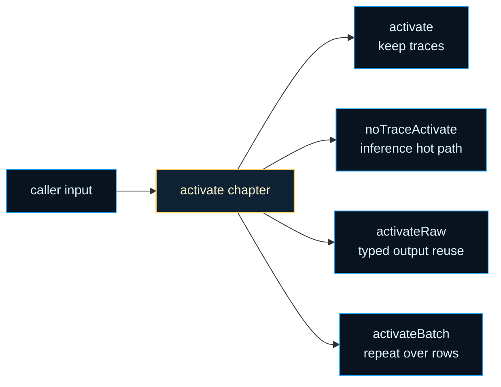
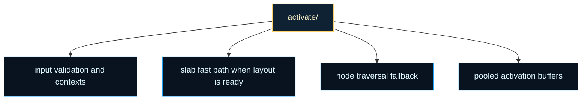

# architecture/network/activate

Activation chapter for `Network` execution policy.

This folder answers the moment when a graph already exists and the next
question becomes: how should signal move through it right now? The same
network may be stepped for ordinary inference, training-aware forward passes,
zero-copy raw output reuse, or a sequence of batch rows. Keeping those paths
together makes the execution tradeoffs visible without mixing them into
topology or serialization code.

The important split is between graph meaning and graph execution. Node and
connection chapters explain what the structure is. `activate/` explains how
that structure is stepped: validate inputs, decide whether the slab fast path
is still legal, preserve or skip training traces, and return outputs in the
shape the caller requested.

A second useful lens is to read the public exports as four modes.
`activate()` is the ordinary compatibility path. `noTraceActivate()` is the
hot inference path when trace bookkeeping would be wasteful. `activateRaw()`
keeps typed-array reuse available when pooling matters more than boxed
outputs. `activateBatch()` is the clear orchestration layer for repeated
forward passes over many rows.

The performance lesson here is not "always choose the fastest path." It is
"choose the narrowest path that still matches the caller's semantics." If a
network is slab-ready, this chapter can exploit contiguous typed arrays. If a
structural edit made that layout stale, the same boundary falls back to node
traversal instead of forcing callers to understand storage internals first.





For background on why some activation paths preserve training traces while
others skip them, see Wikipedia contributors,
[Backpropagation](https://en.wikipedia.org/wiki/Backpropagation). This
chapter sits at the forward-pass side of that story and decides how much
training bookkeeping each call should carry along.

Example: use the no-trace path when you only need inference outputs.

```ts
const network = Network.createMLP(2, [3], 1);
const outputValues = network.noTraceActivate([0.2, 0.8]);
```

Example: run the same network over several input rows with one orchestration
call.

```ts
const network = Network.createMLP(2, [3], 1);
const batchOutputs = network.activateBatch(
  [
    [0, 1],
    [1, 0],
  ],
  true,
);
```

Practical reading order:

1. Start here for the public activation modes and their semantic differences.
2. Continue into `network.activate.core.utils.ts` when you want the ordinary
   forward-pass pipeline.
3. Continue into `network.activate.raw.utils.ts` and the no-trace helpers
   when typed-array reuse or inference hot paths are the next question.
4. Finish with the context and helper files when you want the orchestration
   details behind validation, batching, and fallback behavior.

## architecture/network/activate/network.activate.utils.ts

### activate

```ts
activate(
  input: number[],
  training: boolean,
): number[]
```

Execute the main activation routine and return plain numeric outputs.

Parameters:

- `this` - Bound network instance.
- `input` - Input values with length matching network input count.
- `training` - Whether training-time stochastic behavior is enabled.

Returns: Output activation values.

### activateBatch

```ts
activateBatch(
  inputs: number[][],
  training: boolean,
): number[][]
```

Activate the network over a mini‑batch (array) of input vectors, returning a 2‑D array of outputs.

This helper simply loops, invoking {@link Network.activate} (or its bound variant) for each
sample. It is intentionally naive: no attempt is made to fuse operations across the batch.
For very large batch sizes or performance‑critical paths consider implementing a custom
vectorized backend that exploits SIMD, GPU kernels, or parallel workers.

Input validation occurs per row to surface the earliest mismatch with a descriptive index.

Parameters:

- `this` - Bound Network instance.
- `inputs` - Array of input vectors; each must have length == network.input.
- `training` - Whether each activation should keep training traces.

Returns: 2‑D array: outputs[i] is the activation result for inputs[i].

Example:

const batchOut = net.activateBatch([[0,0,1],[1,0,0],[0,1,0]]);
console.log(batchOut.length); // 3 rows

### activateRaw

```ts
activateRaw(
  input: number[],
  training: boolean,
  maxActivationDepth: number,
): ActivationArray
```

Raw activation wrapper with optional typed-output reuse semantics.

The heavy math still lives in the main activation path, but this wrapper now
owns the contract for network-local typed output reuse. When
`reuseActivationArrays` is enabled, raw activation may copy the detached
activation result into a reusable typed buffer whose element width follows
the network's resolved activation precision. Callers that also enable
`returnTypedActivations` may receive that reusable typed buffer directly.

Parameters:

- `this` - Bound Network instance.
- `input` - Input vector (length == network.input).
- `training` - Whether to retain training traces / gradients (delegated downstream).
- `maxActivationDepth` - Guard against runaway recursion / cyclic activation attempts.

Returns: Output vector, either as a plain array or a reusable typed activation buffer.

Example:

const y = net.activateRaw([0,1,0]);

### gaussianRand

```ts
gaussianRand(
  rng: () => number,
): number
```

Produce a normally distributed random sample using the Box-Muller transform.

Parameters:

- `rng` - Pseudo-random source in the interval [0, 1).

Returns: Standard normal sample with mean 0 and variance 1.

### noTraceActivate

```ts
noTraceActivate(
  input: number[],
): number[]
```

Perform a forward pass without creating or updating training / gradient traces.

This is the most allocation‑sensitive activation path. Internally it will attempt
to leverage a compact "fast slab" routine (an optimized, vectorized broadcast over
contiguous activation buffers) when the Network instance indicates that such a path
is currently valid. If that attempt fails (for instance because the slab is stale
after a structural mutation) execution gracefully falls back to a node‑by‑node loop.

Algorithm outline:

1. (Optional) Refresh the compiled activation schedule when a structural change
   marked topology as dirty.
2. Validate the input dimensionality.
3. Try the fast slab path; if it throws, continue with the standard path.
4. Acquire a pooled output buffer sized to the number of output neurons.
5. Traverse nodes in the compiled activation order when available:
   - Input nodes: assign values by explicit `inputNodeIds`, not raw node position.
   - Hidden and recurrent-component nodes: compute activation via
     Node.noTraceActivate without training traces.
   - Output nodes: activate in schedule order, then read out results in explicit
     `outputNodeIds` order so vector semantics stay stable even if storage order drifts.
6. Copy the pooled buffer into a fresh array (detaches user from the pool) and
   release the pooled buffer back to the pool.

Complexity considerations:

- Time: O(N + E) where N = number of nodes, E = number of inbound edges processed
  inside each Node.noTraceActivate call (not explicit here but inside the node).
- Space: O(O) transient (O = number of outputs) due to the pooled output buffer.

Parameters:

- `this` - Bound Network instance.
- `input` - Flat numeric vector whose length must equal network.input.

Returns: Array of output neuron activations (length == network.output).

Example:

const out = net.noTraceActivate([0.1, 0.2, 0.3]);
console.log(out); // => e.g. [0.5123, 0.0441]

## architecture/network/activate/network.activate.utils.types.ts

### ActivateRuntimeNetworkProps

Runtime network view used by the object-graph activation pipeline.

This intentionally describes the internal fields activation reads and writes
while orchestrating scheduling, RNG use, regularization, and slab fast-path hooks.

### ActivationOutputBuffer

Type of the pooled activation output array acquired from the shared activation array pool.
Using the pool avoids per-call allocation in tight inference loops.

### ActivationStats

Activation telemetry collected during a single forward pass, tracking dropped nodes, skipped layers, dropped connections, and weight-noise statistics.

### BATCH_INPUTS_COLLECTION_ERROR_MESSAGE

Error message thrown when `activateBatch` receives a non-array collection as its top-level argument.
Kept as a named constant so it can be matched in tests without coupling to a raw string literal.

### BatchActivationContext

Shared orchestration state for batch activation, carrying the internal network, the full batch input array, expected input size, and training flag.

### BatchRowActivationContext

Shared state used while validating and activating one row from a batch input collection,
carrying the input slice, its position index within the batch, and the expected input size for validation.

### DEFAULT_MAX_ACTIVATION_DEPTH

Hard limit on recursive activation depth used by the raw (non-slab) activation path.
Prevents unbounded recursion on networks with deep or cyclic structure when the
caller does not supply an explicit `maxActivationDepth` argument.

### INITIAL_OUTPUT_WRITE_INDEX

Starting write index used when collecting output activations into the result buffer.
The output-collection loop increments from this value, writing one activation per slot.

### INPUT_NODE_TYPE

Node role label used by activation traversal to identify input neurons.
Input nodes do not aggregate incoming connections; they read directly from the input vector.

### NetworkLayer

Layer container type derived from the network's optional layers array for use by layered activation paths.

### NetworkLayerNodes

Node collection type derived from one network layer, used by layered dropout and stochastic-depth traversal helpers.

### NO_TRACE_FAST_SLAB_TRAINING_FLAG

Training flag value used by no-trace fast-slab eligibility checks.
The slab fast path requires that no gradient traces are accumulated, so this literal
(`false`) is the only value that passes the eligibility predicate.

### NoTraceActivationContext

Shared context passed through the no-trace activation orchestration pipeline.
Collecting these fields into one object avoids repeating the same four arguments
across every helper in the activation chapter.

### NoTraceNodeTraversalContext

Shared context passed to node-traversal helpers during a no-trace activation pass.
Contains the subset of orchestration state needed to write one node's output into
the pooled result buffer.

### OUTPUT_NODE_TYPE

Node role label used by activation traversal to identify output neurons.
Output nodes write their activation into the result array at the slot matching their ordered position.

### OUTPUT_WRITE_INDEX_INCREMENT

Increment applied after writing one output activation value into the result buffer.
Using an explicit constant (rather than `++`) keeps the protocol visible and testable.

### RawActivationContext

Shared orchestration state for the raw (non-slab) activation path, carrying the network internals and the caller-supplied input vector.

### SingleNodeNoTraceActivationContext

Shared activation state for a single node during no-trace traversal, carrying the accumulated input map and the current network node reference.

### UNDEFINED_INPUT_LENGTH_TEXT

Fallback text rendered when the actual input length is `undefined` inside an activation error message.
Prevents `'undefined'` from appearing as a raw JS coercion artifact in user-facing error strings.

### WeightNoiseApplyResult

Marker interface returned by the weight-noise application helper to signal whether noise was applied and whether a restore pass is needed.

### WeightNoiseStats

Weight-noise telemetry collected during a single activation pass, capturing perturbation count, absolute sum, maximum, and mean magnitude.

## architecture/network/activate/network.activate.core.utils.ts

### acquireOutputBuffer

```ts
acquireOutputBuffer(
  outputSize: number,
  activationPrecision: ActivationPrecision | undefined,
): ActivationArray
```

Acquire a pooled activation output buffer for the current output width.

Parameters:

- `outputSize` - Number of output slots.

Returns: Mutable pooled output buffer.

### acquireSequenceOutputBuffer

```ts
acquireSequenceOutputBuffer(
  runtimeNetwork: ActivateRuntimeNetworkProps,
  outputSize: number,
): number[]
```

Acquire the next reusable plain array slot for one sequence activation result.

Parameters:

- `runtimeNetwork` - Runtime activation internals.
- `outputSize` - Required activation output width.

Returns: One reusable plain array slot from the network-owned output ring.

### activate

```ts
activate(
  input: number[],
  training: boolean,
): number[]
```

Execute the main activation routine and return plain numeric outputs.

Parameters:

- `this` - Bound network instance.
- `input` - Input values with length matching network input count.
- `training` - Whether training-time stochastic behavior is enabled.

Returns: Output activation values.

### activateLayer

```ts
activateLayer(
  currentLayer: default,
  layerIndex: number,
  inputVector: number[],
  isTraining: boolean,
): number[]
```

Activate one layer, routing input only for the first layer.

Parameters:

- `currentLayer` - Layer instance to activate.
- `layerIndex` - Layer index.
- `inputVector` - Network input vector.
- `isTraining` - Training-time flag.

Returns: Layer activations.

### activateLayeredNetworkWithDropout

```ts
activateLayeredNetworkWithDropout(
  network: default,
  runtimeNetwork: ActivateRuntimeNetworkProps,
  inputVector: number[],
  isTraining: boolean,
  outputBuffer: ActivationArray,
  stats: ActivationStats,
): void
```

Run layered activation with dropout masks and no stochastic-depth skips.

Parameters:

- `network` - Network being activated.
- `runtimeNetwork` - Runtime activation internals.
- `inputVector` - Input vector.
- `isTraining` - Training-time flag.
- `outputBuffer` - Mutable output buffer.
- `stats` - Activation stats accumulator.

Returns: Nothing.

### activateLayeredNetworkWithStochasticDepth

```ts
activateLayeredNetworkWithStochasticDepth(
  network: default,
  runtimeNetwork: ActivateRuntimeNetworkProps,
  inputVector: number[],
  isTraining: boolean,
  outputBuffer: ActivationArray,
  stats: ActivationStats,
): void
```

Run layered activation with stochastic-depth skipping and inverse-survival scaling.

Parameters:

- `network` - Network being activated.
- `runtimeNetwork` - Runtime activation internals.
- `inputVector` - Input vector.
- `isTraining` - Training-time flag.
- `outputBuffer` - Mutable output buffer.
- `stats` - Activation stats accumulator.

Returns: Nothing.

### activateNodeNetworkFallback

```ts
activateNodeNetworkFallback(
  network: default,
  runtimeNetwork: ActivateRuntimeNetworkProps,
  inputVector: number[],
  isTraining: boolean,
  outputBuffer: ActivationArray,
  stats: ActivationStats,
): void
```

Run schedule-aware node activation for networks without explicit layer definitions.

Parameters:

- `network` - Network being activated.
- `runtimeNetwork` - Runtime activation internals.
- `inputVector` - Input vector.
- `isTraining` - Training-time flag.
- `outputBuffer` - Mutable output buffer.
- `stats` - Activation stats accumulator.

Returns: Nothing.

### activateNodesAndCollectOutputs

```ts
activateNodesAndCollectOutputs(
  activationNodes: default[],
  inputValuesByNodeId: Map<number, number>,
  orderedOutputNodes: default[],
  outputBuffer: ActivationArray,
): void
```

Activate raw nodes in the resolved execution order and collect outputs by explicit role order.

Parameters:

- `activationNodes` - Network nodes in activation order.
- `inputValuesByNodeId` - Stable lookup for explicit input-role injection.
- `orderedOutputNodes` - Output nodes in public vector order.
- `outputBuffer` - Mutable output buffer.

Returns: Nothing.

### applyDropConnect

```ts
applyDropConnect(
  network: default,
  runtimeNetwork: ActivateRuntimeNetworkProps,
  isTraining: boolean,
  stats: ActivationStats,
): void
```

Apply drop-connect masking and restore original weights where required.

Parameters:

- `network` - Network being activated.
- `runtimeNetwork` - Runtime activation internals.
- `isTraining` - Training-time flag.
- `stats` - Activation stats accumulator.

Returns: Nothing.

### applyFallbackHiddenDropout

```ts
applyFallbackHiddenDropout(
  hiddenNodes: default[],
  runtimeNetwork: ActivateRuntimeNetworkProps,
  dropoutProbability: number,
  isTraining: boolean,
  stats: ActivationStats,
): void
```

Apply fallback dropout for hidden nodes in raw node traversal mode.

Parameters:

- `hiddenNodes` - Hidden nodes.
- `runtimeNetwork` - Runtime activation internals.
- `dropoutProbability` - Dropout probability.
- `isTraining` - Training-time flag.
- `stats` - Activation stats accumulator.

Returns: Nothing.

### applyFallbackWeightNoise

```ts
applyFallbackWeightNoise(
  network: default,
  runtimeNetwork: ActivateRuntimeNetworkProps,
  isTraining: boolean,
  stats: ActivationStats,
): void
```

Apply raw fallback weight noise to all connections using global standard deviation.

Parameters:

- `network` - Network being activated.
- `runtimeNetwork` - Runtime activation internals.
- `isTraining` - Training-time flag.
- `stats` - Activation stats accumulator.

Returns: Nothing.

### applyHiddenLayerDropout

```ts
applyHiddenLayerDropout(
  layer: default,
  rawActivations: number[],
  runtimeNetwork: ActivateRuntimeNetworkProps,
  dropoutProbability: number,
  isTraining: boolean,
  stats: ActivationStats,
): void
```

Apply dropout masks to hidden layer nodes and enforce at least one active node.

Parameters:

- `layer` - Hidden layer instance.
- `rawActivations` - Raw layer activations.
- `runtimeNetwork` - Runtime activation internals.
- `dropoutProbability` - Layer dropout probability.
- `isTraining` - Training-time flag.
- `stats` - Activation stats accumulator.

Returns: Nothing.

### applyTrainingDropConnect

```ts
applyTrainingDropConnect(
  network: default,
  runtimeNetwork: ActivateRuntimeNetworkProps,
  stats: ActivationStats,
): void
```

Apply training-time drop-connect masks to each connection.

Parameters:

- `network` - Network being activated.
- `runtimeNetwork` - Runtime activation internals.
- `stats` - Activation stats accumulator.

Returns: Nothing.

### applyTrainingWeightNoise

```ts
applyTrainingWeightNoise(
  network: default,
  runtimeNetwork: ActivateRuntimeNetworkProps,
  isTraining: boolean,
  stats: ActivationStats,
): WeightNoiseApplyResult
```

Apply per-connection training noise for the main activation flow.

Parameters:

- `network` - Network being activated.
- `runtimeNetwork` - Runtime activation internals.
- `isTraining` - Training-time flag.
- `stats` - Activation stats accumulator.

Returns: Applied-state information for downstream restore logic.

### collectHiddenNodes

```ts
collectHiddenNodes(
  nodes: default[],
): default[]
```

Collect hidden nodes from a raw node list.

Parameters:

- `nodes` - Network node collection.

Returns: Hidden-only node list.

### containsInvalidProbability

```ts
containsInvalidProbability(
  probabilities: number[],
): boolean
```

Check whether a probability vector contains values outside the (0, 1] interval.

Parameters:

- `probabilities` - Candidate probability vector.

Returns: True when one or more probabilities are invalid.

### copyOutputBufferIntoSequenceRing

```ts
copyOutputBufferIntoSequenceRing(
  outputBuffer: ActivationArray,
  runtimeNetwork: ActivateRuntimeNetworkProps,
): number[]
```

Copy one pooled activation result into the current reusable sequence-output slot.

Parameters:

- `outputBuffer` - Mutable pooled output buffer.
- `runtimeNetwork` - Runtime activation internals.

Returns: Reused plain array slot for the current sequence step.

### createActivationStats

```ts
createActivationStats(
  totalConnections: number,
): ActivationStats
```

Create activation statistics container for the current pass.

Parameters:

- `totalConnections` - Number of network connections.

Returns: Initialized activation stats object.

### createSequenceOutputRing

```ts
createSequenceOutputRing(
  outputSize: number,
): number[][]
```

Create a reusable plain-array ring for consecutive sequence outputs.

Parameters:

- `outputSize` - Required activation output width.

Returns: Fresh fixed-depth ring of plain output arrays.

### createWeightNoiseStats

```ts
createWeightNoiseStats(): WeightNoiseStats
```

Create the weight-noise statistics record with zeroed aggregates.

Returns: Zero-initialized weight-noise stats.

### decideLayerSkip

```ts
decideLayerSkip(
  network: default,
  runtimeNetwork: ActivateRuntimeNetworkProps,
  currentLayerNodeCount: number,
  layerIndex: number,
  isTraining: boolean,
  previousLayerActivations: number[] | undefined,
): { shouldSkipLayer: boolean; surviveProbability: number; }
```

Decide whether a hidden layer should be skipped in stochastic-depth mode.

Parameters:

- `network` - Network being activated.
- `runtimeNetwork` - Runtime activation internals.
- `currentLayerNodeCount` - Number of nodes in current layer.
- `layerIndex` - Current layer index.
- `isTraining` - Training-time flag.
- `previousLayerActivations` - Last computed layer activations.

Returns: Skip decision and survival probability for the layer.

### ensureSequenceOutputRing

```ts
ensureSequenceOutputRing(
  runtimeNetwork: ActivateRuntimeNetworkProps,
  outputSize: number,
): void
```

Ensure the network owns a fixed-depth reusable ring sized for the current output width.

Parameters:

- `runtimeNetwork` - Runtime activation internals.
- `outputSize` - Required activation output width.

Returns: Nothing.

### executeActivationPath

```ts
executeActivationPath(
  network: default,
  runtimeNetwork: ActivateRuntimeNetworkProps,
  inputVector: number[],
  isTraining: boolean,
  outputBuffer: ActivationArray,
  stats: ActivationStats,
): void
```

Execute one of the three activation branches: stochastic layers, standard layers, or raw nodes.

Parameters:

- `network` - Network being activated.
- `runtimeNetwork` - Runtime activation internals.
- `inputVector` - Input vector.
- `isTraining` - Training-time flag.
- `outputBuffer` - Mutable output buffer.
- `stats` - Activation stats accumulator.

Returns: Nothing.

### finalizeNodePathWeightNoiseRestore

```ts
finalizeNodePathWeightNoiseRestore(
  network: default,
  isTraining: boolean,
  appliedWeightNoise: boolean,
): void
```

Restore temporary weight-noise values for fallback node path only.

Parameters:

- `network` - Network being activated.
- `isTraining` - Training-time flag.
- `appliedWeightNoise` - Whether weight noise was applied during this pass.

Returns: Nothing.

### finalizeTrainingStepAndStats

```ts
finalizeTrainingStepAndStats(
  runtimeNetwork: ActivateRuntimeNetworkProps,
  stats: ActivationStats,
  isTraining: boolean,
): void
```

Finalize training counters and attach activation statistics to runtime state.

Parameters:

- `runtimeNetwork` - Runtime activation internals.
- `stats` - Activation stats.
- `isTraining` - Training-time flag.

Returns: Nothing.

### findSourceLayerIndex

```ts
findSourceLayerIndex(
  network: default,
  connection: default,
): number
```

Find the layer index containing a connection source node.

Parameters:

- `network` - Network being activated.
- `connection` - Connection to inspect.

Returns: Layer index for source node, or -1 when not found.

### gaussianRand

```ts
gaussianRand(
  rng: () => number,
): number
```

Produce a normally distributed random sample using the Box-Muller transform.

Parameters:

- `rng` - Pseudo-random source in the interval [0, 1).

Returns: Standard normal sample with mean 0 and variance 1.

### hasCompatibleSkipState

```ts
hasCompatibleSkipState(
  previousLayerActivations: number[] | undefined,
  currentLayerNodeCount: number,
): boolean
```

Validate whether previous activations can be reused as skip pass-through output.

Parameters:

- `previousLayerActivations` - Last computed layer activations.
- `currentLayerNodeCount` - Current layer node count.

Returns: True when pass-through activations are compatible.

### hasLayeredNetwork

```ts
hasLayeredNetwork(
  network: default,
): boolean
```

Check whether the network has at least one explicit layer.

Parameters:

- `network` - Network being activated.

Returns: True when layered activation path should run.

### hasLayeredNetworkWithStochasticDepth

```ts
hasLayeredNetworkWithStochasticDepth(
  network: default,
  runtimeNetwork: ActivateRuntimeNetworkProps,
): boolean
```

Check whether the network has layers and stochastic-depth configuration for layer skipping path.

Parameters:

- `network` - Network being activated.
- `runtimeNetwork` - Runtime activation internals.

Returns: True when stochastic-depth layer path should run.

### hasOriginalWeightNoise

```ts
hasOriginalWeightNoise(
  connection: default,
): boolean
```

Check whether a connection already has an original weight-noise snapshot.

Parameters:

- `connection` - Connection to inspect.

Returns: True when snapshot exists.

### isHiddenLayer

```ts
isHiddenLayer(
  layerIndex: number,
  totalLayerCount: number,
): boolean
```

Check whether a layer index refers to a hidden layer in a layered network.

Parameters:

- `layerIndex` - Current layer index.
- `totalLayerCount` - Number of layers in the network.

Returns: True when the layer is hidden.

### persistOriginalWeightNoise

```ts
persistOriginalWeightNoise(
  connection: default,
): void
```

Store current connection weight before applying temporary weight-noise modifications.

Parameters:

- `connection` - Connection to persist.

Returns: Nothing.

### prepareTopologyForActivation

```ts
prepareTopologyForActivation(
  runtimeNetwork: ActivateRuntimeNetworkProps,
): void
```

Ensure compiled activation scheduling is refreshed before activation when topology changed.

Parameters:

- `runtimeNetwork` - Runtime activation internals.

Returns: Nothing.

### recordSkippedLayer

```ts
recordSkippedLayer(
  network: default,
  stats: ActivationStats,
  layerIndex: number,
): void
```

Record a skipped layer in runtime and stats trackers.

Parameters:

- `network` - Network being activated.
- `stats` - Activation stats accumulator.
- `layerIndex` - Skipped layer index.

Returns: Nothing.

### recordWeightNoiseSample

```ts
recordWeightNoiseSample(
  stats: ActivationStats,
  sampledNoise: number,
): void
```

Record one sampled weight-noise value in the activation statistics snapshot.

Parameters:

- `stats` - Activation stats accumulator.
- `sampledNoise` - Sampled noise value before restoration.

Returns: Nothing.

### releaseBufferAndCreateResult

```ts
releaseBufferAndCreateResult(
  outputBuffer: ActivationArray,
  runtimeNetwork: ActivateRuntimeNetworkProps,
): number[]
```

Release pooled output buffer and return a detached plain array copy.

Parameters:

- `outputBuffer` - Mutable pooled output buffer.

Returns: Plain array of output values.

### resetSkippedLayers

```ts
resetSkippedLayers(
  network: default,
): void
```

Clear the runtime list of skipped layers before current activation pass.

Parameters:

- `network` - Network runtime owner.

Returns: Nothing.

### resolveConnectionNoiseStd

```ts
resolveConnectionNoiseStd(
  network: default,
  runtimeNetwork: ActivateRuntimeNetworkProps,
  connection: default,
  fallbackStandardDeviation: number,
): number
```

Resolve connection-specific weight-noise standard deviation, including per-hidden overrides.

Parameters:

- `network` - Network being activated.
- `runtimeNetwork` - Runtime activation internals.
- `connection` - Current connection.
- `fallbackStandardDeviation` - Global fallback deviation.

Returns: Effective standard deviation for this connection.

### resolveDynamicWeightNoiseStd

```ts
resolveDynamicWeightNoiseStd(
  runtimeNetwork: ActivateRuntimeNetworkProps,
): number
```

Resolve the training-step adjusted global weight-noise standard deviation.

Parameters:

- `runtimeNetwork` - Runtime activation internals.

Returns: Effective weight-noise standard deviation for current training step.

### resolveRuntimeActivationPrecision

```ts
resolveRuntimeActivationPrecision(
  runtimeNetwork: ActivateRuntimeNetworkProps,
): ActivationPrecision | undefined
```

Read the resolved runtime activation precision from the current network.

Parameters:

- `runtimeNetwork` - Runtime activation internals.

Returns: Active per-network activation precision when present.

### restoreDropConnectWeights

```ts
restoreDropConnectWeights(
  network: default,
): void
```

Restore drop-connect modified weights and normalize all masks back to one.

Parameters:

- `network` - Network being activated.

Returns: Nothing.

### restoreOriginalDropConnectWeight

```ts
restoreOriginalDropConnectWeight(
  connection: default,
): void
```

Restore and clear original connection weight after drop-connect.

Parameters:

- `connection` - Connection to restore.

Returns: Nothing.

### restoreOriginalWeightNoise

```ts
restoreOriginalWeightNoise(
  connection: default,
): void
```

Restore and clear the original weight-noise snapshot for a connection.

Parameters:

- `connection` - Connection to restore.

Returns: Nothing.

### scaleActivations

```ts
scaleActivations(
  activations: number[],
  scaleFactor: number,
): number[]
```

Create a new activation vector by multiplying each activation by a scale factor.

Parameters:

- `activations` - Source activation vector.
- `scaleFactor` - Multiplicative scale factor.

Returns: Scaled activation vector.

### setAllMasksToOne

```ts
setAllMasksToOne(
  nodes: default[],
): void
```

Set mask value to one for every node in a layer.

Parameters:

- `nodes` - Layer nodes to normalize.

Returns: Nothing.

### setDropConnectMask

```ts
setDropConnectMask(
  connection: default,
  dropConnectMask: number,
): void
```

Set drop-connect mask value for a connection.

Parameters:

- `connection` - Connection to annotate.
- `dropConnectMask` - Drop-connect mask value.

Returns: Nothing.

### setLastSampledNoise

```ts
setLastSampledNoise(
  connection: default,
  sampledNoise: number,
): void
```

Persist last sampled weight-noise value for a connection.

Parameters:

- `connection` - Connection to annotate.
- `sampledNoise` - Last sampled noise.

Returns: Nothing.

### stashOriginalDropConnectWeight

```ts
stashOriginalDropConnectWeight(
  connection: default,
): void
```

Store original connection weight before drop-connect zeroing.

Parameters:

- `connection` - Connection to persist.

Returns: Nothing.

### tryFastSlabActivation

```ts
tryFastSlabActivation(
  runtimeNetwork: ActivateRuntimeNetworkProps,
  inputVector: number[],
  isTraining: boolean,
): number[] | undefined
```

Attempt fast slab activation and safely fall back to regular activation on failure.

Parameters:

- `runtimeNetwork` - Runtime activation internals.
- `inputVector` - Input vector.
- `isTraining` - Training-time flag.

Returns: Fast slab output when available, otherwise undefined.

### updateStochasticDepthFromSchedule

```ts
updateStochasticDepthFromSchedule(
  runtimeNetwork: ActivateRuntimeNetworkProps,
  isTraining: boolean,
): void
```

Update stochastic depth probabilities using a training schedule when valid.

Parameters:

- `runtimeNetwork` - Runtime activation internals.
- `isTraining` - Training-time flag.

Returns: Nothing.

### validateInputVector

```ts
validateInputVector(
  network: default,
  inputVector: number[],
): void
```

Validate that the incoming input vector exists and matches expected input size.

Parameters:

- `network` - Network being activated.
- `inputVector` - Input vector to validate.

Returns: Nothing.

### validateNetworkNodes

```ts
validateNetworkNodes(
  network: default,
): void
```

Assert that the network contains nodes before executing activation routines.

Parameters:

- `network` - Network being activated.

Returns: Nothing.

### writeLayerActivationsToOutput

```ts
writeLayerActivationsToOutput(
  layerActivations: number[] | undefined,
  outputBuffer: ActivationArray,
  outputSize: number,
): void
```

Copy final layer activations into the pooled network output buffer.

Parameters:

- `layerActivations` - Final layer activations.
- `outputBuffer` - Mutable output buffer.
- `outputSize` - Maximum output width.

Returns: Nothing.

## architecture/network/activate/network.activate.helpers.utils.ts

Re-export no-trace activation orchestration for callers that want output values
without retaining per-node trace state.

### createBatchActivationContext

```ts
createBatchActivationContext(
  network: default,
  batchInputs: number[][],
  isTraining: boolean,
): BatchActivationContext
```

Create the context consumed by batch activation helpers.

Batch mode carries the full input matrix, expected input width, and training
trace policy in one object so downstream helpers can stay orchestration-only.

Parameters:

- `network` - Network instance bound to the activation call.
- `batchInputs` - Input matrix supplied by the caller.
- `isTraining` - Whether activation should retain training traces.

Returns: Fully populated batch activation context.

Example:

```ts
const context = createBatchActivationContext(
  network,
  [
    [0, 1],
    [1, 0],
  ],
  false,
);
// context.batchInputs can be iterated row-by-row by activation helpers
```

### createNoTraceActivationContext

```ts
createNoTraceActivationContext(
  network: default,
  inputVector: number[],
): NoTraceActivationContext
```

Create the immutable context consumed by no-trace activation helpers.

This context snapshots the caller input and expected input width while exposing
the internal network surface required by low-level activation utilities.

Parameters:

- `network` - Network instance bound to the activation call.
- `inputVector` - Input activation vector supplied by the caller.

Returns: Fully populated no-trace activation context.

Example:

```ts
const context = createNoTraceActivationContext(network, [0.2, 0.8]);
// context.expectedInputSize mirrors network.input
```

### createRawActivationContext

```ts
createRawActivationContext(
  network: default,
  inputVector: number[],
  isTraining: boolean,
  maximumActivationDepth: number,
): RawActivationContext
```

Create the context consumed by raw activation helpers.

Raw activation may preserve node traces for training and uses an explicit
depth limit to prevent runaway recurrent propagation.

Parameters:

- `network` - Network instance bound to the activation call.
- `inputVector` - Input activation vector supplied by the caller.
- `isTraining` - Whether activation should retain training traces.
- `maximumActivationDepth` - Guard against runaway activation depth.

Returns: Fully populated raw activation context.

Example:

```ts
const context = createRawActivationContext(network, [1, 0], true, 64);
// context.maximumActivationDepth bounds propagation depth
```

### executeBatchActivation

```ts
executeBatchActivation(
  activationContext: BatchActivationContext,
): number[][]
```

Execute mini-batch activation with top-level shape validation and per-row checks.

The orchestration keeps behavior deterministic by validating the container first,
then validating each row before delegating to the core network activation function.

Parameters:

- `activationContext` - Shared batch activation state.

Returns: Matrix of activation outputs.

### executeNoTraceActivation

```ts
executeNoTraceActivation(
  activationContext: NoTraceActivationContext,
): number[]
```

Execute no-trace activation with a fast-path attempt and deterministic fallback traversal.

The orchestration follows a strict sequence: refresh order guarantees, validate input shape,
try fast slab inference, then compute outputs through node traversal when needed.

Parameters:

- `activationContext` - Shared no-trace activation state.

Returns: Output activation vector detached from pooled storage.

### executeRawActivation

```ts
executeRawActivation(
  activationContext: RawActivationContext,
): ActivationArray
```

Execute raw activation through the network delegate using a compact orchestration flow.

This helper keeps the exported activation method focused on context creation while this
module owns the execution path and future branching behavior.

Parameters:

- `activationContext` - Shared raw activation state.

Returns: Activation output vector from the network delegate.

## architecture/network/activate/network.activate.errors.ts

Raised when the input vector supplied to `activate()` does not match the
network's expected input size.

This is the most common activation error. It fires when `input.length`
differs from `network.input` — for example, passing 3 values to a network
that expects 2.

Example:

```ts
const network = new Network(2, 1);
network.activate([0, 1, 0.5]); // throws NetworkActivateInputSizeMismatchError
```

### NetworkActivateBatchInputsCollectionError

Raised when `activateBatch()` receives a value that is not an array as its
top-level `inputs` argument.

Each element of `inputs` must itself be a `number[]` input row. Passing a
single flat array of numbers (instead of an array of rows) is the most
common trigger.

Example:

```ts
network.activateBatch([0, 1]); // throws — should be [[0, 1]]
```

### NetworkActivateCorruptedStructureError

Raised when activation is attempted on a network whose node structure is
inconsistent or internally corrupted — for example, a node list that
contains `null` entries, or a network reconstructed from a malformed
serialized snapshot.

If you encounter this error, inspect the network's `nodes` array before
activation and verify the deserialization path.

### NetworkActivateInputSizeMismatchError

Raised when the input vector supplied to `activate()` does not match the
network's expected input size.

This is the most common activation error. It fires when `input.length`
differs from `network.input` — for example, passing 3 values to a network
that expects 2.

Example:

```ts
const network = new Network(2, 1);
network.activate([0, 1, 0.5]); // throws NetworkActivateInputSizeMismatchError
```

## architecture/network/activate/network.activate.raw.utils.ts

### activateViaNetworkDelegate

```ts
activateViaNetworkDelegate(
  activationContext: RawActivationContext,
): number[]
```

Delegate raw activation to the core network activation implementation.

Parameters:

- `activationContext` - Shared raw activation state.

Returns: Activation output vector.

### activateWithReusableOutputBuffer

```ts
activateWithReusableOutputBuffer(
  activationContext: RawActivationContext,
): ActivationArray
```

Reuse the network-owned activation buffer for raw activation output when enabled.

Parameters:

- `activationContext` - Shared raw activation state.

Returns: Reused typed buffer or a detached plain array, depending on runtime flags.

### activateWithSelectedReusePath

```ts
activateWithSelectedReusePath(
  activationContext: RawActivationContext,
): ActivationArray
```

Select the raw activation execution path based on runtime reuse configuration.

Parameters:

- `activationContext` - Shared raw activation state.

Returns: Activation output vector.

### copyActivationResultIntoReusableBuffer

```ts
copyActivationResultIntoReusableBuffer(
  activationResult: number[],
  reusableOutputBuffer: Float32Array<ArrayBufferLike> | Float64Array<ArrayBufferLike>,
): void
```

Copy plain activation output values into the reusable typed buffer.

Parameters:

- `activationResult` - Detached activation result from the main activation path.
- `reusableOutputBuffer` - Network-owned typed output buffer.

Returns: Nothing.

### detachReusableOutputBuffer

```ts
detachReusableOutputBuffer(
  reusableOutputBuffer: Float32Array<ArrayBufferLike> | Float64Array<ArrayBufferLike>,
): number[]
```

Detach the reusable typed output buffer into a plain array for compatibility callers.

Parameters:

- `reusableOutputBuffer` - Network-owned typed output buffer.

Returns: Detached plain activation output array.

### ensureReusableActivationOutputBuffer

```ts
ensureReusableActivationOutputBuffer(
  activationContext: RawActivationContext,
  outputSize: number,
): Float32Array<ArrayBufferLike> | Float64Array<ArrayBufferLike>
```

Ensure the network owns a reusable typed activation output buffer of the requested size.

Parameters:

- `activationContext` - Shared raw activation state.
- `outputSize` - Required output width for the current activation pass.

Returns: Reusable typed activation output buffer.

### executeRawActivation

```ts
executeRawActivation(
  activationContext: RawActivationContext,
): ActivationArray
```

Execute raw activation through the network delegate using a compact orchestration flow.

This helper keeps the exported activation method focused on context creation while this
module owns the execution path and future branching behavior.

Parameters:

- `activationContext` - Shared raw activation state.

Returns: Activation output vector from the network delegate.

### requiresTypedActivationPoolReplacement

```ts
requiresTypedActivationPoolReplacement(
  activationPool: Float32Array<ArrayBufferLike> | Float64Array<ArrayBufferLike>,
  useFloat32Activation: boolean,
): boolean
```

Check whether the current reusable buffer must be replaced for the requested precision.

Parameters:

- `activationPool` - Existing reusable activation pool buffer.
- `useFloat32Activation` - True when the caller needs Float32 output.

Returns: True when the current buffer type does not match the requested precision.

### resolveRawActivationPrecision

```ts
resolveRawActivationPrecision(
  runtimeNetwork: RawActivationRuntimeProps,
): ActivationPrecision
```

Read the resolved runtime activation precision for raw typed-output reuse.

Parameters:

- `runtimeNetwork` - Raw activation runtime view.

Returns: Active activation precision for reusable raw output.

### shouldReturnTypedActivations

```ts
shouldReturnTypedActivations(
  activationContext: RawActivationContext,
): boolean
```

Decide whether raw activation may return the reusable typed buffer directly.

Parameters:

- `activationContext` - Shared raw activation state.

Returns: True when typed activations may escape to the caller.

## architecture/network/activate/network.activate.batch.utils.ts

### activateSingleBatchRow

```ts
activateSingleBatchRow(
  rowActivationContext: BatchRowActivationContext,
): number[]
```

Validate and activate one batch row.

Parameters:

- `rowActivationContext` - Shared state for one batch-row activation.

Returns: Activation output vector for the row.

### activateValidatedBatchRows

```ts
activateValidatedBatchRows(
  activationContext: BatchActivationContext,
): number[][]
```

Activate each row in a validated batch matrix.

Parameters:

- `activationContext` - Shared batch activation state.

Returns: Matrix of activation outputs.

### assertBatchInputCollection

```ts
assertBatchInputCollection(
  batchInputs: number[][],
): void
```

Validate that the batch input collection is an array of rows.

Parameters:

- `batchInputs` - Candidate batch input collection.

Returns: Nothing.

### assertBatchRowInputSize

```ts
assertBatchRowInputSize(
  rowActivationContext: BatchRowActivationContext,
): void
```

Validate one batch row dimensionality.

Parameters:

- `rowActivationContext` - Shared state for one batch-row activation.

Returns: Nothing.

### buildBatchRowInputSizeMismatchMessage

```ts
buildBatchRowInputSizeMismatchMessage(
  rowActivationContext: BatchRowActivationContext,
): string
```

Build a descriptive mismatch message for invalid batch row input dimensions.

Parameters:

- `rowActivationContext` - Shared state for one batch-row activation.

Returns: Formatted error message for invalid row dimensionality.

### executeBatchActivation

```ts
executeBatchActivation(
  activationContext: BatchActivationContext,
): number[][]
```

Execute mini-batch activation with top-level shape validation and per-row checks.

The orchestration keeps behavior deterministic by validating the container first,
then validating each row before delegating to the core network activation function.

Parameters:

- `activationContext` - Shared batch activation state.

Returns: Matrix of activation outputs.

### formatInputLengthForMessage

```ts
formatInputLengthForMessage(
  inputVector: number[],
): string
```

Convert input length into a display-safe string for error messaging.

Parameters:

- `inputVector` - Candidate batch row input vector.

Returns: Numeric length as string or predefined undefined text.

### isBatchRowInputSizeValid

```ts
isBatchRowInputSizeValid(
  rowActivationContext: BatchRowActivationContext,
): boolean
```

Determine whether one batch row matches the expected input dimensionality.

Parameters:

- `rowActivationContext` - Shared state for one batch-row activation.

Returns: True when row size is valid.

## architecture/network/activate/network.activate.notrace.utils.ts

### activateWithoutTraceUsingNodeIteration

```ts
activateWithoutTraceUsingNodeIteration(
  activationContext: NoTraceActivationContext,
): number[]
```

Execute no-trace activation through node traversal and pooled output collection.

Parameters:

- `activationContext` - Shared no-trace activation state.

Returns: Detached output activation vector.

### assertInputMatchesNetworkInputSize

```ts
assertInputMatchesNetworkInputSize(
  activationContext: NoTraceActivationContext,
): void
```

Validate that the input vector length matches expected network input dimensionality.

Parameters:

- `activationContext` - Shared no-trace activation state.

Returns: Nothing.

### buildInputSizeMismatchMessage

```ts
buildInputSizeMismatchMessage(
  activationContext: NoTraceActivationContext,
): string
```

Build a descriptive input mismatch message for activation validation errors.

Parameters:

- `activationContext` - Shared no-trace activation state.

Returns: Formatted mismatch error message.

### canUseNoTraceFastSlab

```ts
canUseNoTraceFastSlab(
  activationContext: NoTraceActivationContext,
): boolean
```

Determine whether fast slab activation is available for no-trace execution mode.

Parameters:

- `activationContext` - Shared no-trace activation state.

Returns: True when slab execution is available for inference mode.

### detachPooledOutputBuffer

```ts
detachPooledOutputBuffer(
  pooledOutputBuffer: ActivationArray,
): number[]
```

Clone pooled output storage into a detached plain array.

Parameters:

- `pooledOutputBuffer` - Pooled activation output storage.

Returns: Detached output activation vector.

### executeNoTraceActivation

```ts
executeNoTraceActivation(
  activationContext: NoTraceActivationContext,
): number[]
```

Execute no-trace activation with a fast-path attempt and deterministic fallback traversal.

The orchestration follows a strict sequence: refresh order guarantees, validate input shape,
try fast slab inference, then compute outputs through node traversal when needed.

Parameters:

- `activationContext` - Shared no-trace activation state.

Returns: Output activation vector detached from pooled storage.

### formatInputLengthForMessage

```ts
formatInputLengthForMessage(
  inputVector: number[],
): string
```

Convert input length into a display-safe string for error messaging.

Parameters:

- `inputVector` - Candidate activation input vector.

Returns: Numeric length as string or predefined undefined text.

### isInputVectorLengthValid

```ts
isInputVectorLengthValid(
  activationContext: NoTraceActivationContext,
): boolean
```

Check whether the input vector has a valid length for activation.

Parameters:

- `activationContext` - Shared no-trace activation state.

Returns: True when the input vector is an array with expected length.

### refreshTopologicalOrderWhenRequired

```ts
refreshTopologicalOrderWhenRequired(
  activationContext: NoTraceActivationContext,
): void
```

Refresh compiled activation scheduling when topology is marked dirty.

Parameters:

- `activationContext` - Shared no-trace activation state.

Returns: Nothing.

### resolveNoTraceActivationPrecision

```ts
resolveNoTraceActivationPrecision(
  activationContext: NoTraceActivationContext,
): ActivationPrecision | undefined
```

Read the resolved runtime activation precision for no-trace output pooling.

Parameters:

- `activationContext` - Shared no-trace activation state.

Returns: Active per-network activation precision when present.

### tryActivateWithFastSlab

```ts
tryActivateWithFastSlab(
  activationContext: NoTraceActivationContext,
): number[] | null
```

Attempt fast slab activation and return null when slab execution is unavailable or fails.

Parameters:

- `activationContext` - Shared no-trace activation state.

Returns: Fast slab output when successful, otherwise null.

## architecture/network/activate/network.activate.contexts.utils.ts

### createBatchActivationContext

```ts
createBatchActivationContext(
  network: default,
  batchInputs: number[][],
  isTraining: boolean,
): BatchActivationContext
```

Create the context consumed by batch activation helpers.

Batch mode carries the full input matrix, expected input width, and training
trace policy in one object so downstream helpers can stay orchestration-only.

Parameters:

- `network` - Network instance bound to the activation call.
- `batchInputs` - Input matrix supplied by the caller.
- `isTraining` - Whether activation should retain training traces.

Returns: Fully populated batch activation context.

Example:

```ts
const context = createBatchActivationContext(
  network,
  [
    [0, 1],
    [1, 0],
  ],
  false,
);
// context.batchInputs can be iterated row-by-row by activation helpers
```

### createNoTraceActivationContext

```ts
createNoTraceActivationContext(
  network: default,
  inputVector: number[],
): NoTraceActivationContext
```

Create the immutable context consumed by no-trace activation helpers.

This context snapshots the caller input and expected input width while exposing
the internal network surface required by low-level activation utilities.

Parameters:

- `network` - Network instance bound to the activation call.
- `inputVector` - Input activation vector supplied by the caller.

Returns: Fully populated no-trace activation context.

Example:

```ts
const context = createNoTraceActivationContext(network, [0.2, 0.8]);
// context.expectedInputSize mirrors network.input
```

### createRawActivationContext

```ts
createRawActivationContext(
  network: default,
  inputVector: number[],
  isTraining: boolean,
  maximumActivationDepth: number,
): RawActivationContext
```

Create the context consumed by raw activation helpers.

Raw activation may preserve node traces for training and uses an explicit
depth limit to prevent runaway recurrent propagation.

Parameters:

- `network` - Network instance bound to the activation call.
- `inputVector` - Input activation vector supplied by the caller.
- `isTraining` - Whether activation should retain training traces.
- `maximumActivationDepth` - Guard against runaway activation depth.

Returns: Fully populated raw activation context.

Example:

```ts
const context = createRawActivationContext(network, [1, 0], true, 64);
// context.maximumActivationDepth bounds propagation depth
```

### toNetworkInternals

```ts
toNetworkInternals(
  network: default,
): ActivateNetworkInternals
```

Convert a network instance into the activation internals interface used by helper modules.

Parameters:

- `network` - Runtime network instance.

Returns: Network internals view used by activation helper modules.

## architecture/network/activate/network.activate.schedule.utils.ts

### createNodesByGeneId

```ts
createNodesByGeneId(
  nodes: readonly default[],
): Map<number, default>
```

Create a stable node lookup by gene id.

Parameters:

- `nodes` - Runtime node collection.

Returns: Stable node lookup map.

### resolveActivationTraversalNodes

```ts
resolveActivationTraversalNodes(
  network: default,
): default[]
```

Resolve the node traversal order for one activation pass.

The compiled activation schedule takes priority, then the legacy acyclic
`_topoOrder` cache, then the raw `nodes` array as a final compatibility
fallback for older or partially initialized runtimes.

Parameters:

- `network` - Target runtime network.

Returns: Deterministic activation-node traversal list.

### resolveInputValuesByNodeId

```ts
resolveInputValuesByNodeId(
  network: default,
  inputVector: number[],
): Map<number, number>
```

Resolve one input-value lookup keyed by stable input-node gene id.

Explicit `inputNodeIds` are used when available so callers can reorder the
runtime `nodes` array without changing public input-vector semantics.

Parameters:

- `network` - Target runtime network.
- `inputVector` - Input vector supplied by the caller.

Returns: Stable input-value lookup for this activation pass.

### resolveNodesFromCompiledSchedule

```ts
resolveNodesFromCompiledSchedule(
  activationSchedule: ActivationSchedule | null | undefined,
  nodesByGeneId: ReadonlyMap<number, default>,
): default[] | null
```

Resolve activation nodes from the compiled schedule when it is present and valid.

Parameters:

- `activationSchedule` - Cached compiled schedule.
- `nodesByGeneId` - Stable node lookup by gene id.

Returns: Flattened activation-node order or null when the schedule is absent or stale.

### resolveOrderedOutputNodes

```ts
resolveOrderedOutputNodes(
  network: default,
): default[]
```

Resolve output nodes in the public output-vector order.

Explicit `outputNodeIds` keep output readout stable even when traversal order
or storage order changes. Older runtimes fall back to raw output-node order.

Parameters:

- `network` - Target runtime network.

Returns: Output nodes in public vector order.

## architecture/network/activate/network.activate.notrace.traversal.utils.ts

### activateHiddenNode

```ts
activateHiddenNode(
  networkNode: default,
): void
```

Activate a hidden node without trace bookkeeping.

Parameters:

- `networkNode` - Hidden-role node to activate.

Returns: Nothing.

### activateInputNode

```ts
activateInputNode(
  activationContext: SingleNodeNoTraceActivationContext,
): void
```

Activate an input node using the matching input vector value.

Parameters:

- `activationContext` - Node-specific activation state.

Returns: Nothing.

### activateSingleNodeWithoutTrace

```ts
activateSingleNodeWithoutTrace(
  activationContext: SingleNodeNoTraceActivationContext,
): void
```

Activate one node and return the next output write index.

Parameters:

- `activationContext` - Node-specific activation state.

Returns: Updated output write index.

### isInputNode

```ts
isInputNode(
  networkNode: default,
): boolean
```

Determine whether a node is an input-role node.

Parameters:

- `networkNode` - Node under traversal.

Returns: True when node role is input.

### isOutputNode

```ts
isOutputNode(
  networkNode: default,
): boolean
```

Determine whether a node is an output-role node.

Parameters:

- `networkNode` - Node under traversal.

Returns: True when node role is output.

### populatePooledOutputBufferFromNodes

```ts
populatePooledOutputBufferFromNodes(
  traversalContext: NoTraceNodeTraversalContext,
): void
```

Traverse nodes in activation order and write output activations into pooled storage.

This helper isolates traversal concerns from no-trace orchestration so the main flow
can remain focused on high-level activation phases.

Parameters:

- `traversalContext` - Inputs required to process each node and collect outputs.

Returns: Nothing.
