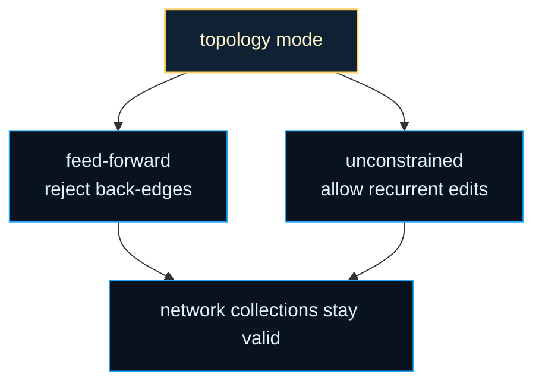

# architecture/network/connect

Connection-editing chapter for single-edge graph surgery.

This folder owns the smallest structural change a `Network` can make: add or
remove one directed edge while keeping graph invariants, gating state, and
execution caches honest. Higher-level builders may connect layers or groups
in bulk, but they still depend on the legality and bookkeeping rules taught
here.

The important distinction is between edge creation and edge registration.
`Node.connect()` can manufacture one or more low-level connection objects,
but the network still has to decide whether those edges are legal in the
current topology policy, whether they belong in normal or self-connection
storage, and whether cached topological or slab views must be invalidated.

Acyclic mode makes that policy visible. In feed-forward configurations this
chapter refuses back-edges and self-edges that would violate the intended
execution order. In unconstrained mode the same surface accepts those edits
and simply keeps the runtime collections synchronized. That lets callers ask
for structural edits without duplicating the topology rules everywhere else.

The matching remove path is equally educational. Disconnecting one edge is
not just a splice from an array. If the edge is gated, the gating linkage has
to be released first. After that, structural caches are marked dirty so the
next activation or slab rebuild sees the new graph instead of a stale one.




For background on the scheduling constraint behind acyclic mode, see
Wikipedia contributors,
[Topological sorting](https://en.wikipedia.org/wiki/Topological_sorting).
The legality checks in this folder protect the execution order assumptions
that feed-forward activation relies on.

Example: add one explicit edge between two nodes.

```ts
const [edge] = network.connect(sourceNode, targetNode, 0.5);
console.log(edge.weight);
```

Example: remove one existing edge and let the network invalidate its cached
structure for the next run.

```ts
network.disconnect(sourceNode, targetNode);
```

Practical reading order:

1. Start here for the public `connect()` and `disconnect()` semantics.
2. Continue into `network.connect.create.utils.ts` for edge creation,
   registration, and acyclic guards.
3. Continue into `network.connect.remove.utils.ts` for disconnect cleanup and
   gated-edge removal behavior.
4. Finish with `network.connect.utils.types.ts` when you need the internal
   state shape shared across both flows.

## architecture/network/connect/network.connect.utils.ts

### collectCreatedConnectionBatches

```ts
collectCreatedConnectionBatches(
  network: default,
  networkInternal: ConnectNetworkInternals,
  requests: readonly NetworkConnectionRequest[],
): CreatedConnectionBatch[]
```

Collect created connection groups for one ordered batch request shelf.

Parameters:
- `network` - Network instance owning node ordering.
- `networkInternal` - Runtime network internals used by connection pipeline.
- `requests` - Ordered connection requests.

Returns: Ordered created connection groups for later batch registration.

### connect

```ts
connect(
  from: default,
  to: default,
  weight: number | undefined,
): default[]
```

Create and register one (or multiple) directed connection objects between two nodes.

Some node types (or future composite structures) may return several low‑level connections when
their {@link Node.connect} is invoked (e.g., expanded recurrent templates). For that reason this
function always treats the result as an array and appends each edge to the appropriate collection.

Algorithm outline:
 1. (Acyclic guard) If acyclicity is enforced and the source node appears after the target node in
    the network's node ordering, abort early and return an empty array (prevents back‑edge creation).
 2. Resolve a deterministic default weight from the owning network RNG when no explicit
    weight was supplied, then delegate to sourceNode.connect(targetNode, weight).
 3. For each created connection:
      a. If it's a self‑connection: either ignore (acyclic mode) or store in selfconns.
      b. Otherwise store in standard connections array.
 4. If at least one connection was added, mark structural caches dirty (_topoDirty & _slabDirty) so lazy
    rebuild can occur before the next forward pass.

Complexity:
 - Time: O(k) where k is the number of low‑level connections returned (typically 1).
 - Space: O(k) new Connection instances (delegated to Node.connect).

Edge cases & invariants:
 - Acyclic mode silently refuses back‑edges instead of throwing (makes evolutionary search easier).
 - Self‑connections are skipped entirely when acyclicity is enforced.
 - Weight initialization stays deterministic for seeded networks even when callers omit an explicit weight.
 - When the network carries explicit temporal extension metadata, successful edge creation
   revalidates that descriptor bag immediately so generic structural edits keep the extension lane honest.

Parameters:
- `this` - Bound Network instance.
- `from` - Source node (emits signal).
- `to` - Target node (receives signal).
- `weight` - Optional explicit initial weight value.

Returns: Array of created  {@link Connection} objects (possibly empty if acyclicity rejected the edge).

Example:

const [edge] = net.connect(nodeA, nodeB, 0.5);

### connectBatch

```ts
connectBatch(
  requests: readonly NetworkConnectionRequest[],
): default[]
```

Create and register many directed connection objects in one structural edit batch.

This preserves the same legality checks and deterministic default-weight
policy as repeated {@link connect} calls, but it reserves network-level
connection storage once for the whole request shelf.

Parameters:
- `this` - Bound Network instance.
- `requests` - Ordered connection requests.

Returns: Flattened created  {@link Connection} objects in request order.

Example:

const createdConnections = network.connectBatch([
  { from: network.nodes[0], to: network.nodes[2] },
  { from: network.nodes[1], to: network.nodes[2], weight: 0.5 },
]);

### disconnect

```ts
disconnect(
  from: default,
  to: default,
): void
```

Remove (at most) one directed connection from source 'from' to target 'to'.

Only a single direct edge is removed because typical graph configurations maintain at most
one logical connection between a given pair of nodes (excluding potential future multi‑edge
semantics). If the target edge is gated we first call {@link Network.ungate} to maintain
gating invariants (ensuring the gater node's internal gate list remains consistent).

Algorithm outline:
 1. Choose the correct list (selfconns vs connections) based on whether from === to.
 2. Linear scan to find the first edge with matching endpoints.
 3. If gated, ungate to detach gater bookkeeping.
 4. Splice the edge out; exit loop (only one expected).
 5. Delegate per‑node cleanup via from.disconnect(to) (clears reverse references, traces, etc.).
 6. Mark structural caches dirty for lazy recomputation.

Complexity:
 - Time: O(m) where m is length of the searched list (connections or selfconns).
 - Space: O(1) extra.

Idempotence: If no such edge exists we still perform node-level disconnect and flag caches dirty –
this conservative approach simplifies callers (they need not pre‑check existence).
When the network carries explicit temporal extension metadata, the disconnect path also revalidates
that descriptor bag immediately so stale module claims do not linger until a later serialize pass.

Parameters:
- `this` - Bound Network instance.
- `from` - Source node.
- `to` - Target node.

Example:

net.disconnect(nodeA, nodeB);

## architecture/network/connect/network.connect.utils.types.ts

### NetworkInternals

Internal network state shape shared by connect utility helper modules.

## architecture/network/connect/network.connect.create.utils.ts

### createConnectionsFromSourceNode

```ts
createConnectionsFromSourceNode(
  sourceNode: default,
  targetNode: default,
  initialWeight: number | undefined,
  randomValue: (() => number) | undefined,
): default[]
```

Build one or more low-level connection objects from source node to target node.

Parameters:
- `sourceNode` - Source node.
- `targetNode` - Target node.
- `initialWeight` - Optional explicit initial weight.
- `randomValue` - Network-owned RNG used when the caller did not provide a weight.

Returns: Created low-level connection objects.

### markConnectionCachesDirtyWhenNeeded

```ts
markConnectionCachesDirtyWhenNeeded(
  internalState: ConnectNetworkInternals,
  createdConnectionCount: number,
): void
```

Mark topology and slab caches dirty when connection creation occurred.

Parameters:
- `internalState` - Runtime network internals used by connection pipeline.
- `createdConnectionCount` - Number of created low-level connections.

Returns: Nothing.

### registerCreatedConnectionBatches

```ts
registerCreatedConnectionBatches(
  network: default,
  internalState: ConnectNetworkInternals,
  createdConnectionBatches: readonly CreatedConnectionBatch[],
): default[]
```

Register many created connection groups while reserving network-level storage once.

This preserves the same registration semantics as repeated
{@link registerCreatedConnections} calls, but it grows the top-level
`connections` and `selfconns` arrays one time for the whole batch.

Parameters:
- `network` - Network instance owning connection collections.
- `internalState` - Runtime network internals used by connection pipeline.
- `createdConnectionBatches` - Ordered connection groups produced from one batch request shelf.

Returns: Flattened created connections in request order.

### registerCreatedConnections

```ts
registerCreatedConnections(
  network: default,
  internalState: ConnectNetworkInternals,
  sourceNode: default,
  targetNode: default,
  createdConnections: default[],
): void
```

Register created connections in either normal-connection or self-connection storage.

Parameters:
- `network` - Network instance owning connection collections.
- `internalState` - Runtime network internals used by connection pipeline.
- `sourceNode` - Source node used during connection creation.
- `targetNode` - Target node used during connection creation.
- `createdConnections` - Created low-level connection objects.

Returns: Nothing.

### registerSingleCreatedConnection

```ts
registerSingleCreatedConnection(
  network: default,
  internalState: ConnectNetworkInternals,
  isSelfConnection: boolean,
  createdConnection: default,
): void
```

Register one created connection in the appropriate collection.

Parameters:
- `network` - Network instance owning connection collections.
- `internalState` - Runtime network internals used by connection pipeline.
- `isSelfConnection` - Whether source and target nodes are the same.
- `createdConnection` - Created low-level connection object.

Returns: Nothing.

### resolveConnectionStoragePlan

```ts
resolveConnectionStoragePlan(
  createdConnectionBatches: readonly CreatedConnectionBatch[],
  internalState: ConnectNetworkInternals,
): ConnectionStoragePlan
```

Resolve how much top-level connection storage one batch must reserve.

Parameters:
- `createdConnectionBatches` - Ordered connection groups produced from one batch request shelf.
- `internalState` - Runtime network internals used by connection pipeline.

Returns: Planned storage counts for flattened, standard, and self connections.

### shouldRejectConnectionForAcyclicMode

```ts
shouldRejectConnectionForAcyclicMode(
  network: default,
  internalState: ConnectNetworkInternals,
  sourceNode: default,
  targetNode: default,
): boolean
```

Determine whether an edge must be rejected to preserve acyclic ordering.

Parameters:
- `network` - Network instance owning node ordering.
- `internalState` - Runtime network internals used by connection pipeline.
- `sourceNode` - Candidate source node.
- `targetNode` - Candidate target node.

Returns: True when edge should be rejected.

## architecture/network/connect/network.connect.remove.utils.ts

### disconnectNodes

```ts
disconnectNodes(
  sourceNode: default,
  targetNode: default,
): void
```

Delegate per-node disconnect cleanup.

Parameters:
- `sourceNode` - Source node.
- `targetNode` - Target node.

Returns: Nothing.

### findConnectionIndex

```ts
findConnectionIndex(
  candidateConnections: default[],
  sourceNode: default,
  targetNode: default,
): number
```

Find index of the first connection matching source and target nodes.

Parameters:
- `candidateConnections` - Candidate collection to search.
- `sourceNode` - Source node.
- `targetNode` - Target node.

Returns: Matching index or -1 when no edge is found.

### markStructureCachesDirty

```ts
markStructureCachesDirty(
  internalState: ConnectNetworkInternals,
): void
```

Mark topology/slab caches dirty after structural mutation.

Parameters:
- `internalState` - Runtime network internals used by connection pipeline.

Returns: Nothing.

### removeConnectionAtIndex

```ts
removeConnectionAtIndex(
  network: default,
  candidateConnections: default[],
  targetConnectionIndex: number,
): void
```

Remove one connection by index, ungating first if required.

Parameters:
- `network` - Network instance used for ungating.
- `candidateConnections` - Candidate collection containing target index.
- `targetConnectionIndex` - Index to remove.

Returns: Nothing.

### removeFirstMatchingConnection

```ts
removeFirstMatchingConnection(
  network: default,
  candidateConnections: default[],
  sourceNode: default,
  targetNode: default,
): void
```

Remove first connection that matches source and target nodes.

Parameters:
- `network` - Network instance used for ungating.
- `candidateConnections` - Candidate collection to search.
- `sourceNode` - Source node.
- `targetNode` - Target node.

Returns: Nothing.

### selectConnectionCollection

```ts
selectConnectionCollection(
  network: default,
  sourceNode: default,
  targetNode: default,
): default[]
```

Select the relevant collection to search for the edge.

Parameters:
- `network` - Network instance owning connection collections.
- `sourceNode` - Source node.
- `targetNode` - Target node.

Returns: Candidate connection collection.
