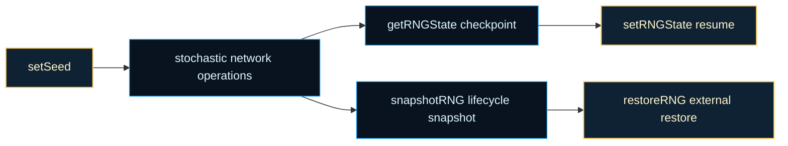
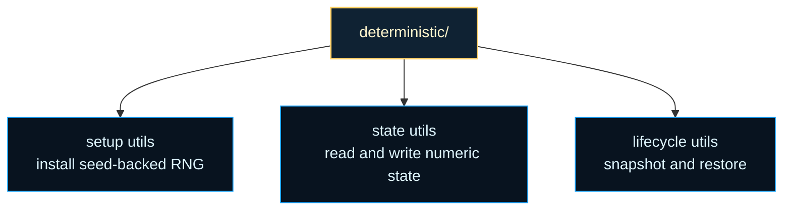

# architecture/network/deterministic

Deterministic RNG chapter for replayable `Network` behavior.

This folder keeps random state explicit so stochastic network behavior can be
repeated instead of merely hoped for. The same graph may use randomness for
dropout, stochastic depth, weight noise, training-time perturbations, or
mutation-adjacent helpers. Deterministic utilities give those flows a common
seed, checkpoint, and restore surface.

The important design split is between setup, state access, and lifecycle
capture. `setSeed()` installs a reproducible random stream. `getRNGState()`
and `setRNGState()` expose lightweight numeric checkpoints for pause-resume
workflows. `snapshotRNG()` and `restoreRNG()` support the slightly richer
lifecycle case where external tooling wants to branch or reconstruct the
active random function more deliberately.

This chapter matters because deterministic behavior is only useful when it is
applied consistently. A seed is not enough if callers cannot checkpoint the
current stream, resume it later, or understand which helper owns the active
random function. By keeping those responsibilities together, the network
surface stays reproducible across tests, debugging sessions, and long-running
experiments.

Another useful lens is to think in terms of branching timelines. Training or
evolution often needs to ask, "what happens if I continue from exactly this
stochastic point but change one later decision?" The deterministic helpers in
this folder are the bridge that makes that question answerable instead of
approximate.





For background on why this chapter can stay reproducible with a small state
surface, see Wikipedia contributors,
[Pseudorandom number generator](https://en.wikipedia.org/wiki/Pseudorandom_number_generator).
The exported helpers here are about managing one deterministic stream, not
about generating cryptographic randomness.

Example: initialize one reproducible random stream and checkpoint its numeric
state for later reuse.

```ts
network.setSeed(42);
const checkpoint = network.getRNGState();

if (checkpoint !== undefined) {
  network.setRNGState(checkpoint);
}
```

Example: capture a portable snapshot before branching into a debugging or
replay workflow.

```ts
network.setSeed(7);
const snapshot = network.snapshotRNG();

console.log(snapshot.state, snapshot.step);
```

Practical reading order:

1. Start here for the public deterministic helpers and their intended use.
2. Continue into `network.deterministic.setup.utils.ts` for seed-backed RNG
   installation.
3. Continue into `network.deterministic.state.utils.ts` for numeric
   checkpoint accessors.
4. Finish in `network.deterministic.lifecycle.utils.ts` when you want the
   richer snapshot and restore plumbing.

## architecture/network/deterministic/network.deterministic.utils.ts

### getRandomFn

```ts
getRandomFn(): (() => number) | undefined
```

Returns the active deterministic RNG function currently attached to the network.

Overview:
- Use this when tooling or diagnostics need direct RNG access.
- Returning the function allows advanced integration code to inspect or reuse the random stream.
- For most persistence workflows, prefer `snapshotRNG` and `getRNGState` over direct function plumbing.

Parameters:
- `this` - - Bound network instance queried for active RNG function.

Returns: Active RNG function, or `undefined` when deterministic RNG is not initialized.

Example:

```ts
const randomFn = network.getRandomFn();
```

### getRNGState

```ts
getRNGState(): number | undefined
```

Returns the current deterministic RNG numeric state, when available.

Overview:
- Use this for lightweight checkpointing when full lifecycle snapshots are unnecessary.
- The value can be persisted and later reapplied through `setRNGState`.
- This is commonly used by tests that assert deterministic continuity across operations.

Parameters:
- `this` - - Bound network instance queried for deterministic RNG numeric state.

Returns: Numeric RNG state value, or `undefined` when no deterministic state exists yet.

Example:

```ts
const state = network.getRNGState();
```

### restoreRNG

```ts
restoreRNG(
  fn: () => number,
): void
```

Restores deterministic RNG lifecycle behavior from a provided RNG function.

Overview:
- Use this when replaying deterministic flows after custom serialization, hydration, or test setup.
- The restored RNG function becomes the active random source used by the network lifecycle helpers.
- This keeps deterministic plumbing explicit when external code owns RNG reconstruction.

Parameters:
- `this` - - Bound network instance receiving the restored RNG lifecycle function.
- `fn` - - Deterministic RNG function to install (expected to return values in `[0, 1)`).

Returns: Nothing.

Example:

```ts
network.restoreRNG(restoredRandomFunction);
```

### RNGSnapshot

Snapshot payload for RNG state restore flows.

### setRNGState

```ts
setRNGState(
  state: number,
): void
```

Applies a deterministic RNG numeric state to continue from a known checkpoint.

Overview:
- Pair this with `getRNGState` to pause/resume deterministic sequences.
- Useful for reproducible tests, multi-stage training workflows, and deterministic replay.
- Delegation keeps the write path consistent with the rest of deterministic state utilities.

Parameters:
- `this` - - Bound network instance receiving deterministic RNG state.
- `state` - - Numeric RNG state checkpoint to install.

Returns: Nothing.

Example:

```ts
network.setRNGState(savedState);
```

### setSeed

```ts
setSeed(
  seed: number,
): void
```

Sets deterministic randomness for a network by installing a seed-backed RNG.

Overview:
- Use this before training, mutation, or stochastic operations when you need repeatable runs.
- The same seed and operation order produce the same random sequence and reproducible outcomes.
- This method delegates to setup utilities so behavior stays centralized across deterministic APIs.

Parameters:
- `this` - - Bound network instance whose RNG state is being initialized.
- `seed` - - Seed value used to derive deterministic RNG state (low 32 bits are applied).

Returns: Nothing.

Example:

```ts
network.setSeed(42);
```

### snapshotRNG

```ts
snapshotRNG(): RNGSnapshot
```

Captures the current deterministic RNG lifecycle state as a portable snapshot.

Overview:
- Use this before temporary experiments, branching simulations, or stateful debug sessions.
- The snapshot preserves enough information to resume from the same deterministic point later.
- This is useful when comparing alternate algorithm branches from an identical random timeline.

Parameters:
- `this` - - Bound network instance whose RNG lifecycle state is captured.

Returns: Snapshot containing deterministic progress metadata and RNG state payload.

Example:

```ts
const snapshot = network.snapshotRNG();
```

## architecture/network/deterministic/network.deterministic.utils.types.ts

### NetworkInternals

Internal deterministic network state shape used across deterministic utility modules.

### RNG_WEYL_INCREMENT

Fixed Weyl increment used to advance deterministic PRNG state.

### RNGSnapshot

Snapshot payload for RNG state restore flows.

### UINT32_NORMALIZER

Divisor used to normalize uint32 PRNG output into [0, 1).

## architecture/network/deterministic/network.deterministic.setup.utils.ts

### advanceStateWithWeylIncrement

```ts
advanceStateWithWeylIncrement(
  currentState: number | undefined,
): number
```

Advance state using a fixed Weyl increment with uint32 wraparound.

Parameters:
- `currentState` - - Current state word (possibly undefined).

Returns: Next unsigned 32-bit state.

### createDeterministicRandomFunction

```ts
createDeterministicRandomFunction(
  internalState: DeterministicNetworkInternals,
): () => number
```

Create deterministic PRNG function bound to provided internal state holder.

Parameters:
- `internalState` - - Runtime network internals used by deterministic RNG pipeline.

Returns: PRNG function returning values in [0,1).

### mixStateWord

```ts
mixStateWord(
  stateWord: number,
): number
```

Mix state word with xorshift and multiplication steps.

Parameters:
- `stateWord` - - Unsigned 32-bit state word.

Returns: Mixed unsigned 32-bit word.

### setInternalSeedState

```ts
setInternalSeedState(
  internalState: DeterministicNetworkInternals,
  normalizedState: number,
): void
```

Assign normalized seed state to internal RNG storage.

Parameters:
- `internalState` - - Runtime network internals used by deterministic RNG pipeline.
- `normalizedState` - - Unsigned 32-bit state.

Returns: Nothing.

### setRandomFunction

```ts
setRandomFunction(
  internalState: DeterministicNetworkInternals,
  randomFunction: () => number,
): void
```

Assign the active random function reference.

Parameters:
- `internalState` - - Runtime network internals used by deterministic RNG pipeline.
- `randomFunction` - - PRNG function returning values in [0,1).

Returns: Nothing.

### setSeed

```ts
setSeed(
  seed: number,
): void
```

Seed the internal PRNG and install a deterministic random() implementation on the Network instance.

Parameters:
- `this` - - Bound Network instance.
- `seed` - - A finite number; only its lower 32 bits are used.

Returns: Nothing.

### toUint32

```ts
toUint32(
  numericValue: number,
): number
```

Convert a numeric value into unsigned 32-bit state.

Parameters:
- `numericValue` - - Numeric value to normalize.

Returns: Unsigned 32-bit representation.

### toUnitInterval

```ts
toUnitInterval(
  unsignedWord: number,
): number
```

Convert unsigned 32-bit word to float in [0,1).

Parameters:
- `unsignedWord` - - Unsigned 32-bit word.

Returns: Unit-interval floating-point value.

## architecture/network/deterministic/network.deterministic.state.utils.ts

### getRandomFn

```ts
getRandomFn(): (() => number) | undefined
```

Retrieve the active random function reference.

Parameters:
- `this` - - Bound Network instance.

Returns: Function producing numbers in [0,1). May be undefined if never seeded.

### getRNGState

```ts
getRNGState(): number | undefined
```

Get the current internal 32-bit RNG state value.

Parameters:
- `this` - - Bound Network instance.

Returns: Unsigned 32-bit state integer or undefined if generator not yet seeded or was reset.

### isNumericState

```ts
isNumericState(
  candidateState: number,
): boolean
```

Check whether incoming state is numeric.

Parameters:
- `candidateState` - - Candidate state value.

Returns: True when state is numeric.

### setRNGState

```ts
setRNGState(
  state: number,
): void
```

Explicitly set (override) the internal 32-bit RNG state without changing the generator function.

Parameters:
- `this` - - Bound Network instance.
- `state` - - A finite number (only low 32 bits used). Ignored when non-numeric.

Returns: Nothing.

### toUint32

```ts
toUint32(
  numericState: number,
): number
```

Convert numeric state to unsigned 32-bit representation.

Parameters:
- `numericState` - - Numeric state value.

Returns: Unsigned 32-bit state.

## architecture/network/deterministic/network.deterministic.lifecycle.utils.ts

### clearStoredRngState

```ts
clearStoredRngState(
  internalState: DeterministicNetworkInternals,
): void
```

Clear stored numeric RNG state.

Parameters:
- `internalState` - - Runtime network internals used by deterministic RNG pipeline.

Returns: Nothing.

### restoreRNG

```ts
restoreRNG(
  fn: () => number,
): void
```

Restore a previously captured RNG function implementation and clear stored numeric state.

Parameters:
- `this` - - Bound Network instance.
- `fn` - - Function returning a pseudo-random number in [0,1).

Returns: Nothing.

### setRandomFunction

```ts
setRandomFunction(
  internalState: DeterministicNetworkInternals,
  randomFunction: () => number,
): void
```

Assign active random function reference.

Parameters:
- `internalState` - - Runtime network internals used by deterministic RNG pipeline.
- `randomFunction` - - PRNG function returning values in [0,1).

Returns: Nothing.

### snapshotRNG

```ts
snapshotRNG(): RNGSnapshot
```

Capture a snapshot of the RNG state together with the network's training step.

Parameters:
- `this` - - Bound Network instance.

Returns: Object containing current training step and 32-bit RNG state.
