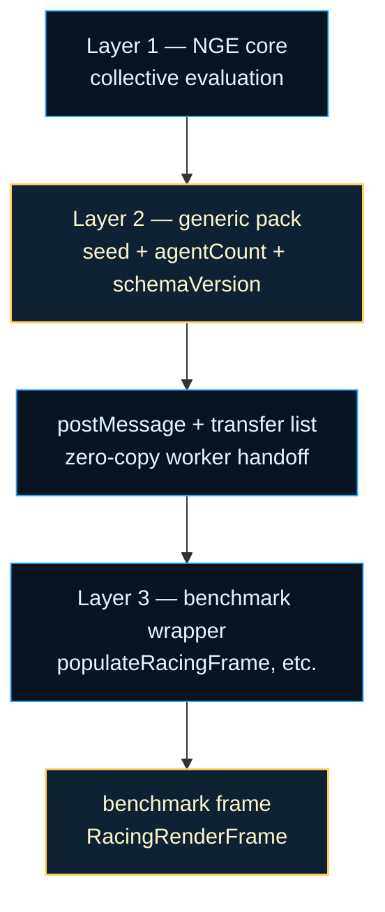

# architecture/network/evaluation-pack

Deterministic evaluation-pack contracts (Layer 2 — Worker Transport
Normalization).

An evaluation pack is the transport-neutral initial state for one evaluation
episode. It bundles deterministic typed arrays with the seed and schema
version that produced them, so a worker can recreate the exact same starting
point on the same runtime. The boundary exists because benchmarks such as
racing, predator/prey, and ant-hive all need to ship initial state across a
worker boundary, but each benchmark should not invent its own pack,
transfer, and versioning rules.

This module owns the generic contract:
- `createDeterministicEvaluationPack(seed, inputs)` builds a pack from a
  seed and transport-neutral inputs. The same reproducibility tuple
  `(seed, agentCount, schemaVersion)` produces byte-identical arrays on the
  same runtime.
- `resolveTransferList(pack)` collects every distinct `ArrayBuffer` backing
  a typed-array field, so `postMessage` can transfer the pack without
  copying.
- `assertSchemaVersion(pack, expectedVersion)` rejects incompatible pack
  shapes at the boundary with a clear `RangeError`.

The pack is intentionally transport-neutral. It does not know about racing
frames, opponent snapshots, or track physics; the benchmark's Layer 3 wrapper
injects that state after the pack arrives. This split lets Layer 2 stay
reusable while each benchmark keeps its own frame format and lifecycle.

Determinism here is bounded to the same runtime. The pack is filled with a
self-contained xorshift32 PRNG, so same seed plus same inputs yields the
same arrays on the same Node or browser build. Cross-runtime byte identity
is not promised because typed-array layout, transfer semantics, and
floating-point reduction order can differ between environments.



For background on the PRNG family used to fill the arrays, see Marsaglia,
G. (2003), "Xorshift RNGs," *Journal of Statistical Software*, 8(14), 1–6,
https://www.jstatsoft.org/article/view/v008i14, and Wikipedia contributors,
[Pseudorandom number generator](https://en.wikipedia.org/wiki/Pseudorandom_number_generator).
For background on the worker boundary where the zero-copy transfer list is
consumed, see Wikipedia contributors,
[Web Workers](https://en.wikipedia.org/wiki/Web_Workers), and MDN Web Docs,
[Transferable objects](https://developer.mozilla.org/en-US/docs/Web/API/Web_Workers_API/Transferring_objects_from_one_worker_to_another).

Example: create a generic pack and resolve its zero-copy transfer list for a
worker.

```ts
const pack = createDeterministicEvaluationPack(42, {
  agentCount: 4,
  schemaVersion: 'eval-pack-v1',
});
const transferList = resolveTransferList(pack);
worker.postMessage({ type: 'eval', pack }, transferList);
```

Example: assert a schema version before reading typed-array fields.

```ts
assertSchemaVersion(receivedPack, 'eval-pack-v1');
// now safe to read pack.arrays
```

Practical reading order:

1. Start here for the generic pack contract, the reproducibility tuple, and
   the layer map.
2. Read `createDeterministicEvaluationPack` for seed-to-array semantics.
3. Read `resolveTransferList` for zero-copy transfer-list resolution.
4. Read `assertSchemaVersion` for forward-compatibility rejection.

## architecture/network/evaluation-pack/network.evaluation-pack.ts

### assertSchemaVersion

```ts
assertSchemaVersion(
  pack: { schemaVersion: unknown; },
  expectedVersion: string,
): void
```

Asserts that the `schemaVersion` field of a pack matches the expected
version string.  Consumers must call this before reading any typed-array
field so that a version mismatch is caught at the boundary rather than
silently misinterpreting the packed bytes.

This is the generic version of the racing-specific
`assertRacingSchemaVersion` — the expected version is passed as a parameter
so any benchmark can use the same boundary guard. Schema-version sentinels
are a common forward-compatibility technique; see Wikipedia contributors,
[Forward compatibility](https://en.wikipedia.org/wiki/Forward_compatibility).

Parameters:
- `pack` - Object with a `schemaVersion` field.
- `expectedVersion` - Expected schema-version sentinel.

Example:

```ts
assertSchemaVersion(receivedPack, 'eval-pack-v1');
// now safe to read typed-array fields
```

### createDeterministicEvaluationPack

```ts
createDeterministicEvaluationPack(
  seed: number,
  inputs: EvaluationPackInputs,
): DeterministicEvaluationPack
```

Constructs a deterministic evaluation pack from a seed and transport-neutral
inputs.  Identical `(seed, inputs)` → identical pack on the same runtime
(same Node or browser build).

The pack's typed arrays are filled by a self-contained xorshift32 PRNG
seeded from `seed`. The PRNG algorithm matches the same family used in
`src/neat/rng/core/` but is duplicated here to avoid a cross-layer
dependency — Layer 2 must not import NEAT core internals. For background
on xorshift32, see Marsaglia, G. (2003), "Xorshift RNGs," *Journal of
Statistical Software*, 8(14), 1–6,
https://www.jstatsoft.org/article/view/v008i14.

Generic reproducibility tuple: `(seed, agentCount, schemaVersion)`. Same
tuple → identical pack on the same runtime. Cross-runtime byte identity is
not promised.

Parameters:
- `seed` - Deterministic pack seed (non-negative integer; zero falls
back to a non-zero constant because xorshift32 cannot advance from zero).
- `inputs` - Transport-neutral inputs (agent count, schema version).

Returns: A `DeterministicEvaluationPack` whose typed arrays are
deterministic functions of `(seed, inputs)`.

Example:

```ts
const pack = createDeterministicEvaluationPack(42, {
  agentCount: 4,
  schemaVersion: 'eval-pack-v1',
});
// pack.arrays are byte-identical on every call with the same (seed, inputs)
```

### DeterministicEvaluationPack

Transport-neutral deterministic evaluation pack.

A pack is the transport-neutral deterministic initial state for the generic
evaluation-pack arrays. Benchmark-specific episode state such as
`opponentSnapshot`, `trackId`, or `featureFlags` is injected by the Layer 3
wrapper after the pack arrives, not by this generic type.

Given the same `seed` and the same `EvaluationPackInputs`, the pack's typed
arrays are byte-identical within a single runtime (same Node or browser
build). Cross-runtime byte identity is not promised.

The `arrays` field holds every typed array that participates in zero-copy
transfer; `resolveTransferList` walks this collection to build the
postMessage transfer list.

### EvaluationPackInputs

Transport-neutral inputs consumed by `createDeterministicEvaluationPack`.

Captures the reproducibility tuple components that are NOT the seed:
`agentCount` (determines typed-array sizes) and `schemaVersion` (forward-
compatibility sentinel).  Benchmark-specific inputs (opponent snapshots,
track physics, etc.) are injected by the benchmark's own wrapper, not by
this generic type.

Generic reproducibility tuple: `(seed, agentCount, schemaVersion)`. Same
tuple → identical pack on the same runtime.

### resolveTransferList

```ts
resolveTransferList(
  pack: DeterministicEvaluationPack,
): ArrayBuffer[]
```

Collects every distinct `ArrayBuffer` backing a typed-array field in `pack`
into a transfer list for zero-copy `postMessage` transfer.

Rules:
- Every typed-array field contributes exactly one buffer entry.
- Shared buffers are deduplicated (listed only once).

The transfer list follows the HTML structured-clone transferables contract
consumed by Web Workers. For background, see MDN Web Docs,
[Transferable objects](https://developer.mozilla.org/en-US/docs/Web/API/Web_Workers_API/Transferring_objects_from_one_worker_to_another),
and Wikipedia contributors,
[Web Workers](https://en.wikipedia.org/wiki/Web_Workers).

Parameters:
- `pack` - The deterministic evaluation pack whose buffers will transfer.

Returns: Ordered list of `ArrayBuffer` references for postMessage transfer.

Example:

```ts
const pack = createDeterministicEvaluationPack(42, inputs);
const transferList = resolveTransferList(pack);
worker.postMessage({ type: 'eval', pack }, transferList);
```
