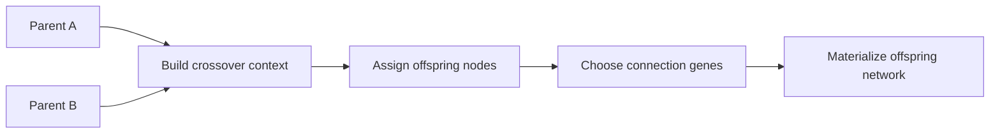
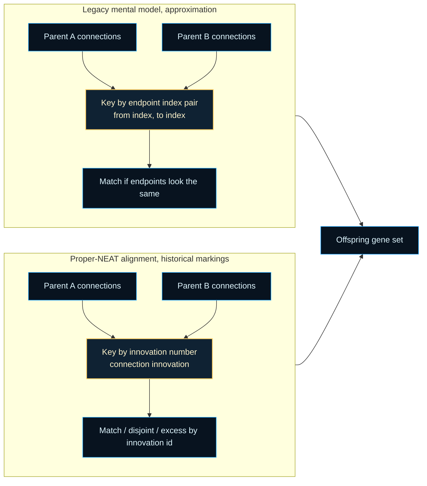

# architecture/network/genetic

Network-level crossover boundary for recombining two compatible parent
graphs into one offspring.

This chapter is the genetic shelf of `architecture/network/`: the place
where structure is inherited rather than mutated from scratch. It answers a
practical question that shows up during neuroevolution and testing alike: if
two networks already expose the same input and output contract, how should a
child network mix their node and connection genes without losing a runnable
topology?

The helpers below split that answer into setup, genome-backed selection, and
materialization. Setup decides how large the offspring can be and which
parent has inheritance priority. The genome heredity boundary chooses
overlapping and disjoint genes from strict structural contracts.
Materialization turns the chosen genes back into a concrete `Network`
instance and restores gating when the chosen gater still exists. That keeps
the public `crossOver()` surface compact while the README can still teach the
full inheritance flow.



Required teaching output: old crossover vs proper crossover.



This chapter now aligns inherited connection genes by preserved innovation
numbers instead of synthetic endpoint ids, which moves the runtime crossover
boundary much closer to canonical NEAT historical markings. The remaining
simplifications are now narrower: node inheritance still follows runtime slot
ordering, and recurrent-policy enforcement still happens later during
materialization.

For compact background reading on the wider idea, see Wikipedia
contributors,
[Crossover (genetic algorithm)](https://en.wikipedia.org/wiki/Crossover_(genetic_algorithm)).
The implementation here specializes that idea to graph-shaped neural
networks with gating and disabled genes.

Example: create one offspring using ordinary fitness-biased inheritance.

```ts
const child = crossOver(parentA, parentB);
```

Example: force symmetric inheritance when you want experimentation rather
than fitter-parent bias.

```ts
const exploratoryChild = crossOver(parentA, parentB, true);
```

## architecture/network/genetic/network.genetic.utils.ts

### crossOver

```ts
crossOver(
  parentNetwork1: default,
  parentNetwork2: default,
  equal: boolean,
): default
```

NEAT-inspired crossover between two parent networks producing a single offspring.

Conceptual model:
- A "gene" corresponds to either a node choice at a structural index or a connection
  keyed by innovation identity.
- The offspring is assembled in two phases: node assignment first, then connection
  materialization constrained by available offspring endpoints.
- Fitness controls inheritance pressure unless `equal` is enabled, in which case both
  parents contribute symmetrically where possible.

Current simplifications relative to canonical NEAT:
 - Node alignment still relies on current index ordering while the broader
   proper-NEAT lift keeps the public runtime `Network` surface stable.
 - Recurrent and self-connection legality is still finalized during
   materialization rather than by a separate genotype-first heredity layer.

Compatibility assumptions:
- Both parents must expose identical input/output counts.
- Parent node index ordering should represent comparable structural positions.
- Parent fitness scores are interpreted by setup helpers when deciding fitter-parent inheritance.

High-level algorithm:
 1. Validate that parents have identical I/O dimensionality (required for compatibility).
 2. Decide offspring node array length:
      - If equal flag set or scores tied: random length in [minNodes, maxNodes].
      - Else: length of fitter parent.
 3. For each index up to chosen size, pick a node gene from parents per rules:
      - Input indices: always from parent1 (assumes identical input interface).
      - Output indices (aligned from end): randomly choose if both present else take existing.
      - Hidden indices: if both present pick randomly; else inherit from fitter (or either if equal).
 4. Reindex offspring nodes.
 5. Delegate innovation-keyed connection-gene collection and inheritance
    choice to the genome heredity boundary.
 6. For matching genes (present in both parents with the same innovation),
    randomly choose one; if either copy is disabled, apply the explicit
    re-enable policy through the crossover RNG.
 7. For disjoint/excess genes, inherit only from the fitter parent (or from
    both parents when `equal` is enabled or scores tie).
 8. Rebuild the offspring node set from required IO nodes plus inherited
    gene identities, then materialize selected connection genes under the
    offspring topology intent.
 9. Reattach gating if gater node exists in offspring.

Enabled reactivation probability:
 - Parents may carry disabled connections; offspring may re-enable them with a probability derived
   from parent-specific _reenableProb (or default 0.25). This allows dormant structures to resurface.

Parameters:
- `parentNetwork1` - First parent (ties resolved in its favor when scores equal and equal=false for some cases).
- `parentNetwork2` - Second parent.
- `equal` - Force symmetric treatment regardless of fitness (true => node count random between sizes and both parents equally contribute disjoint genes).

Returns: Offspring network instance.

Example:

```ts
const offspring = crossOver(parentA, parentB);
offspring.mutate();
```

### crossOverWithRandomGenerator

```ts
crossOverWithRandomGenerator(
  parentNetwork1: default,
  parentNetwork2: default,
  equal: boolean,
  randomGenerator: RandomGenerator,
): default
```

Internal crossover entrypoint that uses an explicit RNG supplied by the NEAT evolve layer.

The public `Network.crossOver()` surface stays convenience-oriented so standalone callers can
keep relying on the runtime-network fallback. The evolve controller uses this helper instead
when crossover randomness must stay in the same deterministic stream as parent selection.

Parameters:
- `parentNetwork1` - First parent network.
- `parentNetwork2` - Second parent network.
- `equal` - Equal-treatment mode flag.
- `randomGenerator` - Explicit crossover RNG owned by the evolve controller.

Returns: Offspring network instance.

## architecture/network/genetic/network.genetic.setup.utils.ts

Crossover setup helpers for the network genetic boundary.

This file prepares the immutable context used by the rest of the crossover
pipeline.

Key responsibilities:

- Validate that parents are compatible (same input/output sizes).
- Normalize parent runtime shapes and establish deterministic node indexing.
- Resolve the offspring topology intent conservatively.
- Resolve the crossover RNG source:
  - prefer an explicitly injected RNG (controller-owned determinism),
  - otherwise fall back to the parent runtime `_rand` hook,
  - finally fall back to `Math.random` for standalone use.

This separation keeps the public crossover surface compact while giving the
evolve controller one clear seam for deterministic replay.

### asGeneticNetwork

```ts
asGeneticNetwork(
  network: default,
): GeneticNetwork
```

Coerces a network to the internal genetic runtime shape.

Parameters:
- `network` - Source network.

Returns: Network with runtime genetic properties.

### assignNodeIndexes

```ts
assignNodeIndexes(
  nodes: default[],
): void
```

Assigns contiguous indices to a node list.

Parameters:
- `nodes` - Nodes to reindex.

Returns: Nothing.

### assignOffspringNodes

```ts
assignOffspringNodes(
  nodeContext: CrossoverNodeBuildContext,
): void
```

Builds and reindexes offspring nodes.

Parameters:
- `nodeContext` - Node-build context.

Returns: Nothing.

### buildOffspringNodes

```ts
buildOffspringNodes(
  parent1: GeneticNetwork,
  parent2: GeneticNetwork,
  parentMetrics: ParentMetrics,
  offspringNodeCount: number,
  equal: boolean,
  randomGenerator: RandomGenerator,
): default[]
```

Builds the offspring node list by selecting genes per slot.

Parameters:
- `parent1` - First parent.
- `parent2` - Second parent.
- `parentMetrics` - Parent metrics.
- `offspringNodeCount` - Target offspring size.
- `equal` - Equal-treatment mode.
- `randomGenerator` - Random generator.

Returns: Cloned offspring node genes.

### chooseOffspringConnectionGenes

```ts
chooseOffspringConnectionGenes(
  context: CrossoverContext,
): ConnectionGene[]
```

Chooses all offspring connection genes from both parents.

Innovation-aligned heredity selection now lives behind the strict genome
boundary. This runtime seam now returns only the stable materialization
descriptor consumed by the phenotype builder, without carrying parent-local
node-index hints across the adapter.

Parameters:
- `context` - Crossover baseline context.

Returns: Chosen connection genes.

### cloneNodeGene

```ts
cloneNodeGene(
  sourceNode: default,
): default
```

Clones node structural gene attributes.

Historical node identity must survive crossover even though the offspring is
rebuilt as a fresh runtime graph. Preserving `geneId` here lets later
materialization resolve inherited connection endpoints by stable gene identity
instead of by whatever transient slot the node lands in after reindexing.

Parameters:
- `sourceNode` - Source node gene.

Returns: Cloned node.

### createCrossoverContext

```ts
createCrossoverContext(
  parentNetwork1: default,
  parentNetwork2: default,
  equal: boolean,
  injectedRandomGenerator: RandomGenerator | undefined,
): CrossoverContext
```

Creates the immutable crossover baseline context.

Parameters:
- `parentNetwork1` - First parent network.
- `parentNetwork2` - Second parent network.
- `equal` - Equal-treatment mode flag.
- `injectedRandomGenerator` - Optional explicit crossover RNG supplied by the evolve controller.

Returns: Initialized crossover context.

### createNodeBuildContext

```ts
createNodeBuildContext(
  context: CrossoverContext,
): CrossoverNodeBuildContext
```

Creates the node-build context for offspring node selection.

Parameters:
- `context` - Crossover baseline context.

Returns: Node-build context.

### createOffspringScaffold

```ts
createOffspringScaffold(
  inputSize: number,
  outputSize: number,
  topologyIntent: NetworkTopologyIntent,
): GeneticNetwork
```

Creates an empty offspring scaffold with reset runtime arrays.

Parameters:
- `inputSize` - Input count.
- `outputSize` - Output count.
- `topologyIntent` - Topology policy inherited by the offspring scaffold.

Returns: Initialized offspring runtime object.

### createParentNodeRegions

```ts
createParentNodeRegions(
  nodes: default[],
): ParentNodeRegions
```

Partitions one runtime node list into canonical IO and hidden shelves.

Crossover setup still owns runtime node selection, but it must not assume the
raw `nodes[]` array already keeps outputs at the tail. Structural edits can
preserve a valid phenotype while drifting away from that canonical order.
Reading through per-type partitions keeps output-slot inheritance stable
without mutating the parent runtime graph.

Parameters:
- `nodes` - Ordered runtime node list.

Returns: Canonical node partitions.

### determineOffspringNodeCount

```ts
determineOffspringNodeCount(
  equal: boolean,
  parentMetrics: ParentMetrics,
  randomGenerator: RandomGenerator,
): number
```

Determines offspring node count from fitness/equality policy.

Parameters:
- `equal` - Whether equal treatment mode is enabled.
- `parentMetrics` - Parent metrics.
- `randomGenerator` - Random generator.

Returns: Offspring node count.

### getRandomGenerator

```ts
getRandomGenerator(
  parentNetwork: default,
): RandomGenerator
```

Resolves the random generator used by crossover decisions.

Parameters:
- `parentNetwork` - Parent network that may provide a deterministic `_rand` source.

Returns: Random function.

### resolveOffspringTopologyIntent

```ts
resolveOffspringTopologyIntent(
  parentNetwork1: default,
  parentNetwork2: default,
): NetworkTopologyIntent
```

Resolves the topology policy to preserve on the offspring scaffold.

A mixed-parent crossover should not silently downgrade recurrent-capable
parents back to feed-forward mode, because that would prune valid inherited
genes during materialization. The offspring therefore stays feed-forward only
when both parents advertise the feed-forward contract.

Parameters:
- `parentNetwork1` - First parent network.
- `parentNetwork2` - Second parent network.

Returns: Offspring topology intent.

### resolveParentMetrics

```ts
resolveParentMetrics(
  parent1: GeneticNetwork,
  parent2: GeneticNetwork,
  outputSize: number,
): ParentMetrics
```

Computes common parent metrics reused across helper functions.

Parameters:
- `parent1` - First parent network.
- `parent2` - Second parent network.
- `outputSize` - Shared output size.

Returns: Parent metrics.

### selectHiddenNodeGene

```ts
selectHiddenNodeGene(
  hiddenOrdinal: number,
  parent1NodeRegions: ParentNodeRegions,
  parent2NodeRegions: ParentNodeRegions,
  parentMetrics: ParentMetrics,
  equal: boolean,
  randomGenerator: RandomGenerator,
): default | undefined
```

Selects a hidden-region node gene.

Parameters:
- `hiddenOrdinal` - Hidden-slot ordinal.
- `parent1NodeRegions` - First parent node partitions.
- `parent2NodeRegions` - Second parent node partitions.
- `parentMetrics` - Parent metrics.
- `equal` - Equal-treatment mode.
- `randomGenerator` - Random generator.

Returns: Selected hidden node gene.

### selectInputNodeGene

```ts
selectInputNodeGene(
  nodeIndex: number,
  parent1NodeRegions: ParentNodeRegions,
): default | undefined
```

Selects an input-region node gene.

Parameters:
- `nodeIndex` - Slot index.
- `parent1` - First parent.

Returns: Parent 1 input node gene.

### selectNodeGeneAtIndex

```ts
selectNodeGeneAtIndex(
  nodeIndex: number,
  offspringNodeCount: number,
  parent1NodeRegions: ParentNodeRegions,
  parent2NodeRegions: ParentNodeRegions,
  parentMetrics: ParentMetrics,
  equal: boolean,
  randomGenerator: RandomGenerator,
): default | undefined
```

Selects a node gene for a specific offspring slot.

Parameters:
- `nodeIndex` - Slot index.
- `offspringNodeCount` - Total offspring slots.
- `parent1NodeRegions` - First parent node partitions.
- `parent2NodeRegions` - Second parent node partitions.
- `parentMetrics` - Parent metrics.
- `equal` - Equal-treatment mode.
- `randomGenerator` - Random generator.

Returns: Selected parent node gene, when present.

### selectOutputNodeGene

```ts
selectOutputNodeGene(
  outputOrdinal: number,
  parent1NodeRegions: ParentNodeRegions,
  parent2NodeRegions: ParentNodeRegions,
  randomGenerator: RandomGenerator,
): default | undefined
```

Selects an output-region node gene by interface ordinal.

Runtime parents can drift away from strict input-hidden-output ordering after
structural edits. This runtime shelf therefore reads outputs from canonical
per-type partitions rather than trusting the raw tail slots on `nodes[]`.

Parameters:
- `outputOrdinal` - Output-slot ordinal.
- `parent1NodeRegions` - First parent node partitions.
- `parent2NodeRegions` - Second parent node partitions.
- `randomGenerator` - Random generator.

Returns: Selected output node gene.

### validateParentCompatibility

```ts
validateParentCompatibility(
  parentNetwork1: default,
  parentNetwork2: default,
): void
```

Validates parent compatibility for crossover.

Parameters:
- `parentNetwork1` - First parent candidate.
- `parentNetwork2` - Second parent candidate.

Returns: Nothing.

## architecture/network/genetic/network.genetic.selection.utils.ts

### chooseConnectionGenes

```ts
chooseConnectionGenes(
  parent1: GeneticNetwork,
  parent2: GeneticNetwork,
  parentMetrics: ParentMetrics,
  equal: boolean,
  randomGenerator: RandomGenerator,
): ConnectionGene[]
```

Adapts genome-owned heredity selection back into runtime crossover genes.

Step 7.2b keeps this runtime shelf as one thin bridge that:

1. projects each parent into the strict genome contract,
2. asks the genome boundary which structural genes survive, and
3. strips transient runtime node-index hints so the phenotype materializer
   reads only stable gene ids plus the inherited weight, enabled state, and
   innovation identity.

Runtime node scaffolding, topology pruning, and gating reattachment remain
outside this adapter.

Parameters:
- `parent1` - First runtime parent.
- `parent2` - Second runtime parent.
- `parentMetrics` - Shared score summary used by heredity policy.
- `equal` - Equal-treatment mode flag.
- `randomGenerator` - Deterministic crossover RNG.

Returns: Chosen genes for runtime materialization.

## architecture/network/genetic/network.genetic.materialize.utils.ts

### addInheritedGeneIdWhenRequired

```ts
addInheritedGeneIdWhenRequired(
  requiredGeneIds: Set<number>,
  currentNodeOrderByGeneId: Map<number, number>,
  sourceNodesByGeneId: Map<number, MaterializationNodeSource>,
  geneId: number | null,
): void
```

Adds one gene id to the required-node set when it is defined.

Parameters:
- `requiredGeneIds` - Mutable required-node set.
- `currentNodeOrderByGeneId` - Current offspring node order lookup.
- `sourceNodesByGeneId` - Fallback node-gene lookup.
- `geneId` - Candidate stable node gene id.

Returns: Nothing.

### applyConnectionGeneToConnection

```ts
applyConnectionGeneToConnection(
  connection: default,
  connectionGene: ConnectionGene,
): void
```

Applies gene properties to a runtime connection.

Parameters:
- `connection` - Runtime connection.
- `connectionGene` - Gene source.

Returns: Nothing.

### assignOffspringNodeIndexes

```ts
assignOffspringNodeIndexes(
  nodes: default[],
): void
```

Assigns contiguous node indices after rebuilt node ordering is finalized.

Parameters:
- `nodes` - Rebuilt offspring nodes.

Returns: Nothing.

### attachGaterIfAvailable

```ts
attachGaterIfAvailable(
  context: OffspringMaterializationContext,
  connection: default,
  gaterGeneId: number | null,
): void
```

Attaches a gater node when the inherited gater gene exists in the offspring.

Parameters:
- `context` - Materialization context.
- `connection` - Connection to gate.
- `gaterGeneId` - Candidate gater node gene id.

Returns: Nothing.

### buildMaterializedOffspringNodes

```ts
buildMaterializedOffspringNodes(
  currentOffspringNodes: default[],
  chosenGenes: ConnectionGene[],
  sourceNodesByGeneId: Map<number, MaterializationNodeSource>,
): default[]
```

Rebuilds the offspring node set from required IO nodes plus inherited genes.

Step 2.3 moves node survival away from the provisional slot count chosen
during setup. If an inherited connection references a hidden node that the
provisional scaffold omitted, this pass rehydrates that node by `geneId`
before any connection materialization begins.

Parameters:
- `currentOffspringNodes` - Provisional offspring nodes from setup.
- `chosenGenes` - Chosen inherited connection genes.
- `sourceNodesByGeneId` - Fallback node-gene lookup.

Returns: Rebuilt offspring node set.

### cloneSourceNodeGene

```ts
cloneSourceNodeGene(
  sourceNode: default,
): default
```

Clones one fallback source node for materialization-time insertion.

Parameters:
- `sourceNode` - Source node gene.

Returns: Structural clone for the rebuilt offspring node set.

### collectRequiredNodeGeneIds

```ts
collectRequiredNodeGeneIds(
  currentOffspringNodes: default[],
  chosenGenes: ConnectionGene[],
  sourceNodesByGeneId: Map<number, MaterializationNodeSource>,
): Set<number>
```

Collects the node gene ids that must survive materialization.

The offspring always preserves its IO interface, then adds any nodes named by
inherited connection endpoints or gaters.

Parameters:
- `currentOffspringNodes` - Provisional offspring nodes from setup.
- `chosenGenes` - Chosen inherited connection genes.
- `sourceNodesByGeneId` - Fallback node-gene lookup.

Returns: Required node gene ids.

### compareMaterializedNodeCandidates

```ts
compareMaterializedNodeCandidates(
  leftNodeCandidate: MaterializedNodeCandidate,
  rightNodeCandidate: MaterializedNodeCandidate,
): number
```

Compares rebuilt node candidates using IO/hidden ordering first.

Parameters:
- `leftNodeCandidate` - Left node candidate.
- `rightNodeCandidate` - Right node candidate.

Returns: Relative sort order.

### createConnectionForEndpoints

```ts
createConnectionForEndpoints(
  endpointsContext: GeneEndpointsContext,
): default | undefined
```

Creates a runtime connection for endpoint nodes.

Parameters:
- `endpointsContext` - Endpoint context.

Returns: Created connection or undefined.

### createMaterializationContext

```ts
createMaterializationContext(
  targetOffspring: GeneticNetwork,
  chosenGenes: ConnectionGene[],
  sourceNetworks: readonly GeneticNetwork[],
): OffspringMaterializationContext
```

Creates the immutable top-level context used during materialization.

Parameters:
- `targetOffspring` - Offspring receiving concrete edges.
- `chosenGenes` - Chosen inherited genes.
- `sourceNetworks` - Parent networks used as fallback node-gene sources.

Returns: Materialization context.

### createMaterializedNodeCandidate

```ts
createMaterializedNodeCandidate(
  geneId: number,
  currentOffspringNodes: default[],
  currentNodeOrderByGeneId: Map<number, number>,
  sourceNodesByGeneId: Map<number, MaterializationNodeSource>,
): MaterializedNodeCandidate | undefined
```

Creates one ordered node candidate for the rebuilt offspring node set.

Existing provisional offspring nodes keep their selected structural traits.
Missing inherited nodes are cloned from the first parent/source that still
exposes the required `geneId`.

Parameters:
- `geneId` - Required stable node gene id.
- `currentOffspringNodes` - Provisional offspring nodes from setup.
- `currentNodeOrderByGeneId` - Current offspring node order lookup.
- `sourceNodesByGeneId` - Fallback node-gene lookup.

Returns: Ordered node candidate when the gene id can be resolved.

### createNodeOrderLookup

```ts
createNodeOrderLookup(
  nodes: default[],
): Map<number, number>
```

Creates a node-order lookup keyed by stable gene id.

Parameters:
- `nodes` - Ordered node list.

Returns: Current node order by gene id.

### createOffspringConnection

```ts
createOffspringConnection(
  offspring: GeneticNetwork,
  fromNode: default,
  toNode: default,
  connectionWeight: number,
): default | undefined
```

Creates a single offspring connection edge.

Parameters:
- `offspring` - Offspring network.
- `fromNode` - Source node.
- `toNode` - Destination node.
- `connectionWeight` - Connection weight.

Returns: Created connection or undefined.

### createOffspringNodeLookupByGeneId

```ts
createOffspringNodeLookupByGeneId(
  nodes: default[],
): Map<number, default>
```

Builds a stable node lookup keyed by gene id for one offspring scaffold.

Connection genes preserve historical endpoint identity even when the runtime
node array is rebuilt in a different slot order. This map lets the
materialization pass reattach inherited genes to the right runtime nodes.

Parameters:
- `nodes` - Offspring nodes after node selection and reindexing.

Returns: Gene-id lookup map.

### createSourceInterfaceOrdinalMap

```ts
createSourceInterfaceOrdinalMap(
  sourceNodeEntriesByGeneId: Map<number, MaterializationNodeSource>,
): Map<number, number>
```

Flattens source interface ordinals into a plain lookup keyed by gene id.

Parameters:
- `sourceNodeEntriesByGeneId` - Source-node entries keyed by gene id.

Returns: Plain source interface-ordinal lookup.

### createSourceNodeLookupByGeneId

```ts
createSourceNodeLookupByGeneId(
  currentOffspringNodes: default[],
  sourceNetworks: readonly GeneticNetwork[],
): Map<number, MaterializationNodeSource>
```

Builds the fallback node-gene lookup used when chosen genes reference nodes
not present in the provisional offspring scaffold.

Parameters:
- `currentOffspringNodes` - Provisional offspring node genes.
- `sourceNetworks` - Parent networks that can contribute missing nodes.

Returns: Lookup of source node genes by stable gene id.

### createSourceNodeMap

```ts
createSourceNodeMap(
  sourceNodeEntriesByGeneId: Map<number, MaterializationNodeSource>,
): Map<number, default>
```

Flattens source-node entries into a plain node lookup keyed by gene id.

Parameters:
- `sourceNodeEntriesByGeneId` - Source-node entries keyed by gene id.

Returns: Plain source node lookup.

### createTraversalContexts

```ts
createTraversalContexts(
  context: OffspringMaterializationContext,
  genes: ConnectionGene[],
): GeneTraversalContext[]
```

Builds traversal contexts for each candidate gene.

Parameters:
- `context` - Top-level materialization context.
- `genes` - Candidate genes.

Returns: Traversal contexts.

### hasExistingProjection

```ts
hasExistingProjection(
  endpointsContext: GeneEndpointsContext,
): boolean
```

Checks whether the source endpoint already projects to the target endpoint.

Parameters:
- `endpointsContext` - Endpoint context.

Returns: True when projection already exists.

### isEndpointsContextAllowedByTopologyPolicy

```ts
isEndpointsContextAllowedByTopologyPolicy(
  endpointsContext: GeneEndpointsContext,
): boolean
```

Validates one resolved gene against the offspring topology policy.

Feed-forward offspring prune self and backward genes explicitly. Unconstrained
offspring keep those genes and let `connect()` register them in the runtime
self/recurrent collections.

Parameters:
- `endpointsContext` - Resolved endpoints for one inherited gene.

Returns: True when the gene is legal for the offspring topology intent.

### isRequiredInterfaceNode

```ts
isRequiredInterfaceNode(
  node: default,
): boolean
```

Resolves whether one node is part of the required public IO contract.

Parameters:
- `node` - Candidate node.

Returns: True when the node is input or output.

### materializeOffspringConnections

```ts
materializeOffspringConnections(
  offspring: GeneticNetwork,
  chosenGenes: ConnectionGene[],
  sourceNetworks: readonly GeneticNetwork[],
): void
```

Materializes selected connection genes in the offspring network.

The offspring node array is reindexed after node selection, so this runtime
seam intentionally avoids parent-time node indexes altogether. This
materialization pass first rebuilds the offspring node set from required IO
nodes plus any hidden nodes referenced by the chosen genes, then resolves
endpoints and gaters through a stable `geneId` lookup map. Feed-forward
pruning is now derived from the offspring topology contract instead of any
incidental parent ordering hint.

Parameters:
- `offspring` - Offspring network.
- `chosenGenes` - Chosen connection materialization descriptors.
- `sourceNetworks` - Parent networks used as fallback node-gene sources.

Returns: Nothing.

### materializeSingleTraversalContext

```ts
materializeSingleTraversalContext(
  traversalContext: GeneTraversalContext,
): void
```

Materializes one eligible traversal context when no duplicate projection exists.

Parameters:
- `traversalContext` - Traversal context.

Returns: Nothing.

### materializeTraversalContexts

```ts
materializeTraversalContexts(
  traversalContexts: GeneTraversalContext[],
): void
```

Materializes each eligible traversal context independently.

Parameters:
- `traversalContexts` - Eligible traversal contexts.

Returns: Nothing.

### registerNodeSources

```ts
registerNodeSources(
  sourceNodesByGeneId: Map<number, MaterializationNodeSource>,
  nodes: default[],
  sourcePriority: number,
): void
```

Registers one ordered node list as a fallback source for gene-id lookup.

Parameters:
- `sourceNodesByGeneId` - Mutable source-node lookup.
- `nodes` - Ordered nodes from one source network.
- `sourcePriority` - Stable priority for this source list.

Returns: Nothing.

### resolveGeneEndpointsContext

```ts
resolveGeneEndpointsContext(
  traversalContext: GeneTraversalContext,
): GeneEndpointsContext | undefined
```

Resolves concrete endpoint nodes for a traversal context.

Parameters:
- `traversalContext` - Traversal context.

Returns: Endpoint context or undefined.

### resolveInterfaceNodeByOrdinal

```ts
resolveInterfaceNodeByOrdinal(
  context: OffspringMaterializationContext,
  nodeType: string,
  interfaceOrdinal: number | undefined,
): default | undefined
```

Resolves one offspring IO node by its stable interface ordinal.

Parameters:
- `context` - Materialization context.
- `nodeType` - Interface node type to resolve.
- `interfaceOrdinal` - Ordinal within the source interface partition.

Returns: Matching offspring IO node, when present.

### resolveNodeByGeneId

```ts
resolveNodeByGeneId(
  context: OffspringMaterializationContext,
  geneId: number,
): default | undefined
```

Resolves one offspring node by its stable gene id.

Parameters:
- `context` - Materialization context holding the lookup map.
- `geneId` - Stable node gene id referenced by a connection gene.

Returns: Matching offspring node, when present.

### resolveNodeTypeRank

```ts
resolveNodeTypeRank(
  node: default,
): number
```

Resolves a stable materialization rank for one node type.

Parameters:
- `node` - Candidate node.

Returns: Type rank used for rebuilt offspring ordering.

## architecture/network/genetic/network.genetic.utils.types.ts

Shared constants and tiny contracts for the genetic crossover helpers.

This file keeps the "small but important" numbers used across the crossover
implementation named and documented.

Most of these are not user-facing tuning knobs. They are intended to:

- keep randomness decisions easy to audit in tests,
- centralize compatibility error messaging,
- make sentinel values (like "no gater") explicit.

### DEFAULT_REENABLE_PROBABILITY

Default probability for re-enabling disabled genes during crossover.

### FIRST_INDEX

First element index used when reading newly created connections.

### NO_GATER_INDEX

Sentinel index representing that no gater node is assigned.

### PARENT_COMPATIBILITY_ERROR_MESSAGE

Shared compatibility error message for crossover parent validation.

### RANDOM_BINARY_SELECTION_THRESHOLD

Canonical threshold used for random binary parent/gene choice.

### RandomGenerator

```ts
RandomGenerator(): number
```

Shared random generator signature for genetic operators.

## architecture/network/genetic/network.genetic.errors.ts

Raised when crossover is requested for parents with incompatible IO dimensions.

Crossover assumes both parents expose the same input/output interface.
If they do not, there is no unambiguous way to align node slots and produce
one runnable offspring network.

### NetworkGeneticParentCompatibilityError

Raised when crossover is requested for parents with incompatible IO dimensions.

Crossover assumes both parents expose the same input/output interface.
If they do not, there is no unambiguous way to align node slots and produce
one runnable offspring network.
