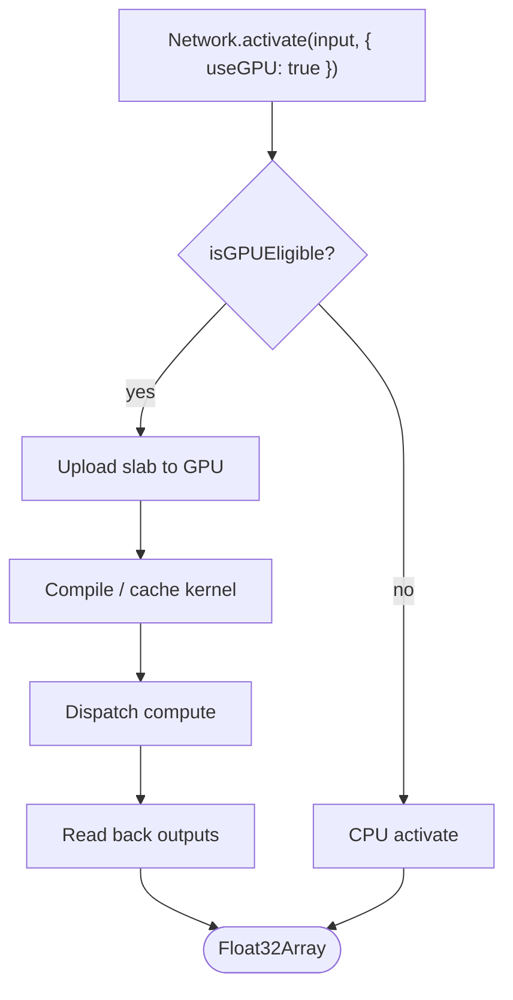
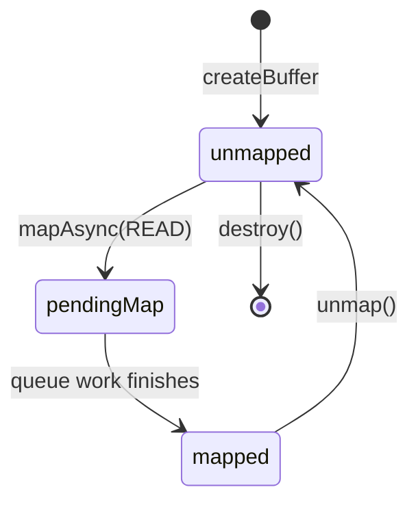

# architecture/network/gpu

WebGPU single-network activation seam.

This folder implements the optional GPU fast path for `Network.activate`.
Neural networks in NeatapticTS normally run on the CPU, which is the
deterministic source of truth for evolution, replay, and cross-machine
benchmarks. When the runtime has a working WebGPU device and the network is
eligible, the same forward pass can be dispatched to the GPU for higher
throughput. The seam is deliberately thin: this module wires together the
kernel compiler, buffer upload, and device probe so each piece stays focused.

The high-level entry point is `activateGPU`. Most callers should use the
public `Network.activate(..., { useGPU: true })` overload instead, because
it automatically falls back to the CPU path when the network or device is
ineligible.

GPU output is expected to agree with the CPU path within an absolute tolerance
of `1e-3` and a mean absolute error of `≤ 1e-4`. Use the CPU path for
deterministic replay and cross-machine regression tests.

Real profiling on an RTX 4070 shows that GPU inference is not universally
faster. For a single small network, the dominant cost is synchronization:
a 64-node network spends 75.5% of its wall time waiting for the GPU and only
13.2% preparing CPU-side data. The measured `mapAsync()` round trip after
`queue.submit()` is 6–25 ms depending on network size, while the actual GPU
compute work is usually well under 1 ms. The bottleneck is the readback
barrier, not ALU throughput. At 4k nodes the picture flips: GPU compute is
the majority of useful work, CPU preparation is 44.9% of wall time, and the
GPU path is clearly faster than the CPU path. Batching is the best way to
amortize the fixed synchronization cost locally.

WebGPU exposes three timelines — content (CPU), device (GPU internal), and
queue (submitted work) — and a buffer-mapping state machine:
`unmapped → pending map → mapped`. `mapAsync()` resolves on the content
timeline only after all previously submitted operations on that buffer's
queue timeline have completed. That guarantee makes an explicit
`device.queue.onSubmittedWorkDone()` barrier redundant for readback and is
intentionally omitted here.

The wider WebGPU/ML ecosystem uses a different shape to avoid this trap.
TensorFlow.js pools GPU buffers in a `Map<string, GPUBuffer[]>` keyed by
`${size}_${usage}` through `acquireBuffer` / `releaseBuffer` and keeps tensors
GPU-resident during inference; readback happens only when the caller
explicitly calls `tensor.data()`. burn's `burn-wgpu` compute server does the
same with a size-keyed handle pool and batches dispatches into a single
`queue.submit()`. NeatapticTS still reads back every activation, which is the
anomaly relative to that pattern. The recommended migration is:

1. Keep per-agent node/output buffers GPU-resident across activations.
2. Pool staging readback buffers by size, as this module already does.
3. Use a ring of 2–3 staging buffers so the CPU can map/read frame N while
   frame N+1 is being copied into another buffer, eliminating the blocking
   wait between the GPU copy and the CPU read.
4. Only call `mapAsync()` when an external consumer actually needs the
   output values.

This path caches the topology buffers, the compiled pipeline, and one output
staging buffer per output size, which removes buffer churn and recompilation
overhead. The dominant remaining cost is per-call readback, which the batched
activation path amortizes through `skipUpload` and repeated `iterations`,
but does not eliminate. For a deeper walkthrough of the measured bottleneck
and the optimization strategies, see the
[WebGPU Performance Guide](../../../docs/webgpu-performance-guide.md).



## architecture/network/gpu/network.gpu.activate.ts

### activateGPU

```ts
activateGPU(
  device: GPUDevice,
  network: default,
  inputs: number[] | Float32Array<ArrayBufferLike>,
): Promise<Float32Array<ArrayBufferLike>>
```

Run a single-network forward pass on the supplied WebGPU device.

Parameters:
- `device` - WebGPU device used to run the forward kernel.
- `network` - Network whose fast-slab topology will be uploaded.
- `inputs` - Input vector of length `network.input`.

Returns: A promise resolving to a Float32Array of output-node values.

Example:

```ts
const adapter = await navigator.gpu.requestAdapter({
  powerPreference: 'high-performance',
});
const device = await adapter?.requestDevice();
if (device) {
  const output = await activateGPU(device, network, [0.5, -0.2]);
}
```

### activateGPUWithFreshState

```ts
activateGPUWithFreshState(
  device: GPUDevice,
  network: default,
  inputs: number[] | Float32Array<ArrayBufferLike>,
): Promise<Float32Array<ArrayBufferLike>>
```

Run a single-network forward pass on the GPU without caching the buffer set.

This is the concurrent-safe counterpart to `activateGPU()`. Every call
uploads a fresh slab and creates a new bind group, so multiple requests that
target the same `Network` instance cannot overwrite each other's node or
output buffers. Pipelines are still shared through the per-device pipeline
cache, so identical topologies reuse a single compiled kernel.

Parameters:
- `device` - WebGPU device used to run the forward kernel.
- `network` - Network whose fast-slab topology will be uploaded.
- `inputs` - Input vector of length `network.input`.

Returns: A promise resolving to a Float32Array of output-node values.

Example:

```ts
const output = await activateGPUWithFreshState(device, network, [0.5, -0.2]);
```

### computeLevelWorkgroupCounts

```ts
computeLevelWorkgroupCounts(
  bufferSet: GPUBufferSet,
): number[]
```

Compute the workgroup dispatch count for each topological level.

The activation kernel launches one thread per node and each thread checks
its topological level against the dispatch level. Using a per-level dispatch
size avoids launching empty workgroups for levels with far fewer nodes than
the full network (for example a small output layer on a large hidden layer),
which removes the dominant source of dispatch overhead for multi-layer
perceptrons.

Parameters:
- `bufferSet` - Uploaded buffer metadata including `topoLevelsArray`.

Returns: Array where index `level` is the number of workgroups to dispatch
for that level. Index 0 is unused because input nodes are never dispatched.

### computeTopologyHash

```ts
computeTopologyHash(
  network: default,
): string
```

Compute a deterministic topology hash for a network.

The hash includes node count and the ordered from/to indices of every
connection. Networks that differ only in weights therefore share a hash,
which lets the GPU buffer cache reuse the uploaded static structure across
weight-only mutations such as backprop updates.

### createActivationBindGroup

```ts
createActivationBindGroup(
  device: GPUDevice,
  layout: GPUBindGroupLayout,
  bufferSet: GPUBufferSet,
  paramsBuffer: GPUBuffer,
): GPUBindGroup
```

Build the bind group that wires the six struct-packed kernel buffers into
the pipeline layout. The bind group can be reused across activations as long
as the underlying buffers are the same.

Parameters:
- `paramsBuffer` - Per-level params uniform buffer.

### createLevelBindGroups

```ts
createLevelBindGroups(
  device: GPUDevice,
  pipeline: GPUComputePipeline,
  bufferSet: GPUBufferSet,
  levelParamsBuffers: any[],
): any[]
```

Create per-level bind groups that wire the kernel buffers and the matching
level params uniform together.

Parameters:
- `device` - WebGPU device used to create bind groups.
- `pipeline` - Compiled activation pipeline.
- `bufferSet` - Uploaded network slab buffers.
- `levelParamsBuffers` - Per-level params buffers from
`createLevelParamsBuffers`.

Returns: Array of bind groups indexed by level. Index 0 is `undefined`.

### createLevelParamsBuffers

```ts
createLevelParamsBuffers(
  device: GPUDevice,
  bufferSet: GPUBufferSet,
  outputNodeCount: number,
): any[]
```

Create one params uniform buffer per topological level that needs a GPU
dispatch.

Level 0 is skipped because input nodes are seeded directly by the caller.
Each buffer stores a fixed level index plus the dimension constants from the
uploaded buffer set so the kernel can early-exit threads that do not belong
to the current level. Keeping the params buffer immutable per level lets the
single-network path record every level into one command encoder without
serializing queue writes between dispatches.

Parameters:
- `device` - WebGPU device used to allocate buffers.
- `bufferSet` - Uploaded network slab buffers.
- `outputNodeCount` - Number of output nodes in the network.

Returns: Array of params buffers indexed by level. Index 0 is `undefined`
because level 0 is not dispatched.

### destroyLevelParamsBuffers

```ts
destroyLevelParamsBuffers(
  levelParamsBuffers: any[],
): void
```

Destroy params buffers created for per-level dispatch.

Parameters:
- `levelParamsBuffers` - Array of per-level params buffers.

### destroyOutputStagingBuffer

```ts
destroyOutputStagingBuffer(
  device: GPUDevice,
  byteLength: number,
): void
```

Destroy a cached output staging buffer for the given device and byte size.

Called when a network's cached GPU state is evicted to a different
`GPUDevice`. The staging buffer is tied to the device that created it, so
destroying it prevents the old device's resources from outliving the network
buffers that were recorded for that device.

Parameters:
- `device` - WebGPU device that owns the cached staging buffer.
- `byteLength` - Exact byte size of the staging buffer to remove.

### encodeActivationKernel

```ts
encodeActivationKernel(
  commandEncoder: GPUCommandEncoder,
  bufferSet: GPUBufferSet,
  pipeline: GPUComputePipeline,
  levelBindGroups: any[],
  levelWorkgroupCounts: number[] | undefined,
): void
```

Record the activation kernel dispatches for every topological level into the
supplied command encoder.

All levels are recorded into a single compute pass because dispatches within
the same pass execute in submission order and the WebGPU memory model makes
each level's node writes visible to the next level without requiring separate
compute-pass boundaries. This removes per-level pass overhead while keeping
the correct dependency ordering. The params uniform is supplied by a per-level
bind group, so no queue writes or intermediate submissions are needed between
levels. The caller submits the encoder; awaiting `mapAsync` on the output
staging buffer is sufficient synchronization for readback.

Parameters:
- `commandEncoder` - Encoder that will hold the compute pass.
- `bufferSet` - Uploaded network slab buffers.
- `pipeline` - Compiled activation pipeline.
- `levelBindGroups` - Per-level bind groups from `createLevelBindGroups`.
- `levelWorkgroupCounts` - Optional per-level workgroup dispatch counts.
When provided, each level is dispatched with exactly the workgroups needed
for its node count instead of the whole-network ceiling.

### ensureNetworkGPUState

```ts
ensureNetworkGPUState(
  device: GPUDevice,
  network: default,
): { state: NetworkGPUState; pipeline: GPUComputePipeline; }
```

Ensure the cached buffer set and bind group for a network match the current
topology, and return the compatible compiled pipeline.

Creates or reuses GPU state as needed. When only the activation function
changes, the buffer set (which is independent of activation) is kept and only
the pipeline is replaced. When the network moves to a different `GPUDevice`,
the old per-device output staging buffer is destroyed so no cross-device
resource leaks outlive the buffers recorded for that device.

Parameters:
- `device` - WebGPU device used to run the forward kernel.
- `network` - Network whose topology must be reflected in GPU buffers.

Returns: Object containing the cached state and the activation pipeline.

Example:

```ts
const { state, pipeline } = ensureNetworkGPUState(device, network);
// state.bufferSet holds the uploaded slab; pipeline can be reused across
// activations as long as the activation function does not change.
```

### getActivationBindGroupLayout

```ts
getActivationBindGroupLayout(
  device: GPUDevice,
): GPUBindGroupLayout
```

Return the shared bind-group layout for activation kernels on this device,
creating and caching it on first use.

### getActivationPipelineCache

```ts
getActivationPipelineCache(
  device: GPUDevice,
): Map<string, GPUComputePipeline>
```

Return the per-device pipeline cache map, creating it on first use.

### getOrCreateActivationPipeline

```ts
getOrCreateActivationPipeline(
  device: GPUDevice,
  network: default,
): GPUComputePipeline
```

Compile (or reuse) the activation compute pipeline for a network.

The pipeline is keyed by the generated WGSL source, so networks that share an
activation function share one compiled pipeline even when their topologies
differ. The temporary activation-index annotation on the first node is
restored before returning, keeping the mutation scoped to this seam.

### getOrCreateOutputStagingBuffer

```ts
getOrCreateOutputStagingBuffer(
  device: GPUDevice,
  byteLength: number,
): GPUBuffer
```

Fetch or create a reusable mappable staging buffer of the requested size.

Buffers are keyed by byte size per device. A cached buffer is recreated only
when it has been destroyed, so activations that produce the same output size
(the common case for repeated evaluation of a cohort) reuse a single buffer
instead of allocating, mapping, and destroying one per call.

Parameters:
- `device` - WebGPU device that owns the staging buffer.
- `byteLength` - Required staging buffer size in bytes.

Returns: A GPU buffer with `MAP_READ | COPY_DST` usage.

### getOutputStagingBufferCache

```ts
getOutputStagingBufferCache(
  device: GPUDevice,
): Map<number, GPUBuffer>
```

Return the per-device staging-buffer size map, creating it on first use.

### GPUCommandEncoderCopy

Local extension of the ambient GPU command encoder so we can copy a storage
buffer to a mappable staging buffer. The WebGPU ambient types in this repo are
intentionally minimal; the cast is justified because `copyBufferToBuffer` is
part of the actual WebGPU API surface.

### matchesBuiltInActivation

```ts
matchesBuiltInActivation(
  candidate: (value: number, derivate?: boolean | undefined) => number,
  reference: (value: number, derivate?: boolean | undefined) => number,
): boolean
```

Test whether a candidate squash produces the same values as a reference
built-in activation across a small deterministic input grid.

This lets the GPU path support thin wrappers (for example the benchmark
harness wrapping `Neataptic.methods.Activation.logistic` with a custom
symbol key) without requiring the wrapper to carry the exact same function
object as the worker registry.

### NetworkGPUState

Per-network cached GPU state.

The buffer set and bind group are reused across activations while the
network topology (node count, connection set, and adjacency structure) stays
unchanged. The compiled pipeline lives in a separate per-device cache keyed
by the generated WGSL shader so that networks with different topologies but
the same activation function share one compiled pipeline.

### prepareActivationContext

```ts
prepareActivationContext(
  network: default,
): { index: number; restore: () => void; }
```

Temporarily annotate the first node's squash with its worker-registry index
so `compileActivationKernel` can generate the correct WGSL switch, then restore
the original value.

We only set the index during compilation because `uploadNetworkToGPU` uses an
empty supported-activation set in its eligibility check and would otherwise
reject networks whose nodes carry any index. Restoring the original value
keeps the mutation scoped to this seam.

Parameters:
- `network` - Network whose first node squash will be temporarily annotated.

Returns: A context object with the resolved index and a `restore()` callback.

### readOutputValues

```ts
readOutputValues(
  commandEncoder: GPUCommandEncoder,
  device: GPUDevice,
  network: default,
  bufferSet: GPUBufferSet,
  providedStagingBuffer: any,
): Promise<Float32Array<ArrayBufferLike>>
```

Copy the output-node slice of the GPU output buffer to a mappable staging
buffer using the supplied command encoder, submit the encoder, and return a
detached Float32Array copy.

The staging buffer is reused from the per-device output-staging cache rather
than allocated per call. After `queue.submit`, `mapAsync` transitions the
staging buffer from `unmapped` to `pending map`; the WebGPU implementation
completes the transition to `mapped` only after the queue operations that
target the buffer have finished. That makes `mapAsync` a sufficient
synchronization point for readback, so an explicit
`device.queue.onSubmittedWorkDone()` wait is unnecessary and is omitted to
reduce CPU-GPU round trips.

This is the function where the readback bottleneck shows up in practice.
Project measurements on an RTX 4070 put the `queue.submit()` → `mapAsync()`
round trip at 6–25 ms, while the GPU compute itself is typically under 1 ms
for the network sizes this library evaluates. For a 64-node network the wait
accounts for about 75% of wall time. The mitigation recommended in WebGPU
best-practice guides is a ring of 2–3 staging buffers: the CPU maps and reads
frame N while the GPU copies the next frame into a different buffer, so the
CPU never blocks on the GPU's copy completion.

WebGPU's three timelines explain why `mapAsync()` alone is enough. The copy
command executes on the queue timeline; `mapAsync()` resolves on the content
timeline only after all previously submitted work on that queue timeline has
finished. Adding `onSubmittedWorkDone()` would wait for the same signal a
second time from the CPU side without changing when the buffer becomes
mappable.

The mapping state machine for the staging buffer is:



Parameters:
- `commandEncoder` - Encoder with the recorded activation passes.
- `device` - WebGPU device that owns the staging buffer.
- `network` - Network being evaluated; determines output node count.
- `bufferSet` - Uploaded network slab buffers.
- `providedStagingBuffer` - Optional dedicated staging buffer. When
supplied, readback uses it directly instead of the shared per-device cache.
Callers are responsible for destroying the supplied buffer. This avoids
data races when multiple activations are in flight concurrently.

Returns: Promise resolving to a detached copy of the output values.

### resolveActivationIndex

```ts
resolveActivationIndex(
  squash: (value: number, derivate?: boolean | undefined) => number,
): number | undefined
```

Look up the worker-registry activation index for a built-in squash function.

The lookup is intentionally robust across module-loading boundaries and mock
environments where the same activation may be imported from different source
files and therefore fails a strict `===` comparison. It first tries the
runtime-registry symbol key, then falls back to the function name, and
finally falls back to a deterministic behaviour match against the built-in
activation functions so that thin wrappers around supported activations are
still dispatchable.

Parameters:
- `squash` - Activation function attached to a node.

Returns: The corresponding worker index, or `undefined` when the function is
not part of the canonical registry.

## architecture/network/gpu/network.gpu.fallback.ts

Transparent CPU fallback and GPU eligibility predicate.

This module decides whether the public `Network.activate(..., { useGPU: true })`
overload can safely take the WebGPU fast path, and provides a standalone
dispatch helper that falls back to the CPU path automatically when the GPU
path is unavailable. Keeping the eligibility decision in one place ensures
the public CPU seam and any direct GPU dispatch helpers agree on when the
GPU path is safe to use.

### dispatchActivation

```ts
dispatchActivation(
  network: default,
  inputs: number[] | Float32Array<ArrayBufferLike>,
  device: any,
): Promise<Float32Array<ArrayBufferLike>>
```

Transparent single-network activation seam.

Dispatches to the WebGPU fast path when the network and device are eligible,
otherwise falls back to the CPU `network.activate()` implementation. Both
paths return a `Float32Array` of the same output length so callers do not
need to know which path was taken.

Eligibility is evaluated by `isGPUEligible`: it rejects missing or
lost devices, networks with float32 weights disabled, and structurally
unsupported networks.

Parameters:
- `network` - Network to activate.
- `inputs` - Input vector of length `network.input`.
- `device` - Optional WebGPU device. When null, missing, lost, or the
network is ineligible, the CPU path is used.

Returns: Promise resolving to the network output.

Example:

```ts
const adapter = await navigator.gpu.requestAdapter({
  powerPreference: 'high-performance',
});
const device = await adapter?.requestDevice();
const output = await dispatchActivation(network, [0.5, -0.2], device);
// output is Float32Array from GPU if eligible, otherwise from CPU
```

### isGPUEligible

```ts
isGPUEligible(
  network: default,
  device: any,
): boolean
```

Shared GPU eligibility predicate used by the single-network fallback seam and
by `Network.activate`. A network is eligible only when:

- a usable WebGPU device is present and has not been lost,
- the network stores slab weights in float32 (the GPU kernel is f32-only),
- `canUseGPU` reports the network is structurally eligible.

This keeps the fallback decision in one place so the public CPU seam and the
standalone dispatch seam agree on when the GPU path is safe to use.

Parameters:
- `network` - Network to evaluate for GPU inference.
- `device` - WebGPU device, or null/undefined when WebGPU is unavailable.

Returns: Type guard that narrows device to GPUDevice when true.

Example:

```ts
const adapter = await navigator.gpu.requestAdapter({
  powerPreference: 'high-performance',
});
const device = await adapter?.requestDevice();
if (isGPUEligible(network, device)) {
  // device is narrowed to GPUDevice here
  const output = await activateGPU(device, network, inputs);
}
```

## architecture/network/gpu/network.gpu.capability.ts

### canUseGPU

```ts
canUseGPU(
  network: default,
  device: any,
  supportedActivations: ReadonlySet<number>,
): boolean
```

Minimum GPU eligibility predicate.

Decides whether a network is structurally eligible for the GPU inference
path without requiring a real WebGPU backend. It rejects missing devices,
networks with gating connections, networks that contain self-connections,
and nodes whose activation index is both present and unsupported. Buffer
sizing is only coarsely estimated so the predicate can run against mock
devices as well as real hardware.

This predicate is one input to `isGPUEligible`, which also checks
device readiness and the float32 slab flag. Most callers should use
`isGPUEligible` rather than calling `canUseGPU` directly.

Parameters:
- `network` - Network to evaluate for GPU inference.
- `device` - WebGPU device, or null when WebGPU is unavailable.
- `supportedActivations` - Worker-registry activation indices the GPU
kernel supports. Nodes without an explicit index are skipped so networks
built from high-level constructors can still be evaluated; nodes without a
squash function are also skipped so `activateGPU` can report the
missing-squash error with its own message.

Returns: True when the network is structurally eligible for the GPU path.

Example:

```ts
const supported = new Set<number>([0, 1, 2, 3]);
const eligible = canUseGPU(network, device, supported);
```

## architecture/network/gpu/network.gpu.device.ts

Module-local tracking of which WebGPU devices have reported lost.

WebGPU only exposes loss through an async `device.lost` promise, so the
runtime keeps a WeakMap that is flipped to `true` when that promise resolves.
This allows `isDeviceReady` to give a synchronous answer without polling the
GPU process.

### isDeviceReady

```ts
isDeviceReady(
  device: any,
): boolean
```

Returns true when the supplied WebGPU device is present and has not been
reported lost.

`null` and `undefined` inputs are treated as not-ready so callers can safely
chain GPU probing with CPU fallback logic. Device loss is tracked through
the module-local WeakMap populated by `requestGPUDevice` and by lazy
attachment on the first call to this function.

Parameters:
- `device` - WebGPU device to check, or a falsy value when no GPU exists.

Returns: `true` only when a non-null device is available and not lost.

### requestGPUDevice

```ts
requestGPUDevice(): Promise<any>
```

Request a high-performance WebGPU device suitable for compute inference.

Probes `navigator.gpu`, requests a `high-performance` adapter, then asks
the adapter for a device whose limits match the adapter's reported limits for
`maxStorageBufferBindingSize` and `maxBufferSize`. Returns `null` safely in
non-browser environments, when WebGPU is unavailable, when no adapter can be
obtained, or when device creation is rejected.

Returns: A ready-to-use `GPUDevice`, or `null` when WebGPU cannot be used.

Example:

```ts
const device = await requestGPUDevice();
if (device) {
  network.gpuDevice = device;
}
```

### trackDevice

```ts
trackDevice(
  device: GPUDevice,
): void
```

Attach a one-shot listener to `device.lost` so the module can later answer
whether the device is still usable.

## architecture/network/gpu/network.gpu.kernel.ts

WGSL kernel generation and pipeline compilation for the WebGPU activation path.

The GPU forward pass is implemented as a gather-reduce compute shader: each
thread is responsible for one node, gathers its incoming activations by
walking the incoming-CSR slice of the connection array, applies the network's
single activation function, and writes the result back to the node and output
buffers. This design keeps the kernel stateless and topology-agnostic; all
topology-specific data lives in storage buffers, so the same compiled pipeline
can drive many networks that share the same activation function.

Work is dispatched with a 1-D workgroup size of 64 threads. On an NVIDIA RTX
4070 (Ada Lovelace, 46 streaming multiprocessors) 64 threads is two warps,
which lets the scheduler hide memory latency while keeping occupancy high.
Larger workgroups do not necessarily help because the kernel is memory-bound
and the per-node parallelism is already coarse.

Occupancy matters because the kernel is heavily memory-bound. An RTX 4070 has
46 SMs, each capable of hosting up to 1536 concurrent threads (48 warps).
With a workgroup size of 64 (2 warps), each SM can theoretically hold 24
workgroups, or 1,104 workgroups across the whole chip. For 8,192 nodes the
dispatch launches only 128 workgroups, about 3 per SM, so the GPU is nowhere
near full occupancy and much of the chip sits idle. At 32,768 nodes the
dispatch launches 512 workgroups, roughly 11 per SM, which is better but still
below the hardware ceiling. That is why throughput keeps climbing with network
size until either memory bandwidth or the maximum dispatch dimension becomes
the limit. Workgroup size is also chosen as a multiple of 32, the NVIDIA warp
size, to avoid partially occupied warps.

The kernel binding layout uses six entries, which is below the WebGPU default
`maxStorageBuffersPerShaderStage` limit of eight and leaves headroom for future
buffers. Buffer sizes are validated against `maxStorageBufferBindingSize`
(default 128 MiB) before allocation.

### buildGPUPipeline

```ts
buildGPUPipeline(
  device: GPUDevice,
  shaderModule: GPUShaderModule,
  bindGroupLayout: GPUBindGroupLayout,
): GPUComputePipeline
```

Build a compute pipeline from a shader module and a bind-group layout.

The pipeline uses the `forward` compute entry point and a pipeline layout
built from the supplied bind-group layout. It is the factory used by
`compileActivationKernel` to materialize the compiled GPU path.

Parameters:
- `device` - WebGPU device used to create the pipeline layout and pipeline.
- `shaderModule` - Shader module containing the `forward` entry point.
- `bindGroupLayout` - Layout describing the kernel's storage buffers.

Returns: A compute pipeline configured for the forward-pass kernel.

Example:

```ts
const pipeline = buildGPUPipeline(device, shaderModule, bindGroupLayout);
```

### compileActivationKernel

```ts
compileActivationKernel(
  device: GPUDevice,
  network: default,
): GPUComputePipeline
```

Compile (or reuse) the activation compute pipeline for a network topology.

This helper caches pipelines by topology key on the supplied device.
Recompilations with identical topology but different weights reuse the cached
`GPUComputePipeline`, avoiding redundant compile stalls during live
inference. The production single-network path in
`ensureNetworkGPUState()` uses a per-device cache keyed by the
generated WGSL source instead, because identical WGSL implies an identical
pipeline regardless of topology. Both caches avoid redundant compilations.

The shader module, bind-group layout, and pipeline creation calls remain
observable through a mock device for unit testing.

Parameters:
- `device` - WebGPU device used to compile the compute pipeline.
- `network` - Network whose topology and activation index drive the kernel.

Returns: A compute pipeline configured for the `forward` entry point.

Example:

```ts
const pipeline = compileActivationKernel(device, network);
```

### computeTopologyKey

```ts
computeTopologyKey(
  network: default,
  activationIndex: number,
): string
```

Compute a deterministic key that identifies the network topology.

The key includes node and connection counts plus the CSR from/to arrays when
they are available. Networks that differ only in weights therefore share a
key, which is exactly the condition that lets the pipeline cache reuse the
same compiled shader.

Parameters:
- `network` - Network whose topology will be hashed.
- `activationIndex` - Activation index that changes the generated shader.

Returns: A stable string key for the pipeline cache.

### createActivationKernel

```ts
createActivationKernel(
  network: default,
): string
```

Generate the WGSL source for the activation kernel of a supported network.

The returned source is a real, bindable compute shader: it declares six
storage-buffer/uniform bindings, the connection and node structs, one f32
activation function per supported worker index, and a `forward` entry point
that dispatches one thread per node for the current topological level.
Unsupported activations or ineligible topologies are rejected before any
source is emitted.

Parameters:
- `network` - Network whose activation index and topology are inspected.

Returns: Non-empty WGSL source string.

Example:

```ts
const source = createActivationKernel(network);
const module = device.createShaderModule({ code: source });
```

### createBindGroupLayout

```ts
createBindGroupLayout(
  device: GPUDevice,
): GPUBindGroupLayout
```

Create the bind-group layout used by the GPU forward-pass kernel.

The layout exposes six entries in the exact order expected by the
struct-packed upload contract: the connection struct array, the node struct
array, the per-node output buffer, the per-dispatch params uniform, the
per-node topological level array, and the incoming-CSR start-offset array.

Six read-only/read-write storage bindings plus one uniform fit comfortably
within the WebGPU default limit of eight storage buffers per shader stage.
Buffer sizes are validated separately against `maxStorageBufferBindingSize`,
which defaults to 128 MiB and is large enough for the networks this library
is designed to evaluate.

Parameters:
- `device` - WebGPU device used to create the layout.

Returns: A bind-group layout with six entries.

Example:

```ts
const bindGroupLayout = createBindGroupLayout(device);
```

### generateActivationSource

```ts
generateActivationSource(
  network: default,
): string
```

Build the WGSL source for the struct-packed forward-pass activation kernel.

The shader exposes six bindings: a read-only connection struct array, a
read-write node struct array, a read-write output array, a per-dispatch
params uniform, a read-only per-node topological level array, and a
read-only incoming-CSR start-offset array. One thread is dispatched per node
and threads that do not belong to the current topological level early-exit.

The forward pass is a gather-reduce kernel: each node thread reads its bias
from `nodes[node].derivative_state`, then loops over the connection indices
in `[inStart[node], inStart[node+1])`, multiplies each source activation by
the connection weight, and accumulates the sum. Finally it applies the
network-wide activation function and writes the result to both the node struct
and the output buffer. Because the accumulation order is sorted by source
rank on the CPU, the GPU sum matches the CPU fast-slab order and produces
the same rounded f32 result.

Parameters:
- `network` - Network whose activation index, topology, and slab arrays
drive the generated shader.

Returns: WGSL source string.

### getDevicePipelineCache

```ts
getDevicePipelineCache(
  device: GPUDevice,
): Map<string, GPUComputePipeline>
```

Return the per-device pipeline cache map, creating it on first use.

### InternalSlabNetwork

Internal slab-backed shape used only to read CSR source/target arrays for
topology hashing. Optional because some callers pass network shapes that do
not carry slab state.

### mixHash

```ts
mixHash(
  hash: number,
  value: number,
): number
```

Mix one integer into a simple 32-bit rolling hash.

### readActivationIndex

```ts
readActivationIndex(
  network: default,
): number
```

Read the activation index that the network would use from its first
computation node.

The fast-slab CPU path assigns a stable activation-function index to every
node's `squash` function. The GPU kernel mirrors that index in a WGSL switch.

Parameters:
- `network` - Network whose first node's activation index will drive the
kernel switch.

Returns: The activation index stored on the first node's squash function.

### SUPPORTED_ACTIVATION_INDICES

Ordered subset of worker activation indices that the first WGSL kernel
supports.

These positions must stay in sync with `ACTIVATION_FUNCTIONS` in
`src/multithreading/multi.utils.ts` because DNA, workers, and the GPU kernel
all use the same numeric index for the same activation.

## architecture/network/gpu/network.gpu.buffer.ts

CPU-side preparation and upload for the WebGPU activation path.

Before the GPU can run a forward pass, the network's connection slab,
node state, topological levels, and incoming-edge CSR offsets must be packed
into GPU-friendly arrays and copied to the device. This module owns that
preparation. The work is CPU-bound: on an RTX 4070 the CPU preparation slice
grows from 13.2% of wall time for a 64-node network to 42.3–44.9% for 4k–8k
node networks, so this path is also the place to look when optimizing large-
network latency.

The upload path splits data into static and dynamic buffers. Static buffers
(the connection array sorted by source rank, topological levels, and CSR
start offsets) change only when the topology changes. Dynamic buffers (the
full connection struct array with current weights and the full node struct
array with current biases) are rewritten on every activation through
`uploadDynamicNetworkBuffers()`. Keeping the split narrow avoids paying the
topological-sort cost on every forward pass.

The packed layout uses a compressed sparse row (CSR) representation for
incoming edges and a Kahn-style topological sort to level nodes. Both are
standard graph algorithms that keep the GPU kernel simple: one thread per
node can gather its inputs by walking a contiguous slice of the connection
array.

WebGPU buffer upload strategy follows the hierarchy Brandon Jones documents in
the `toji.dev` WebGPU best-practices guide. Data written once and rarely
changed should be created with `mappedAtCreation: true`, filled directly from
the CPU, and then unmapped. Data updated every frame should use
`queue.writeBuffer()`, which queues an asynchronous GPU-side copy and avoids
stalling the CPU. Mappable buffers and `mapAsync()` should be reserved for
readback, because mapping waits until the GPU is finished with the buffer.
Destroying and recreating buffers on the hot path is expensive and is avoided
here by caching buffer sets and staging buffers. The static upload path uses
`createBuffer` followed by `queue.writeBuffer()`; a one-shot static upload could
instead use `mappedAtCreation: true` for the slab. The dynamic weight/bias
updates already follow the `writeBuffer` rule.

TensorFlow.js codifies this with its `BufferManager`: a pool of
`GPUBuffer` handles keyed by `${size}_${usage}` with `acquireBuffer` and
`releaseBuffer` lifecycles, so inference never pays allocation or destruction
overhead. burn's `burn-wgpu` compute server uses the same idea with a
size-keyed handle pool. NeatapticTS keeps topology buffer sets alive across
activations and reuses one staging buffer per output size, which moves in the
same direction but still re-uploads and reads back every pass.

### buildConnectionsArray

```ts
buildConnectionsArray(
  network: default,
  connectionCount: number,
): ArrayBuffer
```

Pack the connection slab into one contiguous struct array.

Each connection is laid out as `{ from_node: u32, to_node: u32, weight: f32,
flags: u32 }`. Connections are sorted by `(target_node, source_topological_rank)`
so that each target node's incoming slice `[inStart[node], inStart[node+1])`
is iterated in the same source-node order the CPU fast-slab path uses. Because
f32 summation is order-dependent, matching the accumulation order gives the
GPU gather kernel the same rounded result as the CPU push path instead of
relying on looser tolerances.

This step is part of the dynamic upload set, so it runs on every activation.
Its cost is linear in the connection count and becomes a measurable fraction
of wall time for large networks (up to ~44.9% CPU preparation for 4k nodes on
an RTX 4070). Avoiding it requires keeping the topology unchanged and using
a weight-only update path, which this module does not provide.

Parameters:
- `network` - Network whose nodes and connection slab will be packed.
- `connectionCount` - Number of active connections to pack. The slab may
over-allocate, so only this many entries are uploaded.

Returns: An `ArrayBuffer` ready for `queue.writeBuffer`.

### buildIncomingCSR

```ts
buildIncomingCSR(
  slab: ConnectionSlab,
  nodeCount: number,
  connectionCount: number,
): { inStart: Uint32Array<ArrayBufferLike>; inOrder: Uint32Array<ArrayBufferLike>; }
```

Build the incoming-CSR adjacency arrays needed by the gather kernel.

`inStart[node]` and `inStart[node + 1]` bound the slice of `inOrder` that
lists connection indices feeding into `node`. The ordering is deterministic
because it follows the connection index order returned by the slab. Using a
compressed sparse row layout lets the GPU kernel gather a node's inputs with
one contiguous storage-buffer read per incoming edge instead of chasing
pointers.

Parameters:
- `slab` - Connection slab with `from`/`to` source/target arrays.
- `nodeCount` - Number of nodes in the network.
- `connectionCount` - Number of connections in the network.

Returns: Incoming CSR offsets and connection order arrays.

### buildNodesArray

```ts
buildNodesArray(
  network: default,
): ArrayBuffer
```

Pack node state into one contiguous struct array.

Each node is laid out as `{ activation_state: f32, derivative_state: f32,
error: f32, flags: u32 }`. The forward-pass kernel reads the bias from the
`derivative_state` slot because the node struct stores `bias` there (the slot
is unused by the forward pass otherwise). Callers should treat the
`derivative_state` field as the per-node bias while the kernel is running.

Like `buildConnectionsArray()`, this step is part of the dynamic upload
set and is rewritten on every activation. Its cost is linear in the node
count and is included in the CPU-preparation share reported in the
performance guide.

Parameters:
- `network` - Network whose node state will be packed.

Returns: An `ArrayBuffer` ready for `queue.writeBuffer`.

### buildOutgoingCSR

```ts
buildOutgoingCSR(
  slab: ConnectionSlab,
  nodeCount: number,
  connectionCount: number,
): { outStart: Uint32Array<ArrayBufferLike>; outOrder: Uint32Array<ArrayBufferLike>; }
```

Build the outgoing-CSR adjacency arrays used for topological level sorting.

The outgoing CSR mirrors the incoming CSR but lets the topological walk start
from source nodes and follow forward edges. It is computed once per topology
change, so its cost is amortized across many activations.

Parameters:
- `slab` - Connection slab with `from`/`to` source/target arrays.
- `nodeCount` - Number of nodes in the network.
- `connectionCount` - Number of connections in the network.

Returns: Outgoing CSR offsets and connection order arrays.

### buildSourceTopoRanks

```ts
buildSourceTopoRanks(
  network: default,
  slab: ConnectionSlab,
  nodeCount: number,
  connectionCount: number,
): Uint32Array<ArrayBufferLike>
```

Compute the source-node topological rank used to order GPU incoming edges.

The CPU fast-slab path accumulates outgoing activations by walking nodes in
topological order (all level-0 nodes in stable tie-break order, then level-1,
and so on). By sorting each target node's incoming slice by the source's rank
in that same order, the GPU gather kernel sums the exact same f32 terms in the
exact same order, eliminating cross-path rounding drift.

Parameters:
- `network` - Network whose nodes supply the stable tie-break values.
- `slab` - Connection slab with `from`/`to` source/target arrays.
- `nodeCount` - Number of nodes in the network.
- `connectionCount` - Number of connections in the network.

Returns: Per-node rank in the CPU-equivalent topological walk.

### buildTopoLevels

```ts
buildTopoLevels(
  slab: ConnectionSlab,
  nodeCount: number,
  connectionCount: number,
): Uint32Array<ArrayBufferLike>
```

Compute a topological level for every node in a feed-forward network.

Input nodes have level `0`; every other node's level is one greater than the
maximum level among its incoming sources. The Kahn-style traversal is
deterministic and produces the same levels for the same topology, which the
GPU kernel uses to schedule per-level dispatches without cross-thread races.
This step is part of the static upload set and runs only when the topology
changes.

Parameters:
- `slab` - Connection slab with `from`/`to` source/target arrays.
- `nodeCount` - Number of nodes in the network.
- `connectionCount` - Number of connections in the network.

Returns: A `nodeCount`-length array of unsigned topological levels.

### computeTopoLevelCount

```ts
computeTopoLevelCount(
  levels: Uint32Array<ArrayBufferLike>,
): number
```

Count how many distinct topological levels are present in a level array.

Levels start at `0` for input nodes, so the number of passes needed by the
dispatch loop is `max(levels) + 1`.

Parameters:
- `levels` - Per-node topological level array.

Returns: Number of distinct levels.

### ConnectionSlab

Raw connection slab used to build GPU-friendly adjacency arrays.

The cast is intentional: GPU upload is a consumer of the same private layout
that slab activation uses.

### createConcurrentBufferSet

```ts
createConcurrentBufferSet(
  device: GPUDevice,
  network: default,
): GPUBufferSet
```

Allocate a fresh, independent GPU buffer set for a single concurrent request.

Every call creates a new set of WebGPU buffers. This keeps concurrent or
interleaved activations of the same network instance from reading or writing
each other's node/output state, which is the critical requirement for
parallel multi-agent evaluation.

Parameters:
- `device` - WebGPU device that owns the newly created buffers.
- `network` - Network whose slab will be uploaded.

Returns: A freshly allocated `GPUBufferSet` isolated from any other request.

### createGPUBuffer

```ts
createGPUBuffer(
  device: GPUDevice,
  byteLength: number,
  label: string,
  usage: number,
): GPUBuffer
```

Create a WebGPU storage buffer that can receive `queue.writeBuffer` uploads.

Every buffer produced by the upload path must be usable as a read-only
(or read-write) storage binding and as a copy destination. This helper
validates the request against the device's binding and buffer size limits
before delegating to `device.createBuffer`.

Parameters:
- `device` - WebGPU device used to allocate the buffer.
- `byteLength` - Desired buffer size in bytes. Must be finite and
non-negative.
- `label` - Debug label attached to the buffer.
- `usage` - Additional usage flags merged with the mandatory
`STORAGE | COPY_DST` bits. Defaults to no extra flags.

Returns: A freshly created `GPUBuffer` with the mandatory usage bits set.

### createGPUUniformBuffer

```ts
createGPUUniformBuffer(
  device: GPUDevice,
  byteLength: number,
  label: string,
): GPUBuffer
```

Create a WebGPU uniform buffer that can receive `queue.writeBuffer` uploads.

The network parameter buffer is bound as a uniform because it is tiny
(a few scalar uniforms) and read once per workgroup. Uniform buffers are
limited by `maxUniformBufferBindingSize`, which is much smaller than the
storage-buffer limit, so this helper validates against the correct limit.

Parameters:
- `device` - WebGPU device used to allocate the buffer.
- `byteLength` - Desired buffer size in bytes. Must be finite and
non-negative.
- `label` - Debug label attached to the buffer.

Returns: A freshly created `GPUBuffer` with `UNIFORM | COPY_DST` usage.

### destroyGPUBufferSet

```ts
destroyGPUBufferSet(
  device: GPUDevice,
  bufferSet: GPUBufferSet,
): void
```

Destroy every GPU buffer in a previously uploaded buffer set.

Parameters:
- `device` - WebGPU device that owns the buffers (unused by this helper,
kept in the signature for API symmetry).
- `bufferSet` - Buffer set returned by `uploadNetworkToGPU`.

### GPU_NODE_STRUCT_BYTES

Byte stride of one node struct on the GPU.

The WGSL `Node` struct is `{ activation_state: f32, derivative_state: f32,
error: f32, flags: u32 }`, which is 16 bytes after alignment. Reading a node
fetches its state, bias (packed into the derivative slot for the forward
pass), error, and flags in one contiguous read.

### GPUBufferSet

GPU-side buffer handles and metadata produced by uploading a network slab.

The set contains exactly six WebGPU buffers bound to the compute kernel in
the order described by `GPU_BUFFER_BINDING`: the connection struct
array, the node struct array, the per-node output buffer, the per-dispatch
params uniform, the topological level array, and the incoming-CSR start-offset
array. The `inStart` buffer stores `nodeCount + 1` offsets into the connection
array so that the gather kernel can read each node's incoming edges as one
contiguous slice.

The buffers are split by update frequency. Static buffers — `connections`
(when topology is stable), `topoLevels`, and `inStart` — are uploaded once
and reused. Dynamic buffers — `connections` weights and `nodes` biases — are
rewritten every activation through `queue.writeBuffer()`. The `outputs` buffer
is written by the GPU and then copied to a mappable staging buffer for
readback, following the rule that `mapAsync()` should be reserved for
readback while `writeBuffer()` handles CPU-to-GPU updates.

The implementation also records `nodeCount` and `connectionCount` so the
compute pipeline can size its dispatches without re-reading CPU structures.
The `topoLevelsArray` is kept here because the CPU dispatch loop still needs
to know how many levels to launch.

### resolveStableNodeTieBreak

```ts
resolveStableNodeTieBreak(
  node: default,
): number
```

Resolve the deterministic tie-break scalar used by the CPU topological sort.

The CPU fast-slab path emits nodes in Kahn order and sorts each zero-in-degree
wave with this same rule, so matching it exactly lets the GPU pack incoming
edges in the same source-node order.

Parameters:
- `node` - Node whose stable gene id or index will be read.

Returns: Deterministic scalar for ordering.

### uploadDynamicNetworkBuffers

```ts
uploadDynamicNetworkBuffers(
  device: GPUDevice,
  bufferSet: GPUBufferSet,
  network: default,
): void
```

Re-upload the weights and bias arrays for a network whose topology has not
changed.

The GPU kernel reads weights and node biases every dispatch, so these fields
must be kept in sync with the CPU network state across activations. Because
the values live inside struct arrays, the whole connections buffer and the
whole nodes buffer are rewritten. Topology metadata does not change here;
callers recreate the full `GPUBufferSet` when the topology changes.

This whole-buffer rewrite is the dynamic-upload cost shown in the performance
guide. On an RTX 4070 it accounts for a growing share of wall time as the
network grows, reaching roughly 24–33% of the single-network GPU path for
1k–8k nodes. Callers that evaluate the same static cohort many times can use
the batched activation path's `skipUpload` flag to avoid paying this cost on
every call.

Parameters:
- `device` - WebGPU device that owns the buffers.
- `bufferSet` - Topology buffers created by `uploadNetworkToGPU`.
- `network` - Network whose current weights and bias will be uploaded.

### uploadNetworkToGPU

```ts
uploadNetworkToGPU(
  device: GPUDevice,
  network: default,
): GPUBufferSet
```

Upload a network's fast-slab structures to WebGPU buffers.

The upload path packs connections and nodes into two struct arrays and then
creates six GPU buffers: connections, nodes, outputs, params, topological
levels, and incoming-CSR start offsets. The six-buffer layout still sits
below the WebGPU default limit for storage buffers per shader stage and
removes the need to request a custom `maxStorageBuffersPerShaderStage`
limit.

This function performs the static upload: the connection array, topological
levels, and CSR start offsets change only when the topology changes and are
cached through `ensureNetworkGPUState()`. Callers must still call
`uploadDynamicNetworkBuffers()` before each activation to refresh
weights and biases.

Parameters:
- `device` - Mock or real WebGPU device used to allocate buffers.
- `network` - Network whose fast-slab layout will be uploaded.

Returns: Handles for the uploaded slab buffers and network metadata.

### writeInputValuesToNodeStruct

```ts
writeInputValuesToNodeStruct(
  device: GPUDevice,
  nodesBuffer: GPUBuffer,
  inputs: Float32Array<ArrayBufferLike>,
): void
```

Write input activations into the `activation_state` slot of the first
`inputs.length` node structs.

The WGSL `Node` struct stores `activation_state` at byte offset zero of each
16-byte struct, so input node `i` must be written at `i * GPU_NODE_STRUCT_BYTES`
rather than at `i * Float32Array.BYTES_PER_ELEMENT`. Centralising this logic in
one helper prevents contiguous-write bugs when multiple upload paths need to
seed the node buffer with input values.

Parameters:
- `device` - WebGPU device whose queue will perform the write.
- `nodesBuffer` - GPU node buffer created by `uploadNetworkToGPU`.
- `inputs` - Input vector to scatter into the node struct array.

## architecture/network/gpu/network.gpu.batched.ts

Batched WebGPU activation for multi-agent evaluation.

Evaluates many networks in a single GPU submission, which is useful for NEAT
populations and other cohort-based experiments. The function builds a wide
input matrix and dispatches one row per network, so the GPU stays busy even
when individual networks are small.

Real measurements on an RTX 4070 show that the benefit depends strongly on
network size and batch width. A single 64-node network spends most of its wall
time waiting for the GPU (75.5%) and copying back outputs, so it is still
slower than the CPU path. A batch of 16 networks with 64 nodes each reaches
about 1.8 M inferences/second, while a batch of 6 parallel 4096-node agents
can exceed 3 M inferences/second. The crossover where the GPU becomes faster
than the CPU happens around 64–256 nodes per network for parallel evaluation,
and GPU throughput scales with network size up to the hardware occupancy
limit.

This module implements several optimization strategies:

- Persistent per-device GPU state cached through `ensureNetworkGPUState()`.
- One combined command buffer with a single compute pass and a single readback.
- A shared mappable staging buffer for the whole output matrix.
- Optional `skipUpload` to avoid rewriting unchanged weights and inputs.
- Optional `iterations` to amortize synchronization over many forward passes.
- Topology-aware dispatch scheduling so each topological level is dispatched
  with exactly the workgroups it needs, avoiding empty workgroups for small
  output layers on large networks.

The WebGPU command-encoding model rewards batching. Every `queue.submit()` call
carries fixed driver/queue overhead, while individual `dispatchWorkgroups()`
calls inside the same compute pass share the pass begin/end cost and execute
sequentially in submission order. That sequential ordering is exactly what a
Kahn-style topological sort needs: nodes at level k are dispatched after nodes
at level k-1 have written their activations. Each network uses its own bind
group (different buffer set), and networks that share topology reuse the same
compiled pipeline with only bind-group switches.

### batchActivate

```ts
batchActivate(
  device: GPUDevice,
  networks: default[],
  inputMatrix: Float32Array<ArrayBufferLike>,
  options: BatchActivateOptions | undefined,
): Promise<BatchedGPUResult>
```

Batched GPU activation for multi-agent evaluation.

Reuses the per-network persistent GPU state managed by
`ensureNetworkGPUState()`, uploads only the dynamic node/connection data
and the input matrix each call, dispatches all networks and all iterations
inside a single compute pass once per topological level, and reads back the
output matrix through a single reusable staging buffer. This removes the
per-call buffer allocation, mapping, and destruction that otherwise make
the GPU path slower than the CPU path for small networks. The optional
`iterations` flag records many independent passes inside a single command
buffer with only one CPU-GPU readback.

Because every pass is recorded before the command buffer is submitted, only
one `mapAsync` call is needed for the final result. The WebGPU specification
already guarantees that mapping waits for all previously submitted work on the
buffer's queue timeline, so an additional `onSubmittedWorkDone()` barrier is
redundant for readback and is intentionally omitted.

Parameters:
- `device` - WebGPU device used to run the forward kernel.
- `networks` - Networks to evaluate as a batch. All networks must have the
same input and output dimensions.
- `inputMatrix` - Flattened row-major inputs, length
`networks.length * networks[0].input`. Still validated when upload is
skipped, but not written to the GPU in that case.
- `options` - Optional tuning flags for repeated static evaluation
(see `BatchActivateOptions`).

Returns: Promise resolving to a row-major output matrix.

Example:

```ts
const networks = Array.from({ length: 4 }, () => Network.createMLP(2, [3], 1));
const inputs = new Float32Array([0.1, 0.2, 0.3, 0.4, 0.5, 0.6, 0.7, 0.8]);
const { outputs, rowCount, colCount } = await batchActivate(device, networks, inputs);

// Amortize CPU-GPU synchronization across 60 identical static evaluations.
const batched = await batchActivate(device, networks, inputs, {
  skipUpload: true,
  iterations: 60,
});
```

### BatchActivateOptions

Optional tuning flags for `batchActivate()`.

These flags let callers amortize CPU-GPU upload overhead across repeated
evaluations of the same static cohort. They are opt-in and unsafe when the
underlying weights or inputs have changed since the previous upload.

### BatchedGPUResult

Result shape returned by a batched GPU activation pass.

The output matrix is stored in row-major order so that downstream consumers
(such as a worker controller) can slice one row per
agent without extra re-layout.

### BatchInferenceJob

Single job queued for deferred batched GPU inference.

### BatchInferenceQueue

Queue that accumulates inference jobs and flushes them as one GPU batch.

The queue is intentionally not backed by persistent storage; it exists only
to amortize GPU dispatch overhead across many small inference requests.

### BatchInferenceQueueImpl

Concrete queue that accumulates inference jobs and flushes them as one GPU batch.

The queue reuses `batchActivate` for the actual dispatch, so pipeline sharing,
struct-packed buffer uploads, and single-pass submission are inherited. Jobs are
kept in enqueue order and the per-job outputs are returned in the same order.

### createBatchInferenceQueue

```ts
createBatchInferenceQueue(
  device: GPUDevice,
): BatchInferenceQueue
```

Create a queue that batches inference jobs for parallel GPU dispatch.

The returned queue accumulates jobs via `enqueue()` and dispatches them all
together on the next `flush()`, sharing compiled pipelines across networks
with identical topology and returning one output per job in enqueue order.
An empty queue resolves to an empty array without issuing GPU work.

Parameters:
- `device` - WebGPU device used to run the batched dispatch.

Returns: A queue ready to accept inference jobs.

### getBatchedOutputStagingBufferCache

```ts
getBatchedOutputStagingBufferCache(
  device: GPUDevice,
): Map<number, GPUBuffer>
```

Return the per-device batched-output staging-buffer size map.

### getOrCreateBatchedOutputStagingBuffer

```ts
getOrCreateBatchedOutputStagingBuffer(
  device: GPUDevice,
  byteLength: number,
): GPUBuffer
```

Fetch or create a reusable mappable staging buffer for the full batched
output matrix.

Parameters:
- `device` - WebGPU device that owns the staging buffer.
- `byteLength` - Total output matrix size in bytes.

Returns: A GPU buffer with `MAP_READ | COPY_DST` usage.

### GPUCommandEncoderCopy

Local extension of the ambient GPU command encoder so we can copy a storage
buffer to a mappable staging buffer. The WebGPU ambient types in this repo
are intentionally minimal; the cast is justified because `copyBufferToBuffer`
is part of the actual WebGPU API surface.

### validateBatchInputs

```ts
validateBatchInputs(
  device: GPUDevice,
  networks: default[],
  inputMatrix: Float32Array<ArrayBufferLike>,
): void
```

Validate the batching contract before any GPU work is issued.

Parameters:
- `device` - WebGPU device that will run the dispatch.
- `networks` - Networks to evaluate as a batch.
- `inputMatrix` - Flattened row-major input matrix.

### validateNetworkShapes

```ts
validateNetworkShapes(
  networks: default[],
): void
```

Ensure every network in the batch has the same input and output dimensions.

The result matrix is row-major with one column count for the entire batch, so
mixed shapes would corrupt the layout.

Parameters:
- `networks` - Networks to validate.

## architecture/network/gpu/network.gpu.batch-evaluation.ts

### AgentEvaluationRequest

Single concurrent agent evaluation request.

### BatchEvaluationOptions

Options controlling batch evaluation in the worker seam.

### evaluateBatchGeneration

```ts
evaluateBatchGeneration(
  networks: default[],
  inputMatrix: Float32Array<ArrayBufferLike>,
  device: any,
  options: BatchEvaluationOptions | undefined,
): Promise<Float32Array<ArrayBufferLike>>
```

Batch generation evaluation seam.

Evaluates a generation of controller networks against a row-major input
matrix. Uses the batched GPU path when the batch size is above the threshold,
every network is GPU-eligible, and a valid device is supplied; otherwise falls
back to per-network CPU `network.activate()` calls.

Parameters:
- `networks` - One network per genome in the generation.
- `inputMatrix` - Flattened row-major inputs, length
`networks.length * networks[0].input`.
- `device` - WebGPU device, or null when GPU inference is unavailable.
- `options` - Threshold and policy options.

Returns: Promise resolving to a row-major output matrix of length
`networks.length * networks[0].output`.

### evaluateConcurrentAgents

```ts
evaluateConcurrentAgents(
  device: GPUDevice,
  requests: AgentEvaluationRequest[],
  options: BatchEvaluationOptions | undefined,
): Promise<Float32Array<ArrayBufferLike>[]>
```

Evaluate many agents in parallel on the GPU.

Each request receives its own fresh GPU buffer set and bind group, so the
same `Network` instance can appear in multiple requests with different inputs
without any read/write collision. Pipelines are still shared through the
per-device pipeline cache, so identical topologies compile once regardless of
how the requests are interleaved.

Parameters:
- `device` - WebGPU device used to run the concurrent dispatch.
- `requests` - One request per agent to evaluate.
- `options` - Threshold and policy options (currently unused; reserved for
future batch-size tuning).

Returns: Promise resolving to one output array per request, in request order.

### evaluateOnCPU

```ts
evaluateOnCPU(
  networks: default[],
  inputMatrix: Float32Array<ArrayBufferLike>,
): Float32Array<ArrayBufferLike>
```

Fall back to per-network CPU activation and stack the results.

The output matrix is laid out row-major, with one row per network. Each row
contains the output values returned by `network.activate()` for the
corresponding input slice.

Parameters:
- `networks` - Networks to evaluate in CPU mode.
- `inputMatrix` - Flattened row-major input matrix.

Returns: Row-major Float32Array of stacked network outputs.

### isDeviceUsable

```ts
isDeviceUsable(
  device: any,
): boolean
```

Check whether a supplied GPU device is present and has not been lost.

See the matching helper in `network.gpu.fallback` for the rationale:
real devices report loss asynchronously through `device.lost`, while this
predicate gives a synchronous yes/no answer for the current call site.

Parameters:
- `device` - Device to inspect, or null/undefined when WebGPU is absent.

Returns: True when the device is present and not marked lost.

### shouldUseGPUPath

```ts
shouldUseGPUPath(
  networks: default[],
  device: GPUDevice,
  threshold: number,
): boolean
```

Decide whether the batch generation can use the batched GPU path.

All of the following must hold:
1. The batch size is strictly greater than the configured threshold.
2. Every network in the batch is structurally GPU-eligible.

Callers must already have verified the device is usable with
`isDeviceUsable` before invoking this predicate.

Parameters:
- `networks` - Generation of networks to evaluate.
- `device` - Verified WebGPU device.
- `threshold` - Minimum batch size that justifies GPU dispatch.

Returns: True when the batched GPU path should be used.

## architecture/network/gpu/network.gpu.types.ts

Public type surface for the WebGPU inference fast path.

The canonical WebGPU interfaces are declared ambiently in
`gpu.types.d.ts` so they are available to both source files and automated
tests without a runtime dependency. This module re-exports the subset of
those names used by the device probe and capability predicate, giving
callers a single local import surface if they prefer explicit module
references over global declarations.

### GPU_BUFFER_BINDING

Stable WebGPU binding indices for the struct-packed network upload contract.

The activation kernel binds six buffers: a struct array of connections, a
struct array of nodes, the per-node output buffer, a small per-dispatch
params uniform, the per-node topological level array, and the incoming-CSR
start-offset array. Packing fields into structs improves cache locality:
reading one connection fetches `from_node`, `to_node`, `weight`, and
`flags` from one contiguous 16-byte region, and reading one node fetches
`activation_state`, `derivative_state`, `error`, and `flags` from one
contiguous 16-byte region. The six-buffer layout still sits below the WebGPU
default `maxStorageBuffersPerShaderStage` limit, so the code does not request
a custom limit for that resource.

Example:

```ts
const binding = GPU_BUFFER_BINDING.connections; // 0
```

### GPU_BUFFER_BINDING_COUNT

Number of bindings used by the GPU forward-pass kernel.

This count matches the length of `GPU_BUFFER_BINDING` and the number
of entries in the kernel bind-group layout.

### GPUActivationPipelineCache

Pipeline cache scoped to one WebGPU device.

Maps a deterministic topology key to the compiled compute pipeline so that
identical network topologies share one pipeline even when their weights differ.

### GPUAdapterType

Public type surface for the WebGPU inference fast path.

The canonical WebGPU interfaces are declared ambiently in
`gpu.types.d.ts` so they are available to both source files and automated
tests without a runtime dependency. This module re-exports the subset of
those names used by the device probe and capability predicate, giving
callers a single local import surface if they prefer explicit module
references over global declarations.

### GPUBufferName

Names of the buffers that participate in the GPU upload contract.

Each name maps to a stable binding index in `GPU_BUFFER_BINDING`.

### GPUBufferSet

GPU-side buffer handles and metadata produced by uploading a network slab.

The set contains exactly six WebGPU buffers bound to the compute kernel in
the order described by `GPU_BUFFER_BINDING`: the connection struct
array, the node struct array, the per-node output buffer, the per-dispatch
params uniform, the topological level array, and the incoming-CSR start-offset
array. The `inStart` buffer stores `nodeCount + 1` offsets into the connection
array so that the gather kernel can read each node's incoming edges as one
contiguous slice.

The buffers are split by update frequency. Static buffers — `connections`
(when topology is stable), `topoLevels`, and `inStart` — are uploaded once
and reused. Dynamic buffers — `connections` weights and `nodes` biases — are
rewritten every activation through `queue.writeBuffer()`. The `outputs` buffer
is written by the GPU and then copied to a mappable staging buffer for
readback, following the rule that `mapAsync()` should be reserved for
readback while `writeBuffer()` handles CPU-to-GPU updates.

The implementation also records `nodeCount` and `connectionCount` so the
compute pipeline can size its dispatches without re-reading CPU structures.
The `topoLevelsArray` is kept here because the CPU dispatch loop still needs
to know how many levels to launch.

### GPUDeviceType

### GPUKernelTopologyKey

Deterministic string key that identifies a network topology for the pipeline
cache.

### GPURequestAdapterOptionsType

### GPUSupportedLimitsType

## architecture/network/gpu/network.gpu.profiling.ts

WebGPU activation overhead profiling instrumentation.

This module provides a self-contained, timer-instrumented version of the GPU
forward pass that measures where wall-clock time is spent without mutating the
production `activateGPU` path. It re-uses the same buffer-packing and kernel
helpers as the fast path so the numbers reflect real costs, but it creates
fresh GPU state per profile call to capture cold-path overheads such as buffer
allocation, pipeline compilation, and bind-group creation.

The intended caller is the browser overhead-breakdown scenario
(`docs/browser-tests/scenarios/webgpu-overhead-breakdown.mjs`). The module
also exports pure artifact-assembly helpers so the Node test suite can verify
percentage math, bottleneck ranking, and strategy generation.

### buildOverheadArtifact

```ts
buildOverheadArtifact(
  tierResults: ProfilingResult[],
  options: { tiers?: number[] | undefined; inputCount?: number | undefined; outputCount?: number | undefined; timestampQuerySupported?: boolean | undefined; gpuTimestampQueryNs?: number | null | undefined; gpuAdapterInfo?: Record<string, unknown> | null | undefined; gpuProbedLimits?: Record<string, number> | null | undefined; referenceHardware?: { processor: string; memory: string; os: string; gpu_vendor: string; gpu_architecture: string; maxStorageBuffersPerShaderStage: number; } | undefined; browserVisibility?: string | undefined; },
): Record<string, unknown>
```

Build the overhead-breakdown artifact consumed by the browser scenario.

Parameters:
- `tierResults` - Per-tier profiling results.
- `options` - Benchmark options and probed environment values.
- `options` - Visibility label, e.g. 'visible-foreground'.

Returns: JSON-serializable artifact object.

### computeOverheadBreakdown

```ts
computeOverheadBreakdown(
  timings: Record<string, number>,
): ProfilingPhaseTiming[]
```

Compute the percentage share of each overhead phase relative to the total.

Parameters:
- `timings` - Milliseconds per phase.

Returns: Phase timings with percentages, sorted by descending share.

### computeTopologyHash

```ts
computeTopologyHash(
  network: default,
): string
```

Compute a deterministic topology hash for a network.

Mirrors the hash used by the production GPU cache so profiles and normal
activations agree on whether two networks share a topology.

Parameters:
- `network` - Network whose topology will be hashed.

Returns: Stable hash string.

### createActivationBindGroup

```ts
createActivationBindGroup(
  device: GPUDevice,
  layout: GPUBindGroupLayout,
  bufferSet: GPUBufferSet,
): GPUBindGroup
```

Build the bind group that wires the six struct-packed kernel buffers into the
pipeline layout.

This is a local mirror of the production bind-group creation so the profiler
can time it independently.

Parameters:
- `device` - WebGPU device that will own the bind group.
- `layout` - Bind-group layout created by `createBindGroupLayout`.
- `bufferSet` - Uploaded slab buffers.

Returns: A fresh bind group for the activation kernel.

### createAndUploadBuffers

```ts
createAndUploadBuffers(
  device: GPUDevice,
  network: default,
  connectionsArray: ArrayBuffer,
  nodesArray: ArrayBuffer,
  inStart: Uint32Array<ArrayBufferLike>,
  topoLevels: Uint32Array<ArrayBufferLike>,
): GPUBufferSet
```

Create the six struct-packed GPU buffers for a network and upload static
topology data.

Parameters:
- `device` - WebGPU device that will own the buffers.
- `network` - Network whose slab arrays will be uploaded.
- `connectionsArray` - Packed connection struct array.
- `nodesArray` - Packed node struct array.
- `inStart` - Incoming-CSR start offsets.
- `topoLevels` - Per-node topological levels.

Returns: A fully uploaded `GPUBufferSet`.

### dispatchActivationKernel

```ts
dispatchActivationKernel(
  device: GPUDevice,
  bufferSet: GPUBufferSet,
  pipeline: GPUComputePipeline,
  bindGroup: GPUBindGroup,
  outputNodeCount: number,
  timer: GpuProfilingTimer,
): Promise<void>
```

Dispatch the activation kernel once per topological level while timing
`device.queue.submit()` and `device.queue.onSubmittedWorkDone()` separately.

Parameters:
- `device` - WebGPU device used to dispatch.
- `bufferSet` - Uploaded slab buffers.
- `pipeline` - Compiled activation compute pipeline.
- `bindGroup` - Bind group wiring the kernel buffers.
- `outputNodeCount` - Number of output nodes in the network.
- `timer` - Profiler timer updated with submission and wait durations.

### GPUCommandEncoderCopy

Local extension of the ambient GPU command encoder so we can copy a storage
buffer to a mappable staging buffer.

### GpuProfilingTimer

Simple high-resolution timer for named overhead phases.

Uses `performance.now()` so the same instrumentation works in the browser
and in Node test environments. A phase may be started and stopped multiple
times; reported durations are accumulated.

Example:

```ts
const timer = new GpuProfilingTimer();
timer.start('bufferUpload');
// ... GPU upload work ...
const ms = timer.stop('bufferUpload');
```

#### durations

Accumulated durations keyed by phase name.

#### get

```ts
get(
  name: string,
): number
```

Return the accumulated milliseconds for a phase.

Parameters:
- `name` - Phase identifier.

Returns: Accumulated milliseconds, or `0` when the phase was never timed.

#### marks

In-flight start marks keyed by phase name.

#### reset

```ts
reset(): void
```

Clear all marks and accumulated durations.

#### start

```ts
start(
  name: string,
): void
```

Record the start time for a named phase.

Parameters:
- `name` - Phase identifier.

#### stop

```ts
stop(
  name: string,
): number
```

Stop a phase and return the elapsed milliseconds.

If the phase was never started, returns `0` and records nothing.

Parameters:
- `name` - Phase identifier that was previously passed to `start`.

Returns: Accumulated milliseconds for the phase, including this interval.

### identifyBottleneck

```ts
identifyBottleneck(
  result: ProfilingResult,
): string
```

Identify the single dominant bottleneck from a profiling result.

Parameters:
- `result` - Profiling result produced by `profileGPUActivation`.

Returns: Human-readable bottleneck label, or `'unknown'` when no phases were timed.

### OVERHEAD_REFERENCE_HARDWARE

Reference hardware metadata embedded in the overhead-breakdown artifact.

### prepareActivationContext

```ts
prepareActivationContext(
  network: default,
): { index: number; restore: () => void; }
```

Temporarily annotate the first node's squash with its worker-registry index
so `compileActivationKernel` can generate the correct WGSL switch, then restore
the original value.

Parameters:
- `network` - Network whose first node squash will be temporarily annotated.

Returns: A context object with the resolved index and a `restore()` callback.

### profileGPUActivation

```ts
profileGPUActivation(
  device: GPUDevice,
  network: default,
  inputs: number[] | Float32Array<ArrayBufferLike>,
): Promise<ProfilingResult>
```

Profile a single GPU forward pass, measuring every major cold-path overhead.

This function deliberately bypasses the production `activateGPU` caches so it
can time buffer allocation, pipeline compilation, and bind-group creation.
It creates and destroys a fresh `GPUBufferSet` per call. The returned result
includes a per-phase percentage breakdown, the dominant bottleneck, and an
overhead ratio.

Parameters:
- `device` - WebGPU device used to run the forward pass.
- `network` - Network whose topology will be uploaded.
- `inputs` - Input vector of length `network.input`.

Returns: A `ProfilingResult` with timing breakdowns and the output vector.

Example:

```ts
const result = await profileGPUActivation(device, network, [0.5, -0.2]);
console.log(result.dominantBottleneck, result.overheadRatio);
```

### PROFILING_PHASE_NAMES

Names of the canonical overhead phases measured by the profiler.

### ProfilingPhaseName

Canonical phase name used by the profiler.

### ProfilingPhaseTiming

Timings for one overhead phase, including its share of the total forward pass.

### ProfilingResult

Result of a single instrumented GPU forward pass.

The detailed CPU-prep sub-timers sum to `cpuPreparationMs`. The remaining
phases sum to `totalForwardPassMs`. `overheadRatio` reports the share of the
total time consumed by everything except the GPU compute wait, which is the
closest proxy for "useful" GPU work when timestamp queries are unavailable.

### rankWeakPoints

```ts
rankWeakPoints(
  phases: ProfilingPhaseTiming[],
): { name: "cpuPreparation" | "bufferUpload" | "pipeline" | "bindGroup" | "dynamicBufferUpload" | "queueSubmission" | "gpuCompletionWait" | "outputReadback"; impactPct: number; strategy: string; }[]
```

Rank measured overhead phases by impact and attach a strategy to each.

Parameters:
- `phases` - Phase timings from one or more profile runs.

Returns: Weak points sorted by descending percentage share.

### readOutputValues

```ts
readOutputValues(
  device: GPUDevice,
  network: default,
  bufferSet: GPUBufferSet,
): Promise<Float32Array<ArrayBufferLike>>
```

Copy the output-node slice of the GPU output buffer to a mappable staging
buffer, await the mapping, and return a detached Float32Array copy.

Parameters:
- `device` - WebGPU device that owns the buffers.
- `network` - Network whose output nodes will be read.
- `bufferSet` - Uploaded slab buffers.

Returns: Detached Float32Array of output-node values.

## architecture/network/gpu/network.gpu.activation.wgsl.ts

WGSL activation-function registry for the WebGPU inference fast path.

This module maps the compact numeric activation indices used by the worker
serialization contract (see `src/multithreading/multi.utils.ts`) to their f32
WGSL implementations. Only the first-kernel subset is implemented here;
unsupported activations are deliberately omitted from the generated switch.

### ActivationFunctionEntry

Description of one supported activation function in WGSL form.

### buildActivationFunctionBody

```ts
buildActivationFunctionBody(
  index: 0 | 2 | 1 | 4 | 3 | 5 | 10 | 12 | 13 | 9 | 11,
): string
```

Build the single-statement WGSL body for a supported activation index.

### buildActivationRegistry

```ts
buildActivationRegistry(): readonly ActivationFunctionEntry[]
```

Build the canonical registry of WGSL activation functions.

Returns: A read-only array of supported activation entries. The order matches
`SUPPORTED_ACTIVATION_INDICES` so callers can emit a deterministic switch.

### formatActivationFunctionsWgsl

```ts
formatActivationFunctionsWgsl(
  registry: readonly ActivationFunctionEntry[],
): string
```

Format the registry as a block of WGSL function declarations.

Parameters:
- `registry` - Activation entries from `buildActivationRegistry`.

Returns: WGSL source containing one `fn activation_<index>(x: f32) -> f32`
declaration per supported index.

### SUPPORTED_ACTIVATION_INDICES

Ordered subset of worker activation indices that the first WGSL kernel
supports.

These positions must stay in sync with `ACTIVATION_FUNCTIONS` in
`src/multithreading/multi.utils.ts` because DNA, workers, and the GPU kernel
all use the same numeric index for the same activation.

## architecture/network/gpu/network.gpu.buffer-set-pool.ts

GPU buffer-set pool for recycling topology buffers across variant evaluations.

The pool keeps GPU buffer sets alive across `evaluateWeightVariants` calls so
that repeated evaluation of the same network topology does not pay per-iteration
allocation and destruction overhead. Buffer sets are keyed by a compound key of
topology key and variant count, because different variant counts require
independent output state even when the topology is identical.

The pool follows the same pattern as TensorFlow.js `BufferManager` and burn's
`burn-wgpu` compute server: acquire/release lifecycles with size-keyed handle
pools so inference never pays allocation or destruction overhead on the hot
path. The default `maxPooledBytes` cap is resolved dynamically by
{@link resolveBufferPoolMaxPooledBytes} from the workload node count,
average degree, buffer count, and a safety factor, and can be overridden by
the caller. This prevents unbounded memory growth when many distinct
topologies are evaluated while still leaving enough headroom for typical
NEAT networks.

### computeBufferSetBytes

```ts
computeBufferSetBytes(
  set: GPUBufferSet,
): number
```

Estimate the total GPU byte footprint of a buffer set.

Sums the `size` property of every buffer in the set. This is used for
the `maxPooledBytes` cap enforcement.

Parameters:
- `set` - The buffer set to measure.

Returns: Total bytes across all six buffers.

### destroyBufferSet

```ts
destroyBufferSet(
  set: GPUBufferSet,
): void
```

Destroy every GPU buffer in a buffer set by calling `.destroy()` on each.

This is a local helper that mirrors `destroyGPUBufferSet` from
`network.gpu.buffer` but does not require a device reference, since the
WebGPU `GPUBuffer.destroy()` method is self-contained.

Parameters:
- `set` - The buffer set whose buffers should be destroyed.

### GPUBufferSetPool

Recycle pool for GPU buffer sets used during NGE weight-variant evaluation.

The pool caches {@link GPUBufferSet} instances keyed by a compound key of
topology key and variant count. When a buffer set is released, it is kept
in the pool for reuse by the next acquisition with the same key, avoiding
the cost of destroying and re-creating six GPU buffers per evaluation
iteration.

The pool enforces a configurable `maxPooledBytes` cap to prevent unbounded
memory growth. When a new acquisition would exceed the cap, free entries
are evicted (their buffers destroyed) until the new set fits.

Example:

```ts
const pool = new GPUBufferSetPool({ maxPooledBytes: 32 * 1024 * 1024 });
const bufferSet = pool.acquire(device, 'topo-2-3-1', network, 16);
// ... use bufferSet for variant evaluation ...
pool.release('topo-2-3-1');
// Next acquire with the same key reuses the same buffer set
const reused = pool.acquire(device, 'topo-2-3-1', network, 16);
pool.destroy();
```

#### acquire

```ts
acquire(
  device: GPUDevice,
  topologyKey: string,
  network: default,
  variantCount: number,
): GPUBufferSet
```

Acquire a GPU buffer set for the given topology and variant count.

If a free (released) buffer set exists for the same compound key, it is
reused without reallocation. Otherwise, a new buffer set is uploaded
from the network via `uploadNetworkToGPU`. When the new set would
exceed `maxPooledBytes`, free entries are evicted first.

Parameters:
- `device` - WebGPU device used to allocate buffers when a new set
is needed.
- `topologyKey` - Deterministic string identifying the network
topology.
- `network` - Network whose slab will be uploaded when a new buffer
set is required.
- `variantCount` - Number of weight variants being evaluated. Used
as part of the compound key so different variant counts get distinct
buffer sets.

Returns: A GPU buffer set with `nodeCount` matching the network.

#### destroy

```ts
destroy(): void
```

Destroy all pooled buffer sets and clear the pool.

After `destroy`, the pool is empty (`size` is 0) and all GPU buffers
have been released. The pool can continue to be used for new acquisitions
after destruction.

#### estimateBufferSetBytes

```ts
estimateBufferSetBytes(
  network: default,
): number
```

Estimate the byte footprint of a buffer set for the given network.

Uses the struct-packed layout: nodes are 16 bytes each, connections are
16 bytes each, outputs are 4 bytes per node, the params uniform is 16
bytes, topo levels are 4 bytes per node, and in-start offsets are 4 bytes
per node plus one.

Parameters:
- `network` - Network to estimate buffer sizes for.

Returns: Estimated total bytes for the six-buffer set.

#### evictFreeEntries

```ts
evictFreeEntries(
  projectedBytes: number,
): void
```

Evict free entries from the pool until the projected new set fits.

Only entries that are not currently in use are evicted. Their GPU buffers
are destroyed and their bytes are reclaimed from the running total.
Eviction stops as soon as the projected set fits under the cap, so only
the minimum number of free entries are reclaimed.

This is a single-pass eviction: entries are destroyed and removed from the
pool inline so that `totalPooledBytes` is updated during iteration. This
ensures the break condition becomes reachable after evicting one entry,
rather than collecting all candidates first and evicting them all
regardless of whether fewer would suffice.

Map deletion during iteration is safe per the ECMAScript spec: deleting
the current entry does not skip subsequent entries.

Parameters:
- `projectedBytes` - Bytes needed for the new buffer set.

#### maxPooledBytes

Maximum total bytes the pool will retain across all cached buffer sets.

#### pool

Internal storage mapping compound keys to pool entries.

#### release

```ts
release(
  topologyKey: string,
): void
```

Release all buffer sets matching the given topology key back to the pool.

Released sets remain in the pool and are available for reuse by a
subsequent `acquire` with the same compound key. The variant count is
not needed because all variant counts for the given topology are
released together.

Parameters:
- `topologyKey` - Topology key prefix to match.

#### size

Number of buffer sets currently held in the pool (both in-use and free).

#### totalPooledBytes

Running total of bytes occupied by all pooled buffer sets.

### GPUBufferSetPoolOptions

Configuration options for {@link GPUBufferSetPool}.

All fields are optional and have sensible defaults. Callers override only the
knobs they need to tune.

### makePoolKey

```ts
makePoolKey(
  topologyKey: string,
  variantCount: number,
): string
```

Compute the compound pool key from a topology key and variant count.

Different variant counts produce distinct keys so that independent output
state is maintained even when the topology is identical.

Parameters:
- `topologyKey` - Deterministic string identifying the network topology.
- `variantCount` - Number of weight variants being evaluated.

Returns: Compound key string.

### PoolEntry

Internal pool entry tracking a buffer set and its in-use status.
