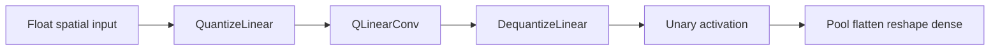
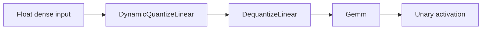

# architecture/network/onnx

NeatapticTS ONNX-like serialization for networks.

This module provides the four public entry points:
- `exportToONNXBinary()` turns the approved constrained subset into protobuf
  `ModelProto` bytes and is the primary runtime-validated artifact for the
  current Phase 8 and Phase 9 subset.
- `exportToONNX()` turns a runtime `Network` into a plain JSON object
  (`OnnxModel`) for same-family debug, roundtrip, and importer-owned workflows.
- `importFromONNX()` reconstructs a `Network` from that JSON object.
- `importFromONNXBinary()` reconstructs the first honest external binary ONNX
  subset through a separate standard-domain `ModelProto` ingress lane.

What this format is (and is not):
- It exposes two distinct ONNX-adjacent surfaces with different promises.
- `exportToONNXBinary()` is the compliance and runtime-evidence surface for the
  documented supported subset.
- `exportToONNX()` stays **JSON-first** and intentionally resembles ONNX’s
  model and graph concepts for same-family inspection and roundtrip import.
- Neither surface is a blanket promise of arbitrary ONNX runtime portability
  beyond the named subset and validations.

How to read this chapter:
- Start here for the public surface split and the trust boundary.
- Continue into `export/` to see how layered networks become JSON graph payloads.
- Continue into `import/` to see how that payload becomes a runtime network again.
- Continue into `schema/` for the persisted wire-format shapes.
- Continue into `parity/` for the Phase 9 runtime-executed fixture inventory and
  binary-first ONNX Runtime comparison seam.
- Use `network.onnx.utils.ts` and `network.onnx.utils.types.ts` as compatibility and
  bridge surfaces rather than the first place to learn the pipeline.

Why the folder is split this way:
- The root file keeps the stable entry points and the promise of the format.
- The `export/` and `import/` chapters carry the heavier execution details.
- The `schema/` chapter keeps the persisted document model separate from runtime logic.
- The root utility barrels exist so public ergonomics stay stable while the implementation
  can keep moving toward smaller, teachable chapters.

Trust boundary:
- Treat imported models as **untrusted input**. The importer validates structure, but
  you should still apply the same care you would for a generic JSON payload.

Example (export → persist → import):

```ts
import { exportToONNX, importFromONNX } from './network.onnx';

const model = exportToONNX(network, { includeMetadata: true });
const jsonText = JSON.stringify(model);

const modelRoundTrip = JSON.parse(jsonText);
const restored = importFromONNX(modelRoundTrip);
```

## architecture/network/onnx/network.onnx.ts

### AttentionMapping

Explicit export-only attention mapping for the Phase 5E shadow subset.

This contract keeps attention source-owned rather than heuristic: callers
opt one target layer into a fixed-width self-attention shadow block while the
stable dense path remains the canonical runtime behavior.

### ConcatMapping

Explicit export-only concat mapping for the narrow Phase 5 merge subset.

This contract keeps concat source-owned instead of inferred: callers name one
skipped source layer and one target layer, and export preserves the merge as a
deterministic `Concat -> Gemm` path with the default adjacent-layer slice kept
first in the merged input order.

### Conv2DMapping

Mapping declaration for treating a fully-connected layer as a 2D convolution during export.

This does **not** magically turn an MLP into a convolutional network at runtime.
It annotates a particular export-layer index with a conv interpretation so that:
- The exported graph uses conv-shaped tensors/operators, and
- Import can re-attach pooling/flatten metadata appropriately.

Pitfall: mappings must match the actual layer sizes. If `inHeight * inWidth * inChannels`
does not correspond to the prior layer width (and similarly for outputs), export or import
may reject the model.

### exportToONNX

```ts
exportToONNX(
  network: default,
  options: OnnxExportOptions,
): OnnxModel
```

Export a NeatapticTS network to an ONNX-like **JSON object** (`OnnxModel`).

What you get:
- A plain object that you can persist with `JSON.stringify()`.
- A minimal ONNX-ish graph (`model.graph`) plus optional metadata (`model.metadata_props`).

When to use this:
- You want a portable same-family snapshot that can be inspected or diffed as JSON.
- You want the importer-owned roundtrip surface consumed later via `importFromONNX()`.
- You are debugging export structure rather than producing the primary
  runtime-validated `.onnx` artifact.

Tradeoffs:
- The output is ONNX-like, but **not** intended to be universally compatible with all ONNX
  runtimes.
- This is not the primary runtime-validated artifact for the approved subset;
  use `exportToONNXBinary()` when the goal is external validation, parity,
  or the main compliant deliverable.
- Some advanced features (partial connectivity, mixed activations, recurrent heuristics)
  may produce graphs that are primarily meant for this library’s importer.
- Phase 6 closes the first optimization wave conservatively: exact unary activation
  emission now covers `Softplus`, `Softsign`, `Selu`, `Mish` (opset >= 18), and
  `Gelu` with explicit `approximate='tanh'` (opset >= 20), while opset-incompatible
  or unsupported activations stay on the honest Identity baseline.
- Phase 7 is now active on the first reduced-precision lane: `precision.mode =
  'storage-fp16'` packs eligible same-family dense and Conv weight or bias
  initializers as float16 payloads and prepends deterministic `Cast -> float32`
  bridges so `Gemm` and `Conv` inputs stay type-consistent. Recurrent,
  advanced-graph, mixed-activation, and partial-connectivity requests stay on
  float32 with explicit metadata fallback reasons instead of silently widening
  the supported subset.
- Quantization packets are now exporter-owned and calibration-backed. Static
  8-bit requests can carry explicit layer-target calibration ranges and emit
  deterministic scale or zero-point initializers plus metadata for the
  supported same-family dense and spatial subset. The dense-only Phase 7D
  lane is now closed for the current explicitly targeted same-family
  one-output dense subset: those layers can lower into
  `QuantizeLinear -> QLinearMatMul -> DequantizeLinear`, reattach nonzero
  bias through an explicit float-domain `Add` bridge, preserve the
  exporter-owned unary activation node, and emit a deterministic quantized
  weight tensor with `effective_quantization_mode = static-8bit`. Phase 7E
  is now also closed for the current explicit Conv subset: supported spatial
  paths lower into `QuantizeLinear -> QLinearConv -> DequantizeLinear`, emit
  deterministic quantized Conv weight tensors, quantize the fused bias as
  one `int32` value per output channel, and return to float32 before pooling,
  flatten, reshape, or downstream dense boundaries. Phase 7F is now closed
  for the current dense-only dynamic guidance lane: supported same-family
  dense paths can either land `metadata-only` guidance or insert
  `DynamicQuantizeLinear -> DequantizeLinear` ahead of dense `Gemm` inputs
  while keeping the affine and activation compute on the existing float32
  path. Wider dense targets, unsupported spatial fallbacks, recurrent,
  advanced-graph, mixed-activation, and partial-connectivity requests still
  stay on float32 with explicit fallback metadata instead of widening the
  supported subset implicitly.

Quantized spatial lowering path:



Dynamic dense guidance path:



The lighter `metadata-only` representation records the same dense-only lane
without inserting `DynamicQuantizeLinear` nodes.
- The current spatial subset is still conservative: explicit Conv mappings round-trip,
  pooling/flatten import remains metadata-driven, and heuristic Conv inference stays
  metadata-only unless `autoPromoteInferredConv` is enabled and the inferred dense layer
  passes the shared-kernel safety gate for the current proven subset, including
  conservative multi-channel layouts, unpooled stacked Conv-like chains, deeper
  single-channel post-pool chains whose pooled tensor shape can be derived
  sequentially, and deeper pooled multi-channel chains whose pooled tensor shapes
  can be derived sequentially while export keeps the pooled source compact per
  channel. The only proven flatten-after-pool promotion path is the narrow final
  hidden-stage reshape-bridge subset, where export restores the derived pooled
  `[C,H,W]` shape before the later Conv. Earlier flattened pooled consumers,
  repeated flatten-bridge chains, or downstream dense layers that still depend on
  extra non-pooled inputs keep later inferred stages on the honest fallback path.
- Export now validates a conservative internal tensor-shape ledger before model
  finalization and prunes exporter-owned Identity activation scaffolding only when the
  graph stays semantically equivalent for the already-supported same-family subset.

High-level algorithm:
 1) Normalize/rebuild local connection state for deterministic traversal.
 2) Infer an ordered layer view and validate export constraints.
 3) Materialize graph nodes/tensors and (optionally) attach metadata.

Example (export → JSON text):

```ts
const model = exportToONNX(network, { includeMetadata: true });
const jsonText = JSON.stringify(model);
```

Parameters:
- `network` - Source network instance to serialize.
- `options` - Export controls (validation strictness and metadata behavior).

Returns: ONNX-like model object suitable for persistence or re-import.

### exportToONNXBinary

```ts
exportToONNXBinary(
  network: default,
  options: OnnxExportOptions,
): Uint8Array<ArrayBufferLike>
```

Export a NeatapticTS network to protobuf `ModelProto` bytes.

What you get:
- A deterministic binary payload whose field layout follows ONNX `ModelProto`.
- The primary compliant and runtime-validated artifact for the approved
  lower-opset same-family subset.
- The same constrained model family as `exportToONNX()`, without widening the
  importer or runtime-compatibility promise beyond the documented subset.

Important boundary:
- This binary surface now has a repo-owned external validation lane for the
  current same-family subset: the companion validator decodes and verifies the
  `ModelProto` payload and asks ONNX Runtime to accept it under the current
  explicit lower-opset contract.
- Phase 9 now layers a separate `parity/` seam on top of that load-acceptance
  boundary. The parity harness keeps binary `.onnx` as the input artifact,
  freezes deterministic baseline float32, storage-fp16, static-8bit dense
  qlinear, explicit-Conv static-8bit, and `DynamicQuantizeLinear`
  dense-guidance golden fixtures, and now also proves seeded randomized
  parity over bounded shapes or input ranges for that same five-lane subset
  through an isolated child Node process backed by the raw ONNX Runtime
  binding, while keeping the dynamic lane narrow to its explicit
  float-to-uint8 scalar-parameter tolerance packet.
- That validation lane is still narrower than Phase 9 runtime parity. It does
  not widen import support, arbitrary external-consumer support, or cross-opset
  execution claims beyond the documented Phase 8 subset.

When to use this:
- You want the primary `.onnx` artifact for the repo's current compliance and
  runtime-evidence claims.
- You need the binary input used by the validator and the Phase 9 parity seam.
- You want to persist the supported subset in a format that real ONNX tooling
  can decode under the documented lower-opset policy.

High-level behavior:
 1) Build the shared exporter model view for the supported subset.
 2) Normalize binary-only graph boundaries and required `ModelProto` headers.
 3) Serialize the resulting model into deterministic protobuf bytes.
 4) Keep validation separate: use the validator seam when you need explicit
    external acceptance evidence for the current supported subset.

Parameters:
- `network` - Source network instance to serialize.
- `options` - Export controls shared with `exportToONNX()`.

Returns: Binary protobuf `ModelProto` bytes.

### importFromONNX

```ts
importFromONNX(
  onnx: OnnxModel,
): default
```

Reconstruct a NeatapticTS network from an exported `OnnxModel`.

Expected input:
- A model produced by `exportToONNX()` (same repo/version family), including the
  current storage-fp16 subset where eligible weight and bias initializers are
  packed as float16 payloads and decoded back into the native runtime during import.
- Quantized Phase 7 exports remain export-only for now. The importer does not
  yet reconstruct `QLinearMatMul`, `QLinearConv`, `DynamicQuantizeLinear`
  guidance boundaries, or other quantized operators back into the native
  runtime, so quantized ONNX payloads are outside the current import
  contract.

Trust boundary:
- Do not import untrusted blobs. A malformed model can be extremely large or internally
  inconsistent and may cause errors or high memory usage.

Current boundary:
- `importFromONNX()` continues to consume the repo's JSON-first `OnnxModel` surface.
- Binary external import now lands through the separate `importFromONNXBinary()` entrypoint
  for the first standard-domain float32 dense `Gemm -> unary activation` lane only.
- `importFromONNX()` itself stays scoped to the JSON-first `OnnxModel` surface.

High-level behavior:
 1) Build a perceptron-shaped scaffold from the payload layer sizes.
 2) Assign weights/biases and activation functions.
 3) Re-apply recurrent and pooling metadata when present.

Example (JSON text → restore):

```ts
const model = JSON.parse(jsonText) as OnnxModel;
const restored = importFromONNX(model);
const output = restored.activate([0.1, 0.9]);
```

Parameters:
- `onnx` - ONNX-like model to reconstruct.

Returns: Reconstructed network ready for inference/evolution workflows.

### importFromONNXBinary

```ts
importFromONNXBinary(
  binaryModel: Uint8Array<ArrayBufferLike>,
): default
```

Import the first supported external binary ONNX subset from protobuf `ModelProto` bytes.

Current subset:
- Exactly one public input, one public output, and one acyclic dense chain.
- Standard-domain `Gemm` plus zero-or-one trailing unary activation per layer.
- One final standard-domain `Identity` output alias is accepted when it only republishes
  the terminal dense tensor as the declared model output.
- Float32 tensors only, canonical `Gemm` attributes only, and initializer-owned affine terms only.
- No recurrent, spatial, branching, quantized, custom-domain, or metadata-dependent graphs.

High-level behavior:
 1) Decode and verify the binary `ModelProto` payload.
 2) Normalize one accepted external dense chain into an importer-owned canonical model.
 3) Reuse the existing reconstruction flow to rebuild a runtime network.

Parameters:
- `binaryModel` - Binary `ModelProto` payload to reconstruct.

Returns: Reconstructed network ready for inference workflows.

### OnnxExportOptions

Options controlling ONNX-like export.

These options trade off strictness, portability, and fidelity:

- **Strict (default-ish)** export tries to keep the graph easy to interpret:
  layered topology, homogeneous activations per layer, and fully-connected layers.

- **Relaxed** export (`allowPartialConnectivity` / `allowMixedActivations`) can represent
  more networks, but it may generate graphs that are primarily meant for NeatapticTS’s
  importer (and may be less friendly to external ONNX tooling).

- **Recurrent export** (`allowRecurrent`) is intentionally conservative and currently
  focuses on a constrained single-step representation and optional fused heuristics.

Key fields (high-level):
- `includeMetadata`: includes `metadata_props` with architecture hints.
- `opset`: numeric opset version stored in the exported model metadata (default is
  resolved by the exporter; commonly 18 in this codebase).
- `legacyNodeOrdering`: keeps older node ordering for backward compatibility.
- `conv2dMappings` / `pool2dMappings`: encode conv/pool semantics for fully-connected
  layers via explicit mapping declarations.
- `concatMappings`: opt one skipped source layer into the narrow same-family
  `Concat -> Gemm` merge subset with deterministic `previous_then_source`
  input order.
- `attentionMappings`: opt one target layer into the fixed-width same-family
  self-attention shadow subset.
- `precision`: opt into reduced-precision export. The current landed lane is
  `storage-fp16`, which packs eligible same-family dense and Conv weight or
  bias initializers into float16 storage and inserts deterministic
  `Cast -> float32` bridges so operator inputs stay type-consistent.
- `quantization`: declare an explicit quantization request packet. The
  current exporter can validate static calibration contracts, emit
  deterministic scale or zero-point parameter initializers for the supported
  same-family dense and spatial subset, and close the dense-only Phase 7D
  lane for explicitly targeted same-family one-output dense layers. Those
  layers can lower into a
  `QuantizeLinear -> QLinearMatMul -> DequantizeLinear` path with an
  explicit float-domain bias bridge plus the exporter-owned unary
  activation node when present, while the closed 7E Conv subset lowers
  supported spatial paths into `QuantizeLinear -> QLinearConv ->
  DequantizeLinear`, emits one `int32` fused-bias value per output channel,
  and returns to float32 before pooling, flatten, reshape, or downstream
  dense boundaries. The closed 7F dynamic lane now adds dense-only guidance:
  supported same-family dense paths can either record `metadata-only`
  guidance or insert `DynamicQuantizeLinear -> DequantizeLinear` immediately
  ahead of dense `Gemm` inputs. Wider dense targets, unsupported spatial
  fallbacks, recurrent, advanced-graph, mixed-activation, and
  partial-connectivity requests stay on float32 with explicit fallback
  metadata.
- `autoPromoteInferredConv`: upgrades heuristic Conv-like layers into real `Conv`
  emission only when the exporter can prove the dense weights already behave like a
  shared-kernel spatial layout, including the current conservative multi-channel and
  unpooled stacked-chain subsets, deeper single-channel post-pool chains whose
  pooled tensor shapes can be derived sequentially, and deeper pooled
  multi-channel chains when the pooled tensor shapes can be derived sequentially
  and the pooled source stays compact per channel. The only proven
  flatten-after-pool promotion path is the narrow final hidden-stage
  reshape-bridge subset. Earlier flattened pooled consumers and repeated
  flatten-bridge chains stay on the honest fallback path.

### OnnxModel

ONNX-like model container (JSON-serializable).

This is the main “wire format” object in this folder. Persist it as JSON text:

```ts
const jsonText = JSON.stringify(model);
const restoredModel = JSON.parse(jsonText) as OnnxModel;
```

Notes:
- `metadata_props` contains NeatapticTS-specific keys (layer sizes, recurrent flags,
  conv/pool mappings, etc.). This is where most round-trip hints live.
- Initializers currently store floating-point weights in `float_data`, and the
  Phase 7 storage-fp16 lane can pack half-precision words into `int32_data`
  while keeping the logical tensor shape stable.

Security/trust boundary:
- Treat this as untrusted input if it comes from outside your process.

### Pool2DMapping

Mapping describing a pooling operation inserted after a given export-layer index.

This is represented as metadata and optional graph nodes during export.
Import uses it to attach pooling-related runtime metadata back onto the reconstructed
network (when supported).

## architecture/network/onnx/network.onnx.utils.ts

ONNX export/import utilities for a constrained, documented subset of networks.

This file is the root compatibility barrel for the ONNX execution helpers.
It exists so callers can keep a stable import surface while the heavier
exporter and importer logic lives in the narrower `export/` and `import/`
chapters.

How to read this file:
- Start here if you want the thin orchestration-facing helpers that still
  bridge the public root API to the split implementation files.
- Continue into `export/` when you want the full graph-emission pipeline.
- Continue into `import/` when you want the reconstruction pipeline.
- Treat this file as a compatibility and forwarding surface, not the main
  home of ONNX execution details.

What still belongs here:
- Re-exports that are intentionally stable for root ONNX callers.
- Thin wrappers such as `buildOnnxModel()` that preserve a predictable
  orchestration surface while delegating the real work into smaller chapters.

Current capability set:
 - Deterministic layered MLP export (Gemm + Activation pairs) with basic metadata.
 - Optional partial connectivity (missing edges -> 0 weight) and mixed per-neuron activations
   (decomposed into per-neuron Gemm + Activation + Concat) via `allowPartialConnectivity` /
   `allowMixedActivations`.
 - Multi-layer self-recurrence single-step representation (`allowRecurrent` + `recurrentSingleStep`)
   adding per-recurrent-layer previous state inputs and diagonal R matrices.
 - Experimental: heuristic detection and emission of simplified LSTM / GRU fused nodes
   (no sequence axis, simplified bias and recurrence handling) while retaining original Gemm path.
 - Phase 5 seam preparation: non-adjacent feed-forward edges are preserved as
   `advanced_graph_cross_layer_connections` metadata and re-attached on import
   as `_onnxAdvancedGraph` audit payloads, without yet promoting those paths
   into explicit residual, concat, or attention reconstruction.
 - Phase 5 alias reuse subset: exact dense and per-neuron initializer duplicates
   can reuse one canonical tensor name when `includeMetadata` is enabled,
   recorded as `shared_initializer_aliases` and re-attached on import as
   `_onnxAdvancedGraph.sharedInitializerAliases`, while near-equal or
   unsupported-family tensors remain distinct.
 - Phase 5 residual subset: dense-family one-hop skip branches now emit an
   explicit `Add` merge when exactly one skipped source layer feeds the
   target layer, recorded as `advanced_graph_residual_adds` and re-attached
   on import as `_onnxAdvancedGraph.residualAdds`, while longer or ambiguous
   non-adjacent merges stay on the audit-only fallback path.
  - Conservative spatial subset: explicit Conv mappings round-trip through Conv initializers,
    while pooling/flatten import stays metadata-only (`_onnxPooling` audit payloads) and
    heuristic Conv inference stays metadata-only by default unless
    `autoPromoteInferredConv` is enabled and the inferred layer passes the shared-kernel
    safety gate for the current proven subset, including conservative
    multi-channel layouts, unpooled stacked Conv-like chains, deeper
    single-channel post-pool chains whose pooled tensor shapes can be derived
    sequentially, and deeper pooled multi-channel chains whose pooled tensor
    shapes can be derived sequentially while the exporter keeps the pooled
    source compact per channel. The only proven flatten-after-pool promotion
    path is the final hidden-stage reshape-bridge subset. Earlier flattened
    pooled consumers, repeated flatten-bridge chains, and downstream dense
    stages that still depend on extra non-pooled inputs keep the later
    inferred stage on the honest fallback path.

Scope & Assumptions (current):
 - Network must be strictly layered and acyclic (feed‑forward between layers; optional self recurrence within
   hidden layers when enabled).
 - Homogeneous activation per layer unless `allowMixedActivations` is true (then per-neuron decomposition used).
 - Only a minimal ONNX tensor / node subset is emitted (no external ONNX proto dependency; pure JSON shape).
 - Cross-layer feed-forward edges are currently audit-only: export records them in metadata,
   and import preserves that audit payload while keeping the layered fallback scaffold,
   except for the current one-hop residual-add subset.
 - Shared initializer alias reuse is currently metadata-gated and limited to
   exact dense/per-neuron tensor matches from the same exporter version family.
 - Explicit residual-add support is currently limited to homogeneous dense-family
   layers with exactly one skipped source layer and same-family import/export.
 - Recurrent support limited to: (a) self-connections mapped to diagonal Rk matrices (single step),
   (b) experimental fused LSTM/GRU heuristics relying on equal partition patterns (not spec-complete).
 - LSTM / GRU biases currently single segment (Wb only) and recurrent bias (Rb) implicitly zero; ordering of
   gates documented in code comments (may differ from canonical ONNX gate ordering and will be normalized later).

Supported recurrent subset (current):
 - Models exported by this repo that use single-step self recurrence on hidden layers.
 - Same-family export/import of heuristic LSTM and GRU layers when the emitted `W`, `R`, and `B`
   tensors are all present and shape-compatible with the importer.

Fallback and rejection boundary:
 - Arbitrary external ONNX recurrent graphs are not a supported import target.
 - If fused recurrent metadata is malformed, or one of the required `W`, `R`, or `B` tensors is
   missing or incompatible, fused reconstruction is skipped and the importer keeps the base layered
   reconstruction instead of claiming generic recurrent-graph support.
 - Near-miss recurrent shapes can emit `rnn_pattern_fallback` metadata for diagnostics, but that
   metadata is not a promise that the graph is an accepted fused recurrent family.

Metadata Keys (may appear in `model.metadata_props` when `includeMetadata` true):
 - `layer_sizes`: JSON array of hidden layer sizes.
 - `recurrent_single_step`: JSON array of 1-based hidden layer indices with exported self recurrence.
 - `lstm_groups_stub`: Heuristic grouping stubs for prospective LSTM layers (pre-emission discovery data).
 - `lstm_emitted_layers` / `gru_emitted_layers`: Arrays of export-layer indices where fused nodes were emitted.
 - `rnn_pattern_fallback`: Records near-miss pattern sizes for diagnostic purposes.
 - `conv2d_layers` / `conv2d_specs`: Explicit Conv export mappings for the current spatial subset,
   including safety-gated auto-promoted heuristic Conv layers when enabled.
 - `conv2d_inferred_layers` / `conv2d_inferred_specs`: Heuristic Conv-like spatial metadata that
   remains advisory unless the auto-promotion gate upgrades a layer into real Conv emission.
 - `pool2d_layers` / `pool2d_specs` / `flatten_layers`: Pooling and flatten bridge metadata consumed as
   import-side audit hints rather than runtime graph rewrites.
 - `advanced_graph_cross_layer_connections`: Audit-only records for non-adjacent
   feed-forward edges that the current exporter either promotes into the narrow
   residual subset or keeps on the fallback path for later concat/attention work.
 - `advanced_graph_residual_adds`: Explicit one-hop residual merge records for the
   supported dense-family subset. Import uses these together with the residual
   branch tensors and cross-layer audit edges to rebuild the skipped connections.
 - `shared_initializer_aliases`: Audit-only records mapping reused dense-family
   initializer names back to their canonical tensors so import can preserve
   exact roundtrip fidelity while unsupported alias families stay duplicated.

Design Goals:
 - Zero heavy runtime dependencies; the structure is intentionally lightweight & serializable.
 - Early, explicit structural validation with actionable error messages.
 - Transparent, stepwise transform for testability and deterministic round-tripping.

Known limitations:
 - LSTM/GRU biases use single-segment Wb only; Rb is implicitly zero and gate ordering may diverge from canonical ONNX.
 - Redundant Gemm segments are retained alongside fused recurrent ops rather than pruned.
 - Only single-step recurrent representation is supported; multi-time-step sequences are not yet handled.
 - Richer recurrence (off-diagonal intra-layer connectivity) and gating reconstruction fidelity.

NOTE: Import is only guaranteed to work for models produced by `exportToONNX()`; arbitrary ONNX graphs are
NOT supported. The recurrent import promise is intentionally narrow: same-family export/import for the supported
subset above, with explicit fallback to the layered baseline when fused recurrent tensors are incomplete.

### applyModelMetadata

```ts
applyModelMetadata(
  context: OnnxModelMetadataContext,
): void
```

Attach producer and opset metadata to a model when metadata emission is enabled.

Parameters:
- `context` - Metadata application context.

Returns: Nothing.

### assignActivationFunctions

```ts
assignActivationFunctions(
  network: default,
  onnx: OnnxModel,
  hiddenLayerSizes: number[],
): void
```

Assign node activation functions from ONNX activation nodes.

Parameters:
- `network` - Target network to mutate.
- `onnx` - Source ONNX model.
- `hiddenLayerSizes` - Hidden layer size list.

Returns: Nothing.

### assignWeightsAndBiases

```ts
assignWeightsAndBiases(
  network: default,
  onnx: OnnxModel,
  hiddenLayerSizes: number[],
  metadataProps: OnnxMetadataProperty[] | undefined,
): void
```

Assign weights and biases from ONNX initializers to a newly created network.

Parameters:
- `network` - Target network to mutate.
- `onnx` - Source ONNX model.
- `hiddenLayerSizes` - Hidden layer sizes.
- `metadataProps` - Optional ONNX metadata properties.

Returns: Nothing.

### buildOnnxModel

```ts
buildOnnxModel(
  network: default,
  layers: default[][],
  options: OnnxExportOptions,
): OnnxModel
```

Build an ONNX-like model from a validated layered network view.

Role in the ONNX pipeline:
- This function is a thin, stable orchestration boundary used by higher-level exporters.
- It forwards to the implementation module while preserving a predictable public API
  for callers that import from this compatibility barrel.
- Keeping this wrapper explicit helps isolate call sites from internal file splits
  and phased refactors in export internals.

Expected preconditions:
- `layers` has already been inferred from the same `network` instance.
- Structural validation (layer homogeneity/connectivity and option gates) is complete.
- Export options are normalized by the caller according to project defaults.

High-level behavior:
 1. Receive network, ordered layer matrix, and export options.
 2. Delegate model construction to the concrete builder implementation.
 3. Return the resulting ONNX-like JSON graph container unchanged.

Parameters:
- `network` - Source network to serialize.
- `layers` - Ordered layer matrix produced by layer inference utilities.
- `options` - Export options controlling metadata/recurrent/partial-connectivity behavior.

Returns: ONNX-like model object representing graph nodes, tensors, and metadata.

Example:

```ts
const layers = inferLayerOrdering(network);
const model = buildOnnxModel(network, layers, { includeMetadata: true });
```

### collectRecurrentLayerIndices

```ts
collectRecurrentLayerIndices(
  context: OnnxRecurrentCollectionContext,
): number[]
```

Detect hidden layers with self-recurrence and add matching previous-state graph inputs.

Parameters:
- `context` - Recurrent collection context.

Returns: Export-layer indices with recurrent self-connections.

### createBaseModel

```ts
createBaseModel(
  context: OnnxBaseModelBuildContext,
): OnnxModel
```

Create the base ONNX model shell with graph input/output declarations.

Parameters:
- `context` - Base model build context.

Returns: Initialized ONNX model with empty initializer/node lists.

### createGraphDimensions

```ts
createGraphDimensions(
  context: OnnxGraphDimensionBuildContext,
): OnnxGraphDimensions
```

Build tensor dimensions for model input and output, optionally with symbolic batch dimension.

Parameters:
- `context` - Dimension construction context.

Returns: Input and output dimension arrays for ONNX value info.

### deriveHiddenLayerSizes

```ts
deriveHiddenLayerSizes(
  initializers: OnnxTensor[],
  metadataProps: OnnxMetadataProperty[] | undefined,
): number[]
```

Extract hidden layer sizes from ONNX initializers (weight tensors).

Parameters:
- `initializers` - ONNX initializer tensors.
- `metadataProps` - Optional ONNX metadata properties.

Returns: Hidden layer sizes in order.

### emitFusedRecurrentHeuristics

```ts
emitFusedRecurrentHeuristics(
  model: OnnxModel,
  layers: default[][],
  allowRecurrent: boolean | undefined,
  previousOutputName: string,
): void
```

Emit heuristic fused recurrent operators (LSTM/GRU) when recurrent export is enabled.

Parameters:
- `model` - Target ONNX model.
- `layers` - Layered network nodes.
- `allowRecurrent` - Whether recurrent export is enabled.
- `previousOutputName` - Current graph output name (kept for backward-compatible emission semantics).

Returns: Nothing.

### emitLayerGraph

```ts
emitLayerGraph(
  context: LayerBuildContext,
): string
```

Emit one export layer graph segment by routing the layer through the correct
ONNX emission strategy.

Dispatch order matters:
- explicit Conv mappings win first,
- recurrent single-step export is considered only for hidden layers with
  self-connections,
- non-recurrent layers fall back to compact dense emission or mixed-activation
  per-neuron decomposition.

Important invariants:
- recurrent mixed activations are rejected elsewhere rather than silently
  decomposed here,
- `allowMixedActivations` only affects the dense-family fallback path,
- the returned tensor name is the canonical input for the next layer.

Parameters:
- `context` - Layer build context.

Returns: Output tensor name produced by this layer.

Example:

```ts
const outputName = emitLayerGraph({
  model,
  layers,
  layerIndex: 2,
  previousOutputName: 'Layer_1',
  options: { allowMixedActivations: true },
  recurrentLayerIndices: [],
  batchDimension: false,
  legacyNodeOrdering: false,
});
```

### finalizeExportMetadata

```ts
finalizeExportMetadata(
  model: OnnxModel,
  layers: default[][],
  options: OnnxExportOptions,
  includeMetadata: boolean,
  hiddenSizesMetadata: number[],
  recurrentLayerIndices: number[],
): void
```

Finalize export metadata and optional conv-sharing validation.

Parameters:
- `model` - Target ONNX model.
- `layers` - Layered network nodes.
- `options` - Export options.
- `includeMetadata` - Whether metadata emission is enabled.
- `hiddenSizesMetadata` - Hidden-layer sizes collected during emission.
- `recurrentLayerIndices` - Recurrent layer indices.

Returns: Nothing.

### inferLayerOrdering

```ts
inferLayerOrdering(
  network: default,
): default[][]
```

Infer strictly layered ordering from a network.

Parameters:
- `network` - Source network.

Returns: Ordered layers: input, hidden..., output.

### OnnxModel

ONNX-like model container (JSON-serializable).

This is the main “wire format” object in this folder. Persist it as JSON text:

```ts
const jsonText = JSON.stringify(model);
const restoredModel = JSON.parse(jsonText) as OnnxModel;
```

Notes:
- `metadata_props` contains NeatapticTS-specific keys (layer sizes, recurrent flags,
  conv/pool mappings, etc.). This is where most round-trip hints live.
- Initializers currently store floating-point weights in `float_data`, and the
  Phase 7 storage-fp16 lane can pack half-precision words into `int32_data`
  while keeping the logical tensor shape stable.

Security/trust boundary:
- Treat this as untrusted input if it comes from outside your process.

### rebuildConnectionsLocal

```ts
rebuildConnectionsLocal(
  networkLike: default,
): void
```

Rebuild the network's flat connections array from each node's outgoing list.

Parameters:
- `networkLike` - Network-like instance to mutate.

Returns: Nothing.

### runOnnxExportFlow

```ts
runOnnxExportFlow(
  network: default,
  options: OnnxExportOptions,
): OnnxModel
```

Execute the complete ONNX export flow for one network instance.

High-level behavior:
 1. Rebuild runtime connection caches and assign stable export indices.
 2. Infer layered ordering and collect recurrent-pattern stubs.
 3. Validate structural constraints for the requested export options.
 4. Build ONNX graph payload and append inference-oriented metadata.

Parameters:
- `network` - Source network to serialize.
- `options` - Optional ONNX export controls.

Returns: ONNX-like model payload.

### runOnnxImportFlow

```ts
runOnnxImportFlow(
  onnx: OnnxModel,
): default
```

Execute the complete ONNX import flow and reconstruct a runtime network.

High-level behavior:
 1. Extract architecture dimensions and build a perceptron scaffold.
 2. Restore dense parameters and activation functions.
 3. Reconstruct recurrent/pooling metadata and rebuild connection caches.

Parameters:
- `onnx` - ONNX-like model payload to reconstruct.

Returns: Reconstructed network instance.

### validateLayerHomogeneityAndConnectivity

```ts
validateLayerHomogeneityAndConnectivity(
  layers: default[][],
  network: default,
  options: OnnxExportOptions,
): void
```

Validate connectivity and activation homogeneity constraints per layer.

Parameters:
- `layers` - Layered node arrays.
- `network` - Source network (reserved for compatibility).
- `options` - Export options.

Returns: Nothing.

## architecture/network/onnx/network.onnx.utils.types.ts

Types for NeatapticTS’s ONNX-like JSON export/import.

This file is now the root compatibility barrel for shared ONNX type surfaces.
Most exporter-owned, importer-owned, and schema-owned type families have
already moved into their chapter-local files. What remains here is the
narrow bridge layer that still needs to be visible from the root ONNX API.

How to read this type surface:
- Start with `schema/` if you want the persisted wire-format document model.
- Continue into `export/` for graph-emission contexts and layer payloads.
- Continue into `import/` for reconstruction-only contexts.
- Use this root file when you specifically need shared runtime bridge types,
  compatibility re-exports, or the small set of contracts that still span
  multiple ONNX chapters.

What still belongs here:
- Root re-exports that preserve public ergonomics while the underlying
  ownership lives in `schema/`, `export/`, or `import/`.
- Shared bridge types such as `NodeInternals`, activation-assignment
  contracts, and the runtime layer-factory widening used across chapters.
- Transitional compatibility groupings that are still safer to keep at the
  root until a later cleanup proves they can move without widening seams.

The exporter produces an `OnnxModel` (a JSON-serializable object) and the importer
reconstructs a `Network` from that object.

Practical notes:
- These types intentionally resemble ONNX’s `ModelProto`/`GraphProto` concepts, but they
  are *not* a full ONNX protobuf implementation.
- `opset` and `ir_version` are recorded as metadata for inspection/compat bookkeeping.
  They are not a promise of universal ONNX-runtime compatibility.

Stability & compatibility expectations:
- This repo’s importer is only guaranteed to accept models produced by this repo’s
  exporter.
- The importer-facing schema is JSON-first and may evolve; prefer
  re-exporting/importing through the library rather than hand-editing blobs,
  and use `exportToONNXBinary()` when you need the primary runtime-validated
  artifact for the approved subset.

### ActivationFunction

```ts
ActivationFunction(
  x: number,
  derivate: boolean | undefined,
): number
```

Runtime activation function signature used by ONNX activation import/export paths.

Neataptic-style activations support a dual-purpose call pattern:
- `derivate === false | undefined`: return activation output $f(x)$
- `derivate === true`: return derivative $f'(x)$

This matches historical Neataptic semantics and keeps ONNX import/export compatible.

Example:

```ts
const y = activation(x);
const dy = activation(x, true);
```

### ActivationSquashFunction

```ts
ActivationSquashFunction(
  x: number,
  derivate: boolean | undefined,
): number
```

Activation function signature used by ONNX layer emission helpers.

### AttentionMapping

Explicit export-only attention mapping for the Phase 5E shadow subset.

This contract keeps attention source-owned rather than heuristic: callers
opt one target layer into a fixed-width self-attention shadow block while the
stable dense path remains the canonical runtime behavior.

### ConcatMapping

Explicit export-only concat mapping for the narrow Phase 5 merge subset.

This contract keeps concat source-owned instead of inferred: callers name one
skipped source layer and one target layer, and export preserves the merge as a
deterministic `Concat -> Gemm` path with the default adjacent-layer slice kept
first in the merged input order.

### Conv2DMapping

Mapping declaration for treating a fully-connected layer as a 2D convolution during export.

This does **not** magically turn an MLP into a convolutional network at runtime.
It annotates a particular export-layer index with a conv interpretation so that:
- The exported graph uses conv-shaped tensors/operators, and
- Import can re-attach pooling/flatten metadata appropriately.

Pitfall: mappings must match the actual layer sizes. If `inHeight * inWidth * inChannels`
does not correspond to the prior layer width (and similarly for outputs), export or import
may reject the model.

### ConvKernelConsistencyContext

Context for kernel-coordinate consistency checks at one output position.

### ConvLayerPairContext

Context for one resolved Conv mapping layer pair.

### ConvOutputCoordinate

Coordinate for one Conv output neuron position.

### ConvRepresentativeKernelContext

Context for representative Conv kernel collection per output channel.

### ConvSharingValidationContext

Context for validating Conv sharing across all declared mappings.

### ConvSharingValidationResult

Result of Conv sharing validation across declared mappings.

### DenseActivationContext

Dense activation emission context.

### DenseActivationNodePayload

Strongly typed activation node payload used by dense export helpers.

### DenseGemmNodePayload

Strongly typed Gemm node payload used by dense export helpers.

### DenseGraphNames

Dense graph tensor names.

### DenseInitializerValues

Dense initializer value arrays.

### DenseLayerContext

Dense layer context enriched with resolved activation function.

### DenseLayerParams

Parameters for dense layer emission.

### DenseOrderedNodePayload

Dense node payload union used by ordered append helpers.

### DenseTensorNames

Dense initializer tensor names.

### DenseWeightBuildContext

Context for building dense layer initializers from two adjacent layers.

### DenseWeightBuildResult

Dense layer initializer fold output.

### DenseWeightRow

One collected dense row before fold to flattened initializers.

### DenseWeightRowCollectionContext

Context for collecting one dense row.

### DiagonalRecurrentBuildContext

Context for building a diagonal recurrent matrix from self-connections.

### FlattenAfterPoolingContext

Flatten emission context after optional pooling.

### FusedRecurrentEmissionExecutionContext

Shared execution context for emitting one fused recurrent layer payload.

### FusedRecurrentGraphNames

Context for ONNX fused recurrent node payload names.

### FusedRecurrentInitializerNames

Context for ONNX fused recurrent initializer names.

### GruEmissionContext

Context for heuristic GRU emission when a layer matches expected shape.

### HiddenLayerActivationTraversalContext

Hidden-layer traversal context for assigning imported activation functions.

### HiddenLayerHeuristicContext

Context for one hidden layer during heuristic recurrent emission.

### IndexedMetadataAppendContext

Append-an-index metadata context for JSON-array metadata keys.

### LayerActivationContext

Activation analysis context for one layer.

### LayerActivationValidationContext

Activation-homogeneity decision context for one current layer.

### LayerBuildContext

Layer build context used while emitting one ONNX graph layer segment.

### LayerConnectivityValidationContext

Connectivity decision context for one source-target node pair.

### LayerOrderingNodeGroups

Node partitions used by ONNX layered-ordering inference traversal.

### LayerOrderingResolutionContext

Mutable traversal state while resolving hidden-layer ordering.

### LayerRecurrentDecisionContext

Context used to decide recurrent emission branch usage.

### LayerTraversalContext

Layer traversal context with adjacent layers and output classification.

### LayerValidationTraversalContext

Layer-wise validation context for activation and connectivity checks.

### LstmEmissionContext

Context for heuristic LSTM emission when a layer matches expected shape.

### NetworkWithOnnxImportAdvancedGraph

Network instance augmented with optional imported advanced-graph metadata.

### NetworkWithOnnxImportPooling

Network instance augmented with optional imported ONNX pooling metadata.

### NodeInternals

Runtime interface for accessing node internal properties.

This is intentionally "internal": it exposes mutable fields that the ONNX exporter/importer
needs (connections, bias, squash). Regular library users should generally interact with
the public `Node` API instead.

### NodeInternalsWithExportIndex

Runtime node internals augmented with optional export index metadata.

### OnnxActivationAssignmentContext

Shared activation-assignment context for hidden and output traversal.

### OnnxActivationLayerOperations

Layer-indexed activation operator lookup extracted from ONNX graph nodes.

### OnnxActivationOperation

Supported ONNX activation operators recognized during activation import.

### OnnxActivationOperationResolutionContext

Activation operation resolution context for one neuron or layer default.

### OnnxActivationParseResult

Parsed ONNX activation-node naming payload.

### OnnxAttribute

ONNX node attribute payload.

This simplified JSON-first shape is enough for the operators emitted by the
current exporter. It intentionally avoids protobuf-level complexity while
still preserving the attribute variants needed by the importer.

### OnnxBaseModelBuildContext

Context for constructing a base ONNX model shell.

### OnnxBuildResolvedOptions

Resolved options used by ONNX model build orchestration.

### OnnxConvEmissionContext

Context used after resolving Conv mapping for one layer.

### OnnxConvEmissionParams

Parameters accepted by Conv layer emission.

### OnnxConvKernelCoordinate

Coordinate for one Conv kernel weight lookup.

### OnnxConvParameters

Flattened Conv parameters for ONNX initializers.

### OnnxConvTensorNames

Tensor names generated for Conv parameters.

### OnnxDimension

One dimension inside an ONNX tensor shape.

Use `dim_value` for fixed numeric widths and `dim_param` for symbolic names
such as a batch dimension.

### OnnxExportOptions

Options controlling ONNX-like export.

These options trade off strictness, portability, and fidelity:

- **Strict (default-ish)** export tries to keep the graph easy to interpret:
  layered topology, homogeneous activations per layer, and fully-connected layers.

- **Relaxed** export (`allowPartialConnectivity` / `allowMixedActivations`) can represent
  more networks, but it may generate graphs that are primarily meant for NeatapticTS’s
  importer (and may be less friendly to external ONNX tooling).

- **Recurrent export** (`allowRecurrent`) is intentionally conservative and currently
  focuses on a constrained single-step representation and optional fused heuristics.

Key fields (high-level):
- `includeMetadata`: includes `metadata_props` with architecture hints.
- `opset`: numeric opset version stored in the exported model metadata (default is
  resolved by the exporter; commonly 18 in this codebase).
- `legacyNodeOrdering`: keeps older node ordering for backward compatibility.
- `conv2dMappings` / `pool2dMappings`: encode conv/pool semantics for fully-connected
  layers via explicit mapping declarations.
- `concatMappings`: opt one skipped source layer into the narrow same-family
  `Concat -> Gemm` merge subset with deterministic `previous_then_source`
  input order.
- `attentionMappings`: opt one target layer into the fixed-width same-family
  self-attention shadow subset.
- `precision`: opt into reduced-precision export. The current landed lane is
  `storage-fp16`, which packs eligible same-family dense and Conv weight or
  bias initializers into float16 storage and inserts deterministic
  `Cast -> float32` bridges so operator inputs stay type-consistent.
- `quantization`: declare an explicit quantization request packet. The
  current exporter can validate static calibration contracts, emit
  deterministic scale or zero-point parameter initializers for the supported
  same-family dense and spatial subset, and close the dense-only Phase 7D
  lane for explicitly targeted same-family one-output dense layers. Those
  layers can lower into a
  `QuantizeLinear -> QLinearMatMul -> DequantizeLinear` path with an
  explicit float-domain bias bridge plus the exporter-owned unary
  activation node when present, while the closed 7E Conv subset lowers
  supported spatial paths into `QuantizeLinear -> QLinearConv ->
  DequantizeLinear`, emits one `int32` fused-bias value per output channel,
  and returns to float32 before pooling, flatten, reshape, or downstream
  dense boundaries. The closed 7F dynamic lane now adds dense-only guidance:
  supported same-family dense paths can either record `metadata-only`
  guidance or insert `DynamicQuantizeLinear -> DequantizeLinear` immediately
  ahead of dense `Gemm` inputs. Wider dense targets, unsupported spatial
  fallbacks, recurrent, advanced-graph, mixed-activation, and
  partial-connectivity requests stay on float32 with explicit fallback
  metadata.
- `autoPromoteInferredConv`: upgrades heuristic Conv-like layers into real `Conv`
  emission only when the exporter can prove the dense weights already behave like a
  shared-kernel spatial layout, including the current conservative multi-channel and
  unpooled stacked-chain subsets, deeper single-channel post-pool chains whose
  pooled tensor shapes can be derived sequentially, and deeper pooled
  multi-channel chains when the pooled tensor shapes can be derived sequentially
  and the pooled source stays compact per channel. The only proven
  flatten-after-pool promotion path is the narrow final hidden-stage
  reshape-bridge subset. Earlier flattened pooled consumers and repeated
  flatten-bridge chains stay on the honest fallback path.

### OnnxFusedGateApplicationContext

Gate-weight application context for one reconstructed fused layer.

### OnnxFusedGateRowAssignmentContext

Context for assigning one gate-neuron row from flattened ONNX tensors.

### OnnxFusedLayerNeighborhood

Hidden-layer neighborhood slices around a reconstructed fused layer.

### OnnxFusedLayerReconstructionContext

Execution context for one fused recurrent layer reconstruction.

### OnnxFusedLayerRuntime

Runtime interface of a reconstructed fused recurrent layer instance.

The importer only relies on a narrow runtime contract: access to the
reconstructed nodes, an input wiring hook, and an optional output group that
can be reconnected to the next restored layer.

### OnnxFusedRecurrentKind

Supported fused recurrent operator families recognized during ONNX import.

### OnnxFusedRecurrentSpec

Fused recurrent family specification used during import reconstruction.

This tells the importer how to interpret one emitted ONNX recurrent family:
how many gates to expect, what order those gates were serialized in, and
which gate owns the self-recurrent diagonal replay.

### OnnxFusedTensorPayload

Fused recurrent tensor payload read from ONNX initializers.

The importer resolves the three recurrent tensor families up front so the
reconstruction pass can focus on wiring and row assignment instead of
repeatedly re-looking up initializers.

### OnnxGraph

Graph body of an ONNX-like model.

The exporter writes three main collections here:
- `inputs` and `outputs` describe graph boundaries,
- `initializer` stores constant tensors such as weights and biases,
- `node` stores the ordered operator payloads that consume those tensors.

### OnnxGraphDimensionBuildContext

Context for constructing input/output ONNX graph dimensions.

### OnnxGraphDimensions

Output dimensions used by ONNX graph input/output value info payloads.

### OnnxImportAdvancedGraphCrossLayerConnection

Audit-only cross-layer feed-forward edge carried through Phase 5 import fallback.

### OnnxImportAdvancedGraphMetadata

Parsed advanced-graph metadata attached to imported network instances.

### OnnxImportAggregatedLayerAssignmentContext

Context for assigning aggregated dense tensors for one layer.

### OnnxImportAggregatedNeuronAssignmentContext

Context for assigning one aggregated dense target neuron row.

### OnnxImportArchitectureContext

Shared architecture extraction context with resolved graph dimensions.

### OnnxImportArchitectureResult

Parsed architecture dimensions extracted from ONNX import graph payloads.

### OnnxImportAttentionBlock

Explicit fixed-width self-attention block carried through Phase 5 import fallback.

### OnnxImportConcatMerge

Explicit concat merge carried through Phase 5 import hardening.

### OnnxImportConvCoordinateAssignmentContext

Context for applying Conv weights and bias at one output coordinate.

### OnnxImportConvKernelAssignmentContext

Context for assigning one concrete Conv kernel connection weight.

### OnnxImportConvLayerContext

Context for reconstructing one Conv layer's imported connectivity.

### OnnxImportConvLayerContextBuildParams

Build params for creating one Conv reconstruction layer context.

### OnnxImportConvMetadata

Parsed Conv metadata payload used for optional reconstruction pass.

### OnnxImportConvNodeSlices

Layer node slices used while applying Conv reconstruction assignments.

### OnnxImportConvOutputCoordinate

Coordinate for one Conv output neuron traversal position.

### OnnxImportConvTensorContext

Resolved Conv initializer tensors and dimensions for one layer.

### OnnxImportDimensionRecord

Loose ONNX shape-dimension record used by legacy import payload access.

### OnnxImportFlattenConsistencyAudit

Metadata-only audit record comparing a flattened pooled width to the next dense width.

### OnnxImportHiddenLayerSpan

Hidden-layer span payload with one-based layer numbering and global offset.

### OnnxImportHiddenSizeDerivationContext

Context for deriving hidden layer sizes from initializer tensors and metadata.

### OnnxImportInboundConnectionMap

Inbound connection lookup map keyed by source node for one target neuron.

### OnnxImportLayerConnectionContext

Execution context for assigning one hidden-layer recurrent diagonal tensor.

### OnnxImportLayerNodePair

Node slices for one sequential imported layer assignment pass.

### OnnxImportLayerNodePairBuildParams

Build params for one sequential layer node-pair slice operation.

### OnnxImportLayerTensorNames

Weight tensor names for one imported layer index.

### OnnxImportLayerWeightBucket

Bucketed ONNX dense/per-neuron tensors for one exported layer index.

### OnnxImportPerNeuronAssignmentContext

Context for assigning one per-neuron imported target node.

### OnnxImportPerNeuronLayerAssignmentContext

Context for assigning per-neuron tensors for one layer.

### OnnxImportPoolingMetadata

Parsed pooling metadata payload attached to imported network instances.

### OnnxImportPoolingVirtualShape

Virtual spatial shape derived from Conv and Pool metadata during import.

### OnnxImportRecurrentRestorationContext

Context for recurrent self-connection restoration from ONNX metadata and tensors.

### OnnxImportResidualAdd

Explicit one-hop residual-add merge carried through Phase 5 import hardening.

### OnnxImportSelfConnectionUpsertContext

Context for upserting one hidden node self-connection from recurrent weight.

### OnnxImportSharedInitializerAlias

Audit-only shared initializer alias carried through Phase 5 import fallback.

### OnnxImportWeightAssignmentBuildParams

Build params for creating shared ONNX import weight-assignment context.

### OnnxImportWeightAssignmentContext

Shared weight-assignment context built once per ONNX import.

### OnnxIncomingWeightAssignmentContext

Context for assigning dense incoming weights for one gate-neuron row.

### OnnxLayerEmissionContext

Context for emitting non-input layers during model build.

### OnnxLayerEmissionResult

Result of emitting non-input export layers.

### OnnxLayerFactory

Runtime factory map used to construct dynamic recurrent layer modules.

### OnnxMetadataProperty

Canonical metadata key-value pair used in ONNX model metadata_props.

### OnnxModel

ONNX-like model container (JSON-serializable).

This is the main “wire format” object in this folder. Persist it as JSON text:

```ts
const jsonText = JSON.stringify(model);
const restoredModel = JSON.parse(jsonText) as OnnxModel;
```

Notes:
- `metadata_props` contains NeatapticTS-specific keys (layer sizes, recurrent flags,
  conv/pool mappings, etc.). This is where most round-trip hints live.
- Initializers currently store floating-point weights in `float_data`, and the
  Phase 7 storage-fp16 lane can pack half-precision words into `int32_data`
  while keeping the logical tensor shape stable.

Security/trust boundary:
- Treat this as untrusted input if it comes from outside your process.

### OnnxModelMetadataContext

Context for applying optional ONNX model metadata.

### OnnxNode

One ONNX operator invocation inside the graph.

Nodes connect named tensors rather than object references, which keeps the
exported payload easy to serialize, inspect, and diff as plain JSON.

### OnnxPerceptronBuildContext

Build context for mapping ONNX layer sizes into a Neataptic MLP factory call.

### OnnxPerceptronSizeValidationContext

Validation context for perceptron size-list checks during ONNX import.

### OnnxPostProcessingContext

Context for post-processing and export metadata finalization.

### OnnxRecurrentCollectionContext

Context for collecting recurrent layer indices during model build.

### OnnxRecurrentInputValueInfoContext

Context for constructing one recurrent previous-state graph input payload.

### OnnxRecurrentLayerProcessingContext

Execution context for processing one hidden recurrent layer.

### OnnxRecurrentLayerTraversalContext

Traversal context for one hidden layer during recurrent-input collection.

### OnnxRuntimeFactories

Runtime factories consumed during ONNX import network reconstruction.

### OnnxRuntimeLayerFactory

```ts
OnnxRuntimeLayerFactory(
  size: number,
): default
```

Runtime layer-constructor signature used for recurrent layer reconstruction.

### OnnxRuntimeLayerFactoryMap

Runtime layer module shape widened for fused-recurrent reconstruction wiring.

### OnnxRuntimeLayerModule

Runtime layer module shape consumed by ONNX import orchestration.

### OnnxRuntimePerceptronFactory

```ts
OnnxRuntimePerceptronFactory(
  sizes: number[],
): default
```

Runtime perceptron factory signature used by ONNX import orchestration.

### OnnxShape

ONNX tensor type shape.

### OnnxTensor

Serialized tensor payload stored inside graph initializers.

NeatapticTS currently writes floating-point parameter vectors and matrices to
`float_data`, while the storage-fp16 lane can pack float16 words into
`int32_data` for JSON-first persistence without changing the logical tensor
shape.

### OnnxTensorType

ONNX tensor type.

### OnnxValueInfo

ONNX value info (input/output description).

### OptionalLayerOutputParams

Shared parameters for optional pooling/flatten output emission.

### OptionalPoolingAndFlattenParams

Parameters for optional pooling + flatten emission after a layer output.

### OutputLayerActivationContext

Output-layer activation assignment context.

### PerNeuronConcatNodePayload

Per-neuron concat node payload.

### PerNeuronGraphNames

Per-neuron graph tensor names.

### PerNeuronLayerContext

Per-neuron layer context alias.

### PerNeuronLayerParams

Parameters for per-neuron layer emission.

### PerNeuronNodeContext

Per-neuron normalized node context.

### PerNeuronSubgraphContext

Per-neuron subgraph emission context.

### PerNeuronTensorNames

Per-neuron initializer tensor names.

### Pool2DMapping

Mapping describing a pooling operation inserted after a given export-layer index.

This is represented as metadata and optional graph nodes during export.
Import uses it to attach pooling-related runtime metadata back onto the reconstructed
network (when supported).

### PoolingAttributes

Pooling tensor attributes for ONNX node payloads.

### PoolingEmissionContext

Pooling emission context resolved for one layer output.

### RecurrentActivationEmissionContext

Context for selecting and emitting recurrent activation node payload.

### RecurrentGateBlockCollectionContext

Context for collecting one gate parameter block.

### RecurrentGateParameterCollectionResult

Flattened recurrent gate parameter vectors for one fused operator.

### RecurrentGateRow

One recurrent gate row payload before flatten fold.

### RecurrentGateRowCollectionContext

Context for collecting one recurrent gate row (one neuron).

### RecurrentGemmEmissionContext

Context for emitting one Gemm node for recurrent single-step export.

### RecurrentGraphNames

Derived graph names for one recurrent single-step layer payload.

### RecurrentHeuristicEmissionContext

Context for heuristic recurrent operator emission traversal.

### RecurrentInitializerEmissionContext

Context for pushing recurrent initializers into ONNX graph state.

### RecurrentInitializerNames

Initializer tensor names for one single-step recurrent layer.

### RecurrentInitializerValues

Collected initializer vectors for one single-step recurrent layer.

### RecurrentLayerEmissionContext

Derived execution context for single-step recurrent layer emission.

### RecurrentLayerEmissionParams

Parameters for single-step recurrent layer emission.

### RecurrentRowCollectionContext

Context for collecting one recurrent matrix row.

### SharedActivationNodeBuildParams

Shared parameters for constructing an activation node payload.

### SharedGemmNodeBuildParams

Shared parameters for constructing a Gemm node payload.

### SpecMetadataAppendContext

Append-a-spec metadata context for JSON-array metadata keys.

### WeightToleranceComparisonContext

Context for comparing two scalar weights with numeric tolerance.

## architecture/network/onnx/network.onnx.errors.ts

Raised when ONNX export cannot resolve a valid layered ordering.

### NetworkOnnxLayerOrderingUnresolvableError

Raised when ONNX export cannot resolve a valid layered ordering.

### NetworkOnnxMixedActivationsUnsupportedError

Raised when ONNX export encounters mixed activations without mixed-activation support enabled.

### NetworkOnnxPartialConnectivityUnsupportedError

Raised when ONNX export requires a connection that is missing.

### NetworkOnnxPerceptronSizeValidationError

Raised when ONNX import perceptron metadata omits required input/output sizes.

### NetworkOnnxRecurrentMixedActivationsUnsupportedError

Raised when recurrent ONNX export encounters unsupported mixed activations.

### NetworkOnnxShapeValidationError

Raised when ONNX export produces inconsistent tensor dimensions.

## architecture/network/onnx/network.onnx.layer-analysis.utils.ts

### appendLastResolvedLayer

```ts
appendLastResolvedLayer(
  resolutionContext: LayerOrderingResolutionContext,
): LayerOrderingResolutionContext
```

Append the final resolved hidden layer into ordered layer output.

Parameters:
- `resolutionContext` - Final traversal state before append.

Returns: Traversal state with last hidden layer persisted.

### buildLayerValidationContexts

```ts
buildLayerValidationContexts(
  layers: default[][],
  options: OnnxExportOptions,
): LayerValidationTraversalContext[]
```

Build per-layer validation contexts for all non-input layers.

Parameters:
- `layers` - Ordered network layers.
- `options` - ONNX export options.

Returns: Traversal contexts used by layer validators.

### collectCurrentResolvableHiddenLayer

```ts
collectCurrentResolvableHiddenLayer(
  resolutionContext: LayerOrderingResolutionContext,
): default[]
```

Collect unresolved hidden nodes that can be placed in the next layer.

Parameters:
- `resolutionContext` - Current hidden-layer resolution context.

Returns: Hidden nodes that are resolvable in this pass.

### collectLayerOrderingNodeGroups

```ts
collectLayerOrderingNodeGroups(
  network: default,
): LayerOrderingNodeGroups
```

Partition all network nodes into input/hidden/output groups.

Parameters:
- `network` - Source network.

Returns: Node groups used by layered-ordering inference.

### collectUniqueOutgoingConnections

```ts
collectUniqueOutgoingConnections(
  nodes: default[],
): default[]
```

Collect unique outgoing connections across a node list.

Parameters:
- `nodes` - Nodes to traverse.

Returns: Stable array of unique connections.

### createLayerActivationValidationContext

```ts
createLayerActivationValidationContext(
  layerValidationContext: LayerValidationTraversalContext,
): LayerActivationValidationContext
```

Create activation validation context from one layer traversal context.

Parameters:
- `layerValidationContext` - Layer validation context.

Returns: Activation validation context.

### ensureLayerWasResolved

```ts
ensureLayerWasResolved(
  currentLayerNodes: default[],
): void
```

Ensure current hidden-layer resolution pass produced at least one node.

Parameters:
- `currentLayerNodes` - Nodes resolved for current layer.

Returns: Nothing.

### filterNodesByType

```ts
filterNodesByType(
  nodes: default[],
  nodeType: string,
): default[]
```

Filter nodes by one expected node type.

Parameters:
- `nodes` - Candidate node list.
- `nodeType` - Expected node type.

Returns: Matching nodes.

### filterUnresolvedHiddenNodes

```ts
filterUnresolvedHiddenNodes(
  context: { remainingHiddenNodes: default[]; currentLayerNodes: default[]; },
): default[]
```

Remove just-resolved hidden nodes from unresolved candidates.

Parameters:
- `context` - Remaining/just-resolved hidden node context.

Returns: Hidden nodes still unresolved.

### finalizeOrderingWithoutHiddenNodes

```ts
finalizeOrderingWithoutHiddenNodes(
  nodeGroups: LayerOrderingNodeGroups,
): default[][]
```

Finalize ordering for networks without hidden layers.

Parameters:
- `nodeGroups` - Partitioned node groups.

Returns: Input and output layers only.

### finalizeOrderingWithOutputLayer

```ts
finalizeOrderingWithOutputLayer(
  context: { orderedLayers: default[][]; outputNodes: default[]; },
): default[][]
```

Append output layer to resolved input/hidden ordering.

Parameters:
- `context` - Final ordering context.

Returns: Full layer ordering including output layer.

### hasAllIncomingConnectionsFromPreviousLayer

```ts
hasAllIncomingConnectionsFromPreviousLayer(
  context: { hiddenNode: default; previousLayerNodes: default[]; },
): boolean
```

Check whether a hidden node receives all inputs from the previous layer.

Parameters:
- `context` - Hidden-node connectivity check context.

Returns: True when the hidden node is layer-resolvable.

### hasNoHiddenNodes

```ts
hasNoHiddenNodes(
  nodeGroups: LayerOrderingNodeGroups,
): boolean
```

Check whether the layer groups contain no hidden nodes.

Parameters:
- `nodeGroups` - Partitioned node groups.

Returns: True when hidden layer traversal can be skipped.

### inferLayerOrdering

```ts
inferLayerOrdering(
  network: default,
): default[][]
```

Infer strictly layered ordering from a network.

Parameters:
- `network` - Source network.

Returns: Ordered layers: input, hidden..., output.

### initializeLayerOrderingResolutionContext

```ts
initializeLayerOrderingResolutionContext(
  nodeGroups: LayerOrderingNodeGroups,
): LayerOrderingResolutionContext
```

Create initial hidden-layer resolution context.

Parameters:
- `nodeGroups` - Partitioned node groups.

Returns: Initial mutable state for hidden-layer resolution.

### mapActivationToOnnx

```ts
mapActivationToOnnx(
  squash: ((x: number, derivate?: boolean | undefined) => number) & { name?: string | undefined; },
  opset: number,
): OnnxActivationOperation
```

Map an internal activation function (squash) to an ONNX op_type.

Parameters:
- `squash` - Activation function reference.

Returns: ONNX activation operator name.

### normalizeActivationName

```ts
normalizeActivationName(
  squash: ((x: number, derivate?: boolean | undefined) => number) & { name?: string | undefined; },
): string
```

Normalize activation function name to uppercase for token matching.

Parameters:
- `squash` - Runtime activation function reference.

Returns: Uppercased activation name or empty string.

### rebuildConnectionsLocal

```ts
rebuildConnectionsLocal(
  networkLike: default,
): void
```

Rebuild the network's flat connections array from each node's outgoing list.

Parameters:
- `networkLike` - Network-like instance to mutate.

Returns: Nothing.

### resolveAllHiddenLayers

```ts
resolveAllHiddenLayers(
  initialContext: LayerOrderingResolutionContext,
): LayerOrderingResolutionContext
```

Resolve all hidden layers in dependency order.

Parameters:
- `initialContext` - Starting hidden-layer resolution context.

Returns: Final resolved layer-ordering context.

### resolveNextHiddenLayer

```ts
resolveNextHiddenLayer(
  resolutionContext: LayerOrderingResolutionContext,
): LayerOrderingResolutionContext
```

Resolve the next hidden layer from unresolved candidates.

Parameters:
- `resolutionContext` - Current resolution state.

Returns: Updated resolution state.

### resolveOnnxActivationNodeConfig

```ts
resolveOnnxActivationNodeConfig(
  squash: ((x: number, derivate?: boolean | undefined) => number) & { name?: string | undefined; },
  opset: number,
): { operation: OnnxActivationOperation; attributes?: OnnxAttribute[] | undefined; }
```

Resolve the ONNX activation node payload for one runtime activation.

Parameters:
- `squash` - Activation function reference.
- `opset` - Target ONNX opset.

Returns: Activation operator plus any required ONNX attributes.

### resolveOnnxActivationOperation

```ts
resolveOnnxActivationOperation(
  squash: ((x: number, derivate?: boolean | undefined) => number) & { name?: string | undefined; },
  opset: number,
): { operation: OnnxActivationOperation; attributes?: OnnxAttribute[] | undefined; didUseFallback: boolean; }
```

Resolve ONNX activation op from a normalized activation name token.

Parameters:
- `normalizedActivationName` - Uppercased activation name.

Returns: ONNX activation operation.

### validateLayerActivationHomogeneity

```ts
validateLayerActivationHomogeneity(
  activationValidationContext: LayerActivationValidationContext,
): void
```

Validate that a layer has homogeneous activation unless explicitly allowed.

Parameters:
- `activationValidationContext` - Activation validation context.

Returns: Nothing.

### validateLayerConnectivity

```ts
validateLayerConnectivity(
  layerValidationContext: LayerValidationTraversalContext,
): void
```

Validate that each current-layer node has required incoming connectivity.

Parameters:
- `layerValidationContext` - Layer connectivity traversal context.

Returns: Nothing.

### validateLayerHomogeneityAndConnectivity

```ts
validateLayerHomogeneityAndConnectivity(
  layers: default[][],
  network: default,
  options: OnnxExportOptions,
): void
```

Validate connectivity and activation homogeneity constraints per layer.

Parameters:
- `layers` - Layered node arrays.
- `network` - Source network (reserved for compatibility).
- `options` - Export options.

Returns: Nothing.

### validateSingleLayer

```ts
validateSingleLayer(
  layerValidationContext: LayerValidationTraversalContext,
): void
```

Validate one current layer against activation/connectivity constraints.

Parameters:
- `layerValidationContext` - Layer validation context.

Returns: Nothing.

### validateSourceToTargetConnectivity

```ts
validateSourceToTargetConnectivity(
  connectivityValidationContext: LayerConnectivityValidationContext,
): void
```

Validate one source->target connection pair under export constraints.

Parameters:
- `connectivityValidationContext` - Source/target connectivity context.

Returns: Nothing.

### validateTargetNodeConnectivity

```ts
validateTargetNodeConnectivity(
  context: { targetNode: default; previousLayerNodes: default[]; layerIndex: number; allowPartialConnectivity: boolean; },
): void
```

Validate full source coverage for one target node.

Parameters:
- `context` - Target-node connectivity context.

Returns: Nothing.

### warnWhenActivationFallbackIsUsed

```ts
warnWhenActivationFallbackIsUsed(
  context: { squash: ((x: number, derivate?: boolean | undefined) => number) & { name?: string | undefined; }; didUseFallback: boolean; },
): void
```

Emit a warning when activation export falls back to Identity.

Parameters:
- `context` - Activation fallback evaluation context.

Returns: Nothing.
