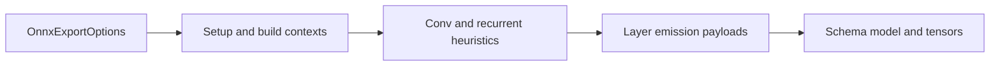

# architecture/network/onnx/export

Export-owned execution and payload types for NeatapticTS ONNX serialization.

This chapter holds the types that belong to the exporter implementation:
export options, build/setup contexts, recurrent and Conv heuristics, and the
dense/per-neuron layer-emission payloads used by the export helpers.

Shared runtime bridge types such as `NodeInternals` remain root-owned in
`network.onnx.utils.types.ts`, and the persisted wire-format schema stays in
`schema/network.onnx.schema.types.ts`.



## architecture/network/onnx/export/network.onnx.export.types.ts

### OnnxExportOptions

Options controlling ONNX-like export.

These options trade off strictness, portability, and fidelity:

- **Strict (default-ish)** export tries to keep the graph easy to interpret:
  layered topology, homogeneous activations per layer, and fully-connected layers.

- **Relaxed** export (`allowPartialConnectivity` / `allowMixedActivations`) can represent
  more networks, but it may generate graphs that are primarily meant for NeatapticTS’s
  importer (and may be less friendly to external ONNX tooling).

- **Recurrent export** (`allowRecurrent`) is intentionally conservative and currently
  focuses on a constrained single-step representation and optional fused heuristics.

Key fields (high-level):
- `includeMetadata`: includes `metadata_props` with architecture hints.
- `opset`: numeric opset version stored in the exported model metadata (default is
  resolved by the exporter; commonly 18 in this codebase).
- `legacyNodeOrdering`: keeps older node ordering for backward compatibility.
- `conv2dMappings` / `pool2dMappings`: encode conv/pool semantics for fully-connected
  layers via explicit mapping declarations.

### ExportNodeIndexAssignmentContext

Context for assigning a stable export index to one node.

### LstmPatternStub

Heuristic LSTM pattern stub for metadata output.

### LstmLayerTraversalContext

Traversal context for one hidden layer during LSTM stub collection.

### LstmCandidateContext

Candidate context for validating one LSTM-like hidden layer pattern.

### ConvInferenceTraversalContext

Traversal context for one hidden layer during Conv inference.

### ConvInferenceEvaluationContext

Width and shape evaluation context used by Conv inference helpers.

### ConvInferenceKernelEvaluationContext

Kernel candidate context for one Conv inference evaluation pass.

### ConvInferenceResult

Collected inferred Conv metadata payload.

### OnnxBuildResolvedOptions

Resolved options used by ONNX model build orchestration.

### OnnxGraphDimensionBuildContext

Context for constructing input/output ONNX graph dimensions.

### OnnxGraphDimensions

Output dimensions used by ONNX graph input/output value info payloads.

### OnnxBaseModelBuildContext

Context for constructing a base ONNX model shell.

### OnnxModelMetadataContext

Context for applying optional ONNX model metadata.

### OnnxRecurrentCollectionContext

Context for collecting recurrent layer indices during model build.

### OnnxRecurrentLayerTraversalContext

Traversal context for one hidden layer during recurrent-input collection.

### OnnxRecurrentInputValueInfoContext

Context for constructing one recurrent previous-state graph input payload.

### OnnxRecurrentLayerProcessingContext

Execution context for processing one hidden recurrent layer.

### OnnxLayerEmissionResult

Result of emitting non-input export layers.

### OnnxLayerEmissionContext

Context for emitting non-input layers during model build.

### LayerBuildContext

Layer build context used while emitting one ONNX graph layer segment.

### LayerTraversalContext

Layer traversal context with adjacent layers and output classification.

### LayerActivationContext

Activation analysis context for one layer.

### LayerRecurrentDecisionContext

Context used to decide recurrent emission branch usage.

### OnnxPostProcessingContext

Context for post-processing and export metadata finalization.

### RecurrentHeuristicEmissionContext

Context for heuristic recurrent operator emission traversal.

### HiddenLayerHeuristicContext

Context for one hidden layer during heuristic recurrent emission.

### LstmEmissionContext

Context for heuristic LSTM emission when a layer matches expected shape.

### GruEmissionContext

Context for heuristic GRU emission when a layer matches expected shape.

### RecurrentGateRowCollectionContext

Context for collecting one recurrent gate row (one neuron).

### RecurrentGateRow

One recurrent gate row payload before flatten fold.

### RecurrentGateParameterCollectionResult

Flattened recurrent gate parameter vectors for one fused operator.

### RecurrentGateBlockCollectionContext

Context for collecting one gate parameter block.

### FusedRecurrentInitializerNames

Context for ONNX fused recurrent initializer names.

### FusedRecurrentGraphNames

Context for ONNX fused recurrent node payload names.

### FusedRecurrentEmissionExecutionContext

Shared execution context for emitting one fused recurrent layer payload.

### RecurrentLayerEmissionParams

Parameters for single-step recurrent layer emission.

### RecurrentLayerEmissionContext

Derived execution context for single-step recurrent layer emission.

### RecurrentInitializerNames

Initializer tensor names for one single-step recurrent layer.

### RecurrentInitializerValues

Collected initializer vectors for one single-step recurrent layer.

### RecurrentInitializerEmissionContext

Context for pushing recurrent initializers into ONNX graph state.

### RecurrentGemmEmissionContext

Context for emitting one Gemm node for recurrent single-step export.

### RecurrentGraphNames

Derived graph names for one recurrent single-step layer payload.

### RecurrentActivationEmissionContext

Context for selecting and emitting recurrent activation node payload.

### ConvSharingValidationResult

Result of Conv sharing validation across declared mappings.

### ConvSharingValidationContext

Context for validating Conv sharing across all declared mappings.

### ConvLayerPairContext

Context for one resolved Conv mapping layer pair.

### ConvOutputCoordinate

Coordinate for one Conv output neuron position.

### ConvRepresentativeKernelContext

Context for representative Conv kernel collection per output channel.

### ConvKernelConsistencyContext

Context for kernel-coordinate consistency checks at one output position.

### WeightToleranceComparisonContext

Context for comparing two scalar weights with numeric tolerance.

### OnnxConvEmissionParams

Parameters accepted by Conv layer emission.

### OnnxConvEmissionContext

Context used after resolving Conv mapping for one layer.

### OnnxConvParameters

Flattened Conv parameters for ONNX initializers.

### OnnxConvTensorNames

Tensor names generated for Conv parameters.

### ActivationSquashFunction

```ts
ActivationSquashFunction(
  x: number,
  derivate: boolean | undefined,
): number
```

Activation function signature used by ONNX layer emission helpers.

### SharedGemmNodeBuildParams

Shared parameters for constructing a Gemm node payload.

### SharedActivationNodeBuildParams

Shared parameters for constructing an activation node payload.

### OptionalLayerOutputParams

Shared parameters for optional pooling/flatten output emission.

### DenseWeightBuildContext

Context for building dense layer initializers from two adjacent layers.

### DenseWeightRow

One collected dense row before fold to flattened initializers.

### DenseWeightBuildResult

Dense layer initializer fold output.

### DenseWeightRowCollectionContext

Context for collecting one dense row.

### DiagonalRecurrentBuildContext

Context for building a diagonal recurrent matrix from self-connections.

### RecurrentRowCollectionContext

Context for collecting one recurrent matrix row.

### OptionalPoolingAndFlattenParams

Parameters for optional pooling + flatten emission after a layer output.

### PoolingEmissionContext

Pooling emission context resolved for one layer output.

### FlattenAfterPoolingContext

Flatten emission context after optional pooling.

### PoolingAttributes

Pooling tensor attributes for ONNX node payloads.

### IndexedMetadataAppendContext

Append-an-index metadata context for JSON-array metadata keys.

### SpecMetadataAppendContext

Append-a-spec metadata context for JSON-array metadata keys.

### DenseLayerParams

Parameters for dense layer emission.

### DenseLayerContext

Dense layer context enriched with resolved activation function.

### DenseTensorNames

Dense initializer tensor names.

### DenseInitializerValues

Dense initializer value arrays.

### DenseGraphNames

Dense graph tensor names.

### DenseActivationContext

Dense activation emission context.

### DenseGemmNodePayload

Strongly typed Gemm node payload used by dense export helpers.

### DenseActivationNodePayload

Strongly typed activation node payload used by dense export helpers.

### DenseOrderedNodePayload

Dense node payload union used by ordered append helpers.

### PerNeuronLayerParams

Parameters for per-neuron layer emission.

### PerNeuronLayerContext

Per-neuron layer context alias.

### PerNeuronSubgraphContext

Per-neuron subgraph emission context.

### PerNeuronNodeContext

Per-neuron normalized node context.

### PerNeuronTensorNames

Per-neuron initializer tensor names.

### PerNeuronGraphNames

Per-neuron graph tensor names.

### PerNeuronConcatNodePayload

Per-neuron concat node payload.

## architecture/network/onnx/export/network.onnx.export-flow.utils.ts

### runOnnxExportFlow

```ts
runOnnxExportFlow(
  network: default,
  options: OnnxExportOptions,
): OnnxModel
```

Execute the complete ONNX export flow for one network instance.

High-level behavior:
 1. Rebuild runtime connection caches and assign stable export indices.
 2. Infer layered ordering and collect recurrent-pattern stubs.
 3. Validate structural constraints for the requested export options.
 4. Build ONNX graph payload and append inference-oriented metadata.

Parameters:
- `network` - Source network to serialize.
- `options` - Optional ONNX export controls.

Returns: ONNX-like model payload.

## architecture/network/onnx/export/network.onnx.export-build.utils.ts

### buildOnnxModel

```ts
buildOnnxModel(
  network: default,
  layers: default[][],
  options: OnnxExportOptions,
): OnnxModel
```

Construct ONNX graph (initializers + nodes) from validated layered network structure.

Parameters:
- `network` - Source network (retained for API compatibility).
- `layers` - Layered nodes including input and output layers.
- `options` - Export options.

Returns: ONNX model.

## architecture/network/onnx/export/network.onnx.export-setup.utils.ts

### createGraphDimensions

```ts
createGraphDimensions(
  context: OnnxGraphDimensionBuildContext,
): OnnxGraphDimensions
```

Build tensor dimensions for model input and output, optionally with symbolic batch dimension.

Parameters:
- `context` - Dimension construction context.

Returns: Input and output dimension arrays for ONNX value info.

### createBaseModel

```ts
createBaseModel(
  context: OnnxBaseModelBuildContext,
): OnnxModel
```

Create the base ONNX model shell with graph input/output declarations.

Parameters:
- `context` - Base model build context.

Returns: Initialized ONNX model with empty initializer/node lists.

### applyModelMetadata

```ts
applyModelMetadata(
  context: OnnxModelMetadataContext,
): void
```

Attach producer and opset metadata to a model when metadata emission is enabled.

Parameters:
- `context` - Metadata application context.

Returns: Nothing.

### collectRecurrentLayerIndices

```ts
collectRecurrentLayerIndices(
  context: OnnxRecurrentCollectionContext,
): number[]
```

Detect hidden layers with self-recurrence and add matching previous-state graph inputs.

Parameters:
- `context` - Recurrent collection context.

Returns: Export-layer indices with recurrent self-connections.

### createTensorDimensions

```ts
createTensorDimensions(
  width: number,
  batchDimension: boolean,
): OnnxDimension[]
```

Build one tensor shape dimension payload for dense vectors.

Parameters:
- `width` - Vector width.
- `batchDimension` - Whether symbolic batch dimension is enabled.

Returns: ONNX dimensions for the vector payload.

### createGraphValueInfo

```ts
createGraphValueInfo(
  valueName: string,
  dimensions: OnnxDimension[],
): OnnxValueInfo
```

Create ONNX value info payload for one graph boundary tensor.

Parameters:
- `valueName` - Tensor value name.
- `dimensions` - Tensor dimensions.

Returns: ONNX value info payload.

### isRecurrentCollectionEnabled

```ts
isRecurrentCollectionEnabled(
  context: OnnxRecurrentCollectionContext,
): boolean
```

Determine whether recurrent layer collection should execute.

Parameters:
- `context` - Recurrent collection context.

Returns: True when recurrent collection is enabled.

### createHiddenLayerTraversalContexts

```ts
createHiddenLayerTraversalContexts(
  context: OnnxRecurrentCollectionContext,
): OnnxRecurrentLayerTraversalContext[]
```

Build traversal contexts for all hidden layers.

Parameters:
- `context` - Recurrent collection context.

Returns: Hidden layer traversal contexts.

### createHiddenLayerIndices

```ts
createHiddenLayerIndices(
  totalLayerCount: number,
): number[]
```

Build hidden layer indices excluding input and output layers.

Parameters:
- `totalLayerCount` - Total number of network layers.

Returns: Hidden layer indices.

### processHiddenLayerRecurrence

```ts
processHiddenLayerRecurrence(
  context: OnnxRecurrentLayerProcessingContext,
): void
```

Process one hidden layer for recurrent self-connections.

Parameters:
- `context` - Hidden layer recurrent processing context.

Returns: Nothing.

### appendRecurrentLayerIndex

```ts
appendRecurrentLayerIndex(
  recurrentLayerIndices: number[],
  traversalContext: OnnxRecurrentLayerTraversalContext,
): void
```

Append one recurrent layer index to the collected index list.

Parameters:
- `recurrentLayerIndices` - Collected recurrent layer indices.
- `traversalContext` - Hidden layer traversal context.

Returns: Nothing.

### appendRecurrentGraphInput

```ts
appendRecurrentGraphInput(
  model: OnnxModel,
  traversalContext: OnnxRecurrentLayerTraversalContext,
): void
```

Append one recurrent previous-state graph input for a hidden layer.

Parameters:
- `model` - Target ONNX model.
- `traversalContext` - Hidden layer traversal context.

Returns: Nothing.

### hasLayerSelfRecurrence

```ts
hasLayerSelfRecurrence(
  hiddenLayerNodes: default[],
): boolean
```

Detect whether a hidden layer contains at least one self-recurrent node.

Parameters:
- `hiddenLayerNodes` - Hidden layer nodes.

Returns: True when any node has a self-connection.

### createRecurrentInputValueInfoContext

```ts
createRecurrentInputValueInfoContext(
  traversalContext: OnnxRecurrentLayerTraversalContext,
): OnnxRecurrentInputValueInfoContext
```

Build recurrent input context for one hidden recurrent layer.

Parameters:
- `traversalContext` - Hidden layer traversal context.

Returns: Recurrent input value-info context.

### createRecurrentInputValueInfo

```ts
createRecurrentInputValueInfo(
  context: OnnxRecurrentInputValueInfoContext,
): OnnxValueInfo
```

Build one recurrent previous-state graph input payload.

Parameters:
- `context` - Recurrent input value-info context.

Returns: ONNX value info payload for recurrent state input.

## architecture/network/onnx/export/network.onnx.export-postprocess.utils.ts

### emitFusedRecurrentHeuristics

```ts
emitFusedRecurrentHeuristics(
  model: OnnxModel,
  layers: default[][],
  allowRecurrent: boolean | undefined,
  previousOutputName: string,
): void
```

Emit heuristic fused recurrent operators (LSTM/GRU) when recurrent export is enabled.

Parameters:
- `model` - Target ONNX model.
- `layers` - Layered network nodes.
- `allowRecurrent` - Whether recurrent export is enabled.
- `previousOutputName` - Current graph output name (kept for backward-compatible emission semantics).

Returns: Nothing.

### finalizeExportMetadata

```ts
finalizeExportMetadata(
  model: OnnxModel,
  layers: default[][],
  options: OnnxExportOptions,
  includeMetadata: boolean,
  hiddenSizesMetadata: number[],
  recurrentLayerIndices: number[],
): void
```

Finalize export metadata and optional conv-sharing validation.

Parameters:
- `model` - Target ONNX model.
- `layers` - Layered network nodes.
- `options` - Export options.
- `includeMetadata` - Whether metadata emission is enabled.
- `hiddenSizesMetadata` - Hidden-layer sizes collected during emission.
- `recurrentLayerIndices` - Recurrent layer indices.

Returns: Nothing.

### tryEmitFusedLstm

```ts
tryEmitFusedLstm(
  context: HiddenLayerHeuristicContext,
): void
```

Try emitting heuristic fused LSTM node and metadata.

### buildFusedLstmExecutionContext

```ts
buildFusedLstmExecutionContext(
  context: LstmEmissionContext,
): FusedRecurrentEmissionExecutionContext
```

Build shared fused-recurrent execution context for LSTM.

### tryEmitFusedGru

```ts
tryEmitFusedGru(
  context: HiddenLayerHeuristicContext,
): void
```

Try emitting heuristic fused GRU node and metadata.

### buildFusedGruExecutionContext

```ts
buildFusedGruExecutionContext(
  context: GruEmissionContext,
): FusedRecurrentEmissionExecutionContext
```

Build shared fused-recurrent execution context for GRU.

### emitFusedRecurrentLayer

```ts
emitFusedRecurrentLayer(
  context: FusedRecurrentEmissionExecutionContext,
): void
```

Emit shared fused recurrent payload (initializers, node, metadata).

### appendIndexMetadata

```ts
appendIndexMetadata(
  model: OnnxModel,
  key: string,
  layerIndex: number,
): void
```

Append a unique layer index to metadata array key.

### findMetadataPropertyIndex

```ts
findMetadataPropertyIndex(
  metadataProperties: OnnxMetadataProperty[],
  key: string,
): number
```

Find metadata property index by key.

### upsertLayerIndexMetadataValue

```ts
upsertLayerIndexMetadataValue(
  metadataProperties: OnnxMetadataProperty[],
  metadataIndex: number,
  layerIndex: number,
): void
```

Upsert one layer index into metadata array-like JSON value.

### parseMetadataLayerIndices

```ts
parseMetadataLayerIndices(
  metadataValue: string,
): number[]
```

Parse metadata JSON value into a numeric layer-index array.

### buildRecurrentHeuristicEmissionContext

```ts
buildRecurrentHeuristicEmissionContext(
  model: OnnxModel,
  layers: default[][],
  previousOutputName: string,
): RecurrentHeuristicEmissionContext
```

Build reusable context for recurrent heuristic traversal.

### collectHiddenLayerIndices

```ts
collectHiddenLayerIndices(
  layers: default[][],
): number[]
```

Collect hidden-layer indices for recurrent traversal.

### buildHiddenLayerHeuristicContext

```ts
buildHiddenLayerHeuristicContext(
  context: RecurrentHeuristicEmissionContext,
  layerIndex: number,
): HiddenLayerHeuristicContext
```

Build one hidden-layer traversal context.

### emitFallbackRecurrentPatternMetadata

```ts
emitFallbackRecurrentPatternMetadata(
  context: HiddenLayerHeuristicContext,
): void
```

Emit fallback metadata for recurrent-size ambiguity.

### isFallbackRecurrentPatternSize

```ts
isFallbackRecurrentPatternSize(
  currentSize: number,
): boolean
```

Check whether hidden size should emit recurrent fallback metadata.

### isEligibleForLstmHeuristic

```ts
isEligibleForLstmHeuristic(
  currentSize: number,
): boolean
```

Check LSTM heuristic eligibility by size and gate divisibility.

### buildLstmEmissionContext

```ts
buildLstmEmissionContext(
  context: HiddenLayerHeuristicContext,
): LstmEmissionContext
```

Build LSTM emission context from one hidden-layer traversal record.

### collectLstmGateNodeGroups

```ts
collectLstmGateNodeGroups(
  context: LstmEmissionContext,
): default[][]
```

Collect LSTM gate node groups in canonical export order.

### isEligibleForGruHeuristic

```ts
isEligibleForGruHeuristic(
  currentSize: number,
): boolean
```

Check GRU heuristic eligibility by size and gate divisibility.

### buildGruEmissionContext

```ts
buildGruEmissionContext(
  context: HiddenLayerHeuristicContext,
): GruEmissionContext
```

Build GRU emission context from one hidden-layer traversal record.

### collectGruGateNodeGroups

```ts
collectGruGateNodeGroups(
  context: GruEmissionContext,
): default[][]
```

Collect GRU gate node groups in canonical export order.

### collectRecurrentGateBlockParameters

```ts
collectRecurrentGateBlockParameters(
  context: RecurrentGateBlockCollectionContext,
): RecurrentGateParameterCollectionResult
```

Collect flattened parameter vectors for one gate node block.

### collectRecurrentGateRow

```ts
collectRecurrentGateRow(
  context: RecurrentGateRowCollectionContext,
): RecurrentGateRow
```

Collect one recurrent gate row payload (inputs, recurrent slice, and bias).

### resolveRecurrentRowWeight

```ts
resolveRecurrentRowWeight(
  context: RecurrentGateRowCollectionContext,
  columnIndex: number,
): number
```

Resolve one recurrent row value at the requested column.

### foldRecurrentGateRows

```ts
foldRecurrentGateRows(
  gateRows: RecurrentGateRow[],
): RecurrentGateParameterCollectionResult
```

Fold recurrent gate rows into flattened ONNX initializer vectors.

### foldRecurrentGateBlocks

```ts
foldRecurrentGateBlocks(
  gateParameterBlocks: RecurrentGateParameterCollectionResult[],
): RecurrentGateParameterCollectionResult
```

Fold gate blocks into a single fused parameter payload.

### buildFusedRecurrentInitializerNames

```ts
buildFusedRecurrentInitializerNames(
  operatorType: "LSTM" | "GRU",
  layerIndex: number,
): FusedRecurrentInitializerNames
```

Build fused recurrent initializer names for the current layer.

### buildFusedRecurrentGraphNames

```ts
buildFusedRecurrentGraphNames(
  nodePrefix: string,
  outputSuffix: string,
  layerIndex: number,
): FusedRecurrentGraphNames
```

Build fused recurrent graph names for node and output.

### appendFusedRecurrentInitializers

```ts
appendFusedRecurrentInitializers(
  model: OnnxModel,
  initializerNames: FusedRecurrentInitializerNames,
  parameters: RecurrentGateParameterCollectionResult,
  gateCount: number,
  unitSize: number,
  previousSize: number,
): void
```

Append fused recurrent initializer tensors to the ONNX graph.

### appendFusedRecurrentNode

```ts
appendFusedRecurrentNode(
  graph: OnnxGraph,
  operatorType: "LSTM" | "GRU",
  previousOutputName: string,
  initializerNames: FusedRecurrentInitializerNames,
  graphNames: FusedRecurrentGraphNames,
  unitSize: number,
): void
```

Append fused recurrent operator node to the ONNX graph.

### resolveGruPreviousOutputName

```ts
resolveGruPreviousOutputName(
  layerIndex: number,
): string
```

Resolve previous output naming semantics for GRU heuristic emission.

### appendRecurrentSingleStepMetadata

```ts
appendRecurrentSingleStepMetadata(
  model: OnnxModel,
  recurrentLayerIndices: number[],
): void
```

Append recurrent single-step metadata when recurrent layers exist.

### shouldValidateConvSharing

```ts
shouldValidateConvSharing(
  options: OnnxExportOptions,
): boolean
```

Determine whether Conv2D sharing validation is enabled and configured.

### validateConvSharingAcrossMappings

```ts
validateConvSharingAcrossMappings(
  context: ConvSharingValidationContext,
): ConvSharingValidationResult
```

Validate Conv2D sharing across all declared Conv mappings.

### resolveConvLayerPairContext

```ts
resolveConvLayerPairContext(
  layers: default[][],
  layerIndex: number,
  convSpec: Conv2DMapping,
): ConvLayerPairContext | undefined
```

Resolve one Conv mapping layer pair or return undefined for invalid layout.

### isConvLayerPairConsistent

```ts
isConvLayerPairConsistent(
  context: ConvLayerPairContext,
): boolean
```

Validate one Conv layer pair against representative kernel sharing.

### appendConvLayerValidationResult

```ts
appendConvLayerValidationResult(
  result: ConvSharingValidationResult,
  layerIndex: number,
  isConsistent: boolean,
): void
```

Append one Conv-layer validation outcome and optional warning.

### appendConvSharingMetadata

```ts
appendConvSharingMetadata(
  model: OnnxModel,
  result: ConvSharingValidationResult,
): void
```

Append Conv-sharing validation metadata arrays.

### collectRepresentativeKernels

```ts
collectRepresentativeKernels(
  context: ConvLayerPairContext,
): number[][]
```

Collect representative kernels for each output channel.

### collectRepresentativeKernelForChannel

```ts
collectRepresentativeKernelForChannel(
  context: ConvRepresentativeKernelContext,
): number[]
```

Collect one representative kernel by reading the first output position for a channel.

### collectConvOutputCoordinates

```ts
collectConvOutputCoordinates(
  convSpec: Conv2DMapping,
): ConvOutputCoordinate[]
```

Collect output coordinates for full Conv traversal.

### collectConvKernelCoordinates

```ts
collectConvKernelCoordinates(
  convSpec: Conv2DMapping,
): OnnxConvKernelCoordinate[]
```

Collect kernel coordinates for one Conv kernel traversal.

### isOutputCoordinateConsistent

```ts
isOutputCoordinateConsistent(
  context: ConvLayerPairContext,
  outputCoordinate: ConvOutputCoordinate,
  representativeKernels: number[][],
  tolerance: number,
): boolean
```

Validate one output coordinate against channel representative kernel weights.

### resolveNeuronInternalAtOutputCoordinate

```ts
resolveNeuronInternalAtOutputCoordinate(
  context: ConvLayerPairContext,
  outputCoordinate: ConvOutputCoordinate,
): NodeInternals | undefined
```

Resolve runtime internals for output coordinate neuron, if present.

### isKernelCoordinateConsistent

```ts
isKernelCoordinateConsistent(
  context: ConvKernelConsistencyContext,
): boolean
```

Validate one kernel coordinate against its representative channel value.

### resolveInputPosition

```ts
resolveInputPosition(
  context: ConvKernelConsistencyContext,
): { inputRow: number; inputColumn: number; }
```

Resolve input row/column projected by output and kernel coordinates.

### isInputPositionInsideBounds

```ts
isInputPositionInsideBounds(
  convSpec: Conv2DMapping,
  inputRow: number,
  inputColumn: number,
): boolean
```

Check whether input row/column falls inside Conv input bounds.

### resolveSourceNodeAtInputPosition

```ts
resolveSourceNodeAtInputPosition(
  convSpec: Conv2DMapping,
  previousLayerNodes: default[],
  inChannelIndex: number,
  inputRow: number,
  inputColumn: number,
): default | undefined
```

Resolve source node by Conv input position coordinates.

### collectRepresentativeKernelWeight

```ts
collectRepresentativeKernelWeight(
  convSpec: Conv2DMapping,
  previousLayerNodes: default[],
  representativeInternal: NodeInternals,
  kernelCoordinate: OnnxConvKernelCoordinate,
): number
```

Collect representative kernel value using top-left receptive field indexing.

### areWeightsWithinTolerance

```ts
areWeightsWithinTolerance(
  context: WeightToleranceComparisonContext,
): boolean
```

Compare two scalar weights using configured tolerance.

### asNodeInternals

```ts
asNodeInternals(
  node: default,
): NodeInternals
```

Resolve runtime node internals in one typed helper.

### resolveIncomingWeight

```ts
resolveIncomingWeight(
  targetNodeInternal: NodeInternals,
  sourceNode: default,
): number
```

Resolve incoming connection weight from a specific source node.

### resolveSelfConnectionWeight

```ts
resolveSelfConnectionWeight(
  targetNodeInternal: NodeInternals,
): number
```

Resolve self-connection weight for diagonal recurrent matrix entries.

### buildMetadataProperty

```ts
buildMetadataProperty(
  key: string,
  value: unknown,
): OnnxMetadataProperty
```

Build a metadata key/value property with JSON string serialization.

### appendMetadataProperty

```ts
appendMetadataProperty(
  model: OnnxModel,
  metadataProperty: OnnxMetadataProperty,
): void
```

Append metadata property to model metadata_props list.

### ensureMetadataProps

```ts
ensureMetadataProps(
  model: OnnxModel,
): OnnxMetadataProperty[]
```

Ensure metadata_props array exists and return it.

## architecture/network/onnx/export/network.onnx.export-orchestrators.utils.ts

### assignExportNodeIndices

```ts
assignExportNodeIndices(
  network: default,
): void
```

Assign stable index values to nodes for export diagnostics.

Parameters:
- `network` - Source network.

Returns: Nothing.

### collectLstmPatternStubs

```ts
collectLstmPatternStubs(
  layers: default[][],
  allowRecurrent: boolean | undefined,
): LstmPatternStub[]
```

Collect heuristic LSTM grouping stubs from hidden layers.

Parameters:
- `layers` - Layered network nodes.
- `allowRecurrent` - Whether recurrent export heuristics are enabled.

Returns: Candidate LSTM pattern stubs.

### appendConvInferenceMetadata

```ts
appendConvInferenceMetadata(
  model: OnnxModel,
  layers: default[][],
  options: OnnxExportOptions,
): void
```

Append heuristic conv inference metadata when requested.

Parameters:
- `model` - Target ONNX model.
- `layers` - Layered network nodes.
- `options` - Export options.

Returns: Nothing.

### appendLstmPatternStubMetadata

```ts
appendLstmPatternStubMetadata(
  model: OnnxModel,
  lstmPatternStubs: LstmPatternStub[],
): void
```

Append LSTM pattern stub metadata.

Parameters:
- `model` - Target ONNX model.
- `lstmPatternStubs` - Pattern stubs.

Returns: Nothing.

### createExportNodeIndexAssignmentContexts

```ts
createExportNodeIndexAssignmentContexts(
  network: default,
): ExportNodeIndexAssignmentContext[]
```

Create node/index assignment contexts for export diagnostics.

Parameters:
- `network` - Source network.

Returns: Assignment contexts.

### applyExportNodeIndexAssignments

```ts
applyExportNodeIndexAssignments(
  assignmentContexts: ExportNodeIndexAssignmentContext[],
): void
```

Apply prepared node/index assignment contexts.

Parameters:
- `assignmentContexts` - Prepared contexts.

Returns: Nothing.

### applySingleExportNodeIndexAssignment

```ts
applySingleExportNodeIndexAssignment(
  assignmentContext: ExportNodeIndexAssignmentContext,
): void
```

Apply one export index assignment.

Parameters:
- `assignmentContext` - Assignment context.

Returns: Nothing.

### safelyCollectLstmPatternStubs

```ts
safelyCollectLstmPatternStubs(
  layers: default[][],
): LstmPatternStub[]
```

Collect LSTM pattern stubs with heuristic error isolation.

Parameters:
- `layers` - Layered network nodes.

Returns: LSTM pattern stubs.

### collectLstmPatternStubsFromLayers

```ts
collectLstmPatternStubsFromLayers(
  layers: default[][],
): LstmPatternStub[]
```

Collect LSTM pattern stubs from hidden layers.

Parameters:
- `layers` - Layered network nodes.

Returns: LSTM pattern stubs.

### createHiddenLayerTraversalContexts

```ts
createHiddenLayerTraversalContexts(
  layers: default[][],
): LstmLayerTraversalContext[]
```

Create traversal contexts for hidden layers only.

Parameters:
- `layers` - Layered network nodes.

Returns: Hidden layer contexts.

### createLstmCandidateContext

```ts
createLstmCandidateContext(
  hiddenLayerContext: LstmLayerTraversalContext,
): LstmCandidateContext
```

Build LSTM candidate context for one hidden layer.

Parameters:
- `hiddenLayerContext` - Hidden layer context.

Returns: LSTM candidate context.

### isValidLstmCandidateContext

```ts
isValidLstmCandidateContext(
  candidateContext: LstmCandidateContext,
): boolean
```

Determine whether a candidate context satisfies heuristic LSTM conditions.

Parameters:
- `candidateContext` - Candidate context.

Returns: True when the candidate is a valid LSTM stub.

### mapLstmCandidateToStub

```ts
mapLstmCandidateToStub(
  candidateContext: LstmCandidateContext,
): LstmPatternStub
```

Map a valid candidate context to metadata stub.

Parameters:
- `candidateContext` - Valid candidate context.

Returns: LSTM pattern stub.

### hasRequiredSelfConnectionCount

```ts
hasRequiredSelfConnectionCount(
  nodeItem: default,
): boolean
```

Check whether one node has the required self-connection count.

Parameters:
- `nodeItem` - Node to inspect.

Returns: True when self-connection count matches requirement.

### collectInferredConvMetadata

```ts
collectInferredConvMetadata(
  context: { layers: default[][]; declaredMappings: Conv2DMapping[] | undefined; },
): ConvInferenceResult
```

Collect inferred Conv metadata from hidden-layer traversals.

Parameters:
- `context` - Conv traversal context.

Returns: Inferred Conv metadata result.

### createConvTraversalContexts

```ts
createConvTraversalContexts(
  context: { layers: default[][]; declaredMappings: Conv2DMapping[] | undefined; },
): ConvInferenceTraversalContext[]
```

Create Conv traversal contexts for hidden layers.

Parameters:
- `context` - Conv traversal source context.

Returns: Conv traversal contexts.

### resolveConvInferenceForLayer

```ts
resolveConvInferenceForLayer(
  traversalContext: ConvInferenceTraversalContext,
): (Conv2DMapping & { note?: string | undefined; }) | undefined
```

Resolve inferred Conv specification for one hidden layer.

Parameters:
- `traversalContext` - Conv traversal context.

Returns: Inferred Conv specification when matched.

### createConvInferenceEvaluationContext

```ts
createConvInferenceEvaluationContext(
  traversalContext: ConvInferenceTraversalContext,
): ConvInferenceEvaluationContext
```

Create width/square-evaluation context for Conv inference.

Parameters:
- `traversalContext` - Conv traversal context.

Returns: Conv evaluation context.

### resolveConvSpecFromKernelCandidates

```ts
resolveConvSpecFromKernelCandidates(
  evaluationContext: ConvInferenceEvaluationContext,
): (Conv2DMapping & { note?: string | undefined; }) | undefined
```

Resolve Conv specification using ordered kernel candidates.

Parameters:
- `evaluationContext` - Conv evaluation context.

Returns: Inferred Conv specification when matched.

### resolveConvSpecForKernel

```ts
resolveConvSpecForKernel(
  kernelContext: ConvInferenceKernelEvaluationContext,
): (Conv2DMapping & { note?: string | undefined; }) | undefined
```

Resolve Conv specification for one kernel candidate.

Parameters:
- `kernelContext` - Kernel-evaluation context.

Returns: Inferred Conv specification when matched.

### isDeclaredConvLayer

```ts
isDeclaredConvLayer(
  traversalContext: ConvInferenceTraversalContext,
): boolean
```

Check whether a traversal layer already has declared Conv mapping.

Parameters:
- `traversalContext` - Conv traversal context.

Returns: True when mapping is already declared.

### isInferredConvSpec

```ts
isInferredConvSpec(
  specification: (Conv2DMapping & { note?: string | undefined; }) | undefined,
): boolean
```

Type guard for inferred Conv specifications.

Parameters:
- `specification` - Conv specification candidate.

Returns: True when specification is defined.

### hasInferredConvMetadata

```ts
hasInferredConvMetadata(
  inferenceResult: ConvInferenceResult,
): boolean
```

Check whether inferred Conv metadata exists.

Parameters:
- `inferenceResult` - Inferred Conv result.

Returns: True when inferred metadata exists.

### appendMetadataProperties

```ts
appendMetadataProperties(
  model: OnnxModel,
  metadataProperties: OnnxMetadataProperty[],
): void
```

Append metadata properties in a single, normalized path.

Parameters:
- `model` - Target ONNX model.
- `metadataProperties` - Metadata properties to append.

Returns: Nothing.
