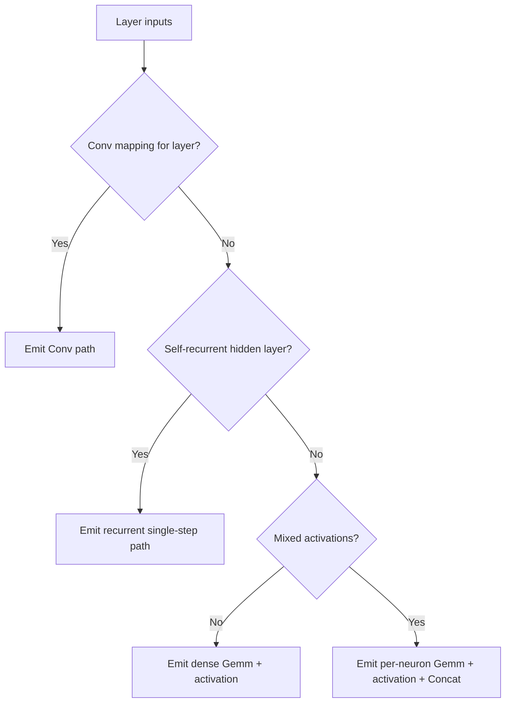

# architecture/network/onnx/export/layers

Decision router for ONNX layer emission.

This boundary does not build tensors directly. Its job is to inspect one
export layer and choose the smallest valid emission strategy:
Conv when an explicit mapping is present, recurrent single-step when the
layer owns self-connections, compact dense export when activations are
homogeneous, or per-neuron decomposition when activations differ.



## architecture/network/onnx/export/layers/network.onnx.export-conv.utils.ts

### appendConvBiasInitializer

```ts
appendConvBiasInitializer(
  context: OnnxConvEmissionContext,
  convTensorNames: OnnxConvTensorNames,
  biasValues: number[],
): void
```

Append Conv bias initializer.

Parameters:

- `context` - Conv emission context.
- `convTensorNames` - Conv tensor names.
- `biasValues` - Conv bias values.

Returns: Nothing.

### appendConvExportMetadata

```ts
appendConvExportMetadata(
  context: OnnxConvEmissionContext,
): void
```

Append Conv export metadata entries.

Parameters:

- `context` - Conv emission context.

Returns: Nothing.

### appendConvWeightInitializer

```ts
appendConvWeightInitializer(
  context: OnnxConvEmissionContext,
  convTensorNames: OnnxConvTensorNames,
  weightValues: number[],
): void
```

Append Conv weight initializer.

Parameters:

- `context` - Conv emission context.
- `convTensorNames` - Conv tensor names.
- `weightValues` - Conv weight values.

Returns: Nothing.

### buildKernelCoordinatesForInputChannel

```ts
buildKernelCoordinatesForInputChannel(
  convSpec: Conv2DMapping,
  inputChannelIndex: number,
): OnnxConvKernelCoordinate[]
```

Build kernel coordinates for one input channel.

Parameters:

- `convSpec` - Conv mapping spec.
- `inputChannelIndex` - Input channel index.

Returns: Kernel coordinates for the input channel.

### calculateSpatialOutputSize

```ts
calculateSpatialOutputSize(
  inputSize: number,
  kernelSize: number,
  strideSize: number,
  leadingPadding: number,
  trailingPadding: number,
): number
```

Calculate one spatial output size from kernel, stride, and padding metadata.

Parameters:

- `inputSize` - Pre-op spatial size.
- `kernelSize` - Kernel size.
- `strideSize` - Stride size.
- `leadingPadding` - Leading padding value.
- `trailingPadding` - Trailing padding value.

Returns: Derived spatial output size.

### collectConvBiasValues

```ts
collectConvBiasValues(
  representativeNeuronInternals: NodeInternals[],
): number[]
```

Collect Conv bias values from representative neurons.

Parameters:

- `representativeNeuronInternals` - Representative internals.

Returns: Bias values.

### collectConvParameters

```ts
collectConvParameters(
  context: OnnxConvEmissionContext,
): OnnxConvParameters
```

Collect flattened Conv weights and biases.

Parameters:

- `context` - Conv emission context.

Returns: Conv initializer parameters.

### collectConvWeightValues

```ts
collectConvWeightValues(
  context: OnnxConvEmissionContext,
  representativeNeuronInternals: NodeInternals[],
): number[]
```

Collect flattened Conv weight values.

Parameters:

- `context` - Conv emission context.
- `representativeNeuronInternals` - Representative internals.

Returns: Flattened Conv weights.

### collectRepresentativeNeuronInternals

```ts
collectRepresentativeNeuronInternals(
  context: OnnxConvEmissionContext,
  outputChannelIndices: number[],
): NodeInternals[]
```

Collect representative neuron internals for each output channel.

Parameters:

- `context` - Conv emission context.
- `outputChannelIndices` - Output channel indices.

Returns: Representative internals.

### createConvPaddingValues

```ts
createConvPaddingValues(
  convSpec: Conv2DMapping,
): number[]
```

Create ONNX pads values for Conv node.

Parameters:

- `convSpec` - Conv mapping spec.

Returns: Padding values in ONNX order.

### createConvTensorNames

```ts
createConvTensorNames(
  layerIndex: number,
): OnnxConvTensorNames
```

Create deterministic Conv parameter tensor names.

Parameters:

- `layerIndex` - Layer index.

Returns: Conv tensor names.

### createKernelCoordinates

```ts
createKernelCoordinates(
  convSpec: Conv2DMapping,
): OnnxConvKernelCoordinate[]
```

Create all Conv kernel coordinates across input channels.

Parameters:

- `convSpec` - Conv mapping spec.

Returns: Kernel coordinates.

### createOutputChannelIndices

```ts
createOutputChannelIndices(
  convSpec: Conv2DMapping,
): number[]
```

Create output channel index list.

Parameters:

- `convSpec` - Conv mapping spec.

Returns: Output channel indices.

### derivePooledTensorWidth

```ts
derivePooledTensorWidth(
  derivedPooledInputShape: { inputChannels: number; inputHeight: number; inputWidth: number; },
): number
```

Fold one derived pooled input shape to its flattened width.

Parameters:

- `derivedPooledInputShape` - Derived pooled geometry.

Returns: Flattened pooled tensor width.

### emitActivationNode

```ts
emitActivationNode(
  context: OnnxConvEmissionContext,
  convOutputName: string,
  activationOutputName: string,
): void
```

Emit activation node for Conv output.

Parameters:

- `context` - Conv emission context.
- `convOutputName` - Conv output tensor name.
- `activationOutputName` - Activation output tensor name.

Returns: Nothing.

### emitConvAndActivationGraph

```ts
emitConvAndActivationGraph(
  context: OnnxConvEmissionContext,
  convTensorNames: OnnxConvTensorNames,
): string
```

Emit Conv and activation nodes and return activation output name.

Parameters:

- `context` - Conv emission context.
- `convTensorNames` - Conv tensor names.

Returns: Activation output name.

### emitConvNode

```ts
emitConvNode(
  context: OnnxConvEmissionContext,
  convTensorNames: OnnxConvTensorNames,
  convOutputName: string,
  convInputName: string,
): void
```

Emit ONNX Conv node.

Parameters:

- `context` - Conv emission context.
- `convTensorNames` - Conv tensor names.
- `convOutputName` - Conv output tensor name.
- `convInputName` - Conv input tensor name.

Returns: Nothing.

### emitConvParameterInitializers

```ts
emitConvParameterInitializers(
  context: OnnxConvEmissionContext,
  convParameters: OnnxConvParameters,
): OnnxConvTensorNames
```

Emit Conv parameter initializers and return tensor names.

Parameters:

- `context` - Conv emission context.
- `convParameters` - Conv parameters.

Returns: Conv tensor names.

### emitFlattenReshapeBridge

```ts
emitFlattenReshapeBridge(
  context: OnnxConvEmissionContext,
  flattenedPoolingShape: { inputChannels: number; inputHeight: number; inputWidth: number; },
): string
```

Emit a reshape bridge that restores `[N,C,H,W]` input rank after flatten.

Parameters:

- `context` - Conv emission context.
- `flattenedPoolingShape` - Supported flattened pooled shape.

Returns: Reshape output tensor name.

### emitOptionalPoolingAndFlattenForConv

```ts
emitOptionalPoolingAndFlattenForConv(
  context: OnnxConvEmissionContext,
  activationOutputName: string,
): string
```

Emit optional pooling and flatten nodes for Conv output.

Parameters:

- `context` - Conv emission context.
- `activationOutputName` - Activation output name.

Returns: Final output tensor name.

### getActualPreviousTensorWidth

```ts
getActualPreviousTensorWidth(
  context: OnnxConvEmissionContext,
): number
```

Resolve the actual graph-input width seen by this Conv layer.

Parameters:

- `context` - Conv emission context.

Returns: Previous tensor width after optional pooling.

### getExpectedCurrentWidth

```ts
getExpectedCurrentWidth(
  convSpec: Conv2DMapping,
): number
```

Get expected current-layer width for Conv mapping.

Parameters:

- `convSpec` - Conv mapping spec.

Returns: Expected current-layer width.

### getExpectedPreviousWidth

```ts
getExpectedPreviousWidth(
  convSpec: Conv2DMapping,
): number
```

Get expected previous-layer width for Conv mapping.

Parameters:

- `convSpec` - Conv mapping spec.

Returns: Expected previous-layer width.

### isConvShapeCompatible

```ts
isConvShapeCompatible(
  context: OnnxConvEmissionContext,
): boolean
```

Determine whether declared Conv dimensions match layer widths.

Parameters:

- `context` - Conv emission context.

Returns: Whether Conv dimensions match the network layers.

### logConvShapeMismatch

```ts
logConvShapeMismatch(
  context: OnnxConvEmissionContext,
): void
```

Log Conv mapping shape mismatch warning.

Parameters:

- `context` - Conv emission context.

Returns: Nothing.

### resolveActivationPayload

```ts
resolveActivationPayload(
  context: OnnxConvEmissionContext,
): { operation: string; attributes?: { name: string; type?: string | undefined; f?: number | undefined; i?: number | undefined; s?: string | undefined; }[] | undefined; }
```

Resolve activation operator for Conv output.

Parameters:

- `context` - Conv emission context.

Returns: Activation operator name.

### resolveConvInputName

```ts
resolveConvInputName(
  context: OnnxConvEmissionContext,
): string
```

Resolve the tensor name that should feed the Conv node.

Parameters:

- `context` - Conv emission context.

Returns: Previous output name, or a reshape bridge output for the narrow flatten subset.

### resolveConvSourceLayout

```ts
resolveConvSourceLayout(
  context: OnnxConvEmissionContext,
  convSpec: Conv2DMapping,
): { channelStride: number; sourceHeight: number; sourceWidth: number; }
```

Resolve the source layout used when this Conv layer consumes a pooled predecessor.

Parameters:

- `context` - Conv emission context.
- `convSpec` - Conv mapping spec.

Returns: Source layout dimensions used for dense-node indexing.

### resolveConvSourceNode

```ts
resolveConvSourceNode(
  context: OnnxConvEmissionContext,
  kernelCoordinate: OnnxConvKernelCoordinate,
): default
```

Resolve source node referenced by one kernel coordinate.

Parameters:

- `context` - Conv emission context.
- `kernelCoordinate` - Kernel coordinate.

Returns: Source node.

### resolveDerivedPooledInputShape

```ts
resolveDerivedPooledInputShape(
  context: OnnxConvEmissionContext,
): { inputChannels: number; inputHeight: number; inputWidth: number; } | undefined
```

Resolve pooled input geometry from the immediately previous Conv + Pool metadata.

Parameters:

- `context` - Conv emission context.

Returns: Derived pooled shape, or undefined when the metadata is unusable.

### resolveInboundWeightOrZero

```ts
resolveInboundWeightOrZero(
  representativeNeuronInternal: NodeInternals,
  sourceNode: default,
): number
```

Resolve inbound weight or zero when missing.

Parameters:

- `representativeNeuronInternal` - Representative neuron internals.
- `sourceNode` - Source node.

Returns: Inbound weight value.

### resolveInputFeatureIndex

```ts
resolveInputFeatureIndex(
  context: OnnxConvEmissionContext,
  convSpec: Conv2DMapping,
  kernelCoordinate: OnnxConvKernelCoordinate,
): number
```

Resolve flattened input feature index for one kernel coordinate.

Parameters:

- `context` - Conv emission context.
- `convSpec` - Conv mapping spec.
- `kernelCoordinate` - Kernel coordinate.

Returns: Flattened input feature index.

### resolvePoolingSpec

```ts
resolvePoolingSpec(
  context: OnnxConvEmissionContext,
): Pool2DMapping | undefined
```

Resolve pooling spec for current layer.

Parameters:

- `context` - Conv emission context.

Returns: Pool mapping spec, if configured.

### resolveRepresentativeNeuronIndex

```ts
resolveRepresentativeNeuronIndex(
  convSpec: Conv2DMapping,
  outputChannelIndex: number,
): number
```

Resolve representative neuron index for one output channel.

Parameters:

- `convSpec` - Conv mapping spec.
- `outputChannelIndex` - Output channel index.

Returns: Representative neuron index.

### resolveRepresentativeNeuronInternal

```ts
resolveRepresentativeNeuronInternal(
  context: OnnxConvEmissionContext,
  outputChannelIndex: number,
): NodeInternals
```

Resolve representative neuron internals for one output channel.

Parameters:

- `context` - Conv emission context.
- `outputChannelIndex` - Output channel index.

Returns: Representative neuron internals.

### resolveSupportedFlattenedPoolingShape

```ts
resolveSupportedFlattenedPoolingShape(
  context: OnnxConvEmissionContext,
): { inputChannels: number; inputHeight: number; inputWidth: number; } | undefined
```

Resolve the narrow supported flatten-after-pool bridge shape, when present.

Parameters:

- `context` - Conv emission context.

Returns: Supported flattened pooled shape for the later Conv bridge.

### resolveUpstreamPoolingSpec

```ts
resolveUpstreamPoolingSpec(
  options: OnnxExportOptions,
  layerIndex: number,
): Pool2DMapping | undefined
```

Resolve pooling configured immediately after the previous layer.

Parameters:

- `options` - Export options.
- `layerIndex` - Current Conv layer index.

Returns: Upstream pooling spec when present.

### resolveWeightForCoordinate

```ts
resolveWeightForCoordinate(
  context: OnnxConvEmissionContext,
  representativeNeuronInternal: NodeInternals,
  kernelCoordinate: OnnxConvKernelCoordinate,
): number
```

Resolve weight for one kernel coordinate.

Parameters:

- `context` - Conv emission context.
- `representativeNeuronInternal` - Representative neuron internals.
- `kernelCoordinate` - Kernel coordinate.

Returns: Weight value or zero when connection is missing.

### tryEmitConvLayer

```ts
tryEmitConvLayer(
  params: OnnxConvEmissionParams,
): string | undefined
```

Try to emit one layer as a Conv-shaped ONNX segment when the caller supplied
an explicit Conv mapping for that export layer.

This path reconstructs kernels from a fully connected layer by assuming the
declared Conv geometry really matches the flattened previous and current layer
widths. When that contract does not hold, the exporter logs the mismatch and
returns `undefined` so the broader layer router can fall back or fail with a
more appropriate message.

In addition to the Conv and activation nodes, this helper also owns optional
pooling, flatten-after-pooling, and the metadata hints required for import to
rebuild the same semantic interpretation.

Parameters:

- `params` - Conv emission parameters.

Returns: New output tensor name when handled, otherwise undefined.

Example:

```ts
const outputName = tryEmitConvLayer({
  model,
  options: {
    conv2dMappings: [
      {
        layerIndex: 1,
        inHeight: 28,
        inWidth: 28,
        inChannels: 1,
        outChannels: 8,
        kernelSize: 3,
      },
    ],
  },
  layerIndex: 1,
  previousOutputName: 'input',
  previousLayerNodes,
  currentLayerNodes,
});
```

### validateConvShapeOrWarn

```ts
validateConvShapeOrWarn(
  context: OnnxConvEmissionContext,
): boolean
```

Validate Conv dimensions and log mismatch details when invalid.

Parameters:

- `context` - Conv emission context.

Returns: Whether Conv shape is compatible.

## architecture/network/onnx/export/layers/network.onnx.export-dense.utils.ts

### appendDenseBiasInitializer

```ts
appendDenseBiasInitializer(
  layerContext: DenseLayerContext,
  biasTensorName: string,
  biasVector: number[],
): void
```

Append dense bias initializer.

Parameters:

- `layerContext` - Dense layer context.
- `biasTensorName` - Bias tensor name.
- `biasVector` - Bias vector values.

Returns: Nothing.

### appendDenseNodes

```ts
appendDenseNodes(
  model: OnnxModel,
  orderedNodes: DenseOrderedNodePayload[],
): void
```

Append ordered dense nodes to the model graph.

Parameters:

- `model` - Target model.
- `orderedNodes` - Ordered dense nodes.

Returns: Nothing.

### appendDenseWeightInitializer

```ts
appendDenseWeightInitializer(
  layerContext: DenseLayerContext,
  weightTensorName: string,
  weightMatrixValues: number[],
): void
```

Append dense weight initializer.

Parameters:

- `layerContext` - Dense layer context.
- `weightTensorName` - Weight tensor name.
- `weightMatrixValues` - Weight values.

Returns: Nothing.

### buildSingleNeuronWeightRow

```ts
buildSingleNeuronWeightRow(
  targetNodeInternal: NodeInternals,
  previousLayerNodes: default[],
): number[]
```

Build one neuron's incoming weight row against previous layer.

Parameters:

- `targetNodeInternal` - Target node internals.
- `previousLayerNodes` - Previous layer nodes.

Returns: Weight row values.

### collectDenseInitializerValues

```ts
collectDenseInitializerValues(
  layerContext: DenseLayerContext,
): DenseInitializerValues
```

Collect dense weight matrix and bias vector values.

Parameters:

- `layerContext` - Dense layer context.

Returns: Dense initializer values.

### createActivationNode

```ts
createActivationNode(
  denseActivationContext: DenseActivationContext,
): DenseActivationNodePayload
```

Create dense activation node definition.

Parameters:

- `denseActivationContext` - Dense activation context.

Returns: ONNX activation node payload.

### createDefaultGemmAttributes

```ts
createDefaultGemmAttributes(): { name: string; type: string; f?: number | undefined; i?: number | undefined; }[]
```

Build default Gemm attributes for ONNX export.

Returns: Default Gemm attribute list.

### createDenseTensorNames

```ts
createDenseTensorNames(
  layerIndex: number,
): DenseTensorNames
```

Build dense tensor names for initializer emission.

Parameters:

- `layerIndex` - Layer index.

Returns: Dense tensor names.

### createGemmNode

```ts
createGemmNode(
  denseActivationContext: DenseActivationContext,
): DenseGemmNodePayload
```

Create dense Gemm node definition.

Parameters:

- `denseActivationContext` - Dense activation context.

Returns: ONNX Gemm node payload.

### createSharedActivationNodePayload

```ts
createSharedActivationNodePayload(
  params: SharedActivationNodeBuildParams,
): DenseActivationNodePayload
```

Build a shared activation node payload.

Parameters:

- `params` - Shared activation build parameters.

Returns: Activation node payload.

### createSharedGemmNodePayload

```ts
createSharedGemmNodePayload(
  params: SharedGemmNodeBuildParams,
): DenseGemmNodePayload
```

Build a shared Gemm node payload.

Parameters:

- `params` - Shared Gemm build parameters.

Returns: Gemm node payload.

### emitDenseActivationSubgraph

```ts
emitDenseActivationSubgraph(
  model: OnnxModel,
  denseActivationContext: DenseActivationContext,
): void
```

Emit Gemm and activation nodes using requested ordering.

Parameters:

- `model` - Target ONNX model.
- `denseActivationContext` - Dense activation context.

Returns: Nothing.

### emitDenseInitializers

```ts
emitDenseInitializers(
  layerContext: DenseLayerContext,
): DenseTensorNames
```

Emit dense initializers and return tensor names.

Parameters:

- `layerContext` - Dense layer context.

Returns: Tensor names.

### emitDenseLayer

```ts
emitDenseLayer(
  params: DenseLayerParams,
): string
```

Emit the compact dense export path for a layer whose neurons all share the
same activation.

This is the cheapest ONNX shape the exporter can produce for a standard MLP
layer: one Gemm node for the affine transform and one activation node for the
whole layer. The same helper also preserves the library's legacy node-ordering
compatibility mode when older snapshots need deterministic graph ordering.

Parameters:

- `params` - Dense emission parameters.

Returns: Output tensor name.

Example:

```ts
const outputName = emitDenseLayer({
  model,
  layerIndex: 2,
  previousOutputName: 'Layer_1',
  previousLayerNodes,
  currentLayerNodes,
  options: {},
  legacyNodeOrdering: false,
});
```

### emitOptionalLayerOutput

```ts
emitOptionalLayerOutput(
  params: OptionalLayerOutputParams,
): string
```

Emit optional pooling and flatten output fold.

Parameters:

- `params` - Optional output parameters.

Returns: Output tensor name.

### emitPerNeuronLayer

```ts
emitPerNeuronLayer(
  params: PerNeuronLayerParams,
): string
```

Emit the fallback dense-family representation for a layer whose target
neurons use different activations.

Instead of pretending the layer is homogeneous, this path exports one tiny
Gemm-plus-activation subgraph per neuron and then concatenates the results.
The graph is larger, but it preserves mixed activation behavior that a single
layer-wide activation node cannot express.

Parameters:

- `params` - Per-neuron emission parameters.

Returns: Output tensor name.

Example:

```ts
const outputName = emitPerNeuronLayer({
  model,
  layerIndex: 2,
  previousOutputName: 'Layer_1',
  previousLayerNodes,
  currentLayerNodes,
  options: { allowMixedActivations: true },
});
```

### emitPerNeuronSubgraph

```ts
emitPerNeuronSubgraph(
  perNeuronSubgraphContext: PerNeuronSubgraphContext,
): string
```

Emit per-neuron Gemm + activation subgraph.

Parameters:

- `perNeuronSubgraphContext` - Per-neuron subgraph context.

Returns: Per-neuron activation output name.

### emitResidualAddLayer

```ts
emitResidualAddLayer(
  params: ResidualAddLayerParams,
): string
```

Emit a one-hop residual-add dense layer.

This subset preserves one skipped source layer by splitting the target layer
into two affine branches: the ordinary adjacent-layer Gemm keeps the original
bias term, and the skipped source layer emits a bias-free branch whose output
is summed before the layer activation.

Parameters:

- `params` - Residual-add emission parameters.

Returns: Output tensor name.

### resolveDenseNodeOrder

```ts
resolveDenseNodeOrder(
  gemmNode: DenseGemmNodePayload,
  activationNode: DenseActivationNodePayload,
  legacyNodeOrdering: boolean,
): DenseOrderedNodePayload[]
```

Resolve dense node order for legacy and current exports.

Parameters:

- `gemmNode` - Gemm node.
- `activationNode` - Activation node.
- `legacyNodeOrdering` - Whether legacy ordering is required.

Returns: Ordered node list.

### resolveSingleNeuronInboundWeight

```ts
resolveSingleNeuronInboundWeight(
  targetNodeInternal: NodeInternals,
  sourceNode: default,
): number
```

Resolve one inbound connection weight for a source node.

Parameters:

- `targetNodeInternal` - Target node internals.
- `sourceNode` - Source node.

Returns: Inbound weight or zero when missing.

## architecture/network/onnx/export/layers/network.onnx.export-recurrent.utils.ts

### buildDefaultGemmAttributes

```ts
buildDefaultGemmAttributes(): { name: string; type: string; f?: number | undefined; i?: number | undefined; }[]
```

Build the shared attribute list for ONNX Gemm node payloads.

Returns: Gemm attribute payload list.

### buildInputBranchGemmEmissionContext

```ts
buildInputBranchGemmEmissionContext(
  context: RecurrentLayerEmissionContext,
  initializerNames: RecurrentInitializerNames,
  graphNames: RecurrentGraphNames,
): RecurrentGemmEmissionContext
```

Build Gemm emission context for the feed-forward branch.

Parameters:

- `context` - Recurrent layer execution context.
- `initializerNames` - Recurrent initializer names.
- `graphNames` - Recurrent graph names.

Returns: Gemm emission context.

### buildRecurrentBranchGemmEmissionContext

```ts
buildRecurrentBranchGemmEmissionContext(
  context: RecurrentLayerEmissionContext,
  initializerNames: RecurrentInitializerNames,
  graphNames: RecurrentGraphNames,
): RecurrentGemmEmissionContext
```

Build Gemm emission context for the recurrent hidden-state branch.

Parameters:

- `context` - Recurrent layer execution context.
- `initializerNames` - Recurrent initializer names.
- `graphNames` - Recurrent graph names.

Returns: Gemm emission context.

### buildRecurrentGraphNames

```ts
buildRecurrentGraphNames(
  context: RecurrentLayerEmissionContext,
): RecurrentGraphNames
```

Build deterministic graph names for recurrent-node emission.

Parameters:

- `context` - Recurrent layer execution context.

Returns: Graph-name group for branch and activation nodes.

### buildRecurrentInitializerNames

```ts
buildRecurrentInitializerNames(
  context: RecurrentLayerEmissionContext,
): RecurrentInitializerNames
```

Build deterministic tensor names for recurrent initializer emission.

Parameters:

- `context` - Recurrent layer execution context.

Returns: Tensor-name group for initializer emission.

### buildRecurrentLayerEmissionContext

```ts
buildRecurrentLayerEmissionContext(
  params: RecurrentLayerEmissionParams,
): RecurrentLayerEmissionContext
```

Build derived recurrent-layer context from input params.

Parameters:

- `params` - User-provided recurrent layer params.

Returns: Derived context with cached dimensions and layer slot.

### collectRecurrentInitializerValues

```ts
collectRecurrentInitializerValues(
  context: RecurrentLayerEmissionContext,
): RecurrentInitializerValues
```

Collect recurrent initializer vectors for one layer.

Parameters:

- `context` - Recurrent layer execution context.

Returns: Dense and recurrent initializer vectors.

### emitRecurrentActivationNode

```ts
emitRecurrentActivationNode(
  context: RecurrentActivationEmissionContext,
): void
```

Emit activation node for recurrent branch sum output.

Parameters:

- `context` - Activation emission context.

Returns: Nothing.

### emitRecurrentAddNode

```ts
emitRecurrentAddNode(
  model: OnnxModel,
  graphNames: RecurrentGraphNames,
): void
```

Emit Add node that fuses feed-forward and recurrent branch outputs.

Parameters:

- `model` - Target ONNX model.
- `graphNames` - Deterministic graph names for this layer.

Returns: Nothing.

### emitRecurrentGemmNode

```ts
emitRecurrentGemmNode(
  context: RecurrentGemmEmissionContext,
): void
```

Emit one recurrent Gemm node with shared ONNX attributes.

Parameters:

- `context` - Gemm emission context.

Returns: Nothing.

### emitRecurrentInitializers

```ts
emitRecurrentInitializers(
  context: RecurrentInitializerEmissionContext,
): void
```

Emit dense and recurrent initializer tensors.

Parameters:

- `context` - Initializer emission context.

Returns: Nothing.

### emitRecurrentLayer

```ts
emitRecurrentLayer(
  params: RecurrentLayerEmissionParams,
): string
```

Emit the constrained recurrent single-step export path for one hidden layer.

This boundary models recurrence with two parallel Gemm branches:
one for the feed-forward input and one for the previous hidden state. The
recurrent branch uses a diagonal matrix derived from self-connections only,
which keeps the exported shape simple and matches the importer's current
reconstruction contract.

Hidden-state inputs are named `hidden_prev` for the first recurrent layer and
`hidden_prev_l{n}` for later recurrent layers. Mixed activations are not
supported on this path because the single activation node is applied after
the input and recurrent branches are summed.

Parameters:

- `params` - Recurrent emission parameters.

Returns: Output tensor name.

Example:

```ts
const outputName = emitRecurrentLayer({
  model,
  layerIndex: 1,
  previousOutputName: 'input',
  previousLayerNodes,
  currentLayerNodes,
});
```

### readNodeInternals

```ts
readNodeInternals(
  node: default,
): NodeInternals
```

Normalize runtime node shape to recurrent-export internals contract.

Parameters:

- `node` - Runtime node instance.

Returns: Node internals used by ONNX emission helpers.

### resolvePreviousHiddenInputName

```ts
resolvePreviousHiddenInputName(
  layerIndex: number,
): string
```

Resolve recurrent branch hidden-state input for one layer.

Parameters:

- `layerIndex` - Current recurrent layer index.

Returns: Hidden-state tensor input name.

## architecture/network/onnx/export/layers/network.onnx.export-layer-graph.utils.ts

### collectActivationNames

```ts
collectActivationNames(
  currentLayerNodes: default[],
): Set<string | undefined>
```

Collect activation names for current-layer nodes.

Parameters:

- `currentLayerNodes` - Current layer nodes.

Returns: Activation name set.

### createLayerActivationContext

```ts
createLayerActivationContext(
  traversalContext: LayerTraversalContext,
): LayerActivationContext
```

Build activation analysis context for non-convolution branches.

Parameters:

- `traversalContext` - Layer traversal context.

Returns: Activation analysis context.

### createLayerTraversalContext

```ts
createLayerTraversalContext(
  input: LayerBuildContext,
): LayerTraversalContext
```

Build a compact traversal context with adjacent layers.

Parameters:

- `input` - Base layer build context.

Returns: Traversal context.

### createRecurrentDecisionContext

```ts
createRecurrentDecisionContext(
  traversalContext: LayerTraversalContext,
): LayerRecurrentDecisionContext
```

Build recurrent decision context with no extra parameters.

Parameters:

- `traversalContext` - Layer traversal context.

Returns: Recurrent decision context.

### detectMixedActivations

```ts
detectMixedActivations(
  currentLayerNodes: default[],
  options: OnnxExportOptions,
): boolean
```

Determine whether a layer has mixed activation functions.

Parameters:

- `currentLayerNodes` - Current layer nodes.
- `options` - Export options.

Returns: Whether mixed activations are present and enabled.

### emitDenseBranch

```ts
emitDenseBranch(
  traversalContext: LayerTraversalContext,
): string
```

Emit standard dense layer branch.

Parameters:

- `traversalContext` - Layer traversal context.

Returns: Dense output tensor name.

### emitDenseFamilyBranch

```ts
emitDenseFamilyBranch(
  traversalContext: LayerTraversalContext,
  activationContext: LayerActivationContext,
): string
```

Emit dense or per-neuron layer branch from activation analysis.

Parameters:

- `traversalContext` - Layer traversal context.
- `activationContext` - Activation analysis context.

Returns: Output tensor name.

### emitLayerGraph

```ts
emitLayerGraph(
  context: LayerBuildContext,
): string
```

Emit one export layer graph segment by routing the layer through the correct
ONNX emission strategy.

Dispatch order matters:

- explicit Conv mappings win first,
- recurrent single-step export is considered only for hidden layers with
  self-connections,
- non-recurrent layers fall back to compact dense emission or mixed-activation
  per-neuron decomposition.

Important invariants:

- recurrent mixed activations are rejected elsewhere rather than silently
  decomposed here,
- `allowMixedActivations` only affects the dense-family fallback path,
- the returned tensor name is the canonical input for the next layer.

Parameters:

- `context` - Layer build context.

Returns: Output tensor name produced by this layer.

Example:

```ts
const outputName = emitLayerGraph({
  model,
  layers,
  layerIndex: 2,
  previousOutputName: 'Layer_1',
  options: { allowMixedActivations: true },
  recurrentLayerIndices: [],
  batchDimension: false,
  legacyNodeOrdering: false,
});
```

### emitNonConvolutionBranch

```ts
emitNonConvolutionBranch(
  traversalContext: LayerTraversalContext,
  activationContext: LayerActivationContext,
): string
```

Emit recurrent or dense/per-neuron branch output.

Parameters:

- `traversalContext` - Layer traversal context.
- `activationContext` - Activation analysis context.

Returns: Output tensor name.

### emitPerNeuronBranch

```ts
emitPerNeuronBranch(
  traversalContext: LayerTraversalContext,
): string
```

Emit per-neuron decomposition branch for mixed activations.

Parameters:

- `traversalContext` - Layer traversal context.

Returns: Per-neuron output tensor name.

### emitRecurrentBranch

```ts
emitRecurrentBranch(
  traversalContext: LayerTraversalContext,
  activationContext: LayerActivationContext,
): string
```

Emit recurrent layer branch with mixed-activation validation.

Parameters:

- `traversalContext` - Layer traversal context.
- `activationContext` - Activation analysis context.

Returns: Recurrent output tensor name.

### ensureRecurrentSupportsActivations

```ts
ensureRecurrentSupportsActivations(
  layerIndex: number,
  activationContext: LayerActivationContext,
): void
```

Ensure recurrent layers do not use unsupported mixed activations.

Parameters:

- `layerIndex` - Layer index.
- `activationContext` - Activation analysis context.

Returns: Nothing.

### resolveActivationName

```ts
resolveActivationName(
  node: default,
): string | undefined
```

Resolve the activation name for one node.

Parameters:

- `node` - Current layer node.

Returns: Activation name when present.

### shouldEmitRecurrentBranch

```ts
shouldEmitRecurrentBranch(
  decisionContext: LayerRecurrentDecisionContext,
): boolean
```

Determine whether recurrent single-step emission applies.

Parameters:

- `decisionContext` - Recurrent branch decision context.

Returns: Whether recurrent branch should be emitted.

### tryEmitConvolutionBranch

```ts
tryEmitConvolutionBranch(
  traversalContext: LayerTraversalContext,
): string | undefined
```

Attempt convolution emission and return produced output when mapped.

Parameters:

- `traversalContext` - Layer traversal context.

Returns: Convolution output name when emitted; otherwise null.

### tryEmitExplicitConcatMergeBranch

```ts
tryEmitExplicitConcatMergeBranch(
  traversalContext: LayerTraversalContext,
): string | undefined
```

Attempt the narrow explicit concat subset before residual fallback.

Parameters:

- `traversalContext` - Layer traversal context.

Returns: Concat-merge output tensor name when emitted; otherwise undefined.

### tryEmitResidualAddBranch

```ts
tryEmitResidualAddBranch(
  traversalContext: LayerTraversalContext,
): string | undefined
```

Attempt the narrow one-hop residual-add subset before falling back.

Parameters:

- `traversalContext` - Layer traversal context.

Returns: Residual-add output tensor name when emitted; otherwise null.

## architecture/network/onnx/export/layers/network.onnx.export-layer-common.utils.ts

### appendIndexedMetadata

```ts
appendIndexedMetadata(
  model: OnnxModel,
  key: string,
  layerIndex: number,
): void
```

Append a layer index to a JSON-array metadata field on the ONNX model.

Parameters:

- `model` - Target model.
- `key` - Metadata key.
- `layerIndex` - Layer index to append.

Returns: Nothing.

### appendMetadataSpec

```ts
appendMetadataSpec(
  model: OnnxModel,
  key: string,
  spec: Conv2DMapping | Pool2DMapping,
): void
```

Append a structured metadata object to a JSON-array metadata field safely.

Parameters:

- `model` - Target model.
- `key` - Metadata key.
- `spec` - Metadata object.

Returns: Nothing.

### appendPoolingMetadata

```ts
appendPoolingMetadata(
  context: PoolingEmissionContext,
): void
```

Append pooling-layer metadata after a pooling node is emitted.

Stores both the layer index list and the serialized pooling specification.

Parameters:

- `context` - Pooling emission context.

Returns: Nothing.

### asNodeInternals

```ts
asNodeInternals(
  node: default,
): NodeInternals
```

Normalize a public node instance to the internal shape used by ONNX export helpers.

This cast is intentionally localized so collection helpers stay strongly
typed without repeating assertions at each call site.

Parameters:

- `node` - Source node.

Returns: Internal runtime-facing node representation.

### buildDenseWeightsAndBiases

```ts
buildDenseWeightsAndBiases(
  previousLayerNodes: default[],
  currentLayerNodes: default[],
): DenseWeightBuildResult
```

Build the shared dense initializer payload used by both compact dense export
and recurrent single-step export.

The returned weight matrix is flattened in row-major order by destination
neuron. Missing edges are encoded as zeroes so partially connected layers can
still be represented in a deterministic rectangular tensor layout.
Biases are collected in the same destination-neuron order.

Parameters:

- `previousLayerNodes` - Source layer nodes.
- `currentLayerNodes` - Destination layer nodes.

Returns: Flattened row-major weight matrix and bias vector.

Example:

```ts
const { weightMatrixValues, biasVector } = buildDenseWeightsAndBiases(
  previousLayerNodes,
  currentLayerNodes,
);
```

### buildDiagonalRecurrentWeights

```ts
buildDiagonalRecurrentWeights(
  currentLayerNodes: default[],
): number[]
```

Build a diagonal recurrent weight matrix from per-node self-connections.

Only diagonal entries are populated because this helper encodes recurrent
carry as one-step self-feedback for each destination neuron. Off-diagonal
entries are emitted as zero to keep the matrix rectangular and deterministic.

Parameters:

- `currentLayerNodes` - Layer nodes.

Returns: Flattened row-major recurrent matrix.

### buildIndexedMetadataProperty

```ts
buildIndexedMetadataProperty(
  key: string,
  layerIndex: number,
): OnnxMetadataProperty
```

Build a metadata property whose value is a JSON array of layer indexes.

Parameters:

- `key` - Metadata key.
- `layerIndex` - Layer index.

Returns: Metadata property.

### buildSpecMetadataProperty

```ts
buildSpecMetadataProperty(
  key: string,
  spec: Conv2DMapping | Pool2DMapping,
): OnnxMetadataProperty
```

Build a metadata property whose value is a JSON array of mapping specs.

Parameters:

- `key` - Metadata key.
- `spec` - Mapping spec.

Returns: Metadata property.

### collectDenseRows

```ts
collectDenseRows(
  context: DenseWeightBuildContext,
): DenseWeightRow[]
```

Collect dense rows for each target node in current layer.

Parameters:

- `context` - Dense row collection context.

Returns: Dense rows containing per-target weights and bias.

### collectDenseRowWeights

```ts
collectDenseRowWeights(
  context: DenseWeightRowCollectionContext,
): number[]
```

Collect one destination neuron's inbound weights in source-node order.

Missing inbound edges are encoded as zeros to preserve a full rectangular
matrix even for sparse connectivity.

Parameters:

- `context` - Dense row collection context.

Returns: Row weights in source-node order.

### collectPoolingAttributes

```ts
collectPoolingAttributes(
  poolSpec: Pool2DMapping,
): PoolingAttributes
```

Collect ONNX pooling attribute arrays from one pooling spec.

Optional pad fields default to zero so exported nodes always carry explicit
2D padding metadata.

Parameters:

- `poolSpec` - Pooling spec.

Returns: Pooling attributes for ONNX node payload.

### collectRecurrentRow

```ts
collectRecurrentRow(
  context: RecurrentRowCollectionContext,
): number[]
```

Collect one recurrent matrix row for a destination neuron.

Diagonal entries read the neuron's self-connection weight; all other
coordinates remain zero.

Parameters:

- `context` - Row collection context.

Returns: Recurrent row values.

### collectRecurrentRows

```ts
collectRecurrentRows(
  context: DiagonalRecurrentBuildContext,
): number[][]
```

Collect all recurrent matrix rows for the current layer.

Each row corresponds to one destination neuron and is assembled with
diagonal-only recurrent semantics.

Parameters:

- `context` - Recurrent matrix build context.

Returns: Recurrent row collection.

### emitOptionalFlattenAfterPooling

```ts
emitOptionalFlattenAfterPooling(
  context: FlattenAfterPoolingContext,
): string
```

Conditionally emit a `Flatten` node after pooling.

When disabled, the pooled tensor name is returned unchanged.

Parameters:

- `context` - Flatten emission context.

Returns: Output tensor name after optional flatten.

### emitOptionalPoolingAndFlatten

```ts
emitOptionalPoolingAndFlatten(
  params: OptionalPoolingAndFlattenParams,
): string
```

Emit optional pooling and flatten nodes after a layer output.

Parameters:

- `params` - Pooling parameters.

Returns: Final output tensor name after optional pooling/flatten.

### emitPoolingNode

```ts
emitPoolingNode(
  context: PoolingEmissionContext,
): string
```

Emit one pooling node and return its output tensor name.

Parameters:

- `context` - Pooling emission context.

Returns: Pooling output tensor name.

### ensureMetadataRegistry

```ts
ensureMetadataRegistry(
  model: OnnxModel,
): OnnxMetadataProperty[]
```

Ensure the ONNX model metadata registry exists and return it.

The returned array is mutable and shared with `model.metadata_props`.

Parameters:

- `model` - Target model.

Returns: Mutable metadata registry.

### findMetadataProperty

```ts
findMetadataProperty(
  metadataRegistry: OnnxMetadataProperty[],
  key: string,
): OnnxMetadataProperty | undefined
```

Find a metadata property by key.

Parameters:

- `metadataRegistry` - Metadata registry.
- `key` - Metadata key.

Returns: Matching metadata property if present.

### foldDenseRowsToInitializers

```ts
foldDenseRowsToInitializers(
  denseRows: DenseWeightRow[],
): DenseWeightBuildResult
```

Fold per-target dense rows into ONNX initializer buffers.

The fold preserves row-major order by destination neuron so downstream
tensor shapes remain stable across exports of the same topology.

Parameters:

- `denseRows` - Dense rows.

Returns: Flattened dense initializer result.

### parseMetadataArray

```ts
parseMetadataArray(
  metadataValue: string,
): ItemType[] | undefined
```

Parse a metadata JSON array value safely.

Returns `undefined` when parsing fails or when the payload is not an array.

Parameters:

- `metadataValue` - Metadata JSON string.

Returns: Parsed array when valid, otherwise undefined.

### resolveDiagonalRecurrentWeight

```ts
resolveDiagonalRecurrentWeight(
  context: RecurrentRowCollectionContext,
  columnIndex: number,
): number
```

Resolve recurrent weight value for one matrix coordinate.

Parameters:

- `context` - Row collection context.
- `columnIndex` - Column index in row.

Returns: Recurrent weight for diagonal entries, otherwise zero.

### resolveInboundWeight

```ts
resolveInboundWeight(
  targetNodeInternal: NodeInternals,
  sourceNode: default,
): number
```

Resolve source-to-target inbound connection weight.

Parameters:

- `targetNodeInternal` - Target node internals.
- `sourceNode` - Source node.

Returns: Inbound weight or zero for disconnected edges.

### serializeIndexedMetadataValue

```ts
serializeIndexedMetadataValue(
  currentValue: string,
  layerIndex: number,
): string
```

Serialize index metadata after appending one unique index.

Parameters:

- `currentValue` - Existing JSON value.
- `layerIndex` - Layer index.

Returns: Serialized JSON value.

### serializeSpecMetadataValue

```ts
serializeSpecMetadataValue(
  currentValue: string,
  spec: Conv2DMapping | Pool2DMapping,
): string
```

Serialize spec metadata after appending one spec object.

Parameters:

- `currentValue` - Existing JSON value.
- `spec` - Mapping spec.

Returns: Serialized JSON value.

### toPoolingEmissionContext

```ts
toPoolingEmissionContext(
  params: OptionalPoolingAndFlattenParams,
): PoolingEmissionContext
```

Resolve a normalized pooling emission context from optional export parameters.

This helper centralizes optional-to-required conversion before node emission.

Parameters:

- `params` - Optional pooling and flatten parameters.

Returns: Pooling emission context.
