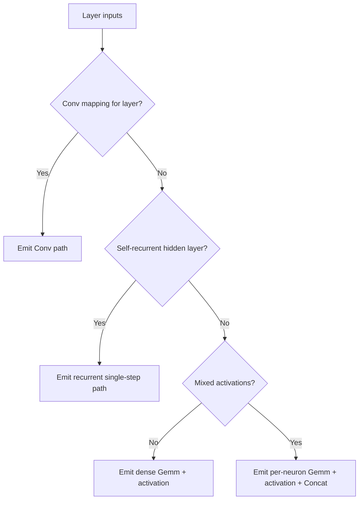

# architecture/network/onnx/export/layers

Decision router for ONNX layer emission.

This boundary does not build tensors directly. Its job is to inspect one
export layer and choose the smallest valid emission strategy:
Conv when an explicit mapping is present, recurrent single-step when the
layer owns self-connections, compact dense export when activations are
homogeneous, or per-neuron decomposition when activations differ.



## architecture/network/onnx/export/layers/network.onnx.export-conv.utils.ts

### tryEmitConvLayer

```ts
tryEmitConvLayer(
  params: OnnxConvEmissionParams,
): string | undefined
```

Try to emit one layer as a Conv-shaped ONNX segment when the caller supplied
an explicit Conv mapping for that export layer.

This path reconstructs kernels from a fully connected layer by assuming the
declared Conv geometry really matches the flattened previous and current layer
widths. When that contract does not hold, the exporter logs the mismatch and
returns `undefined` so the broader layer router can fall back or fail with a
more appropriate message.

In addition to the Conv and activation nodes, this helper also owns optional
pooling, flatten-after-pooling, and the metadata hints required for import to
rebuild the same semantic interpretation.

Parameters:
- `params` - Conv emission parameters.

Returns: New output tensor name when handled, otherwise undefined.

Example:

```ts
const outputName = tryEmitConvLayer({
  model,
  options: {
    conv2dMappings: [{ layerIndex: 1, inHeight: 28, inWidth: 28, inChannels: 1, outChannels: 8, kernelSize: 3 }],
  },
  layerIndex: 1,
  previousOutputName: 'input',
  previousLayerNodes,
  currentLayerNodes,
});
```

## architecture/network/onnx/export/layers/network.onnx.export-dense.utils.ts

### emitDenseLayer

```ts
emitDenseLayer(
  params: DenseLayerParams,
): string
```

Emit the compact dense export path for a layer whose neurons all share the
same activation.

This is the cheapest ONNX shape the exporter can produce for a standard MLP
layer: one Gemm node for the affine transform and one activation node for the
whole layer. The same helper also preserves the library's legacy node-ordering
compatibility mode when older snapshots need deterministic graph ordering.

Parameters:
- `params` - Dense emission parameters.

Returns: Output tensor name.

Example:

```ts
const outputName = emitDenseLayer({
  model,
  layerIndex: 2,
  previousOutputName: 'Layer_1',
  previousLayerNodes,
  currentLayerNodes,
  options: {},
  legacyNodeOrdering: false,
});
```

### emitPerNeuronLayer

```ts
emitPerNeuronLayer(
  params: PerNeuronLayerParams,
): string
```

Emit the fallback dense-family representation for a layer whose target
neurons use different activations.

Instead of pretending the layer is homogeneous, this path exports one tiny
Gemm-plus-activation subgraph per neuron and then concatenates the results.
The graph is larger, but it preserves mixed activation behavior that a single
layer-wide activation node cannot express.

Parameters:
- `params` - Per-neuron emission parameters.

Returns: Output tensor name.

Example:

```ts
const outputName = emitPerNeuronLayer({
  model,
  layerIndex: 2,
  previousOutputName: 'Layer_1',
  previousLayerNodes,
  currentLayerNodes,
  options: { allowMixedActivations: true },
});
```

### emitDenseInitializers

```ts
emitDenseInitializers(
  layerContext: DenseLayerContext,
): DenseTensorNames
```

Emit dense initializers and return tensor names.

Parameters:
- `layerContext` - Dense layer context.

Returns: Tensor names.

### collectDenseInitializerValues

```ts
collectDenseInitializerValues(
  layerContext: DenseLayerContext,
): DenseInitializerValues
```

Collect dense weight matrix and bias vector values.

Parameters:
- `layerContext` - Dense layer context.

Returns: Dense initializer values.

### createDenseTensorNames

```ts
createDenseTensorNames(
  layerIndex: number,
): DenseTensorNames
```

Build dense tensor names for initializer emission.

Parameters:
- `layerIndex` - Layer index.

Returns: Dense tensor names.

### appendDenseWeightInitializer

```ts
appendDenseWeightInitializer(
  layerContext: DenseLayerContext,
  weightTensorName: string,
  weightMatrixValues: number[],
): void
```

Append dense weight initializer.

Parameters:
- `layerContext` - Dense layer context.
- `weightTensorName` - Weight tensor name.
- `weightMatrixValues` - Weight values.

Returns: Nothing.

### appendDenseBiasInitializer

```ts
appendDenseBiasInitializer(
  layerContext: DenseLayerContext,
  biasTensorName: string,
  biasVector: number[],
): void
```

Append dense bias initializer.

Parameters:
- `layerContext` - Dense layer context.
- `biasTensorName` - Bias tensor name.
- `biasVector` - Bias vector values.

Returns: Nothing.

### emitDenseActivationSubgraph

```ts
emitDenseActivationSubgraph(
  model: OnnxModel,
  denseActivationContext: DenseActivationContext,
): void
```

Emit Gemm and activation nodes using requested ordering.

Parameters:
- `model` - Target ONNX model.
- `denseActivationContext` - Dense activation context.

Returns: Nothing.

### resolveDenseNodeOrder

```ts
resolveDenseNodeOrder(
  gemmNode: DenseGemmNodePayload,
  activationNode: DenseActivationNodePayload,
  legacyNodeOrdering: boolean,
): DenseOrderedNodePayload[]
```

Resolve dense node order for legacy and current exports.

Parameters:
- `gemmNode` - Gemm node.
- `activationNode` - Activation node.
- `legacyNodeOrdering` - Whether legacy ordering is required.

Returns: Ordered node list.

### appendDenseNodes

```ts
appendDenseNodes(
  model: OnnxModel,
  orderedNodes: DenseOrderedNodePayload[],
): void
```

Append ordered dense nodes to the model graph.

Parameters:
- `model` - Target model.
- `orderedNodes` - Ordered dense nodes.

Returns: Nothing.

### createGemmNode

```ts
createGemmNode(
  denseActivationContext: DenseActivationContext,
): DenseGemmNodePayload
```

Create dense Gemm node definition.

Parameters:
- `denseActivationContext` - Dense activation context.

Returns: ONNX Gemm node payload.

### createActivationNode

```ts
createActivationNode(
  denseActivationContext: DenseActivationContext,
): DenseActivationNodePayload
```

Create dense activation node definition.

Parameters:
- `denseActivationContext` - Dense activation context.

Returns: ONNX activation node payload.

### emitPerNeuronSubgraph

```ts
emitPerNeuronSubgraph(
  perNeuronSubgraphContext: PerNeuronSubgraphContext,
): string
```

Emit per-neuron Gemm + activation subgraph.

Parameters:
- `perNeuronSubgraphContext` - Per-neuron subgraph context.

Returns: Per-neuron activation output name.

### buildSingleNeuronWeightRow

```ts
buildSingleNeuronWeightRow(
  targetNodeInternal: NodeInternals,
  previousLayerNodes: default[],
): number[]
```

Build one neuron's incoming weight row against previous layer.

Parameters:
- `targetNodeInternal` - Target node internals.
- `previousLayerNodes` - Previous layer nodes.

Returns: Weight row values.

### resolveSingleNeuronInboundWeight

```ts
resolveSingleNeuronInboundWeight(
  targetNodeInternal: NodeInternals,
  sourceNode: default,
): number
```

Resolve one inbound connection weight for a source node.

Parameters:
- `targetNodeInternal` - Target node internals.
- `sourceNode` - Source node.

Returns: Inbound weight or zero when missing.

### createSharedGemmNodePayload

```ts
createSharedGemmNodePayload(
  params: SharedGemmNodeBuildParams,
): DenseGemmNodePayload
```

Build a shared Gemm node payload.

Parameters:
- `params` - Shared Gemm build parameters.

Returns: Gemm node payload.

### createSharedActivationNodePayload

```ts
createSharedActivationNodePayload(
  params: SharedActivationNodeBuildParams,
): DenseActivationNodePayload
```

Build a shared activation node payload.

Parameters:
- `params` - Shared activation build parameters.

Returns: Activation node payload.

### createDefaultGemmAttributes

```ts
createDefaultGemmAttributes(): { name: string; type: string; f?: number | undefined; i?: number | undefined; }[]
```

Build default Gemm attributes for ONNX export.

Returns: Default Gemm attribute list.

### emitOptionalLayerOutput

```ts
emitOptionalLayerOutput(
  params: OptionalLayerOutputParams,
): string
```

Emit optional pooling and flatten output fold.

Parameters:
- `params` - Optional output parameters.

Returns: Output tensor name.

## architecture/network/onnx/export/layers/network.onnx.export-recurrent.utils.ts

### emitRecurrentLayer

```ts
emitRecurrentLayer(
  params: RecurrentLayerEmissionParams,
): string
```

Emit the constrained recurrent single-step export path for one hidden layer.

This boundary models recurrence with two parallel Gemm branches:
one for the feed-forward input and one for the previous hidden state. The
recurrent branch uses a diagonal matrix derived from self-connections only,
which keeps the exported shape simple and matches the importer's current
reconstruction contract.

Hidden-state inputs are named `hidden_prev` for the first recurrent layer and
`hidden_prev_l{n}` for later recurrent layers. Mixed activations are not
supported on this path because the single activation node is applied after
the input and recurrent branches are summed.

Parameters:
- `params` - Recurrent emission parameters.

Returns: Output tensor name.

Example:

```ts
const outputName = emitRecurrentLayer({
  model,
  layerIndex: 1,
  previousOutputName: 'input',
  previousLayerNodes,
  currentLayerNodes,
});
```

### buildRecurrentLayerEmissionContext

```ts
buildRecurrentLayerEmissionContext(
  params: RecurrentLayerEmissionParams,
): RecurrentLayerEmissionContext
```

Build derived recurrent-layer context from input params.

Parameters:
- `params` - User-provided recurrent layer params.

Returns: Derived context with cached dimensions and layer slot.

### buildRecurrentInitializerNames

```ts
buildRecurrentInitializerNames(
  context: RecurrentLayerEmissionContext,
): RecurrentInitializerNames
```

Build deterministic tensor names for recurrent initializer emission.

Parameters:
- `context` - Recurrent layer execution context.

Returns: Tensor-name group for initializer emission.

### buildRecurrentGraphNames

```ts
buildRecurrentGraphNames(
  context: RecurrentLayerEmissionContext,
): RecurrentGraphNames
```

Build deterministic graph names for recurrent-node emission.

Parameters:
- `context` - Recurrent layer execution context.

Returns: Graph-name group for branch and activation nodes.

### collectRecurrentInitializerValues

```ts
collectRecurrentInitializerValues(
  context: RecurrentLayerEmissionContext,
): RecurrentInitializerValues
```

Collect recurrent initializer vectors for one layer.

Parameters:
- `context` - Recurrent layer execution context.

Returns: Dense and recurrent initializer vectors.

### emitRecurrentInitializers

```ts
emitRecurrentInitializers(
  context: RecurrentInitializerEmissionContext,
): void
```

Emit dense and recurrent initializer tensors.

Parameters:
- `context` - Initializer emission context.

Returns: Nothing.

### buildInputBranchGemmEmissionContext

```ts
buildInputBranchGemmEmissionContext(
  context: RecurrentLayerEmissionContext,
  initializerNames: RecurrentInitializerNames,
  graphNames: RecurrentGraphNames,
): RecurrentGemmEmissionContext
```

Build Gemm emission context for the feed-forward branch.

Parameters:
- `context` - Recurrent layer execution context.
- `initializerNames` - Recurrent initializer names.
- `graphNames` - Recurrent graph names.

Returns: Gemm emission context.

### buildRecurrentBranchGemmEmissionContext

```ts
buildRecurrentBranchGemmEmissionContext(
  context: RecurrentLayerEmissionContext,
  initializerNames: RecurrentInitializerNames,
  graphNames: RecurrentGraphNames,
): RecurrentGemmEmissionContext
```

Build Gemm emission context for the recurrent hidden-state branch.

Parameters:
- `context` - Recurrent layer execution context.
- `initializerNames` - Recurrent initializer names.
- `graphNames` - Recurrent graph names.

Returns: Gemm emission context.

### resolvePreviousHiddenInputName

```ts
resolvePreviousHiddenInputName(
  layerIndex: number,
): string
```

Resolve recurrent branch hidden-state input for one layer.

Parameters:
- `layerIndex` - Current recurrent layer index.

Returns: Hidden-state tensor input name.

### emitRecurrentGemmNode

```ts
emitRecurrentGemmNode(
  context: RecurrentGemmEmissionContext,
): void
```

Emit one recurrent Gemm node with shared ONNX attributes.

Parameters:
- `context` - Gemm emission context.

Returns: Nothing.

### emitRecurrentAddNode

```ts
emitRecurrentAddNode(
  model: OnnxModel,
  graphNames: RecurrentGraphNames,
): void
```

Emit Add node that fuses feed-forward and recurrent branch outputs.

Parameters:
- `model` - Target ONNX model.
- `graphNames` - Deterministic graph names for this layer.

Returns: Nothing.

### emitRecurrentActivationNode

```ts
emitRecurrentActivationNode(
  context: RecurrentActivationEmissionContext,
): void
```

Emit activation node for recurrent branch sum output.

Parameters:
- `context` - Activation emission context.

Returns: Nothing.

### resolveRecurrentActivationType

```ts
resolveRecurrentActivationType(
  currentLayerNodes: default[],
): string
```

Resolve ONNX activation type from first node in recurrent layer.

Parameters:
- `currentLayerNodes` - Current recurrent layer nodes.

Returns: ONNX activation op type.

### readNodeInternals

```ts
readNodeInternals(
  node: default,
): NodeInternals
```

Normalize runtime node shape to recurrent-export internals contract.

Parameters:
- `node` - Runtime node instance.

Returns: Node internals used by ONNX emission helpers.

### buildDefaultGemmAttributes

```ts
buildDefaultGemmAttributes(): { name: string; type: string; f?: number | undefined; i?: number | undefined; }[]
```

Build the shared attribute list for ONNX Gemm node payloads.

Returns: Gemm attribute payload list.

## architecture/network/onnx/export/layers/network.onnx.export-layer-graph.utils.ts

### emitLayerGraph

```ts
emitLayerGraph(
  context: LayerBuildContext,
): string
```

Emit one export layer graph segment by routing the layer through the correct
ONNX emission strategy.

Dispatch order matters:
- explicit Conv mappings win first,
- recurrent single-step export is considered only for hidden layers with
  self-connections,
- non-recurrent layers fall back to compact dense emission or mixed-activation
  per-neuron decomposition.

Important invariants:
- recurrent mixed activations are rejected elsewhere rather than silently
  decomposed here,
- `allowMixedActivations` only affects the dense-family fallback path,
- the returned tensor name is the canonical input for the next layer.

Parameters:
- `context` - Layer build context.

Returns: Output tensor name produced by this layer.

Example:

```ts
const outputName = emitLayerGraph({
  model,
  layers,
  layerIndex: 2,
  previousOutputName: 'Layer_1',
  options: { allowMixedActivations: true },
  recurrentLayerIndices: [],
  batchDimension: false,
  legacyNodeOrdering: false,
});
```

## architecture/network/onnx/export/layers/network.onnx.export-layer-common.utils.ts

### buildDenseWeightsAndBiases

```ts
buildDenseWeightsAndBiases(
  previousLayerNodes: default[],
  currentLayerNodes: default[],
): DenseWeightBuildResult
```

Build the shared dense initializer payload used by both compact dense export
and recurrent single-step export.

The returned weight matrix is flattened in row-major order by destination
neuron. Missing edges are encoded as zeroes so partially connected layers can
still be represented in a deterministic rectangular tensor layout.
Biases are collected in the same destination-neuron order.

Parameters:
- `previousLayerNodes` - Source layer nodes.
- `currentLayerNodes` - Destination layer nodes.

Returns: Flattened row-major weight matrix and bias vector.

Example:

```ts
const { weightMatrixValues, biasVector } = buildDenseWeightsAndBiases(
  previousLayerNodes,
  currentLayerNodes,
);
```

### buildDiagonalRecurrentWeights

```ts
buildDiagonalRecurrentWeights(
  currentLayerNodes: default[],
): number[]
```

Build a diagonal recurrent matrix from self-connections.

Parameters:
- `currentLayerNodes` - Layer nodes.

Returns: Flattened row-major recurrent matrix.

### emitOptionalPoolingAndFlatten

```ts
emitOptionalPoolingAndFlatten(
  params: OptionalPoolingAndFlattenParams,
): string
```

Emit optional pooling and flatten nodes after a layer output.

Parameters:
- `params` - Pooling parameters.

Returns: Final output tensor name after optional pooling/flatten.

### appendIndexedMetadata

```ts
appendIndexedMetadata(
  model: OnnxModel,
  key: string,
  layerIndex: number,
): void
```

Append an integer index to JSON-array metadata key.

Parameters:
- `model` - Target model.
- `key` - Metadata key.
- `layerIndex` - Layer index to append.

Returns: Nothing.

### appendMetadataSpec

```ts
appendMetadataSpec(
  model: OnnxModel,
  key: string,
  spec: Conv2DMapping | Pool2DMapping,
): void
```

Append a JSON object to JSON-array metadata key.

Parameters:
- `model` - Target model.
- `key` - Metadata key.
- `spec` - Metadata object.

Returns: Nothing.

### collectDenseRows

```ts
collectDenseRows(
  context: DenseWeightBuildContext,
): DenseWeightRow[]
```

Collect dense rows for each target node in current layer.

Parameters:
- `context` - Dense row collection context.

Returns: Dense rows containing per-target weights and bias.

### foldDenseRowsToInitializers

```ts
foldDenseRowsToInitializers(
  denseRows: DenseWeightRow[],
): DenseWeightBuildResult
```

Fold dense rows into flattened ONNX initializer arrays.

Parameters:
- `denseRows` - Dense rows.

Returns: Flattened dense initializer result.

### collectDenseRowWeights

```ts
collectDenseRowWeights(
  context: DenseWeightRowCollectionContext,
): number[]
```

Collect source-to-target weights for one dense row.

Parameters:
- `context` - Dense row collection context.

Returns: Row weights in source-node order.

### resolveInboundWeight

```ts
resolveInboundWeight(
  targetNodeInternal: NodeInternals,
  sourceNode: default,
): number
```

Resolve source-to-target inbound connection weight.

Parameters:
- `targetNodeInternal` - Target node internals.
- `sourceNode` - Source node.

Returns: Inbound weight or zero for disconnected edges.

### asNodeInternals

```ts
asNodeInternals(
  node: default,
): NodeInternals
```

Normalize a public node instance into ONNX export internals.

Parameters:
- `node` - Source node.

Returns: Internal runtime-facing node representation.

### collectRecurrentRows

```ts
collectRecurrentRows(
  context: DiagonalRecurrentBuildContext,
): number[][]
```

Collect recurrent matrix rows for one layer.

Parameters:
- `context` - Recurrent matrix build context.

Returns: Recurrent row collection.

### collectRecurrentRow

```ts
collectRecurrentRow(
  context: RecurrentRowCollectionContext,
): number[]
```

Collect one recurrent matrix row.

Parameters:
- `context` - Row collection context.

Returns: Recurrent row values.

### resolveDiagonalRecurrentWeight

```ts
resolveDiagonalRecurrentWeight(
  context: RecurrentRowCollectionContext,
  columnIndex: number,
): number
```

Resolve recurrent weight value for one matrix coordinate.

Parameters:
- `context` - Row collection context.
- `columnIndex` - Column index in row.

Returns: Recurrent weight for diagonal entries, otherwise zero.

### toPoolingEmissionContext

```ts
toPoolingEmissionContext(
  params: OptionalPoolingAndFlattenParams,
): PoolingEmissionContext
```

Resolve pooling emission context from optional pooling parameters.

Parameters:
- `params` - Optional pooling and flatten parameters.

Returns: Pooling emission context.

### emitPoolingNode

```ts
emitPoolingNode(
  context: PoolingEmissionContext,
): string
```

Emit one pooling node and return its output tensor name.

Parameters:
- `context` - Pooling emission context.

Returns: Pooling output tensor name.

### collectPoolingAttributes

```ts
collectPoolingAttributes(
  poolSpec: Pool2DMapping,
): PoolingAttributes
```

Collect ONNX pooling attributes from one pooling spec.

Parameters:
- `poolSpec` - Pooling spec.

Returns: Pooling attributes for ONNX node payload.

### emitOptionalFlattenAfterPooling

```ts
emitOptionalFlattenAfterPooling(
  context: FlattenAfterPoolingContext,
): string
```

Conditionally emit flatten node after pooling.

Parameters:
- `context` - Flatten emission context.

Returns: Output tensor name after optional flatten.

### appendPoolingMetadata

```ts
appendPoolingMetadata(
  context: PoolingEmissionContext,
): void
```

Append pooling metadata for one emitted pooling layer.

Parameters:
- `context` - Pooling emission context.

Returns: Nothing.

### ensureMetadataRegistry

```ts
ensureMetadataRegistry(
  model: OnnxModel,
): OnnxMetadataProperty[]
```

Ensure model metadata registry exists.

Parameters:
- `model` - Target model.

Returns: Mutable metadata registry.

### findMetadataProperty

```ts
findMetadataProperty(
  metadataRegistry: OnnxMetadataProperty[],
  key: string,
): OnnxMetadataProperty | undefined
```

Find a metadata property by key.

Parameters:
- `metadataRegistry` - Metadata registry.
- `key` - Metadata key.

Returns: Matching metadata property if present.

### buildIndexedMetadataProperty

```ts
buildIndexedMetadataProperty(
  key: string,
  layerIndex: number,
): OnnxMetadataProperty
```

Build a new index-array metadata property.

Parameters:
- `key` - Metadata key.
- `layerIndex` - Layer index.

Returns: Metadata property.

### buildSpecMetadataProperty

```ts
buildSpecMetadataProperty(
  key: string,
  spec: Conv2DMapping | Pool2DMapping,
): OnnxMetadataProperty
```

Build a new spec-array metadata property.

Parameters:
- `key` - Metadata key.
- `spec` - Mapping spec.

Returns: Metadata property.

### serializeIndexedMetadataValue

```ts
serializeIndexedMetadataValue(
  currentValue: string,
  layerIndex: number,
): string
```

Serialize index metadata after appending one unique index.

Parameters:
- `currentValue` - Existing JSON value.
- `layerIndex` - Layer index.

Returns: Serialized JSON value.

### serializeSpecMetadataValue

```ts
serializeSpecMetadataValue(
  currentValue: string,
  spec: Conv2DMapping | Pool2DMapping,
): string
```

Serialize spec metadata after appending one spec object.

Parameters:
- `currentValue` - Existing JSON value.
- `spec` - Mapping spec.

Returns: Serialized JSON value.

### parseMetadataArray

```ts
parseMetadataArray(
  metadataValue: string,
): ItemType[] | undefined
```

Parse a metadata JSON array value safely.

Parameters:
- `metadataValue` - Metadata JSON string.

Returns: Parsed array when valid, otherwise undefined.
