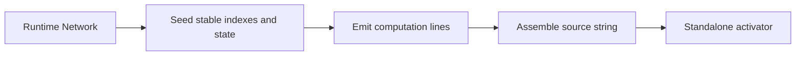

# architecture/network/standalone

Standalone code-generation boundary for turning a live `Network` into a
self-contained inference function.

This chapter exists for the moment when the graph has finished evolving or
training and the next question is no longer "how do I mutate it?" but "how
do I ship or inspect its forward pass without the whole runtime?" The
standalone generator answers by snapshotting node state, connection order,
gating terms, and activation functions into a plain JavaScript source string
that can be persisted, reviewed, or evaluated elsewhere.

The folder is intentionally split like a miniature compiler pipeline.
`setup` validates the network and seeds stable indexes, `graph` and `loop`
collect the execution lines, `activation` and `coverage` normalize emitted
function bodies, and `finalize` folds everything into the finished source
string. That keeps the README focused on the transformation stages instead
of a flat shelf of string helpers.



The important constraint is scope. The generated artifact is for forward
inference only. It keeps fixed weights, gating, and simple recurrent
self-connections, but it intentionally omits training-time randomness,
backpropagation, and any runtime machinery that requires the full library
around it.

Example: emit a portable source string and persist it with the rest of a
model package.

```ts
const source = network.standalone();
console.log(source.slice(0, 120));
```

Example: evaluate the emitted source in a sandbox and compare inference
results against the original runtime.

```ts
const source = network.standalone();
const activate = new Function(`return ${source}`)() as (
  input: number[],
) => number[];
const outputValues = activate([0.2, 0.8]);
```

## architecture/network/standalone/network.standalone.utils.ts

### generateStandalone

```ts
generateStandalone(
  net: default,
): string
```

Generate a standalone JavaScript source string that returns an `activate(input:number[])` function.

Implementation Steps:
 1. Validate presence of output nodes (must produce something observable).
 2. Assign stable sequential indices to nodes (used as array offsets in generated code).
 3. Collect initial activation/state values into typed array initializers for warm starting.
 4. For each non-input node, build a line computing S[i] (pre-activation sum with bias) and A[i]
    (post-activation output). Gating multiplies activation by gate activations; self-connection adds
    recurrent term S[i] * weight before activation.
 5. De-duplicate activation functions: each unique squash name is emitted once; references become
    indices into array F of function references for compactness.
 6. Emit an IIFE producing the activate function with internal arrays A (activations) and S (states).

Parameters:
- `net` - Network instance to snapshot.

Returns: Source string (ES5-compatible) – safe to eval in sandbox to obtain activate function.

## architecture/network/standalone/network.standalone.utils.setup.ts

### asStandaloneProps

```ts
asStandaloneProps(
  net: default,
): NetworkStandaloneProps
```

Cast a network instance to the internal standalone generation view.

Parameters:
- `net` - Network instance to cast.

Returns: Internal network properties used by the standalone generator.

### createGenerationContext

```ts
createGenerationContext(
  standaloneProps: NetworkStandaloneProps,
): StandaloneGenerationContext
```

Create a fresh generation context used across orchestration steps.

Parameters:
- `standaloneProps` - Internal standalone network view.

Returns: Initialized generation context.

### ensureOutputNodesExist

```ts
ensureOutputNodesExist(
  standaloneProps: NetworkStandaloneProps,
): void
```

Validate that the network has at least one output node.

Parameters:
- `standaloneProps` - Internal standalone network view.

Returns: Void.

### resolveInputNodeIndexes

```ts
resolveInputNodeIndexes(
  network: default,
): number[]
```

Resolve input-node indexes in public input-vector order.

Parameters:
- `network` - Runtime network being snapshotted.

Returns: Input-node indexes used when seeding generated activation buffers.

### resolveStandaloneExecutionMetadata

```ts
resolveStandaloneExecutionMetadata(
  network: default,
  generationContext: StandaloneGenerationContext,
): void
```

Resolve standalone execution metadata from the runtime activation contract.

The standalone generator should honor the same traversal order and public
input/output role order that runtime activation uses. That matters for delay
lines such as NARX memory blocks, where raw node storage order can differ
from the dependency order used during activation.

Parameters:
- `network` - Runtime network being snapshotted.
- `generationContext` - Mutable generation context receiving index metadata.

Returns: Void.

### seedNodeIndexesAndState

```ts
seedNodeIndexesAndState(
  generationContext: StandaloneGenerationContext,
): void
```

Seed index, activation, and state arrays from network nodes.

Parameters:
- `generationContext` - Mutable generation context.

Returns: Void.

## architecture/network/standalone/network.standalone.utils.graph.ts

### appendGateMultiplier

```ts
appendGateMultiplier(
  connectionTerm: string,
  gateNode: default | null,
): string
```

Append a gate activation multiplier to a connection term when a gate exists.

Parameters:
- `connectionTerm` - Base connection term.
- `gateNode` - Optional gate node.

Returns: Term with optional gate multiplier.

### buildNodeSumExpression

```ts
buildNodeSumExpression(
  currentNode: default,
  nodeTraversalIndex: number,
): string
```

Build the pre-activation sum expression for one node.

Parameters:
- `currentNode` - Current node.
- `nodeTraversalIndex` - Node index.

Returns: String expression used for generated `S[index]` assignment.

### collectIncomingTerms

```ts
collectIncomingTerms(
  currentNode: default,
): string[]
```

Collect feed-forward inbound connection terms for a node.

Parameters:
- `currentNode` - Current node.

Returns: Weighted term expressions.

### collectOutputIndexes

```ts
collectOutputIndexes(
  generationContext: StandaloneGenerationContext,
): number[]
```

Collect output node indexes from the output tail segment.

Parameters:
- `generationContext` - Mutable generation context.

Returns: Output indexes used for result array emission.

### collectSelfConnectionTerms

```ts
collectSelfConnectionTerms(
  currentNode: default,
  nodeTraversalIndex: number,
): string[]
```

Collect recurrent self-connection term for a node when present.

Parameters:
- `currentNode` - Current node.
- `nodeTraversalIndex` - Node index used for self-state reference.

Returns: Zero or one recurrent term expressions.

### foldTermsIntoExpression

```ts
foldTermsIntoExpression(
  allTerms: string[],
): string
```

Fold a term collection into a summation expression.

Parameters:
- `allTerms` - Term collection.

Returns: Summation expression or fallback zero literal.

### formatOutputArrayValues

```ts
formatOutputArrayValues(
  outputIndexes: number[],
): string
```

Format output activation selectors for generated return expression.

Parameters:
- `outputIndexes` - Output node indexes.

Returns: Comma-separated `A[index]` selector list.

### getOptionalNodeIndex

```ts
getOptionalNodeIndex(
  nodeReference: default | null,
): number | undefined
```

Resolve optional generated node index from a node reference.

Parameters:
- `nodeReference` - Optional node reference.

Returns: Node index when available.

### mergeTermCollections

```ts
mergeTermCollections(
  firstTerms: string[],
  secondTerms: string[],
): string[]
```

Merge two term lists into a single ordered list.

Parameters:
- `firstTerms` - First term collection.
- `secondTerms` - Second term collection.

Returns: Combined term collection.

## architecture/network/standalone/network.standalone.utils.loop.ts

### appendActivationLine

```ts
appendActivationLine(
  generationContext: StandaloneGenerationContext,
  nodeTraversalIndex: number,
  activationFunctionIndex: number,
  maskValue: number,
): void
```

Append generated activation assignment line for one node.

Parameters:
- `generationContext` - Mutable generation context.
- `nodeTraversalIndex` - Node index.
- `activationFunctionIndex` - Function table index.
- `maskValue` - Multiplicative mask.

Returns: Void.

### appendAllNodeComputationLines

```ts
appendAllNodeComputationLines(
  generationContext: StandaloneGenerationContext,
): void
```

Append compute lines for all non-input nodes.

Parameters:
- `generationContext` - Mutable generation context.

Returns: Void.

### appendInputSeedLine

```ts
appendInputSeedLine(
  generationContext: StandaloneGenerationContext,
): void
```

Append the generated input-copy loop to the standalone body.

Parameters:
- `generationContext` - Mutable generation context.

Returns: Void.

### appendOutputReturnLine

```ts
appendOutputReturnLine(
  generationContext: StandaloneGenerationContext,
  outputIndexes: number[],
): void
```

Append generated return line for output activations.

Parameters:
- `generationContext` - Mutable generation context.
- `outputIndexes` - Output node indexes.

Returns: Void.

### appendSingleNodeComputationLines

```ts
appendSingleNodeComputationLines(
  generationContext: StandaloneGenerationContext,
  nodeTraversalIndex: number,
): void
```

Append state and activation lines for one node.

Parameters:
- `generationContext` - Mutable generation context.
- `nodeTraversalIndex` - Node index currently being emitted.

Returns: Void.

### appendStateLine

```ts
appendStateLine(
  generationContext: StandaloneGenerationContext,
  nodeTraversalIndex: number,
  sumExpression: string,
  biasValue: number,
): void
```

Append generated state assignment line for one node.

Parameters:
- `generationContext` - Mutable generation context.
- `nodeTraversalIndex` - Node index.
- `sumExpression` - Generated sum expression.
- `biasValue` - Node bias.

Returns: Void.

### buildMaskSuffix

```ts
buildMaskSuffix(
  maskValue: number,
): string
```

Build optional activation mask suffix for generated assignment line.

Parameters:
- `maskValue` - Multiplicative mask value.

Returns: Empty suffix for identity, otherwise multiplicative fragment.

## architecture/network/standalone/network.standalone.utils.activation.ts

### convertArrowToNamedFunction

```ts
convertArrowToNamedFunction(
  sourceCode: string,
  squashName: string,
): string
```

Convert an arrow-function source string into a named function declaration source.

Parameters:
- `sourceCode` - Arrow-function source.
- `squashName` - Required function name.

Returns: Named function source.

### ensureActivationFunctionIndex

```ts
ensureActivationFunctionIndex(
  generationContext: StandaloneGenerationContext,
  squashName: string,
  squashFunction: StandaloneSquashFunction,
  nodeTraversalIndex: number,
): number
```

Ensure an activation function is registered and return its table index.

Parameters:
- `generationContext` - Mutable generation context.
- `squashName` - Activation function name.
- `squashFunction` - Activation function implementation.
- `nodeTraversalIndex` - Current node index for fallback naming.

Returns: Activation function index within generated `F` array.

### ensureNamedFunctionSource

```ts
ensureNamedFunctionSource(
  sourceCode: string,
  squashName: string,
): string
```

Ensure generated function source starts with the required named signature.

Parameters:
- `sourceCode` - Function source.
- `squashName` - Required function name.

Returns: Named function source.

### normalizeArrowBody

```ts
normalizeArrowBody(
  bodySegment: string,
): string
```

Normalize arrow body into a function-body block.

Parameters:
- `bodySegment` - Raw arrow body segment.

Returns: Function body block string.

### normalizeArrowParameters

```ts
normalizeArrowParameters(
  parameterSegment: string,
): string
```

Normalize arrow parameter segment into comma-separated parameter list content.

Parameters:
- `parameterSegment` - Raw arrow parameter segment.

Returns: Parameter list body (without surrounding parentheses).

### normalizeBuiltinSource

```ts
normalizeBuiltinSource(
  sourceCode: string,
  squashName: string,
): string
```

Normalize built-in activation source to a named function and strip coverage artifacts.

Parameters:
- `sourceCode` - Built-in function source.
- `squashName` - Required function name.

Returns: Cleaned named function source.

### normalizeCustomSource

```ts
normalizeCustomSource(
  sourceCode: string,
  squashName: string,
  nodeTraversalIndex: number,
): string
```

Normalize custom activation source with function/arrow/fallback handling.

Parameters:
- `sourceCode` - Custom function source.
- `squashName` - Required function name.
- `nodeTraversalIndex` - Current node index for traversal-context parity.

Returns: Cleaned named function source.

### registerActivationFunction

```ts
registerActivationFunction(
  generationContext: StandaloneGenerationContext,
  squashName: string,
  functionSource: string,
): void
```

Register a function source and allocate its numeric index.

Parameters:
- `generationContext` - Mutable generation context.
- `squashName` - Activation function name.
- `functionSource` - Named function source to store.

Returns: Void.

### resolveActivationFunctionSource

```ts
resolveActivationFunctionSource(
  squashName: string,
  squashFunction: StandaloneSquashFunction,
  nodeTraversalIndex: number,
): string
```

Resolve emitted source for built-in or custom activation functions.

Parameters:
- `squashName` - Activation function name.
- `squashFunction` - Activation function implementation.
- `nodeTraversalIndex` - Current node index for fallback flow.

Returns: Named function source string.

### resolveBuiltinActivationSource

```ts
resolveBuiltinActivationSource(
  squashName: string,
): string | undefined
```

Resolve built-in activation snippets for both canonical and exported helper names.

Parameters:
- `squashName` - Activation function name.

Returns: Built-in activation source when known.

### resolveSquashName

```ts
resolveSquashName(
  currentNode: default,
  nodeTraversalIndex: number,
): string
```

Resolve a stable activation function name for emission.

Parameters:
- `currentNode` - Current node.
- `nodeTraversalIndex` - Node index for anonymous-name fallback.

Returns: Activation function identifier.

## architecture/network/standalone/network.standalone.utils.coverage.ts

### stripCoverage

```ts
stripCoverage(
  code: string,
): string
```

Remove instrumentation artifacts and formatting detritus from function sources.

Parameters:
- `code` - Source text potentially containing coverage wrappers.

Returns: Cleaned source text suitable for deterministic standalone emission.

## architecture/network/standalone/network.standalone.utils.finalize.ts

### assembleStandaloneSource

```ts
assembleStandaloneSource(
  generationContext: StandaloneGenerationContext,
): string
```

Assemble the final standalone IIFE source string.

Parameters:
- `generationContext` - Mutable generation context.

Returns: Final generated source string.

### buildActivationArrayLiteral

```ts
buildActivationArrayLiteral(
  generationContext: StandaloneGenerationContext,
): string
```

Build deterministic activation function array literal by function index ordering.

Parameters:
- `generationContext` - Mutable generation context.

Returns: Comma-separated activation function names.

### buildInputGuardLine

```ts
buildInputGuardLine(
  expectedInputSize: number,
): string
```

Build generated input length guard line.

Parameters:
- `expectedInputSize` - Required input vector size.

Returns: Guard statement line including trailing newline.

### resolveActivationArrayType

```ts
resolveActivationArrayType(
  generationContext: StandaloneGenerationContext,
): string
```

Resolve typed-array constructor name based on configured activation precision.

Parameters:
- `generationContext` - Mutable generation context.

Returns: Constructor name used in generated source.

## architecture/network/standalone/network.standalone.utils.types.ts

Output node discriminator used for standalone precondition checks.

### ACTIVATION_PRECISION_F32

Precision token selecting Float32 activation/state buffers.

### ARROW_TOKEN

Arrow token used during function-source normalization.

### BUILTIN_ACTIVATION_SNIPPETS

Built-in activation snippets emitted as named JavaScript function declarations.

Values are intentionally compact so emitted standalone source remains deterministic and small.

### COVERAGE_CALL_REGEX

Regex stripping Istanbul function invocations from source snippets.

### COVERAGE_COUNTER_REGEX

Regex stripping Istanbul counters from stringified functions.

### COVERAGE_REPLACEMENT

Empty replacement used while stripping coverage artifacts.

### EMPTY_TOKEN_REGEX

Regex removing empty punctuation-only token lines.

### FALLBACK_IDENTITY_BODY

Identity-function fallback body for invalid custom squash sources.

### FLOAT32_ARRAY_TYPE

Typed-array constructor names used in generated source.

### FLOAT64_ARRAY_TYPE

Typed-array constructor names used in generated source.

### FUNCTION_PREFIX

Prefix token used when normalizing function sources.

### INPUT_LOOP_LINE

Generated source line for copying external inputs into activation buffer.

### INVALID_INPUT_SIZE_ERROR_MIDDLE

Input-size validation message fragments for generated activate guards.

### INVALID_INPUT_SIZE_ERROR_PREFIX

Input-size validation message fragments for generated activate guards.

### ISTANBUL_IGNORE_BLOCK_REGEX

Regex stripping Istanbul ignore blocks from stringified functions.

### MASK_MULTIPLIER_IDENTITY

Multiplicative identity used to omit redundant mask expressions.

### NO_OUTPUT_NODES_ERROR

Error message when attempting standalone generation without outputs.

### OUTPUT_NODE_TYPE

Output node discriminator used for standalone precondition checks.

### REPEATED_SEMICOLON_REGEX

Regex collapsing repeated semicolons.

### SINGLE_TERM_FALLBACK

Fallback literal used when a node has no incoming terms.

### SOLITARY_SEMICOLON_REGEX

Regex removing solitary semicolon lines created by instrumentation.

### SOURCE_MAP_REGEX

Regex stripping sourceMappingURL comments from generated snippets.

### StandaloneSquashFunction

```ts
StandaloneSquashFunction(
  inputValue: number,
  derivate: boolean | undefined,
): number
```

Activation function shape used by standalone source generation helpers.

### STRAY_COMMA_CLOSE_REGEX

Regex normalizing stray commas near closing parentheses.

### STRAY_COMMA_OPEN_REGEX

Regex normalizing stray commas near opening parentheses.

## architecture/network/standalone/network.standalone.errors.ts

Raised when standalone generation is requested for a network without output nodes.

### buildStandaloneInputSizeMismatchErrorFactorySource

```ts
buildStandaloneInputSizeMismatchErrorFactorySource(): string
```

Build the named-error factory source emitted into generated standalone functions.

Returns: Deterministic JavaScript source for a named input-size mismatch error factory.

### NETWORK_STANDALONE_INPUT_SIZE_MISMATCH_ERROR_NAME

Stable error name emitted into generated standalone input guards.

### NetworkStandaloneNoOutputNodesError

Raised when standalone generation is requested for a network without output nodes.
