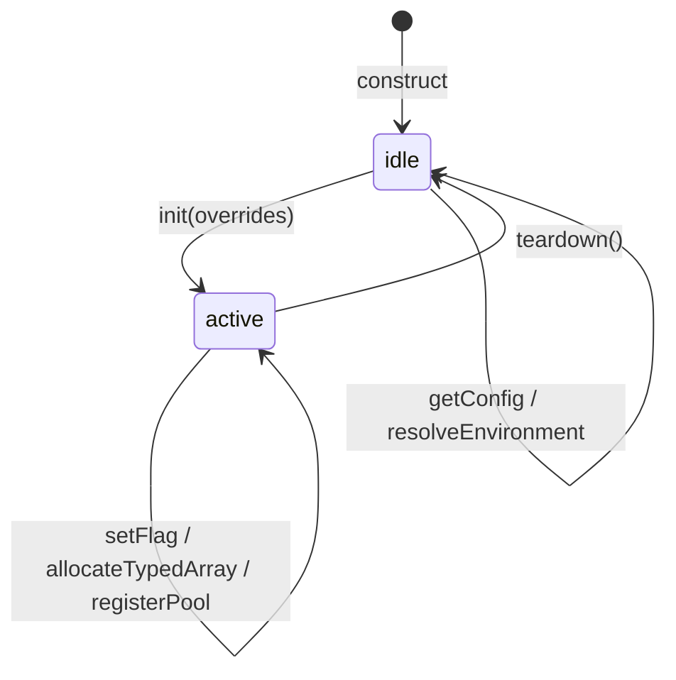

# memory

Memory manager configuration — constants, types, and registry shapes.

This module owns the stable, side-effect-free vocabulary consumed by
`MemoryManager`. Splitting config from the manager class keeps the constant
and type surface independently importable: tests, diagnostics tooling, and
worker payloads can reference `MemoryManagerFlagName` or
`MEMORY_DEFAULT_SLAB_POOL_MAX_PER_KEY` without pulling in the manager's
mutable state or constructor dependencies.

## memory/config.ts

### MEMORY_DEFAULT_ACTIVATION_POOL_PREWARM_COUNT

Default retained prewarm count for activation-pool warmup when callers leave the global memory config unset.

### MEMORY_DEFAULT_SLAB_POOL_MAX_PER_KEY

Default retained slab-buffer count per `(kind, bytes, length)` pool key.

### MEMORY_MANAGER_FLAG_NAMES

Memory-focused config flags owned by the Phase 4 manager surface.

### MEMORY_SLAB_GROWTH_FACTOR_BROWSER

Browser slab-growth factor used to trade smaller reallocations for lower retained memory pressure in constrained heaps.

### MEMORY_SLAB_GROWTH_FACTOR_NODE

Node slab-growth factor used to reduce rebuild churn on larger server heaps.

### MemoryManagerConfigSnapshot

Stable resolved configuration snapshot returned by the `MemoryManager.getConfig()` accessor method.

### MemoryManagerEnvironment

Runtime environment labels used by the manager when resolving defaults.

### MemoryManagerFlagMap

Subset of the shared config object that materially changes memory behavior.

### MemoryManagerFlagName

Narrow union of config flag names controlled exclusively by the memory manager.

### RegisteredMemoryPool

Registry shape used by the manager for resettable memory-owned pools.

## memory/manager.ts

### defaultMemoryManager

Shared singleton used by the current runtime while Phase 4 centralization is in flight.

### MemoryManager

Central memory-configuration owner for pooled and slab-backed runtime paths.

This Phase 4 foundation keeps the current global `config` object as the
source of truth while adding one focused surface for:

1. resolved memory defaults,
2. temporary override lifecycles during tests and harnesses,
3. resettable pool registration for centralized diagnostics.

**Lifecycle** — typical test or harness usage:

```ts
import { memoryManager } from './memory/memoryManager';

const snapshot = memoryManager.init({ enableSlabArrayPooling: true });
try {
  // run benchmark or test that exercises pooled paths
} finally {
  memoryManager.teardown(); // restores original config and resets pools
}
```

**State machine**:



#### allocateTypedArray

```ts
allocateTypedArray(
  kind: string,
  ctor: MemoryManagedTypedArrayConstructor,
  length: number,
  bytesPerElement: number,
): MemoryManagedTypedArray
```

Acquire one typed array using the manager-owned slab allocator state.

Parameters:
- `kind` - Stable bucket discriminator.
- `ctor` - Typed array constructor.
- `length` - Required logical length.
- `bytesPerElement` - Optional byte width override for bucket keying.

Returns: Reused or freshly allocated typed array.

#### captureFlags

```ts
captureFlags(): MemoryManagerFlagMap
```

Capture the current memory-relevant config fields for later restoration.

Returns: Baseline memory flag snapshot.

#### getConfig

```ts
getConfig(
  environment: MemoryManagerEnvironment,
): MemoryManagerConfigSnapshot
```

Resolve the active memory config for one runtime environment.

Parameters:
- `environment` - Optional explicit environment override for tests.

Returns: Stable memory-config snapshot with resolved defaults.

#### getPoolStats

```ts
getPoolStats(
  poolName: string,
): T | null
```

Read one registered pool snapshot when available.

Parameters:
- `poolName` - Stable pool key.

Returns: Pool stats or null when the pool is absent.

#### getTypedArrayAllocationStats

```ts
getTypedArrayAllocationStats(): MemoryTypedArrayAllocationStats
```

Read the current manager-owned typed-array allocator counters.

Returns: Serializable typed-array allocator snapshot.

#### init

```ts
init(
  overrides: Partial<MemoryManagerFlagMap>,
  environment: MemoryManagerEnvironment | undefined,
): MemoryManagerConfigSnapshot
```

Apply temporary overrides while preserving a baseline for teardown.

Parameters:
- `overrides` - Partial memory flag overrides.
- `environment` - Optional explicit environment override for tests.

Returns: Resolved config after overrides are applied.

#### registerPool

```ts
registerPool(
  poolName: string,
  poolProvider: RegisteredMemoryPool,
): void
```

Register a resettable pool or allocator snapshot provider.

Parameters:
- `poolName` - Stable pool key.
- `poolProvider` - Stats and reset provider.

Returns: Nothing.

#### releaseTypedArray

```ts
releaseTypedArray(
  kind: string,
  bytesPerElement: number,
  typedArray: MemoryManagedTypedArray,
): void
```

Release one typed array back to the manager-owned slab allocator.

Parameters:
- `kind` - Stable bucket discriminator.
- `bytesPerElement` - Byte width used for bucket keying.
- `typedArray` - Typed array instance to retain when capacity permits.

Returns: Nothing.

#### resetTypedArrayAllocator

```ts
resetTypedArrayAllocator(): void
```

Reset the manager-owned typed-array allocator buckets and counters.

Returns: Nothing.

#### resolveEnvironment

```ts
resolveEnvironment(): MemoryManagerEnvironment
```

Resolve the current runtime environment.

Returns: `browser` when `window` exists, else `node`.

#### resolveTypedArrayPoolCap

```ts
resolveTypedArrayPoolCap(): number
```

Resolve the non-negative per-key typed-array retention cap.

Returns: Integer retention cap for manager-owned typed-array buckets.

#### resolveTypedArrayPoolKey

```ts
resolveTypedArrayPoolKey(
  kind: string,
  bytesPerElement: number,
  length: number,
): string
```

Build the stable bucket key for one typed-array allocation class.

Parameters:
- `kind` - Stable bucket discriminator.
- `bytesPerElement` - Typed array byte width.
- `length` - Typed array logical length.

Returns: Stable key used by the manager-owned allocator.

#### setFlag

```ts
setFlag(
  flagName: K,
  nextValue: MemoryManagerFlagMap[K],
): void
```

Mutate one memory flag on the shared config object.

Parameters:
- `flagName` - Memory flag to update.
- `nextValue` - New value for the flag.

Returns: Nothing.

#### teardown

```ts
teardown(): void
```

Restore the baseline config snapshot and reset registered pools.

Returns: Nothing.
