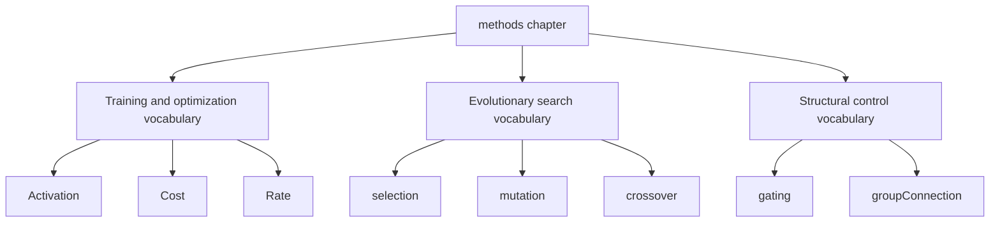
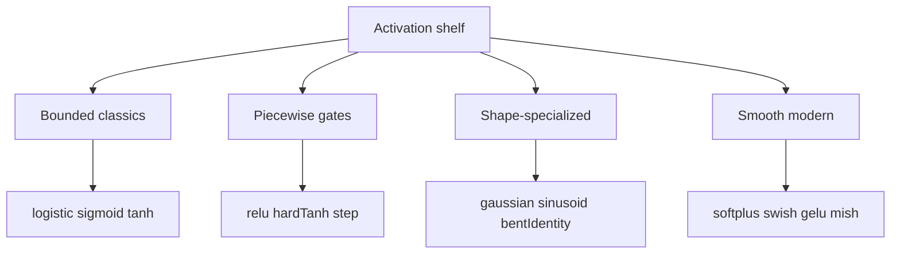
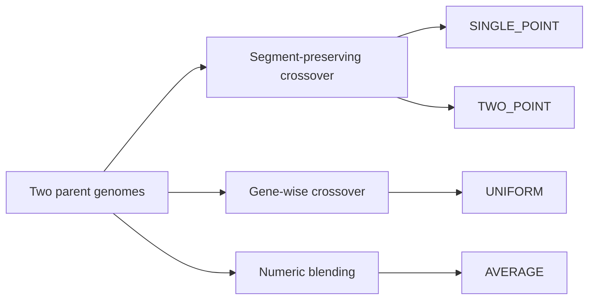
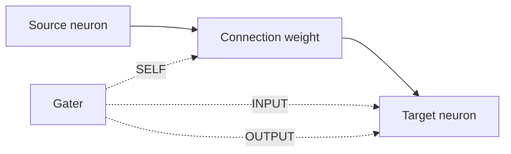
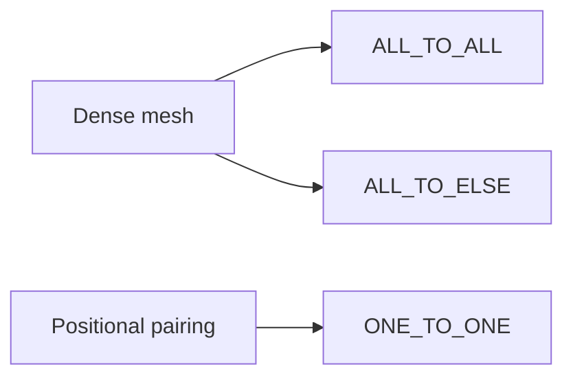
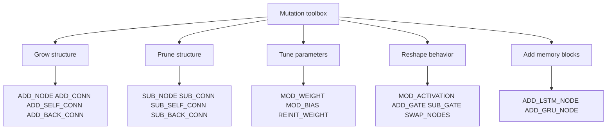
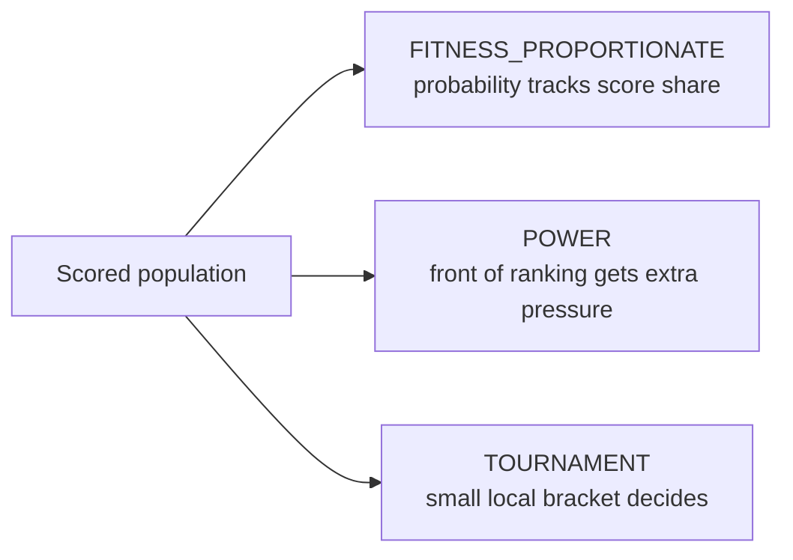

# methods

Shared method families for learning, mutation, and structural policy.

This folder is the library's reusable policy shelf. The heavier controller
chapters in `neat/` decide when to evaluate, mutate, select, or schedule a
learning rate change. The `methods/` folder defines the small vocabulary of
choices those higher-level chapters reuse.

That boundary matters because these exports are intentionally broader than a single
one subsystem:

- `Activation` shapes how nodes transform signals,
- `Cost` defines what prediction error means,
- `Rate` defines how aggressively learning rates should change over time,
- `selection`, `mutation`, and `crossover` define how evolutionary search
  applies pressure and creates variation,
- `gating` and `groupConnection` define the smaller structural vocabulary:
  `gating` decides where control is applied on an existing connection,
  while `groupConnection` decides what wiring pattern should exist between
  groups before weight values even matter.

Read the chapter in three passes:

1. start with `Activation`, `Cost`, and `Rate` when you are thinking like a
   trainer tuning signal flow, error shape, and optimization tempo,
2. continue to `selection`, `mutation`, and `crossover` when you are
   thinking like an evolutionary controller tuning search pressure,
3. finish with `gating` and `groupConnection` when you need lower-level
   structural vocabulary and want to distinguish routing control from raw
   wiring layout.

The structural pair is intentionally small but conceptually different:
`groupConnection` answers how groups should be wired, while `gating` answers
how an already-existing connection should be modulated at runtime.



## methods/methods.ts

### Activation

Runtime registry of built-in and custom activation functions.

Read this surface as a behavior shelf for neurons rather than as a loose bag
of math helpers. The chosen activation determines what each node can express:
whether it saturates, stays sparse, preserves negative values, or responds
smoothly enough for gradient-based updates.

The built-in functions cluster into a few useful families:

- saturating classics such as `logistic`, `sigmoid`, and `tanh` keep outputs
  bounded and are easy to reason about,
- piecewise linear choices such as `relu`, `hardTanh`, and `step` trade
  smoothness for cheap evaluation and strong gating behavior,
- localized or shape-heavy transforms such as `gaussian`, `sinusoid`, and
  `bentIdentity` are useful when you want periodic, radial, or gentler
  near-linear responses,
- modern smooth hidden-layer options such as `softplus`, `swish`, `gelu`,
  and `mish` aim to keep optimization stable without collapsing everything
  into hard zero-or-one decisions.



Every activation shares the same calling convention: pass the input value as
the first argument and optionally pass `true` as the second argument when you
want the local derivative instead of the forward value. That derivative mode
keeps the registry compatible with the classic Neataptic API shape while also
making the individual implementations easy to test in isolation.

Minimal workflow:

```ts
const hiddenValue = Activation.relu(weightedSum);
const outputSlope = Activation.logistic(weightedSum, true);

registerCustomActivation(
  'cube',
  (inputValue, shouldComputeDerivative = false) =>
    shouldComputeDerivative ? 3 * inputValue * inputValue : inputValue ** 3,
);

const customValue = Activation.cube(0.5);
```

A practical chooser for first experiments:

- start with `relu` when you want a simple, sparse hidden-layer default,
- prefer `tanh` when zero-centered bounded output helps reasoning or
  compatibility with older recurrent setups,
- reach for `softplus`, `swish`, `gelu`, or `mish` when you want a smoother
  alternative to ReLU,
- keep `logistic` or `sigmoid` for bounded probability-like outputs,
- use `registerCustomActivation()` when the built-ins are close but not quite
  the transfer curve your experiment needs.

### crossover

Crossover methods for genetic algorithms.

These methods implement the crossover strategies described in the Instinct algorithm,
enabling the creation of offspring with unique combinations of parent traits.

Read this file as an inheritance-policy shelf: each method answers a
different question about how aggressively two parents should be mixed.

- `SINGLE_POINT` preserves one contiguous prefix from one parent and the
  remaining suffix from the other,
- `TWO_POINT` preserves a middle segment boundary instead of only one split,
- `UNIFORM` treats each gene as an independent coin flip,
- `AVERAGE` blends compatible numeric genes instead of copying segments.

A practical chooser for first experiments:

- start with `UNIFORM` when you want broad mixing and do not need contiguous
  blocks of structure to stay together,
- use `SINGLE_POINT` or `TWO_POINT` when adjacency matters and you want to
  preserve larger parent segments,
- choose `AVERAGE` when the genome is meaningfully numeric and interpolation
  is more useful than hard parent switching.

Minimal workflow:

```ts
const broadMixing = crossover.UNIFORM;

const oneCut = crossover.SINGLE_POINT;

const twoCut = {
  ...crossover.TWO_POINT,
  config: [0.25, 0.75],
};

const blendedOffspring = crossover.AVERAGE;
```



### gating

Defines the small routing shelf that decides where a gater applies control.

Gating is one of the lightest structural policies in the library: the graph
stays the same, but another neuron or group gets to modulate how strongly a
connection participates in the current computation. That makes gating useful
when a network needs context-sensitive routing, soft memory behavior, or a
way to expose only part of an otherwise valid intermediate result.

Read this file as an answer to one placement question: which part of the
connection should the gater influence?

- `INPUT` modulates the signal as it enters the target,
- `OUTPUT` modulates what the target passes onward,
- `SELF` modulates the connection strength itself.

Those choices matter because they create different control surfaces. Some
experiments need a gate that behaves like an evidence filter, some need a
gate that behaves like an output valve, and some need the weight itself to
become state-dependent instead of fixed.

A practical chooser for first experiments:

- start with `INPUT` when the main question is how much incoming evidence
  should reach the target at all,
- use `OUTPUT` when the target should still integrate normally but reveal
  only part of its result to the next layer,
- choose `SELF` when the connection should act more like a dynamic coupling
  whose strength changes with context.



Minimal workflow:

```ts
const routingShelf = {
  incomingGate: gating.INPUT,
  outgoingGate: gating.OUTPUT,
  adaptiveWeightGate: gating.SELF,
};
```

### groupConnection

Defines the small wiring-policy shelf for connecting one node group to another.

Read this file as a topology chooser rather than a bag of connection names.
These policies do not decide weights, learning, or mutation pressure; they
answer a narrower structural question first: what edge pattern should exist
between the source group and the target group before later optimization
details matter?

The three built-ins answer three different wiring intents:

- `ALL_TO_ALL` asks for the densest possible bridge between the groups,
- `ALL_TO_ELSE` keeps that dense bridge but avoids trivial self-links when
  the source and target are the same group,
- `ONE_TO_ONE` preserves positional pairing instead of creating a dense mesh.

Those choices matter because they create very different starting biases. A
dense bridge maximizes routing freedom, a dense-without-self-links bridge is
often the cleanest way to describe intra-group recurrence, and one-to-one
wiring preserves explicit alignment instead of encouraging cross-talk.

A practical chooser for first experiments:

- start with `ALL_TO_ALL` when every source feature should be allowed to
  influence every target unit,
- use `ALL_TO_ELSE` when you want dense recurrent-style reuse inside one
  group without creating direct self-connections,
- choose `ONE_TO_ONE` when index alignment matters and each source unit
  should feed exactly one partner.



Minimal workflow:

```ts
const wiringShelf = {
  denseBridge: groupConnection.ALL_TO_ALL,
  denseWithoutSelfLoops: groupConnection.ALL_TO_ELSE,
  alignedBridge: groupConnection.ONE_TO_ONE,
};
```

### mutation

Defines various mutation methods used in neuroevolution algorithms.

Mutation introduces genetic diversity into the population by randomly
altering parts of an individual's genome (the neural network structure or parameters).
This is crucial for exploring the search space and escaping local optima.

Common mutation strategies include adding or removing nodes and connections,
modifying connection weights and node biases, and changing node activation functions.
These operations allow the network topology and parameters to adapt over generations.

The methods listed here are inspired by techniques used in algorithms like NEAT
and particularly the Instinct algorithm, providing a comprehensive set of tools
for evolving network architectures.

Read this file as a mutation toolbox organized by what kind of change you
want evolution to make:

- topology-growth operators such as `ADD_NODE`, `ADD_CONN`,
  `ADD_SELF_CONN`, and `ADD_BACK_CONN` make the graph more expressive,
- topology-pruning operators such as `SUB_NODE`, `SUB_CONN`,
  `SUB_SELF_CONN`, and `SUB_BACK_CONN` remove structure and can simplify an
  overgrown search,
- parameter-tuning operators such as `MOD_WEIGHT`, `MOD_BIAS`, and
  `REINIT_WEIGHT` change numeric behavior without rewriting the graph,
- behavior-shaping operators such as `MOD_ACTIVATION`, `ADD_GATE`,
  `SUB_GATE`, and `SWAP_NODES` change how existing structure computes,
- architecture-expansion operators such as `ADD_LSTM_NODE` and
  `ADD_GRU_NODE` introduce memory-oriented building blocks.

A practical reading order is:

1. start with `MOD_WEIGHT` and `MOD_BIAS` to understand the gentlest search
   moves,
2. then compare `ADD_CONN` and `ADD_NODE` to see how structure starts to
   grow,
3. then read the recurrent and gating operators when you want temporal
   behavior or context-sensitive routing,
4. finish with `ALL` and `FFW`, which summarize which operators belong in a
   broad search versus a strictly feedforward one.

A practical chooser for first experiments:

- begin with weight and bias mutations when the topology is already plausible
  and you mainly want numeric refinement,
- allow `ADD_CONN` and `ADD_NODE` when the current architecture feels too
  rigid or too shallow,
- enable gating or back-connections only when temporal memory or dynamic
  routing is actually part of the task,
- prefer `FFW` as the safe shelf when a run must remain strictly
  feedforward.



Minimal workflow:

```ts
const safeFeedforwardShelf = mutation.FFW;

const structuralSearchShelf = [
  mutation.ADD_CONN,
  mutation.ADD_NODE,
  mutation.MOD_WEIGHT,
  mutation.MOD_BIAS,
];

const recurrentSearchShelf = [
  ...structuralSearchShelf,
  mutation.ADD_GATE,
  mutation.ADD_BACK_CONN,
];
```

Supported mutation families:

- `ADD_NODE`: Adds a new node by splitting an existing connection.
- `SUB_NODE`: Removes a hidden node and its connections.
- `ADD_CONN`: Adds a new connection between two unconnected nodes.
- `SUB_CONN`: Removes an existing connection.
- `MOD_WEIGHT`: Modifies the weight of an existing connection.
- `MOD_BIAS`: Modifies the bias of a node.
- `MOD_ACTIVATION`: Changes the activation function of a node.
- `ADD_SELF_CONN`: Adds a self-connection (recurrent loop) to a node.
- `SUB_SELF_CONN`: Removes a self-connection from a node.
- `ADD_GATE`: Adds a gating mechanism to a connection.
- `SUB_GATE`: Removes a gating mechanism from a connection.
- `ADD_BACK_CONN`: Adds a recurrent (backward) connection between nodes.
- `SUB_BACK_CONN`: Removes a recurrent (backward) connection.
- `SWAP_NODES`: Swaps the roles (bias and activation) of two nodes.
- `REINIT_WEIGHT`: Reinitializes all weights for a node.
- `BATCH_NORM`: Marks a node for batch normalization (stub).
- `ADD_LSTM_NODE`: Adds a new LSTM node (memory cell with gates).
- `ADD_GRU_NODE`: Adds a new GRU node (gated recurrent unit).

Summary shelves:
- `ALL`: all mutation methods, including recurrent and memory-oriented ones.
- `FFW`: the feedforward-safe subset that avoids recurrence and gating.

### selection

Defines various selection methods used in genetic algorithms to choose individuals
for reproduction based on their fitness scores.

Selection is a crucial step that determines which genetic traits are passed on
to the next generation. Different methods offer varying balances between
exploration (maintaining diversity) and exploitation (favoring high-fitness individuals).
The choice of selection method significantly impacts the algorithm's convergence
speed and the diversity of the population. High selection pressure (strongly
favoring the fittest) can lead to faster convergence but may result in premature
stagnation at suboptimal solutions. Conversely, lower pressure maintains diversity
but can slow down the search process.

Read this file as a compact pressure ladder:

- `FITNESS_PROPORTIONATE` says selection chance should scale with score,
- `POWER` says front-runners should be favored more aggressively than raw
  proportional scores would imply,
- `TOURNAMENT` says selection pressure should come from repeated local
  competitions instead of one global roulette view.

Those strategies are not only different implementations. They encode
different ideas about what "deserves another child" means in an evolutionary
run.

A practical chooser for first experiments:

- start with `FITNESS_PROPORTIONATE` when you want the simplest global
  interpretation of score share,
- move to `POWER` when the best genomes are emerging but plain roulette
  pressure is still too gentle,
- prefer `TOURNAMENT` when score scale is noisy, unstable, or hard to compare
  across the whole population.

Minimal workflow:

```ts
const conservativeSelection = selection.FITNESS_PROPORTIONATE;

const aggressiveSelection = {
  ...selection.POWER,
  power: 6,
};

const bracketSelection = {
  ...selection.TOURNAMENT,
  size: 7,
  probability: 0.75,
};
```



### default

#### binary

```ts
binary(
  targets: number[],
  outputs: number[],
): number
```

Calculates the Binary Error rate, often used as a simple accuracy metric for classification.

This function calculates the proportion of misclassifications by comparing the
rounded network outputs (thresholded at 0.5) against the target labels.
It assumes target values are 0 or 1, and outputs are probabilities between 0 and 1.
Note: This is equivalent to `1 - accuracy` for binary classification.

Returns: The proportion of misclassified samples (error rate, between 0 and 1).

#### cosineAnnealing

```ts
cosineAnnealing(
  period: number,
  minimumRate: number,
): (baseRate: number, iteration: number) => number
```

Implements a Cosine Annealing learning rate schedule.

This schedule varies the learning rate cyclically according to a cosine function.
It starts at the `baseRate` and smoothly anneals down to `minimumRate` over a
specified `period` of iterations, then potentially repeats. This can help
the model escape local minima and explore the loss landscape more effectively.
Often used with "warm restarts" where the cycle repeats. The mental model is
deliberate breathing: ramp down to settle, then restart high enough to
explore again.

Formula: `learning_rate = minimumRate + 0.5 * (baseRate - minimumRate) * (1 + cos(pi * current_cycle_iteration / period))`

Parameters:
- `period` - The number of iterations over which the learning rate anneals from `baseRate` to `minimumRate` in one cycle. Defaults to 1000.
- `minimumRate` - The minimum learning rate value at the end of a cycle. Defaults to 0.
- `baseRate` - The initial (maximum) learning rate for the cycle.
- `iteration` - The current training iteration.

Returns: A function that calculates the learning rate for a given iteration based on the cosine annealing schedule.

#### cosineAnnealingWarmRestarts

```ts
cosineAnnealingWarmRestarts(
  initialPeriod: number,
  minimumRate: number,
  periodGrowthMultiplier: number,
): (baseRate: number, iteration: number) => number
```

Cosine Annealing with Warm Restarts (SGDR style) where the cycle length can grow by a multiplier after each restart.

This variant keeps the exploratory reset behavior of cosine annealing while
allowing later cycles to last longer. That makes it useful when early
exploration should be frequent but later training should settle for longer
stretches between restarts.

Parameters:
- `initialPeriod` - Length of the first cycle in iterations.
- `minimumRate` - Minimum learning rate at valley.
- `periodGrowthMultiplier` - Factor to multiply the period after each restart (>=1).

Returns: A function that replays cosine cycles whose length can grow after each restart.

#### crossEntropy

```ts
crossEntropy(
  targets: number[],
  outputs: number[],
): number
```

Calculates the Cross Entropy error, commonly used for classification tasks.

This function measures the performance of a classification model whose output is
a probability value between 0 and 1. Cross-entropy loss increases as the
predicted probability diverges from the actual label.

It uses a small epsilon (PROB_EPSILON = 1e-15) to prevent `log(0)` which would result in `NaN`.
Output values are clamped to the range `[epsilon, 1 - epsilon]` for numerical stability.

Returns: The mean cross-entropy error over all samples.

#### exp

```ts
exp(
  decayFactor: number,
): (baseRate: number, iteration: number) => number
```

Implements an exponential decay learning rate schedule.

The learning rate decreases exponentially after each iteration, multiplying
by the decay factor `decayFactor`. This provides a smooth, continuous reduction
in the learning rate over time. Compared with step decay, the policy is less
about distinct phases and more about a steady fade in aggressiveness.

Formula: `learning_rate = baseRate * decayFactor ^ iteration`

Parameters:
- `decayFactor` - The decay factor applied at each iteration. Should be less than 1. Defaults to 0.999.
- `baseRate` - The initial learning rate.
- `iteration` - The current training iteration.

Returns: A function that calculates the exponentially decayed learning rate for a given iteration.

#### fixed

```ts
fixed(): (baseRate: number, iteration: number) => number
```

Implements a fixed learning rate schedule.

The learning rate remains constant throughout the entire training process.
This is the simplest schedule and serves as a baseline, but may not be
optimal for complex problems. Use it when you want the rest of the system,
not the schedule, to carry the full burden of training stability.

Parameters:
- `baseRate` - The initial learning rate, which will remain constant.
- `iteration` - The current training iteration (unused in this method, but included for consistency).

Returns: A function that takes the base learning rate and the current iteration number, and always returns the base learning rate.

#### focalLoss

```ts
focalLoss(
  targets: number[],
  outputs: number[],
  focalGamma: number,
  focalAlpha: number,
): number
```

Calculates the Focal Loss, which is useful for addressing class imbalance in classification tasks.
Focal loss down-weights easy examples and focuses training on hard negatives.

Returns: The mean focal loss.

#### hinge

```ts
hinge(
  targets: number[],
  outputs: number[],
): number
```

Calculates the Mean Hinge loss, primarily used for "maximum-margin" classification,
most notably for Support Vector Machines (SVMs).

Hinge loss is used for training classifiers. It penalizes predictions that are
not only incorrect but also those that are correct but not confident (i.e., close to the decision boundary).
Assumes target values are encoded as -1 or 1.

Returns: The mean hinge loss.

#### inv

```ts
inv(
  decayFactor: number,
  decayPower: number,
): (baseRate: number, iteration: number) => number
```

Implements an inverse decay learning rate schedule.

The learning rate decreases as the inverse of the iteration number,
controlled by the decay factor `decayFactor` and exponent `decayPower`. The rate
decreases more slowly over time compared to exponential decay. Use it when
you want long training runs to keep some learning energy instead of cooling
too quickly.

Formula: `learning_rate = baseRate / (1 + decayFactor * iteration ** decayPower)`

Parameters:
- `decayFactor` - Controls the rate of decay. Higher values lead to faster decay. Defaults to 0.001.
- `decayPower` - The exponent controlling the shape of the decay curve. Defaults to 2.
- `baseRate` - The initial learning rate.
- `iteration` - The current training iteration.

Returns: A function that calculates the inversely decayed learning rate for a given iteration.

#### labelSmoothing

```ts
labelSmoothing(
  targets: number[],
  outputs: number[],
  smoothingFactor: number,
): number
```

Calculates the Cross Entropy with Label Smoothing.
Label smoothing prevents the model from becoming overconfident by softening the targets.

Returns: The mean cross-entropy loss with label smoothing.

#### linearWarmupDecay

```ts
linearWarmupDecay(
  totalStepCount: number,
  warmupStepCount: number | undefined,
  endRate: number,
): (baseRate: number, iteration: number) => number
```

Linear Warmup followed by Linear Decay to an end rate.
Warmup linearly increases LR from near 0 up to baseRate over warmupStepCount, then linearly decays to endRate at totalStepCount.
Iterations beyond totalStepCount clamp to endRate.

This schedule is common when the earliest steps are the most unstable: start
gentle, reach full speed, then taper predictably.

Parameters:
- `totalStepCount` - Total steps for full schedule (must be > 0).
- `warmupStepCount` - Steps for warmup (< totalStepCount). Defaults to 10% of totalStepCount.
- `endRate` - Final rate at totalStepCount.

Returns: A function that warms the learning rate up, then decays it toward a fixed floor.

#### mae

```ts
mae(
  targets: number[],
  outputs: number[],
): number
```

Calculates the Mean Absolute Error (MAE), another common loss function for regression tasks.

MAE measures the average of the absolute differences between predictions and actual values.
Compared to MSE, it is less sensitive to outliers because errors are not squared.

Returns: The mean absolute error.

#### mape

```ts
mape(
  targets: number[],
  outputs: number[],
): number
```

Calculates the Mean Absolute Percentage Error (MAPE).

MAPE expresses the error as a percentage of the actual value. It can be useful
for understanding the error relative to the magnitude of the target values.
However, it has limitations: it's undefined when the target value is zero and
can be skewed by target values close to zero.

Returns: The mean absolute percentage error, expressed as a proportion (e.g., 0.1 for 10%).

#### mse

```ts
mse(
  targets: number[],
  outputs: number[],
): number
```

Calculates the Mean Squared Error (MSE), a common loss function for regression tasks.

MSE measures the average of the squares of the errors—that is, the average
squared difference between the estimated values and the actual value.
It is sensitive to outliers due to the squaring of the error terms.

Returns: The mean squared error.

#### msle

```ts
msle(
  targets: number[],
  outputs: number[],
): number
```

Calculates the Mean Squared Logarithmic Error (MSLE).

MSLE is often used in regression tasks where the target values span a large range
or when penalizing under-predictions more than over-predictions is desired.
It measures the squared difference between the logarithms of the predicted and actual values.
Uses `log(1 + x)` instead of `log(x)` for numerical stability and to handle inputs of 0.
Assumes both targets and outputs are non-negative.

Returns: The mean squared logarithmic error.

#### reduceOnPlateau

```ts
reduceOnPlateau(
  options: { factor?: number | undefined; patience?: number | undefined; minDelta?: number | undefined; cooldown?: number | undefined; minRate?: number | undefined; verbose?: boolean | undefined; } | undefined,
): (baseRate: number, iteration: number, lastError?: number | undefined) => number
```

ReduceLROnPlateau style scheduler (stateful closure) that monitors error signal (third argument if provided)
and reduces rate by 'factor' if no improvement beyond 'minDelta' for 'patience' iterations.
Cooldown prevents immediate successive reductions.
NOTE: Requires the training loop to call with signature (baseRate, iteration, lastError).

This is the chapter's reactive option. Instead of following a pre-planned
calendar, the schedule listens for stalled improvement and responds only when
the run appears to flatten out.

Parameters:
- `options` - Optional reactive-control settings such as patience, cooldown, and minimum rate floor.

Returns: A stateful schedule function that may lower the learning rate when the monitored error stops improving.

#### softmaxCrossEntropy

```ts
softmaxCrossEntropy(
  targets: number[],
  outputs: number[],
): number
```

Softmax Cross Entropy for mutually exclusive multi-class outputs given raw (pre-softmax or arbitrary) scores.
Applies a numerically stable softmax to the outputs internally then computes -sum(target * log(prob)).
Targets may be soft labels and are expected to sum to 1 (will be re-normalized if not).

#### step

```ts
step(
  decayFactor: number,
  decayStepSize: number,
): (baseRate: number, iteration: number) => number
```

Implements a step decay learning rate schedule.

The learning rate is reduced by a multiplicative factor (`decayFactor`)
at predefined intervals (`decayStepSize` iterations). This allows for
faster initial learning, followed by finer adjustments as training progresses.
It is a good fit when you want training to move through a few deliberate
phases rather than one perfectly smooth curve.

Formula: `learning_rate = baseRate * decayFactor ^ floor(iteration / decayStepSize)`

Parameters:
- `decayFactor` - The factor by which the learning rate is multiplied at each step. Should be less than 1. Defaults to 0.9.
- `decayStepSize` - The number of iterations after which the learning rate decays. Defaults to 100.
- `baseRate` - The initial learning rate.
- `iteration` - The current training iteration.

Returns: A function that calculates the decayed learning rate for a given iteration.
